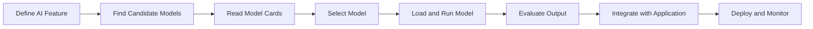
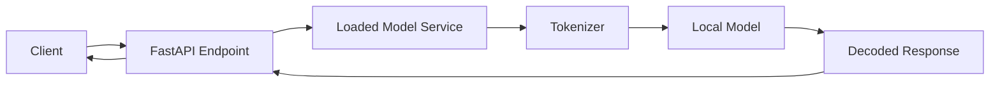
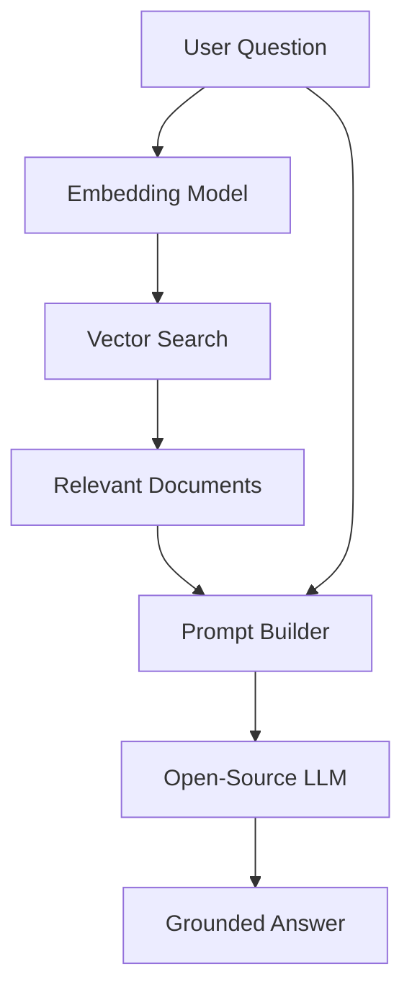
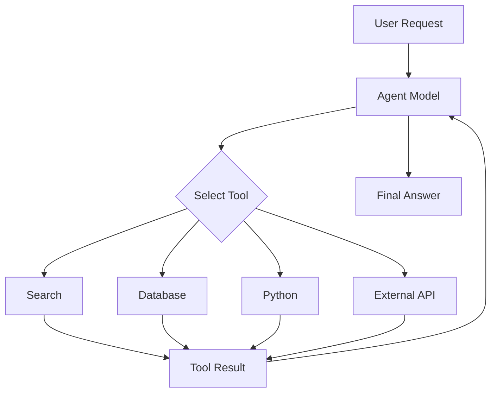
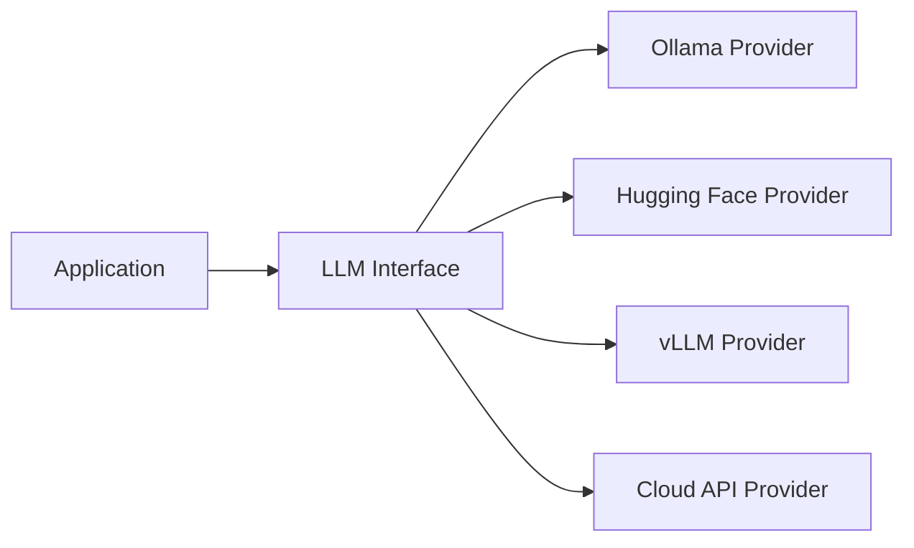
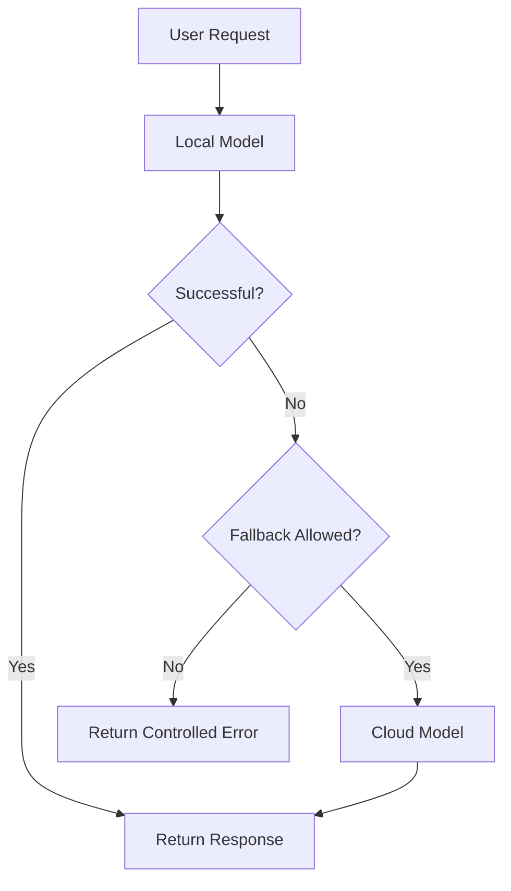
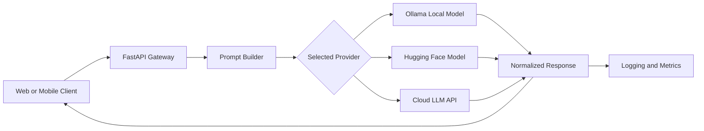

# 007 — Using Open-Source Models

**Course:** 02 — Model Platforms and Prompting
**Module:** Module 07 — Open-Source AI
**Content Group:** Hugging Face
**Roadmap Source:** Open-Source AI / Hugging Face
**Lesson Type:** Open-Source AI
**Lesson Order:** 007
**Suggested Duration:** 20 minutes

---

## 1. Lesson Summary

This lesson explains how to use open-source models in modern AI applications.

After selecting a suitable model, an AI Engineer must know how to:

* Download or access the model
* Load its tokenizer, processor, and weights
* Format inputs correctly
* Run inference locally or through an API
* Control generation parameters
* Expose the model through an application endpoint
* Measure latency and resource usage
* Handle model errors
* Evaluate output quality
* Prepare the integration for production

Open-source models can be used for many tasks:

* Chat and text generation
* Text classification
* Summarization
* Translation
* Embeddings and semantic search
* Retrieval-augmented generation
* Image classification
* Image captioning
* Speech recognition
* Text-to-speech
* Multimodal applications
* Agent tool selection

They provide more control over infrastructure, privacy, customization, and model versions than closed APIs. However, this control also creates additional engineering responsibilities.

---

## 2. Learning Objectives

After completing this lesson, you should be able to:

* Explain how open-source models are used in AI applications.
* Distinguish between local inference and hosted inference.
* Load a model using Hugging Face Transformers.
* Use the correct tokenizer, processor, or chat template.
* Run a model through a high-level pipeline.
* Run a model using lower-level model and tokenizer classes.
* Wrap a local model in a FastAPI endpoint.
* Use open-source models in a RAG pipeline.
* Identify hardware, latency, licensing, and privacy constraints.
* Debug common model-loading and inference errors.
* Evaluate whether an open-source model is ready for production.

---

## 3. What Does “Using an Open-Source Model” Mean?

Using an open-source or open-weight model usually involves several components.


For a text model:

```text
User text
    ↓
Tokenizer
    ↓
Token IDs
    ↓
Language model
    ↓
Generated token IDs
    ↓
Text decoder
    ↓
Final response
```

For an image model:

```text
Image
    ↓
Image processor
    ↓
Normalized pixel values
    ↓
Vision model
    ↓
Scores, labels, boxes, or text
    ↓
Application output
```

Using a model therefore means more than downloading a weight file. It requires a complete inference workflow.

---

## 4. Main Components of a Model Repository

A Hugging Face model repository may contain:

| Component         | Purpose                                      |
| ----------------- | -------------------------------------------- |
| Model weights     | Learned parameters used for inference        |
| Configuration     | Architecture and model settings              |
| Tokenizer         | Converts text into token IDs                 |
| Processor         | Handles text, image, or audio preprocessing  |
| Generation config | Default generation parameters                |
| Chat template     | Formats conversation messages                |
| Model card        | Documents usage, limitations, and license    |
| Example code      | Shows how to load and call the model         |
| Special tokens    | Defines padding, start, end, and role tokens |

A text model may fail or produce poor output when loaded with the wrong tokenizer.

A chat model may work technically but respond badly if the chat template is ignored.

---

## 5. Position in the AI Engineering Workflow

Using a model happens after model discovery and before production deployment.



A practical workflow is:

1. Define the application task.
2. Select a compatible model.
3. Check the model license.
4. Install the required runtime.
5. Load the model and its processor.
6. Test a small input.
7. Measure latency and memory.
8. Validate output quality.
9. Wrap the model in an application interface.
10. Add monitoring, error handling, and fallback behavior.

---

## 6. Ways to Use Open-Source Models

There are several common deployment approaches.

### 6.1 Hugging Face Transformers

Use the model directly in Python.

Best for:

* Experimentation
* Notebooks
* Custom inference logic
* Fine-grained model control
* GPU or CPU applications

### 6.2 Hugging Face Hosted Inference

Call the model through a hosted API.

Best for:

* Fast prototypes
* Applications without local GPUs
* Managed infrastructure
* Testing models before local deployment

### 6.3 Ollama

Run supported language models locally through a simple API.

Best for:

* Local AI assistants
* Development environments
* Privacy-focused applications
* Simple model switching

### 6.4 vLLM

Serve language models using a high-performance inference server.

Best for:

* Production LLM APIs
* High request volume
* Continuous batching
* OpenAI-compatible endpoints

### 6.5 llama.cpp

Run quantized language models efficiently on CPUs and consumer hardware.

Best for:

* Laptops
* Edge environments
* CPU inference
* GGUF models
* Offline applications

### 6.6 Transformers.js

Run supported models directly in the browser or JavaScript environment.

Best for:

* Browser AI
* Client-side privacy
* Offline web applications
* Small models

### 6.7 Managed Inference Endpoints

Deploy a dedicated model endpoint through a cloud service.

Best for:

* Autoscaling
* Managed GPUs
* Stable production endpoints
* Teams that do not want to manage inference servers

---

## 7. Local Inference vs Hosted Inference

| Factor             | Local Inference      | Hosted Inference            |
| ------------------ | -------------------- | --------------------------- |
| Setup              | More complex         | Simpler                     |
| Hardware           | Managed by your team | Managed by provider         |
| Privacy            | Strong control       | Depends on provider         |
| Offline support    | Possible             | Usually unavailable         |
| Scaling            | Your responsibility  | Often managed               |
| Model control      | High                 | Provider-dependent          |
| Startup cost       | Hardware required    | Usually low                 |
| Cost at scale      | Can be efficient     | Usage-based                 |
| Maintenance        | Your responsibility  | Provider responsibility     |
| Model availability | Limited by hardware  | Limited by provider support |

### Choose local inference when:

* Sensitive data must remain inside your environment.
* Offline access is required.
* You need full control over model versions.
* You already have suitable hardware.
* Inference traffic is stable and predictable.
* You need custom model modifications.

### Choose hosted inference when:

* You need to build a prototype quickly.
* You do not have GPU infrastructure.
* Traffic is unpredictable.
* You need access to larger models.
* Operational simplicity is important.
* You want to test several models quickly.

---

## 8. Method 1 — Using the Transformers Pipeline

The `pipeline` API is the simplest way to run many Hugging Face models.

### Installation

```bash
pip install transformers torch accelerate
```

### Text-generation example

```python
from transformers import pipeline


MODEL_ID = "replace-with-a-compatible-instruct-model"

generator = pipeline(
    task="text-generation",
    model=MODEL_ID,
    device_map="auto",
)

result = generator(
    "Explain vector databases in three simple bullet points.",
    max_new_tokens=150,
    do_sample=False,
)

print(result[0]["generated_text"])
```

### What the pipeline handles

The pipeline usually manages:

* Tokenization
* Model loading
* Device placement
* Input preprocessing
* Inference
* Output decoding
* Task-specific post-processing

This makes it useful for prototypes and small demos.

---

## 9. Common Pipeline Tasks

### Text classification

```python
from transformers import pipeline


classifier = pipeline(
    task="text-classification",
    model="replace-with-a-classification-model",
)

result = classifier(
    "The application is fast and easy to use."
)

print(result)
```

Possible output:

```json
[
  {
    "label": "POSITIVE",
    "score": 0.998
  }
]
```

---

### Summarization

```python
from transformers import pipeline


summarizer = pipeline(
    task="summarization",
    model="replace-with-a-summarization-model",
)

document = """
Open-source AI models allow developers to inspect, host, evaluate,
and sometimes modify the models used in their applications. They can
improve privacy and infrastructure control, but require additional
deployment, monitoring, and evaluation work.
"""

result = summarizer(
    document,
    max_length=60,
    min_length=20,
    do_sample=False,
)

print(result[0]["summary_text"])
```

---

### Embedding generation

```python
from sentence_transformers import SentenceTransformer


model = SentenceTransformer(
    "sentence-transformers/all-MiniLM-L6-v2"
)

sentences = [
    "How do I reset my password?",
    "I forgot the password for my account.",
]

embeddings = model.encode(
    sentences,
    normalize_embeddings=True,
)

print(embeddings.shape)
```

Embeddings can be used for:

* Semantic search
* RAG
* Document clustering
* Recommendation systems
* Duplicate detection
* Similarity comparison

---

## 10. Method 2 — Loading the Tokenizer and Model Directly

The direct approach provides more control than the pipeline API.

```python
import torch
from transformers import AutoModelForCausalLM, AutoTokenizer


MODEL_ID = "replace-with-a-compatible-language-model"

tokenizer = AutoTokenizer.from_pretrained(MODEL_ID)

model = AutoModelForCausalLM.from_pretrained(
    MODEL_ID,
    torch_dtype=torch.float16,
    device_map="auto",
)

prompt = "Explain the difference between embeddings and tokens."

inputs = tokenizer(
    prompt,
    return_tensors="pt",
).to(model.device)

with torch.inference_mode():
    outputs = model.generate(
        **inputs,
        max_new_tokens=150,
        do_sample=False,
    )

generated_tokens = outputs[0][inputs["input_ids"].shape[1]:]

response = tokenizer.decode(
    generated_tokens,
    skip_special_tokens=True,
)

print(response)
```

### Why use the direct approach?

It allows you to control:

* Tokenization
* Device placement
* Precision
* Attention implementation
* Generation configuration
* Batch processing
* Prompt formatting
* Raw model outputs
* Hidden states
* Logits
* Caching behavior

---

## 11. Using Chat Models Correctly

Chat models normally require a model-specific chat template.

```python
from transformers import AutoModelForCausalLM, AutoTokenizer


MODEL_ID = "replace-with-a-chat-model"

tokenizer = AutoTokenizer.from_pretrained(MODEL_ID)

model = AutoModelForCausalLM.from_pretrained(
    MODEL_ID,
    device_map="auto",
)

messages = [
    {
        "role": "system",
        "content": "You are a practical AI engineering tutor.",
    },
    {
        "role": "user",
        "content": "Explain when local inference is useful.",
    },
]

prompt = tokenizer.apply_chat_template(
    messages,
    tokenize=False,
    add_generation_prompt=True,
)

inputs = tokenizer(
    prompt,
    return_tensors="pt",
).to(model.device)

outputs = model.generate(
    **inputs,
    max_new_tokens=200,
    do_sample=False,
)

new_tokens = outputs[0][inputs["input_ids"].shape[1]:]

response = tokenizer.decode(
    new_tokens,
    skip_special_tokens=True,
)

print(response)
```

### Why the chat template matters

Different chat models may expect formats such as:

```text
<system>
You are a helpful assistant.
</system>

<user>
Explain semantic search.
</user>

<assistant>
```

Another model may use:

```text
[INST] Explain semantic search. [/INST]
```

Using an incorrect format can cause:

* Poor instruction following
* Repeated role names
* Empty responses
* Prompt leakage
* Repeated output
* Unstable conversations

Always inspect the model card and tokenizer configuration.

---

## 12. Important Generation Parameters

Text-generation behavior is controlled by several parameters.

| Parameter            | Purpose                                       |
| -------------------- | --------------------------------------------- |
| `max_new_tokens`     | Maximum number of generated tokens            |
| `temperature`        | Controls randomness                           |
| `top_p`              | Limits generation to likely token groups      |
| `top_k`              | Limits generation to the top token candidates |
| `do_sample`          | Enables probabilistic sampling                |
| `repetition_penalty` | Reduces repeated output                       |
| `num_beams`          | Enables beam search                           |
| `eos_token_id`       | Defines when generation should stop           |

### Deterministic generation

Useful for:

* Classification
* Data extraction
* Structured JSON
* Testing
* Reproducible outputs

```python
output = model.generate(
    **inputs,
    max_new_tokens=100,
    do_sample=False,
)
```

### Creative generation

Useful for:

* Stories
* Brainstorming
* Marketing copy
* Creative assistants

```python
output = model.generate(
    **inputs,
    max_new_tokens=200,
    do_sample=True,
    temperature=0.8,
    top_p=0.9,
)
```

### Important warning

Increasing temperature does not improve model intelligence.

It only increases output variation.

---

## 13. Hardware and Precision

Model memory usage depends heavily on numerical precision.

| Precision | Approximate Memory per Parameter |
| --------- | -------------------------------: |
| FP32      |                          4 bytes |
| FP16      |                          2 bytes |
| BF16      |                          2 bytes |
| INT8      |                           1 byte |
| INT4      |                         0.5 byte |

A rough estimate for model weight memory is:

```text
Memory ≈ Parameters × Bytes per parameter
```

For a 7-billion-parameter model:

```text
FP32 ≈ 28 GB
FP16 ≈ 14 GB
INT8 ≈ 7 GB
INT4 ≈ 3.5 GB
```

Actual inference memory is higher because the runtime also needs:

* KV cache
* Activations
* Tokenizer memory
* CUDA kernels
* Temporary buffers
* Framework overhead

---

## 14. Quantization

Quantization reduces model memory by storing weights using fewer bits.

Common formats include:

* INT8
* INT4
* GPTQ
* AWQ
* GGUF
* bitsandbytes quantization

### Example with 4-bit quantization

```python
from transformers import (
    AutoModelForCausalLM,
    AutoTokenizer,
    BitsAndBytesConfig,
)


MODEL_ID = "replace-with-a-supported-model"

quantization_config = BitsAndBytesConfig(
    load_in_4bit=True,
)

tokenizer = AutoTokenizer.from_pretrained(MODEL_ID)

model = AutoModelForCausalLM.from_pretrained(
    MODEL_ID,
    quantization_config=quantization_config,
    device_map="auto",
)
```

### Benefits

* Lower memory usage
* Ability to run larger models
* Reduced hardware cost
* Faster weight loading

### Trade-offs

* Possible quality loss
* Runtime compatibility issues
* Hardware-specific limitations
* Slower execution in some environments
* More difficult debugging

---

## 15. Running a Model with Ollama

Ollama provides a simple way to run supported models locally.

### Pull a model

```bash
ollama pull llama3.2
```

### Run it interactively

```bash
ollama run llama3.2
```

### Call the local API

```bash
curl http://localhost:11434/api/chat \
  -d '{
    "model": "llama3.2",
    "messages": [
      {
        "role": "user",
        "content": "Explain local inference in simple terms."
      }
    ],
    "stream": false
  }'
```

### Python example

```python
import requests


def chat_with_ollama(prompt: str) -> str:
    response = requests.post(
        "http://localhost:11434/api/chat",
        json={
            "model": "llama3.2",
            "messages": [
                {
                    "role": "user",
                    "content": prompt,
                }
            ],
            "stream": False,
        },
        timeout=120,
    )

    response.raise_for_status()

    payload = response.json()
    return payload["message"]["content"]


print(
    chat_with_ollama(
        "Give three benefits of using open-source models."
    )
)
```

---

## 16. Wrapping a Local Model with FastAPI

A model should normally be loaded once when the application starts.

Do not reload the model for every request.



### FastAPI example

```python
from contextlib import asynccontextmanager
from typing import Any

from fastapi import FastAPI, HTTPException
from pydantic import BaseModel, Field
from transformers import pipeline


generator: Any = None


class GenerationRequest(BaseModel):
    prompt: str = Field(min_length=1, max_length=4000)
    max_new_tokens: int = Field(default=150, ge=1, le=500)


class GenerationResponse(BaseModel):
    text: str


@asynccontextmanager
async def lifespan(app: FastAPI):
    global generator

    generator = pipeline(
        task="text-generation",
        model="replace-with-a-compatible-model",
        device_map="auto",
    )

    yield

    generator = None


app = FastAPI(
    title="Local Model API",
    lifespan=lifespan,
)


@app.post(
    "/generate",
    response_model=GenerationResponse,
)
def generate_text(
    request: GenerationRequest,
) -> GenerationResponse:
    if generator is None:
        raise HTTPException(
            status_code=503,
            detail="The model is not ready.",
        )

    try:
        result = generator(
            request.prompt,
            max_new_tokens=request.max_new_tokens,
            do_sample=False,
        )

        generated_text = result[0]["generated_text"]

        return GenerationResponse(
            text=generated_text,
        )

    except RuntimeError as exc:
        raise HTTPException(
            status_code=500,
            detail=f"Model inference failed: {exc}",
        ) from exc
```

### Run the API

```bash
uvicorn main:app --host 0.0.0.0 --port 8000
```

### Test it

```bash
curl -X POST http://localhost:8000/generate \
  -H "Content-Type: application/json" \
  -d '{
    "prompt": "Explain RAG in two sentences.",
    "max_new_tokens": 100
  }'
```

---

## 17. Recommended Application Structure

Avoid placing all model logic directly inside an API route.

```text
app/
├── main.py
├── api/
│   └── routes.py
├── models/
│   ├── schemas.py
│   └── loader.py
├── services/
│   └── generation_service.py
├── config/
│   └── settings.py
└── tests/
    └── test_generation.py
```

### Responsibilities

| File                    | Responsibility                  |
| ----------------------- | ------------------------------- |
| `main.py`               | Application startup             |
| `routes.py`             | HTTP routes                     |
| `schemas.py`            | Request and response validation |
| `loader.py`             | Model and tokenizer loading     |
| `generation_service.py` | Prompting and inference         |
| `settings.py`           | Environment configuration       |
| `tests/`                | Unit and integration tests      |

---

## 18. Using Open-Source Models in RAG

A RAG pipeline combines retrieval with generation.



### Main model components

A RAG application may use:

1. An embedding model
2. A reranking model
3. A generation model
4. An optional safety classifier

### Simplified RAG example

```python
from sentence_transformers import SentenceTransformer
import numpy as np


documents = [
    "FastAPI is a Python framework for building APIs.",
    "Ollama provides a local interface for running language models.",
    "Hugging Face hosts models, datasets, and AI applications.",
]

embedding_model = SentenceTransformer(
    "sentence-transformers/all-MiniLM-L6-v2"
)

document_embeddings = embedding_model.encode(
    documents,
    normalize_embeddings=True,
)


def retrieve(query: str, top_k: int = 2) -> list[str]:
    query_embedding = embedding_model.encode(
        [query],
        normalize_embeddings=True,
    )[0]

    scores = document_embeddings @ query_embedding

    top_indices = np.argsort(scores)[::-1][:top_k]

    return [documents[index] for index in top_indices]


query = "How can I run a language model locally?"
context = retrieve(query)

prompt = f"""
Answer the question using only the context below.

Context:
{context}

Question:
{query}
"""

print(prompt)
```

The prompt can then be sent to a local instruction model.

---

## 19. Using Open-Source Models as Agent Controllers

An agent model selects tools and uses their results.



A useful agent model should be evaluated for:

* Tool-selection accuracy
* Argument generation
* Structured JSON reliability
* Multi-step reasoning
* Error recovery
* Context management
* Ability to stop after task completion

Fluent text generation alone does not make a model a reliable agent.

---

## 20. Model Abstraction Layer

A production application should avoid depending directly on one provider or runtime.



### Python interface example

```python
from abc import ABC, abstractmethod


class LanguageModel(ABC):
    @abstractmethod
    def generate(self, prompt: str) -> str:
        """Generate a response from the model."""
        raise NotImplementedError


class OllamaModel(LanguageModel):
    def generate(self, prompt: str) -> str:
        return "Response from Ollama"


class HuggingFaceModel(LanguageModel):
    def generate(self, prompt: str) -> str:
        return "Response from Hugging Face"


def answer_question(
    model: LanguageModel,
    question: str,
) -> str:
    return model.generate(question)
```

Benefits include:

* Easier model replacement
* A/B testing
* Local and cloud fallback
* Cleaner tests
* Reduced vendor lock-in
* Unified logging

---

## 21. Evaluation Before Integration

Do not evaluate a model using only one prompt.

Create a representative test set.

### Example test categories

| Category          | Example                           |
| ----------------- | --------------------------------- |
| Normal request    | Explain semantic search           |
| Long input        | Summarize a long document         |
| Structured output | Return valid JSON                 |
| Multilingual      | Answer in Vietnamese              |
| Ambiguous request | Handle missing context            |
| Safety            | Reject an unsafe request          |
| Hallucination     | Answer from supplied context only |
| Edge case         | Empty or malformed input          |

### Simple evaluation structure

```python
from dataclasses import dataclass
from time import perf_counter
from typing import Callable


@dataclass
class TestCase:
    name: str
    prompt: str
    expected_keywords: list[str]


@dataclass
class TestResult:
    name: str
    output: str
    latency_seconds: float
    keyword_score: float


def evaluate(
    generate: Callable[[str], str],
    cases: list[TestCase],
) -> list[TestResult]:
    results: list[TestResult] = []

    for case in cases:
        start = perf_counter()
        output = generate(case.prompt)
        latency = perf_counter() - start

        normalized_output = output.lower()

        matches = sum(
            keyword.lower() in normalized_output
            for keyword in case.expected_keywords
        )

        score = matches / max(
            len(case.expected_keywords),
            1,
        )

        results.append(
            TestResult(
                name=case.name,
                output=output,
                latency_seconds=latency,
                keyword_score=score,
            )
        )

    return results
```

---

## 22. Metrics to Measure

### Quality metrics

Depending on the task:

* Accuracy
* Precision
* Recall
* F1 score
* Exact match
* ROUGE
* BLEU
* Retrieval precision
* Retrieval recall
* Human rating
* Hallucination rate
* Structured-output validity

### Performance metrics

* Model loading time
* Time to first token
* Total response time
* Tokens per second
* Peak memory usage
* CPU utilization
* GPU utilization
* Requests per second
* Queue time
* Error rate

### Product metrics

* User satisfaction
* Task completion rate
* Retry rate
* Escalation rate
* Cost per successful request
* Response acceptance rate

---

## 23. Logging and Observability

A production model service should log enough information to debug problems without exposing sensitive user data.

### Useful fields

```json
{
  "request_id": "req_123",
  "model_id": "organization/model-name",
  "model_version": "revision-hash",
  "input_tokens": 320,
  "output_tokens": 145,
  "load_time_ms": 0,
  "inference_time_ms": 1840,
  "total_time_ms": 1920,
  "status": "success",
  "device": "cuda:0"
}
```

### Avoid logging

* Passwords
* API keys
* Personal identifiers
* Private documents
* Full user messages without consent
* Unfiltered model prompts containing sensitive context

---

## 24. Common Production Errors

### 24.1 Model not found

```text
Repository Not Found
```

Possible causes:

* Incorrect model ID
* Private repository
* Authentication required
* Model removed or renamed

Possible fixes:

* Verify the repository name.
* Authenticate with a valid token.
* Check model access requirements.
* Pin a known model revision.

---

### 24.2 CUDA out of memory

```text
CUDA out of memory
```

Possible fixes:

* Use a smaller model.
* Use FP16 or BF16.
* Use INT8 or INT4 quantization.
* Reduce batch size.
* Reduce context length.
* Reduce output length.
* Enable CPU offloading.
* Clear unused GPU memory.

---

### 24.3 Incorrect output format

Possible causes:

* Wrong chat template
* Weak prompt
* Base model used instead of an instruction model
* Sampling parameters too random
* Missing JSON validation

Possible fixes:

* Apply the official chat template.
* Use deterministic generation.
* Add an output schema.
* Validate and retry invalid outputs.
* Use a model trained for structured generation.

---

### 24.4 Repeated text

Possible fixes:

```python
outputs = model.generate(
    **inputs,
    max_new_tokens=200,
    repetition_penalty=1.1,
    no_repeat_ngram_size=3,
)
```

Also check:

* Incorrect prompt formatting
* Missing end-of-sequence token
* Excessive output length
* Poor model-task compatibility

---

### 24.5 Slow first request

This may be caused by:

* Model download
* Weight loading
* CUDA initialization
* Kernel compilation
* Provider cold start

Possible fixes:

* Download weights during deployment.
* Load the model during application startup.
* Run a warm-up request.
* Keep at least one instance active.
* Use a smaller or quantized model.

---

### 24.6 Input exceeds context length

Possible fixes:

* Truncate input carefully.
* Summarize old conversation turns.
* Use document chunking.
* Retrieve only relevant context.
* Select a model with a larger context window.
* Limit output tokens.

Remember:

```text
Input tokens + output tokens ≤ model context limit
```

---

### 24.7 Dependency incompatibility

Possible symptoms:

* Missing model class
* Unsupported configuration
* Tokenizer errors
* Incorrect tensor shapes

Possible fixes:

* Check the model card.
* Use the recommended Transformers version.
* Update or pin dependencies.
* Test in a clean virtual environment.
* Review whether `trust_remote_code` is required.

---

## 25. Safety and Security Considerations

Running an open-source model does not automatically make the application safe.

You may still need:

* Input validation
* Prompt injection protection
* Output filtering
* Rate limiting
* Authentication
* Authorization
* Data isolation
* Tool permission checks
* Content moderation
* Audit logging

### Remote model code

Some repositories require:

```python
trust_remote_code=True
```

This may execute custom Python code from the model repository.

Only enable it after reviewing and trusting the source.

```python
model = AutoModelForCausalLM.from_pretrained(
    MODEL_ID,
    trust_remote_code=True,
)
```

Treat this option as a code-execution decision, not a normal model parameter.

---

## 26. Licensing Considerations

Before deployment, confirm:

* Commercial use is allowed.
* Redistribution is allowed.
* Fine-tuning is allowed.
* Model outputs can be used for your product.
* Attribution is included when required.
* Usage restrictions are understood.
* The selected model revision has the expected license.

Do not assume that:

```text
Publicly downloadable = unrestricted
```

Open weights, open source, and permissive commercial licensing are different concepts.

---

## 27. Version Pinning

Do not depend permanently on an unpinned `main` branch.

```python
tokenizer = AutoTokenizer.from_pretrained(
    MODEL_ID,
    revision="specific-commit-hash",
)

model = AutoModelForCausalLM.from_pretrained(
    MODEL_ID,
    revision="specific-commit-hash",
)
```

Pinning a revision improves:

* Reproducibility
* Rollback capability
* Testing consistency
* Security review
* Production stability

Also pin Python dependencies:

```text
transformers==X.Y.Z
torch==X.Y.Z
accelerate==X.Y.Z
```

---

## 28. Model Fallback Strategy

A production application may require a fallback when the local model fails.



Possible fallback triggers:

* Model unavailable
* GPU memory error
* Timeout
* Unsupported language
* Context too long
* Quality threshold not met
* Local server offline

The fallback policy must also respect privacy rules.

Sensitive input should not be sent automatically to an external API without permission.

---

## 29. Practical Demo

### Input

A small AI feature:

```text
Create a local assistant that explains AI engineering concepts.
```

### Process

```text
1. Select an instruction-tuned model.
2. Check its license and hardware requirements.
3. Run it using Ollama or Transformers.
4. Create a reusable model service.
5. Expose it through FastAPI.
6. Add request validation.
7. Log latency and model version.
8. Test normal and edge-case prompts.
9. Compare the result with a cloud LLM.
```

### Output

A working endpoint:

```text
POST /api/v1/chat
```

Request:

```json
{
  "message": "Explain vector databases in simple terms."
}
```

Response:

```json
{
  "answer": "A vector database stores numerical representations...",
  "model": "local-model-name",
  "latency_ms": 1420
}
```

---

## 30. Practical Exercises

### Exercise 1 — Five-line summary

Without reading the lesson, write five lines explaining:

1. What open-source model inference is
2. What a tokenizer does
3. Why chat templates matter
4. How local inference differs from hosted inference
5. What must be measured before production

---

### Exercise 2 — Run a text model

Choose one model and record:

```markdown
| Item | Result |
|---|---|
| Model ID | |
| Task | |
| Model size | |
| License | |
| Runtime | |
| Device | |
| Load time | |
| Response latency | |
| Peak memory | |
| Main limitation | |
```

---

### Exercise 3 — Build an API

Create a FastAPI endpoint that:

* Accepts a prompt
* Validates its length
* Calls a local model
* Returns the generated response
* Includes latency metadata
* Handles inference errors

---

### Exercise 4 — Add logging

Log:

* Request ID
* Model name
* Model version
* Input length
* Output length
* Inference latency
* Success or failure

Do not log sensitive prompt content.

---

### Exercise 5 — Compare local and cloud models

Run the same ten prompts through:

1. A local open-source model
2. A closed cloud API

Compare:

| Criterion           | Local Model | Cloud Model |
| ------------------- | ----------: | ----------: |
| Quality             |             |             |
| First-token latency |             |             |
| Total latency       |             |             |
| Cost                |             |             |
| Privacy             |             |             |
| Structured output   |             |             |
| Setup complexity    |             |             |
| Reliability         |             |             |

---

## 31. Common Mistakes

### Mistake 1 — Reloading the model for every request

This creates extremely slow responses and unnecessary memory usage.

Load the model once during startup.

### Mistake 2 — Ignoring the chat template

The model may produce poor or malformed responses.

### Mistake 3 — Running a model that does not fit the hardware

Estimate memory before downloading a large model.

### Mistake 4 — Testing only one prompt

Use a representative evaluation set.

### Mistake 5 — Ignoring model versions

A model update may change application behavior.

### Mistake 6 — Using random generation for structured output

Use deterministic settings and validate the result.

### Mistake 7 — Sending sensitive fallback data to a cloud API

Fallback behavior must respect privacy policies.

### Mistake 8 — Assuming local inference is free

Local inference still requires:

* Hardware
* Electricity
* Engineering time
* Monitoring
* Storage
* Maintenance

### Mistake 9 — Treating a successful demo as production readiness

A working notebook does not prove that the model can handle:

* Concurrent traffic
* Timeouts
* Long inputs
* Unsafe prompts
* Hardware failure
* Version changes
* Memory pressure

---

## 32. Completion Checklist

* [ ] I can explain how open-source models are used.
* [ ] I understand the role of the tokenizer and processor.
* [ ] I can load a model using a Transformers pipeline.
* [ ] I can load a model using tokenizer and model classes.
* [ ] I know how to apply a chat template.
* [ ] I understand the main generation parameters.
* [ ] I can compare local and hosted inference.
* [ ] I can run a model through Ollama or another local runtime.
* [ ] I can expose a model through FastAPI.
* [ ] I can use an embedding model in a simple retrieval pipeline.
* [ ] I can measure latency and memory usage.
* [ ] I know how to debug model-loading failures.
* [ ] I understand quantization and its trade-offs.
* [ ] I have checked the model license.
* [ ] I have documented at least one limitation.
* [ ] I have tested at least one edge case.

---

## 33. Related Outcome

After completing this lesson, you should know when to use:

* Closed commercial APIs
* Hugging Face Transformers
* Hugging Face hosted inference
* Ollama
* llama.cpp
* vLLM
* Transformers.js
* Managed inference endpoints
* Local CPU or GPU inference

The decision should consider:

* Quality
* Latency
* Hardware
* Cost
* Privacy
* Scaling
* Licensing
* Maintenance
* User experience

---

## 34. Related Project

### Project 6 — Local AI Assistant

Build a local AI assistant using:

* Ollama for model inference
* FastAPI for the backend
* A simple web or mobile client
* A cloud LLM API for comparison
* Structured logging
* Model fallback configuration

### Suggested architecture



### Suggested API routes

```text
POST /api/v1/chat
GET  /api/v1/models
GET  /api/v1/health
GET  /api/v1/metrics
```

### Recommended comparison metrics

```json
{
  "model": "model-name",
  "provider": "ollama",
  "input_tokens": 250,
  "output_tokens": 120,
  "time_to_first_token_ms": 420,
  "total_latency_ms": 1850,
  "tokens_per_second": 32.4,
  "estimated_cost": 0,
  "success": true
}
```

---

## 35. Key Takeaways

Using an open-source model requires a complete engineering workflow.

```text
Select a suitable model
        ↓
Review license and model card
        ↓
Install the required runtime
        ↓
Load tokenizer or processor
        ↓
Load model weights
        ↓
Format the input correctly
        ↓
Run inference
        ↓
Decode and validate output
        ↓
Measure quality and performance
        ↓
Integrate with the application
        ↓
Deploy, monitor, and improve
```

Remember:

* Use the correct tokenizer and processor.
* Apply the model's official chat template.
* Load the model once, not once per request.
* Start with high-level pipelines, then use lower-level APIs when more control is required.
* Use quantization when hardware memory is limited.
* Measure latency, memory, output quality, and error rates.
* Pin model and dependency versions.
* Validate structured outputs.
* Protect private user data.
* Review custom remote code before enabling it.
* Check the license before commercial deployment.
* Build fallback behavior carefully.
* Test real user inputs and failure cases.

The goal is not merely to make a model produce an answer.

The goal is to build a reliable, measurable, secure, and maintainable AI feature around that model.
