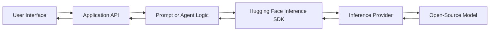
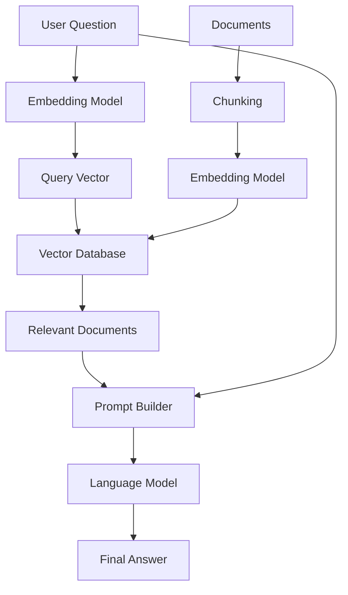
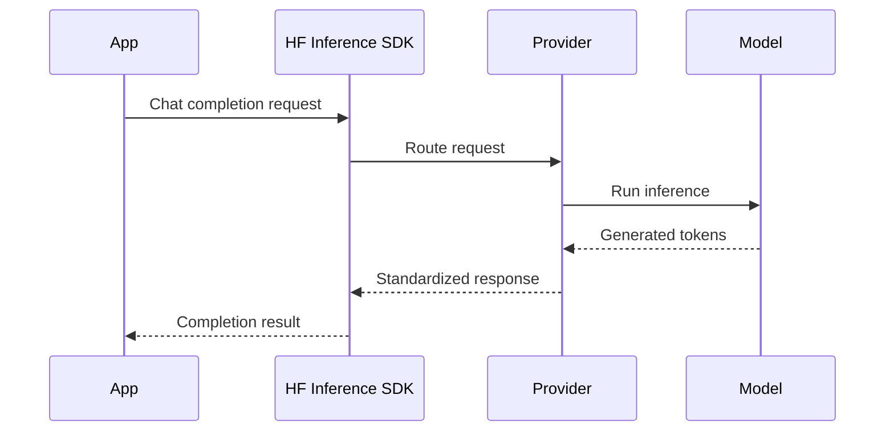
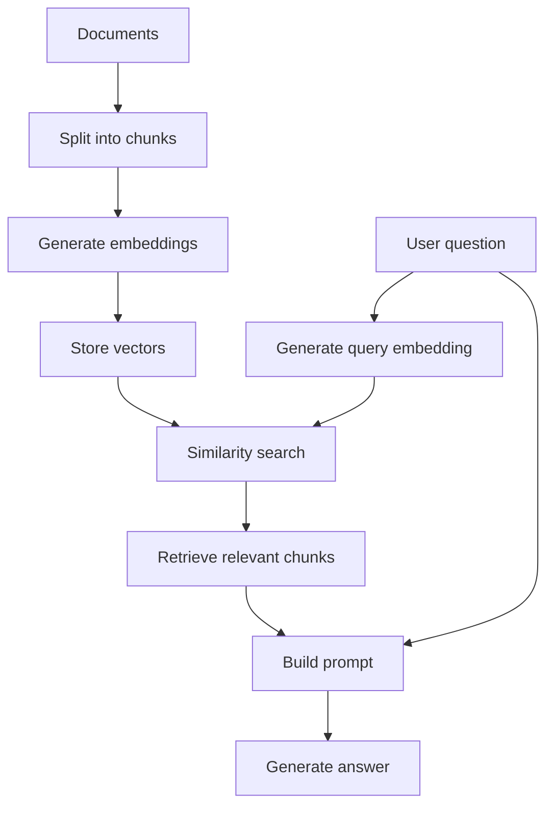
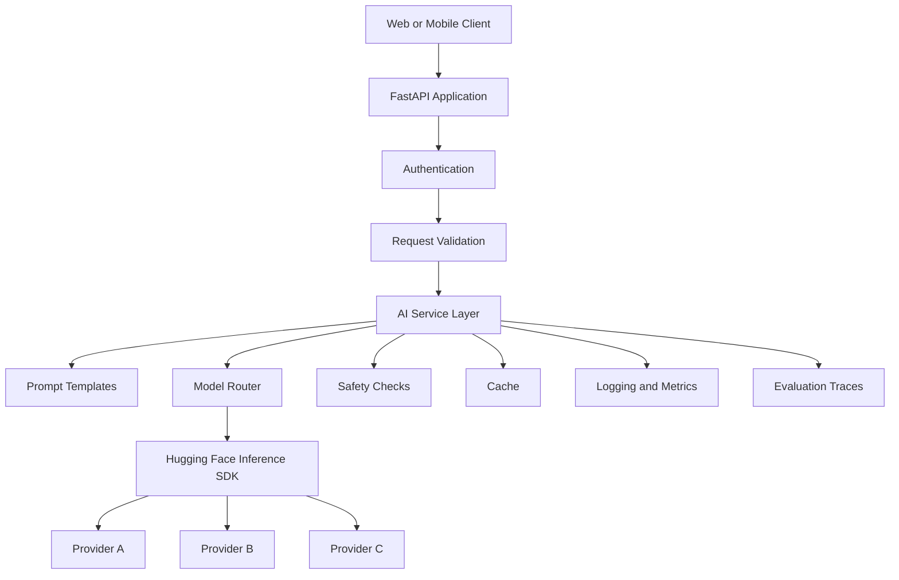
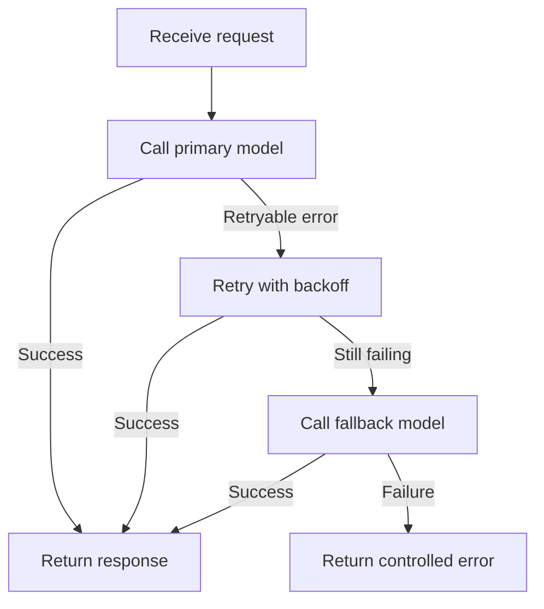

# 008 — Hugging Face Inference SDK

**Course:** 02 — Model Platforms and Prompting
**Module:** Module 07 — Open-Source AI
**Content Group:** Hugging Face
**Roadmap Source:** Open-Source AI / Hugging Face
**Lesson Type:** Open-Source AI
**Lesson Order:** 008
**Suggested Duration:** 20 minutes

---

## 1. Overview

The **Hugging Face Inference SDK** provides a unified way to access open-source models hosted by different inference providers.

Instead of integrating a separate SDK for every provider, developers can use one interface to call many types of models, including:

* Large language models
* Vision-language models
* Embedding models
* Text-to-image models
* Text-to-video models
* Speech-to-text models
* Feature-extraction models

The SDK is available for both **Python** and **JavaScript**.

Its main advantage is abstraction: your application can change models or inference providers without rewriting the entire integration.

> The SDK does not remove the need to evaluate models. It makes model access and provider switching easier.

---

## 2. Learning Objectives

By the end of this lesson, you should be able to:

* Explain what the Hugging Face Inference SDK does.
* Describe the role of inference providers.
* Find models that support hosted inference.
* Authenticate with a Hugging Face access token.
* Call an open-source language model from Python.
* Generate an image through the same SDK.
* Create embeddings for a RAG application.
* Switch between models and providers with minimal code changes.
* Identify production concerns such as latency, cost, privacy and reliability.

---

## 3. Why an Inference SDK Is Needed

Hugging Face hosts a large collection of open-source models. However, storing a model in a repository is different from serving it in production.

Running a model yourself may require:

* GPUs or other accelerators
* Model-loading infrastructure
* Autoscaling
* Request batching
* Monitoring
* Quantization
* Memory management
* Availability management
* Security controls

Inference providers operate this infrastructure and expose models through APIs.

Examples may include providers specializing in:

* Low-latency LLM inference
* Serverless GPU workloads
* Image generation
* Large-context models
* Specialized hardware acceleration

Without a unified SDK, an application may need a separate integration for every provider.

```text
Application
   │
   ├── Provider A SDK
   ├── Provider B SDK
   ├── Provider C SDK
   └── Provider D SDK
```

The Hugging Face Inference SDK introduces a shared interface:

```text
Application
   │
   ▼
Hugging Face Inference SDK
   │
   ├── Inference Provider A
   ├── Inference Provider B
   ├── Inference Provider C
   └── Hugging Face Inference
          │
          ▼
     Open-Source Models
```

This separation makes it easier to experiment, compare models and change providers.

---

## 4. Core Concepts

### 4.1 Model Repository

A model repository contains resources such as:

* Model weights
* Configuration files
* Tokenizer files
* Model card
* License information
* Usage examples
* Supported tasks
* Evaluation results

A model being available on the Hugging Face Hub does not automatically mean that it is available through hosted inference.

You should enable the **Inference Available** filter when searching for models that can be called through an inference provider.

---

### 4.2 Inference Provider

An inference provider runs a model on managed infrastructure and exposes it through an API.

The provider is responsible for areas such as:

* Loading the model
* Managing hardware
* Processing requests
* Scaling capacity
* Returning responses
* Tracking usage

Different providers may support different models, hardware and pricing structures.

---

### 4.3 Inference Client

The `InferenceClient` class from the `huggingface_hub` package is the main Python interface.

```python
from huggingface_hub import InferenceClient
```

The client can be reused for different tasks:

```text
InferenceClient
   │
   ├── Chat completion
   ├── Text generation
   ├── Feature extraction
   ├── Text-to-image
   ├── Speech recognition
   └── Other supported tasks
```

---

### 4.4 Provider Selection

Depending on the selected model and SDK version, you may be able to:

* Specify a particular provider.
* Allow Hugging Face to select an available provider.
* Prefer a faster provider.
* Prefer a cheaper provider.

Provider availability can change, so production applications should not assume that every model is always available through every provider.

---

### 4.5 OpenAI-Compatible API

Some Hugging Face inference endpoints support an OpenAI-compatible interface.

This is useful when an application already uses the OpenAI SDK.

The application may only need to change:

* The base URL
* The API token
* The model identifier

Conceptually:

```python
from openai import OpenAI

client = OpenAI(
    base_url="HUGGING_FACE_COMPATIBLE_BASE_URL",
    api_key="YOUR_HF_TOKEN",
)
```

This can reduce migration effort, but API compatibility should still be tested carefully. Provider-specific fields and model behavior may differ.

---

## 5. Where It Fits in an AI Application

The Inference SDK is part of the model-access layer.



For a RAG application, the SDK may be used in more than one place:



The embedding model and generation model can come from different providers while still being accessed through a similar interface.

---

## 6. Selecting a Model

A practical model-selection workflow is:

1. Open the Hugging Face model catalog.
2. Enable the **Inference Available** filter.
3. Filter by task.
4. Read the model card.
5. Check the license.
6. Inspect available inference providers.
7. Review example code.
8. Test the model using representative inputs.
9. Measure quality, latency and cost.

### Common task filters

| Application need     | Hugging Face task                  |
| -------------------- | ---------------------------------- |
| Chatbot              | Text generation or chat completion |
| Multimodal assistant | Image-text-to-text                 |
| RAG retrieval        | Feature extraction                 |
| Semantic search      | Feature extraction                 |
| Image generator      | Text-to-image                      |
| Transcription        | Automatic speech recognition       |
| Classification       | Text classification                |
| Summarization        | Summarization                      |

Do not select a model only because it has many downloads.

Evaluate whether it matches:

* Your language
* Your domain
* Your latency target
* Your context-length requirements
* Your budget
* Your hardware or provider constraints
* Your commercial-use requirements

---

## 7. Authentication and Setup

### 7.1 Create an Access Token

Create a Hugging Face account and generate an access token with only the permissions required for inference.

Follow the principle of least privilege:

```text
Required permission
        │
        ▼
Inference calls only
        │
        ▼
Do not enable unrelated write permissions
```

Never hardcode the token in source code or commit it to Git.

---

### 7.2 Install the Python SDK

```bash
pip install --upgrade huggingface_hub
```

---

### 7.3 Configure the Environment Variable

On macOS or Linux:

```bash
export HF_TOKEN="your-token"
```

On Windows PowerShell:

```powershell
$env:HF_TOKEN="your-token"
```

Inside a notebook, you can request the token without displaying it:

```python
import os
from getpass import getpass

if not os.getenv("HF_TOKEN"):
    os.environ["HF_TOKEN"] = getpass("Enter your Hugging Face token: ")
```

In production, store the token in a secret manager rather than in a `.env` file committed to the repository.

---

## 8. Demo 1: Chat Completion

The following example shows the general structure of a chat-completion request.

```python
import os

from huggingface_hub import InferenceClient


def create_client() -> InferenceClient:
    token = os.getenv("HF_TOKEN")

    if not token:
        raise RuntimeError(
            "HF_TOKEN is missing. Configure it as an environment variable."
        )

    return InferenceClient(api_key=token)


def ask_model(question: str) -> str:
    client = create_client()

    response = client.chat.completions.create(
        model="YOUR_CHAT_MODEL_ID",
        messages=[
            {
                "role": "system",
                "content": "You are a concise and accurate AI assistant.",
            },
            {
                "role": "user",
                "content": question,
            },
        ],
        max_tokens=300,
        temperature=0.2,
    )

    return response.choices[0].message.content


if __name__ == "__main__":
    answer = ask_model("What is the capital of France?")
    print(answer)
```

Expected output:

```text
The capital of France is Paris.
```

Replace `YOUR_CHAT_MODEL_ID` with a model currently available through an inference provider.

### Request flow



---

## 9. Understanding the Response

A chat-completion response commonly contains:

* Generated message content
* Assistant role
* Finish reason
* Token usage, when available
* Tool-call information, when supported
* Additional provider-specific metadata

Example inspection:

```python
response = client.chat.completions.create(
    model="YOUR_CHAT_MODEL_ID",
    messages=[
        {
            "role": "user",
            "content": "Explain vector embeddings in one sentence.",
        }
    ],
)

message = response.choices[0].message

print("Role:", message.role)
print("Content:", message.content)
```

Do not design your application around optional fields unless the selected model and provider guarantee them.

Some models or providers may return additional reasoning-related metadata. Treat such fields as provider-specific and avoid depending on hidden reasoning traces for core application logic.

---

## 10. Demo 2: Text-to-Image

The same client can call a compatible text-to-image model.

```python
import os

from huggingface_hub import InferenceClient


client = InferenceClient(api_key=os.environ["HF_TOKEN"])

image = client.text_to_image(
    prompt=(
        "A cheerful cactus wearing sunglasses, "
        "digital illustration, clean background"
    ),
    model="YOUR_TEXT_TO_IMAGE_MODEL_ID",
)

image.save("cactus_with_sunglasses.png")
```

The task-specific method changes, but the general workflow remains similar:

```text
Prompt
  │
  ▼
InferenceClient.text_to_image()
  │
  ▼
Selected provider
  │
  ▼
Image-generation model
  │
  ▼
Generated image
```

### Production considerations

Image generation often requires:

* Longer timeouts
* File-size controls
* Content moderation
* Asynchronous job handling
* Storage management
* Image-format validation
* Rate-limit handling

---

## 11. Demo 3: Embeddings for RAG

Embedding models transform text into numerical vectors.

```text
"Today is a sunny day."
        │
        ▼
Embedding model
        │
        ▼
[0.018, -0.247, 0.631, ...]
```

Example:

```python
import os

from huggingface_hub import InferenceClient


client = InferenceClient(api_key=os.environ["HF_TOKEN"])

vectors = client.feature_extraction(
    [
        "Today is a sunny day.",
        "I am going to buy some ice cream.",
    ],
    model="YOUR_EMBEDDING_MODEL_ID",
)

print("Number of embeddings:", len(vectors))
print("Vector dimension:", len(vectors[0]))
print("First five values:", vectors[0][:5])
```

These vectors can be stored in systems such as:

* PostgreSQL with `pgvector`
* Qdrant
* Weaviate
* Milvus
* Pinecone
* Chroma
* FAISS

### Minimal RAG pipeline



### Important embedding rule

Use the same embedding model and preprocessing strategy for:

* Document embeddings
* Query embeddings

Changing embedding models without rebuilding the vector index can make similarity search unreliable.

---

## 12. Demo 4: FastAPI Wrapper

A small API wrapper can isolate the SDK from the rest of the application.

```python
import os
from typing import Annotated

from fastapi import FastAPI, Header, HTTPException
from huggingface_hub import InferenceClient
from pydantic import BaseModel, Field


app = FastAPI(title="Open-Source Model Gateway")

hf_token = os.getenv("HF_TOKEN")

if not hf_token:
    raise RuntimeError("HF_TOKEN must be configured before startup.")

client = InferenceClient(api_key=hf_token)


class ChatRequest(BaseModel):
    message: str = Field(min_length=1, max_length=10_000)
    model: str = Field(min_length=1)
    max_tokens: int = Field(default=300, ge=1, le=2_000)


class ChatResponse(BaseModel):
    answer: str
    model: str


@app.post("/chat", response_model=ChatResponse)
def chat(
    request: ChatRequest,
    request_id: Annotated[str | None, Header()] = None,
) -> ChatResponse:
    try:
        response = client.chat.completions.create(
            model=request.model,
            messages=[
                {
                    "role": "system",
                    "content": "Answer accurately and concisely.",
                },
                {
                    "role": "user",
                    "content": request.message,
                },
            ],
            max_tokens=request.max_tokens,
            temperature=0.2,
        )

        answer = response.choices[0].message.content

        if not answer:
            raise HTTPException(
                status_code=502,
                detail="The inference provider returned an empty response.",
            )

        return ChatResponse(
            answer=answer,
            model=request.model,
        )

    except HTTPException:
        raise
    except Exception as exc:
        # Log the internal error and request ID in a real application.
        raise HTTPException(
            status_code=502,
            detail="The model provider could not complete the request.",
        ) from exc
```

Example request:

```bash
curl --request POST \
  --url http://localhost:8000/chat \
  --header "Content-Type: application/json" \
  --header "Request-ID: demo-001" \
  --data '{
    "message": "Explain semantic search in two sentences.",
    "model": "YOUR_CHAT_MODEL_ID",
    "max_tokens": 200
  }'
```

This wrapper provides a useful abstraction:

```text
Frontend
   │
   ▼
Application API
   │
   ▼
Internal model gateway
   │
   ▼
Hugging Face Inference SDK
   │
   ▼
Selected provider and model
```

The frontend does not need to know which external provider is being used.

---

## 13. Switching Models and Providers

One major benefit of the SDK is that model selection can be configuration-driven.

```python
from dataclasses import dataclass


@dataclass(frozen=True)
class ModelSettings:
    chat_model: str
    embedding_model: str
    image_model: str


settings = ModelSettings(
    chat_model="YOUR_CHAT_MODEL_ID",
    embedding_model="YOUR_EMBEDDING_MODEL_ID",
    image_model="YOUR_TEXT_TO_IMAGE_MODEL_ID",
)
```

Instead of scattering model IDs throughout the codebase, keep them in one configuration layer.

```text
Environment variables
        │
        ▼
Model configuration
        │
        ▼
Model service
        │
        ▼
Inference SDK
```

A model change should ideally require configuration changes rather than business-logic changes.

However, models are not perfectly interchangeable. Switching models may affect:

* Prompt format
* Output structure
* Context length
* Tool-calling behavior
* Safety behavior
* Supported languages
* Generation speed
* Token counting
* Response quality

Always run regression evaluations after switching a model or provider.

---

## 14. Model Evaluation Checklist

Before using a model in production, test it with your own data.

| Area        | Questions                                           |
| ----------- | --------------------------------------------------- |
| Quality     | Does it answer domain-specific questions correctly? |
| Language    | Does it perform well in the target language?        |
| Latency     | Are response times acceptable at p50 and p95?       |
| Cost        | What is the estimated cost per request?             |
| Context     | Can it process the required input length?           |
| Reliability | How often do requests fail or time out?             |
| Safety      | Does it handle unsafe inputs appropriately?         |
| Structure   | Does it follow JSON or schema instructions?         |
| License     | Is the intended commercial use permitted?           |
| Privacy     | Can the data be sent to this provider?              |

A high benchmark score does not guarantee that the model will work well for your application.

---

## 15. Cost and Usage

Hosted open-source inference can sometimes be less expensive than closed-model APIs, but cost depends on:

* The selected model
* The selected provider
* Input length
* Output length
* Image resolution
* Hardware requirements
* Request volume
* Provider pricing
* Free-credit availability

A useful estimation formula for text generation is:

```text
Estimated request cost
    =
Input-token cost
    +
Output-token cost
    +
Any provider-specific charge
```

For an application:

```text
Monthly inference cost
    =
Average cost per request
    ×
Monthly request volume
```

Example:

```text
$0.002 per request × 100,000 requests
= approximately $200 per month
```

Provider prices, free credits and billing rules can change. Verify the current pricing before making production decisions.

---

## 16. Common Errors

### 16.1 Invalid or Missing Token

Possible symptoms:

```text
401 Unauthorized
Invalid credentials
Token is missing
```

Checks:

* Confirm that `HF_TOKEN` is set.
* Confirm that the token has inference permission.
* Confirm that the token has not expired or been revoked.
* Do not include additional quotation marks in the environment value.

---

### 16.2 Model Is Not Available for Inference

Possible symptoms:

```text
Model is not supported
No provider is available
Task is not supported
```

Checks:

* Enable the **Inference Available** filter.
* Confirm that the selected provider supports the model.
* Confirm that the task matches the model.
* Check whether the model requires access approval.
* Try a fallback model.

---

### 16.3 Incorrect Task Method

A text-generation model should not be called through a text-to-image method.

```text
Model task
   must match
SDK method
```

Examples:

| Model task      | SDK operation                |
| --------------- | ---------------------------- |
| Chat model      | Chat completion              |
| Embedding model | Feature extraction           |
| Image model     | Text-to-image                |
| Speech model    | Automatic speech recognition |

---

### 16.4 Unexpected Response Shape

Different providers or tasks may return different optional metadata.

Do not assume that every response contains:

* Reasoning content
* Token usage
* Log probabilities
* Tool calls
* Identical finish reasons

Validate responses before reading nested fields.

---

### 16.5 Rate Limiting

Possible symptoms:

```text
429 Too Many Requests
Rate limit exceeded
Capacity unavailable
```

Use:

* Exponential backoff
* Random jitter
* Request queues
* Concurrency limits
* Provider fallback
* Response caching

Example retry delays:

```text
Attempt 1: 1 second
Attempt 2: 2 seconds
Attempt 3: 4 seconds
Attempt 4: 8 seconds
```

Avoid retrying validation errors or authentication failures.

---

### 16.6 Timeout

A large model or image-generation task may take longer than expected.

Configure separate timeout policies for:

* Chat completion
* Embeddings
* Image generation
* Video generation

Do not use one universal timeout for every task.

---

### 16.7 Embedding Dimension Mismatch

A vector database collection may expect a fixed vector size.

```text
Stored vector dimension: 1024
New model dimension:      768
Result: insertion failure
```

Before changing an embedding model:

1. Check the new vector dimension.
2. Create a new vector collection or index.
3. Re-embed all documents.
4. Validate retrieval quality.
5. Switch application traffic.

---

## 17. Production Architecture

A production application should not call the inference SDK directly from every controller.

Use a dedicated model gateway or service layer.



The service layer can manage:

* Model routing
* Prompt versions
* Provider fallback
* Timeouts
* Retries
* Caching
* Usage limits
* Cost tracking
* Safety filtering
* Structured-output validation
* Observability

---

## 18. Fallback Strategy

A resilient model service can define an ordered list of models.

```python
MODELS = [
    "PRIMARY_MODEL_ID",
    "FALLBACK_MODEL_ID",
    "SECOND_FALLBACK_MODEL_ID",
]
```

Conceptual flow:



Only switch providers or models automatically when the failure is retryable.

Examples of retryable failures:

* Timeout
* Temporary provider outage
* Rate limiting
* Capacity error

Examples of non-retryable failures:

* Invalid token
* Invalid request schema
* Unsupported task
* Input exceeding a known hard limit

---

## 19. Observability

Record enough metadata to debug requests without logging sensitive content unnecessarily.

Recommended fields:

```text
request_id
user_id or anonymized identifier
task
model_id
provider
prompt_version
input_token_count
output_token_count
latency_ms
retry_count
status
error_type
estimated_cost
timestamp
```

Example log:

```json
{
  "request_id": "req_72a8f1",
  "task": "chat_completion",
  "model_id": "configured-chat-model",
  "provider": "automatic",
  "prompt_version": "assistant-v3",
  "latency_ms": 1482,
  "retry_count": 0,
  "status": "success"
}
```

Avoid logging:

* API tokens
* Passwords
* Full personal documents
* Private user messages without a valid reason
* Raw sensitive data

---

## 20. Security and Privacy

Before sending data to an inference provider, determine:

* Whether the provider stores requests
* Whether the provider uses data for training
* Where the data is processed
* Whether encryption is supported
* Whether the provider meets organizational requirements
* Whether sensitive data must be removed first

A safe request pipeline may look like this:


Open-source model weights do not automatically make a hosted inference request private. Privacy depends on how and where the model is served.

---

## 21. Practical Exercise

Build a small Python application using the Hugging Face Inference SDK.

### Requirements

Your demo should include:

1. One chat-completion request.
2. One embedding request.
3. Environment-based token loading.
4. Basic exception handling.
5. Latency measurement.
6. Model IDs stored in configuration.
7. A short README explaining how to run it.

### Suggested structure

```text
inference-sdk-demo/
├── app.py
├── config.py
├── services/
│   ├── chat_service.py
│   └── embedding_service.py
├── tests/
│   └── test_services.py
├── .env.example
├── requirements.txt
└── README.md
```

### Optional extension

Add a FastAPI route:

```text
POST /chat
POST /embeddings
GET  /health
```

Then compare two chat models using the same ten test prompts.

Record:

* Response quality
* Average latency
* Failure count
* Estimated cost
* Output-format compliance

---

## 22. Production Debugging Exercise

Consider this failure:

```text
The application worked during development, but production requests now
fail intermittently with provider-capacity errors.
```

A useful debugging process is:

1. Check error codes and provider responses.
2. Confirm that authentication is valid.
3. Separate retryable and non-retryable errors.
4. Measure failure rates by provider and model.
5. Add exponential backoff with jitter.
6. Configure a fallback model.
7. Limit request concurrency.
8. Add alerts for sustained failure rates.
9. Test the fallback path.
10. Document the incident and prevention steps.

Do not hide every error behind unlimited retries. Excessive retries can increase cost and make an outage worse.

---

## 23. Common Learning Mistakes

### Memorizing the API without building anything

Reading documentation is not enough. Build at least one working request.

### Selecting a model only by popularity

A popular model may still perform poorly for your domain, language or latency target.

### Ignoring licensing

Open weights do not always mean unrestricted commercial use.

### Assuming all providers behave identically

Providers may differ in:

* Availability
* Performance
* Supported parameters
* Response metadata
* Rate limits
* Pricing

### Hardcoding the provider everywhere

Keep provider and model selection in configuration.

### Skipping evaluation after switching models

A one-line model change can create large quality differences.

### Exposing API tokens

Tokens must remain on the backend. Never send a secret inference token to a browser or mobile client.

### Testing only the happy path

Also test:

* Empty input
* Very long input
* Unsupported language
* Provider timeout
* Invalid model
* Rate limiting
* Malformed output
* Empty response

---

## 24. Completion Checklist

* [ ] I can explain the purpose of the Inference SDK in one or two minutes.
* [ ] I understand the difference between a model repository and an inference provider.
* [ ] I can find models that support hosted inference.
* [ ] I can create and securely load a Hugging Face token.
* [ ] I can call a chat model from Python.
* [ ] I can generate embeddings for a RAG pipeline.
* [ ] I understand how text-to-image inference uses the same client abstraction.
* [ ] I can switch model IDs without rewriting application logic.
* [ ] I have tested at least one failure scenario.
* [ ] I have recorded latency, quality and cost observations.
* [ ] I have checked the selected model’s license and model card.
* [ ] I know at least one limitation that requires further investigation.

---

## 25. Related Outcome

After completing this lesson, you should be better able to decide when to use:

* A closed commercial API
* A hosted open-source model
* Hugging Face inference providers
* A dedicated inference endpoint
* A locally hosted model
* Ollama or another local runtime

The best option depends on:

```text
Quality
+ Cost
+ Latency
+ Privacy
+ Operational complexity
+ Model control
+ Reliability requirements
```

There is no single best deployment strategy for every application.

---

## 26. Related Project

### Project 6: Local AI Assistant

Build a local AI assistant using:

* Ollama for local inference
* FastAPI as an application wrapper
* A Hugging Face hosted open-source model
* A closed cloud LLM API

Compare the three approaches.

| Area                   | Local model    | Hosted open model     | Closed cloud API    |
| ---------------------- | -------------- | --------------------- | ------------------- |
| Setup effort           | Medium to high | Low                   | Low                 |
| Infrastructure control | High           | Medium                | Low                 |
| Model selection        | High           | High                  | Limited to provider |
| Privacy control        | High           | Depends on provider   | Depends on provider |
| Scaling effort         | High           | Managed               | Managed             |
| Hardware requirement   | Local hardware | None locally          | None locally        |
| Switching flexibility  | Medium         | High with unified SDK | Provider-dependent  |
| Operational burden     | High           | Medium                | Low                 |

Your final report should explain which approach you would choose for:

* A personal prototype
* A privacy-sensitive application
* A high-traffic SaaS product
* A low-budget portfolio project
* A multilingual RAG assistant

---

## 27. Five-Line Summary

1. The Hugging Face Inference SDK provides one interface for accessing many hosted open-source models.
2. Inference providers operate the hardware and infrastructure required to serve those models.
3. The SDK supports tasks such as chat completion, embeddings and image generation.
4. A shared interface makes it easier to compare and switch models or providers.
5. Production use still requires evaluation, retries, monitoring, privacy controls and cost management.

---

## 28. Final Takeaway

The **Hugging Face Inference SDK** connects the Hugging Face model ecosystem with managed inference infrastructure.

Its value is not only that it can call an open-source model. Its larger value is that it provides a reusable abstraction across:

* Models
* Providers
* Tasks
* Application architectures

For an AI engineer, the goal is not simply to make one successful API request. The goal is to build a model-access layer that is:

* Configurable
* Testable
* Observable
* Secure
* Cost-aware
* Resilient
* Easy to replace

Turn this lesson into a working chat endpoint, embedding pipeline, multimodal demo or model-comparison report so that the knowledge becomes part of a real engineering workflow.
