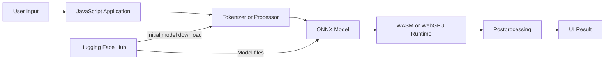
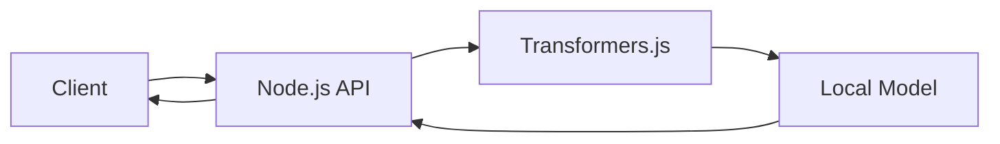
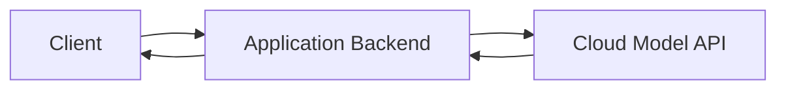
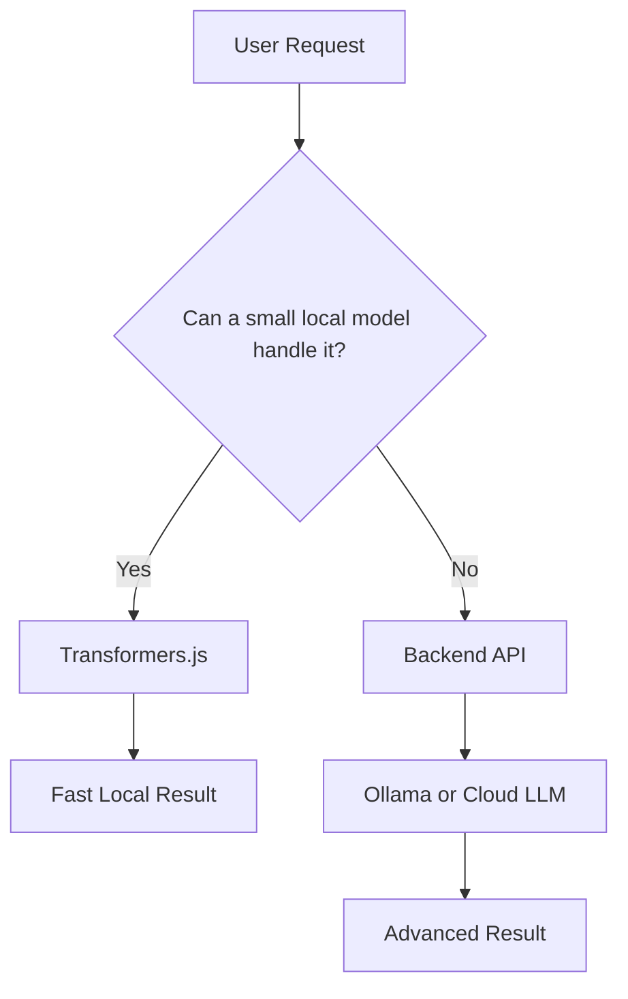
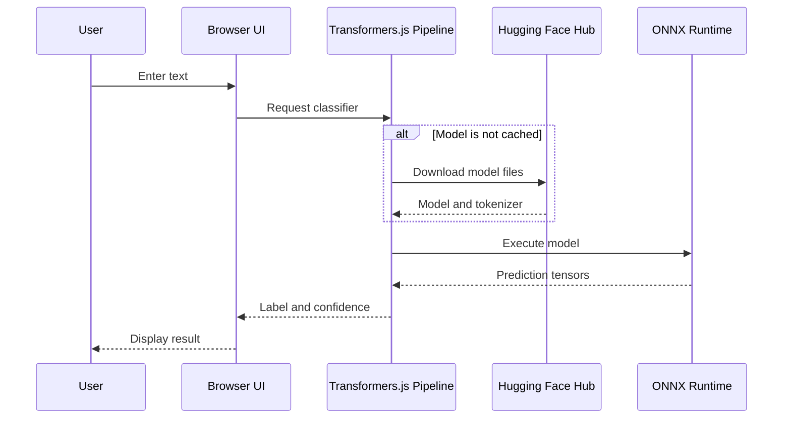
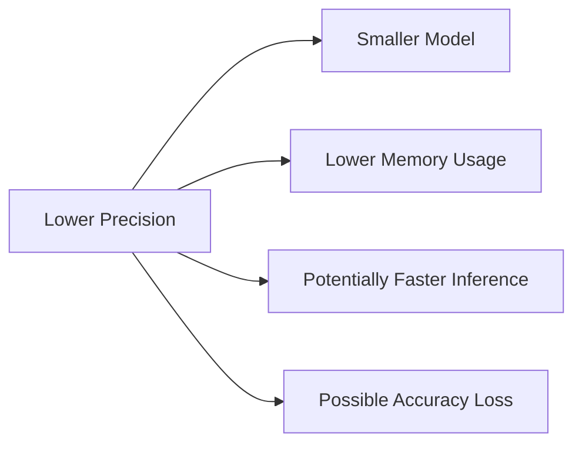
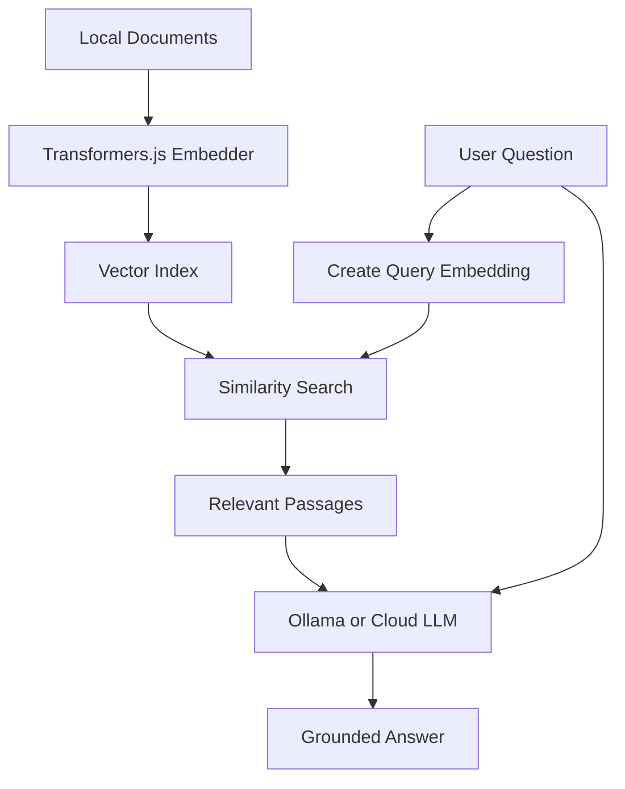
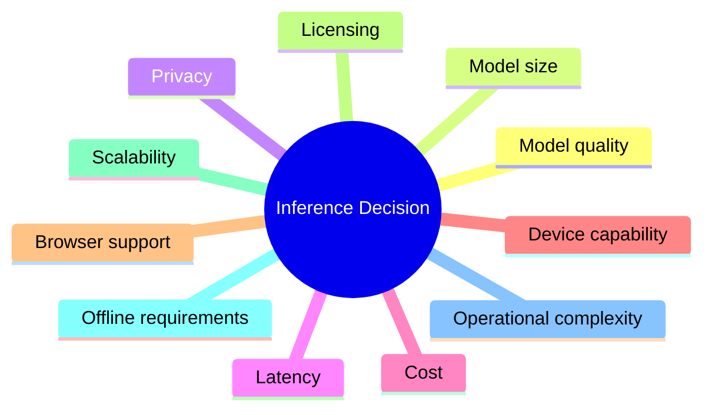
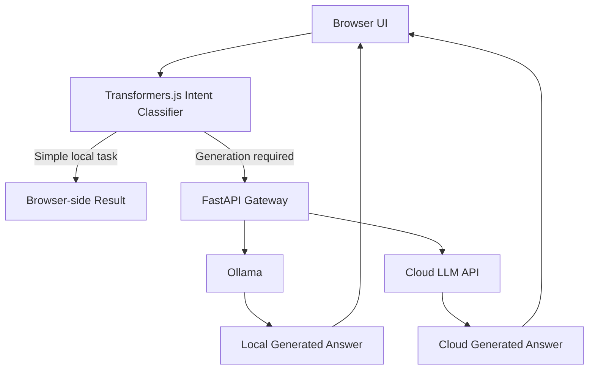

# 009 — Transformers.js

**Course:** 02 — Model Platforms and Prompting
**Module:** Module 07 — Open Source AI
**Content Group:** Local and JavaScript Runtime
**Roadmap Source:** Open Source AI / Local and JavaScript Runtime
**Lesson Type:** Open Source AI
**Lesson Order:** 009
**Suggested Duration:** 20 minutes

---

## 1. Lesson Summary

**Transformers.js** is a JavaScript library for running pretrained Transformer models directly inside web browsers, Node.js applications, browser extensions, Electron applications, and other JavaScript environments.

Its API is designed to resemble Hugging Face’s Python `transformers` library. It provides abstractions such as `pipeline()` for combining model loading, input preprocessing, inference, and output postprocessing. Transformers.js uses ONNX Runtime as its inference backend.

This makes it possible to build AI features such as:

* Sentiment analysis
* Text classification
* Text embeddings
* Question answering
* Translation
* Summarization
* Speech recognition
* Image classification
* Object detection
* Lightweight text generation

Depending on the model and runtime, inference can run locally on the user’s CPU through WebAssembly or on a supported GPU through WebGPU.

---

## 2. Learning Objectives

After completing this lesson, you should be able to:

* Explain what Transformers.js is in your own words.
* Understand where it belongs in an AI application architecture.
* Run a pretrained Hugging Face model from JavaScript.
* Distinguish browser inference, server-side JavaScript inference, and cloud API inference.
* Select models based on size, task, license, latency, compatibility, and privacy requirements.
* Build a small working AI feature with Transformers.js.
* Identify common production problems and debugging strategies.

---

## 3. What Is Transformers.js?

Transformers.js brings Transformer inference into the JavaScript ecosystem.

A typical machine-learning application requires several steps:

1. Load the model.
2. Load the tokenizer or processor.
3. Convert user input into tensors.
4. Run inference.
5. Convert the raw model output into a useful result.

Transformers.js can package these steps into a single `pipeline()` abstraction.

```javascript
import { pipeline } from "@huggingface/transformers";

const classifier = await pipeline("sentiment-analysis");

const result = await classifier("Transformers.js is surprisingly easy to use.");

console.log(result);
```

Conceptually, this is similar to the Python Transformers API:

```python
from transformers import pipeline

classifier = pipeline("sentiment-analysis")
result = classifier("Transformers is easy to use.")
```

The JavaScript and Python APIs are intentionally similar, making it easier to transfer knowledge between the two ecosystems.

---

## 4. Where Transformers.js Fits

Transformers.js is primarily an **inference runtime and model integration library**.

It does not normally train large models inside the browser. Instead, it loads an existing pretrained or fine-tuned model and uses that model to process new input.



### Main components

| Component        | Responsibility                                              |
| ---------------- | ----------------------------------------------------------- |
| Application UI   | Collects text, image, or audio input                        |
| Pipeline         | Connects preprocessing, model inference, and postprocessing |
| Tokenizer        | Converts text into token IDs                                |
| Processor        | Prepares image, audio, or multimodal input                  |
| Model            | Produces predictions or embeddings                          |
| ONNX Runtime     | Executes the model                                          |
| WASM             | Runs inference on the CPU                                   |
| WebGPU           | Runs supported operations on the GPU                        |
| Hugging Face Hub | Stores and distributes model files                          |

Transformers.js uses `onnxruntime-web` in browser environments and an appropriate Node.js backend for server-side execution.

---

## 5. Browser, Node.js, and Cloud Inference

Transformers.js can support multiple deployment patterns.

### 5.1 Browser-side inference


The model is downloaded to the browser and inference runs on the user’s device.

**Advantages:**

* User input does not need to be sent to an inference server.
* No inference API request is required after the model is available locally.
* The application can reduce backend infrastructure.
* Some applications can continue working after model assets have been cached.

**Limitations:**

* Initial model downloads can be large.
* Performance depends on the user’s device.
* Browser memory is limited.
* WebGPU support differs between browsers and hardware.
* Large generative models may provide poor latency or user experience.

Transformers.js normally uses CPU execution through WASM in the browser unless another device, such as WebGPU, is selected.

---

### 5.2 Node.js inference



The model runs inside a Node.js backend rather than inside the client’s browser.

**Advantages:**

* The server controls the runtime and model version.
* The model is downloaded once per deployment environment.
* Client devices do not need enough memory to run the model.
* The model can be wrapped in REST, GraphQL, or WebSocket APIs.

**Limitations:**

* Server compute is required.
* The server becomes responsible for scaling.
* User input must be sent to the backend.
* Cold starts and model-loading times must be managed.

---

### 5.3 Cloud model API



**Advantages:**

* Access to larger and more capable models.
* No local model packaging.
* Simplified infrastructure for early prototypes.
* Managed acceleration and scaling.

**Limitations:**

* Usage-based cost.
* Network dependency.
* Provider latency and rate limits.
* Less control over the complete inference stack.
* User data leaves the local runtime unless additional protections are applied.

---

## 6. When Should You Use Transformers.js?

Transformers.js is a strong choice when:

* The application is primarily written in JavaScript or TypeScript.
* You need a lightweight model inside a browser.
* Input should be processed locally for privacy or latency reasons.
* You are building a browser extension.
* You need embeddings, classification, transcription, or another focused AI task.
* You want an AI feature without maintaining a Python service.
* The selected model is small enough for the target device.
* The application must support limited offline functionality.

### Good use cases

| Use case             | Example                                         |
| -------------------- | ----------------------------------------------- |
| Text classification  | Detect whether feedback is positive or negative |
| Embeddings           | Perform semantic search over local notes        |
| Speech recognition   | Transcribe short audio recordings               |
| Image classification | Identify an object from an uploaded image       |
| Browser extension    | Classify or summarize selected page content     |
| Content moderation   | Detect categories before submitting content     |
| Document search      | Generate embeddings in the browser              |
| Accessibility        | Add speech or image understanding features      |

---

## 7. When Should You Avoid It?

Transformers.js may not be the best choice when:

* The required model is several gigabytes and targets low-memory devices.
* The task requires a large, high-quality generative model.
* Every user must receive predictable inference performance.
* You need centralized model monitoring and auditing.
* The application must hide private model weights.
* The model depends on unsupported ONNX operations.
* The initial download would seriously harm the user experience.
* A mobile-native runtime would provide better device integration.
* A managed API already satisfies the project’s requirements more efficiently.

A common architecture is therefore **hybrid inference**:



For example:

* Use Transformers.js for intent classification.
* Use a larger Ollama or cloud model for complex generation.
* Use local embeddings for private browser-side search.
* Use a backend model only when advanced reasoning is required.

---

## 8. Installation

### NPM

```bash
npm install @huggingface/transformers
```

Then import the library:

```javascript
import { pipeline } from "@huggingface/transformers";
```

The package can also be used in browser applications through an ES module CDN import.

---

## 9. Core API: `pipeline()`

The `pipeline()` function is the easiest entry point.

```javascript
const pipe = await pipeline(task, model, options);
```

### Parameters

| Parameter | Meaning                                                           |
| --------- | ----------------------------------------------------------------- |
| `task`    | The machine-learning task                                         |
| `model`   | Hugging Face model ID or local model path                         |
| `options` | Runtime, device, data type, progress callback, and other settings |

### Example

```javascript
import { pipeline } from "@huggingface/transformers";

const classifier = await pipeline(
  "sentiment-analysis",
  "Xenova/distilbert-base-uncased-finetuned-sst-2-english",
);

const result = await classifier("The application is fast and easy to use.");

console.log(result);
```

Possible output:

```javascript
[
  {
    label: "POSITIVE",
    score: 0.998,
  },
];
```

---

## 10. Practical Demo: Browser Sentiment Analyzer

This demo creates a small AI application that performs sentiment analysis directly in the browser.

### 10.1 Project structure

```text
transformers-js-demo/
├── index.html
└── app.js
```

### 10.2 `index.html`

```html
<!doctype html>
<html lang="en">
  <head>
    <meta charset="UTF-8" />
    <meta
      name="viewport"
      content="width=device-width, initial-scale=1.0"
    />

    <title>Transformers.js Sentiment Analyzer</title>
  </head>

  <body>
    <main>
      <h1>Sentiment Analyzer</h1>

      <textarea
        id="input"
        rows="6"
        placeholder="Enter a sentence..."
      ></textarea>

      <button id="analyze">Analyze</button>

      <p id="status">The model has not been loaded.</p>

      <pre id="output"></pre>
    </main>

    <script type="module" src="./app.js"></script>
  </body>
</html>
```

### 10.3 `app.js`

```javascript
import { pipeline } from "https://cdn.jsdelivr.net/npm/@huggingface/transformers";

const inputElement = document.querySelector("#input");
const analyzeButton = document.querySelector("#analyze");
const statusElement = document.querySelector("#status");
const outputElement = document.querySelector("#output");

let classifierPromise;

function getClassifier() {
  if (!classifierPromise) {
    statusElement.textContent = "Loading the model...";

    classifierPromise = pipeline(
      "sentiment-analysis",
      "Xenova/distilbert-base-uncased-finetuned-sst-2-english",
      {
        dtype: "q8",

        progress_callback: (progress) => {
          if (
            progress.status === "progress" &&
            typeof progress.progress === "number"
          ) {
            statusElement.textContent =
              `Loading model: ${progress.progress.toFixed(1)}%`;
          }
        },
      },
    );
  }

  return classifierPromise;
}

analyzeButton.addEventListener("click", async () => {
  const text = inputElement.value.trim();

  if (!text) {
    outputElement.textContent = "Please enter some text.";
    return;
  }

  analyzeButton.disabled = true;
  outputElement.textContent = "";
  statusElement.textContent = "Running inference...";

  try {
    const classifier = await getClassifier();
    const result = await classifier(text);

    outputElement.textContent = JSON.stringify(result, null, 2);
    statusElement.textContent = "Inference completed.";
  } catch (error) {
    console.error(error);

    statusElement.textContent = "Inference failed.";
    outputElement.textContent =
      error instanceof Error
        ? error.message
        : "An unknown error occurred.";
  } finally {
    analyzeButton.disabled = false;
  }
});
```

### 10.4 Run the demo

Do not open `index.html` directly with the `file://` protocol. Start a local web server instead.

```bash
npx serve .
```

Then open the address displayed by the command.

### Demo workflow



---

## 11. Using WebGPU

For supported models and environments, WebGPU can move inference from CPU-based WASM execution to the device’s GPU.

```javascript
import { pipeline } from "@huggingface/transformers";

const extractor = await pipeline(
  "feature-extraction",
  "mixedbread-ai/mxbai-embed-xsmall-v1",
  {
    device: "webgpu",
  },
);

const result = await extractor(
  ["Transformers.js runs in JavaScript."],
  {
    pooling: "mean",
    normalize: true,
  },
);

console.log(result.tolist());
```

Transformers.js enables WebGPU by setting `device: "webgpu"` when creating the pipeline. However, browser and hardware support must be tested, and the WebGPU runtime may behave differently across environments.

### Runtime selection example

```javascript
function getPreferredDevice() {
  if (typeof navigator !== "undefined" && navigator.gpu) {
    return "webgpu";
  }

  return "wasm";
}

const device = getPreferredDevice();

const classifier = await pipeline(
  "sentiment-analysis",
  "Xenova/distilbert-base-uncased-finetuned-sst-2-english",
  {
    device,
  },
);
```

A production application should still handle initialization failures and retry with WASM when WebGPU does not work correctly.

---

## 12. Quantization

Quantization reduces the precision of model weights.

Instead of using full 32-bit floating-point values, a model may use formats such as:

* `fp32`
* `fp16`
* `q8`
* `q4`

```javascript
const classifier = await pipeline(
  "sentiment-analysis",
  "Xenova/distilbert-base-uncased-finetuned-sst-2-english",
  {
    dtype: "q4",
  },
);
```

Quantized models can reduce download size and memory usage, which is especially valuable in browsers and other resource-constrained environments. The trade-off may include lower accuracy, unsupported operations, or different performance depending on the device and backend.

### General trade-off



Do not assume that the smallest quantization option is always the fastest. Benchmark the actual model on representative devices.

---

## 13. Local Models and Offline Deployment

By default, an application commonly downloads model files from a hosted source. Transformers.js can also be configured to load models from a custom local path.

```javascript
import {
  env,
  pipeline,
} from "@huggingface/transformers";

env.allowRemoteModels = false;
env.localModelPath = "/models/";

const classifier = await pipeline(
  "sentiment-analysis",
  "my-sentiment-model",
);
```

Conceptual directory:

```text
public/
└── models/
    └── my-sentiment-model/
        ├── config.json
        ├── tokenizer.json
        ├── tokenizer_config.json
        └── onnx/
            └── model_quantized.onnx
```

Transformers.js exposes environment configuration for changing model locations and controlling local or remotely hosted model loading.

For a genuinely offline application, remember to package:

* Model files
* Tokenizer files
* Configuration files
* ONNX Runtime WebAssembly files
* Application code
* Any processors or vocabulary assets

---

## 14. Transformers.js for Embeddings and RAG

Transformers.js can generate vector embeddings for text.

```javascript
import { pipeline } from "@huggingface/transformers";

const embedder = await pipeline(
  "feature-extraction",
  "Xenova/all-MiniLM-L6-v2",
);

const output = await embedder(
  [
    "Transformers.js runs models in JavaScript.",
    "Ollama runs local language models.",
  ],
  {
    pooling: "mean",
    normalize: true,
  },
);

const embeddings = output.tolist();

console.log(embeddings);
```

These vectors can be used in a small Retrieval-Augmented Generation workflow.



Transformers.js does not automatically provide a complete RAG system. The application must still implement:

* Document chunking
* Embedding storage
* Similarity search
* Context selection
* Prompt construction
* Generation
* Source attribution
* Evaluation

---

## 15. Production Considerations

### 15.1 Model size

A model that is considered small on a server may still be too large for a browser.

Measure:

* Compressed download size
* Uncompressed memory usage
* Model initialization time
* First-inference latency
* Repeated-inference latency

---

### 15.2 Model compatibility

Not every model on the Hugging Face Hub can automatically run through Transformers.js.

Verify that:

* The architecture is supported.
* Compatible ONNX files exist.
* The tokenizer is supported.
* Required operators are supported by the selected runtime.
* The model repository contains the necessary configuration files.

Models originally created with frameworks such as PyTorch, TensorFlow, or JAX may need to be exported to ONNX using suitable conversion tooling.

---

### 15.3 License

Open source does not automatically mean unrestricted use.

Before using a model, inspect:

* Repository license
* Model card
* Commercial-use restrictions
* Required attribution
* Dataset restrictions
* Acceptable-use policy
* Redistribution permissions

Do not rely only on the model name or repository visibility.

---

### 15.4 Privacy

Browser-side inference can keep user input on the local device during inference. However, privacy claims should be made carefully.

Check whether the application sends information through:

* Analytics
* Error reporting
* Model-download URLs
* Backend APIs
* External storage
* Application logs
* Browser extensions
* Third-party scripts

“Local inference” does not guarantee that the complete application is private.

---

### 15.5 User experience

Model loading must be treated as a visible application state.

The UI should show:

```text
Downloading model
    ↓
Initializing runtime
    ↓
Ready for input
    ↓
Running inference
    ↓
Displaying result
```

Recommended UX features:

* Loading progress
* Download-size warning
* Cancel option
* Clear error messages
* Disabled buttons during initialization
* Retry action
* WASM fallback
* Cached-model detection
* Device compatibility notice

---

### 15.6 Caching

Avoid creating a new pipeline for every request.

Incorrect:

```javascript
async function classify(text) {
  const classifier = await pipeline("sentiment-analysis");
  return classifier(text);
}
```

Better:

```javascript
let classifierPromise;

function getClassifier() {
  classifierPromise ??= pipeline("sentiment-analysis");
  return classifierPromise;
}

async function classify(text) {
  const classifier = await getClassifier();
  return classifier(text);
}
```

The second version reuses the model instance.

---

### 15.7 Web Workers

Long-running inference on the browser’s main thread can make the interface feel unresponsive.

A stronger production architecture is:


The main thread handles rendering and user interactions, while the worker manages model loading and inference.

---

## 16. Common Errors and Debugging

### Error 1: The model downloads every time

**Possible causes:**

* Browser cache is disabled.
* Cache headers are incorrect.
* The application uses changing model URLs.
* Private browsing clears stored resources.
* The model revision is not pinned.

**Debugging steps:**

1. Open the browser Network panel.
2. Check whether model files return from cache.
3. Inspect response cache headers.
4. Confirm that the model ID and revision remain stable.
5. Test outside private browsing mode.

---

### Error 2: The application freezes during inference

**Possible causes:**

* The model runs on the main browser thread.
* The input is too large.
* The model is unsuitable for the device.
* Too many inference calls run simultaneously.

**Solutions:**

* Move inference to a Web Worker.
* Limit input length.
* Add a request queue.
* Use a smaller or quantized model.
* Debounce repeated UI events.

---

### Error 3: WebGPU initialization fails

**Possible causes:**

* The browser does not support WebGPU.
* The device or driver is unsupported.
* The model contains unsupported operations.
* Browser security or feature settings block access.

**Fallback strategy:**

```javascript
async function createClassifier() {
  try {
    if (navigator.gpu) {
      return await pipeline(
        "sentiment-analysis",
        "Xenova/distilbert-base-uncased-finetuned-sst-2-english",
        {
          device: "webgpu",
        },
      );
    }
  } catch (error) {
    console.warn("WebGPU failed. Falling back to WASM.", error);
  }

  return pipeline(
    "sentiment-analysis",
    "Xenova/distilbert-base-uncased-finetuned-sst-2-english",
    {
      device: "wasm",
    },
  );
}
```

Because WebGPU support and behavior may vary across browsers, fallback logic is important for applications targeting a broad audience.

---

### Error 4: The result quality is poor

Check:

* Whether the model matches the language.
* Whether the model was trained for the requested task.
* Whether labels are being interpreted correctly.
* Whether text is being truncated.
* Whether quantization changes accuracy.
* Whether the input resembles the training distribution.

For example, an English sentiment model should not be expected to classify Vietnamese text accurately.

---

### Error 5: Out-of-memory errors

Possible solutions:

* Use a smaller model.
* Use quantization.
* Reduce input length.
* Process input in batches.
* Dispose of unused tensors or pipelines.
* Avoid loading multiple models simultaneously.
* Move the task to server-side inference.

---

### Error 6: The model works in Node.js but not in the browser

The browser and Node.js use different runtime environments and ONNX backends. A model may encounter different operator support, file-loading rules, memory limits, or security restrictions.

Check:

* Browser console errors
* CORS headers
* Model-file paths
* WASM asset paths
* ONNX operator support
* Browser memory
* WebGPU availability

---

## 17. Practical Exercise

Build a small **local feedback analyzer**.

### Requirements

The application should:

1. Accept a feedback message.
2. Run sentiment analysis with Transformers.js.
3. Display the predicted label.
4. Display the confidence score.
5. Show model-loading progress.
6. Prevent duplicate inference requests.
7. Handle empty input.
8. Handle model-loading errors.
9. Record inference duration.
10. Explain whether input leaves the user’s device.

### Suggested output

```text
Input:
"The design looks good, but the page is very slow."

Prediction:
NEGATIVE

Confidence:
82.4%

Inference time:
143 ms
```

### Optional extension

Add an escalation rule:

```javascript
function shouldEscalate(result) {
  const prediction = result[0];

  return (
    prediction.label === "NEGATIVE" &&
    prediction.score >= 0.8
  );
}
```

Then route strongly negative feedback to a human-support queue.

---

## 18. Production Failure Exercise

Consider this scenario:

> The demo works on the developer’s laptop, but users report that the page freezes for 15 seconds and consumes too much memory.

Write a debugging plan covering:

* Model size
* Quantization
* User hardware
* WASM versus WebGPU
* Browser compatibility
* Input length
* Worker-thread usage
* Pipeline reuse
* Concurrent requests
* Model-download caching

A good solution should measure the problem before changing the architecture.

---

## 19. Completion Checklist

### Concept

* [ ] I can explain Transformers.js in one or two minutes.
* [ ] I understand the purpose of the `pipeline()` API.
* [ ] I understand how ONNX Runtime is involved.
* [ ] I can distinguish WASM and WebGPU execution.

### Implementation

* [ ] I have run at least one model from JavaScript.
* [ ] I can select a specific model from the Hugging Face Hub.
* [ ] I handle loading and inference errors.
* [ ] I reuse the model instead of loading it repeatedly.
* [ ] I have tested the application on more than one device or browser.

### Production

* [ ] I checked the model license.
* [ ] I measured model-download size.
* [ ] I measured initialization and inference latency.
* [ ] I tested memory usage.
* [ ] I considered quantization.
* [ ] I implemented a fallback strategy.
* [ ] I documented what data leaves the device.
* [ ] I recorded at least one limitation or open question.

---

## 20. Related Outcome

After this lesson, you should understand when to use:

* A closed cloud API
* An open-source server model
* Ollama
* Hugging Face hosted services
* Transformers.js browser inference
* Transformers.js Node.js inference
* A hybrid local-and-cloud architecture

The correct choice depends on:



---

## 21. Related Project

### Project 6: Local AI Assistant

Build a local AI assistant using:

* **Ollama** for local text generation
* **FastAPI** as the backend wrapper
* **Transformers.js** for browser-side classification or embeddings
* A cloud LLM API as an optional comparison

### Suggested architecture



### Comparison metrics

Record:

| Metric                 | Transformers.js | Ollama | Cloud API |
| ---------------------- | --------------: | -----: | --------: |
| Initial load time      |                 |        |           |
| Average latency        |                 |        |           |
| Memory usage           |                 |        |           |
| Network dependency     |                 |        |           |
| Cost per request       |                 |        |           |
| Privacy level          |                 |        |           |
| Model quality          |                 |        |           |
| Operational complexity |                 |        |           |

This comparison demonstrates that AI engineering is not only about selecting the most powerful model. It is also about choosing the correct runtime and architecture for the product.

---

## 22. Five-Line Review

Complete these sentences without looking at the lesson:

1. Transformers.js is used to...
2. It executes models through...
3. Browser inference is useful when...
4. WebGPU differs from WASM because...
5. I would avoid Transformers.js when...

---

## 23. Final Summary

**Transformers.js brings pretrained Transformer inference into JavaScript applications.**

It can run models directly in browsers or JavaScript server environments, using ONNX Runtime with CPU-based WASM or supported GPU execution through WebGPU.

Its main strengths are:

* JavaScript-native integration
* Local browser inference
* Privacy-oriented application patterns
* Access to Hugging Face models
* Support for text, vision, audio, and multimodal tasks
* Simple pipeline-based APIs

Its main challenges are:

* Model download size
* Browser memory limitations
* Runtime compatibility
* Device-dependent performance
* WebGPU support
* Model and ONNX compatibility
* Production caching and UX
* Licensing and evaluation

Transformers.js should not be treated only as another library to memorize. Turn it into a working browser application, embedding pipeline, local classification tool, browser extension, RAG component, or portfolio demo.

---

# Bài luyện tập

## Mục tiêu


## Đề bài


## Yêu cầu hoàn thành

- [ ] 
- [ ] 
- [ ] 

## Kết quả / lời giải


## Ghi chú
