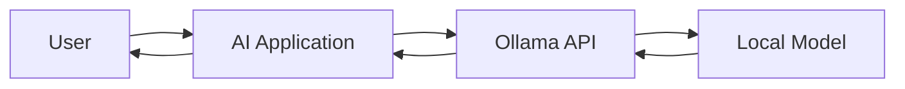
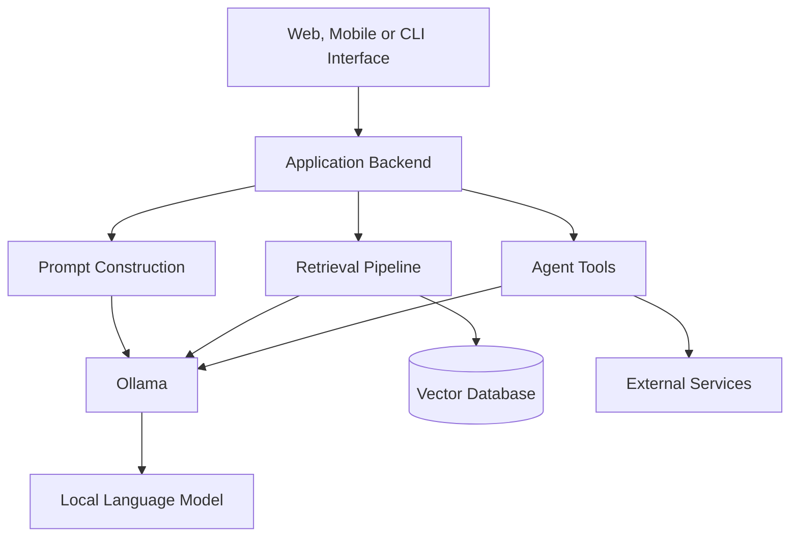
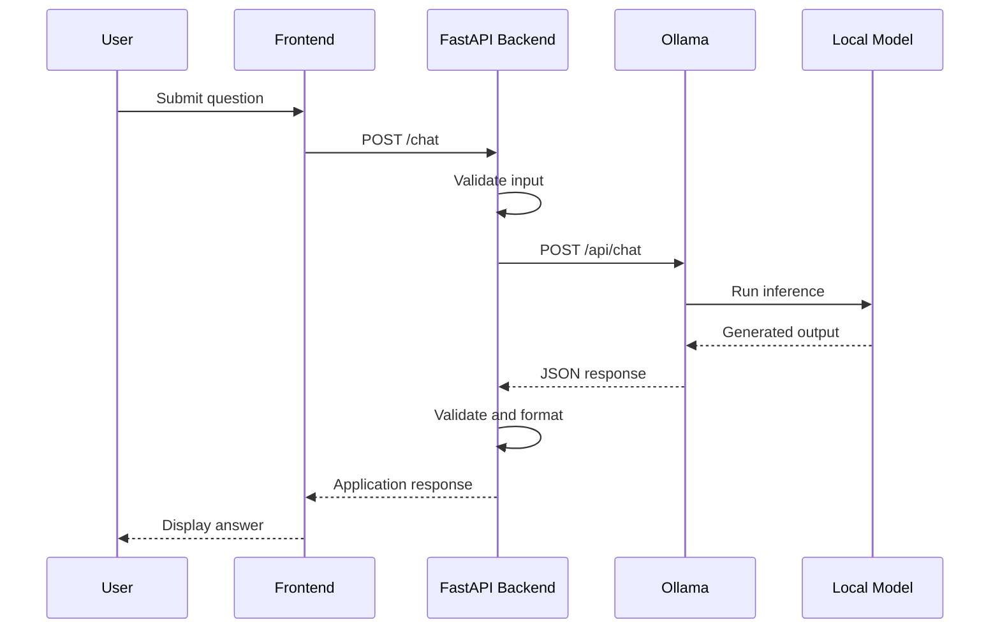
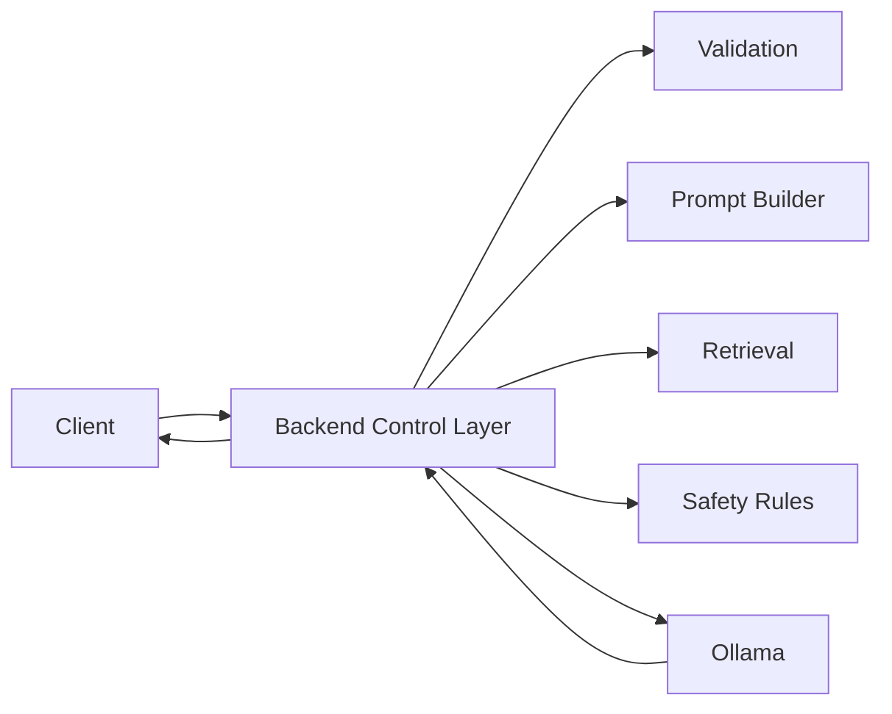
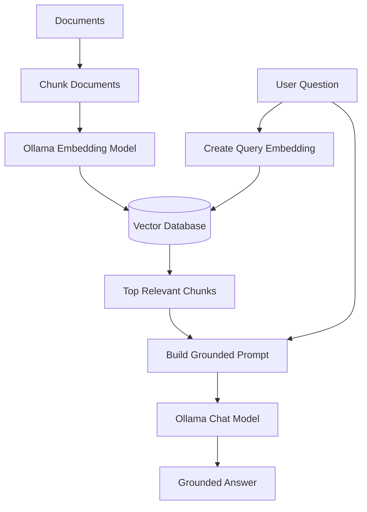
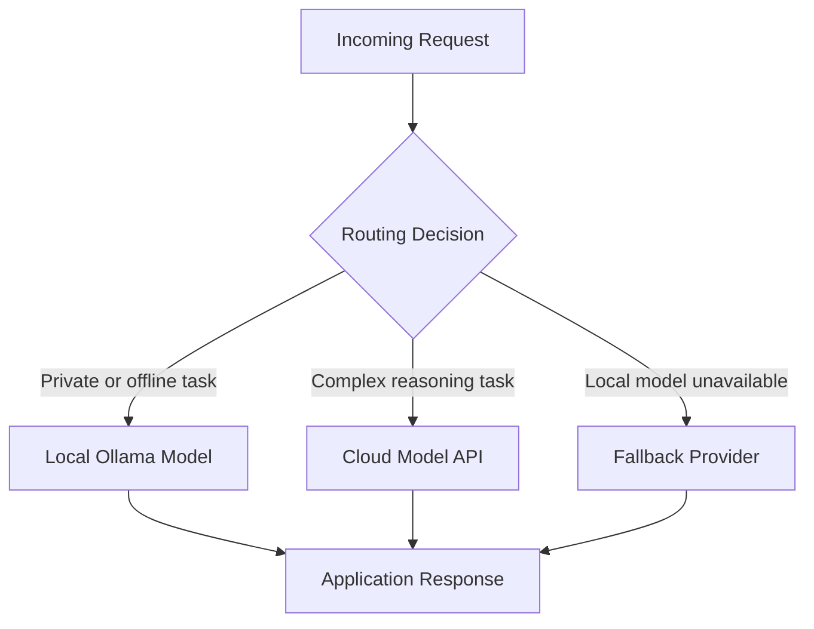
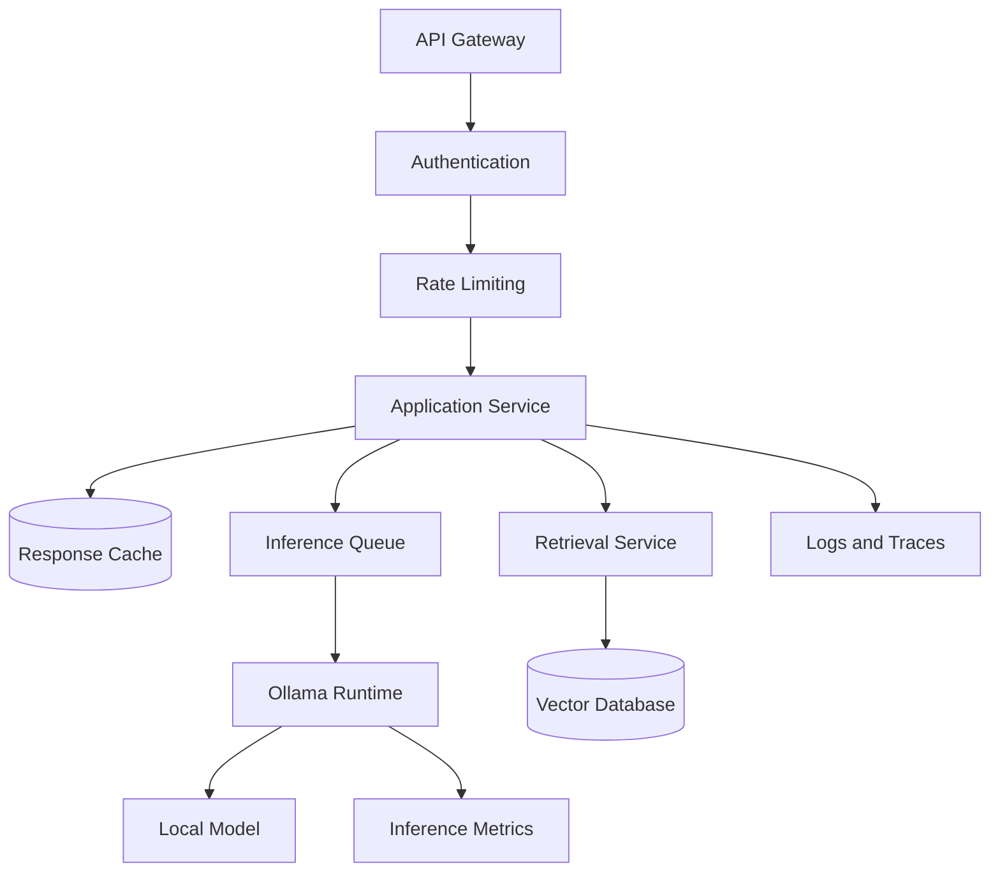
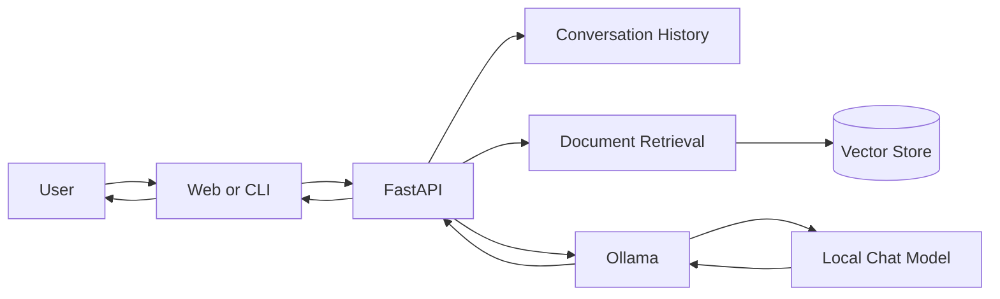

# 010 — Ollama

**Course:** 02 — Model Platforms and Prompting
**Module:** Module 07 — Open Source AI
**Content Group:** Local and JavaScript Runtime
**Roadmap Source:** Open Source AI / Local and JavaScript Runtime
**Lesson Type:** Open Source AI
**Order in Module:** 010
**Suggested Duration:** 20 minutes

---

## 1. Lesson Overview

**Ollama** is a tool for downloading, running, customizing, and integrating large language models on a local machine.

Instead of sending every request to a cloud AI provider, an application can send prompts to an Ollama server running on the developer’s computer or private infrastructure.

Ollama provides:

* A command-line interface for managing models.
* A local HTTP API.
* Official Python and JavaScript libraries.
* Support for text generation, chat, embeddings, tool calling, structured output, and multimodal models.
* A `Modelfile` format for configuring customized models.

Ollama is available for macOS, Windows, and Linux. After installation, its local API is normally available at `http://localhost:11434/api`.

---

## 2. Learning Objectives

By the end of this lesson, you should be able to:

* Explain Ollama in your own words.
* Understand where Ollama belongs in an AI application architecture.
* Download and run a local model.
* Call Ollama through its REST API.
* Integrate Ollama with Python, JavaScript, or FastAPI.
* Describe how Ollama can be used in a local RAG pipeline.
* Compare local inference with cloud model APIs.
* Identify important production limitations and security risks.

---

## 3. What Is Ollama?

Ollama is a model runtime and model-management tool designed to make local AI inference easier.

Without a tool such as Ollama, running a local model may require manually handling:

* Model files.
* Quantization formats.
* Inference engines.
* Prompt templates.
* Model loading.
* GPU or CPU configuration.
* HTTP serving.
* Context-window settings.

Ollama provides a simpler interface around many of these concerns.

A developer can usually begin with two commands:

```bash
ollama pull gemma3
ollama run gemma3
```

The first command downloads the model. The second loads it and starts an interactive conversation. Ollama also provides commands for listing, removing, inspecting, stopping, and creating models.

---

## 4. Mental Model

Think of Ollama as a **local model server**.



The application does not need to load the model directly.

Instead, it sends an HTTP request to Ollama:

```text
Application
    ↓
POST http://localhost:11434/api/chat
    ↓
Ollama runtime
    ↓
Local model
    ↓
Generated response
```

This creates a separation between:

* The application layer.
* The model-serving layer.
* The model files.
* The hardware used for inference.

---

## 5. Where Ollama Fits in an AI Engineer Workflow

Ollama can serve as the model layer in several types of AI applications.



Common use cases include:

1. **Local chat assistants**
2. **Private document Q&A systems**
3. **RAG prototypes**
4. **Offline AI applications**
5. **Coding assistants**
6. **Embedding generation**
7. **Model comparison experiments**
8. **Development environments that should not depend on cloud APIs**

---

## 6. Why AI Engineers Use Ollama

### 6.1 Local development

Developers can test prompts and application logic without making a cloud API request for every experiment.

### 6.2 Data privacy

Prompts and documents can remain inside the local environment when only local models and local services are used.

However, local execution does not automatically make an application secure. The developer must still protect logs, databases, model endpoints, uploaded files, and user data.

### 6.3 Offline capability

After a model has been downloaded, many workloads can run without a continuous internet connection.

### 6.4 Cost experimentation

Local inference does not have a per-request API fee, but it still consumes:

* CPU or GPU resources.
* Memory.
* Electricity.
* Storage.
* Engineering and maintenance time.

Therefore, local inference is not automatically free.

### 6.5 Model comparison

Ollama makes it easier to compare different models behind a similar interface.

For example:

```bash
ollama run gemma3
ollama run llama3.2
ollama run qwen3
```

Applications should still test model quality, latency, context handling, licenses, tool support, and hardware requirements before selecting a model.

---

## 7. Installation and First Model

After installing Ollama, verify that the command is available:

```bash
ollama --version
```

Start the Ollama server manually when necessary:

```bash
ollama serve
```

Download a model:

```bash
ollama pull gemma3
```

Run the model:

```bash
ollama run gemma3
```

Enter a prompt:

```text
Explain vector databases in simple language.
```

Exit the interactive session:

```text
/bye
```

The exact model names and available tags should be checked in the Ollama model library because model availability changes over time.

---

## 8. Essential CLI Commands

### List downloaded models

```bash
ollama ls
```

### List currently loaded models

```bash
ollama ps
```

### Download a model

```bash
ollama pull gemma3
```

### Run a model

```bash
ollama run gemma3
```

### Display model information

```bash
ollama show gemma3
```

### Display its generated Modelfile

```bash
ollama show --modelfile gemma3
```

### Stop a running model

```bash
ollama stop gemma3
```

### Remove a model

```bash
ollama rm gemma3
```

These commands are part of Ollama’s documented model-management workflow.

---

## 9. Calling the Ollama REST API

Ollama exposes a local REST API.

The default local API base URL is:

```text
http://localhost:11434/api
```

### 9.1 Generate endpoint

Use `/api/generate` for a direct prompt-and-response workflow.

```bash
curl http://localhost:11434/api/generate \
  -H "Content-Type: application/json" \
  -d '{
    "model": "gemma3",
    "prompt": "Explain RAG in three sentences.",
    "stream": false
  }'
```

A simplified response looks like this:

```json
{
  "model": "gemma3",
  "response": "Retrieval-Augmented Generation...",
  "done": true
}
```

The generate endpoint accepts a model and prompt and can return timing and token-processing information in its response.

---

### 9.2 Chat endpoint

Use `/api/chat` for multi-turn conversations.

```bash
curl http://localhost:11434/api/chat \
  -H "Content-Type: application/json" \
  -d '{
    "model": "gemma3",
    "messages": [
      {
        "role": "system",
        "content": "You are a concise AI engineering tutor."
      },
      {
        "role": "user",
        "content": "What is model quantization?"
      }
    ],
    "stream": false
  }'
```

The response contains an assistant message:

```json
{
  "message": {
    "role": "assistant",
    "content": "Model quantization reduces the numerical precision..."
  },
  "done": true
}
```

The chat endpoint accepts conversation messages and may also return metadata such as model-loading time, prompt token counts, generated token counts, and total duration.

---

## 10. Streaming Responses

Ollama can stream output as it is generated.

```bash
curl http://localhost:11434/api/chat \
  -H "Content-Type: application/json" \
  -d '{
    "model": "gemma3",
    "messages": [
      {
        "role": "user",
        "content": "Write a short introduction to local AI."
      }
    ],
    "stream": true
  }'
```

Instead of waiting for one complete JSON response, the client receives multiple JSON objects containing partial output.

```text
Model starts generating
        ↓
Token chunk 1
        ↓
Token chunk 2
        ↓
Token chunk 3
        ↓
Final completion event
```

Streaming improves perceived responsiveness, especially when a model generates a long answer.

The application must correctly handle:

* Partial tokens.
* Incomplete lines.
* Connection cancellation.
* Timeouts.
* Final completion events.
* Errors during generation.

---

## 11. Python Integration

Install the official Python package:

```bash
pip install ollama
```

Example:

```python
from ollama import chat


def ask_local_model(question: str) -> str:
    response = chat(
        model="gemma3",
        messages=[
            {
                "role": "system",
                "content": "You are a helpful AI engineering tutor.",
            },
            {
                "role": "user",
                "content": question,
            },
        ],
    )

    return response.message.content


if __name__ == "__main__":
    answer = ask_local_model("What is an embedding model?")
    print(answer)
```

Ollama maintains official Python and JavaScript libraries for application integration.

---

## 12. JavaScript Integration

Install the JavaScript package:

```bash
npm install ollama
```

Example:

```javascript
import ollama from "ollama";

async function askLocalModel(question) {
  const response = await ollama.chat({
    model: "gemma3",
    messages: [
      {
        role: "system",
        content: "You are a helpful AI engineering tutor.",
      },
      {
        role: "user",
        content: question,
      },
    ],
  });

  return response.message.content;
}

try {
  const answer = await askLocalModel("Explain semantic search.");
  console.log(answer);
} catch (error) {
  console.error("Ollama request failed:", error);
}
```

---

## 13. Building a FastAPI Wrapper

A backend wrapper provides a controlled interface between the frontend and Ollama.



Install dependencies:

```bash
pip install fastapi uvicorn httpx pydantic
```

Create `main.py`:

```python
from typing import Final

import httpx
from fastapi import FastAPI, HTTPException
from pydantic import BaseModel, Field


OLLAMA_CHAT_URL: Final[str] = "http://localhost:11434/api/chat"
DEFAULT_MODEL: Final[str] = "gemma3"

app = FastAPI(title="Local AI Assistant")


class ChatRequest(BaseModel):
    message: str = Field(min_length=1, max_length=10_000)


class ChatResponse(BaseModel):
    answer: str
    model: str


@app.post("/chat", response_model=ChatResponse)
async def chat(request: ChatRequest) -> ChatResponse:
    payload = {
        "model": DEFAULT_MODEL,
        "messages": [
            {
                "role": "system",
                "content": (
                    "You are a helpful AI engineering assistant. "
                    "Be accurate and concise."
                ),
            },
            {
                "role": "user",
                "content": request.message,
            },
        ],
        "stream": False,
    }

    try:
        async with httpx.AsyncClient(timeout=120.0) as client:
            response = await client.post(OLLAMA_CHAT_URL, json=payload)
            response.raise_for_status()

    except httpx.ConnectError as exc:
        raise HTTPException(
            status_code=503,
            detail="Cannot connect to the local Ollama server.",
        ) from exc

    except httpx.TimeoutException as exc:
        raise HTTPException(
            status_code=504,
            detail="The local model did not respond before the timeout.",
        ) from exc

    except httpx.HTTPStatusError as exc:
        raise HTTPException(
            status_code=502,
            detail=f"Ollama returned HTTP {exc.response.status_code}.",
        ) from exc

    data = response.json()
    answer = data.get("message", {}).get("content")

    if not answer:
        raise HTTPException(
            status_code=502,
            detail="Ollama returned an invalid response.",
        )

    return ChatResponse(
        answer=answer,
        model=data.get("model", DEFAULT_MODEL),
    )
```

Run the API:

```bash
uvicorn main:app --reload
```

Test it:

```bash
curl http://localhost:8000/chat \
  -H "Content-Type: application/json" \
  -d '{
    "message": "Explain the difference between RAG and fine-tuning."
  }'
```

---

## 14. Why Use a Backend Wrapper?

A frontend could technically call a model server directly, but a backend wrapper is safer and easier to control.

The backend can handle:

* Input validation.
* Authentication.
* Authorization.
* Prompt templates.
* Model selection.
* Rate limiting.
* Timeouts.
* Logging.
* Retrieval.
* Tool execution.
* Output validation.
* Safety checks.
* Fallback models.



Do not expose an unrestricted Ollama endpoint to the public internet without authentication and network controls.

---

## 15. Generating Embeddings

Ollama can generate vector embeddings for semantic search and RAG.

Example:

```bash
ollama pull embeddinggemma
```

Generate an embedding:

```bash
curl http://localhost:11434/api/embed \
  -H "Content-Type: application/json" \
  -d '{
    "model": "embeddinggemma",
    "input": "Ollama runs language models locally."
  }'
```

Simplified response:

```json
{
  "model": "embeddinggemma",
  "embeddings": [
    [
      0.0101,
      -0.0017,
      0.0500
    ]
  ]
}
```

The `/api/embed` endpoint accepts either one text input or an array of texts and returns arrays of numerical embeddings. These vectors can be stored and compared for semantic retrieval.

---

## 16. Ollama in a RAG Pipeline

RAG stands for **Retrieval-Augmented Generation**.

Instead of asking the model to answer only from its internal knowledge, the system retrieves relevant information and includes it in the prompt.



### Indexing phase

```text
Document
   ↓
Split into chunks
   ↓
Generate embeddings
   ↓
Store vectors and metadata
```

### Query phase

```text
User question
   ↓
Generate query embedding
   ↓
Find similar chunks
   ↓
Add chunks to prompt
   ↓
Generate answer
```

Example prompt:

```text
You are a documentation assistant.

Answer the question using only the provided context.
If the answer is not present, say that the available context is insufficient.

Context:
---
{retrieved_chunks}
---

Question:
{user_question}
```

---

## 17. Minimal Local RAG Example

The following educational example uses in-memory cosine similarity. A production application would normally use a proper vector database.

```python
from typing import Any

import httpx
import numpy as np


OLLAMA_URL = "http://localhost:11434"
EMBEDDING_MODEL = "embeddinggemma"
CHAT_MODEL = "gemma3"

DOCUMENTS = [
    "Ollama provides a local API for running language models.",
    "RAG combines information retrieval with text generation.",
    "Embeddings represent text as numerical vectors.",
]


def create_embedding(text: str) -> list[float]:
    response = httpx.post(
        f"{OLLAMA_URL}/api/embed",
        json={
            "model": EMBEDDING_MODEL,
            "input": text,
        },
        timeout=60.0,
    )
    response.raise_for_status()

    data: dict[str, Any] = response.json()
    embeddings = data.get("embeddings")

    if not embeddings:
        raise RuntimeError("No embedding returned by Ollama.")

    return embeddings[0]


def cosine_similarity(
    first: list[float],
    second: list[float],
) -> float:
    vector_a = np.array(first)
    vector_b = np.array(second)

    denominator = np.linalg.norm(vector_a) * np.linalg.norm(vector_b)

    if denominator == 0:
        return 0.0

    return float(np.dot(vector_a, vector_b) / denominator)


def retrieve(question: str) -> str:
    question_embedding = create_embedding(question)

    scored_documents = []

    for document in DOCUMENTS:
        document_embedding = create_embedding(document)
        score = cosine_similarity(question_embedding, document_embedding)
        scored_documents.append((score, document))

    scored_documents.sort(reverse=True)
    return scored_documents[0][1]


def generate_answer(question: str, context: str) -> str:
    prompt = f"""
Answer the question using only the context.

Context:
{context}

Question:
{question}
""".strip()

    response = httpx.post(
        f"{OLLAMA_URL}/api/chat",
        json={
            "model": CHAT_MODEL,
            "messages": [
                {
                    "role": "user",
                    "content": prompt,
                }
            ],
            "stream": False,
        },
        timeout=120.0,
    )
    response.raise_for_status()

    data = response.json()
    return data["message"]["content"]


def main() -> None:
    question = "What does RAG combine?"
    context = retrieve(question)
    answer = generate_answer(question, context)

    print("Retrieved context:", context)
    print("Answer:", answer)


if __name__ == "__main__":
    main()
```

Install its dependencies:

```bash
pip install httpx numpy
```

This demo is intentionally small. It recalculates document embeddings every time, which is inefficient. A real application should calculate them during indexing and store them.

---

## 18. Customizing Models with a Modelfile

A `Modelfile` is a blueprint for creating a customized Ollama model.

Example:

```dockerfile
FROM gemma3

PARAMETER temperature 0.2
PARAMETER num_ctx 8192

SYSTEM """
You are an AI engineering tutor.

Rules:
- Explain concepts step by step.
- Use practical examples.
- State limitations clearly.
- Do not invent unavailable information.
"""
```

Create the customized model:

```bash
ollama create ai-engineering-tutor -f Modelfile
```

Run it:

```bash
ollama run ai-engineering-tutor
```

A Modelfile can define a base model, parameters, prompt template, system instruction, adapters, license information, and example message history.

---

## 19. Ollama and OpenAI-Compatible Applications

Ollama supports parts of the OpenAI API format, allowing some applications built for an OpenAI-compatible client to use a local Ollama endpoint with limited changes.

However, compatibility should not be assumed to be complete. The application must test every required feature, including:

* Chat completion.
* Streaming.
* Tool calls.
* Structured output.
* Embeddings.
* Multimodal input.
* Error formats.
* Token accounting.

Ollama documents partial OpenAI API compatibility rather than universal compatibility with every OpenAI feature.

---

## 20. Local Inference vs Cloud Inference

| Area            | Ollama and local models                   | Cloud model API                         |
| --------------- | ----------------------------------------- | --------------------------------------- |
| Data location   | Can remain on local infrastructure        | Usually sent to an external provider    |
| Setup           | Requires model and hardware configuration | Usually requires an API key             |
| Per-request fee | Usually none                              | Commonly usage-based                    |
| Hardware cost   | Paid and managed by the user              | Managed by the provider                 |
| Offline use     | Often possible                            | Usually unavailable                     |
| Model quality   | Depends on selected local model           | Often includes stronger managed models  |
| Scaling         | Must be designed and operated             | Usually provided as a managed service   |
| Maintenance     | User manages runtime and models           | Provider manages infrastructure         |
| Latency         | Can be low on suitable local hardware     | Depends on network and provider         |
| Privacy control | High when correctly configured            | Depends on provider policies and setup  |
| Availability    | Depends on the local machine              | Depends on internet and provider uptime |

Neither option is always better.

A strong production architecture may support both:



---

## 21. Model Selection Checklist

Before selecting a local model, evaluate:

### Task quality

* Does the model follow instructions?
* Does it understand the required language?
* Does it produce valid structured output?
* Does it hallucinate frequently?
* Does it support tools or images when required?

### Hardware compatibility

* Can the model fit in available RAM or VRAM?
* What quantization level is being used?
* How long does model loading take?
* What is the generation speed?

### Context requirements

* How much context does the application need?
* Will retrieved documents fit inside the context window?
* What happens when the prompt is too long?

### Operational requirements

* How many users must be served?
* How many requests can run concurrently?
* Is a queue required?
* Should inactive models be unloaded?
* Is a cloud fallback needed?

### Legal requirements

* What license applies to the model?
* Is commercial use allowed?
* Are redistribution and modification allowed?
* Are there model-specific usage restrictions?

---

## 22. Production Architecture

A production-ready local inference system requires more than installing Ollama.



Important production concerns include:

* Hardware capacity.
* Model loading time.
* Concurrent requests.
* Request queues.
* Timeouts.
* Memory exhaustion.
* Model versioning.
* Prompt versioning.
* Observability.
* Access control.
* Data retention.
* Backup and recovery.
* Fallback behavior.
* Model evaluation.

---

## 23. Security Considerations

### Do not expose the model server directly

A public model endpoint may allow attackers to:

* Consume all available GPU or CPU capacity.
* Send extremely long prompts.
* access models that should be restricted.
* Attempt prompt injection.
* generate unwanted content.
* cause denial-of-service conditions.

Use a protected application backend:

```text
Internet
   ↓
API gateway
   ↓
Authentication and rate limiting
   ↓
Application backend
   ↓
Private Ollama service
```

### Validate input

Set limits for:

* Prompt length.
* File size.
* Number of uploaded files.
* Allowed file formats.
* Request frequency.
* Generation length.

### Protect retrieved data

Local inference does not prevent authorization bugs.

A RAG system must verify that the authenticated user is allowed to access every retrieved document.

```text
User identity
    ↓
Authorization filter
    ↓
Permitted documents only
    ↓
Vector retrieval
    ↓
Model context
```

### Protect logs

Avoid logging complete prompts or retrieved documents when they may contain:

* Passwords.
* API keys.
* Personal data.
* Private business data.
* Medical or financial information.

---

## 24. Common Production Failure

### Problem

The first request is extremely slow, while later requests are faster.

### Possible cause

The model was not already loaded into memory.

### Debugging process

1. Check running models:

```bash
ollama ps
```

2. Measure the complete request duration.

3. Inspect the API response fields:

```json
{
  "load_duration": 1000000000,
  "prompt_eval_duration": 500000000,
  "eval_duration": 3000000000
}
```

4. Compare:

* Model loading time.
* Prompt-processing time.
* Token-generation time.

5. Test a smaller or more heavily quantized model.

6. Check system RAM, GPU memory, CPU, and disk usage.

7. Decide whether the model should remain loaded between requests.

The Ollama API can return separate duration and token-count fields, helping developers distinguish loading, prompt evaluation, and generation costs.

---

## 25. Additional Failure Scenarios

### Ollama server is unavailable

**Symptom:**

```text
Connection refused
```

**Checks:**

```bash
ollama serve
```

```bash
curl http://localhost:11434/api/version
```

---

### Model is missing

**Symptom:**

```text
model not found
```

**Fix:**

```bash
ollama pull gemma3
```

---

### System runs out of memory

**Possible solutions:**

* Use a smaller model.
* Use a more compressed quantization.
* Reduce the context window.
* Reduce concurrent requests.
* Stop unused models.
* Add a request queue.
* Upgrade hardware.

---

### Responses are too slow

Measure:

* Time to first token.
* Output tokens per second.
* Prompt size.
* Model loading duration.
* Retrieval latency.
* Queue waiting time.

Do not measure only the total endpoint latency.

---

### The model ignores instructions

Possible causes include:

* Weak system prompt.
* Incorrect chat template.
* Too much irrelevant context.
* Conflicting instructions.
* A model that is too small for the task.
* Excessive generation temperature.

Possible fixes include:

* Simplifying the prompt.
* Moving rules into the system message.
* Reducing irrelevant context.
* Adding output examples.
* Using structured output.
* Testing another model.

---

## 26. Common Learning Mistakes

### Memorizing commands without building an application

Running `ollama run` is only the first step. Connect the model to an API, interface, retrieval pipeline, or agent tool.

### Assuming local means production-ready

A working laptop demo does not prove that the system can support multiple users.

### Ignoring model licenses

Open weights do not always mean unrestricted use.

### Using a model that is too large

A larger model may produce better results but create unacceptable latency or memory usage.

### Skipping evaluation

Do not select a model based on one successful prompt. Build a repeatable evaluation dataset.

### Exposing Ollama directly to clients

Use a backend control layer for authentication, validation, authorization, and rate limiting.

### Ignoring prompt injection in RAG

Retrieved documents may contain instructions that attempt to manipulate the model. Treat retrieved text as untrusted data.

---

## 27. Practical Exercise

Build a small local assistant using Ollama and FastAPI.

### Requirements

1. Install Ollama.
2. Download a chat model.
3. Create a FastAPI endpoint named `/chat`.
4. Send the user’s message to Ollama.
5. Return the generated answer.
6. Add input-length validation.
7. Add connection and timeout error handling.
8. Record request latency.
9. Document one production limitation.
10. Compare one answer with a cloud model.

### Optional extensions

* Add streaming with Server-Sent Events.
* Add conversation history.
* Add a local embedding model.
* Add RAG over several Markdown documents.
* Add automatic local-to-cloud fallback.
* Add model selection through configuration.
* Add a simple HTML chat interface.

---

## 28. Suggested Evaluation Cases

| Test                               | Purpose                      |
| ---------------------------------- | ---------------------------- |
| Simple factual question            | Check basic response quality |
| Long prompt                        | Test context and latency     |
| Invalid JSON request               | Test API validation          |
| Ollama stopped                     | Test connection handling     |
| Missing model                      | Test model-management errors |
| Two simultaneous requests          | Observe concurrency behavior |
| Prompt injection inside a document | Test RAG safety              |
| Question absent from documents     | Test grounded refusal        |
| Vietnamese question                | Test multilingual quality    |
| Required JSON output               | Test format reliability      |

---

## 29. Five-Line Recall Exercise

Without reviewing the lesson, write five lines explaining:

1. What Ollama is.
2. Why developers use it.
3. How applications communicate with it.
4. One advantage of local inference.
5. One production limitation.

Example:

> Ollama is a runtime for running and managing AI models locally.
> Applications can communicate with it through a local HTTP API.
> It is useful for private, offline, and low-cost experimentation.
> It can support chat, embeddings, RAG, and model customization.
> Production use still requires hardware planning, security, monitoring, and scaling.

---

## 30. Completion Checklist

* [ ] I can explain Ollama in one or two minutes.
* [ ] I can download and run a local model.
* [ ] I can call `/api/generate`.
* [ ] I can call `/api/chat`.
* [ ] I understand the difference between streaming and non-streaming output.
* [ ] I can integrate Ollama with Python or JavaScript.
* [ ] I can place a FastAPI wrapper in front of Ollama.
* [ ] I understand how Ollama can generate embeddings.
* [ ] I can describe a local RAG pipeline.
* [ ] I know why local inference is not automatically production-ready.
* [ ] I have documented at least one limitation or open question.

---

## 31. Related Outcome

After completing this lesson, you should know when to use:

* A closed cloud model API.
* An open-source model.
* Hugging Face tools.
* A browser or JavaScript model runtime.
* Local inference through Ollama.
* A hybrid local-and-cloud architecture.

---

## 32. Related Portfolio Project

### Project 6: Local AI Assistant

Build a local AI assistant with:

* Ollama as the local model runtime.
* FastAPI as the backend.
* A web or command-line interface.
* Conversation history.
* Input validation.
* Error handling.
* Latency measurement.
* Optional local RAG.
* Optional cloud-model fallback.

### Suggested architecture



### Comparison report

Compare the local model with a cloud API using:

* Response quality.
* Time to first token.
* Total latency.
* Cost.
* Privacy.
* Offline availability.
* Structured-output reliability.
* Hardware requirements.
* Operational complexity.

---

## 33. Final Summary

Ollama makes it easier to download, run, customize, and serve AI models through a consistent local interface.

For an AI engineer, the important idea is not only learning the command:

```bash
ollama run gemma3
```

The real goal is understanding how to place local inference inside a complete system:

```text
User request
    ↓
Application backend
    ↓
Validation, retrieval and prompt construction
    ↓
Ollama
    ↓
Local model
    ↓
Validated response
```

Ollama is especially valuable for local prototypes, private assistants, offline applications, RAG experiments, model evaluation, and hybrid AI systems.

However, production deployment still requires careful work in capacity planning, model management, security, observability, evaluation, concurrency control, and fallback design.
