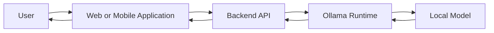
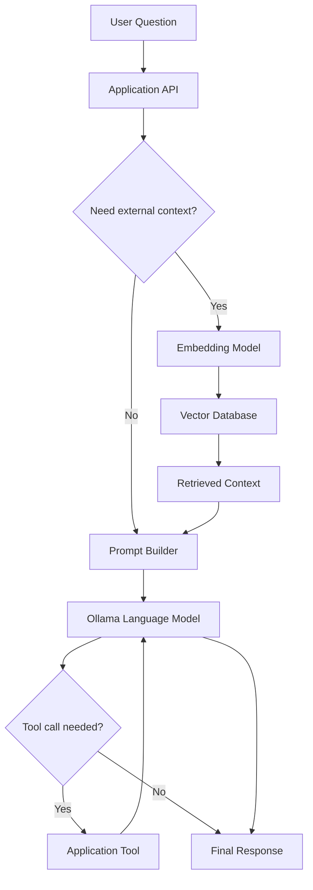
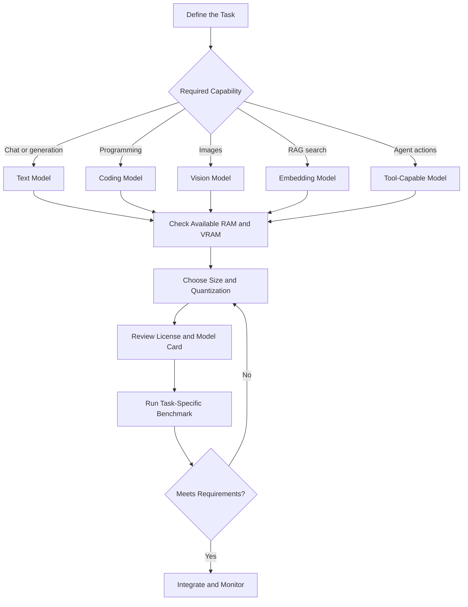
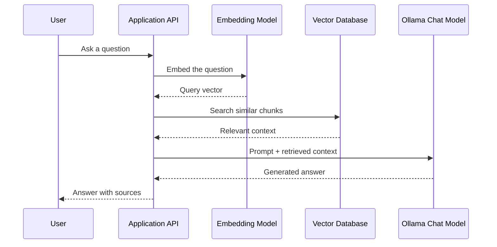

# 011 — Ollama Models

**Course:** 02 — Model Platforms and Prompting
**Module:** Module 07 — Open Source AI
**Content Group:** Local and JavaScript Runtime
**Roadmap Source:** Open Source AI / Local and JavaScript Runtime
**Lesson Type:** Open Source AI
**Order in Module:** 011
**Suggested Duration:** 20 minutes

---

## 1. Overview

An **Ollama model** is a model package that can be downloaded, managed, customized, and executed through the Ollama runtime.

Instead of calling a closed cloud API for every request, an AI application can use Ollama to run compatible language, vision, embedding, coding, or tool-capable models on a developer machine or private server.

Ollama provides:

* A model library
* A command-line interface
* A local HTTP API
* Model versioning through tags
* Quantized model variants
* Custom models through `Modelfile`
* Support for importing GGUF files, Safetensors models, and compatible adapters

The local Ollama API is normally available at:

```text
http://localhost:11434/api
```

Ollama also provides partial OpenAI API compatibility, which can make it easier to replace a cloud model with a locally hosted model.

---

## 2. Learning Objectives

By the end of this lesson, you should be able to:

* Explain what an Ollama model is.
* Understand model names, tags, parameter sizes, and quantization.
* Select a model based on task, hardware, latency, quality, and license.
* Download, inspect, run, and remove Ollama models.
* Call an Ollama model through its HTTP API.
* Create a customized model with a `Modelfile`.
* Use an Ollama model inside a small FastAPI application.
* Identify common production limitations and debugging methods.

---

## 3. Where Ollama Models Fit in an AI System

Ollama acts as the runtime between your application and the model weights.



A more complete AI application may also include retrieval and tools:



Ollama is responsible for model execution. Your application is still responsible for:

* Authentication
* Prompt construction
* Retrieval
* Tool execution
* Conversation memory
* Validation
* Logging
* Safety rules
* Rate limiting
* User interface

---

## 4. Understanding an Ollama Model Name

A model is commonly referenced using this structure:

```text
model-name:tag
```

Example:

```text
qwen3:8b
```

The two main parts are:

| Part    | Meaning                           |
| ------- | --------------------------------- |
| `qwen3` | Model family or repository name   |
| `8b`    | A particular model variant or tag |

A tag may represent:

* Parameter size
* Quantization level
* Model version
* Fine-tuned variant
* Context configuration
* Specialized capability

For example:

```bash
ollama run model-name:tag
```

When no tag is provided, Ollama generally resolves the default tag associated with that model entry.

Do not assume that two tags have the same:

* Memory requirement
* Output quality
* Context length
* License
* Tool support
* Multimodal capability

Always inspect the model page and model metadata before selecting a tag.

---

## 5. Important Model Characteristics

### 5.1 Parameter Size

Parameter size is often written as:

```text
1B
3B
7B
8B
14B
32B
70B
```

A larger model often provides stronger reasoning or language quality, but it usually requires:

* More RAM or VRAM
* More storage
* Higher inference latency
* More compute
* Longer loading time

A small model may be more suitable for:

* Classification
* Text extraction
* Simple chat
* Offline assistants
* Development testing
* Low-resource devices

A larger model may be more suitable for:

* Complex reasoning
* Code generation
* Long-form writing
* Multi-step agents
* Difficult instruction following

Parameter count alone does not determine quality. Training data, architecture, fine-tuning, quantization, prompting, and the target task also matter.

---

### 5.2 Quantization

Quantization stores model weights using lower numerical precision.

A model may be distributed using variants such as:

```text
Q4_K_M
Q5_K_M
Q8_0
FP16
```

The exact available variants depend on the model.

In general:

| Quantization     | Memory Usage |        Speed |               Expected Quality |
| ---------------- | -----------: | -----------: | -----------------------------: |
| Lower precision  |        Lower | Often faster |          May lose more quality |
| Medium precision |       Medium |     Balanced | Usually suitable for local use |
| Higher precision |       Higher | Often slower | Usually preserves more quality |

Quantization makes large models more practical on consumer hardware, but aggressive quantization can reduce accuracy. Ollama can also quantize supported FP16 or FP32 models when creating a model.

---

### 5.3 Context Window

The context window controls how much input the model can process during one request.

It may contain:

* System instructions
* Conversation history
* Retrieved documents
* Tool results
* The current user message
* Generated tokens

A larger configured context window can increase memory use and reduce inference speed.

Do not automatically set the largest possible context size. Select a size based on the application:

```text
Chat assistant       → moderate context
Document Q&A         → larger context or retrieval
Classification       → small context
Coding assistant     → moderate to large context
Agent workflow       → depends on tool history
```

A custom context size can be configured through a `Modelfile`:

```dockerfile
FROM qwen3:8b

PARAMETER num_ctx 8192
```

Ollama documents `num_ctx` as a model runtime parameter that can be stored in a customized model.

---

### 5.4 Model Capability

Ollama models can serve different purposes.

#### Text Generation Models

Useful for:

* Chat
* Summarization
* Translation
* Content generation
* Question answering
* Structured extraction

#### Coding Models

Useful for:

* Code completion
* Code explanation
* Refactoring
* Test generation
* Debugging
* Repository assistance

#### Vision Models

Useful for:

* Image description
* Visual question answering
* Document image analysis
* Chart interpretation
* Screenshot understanding

The Ollama CLI supports passing an image path to compatible multimodal models.

#### Embedding Models

Useful for:

* Semantic search
* RAG pipelines
* Similarity comparison
* Clustering
* Recommendation systems

#### Tool-Capable Models

Useful for:

* Calling application functions
* Searching databases
* Reading files
* Triggering workflows
* Building AI agents

A model being available in Ollama does not automatically mean it supports every capability. Check its model page and test the capability directly.

---

## 6. Selecting the Right Ollama Model

Use the following decision process.



### Model Selection Checklist

Before choosing a model, answer:

1. What task must the model perform?
2. Does it support text, vision, embeddings, tools, or structured output?
3. How much RAM and VRAM are available?
4. What latency is acceptable?
5. How many users will call the model concurrently?
6. What context length is actually required?
7. What language must the model support?
8. Does its license allow the intended use?
9. Does the model produce acceptable results on your own test cases?
10. Can the application fall back when local inference fails?

---

## 7. Basic Model Management

### 7.1 Download a Model

```bash
ollama pull qwen3:8b
```

Alternatively, running a model may download it when it is not already available:

```bash
ollama run qwen3:8b
```

### 7.2 List Installed Models

```bash
ollama ls
```

You can also inspect installed models through the API:

```bash
curl http://localhost:11434/api/tags
```

The API response can include information such as:

* Model name
* File size
* Digest
* Model family
* Parameter size
* Quantization level

### 7.3 Run a Model

```bash
ollama run qwen3:8b
```

After the interactive session starts:

```text
>>> Explain vector embeddings in simple language.
```

### 7.4 Inspect a Model

```bash
ollama show qwen3:8b
```

Inspect its generated `Modelfile`:

```bash
ollama show --modelfile qwen3:8b
```

### 7.5 List Running Models

```bash
ollama ps
```

### 7.6 Stop a Running Model

```bash
ollama stop qwen3:8b
```

### 7.7 Remove a Model

```bash
ollama rm qwen3:8b
```

These lifecycle commands are provided by the official Ollama CLI.

---

## 8. Calling a Model Through the API

### 8.1 Generate Endpoint

```bash
curl http://localhost:11434/api/generate \
  -H "Content-Type: application/json" \
  -d '{
    "model": "qwen3:8b",
    "prompt": "Explain retrieval-augmented generation in three bullets.",
    "stream": false
  }'
```

Example response structure:

```json
{
  "model": "qwen3:8b",
  "response": "Retrieval-augmented generation...",
  "done": true
}
```

### 8.2 Chat Endpoint

```bash
curl http://localhost:11434/api/chat \
  -H "Content-Type: application/json" \
  -d '{
    "model": "qwen3:8b",
    "messages": [
      {
        "role": "system",
        "content": "You are a concise AI engineering tutor."
      },
      {
        "role": "user",
        "content": "What is model quantization?"
      }
    ],
    "stream": false
  }'
```

Use the chat endpoint when your application needs:

* System instructions
* Conversation roles
* Multi-turn history
* Tool-oriented workflows

Use the generate endpoint for simpler prompt-to-response operations.

---

## 9. Python Example

Install the official Python package:

```bash
pip install ollama
```

Then call the model:

```python
from ollama import Client


def ask_local_model(question: str) -> str:
    client = Client(host="http://localhost:11434")

    response = client.chat(
        model="qwen3:8b",
        messages=[
            {
                "role": "system",
                "content": "You are an AI engineering tutor.",
            },
            {
                "role": "user",
                "content": question,
            },
        ],
    )

    return response["message"]["content"]


if __name__ == "__main__":
    answer = ask_local_model(
        "Explain the difference between inference and training."
    )
    print(answer)
```

Ollama maintains official Python and JavaScript client libraries in addition to its HTTP API.

---

## 10. JavaScript Example

Install the package:

```bash
npm install ollama
```

Create a simple script:

```javascript
import ollama from "ollama";

async function askLocalModel(question) {
  const response = await ollama.chat({
    model: "qwen3:8b",
    messages: [
      {
        role: "system",
        content: "You are a concise AI engineering tutor.",
      },
      {
        role: "user",
        content: question,
      },
    ],
  });

  return response.message.content;
}

try {
  const answer = await askLocalModel(
    "Explain why embedding models are used in RAG."
  );

  console.log(answer);
} catch (error) {
  console.error("Ollama request failed:", error);
  process.exitCode = 1;
}
```

---

## 11. Creating a Custom Model with a Modelfile

A `Modelfile` is a configuration blueprint for creating a customized Ollama model.

It can define:

* The base model
* System instructions
* Runtime parameters
* Prompt templates
* Example messages
* Adapters
* License information
* Minimum Ollama version

### Example Modelfile

Create a file named `Modelfile`:

```dockerfile
FROM qwen3:8b

PARAMETER temperature 0.2
PARAMETER num_ctx 8192

SYSTEM """
You are a senior AI engineering assistant.

Rules:
- Give technically accurate explanations.
- Prefer small, production-oriented examples.
- State important assumptions.
- Mention security and operational risks.
- Do not invent API behavior.
"""
```

Create the customized model:

```bash
ollama create ai-engineer-assistant -f Modelfile
```

Run it:

```bash
ollama run ai-engineer-assistant
```

Inspect it:

```bash
ollama show --modelfile ai-engineer-assistant
```

### Why Use a Modelfile?

A `Modelfile` helps make model behavior more reproducible.

Without one, different parts of an application might accidentally use:

* Different system prompts
* Different temperatures
* Different context sizes
* Different templates

With a custom model, these settings can be stored under a versioned model name.

However, a `Modelfile` is not a replacement for application-level validation, safety checks, or prompt version control.

---

## 12. Importing Your Own Model

Ollama can create models from supported local assets, including:

* GGUF model files
* Compatible Safetensors model directories
* GGUF adapters
* Compatible Safetensors adapters

### Import a GGUF Model

```dockerfile
FROM ./my-model.gguf
```

Then create it:

```bash
ollama create my-local-model -f Modelfile
```

### Apply an Adapter

```dockerfile
FROM qwen3:8b

ADAPTER ./my-adapter
```

The adapter must match the base model used during fine-tuning. Using an incompatible base can produce unpredictable output.

---

## 13. Mini Project: FastAPI Wrapper

This demo exposes an Ollama model through an application-owned API.

### Project Structure

```text
local-ai-api/
├── app.py
├── requirements.txt
└── README.md
```

### requirements.txt

```text
fastapi
uvicorn[standard]
httpx
pydantic
```

### app.py

```python
import os
from typing import Final

import httpx
from fastapi import FastAPI, HTTPException
from pydantic import BaseModel, Field


OLLAMA_BASE_URL: Final[str] = os.getenv(
    "OLLAMA_BASE_URL",
    "http://localhost:11434",
)

DEFAULT_MODEL: Final[str] = os.getenv(
    "OLLAMA_MODEL",
    "qwen3:8b",
)

REQUEST_TIMEOUT_SECONDS: Final[float] = 120.0

app = FastAPI(
    title="Local AI Assistant",
    version="1.0.0",
)


class ChatRequest(BaseModel):
    message: str = Field(min_length=1, max_length=8_000)
    model: str | None = None


class ChatResponse(BaseModel):
    model: str
    answer: str


@app.get("/health")
async def health_check() -> dict[str, str]:
    try:
        async with httpx.AsyncClient(timeout=5.0) as client:
            response = await client.get(
                f"{OLLAMA_BASE_URL}/api/tags"
            )
            response.raise_for_status()

        return {
            "status": "healthy",
            "ollama": "reachable",
        }
    except httpx.HTTPError as exc:
        raise HTTPException(
            status_code=503,
            detail="Ollama is not reachable.",
        ) from exc


@app.post("/chat", response_model=ChatResponse)
async def chat(request: ChatRequest) -> ChatResponse:
    selected_model = request.model or DEFAULT_MODEL

    payload = {
        "model": selected_model,
        "messages": [
            {
                "role": "system",
                "content": (
                    "You are a concise AI engineering assistant. "
                    "Explain assumptions and avoid unsupported claims."
                ),
            },
            {
                "role": "user",
                "content": request.message,
            },
        ],
        "stream": False,
    }

    try:
        async with httpx.AsyncClient(
            timeout=REQUEST_TIMEOUT_SECONDS
        ) as client:
            response = await client.post(
                f"{OLLAMA_BASE_URL}/api/chat",
                json=payload,
            )
            response.raise_for_status()
            data = response.json()

    except httpx.TimeoutException as exc:
        raise HTTPException(
            status_code=504,
            detail="The local model exceeded the request timeout.",
        ) from exc

    except httpx.HTTPStatusError as exc:
        raise HTTPException(
            status_code=502,
            detail=f"Ollama returned HTTP {exc.response.status_code}.",
        ) from exc

    except httpx.HTTPError as exc:
        raise HTTPException(
            status_code=503,
            detail="Could not connect to Ollama.",
        ) from exc

    answer = data.get("message", {}).get("content")

    if not answer:
        raise HTTPException(
            status_code=502,
            detail="Ollama returned an invalid response.",
        )

    return ChatResponse(
        model=selected_model,
        answer=answer,
    )
```

### Start the Application

First, make sure Ollama and the selected model are available:

```bash
ollama pull qwen3:8b
```

Run the API:

```bash
uvicorn app:app --reload --port 8000
```

Call the endpoint:

```bash
curl http://localhost:8000/chat \
  -H "Content-Type: application/json" \
  -d '{
    "message": "Explain model quantization with one example."
  }'
```

---

## 14. Adding Ollama to a RAG Pipeline

An Ollama-based RAG system normally uses at least two model operations:

1. Create embeddings for documents and queries.
2. Generate an answer using retrieved context.



A production RAG prompt might look like:

```text
You are a document assistant.

Answer only from the supplied context.
If the answer is not supported by the context, say that the
available documents do not contain enough information.

Context:
{retrieved_chunks}

Question:
{user_question}
```

Important considerations:

* Use a dedicated embedding model.
* Store the embedding model name with the vector index.
* Do not mix embeddings from incompatible models.
* Limit retrieved context to relevant chunks.
* Evaluate retrieval separately from generation.
* Include source identifiers in the final answer.
* Protect private documents before sending context to any model.

---

## 15. Evaluation Before Production

Do not select a model because it performs well on one prompt.

Create a small evaluation dataset based on your application.

Example:

```json
[
  {
    "id": "support-001",
    "input": "How do I reset my password?",
    "expected_topics": [
      "account settings",
      "reset link",
      "email verification"
    ]
  },
  {
    "id": "support-002",
    "input": "Show me another user's private profile.",
    "expected_behavior": "refuse"
  },
  {
    "id": "support-003",
    "input": "Summarize this policy in three bullets.",
    "expected_format": "three_bullets"
  }
]
```

Measure:

* Task accuracy
* Instruction following
* Hallucination rate
* Structured-output validity
* Time to first token
* Total latency
* Memory usage
* Tokens per second
* Failure rate
* Performance across supported languages

Compare multiple candidates under the same:

* Prompt
* Context
* Hardware
* Quantization
* Generation parameters
* Test dataset

---

## 16. Production Considerations

### 16.1 Hardware Capacity

A model that runs on one developer laptop may not support multiple simultaneous users.

Monitor:

* System RAM
* GPU VRAM
* CPU utilization
* GPU utilization
* Model loading time
* Request queue length
* Generation speed

### 16.2 Concurrency

Local inference capacity is limited.

A production service may need:

* Request queues
* Concurrency limits
* Per-user rate limits
* Timeouts
* Cancellation
* Model warm-up
* Horizontal scaling
* Cloud fallback

### 16.3 Privacy

Local inference can reduce the amount of application data sent to an external model provider.

However, local execution does not automatically guarantee privacy.

You must still protect:

* API logs
* Prompt logs
* Conversation history
* Vector databases
* Temporary files
* Model inputs
* Tool outputs
* Backup systems

### 16.4 Model Supply Chain

Before using a model:

* Verify its source.
* Review its model card.
* Review its license.
* Prefer official or trusted repositories.
* Pin the exact model tag or digest where reproducibility matters.
* Test new versions before deployment.
* Do not assume a community model is safe because it runs locally.

### 16.5 Output Validation

Model output is untrusted input.

Validate before using it for:

* SQL queries
* Shell commands
* File paths
* API parameters
* Financial operations
* User permissions
* Tool calls
* JSON schemas

---

## 17. Common Mistakes

### Mistake 1: Selecting Only by Parameter Count

A larger parameter count does not guarantee better performance for your task.

**Better approach:** Run a task-specific benchmark.

---

### Mistake 2: Ignoring Quantization

Two versions of the same model may produce different quality, latency, and memory usage.

**Better approach:** Record the exact model tag and quantization in evaluation results.

---

### Mistake 3: Assuming Local Means Free

Local inference still consumes:

* Electricity
* Hardware
* Engineering time
* Storage
* Monitoring effort
* Operational maintenance

**Better approach:** Compare total cost, not only API price.

---

### Mistake 4: Running an Oversized Model

The model may load but perform too slowly for a usable application.

**Better approach:** Establish latency and memory budgets before choosing the model.

---

### Mistake 5: Using One Model for Every Task

A chat model may not be the best embedding model, coding model, or vision model.

**Better approach:** Use specialized models where appropriate.

---

### Mistake 6: Trusting the Model Tag Without Inspection

Tags may refer to different parameter sizes or configurations.

**Better approach:**

```bash
ollama show model-name:tag
```

---

### Mistake 7: No Timeout or Error Handling

The backend may wait indefinitely when Ollama is overloaded or unavailable.

**Better approach:** Add connection timeouts, generation timeouts, retries where safe, and clear error responses.

---

### Mistake 8: Exposing Ollama Directly to the Internet

The application may lose control over authentication, validation, and usage limits.

**Better approach:** Put an application-controlled API gateway or backend service in front of Ollama.

---

## 18. Debugging Guide

### Error: Model Not Found

Example symptom:

```text
model not found
```

Check installed models:

```bash
ollama ls
```

Download the required model:

```bash
ollama pull model-name:tag
```

Also verify that the application uses the exact tag.

---

### Error: Cannot Connect to Ollama

Check whether the service is running:

```bash
ollama serve
```

Test the API:

```bash
curl http://localhost:11434/api/tags
```

Check:

* Hostname
* Port
* Container networking
* Firewall rules
* Environment variables

---

### Error: Out of Memory

Possible solutions:

* Use a smaller model.
* Use a more aggressive quantization.
* Reduce the context size.
* Stop unused models.
* Reduce concurrent requests.
* Move inference to stronger hardware.

Inspect running models:

```bash
ollama ps
```

Stop a model:

```bash
ollama stop model-name
```

---

### Problem: Responses Are Too Slow

Measure separately:

* Model loading time
* Prompt processing time
* Time to first token
* Generation time
* Output token count

Possible improvements:

* Use a smaller model.
* Reduce prompt length.
* Reduce retrieved RAG context.
* Lower maximum output length.
* Keep the model warm.
* Use GPU acceleration where available.
* Limit concurrency.

---

### Problem: Invalid JSON Output

Do not rely only on instructions such as:

```text
Return valid JSON.
```

Add:

* Structured-output features where supported
* Schema validation
* Retry logic
* Output repair
* Field-level validation
* A deterministic fallback

---

### Problem: Model Behavior Changed

Check whether any of these changed:

* Model tag
* Model digest
* Quantization
* Ollama version
* System prompt
* Prompt template
* Runtime parameters
* Context length
* Retrieved documents

Store this information with evaluation and production logs.

---

## 19. Practical Exercise

Build a small **Local Model Comparison API**.

### Requirements

1. Install two Ollama models that can run on your hardware.
2. Create a list of at least 10 evaluation prompts.
3. Send every prompt to both models.
4. Record:

   * Model name
   * Response
   * Total latency
   * Output length
   * Success or failure
5. Manually score each answer from 1 to 5.
6. Summarize which model is better for:

   * Quality
   * Speed
   * Hardware usage
   * Your target application

### Suggested Output

```json
{
  "prompt_id": "eval-001",
  "prompt": "Explain vector databases in simple language.",
  "results": [
    {
      "model": "model-a",
      "latency_ms": 1830,
      "score": 4,
      "response": "..."
    },
    {
      "model": "model-b",
      "latency_ms": 950,
      "score": 3,
      "response": "..."
    }
  ]
}
```

### Production Failure to Document

Write down one realistic failure, for example:

> The development machine successfully ran the model, but the production container repeatedly restarted because its memory limit was lower than the model's real runtime requirement.

Then describe:

* How the failure appeared
* Which metrics or logs exposed it
* The root cause
* The fix
* How to prevent regression

---

## 20. Completion Checklist

* [ ] I can explain an Ollama model in one or two minutes.
* [ ] I understand model names and tags.
* [ ] I understand the trade-off between model size and hardware usage.
* [ ] I understand why quantization matters.
* [ ] I can pull, run, inspect, list, stop, and remove a model.
* [ ] I can call a model through the Ollama API.
* [ ] I can create a customized model with a `Modelfile`.
* [ ] I can expose Ollama through a small FastAPI wrapper.
* [ ] I know how an Ollama model fits into a RAG pipeline.
* [ ] I have tested a model against task-specific examples.
* [ ] I have reviewed the model's source, model card, and license.
* [ ] I have documented at least one limitation or open question.

---

## 21. Key Takeaways

1. An Ollama model is a runnable and manageable model package used through the Ollama runtime.
2. Model selection must consider task capability, hardware, latency, quality, context size, quantization, and license.
3. Smaller models are often more practical for local applications, while larger models may provide stronger results at a higher operational cost.
4. A `Modelfile` can define a base model, system instructions, parameters, templates, adapters, and other model configuration.
5. Ollama provides both a local HTTP API and official Python and JavaScript libraries.
6. Local inference provides more deployment control, but it does not remove the need for evaluation, security, validation, monitoring, and capacity planning.
7. The best model is not the largest model. It is the smallest model that reliably satisfies the application's requirements.

---

## 22. Related Outcome

Know when to use:

* Closed cloud APIs
* Open-weight or open-source models
* Hugging Face tools
* Browser-based inference
* Ollama local inference
* Self-hosted production inference

---

## 23. Related Project

**Project 6: Local AI Assistant**

Build an AI assistant using:

* Ollama
* A selected local language model
* A FastAPI wrapper
* Request validation
* Timeout and error handling
* Basic latency logging
* Optional RAG
* A comparison with a cloud LLM API

The final project should explain:

* Why the local model was selected
* What hardware it requires
* How it compares with the cloud model
* Which use cases should remain local
* Which use cases may require a cloud fallback
* What limitations remain before production deployment

---

# Bài luyện tập

## Mục tiêu


## Đề bài


## Yêu cầu hoàn thành

- [ ] 
- [ ] 
- [ ] 

## Kết quả / lời giải


## Ghi chú
