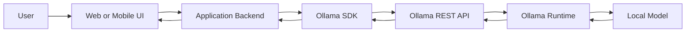
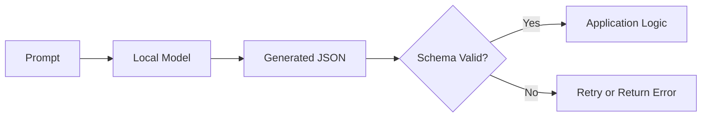
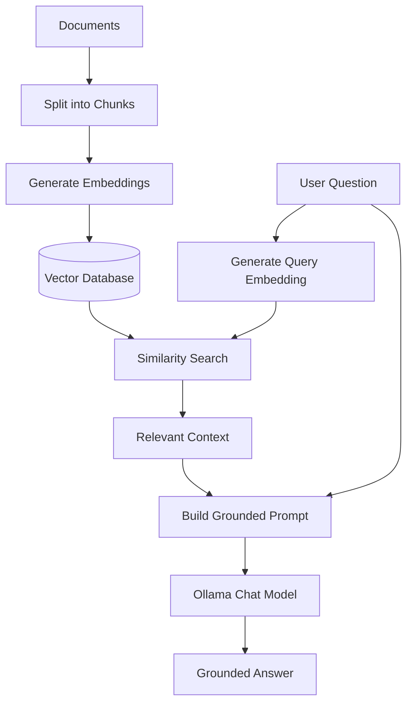
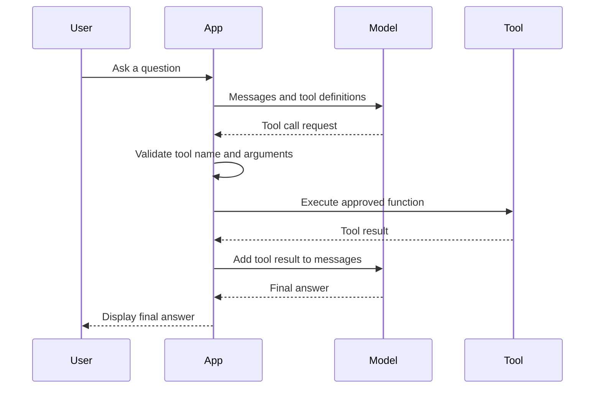
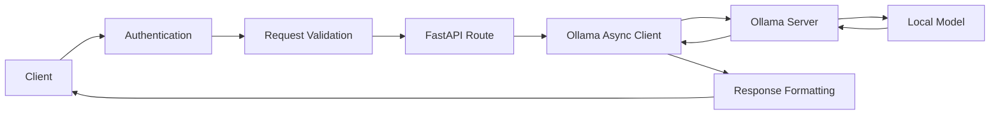
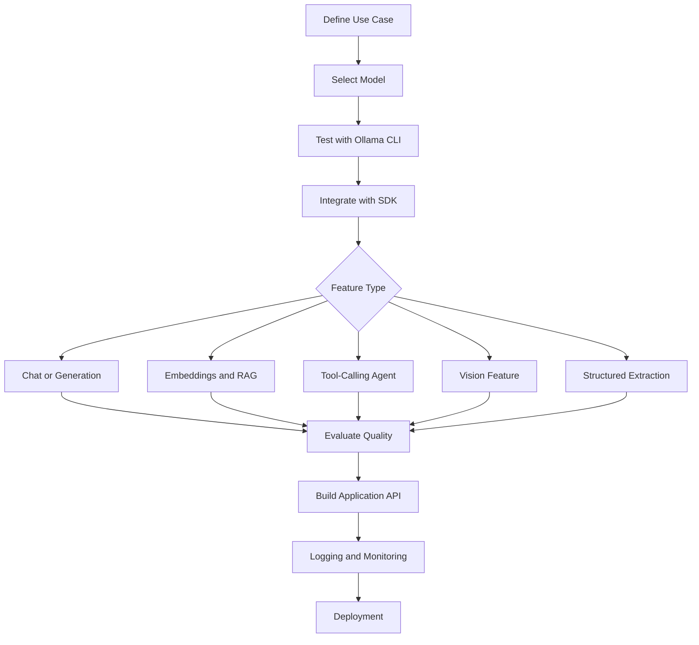
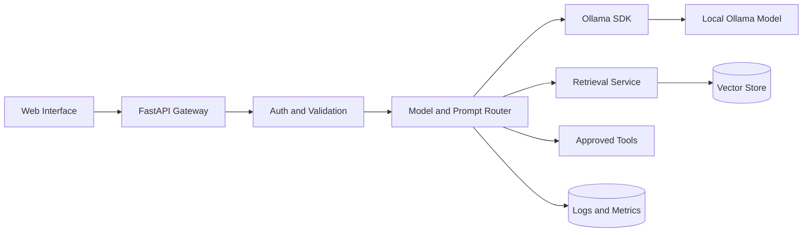

# 012 — Ollama SDK

**Course:** 02 — Model Platforms and Prompting
**Module:** Module 07 — Open-Source AI
**Content Group:** Local and JavaScript Runtime
**Roadmap Source:** Open-Source AI / Local and JavaScript Runtime
**Lesson Type:** Open-Source AI
**Lesson Order:** 012
**Suggested Duration:** 20 minutes

---

## 1. Overview

The **Ollama SDK** provides a convenient way to integrate models running through Ollama into Python, JavaScript, and TypeScript applications.

Instead of manually constructing HTTP requests to the Ollama REST API, developers can use high-level SDK methods for:

* Chat completion
* Text generation
* Streaming
* Structured output
* Embeddings
* Retrieval-Augmented Generation
* Tool calling
* Multimodal input
* Model management
* Error handling

Ollama currently provides official libraries for Python and JavaScript. Both libraries are designed around the Ollama REST API.

By the end of this lesson, you should understand where the Ollama SDK fits in an AI application and how to build a small local AI service with it.

---

## 2. Learning Objectives

After completing this lesson, you should be able to:

1. Explain what the Ollama SDK is in your own words.
2. Distinguish between Ollama, an Ollama model, the REST API, and the SDK.
3. Call a local model from Python or JavaScript.
4. stream model output to an application.
5. Generate validated structured JSON.
6. Use embeddings in a small RAG pipeline.
7. Connect an Ollama model to application tools.
8. Wrap Ollama with a FastAPI backend.
9. Identify common development and production issues.

---

## 3. What Is the Ollama SDK?

The Ollama SDK is a language-specific client library for communicating with an Ollama server.

It is important to distinguish the following components:

| Component            | Responsibility                                                      |
| -------------------- | ------------------------------------------------------------------- |
| **Model**            | Contains the trained model weights                                  |
| **Ollama runtime**   | Loads and runs the model                                            |
| **Ollama REST API**  | Exposes model operations over HTTP                                  |
| **Ollama SDK**       | Provides convenient Python or JavaScript methods                    |
| **Your application** | Handles business logic, UI, authentication, storage, and monitoring |

The SDK does not replace the Ollama runtime. Ollama must still be installed and running, unless the SDK is configured to connect to another Ollama server.



---

## 4. SDK vs CLI vs REST API

Ollama can be accessed in three common ways.

### Ollama CLI

Use the command-line interface for:

* Testing models manually
* Pulling models
* Inspecting installed models
* Creating custom models
* Running quick experiments

```bash
ollama run gemma3
```

### Ollama REST API

Use the REST API when:

* Your programming language does not have an SDK.
* You need direct control over HTTP requests.
* You are building a custom client.
* You want to inspect raw request and response payloads.

```bash
curl http://localhost:11434/api/chat \
  -H "Content-Type: application/json" \
  -d '{
    "model": "gemma3",
    "messages": [
      {
        "role": "user",
        "content": "Explain local AI in one sentence."
      }
    ],
    "stream": false
  }'
```

### Ollama SDK

Use an SDK when:

* You are developing with Python, JavaScript, or TypeScript.
* You want typed request and response objects.
* You need simpler streaming support.
* You want cleaner error handling.
* You want to integrate chat, embeddings, tools, or images quickly.

---

## 5. Environment Setup

### Step 1: Install Ollama

Install Ollama for your operating system and make sure the service is running.

Verify the installation:

```bash
ollama --version
```

### Step 2: Pull a Model

```bash
ollama pull gemma3
```

For embeddings:

```bash
ollama pull embeddinggemma
```

### Step 3: Verify the Model

```bash
ollama run gemma3 "Return exactly: Ollama is working."
```

### Step 4: Install an SDK

Python:

```bash
pip install ollama
```

JavaScript or TypeScript:

```bash
npm install ollama
```

The Python SDK requires an available Ollama server and a previously downloaded model.

---

## 6. Python SDK Quick Start

Create a file named `chat_demo.py`:

```python
from ollama import ChatResponse, chat


def main() -> None:
    response: ChatResponse = chat(
        model="gemma3",
        messages=[
            {
                "role": "system",
                "content": "You are a concise AI engineering tutor.",
            },
            {
                "role": "user",
                "content": "What is the role of an inference runtime?",
            },
        ],
    )

    print(response.message.content)


if __name__ == "__main__":
    main()
```

Run it:

```bash
python chat_demo.py
```

The `messages` array represents the conversation history. Common roles include:

* `system`: Defines behavior and instructions.
* `user`: Contains the user's request.
* `assistant`: Contains previous model responses.
* `tool`: Contains results returned by application tools.

---

## 7. JavaScript SDK Quick Start

Create a file named `chat-demo.mjs`:

```javascript
import ollama from "ollama";

async function main() {
  try {
    const response = await ollama.chat({
      model: "gemma3",
      messages: [
        {
          role: "system",
          content: "You are a concise AI engineering tutor.",
        },
        {
          role: "user",
          content: "What is the role of an inference runtime?",
        },
      ],
    });

    console.log(response.message.content);
  } catch (error) {
    console.error("Ollama request failed:", error);
    process.exitCode = 1;
  }
}

main();
```

Run it:

```bash
node chat-demo.mjs
```

The JavaScript SDK can also be imported through its browser-specific module:

```javascript
import ollama from "ollama/browser";
```

However, directly exposing an Ollama server to a public browser application can create security and access-control risks. A backend proxy is usually safer for production applications.

---

## 8. Chat vs Generate

The SDK commonly provides two related operations.

### `chat`

Use `chat` for applications that maintain messages and conversation history.

```python
from ollama import chat

response = chat(
    model="gemma3",
    messages=[
        {"role": "user", "content": "What is quantization?"},
    ],
)

print(response.message.content)
```

### `generate`

Use `generate` for a direct prompt without a chat-style message list.

```python
from ollama import generate

response = generate(
    model="gemma3",
    prompt="Define model quantization in one paragraph.",
)

print(response.response)
```

The official Python library exposes operations such as `chat`, `generate`, `list`, `show`, `create`, and `copy`, following the structure of the REST API.

### Selection Rule

```text
Use chat     → conversations, assistants, agents and chat history
Use generate → simple prompt-to-text generation
```

---

## 9. Streaming Responses

Without streaming, the application waits until the complete response has been generated.

With streaming, partial output is delivered as it becomes available.

Streaming is useful for:

* Chat interfaces
* Long answers
* Code generation
* Lower perceived latency
* Server-Sent Events
* Terminal assistants

The Ollama REST API streams by default, while streaming is disabled by default in the SDKs and must be enabled with the `stream` option.

### Python Streaming

```python
from ollama import chat


stream = chat(
    model="gemma3",
    messages=[
        {
            "role": "user",
            "content": "Explain RAG in five short steps.",
        }
    ],
    stream=True,
)

for chunk in stream:
    print(chunk.message.content, end="", flush=True)

print()
```

### JavaScript Streaming

```javascript
import ollama from "ollama";

const stream = await ollama.chat({
  model: "gemma3",
  messages: [
    {
      role: "user",
      content: "Explain RAG in five short steps.",
    },
  ],
  stream: true,
});

for await (const chunk of stream) {
  process.stdout.write(chunk.message.content);
}
```

### Important Streaming Rule

Do not assume every chunk contains a complete word, sentence, JSON object, or tool call.

Your application may need to accumulate:

* Text content
* Thinking fields
* Tool calls
* Usage information
* Final completion metadata

---

## 10. Structured Outputs

Natural-language model responses are difficult to use directly in application logic.

Structured outputs allow the application to request a response that follows a JSON schema.

This is useful for:

* Classification
* Information extraction
* API responses
* Form generation
* Routing
* Evaluation
* Data pipelines

Ollama supports passing a JSON schema through the `format` parameter. The documentation recommends validating Python responses with Pydantic or JavaScript responses with Zod.

### Python Example with Pydantic

```python
from typing import Literal

from ollama import chat
from pydantic import BaseModel, Field


class TicketClassification(BaseModel):
    category: Literal["billing", "technical", "account", "other"]
    priority: Literal["low", "medium", "high"]
    summary: str = Field(min_length=1, max_length=200)


response = chat(
    model="gemma3",
    messages=[
        {
            "role": "user",
            "content": (
                "Classify this support ticket: "
                "I cannot sign in after changing my password."
            ),
        }
    ],
    format=TicketClassification.model_json_schema(),
    options={"temperature": 0},
)

result = TicketClassification.model_validate_json(
    response.message.content
)

print(result.model_dump())
```

Example output:

```json
{
  "category": "account",
  "priority": "high",
  "summary": "The user cannot sign in after changing their password."
}
```

### Production Rule

A schema improves reliability, but the model output must still be validated.



---

## 11. Embeddings and RAG

Embeddings transform text into numeric vectors that represent semantic meaning.

They can be used for:

* Semantic search
* Similarity matching
* Document retrieval
* Recommendation systems
* Retrieval-Augmented Generation

Ollama provides an embedding API for single inputs and batches. The same embedding model should be used for indexing documents and embedding user queries.

### Generate an Embedding

```python
import ollama


response = ollama.embed(
    model="embeddinggemma",
    input="Ollama runs language models through a local inference service.",
)

vector = response.embeddings[0]

print("Embedding dimensions:", len(vector))
print("First five values:", vector[:5])
```

### Generate Embeddings in a Batch

```python
import ollama


documents = [
    "Ollama runs models locally.",
    "FastAPI is a Python web framework.",
    "Embeddings represent semantic meaning.",
]

response = ollama.embed(
    model="embeddinggemma",
    input=documents,
)

print("Generated vectors:", len(response.embeddings))
```

### Basic RAG Architecture



### Minimal In-Memory Retrieval Example

```python
from math import sqrt

import ollama


DOCUMENTS = [
    "Ollama provides a runtime for running supported AI models.",
    "The Python SDK communicates with the Ollama API.",
    "Embeddings can be used to retrieve semantically similar documents.",
]


def cosine_similarity(a: list[float], b: list[float]) -> float:
    numerator = sum(x * y for x, y in zip(a, b))
    denominator_a = sqrt(sum(x * x for x in a))
    denominator_b = sqrt(sum(y * y for y in b))

    if denominator_a == 0 or denominator_b == 0:
        return 0.0

    return numerator / (denominator_a * denominator_b)


document_response = ollama.embed(
    model="embeddinggemma",
    input=DOCUMENTS,
)

question = "How does a Python application communicate with Ollama?"

query_response = ollama.embed(
    model="embeddinggemma",
    input=question,
)

query_vector = query_response.embeddings[0]

ranked_documents = sorted(
    zip(DOCUMENTS, document_response.embeddings),
    key=lambda item: cosine_similarity(query_vector, item[1]),
    reverse=True,
)

context = ranked_documents[0][0]

answer = ollama.chat(
    model="gemma3",
    messages=[
        {
            "role": "system",
            "content": (
                "Answer using only the supplied context. "
                "Say that the context is insufficient when necessary."
            ),
        },
        {
            "role": "user",
            "content": f"Context:\n{context}\n\nQuestion:\n{question}",
        },
    ],
)

print(answer.message.content)
```

This example is suitable for learning but not for a large production dataset. A real system would normally use a vector database and an explicit chunking, indexing, filtering, and evaluation strategy.

---

## 12. Tool Calling

Tool calling allows the model to request that application code execute a function.

For example, an assistant may need to:

* Query a database
* Check the weather
* Search documents
* Call an internal API
* Create a calendar event
* Run a calculation
* Retrieve account information

The model does not automatically execute the tool. It generates a structured tool request, and the application decides whether and how to execute it. Ollama supports both individual tool calls and multi-turn agent loops.



### Python Tool Example

```python
from ollama import chat


def calculate_total(price: float, quantity: int) -> float:
    """Calculate the total price.

    Args:
        price: Price of one item.
        quantity: Number of items.

    Returns:
        The total price.
    """
    return price * quantity


messages = [
    {
        "role": "user",
        "content": "What is the total price of 7 items costing 12.5 each?",
    }
]

response = chat(
    model="gemma3",
    messages=messages,
    tools=[calculate_total],
)

messages.append(response.message)

for tool_call in response.message.tool_calls or []:
    if tool_call.function.name != "calculate_total":
        continue

    result = calculate_total(**tool_call.function.arguments)

    messages.append(
        {
            "role": "tool",
            "tool_name": tool_call.function.name,
            "content": str(result),
        }
    )

if response.message.tool_calls:
    final_response = chat(
        model="gemma3",
        messages=messages,
        tools=[calculate_total],
    )

    print(final_response.message.content)
else:
    print(response.message.content)
```

### Tool Security Rules

Never execute arbitrary tool calls directly.

The application should:

1. Maintain an allowlist of supported tools.
2. Validate all arguments.
3. Authenticate the requesting user.
4. Check authorization before accessing data.
5. Apply timeouts.
6. Limit retries and agent-loop iterations.
7. Record tool execution logs.
8. Require confirmation for destructive operations.

---

## 13. Vision and Multimodal Input

Vision-capable models can accept images together with text.

Possible use cases include:

* Image description
* Screenshot analysis
* Document understanding
* Object classification
* Diagram explanation
* Visual question answering

The Ollama SDKs can accept image paths, URLs, or raw bytes, while the REST API expects encoded image data.

### Python Vision Example

```python
from pathlib import Path

from ollama import chat


image_path = Path("example.jpg")

if not image_path.exists():
    raise FileNotFoundError(f"Image not found: {image_path}")

response = chat(
    model="gemma4",
    messages=[
        {
            "role": "user",
            "content": "Describe this image in three bullet points.",
            "images": [str(image_path)],
        }
    ],
)

print(response.message.content)
```

The selected model must support image input. A text-only model cannot interpret an image merely because an `images` field is supplied.

---

## 14. FastAPI Wrapper Demo

A backend wrapper provides a controlled interface between clients and Ollama.

It can handle:

* Authentication
* Model allowlists
* Request validation
* Prompt templates
* Rate limiting
* Logging
* Timeouts
* Error mapping
* Streaming
* Usage policies

### Installation

```bash
pip install fastapi uvicorn ollama
```

### Application

Create `app.py`:

```python
from typing import Literal

from fastapi import FastAPI, HTTPException
from ollama import AsyncClient, ResponseError
from pydantic import BaseModel, Field


app = FastAPI(title="Local AI Assistant")

ollama_client = AsyncClient(
    host="http://localhost:11434",
)

ALLOWED_MODELS = {
    "gemma3",
}


class ChatRequest(BaseModel):
    message: str = Field(min_length=1, max_length=4_000)
    model: Literal["gemma3"] = "gemma3"


class ChatResult(BaseModel):
    model: str
    answer: str


@app.get("/health")
async def health() -> dict[str, str]:
    return {"status": "ok"}


@app.post("/chat", response_model=ChatResult)
async def create_chat(request: ChatRequest) -> ChatResult:
    if request.model not in ALLOWED_MODELS:
        raise HTTPException(
            status_code=400,
            detail="The requested model is not allowed.",
        )

    try:
        response = await ollama_client.chat(
            model=request.model,
            messages=[
                {
                    "role": "system",
                    "content": (
                        "You are a helpful local AI assistant. "
                        "Keep answers concise and factual."
                    ),
                },
                {
                    "role": "user",
                    "content": request.message,
                },
            ],
        )
    except ResponseError as error:
        status_code = error.status_code or 502

        raise HTTPException(
            status_code=status_code,
            detail=error.error,
        ) from error
    except Exception as error:
        raise HTTPException(
            status_code=503,
            detail="The local model service is unavailable.",
        ) from error

    return ChatResult(
        model=request.model,
        answer=response.message.content,
    )
```

Run the server:

```bash
uvicorn app:app --reload
```

Test it:

```bash
curl http://127.0.0.1:8000/chat \
  -H "Content-Type: application/json" \
  -d '{
    "message": "Explain the difference between an SDK and an API."
  }'
```

### Request Flow



---

## 15. Error Handling

The SDK may raise errors when:

* Ollama is not running.
* The requested model is unavailable.
* The model cannot fit in memory.
* The server returns a non-success status.
* A streaming request fails.
* The request contains unsupported parameters.
* The output cannot be validated.

The Python library raises `ResponseError` for API and streaming errors. Its documentation demonstrates pulling a model after receiving a `404` response.

```python
import ollama
from ollama import ResponseError


model = "gemma3"

try:
    response = ollama.chat(
        model=model,
        messages=[
            {
                "role": "user",
                "content": "Hello!",
            }
        ],
    )

    print(response.message.content)

except ResponseError as error:
    print("Ollama error:", error.error)

    if error.status_code == 404:
        print(f"Pulling missing model: {model}")
        ollama.pull(model)

except ConnectionError:
    print("Cannot connect to Ollama. Check whether the service is running.")
```

Do not automatically download arbitrary model names supplied by an unauthenticated client.

---

## 16. Where the SDK Fits in an AI Engineer Workflow



The SDK belongs to the application integration layer. It connects product code to the model runtime but does not replace:

* Model evaluation
* Prompt design
* Retrieval design
* Application security
* Monitoring
* Infrastructure management
* User-experience design

---

## 17. When to Use the Ollama SDK

The Ollama SDK is a good choice when:

* You need local development without depending on a closed API.
* Sensitive data should remain inside a controlled environment.
* You want to experiment with several compatible models.
* Internet connectivity is unreliable or unavailable.
* You are building a local assistant or developer tool.
* You need control over the model runtime.
* You want to learn how inference systems work.
* You want predictable infrastructure instead of per-request API billing.

It may not be the best choice when:

* The available hardware cannot run the required model.
* You need very high global throughput immediately.
* You do not want to manage inference infrastructure.
* The required model quality is only available through a managed provider.
* You require a strict enterprise service-level agreement that your local deployment cannot provide.
* Mobile or browser devices cannot access the Ollama host securely.

---

## 18. Model Selection Checklist

Before selecting a model, evaluate:

### Capability

* Does it support chat?
* Does it support tool calling?
* Does it support structured output?
* Does it support vision?
* Does it support embeddings?
* Does it support the required languages?

### Hardware

* How much RAM or VRAM is required?
* Can the model run entirely on the GPU?
* What happens when part of the model runs on the CPU?
* What context length can the machine support?

### Performance

* Time to first token
* Tokens generated per second
* Total response latency
* Concurrent-request capacity
* Model loading time

### Quality

* Instruction-following quality
* Domain accuracy
* Hallucination rate
* JSON validity
* Tool-selection accuracy
* Retrieval-grounding quality

### Legal and Operational Considerations

* Model license
* Commercial-use permissions
* Data-handling requirements
* Model source and version
* Update process
* Security review
* Reproducibility requirements

The Ollama software license and the model license are separate concerns. A model distributed through a model library may have its own restrictions.

---

## 19. Production Checklist

### API and Security

* Do not expose the Ollama port directly to the public internet.
* Place authentication and authorization in the application layer.
* Validate request size and content.
* Use a server-controlled model allowlist.
* Protect tool calls with explicit authorization checks.
* Apply rate limits and concurrency limits.
* Avoid logging secrets or complete sensitive prompts.
* Restrict network access for tools.

### Reliability

* Add request timeouts.
* Add bounded retries only for retryable failures.
* Limit agent-loop iterations.
* Provide fallbacks for unavailable models.
* Handle model loading and cold starts.
* Add health and readiness endpoints.
* Gracefully handle malformed model output.

### Observability

Log useful metadata such as:

```text
request_id
user_id
model_name
prompt_version
input_length
output_length
time_to_first_token
total_latency
tool_calls
retrieved_document_ids
validation_status
error_type
```

Do not treat model output as automatically correct merely because the request completed successfully.

### Evaluation

Maintain test datasets for:

* Expected answers
* Unsupported questions
* Prompt-injection attempts
* Tool-calling decisions
* JSON schema compliance
* Retrieval relevance
* Multilingual behavior
* Long-context behavior
* Safety requirements

---

## 20. Common Mistakes

### Mistake 1: Treating the SDK as the Runtime

The SDK sends requests. Ollama loads and runs the model.

### Mistake 2: Forgetting to Pull the Model

An installed SDK does not automatically mean the requested model is available.

### Mistake 3: Sending Every Request with No Limits

Large prompts, long contexts, and unlimited output can exhaust resources.

### Mistake 4: Keeping Chat History Forever

Conversation history increases the context size and latency. Applications need a memory strategy such as:

* Recent-message windows
* Conversation summaries
* Retrieval-based memory
* Token-budget limits

### Mistake 5: Trusting Structured Output Without Validation

A JSON-looking string can still contain missing fields, incorrect types, or invalid values.

### Mistake 6: Executing Arbitrary Tool Calls

Tool names and arguments generated by a model must be validated before execution.

### Mistake 7: Using Different Embedding Models

Documents and search queries should be embedded with the same model and preprocessing strategy.

### Mistake 8: Assuming Local Means Automatically Private

Data may still be exposed through:

* Application logs
* Analytics systems
* Remote Ollama hosts
* Tool integrations
* Cloud storage
* Improper network configuration

### Mistake 9: Testing Only the Happy Path

A production test plan should include:

* Missing models
* Server downtime
* Invalid JSON
* Empty responses
* Interrupted streams
* Oversized prompts
* Tool timeouts
* Concurrent requests
* Insufficient memory

---

## 21. Debugging Guide

### Error: Connection Refused

Possible cause:

* Ollama is not running.
* The host or port is incorrect.
* A container cannot reach the host service.

Checks:

```bash
ollama list
```

```bash
curl http://localhost:11434/api/tags
```

### Error: Model Not Found

Check installed models:

```bash
ollama list
```

Pull the model:

```bash
ollama pull gemma3
```

### Problem: Response Is Too Slow

Investigate:

* Model size
* Quantization
* CPU versus GPU execution
* Prompt length
* Context length
* Output token limit
* Concurrent requests
* Model loading time

### Problem: Invalid Structured Output

Try:

* Using a smaller and clearer schema
* Setting temperature to zero
* Including the schema requirements in the prompt
* Validating with Pydantic or Zod
* Retrying with a strict repair prompt
* Recording the invalid output for evaluation

### Problem: Tool Is Not Called

Check:

* Whether the selected model supports tool calling
* Tool descriptions
* Parameter schemas
* User prompt clarity
* Whether the tool is actually necessary
* Tool-calling evaluation examples

### Problem: Weak RAG Results

Check:

* Chunk size
* Chunk overlap
* Embedding model
* Query rewriting
* Metadata filters
* Number of retrieved chunks
* Similarity threshold
* Whether retrieved context is included clearly in the final prompt

---

## 22. Practical Exercise

Build a small local AI assistant with the following requirements.

### Required Features

1. Create a FastAPI route named `/chat`.
2. Use the Ollama Python SDK.
3. Keep the selected model on a server-side allowlist.
4. Validate the request with Pydantic.
5. Add a system prompt.
6. Return the answer as JSON.
7. Handle a missing-model error.
8. Record request latency.
9. Add one automated test.
10. Document one known limitation.

### Optional Extensions

Choose one:

* Add streaming with Server-Sent Events.
* Add structured JSON output.
* Add an embedding-based document search.
* Add a calculator tool.
* Add image analysis.
* Compare the local response with a cloud LLM response.

---

## 23. Suggested Portfolio Project

### Project 6: Local AI Assistant

Build a local AI assistant using:

* Ollama
* Ollama Python SDK
* FastAPI
* A simple web interface
* Optional vector storage
* Docker or local process management
* Request logging
* Evaluation scripts

### Suggested Architecture



### Comparison Experiment

Compare the local model with a cloud model using:

| Metric              | Local Ollama Model | Cloud Model |
| ------------------- | -----------------: | ----------: |
| Time to first token |            Measure |     Measure |
| Total latency       |            Measure |     Measure |
| Output quality      |              Score |       Score |
| JSON validity       |         Percentage |  Percentage |
| Tool accuracy       |         Percentage |  Percentage |
| Infrastructure cost |           Estimate |    Estimate |
| Privacy control     |           Evaluate |    Evaluate |
| Operational effort  |           Evaluate |    Evaluate |

Do not compare only one prompt. Use a repeatable evaluation dataset.

---

## 24. Five-Line Recall Exercise

Without looking at the lesson, explain:

1. What the Ollama SDK is.
2. How it differs from the Ollama runtime.
3. How streaming changes the application experience.
4. How embeddings support RAG.
5. Why model output must still be validated.

---

## 25. Completion Checklist

* [ ] I can explain the Ollama SDK in one or two minutes.
* [ ] I understand the difference between the CLI, REST API, and SDK.
* [ ] I can call an Ollama model from Python or JavaScript.
* [ ] I can stream a model response.
* [ ] I can request and validate structured output.
* [ ] I can generate embeddings for retrieval.
* [ ] I understand the tool-calling execution loop.
* [ ] I have created a small FastAPI wrapper.
* [ ] I know at least one production limitation.
* [ ] I have documented one error and its debugging process.

---

## 26. Related Outcome

Know when to use:

* Closed model APIs
* Open-source models
* Hugging Face tools
* Local inference
* Ollama CLI
* Ollama REST API
* Ollama SDKs

The correct choice depends on model quality, privacy, hardware, latency, cost, operational capacity, licensing, and product requirements.

---

## 27. Summary

The **Ollama SDK** is the integration layer between application code and the Ollama model runtime.

It makes it easier to build:

* Local chat applications
* Structured extraction pipelines
* RAG systems
* Tool-using agents
* Multimodal features
* FastAPI services
* Private AI assistants

However, using a local model does not remove the need for engineering discipline.

A production-quality Ollama application still requires:

* Input validation
* Output validation
* Model evaluation
* Access control
* Tool security
* Resource management
* Logging
* Monitoring
* Failure handling

The most effective way to learn the Ollama SDK is to turn it into a working application rather than memorizing its methods.
