# 002 — Use Cases for Embeddings

**Course:** 03 — Knowledge Systems and RAG
**Module:** Module 08 — Embeddings and Vector Databases
**Topic Group:** Embeddings
**Roadmap Source:** Embeddings and Vector Databases / Embeddings
**Lesson Type:** Embeddings and Vector Databases
**Module Order:** 002
**Suggested Duration:** 24 minutes

---

## 1. Overview

Embeddings allow AI systems to represent text, images, audio, users, products, and other objects as numerical vectors.

These vectors capture meaningful characteristics of the original data. Objects with similar meanings or properties are usually located close to one another in the vector space.

For example:

* “How do I reset my password?”
* “I forgot my password.”
* “Help me recover access to my account.”

These sentences use different words, but they express similar intentions. A good embedding model should place their vectors close together.

Embeddings are commonly used to build:

* Semantic search engines
* Retrieval-Augmented Generation systems
* Recommendation systems
* Classification systems
* Clustering and topic discovery tools
* Duplicate detection systems
* Anomaly detection systems
* Multimodal search applications
* Long-term memory for AI agents

The value of embeddings is not simply converting data into vectors. The real value comes from designing a complete retrieval or similarity system around those vectors.

---

## 2. Learning Objectives

By the end of this lesson, you should be able to:

* Explain the most important use cases for embeddings.
* Identify where embeddings appear in an AI application workflow.
* Distinguish semantic search from keyword search.
* Explain how embeddings support RAG, recommendations, classification, and clustering.
* Design a basic embedding pipeline with chunking, metadata, indexing, and retrieval.
* Select an appropriate similarity metric.
* Evaluate retrieval quality using realistic test queries.
* Identify common failure cases in embedding-based systems.
* Build a small embedding-based portfolio project.

---

## 3. The Core Embedding Workflow

A typical embedding system contains two main workflows:

1. An **indexing workflow**, which prepares and stores data.
2. A **query workflow**, which searches the stored data.

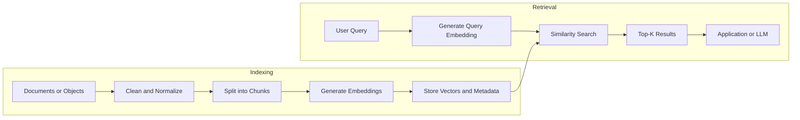

A simplified version is:

```text
data
  -> preprocessing
  -> chunking
  -> embedding model
  -> vector index
  -> similarity search
  -> top-k results
  -> application
```

For text retrieval:

```text
documents -> chunks -> document vectors -> vector database
user query -> query vector -> similarity search -> relevant chunks
```

The quality of the final system depends on every stage, not only the embedding model.

---

## 4. Semantic Search

### 4.1 What Is Semantic Search?

Semantic search finds results based on meaning rather than exact keyword matches.

Suppose a document contains:

> Employees may work remotely for up to three days per week.

A user searches for:

> How often can I work from home?

A traditional keyword search may struggle because the query does not contain the exact phrases “remotely” or “three days per week.”

Semantic search can recognize that:

* “work from home” is related to “work remotely”
* “how often” is related to the number of permitted days

### 4.2 Semantic Search Workflow

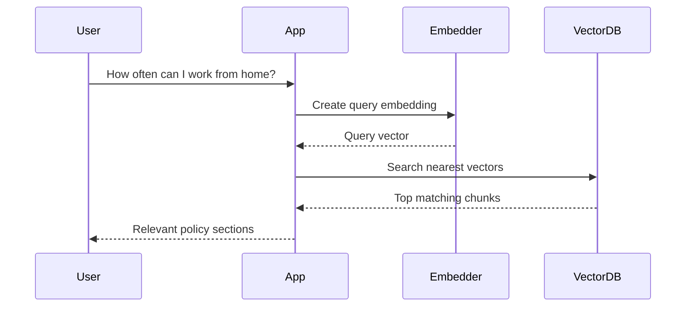

### 4.3 Common Applications

Semantic search is useful for:

* Internal company documentation
* Help centers and support articles
* Product catalogs
* Legal documents
* Research papers
* Technical documentation
* Markdown repositories
* PDF libraries
* Educational content
* Source-code documentation

### 4.4 Semantic Search vs. Keyword Search

| Feature                 | Keyword Search          | Semantic Search                   |
| ----------------------- | ----------------------- | --------------------------------- |
| Matching method         | Exact words and phrases | Meaning and contextual similarity |
| Handles synonyms        | Limited                 | Usually strong                    |
| Handles paraphrases     | Limited                 | Usually strong                    |
| Exact identifier search | Strong                  | Often weaker                      |
| Explainability          | Easier                  | More difficult                    |
| Main data structure     | Inverted index          | Vector index                      |
| Typical examples        | BM25, Elasticsearch     | FAISS, Qdrant, Chroma             |

Semantic search is not always better than keyword search.

Keyword search is often more reliable for:

* Product codes
* Error codes
* Names
* Dates
* Version numbers
* Exact quotations
* Rare technical identifiers

For production systems, combining keyword and vector search is often more effective than using either method alone.

This approach is called **hybrid search**.

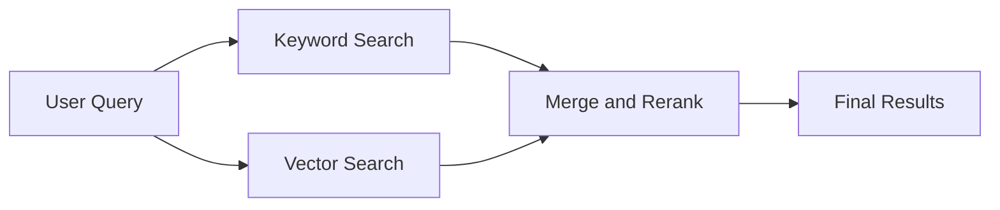

---

## 5. Retrieval-Augmented Generation

### 5.1 What Is RAG?

Retrieval-Augmented Generation, or RAG, gives an LLM relevant external context before it generates an answer.

Instead of expecting the model to know everything, the system:

1. Retrieves relevant information.
2. Adds that information to the prompt.
3. Asks the model to answer using the retrieved context.

Embeddings are commonly used during the retrieval stage.

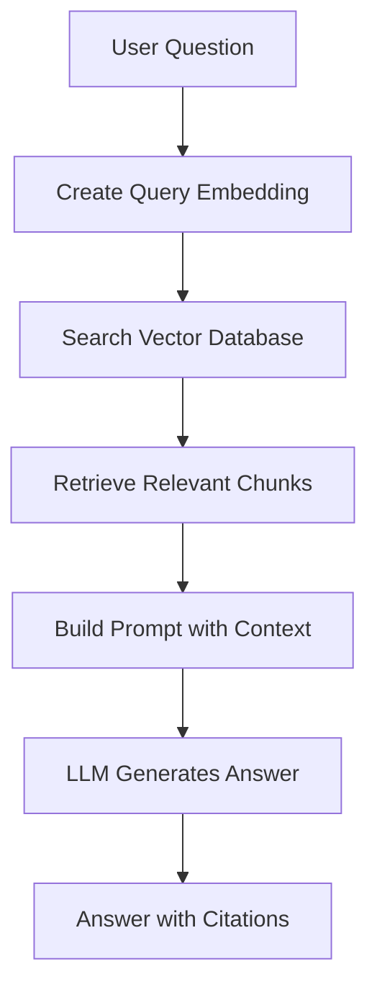

### 5.2 Example

User question:

```text
What is the company's parental leave policy?
```

Retrieved context:

```text
Source: employee-handbook.pdf, page 42

Full-time employees are eligible for 16 weeks of paid parental leave
after completing six months of employment.
```

Generated prompt:

```text
Answer the user's question using only the provided context.

Context:
Full-time employees are eligible for 16 weeks of paid parental leave
after completing six months of employment.

Question:
What is the company's parental leave policy?

Include the source in your answer.
```

Possible answer:

```text
Full-time employees may receive 16 weeks of paid parental leave after
completing six months of employment.

Source: employee-handbook.pdf, page 42.
```

### 5.3 Why Metadata Matters

Each stored vector should normally include metadata such as:

```json
{
  "document_id": "employee-handbook",
  "source": "employee-handbook.pdf",
  "page": 42,
  "section": "Parental Leave",
  "language": "en",
  "updated_at": "2026-06-15",
  "access_level": "employee"
}
```

Metadata allows the application to:

* Display citations
* Filter by document type
* Restrict access to authorized users
* Prefer recent information
* Filter by language
* Trace incorrect answers back to their source
* Remove or update specific documents

Without metadata, retrieved text may be useful but difficult to verify or manage.

---

## 6. Recommendation Systems

Embeddings can represent both users and items in the same or compatible vector spaces.

Examples of items include:

* Products
* Movies
* Songs
* Articles
* Courses
* Jobs
* Travel destinations
* Social media posts

If a user vector is close to an item vector, the system may recommend that item.

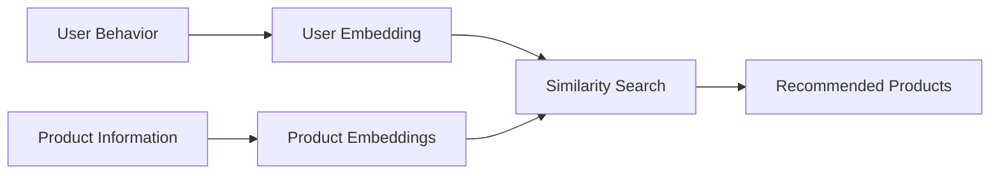

### 6.1 Content-Based Recommendation

A content-based system recommends items similar to items the user already likes.

For example, if a user reads articles about:

* Vector databases
* RAG evaluation
* Semantic search

The system may recommend:

* Hybrid retrieval
* Reranking models
* Embedding model selection

### 6.2 Collaborative Embeddings

A collaborative system learns from user-item interactions.

Interactions might include:

* Clicks
* Purchases
* Ratings
* Watch time
* Saves
* Likes
* Skips

The model learns embeddings where users and items with compatible interaction patterns are close together.

### 6.3 Cold-Start Support

Embeddings can reduce the cold-start problem.

A new product may not have any interactions yet, but the system can still generate an embedding from:

* Product title
* Description
* Category
* Image
* Brand
* Technical specifications

It can then recommend the product based on content similarity.

---

## 7. Classification with Embeddings

Embeddings can be used as features for classification.

A common workflow is:

```text
input text
  -> embedding vector
  -> classifier
  -> predicted category
```

Possible classification tasks include:

* Support ticket routing
* Intent detection
* Topic classification
* Content moderation
* Sentiment analysis
* Email categorization
* Document type detection
* Customer feedback classification

### 7.1 Supervised Classification

With labeled training data, embeddings can be passed to a traditional classifier such as:

* Logistic regression
* Support Vector Machine
* Random forest
* Neural network

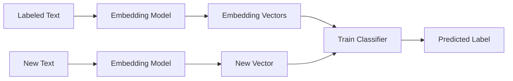

### 7.2 Example

Training data:

| Text                      | Label           |
| ------------------------- | --------------- |
| “I was charged twice.”    | billing         |
| “My payment failed.”      | billing         |
| “I cannot sign in.”       | account_access  |
| “Reset my password.”      | account_access  |
| “The app keeps crashing.” | technical_issue |

The embedding captures the meaning of each message. The classifier learns boundaries between categories.

### 7.3 Zero-Shot Classification Using Label Embeddings

A simpler method compares an input embedding with embeddings of label descriptions.

Labels:

```text
billing: Questions about payments, invoices, refunds, and charges.
account_access: Problems related to login, passwords, and account recovery.
technical_issue: Errors, crashes, and unexpected application behavior.
```

The system embeds both the user message and each label description, then selects the closest label.

This approach is easy to implement, although it may be less accurate than a trained classifier.

---

## 8. Clustering and Topic Discovery

Clustering groups similar vectors without requiring predefined labels.

This can help discover patterns in large datasets.

Common use cases include:

* Grouping customer feedback
* Discovering common support issues
* Organizing research documents
* Detecting themes in survey responses
* Grouping similar news articles
* Organizing product catalogs
* Discovering repeated application errors

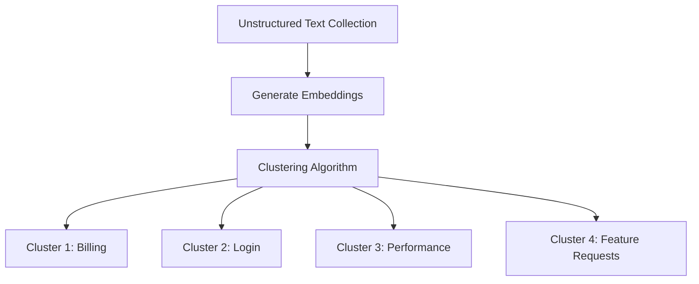

Possible clustering algorithms include:

* K-means
* Hierarchical clustering
* DBSCAN
* HDBSCAN

After clustering, an LLM can summarize each cluster and propose a human-readable topic name.

Example:

```text
Cluster samples:
- The mobile app takes too long to open.
- Search results load very slowly.
- The dashboard freezes after login.

Generated cluster name:
Application performance problems
```

---

## 9. Duplicate and Near-Duplicate Detection

Embeddings can identify content that expresses the same idea with different wording.

Examples include:

* Duplicate support tickets
* Repeated bug reports
* Similar questions in a forum
* Duplicate product listings
* Reposted articles
* Similar resumes
* Repeated user feedback

### Example

Ticket A:

```text
The checkout page freezes when I click Pay.
```

Ticket B:

```text
Payment cannot be completed because checkout stops responding.
```

Keyword overlap is limited, but their embeddings may be highly similar.

A duplicate detection system can compare the new ticket with existing ticket vectors and flag matches above a chosen threshold.

```python
if similarity_score >= 0.90:
    status = "likely_duplicate"
elif similarity_score >= 0.80:
    status = "possible_duplicate"
else:
    status = "new_issue"
```

The threshold must be selected using real validation data. A universal threshold does not work for every model and dataset.

---

## 10. Anomaly Detection

Most normal objects in a dataset form recognizable regions in vector space. An unusual object may be far from those regions.

Embedding-based anomaly detection can help identify:

* Unusual support requests
* Abnormal transactions
* Unexpected system logs
* Out-of-domain user questions
* Low-quality or irrelevant documents
* Suspicious product listings
* Content that does not belong in a collection

Example:

A customer support system mainly handles billing, login, and delivery questions.

A query such as:

```text
Write a Python program that mines cryptocurrency.
```

may be far from the normal support-query clusters. The system can detect it as out-of-domain and route it differently.

Embedding distance alone should not be treated as proof of malicious behavior. It is only one signal that can support a larger detection system.

---

## 11. Agent Memory

AI agents often need to retrieve relevant information from earlier interactions.

Embeddings can support semantic memory by storing:

* User preferences
* Previous decisions
* Completed tasks
* Project facts
* Conversation summaries
* Lessons learned
* Tool results

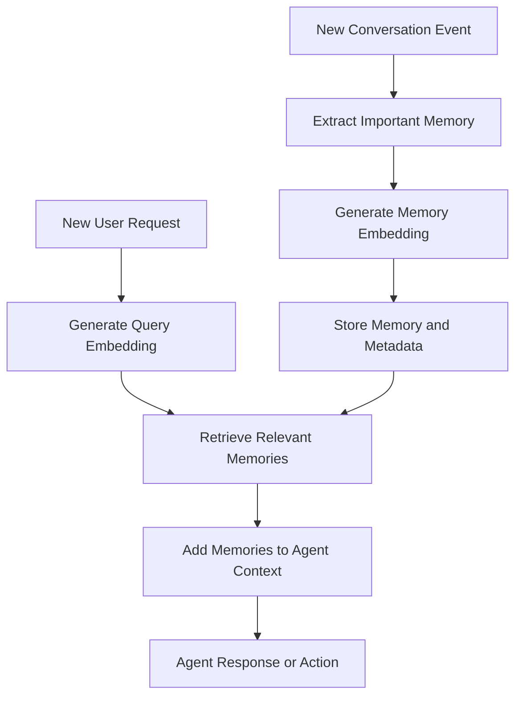

### Example Memories

```json
{
  "content": "The user prefers PostgreSQL for production databases.",
  "memory_type": "preference",
  "source": "conversation",
  "created_at": "2026-07-10"
}
```

```json
{
  "content": "The team decided to deploy the service using Kubernetes.",
  "memory_type": "project_decision",
  "project_id": "lumina",
  "created_at": "2026-07-18"
}
```

When the user asks:

```text
Which database should we use for the new production service?
```

The system can retrieve the PostgreSQL preference even when the query does not repeat the exact original wording.

Important production considerations include:

* User isolation
* Access control
* Memory expiration
* User deletion requests
* Sensitive-data filtering
* Memory confidence
* Source tracking
* Conflict resolution
* Avoiding retrieval of outdated facts

---

## 12. Multimodal Search

Some embedding models can represent different data types in a shared vector space.

This makes it possible to search:

* Images using text
* Text using images
* Videos using descriptions
* Products using photos
* Audio using text descriptions

### Example: Text-to-Image Search

User query:

```text
A red sports car driving through a snowy mountain road
```

The system embeds the text query and compares it with stored image embeddings.

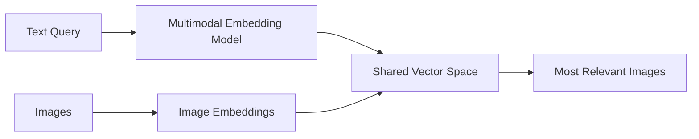

Applications include:

* E-commerce visual search
* Media asset management
* Photo libraries
* Fashion search
* Medical image retrieval
* Video scene search
* Content moderation support

---

## 13. Code and Developer Search

Embeddings can also represent source code and technical descriptions.

A developer may search:

```text
Where is user authentication validated?
```

The relevant code may contain:

```python
def verify_access_token(token: str) -> AuthenticatedUser:
    ...
```

Even without exact keyword matches, a code-aware embedding model may retrieve the correct function.

Useful applications include:

* Repository search
* Code assistant context retrieval
* Finding similar implementations
* Locating configuration files
* Searching API documentation
* Finding tests related to a feature
* Detecting duplicated code logic

Code retrieval systems should preserve metadata such as:

```json
{
  "repository": "lumina_gateway",
  "file_path": "src/auth/token_service.py",
  "symbol": "verify_access_token",
  "start_line": 42,
  "end_line": 71,
  "language": "python",
  "commit": "abc123"
}
```

This metadata enables precise citations and prevents the system from returning code without its location.

---

## 14. Similarity Metrics

Vector search requires a metric that measures how close two vectors are.

The most common metrics are:

### 14.1 Cosine Similarity

Cosine similarity measures the angle between two vectors.

[
\text{cosine similarity}(a,b)
=============================

\frac{a \cdot b}{|a||b|}
]

It focuses primarily on vector direction rather than magnitude.

Common use cases:

* Text similarity
* Semantic search
* Document retrieval

Higher values normally mean greater similarity.

### 14.2 Dot Product

[
a \cdot b = \sum_{i=1}^{n} a_i b_i
]

Dot product considers both direction and magnitude.

It is commonly used when the embedding model was specifically trained for dot-product retrieval.

### 14.3 Euclidean Distance

[
d(a,b)
======

\sqrt{\sum_{i=1}^{n}(a_i-b_i)^2}
]

Lower values mean that vectors are closer.

It is often used for geometric clustering and nearest-neighbor search.

### 14.4 Choosing a Metric

Do not select a metric only because it is popular.

Use the metric recommended by the embedding model and supported by the vector database.

```text
Embedding model documentation
            ↓
Recommended normalization
            ↓
Recommended similarity metric
            ↓
Vector index configuration
```

Using an incompatible metric can significantly reduce retrieval quality.

---

## 15. Chunking for Embedding Applications

Large documents are usually divided into smaller chunks before embedding.

A chunk should contain enough context to be meaningful but remain focused enough for accurate retrieval.

### Chunking Strategies

#### Fixed-Size Chunking

Split text after a fixed number of tokens or characters.

```text
Chunk 1: tokens 1-400
Chunk 2: tokens 351-750
Chunk 3: tokens 701-1100
```

The repeated region is called overlap.

Advantages:

* Simple
* Fast
* Easy to implement

Limitations:

* May split sentences or sections incorrectly
* Ignores document structure

#### Structure-Aware Chunking

Split using:

* Headings
* Paragraphs
* Markdown sections
* PDF pages
* HTML elements
* Code functions
* Classes
* Table boundaries

Advantages:

* Preserves semantic structure
* Produces clearer citations

Limitations:

* Requires format-specific logic
* Sections may still be too large or too small

#### Semantic Chunking

Split when the meaning changes significantly.

Advantages:

* Potentially more coherent chunks

Limitations:

* More expensive
* More complex
* Requires careful evaluation

### Chunk Size Trade-Off

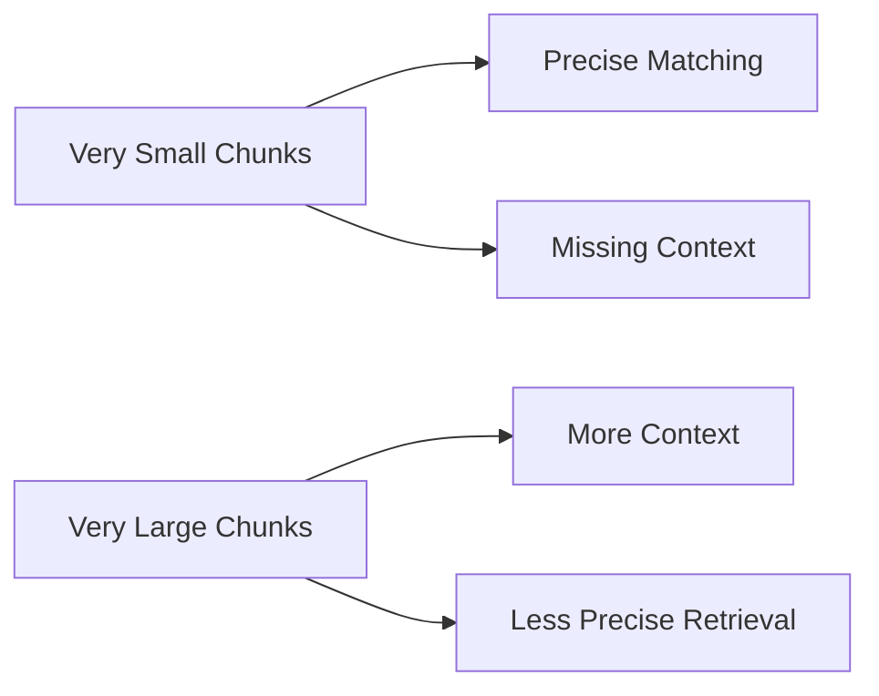

There is no universally correct chunk size.

The correct size depends on:

* Document structure
* Query type
* Embedding model
* LLM context window
* Required citation precision
* Average answer length
* Retrieval strategy

---

## 16. Metadata Filtering

Vector similarity answers:

> Which stored vectors are semantically closest to the query?

Metadata filtering answers:

> Which vectors are allowed to participate in the search?

Example query:

```text
Find the latest English security policy for engineering employees.
```

Possible filters:

```json
{
  "language": "en",
  "department": "engineering",
  "document_type": "security_policy",
  "status": "active"
}
```

The retrieval process becomes:

```text
metadata filtering
      +
vector similarity
      =
relevant and valid results
```

Common metadata fields include:

* User ID
* Organization ID
* Document ID
* Source
* Page
* Section
* Language
* Category
* Creation date
* Update date
* Access level
* Product type
* Geographic region
* Content status

For multi-user applications, metadata filtering is also a security requirement.

A query should never retrieve another user's private vectors simply because they are semantically similar.

---

## 17. Top-K Retrieval

`Top-k` means returning the `k` most similar results.

For example:

```python
results = vector_store.search(
    query_vector=query_embedding,
    top_k=5,
)
```

A larger `k` increases the chance of finding relevant information, but it also introduces more noise.

### Small Top-K

Advantages:

* Lower latency
* Lower token usage
* Less irrelevant context

Risks:

* May miss necessary information

### Large Top-K

Advantages:

* Better initial recall
* More candidate evidence

Risks:

* Higher cost
* More irrelevant context
* Increased prompt size
* Greater risk of confusing the LLM

A common production pattern is:

```text
retrieve 20 candidates
        ↓
rerank candidates
        ↓
send best 3-5 chunks to the LLM
```

---

## 18. Reranking

Embedding search is efficient, but the first-stage similarity score may not perfectly represent relevance.

A reranker evaluates the query and each candidate together.


Possible reranking approaches include:

* Cross-encoder reranking
* LLM-based reranking
* Rule-based scoring
* Recency weighting
* Metadata-based boosting
* Business-priority scoring

Example combined score:

[
\text{final score}
==================

0.65 \times \text{semantic score}
+
0.20 \times \text{reranker score}
+
0.10 \times \text{recency score}
+
0.05 \times \text{business score}
]

Weights should be validated rather than selected only by intuition.

---

## 19. Minimal Python Demo

The following example demonstrates the overall process using generic interfaces.

```python
from dataclasses import dataclass
from typing import Any


@dataclass
class Chunk:
    text: str
    metadata: dict[str, Any]


documents = [
    Chunk(
        text="Employees may work remotely for up to three days per week.",
        metadata={
            "source": "employee-handbook.md",
            "section": "Remote Work",
        },
    ),
    Chunk(
        text="Annual leave requests must be submitted at least seven days in advance.",
        metadata={
            "source": "employee-handbook.md",
            "section": "Annual Leave",
        },
    ),
    Chunk(
        text="All employees must enable multi-factor authentication.",
        metadata={
            "source": "security-policy.md",
            "section": "Account Security",
        },
    ),
]


def embed_texts(texts: list[str]) -> list[list[float]]:
    """
    Replace this function with a real embedding SDK call.
    """
    raise NotImplementedError("Connect an embedding model here.")


def store_vectors(
    vectors: list[list[float]],
    chunks: list[Chunk],
) -> None:
    """
    Store each vector together with its text and metadata.
    """
    raise NotImplementedError("Connect a vector database here.")


document_vectors = embed_texts([chunk.text for chunk in documents])
store_vectors(document_vectors, documents)
```

Query workflow:

```python
def search_vectors(
    query_vector: list[float],
    top_k: int,
) -> list[dict[str, Any]]:
    """
    Search the vector database and return ranked results.
    """
    raise NotImplementedError("Connect a vector database here.")


query = "How many days can I work from home?"
query_vector = embed_texts([query])[0]

results = search_vectors(
    query_vector=query_vector,
    top_k=3,
)

for result in results:
    print(result["score"])
    print(result["text"])
    print(result["metadata"])
    print("---")
```

Expected top result:

```text
Employees may work remotely for up to three days per week.
```

The production implementation must also handle:

* API errors
* Empty documents
* Rate limits
* Batch embedding
* Retries
* Model version tracking
* Duplicate chunks
* Access control
* Index updates
* Logging and observability

---

## 20. Practical Demo: Small Document Search Engine

### Goal

Build a semantic search engine for five to ten Markdown or PDF documents.

### Suggested Pipeline

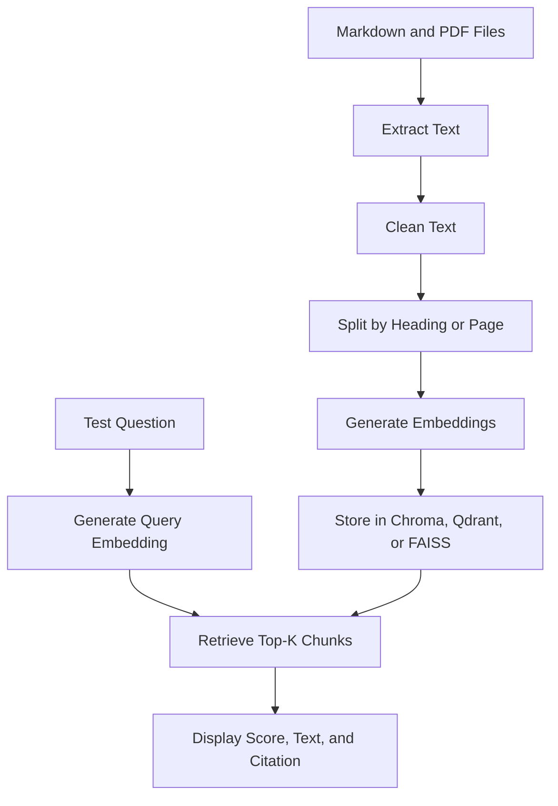

### Recommended Output

For each query, display:

```text
Query:
How many remote-work days are allowed?

Result 1:
Score: 0.91
Source: employee-handbook.pdf
Page: 12
Section: Remote Work
Text: Employees may work remotely for up to three days per week.

Result 2:
Score: 0.67
Source: manager-guidelines.pdf
Page: 8
Section: Team Scheduling
Text: Managers should coordinate office attendance across their teams.
```

This makes retrieval quality visible and debuggable.

---

## 21. Evaluating Retrieval Quality

A working demo is not enough. A good embedding system requires a test dataset.

### 21.1 Create a Test Set

For each test query, define the expected relevant document or chunk.

```json
[
  {
    "query": "How many days can employees work from home?",
    "expected_sources": [
      "employee-handbook.pdf#remote-work"
    ]
  },
  {
    "query": "How early must I request annual leave?",
    "expected_sources": [
      "employee-handbook.pdf#annual-leave"
    ]
  },
  {
    "query": "Is multi-factor authentication required?",
    "expected_sources": [
      "security-policy.pdf#account-security"
    ]
  }
]
```

Include different query styles:

* Exact wording
* Paraphrases
* Short queries
* Long questions
* Misspellings
* Ambiguous questions
* Questions with no answer
* Questions requiring multiple chunks
* Queries containing identifiers
* Queries in different languages

### 21.2 Recall@K

Recall@K measures whether a relevant result appears in the top `k` results.

[
\text{Recall@K}
===============

\frac{\text{queries with a relevant result in top K}}
{\text{total queries}}
]

Example:

* 100 test queries
* 86 contain a relevant result in the top five

[
\text{Recall@5} = 0.86
]

### 21.3 Precision@K

Precision@K measures how many of the top results are relevant.

[
\text{Precision@K}
==================

\frac{\text{relevant results in top K}}
{K}
]

If two of five retrieved chunks are relevant:

[
\text{Precision@5} = \frac{2}{5} = 0.4
]

### 21.4 Mean Reciprocal Rank

Mean Reciprocal Rank rewards systems that place the first relevant result near the top.

For one query:

[
\text{Reciprocal Rank}
======================

\frac{1}{\text{rank of first relevant result}}
]

If the first relevant result appears at position two:

[
\text{RR} = \frac{1}{2}
]

MRR is the average reciprocal rank across all queries.

### 21.5 Citation Accuracy

For RAG applications, verify whether:

* The cited source actually supports the answer.
* The page or section is correct.
* The generated claim appears in the retrieved context.
* The system avoids unsupported claims.

### 21.6 Answerability

The system should know when the indexed documents do not contain an answer.

Test queries such as:

```text
What is the CEO's favorite movie?
```

If this information is not in the knowledge base, the correct response may be:

```text
The available documents do not contain this information.
```

Returning an unrelated but semantically close chunk is a retrieval failure.

---

## 22. Failure Cases to Record

A useful evaluation process records both successful and unsuccessful queries.

Example failure log:

| Query                               | Expected                         | Retrieved           | Failure Type             | Possible Fix             |
| ----------------------------------- | -------------------------------- | ------------------- | ------------------------ | ------------------------ |
| “WFH limit”                         | Remote-work policy               | Leave policy        | Abbreviation mismatch    | Add hybrid search        |
| “Error E1042”                       | E1042 troubleshooting            | General error guide | Exact identifier failure | Add keyword search       |
| “Latest pricing policy”             | 2026 pricing policy              | 2024 policy         | Stale content            | Add date filtering       |
| “How do I cancel and get a refund?” | Cancellation and refund sections | Refund only         | Multi-topic query        | Query decomposition      |
| “What is our policy?”               | Clarification required           | Random policy       | Ambiguous query          | Ask a follow-up question |

Failure categories may include:

* Poor chunking
* Missing metadata
* Wrong embedding model
* Wrong similarity metric
* Stale data
* Duplicate content
* Access-control filtering
* Multilingual mismatch
* Ambiguous query
* Exact-match failure
* Multi-hop question
* Out-of-domain question

---

## 23. Common Mistakes

### 23.1 Using Chunks That Are Too Large

Large chunks may contain the answer, but also include many unrelated topics.

Consequences:

* Lower retrieval precision
* Higher prompt cost
* Less precise citations
* More confusion for the LLM

### 23.2 Using Chunks That Are Too Small

Small chunks may match a query but lack enough information to answer it.

Consequences:

* Missing context
* Incomplete answers
* Broken references
* Retrieval of definitions without conditions or exceptions

### 23.3 Not Storing Source Metadata

Without source metadata, the system cannot reliably:

* Cite the original document
* Display page numbers
* Update a specific source
* Debug incorrect retrieval
* Enforce access permissions

### 23.4 Evaluating by Intuition

Testing only a few successful queries can create a misleading impression.

A system should be evaluated using:

* A fixed query set
* Expected sources
* Retrieval metrics
* Failure categories
* Regression tests

### 23.5 Using Only Top-K Similarity

The closest vectors are not automatically valid answers.

Results may be:

* Outdated
* Unauthorized
* Duplicated
* In the wrong language
* From the wrong product
* Semantically related but factually irrelevant

Use metadata filters, thresholds, reranking, and validation.

### 23.6 Ignoring Model Versioning

Changing the embedding model may change:

* Vector dimensions
* Similarity distributions
* Retrieval ranking
* Recommended metric
* Normalization requirements

Do not mix embeddings from incompatible models in the same index.

Store fields such as:

```json
{
  "embedding_model": "model-name",
  "embedding_version": "2026-07",
  "vector_dimension": 1024
}
```

### 23.7 Embedding Sensitive Data Without Controls

Embedding systems can still expose private information.

Protect them using:

* Authentication
* Authorization
* Tenant-level filtering
* Encryption
* Retention policies
* Audit logs
* Deletion workflows
* Sensitive-data detection

---

## 24. Production Design Checklist

### Data Preparation

* [ ] Documents are cleaned and normalized.
* [ ] Chunk boundaries preserve meaningful context.
* [ ] Duplicate content is detected.
* [ ] Tables, code, and structured data are handled deliberately.
* [ ] Document versions are tracked.

### Embeddings

* [ ] The model supports the required language and domain.
* [ ] Query and document encoding follow model instructions.
* [ ] Vector dimensions are stored correctly.
* [ ] The similarity metric matches the model.
* [ ] Embedding model versions are tracked.

### Vector Storage

* [ ] Text and metadata are stored with every vector.
* [ ] Tenant or user isolation is enforced.
* [ ] Deleted documents are removed from the index.
* [ ] Updated documents are re-embedded.
* [ ] Index configuration matches expected scale and latency.

### Retrieval

* [ ] Realistic test queries are available.
* [ ] Top-k values have been evaluated.
* [ ] Metadata filters are applied.
* [ ] Similarity thresholds are tested.
* [ ] Hybrid search is considered.
* [ ] Reranking is considered.
* [ ] Empty or weak retrieval is handled safely.

### RAG

* [ ] Answers include citations.
* [ ] Citations support the generated claims.
* [ ] The model is instructed not to invent missing information.
* [ ] Retrieved context fits within the token budget.
* [ ] Prompt injection in retrieved documents is considered.
* [ ] Access permissions are checked before generation.

### Monitoring

* [ ] Retrieval latency is logged.
* [ ] Embedding API cost is tracked.
* [ ] Failed queries are recorded.
* [ ] Low-confidence results are monitored.
* [ ] Retrieval quality is tested after model or index changes.

---

## 25. Hands-On Exercise

### Task

Create a small semantic search system using five to ten documents.

The documents may be:

* Markdown notes
* Product documentation
* University course notes
* Technical blog posts
* PDF policies
* Project requirements

### Steps

1. Select five to ten documents.
2. Extract and clean their text.
3. Split the text into meaningful chunks.
4. Attach source and section metadata.
5. Generate embeddings for each chunk.
6. Store the vectors in Chroma, Qdrant, or FAISS.
7. Create at least 15 test questions.
8. Retrieve the top five chunks for each question.
9. Record scores, sources, and chunk text.
10. Mark each result as relevant or irrelevant.
11. Identify at least three failure cases.
12. Change one pipeline setting and compare the results.

Possible settings to compare:

* Chunk size
* Chunk overlap
* Embedding model
* Top-k value
* Similarity metric
* Metadata filters
* Vector-only vs. hybrid retrieval
* Retrieval with and without reranking

### Suggested Evaluation Table

| Query             | Expected Source    | Top-1 Correct | Top-3 Correct | Top-5 Correct | Notes                    |
| ----------------- | ------------------ | ------------: | ------------: | ------------: | ------------------------ |
| Remote-work limit | handbook.md        |           Yes |           Yes |           Yes | Exact answer at rank 1   |
| Password recovery | account-guide.md   |            No |           Yes |           Yes | Correct result at rank 2 |
| Error E1042       | troubleshooting.md |            No |            No |            No | Needs keyword search     |

---

## 26. Portfolio Project

### Project 7: Semantic Search Engine

Build a semantic search application for Markdown and PDF files.

### Core Features

* Upload or index documents
* Extract text from Markdown and PDF
* Split documents into chunks
* Generate embeddings
* Store vectors in a vector database
* Search using natural-language questions
* Display top-k results
* Show source, page, section, and similarity score
* Support document deletion and re-indexing

### Recommended Extensions

* Hybrid search
* Metadata filtering
* Reranking
* RAG answers with citations
* Query history
* Evaluation dashboard
* Retrieval failure logging
* Multiple embedding model comparison
* Multi-user access control
* Multilingual retrieval

### Possible Technology Stack

```text
Frontend:
- React, Next.js, or Streamlit

Backend:
- FastAPI or Node.js

Document Processing:
- PyMuPDF, pypdf, or Markdown parsers

Embedding Layer:
- Hosted embedding API or local embedding model

Vector Storage:
- Chroma
- Qdrant
- FAISS
- PostgreSQL with pgvector

Evaluation:
- Custom test dataset
- Recall@K
- Precision@K
- MRR
- Citation accuracy
```

### Suggested API Design

```http
POST /documents
POST /documents/{document_id}/index
DELETE /documents/{document_id}
POST /search
POST /answer
GET /evaluations
```

Example search request:

```json
{
  "query": "How many remote-work days are allowed?",
  "top_k": 5,
  "filters": {
    "language": "en",
    "document_type": "employee_policy"
  }
}
```

Example search response:

```json
{
  "query": "How many remote-work days are allowed?",
  "results": [
    {
      "text": "Employees may work remotely for up to three days per week.",
      "score": 0.91,
      "metadata": {
        "source": "employee-handbook.pdf",
        "page": 12,
        "section": "Remote Work"
      }
    }
  ]
}
```

---

## 27. Completion Checklist

* [ ] I can explain at least five embedding use cases.
* [ ] I can explain the difference between keyword and semantic search.
* [ ] I understand how embeddings are used in a RAG pipeline.
* [ ] I can explain how embeddings support recommendations and classification.
* [ ] I understand the role of chunking and metadata.
* [ ] I know the difference between cosine similarity, dot product, and Euclidean distance.
* [ ] I have created a realistic retrieval test set.
* [ ] I have inspected top-k results instead of only inspecting generated answers.
* [ ] I have recorded at least one retrieval failure.
* [ ] I can identify one limitation of the system.
* [ ] I have built a small demo or portfolio artifact.

---

## 28. Key Takeaways

Embeddings are a general-purpose representation layer for comparing meaning and similarity.

They can support:

* Semantic search
* RAG
* Recommendations
* Classification
* Clustering
* Duplicate detection
* Anomaly detection
* Agent memory
* Multimodal retrieval
* Code search

However, a high-quality embedding application requires more than calling an embedding API.

A production-ready system must carefully design:

```text
data preparation
+ chunking
+ metadata
+ embedding model
+ vector index
+ similarity metric
+ retrieval strategy
+ evaluation
+ access control
+ monitoring
```

The most important lesson is:

> Do not judge an embedding system only by a few impressive examples. Build a realistic test set, inspect the retrieved results, record failure cases, and measure whether the correct evidence appears in the top-k results.

Embeddings become valuable when they are connected to a measurable application workflow rather than treated as isolated numerical vectors.

---

# Bài luyện tập

## Mục tiêu


## Đề bài


## Yêu cầu hoàn thành

- [ ] 
- [ ] 
- [ ] 

## Kết quả / lời giải


## Ghi chú
