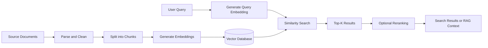
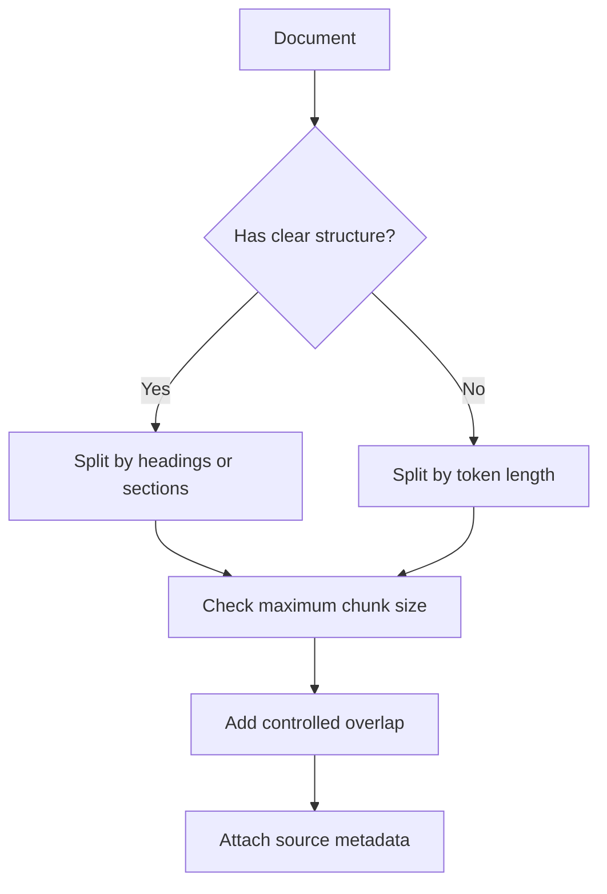
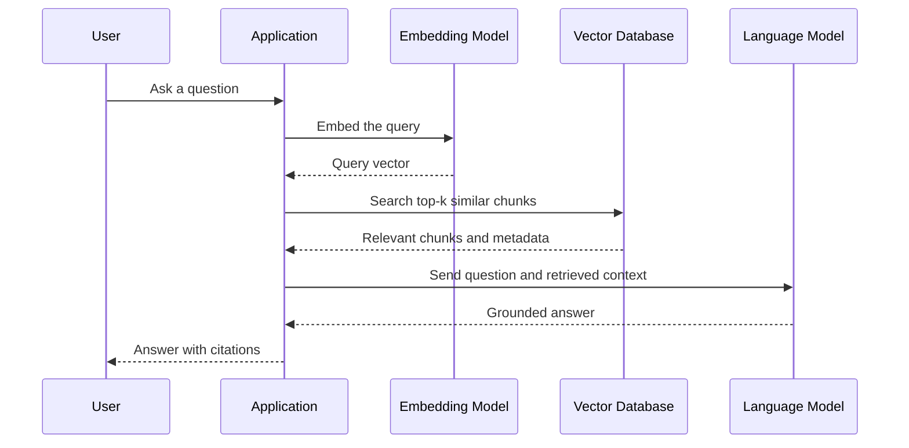
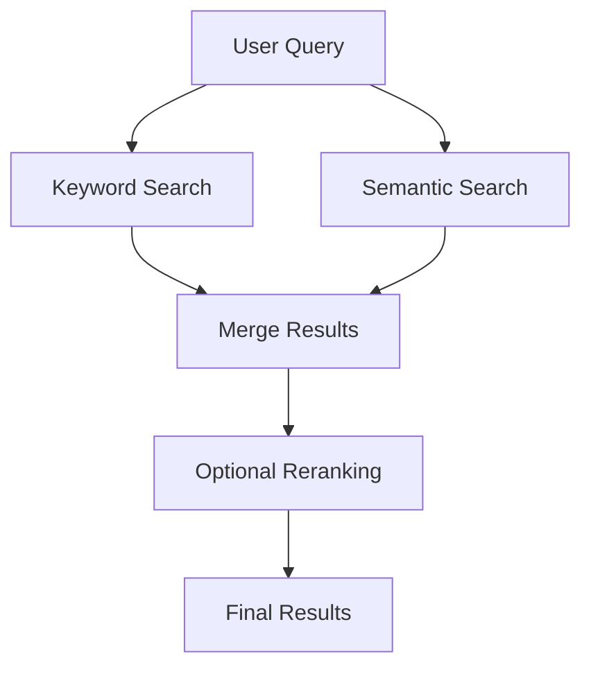
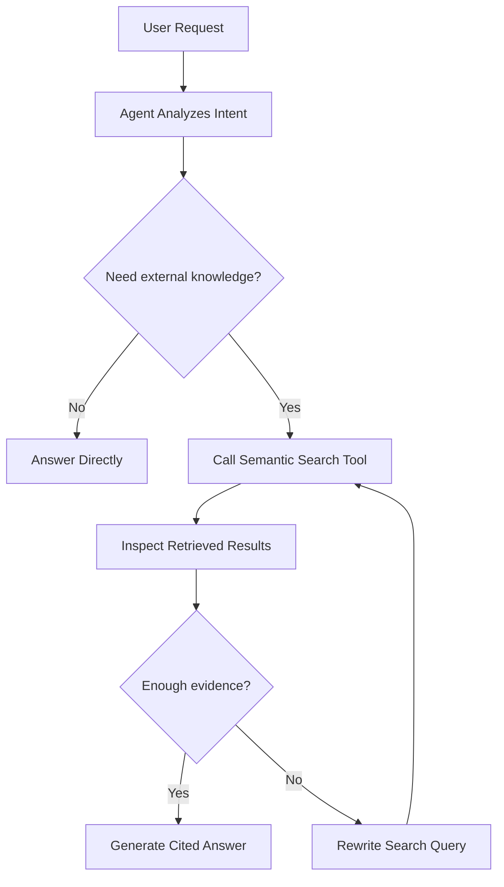
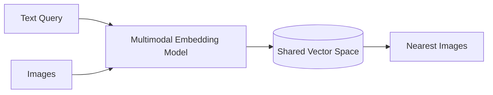
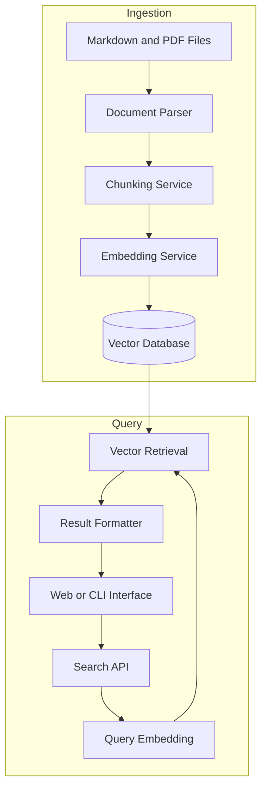

# 003 — Semantic Search

**Course:** 03 — Knowledge Systems and RAG
**Module:** Module 08 — Embeddings and Vector Databases
**Content Group:** Embeddings
**Roadmap Source:** Embeddings and Vector Databases / Embeddings
**Lesson Type:** Embeddings and Vector Databases
**Lesson Order:** 003
**Suggested Duration:** 24 minutes

---

## 1. Overview

**Semantic search** retrieves information based on meaning rather than exact keyword matches.

Traditional keyword search works well when the query contains the same words as the target document. However, users often describe an idea using different vocabulary.

For example:

```text
Query:
"How can I recover my account password?"

Relevant document:
"Steps for resetting login credentials"
```

A keyword-based system may fail because the query and document use different words. A semantic search system can recognize that:

* `recover` is related to `reset`,
* `account password` is related to `login credentials`,
* both texts describe the same intent.

Semantic search usually converts queries and documents into **embedding vectors**, then finds the document vectors closest to the query vector.

It is a foundational component of:

* Retrieval-Augmented Generation, or RAG,
* knowledge-base assistants,
* document search applications,
* recommendation systems,
* support chatbots,
* agent memory systems,
* duplicate-content detection,
* multimodal search.

---

## 2. Learning Objectives

By the end of this lesson, you should be able to:

* Explain semantic search in your own words.
* Distinguish semantic search from keyword search.
* Describe how embeddings enable meaning-based retrieval.
* Identify where semantic search appears in an AI engineering workflow.
* Build a basic semantic search pipeline.
* Understand the roles of chunking, metadata, similarity metrics, and vector indexes.
* Evaluate retrieval quality using a test dataset.
* Recognize common semantic-search failure cases.
* Turn semantic search into a small portfolio project or RAG component.

---

## 3. What Is Semantic Search?

Semantic search is an information-retrieval method that compares the **meaning** of a query with the meaning of stored content.

Instead of asking:

> Which documents contain these exact words?

Semantic search asks:

> Which documents express the most similar concept or intent?

The system represents each piece of text as a numerical vector called an **embedding**.

Texts with similar meanings should produce vectors that are located near one another in vector space.

```text
"How do I reset my password?"
        ↓
[0.12, -0.44, 0.83, ..., 0.21]

"Recover account login credentials"
        ↓
[0.10, -0.41, 0.79, ..., 0.24]
```

Because these vectors are close together, the second text may be returned as a relevant result for the first query.

---

## 4. Keyword Search vs. Semantic Search

### 4.1 Keyword Search

Keyword search retrieves content based primarily on exact terms, token matches, or lexical relevance.

Example:

```text
Query:
"cheap laptop for programming"
```

A keyword search system looks for documents containing words such as:

* cheap,
* laptop,
* programming.

It may miss a document titled:

```text
"Affordable notebook computers for software development"
```

The meaning is relevant, but the wording is different.

### 4.2 Semantic Search

Semantic search understands that:

* `cheap` is related to `affordable`,
* `laptop` is related to `notebook computer`,
* `programming` is related to `software development`.

Therefore, it can retrieve the document even when few or no exact keywords overlap.

### 4.3 Comparison

| Feature                  | Keyword Search                  | Semantic Search                          |
| ------------------------ | ------------------------------- | ---------------------------------------- |
| Matching method          | Exact terms and tokens          | Meaning and conceptual similarity        |
| Handles synonyms         | Limited                         | Usually strong                           |
| Handles paraphrases      | Limited                         | Usually strong                           |
| Exact product codes      | Strong                          | May be weaker                            |
| Typographical errors     | Depends on implementation       | Often more tolerant                      |
| Natural-language queries | Limited                         | Strong                                   |
| Computational cost       | Usually lower                   | Usually higher                           |
| Main storage             | Inverted index                  | Vector index                             |
| Typical examples         | BM25, Elasticsearch text search | Embeddings with FAISS, Qdrant, or Chroma |

Neither approach is universally better. Many production systems use **hybrid search**, combining keyword and semantic retrieval.

---

## 5. Core Semantic Search Workflow

A semantic search system normally has two main phases:

1. Indexing
2. Querying



---

## 6. Indexing Phase

The indexing phase prepares documents for retrieval.

### 6.1 Load Documents

Documents may come from:

* Markdown files,
* PDFs,
* websites,
* databases,
* support tickets,
* product descriptions,
* API documentation,
* chat histories,
* source-code repositories.

Example document:

```text
Title: Resetting Your Account Password

To reset your password, open the login page and select
"Forgot Password." Enter your email address and follow
the instructions sent to your inbox.
```

### 6.2 Clean and Normalize Content

Common preprocessing operations include:

* removing repeated headers and footers,
* fixing broken whitespace,
* removing navigation menus,
* converting HTML to plain text or Markdown,
* preserving headings,
* detecting page numbers,
* keeping meaningful formatting.

Cleaning should remove noise without destroying useful context.

### 6.3 Split Documents into Chunks

Embedding an entire large document is often ineffective because one vector must represent too many topics.

Documents are therefore divided into smaller pieces called **chunks**.

```text
Document
├── Chunk 1: Password reset steps
├── Chunk 2: Email verification
├── Chunk 3: Two-factor authentication
└── Chunk 4: Account recovery limitations
```

Each chunk is embedded and stored independently.

### 6.4 Generate Embeddings

An embedding model transforms every chunk into a vector.

```text
Chunk:
"Select Forgot Password and enter your email address."

Embedding:
[0.031, -0.271, 0.664, ..., -0.092]
```

### 6.5 Store Vectors and Metadata

Each record should contain both the embedding vector and enough metadata to identify the source.

```json
{
  "id": "account-guide-page-4-chunk-2",
  "text": "Select Forgot Password and enter your email address.",
  "embedding": [0.031, -0.271, 0.664],
  "metadata": {
    "source": "account-guide.pdf",
    "page": 4,
    "section": "Password Recovery",
    "language": "en",
    "document_type": "support-guide"
  }
}
```

Metadata is essential for:

* citations,
* filtering,
* debugging,
* access control,
* document updates,
* result presentation.

---

## 7. Query Phase

The query phase retrieves the most relevant chunks.

### 7.1 Receive the User Query

```text
"I cannot access my account because I forgot my password."
```

### 7.2 Generate the Query Embedding

The same embedding model, or a compatible query model, converts the query into a vector.

```text
Query embedding:
[0.027, -0.259, 0.651, ..., -0.087]
```

### 7.3 Search for Similar Vectors

The vector database compares the query vector with stored document vectors.

It returns the nearest vectors according to a similarity function.

### 7.4 Return Top-K Results

`top-k` means the number of results returned.

For example:

```text
Top 1: Password reset steps
Top 2: Account recovery email
Top 3: Login troubleshooting
Top 4: Two-factor authentication recovery
Top 5: Contacting account support
```

A small `k` may omit useful context. A large `k` may introduce noise.

---

## 8. Similarity Metrics

A semantic search engine needs a method for measuring how close two vectors are.

Common metrics include:

* cosine similarity,
* dot product,
* Euclidean distance.

### 8.1 Cosine Similarity

Cosine similarity measures the angle between two vectors.

[
\text{cosine similarity}(A,B)
=============================

\frac{A \cdot B}
{|A||B|}
]

A higher value usually indicates greater similarity.

Conceptually:

```text
Same direction      → highly similar
Different direction → less similar
Opposite direction  → strongly dissimilar
```

### 8.2 Dot Product

The dot product is often used when embeddings are normalized or when the model was trained for dot-product similarity.

[
A \cdot B = \sum_{i=1}^{n} A_iB_i
]

A larger score typically means greater relevance.

### 8.3 Euclidean Distance

Euclidean distance measures the direct distance between two points.

[
d(A,B)
======

\sqrt{
\sum_{i=1}^{n}
(A_i-B_i)^2
}
]

A smaller distance means the vectors are closer.

### 8.4 Choosing the Correct Metric

Use the similarity metric recommended by the embedding model or vector-database configuration.

Do not assume that all embedding models work equally well with every metric.

---

## 9. Chunking Strategy

Chunking is one of the most important factors in retrieval quality.

### 9.1 Chunks That Are Too Small

Example:

```text
Chunk 1: Click.
Chunk 2: Forgot Password.
Chunk 3: Enter your email.
```

Problems:

* insufficient context,
* unclear meaning,
* fragmented retrieval results,
* poor citations.

### 9.2 Chunks That Are Too Large

Example:

```text
One chunk containing a 20-page support guide
```

Problems:

* unrelated topics share one vector,
* relevant details become diluted,
* more irrelevant text is passed to the language model,
* token cost increases.

### 9.3 Better Chunking

Prefer semantically complete units:

```text
To reset your password, select "Forgot Password" on the
login screen. Enter your registered email address and
follow the recovery link sent to your inbox.
```

This chunk contains:

* a complete topic,
* enough context,
* a clear action,
* useful citation boundaries.

### 9.4 Chunk Overlap

Overlap repeats a small amount of text between adjacent chunks.

```text
Chunk 1:
...enter your registered email address.
A recovery link will be sent...

Chunk 2:
A recovery link will be sent to your inbox.
The link expires after 30 minutes...
```

Overlap can prevent important information from being lost at chunk boundaries.

However, excessive overlap creates:

* duplicate results,
* larger indexes,
* higher embedding costs,
* repeated context.

### 9.5 Structure-Aware Chunking

Whenever possible, split documents using natural structure:

* headings,
* paragraphs,
* sections,
* Markdown headers,
* HTML elements,
* code functions,
* table rows,
* PDF page boundaries.



---

## 10. Metadata Filtering

Semantic similarity alone is not always enough.

Suppose a knowledge base contains:

* English documentation,
* Vietnamese documentation,
* archived documents,
* current documents,
* public documents,
* private team documents.

The query may need filters such as:

```json
{
  "language": "en",
  "status": "active",
  "team": "engineering",
  "access_level": "public"
}
```

The retrieval process then becomes:

```text
Find semantically similar chunks
AND
language = English
AND
status = active
AND
user has permission
```

Metadata filtering improves:

* relevance,
* security,
* latency,
* citation quality,
* user experience.

It must not be treated as an optional production detail. In access-controlled systems, metadata filtering is part of the security model.

---

## 11. Vector Indexes

Comparing a query vector with every stored vector is called an exact or brute-force search.

This may work for small datasets but becomes expensive as the collection grows.

Vector databases therefore use specialized indexes for approximate nearest-neighbor search.

Common index approaches include:

* HNSW,
* IVF,
* product quantization,
* flat indexes for exact search.

### Conceptual Comparison

| Index Type      | Main Advantage                | Main Trade-off        |
| --------------- | ----------------------------- | --------------------- |
| Flat index      | High accuracy                 | Slower at large scale |
| HNSW            | Fast search and strong recall | Higher memory usage   |
| IVF             | Scales to large datasets      | Requires tuning       |
| Quantized index | Lower memory usage            | Some accuracy loss    |

The best choice depends on:

* dataset size,
* latency target,
* memory limits,
* update frequency,
* acceptable recall loss.

---

## 12. Basic Python Example

The following example demonstrates semantic-search logic without requiring a full vector database.

```python
from __future__ import annotations

from dataclasses import dataclass
from typing import Protocol

import numpy as np


class EmbeddingClient(Protocol):
    def embed(self, texts: list[str]) -> list[list[float]]:
        """Convert text inputs into embedding vectors."""


@dataclass(frozen=True)
class Document:
    document_id: str
    text: str
    source: str


def cosine_similarity(
    query_vector: np.ndarray,
    document_vectors: np.ndarray,
) -> np.ndarray:
    """Calculate cosine similarity between one query and many documents."""
    query_norm = np.linalg.norm(query_vector)
    document_norms = np.linalg.norm(document_vectors, axis=1)

    if query_norm == 0:
        raise ValueError("Query embedding must not be a zero vector.")

    if np.any(document_norms == 0):
        raise ValueError("Document embeddings must not contain zero vectors.")

    return (
        document_vectors @ query_vector
        / (document_norms * query_norm)
    )


def semantic_search(
    query: str,
    documents: list[Document],
    embedding_client: EmbeddingClient,
    top_k: int = 3,
) -> list[tuple[Document, float]]:
    """Return the most semantically similar documents."""

    if not query.strip():
        raise ValueError("Query must not be empty.")

    if not documents:
        return []

    if top_k <= 0:
        raise ValueError("top_k must be greater than zero.")

    document_texts = [document.text for document in documents]

    vectors = embedding_client.embed([query, *document_texts])

    query_vector = np.asarray(vectors[0], dtype=np.float32)
    document_vectors = np.asarray(vectors[1:], dtype=np.float32)

    scores = cosine_similarity(
        query_vector=query_vector,
        document_vectors=document_vectors,
    )

    ranked_indices = np.argsort(scores)[::-1][:top_k]

    return [
        (documents[index], float(scores[index]))
        for index in ranked_indices
    ]
```

Example usage:

```python
documents = [
    Document(
        document_id="doc-1",
        text="Reset your password using the recovery link.",
        source="account-help.md",
    ),
    Document(
        document_id="doc-2",
        text="Update the billing address for your subscription.",
        source="billing-help.md",
    ),
    Document(
        document_id="doc-3",
        text="Recover access when you cannot sign in.",
        source="login-help.md",
    ),
]

results = semantic_search(
    query="I forgot my login password.",
    documents=documents,
    embedding_client=embedding_client,
    top_k=2,
)

for document, score in results:
    print(f"{score:.4f} | {document.source} | {document.text}")
```

Possible output:

```text
0.9132 | account-help.md | Reset your password using the recovery link.
0.8617 | login-help.md   | Recover access when you cannot sign in.
```

---

## 13. Semantic Search with a Vector Database

A production-style workflow generally looks like this:

```python
def index_documents(
    documents: list[dict],
    embedder,
    vector_store,
) -> None:
    records = []

    for document in documents:
        chunks = split_document(document["text"])

        chunk_vectors = embedder.embed(
            [chunk["text"] for chunk in chunks]
        )

        for chunk, vector in zip(chunks, chunk_vectors):
            records.append(
                {
                    "id": chunk["id"],
                    "vector": vector,
                    "text": chunk["text"],
                    "metadata": {
                        "source": document["source"],
                        "page": chunk.get("page"),
                        "section": chunk.get("section"),
                    },
                }
            )

    vector_store.upsert(records)
```

Query workflow:

```python
def search(
    query: str,
    embedder,
    vector_store,
    top_k: int = 5,
) -> list[dict]:
    query_vector = embedder.embed([query])[0]

    return vector_store.search(
        vector=query_vector,
        top_k=top_k,
        filters={
            "status": "active",
        },
    )
```

The exact API differs between vector databases, but the architecture remains similar.

---

## 14. Semantic Search in a RAG Pipeline

Semantic search retrieves relevant information. RAG adds a language model that uses the retrieved information to generate an answer.



Example context construction:

```text
SYSTEM:
Answer using only the retrieved context.
Cite the source and page for every factual claim.
If the answer is not supported, say that the information was not found.

RETRIEVED CONTEXT:

[Source: account-guide.pdf, Page: 4]
To reset your password, select "Forgot Password" on the login page.

[Source: account-guide.pdf, Page: 5]
The recovery link expires after 30 minutes.

USER QUESTION:
How can I recover my password, and how long is the link valid?
```

The model can then produce:

```text
Select “Forgot Password” on the login page and follow the
recovery instructions. The recovery link remains valid for
30 minutes.

Sources: account-guide.pdf, pages 4–5.
```

---

## 15. Reranking

Embedding retrieval is fast, but the first ranking is not always perfect.

A reranker can re-evaluate the retrieved candidates using a more precise model.


Example:

```text
Vector search:
Retrieve 30 candidates quickly.

Reranker:
Score each query-document pair more carefully.

Final context:
Keep the best 5 chunks.
```

This approach often improves relevance while controlling computational cost.

---

## 16. Hybrid Search

Semantic search may struggle with:

* exact identifiers,
* error codes,
* names,
* version numbers,
* uncommon abbreviations,
* product SKUs.

Keyword search is often better for these cases.

Hybrid search combines both approaches.



Example query:

```text
"How do I fix error AUTH-4017?"
```

* Keyword search finds the exact error code.
* Semantic search finds related authentication troubleshooting instructions.
* A merged result set provides better coverage.

---

## 17. Evaluating Semantic Search

Do not evaluate retrieval quality based only on intuition.

Create a small evaluation dataset.

### 17.1 Evaluation Dataset

```json
[
  {
    "query": "How can I change my password?",
    "expected_sources": [
      "account-guide.pdf#password-reset"
    ]
  },
  {
    "query": "My login recovery email never arrived.",
    "expected_sources": [
      "account-guide.pdf#recovery-email",
      "email-troubleshooting.md"
    ]
  }
]
```

Each test case should contain:

* a realistic user query,
* one or more expected chunks,
* optional irrelevant chunks,
* optional metadata requirements.

### 17.2 Recall at K

Recall@K measures whether a relevant result appears among the first `K` retrieved items.

[
\text{Recall@K}
===============

\frac{
\text{Queries with a relevant result in top K}
}{
\text{Total queries}
}
]

Example:

```text
Total queries: 20
Queries with relevant result in top 5: 17

Recall@5 = 17 / 20 = 0.85
```

### 17.3 Precision at K

Precision@K measures how many of the top results are relevant.

[
\text{Precision@K}
==================

\frac{
\text{Relevant results in top K}
}{
K
}
]

If three of the top five results are relevant:

```text
Precision@5 = 3 / 5 = 0.60
```

### 17.4 Mean Reciprocal Rank

Mean Reciprocal Rank rewards systems that place the first relevant result near the top.

For one query:

[
RR = \frac{1}{\text{rank of first relevant result}}
]

Examples:

```text
Relevant result at rank 1 → RR = 1.00
Relevant result at rank 2 → RR = 0.50
Relevant result at rank 5 → RR = 0.20
```

MRR is the average reciprocal rank across all queries.

### 17.5 Qualitative Error Analysis

For every failed query, classify the reason.

| Failure Category   | Example                                  |
| ------------------ | ---------------------------------------- |
| Bad chunking       | Relevant sentence split across chunks    |
| Weak embedding     | Domain terminology not represented well  |
| Missing metadata   | Correct document excluded by filter      |
| Incorrect metadata | Document marked with wrong language      |
| Low top-k          | Relevant result ranked just below cutoff |
| Duplicate chunks   | Repeated content dominates results       |
| Query ambiguity    | User intent has multiple interpretations |
| Outdated index     | New document was not embedded            |
| Access filtering   | User cannot retrieve the required source |
| Parsing failure    | PDF text was extracted incorrectly       |

---

## 18. Important Retrieval Parameters

### 18.1 Top-K

Controls how many candidates are returned.

```text
Small top-k:
+ Lower latency
+ Less context noise
- May miss relevant information

Large top-k:
+ Better coverage
- More noise
- Higher reranking or LLM cost
```

### 18.2 Similarity Threshold

A threshold rejects results below a minimum relevance score.

```python
accepted_results = [
    result
    for result in results
    if result["score"] >= minimum_score
]
```

A threshold may help avoid returning unrelated content, but similarity scores are model-dependent and should be calibrated using evaluation data.

### 18.3 Chunk Size

Chunk size affects:

* meaning representation,
* retrieval precision,
* context completeness,
* storage cost,
* embedding cost,
* generation cost.

### 18.4 Chunk Overlap

Overlap can preserve context across boundaries, but too much overlap creates duplicates.

### 18.5 Metadata Filters

Filters restrict retrieval to the correct:

* user,
* tenant,
* language,
* date range,
* document version,
* content type,
* access level.

### 18.6 Index Configuration

Index parameters affect:

* retrieval speed,
* recall,
* memory usage,
* indexing time.

---

## 19. Common Failure Cases

### 19.1 Chunks Are Too Long

A chunk discusses many unrelated topics, so its embedding becomes too general.

**Better approach:** split by section or topic.

### 19.2 Chunks Are Too Short

The chunk lacks enough context to represent its meaning.

**Better approach:** preserve complete sentences and semantic units.

### 19.3 Missing Source Metadata

The system retrieves correct information but cannot show where it came from.

**Better approach:** store source, page, section, and chunk identifiers during indexing.

### 19.4 Different Models for Indexing and Queries

Documents are embedded using one incompatible model and queries using another.

**Result:** vectors do not belong to the same meaningful vector space.

**Better approach:** use the same embedding model or an explicitly compatible query-document pair.

### 19.5 No Retrieval Evaluation

The system appears to work for a few manually selected examples but fails on real user queries.

**Better approach:** maintain a versioned evaluation dataset.

### 19.6 Duplicate Results

Overlapping chunks or repeated documents dominate the top results.

**Better approach:**

* detect duplicates,
* group results by document,
* limit results per source,
* reduce excessive overlap.

### 19.7 Exact Terms Are Missed

A semantic model may not rank rare codes or identifiers correctly.

**Better approach:** combine semantic search with keyword search.

### 19.8 Incorrect PDF Parsing

The embedding pipeline indexes broken text order, missing tables, or repeated headers.

**Better approach:** inspect extracted text before blaming the embedding model.

### 19.9 Old Documents Remain Indexed

Deleted or updated documents may still appear in search.

**Better approach:** support document versioning, deletion, and re-indexing.

### 19.10 Sensitive Content Is Retrieved

Semantic similarity does not enforce user permissions.

**Better approach:** apply authorization filters before or during retrieval, not only after results are returned.

---

## 20. Security and Privacy Considerations

Semantic search systems may store sensitive document representations.

Important safeguards include:

* access-control metadata,
* tenant isolation,
* encryption,
* secure API authentication,
* audit logging,
* deletion support,
* private-data redaction,
* prompt-injection filtering,
* source validation.

### Access-Control Example

```text
User query
    ↓
Authenticate user
    ↓
Resolve allowed tenant and document scopes
    ↓
Apply filters during vector search
    ↓
Return only authorized chunks
```

Do not retrieve all results first and remove unauthorized content only after sending it to another model or service.

---

## 21. Semantic Search as an Agent Tool

An AI agent can use semantic search as a tool.

Example tool definition:

```json
{
  "name": "search_knowledge_base",
  "description": "Search internal documentation by meaning.",
  "parameters": {
    "type": "object",
    "properties": {
      "query": {
        "type": "string",
        "description": "A focused search query."
      },
      "top_k": {
        "type": "integer",
        "minimum": 1,
        "maximum": 10
      },
      "document_type": {
        "type": "string"
      }
    },
    "required": ["query"]
  }
}
```

The agent workflow may be:



The tool should return structured evidence:

```json
{
  "results": [
    {
      "text": "To reset your password...",
      "score": 0.91,
      "source": "account-guide.pdf",
      "page": 4
    }
  ]
}
```

---

## 22. Multimodal Semantic Search

Semantic search is not limited to text.

Multimodal embedding models can represent:

* text,
* images,
* audio,
* video frames,
* product data.

Example:

```text
Text query:
"red sports car driving through snow"

Possible result:
An image containing a red car on a snowy road
```

The text query and image are represented in a compatible embedding space.



Potential applications include:

* image search,
* visual product search,
* video-scene retrieval,
* audio-content discovery,
* media recommendation.

---

## 23. Cost and Performance Considerations

Semantic search introduces costs in multiple stages.

### Indexing Costs

* document parsing,
* chunking,
* embedding generation,
* vector storage,
* index construction.

### Query Costs

* query embedding,
* vector search,
* metadata filtering,
* reranking,
* language-model generation.

### Optimization Strategies

* embed documents once and cache results,
* re-embed only changed documents,
* batch embedding requests,
* choose appropriate embedding dimensions,
* avoid excessive overlap,
* use metadata filters,
* use a smaller candidate set before reranking,
* monitor latency by pipeline stage.

Example latency breakdown:

```text
Query embedding:      40 ms
Vector search:        25 ms
Metadata filtering:    5 ms
Reranking:            90 ms
LLM generation:      800 ms
--------------------------------
Total:                960 ms
```

Measure each stage separately. Otherwise, a slow RAG application may incorrectly blame vector search when generation is the real bottleneck.

---

## 24. Practical Exercise

### Goal

Build a semantic search engine for a small collection of Markdown or PDF documents.

### Step 1: Select Documents

Choose between 5 and 10 small documents.

Possible topics:

* Python documentation,
* product support articles,
* university regulations,
* personal technical notes,
* AI engineering lessons.

### Step 2: Create Test Queries

Write at least 10 realistic questions.

Include:

* exact keyword queries,
* paraphrased queries,
* synonym-based queries,
* ambiguous queries,
* queries with no supported answer.

Example:

```json
[
  {
    "query": "How do I recover my login credentials?",
    "expected_topic": "Password reset"
  },
  {
    "query": "Can I update the email linked to my account?",
    "expected_topic": "Changing account email"
  }
]
```

### Step 3: Parse and Chunk Documents

Record:

* chunk size,
* overlap size,
* splitting method,
* document metadata.

### Step 4: Generate Embeddings

Generate an embedding for every chunk.

Store:

* vector,
* chunk text,
* source,
* page or section,
* chunk identifier.

### Step 5: Build the Vector Index

Use one of the following:

* FAISS,
* Chroma,
* Qdrant,
* another vector database.

### Step 6: Implement Search

For each query:

1. Generate the query embedding.
2. Search the vector index.
3. Return the top-k chunks.
4. Display similarity scores.
5. Display source metadata.

### Step 7: Evaluate Results

Create a table:

| Query              | Expected Source  |      Rank | Top-K Success | Notes                 |
| ------------------ | ---------------- | --------: | ------------- | --------------------- |
| Recover password   | account-guide.md |         1 | Yes           | Good match            |
| Change login email | profile-guide.md |         4 | Yes           | Ranking could improve |
| Delete account     | privacy-guide.md | Not found | No            | Missing document      |

### Step 8: Record Failure Cases

For each failed query, identify whether the problem came from:

* document coverage,
* parsing,
* chunking,
* embeddings,
* metadata,
* index configuration,
* top-k,
* query ambiguity.

### Step 9: Improve One Variable at a Time

Possible experiments:

```text
Experiment A:
Chunk size = 200 tokens

Experiment B:
Chunk size = 500 tokens

Experiment C:
Chunk size = 500 tokens with 80-token overlap
```

Compare retrieval metrics after each change.

---

## 25. Suggested Mini Project

### Project 7: Semantic Search Engine for Markdown and PDF Files

Build an application that lets users upload or index Markdown and PDF files, then search them using natural language.

### Minimum Features

* document loading,
* PDF and Markdown parsing,
* chunking,
* embedding generation,
* vector storage,
* semantic search,
* top-k result display,
* source citations.

### Recommended Architecture



### Example API

```http
POST /api/search
Content-Type: application/json
```

```json
{
  "query": "How does the application handle authentication?",
  "top_k": 5,
  "filters": {
    "file_type": "markdown"
  }
}
```

Example response:

```json
{
  "query": "How does the application handle authentication?",
  "results": [
    {
      "text": "Authentication uses signed access tokens...",
      "score": 0.887,
      "source": "architecture.md",
      "section": "Authentication",
      "chunk_id": "architecture-auth-01"
    }
  ]
}
```

### Optional Advanced Features

* hybrid search,
* reranking,
* result highlighting,
* query history,
* document deletion,
* automatic re-indexing,
* evaluation dashboard,
* multilingual retrieval,
* RAG answer generation,
* access-control filters.

---

## 26. Production Checklist

### Data Preparation

* [ ] Documents are parsed correctly.
* [ ] Repeated headers and footers are removed.
* [ ] Tables and code blocks are handled appropriately.
* [ ] Chunk boundaries preserve meaning.
* [ ] Chunk size and overlap were evaluated.

### Embeddings

* [ ] The embedding model matches the use case.
* [ ] Documents and queries use compatible embedding models.
* [ ] Embedding dimensions match the vector index.
* [ ] Failed embedding requests are retried safely.
* [ ] Changed documents can be re-embedded.

### Vector Storage

* [ ] Every vector has a stable identifier.
* [ ] Source metadata is stored.
* [ ] Document versions are tracked.
* [ ] Deleted documents are removed from the index.
* [ ] Index settings match the dataset size and latency target.

### Retrieval

* [ ] Top-k was tuned using evaluation queries.
* [ ] Similarity thresholds were calibrated.
* [ ] Metadata filters are applied correctly.
* [ ] Duplicate results are controlled.
* [ ] Exact identifiers are supported through keyword or hybrid search.

### Evaluation

* [ ] A retrieval test dataset exists.
* [ ] Recall@K is measured.
* [ ] Precision@K or relevance judgments are recorded.
* [ ] Failure cases are categorized.
* [ ] Evaluation runs are versioned.

### Security

* [ ] User authorization is enforced during retrieval.
* [ ] Tenant data is isolated.
* [ ] Sensitive metadata is protected.
* [ ] Logs do not expose private content unnecessarily.
* [ ] Document deletion requirements are supported.

### RAG Integration

* [ ] Retrieved chunks include citations.
* [ ] The language model is instructed to use retrieved evidence.
* [ ] Unsupported answers are handled safely.
* [ ] Context length is controlled.
* [ ] Prompt-injection risks from retrieved documents are considered.

### Monitoring

* [ ] Query latency is monitored.
* [ ] Retrieval failures are logged.
* [ ] Empty-result rates are measured.
* [ ] User feedback can be collected.
* [ ] Index freshness is monitored.

---

## 27. Common Mistakes

### Mistake 1: Choosing Chunk Sizes Without Testing

Do not choose a chunk size only because it appears in a tutorial.

**Better approach:** compare multiple chunking configurations using the same evaluation queries.

### Mistake 2: Storing Vectors Without Source Information

A result without a source cannot support reliable citations or debugging.

**Better approach:** always store source, page, section, and chunk identifiers.

### Mistake 3: Evaluating the Final RAG Answer Only

A poor answer may be caused by retrieval, prompting, or generation.

**Better approach:** inspect retrieval results independently before evaluating the final answer.

### Mistake 4: Using Similarity Scores as Universal Probabilities

A score of `0.80` does not always mean “80% relevant.”

Scores differ across:

* embedding models,
* similarity metrics,
* data domains,
* normalization methods.

**Better approach:** calibrate thresholds using your own evaluation set.

### Mistake 5: Ignoring Exact-Match Requirements

Semantic search may not be ideal for error codes, names, or identifiers.

**Better approach:** add keyword or hybrid retrieval.

### Mistake 6: Increasing Top-K to Hide Retrieval Problems

Returning more chunks may improve recall but also increases noise and cost.

**Better approach:** improve chunking, embeddings, filters, and reranking.

### Mistake 7: Treating Vector Search as Access Control

Vector databases return similar data, not necessarily authorized data.

**Better approach:** enforce authorization through metadata filters and application-level security.

---

## 28. Completion Checklist

After completing this lesson, confirm that:

* [ ] I can explain semantic search in one or two minutes.
* [ ] I can distinguish keyword search from semantic search.
* [ ] I understand the indexing and querying phases.
* [ ] I can explain how embeddings and similarity search work together.
* [ ] I understand why chunking affects retrieval quality.
* [ ] I can store and use source metadata.
* [ ] I can implement a small top-k semantic search demo.
* [ ] I have created a set of retrieval test queries.
* [ ] I can identify at least one retrieval failure case.
* [ ] I understand where semantic search fits into a RAG pipeline.
* [ ] I know when hybrid search or reranking may be useful.
* [ ] I have recorded at least one limitation or open question.

---

## 29. Related Outcome

> Build semantic search systems using embeddings, vector indexes, metadata filters, and similarity search.

This outcome requires more than calling an embedding API. A complete system must also handle:

* document ingestion,
* chunking,
* metadata,
* indexing,
* retrieval,
* evaluation,
* security,
* citations,
* monitoring.

---

## 30. Key Takeaways

1. Semantic search retrieves information by meaning rather than exact wording.
2. Queries and documents are represented as embedding vectors.
3. Similarity search finds the document vectors nearest to the query vector.
4. Retrieval quality depends heavily on chunking, embeddings, metadata, and evaluation.
5. Top-k and similarity thresholds must be tuned using real test queries.
6. Metadata is necessary for filtering, access control, debugging, and citations.
7. Keyword search remains useful for codes, names, and exact terms.
8. Hybrid search and reranking can improve production retrieval quality.
9. A RAG system cannot generate a grounded answer when retrieval fails.
10. Semantic search should be evaluated as its own subsystem, not judged only through final LLM answers.

---

## 31. Final Summary

**Semantic search** is a core building block for modern AI applications that need to retrieve relevant information from documents, databases, memories, or media collections.

Its basic workflow is:

```text
documents
→ parsing
→ chunking
→ embeddings
→ vector index
→ query embedding
→ similarity search
→ top-k results
→ optional reranking
→ search results or RAG context
```

A basic demonstration can be implemented quickly, but a reliable production system requires careful attention to:

* document quality,
* chunk boundaries,
* metadata,
* access control,
* evaluation,
* index freshness,
* latency,
* failure analysis.

The most useful next step is to build a small semantic search engine for Markdown or PDF files and evaluate it with a fixed set of realistic user questions.
