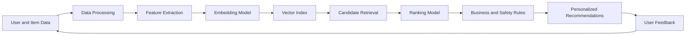
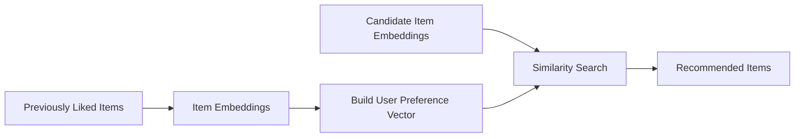
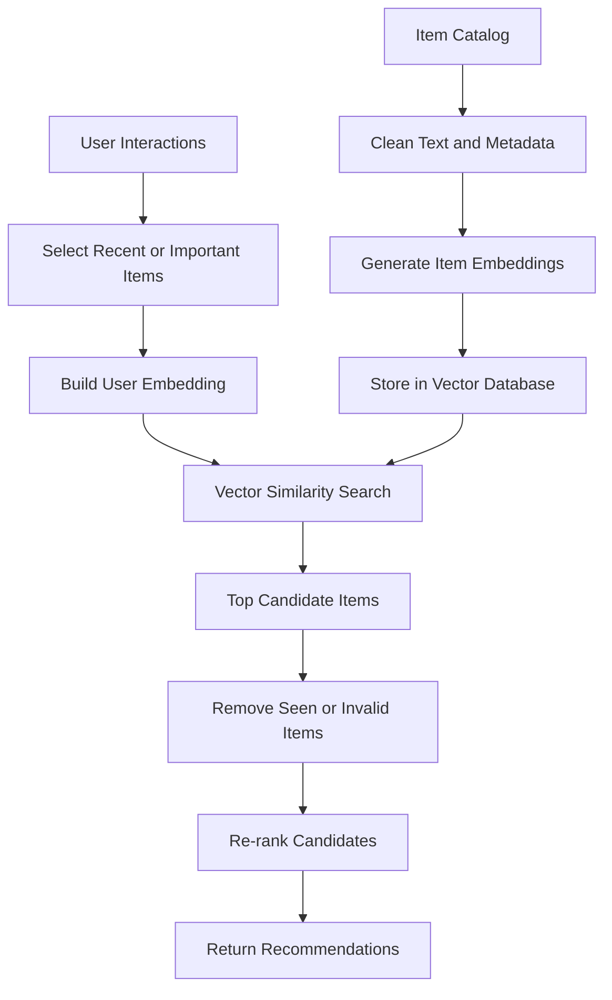
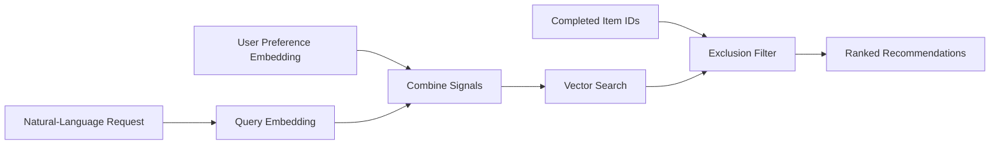
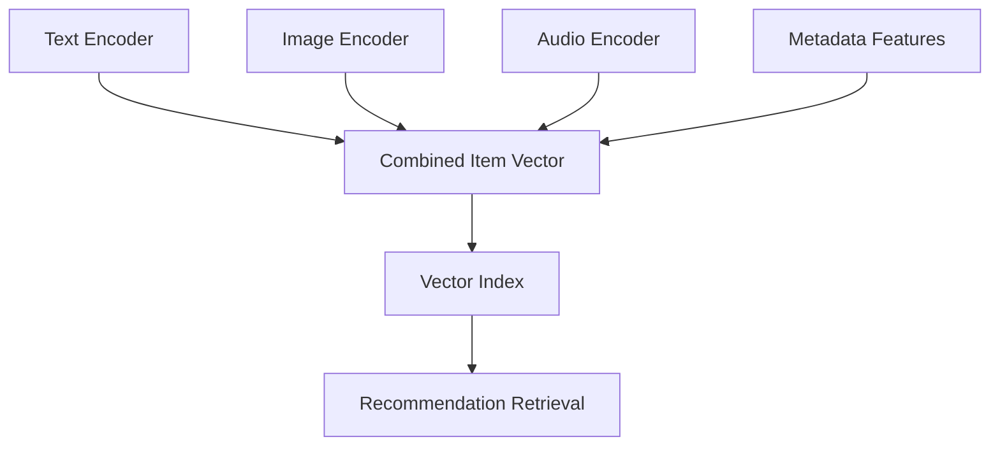
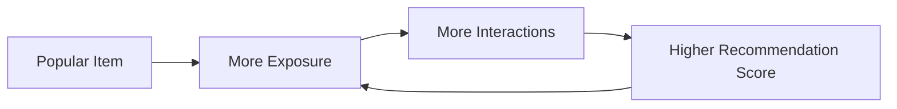

# 004 — Recommendation Systems

**Course:** 03 — Knowledge Systems and RAG
**Module:** Module 08 — Embeddings and Vector Databases
**Content Group:** Embeddings
**Roadmap Source:** Embeddings and Vector Databases / Embeddings
**Lesson Type:** Embeddings and Vector Databases
**Order in Module:** 004
**Suggested Duration:** 24 minutes

---

## 1. Overview

A **recommendation system** predicts which items are most relevant to a user.

These items may include:

* Movies
* Music
* Products
* News articles
* Courses
* Social media posts
* Restaurants
* Jobs
* Documents
* AI tools or actions

Traditional recommendation systems often rely on user ratings, clicks, purchases, and other interaction data. Modern AI applications can also use **embeddings** to represent users and items as vectors.

Items with similar meanings, attributes, or usage patterns are placed near one another in vector space. A recommendation system can then retrieve items whose vectors are close to a user profile, a previously selected item, or a natural-language request.

For example:

```text
User likes:
"Beginner Python courses about data analysis"

User embedding:
[0.12, -0.38, 0.71, ...]

Course embeddings:
Python for Data Science       -> high similarity
Advanced Java Architecture    -> low similarity
Pandas Fundamentals           -> high similarity
```

Recommendation systems are closely related to semantic search, but their goals are different:

* **Semantic search** finds items relevant to a query.
* **Recommendation systems** predict items that a particular user is likely to prefer or engage with.

---

## 2. Learning Objectives

By the end of this lesson, you should be able to:

* Explain how recommendation systems work.
* Distinguish between content-based, collaborative, and hybrid recommendation methods.
* Describe how embeddings represent users and items.
* Build a small embedding-based recommendation pipeline.
* Understand the retrieval and ranking stages of a production recommendation system.
* Evaluate recommendations using offline and online metrics.
* Identify common problems such as cold start, filter bubbles, popularity bias, and stale embeddings.

---

## 3. Where Recommendation Systems Fit in AI Engineering

Recommendation systems combine several AI engineering components:



An AI engineer working on recommendation systems may need to design:

* Data ingestion pipelines
* User and item schemas
* Embedding generation jobs
* Vector database indexes
* Candidate retrieval services
* Ranking models
* Feedback collection
* Evaluation datasets
* Experimentation and A/B testing
* Monitoring and safety controls

Recommendation systems are not only machine-learning models. They are complete production systems that continuously learn from user behavior.

---

## 4. Core Recommendation Approaches

### 4.1 Popularity-Based Recommendation

The simplest approach recommends items that are currently popular.

Examples:

* Most purchased products
* Most watched videos
* Trending articles
* Highest-rated courses

```text
recommendation_score(item) = number_of_recent_interactions
```

Advantages:

* Easy to implement
* Works without user history
* Useful for new users

Limitations:

* Not personalized
* Favors already popular items
* May prevent new or niche items from being discovered

Popularity-based recommendation is often used as a fallback for the **cold-start problem**.

---

### 4.2 Content-Based Recommendation

Content-based systems recommend items similar to those a user already likes.

The system compares item attributes such as:

* Title
* Description
* Category
* Tags
* Author
* Brand
* Image
* Audio
* Structured metadata

For example, if a user reads articles about vector databases, the system may recommend other articles about semantic search, embeddings, or RAG.



A simple user vector can be calculated by averaging the embeddings of previously liked items:

[
u = \frac{1}{n}\sum_{i=1}^{n} e_i
]

Where:

* (u) is the user vector.
* (e_i) is the embedding of an item the user interacted with.
* (n) is the number of selected items.

The system then compares the user vector with candidate item vectors.

#### Advantages

* Works well when item content is available.
* Can recommend new items immediately.
* Recommendations are often explainable.
* Does not require data from many other users.

#### Limitations

* May repeatedly recommend highly similar items.
* Depends heavily on item metadata quality.
* May fail to capture complex community behavior.
* Can create a narrow recommendation experience.

---

### 4.3 Collaborative Filtering

Collaborative filtering recommends items based on interaction patterns across many users.

The main idea is:

> Users with similar behavior may prefer similar items.

For example:

```text
User A likes: Python, SQL, Data Engineering
User B likes: Python, SQL, Vector Databases

Possible recommendation for User A:
Vector Databases
```

Collaborative filtering does not always require item descriptions. It can learn from:

* Ratings
* Clicks
* Purchases
* Watch time
* Likes
* Saves
* Skips
* Search behavior

A basic interaction matrix may look like this:

| User   | Python Course | SQL Course | RAG Course | Java Course |
| ------ | ------------: | ---------: | ---------: | ----------: |
| User A |             1 |          1 |          0 |           0 |
| User B |             1 |          1 |          1 |           0 |
| User C |             0 |          0 |          0 |           1 |

Here, `1` represents an interaction and `0` represents no known interaction.

#### Advantages

* Learns from real user behavior.
* Can discover relationships not visible in metadata.
* Often produces more personalized recommendations.
* Can identify unexpected but relevant items.

#### Limitations

* Suffers from user and item cold start.
* Requires sufficient interaction data.
* Sparse interaction matrices are difficult to model.
* Popular items may dominate recommendations.

---

### 4.4 Hybrid Recommendation

Hybrid systems combine multiple recommendation signals.

A hybrid score might be calculated as:

[
score(u, i) =
\alpha \cdot content(u, i)
+
\beta \cdot collaborative(u, i)
+
\gamma \cdot popularity(i)
+
\delta \cdot freshness(i)
]

Where:

* (u) represents the user.
* (i) represents the candidate item.
* (\alpha, \beta, \gamma, \delta) are configurable weights.

Example:

```text
Final score =
0.40 × embedding similarity
+ 0.30 × collaborative score
+ 0.15 × popularity score
+ 0.15 × freshness score
```

Hybrid systems are common in production because no single signal is reliable in every situation.

For example:

* New users may depend more on popularity and onboarding preferences.
* Active users may depend more on interaction history.
* New items may depend more on content embeddings.
* Returning users may receive recommendations influenced by recent sessions.

---

## 5. Embeddings in Recommendation Systems

Embeddings convert users and items into dense numerical vectors.

### Item Embeddings

An item embedding may be generated from:

* Text descriptions
* Product attributes
* Images
* Audio
* Video
* Interaction history
* Multiple modalities combined together

Example:

```text
Item:
"Wireless noise-cancelling headphones for travel"

Embedding:
[0.18, -0.42, 0.73, 0.09, ...]
```

### User Embeddings

A user embedding may be generated from:

* Recently viewed items
* Purchased items
* Saved content
* Explicit preferences
* Search queries
* Session activity
* Long-term interaction history

Example:

```text
User activity:
- Viewed travel backpacks
- Purchased noise-cancelling headphones
- Searched for lightweight suitcases

User embedding:
[0.20, -0.39, 0.68, 0.14, ...]
```

The recommendation system retrieves items with vectors close to the user vector.

---

## 6. Similarity Metrics

### 6.1 Cosine Similarity

Cosine similarity measures the angle between two vectors:

[
\text{cosine}(u, v)
===================

\frac{u \cdot v}
{|u| |v|}
]

It is commonly used for semantic embeddings because it focuses on vector direction rather than absolute magnitude.

Typical interpretation:

```text
1.0   -> highly similar
0.0   -> unrelated
-1.0  -> opposite direction
```

### 6.2 Dot Product

The dot product is:

[
u \cdot v = \sum_{k=1}^{d}u_kv_k
]

It is commonly used when the embedding model was trained specifically with dot-product scoring.

### 6.3 Euclidean Distance

Euclidean distance measures the straight-line distance between vectors:

[
d(u,v) = \sqrt{\sum_{k=1}^{d}(u_k-v_k)^2}
]

Smaller distances indicate greater similarity.

The chosen metric should match the embedding model and indexing strategy. Do not switch between cosine similarity, dot product, and Euclidean distance without evaluation.

---

## 7. Basic Embedding-Based Recommendation Pipeline

A simple recommendation pipeline may look like this:



### Offline indexing flow

```text
item data
    -> preprocess
    -> generate embeddings
    -> attach metadata
    -> store in vector database
```

### Online recommendation flow

```text
user history
    -> create user vector
    -> retrieve top-k items
    -> apply filters
    -> re-rank
    -> return recommendations
```

---

## 8. Candidate Retrieval and Ranking

Production recommendation systems usually use at least two stages.

### Stage 1: Candidate Retrieval

Candidate retrieval quickly reduces millions of items to a few hundred candidates.

Possible retrieval sources include:

* Vector similarity
* Collaborative filtering
* Trending items
* Recently popular items
* Followed creators
* Same category
* Geographic relevance
* Editorial collections

Example:

```text
2,000,000 available items
        ↓
500 candidate items
```

This stage prioritizes speed and recall.

### Stage 2: Ranking

A ranking model assigns a more accurate score to each candidate.

Possible ranking features include:

* Embedding similarity
* User-item interaction score
* Click probability
* Purchase probability
* Item freshness
* User language
* Device type
* Time of day
* Price
* Availability
* Previous exposure
* Creator diversity
* Business constraints

Example:

```text
500 candidate items
        ↓
20 ranked recommendations
```

This stage prioritizes precision and user value.

---

## 9. Practical Python Example

The following example builds a small content-based recommendation system using precomputed embeddings.

```python
from __future__ import annotations

import numpy as np


def normalize(vector: np.ndarray) -> np.ndarray:
    """Return a normalized vector for cosine similarity."""
    norm = np.linalg.norm(vector)

    if norm == 0:
        raise ValueError("Cannot normalize a zero vector.")

    return vector / norm


def build_user_embedding(
    item_embeddings: list[np.ndarray],
    weights: list[float] | None = None,
) -> np.ndarray:
    """Create a user vector from previously selected items."""
    if not item_embeddings:
        raise ValueError("At least one item embedding is required.")

    matrix = np.vstack(item_embeddings)

    if weights is None:
        user_vector = matrix.mean(axis=0)
    else:
        weight_array = np.asarray(weights, dtype=float)

        if len(weight_array) != len(item_embeddings):
            raise ValueError(
                "The number of weights must match the number of embeddings."
            )

        if weight_array.sum() <= 0:
            raise ValueError("The sum of weights must be greater than zero.")

        user_vector = np.average(
            matrix,
            axis=0,
            weights=weight_array,
        )

    return normalize(user_vector)


def recommend_items(
    user_embedding: np.ndarray,
    candidate_embeddings: dict[str, np.ndarray],
    excluded_item_ids: set[str] | None = None,
    top_k: int = 5,
) -> list[tuple[str, float]]:
    """Return the most similar candidate items."""
    excluded_item_ids = excluded_item_ids or set()
    normalized_user = normalize(user_embedding)

    results: list[tuple[str, float]] = []

    for item_id, item_embedding in candidate_embeddings.items():
        if item_id in excluded_item_ids:
            continue

        normalized_item = normalize(item_embedding)
        similarity = float(np.dot(normalized_user, normalized_item))

        results.append((item_id, similarity))

    results.sort(key=lambda result: result[1], reverse=True)

    return results[:top_k]
```

Example usage:

```python
user_history = [
    np.array([0.8, 0.2, 0.1]),
    np.array([0.7, 0.3, 0.2]),
]

candidate_items = {
    "python-data-course": np.array([0.75, 0.25, 0.15]),
    "advanced-java-course": np.array([0.10, 0.85, 0.30]),
    "pandas-course": np.array([0.82, 0.18, 0.12]),
}

user_vector = build_user_embedding(
    user_history,
    weights=[0.4, 0.6],
)

recommendations = recommend_items(
    user_embedding=user_vector,
    candidate_embeddings=candidate_items,
    top_k=2,
)

for item_id, score in recommendations:
    print(item_id, round(score, 4))
```

Possible output:

```text
pandas-course 0.9981
python-data-course 0.9967
```

In a real application, candidate embeddings would usually be stored in a vector database instead of an in-memory dictionary.

---

## 10. Using a Vector Database

Each vector database record should contain both an embedding and useful metadata.

Example item:

```json
{
  "id": "course_1042",
  "vector": [0.18, -0.42, 0.73, 0.09],
  "metadata": {
    "title": "Introduction to Vector Databases",
    "category": "artificial-intelligence",
    "language": "en",
    "difficulty": "beginner",
    "published_at": "2026-06-15",
    "is_available": true
  }
}
```

A recommendation query may include both vector similarity and metadata filters:

```text
Find items similar to the user vector where:

language = "en"
difficulty IN ["beginner", "intermediate"]
is_available = true
category != "already_completed"
```

Metadata is essential for:

* Filtering unavailable products
* Matching user language
* Enforcing age restrictions
* Applying geographic constraints
* Removing already consumed items
* Supporting recommendation explanations
* Debugging incorrect results

---

## 11. Building Better User Embeddings

A simple average of all historical items is not always effective. User interests change over time.

### Recency Weighting

Recent interactions can receive greater weight:

[
w_i = e^{-\lambda \Delta t_i}
]

Where:

* (w_i) is the interaction weight.
* (\Delta t_i) is the age of the interaction.
* (\lambda) controls how quickly old interests lose importance.

Example:

```text
Item viewed today       -> weight 1.00
Item viewed last week   -> weight 0.70
Item viewed six months ago -> weight 0.15
```

### Interaction-Type Weighting

Different actions may have different strengths:

```text
Purchase        -> 5.0
Save            -> 3.0
Like            -> 2.0
Long view       -> 1.5
Short click     -> 0.5
Skip            -> -1.0
Dislike         -> -3.0
```

### Long-Term and Session Profiles

A production system may maintain two user vectors:

```text
Long-term embedding:
Represents stable interests across months.

Session embedding:
Represents the user's current intent.
```

The final user vector may combine both:

[
u = \alpha u_{\text{session}} + (1-\alpha)u_{\text{long-term}}
]

For example:

```text
Final user vector =
0.70 × current session interests
+ 0.30 × long-term interests
```

This allows the system to react to temporary needs without forgetting stable preferences.

---

## 12. Natural-Language Recommendations

Embeddings allow a recommendation system to use direct user instructions.

Example request:

```text
Recommend a practical beginner course about building RAG systems
with Python, but avoid courses I have already completed.
```

Pipeline:



A combined vector may be created as:

[
v =
\alpha q
+
\beta u
]

Where:

* (q) is the current query embedding.
* (u) is the user preference embedding.
* (\alpha) and (\beta) control the importance of current intent and historical preference.

This technique is useful in:

* Shopping assistants
* Course discovery
* Travel recommendation
* Job matching
* Personalized knowledge bases
* AI agents that suggest tools or actions

---

## 13. Multimodal Recommendation

Some items cannot be fully represented by text alone.

A fashion recommendation system may use:

* Product descriptions
* Product images
* Brand metadata
* Price
* User behavior

A music recommendation system may use:

* Audio embeddings
* Lyrics embeddings
* Artist metadata
* Listening history

A video recommendation system may use:

* Transcript embeddings
* Frame or image embeddings
* Audio embeddings
* Creator metadata
* Watch behavior



The main challenge is ensuring that vectors from different modalities are compatible or correctly combined.

---

## 14. Recommendation Explanations

Recommendation systems should help users understand why an item was suggested.

Examples:

```text
Recommended because you completed:
"Python for Data Analysis"
```

```text
Similar to articles you saved about:
embeddings and semantic search
```

```text
Popular among learners following:
the AI Engineer roadmap
```

Explanations improve:

* User trust
* Transparency
* Debugging
* Product usability
* Feedback quality

However, explanations must reflect the actual ranking signals. The system should not generate a convincing but false reason using an LLM.

A safe architecture is:

```text
ranking evidence
    -> structured explanation data
    -> natural-language rendering
```

Example:

```json
{
  "reason_type": "similar_to_completed_item",
  "source_item": "Introduction to Embeddings",
  "similarity_score": 0.89
}
```

The LLM may rewrite this evidence into natural language, but it should not invent unsupported reasons.

---

## 15. Evaluation Metrics

Recommendation quality should not be evaluated only by reading a few examples.

### 15.1 Precision@K

Precision@K measures how many of the top-k recommendations are relevant:

[
Precision@K =
\frac{\text{Relevant items in top K}}{K}
]

Example:

```text
Top 5 recommendations contain 3 relevant items.

Precision@5 = 3 / 5 = 0.60
```

### 15.2 Recall@K

Recall@K measures how many relevant items were successfully retrieved:

[
Recall@K =
\frac{\text{Relevant items in top K}}
{\text{Total relevant items}}
]

Example:

```text
There are 10 relevant items in total.
The top 5 recommendations contain 3 of them.

Recall@5 = 3 / 10 = 0.30
```

### 15.3 Hit Rate@K

Hit Rate@K checks whether at least one relevant item appears in the top-k results.

```text
1 -> at least one relevant item was found
0 -> no relevant item was found
```

### 15.4 Mean Reciprocal Rank

Mean Reciprocal Rank rewards systems that place the first relevant recommendation near the top.

[
RR = \frac{1}{rank_{\text{first relevant item}}}
]

Example:

```text
First relevant item at rank 2:

RR = 1 / 2 = 0.5
```

### 15.5 Normalized Discounted Cumulative Gain

NDCG evaluates both relevance and ranking position. Highly relevant items receive more value when they appear near the top.

It is useful when recommendations have different relevance levels rather than a simple relevant or irrelevant label.

### 15.6 Diversity

Diversity measures whether the recommendations contain sufficiently different items.

A result set containing ten nearly identical courses may have high similarity but poor user value.

### 15.7 Novelty

Novelty measures whether the system helps users discover items they would not normally encounter.

### 15.8 Coverage

Coverage measures how much of the item catalog can be recommended.

A system that only recommends the most popular 1% of items has low catalog coverage.

---

## 16. Offline and Online Evaluation

### Offline Evaluation

Offline evaluation uses historical data.

Example:

```text
1. Hide the user's latest interaction.
2. Build recommendations from earlier interactions.
3. Check whether the hidden item appears in the top-k results.
```

Advantages:

* Fast
* Repeatable
* Safe
* Suitable for model comparison

Limitations:

* Historical behavior may contain bias.
* Offline improvements may not improve user satisfaction.
* It cannot fully measure long-term user behavior.

### Online Evaluation

Online evaluation measures behavior in the real application.

Common metrics include:

* Click-through rate
* Conversion rate
* Watch time
* Completion rate
* Add-to-cart rate
* Save rate
* Skip rate
* Retention
* Revenue
* User satisfaction

A/B testing can compare two recommendation strategies:

```text
Group A -> existing recommendation model
Group B -> new embedding-based model
```

Online metrics should include guardrails such as:

* Complaint rate
* Unsubscribe rate
* Content diversity
* Latency
* Safety violations
* Long-term retention

---

## 17. Common Failure Cases

### 17.1 Cold Start

#### New User Cold Start

The system has no interaction history for a new user.

Possible solutions:

* Ask onboarding questions.
* Use location or language when appropriate.
* Show popular or trending items.
* Use the current query or session activity.
* Allow users to select initial interests.

#### New Item Cold Start

A new item has no interaction history.

Possible solutions:

* Generate an embedding from its content.
* Use metadata and category similarity.
* Give controlled exploration exposure.
* Combine content-based and collaborative signals.

---

### 17.2 Popularity Bias

Popular items receive more interactions, so the system recommends them more frequently. This creates a feedback loop:



Possible solutions:

* Normalize popularity features.
* Reserve recommendation slots for exploration.
* Apply diversity constraints.
* Track catalog coverage.
* Use separate ranking objectives.

---

### 17.3 Filter Bubbles

A system may repeatedly recommend content that matches the user's existing behavior.

This can reduce:

* Discovery
* Viewpoint diversity
* Learning opportunities
* User control

Possible solutions:

* Add diverse candidates.
* Include exploration.
* Allow preference controls.
* Let users reset or modify their profiles.
* Measure topic and creator diversity.

---

### 17.4 Stale Preferences

User interests may change, but old behavior continues to dominate the user vector.

Possible solutions:

* Apply recency weighting.
* Create separate session and long-term vectors.
* Expire old interactions.
* Detect major preference changes.
* Let users remove previous activity.

---

### 17.5 Recommending Seen Items

A vector search may return items the user has already consumed.

Possible solutions:

* Store interaction history.
* Apply exclusion filters.
* Use post-retrieval filtering.
* Retrieve more than the required final count.

For example:

```text
Need final result: 10 items
Retrieve: 100 candidates
Filter seen items
Re-rank remaining candidates
Return top 10
```

---

### 17.6 Embedding Mismatch

Recommendation quality can fail when:

* User and item embeddings come from different models.
* Embeddings use different dimensions.
* The wrong similarity metric is selected.
* Some vectors are normalized while others are not.
* An embedding model changes without rebuilding the index.
* Item text does not contain useful recommendation features.

Embedding versioning should be explicit:

```json
{
  "embedding_model": "example-model-v3",
  "embedding_dimension": 1024,
  "embedding_version": "2026-07"
}
```

---

### 17.7 Optimizing Only for Clicks

A system optimized only for clicks may recommend:

* Clickbait
* Repetitive content
* Low-quality content
* Extreme or misleading items

The ranking objective should consider broader value:

[
score =
clicks
+
completion
+
satisfaction
+
retention
---------

## complaints

repetition
]

The exact formula depends on the product, but the core principle is that engagement alone is not always equivalent to user benefit.

---

## 18. Recommendation Systems and RAG

Recommendation systems and RAG pipelines can use similar infrastructure:

| Component       | Recommendation System    | RAG System                 |
| --------------- | ------------------------ | -------------------------- |
| Query           | User profile or intent   | User question              |
| Indexed objects | Products, media, courses | Document chunks            |
| Embeddings      | User and item embeddings | Query and chunk embeddings |
| Retrieval goal  | Predict preference       | Find supporting knowledge  |
| Ranking         | Engagement and relevance | Answer relevance           |
| Final output    | Recommended items        | Generated answer           |
| Feedback        | Clicks, saves, purchases | Answer ratings, citations  |

A recommendation system can also improve a RAG application.

Examples:

* Recommend documents a user may want to read.
* Recommend follow-up questions.
* Suggest relevant tools for an AI agent.
* Recommend previous conversations or memories.
* Personalize retrieved context using user preferences.
* Suggest learning materials based on skill gaps.

However, personalization should not replace factual relevance. In a knowledge system, the most personally appealing source is not necessarily the most accurate source.

---

## 19. Practical Exercise

Build a small recommendation system for an AI learning platform.

### Dataset

Create 10–20 learning resources with fields such as:

```json
{
  "id": "lesson_004",
  "title": "Recommendation Systems",
  "description": "Learn how embeddings support personalized recommendations.",
  "category": "embeddings",
  "difficulty": "intermediate",
  "language": "en",
  "duration_minutes": 24
}
```

### Step 1: Generate Item Embeddings

Combine selected fields:

```text
Title: Recommendation Systems
Category: Embeddings
Difficulty: Intermediate
Description: Learn how embeddings support personalized recommendations.
```

Generate and store one embedding per item.

### Step 2: Create a User Profile

Example user history:

```text
Completed:
- What Are Embeddings?
- Use Cases for Embeddings
- Semantic Search
```

Build a user vector from these lesson embeddings.

### Step 3: Retrieve Candidates

Search the vector index for the top 10 similar lessons.

### Step 4: Apply Filters

Exclude:

* Completed lessons
* Wrong language
* Unavailable lessons
* Lessons far above the user's current level

### Step 5: Re-rank

Use a score such as:

```text
0.60 × embedding similarity
+ 0.20 × difficulty match
+ 0.10 × roadmap order
+ 0.10 × popularity
```

### Step 6: Return Explanations

Example output:

```json
{
  "item_id": "lesson_005",
  "title": "Vector Databases",
  "score": 0.91,
  "reason": "Recommended because it continues your embeddings learning path."
}
```

### Step 7: Record Failure Cases

Test situations such as:

* The user has no interaction history.
* All top results were already completed.
* The user changes to a different topic.
* Item metadata is missing.
* The vector index contains stale embeddings.
* Recommendations are relevant but too repetitive.

---

## 20. Suggested API Design

Example endpoint:

```http
POST /api/v1/recommendations
Content-Type: application/json
```

Request:

```json
{
  "user_id": "user_123",
  "context": {
    "query": "I want to learn how to store embeddings",
    "language": "en",
    "session_id": "session_456"
  },
  "limit": 10
}
```

Response:

```json
{
  "recommendations": [
    {
      "item_id": "lesson_005",
      "title": "Vector Databases",
      "score": 0.93,
      "reason_code": "semantic_and_learning_path_match"
    },
    {
      "item_id": "lesson_006",
      "title": "Similarity Metrics",
      "score": 0.88,
      "reason_code": "semantic_match"
    }
  ],
  "model_version": "recommender-v2",
  "embedding_version": "embedding-v3",
  "request_id": "req_789"
}
```

In production, the authenticated user ID should come from the server-side authentication context rather than being trusted directly from the request body.

---

## 21. Production Checklist

### Data

* [ ] User and item IDs are stable.
* [ ] Interaction events include timestamps.
* [ ] Positive and negative feedback are distinguished.
* [ ] Item metadata is complete and validated.
* [ ] Deleted or unavailable items are removed from results.
* [ ] Sensitive data is not included unnecessarily.

### Embeddings

* [ ] User and item vectors are compatible.
* [ ] Embedding dimensions are validated.
* [ ] The similarity metric matches the model.
* [ ] Embedding model versions are stored.
* [ ] Re-indexing is planned when models change.
* [ ] Stale embeddings can be detected.

### Retrieval

* [ ] Real user queries are included in testing.
* [ ] Seen items can be excluded.
* [ ] Metadata filters are applied correctly.
* [ ] Candidate retrieval has acceptable recall.
* [ ] Vector search latency is monitored.

### Ranking

* [ ] Ranking features are logged.
* [ ] Popularity does not dominate every result.
* [ ] Freshness is handled intentionally.
* [ ] Diversity rules are tested.
* [ ] Safety and business rules are separate from semantic similarity.

### Evaluation

* [ ] Precision@K or Recall@K is measured.
* [ ] Diversity and coverage are measured.
* [ ] Cold-start scenarios are tested.
* [ ] Online experiments use guardrail metrics.
* [ ] Failure cases are reviewed manually.
* [ ] Model changes can be compared reproducibly.

### User Experience

* [ ] Recommendation reasons are understandable.
* [ ] Users can provide feedback.
* [ ] Users can remove or reset preferences.
* [ ] Repeated recommendations are limited.
* [ ] Empty-state fallbacks are available.
* [ ] Recommendations do not expose private user activity.

---

## 22. Common Mistakes

### Mistake 1: Treating Similarity as the Final Recommendation Score

The most semantically similar item is not always the best recommendation.

Other factors may include:

* Availability
* Quality
* Freshness
* User level
* Price
* Previous exposure
* Diversity
* Safety

### Mistake 2: Using Only Positive Interactions

Clicks do not always mean satisfaction.

The system should also consider:

* Skips
* Short viewing time
* Returns
* Dislikes
* Cancellations
* Repeated exposure without interaction

### Mistake 3: Ignoring Time

A user interaction from yesterday may be more relevant than one from three years ago.

### Mistake 4: Evaluating Only a Few Examples

A recommendation demo may look impressive while failing across real user segments.

Use a repeatable evaluation dataset.

### Mistake 5: Recommending Only Similar Items

Excessive similarity creates repetitive results. Recommendation quality should balance:

```text
Relevance + Diversity + Novelty + Safety
```

### Mistake 6: Letting an LLM Invent Recommendation Reasons

Recommendation explanations must be grounded in actual ranking evidence.

### Mistake 7: Ignoring Cold Start

Every production system needs an explicit fallback for new users and new items.

---

## 23. Completion Checklist

You have completed this lesson when:

* [ ] You can explain recommendation systems in one or two minutes.
* [ ] You can distinguish content-based, collaborative, and hybrid methods.
* [ ] You understand how user and item embeddings are created.
* [ ] You can explain candidate retrieval and ranking.
* [ ] You can build a small embedding-based recommendation demo.
* [ ] You can evaluate recommendations using top-k metrics.
* [ ] You have documented at least one cold-start strategy.
* [ ] You have tested at least one failure case.
* [ ] You understand the risks of popularity bias and filter bubbles.
* [ ] You can explain how recommendation systems relate to semantic search and RAG.

---

## 24. Related Outcome

Build personalized recommendation systems using:

* Embeddings
* Vector indexes
* Similarity search
* User interaction data
* Metadata filters
* Candidate ranking
* Evaluation metrics

---

## 25. Related Project

### Project 7 Extension: Personalized Semantic Search Engine

Extend the semantic search engine for Markdown and PDF files with personalized recommendations.

Possible features:

1. Parse and chunk Markdown or PDF documents.
2. Generate embeddings for each document or chunk.
3. Store vectors in Chroma, Qdrant, or FAISS.
4. Record which documents a user opens, saves, or rates.
5. Build a user-interest embedding.
6. Recommend unread documents based on user preferences.
7. Filter recommendations by source, category, language, or date.
8. Show an evidence-based explanation for each recommendation.
9. Evaluate Precision@K, Recall@K, diversity, and coverage.
10. Document cold-start and stale-profile behavior.

Example portfolio description:

> Built a personalized knowledge recommendation engine using text embeddings and vector similarity search. The system creates recency-weighted user profiles, retrieves candidate documents from a vector index, filters previously viewed content, and re-ranks results using semantic relevance, freshness, and diversity signals.

---

## 26. Summary

A recommendation system predicts which items are most useful or interesting to a specific user.

Embeddings allow users, items, and natural-language requests to be represented in the same vector space. Vector search can then retrieve relevant candidates efficiently.

However, vector similarity is only one part of a complete recommendation system. Production systems usually combine:

```text
User behavior
+ content embeddings
+ collaborative signals
+ metadata
+ popularity
+ freshness
+ diversity
+ safety rules
```

The complete workflow is:

```text
collect data
    -> generate user and item representations
    -> retrieve candidates
    -> filter invalid items
    -> rank candidates
    -> return recommendations
    -> collect feedback
    -> evaluate and improve
```

A strong recommendation system does not only maximize clicks. It should provide recommendations that are relevant, useful, diverse, explainable, safe, and aligned with long-term user value.

---

# Bài luyện tập

## Mục tiêu


## Đề bài


## Yêu cầu hoàn thành

- [ ] 
- [ ] 
- [ ] 

## Kết quả / lời giải


## Ghi chú
