# 006 — Data Classification

**Course:** 03 — Knowledge Systems and RAG
**Module:** Module 08 — Embeddings and Vector Databases
**Content Group:** Embeddings
**Roadmap Source:** Embeddings and Vector Databases / Embeddings
**Lesson Type:** Embeddings and Vector Databases
**Order in Module:** 006
**Suggested Duration:** 24 minutes

---

## 1. Overview

**Data classification** is the process of assigning one or more predefined labels to a piece of data.

Examples include:

* Classifying an email as `spam` or `not_spam`
* Routing a support ticket to `billing`, `technical`, or `account_access`
* Detecting whether a document contains `public`, `internal`, or `confidential` information
* Categorizing an article by topic
* Identifying the intent of a user query
* Detecting sentiment such as `positive`, `neutral`, or `negative`
* Selecting the correct RAG knowledge base
* Choosing which tool an AI agent should call

In modern AI systems, classification can be implemented using:

* Rule-based logic
* Traditional machine-learning models
* Embedding similarity
* Large language models
* Fine-tuned language models
* Hybrid classification pipelines

Embeddings are especially useful when labels depend on semantic meaning rather than exact keywords.

---

## 2. Learning Objectives

After completing this lesson, you should be able to:

1. Explain data classification in your own words.
2. Distinguish binary, multiclass, and multilabel classification.
3. Explain how embeddings can support classification.
4. Compare rule-based, embedding-based, and LLM-based classifiers.
5. Build a small embedding-based classifier.
6. Design class labels and representative examples.
7. Select appropriate classification metrics.
8. Handle low-confidence and unknown inputs.
9. Recognize common failure cases such as class imbalance and label overlap.
10. Integrate classification into a RAG pipeline, API, or AI agent.

---

## 3. What Is Data Classification?

Data classification maps an input to one or more categories.

```text
Input data
    ↓
Classifier
    ↓
Predicted label
```

For example:

```text
Input:
"I was charged twice for the same subscription."

Output:
billing_issue
```

The classifier receives the input, analyzes its content, and predicts the most appropriate label.

A classification system usually contains:

* An input
* A fixed or dynamic label set
* A classification method
* A confidence score
* An evaluation process
* A fallback strategy

---

## 4. Classification Terminology

### 4.1 Input

The data being classified.

Examples:

```text
A support message
A product description
A document chunk
An image
An audio recording
A user query
```

### 4.2 Label

The category assigned to the input.

Examples:

```text
billing
technical_support
account_access
feature_request
```

### 4.3 Class

A class is one possible label in the classification system.

### 4.4 Prediction

The label selected by the classifier.

### 4.5 Ground-Truth Label

The correct label assigned by a human reviewer or trusted dataset.

### 4.6 Confidence Score

A value representing how strongly the classifier supports a prediction.

Example:

```json
{
  "label": "billing_issue",
  "confidence": 0.91
}
```

A confidence score should not automatically be interpreted as a true probability unless the model has been properly calibrated.

---

## 5. Main Types of Classification

### 5.1 Binary Classification

Binary classification chooses between two labels.

Examples:

```text
spam / not_spam
fraud / legitimate
toxic / safe
relevant / irrelevant
```

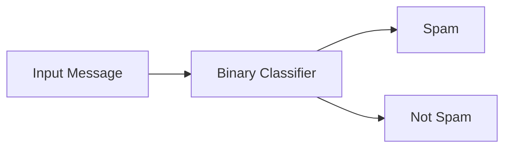

---

### 5.2 Multiclass Classification

Multiclass classification selects exactly one label from several possible classes.

Example support-ticket categories:

```text
billing
technical
account_access
feature_request
```

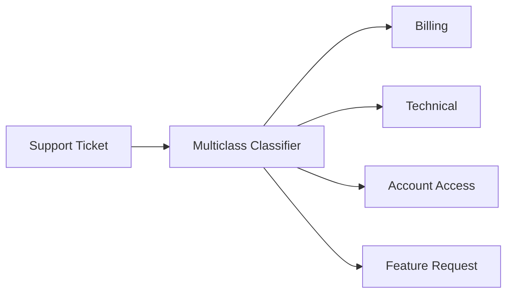

Only one class is selected.

---

### 5.3 Multilabel Classification

Multilabel classification can assign multiple labels to the same input.

Example:

```text
Input:
"The mobile app crashes when I try to update my payment method."

Labels:
- technical_issue
- billing
- mobile_app
```

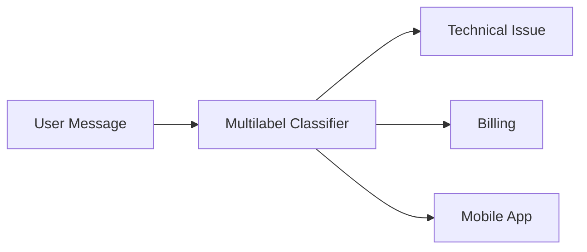

Multilabel classification is useful when categories are not mutually exclusive.

---

### 5.4 Hierarchical Classification

Hierarchical classification organizes labels into levels.

```text
Support
├── Account
│   ├── Password Reset
│   └── Account Deletion
├── Billing
│   ├── Refund
│   └── Duplicate Charge
└── Technical
    ├── Mobile App
    └── Web Application
```

The classifier may first predict a broad category and then a specific subcategory.

```text
Input
  ↓
Billing
  ↓
Duplicate Charge
```

Hierarchical classification can reduce confusion when the label set is large.

---

## 6. Classification Methods

There are several ways to build a classifier.

| Method               | Main Strength                  | Main Limitation                |
| -------------------- | ------------------------------ | ------------------------------ |
| Rules                | Predictable and explainable    | Difficult to maintain          |
| Traditional ML       | Fast and efficient             | Requires labeled training data |
| Embedding similarity | Works with few examples        | Sensitive to label design      |
| LLM prompting        | Flexible and easy to prototype | Cost, latency, inconsistency   |
| Fine-tuned model     | Strong domain performance      | Training and maintenance cost  |
| Hybrid pipeline      | Combines strengths             | More system complexity         |

---

## 7. Rule-Based Classification

A rule-based classifier uses explicit conditions.

```python
def classify_ticket(text: str) -> str:
    normalized = text.lower()

    if "refund" in normalized or "charged twice" in normalized:
        return "billing"

    if "password" in normalized or "cannot log in" in normalized:
        return "account_access"

    if "crash" in normalized or "error" in normalized:
        return "technical"

    return "unknown"
```

### Advantages

* Easy to understand
* Deterministic
* Low latency
* No model cost
* Useful for exact identifiers and known patterns

### Limitations

* Poor synonym handling
* Difficult to scale
* Rules may overlap
* Maintenance becomes complex
* Small wording changes may break classification

For example:

```text
"I cannot access my profile."
```

may mean an account problem even though it contains neither `password` nor `login`.

---

## 8. Traditional Machine-Learning Classification

Traditional classifiers may use features such as:

* Bag-of-words
* TF-IDF
* N-grams
* Word frequencies
* Engineered metadata

Common algorithms include:

* Logistic regression
* Naive Bayes
* Support-vector machines
* Decision trees
* Random forests
* Gradient-boosted trees

Basic workflow:

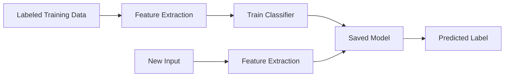

Traditional machine learning can be effective when:

* A large labeled dataset is available
* Classes are stable
* Latency must be low
* Model explainability is important
* Deployment resources are limited

---

## 9. Embedding-Based Classification

Embedding-based classification represents both inputs and class examples as vectors.

The classifier then finds which class is semantically closest to the input.

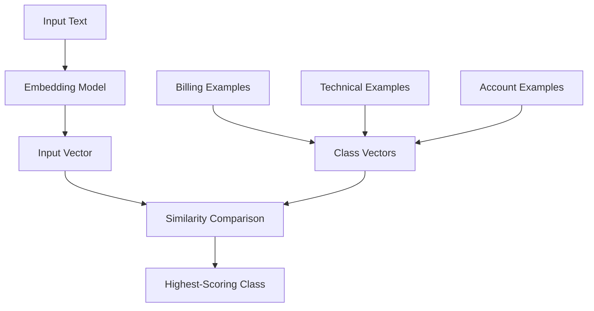

Example:

```text
Input:
"My card was charged two times."

Nearest examples:
1. "I received a duplicate charge." → billing
2. "Why was my payment repeated?" → billing
3. "The application freezes." → technical

Prediction:
billing
```

Embedding-based classification works because semantically similar inputs tend to have nearby vectors.

---

## 10. Prototype-Based Classification

One simple approach is to create one vector for each class description.

Example class definitions:

```json
[
  {
    "label": "billing",
    "description": "Payments, invoices, refunds, charges, and subscriptions"
  },
  {
    "label": "technical",
    "description": "Errors, crashes, performance problems, and broken features"
  },
  {
    "label": "account_access",
    "description": "Login, password, verification, and account recovery problems"
  }
]
```

Each description is embedded:

```text
billing description       → vector B
technical description     → vector T
account access description → vector A
```

The input is also embedded and compared with the class vectors.

```text
Input vector
    ├── similarity with billing: 0.88
    ├── similarity with technical: 0.61
    └── similarity with account access: 0.42

Prediction: billing
```

---

## 11. Example-Based Classification

A stronger approach uses several representative examples for each class.

```json
{
  "billing": [
    "I was charged twice.",
    "Where can I download my invoice?",
    "I want a refund for my subscription.",
    "My payment was declined."
  ],
  "technical": [
    "The application crashes when I open it.",
    "The page loads very slowly.",
    "I receive an error when uploading a file.",
    "The button does not work."
  ],
  "account_access": [
    "I forgot my password.",
    "I cannot sign in.",
    "My verification code never arrived.",
    "My account has been locked."
  ]
}
```

Every example is embedded and stored with its label.

At prediction time:

```text
Input
  ↓
Generate embedding
  ↓
Find nearest examples
  ↓
Aggregate scores by label
  ↓
Return predicted class
```

This method is similar to semantic search, but the final result is a class rather than a document.

---

## 12. Basic Embedding Classification Pipeline

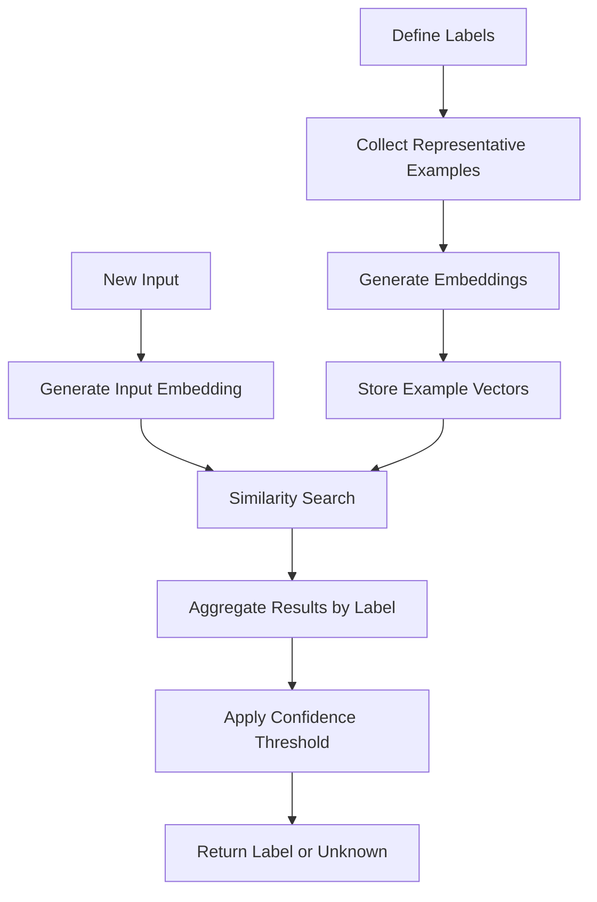

The main steps are:

1. Define the labels.
2. Write clear label descriptions.
3. Collect examples for each label.
4. Generate embeddings for the examples.
5. Store vectors with label metadata.
6. Embed each new input.
7. Retrieve the most similar examples.
8. Aggregate the results by label.
9. Apply confidence and ambiguity rules.
10. Return the prediction.

---

## 13. Minimal Python Example

The following example assumes an embedding model is available.

```python
from dataclasses import dataclass
from math import sqrt
from typing import Protocol, Sequence


class EmbeddingModel(Protocol):
    def embed(self, text: str) -> list[float]:
        ...


@dataclass(frozen=True)
class LabeledExample:
    text: str
    label: str
    embedding: list[float]


@dataclass(frozen=True)
class Prediction:
    label: str
    score: float
    matched_text: str


def cosine_similarity(
    vector_a: Sequence[float],
    vector_b: Sequence[float],
) -> float:
    if len(vector_a) != len(vector_b):
        raise ValueError("Vectors must have equal dimensions.")

    dot_product = sum(a * b for a, b in zip(vector_a, vector_b))
    magnitude_a = sqrt(sum(a * a for a in vector_a))
    magnitude_b = sqrt(sum(b * b for b in vector_b))

    if magnitude_a == 0 or magnitude_b == 0:
        raise ValueError("Cannot compare zero vectors.")

    return dot_product / (magnitude_a * magnitude_b)


def classify_by_nearest_example(
    text: str,
    examples: Sequence[LabeledExample],
    embedding_model: EmbeddingModel,
    minimum_score: float = 0.70,
) -> Prediction:
    if not text.strip():
        raise ValueError("Input text cannot be empty.")

    if not examples:
        raise ValueError("At least one labeled example is required.")

    input_embedding = embedding_model.embed(text)

    ranked = sorted(
        (
            (
                example,
                cosine_similarity(input_embedding, example.embedding),
            )
            for example in examples
        ),
        key=lambda item: item[1],
        reverse=True,
    )

    best_example, best_score = ranked[0]

    if best_score < minimum_score:
        return Prediction(
            label="unknown",
            score=best_score,
            matched_text=best_example.text,
        )

    return Prediction(
        label=best_example.label,
        score=best_score,
        matched_text=best_example.text,
    )
```

Example result:

```json
{
  "label": "billing",
  "score": 0.89,
  "matched_text": "I was charged twice."
}
```

---

## 14. Aggregating Multiple Neighbors

Using only the nearest example can be unstable.

A stronger method retrieves several nearby examples.

```text
Input:
"I cannot access my account after changing phones."

Top results:
1. account_access — 0.91
2. account_access — 0.87
3. technical      — 0.79
4. account_access — 0.76
5. security       — 0.72
```

Scores can be grouped by label:

```text
account_access:
0.91 + 0.87 + 0.76 = 2.54

technical:
0.79

security:
0.72
```

Prediction:

```text
account_access
```

Possible aggregation methods include:

* Majority vote
* Average similarity
* Maximum similarity
* Weighted sum
* Distance-weighted voting
* Class-prototype comparison

---

## 15. Class Prototypes

A class prototype is a representative vector for a category.

One simple prototype is the average of all example vectors in that class.

[
P_c =
\frac{1}{N_c}
\sum_{i=1}^{N_c} E_i
]

Where:

* (P_c) is the prototype for class (c)
* (N_c) is the number of examples in the class
* (E_i) is an example embedding

At prediction time:

```text
Input vector
    ↓
Compare with every class prototype
    ↓
Select closest class
```

Advantages:

* Fast prediction
* One vector per class
* Easy to understand
* Lower storage cost

Limitations:

* One prototype may oversimplify a broad class
* Multimodal classes may need several prototypes
* Outlier examples can distort the average

---

## 16. Designing Good Labels

Poor label design creates poor classification results.

### Weak Labels

```text
general
other
problem
request
miscellaneous
```

These labels are vague and overlap with many inputs.

### Better Labels

```text
billing_refund
billing_duplicate_charge
account_password_reset
technical_mobile_crash
feature_request
```

Good labels should be:

* Clearly defined
* Mutually exclusive when possible
* Relevant to a real action
* Supported by representative examples
* Understandable to reviewers
* Stable enough for production use

---

## 17. Writing Label Definitions

Every label should have a clear description.

Example:

```yaml
billing_refund:
  description: >
    Requests to return money for a completed purchase,
    subscription, or transaction.

  includes:
    - refund requests
    - refund eligibility
    - refund status

  excludes:
    - duplicate charges
    - failed payments
    - invoice requests
```

Clear inclusion and exclusion rules reduce label overlap.

---

## 18. Unknown and Out-of-Scope Inputs

A classifier should not be forced to choose a valid class for every input.

Example:

```text
Available labels:
- billing
- technical
- account_access

Input:
"What is the weather in Bangkok?"
```

The correct result should be:

```text
unknown
```

or:

```text
out_of_scope
```

Without an unknown class, the classifier may incorrectly choose the least-wrong category.

### Threshold Strategy

```text
Best score >= 0.80
→ Accept prediction

Best score between 0.65 and 0.80
→ Request review or use a second classifier

Best score < 0.65
→ Return unknown
```

Threshold values must be calibrated using real evaluation data.

---

## 19. Ambiguous Predictions

Two classes may receive similar scores.

Example:

```text
billing score: 0.84
technical score: 0.82
```

The prediction margin is:

[
0.84 - 0.82 = 0.02
]

A small margin means the classifier is uncertain.

Possible response:

```json
{
  "label": "needs_review",
  "top_candidates": [
    {
      "label": "billing",
      "score": 0.84
    },
    {
      "label": "technical",
      "score": 0.82
    }
  ],
  "reason": "Prediction margin is below the accepted threshold."
}
```

Useful confidence signals include:

* Highest similarity score
* Difference between the first and second classes
* Agreement among nearest neighbors
* Classifier probability
* Agreement between multiple models

---

## 20. LLM-Based Classification

A language model can classify text directly from a prompt.

Example:

```text
Classify the message into exactly one category.

Categories:
- billing
- technical
- account_access
- feature_request
- unknown

Message:
"I was charged twice for my subscription."

Return JSON only.
```

Expected output:

```json
{
  "label": "billing",
  "reason": "The message reports a duplicate subscription charge."
}
```

### Advantages

* Easy to prototype
* Handles complex instructions
* Works with few examples
* Can explain predictions
* Supports changing label sets

### Limitations

* Higher latency
* Higher cost
* Output may be inconsistent
* Prompt changes can affect results
* Difficult to calibrate confidence
* Requires schema validation

---

## 21. Zero-Shot and Few-Shot Classification

### Zero-Shot Classification

The model receives label descriptions but no examples.

```text
Label:
billing — payment, invoice, subscription, or refund issues
```

### Few-Shot Classification

The prompt includes example inputs and expected labels.

```text
Example 1:
"I cannot log in."
Label: account_access

Example 2:
"The application crashes."
Label: technical

Example 3:
"I was charged twice."
Label: billing
```

Few-shot examples often improve consistency but increase prompt length and cost.

---

## 22. Hybrid Classification

A production system can combine several classification methods.

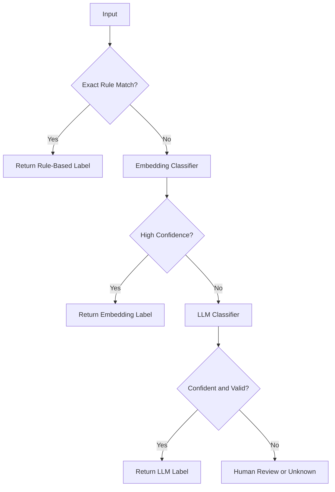

Example strategy:

1. Use rules for exact codes and critical cases.
2. Use embeddings for common semantic classification.
3. Use an LLM for difficult or ambiguous inputs.
4. Send low-confidence cases to human review.

This approach balances:

* Cost
* Accuracy
* Latency
* Explainability
* Flexibility

---

## 23. Data Classification in RAG

Classification can decide which retrieval pipeline should handle a query.

Example knowledge bases:

```text
Product Documentation
Billing Policies
Human Resources
Security Procedures
Engineering Guides
```

The query can first be classified by domain.

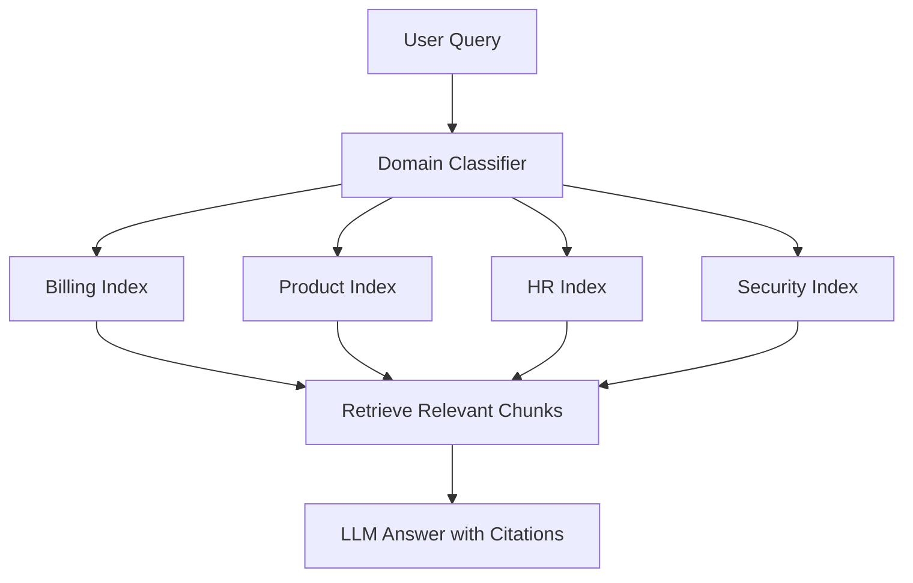

Example:

```text
Query:
"How long does a refund take?"

Classification:
billing

Retrieval:
Search only the billing-policy index
```

Benefits include:

* Faster retrieval
* Lower search cost
* Fewer irrelevant results
* Better metadata filtering
* Clearer prompt construction

However, incorrect classification can prevent the correct document from being retrieved.

A safer strategy may search:

* The predicted domain
* A global fallback index
* The top two predicted domains

---

## 24. Intent Classification for AI Agents

An AI agent may classify user intent before choosing a tool.

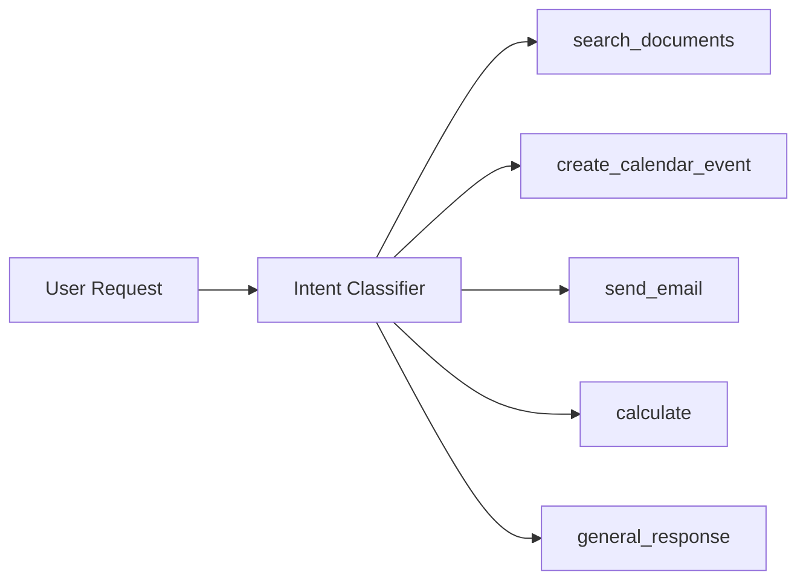

Example:

```text
Input:
"Schedule a meeting with Lan tomorrow at 3 PM."

Intent:
create_calendar_event
```

The classifier may also extract parameters:

```json
{
  "intent": "create_calendar_event",
  "entities": {
    "attendee": "Lan",
    "date": "tomorrow",
    "time": "15:00"
  }
}
```

Classification determines what the system should do next, while extraction determines which data the action requires.

---

## 25. Document Classification Before Indexing

Documents can be classified during the ingestion stage.

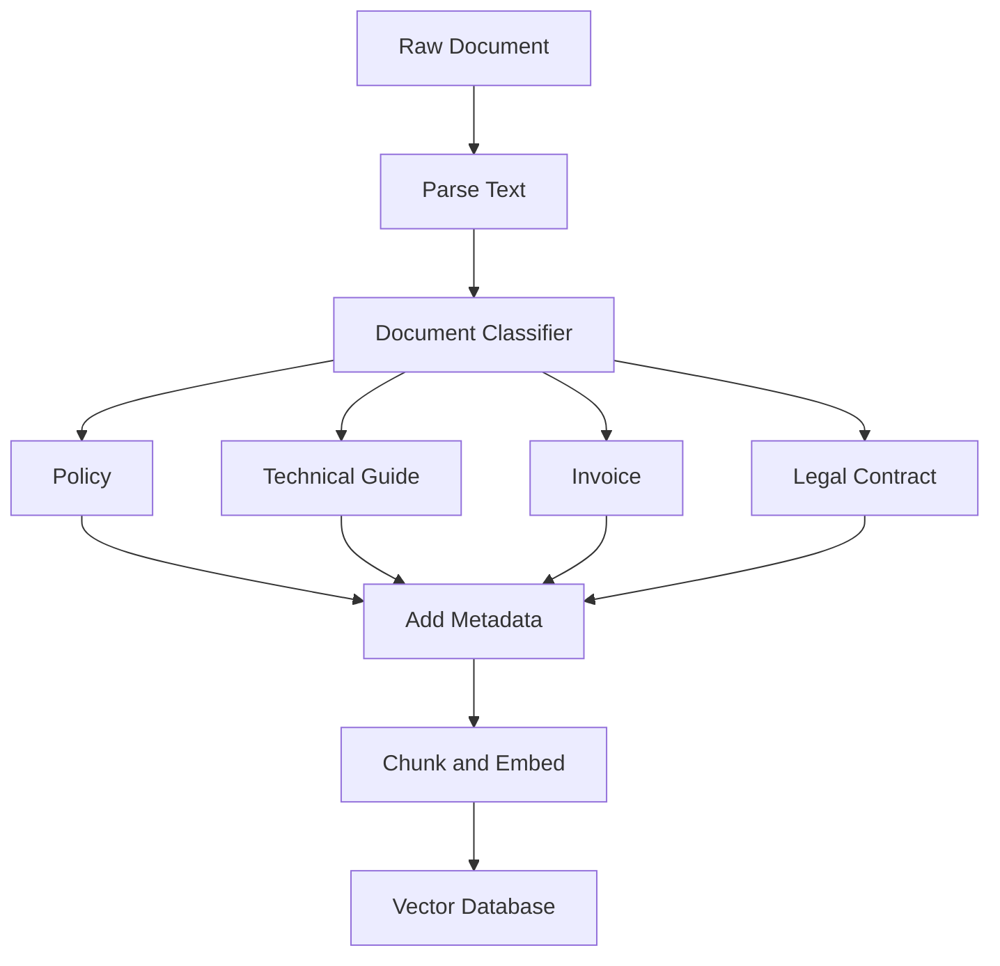

Stored metadata:

```json
{
  "source": "refund-policy.pdf",
  "document_type": "policy",
  "department": "billing",
  "language": "en",
  "confidentiality": "internal"
}
```

This metadata can later be used for filtered retrieval.

---

## 26. Security Classification

Data classification can also refer to sensitivity levels.

Example classes:

```text
public
internal
confidential
restricted
```

Example:

```text
Marketing landing page
→ public

Internal engineering documentation
→ internal

Employee salary report
→ confidential

Authentication secrets
→ restricted
```

A security-classification pipeline may be used before:

* Sending content to an external model
* Storing data in a vector database
* Returning search results
* Sharing documents
* Creating logs
* Allowing AI-agent tool access

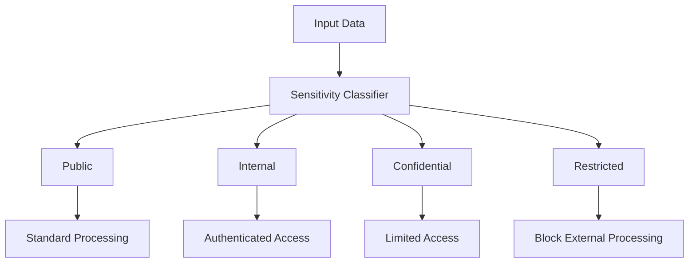

Automated security classification should not be the only protection for highly sensitive systems. It should support, not replace, access-control policies.

---

## 27. Multimodal Classification

Classification is not limited to text.

### Image Classification

```text
Image
  ↓
Image embedding model
  ↓
Vector
  ↓
Class comparison
  ↓
Predicted category
```

Examples:

* Product category
* Animal species
* Damage type
* Document type
* Unsafe visual content

### Audio Classification

Examples:

* Speaker category
* Language detection
* Music genre
* Environmental sound
* Call-center topic

### Multimodal Classification

A system may combine:

* Text embeddings
* Image embeddings
* Audio embeddings
* Structured metadata

Example:

```text
Product title
+
Product image
+
Price and category metadata
    ↓
Product classification
```

---

## 28. Classification Metrics

Accuracy alone is not always enough.

---

### 28.1 Accuracy

Accuracy measures the proportion of correct predictions.

[
\text{Accuracy}
===============

\frac{\text{Correct Predictions}}
{\text{Total Predictions}}
]

Example:

```text
90 correct predictions
100 total predictions

Accuracy = 90%
```

Accuracy can be misleading when classes are imbalanced.

---

### 28.2 Precision

Precision measures how often predictions for a class are correct.

[
\text{Precision}
================

\frac{TP}
{TP + FP}
]

High precision means the classifier produces few false positives.

Example question:

> Of all messages predicted as fraud, how many were actually fraud?

---

### 28.3 Recall

Recall measures how many real examples of a class were detected.

[
\text{Recall}
=============

\frac{TP}
{TP + FN}
]

High recall means the classifier misses few positive cases.

Example question:

> Of all actual fraudulent messages, how many did the system detect?

---

### 28.4 F1 Score

The F1 score balances precision and recall.

[
F1 =
2 \times
\frac{\text{Precision} \times \text{Recall}}
{\text{Precision} + \text{Recall}}
]

F1 is useful when both false positives and false negatives matter.

---

### 28.5 Macro and Micro Averages

**Macro averaging** calculates the metric separately for each class and averages the results.

It gives equal importance to every class.

**Micro averaging** combines all predictions before calculating the metric.

It gives more influence to common classes.

Macro metrics are useful when minority classes matter.

---

## 29. Confusion Matrix

A confusion matrix shows which classes are confused with one another.

Example:

| Actual \ Predicted | Billing | Technical | Account |
| ------------------ | ------: | --------: | ------: |
| Billing            |      42 |         5 |       3 |
| Technical          |       4 |        39 |       7 |
| Account            |       2 |         6 |      42 |

This matrix reveals:

* `Billing` is usually classified correctly.
* Some `Technical` examples are incorrectly classified as `Account`.
* Label definitions or training examples may overlap.

A confusion matrix is more informative than a single accuracy value.

---

## 30. Evaluating Embedding Classification

Create a labeled evaluation dataset.

```json
[
  {
    "text": "I need a copy of last month's invoice.",
    "expected_label": "billing"
  },
  {
    "text": "The upload button does nothing.",
    "expected_label": "technical"
  },
  {
    "text": "I forgot my password.",
    "expected_label": "account_access"
  }
]
```

For every test case, record:

```json
{
  "text": "I cannot access my account.",
  "expected_label": "account_access",
  "predicted_label": "technical",
  "top_score": 0.81,
  "second_score": 0.79,
  "result": "failed",
  "failure_reason": "The phrase 'cannot access' was ambiguous."
}
```

Measure:

* Overall accuracy
* Precision per class
* Recall per class
* F1 per class
* Unknown detection rate
* Low-confidence rate
* Confusion between labels
* Latency
* Cost per prediction

---

## 31. Class Imbalance

A dataset may contain many examples from one class and very few from another.

Example:

```text
billing:        7,000 examples
technical:      2,500 examples
account_access:   450 examples
fraud:             50 examples
```

A classifier could achieve high overall accuracy while performing poorly on `fraud`.

Possible solutions:

* Collect more minority-class examples
* Oversample minority classes
* Undersample majority classes
* Apply class weights
* Use balanced evaluation sets
* Track macro F1
* Adjust class-specific thresholds
* Add rule-based protection for critical classes

For high-risk categories, missing a rare class may be more serious than incorrectly flagging some normal inputs.

---

## 32. Dataset Leakage

Dataset leakage occurs when evaluation data contains information that makes the task unrealistically easy.

Examples:

* Duplicate examples appear in training and testing.
* The label name appears directly in the input.
* Messages from the same conversation are split across datasets.
* File names reveal the expected class.
* Future data is used to train a model evaluated on past predictions.

Better dataset splitting strategies include:

* Split by document
* Split by user
* Split by conversation
* Split by organization
* Split chronologically

The test set should represent genuinely unseen inputs.

---

## 33. Common Failure Cases

### 33.1 Overlapping Labels

```text
payment_issue
billing_issue
subscription_problem
```

These labels may describe the same message.

**Improvement:** Define clear boundaries or create a hierarchy.

---

### 33.2 Too Few Examples

One example may not represent the language diversity of a class.

**Improvement:** Add examples using synonyms, informal language, spelling mistakes, and different sentence structures.

---

### 33.3 Similarity Without Intent

Two messages can be semantically similar but require different actions.

```text
"How can I cancel my subscription?"
"I accidentally canceled my subscription."
```

Both mention subscription cancellation, but their intents differ.

---

### 33.4 Forced Classification

The system selects a valid label even when the input is unrelated.

**Improvement:** Add `unknown`, thresholds, and out-of-scope examples.

---

### 33.5 Keyword Dependence

An embedding classifier may still overfit to repeated wording in the examples.

**Improvement:** Use diverse examples and paraphrased evaluation inputs.

---

### 33.6 Poor Multilingual Support

English examples may not classify Vietnamese inputs correctly.

**Improvement:** Use a multilingual embedding model and examples from every supported language.

---

### 33.7 Class Drift

The meaning or frequency of classes changes over time.

Examples:

* New products are introduced.
* Support categories change.
* User vocabulary changes.
* New fraud patterns appear.

**Improvement:** Monitor prediction distributions and periodically update the dataset.

---

### 33.8 Duplicate Examples

Many nearly identical examples may dominate nearest-neighbor results.

**Improvement:** Deduplicate the dataset and balance example coverage.

---

### 33.9 Incorrect Confidence Interpretation

A similarity score of `0.85` does not always mean the prediction is 85% likely to be correct.

**Improvement:** Calibrate thresholds on a labeled validation set.

---

## 34. Error Handling Strategy

A production classifier should return more than one label string.

Recommended response:

```json
{
  "label": "billing",
  "confidence": 0.88,
  "status": "accepted",
  "alternatives": [
    {
      "label": "account_access",
      "score": 0.62
    }
  ],
  "model_version": "embedding-classifier-v3",
  "reason": "Nearest examples describe duplicate payment charges."
}
```

Low-confidence response:

```json
{
  "label": "unknown",
  "confidence": 0.57,
  "status": "needs_review",
  "alternatives": [
    {
      "label": "technical",
      "score": 0.57
    },
    {
      "label": "account_access",
      "score": 0.55
    }
  ]
}
```

---

## 35. Example API Design

### Request

```http
POST /api/classify
Content-Type: application/json
```

```json
{
  "text": "I was charged two times for the same order.",
  "allowed_labels": [
    "billing",
    "technical",
    "account_access",
    "feature_request"
  ]
}
```

### Response

```json
{
  "label": "billing",
  "score": 0.92,
  "status": "accepted",
  "matched_examples": [
    {
      "text": "I was charged twice.",
      "score": 0.94
    },
    {
      "text": "The payment appeared two times.",
      "score": 0.90
    }
  ],
  "model": "embedding-model-name",
  "classifier_version": "2026-07"
}
```

### API Validation

The API should:

* Reject empty input
* Limit text length
* Validate requested labels
* Validate output schema
* Apply authentication
* Log model and classifier versions
* Avoid logging sensitive raw data
* Set a request timeout
* Return `unknown` when confidence is insufficient

---

## 36. Practical Exercise

### Goal

Build an embedding-based support-ticket classifier.

### Labels

Use four classes:

```text
billing
technical
account_access
feature_request
```

Add:

```text
unknown
```

for out-of-scope inputs.

---

### Step 1: Define Every Class

For each class, write:

* Description
* Included topics
* Excluded topics
* At least five examples

Example:

```yaml
account_access:
  description: Login, password, verification, and account recovery issues.

  includes:
    - forgotten passwords
    - failed login attempts
    - locked accounts
    - missing verification codes

  excludes:
    - application crashes
    - payment failures
```

---

### Step 2: Build a Labeled Dataset

Create at least 50 examples.

```json
{
  "text": "I cannot sign in after resetting my password.",
  "label": "account_access"
}
```

Include:

* Formal messages
* Informal messages
* Short queries
* Long descriptions
* Spelling mistakes
* Synonyms
* Ambiguous examples
* Out-of-scope queries

---

### Step 3: Split the Dataset

Suggested split:

```text
70% training examples
15% validation examples
15% test examples
```

For nearest-neighbor classification, the training set becomes the searchable example collection.

Use the validation set to select thresholds.

Use the test set only for final evaluation.

---

### Step 4: Generate Embeddings

Store:

```json
{
  "text": "I cannot sign in.",
  "label": "account_access",
  "embedding_model": "model-name",
  "embedding": [0.12, -0.34, 0.81]
}
```

---

### Step 5: Implement Classification

For each input:

1. Generate an embedding.
2. Retrieve the top five examples.
3. Aggregate results by label.
4. Calculate the prediction margin.
5. Apply an acceptance threshold.
6. Return a label or `unknown`.

---

### Step 6: Evaluate

Produce a report containing:

| Metric              | Result |
| ------------------- | -----: |
| Accuracy            |   0.86 |
| Macro F1            |   0.82 |
| Unknown recall      |   0.78 |
| Average latency     |  41 ms |
| Low-confidence rate |     9% |

Also create a confusion matrix.

---

### Step 7: Record Failure Cases

Example:

```json
{
  "input": "The payment page does not open.",
  "expected": "technical",
  "predicted": "billing",
  "reason": "The word 'payment' dominated semantic similarity.",
  "improvement": "Add technical examples involving payment-page failures."
}
```

---

### Step 8: Compare Approaches

Compare:

1. Keyword rules
2. Nearest-example embeddings
3. Class prototypes
4. LLM classification
5. Hybrid classification

Measure:

* Accuracy
* Macro F1
* Latency
* Cost
* Explainability
* Maintenance effort

---

## 37. Suggested Project Structure

```text
data-classification/
├── data/
│   ├── train.json
│   ├── validation.json
│   └── test.json
├── src/
│   ├── labels.py
│   ├── embeddings.py
│   ├── vector_store.py
│   ├── classifier.py
│   ├── confidence.py
│   ├── evaluation.py
│   └── api.py
├── tests/
│   ├── test_classifier.py
│   ├── test_unknown_detection.py
│   ├── test_thresholds.py
│   └── test_api.py
├── reports/
│   ├── metrics.json
│   ├── confusion_matrix.md
│   └── failure_analysis.md
├── README.md
└── requirements.txt
```

---

## 38. Production Checklist

### Label Design

* [ ] Every label has a clear definition.
* [ ] Inclusion and exclusion rules are documented.
* [ ] Overlapping labels have been reviewed.
* [ ] An `unknown` or `out_of_scope` path exists.
* [ ] The label set maps to real product actions.

### Data

* [ ] Every class has representative examples.
* [ ] Minority classes are adequately represented.
* [ ] Duplicate examples are removed.
* [ ] Train and test data are properly separated.
* [ ] Multilingual examples are included where required.

### Embeddings

* [ ] The embedding model supports the target domain.
* [ ] The model supports all required languages.
* [ ] Embedding dimensions are validated.
* [ ] Model name and version are stored.
* [ ] A re-embedding strategy exists.

### Prediction

* [ ] Top-k aggregation has been evaluated.
* [ ] Confidence thresholds are calibrated.
* [ ] Prediction margins are checked.
* [ ] Low-confidence inputs are not forced into a class.
* [ ] Alternatives can be returned for debugging.

### Evaluation

* [ ] Accuracy is measured.
* [ ] Precision, recall, and F1 are measured per class.
* [ ] Macro metrics are reported.
* [ ] A confusion matrix is generated.
* [ ] Unknown and out-of-scope detection is evaluated.
* [ ] Failure cases are stored and reviewed.

### Security

* [ ] Sensitive input is handled safely.
* [ ] Classification does not replace authorization.
* [ ] Cross-tenant data is isolated.
* [ ] Raw private text is not logged unnecessarily.
* [ ] Security-sensitive classes receive additional validation.

### Operations

* [ ] Prediction latency is monitored.
* [ ] Model cost is tracked.
* [ ] Label distributions are monitored.
* [ ] Model and data drift are reviewed.
* [ ] Classifier versions support rollback.
* [ ] Human-review workflows are defined.

---

## 39. Key Limitations

Embedding-based classification has several limitations:

1. Similarity does not always represent the required intent.
2. Label descriptions may overlap.
3. Confidence scores may be poorly calibrated.
4. Rare classes may be ignored.
5. New topics may be forced into existing categories.
6. Results depend heavily on the quality of examples.
7. Different embedding models produce incompatible vectors.
8. Exact identifiers may require rule-based handling.
9. Multilingual performance may vary by language.
10. A classification error can route retrieval or tools incorrectly.
11. Embeddings may encode biases from training data.
12. High-risk decisions should not rely on one classifier alone.

---

## 40. Knowledge Check

### Question 1

What is data classification?

**Answer:**
It is the process of assigning one or more predefined labels to an input such as text, an image, audio, or a document.

---

### Question 2

What is the difference between multiclass and multilabel classification?

**Answer:**
Multiclass classification selects exactly one class, while multilabel classification can assign several classes to the same input.

---

### Question 3

How can embeddings be used for classification?

**Answer:**
The system embeds the input and compares it with class descriptions, prototypes, or labeled examples. The closest class or group of examples determines the prediction.

---

### Question 4

Why should a classifier support an unknown class?

**Answer:**
Because not every input belongs to the available label set. Without an unknown path, the system may return an incorrect but valid-looking label.

---

### Question 5

Why is accuracy insufficient for an imbalanced dataset?

**Answer:**
A classifier may achieve high accuracy by predicting common classes while performing poorly on rare but important classes.

---

### Question 6

What does a confusion matrix show?

**Answer:**
It shows how often each actual class is predicted as every possible class, making class-specific errors and overlaps easier to identify.

---

### Question 7

How can classification improve a RAG pipeline?

**Answer:**
It can identify the query domain and route the search to the most relevant knowledge base, metadata filter, or retrieval strategy.

---

### Question 8

What should happen when the two highest class scores are nearly equal?

**Answer:**
The system should treat the result as ambiguous, return alternatives, use another classifier, ask for clarification, or send the case for review.

---

## 41. Completion Checklist

* [ ] I can explain data classification in one or two minutes.
* [ ] I understand binary, multiclass, multilabel, and hierarchical classification.
* [ ] I can explain embedding-based classification.
* [ ] I can define labels with inclusion and exclusion rules.
* [ ] I can build a nearest-example classifier.
* [ ] I understand class prototypes and top-k aggregation.
* [ ] I know why an unknown class is necessary.
* [ ] I can explain accuracy, precision, recall, and F1.
* [ ] I can interpret a confusion matrix.
* [ ] I have created a labeled evaluation dataset.
* [ ] I have documented at least one failure case.
* [ ] I understand how classification can route RAG queries or agent tools.
* [ ] I understand at least one safety or security limitation.

---

## 42. Related Outcome

Build semantic AI systems using:

* Embedding models
* Labeled examples
* Vector similarity
* Confidence thresholds
* Metadata
* Classification evaluation
* RAG routing
* Agent intent detection

---

## 43. Related Project

### Project 7 — Semantic Search and Classification Engine

Extend a semantic search engine for Markdown or PDF files with document and query classification.

The project should include:

* Document parsing
* Text chunking
* Embedding generation
* Document-type classification
* Query-domain classification
* Chroma, Qdrant, FAISS, or pgvector
* Metadata filtering
* Top-k similarity search
* Unknown detection
* Confidence thresholds
* Retrieval citations
* Classification evaluation

### Minimum Deliverables

```text
1. At least five classification labels
2. At least ten examples per label
3. An unknown or out-of-scope class
4. An embedding-based classifier
5. A vector index
6. A classification API
7. Accuracy and macro-F1 results
8. A confusion matrix
9. At least five documented failure cases
10. Integration with a semantic-search or RAG pipeline
```

---

## 44. Summary

Data classification assigns one or more labels to an input.

The basic workflow is:

```text
Input
  ↓
Representation or embedding
  ↓
Classifier
  ↓
Confidence evaluation
  ↓
Predicted label or unknown
```

Embedding-based classification extends semantic search:

```text
Input text
  ↓
Embedding model
  ↓
Input vector
  ↓
Compare with labeled examples
  ↓
Aggregate similarity by class
  ↓
Return the best label
```

Classification can be used to:

* Route support tickets
* Detect user intent
* Categorize documents
* Select a RAG knowledge base
* Apply metadata
* Choose an agent tool
* Detect sensitive information
* Organize multimodal data

A reliable classifier requires more than a successful demonstration. It needs:

* Clear labels
* Representative examples
* Unknown detection
* Confidence thresholds
* Balanced evaluation data
* Per-class metrics
* Confusion-matrix analysis
* Failure-case tracking
* Versioning
* Security controls
* Human review for uncertain or high-risk cases

The most important principle is:

> A classifier should be allowed to express uncertainty. Returning `unknown` is often safer and more useful than returning a confident but incorrect label.
