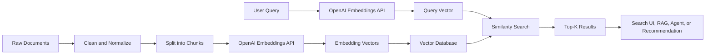
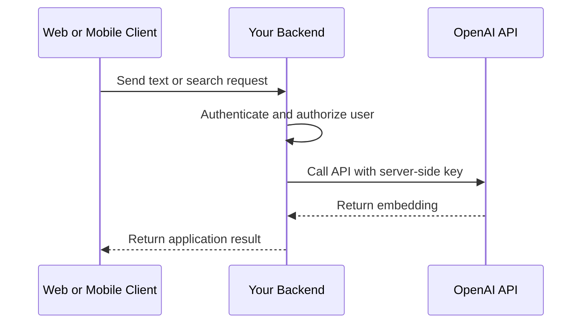
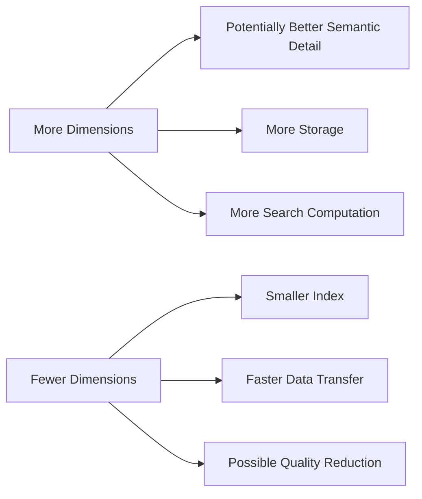
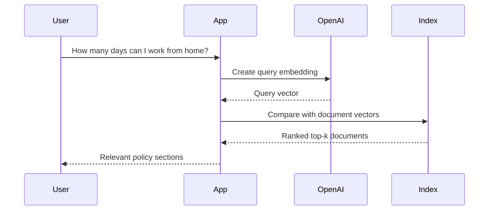
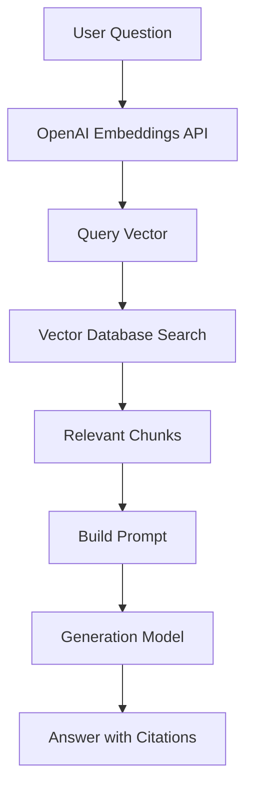
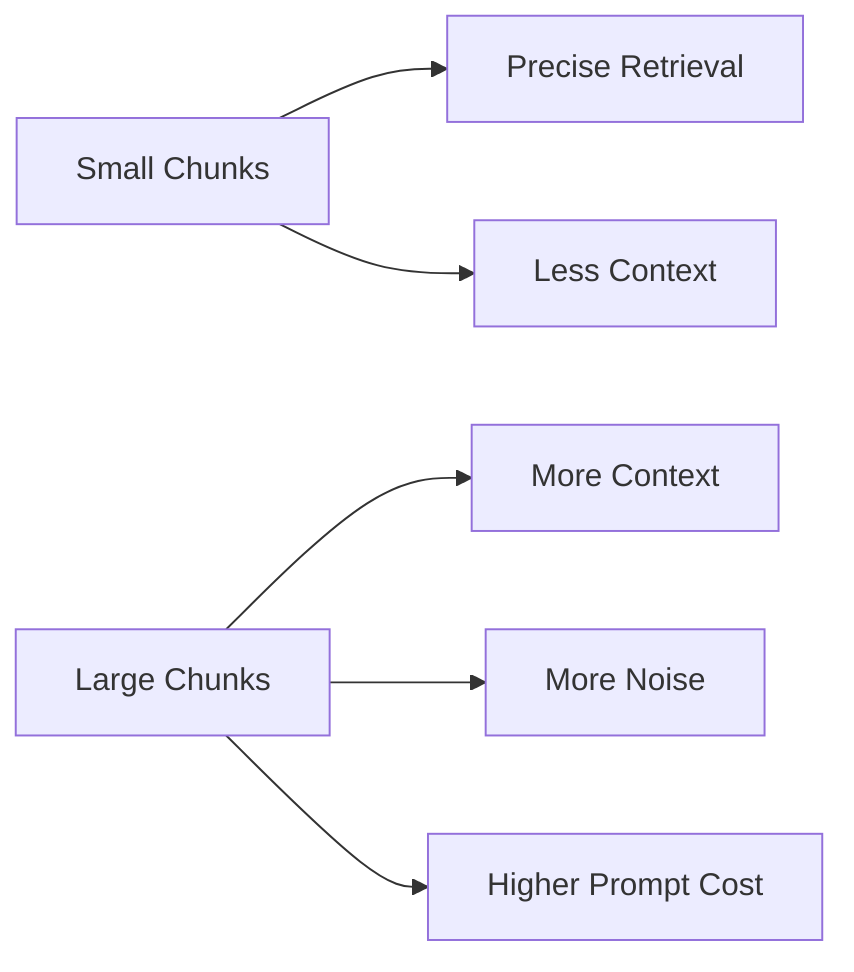
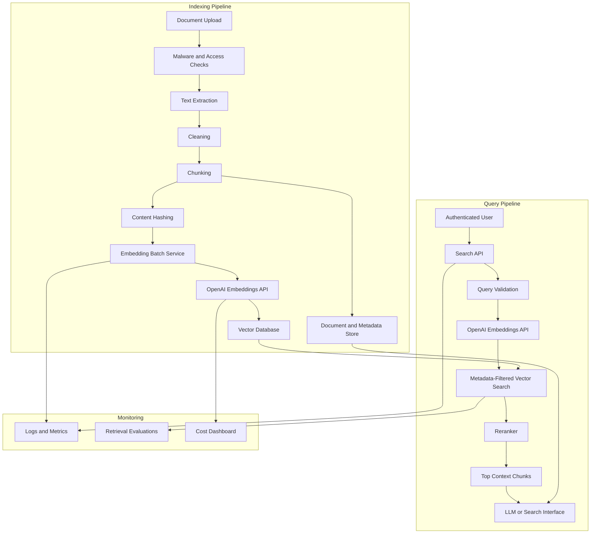

# 007 — OpenAI Embeddings API

**Course:** 03 — Knowledge Systems and RAG
**Module:** Module 08 — Embeddings and Vector Databases
**Topic Group:** Embedding Models
**Roadmap Source:** Embeddings and Vector Databases / Embedding Models
**Lesson Type:** Embeddings and Vector Databases
**Module Order:** 007
**Suggested Duration:** 24 minutes

---

## 1. Overview

The OpenAI Embeddings API converts text into numerical vectors called **embeddings**.

An embedding is a list of floating-point numbers representing the semantic meaning of an input. Texts with similar meanings usually produce vectors that are close together in the embedding space.

For example:

```text
"How do I reset my password?"
"I forgot my password."
"Help me recover access to my account."
```

Although these sentences use different words, they describe a similar intent. Their embeddings should therefore have relatively high similarity.

The OpenAI Embeddings API can be used as a building block for:

* Semantic search
* Retrieval-Augmented Generation
* Recommendation systems
* Document classification
* Clustering
* Duplicate detection
* Code search
* Agent memory
* Content matching
* Anomaly detection

OpenAI currently documents `text-embedding-3-small` and `text-embedding-3-large` as its third-generation embedding models. The API accepts text and returns vectors that can be stored in a vector database or compared directly in application code.

---

## 2. Learning Objectives

By the end of this lesson, you should be able to:

* Explain what the OpenAI Embeddings API does.
* Create embeddings using Python, JavaScript, and cURL.
* Understand the structure of an embeddings request and response.
* Compare `text-embedding-3-small` and `text-embedding-3-large`.
* Generate embeddings for one input or a batch of inputs.
* Reduce vector size using the `dimensions` parameter.
* Compare vectors using cosine similarity or dot product.
* Use embeddings in a semantic search or RAG pipeline.
* Store vectors together with source metadata.
* Evaluate retrieval quality with a realistic test set.
* Identify common production, security, cost, and indexing problems.

---

## 3. Where the API Fits in an AI System

The Embeddings API is not usually the final user-facing feature. It is one component inside a larger retrieval or similarity workflow.



The complete workflow is:

```text
documents
  -> text extraction
  -> cleaning
  -> chunking
  -> embedding generation
  -> vector storage

user query
  -> query embedding
  -> similarity search
  -> top-k results
  -> application or LLM
```

The embedding model creates vector representations, but your application remains responsible for:

* Chunking
* Metadata
* Storage
* Search
* Filtering
* Reranking
* Citations
* Evaluation
* Access control
* Updating and deleting indexed data

---

## 4. Available Embedding Models

The two main third-generation models are:

| Model                    | Default Dimensions | Typical Priority                                      |
| ------------------------ | -----------------: | ----------------------------------------------------- |
| `text-embedding-3-small` |              1,536 | Lower storage, lower cost, high throughput            |
| `text-embedding-3-large` |              3,072 | Higher retrieval quality and multilingual performance |

The default output lengths are 1,536 dimensions for `text-embedding-3-small` and 3,072 dimensions for `text-embedding-3-large`. Both support the `dimensions` parameter, which lets an application request a shorter output vector.

### Choose `text-embedding-3-small` When

* You are building an initial prototype.
* You need to embed a large document collection.
* Storage and search latency are important.
* You need a cost-efficient default model.
* Your retrieval task does not require maximum semantic precision.

### Choose `text-embedding-3-large` When

* Retrieval quality is more important than storage cost.
* Your application handles difficult semantic distinctions.
* You are working with multilingual documents.
* Small improvements in recall have significant business value.
* You have evaluated both models and confirmed that the larger model performs better on your dataset.

### Important Rule

Do not choose a model only from benchmark numbers.

Evaluate the model using your own:

* Documents
* Languages
* Query styles
* Domain terminology
* Failure cases
* Retrieval metrics

A model that performs better on a general benchmark may not always perform better on your application’s data.

---

## 5. Request and Response Structure

The embeddings endpoint is:

```http
POST /v1/embeddings
```

A typical request contains:

```json
{
  "model": "text-embedding-3-small",
  "input": "Your text goes here",
  "encoding_format": "float"
}
```

The API accepts a single string, an array of strings, token arrays, or arrays of token arrays. The documented per-input limit is 8,192 tokens, and the combined inputs in one request are also subject to a total token limit. Empty strings should not be sent as inputs.

### Main Request Fields

| Field             | Required | Description                                          |
| ----------------- | -------: | ---------------------------------------------------- |
| `model`           |      Yes | Embedding model identifier                           |
| `input`           |      Yes | One text input or a batch of inputs                  |
| `dimensions`      |       No | Requested vector length for third-generation models  |
| `encoding_format` |       No | Output format: `float` or `base64`                   |
| `user`            |       No | End-user identifier that may assist abuse monitoring |

The official API reference documents `float` and `base64` as supported output formats. It also documents `dimensions` for `text-embedding-3` models and later.

### Simplified Response

```json
{
  "object": "list",
  "data": [
    {
      "object": "embedding",
      "index": 0,
      "embedding": [
        -0.012,
        0.008,
        0.031
      ]
    }
  ],
  "model": "text-embedding-3-small",
  "usage": {
    "prompt_tokens": 6,
    "total_tokens": 6
  }
}
```

The important value is:

```text
response.data[0].embedding
```

This is the vector that you store or compare.

The `usage` object reports the number of input tokens processed by the request. Embedding usage is based on input tokens rather than generated output tokens.

---

## 6. Environment Setup

Install the official Python SDK:

```bash
pip install openai numpy
```

Set the API key as an environment variable:

```bash
export OPENAI_API_KEY="your-api-key"
```

On PowerShell:

```powershell
$env:OPENAI_API_KEY="your-api-key"
```

The official OpenAI SDK automatically reads `OPENAI_API_KEY` when the client is created without an explicit key. OpenAI recommends loading keys from server-side environment variables or a secret-management service and warns against exposing API keys in browser or mobile client code.

```python
from openai import OpenAI

client = OpenAI()
```

### Security Rule

Do not place an OpenAI API key directly inside:

* Frontend JavaScript
* Mobile application code
* Public Git repositories
* Docker images
* Log messages
* Error responses sent to users

Use this architecture instead:



The frontend should call your backend. Your backend should hold the API key and call OpenAI.

---

## 7. Creating a Single Embedding in Python

```python
from openai import OpenAI

client = OpenAI()

response = client.embeddings.create(
    model="text-embedding-3-small",
    input="Semantic search finds information based on meaning.",
    encoding_format="float",
)

embedding = response.data[0].embedding

print(f"Vector dimensions: {len(embedding)}")
print(f"First five values: {embedding[:5]}")
print(f"Input tokens: {response.usage.total_tokens}")
```

Expected structure:

```text
Vector dimensions: 1536
First five values: [...]
Input tokens: ...
```

The vector values do not have a useful meaning when inspected individually.

Their value appears when vectors are compared as complete representations.

```text
individual number -> usually not interpretable

complete vector
    +
another complete vector
    +
similarity metric
    =
semantic relationship
```

---

## 8. Creating Embeddings for Multiple Inputs

Sending multiple inputs in one request is usually more efficient than making one network request for every small chunk.

```python
from openai import OpenAI

client = OpenAI()

texts = [
    "Employees may work remotely three days per week.",
    "Annual leave requests require manager approval.",
    "Multi-factor authentication is required for all accounts.",
]

response = client.embeddings.create(
    model="text-embedding-3-small",
    input=texts,
    encoding_format="float",
)

embeddings = [item.embedding for item in response.data]

for index, embedding in enumerate(embeddings):
    print(
        f"Text {index}: "
        f"{len(embedding)} dimensions"
    )
```

The response preserves input ordering using each result’s `index` field.

A safer implementation explicitly sorts by the index:

```python
ordered_results = sorted(
    response.data,
    key=lambda item: item.index,
)

embeddings = [
    item.embedding
    for item in ordered_results
]
```

### Reusable Batch Function

```python
from collections.abc import Sequence
from openai import OpenAI

client = OpenAI()


def create_embeddings(
    texts: Sequence[str],
    *,
    model: str = "text-embedding-3-small",
    dimensions: int | None = None,
) -> list[list[float]]:
    cleaned_texts = [
        text.strip()
        for text in texts
        if text and text.strip()
    ]

    if not cleaned_texts:
        return []

    request: dict[str, object] = {
        "model": model,
        "input": cleaned_texts,
        "encoding_format": "float",
    }

    if dimensions is not None:
        request["dimensions"] = dimensions

    response = client.embeddings.create(**request)

    ordered_results = sorted(
        response.data,
        key=lambda item: item.index,
    )

    return [
        item.embedding
        for item in ordered_results
    ]
```

Usage:

```python
vectors = create_embeddings(
    [
        "What is semantic search?",
        "How does vector retrieval work?",
    ]
)
```

---

## 9. Controlling Vector Dimensions

Third-generation OpenAI embedding models support the `dimensions` parameter.

```python
response = client.embeddings.create(
    model="text-embedding-3-small",
    input="A shorter embedding uses less storage.",
    dimensions=512,
)

embedding = response.data[0].embedding

print(len(embedding))
```

Output:

```text
512
```

OpenAI’s documentation explains that the third-generation models were trained to support shorter embeddings through the API’s `dimensions` parameter. Smaller vectors reduce memory, storage, and vector-search computation, although reducing dimensions can trade some retrieval quality for efficiency.

### Dimension Trade-Off



### Example Storage Comparison

For one million vectors stored as 32-bit floating-point values:

| Dimensions | Approximate Raw Vector Storage |
| ---------: | -----------------------------: |
|        256 |                         1.0 GB |
|        512 |                         2.0 GB |
|      1,536 |                         6.1 GB |
|      3,072 |                        12.3 GB |

The simplified calculation is:

[
\text{storage}
==============

\text{vectors}
\times
\text{dimensions}
\times
4\text{ bytes}
]

Actual database storage will be larger because of:

* Index structures
* Metadata
* Identifiers
* Replication
* Compression settings
* Database overhead

### Important Index Rule

All vectors in one vector collection normally need the same dimension.

Do not mix:

```text
1536-dimensional vectors
and
512-dimensional vectors
```

inside the same vector index unless the database explicitly supports separate vector fields.

Store the configuration with the index:

```json
{
  "embedding_model": "text-embedding-3-small",
  "dimensions": 512,
  "distance_metric": "cosine",
  "embedding_version": "v1"
}
```

---

## 10. Creating an Embedding with cURL

```bash
curl https://api.openai.com/v1/embeddings \
  -H "Authorization: Bearer $OPENAI_API_KEY" \
  -H "Content-Type: application/json" \
  -d '{
    "model": "text-embedding-3-small",
    "input": "Embeddings represent semantic meaning as vectors.",
    "encoding_format": "float"
  }'
```

Batch request:

```bash
curl https://api.openai.com/v1/embeddings \
  -H "Authorization: Bearer $OPENAI_API_KEY" \
  -H "Content-Type: application/json" \
  -d '{
    "model": "text-embedding-3-small",
    "input": [
      "Semantic search uses vector similarity.",
      "RAG retrieves external context before generation."
    ],
    "dimensions": 512,
    "encoding_format": "float"
  }'
```

The official embeddings guide uses the same `/v1/embeddings` endpoint and Bearer authentication pattern.

---

## 11. Creating Embeddings with JavaScript

Install the SDK:

```bash
npm install openai
```

Example:

```javascript
import OpenAI from "openai";

const client = new OpenAI();

const response = await client.embeddings.create({
  model: "text-embedding-3-small",
  input: "Vector databases store embeddings for similarity search.",
  encoding_format: "float",
});

const embedding = response.data[0].embedding;

console.log(`Dimensions: ${embedding.length}`);
console.log(embedding.slice(0, 5));
```

Batch example:

```javascript
const texts = [
  "The user forgot their password.",
  "The customer needs account recovery.",
  "The application crashes during checkout.",
];

const response = await client.embeddings.create({
  model: "text-embedding-3-small",
  input: texts,
  dimensions: 512,
});

const embeddings = response.data
  .sort((a, b) => a.index - b.index)
  .map((item) => item.embedding);
```

The official OpenAI documentation provides server-side SDK support for Python and JavaScript and shows `client.embeddings.create()` as the embedding request method.

---

## 12. Comparing Two Embeddings

After generating vectors, the next step is usually to measure their similarity.

### Cosine Similarity

[
\text{cosine similarity}(a,b)
=============================

\frac{a \cdot b}
{|a||b|}
]

Python implementation:

```python
import numpy as np


def cosine_similarity(
    vector_a: list[float],
    vector_b: list[float],
) -> float:
    a = np.asarray(vector_a, dtype=np.float32)
    b = np.asarray(vector_b, dtype=np.float32)

    denominator = np.linalg.norm(a) * np.linalg.norm(b)

    if denominator == 0:
        return 0.0

    return float(np.dot(a, b) / denominator)
```

Example:

```python
texts = [
    "I forgot my password.",
    "Help me recover my account.",
    "The weather is sunny today.",
]

vectors = create_embeddings(texts)

password_similarity = cosine_similarity(
    vectors[0],
    vectors[1],
)

weather_similarity = cosine_similarity(
    vectors[0],
    vectors[2],
)

print("Password vs. recovery:", password_similarity)
print("Password vs. weather:", weather_similarity)
```

The first score should generally be higher because the first two inputs are semantically related.

OpenAI recommends cosine similarity for its embeddings. The documentation also states that OpenAI embeddings are normalized to length one, so dot product can be used as an efficient cosine-similarity calculation, and Euclidean distance produces the same ranking.

### Dot Product

```python
def dot_product(
    vector_a: list[float],
    vector_b: list[float],
) -> float:
    a = np.asarray(vector_a, dtype=np.float32)
    b = np.asarray(vector_b, dtype=np.float32)

    return float(np.dot(a, b))
```

For OpenAI embeddings:

```python
score = dot_product(query_vector, document_vector)
```

Higher scores represent greater similarity.

---

## 13. Building a Minimal Semantic Search Engine

The following example creates a small in-memory semantic search system.

### Step 1: Define Documents

```python
from dataclasses import dataclass


@dataclass(frozen=True)
class Document:
    text: str
    source: str
    section: str


documents = [
    Document(
        text=(
            "Employees may work remotely for up to "
            "three days per week."
        ),
        source="employee-handbook.md",
        section="Remote Work",
    ),
    Document(
        text=(
            "Annual leave requests must be submitted "
            "at least seven days in advance."
        ),
        source="employee-handbook.md",
        section="Annual Leave",
    ),
    Document(
        text=(
            "All employee accounts must use "
            "multi-factor authentication."
        ),
        source="security-policy.md",
        section="Account Security",
    ),
]
```

### Step 2: Embed the Documents

```python
document_vectors = create_embeddings(
    [document.text for document in documents]
)
```

### Step 3: Search

```python
from dataclasses import dataclass


@dataclass(frozen=True)
class SearchResult:
    score: float
    document: Document


def semantic_search(
    query: str,
    *,
    documents: list[Document],
    document_vectors: list[list[float]],
    top_k: int = 3,
) -> list[SearchResult]:
    if len(documents) != len(document_vectors):
        raise ValueError(
            "Documents and vectors must have equal lengths."
        )

    query_vectors = create_embeddings([query])

    if not query_vectors:
        return []

    query_vector = query_vectors[0]

    results = [
        SearchResult(
            score=dot_product(query_vector, vector),
            document=document,
        )
        for document, vector in zip(
            documents,
            document_vectors,
            strict=True,
        )
    ]

    return sorted(
        results,
        key=lambda result: result.score,
        reverse=True,
    )[:top_k]
```

### Step 4: Run a Query

```python
results = semantic_search(
    "How many days can I work from home?",
    documents=documents,
    document_vectors=document_vectors,
    top_k=3,
)

for result in results:
    print(f"Score: {result.score:.4f}")
    print(f"Source: {result.document.source}")
    print(f"Section: {result.document.section}")
    print(f"Text: {result.document.text}")
    print("---")
```

Expected top result:

```text
Employees may work remotely for up to three days per week.
```

### Search Flow



---

## 14. Adding a Vector Database

An in-memory list is useful for learning, but production applications commonly use a vector index.

Possible storage options include:

* Chroma
* Qdrant
* FAISS
* PostgreSQL with pgvector
* Elasticsearch
* OpenSearch
* Managed vector database services

The general indexing flow remains the same:

```text
chunk ID
+ chunk text
+ embedding vector
+ metadata
-> vector database
```

Example record:

```json
{
  "id": "employee-handbook-remote-work-001",
  "vector": [0.012, -0.031, 0.008],
  "payload": {
    "text": "Employees may work remotely for up to three days per week.",
    "source": "employee-handbook.pdf",
    "page": 12,
    "section": "Remote Work",
    "language": "en",
    "document_version": "2026-06-15"
  }
}
```

Query flow:

```text
user query
    -> OpenAI query embedding
    -> vector database search
    -> metadata filtering
    -> top-k chunks
```

---

## 15. Using the API in a RAG Pipeline

Retrieval-Augmented Generation uses retrieved documents as context for a language model.



### Example

User question:

```text
What is the remote-work policy?
```

Retrieved chunk:

```text
Employees may work remotely for up to three days per week.
```

Metadata:

```json
{
  "source": "employee-handbook.pdf",
  "page": 12,
  "section": "Remote Work"
}
```

Generated context:

```text
Use only the supplied context to answer the question.
If the context does not contain the answer, say that the
available documents do not provide enough information.

Context:
[Source: employee-handbook.pdf, page 12]
Employees may work remotely for up to three days per week.

Question:
What is the remote-work policy?
```

Possible answer:

```text
Employees may work remotely for up to three days per week.

Source: employee-handbook.pdf, page 12.
```

The Embeddings API performs retrieval representation. It does not generate the final natural-language answer.

---

## 16. Chunking Documents Before Embedding

Large documents should normally be divided into chunks.

### Fixed-Size Chunking

```text
Chunk 1: tokens 1-400
Chunk 2: tokens 351-750
Chunk 3: tokens 701-1100
```

This example uses a 50-token overlap.

Advantages:

* Easy to implement
* Predictable chunk size
* Works across many document formats

Limitations:

* May split sentences
* May separate headings from their content
* May break tables or code blocks

### Structure-Aware Chunking

Split by:

* Markdown heading
* HTML section
* PDF page
* Paragraph
* Code function
* Class
* Table
* FAQ item

Example:

```markdown
## Remote Work

Employees may work remotely for up to three days per week.
Managers may require office attendance for important meetings.
```

This entire section may become one chunk.

### Chunking Trade-Off



There is no universal best chunk size.

Test several configurations:

```text
200 tokens with 30 overlap
400 tokens with 60 overlap
700 tokens with 100 overlap
structure-aware sections
```

Then measure which configuration retrieves the correct evidence most reliably.

---

## 17. Metadata Design

Never store only the vector.

A useful vector record should include enough metadata to:

* Cite the source
* Filter results
* Enforce permissions
* Update documents
* Delete documents
* Debug retrieval failures

Recommended fields:

```json
{
  "chunk_id": "doc-17-section-4-chunk-2",
  "document_id": "doc-17",
  "text": "The original chunk text...",
  "source": "security-policy.pdf",
  "page": 8,
  "section": "Password Requirements",
  "language": "en",
  "organization_id": "org-123",
  "access_level": "employee",
  "document_version": "2026-07-01",
  "embedding_model": "text-embedding-3-small",
  "embedding_dimensions": 512
}
```

### Security Filtering

For a multi-user application:

```text
semantic similarity
        +
organization_id filter
        +
user permission filter
        =
authorized retrieval
```

Never rely on vector similarity to isolate users or organizations.

A vector database query should apply filters such as:

```json
{
  "organization_id": "org-123",
  "language": "en",
  "status": "active"
}
```

---

## 18. Model and Index Versioning

Changing an embedding model changes the vector representation.

Do not insert vectors from different incompatible configurations into the same index.

Problematic example:

```text
Existing index:
  model = text-embedding-3-small
  dimensions = 1536

New vectors:
  model = text-embedding-3-large
  dimensions = 3072
```

Even when two models produce vectors of the same configured dimension, their vector spaces are not automatically compatible.

Use an index configuration record:

```json
{
  "index_name": "knowledge-base-v2",
  "model": "text-embedding-3-small",
  "dimensions": 512,
  "distance": "cosine",
  "chunking_version": "markdown-v3",
  "created_at": "2026-07-23"
}
```

When changing the model:

```text
create new index
    -> re-embed all documents
    -> run retrieval evaluation
    -> compare old and new indexes
    -> switch production traffic
    -> retain rollback option
```

---

## 19. Cost and Performance Considerations

Embedding cost is affected mainly by the number of input tokens processed.

The total operational cost also includes:

* Text extraction
* Chunking
* API calls
* Vector storage
* Vector index memory
* Search computation
* Database hosting
* Reranking
* LLM generation
* Re-indexing changed documents

### Avoid Re-Embedding Unchanged Content

Calculate a content hash:

```python
import hashlib


def content_hash(text: str) -> str:
    normalized = " ".join(text.split())

    return hashlib.sha256(
        normalized.encode("utf-8")
    ).hexdigest()
```

Store it with the chunk:

```json
{
  "chunk_id": "doc-17-chunk-4",
  "content_hash": "3d9b...",
  "embedding_model": "text-embedding-3-small"
}
```

Before re-embedding:

```text
new hash == stored hash
    -> reuse existing embedding

new hash != stored hash
    -> create a new embedding
```

### Use Batch Requests

Instead of:

```text
1 chunk -> 1 request
1 chunk -> 1 request
1 chunk -> 1 request
```

Prefer:

```text
many chunks -> one bounded batch request
```

However, batches must still stay within the documented per-input and total-request limits.

### Cache Query Embeddings Carefully

Frequently repeated queries may reuse embeddings when:

* The text is exactly the same.
* The model and dimensions are unchanged.
* The normalization logic is unchanged.
* The query does not contain sensitive data that should not be cached.

Cache key:

```text
embedding model
+ dimensions
+ normalized input
+ preprocessing version
```

---

## 20. Error Handling and Retries

A production embedding service should handle:

* Authentication errors
* Invalid input
* Empty text
* Token-limit errors
* Rate limits
* Network timeouts
* Temporary server errors
* Partial indexing failures

Example retry wrapper:

```python
import time
from collections.abc import Callable
from typing import TypeVar

T = TypeVar("T")


def retry_with_backoff(
    operation: Callable[[], T],
    *,
    attempts: int = 4,
    initial_delay: float = 1.0,
) -> T:
    delay = initial_delay
    last_error: Exception | None = None

    for attempt in range(attempts):
        try:
            return operation()
        except Exception as error:
            last_error = error

            if attempt == attempts - 1:
                break

            time.sleep(delay)
            delay *= 2

    assert last_error is not None
    raise last_error
```

Usage:

```python
response = retry_with_backoff(
    lambda: client.embeddings.create(
        model="text-embedding-3-small",
        input=["First chunk", "Second chunk"],
    )
)
```

In production, retry only errors that are likely to be temporary.

Do not repeatedly retry permanent failures such as:

* Invalid API keys
* Empty inputs
* Unsupported parameters
* Inputs exceeding the model limit

---

## 21. Evaluation

A successful API response does not prove that your search system works well.

Build a fixed evaluation dataset.

```json
[
  {
    "query": "How many days may employees work from home?",
    "expected_chunk_ids": [
      "employee-handbook-remote-work-001"
    ]
  },
  {
    "query": "How early should annual leave be requested?",
    "expected_chunk_ids": [
      "employee-handbook-annual-leave-001"
    ]
  },
  {
    "query": "Is MFA required?",
    "expected_chunk_ids": [
      "security-policy-mfa-001"
    ]
  }
]
```

### Recall@K

Recall@K measures whether at least one relevant result appears in the top `k`.

[
\text{Recall@K}
===============

\frac{
\text{queries with a relevant result in top K}
}{
\text{total queries}
}
]

Example:

```text
100 test queries
88 contain the expected chunk in top 5

Recall@5 = 0.88
```

### Mean Reciprocal Rank

For each query:

[
\text{RR}
=========

\frac{1}{
\text{rank of first relevant result}
}
]

Examples:

| First Relevant Rank | Reciprocal Rank |
| ------------------: | --------------: |
|                   1 |            1.00 |
|                   2 |            0.50 |
|                   3 |            0.33 |
|                   5 |            0.20 |

Mean Reciprocal Rank is the average across all test queries.

### Citation Accuracy

For RAG systems, check:

* Does the cited chunk support the answer?
* Is the document correct?
* Is the page or section correct?
* Did the LLM introduce unsupported claims?
* Did retrieval return an outdated source?

### Test Query Categories

Include:

* Exact wording
* Paraphrases
* Synonyms
* Short queries
* Long questions
* Misspellings
* Abbreviations
* Exact identifiers
* Multilingual questions
* Ambiguous questions
* Questions requiring multiple chunks
* Questions with no answer

---

## 22. Failure Cases

Record failures instead of examining only successful examples.

| Query                   | Expected Result       | Actual Result       | Likely Cause                       |
| ----------------------- | --------------------- | ------------------- | ---------------------------------- |
| “WFH limit”             | Remote-work policy    | Leave policy        | Abbreviation mismatch              |
| “Error E1042”           | E1042 troubleshooting | General error guide | Vector search weak for identifiers |
| “Latest pricing policy” | 2026 policy           | 2024 policy         | No recency filter                  |
| “Cancel and refund”     | Two policy sections   | Refund section only | Multi-topic query                  |
| “What is our policy?”   | Clarification         | Random policy       | Ambiguous query                    |

Possible fixes include:

* Hybrid keyword and vector search
* Better chunking
* Metadata filtering
* Query rewriting
* Query decomposition
* Reranking
* Better model selection
* Higher top-k candidate retrieval
* Asking the user for clarification

---

## 23. Common Mistakes

### 23.1 Exposing the API Key

Incorrect:

```javascript
const client = new OpenAI({
  apiKey: "sk-secret-key",
  dangerouslyAllowBrowser: true,
});
```

A user can inspect frontend code or network activity and extract the key.

Correct architecture:

```text
browser
  -> authenticated backend
  -> OpenAI API
```

### 23.2 Embedding Entire Documents as One Vector

A 50-page document represented by one vector may be too broad.

Consequences:

* Poor citation precision
* Weak retrieval for specific questions
* Irrelevant context
* Difficult debugging

### 23.3 Not Storing Original Text

A vector cannot replace the original chunk.

Always store:

```text
vector + text + metadata
```

### 23.4 Mixing Embedding Models

Vectors generated by different models should not be compared as though they belong to the same semantic space.

### 23.5 Changing Dimensions Without Rebuilding the Index

A vector database collection configured for 1,536 dimensions will not accept a 512-dimensional vector.

### 23.6 Using a Similarity Threshold Without Evaluation

A threshold such as `0.8` is not universally correct.

Similarity-score distributions depend on:

* Model
* Domain
* Language
* Chunking
* Query length
* Dataset similarity

Choose thresholds using labeled evaluation data.

### 23.7 Evaluating Only Generated Answers

An LLM may produce a convincing answer even when retrieval failed.

Inspect separately:

1. Retrieved chunks
2. Retrieval ranking
3. Citations
4. Generated answer

### 23.8 Indexing Empty or Low-Quality Text

Filter out:

* Empty strings
* Navigation menus
* Repeated headers
* Broken OCR output
* Cookie notices
* Duplicate sections
* Extremely short fragments without context

---

## 24. Production Architecture



Recommended service boundaries:

```text
Document service
    -> owns files and metadata

Chunking service
    -> creates retrieval units

Embedding service
    -> calls OpenAI and manages batching

Vector store
    -> indexes and searches vectors

Retrieval service
    -> applies filters, ranking, and thresholds

RAG service
    -> builds context and generates answers

Evaluation service
    -> runs retrieval regression tests
```

---

## 25. Practical Exercise

### Goal

Build a semantic search engine for five to ten Markdown or PDF files.

### Requirements

1. Extract text from each document.
2. Split documents into chunks.
3. Preserve source metadata.
4. Generate embeddings with `text-embedding-3-small`.
5. Store vectors in Chroma, Qdrant, FAISS, or pgvector.
6. Create at least 15 test queries.
7. Return the top five chunks for each query.
8. Display similarity scores and citations.
9. Record at least three failure cases.
10. Compare two configurations.

### Suggested Comparison

Configuration A:

```json
{
  "model": "text-embedding-3-small",
  "dimensions": 512,
  "chunk_size": 300,
  "chunk_overlap": 50,
  "top_k": 5
}
```

Configuration B:

```json
{
  "model": "text-embedding-3-small",
  "dimensions": 1536,
  "chunk_size": 600,
  "chunk_overlap": 100,
  "top_k": 5
}
```

Evaluation table:

| Query             | Expected Source |    A Rank |    B Rank | Better Configuration |
| ----------------- | --------------- | --------: | --------: | -------------------- |
| Remote-work limit | handbook.md     |         1 |         1 | Tie                  |
| Password recovery | account.md      |         3 |         1 | B                    |
| Error E1042       | errors.md       | Not found | Not found | Needs hybrid search  |

---

## 26. Suggested API Route

A backend route might expose:

```http
POST /api/search
```

Request:

```json
{
  "query": "How many remote-work days are allowed?",
  "top_k": 5,
  "filters": {
    "language": "en",
    "document_type": "employee_policy"
  }
}
```

Backend workflow:

```text
authenticate user
    -> validate query
    -> generate query embedding
    -> add organization and permission filters
    -> search vector database
    -> rerank results
    -> return citations
```

Response:

```json
{
  "query": "How many remote-work days are allowed?",
  "results": [
    {
      "chunk_id": "employee-handbook-remote-work-001",
      "score": 0.89,
      "text": "Employees may work remotely for up to three days per week.",
      "metadata": {
        "source": "employee-handbook.pdf",
        "page": 12,
        "section": "Remote Work"
      }
    }
  ]
}
```

---

## 27. Production Checklist

### API and Security

* [ ] The API key is stored server-side.
* [ ] The key is loaded from an environment variable or secret manager.
* [ ] Keys are not written to logs.
* [ ] Development and production credentials are separated.
* [ ] Requests are authenticated before embedding private data.
* [ ] User and organization permissions are enforced during retrieval.

### Input Preparation

* [ ] Empty inputs are removed.
* [ ] Inputs are checked against model token limits.
* [ ] Repeated headers and navigation text are removed.
* [ ] Chunking preserves meaningful context.
* [ ] Chunking rules are versioned.

### Embedding Configuration

* [ ] The model name is stored with each index.
* [ ] The vector dimension is stored with each index.
* [ ] Query and document embeddings use the same model.
* [ ] Query and document embeddings use the same dimensions.
* [ ] The distance metric is configured correctly.
* [ ] Model changes trigger re-indexing and evaluation.

### Storage

* [ ] Original chunk text is stored.
* [ ] Source metadata is stored.
* [ ] Page or section metadata is available.
* [ ] Content hashes prevent unnecessary re-embedding.
* [ ] Document deletion also removes associated vectors.
* [ ] Updated documents replace old vectors.

### Retrieval

* [ ] Top-k has been evaluated.
* [ ] Metadata filters are applied before returning results.
* [ ] Similarity thresholds are based on test data.
* [ ] Exact identifiers are tested.
* [ ] Hybrid search is considered.
* [ ] Reranking is considered.
* [ ] No-answer queries are tested.

### Monitoring

* [ ] API latency is recorded.
* [ ] Token usage is recorded.
* [ ] Embedding failures are recorded.
* [ ] Retrieval failures are categorized.
* [ ] Index size is monitored.
* [ ] Retrieval regression tests run after pipeline changes.

---

## 28. Completion Checklist

* [ ] I can explain the OpenAI Embeddings API in one or two minutes.
* [ ] I can create a single embedding.
* [ ] I can create embeddings in batches.
* [ ] I understand the API response structure.
* [ ] I know the difference between the small and large models.
* [ ] I understand the `dimensions` parameter.
* [ ] I can compare vectors using cosine similarity or dot product.
* [ ] I can build a minimal semantic search demo.
* [ ] I store vectors together with text and metadata.
* [ ] I understand why model changes require re-indexing.
* [ ] I have created a retrieval evaluation set.
* [ ] I have documented at least one limitation or failure case.

---

## 29. Key Takeaways

The OpenAI Embeddings API converts text into vectors that can be compared by semantic similarity.

The basic API call is simple:

```python
response = client.embeddings.create(
    model="text-embedding-3-small",
    input="Text to embed",
)
```

However, a production embedding system requires much more than the API call:

```text
good source data
+ reliable extraction
+ appropriate chunking
+ metadata
+ consistent model configuration
+ vector storage
+ similarity search
+ access control
+ evaluation
+ monitoring
```

The most important engineering rules are:

1. Keep the OpenAI API key on the server.
2. Use the same model and dimensions for indexed documents and queries.
3. Store the original chunk and its metadata with every vector.
4. Do not mix incompatible vectors in the same index.
5. Batch requests when appropriate.
6. Avoid embedding unchanged content repeatedly.
7. Evaluate retrieval using realistic questions and expected sources.
8. Inspect top-k chunks and citations, not only the final LLM answer.
9. Record failure cases and turn them into regression tests.
10. Treat embeddings as one component of a complete retrieval system.

A strong portfolio outcome for this lesson is a semantic search or RAG application that indexes Markdown or PDF files, retrieves relevant chunks, displays citations, and reports measurable retrieval quality.
