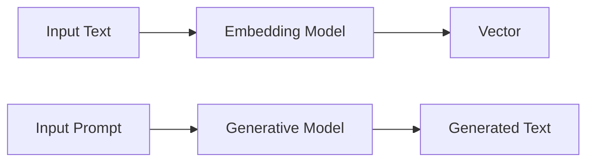
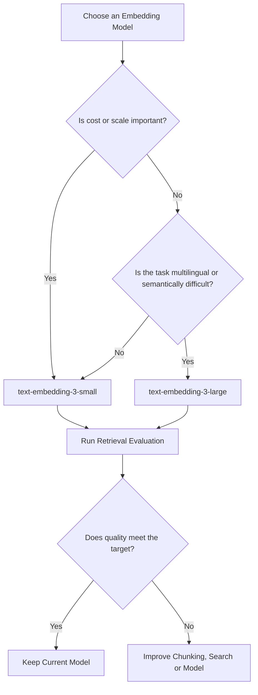
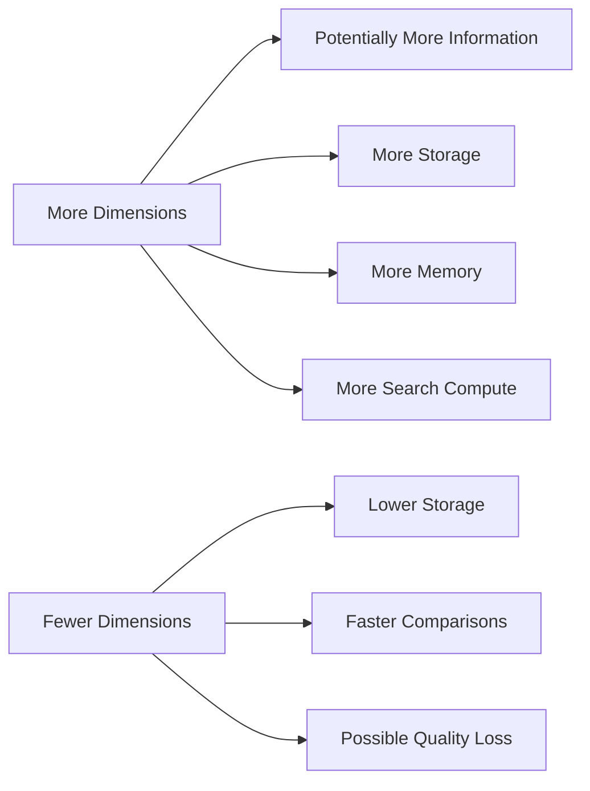
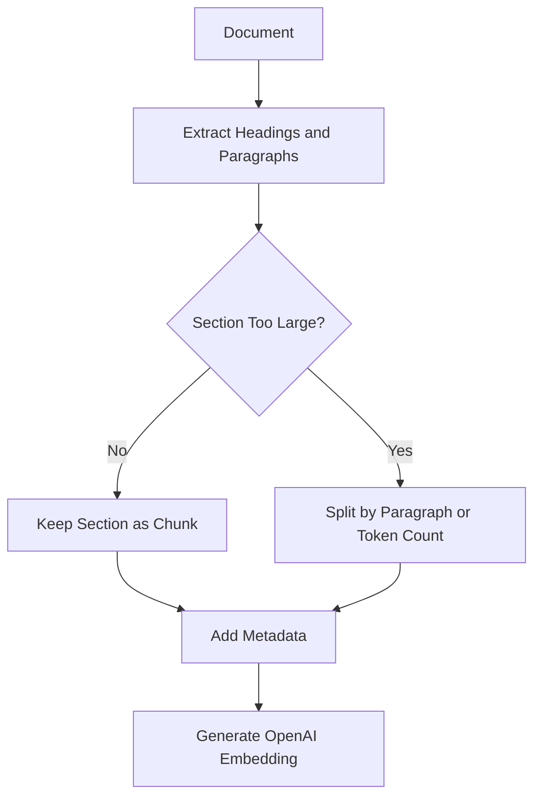
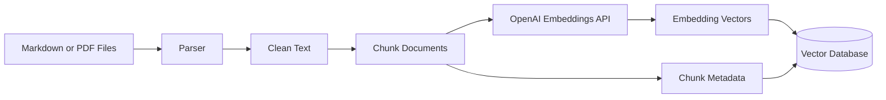
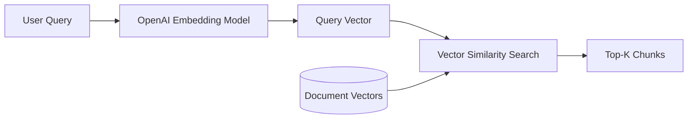
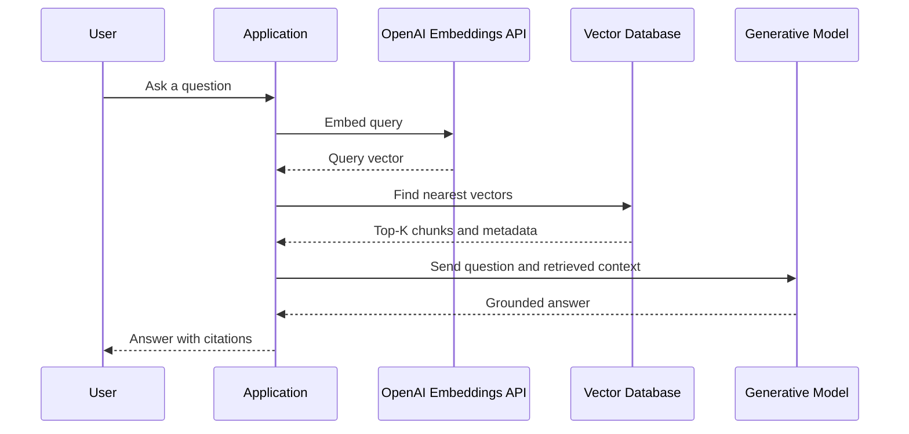
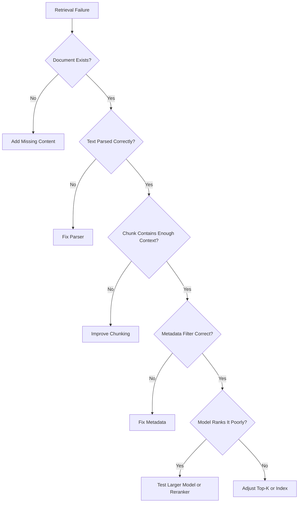
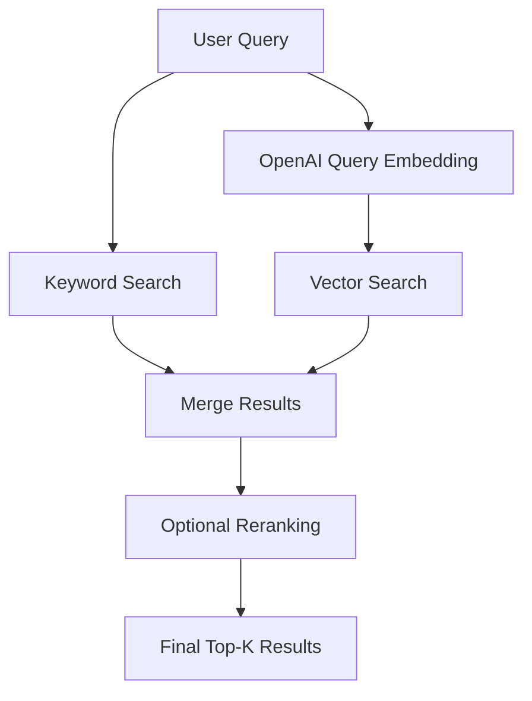
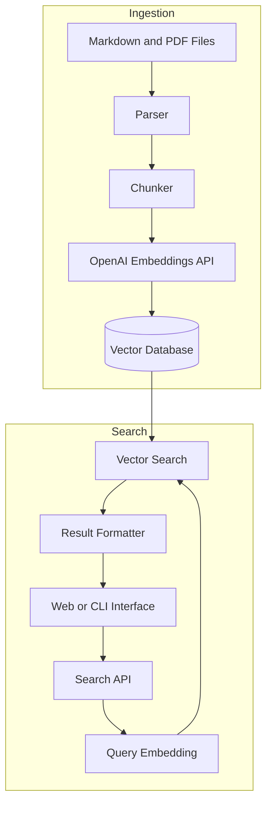

# 008 — OpenAI Embedding Models

**Course:** 03 — Knowledge Systems and RAG
**Modul Databases
**Content Group:** Embedding Models
**Roadmap Source:** Embeddings and Vector Databases / Embedding Models
**Lesson Type:** Embeddings and Vector Databases
**Lesson Order:** 008
**Suggested Duration:** 24 minutes
**Documentation verified:** July 2026

---

## 1. Overview

**OpenAI embedding models** convert text into numerical vectors that capture semantic relationships.

Applications can compare these vectors to determine whether two pieces of text are related, even when they do not share the same keywords.

For example:

```text
Query:
"How can I recover my account?"

Document:
"Instructions for resetting forgotten login credentials"
```

These texts use different words, but an embedding model can place their vectors close together because they express a similar intent.

OpenAI embeddings are commonly used for:

* semantic search,
* Retrieval-Augmented Generation, or RAG,
* clustering,
* recommendation,
* classification,
* anomaly detection,
* code search,
* duplicate detection.

OpenAI currently documents two third-generation embedding models:

* `text-embedding-3-small`
* `text-embedding-3-large`

The small model emphasizes cost efficiency, while the large model prioritizes retrieval quality, including multilingual performance. 2. Learning Objectives

By the end of this lesson, you should be able to:

* Explain what an OpenAI embedding model does.
* Compare `text-embedding-3-small` and `text-embedding-3-large`.
* Call the OpenAI Embeddings API using Python or JavaScript.
* Understand embedding dimensions and the `dimensions` parameter.
* Store OpenAI embeddings in a vector database.
* Implement cosine-similarity search.
* Use OpenAI embeddings in a RAG pipeline.
* Estimate embedding cost.
* Evaluate retrieval quality with test queries.
* Identify common embedding and vector-search failure cases.
* Design a small portfolio project using OpenAI embeddings.

---

## 3. What Is an Embedding?

An embedding is a list of floating-point numbers representing the meaning of an input.

```text
Input text
    ↓
Embedding model
    ↓
[0.021, -0.184, 0.492, ..., -0.037]
```

The individual numbers are not intended to be interpreted manually. Their value appears when one vector is compared with another.

```text
Text A: "Reset my password"
Text B: "Recover login credentials"
Text C: "Change my billing address"
```

A useful embedding model should produce:

```text
distance(A, B) < distance(A, C)
```

This means that Text A is semantically closer to Text B than to Text C.

OpenAI describes an embedding as a vector of floating-point numbers in which vector distance represents text relatedness. Smaller distances indicate stronger relatedness. 4. Embedding Models Are Not Generative Models

An embedding model does not generate a natural-language answer.

It transforms text into a vector.



### Embedding model

```text
Input:
"How do I reset my password?"

Output:
[0.014, -0.281, 0.663, ...]
```

### Generative model

```text
Input:
"How do I reset my password?"

Output:
"Open the login page and select Forgot Password..."
```

Embeddings help an application **find relevant information**. A generative model can then use that information to produce an answer.

---

## 5. Current OpenAI Embedding Models

### 5.1 Model Comparison

| Model                    | Primary Goal                     | Default Dimensions | Maximum Input |         Current API Price |
| ------------------------ | -------------------------------- | -----------------: | ------------: | ------------------------: |
| `text-embedding-3-small` | Cost-efficient general retrieval |              1,536 |  8,192 tokens | $0.02 per 1M input tokens |
| `text-embedding-3-large` | Highest embedding quality        |              3,072 |  8,192 tokens | $0.13 per 1M input tokens |
| `text-embedding-ada-002` | Legacy compatibility             |              1,536 |  8,192 tokens |              Legacy model |

The official documentation identifies `text-embedding-3-large` as the most capable embedding model for English and non-English tasks. It lists the default vector sizes as 1,536 for the small model and 3,072 for the large model. The API documentation currently gives an 8,192-token maximum input for embedding models. model pages list prices of $0.02 per one million input tokens for `text-embedding-3-small` and $0.13 per one million input tokens for `text-embedding-3-large`. Prices may change, so production cost calculations should be checked against the current pricing page. 6. `text-embedding-3-small`

`text-embedding-3-small` is the normal starting point for most applications.

### Strengths

* Low embedding cost
* Smaller vectors
* Lower vector-storage requirements
* Faster vector comparisons
* Suitable for large document collections
* Good general semantic-search performance

### Suitable Use Cases

* internal documentation search,
* support knowledge bases,
* small and medium RAG applications,
* article recommendations,
* intent classification,
* duplicate-content detection,
* portfolio demonstrations.

### Default Vector Size

```text
1,536 dimensions
```

A single embedding contains 1,536 floating-point values unless a smaller dimension is requested.

### Example

```python
from openai import OpenAI

client = OpenAI()

response = client.embeddings.create(
    model="text-embedding-3-small",
    input="Semantic search retrieves documents by meaning.",
)

embedding = response.data[0].embedding

print(len(embedding))
# 1536
```

The official Embeddings guide uses the same `client.embeddings.create` API and documents 1,536 as the default output length for this model. 7. `text-embedding-3-large`

`text-embedding-3-large` prioritizes embedding quality over cost and storage efficiency.

### Strengths

* OpenAI's most capable text embedding model
* Better multilingual retrieval
* Better support for subtle semantic distinctions
* Useful for difficult domains
* Higher potential retrieval recall

### Suitable Use Cases

* multilingual enterprise search,
* high-value legal or technical retrieval,
* cross-language document search,
* complex recommendation systems,
* domain-specific search with subtle terminology,
* applications where retrieval quality matters more than embedding cost.

### Default Vector Size

```text
3,072 dimensions
```

Example:

```python
from openai import OpenAI

client = OpenAI()

response = client.embeddings.create(
    model="text-embedding-3-large",
    input="Semantic search retrieves documents by meaning.",
)

embedding = response.data[0].embedding

print(len(embedding))
# 3072
```

OpenAI describes `text-embedding-3-large` as its most capable embedding model for English and non-English tasks. The default output has 3,072 dimensions. 8. Choosing a Model

A practical default is:

```text
Start with text-embedding-3-small.
Move to text-embedding-3-large only when evaluation shows
that the larger model provides a meaningful quality improvement.
```

### Decision Guide



### Use `text-embedding-3-small` when:

* the dataset contains many chunks,
* embedding cost matters,
* storage is limited,
* latency matters,
* retrieval queries are relatively straightforward,
* you are building an initial version.

### Consider `text-embedding-3-large` when:

* multilingual retrieval is important,
* users paraphrase concepts heavily,
* documents use specialized terminology,
* small ranking improvements have significant business value,
* the smaller model fails a meaningful portion of evaluation queries.

Model selection must be based on retrieval evaluation rather than model reputation alone.

---

## 9. Embedding Dimensions

The number of values in an embedding is its **dimension**.

```text
Three-dimensional example:
[0.12, -0.45, 0.71]

OpenAI embedding:
[0.12, -0.45, 0.71, ..., 0.08]
```

The default dimensions are:

```text
text-embedding-3-small → 1,536
text-embedding-3-large → 3,072
```

Higher-dimensional vectors can represent more information, but they also require:

* more database storage,
* more memory,
* more network bandwidth,
* more computation during vector search.

---

## 10. Reducing Dimensions

Third-generation OpenAI embedding models support the `dimensions` API parameter.

```python
from openai import OpenAI

client = OpenAI()

response = client.embeddings.create(
    model="text-embedding-3-large",
    input="A document about vector databases.",
    dimensions=1024,
)

embedding = response.data[0].embedding

print(len(embedding))
# 1024
```

The API reference states that configurable dimensions are supported by `text-embedding-3` and later models. OpenAI recommends requesting the desired dimension through the API instead of manually cutting an existing vector. nsion Trade-Off



### Example Configurations

| Model                    | Requested Dimensions | Possible Reason                      |
| ------------------------ | -------------------: | ------------------------------------ |
| `text-embedding-3-small` |                1,536 | Use full default representation      |
| `text-embedding-3-small` |                  512 | Reduce storage for a large index     |
| `text-embedding-3-large` |                3,072 | Maximize model representation        |
| `text-embedding-3-large` |                1,024 | Fit a database dimension limit       |
| `text-embedding-3-large` |                  256 | Extremely compact experimental index |

OpenAI reports that the third-generation models were trained to support shortened embeddings through the `dimensions` parameter. The documentation also gives an example of reducing `text-embedding-3-large` to 1,024 dimensions when a vector store cannot support the default 3,072 dimensions. rtant Rule

All vectors inside one vector index must have the same dimension.

```text
Invalid index:

Document A → 1536 dimensions
Document B → 1024 dimensions
Query      → 3072 dimensions
```

Correct configuration:

```text
All document vectors → 1024 dimensions
All query vectors    → 1024 dimensions
```

Changing the model or dimension normally requires re-embedding and re-indexing the existing documents.

---

## 11. Basic Embeddings API Call

### Environment Variable

Store the API key on the server:

```bash
export OPENAI_API_KEY="your-api-key"
```

Do not hard-code production API keys in source files or expose them in frontend applications.

### Install the Python SDK

```bash
pip install openai
```

### Python Example

```python
from openai import OpenAI

client = OpenAI()

response = client.embeddings.create(
    model="text-embedding-3-small",
    input="OpenAI embeddings represent text as numerical vectors.",
    encoding_format="float",
)

embedding = response.data[0].embedding

print(f"Dimensions: {len(embedding)}")
print(f"First values: {embedding[:5]}")
print(f"Input tokens: {response.usage.prompt_tokens}")
```

The API response contains the generated embedding, its input index, model information, and token usage. 12. JavaScript Example

Install the SDK:

```bash
npm install openai
```

Create an embedding:

```javascript
import OpenAI from "openai";

const openai = new OpenAI();

const response = await openai.embeddings.create({
  model: "text-embedding-3-small",
  input: "OpenAI embeddings represent text as numerical vectors.",
  encoding_format: "float",
});

const embedding = response.data[0].embedding;

console.log(`Dimensions: ${embedding.length}`);
console.log(embedding.slice(0, 5));
```

The official OpenAI guide documents both Python and JavaScript calls through the `/v1/embeddings` endpoint. 13. Embedding Multiple Inputs

Sending several inputs in one request is more efficient than making one request for every small chunk.

```python
from openai import OpenAI

client = OpenAI()

texts = [
    "Semantic search retrieves content by meaning.",
    "Keyword search retrieves exact matching terms.",
    "A vector database stores and searches embeddings.",
]

response = client.embeddings.create(
    model="text-embedding-3-small",
    input=texts,
)

embeddings = [
    item.embedding
    for item in sorted(response.data, key=lambda item: item.index)
]

for text, embedding in zip(texts, embeddings):
    print(text)
    print(len(embedding))
```

The API accepts a single string or an array of strings. The API reference currently states that each input must remain within the model's token limit and that an input array may contain up to 2,048 entries. uction ingestion, use smaller operational batches so that:

* requests remain below rate limits,
* failures can be retried safely,
* memory usage remains controlled,
* progress can be recorded.

---

## 14. A Reusable Python Embedding Client

```python
from __future__ import annotations

from dataclasses import dataclass
from typing import Sequence

from openai import OpenAI


@dataclass(frozen=True)
class EmbeddingBatch:
    vectors: list[list[float]]
    model: str
    input_tokens: int


class OpenAIEmbeddingClient:
    def __init__(
        self,
        model: str = "text-embedding-3-small",
        dimensions: int | None = None,
    ) -> None:
        self._client = OpenAI()
        self._model = model
        self._dimensions = dimensions

    def embed(self, texts: Sequence[str]) -> EmbeddingBatch:
        cleaned_texts = [text.strip() for text in texts]

        if not cleaned_texts:
            raise ValueError("At least one input is required.")

        if any(not text for text in cleaned_texts):
            raise ValueError("Embedding inputs must not be empty.")

        request: dict[str, object] = {
            "model": self._model,
            "input": cleaned_texts,
            "encoding_format": "float",
        }

        if self._dimensions is not None:
            request["dimensions"] = self._dimensions

        response = self._client.embeddings.create(**request)

        ordered_items = sorted(
            response.data,
            key=lambda item: item.index,
        )

        return EmbeddingBatch(
            vectors=[item.embedding for item in ordered_items],
            model=response.model,
            input_tokens=response.usage.prompt_tokens,
        )
```

Example usage:

```python
embedder = OpenAIEmbeddingClient(
    model="text-embedding-3-small",
    dimensions=512,
)

batch = embedder.embed(
    [
        "Vector databases store embeddings.",
        "Semantic search compares query and document vectors.",
    ]
)

print(batch.model)
print(batch.input_tokens)
print(len(batch.vectors[0]))
```

---

## 15. Input Token Limits

Embedding models process tokens rather than characters or words.

The current API reference gives an 8,192-token maximum input for OpenAI embedding models. Empty strings are not accepted. ocument must therefore be split into chunks before embedding.

```text
Large PDF
    ↓
Extract text
    ↓
Split into sections
    ↓
Split sections into chunks
    ↓
Embed each chunk
```

### Counting Tokens

OpenAI recommends `tiktoken` for counting tokens. The Embeddings guide specifies the `cl100k_base` encoding for third-generation embedding models. pip install tiktoken

````

```python
import tiktoken

encoding = tiktoken.get_encoding("cl100k_base")


def count_tokens(text: str) -> int:
    return len(encoding.encode(text))


sample = "Semantic search retrieves information by meaning."

print(count_tokens(sample))
````

Do not build chunks close to the absolute model limit. Smaller chunks are normally better for precise retrieval and leave room for document titles, headings, or other context.

---

## 16. Document Chunking

An embedding model can only represent the content it receives. Poor chunking produces poor retrieval even when the model is strong.

### Chunk Too Small

```text
"Click the button."
```

Problems:

* unclear subject,
* missing context,
* weak semantic representation.

### Chunk Too Large

```text
A complete 30-page product manual embedded as one vector
```

Problems:

* too many topics in one representation,
* relevant details become diluted,
* citations become imprecise.

### Better Chunk

```text
To reset your password, select "Forgot Password" on the
login page. Enter your registered email address and follow
the recovery link sent to your inbox.
```

This chunk contains:

* one clear topic,
* a complete instruction,
* enough context,
* a useful citation boundary.

### Structure-Aware Chunking



Useful metadata includes:

```json
{
  "document_id": "account-guide",
  "chunk_id": "account-guide-password-02",
  "source": "account-guide.pdf",
  "page": 4,
  "section": "Password Recovery",
  "language": "en",
  "version": "2026-07"
}
```

---

## 17. The Complete Indexing Workflow



### Conceptual Python Example

```python
def index_documents(
    documents: list[dict],
    chunker,
    embedder: OpenAIEmbeddingClient,
    vector_store,
) -> None:
    records: list[dict] = []

    for document in documents:
        chunks = chunker.split(document["text"])

        embedding_batch = embedder.embed(
            [chunk["text"] for chunk in chunks]
        )

        for chunk, vector in zip(
            chunks,
            embedding_batch.vectors,
        ):
            records.append(
                {
                    "id": chunk["id"],
                    "vector": vector,
                    "text": chunk["text"],
                    "metadata": {
                        "source": document["source"],
                        "page": chunk.get("page"),
                        "section": chunk.get("section"),
                        "language": document.get("language", "en"),
                    },
                }
            )

    vector_store.upsert(records)
```

The embedding API generates vectors, but your application remains responsible for:

* parsing files,
* chunking text,
* storing vectors,
* storing metadata,
* updating documents,
* deleting outdated vectors,
* running vector search.

---

## 18. Query Workflow

At search time, embed the query using the same model and dimensions used for the documents.



```python
def search_documents(
    query: str,
    embedder: OpenAIEmbeddingClient,
    vector_store,
    top_k: int = 5,
) -> list[dict]:
    query_batch = embedder.embed([query])
    query_vector = query_batch.vectors[0]

    return vector_store.search(
        vector=query_vector,
        top_k=top_k,
        filters={
            "status": "active",
        },
    )
```

### Critical Consistency Rule

Use the same configuration during indexing and querying:

```text
Indexing:
model = text-embedding-3-small
dimensions = 512

Querying:
model = text-embedding-3-small
dimensions = 512
```

Do not mix incompatible embedding spaces.

---

## 19. Cosine Similarity

Cosine similarity is a common way to compare embedding vectors.

[
\text{cosine similarity}(A,B)
=============================

\frac{A \cdot B}
{|A||B|}
]

A larger value represents stronger similarity.

OpenAI recommends cosine similarity for its embedding vectors. OpenAI embeddings are normalized to length one, so dot product can be used as a faster equivalent, and cosine similarity and Euclidean distance produce identical rankings. y Implementation

```python
import numpy as np
from numpy.typing import NDArray


def cosine_similarity(
    vector_a: list[float],
    vector_b: list[float],
) -> float:
    a: NDArray[np.float64] = np.asarray(
        vector_a,
        dtype=np.float64,
    )
    b: NDArray[np.float64] = np.asarray(
        vector_b,
        dtype=np.float64,
    )

    denominator = np.linalg.norm(a) * np.linalg.norm(b)

    if denominator == 0:
        raise ValueError("Cannot compare a zero-length vector.")

    return float(np.dot(a, b) / denominator)
```

Because OpenAI vectors are normalized, a dot-product function is sufficient in standard cases:

```python
def dot_similarity(
    vector_a: list[float],
    vector_b: list[float],
) -> float:
    return float(np.dot(vector_a, vector_b))
```

---

## 20. Small In-Memory Semantic Search Demo

```python
from __future__ import annotations

from dataclasses import dataclass

import numpy as np


@dataclass(frozen=True)
class Document:
    document_id: str
    text: str
    source: str


@dataclass(frozen=True)
class SearchResult:
    document: Document
    score: float


def semantic_search(
    query: str,
    documents: list[Document],
    embedder: OpenAIEmbeddingClient,
    top_k: int = 3,
) -> list[SearchResult]:
    if not query.strip():
        raise ValueError("Query must not be empty.")

    if top_k <= 0:
        raise ValueError("top_k must be greater than zero.")

    if not documents:
        return []

    batch = embedder.embed(
        [query, *[document.text for document in documents]]
    )

    query_vector = np.asarray(batch.vectors[0])
    document_vectors = np.asarray(batch.vectors[1:])

    # OpenAI embeddings are normalized, so dot product can rank them.
    scores = document_vectors @ query_vector

    ranked_indices = np.argsort(scores)[::-1][:top_k]

    return [
        SearchResult(
            document=documents[index],
            score=float(scores[index]),
        )
        for index in ranked_indices
    ]
```

Usage:

```python
documents = [
    Document(
        document_id="doc-1",
        text="Reset your password using the recovery email.",
        source="account-help.md",
    ),
    Document(
        document_id="doc-2",
        text="Update the payment method for your subscription.",
        source="billing-help.md",
    ),
    Document(
        document_id="doc-3",
        text="Recover access when you cannot sign in.",
        source="login-help.md",
    ),
]

embedder = OpenAIEmbeddingClient(
    model="text-embedding-3-small",
)

results = semantic_search(
    query="I forgot my account password.",
    documents=documents,
    embedder=embedder,
    top_k=2,
)

for result in results:
    print(
        f"{result.score:.4f} | "
        f"{result.document.source} | "
        f"{result.document.text}"
    )
```

For a large collection, OpenAI recommends using a vector database rather than comparing the query against every vector in application memory. 21. Vector Database Integration

OpenAI produces the vector. A vector database stores and retrieves it.

Common choices include:

* Chroma,
* Qdrant,
* FAISS,
* Pinecone,
* Weaviate,
* PostgreSQL with `pgvector`.

### Stored Record

```json
{
  "id": "guide-004-password-reset",
  "vector": [0.018, -0.261, 0.473],
  "payload": {
    "text": "To reset your password...",
    "source": "account-guide.pdf",
    "page": 4,
    "section": "Password Recovery"
  }
}
```

### Important Vector-Store Configuration

```text
Model: text-embedding-3-small
Dimensions: 1536
Distance metric: cosine
```

Or:

```text
Model: text-embedding-3-large
Dimensions: 1024
Distance metric: cosine
```

The configured database dimension must exactly match the vectors produced by the API.

---

## 22. OpenAI Embeddings in a RAG Pipeline

Embeddings are normally used in the retrieval stage of RAG.



### Example

```text
User query
    ↓
"How long does a password recovery link remain valid?"

Query embedding
    ↓
Vector search
    ↓
Retrieved chunk:
"The password recovery link expires after 30 minutes."

LLM context
    ↓
Generated answer:
"The recovery link is valid for 30 minutes
(account-guide.pdf, page 5)."
```

Embeddings do not generate the answer. They help retrieve the evidence used to construct it.

---

## 23. Semantic Search API Route

Example request:

```http
POST /api/search
Content-Type: application/json
```

```json
{
  "query": "How does password recovery work?",
  "top_k": 5,
  "filters": {
    "language": "en",
    "status": "active"
  }
}
```

Example response:

```json
{
  "query": "How does password recovery work?",
  "results": [
    {
      "chunk_id": "account-guide-password-02",
      "text": "Select Forgot Password on the login page...",
      "score": 0.891,
      "source": "account-guide.pdf",
      "page": 4
    }
  ]
}
```

The response should contain enough metadata for:

* citations,
* debugging,
* result inspection,
* access-control verification.

---

## 24. Metadata Filtering

Semantic similarity does not guarantee that a result is appropriate for a particular user.

For example, a database may contain:

* English and Vietnamese documents,
* public and private files,
* active and archived policies,
* data from multiple organizations.

Filters may be required:

```json
{
  "tenant_id": "tenant-123",
  "language": "en",
  "status": "active",
  "access_level": "employee"
}
```

Retrieval should behave like:

```text
semantic similarity
AND tenant_id = tenant-123
AND language = en
AND status = active
AND user has access
```

Do not use semantic similarity as an authorization mechanism.

---

## 25. Model Cost

Embedding cost is based on the number of input tokens. Formula

[
\text{Embedding cost}
=====================

\frac{\text{Input tokens}}{1{,}000{,}000}
\times
\text{Price per million tokens}
]

### Example: 10 Million Tokens

Using `text-embedding-3-small`:

[
10 \times $0.02 = $0.20
]

Using `text-embedding-3-large`:

[
10 \times $0.13 = $1.30
]

These figures cover embedding API input cost only. A complete system may also have costs for:

* PDF parsing,
* vector storage,
* database operations,
* reranking,
* LLM answer generation,
* monitoring infrastructure.

### Cost Optimization

* Embed documents only when they change.
* Cache embeddings by content hash.
* Batch multiple inputs.
* Avoid excessive chunk overlap.
* Remove duplicate content.
* Consider reduced dimensions.
* Use the small model unless evaluations justify the large model.

---

## 26. Caching and Incremental Indexing

Embedding the same unchanged content repeatedly wastes time and money.

Create a content hash:

```python
import hashlib


def content_hash(text: str) -> str:
    normalized = " ".join(text.split())
    return hashlib.sha256(
        normalized.encode("utf-8")
    ).hexdigest()
```

Store it with the chunk:

```json
{
  "chunk_id": "guide-004",
  "content_hash": "749ab2...",
  "embedding_model": "text-embedding-3-small",
  "embedding_dimensions": 1536
}
```

Before embedding:

```text
Has the content hash changed?
    ├── No  → reuse existing embedding
    └── Yes → generate and store a new embedding
```

The cache key should include:

```text
content hash
+ model ID
+ dimension setting
+ preprocessing version
```

The same text embedded with a different model or dimension must be treated as a different artifact.

---

## 27. Evaluating Retrieval Quality

Do not select an OpenAI embedding model based only on a few successful demonstrations.

Create a retrieval evaluation dataset.

```json
[
  {
    "query": "How do I recover my password?",
    "relevant_chunk_ids": [
      "account-guide-password-02"
    ]
  },
  {
    "query": "The login recovery email did not arrive.",
    "relevant_chunk_ids": [
      "account-guide-email-01",
      "email-troubleshooting-03"
    ]
  }
]
```

### Recall@K

Recall@K measures whether relevant content appears in the first `K` results.

[
\text{Recall@K}
===============

\frac{
\text{Queries with a relevant result in top K}
}{
\text{Total queries}
}
]

Example:

```text
Relevant result found in top 5 for 18 of 20 queries.

Recall@5 = 18 / 20 = 0.90
```

### Precision@K

Precision@K measures how many of the retrieved results are relevant.

[
\text{Precision@K}
==================

\frac{
\text{Relevant results in top K}
}{
K
}
]

### Mean Reciprocal Rank

For one query:

[
RR = \frac{1}{\text{rank of first relevant result}}
]

Examples:

```text
Relevant result at rank 1 → 1.00
Relevant result at rank 2 → 0.50
Relevant result at rank 5 → 0.20
```

### Evaluation Table

| Query                    | Expected Chunk | Small Rank | Large Rank | Notes                 |
| ------------------------ | -------------- | ---------: | ---------: | --------------------- |
| Recover password         | password-02    |          1 |          1 | Both succeed          |
| Change account email     | profile-04     |          4 |          2 | Large ranks better    |
| Authentication error A17 | auth-error-17  |  Not found |          8 | Add keyword search    |
| Vietnamese paraphrase    | vi-login-03    |          6 |          2 | Large performs better |

Only upgrade to a more expensive model when the improvement matters to the application.

---

## 28. Debugging Retrieval Failures

When a relevant result is missing, investigate the complete pipeline.



### Failure Categories

| Failure                                | Likely Cause                          |
| -------------------------------------- | ------------------------------------- |
| Correct document never indexed         | Ingestion failure                     |
| Relevant sentence split across chunks  | Poor chunk boundaries                 |
| Wrong-language result returned         | Missing language filter               |
| Old policy ranks above current policy  | Missing version metadata              |
| Exact error code is missed             | Semantic search needs keyword support |
| Many duplicate results                 | Excessive overlap or duplicate files  |
| Query and documents cannot compare     | Different models or dimensions        |
| Search quality changes after migration | Index was not rebuilt consistently    |

---

## 29. Hybrid Search

Semantic search may be weak for exact identifiers such as:

* error codes,
* product SKUs,
* usernames,
* document numbers,
* version strings,
* rare names.

Hybrid search combines embedding search with keyword search.



Example query:

```text
"How do I fix AUTH-4017?"
```

Keyword search can find the exact identifier `AUTH-4017`, while embedding search can find conceptually related authentication instructions.

---

## 30. Reranking

Vector retrieval is designed to find candidates quickly. It may not produce the best final ranking.

A reranking pipeline can retrieve more candidates and then score them more carefully.

```text
Query
  ↓
Embedding search: top 30
  ↓
Reranker
  ↓
Final top 5
  ↓
LLM context
```

This is useful when:

* chunks are semantically similar,
* documents contain subtle distinctions,
* high precision is required,
* several results discuss the same broad topic.

Before changing embedding models, test whether reranking produces a larger improvement.

---

## 31. Privacy and Security Considerations

OpenAI embedding models accept text input, so sensitive information must be handled carefully.

Production safeguards may include:

* removing unnecessary personal data,
* limiting which documents can be embedded,
* encrypting stored vectors and metadata,
* separating tenant indexes,
* enforcing access filters during retrieval,
* auditing document ingestion,
* supporting document and vector deletion,
* keeping API keys on the server.

OpenAI states that customers own their model inputs and outputs, including embeddings, while remaining responsible for ensuring that submitted content complies with applicable law and OpenAI terms. ding should not automatically be considered anonymous. It must be protected as part of the document retrieval system.

---

## 32. Important Limitations

### 32.1 Embeddings Do Not Verify Truth

A vector measures semantic relatedness, not factual correctness.

A highly relevant document may still be:

* outdated,
* incorrect,
* untrusted,
* unauthorized.

### 32.2 Similarity Scores Are Not Universal Probabilities

A similarity score of `0.82` does not automatically mean:

```text
82% relevant
```

Scores depend on:

* the model,
* data distribution,
* chunking,
* query style,
* similarity function.

Thresholds must be calibrated against evaluation data.

### 32.3 Embeddings Do Not Replace Metadata

The embedding may represent what a chunk says, but metadata identifies:

* where it came from,
* when it was created,
* which user can access it,
* whether it is current.

### 32.4 Embedding Models Are Text-Only

The current `text-embedding-3-small` and `text-embedding-3-large` model pages list text support and do not support image, audio, or video input. Knowledge Has a Cutoff

OpenAI's current Embeddings guide states that the third-generation embedding models lack knowledge of events after September 2021. This usually matters less than it does for generative models because embeddings represent supplied text, but it can affect edge cases involving new terminology or entities. 33. Common Mistakes

### Mistake 1: Using Different Models for Documents and Queries

```text
Documents: text-embedding-3-small
Queries:   text-embedding-3-large
```

These vectors should not be assumed to share the same embedding space.

**Fix:** use the same model and dimension configuration.

---

### Mistake 2: Changing Dimensions Without Rebuilding the Index

```text
Old index: 1536 dimensions
New query: 512 dimensions
```

**Fix:** re-embed documents and create a matching vector index.

---

### Mistake 3: Sending Entire Documents as One Input

A full document may contain many unrelated topics.

**Fix:** create semantically complete chunks.

---

### Mistake 4: Storing Vectors Without Metadata

A correct result cannot be cited or debugged.

**Fix:** store source, page, section, version, and chunk identifiers.

---

### Mistake 5: Choosing the Large Model Without Evaluation

A larger model increases cost and storage but may not improve the application's actual queries.

**Fix:** compare models on the same retrieval test set.

---

### Mistake 6: Evaluating Only the Final LLM Answer

A wrong answer may originate from retrieval or generation.

**Fix:** evaluate retrieved chunks separately from generated answers.

---

### Mistake 7: Treating Similarity as Authorization

A vector database may retrieve semantically relevant private content.

**Fix:** apply permission and tenant filters during retrieval.

---

### Mistake 8: Re-Embedding Unchanged Documents

This increases cost and indexing time.

**Fix:** use content hashes and incremental indexing.

---

### Mistake 9: Using Only Semantic Search for Exact Codes

Embedding retrieval may fail on rare identifiers.

**Fix:** implement keyword or hybrid search.

---

### Mistake 10: Selecting a Similarity Threshold by Guessing

A fixed threshold copied from another project may reject useful results or accept irrelevant ones.

**Fix:** calibrate the threshold using labeled evaluation queries.

---

## 34. Practical Exercise

### Goal

Build a semantic search engine for 5–10 Markdown or PDF files using OpenAI embeddings.

### Step 1: Select Documents

Possible document groups:

* AI engineering lessons,
* product support pages,
* university regulations,
* API documentation,
* personal Markdown notes.

### Step 2: Create Test Questions

Write at least 10 questions.

Include:

* exact keyword queries,
* paraphrased queries,
* synonym-based queries,
* multilingual queries,
* queries containing exact identifiers,
* unsupported questions.

Example:

```json
[
  {
    "query": "How do I recover my login credentials?",
    "expected_chunk": "account-password-reset"
  },
  {
    "query": "Where can I change my account email?",
    "expected_chunk": "account-email-update"
  },
  {
    "query": "How do I solve error AUTH-4017?",
    "expected_chunk": "auth-error-4017"
  }
]
```

### Step 3: Parse and Chunk

Record:

```text
Chunking strategy:
- Split by Markdown heading
- Maximum 500 tokens
- Overlap 60 tokens
```

### Step 4: Generate Embeddings

Start with:

```text
model = text-embedding-3-small
dimensions = 1536
```

### Step 5: Store Vectors

Use:

* Chroma,
* Qdrant,
* FAISS,
* or another vector database.

Store metadata with every vector.

### Step 6: Implement Query Search

For each question:

1. Generate a query embedding.
2. Search for the nearest vectors.
3. Return the top five chunks.
4. Display scores and citations.

### Step 7: Evaluate

| Query           | Expected Source | Retrieved Rank | Success |
| --------------- | --------------- | -------------: | ------- |
| Recover login   | account.md      |              1 | Yes     |
| Update email    | profile.md      |              3 | Yes     |
| Error AUTH-4017 | errors.md       |      Not found | No      |

### Step 8: Run Experiments

Compare:

```text
Experiment A:
text-embedding-3-small, 1536 dimensions

Experiment B:
text-embedding-3-small, 512 dimensions

Experiment C:
text-embedding-3-large, 1024 dimensions
```

Record:

* Recall@5,
* average first relevant rank,
* embedding cost,
* vector-storage size,
* query latency.

### Step 9: Analyze Failures

For each failed query, identify whether the cause was:

* missing source content,
* parsing,
* chunking,
* metadata,
* embedding model,
* dimension reduction,
* top-k,
* exact-match requirements.

---

## 35. Related Portfolio Project

### Project 7: Semantic Search Engine for Markdown and PDF Files

Build an application that indexes local documents using OpenAI embeddings and supports natural-language search.

### Minimum Features

* Markdown and PDF parsing
* Document chunking
* OpenAI embedding generation
* Vector storage
* Query embedding
* Top-k search
* Similarity scores
* Source citations
* Evaluation queries

### Suggested Architecture



### Recommended Repository Structure

```text
semantic-search-engine/
├── app/
│   ├── api/
│   │   └── search.py
│   ├── ingestion/
│   │   ├── loaders.py
│   │   ├── chunker.py
│   │   └── indexer.py
│   ├── embeddings/
│   │   └── openai_client.py
│   ├── retrieval/
│   │   ├── vector_store.py
│   │   └── search.py
│   └── evaluation/
│       ├── dataset.json
│       └── evaluate.py
├── documents/
├── tests/
├── .env.example
├── requirements.txt
└── README.md
```

### Advanced Features

* configurable embedding models,
* configurable dimensions,
* hybrid search,
* reranking,
* multilingual retrieval,
* document re-indexing,
* content-hash caching,
* evaluation dashboard,
* RAG answer generation,
* access-control filters.

---

## 36. Production Checklist

### Model Configuration

* [ ] The embedding model is explicitly configured.
* [ ] Document and query embeddings use the same model.
* [ ] Document and query embeddings use the same dimensions.
* [ ] Model changes trigger controlled re-indexing.
* [ ] The large model is used only when evaluation justifies it.

### Input Processing

* [ ] Empty text is rejected.
* [ ] Token limits are checked.
* [ ] Documents are split into meaningful chunks.
* [ ] Chunk overlap is controlled.
* [ ] Parsing failures are recorded.

### Embedding API

* [ ] API keys remain server-side.
* [ ] Requests use batching.
* [ ] Retry logic handles temporary failures.
* [ ] Token usage is recorded.
* [ ] Rate-limit errors are handled.
* [ ] Timeouts are configured.

### Vector Storage

* [ ] Index dimensions match the API output.
* [ ] The distance metric is configured correctly.
* [ ] Every vector has a stable chunk ID.
* [ ] Metadata is stored with each vector.
* [ ] Old vectors can be deleted.
* [ ] Updated documents can be re-indexed.

### Retrieval

* [ ] Top-k is tuned against test queries.
* [ ] Similarity thresholds are evaluated.
* [ ] Metadata filters are applied.
* [ ] Tenant and user permissions are enforced.
* [ ] Duplicate results are controlled.
* [ ] Exact identifiers use keyword or hybrid search.

### Evaluation

* [ ] A labeled query dataset exists.
* [ ] Recall@K is measured.
* [ ] Ranking quality is measured.
* [ ] Small and large models were compared.
* [ ] Dimension configurations were compared.
* [ ] Failure cases are categorized.
* [ ] Evaluation results are versioned.

### Cost and Monitoring

* [ ] Embedding token usage is monitored.
* [ ] Embeddings are cached by content hash.
* [ ] Unchanged documents are not re-embedded.
* [ ] Index size is monitored.
* [ ] Query latency is monitored.
* [ ] Empty-result rates are monitored.

### RAG Integration

* [ ] Retrieved chunks include source metadata.
* [ ] Generated answers include citations.
* [ ] Unsupported answers are handled safely.
* [ ] Retrieval and generation are evaluated separately.
* [ ] Retrieved documents are treated as untrusted input.

---

## 37. Completion Checklist

After completing this lesson, confirm that:

* [ ] I can explain OpenAI embedding models in one or two minutes.
* [ ] I understand the difference between embeddings and generated text.
* [ ] I can compare `text-embedding-3-small` and `text-embedding-3-large`.
* [ ] I can generate an embedding through the OpenAI API.
* [ ] I understand default and configurable dimensions.
* [ ] I can embed multiple inputs in one request.
* [ ] I can store vectors and source metadata.
* [ ] I can generate and search a query vector.
* [ ] I can explain cosine similarity.
* [ ] I can use OpenAI embeddings in a RAG workflow.
* [ ] I have a small semantic-search demonstration.
* [ ] I have created realistic retrieval test queries.
* [ ] I have recorded at least one retrieval failure.
* [ ] I understand the main cost, privacy, and security considerations.

---

## 38. Related Outcome

> Build semantic search systems using embedding models, vector indexes, metadata filters, and similarity search.

Achieving this outcome requires more than calling the OpenAI API.

A complete solution includes:

```text
documents
→ parsing
→ chunking
→ OpenAI embeddings
→ vector database
→ query embedding
→ similarity search
→ top-k results
→ evaluation
→ citations
```

---

## 39. Key Takeaways

1. OpenAI embedding models convert text into semantic vectors.
2. `text-embedding-3-small` is the cost-efficient default for most projects.
3. `text-embedding-3-large` prioritizes quality and multilingual retrieval.
4. The default dimensions are 1,536 and 3,072 respectively.
5. The `dimensions` parameter can reduce vector size.
6. Documents and queries must use compatible model and dimension settings.
7. OpenAI recommends cosine similarity for comparing its embeddings.
8. Chunking and metadata can matter as much as model selection.
9. Embedding quality must be tested with realistic retrieval queries.
10. Semantic search does not replace keyword search, authorization, or factual validation.
11. Embeddings should be cached and regenerated only when necessary.
12. A reliable RAG system requires retrieval evaluation before answer evaluation.

---

## 40. Final Summary

OpenAI embedding models are a foundational building block for semantic search, recommendation, classification, clustering, and RAG applications.

The basic workflow is:

```text
text
→ chunk
→ OpenAI embedding
→ vector database
→ query embedding
→ similarity search
→ top-k results
→ optional reranking
→ cited answer
```

For an initial implementation:

```text
Model:
text-embedding-3-small

Similarity:
cosine similarity

Metadata:
source, page, section, language, version

Evaluation:
Recall@5 and failure-case analysis
```

Move to `text-embedding-3-large`, reduced dimensions, hybrid search, or reranking only when evaluation demonstrates a meaningful need.

The best next step is to build a small Markdown or PDF semantic-search engine, create a fixed set of realistic questions, and compare retrieval quality across several model and dimension configurations.
