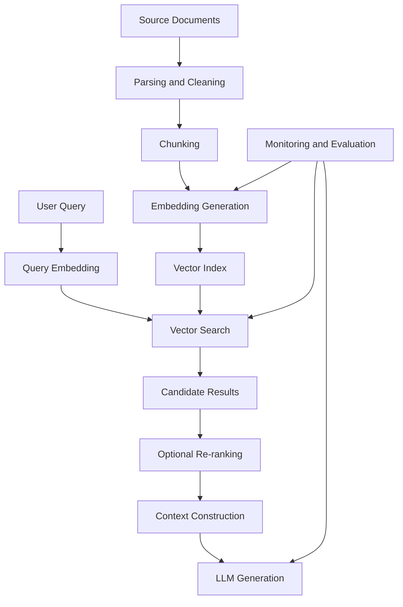
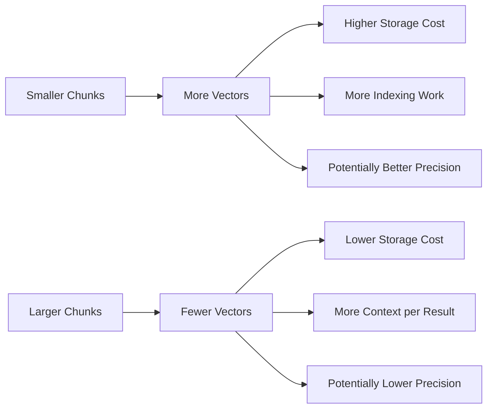
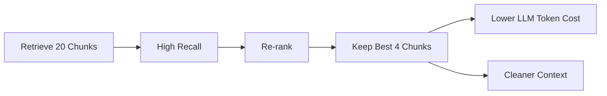
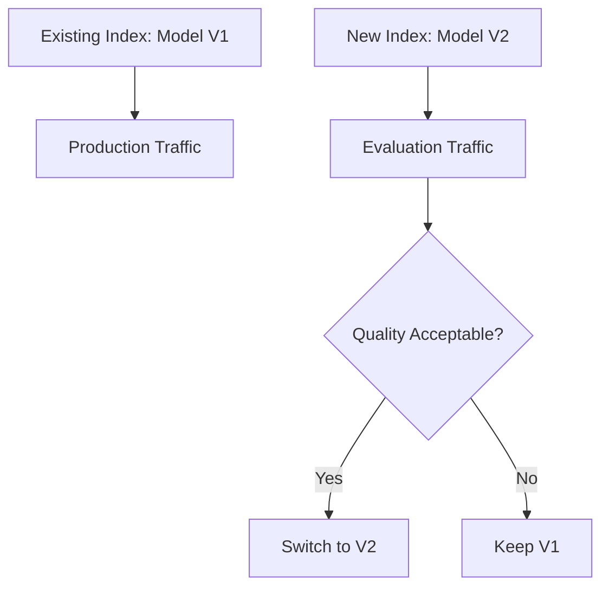
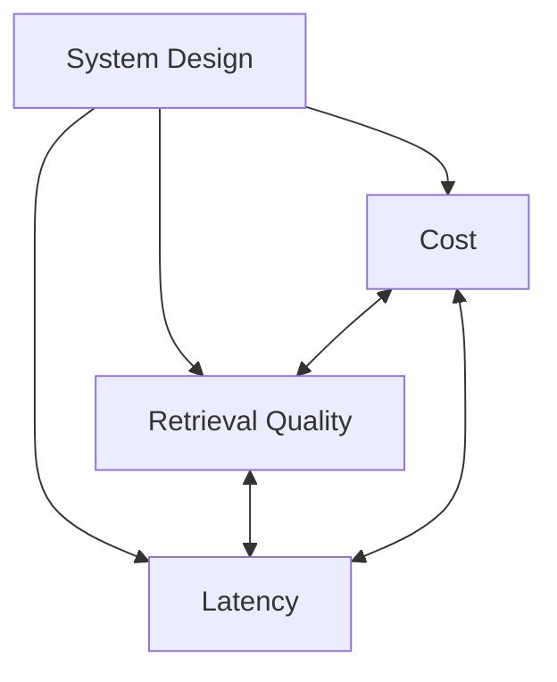
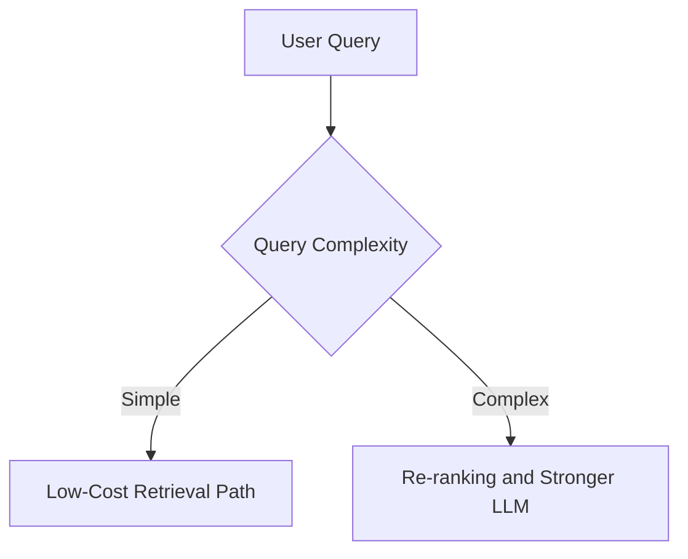
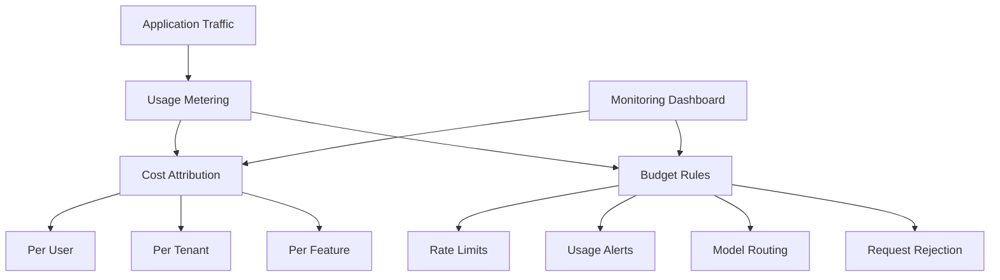

# 009 — Pricing Considerations

**Course:** 03 — Knowledge Systems and RAG
**Module:** Module 08 — Embeddings and Vector Databases
**Content Group:** Embedding Models
**Roadmap Source:** Embeddings and Vector Databases / Embedding Models
**Lesson Type:** Embeddings and Vector Databases
**Order in Module:** 009
**Suggested Duration:** 24 minutes

---

## 1. Overview

Pricing is an important engineering consideration when building systems with embeddings and vector databases.

A small semantic-search demo may cost almost nothing. However, a production RAG or recommendation system may need to process millions of documents, regenerate embeddings, store large vector indexes, serve continuous queries, and send retrieved context to a language model.

The total cost is rarely limited to the embedding API itself.

A realistic cost model should include:

```text
data processing
+ embedding generation
+ vector storage
+ vector search
+ metadata storage
+ re-ranking
+ LLM generation
+ network transfer
+ monitoring
+ re-indexing
+ engineering operations
```

The goal is not simply to choose the cheapest embedding model. The goal is to choose an architecture that provides acceptable retrieval quality, latency, reliability, and scalability at a sustainable cost.

---

## 2. Learning Objectives

By the end of this lesson, you should be able to:

* Identify the major cost components of an embedding-based application.
* Estimate embedding costs from document volume and token count.
* Estimate vector storage requirements.
* Explain how chunk size affects both quality and cost.
* Compare hosted embedding APIs with self-hosted embedding models.
* Understand the cost impact of indexing, re-embedding, and query traffic.
* Distinguish between one-time indexing costs and recurring operational costs.
* Design a basic pricing calculator for a semantic-search or RAG system.
* Identify hidden costs that are often missed in early prototypes.
* Apply practical strategies for reducing cost without seriously damaging retrieval quality.

---

## 3. Why Pricing Matters

Embedding systems often appear inexpensive during development because the initial dataset is small.

For example:

```text
Prototype:
100 documents
500 chunks
20 test queries
```

This may run locally or within a free service tier.

A production system may look very different:

```text
Production:
5,000,000 documents
40,000,000 chunks
2,000,000 queries per day
multiple embedding versions
continuous document updates
```

At that scale, small architectural decisions can create large cost differences.

Examples include:

* Splitting documents into unnecessarily small chunks
* Embedding duplicate content
* Rebuilding the entire index after every model update
* Storing vectors with excessive dimensions
* Sending too many retrieved chunks to the LLM
* Running expensive re-ranking on every candidate
* Using exact vector search when approximate search is sufficient
* Keeping inactive indexes online
* Re-embedding unchanged documents

Pricing considerations should therefore be included during system design, not added only after deployment.

---

## 4. Total Cost Architecture

A typical embedding-based application has several cost layers.



Each stage may create a different type of cost:

| Stage          | Typical cost driver                          |
| -------------- | -------------------------------------------- |
| Parsing        | CPU time, memory, document-processing tools  |
| Chunking       | Number of generated chunks                   |
| Embeddings     | Tokens, requests, GPU or API usage           |
| Vector storage | Vector count, dimensions, numeric precision  |
| Indexing       | CPU, memory, storage, index-building time    |
| Search         | Query volume, replicas, latency requirements |
| Re-ranking     | Number of candidates and model size          |
| LLM generation | Input and output tokens                      |
| Monitoring     | Logs, traces, metrics and evaluation jobs    |
| Re-indexing    | Data volume and model-change frequency       |

---

## 5. One-Time and Recurring Costs

It is useful to separate costs into two categories.

### 5.1 One-Time Costs

One-time or occasional costs include:

* Initial document parsing
* Initial chunk generation
* Initial embedding generation
* Initial vector index creation
* Migration to a new embedding model
* Large historical backfills
* Benchmark and evaluation dataset creation

Example:

```text
Upload 100,000 documents
    -> parse once
    -> create chunks once
    -> generate embeddings once
    -> build initial index once
```

These costs may be large, but they do not happen for every user query.

### 5.2 Recurring Costs

Recurring costs include:

* Embedding new or updated documents
* Generating query embeddings
* Serving vector-search requests
* Maintaining vector-database nodes
* Re-ranking candidates
* Sending retrieved context to an LLM
* Storing logs and metrics
* Running evaluation and monitoring jobs
* Maintaining replicas and backups

A simple monthly cost model is:

[
C_{\text{monthly}}
==================

C_{\text{ingestion}}
+
C_{\text{query}}
+
C_{\text{storage}}
+
C_{\text{generation}}
+
C_{\text{operations}}
]

---

## 6. Embedding API Pricing

Hosted embedding APIs commonly charge according to the number of input tokens.

A general formula is:

[
C_{\text{embedding}}
====================

\frac{T}{U}
\times P
]

Where:

* (T) is the total number of tokens.
* (U) is the provider's billing unit.
* (P) is the price per billing unit.

For example, assume:

```text
Total text: 25,000,000 tokens
Billing unit: 1,000,000 tokens
Example price: $0.10 per billing unit
```

Then:

[
C
=

\frac{25{,}000{,}000}{1{,}000{,}000}
\times 0.10
===========

2.50
]

This is only an illustrative calculation. Real pricing depends on the selected provider, model, region, usage tier, and contract.

### Important Questions

Before selecting an embedding API, check:

* How are tokens counted?
* Are requests billed by tokens, characters, or calls?
* Is batch processing cheaper?
* Are failed requests billed?
* Are rate limits sufficient?
* Are there minimum monthly commitments?
* Is data retention configurable?
* Is regional processing available?
* Does the provider charge for dedicated capacity?
* Is the model expected to remain available?

---

## 7. Estimating Document Tokens

Before calculating embedding cost, estimate the total number of tokens.

A rough formula is:

[
T_{\text{documents}}
====================

N_{\text{documents}}
\times
T_{\text{average document}}
]

Example:

```text
Number of documents: 50,000
Average tokens per document: 1,200
```

[
50{,}000 \times 1{,}200
=======================

60{,}000{,}000 \text{ tokens}
]

However, the final embedding input may be larger because of:

* Repeated titles
* Metadata added to every chunk
* Overlapping chunks
* Translated copies
* Duplicate content
* Multiple embedding representations
* Separate title and body embeddings

A safer formula is:

[
T_{\text{processed}}
====================

T_{\text{source}}
\times
F_{\text{overlap}}
\times
F_{\text{metadata}}
\times
F_{\text{versions}}
]

Where each factor accounts for additional processing.

Example:

```text
Source tokens: 60 million
Chunk overlap factor: 1.15
Metadata factor: 1.05
Embedding versions: 1
```

[
60M \times 1.15 \times 1.05
===========================

72.45M \text{ processed tokens}
]

---

## 8. How Chunk Size Affects Cost

Chunk size is both a retrieval-quality decision and a pricing decision.

Suppose a document contains 4,000 tokens.

### Strategy A: 1,000-Token Chunks

```text
4 chunks
```

### Strategy B: 250-Token Chunks

```text
16 chunks
```

Both strategies may embed approximately the same original text, but the smaller-chunk strategy creates:

* More vector records
* More repeated metadata
* More overlap
* A larger vector index
* More search candidates
* More filtering work
* More database operations

With overlap, the difference becomes even larger.

Example:

```text
Chunk size: 500 tokens
Overlap: 100 tokens
Effective step: 400 tokens
```

The approximate number of chunks is:

[
N_{\text{chunks}}
=================

\left\lceil
\frac{T_{\text{document}} - O}
{S - O}
\right\rceil
]

Where:

* (T_{\text{document}}) is the document length.
* (S) is the chunk size.
* (O) is the overlap.

For a 4,000-token document:

[
N
=

\left\lceil
\frac{4000 - 100}{500 - 100}
\right\rceil
============

10
]

Without overlap, the same document would require only eight 500-token chunks.

### Cost Trade-Off



There is no universally correct chunk size. It should be selected through retrieval evaluation rather than cost or intuition alone.

---

## 9. Vector Storage Cost

Each embedding is a numerical vector.

A basic storage estimate is:

[
S_{\text{raw}}
==============

N
\times
D
\times
B
]

Where:

* (N) is the number of vectors.
* (D) is the vector dimension.
* (B) is the number of bytes per value.

For 32-bit floating-point values:

[
B = 4
]

Example:

```text
Number of vectors: 10,000,000
Dimensions: 1,536
Bytes per value: 4
```

[
10{,}000{,}000
\times
1{,}536
\times
4
=

61{,}440{,}000{,}000 \text{ bytes}
]

This is approximately 61.44 GB of raw vector data.

However, real storage is usually higher because the system may also store:

* Vector-index structures
* Document IDs
* Chunk text
* Metadata
* Payload indexes
* Replicas
* Backups
* Write-ahead logs
* Deleted-vector history
* Multiple embedding versions

A more practical formula is:

[
S_{\text{total}}
================

S_{\text{raw}}
\times
F_{\text{index}}
\times
F_{\text{replication}}
+
S_{\text{metadata}}
]

For example:

```text
Raw vectors: 61.44 GB
Index overhead factor: 1.5
Replication factor: 2
Metadata: 20 GB
```

[
61.44 \times 1.5 \times 2 + 20
==============================

204.32 \text{ GB}
]

---

## 10. Embedding Dimensions and Cost

Larger embedding dimensions may improve representation quality for some tasks, but they also increase system costs.

Higher dimensions usually mean:

* More storage
* More memory
* More network transfer
* More expensive similarity calculations
* Larger index files
* Slower backups
* Longer index-loading times

Example comparison for one million vectors:

| Dimensions |    Raw float32 storage |
| ---------: | ---------------------: |
|        384 |  Approximately 1.54 GB |
|        768 |  Approximately 3.07 GB |
|      1,024 |  Approximately 4.10 GB |
|      1,536 |  Approximately 6.14 GB |
|      3,072 | Approximately 12.29 GB |

The largest embedding model is not automatically the best production choice.

A lower-dimensional model may be preferable when it provides similar retrieval quality with:

* Lower latency
* Lower storage
* Lower memory usage
* Faster index construction
* Easier deployment

The decision should be based on benchmark results for the real dataset.

---

## 11. Numeric Precision and Quantization

Vectors are often stored as 32-bit floating-point values, but lower-precision formats can reduce storage and memory usage.

Possible formats include:

* Float32
* Float16
* Int8
* Binary quantization
* Product quantization

Approximate raw storage per value:

| Format  | Bytes per value |
| ------- | --------------: |
| Float32 |               4 |
| Float16 |               2 |
| Int8    |               1 |
| Binary  |     Less than 1 |

Reducing precision can significantly lower cost.

For example:

```text
10 million vectors
1,024 dimensions
```

Float32:

[
10M \times 1024 \times 4
========================

40.96 \text{ GB}
]

Float16:

[
10M \times 1024 \times 2
========================

20.48 \text{ GB}
]

Int8:

[
10M \times 1024 \times 1
========================

10.24 \text{ GB}
]

The trade-off is that quantization may reduce retrieval accuracy.

It should therefore be evaluated using metrics such as:

* Recall@K
* Precision@K
* MRR
* NDCG
* Retrieval latency
* Memory usage

---

## 12. Vector Database Pricing Models

Managed vector databases may charge for several resources.

Common pricing dimensions include:

* Stored vector count
* Storage capacity
* Memory
* Compute units
* Read operations
* Write operations
* Query units
* Index size
* Replicas
* Availability zones
* Data transfer
* Backups
* Dedicated clusters
* Serverless execution time

A simplified managed-service formula may look like:

[
C_{\text{vector DB}}
====================

C_{\text{storage}}
+
C_{\text{compute}}
+
C_{\text{reads}}
+
C_{\text{writes}}
+
C_{\text{transfer}}
]

Different pricing models are suitable for different workloads.

### Serverless Vector Database

Useful when:

* Traffic is unpredictable.
* The system is small or medium-sized.
* There are long idle periods.
* Operational simplicity matters.

Potential disadvantages:

* Higher cost at sustained scale
* Cold-start latency
* Usage-based cost variability
* Less control over hardware

### Dedicated Vector Cluster

Useful when:

* Traffic is stable and high.
* Low latency is important.
* Memory requirements are predictable.
* The team needs reserved capacity.

Potential disadvantages:

* You pay while the cluster is idle.
* Capacity planning is required.
* Scaling may be slower or more manual.

### Self-Hosted Vector Database

Useful when:

* The team has infrastructure experience.
* Data-control requirements are strict.
* Workload scale justifies dedicated infrastructure.
* Custom tuning is needed.

Potential disadvantages:

* Engineering and maintenance costs
* Monitoring and backups
* Security patching
* Capacity planning
* On-call responsibility
* Disaster recovery

---

## 13. Query Cost

Every user search may involve several paid operations.

A RAG query can include:

```text
query embedding
+ vector search
+ metadata filtering
+ re-ranking
+ context retrieval
+ LLM input tokens
+ LLM output tokens
```

A general query-cost formula is:

[
C_{\text{query}}
================

C_{\text{query embedding}}
+
C_{\text{search}}
+
C_{\text{reranking}}
+
C_{\text{generation}}
]

The total monthly query cost is:

[
C_{\text{monthly query}}
========================

Q_{\text{monthly}}
\times
C_{\text{query}}
]

Where (Q_{\text{monthly}}) is the number of monthly queries.

Example:

```text
Queries per day: 100,000
Days per month: 30
Average total cost per query: $0.001
```

[
100{,}000 \times 30 \times 0.001
================================

3{,}000
]

Even a low per-query cost can become significant at large scale.

---

## 14. The Hidden Cost of Retrieved Context

In many RAG systems, embeddings and vector search are cheaper than the final LLM call.

Suppose the retriever returns ten chunks, each containing 500 tokens.

```text
10 chunks × 500 tokens = 5,000 context tokens
```

If only three chunks are truly useful, the system sends approximately 3,500 unnecessary tokens to the LLM.

This increases:

* LLM input cost
* Response latency
* Context noise
* Risk of incorrect answers
* Context-window pressure

Therefore, retrieval cost optimization should include the generation stage.



A good strategy is often:

```text
retrieve many inexpensive candidates
    -> filter or re-rank
    -> send only the strongest evidence to the LLM
```

---

## 15. Re-Ranking Cost

A re-ranker evaluates query-document pairs more accurately than basic vector similarity.

Suppose the vector database returns 100 candidates.

The re-ranker may need to evaluate:

```text
100 query-document pairs
```

This can be expensive when:

* Documents are long.
* The re-ranking model is large.
* Query traffic is high.
* Candidates are processed sequentially.
* Re-ranking runs on every request.

A simple re-ranking cost formula is:

[
C_{\text{reranking}}
====================

Q
\times
K
\times
C_{\text{pair}}
]

Where:

* (Q) is the number of queries.
* (K) is the candidate count.
* (C_{\text{pair}}) is the cost per query-document pair.

Cost-reduction strategies include:

* Reduce the candidate count.
* Use a smaller re-ranking model.
* Apply metadata filters before re-ranking.
* Re-rank only uncertain queries.
* Cache repeated query results.
* Use a two-level ranking pipeline.
* Run lightweight scoring before expensive re-ranking.

---

## 16. Hosted Versus Self-Hosted Embeddings

Embedding models can be accessed through hosted APIs or deployed on owned infrastructure.

### Hosted Embedding API

Advantages:

* Fast setup
* No GPU management
* Automatic scaling
* Managed model serving
* Simple integration
* Predictable token-based billing

Disadvantages:

* Ongoing usage charges
* Rate limits
* Network dependency
* Provider lock-in
* Privacy and compliance concerns
* Limited model customization

### Self-Hosted Embedding Model

Advantages:

* Greater infrastructure control
* No per-token API charge
* Custom batching
* Possible lower cost at high sustained volume
* Offline or private deployment
* Model customization

Disadvantages:

* GPU or CPU infrastructure cost
* Deployment complexity
* Scaling responsibility
* Monitoring and maintenance
* Model-serving latency
* Engineering and on-call cost

### Break-Even Thinking

A basic comparison is:

[
C_{\text{hosted}}
=================

T_{\text{monthly}}
\times
P_{\text{token}}
]

[
C_{\text{self-hosted}}
======================

C_{\text{compute}}
+
C_{\text{operations}}
+
C_{\text{engineering}}
]

Self-hosting becomes economically attractive only when the savings exceed the complete operational cost, not only the server bill.

---

## 17. Batch Processing

Batching multiple texts into one embedding request can improve efficiency.

Benefits may include:

* Fewer network requests
* Better GPU utilization
* Higher throughput
* Lower request overhead
* Easier retry management

Example:

```text
Inefficient:
1 chunk -> 1 API request
100,000 chunks -> 100,000 requests
```

```text
Better:
100 chunks -> 1 batch request
100,000 chunks -> 1,000 requests
```

However, batches should not be too large.

Oversized batches may cause:

* Request timeouts
* Memory pressure
* Large retry costs
* Provider request-size errors
* Difficult failure isolation

A production batch pipeline should support:

* Configurable batch size
* Exponential backoff
* Partial retries
* Idempotency
* Rate-limit handling
* Cost logging
* Checkpointing

---

## 18. Re-Embedding and Migration Costs

Changing the embedding model usually requires regenerating document vectors.

This may involve:

```text
read all source chunks
    -> generate new embeddings
    -> create a new index
    -> validate retrieval quality
    -> switch production traffic
    -> remove old index
```

During migration, the system may temporarily store two full indexes.



Migration costs include:

* Re-embedding all chunks
* Temporary duplicate storage
* Index-building compute
* Evaluation queries
* Additional engineering work
* Data-transfer costs
* Possible downtime prevention

The system should store explicit version information:

```json
{
  "document_id": "doc_1042",
  "chunk_id": "chunk_08",
  "content_hash": "sha256:...",
  "embedding_model": "embedding-model-v2",
  "embedding_dimension": 1024,
  "embedding_created_at": "2026-07-24T10:00:00Z"
}
```

---

## 19. Avoiding Unnecessary Re-Embedding

A document should not be re-embedded when its relevant content has not changed.

Use a content hash:

```text
normalized chunk text
    -> hash function
    -> content hash
```

Before generating an embedding:

```python
if stored_content_hash == current_content_hash:
    reuse_existing_embedding()
else:
    generate_new_embedding()
```

This is especially important for systems that repeatedly synchronize:

* Google Drive documents
* Notion pages
* Git repositories
* Support knowledge bases
* Product catalogs
* News feeds
* PDF collections

Without change detection, every synchronization job may re-embed the entire dataset.

---

## 20. Caching

Caching can reduce repeated costs.

Possible cache layers include:

### Query Embedding Cache

```text
Normalized query text
    -> cached query embedding
```

Useful when many users submit identical or similar queries.

### Search Result Cache

```text
Query + filters + index version
    -> top-k document IDs
```

Useful for repeated public queries.

### Final Answer Cache

```text
Query + retrieved context + prompt version
    -> generated answer
```

Useful when answers are stable and not user-specific.

### Important Cache-Key Fields

A safe cache key may include:

```text
normalized query
embedding model version
index version
language
tenant ID
metadata filters
permission scope
prompt version
```

Incorrect cache keys can cause:

* Stale results
* Cross-user data leakage
* Cross-tenant data leakage
* Wrong-language responses
* Results from an outdated index

Caching should reduce cost without weakening privacy or correctness.

---

## 21. Multi-Tenant Cost Considerations

A multi-tenant system serves multiple customers or organizations.

Possible architectures include:

### Shared Index

All tenants use one index, separated by metadata filters.

Advantages:

* Lower infrastructure overhead
* Better resource utilization
* Easier global scaling

Risks:

* Incorrect filtering may expose data
* Large shared indexes may increase latency
* Cost attribution is harder

### Separate Index per Tenant

Advantages:

* Stronger isolation
* Easier deletion and migration
* Easier customer-level cost reporting

Risks:

* More indexes to manage
* Lower resource utilization
* Higher minimum infrastructure cost
* Operational complexity

### Shared Cluster with Separate Collections

This is a middle-ground approach:

```text
one cluster
    -> tenant collection A
    -> tenant collection B
    -> tenant collection C
```

Cost attribution should record:

* Embedded tokens per tenant
* Stored vectors per tenant
* Queries per tenant
* Re-ranking calls per tenant
* Generated tokens per tenant
* Storage and backup usage

---

## 22. Example Monthly Cost Model

Consider a document assistant with the following assumptions:

```text
Initial source documents: 100,000
Average tokens per document: 1,500
Average chunks per document: 5
Embedding dimensions: 1,024
Monthly new or changed documents: 10,000
Monthly user queries: 1,000,000
Average retrieved chunks sent to LLM: 5
Average tokens per retrieved chunk: 350
```

### 22.1 Initial Embedding Volume

[
100{,}000
\times
1{,}500
=======

150{,}000{,}000 \text{ tokens}
]

### 22.2 Vector Count

[
100{,}000
\times
5
=

500{,}000 \text{ vectors}
]

### 22.3 Raw Vector Storage

[
500{,}000
\times
1{,}024
\times
4
=

2.048 \text{ GB}
]

This excludes metadata, indexes, replicas, and backups.

### 22.4 Monthly New Embedding Volume

[
10{,}000
\times
1{,}500
=======

15{,}000{,}000 \text{ tokens}
]

### 22.5 Query Embedding Volume

Assume each query contains 25 tokens:

[
1{,}000{,}000
\times
25
==

25{,}000{,}000 \text{ tokens}
]

### 22.6 Retrieved Context Volume

[
1{,}000{,}000
\times
5
\times
350
===

1{,}750{,}000{,}000 \text{ tokens}
]

This example shows an important result:

> LLM context tokens may be far more expensive than query embeddings.

Optimizing the number and size of retrieved chunks may therefore create greater savings than selecting a slightly cheaper embedding model.

---

## 23. Python Cost Calculator

The following example estimates basic embedding and vector-storage costs.

```python
from __future__ import annotations

from dataclasses import dataclass


@dataclass(frozen=True)
class PricingConfig:
    embedding_price_per_million_tokens: float
    storage_price_per_gb_month: float
    bytes_per_dimension: int = 4
    index_overhead_factor: float = 1.5
    replication_factor: int = 1


@dataclass(frozen=True)
class Workload:
    document_count: int
    average_tokens_per_document: int
    average_chunks_per_document: float
    embedding_dimensions: int


@dataclass(frozen=True)
class CostEstimate:
    total_tokens: int
    vector_count: int
    embedding_cost: float
    raw_vector_storage_gb: float
    estimated_storage_gb: float
    monthly_storage_cost: float


def estimate_cost(
    workload: Workload,
    pricing: PricingConfig,
) -> CostEstimate:
    if workload.document_count < 0:
        raise ValueError("document_count cannot be negative.")

    if workload.average_tokens_per_document < 0:
        raise ValueError(
            "average_tokens_per_document cannot be negative."
        )

    if workload.average_chunks_per_document <= 0:
        raise ValueError(
            "average_chunks_per_document must be greater than zero."
        )

    if workload.embedding_dimensions <= 0:
        raise ValueError(
            "embedding_dimensions must be greater than zero."
        )

    total_tokens = (
        workload.document_count
        * workload.average_tokens_per_document
    )

    vector_count = round(
        workload.document_count
        * workload.average_chunks_per_document
    )

    embedding_cost = (
        total_tokens
        / 1_000_000
        * pricing.embedding_price_per_million_tokens
    )

    raw_storage_bytes = (
        vector_count
        * workload.embedding_dimensions
        * pricing.bytes_per_dimension
    )

    raw_storage_gb = raw_storage_bytes / 1_000_000_000

    estimated_storage_gb = (
        raw_storage_gb
        * pricing.index_overhead_factor
        * pricing.replication_factor
    )

    monthly_storage_cost = (
        estimated_storage_gb
        * pricing.storage_price_per_gb_month
    )

    return CostEstimate(
        total_tokens=total_tokens,
        vector_count=vector_count,
        embedding_cost=embedding_cost,
        raw_vector_storage_gb=raw_storage_gb,
        estimated_storage_gb=estimated_storage_gb,
        monthly_storage_cost=monthly_storage_cost,
    )
```

Example usage:

```python
workload = Workload(
    document_count=100_000,
    average_tokens_per_document=1_500,
    average_chunks_per_document=5,
    embedding_dimensions=1_024,
)

pricing = PricingConfig(
    embedding_price_per_million_tokens=0.10,
    storage_price_per_gb_month=0.25,
    index_overhead_factor=1.5,
    replication_factor=2,
)

estimate = estimate_cost(workload, pricing)

print(f"Total tokens: {estimate.total_tokens:,}")
print(f"Vector count: {estimate.vector_count:,}")
print(f"Embedding cost: ${estimate.embedding_cost:,.2f}")
print(
    "Raw vector storage: "
    f"{estimate.raw_vector_storage_gb:,.2f} GB"
)
print(
    "Estimated storage with overhead: "
    f"{estimate.estimated_storage_gb:,.2f} GB"
)
print(
    "Estimated monthly storage cost: "
    f"${estimate.monthly_storage_cost:,.2f}"
)
```

The prices in this example are placeholders. Replace them with the current values from the chosen provider.

---

## 24. Cost per Successful Answer

Cost per query is useful, but cost per successful answer is a better quality-aware metric.

Suppose:

```text
Monthly RAG cost: $5,000
Monthly answered queries: 1,000,000
Correct and useful answer rate: 70%
```

The number of successful answers is:

[
1{,}000{,}000 \times 0.70
=========================

700{,}000
]

Cost per successful answer:

[
\frac{5{,}000}{700{,}000}
=========================

0.00714
]

If a cheaper model reduces answer quality, the apparent savings may disappear.

Example:

| System   | Monthly cost | Success rate | Successful answers | Cost per success |
| -------- | -----------: | -----------: | -----------------: | ---------------: |
| System A |       $5,000 |          70% |            700,000 |          $0.0071 |
| System B |       $4,000 |          50% |            500,000 |          $0.0080 |

System B is cheaper in total but more expensive per useful result.

---

## 25. Cost, Quality, and Latency Trade-Off

Embedding architecture involves three competing objectives:



Examples:

* A larger embedding model may improve quality but increase latency.
* More candidates may improve recall but increase re-ranking cost.
* More replicas may improve availability but increase infrastructure cost.
* Smaller chunks may improve precision but increase vector count.
* Higher-quality retrieval may reduce unnecessary LLM context.
* Quantization may reduce storage but slightly reduce recall.

The correct choice depends on product requirements.

---

## 26. Cost Optimization Strategies

### 26.1 Remove Duplicate Content

Do not embed identical chunks multiple times.

Use:

* Content hashes
* Canonical URLs
* Duplicate detection
* Shared-document references

### 26.2 Embed Only Searchable Content

Avoid embedding:

* Navigation menus
* Repeated footers
* Legal boilerplate
* Empty pages
* Tracking parameters
* Decorative text
* Unsupported file types
* Deleted content

### 26.3 Use Incremental Indexing

Process only:

* New documents
* Changed documents
* Deleted documents
* Changed metadata

### 26.4 Choose Chunk Size Through Evaluation

Do not assume that smaller chunks are always better.

Compare:

* Retrieval metrics
* Vector count
* Storage
* LLM context cost
* End-to-end answer quality

### 26.5 Filter Before Expensive Operations

Apply inexpensive filters before re-ranking:

```text
language
tenant
availability
document type
date range
permission scope
```

### 26.6 Limit Context Sent to the LLM

Retrieve broadly, but send only the strongest evidence.

### 26.7 Use Model Routing

Use cheaper models for simple queries and stronger models for difficult queries.

Example:



### 26.8 Quantize Large Indexes

Evaluate float16, int8, or product quantization for large vector collections.

### 26.9 Cache Repeated Work

Cache query embeddings, retrieval results, and stable final answers where safe.

### 26.10 Archive Inactive Data

Move rarely accessed vectors to cheaper storage or offline indexes.

---

## 27. Common Pricing Mistakes

### Mistake 1: Looking Only at Embedding Token Price

Embedding price may be a small part of the total RAG cost.

Always include:

* Vector database
* LLM context
* Re-ranking
* Storage
* Replication
* Monitoring
* Engineering operations

### Mistake 2: Ignoring Chunk Multiplication

A document is not necessarily equal to one vector.

One document may produce:

```text
5 chunks
20 chunks
100 chunks
```

The vector count determines much of the storage and indexing cost.

### Mistake 3: Ignoring Overlap

Chunk overlap increases embedded tokens and vector count.

### Mistake 4: Ignoring Re-Embedding

A future model migration may require rebuilding the full index.

### Mistake 5: Comparing Models Only by Unit Price

A cheaper model may require:

* More candidates
* More re-ranking
* More LLM context
* More retries
* More manual tuning

### Mistake 6: Ignoring Idle Infrastructure

A dedicated cluster continues to cost money when there is no traffic.

### Mistake 7: Ignoring Engineering Cost

Self-hosting is not free simply because there is no API token charge.

### Mistake 8: No Per-Tenant Cost Tracking

Without usage attribution, one customer may consume most of the system resources.

### Mistake 9: Optimizing Cost Before Measuring Quality

Reducing dimensions, chunk size, or candidate count without evaluation can silently damage retrieval quality.

### Mistake 10: No Spending Limits

A bug may repeatedly:

* Re-embed the full dataset
* Generate duplicate vectors
* Retry failed jobs indefinitely
* Send excessive context
* Create uncontrolled query traffic

---

## 28. Cost Monitoring

A production system should expose cost-related metrics.

### Ingestion Metrics

* Documents processed
* Chunks generated
* Tokens embedded
* Embedding requests
* Failed requests
* Retry count
* Duplicate chunks skipped
* Documents re-embedded
* Cost per ingestion job

### Storage Metrics

* Total vectors
* Dimensions
* Index size
* Metadata size
* Replica count
* Backup size
* Growth per day
* Deleted-vector count

### Query Metrics

* Queries per day
* Query tokens
* Top-k candidate count
* Re-ranked candidate count
* Retrieved context tokens
* LLM input tokens
* LLM output tokens
* Average cost per query
* Cost per successful answer

### Business Metrics

* Cost per active user
* Cost per tenant
* Cost per successful search
* Cost per generated answer
* Cost per conversion
* Revenue-to-inference-cost ratio

---

## 29. Cost Control Architecture



Useful controls include:

* Daily and monthly budgets
* Tenant-level quotas
* Maximum document size
* Maximum chunks per document
* Maximum retrieved context
* Maximum re-ranking candidates
* API rate limits
* Embedding-job concurrency limits
* Automatic cost alerts
* Emergency feature flags

---

## 30. Practical Exercise

Build a pricing calculator for a Markdown and PDF semantic-search project.

### Input Parameters

Include:

```text
number of documents
average tokens per document
average chunks per document
chunk overlap
embedding dimensions
bytes per dimension
embedding price
storage price
monthly new documents
monthly queries
average query tokens
top-k value
average retrieved context tokens
LLM input and output prices
replication factor
index overhead
```

### Required Outputs

Calculate:

* Initial embedding tokens
* Initial embedding cost
* Total vector count
* Raw vector storage
* Estimated indexed storage
* Monthly storage cost
* Monthly update cost
* Monthly query-embedding cost
* Monthly LLM context cost
* Total estimated monthly cost
* Cost per query

### Scenario Comparison

Compare at least three architectures.

| Scenario     | Chunk size | Dimensions | Top-k | Re-ranking |
| ------------ | ---------: | ---------: | ----: | ---------- |
| Low Cost     |        800 |        384 |     4 | No         |
| Balanced     |        500 |        768 |     8 | Top 20     |
| High Quality |        300 |      1,536 |    15 | Top 100    |

Evaluate each scenario using both cost and retrieval quality.

---

## 31. Suggested Pricing Evaluation Table

| Option                  | Embedding quality | Initial cost |         Monthly cost | Storage |    Latency | Operational effort |
| ----------------------- | ----------------- | -----------: | -------------------: | ------: | ---------: | -----------------: |
| Hosted small model      | Medium            |          Low |          Usage-based |  Medium |        Low |                Low |
| Hosted large model      | High              |       Medium |               Higher |    High |     Medium |                Low |
| Self-hosted small model | Medium            |       Medium |          Predictable |  Medium | Low–Medium |               High |
| Self-hosted large model | High              |         High | Infrastructure-based |    High |     Medium |               High |
| Quantized local model   | Medium            |       Medium |                Lower |     Low |        Low |               High |

The table should be completed using benchmark results from the actual project.

---

## 32. Production Checklist

### Pricing Model

* [ ] Current provider prices are stored in configuration.
* [ ] Pricing assumptions include dates and model versions.
* [ ] One-time and recurring costs are separated.
* [ ] Cost per query can be estimated.
* [ ] Cost per successful answer can be calculated.
* [ ] Currency and tax assumptions are documented.

### Embedding Pipeline

* [ ] Tokens are counted before large jobs run.
* [ ] Batch sizes are configurable.
* [ ] Duplicate chunks are skipped.
* [ ] Unchanged content is not re-embedded.
* [ ] Retries are limited and idempotent.
* [ ] Embedding usage is recorded per tenant.

### Vector Storage

* [ ] Vector dimensions are included in estimates.
* [ ] Index overhead is included.
* [ ] Replication is included.
* [ ] Metadata storage is included.
* [ ] Backup cost is included.
* [ ] Old embedding versions can be removed safely.

### Query Pipeline

* [ ] Query embedding cost is measured.
* [ ] Vector-search cost is measured.
* [ ] Re-ranking cost is measured.
* [ ] Retrieved context tokens are measured.
* [ ] LLM input and output costs are measured.
* [ ] Expensive paths have rate limits.

### Monitoring

* [ ] Daily cost alerts exist.
* [ ] Monthly budget alerts exist.
* [ ] Cost can be grouped by feature.
* [ ] Cost can be grouped by tenant.
* [ ] Unexpected vector growth triggers an alert.
* [ ] Full-dataset re-indexing requires approval.

### Evaluation

* [ ] Cost is compared with retrieval quality.
* [ ] Lower-cost models are benchmarked.
* [ ] Quantization is tested before deployment.
* [ ] Chunk-size alternatives are evaluated.
* [ ] Top-k and re-ranking settings are evaluated.
* [ ] Cost optimizations do not bypass safety or permissions.

---

## 33. Completion Checklist

You have completed this lesson when:

* [ ] You can explain the main cost components of an embedding system.
* [ ] You can estimate embedding cost from token volume.
* [ ] You can estimate raw vector-storage size.
* [ ] You understand how chunk size affects cost.
* [ ] You can compare hosted and self-hosted embedding models.
* [ ] You understand the cost of re-indexing and model migration.
* [ ] You can explain why LLM context may cost more than embeddings.
* [ ] You have built a small pricing calculator.
* [ ] You have compared at least two architecture options.
* [ ] You have documented at least one pricing limitation or uncertainty.

---

## 34. Related Outcome

Build cost-aware semantic-search and RAG systems using:

* Embedding models
* Token estimation
* Vector indexes
* Storage calculations
* Query-cost analysis
* Re-ranking
* LLM context optimization
* Usage monitoring
* Cost-quality evaluation

---

## 35. Related Project

### Project 7: Semantic Search Engine Cost Analysis

Extend the Markdown and PDF semantic-search project with a cost-analysis module.

The project should:

1. Parse Markdown and PDF files.
2. Estimate source-document tokens.
3. Compare multiple chunking strategies.
4. Estimate embedding cost.
5. Estimate vector-storage requirements.
6. Compare Chroma, Qdrant, FAISS, or a managed vector service.
7. Measure indexing time.
8. Measure query latency.
9. Record retrieved context size.
10. Estimate cost per query.
11. Track content hashes to avoid duplicate embeddings.
12. Produce a cost-versus-quality report.

Example portfolio description:

> Built a cost-aware semantic-search system for Markdown and PDF documents. The project estimates embedding, storage, indexing, retrieval, re-ranking, and LLM generation costs. It compares chunking strategies and vector dimensions using retrieval-quality metrics, while using content hashes and incremental indexing to prevent unnecessary re-embedding.

---

## 36. Summary

Pricing considerations in embedding systems extend far beyond the price of generating vectors.

A complete cost model should include:

```text
document processing
+ chunking
+ embedding generation
+ vector storage
+ indexing
+ query embeddings
+ vector search
+ re-ranking
+ retrieved context
+ LLM generation
+ monitoring
+ operations
```

The main workflow is:

```text
estimate workload
    -> calculate tokens and vectors
    -> estimate storage and query costs
    -> benchmark retrieval quality
    -> compare architecture options
    -> add budgets and monitoring
    -> optimize the highest-cost stage
```

Important cost relationships include:

```text
smaller chunks
    -> more vectors
    -> more storage and indexing cost

larger dimensions
    -> more memory and storage
    -> potentially better representation

larger top-k
    -> better candidate recall
    -> more filtering and re-ranking cost

more retrieved context
    -> higher LLM cost
    -> potentially more noise

self-hosting
    -> lower direct API cost at scale
    -> higher operational responsibility
```

The cheapest individual model does not always create the cheapest complete system.

A strong AI engineer evaluates pricing together with:

* Retrieval quality
* Answer quality
* Latency
* Scalability
* Reliability
* Privacy
* Operational complexity
* User value

The final objective is not merely to minimize spending. It is to build a system whose cost is measurable, predictable, explainable, and justified by the quality it delivers.

---

# Bài luyện tập

## Mục tiêu


## Đề bài


## Yêu cầu hoàn thành

- [ ] 
- [ ] 
- [ ] 

## Kết quả / lời giải


## Ghi chú
