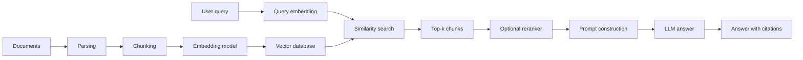
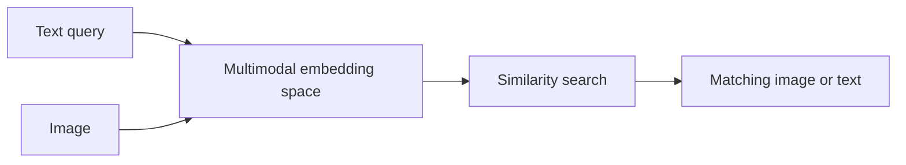
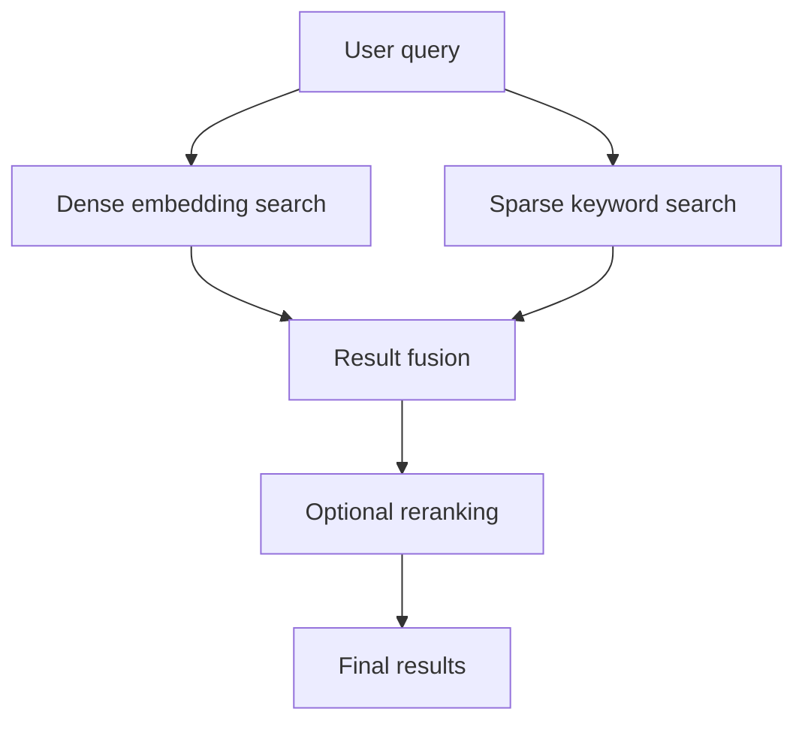
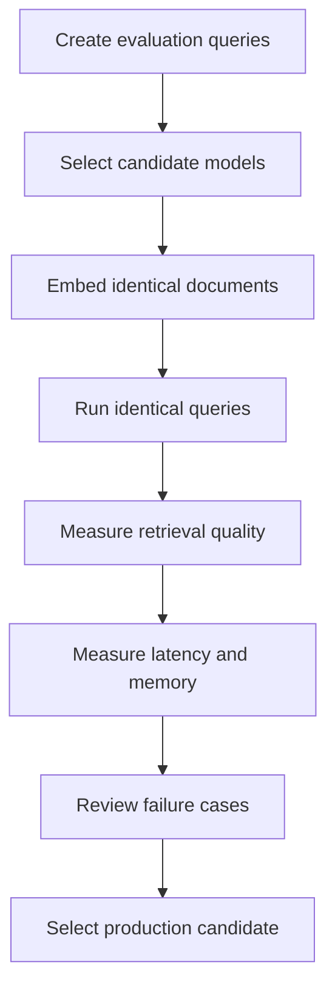
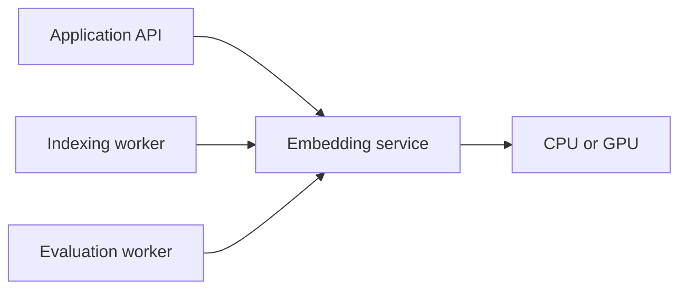
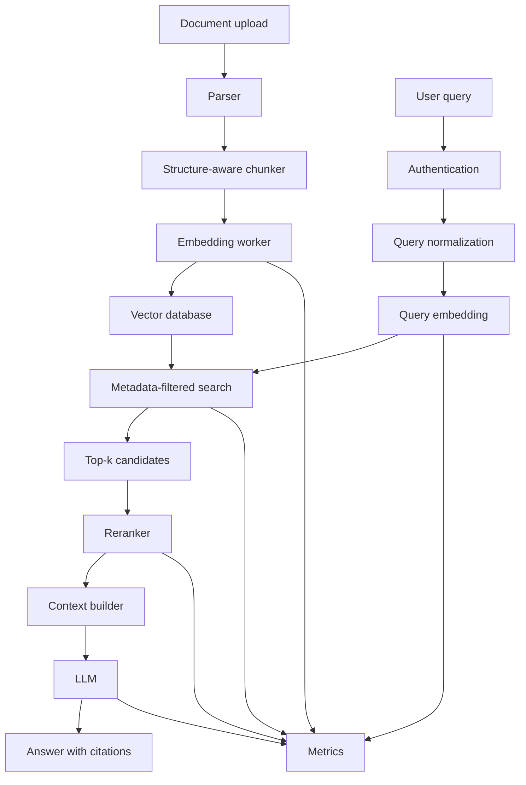

# 010 — Open-Source Embeddings

**Course:** 03 — Knowledge Systems and RAG
**Module:** Module 08 — Embeddings and Vector Databases
**Content Group:** Embedding Models
**Roadmap Source:** Embeddings and Vector Databases / Embedding Models
**Lesson Type:** Embeddings and Vector Databases
**Module Order:** 010
**Suggested Duration:** 24 minutes

---

## 1. Overview

**Open-source embedding models** convert text, images, audio, code, or other data into numerical vectors that can be stored, compared, and searched.

Unlike proprietary embedding APIs, open-source models can usually be:

* Downloaded and executed locally
* Deployed on private infrastructure
* Evaluated without sending data to an external provider
* Fine-tuned for a specific domain
* Integrated into offline applications
* Optimized for custom hardware
* Versioned and controlled by the engineering team

Open-source embeddings are commonly used in:

* Semantic search
* Retrieval-Augmented Generation
* Recommendation systems
* Text classification
* Clustering
* Duplicate detection
* Anomaly detection
* Document routing
* Multilingual search
* Code search
* Multimodal retrieval

The embedding model is one component of a larger retrieval system. Good search quality also depends on chunking, metadata, indexing, filtering, query design, reranking, and evaluation.

---

## 2. Learning Objectives

By the end of this lesson, you should be able to:

* Explain what an open-source embedding model is.
* Compare local embedding models with hosted embedding APIs.
* Identify common families of open-source embedding models.
* Select a model based on language, domain, vector size, speed, and license.
* Generate embeddings locally with Python.
* Store embeddings in a vector database.
* Build a small semantic-search pipeline.
* Evaluate retrieval quality with realistic queries.
* Recognize common deployment and production mistakes.

---

## 3. What Is an Embedding Model?

An embedding model transforms an input into a fixed-length numerical vector.

```text
"How can I reset my password?"
                ↓
         Embedding model
                ↓
[0.021, -0.384, 0.117, ..., 0.062]
```

The vector represents semantic properties of the input.

Inputs with similar meanings should produce nearby vectors.

```text
"How do I change my password?"
"Where can I reset my login password?"
```

These two sentences should have high semantic similarity even though their exact words differ.

An unrelated sentence should produce a more distant vector:

```text
"What is the weather in Bangkok?"
```

The central idea is:

> Embeddings make semantic meaning searchable using mathematical similarity.

---

## 4. What Does “Open Source” Mean?

The phrase **open-source embedding model** is often used broadly, but several different levels of openness may exist.

A model may provide:

* Public model weights
* Public inference code
* Public training code
* Public training datasets
* Public evaluation results
* A license that permits commercial use
* A license that restricts specific use cases

Not every downloadable model is fully open source in the strict software-licensing sense.

Before using a model in production, verify:

* Model license
* Dataset license
* Commercial-use restrictions
* Redistribution restrictions
* Attribution requirements
* Acceptable-use policy
* Fine-tuning permissions

Do not assume that “available on a public model hub” automatically means “unrestricted for commercial deployment.”

---

## 5. Open-Source vs Hosted Embeddings

### Open-Source Models

The engineering team runs the model.

Advantages:

* Greater data privacy
* Offline operation
* Predictable infrastructure control
* Custom batching and optimization
* Model fine-tuning
* No dependency on an external API
* Easier experimentation with specialized models

Limitations:

* Infrastructure management
* Model loading time
* GPU or CPU resource requirements
* Scaling complexity
* Monitoring responsibility
* Model-upgrade responsibility

---

### Hosted Embedding APIs

A provider runs the model and exposes an API.

Advantages:

* Simple integration
* No model-serving infrastructure
* Easy scaling
* Managed updates
* Often strong default performance

Limitations:

* Data leaves the local system
* Usage-based pricing
* Network dependency
* Rate limits
* Provider lock-in
* Model versions may change
* Limited fine-tuning or internal inspection

---

### Comparison

| Dimension         | Open-source embeddings          | Hosted embeddings       |
| ----------------- | ------------------------------- | ----------------------- |
| Deployment        | Local or private infrastructure | Provider infrastructure |
| Data privacy      | Greater control                 | Data sent to provider   |
| Initial setup     | More complex                    | Usually simple          |
| Scaling           | Managed by your team            | Managed by provider     |
| Cost model        | Hardware and operations         | Usage-based             |
| Offline support   | Possible                        | Usually unavailable     |
| Fine-tuning       | Often possible                  | Usually limited         |
| Model control     | High                            | Lower                   |
| Maintenance       | Your responsibility             | Provider responsibility |
| Vendor dependency | Lower                           | Higher                  |

---

## 6. Where Embeddings Fit in a RAG Pipeline



The same embedding model should normally be used for:

* Document chunks
* User queries

If document and query embeddings come from incompatible models, their vectors will not share a meaningful vector space.

---

## 7. Why Use Open-Source Embeddings?

### 7.1 Data Privacy

Sensitive documents can remain inside your own network.

Examples:

* Medical records
* Legal documents
* Source code
* Internal business policies
* Customer-support conversations
* Financial information

---

### 7.2 Offline Applications

The embedding model can operate without internet access.

This is useful for:

* Desktop applications
* Edge devices
* Restricted networks
* On-premises enterprise systems
* Local development environments

---

### 7.3 Cost Control

A local model does not charge per token or per API request.

However, local deployment is not automatically free. Costs may include:

* CPUs
* GPUs
* Memory
* Storage
* Engineering time
* Monitoring
* Model serving
* Scaling infrastructure

Local deployment becomes attractive when request volume is high enough or privacy requirements are strict enough.

---

### 7.4 Customization

Open models may be fine-tuned using:

* Domain-specific query-document pairs
* Positive and negative examples
* Multilingual datasets
* Product catalogs
* Legal documents
* Medical terminology
* Source-code repositories

---

### 7.5 Reproducibility

You can store:

* Model name
* Model revision
* Configuration
* Tokenizer version
* Vector dimension
* Normalization method
* Pooling strategy
* Distance metric

This makes retrieval experiments easier to reproduce.

---

## 8. Common Open-Source Embedding Families

Several model families are frequently used for semantic retrieval.

Examples include:

* Sentence Transformers
* E5
* BGE
* GTE
* Nomic Embed
* Instructor-style models
* Jina embedding models
* Multilingual embedding models
* Code-specialized embedding models
* Vision-language embedding models such as CLIP-style architectures

These families differ in:

* Training data
* Supported languages
* Maximum input length
* Vector dimension
* Model size
* Retrieval quality
* Inference speed
* Memory requirements
* License
* Required query prefixes

No model is universally best for every application.

---

## 9. Sentence Transformers

**Sentence Transformers** is a popular framework for loading and running embedding models.

It provides utilities for:

* Text embedding
* Similarity calculation
* Model training
* Evaluation
* Cross-encoder reranking
* Semantic search

Example:

```python
from sentence_transformers import SentenceTransformer

model = SentenceTransformer("sentence-transformers/all-MiniLM-L6-v2")

sentences = [
    "How can I reset my password?",
    "Where do I change my login credentials?",
    "What is the capital of Japan?",
]

embeddings = model.encode(
    sentences,
    normalize_embeddings=True,
)

print(embeddings.shape)
```

Sentence Transformers is a framework, not a single embedding model.

Different models loaded through the framework may have very different capabilities.

---

## 10. E5-Style Models

E5 models are commonly trained for retrieval using query-document pairs.

Many E5-style models expect input prefixes such as:

```text
query: How do I reset my password?
passage: Users can reset their password from account settings.
```

Example:

```python
from sentence_transformers import SentenceTransformer

model = SentenceTransformer("intfloat/e5-small-v2")

documents = [
    "passage: Users can reset passwords from the security settings page.",
    "passage: Billing invoices are available in the subscription dashboard.",
]

query = [
    "query: How can I change my password?"
]

document_vectors = model.encode(
    documents,
    normalize_embeddings=True,
)

query_vector = model.encode(
    query,
    normalize_embeddings=True,
)
```

Ignoring the recommended prefixes may reduce retrieval quality.

Always check the model card and usage instructions.

---

## 11. BGE-Style Models

BGE models are designed for tasks such as:

* Semantic search
* Dense retrieval
* Text similarity
* Multilingual retrieval
* Reranking

Some BGE models work best when the query is combined with a retrieval instruction.

Conceptual example:

```text
Represent this sentence for searching relevant passages:
How can employees request annual leave?
```

The exact instruction depends on the model.

Do not add arbitrary prompts unless the model documentation recommends them.

---

## 12. GTE and Other General Text Embeddings

General Text Embedding models are designed to provide reusable vector representations for tasks such as:

* Retrieval
* Classification
* Clustering
* Similarity
* Recommendation

General models can be useful when one application supports several related semantic tasks.

However, a specialized retrieval model may outperform a general-purpose model for a narrow domain.

---

## 13. Multilingual Embedding Models

A multilingual embedding model maps text from multiple languages into a shared vector space.

For example:

```text
English:
"How do I reset my password?"

Vietnamese:
"Làm thế nào để đặt lại mật khẩu?"

Shared semantic vector space
```

This supports cross-language retrieval:

```text
Vietnamese query
        ↓
Multilingual embedding model
        ↓
Search English documents
        ↓
Return semantically relevant results
```

Use a multilingual model when:

* Users ask questions in multiple languages.
* Documents contain several languages.
* Queries and documents may use different languages.
* Translation is unavailable or undesirable.

Test each important language independently. A model advertised as multilingual may perform unevenly across languages.

---

## 14. Code Embedding Models

General text embeddings may not represent source code accurately.

Code-specialized embeddings can support:

* Function search
* Repository navigation
* Duplicate-code detection
* Bug-report retrieval
* Code recommendation
* Documentation-to-code search

Example:

```text
Query:
"Function that validates a JWT access token"

Possible result:
def verify_access_token(token: str) -> UserClaims:
    ...
```

For code search, evaluate the model using real repository queries rather than only natural-language benchmarks.

---

## 15. Multimodal Embeddings

Multimodal embedding models place different data types into compatible vector spaces.

Examples:

* Text and images
* Text and audio
* Images and product descriptions
* Video frames and captions



Example application:

```text
Query:
"red running shoes with white soles"

Result:
Matching product images
```

A text-only embedding model cannot directly embed images unless an additional image-processing pipeline is used.

---

## 16. Model Selection Criteria

Selecting an embedding model should be treated as an engineering decision.

### 16.1 Retrieval Quality

Test whether the model returns relevant chunks for real queries.

Useful evaluation categories include:

* Exact questions
* Paraphrased questions
* Short keyword queries
* Long natural-language questions
* Ambiguous questions
* Multilingual questions
* Questions with numbers
* Negative statements
* Out-of-domain queries

---

### 16.2 Language Support

Check whether the model performs well for:

* English
* Vietnamese
* Mixed-language content
* Domain terminology
* Abbreviations
* Transliteration

Do not select a model based only on English benchmark scores when your application primarily serves Vietnamese users.

---

### 16.3 Model Size

Larger models may provide stronger representations but require more resources.

| Model size | Possible benefits              | Possible limitations      |
| ---------- | ------------------------------ | ------------------------- |
| Small      | Fast, CPU-friendly, low memory | Lower retrieval quality   |
| Medium     | Good balance                   | Moderate infrastructure   |
| Large      | Potentially stronger quality   | Higher latency and memory |

The best production model is often the smallest model that meets the required quality target.

---

### 16.4 Vector Dimension

Embedding dimension affects:

* Storage size
* Network transfer
* Index memory
* Search speed
* Model compatibility

Approximate raw storage for floating-point vectors:

[
\text{Storage}
==============

N \times D \times B
]

where:

* (N) = number of vectors
* (D) = vector dimension
* (B) = bytes per value

For 1,000,000 vectors with 768 dimensions using 32-bit floating-point values:

[
1{,}000{,}000 \times 768 \times 4
\approx 3.07 \text{ GB}
]

This estimate excludes metadata and index overhead.

---

### 16.5 Maximum Input Length

Embedding models have a maximum token length.

If a chunk exceeds that limit, it may be:

* Truncated
* Rejected
* Split automatically
* Processed incorrectly

Long-input support does not mean that extremely large chunks are ideal for retrieval.

A 4,000-token chunk may fit into the model but still retrieve poorly because it contains too many unrelated ideas.

---

### 16.6 Inference Speed

Measure:

* Documents embedded per second
* Queries embedded per second
* Batch latency
* Cold-start latency
* CPU usage
* GPU usage
* Memory consumption

Offline indexing and online query embedding have different performance requirements.

Document embeddings can often be generated asynchronously in large batches.

Query embeddings usually need low latency.

---

### 16.7 License

Confirm that the license supports:

* Commercial use
* Modification
* Fine-tuning
* Redistribution
* Hosted services
* Internal deployment

Store license information alongside your model registry.

---

## 17. Symmetric and Asymmetric Search

### Symmetric Search

The query and result have similar structures.

Examples:

* Finding duplicate questions
* Matching similar sentences
* Clustering comments
* Detecting paraphrases

```text
Question ↔ Question
Sentence ↔ Sentence
```

---

### Asymmetric Search

The query and result have different structures.

Examples:

* Short question → long document passage
* Search keyword → product description
* Issue description → documentation section

```text
Short query → Longer passage
```

Some embedding models are trained specifically for asymmetric retrieval.

This distinction should influence model selection and evaluation.

---

## 18. Dense and Sparse Retrieval

Open-source embeddings normally produce **dense vectors**.

Example:

```text
[0.12, -0.44, 0.08, ..., 0.19]
```

Dense retrieval is strong at semantic matching.

Sparse retrieval represents terms and token importance, often similarly to traditional search systems.

Sparse retrieval is useful for:

* Exact names
* IDs
* Error codes
* Product numbers
* Rare keywords
* Technical terms

A hybrid search system combines both.



---

## 19. Pooling Strategies

Transformer models produce token-level representations.

A pooling strategy converts them into one fixed-length vector.

Common strategies include:

* Mean pooling
* CLS-token pooling
* Max pooling
* Weighted pooling
* Last-token pooling

Conceptually:

```text
Token embeddings
[t1, t2, t3, ..., tn]
          ↓
       Pooling
          ↓
Sentence embedding
```

Use the pooling strategy expected by the model.

Changing pooling behavior can significantly reduce quality.

Frameworks such as Sentence Transformers normally apply the correct configured pooling automatically.

---

## 20. Vector Normalization

Normalization converts a vector to unit length.

[
\hat{v}
=======

\frac{v}{|v|}
]

For normalized vectors:

* Cosine similarity becomes equivalent to the vector dot product.
* Similarity calculations may become faster.
* Vector magnitudes no longer affect comparison.

Example:

```python
embeddings = model.encode(
    texts,
    normalize_embeddings=True,
)
```

Do not normalize one side but leave the other side unnormalized.

Document and query vectors must use consistent preprocessing.

---

## 21. Similarity Metrics

### Cosine Similarity

Measures the angle between vectors.

[
\text{cosine}(A,B)
==================

\frac{A \cdot B}
{|A||B|}
]

Common for semantic text retrieval.

---

### Dot Product

[
A \cdot B
=========

\sum_{i=1}^{n} A_iB_i
]

When vectors are normalized, dot product and cosine similarity produce equivalent rankings.

---

### Euclidean Distance

[
d(A,B)
======

\sqrt{
\sum_{i=1}^{n}(A_i-B_i)^2
}
]

The correct metric depends on the model and index configuration.

Do not assume every embedding model should use cosine similarity.

---

## 22. Practical Demo: Local Semantic Search

### 22.1 Install Dependencies

```bash
pip install sentence-transformers numpy
```

### 22.2 Generate Embeddings

```python
from dataclasses import dataclass

import numpy as np
from sentence_transformers import SentenceTransformer


@dataclass(frozen=True)
class SearchResult:
    text: str
    score: float
    index: int


class LocalSemanticSearch:
    def __init__(
        self,
        model_name: str = "sentence-transformers/all-MiniLM-L6-v2",
    ) -> None:
        self.model = SentenceTransformer(model_name)
        self.documents: list[str] = []
        self.document_vectors: np.ndarray | None = None

    def index(self, documents: list[str]) -> None:
        cleaned_documents = [
            document.strip()
            for document in documents
            if isinstance(document, str) and document.strip()
        ]

        if not cleaned_documents:
            raise ValueError("At least one document is required.")

        self.documents = cleaned_documents
        self.document_vectors = self.model.encode(
            cleaned_documents,
            normalize_embeddings=True,
            convert_to_numpy=True,
        )

    def search(
        self,
        query: str,
        top_k: int = 3,
    ) -> list[SearchResult]:
        if self.document_vectors is None:
            raise RuntimeError("Call index() before search().")

        if not isinstance(query, str) or not query.strip():
            raise ValueError("Query must be a non-empty string.")

        if top_k <= 0:
            raise ValueError("top_k must be greater than zero.")

        query_vector = self.model.encode(
            [query.strip()],
            normalize_embeddings=True,
            convert_to_numpy=True,
        )[0]

        scores = self.document_vectors @ query_vector

        effective_k = min(top_k, len(self.documents))
        top_indices = np.argsort(scores)[::-1][:effective_k]

        return [
            SearchResult(
                text=self.documents[index],
                score=float(scores[index]),
                index=int(index),
            )
            for index in top_indices
        ]


documents = [
    "Employees receive twelve days of annual leave each year.",
    "Password resets are available from the account security page.",
    "Invoices can be downloaded from the billing dashboard.",
    "Remote work requests require approval from a direct manager.",
    "Expense reports must be submitted before the fifth day of each month.",
]

search_engine = LocalSemanticSearch()
search_engine.index(documents)

results = search_engine.search(
    query="Where can I find my previous bills?",
    top_k=3,
)

for result in results:
    print({
        "score": round(result.score, 4),
        "text": result.text,
    })
```

Expected top result:

```text
Invoices can be downloaded from the billing dashboard.
```

The query uses the word “bills,” while the document uses “invoices.” A semantic embedding model can still identify their similarity.

---

## 23. Batch Embedding

Embedding documents one at a time is inefficient.

Use batching:

```python
embeddings = model.encode(
    documents,
    batch_size=64,
    normalize_embeddings=True,
    show_progress_bar=True,
    convert_to_numpy=True,
)
```

An appropriate batch size depends on:

* Model size
* GPU memory
* CPU memory
* Input length
* Desired latency

A larger batch is not always faster if it causes memory pressure.

---

## 24. Storing Embeddings in a Vector Database

Each vector should be stored with useful metadata.

Example record:

```json
{
  "id": "employee-handbook-page-12-chunk-3",
  "vector": [0.12, -0.31, 0.45],
  "metadata": {
    "source": "employee-handbook.pdf",
    "page": 12,
    "section": "Annual Leave",
    "language": "en",
    "document_version": "2026-01",
    "embedding_model": "model-name",
    "embedding_revision": "revision-id"
  },
  "text": "Employees receive twelve days of annual leave each year."
}
```

Important metadata may include:

* Source filename
* Page number
* Section heading
* Document ID
* Tenant ID
* Language
* Access level
* Timestamp
* Document version
* Chunk index
* Embedding model
* Embedding revision

Metadata is required for:

* Citations
* Access control
* Filtering
* Debugging
* Re-indexing
* Model migration

---

## 25. Example with Chroma

### Installation

```bash
pip install chromadb sentence-transformers
```

### Implementation

```python
import chromadb
from sentence_transformers import SentenceTransformer


model = SentenceTransformer(
    "sentence-transformers/all-MiniLM-L6-v2"
)

client = chromadb.PersistentClient(
    path="./chroma_data"
)

collection = client.get_or_create_collection(
    name="knowledge_base",
    metadata={"hnsw:space": "cosine"},
)

documents = [
    "Employees receive twelve days of annual leave each year.",
    "Invoices can be downloaded from the billing dashboard.",
    "Remote work requests require manager approval.",
]

ids = [
    "chunk-001",
    "chunk-002",
    "chunk-003",
]

metadatas = [
    {
        "source": "employee-handbook.pdf",
        "page": 12,
    },
    {
        "source": "billing-guide.md",
        "page": 1,
    },
    {
        "source": "remote-work-policy.pdf",
        "page": 3,
    },
]

embeddings = model.encode(
    documents,
    normalize_embeddings=True,
).tolist()

collection.upsert(
    ids=ids,
    documents=documents,
    metadatas=metadatas,
    embeddings=embeddings,
)

query = "How do I find an old invoice?"

query_embedding = model.encode(
    [query],
    normalize_embeddings=True,
).tolist()

results = collection.query(
    query_embeddings=query_embedding,
    n_results=2,
)

print(results)
```

---

## 26. Query and Document Instructions

Some embedding models require different formatting for queries and documents.

Example:

```python
def format_query(text: str) -> str:
    return f"query: {text.strip()}"


def format_document(text: str) -> str:
    return f"passage: {text.strip()}"
```

Another model may expect an instruction:

```python
def format_query(text: str) -> str:
    instruction = (
        "Represent this query for retrieving relevant documents:"
    )
    return f"{instruction} {text.strip()}"
```

Never reuse formatting from one model family without checking whether another model expects it.

Model-specific preprocessing should be isolated in one component:


---

## 27. Chunking Strategy

A strong model cannot fully compensate for poor chunks.

### Chunks That Are Too Large

Problems:

* Multiple topics in one vector
* Less precise retrieval
* More irrelevant context
* Higher LLM token usage

### Chunks That Are Too Small

Problems:

* Missing context
* Ambiguous statements
* Broken definitions
* Too many database records

### Better Chunking

Preserve semantic units such as:

* Paragraphs
* Sections
* Headings
* Functions
* Table rows
* FAQ entries
* Policy clauses

```text
Document
├── Heading
│   ├── Paragraph
│   ├── Paragraph
│   └── Table
└── Heading
    ├── Paragraph
    └── List
```

Use structure-aware chunking when possible instead of splitting only by character count.

---

## 28. Retrieval Evaluation

Do not evaluate a model by trying one successful query.

Create a test set containing real questions and expected documents.

Example:

| Query                                     | Expected source        |
| ----------------------------------------- | ---------------------- |
| How many leave days do employees receive? | employee-handbook.pdf  |
| Where can I download an invoice?          | billing-guide.md       |
| Who approves remote work?                 | remote-work-policy.pdf |

Useful metrics include:

* Hit Rate at (k)
* Recall at (k)
* Precision at (k)
* Mean Reciprocal Rank
* Normalized Discounted Cumulative Gain
* Retrieval latency

---

## 29. Hit Rate at (k)

Hit Rate measures whether at least one relevant result appears in the top (k).

[
\text{HitRate@k}
================

\frac{
\text{Queries with a relevant result in top } k
}{
\text{Total queries}
}
]

Example:

```text
Query 1: relevant result in top 3 → hit
Query 2: relevant result in top 3 → hit
Query 3: no relevant result       → miss

HitRate@3 = 2 / 3
```

---

## 30. Mean Reciprocal Rank

Mean Reciprocal Rank rewards systems that place the first relevant result near the top.

For one query:

[
RR
==

\frac{1}{\text{rank of first relevant result}}
]

Examples:

| First relevant result | Reciprocal rank |
| --------------------: | --------------: |
|                Rank 1 |            1.00 |
|                Rank 2 |            0.50 |
|                Rank 3 |            0.33 |
|               Rank 10 |            0.10 |

Across all queries:

[
MRR
===

\frac{1}{N}
\sum_{i=1}^{N} RR_i
]

---

## 31. Evaluation Script

```python
from dataclasses import dataclass


@dataclass(frozen=True)
class TestCase:
    query: str
    expected_document_index: int


def evaluate_hit_rate(
    search_engine: LocalSemanticSearch,
    test_cases: list[TestCase],
    top_k: int = 3,
) -> float:
    if not test_cases:
        raise ValueError("At least one test case is required.")

    hits = 0

    for test_case in test_cases:
        results = search_engine.search(
            test_case.query,
            top_k=top_k,
        )

        retrieved_indices = {
            result.index
            for result in results
        }

        if test_case.expected_document_index in retrieved_indices:
            hits += 1

    return hits / len(test_cases)


test_cases = [
    TestCase(
        query="How much annual leave do I get?",
        expected_document_index=0,
    ),
    TestCase(
        query="I forgot my password.",
        expected_document_index=1,
    ),
    TestCase(
        query="Where are my billing documents?",
        expected_document_index=2,
    ),
]

hit_rate = evaluate_hit_rate(
    search_engine,
    test_cases,
    top_k=3,
)

print(f"HitRate@3: {hit_rate:.2%}")
```

---

## 32. Model Comparison Workflow

Do not compare models only by public benchmark rankings.

Use the same internal dataset for every candidate.



Example comparison table:

| Model   | HitRate@5 |  MRR | Query latency | Memory | Notes                       |
| ------- | --------: | ---: | ------------: | -----: | --------------------------- |
| Model A |      0.86 | 0.72 |         18 ms |    Low | Fast                        |
| Model B |      0.91 | 0.81 |         41 ms | Medium | Better multilingual results |
| Model C |      0.92 | 0.83 |         95 ms |   High | Limited quality gain        |

The highest-quality model may not provide the best overall production trade-off.

---

## 33. Reranking

Dense embeddings efficiently retrieve candidate chunks, but the initial ranking may still be imperfect.

A reranker examines the query and each candidate together.


Dense retrieval is usually:

* Fast
* Scalable
* Approximate

Cross-encoder reranking is usually:

* Slower
* More accurate
* Applied only to a small candidate set

A common pattern is:

```text
Retrieve top 20–100
        ↓
Rerank
        ↓
Keep top 3–10
```

---

## 34. Fine-Tuning Open Embedding Models

Fine-tuning may help when:

* Domain vocabulary is specialized.
* Queries differ significantly from public training data.
* The application uses a low-resource language.
* Important distinctions are subtle.
* General embeddings repeatedly fail on known cases.

Training data may contain:

* Query-positive pairs
* Query-positive-negative triplets
* Similar sentence pairs
* Relevance labels
* Hard negatives

Example:

```json
{
  "query": "How do I request annual leave?",
  "positive": "Employees submit leave requests through the HR portal.",
  "negative": "Invoices are downloaded from the billing dashboard."
}
```

Fine-tuning is not always the first solution.

Before fine-tuning, check:

* Chunk quality
* Query formatting
* Metadata filters
* Model instructions
* Hybrid retrieval
* Reranking
* Evaluation-label quality

---

## 35. Hard Negatives

A hard negative is an irrelevant result that looks similar to the query.

Example:

```text
Query:
"How do I cancel annual leave?"

Positive:
"Employees may cancel approved leave through the HR portal."

Easy negative:
"How to download billing invoices."

Hard negative:
"Employees may submit annual leave through the HR portal."
```

The hard negative shares many words with the query but does not answer the cancellation question.

Training and evaluation should include hard negatives because production search failures are rarely limited to obviously unrelated documents.

---

## 36. Deployment Options

### In-Process Loading

The application loads the model directly.

```text
Application process
├── API routes
├── Embedding model
└── Retrieval client
```

Good for:

* Prototypes
* Small applications
* Local tools
* Low request volume

Limitations:

* Every application instance loads its own model.
* Memory usage grows with replicas.
* Deployment becomes tightly coupled.

---

### Dedicated Embedding Service



Advantages:

* Centralized batching
* Independent scaling
* Consistent model version
* Easier monitoring
* Multiple clients can reuse one service

---

### Offline Indexing Worker

Document embeddings can be created outside the online request path.

```text
Document uploaded
      ↓
Queue
      ↓
Parsing worker
      ↓
Chunking worker
      ↓
Embedding worker
      ↓
Vector database
```

This reduces user-facing latency and supports retry logic.

---

## 37. CPU and GPU Inference

### CPU

Advantages:

* Simple deployment
* Lower infrastructure cost
* Suitable for small models
* Suitable for low request volume

Limitations:

* Lower throughput
* Higher latency for large models

### GPU

Advantages:

* Higher batch throughput
* Lower latency for large models
* Better for large indexing workloads

Limitations:

* Higher cost
* More deployment complexity
* Potential underutilization at low traffic

Benchmark the actual workload rather than assuming that a GPU is always necessary.

---

## 38. Quantization

Quantization reduces model precision to improve efficiency.

Possible benefits:

* Lower memory use
* Faster CPU inference
* Easier edge deployment

Possible trade-offs:

* Reduced retrieval quality
* Hardware-specific behavior
* Additional conversion complexity

Compare the quantized model against the original using the same retrieval test set.

A model that loads successfully is not automatically accurate enough.

---

## 39. Model Versioning

Store more than the model name.

Recommended version information:

```json
{
  "model_name": "example/model-name",
  "model_revision": "commit-or-version",
  "vector_dimension": 768,
  "normalize_embeddings": true,
  "pooling": "mean",
  "distance_metric": "cosine",
  "query_format": "query-prefix-v1",
  "chunking_version": "chunker-v3",
  "index_version": "knowledge-base-2026-07"
}
```

This makes retrieval behavior traceable.

---

## 40. Changing the Embedding Model

Vectors from different embedding models generally cannot be compared directly.

Incorrect migration:

```text
Old documents → Model A vectors
New documents → Model B vectors
Queries       → Model B vectors
```

The query cannot reliably search Model A vectors.

Correct migration:

```text
All documents
      ↓
Re-embed with Model B
      ↓
Create a new index
      ↓
Validate
      ↓
Switch traffic
```

Use a new collection or index version during migration.

---

## 41. Production Architecture



---

## 42. Security and Privacy

Running an embedding model locally improves data control, but it does not solve every security problem.

Consider:

* Access control
* Tenant isolation
* Metadata filtering
* Sensitive-data logging
* Vector database permissions
* Model supply-chain security
* Malicious model files
* Untrusted document ingestion
* Prompt injection inside retrieved documents

Never use similarity search as an authorization mechanism.

Incorrect:

```python
results = vector_db.search(query_vector)
return results
```

Safer:

```python
results = vector_db.search(
    query_vector=query_vector,
    filters={
        "tenant_id": authenticated_user.tenant_id,
        "access_level": {
            "$in": authenticated_user.allowed_access_levels
        },
    },
)
```

Authentication and authorization must be enforced independently of semantic relevance.

---

## 43. Common Mistakes

### Selecting a Model Only by Popularity

A popular English model may perform poorly for Vietnamese, legal text, code, or long documents.

### Ignoring Model Instructions

Some models require prefixes or task instructions.

### Mixing Vectors from Different Models

Embedding spaces are not generally compatible.

### Failing to Normalize Consistently

Documents and queries must use the same vector-processing rules.

### Using the Wrong Distance Metric

The vector database metric should match the model and evaluation setup.

### Ignoring Chunk Quality

Strong embeddings cannot reliably retrieve badly structured chunks.

### Storing Vectors Without Metadata

Without source and page metadata, the system cannot produce reliable citations.

### Evaluating Only Successful Examples

Include difficult and failing queries.

### Using Only Top-(k) Ranking

The nearest result may still be irrelevant.

Use similarity thresholds or confidence logic where appropriate.

### Assuming Local Means Free

Infrastructure and maintenance still have costs.

### Automatically Upgrading Models

Changing the embedding model can require full re-indexing and threshold recalibration.

---

## 44. Practical Exercise

Build a local semantic-search system using an open embedding model.

### Step 1: Select Documents

Choose 5–10 Markdown or PDF files.

Examples:

* Product documentation
* University regulations
* Employee policies
* Technical notes
* Personal study materials

### Step 2: Parse and Chunk

Store:

* Text
* Source
* Page
* Section
* Chunk index

### Step 3: Select Two Models

Choose:

* One small, fast model
* One larger or multilingual model

### Step 4: Generate Embeddings

Record:

* Model name
* Vector dimension
* Embedding time
* Memory usage

### Step 5: Store Vectors

Use:

* FAISS
* Chroma
* Qdrant
* Another vector index

### Step 6: Create Test Queries

Include:

* Exact questions
* Paraphrases
* Short keyword queries
* Vietnamese questions
* English questions
* Out-of-domain questions
* Queries with no correct answer

### Step 7: Compare Models

Measure:

* HitRate@3
* HitRate@5
* MRR
* Query latency
* Index size
* Failure cases

### Step 8: Document Conclusions

Answer:

* Which model retrieved the best passages?
* Which model was fastest?
* Which model handled Vietnamese better?
* Which queries failed?
* Was the quality difference worth the additional infrastructure?

---

## 45. Suggested Portfolio Project

### Project: Local Semantic Search for Markdown and PDF Files

Build a system that:

1. Loads Markdown and PDF files.
2. Extracts text and page information.
3. Splits content into semantic chunks.
4. Generates embeddings locally.
5. Stores vectors in Chroma, Qdrant, or FAISS.
6. Accepts natural-language queries.
7. Retrieves the most relevant chunks.
8. Optionally reranks the results.
9. Generates answers with citations.
10. Compares at least two open embedding models.

Suggested project structure:

```text
semantic-search/
├── app/
│   ├── api/
│   ├── embedding/
│   │   ├── base.py
│   │   ├── sentence_transformer.py
│   │   └── registry.py
│   ├── ingestion/
│   │   ├── parser.py
│   │   └── chunker.py
│   ├── retrieval/
│   │   ├── vector_store.py
│   │   ├── search.py
│   │   └── reranker.py
│   └── evaluation/
│       ├── dataset.py
│       └── metrics.py
├── data/
├── tests/
├── scripts/
│   ├── index_documents.py
│   └── evaluate_models.py
├── requirements.txt
└── README.md
```

Suggested API routes:

```text
POST /documents
POST /documents/index
POST /search
POST /rag/answer
POST /evaluation/run
GET  /models
GET  /health
```

Example search response:

```json
{
  "query": "How many annual leave days do employees receive?",
  "embedding_model": "example-model",
  "results": [
    {
      "text": "Employees receive twelve days of annual leave each year.",
      "score": 0.87,
      "source": "employee-handbook.pdf",
      "page": 12,
      "chunk_index": 3
    }
  ]
}
```

---

## 46. Production Checklist

### Model Selection

* [ ] The model license supports the intended use.
* [ ] The model supports the required languages.
* [ ] The model was tested on real domain queries.
* [ ] Query and document instructions are implemented correctly.
* [ ] Maximum input length is understood.
* [ ] Vector dimension and distance metric are documented.

### Data Processing

* [ ] Documents are parsed correctly.
* [ ] Chunk boundaries preserve meaning.
* [ ] Oversized chunks are handled.
* [ ] Metadata includes source and page information.
* [ ] Sensitive documents are protected.

### Embedding Generation

* [ ] Document and query embeddings use the same model.
* [ ] Normalization is consistent.
* [ ] Batch processing is enabled.
* [ ] Empty or malformed inputs are rejected.
* [ ] Model errors are retried or recorded.
* [ ] Embedding versions are stored.

### Vector Database

* [ ] The index uses the correct metric.
* [ ] Tenant and permission filters are enforced.
* [ ] Vector dimensions are validated.
* [ ] Duplicate documents are handled.
* [ ] Index backups or rebuilding procedures exist.

### Evaluation

* [ ] Real test queries are available.
* [ ] Expected relevant documents are labeled.
* [ ] HitRate@k or Recall@k is measured.
* [ ] MRR or ranking quality is measured.
* [ ] Failure cases are reviewed manually.
* [ ] Multilingual queries are tested separately.
* [ ] Out-of-domain queries are included.

### Deployment

* [ ] CPU and GPU performance were benchmarked.
* [ ] Cold-start time was measured.
* [ ] Memory usage was measured.
* [ ] The embedding service has health checks.
* [ ] Batch size is configured safely.
* [ ] Model upgrades follow a migration plan.

### Monitoring

* [ ] Query latency is tracked.
* [ ] Embedding errors are tracked.
* [ ] Retrieval score distributions are tracked.
* [ ] Index growth is monitored.
* [ ] Model and index versions appear in logs.
* [ ] User feedback can identify poor retrieval results.

---

## 47. Completion Checklist

* [ ] I can explain open-source embeddings in one or two minutes.
* [ ] I understand the difference between local and hosted embeddings.
* [ ] I can identify several open embedding model families.
* [ ] I can select a model based on language, quality, speed, size, and license.
* [ ] I can generate normalized embeddings locally.
* [ ] I can store embeddings with metadata.
* [ ] I can perform vector similarity search.
* [ ] I can evaluate retrieval using a test dataset.
* [ ] I understand why changing models requires re-indexing.
* [ ] I have created a small demo or portfolio artifact.
* [ ] I have documented at least one limitation or open question.

---

## 48. Related Outcome

Build semantic search systems using:

* Open embedding models
* Vector indexes
* Similarity metrics
* Metadata filtering
* Hybrid retrieval
* Reranking
* Retrieval evaluation
* Local model deployment

The model provides the vector representation, but the complete system determines whether those vectors produce useful answers.

---

## 49. Summary

Open-source embedding models allow AI engineers to generate semantic vectors using infrastructure they control.

They are useful when an application requires:

* Data privacy
* Offline operation
* Custom deployment
* Domain adaptation
* Predictable model versioning
* Reduced dependency on external APIs

A reliable embedding system requires more than selecting a model from a public model hub. Engineers must also evaluate:

* Language support
* License
* Query-document formatting
* Vector dimensions
* Input length
* Chunking strategy
* Similarity metric
* Inference speed
* Memory usage
* Retrieval quality
* Migration strategy

The most important production principle is:

> Select embedding models using your own documents, your own queries, and measurable retrieval results—not popularity alone.
