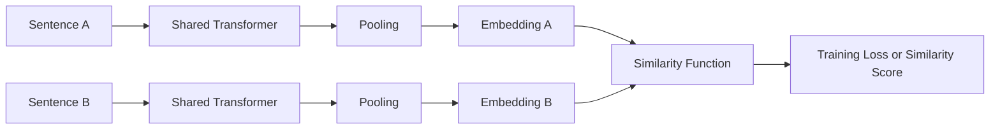
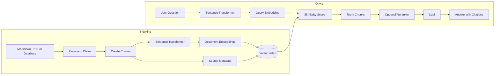
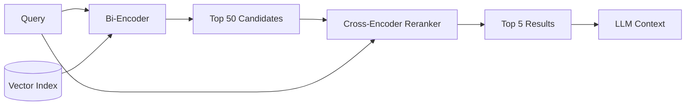

# 011 — Sentence Transformers

**Course:** 03 — Knowledge Systems and RAG
**Module:** Module 08 — Embeddings and Vector Databases
**Content group:** Embedding Models
**Roadmap source:** Embeddings and Vector Databases / Embedding Models
**Lesson type:** Embeddings and Vector Databases
**Order in module:** 011
**Suggested duration:** 24 minutes

---

## 1. Summary

**Sentence Transformers** is an open-source Python framework for creating and using embedding models, rerankers, and related retrieval components.

Its most common use is converting sentences, paragraphs, document chunks, or queries into fixed-size numerical vectors called **embeddings**. Texts with similar meanings should appear close together in the embedding space.

Sentence Transformers is commonly used for:

* Semantic search
* Retrieval-Augmented Generation, or RAG
* Text similarity
* Document clustering
* Duplicate detection
* Recommendation systems
* Paraphrase detection
* Text classification
* Retrieve-and-rerank pipelines

The original Sentence-BERT architecture improved the efficiency of semantic similarity search by encoding each text independently. Unlike a standard cross-encoder, document embeddings can be calculated once, stored, and reused for many queries.

---

## 2. Learning Objectives

By the end of this lesson, you should be able to:

1. Explain Sentence Transformers in your own words.
2. Distinguish between a bi-encoder and a cross-encoder.
3. Generate embeddings for documents and queries.
4. Calculate semantic similarity between embeddings.
5. Build a small semantic search system.
6. Select an appropriate model for a language and task.
7. Evaluate retrieval quality using a test dataset.
8. Identify common production limitations and failure cases.

---

## 3. Core Concepts

### 3.1 What Is a Sentence Embedding?

A sentence embedding is a fixed-size vector that represents the semantic meaning of a piece of text.

For example:

```text
"I forgot my account password."
"How can I reset my password?"
```

These sentences use different words, but they express similar meanings. A suitable embedding model should place their vectors close together.

By contrast:

```text
"The weather is sunny today."
```

should produce a vector farther away from the password-related sentences.

Conceptually:

```text
Text
  ↓
Tokenizer
  ↓
Transformer model
  ↓
Token representations
  ↓
Pooling
  ↓
Fixed-size embedding vector
```

Sentence Transformers provides methods for generating these dense representations and comparing them for tasks such as semantic textual similarity, clustering, and retrieval.

---

### 3.2 Why Not Use a Standard BERT Model Directly?

A standard BERT cross-encoder normally processes two texts together:

```text
[CLS] query [SEP] document [SEP]
```

This can produce an accurate relevance score because the model examines interactions between the query and document tokens.

However, every query must be paired with every candidate document.

For a collection containing one million documents:

```text
1 query × 1,000,000 documents
= 1,000,000 model evaluations
```

This is usually too expensive for first-stage retrieval.

Sentence-BERT introduced a bi-encoder architecture that encodes the query and documents independently. The resulting vectors can then be compared efficiently using cosine similarity, dot product, or a vector index.

---

### 3.3 Bi-Encoder Architecture

A Sentence Transformer generally works as a **bi-encoder**.

The same model processes both inputs independently:



The important property is that the documents can be encoded before the user submits a query.

```text
Documents → encode once → save embeddings

User query → encode at request time → search saved embeddings
```

This makes bi-encoders suitable for large-scale retrieval systems.

---

### 3.4 Pooling

Transformer models produce one vector for each input token. A retrieval system normally requires one vector for the entire sentence or document chunk.

A pooling operation combines token vectors into a single embedding.

Common strategies include:

* Mean pooling
* CLS-token pooling
* Max pooling
* Weighted pooling

Mean pooling is a common approach:

[
e = \frac{1}{n}\sum_{i=1}^{n}h_i
]

Where:

* (h_i) is the representation of token (i)
* (n) is the number of valid tokens
* (e) is the final text embedding

You normally do not need to implement pooling manually when using a complete Sentence Transformers model. The model configuration already defines the expected transformer and pooling components.

---

### 3.5 Similarity Functions

After generating two embeddings, the application calculates how similar they are.

#### Cosine similarity

[
\text{cosine}(a,b) =
\frac{a \cdot b}
{|a||b|}
]

Cosine similarity compares the direction of two vectors rather than their raw magnitude.

#### Dot product

[
\text{dot}(a,b) = a \cdot b
]

When both embeddings are normalized to length 1, dot product and cosine similarity produce equivalent rankings.

#### Euclidean distance

[
d(a,b) = \sqrt{\sum_i(a_i-b_i)^2}
]

The correct metric depends on how the model was trained. Always inspect the model card and use its recommended similarity function.

---

### 3.6 Symmetric and Asymmetric Search

Embedding tasks can be divided into two broad categories.

#### Symmetric tasks

Both inputs have approximately the same structure and length.

Examples:

```text
Sentence ↔ Sentence
Question ↔ Duplicate question
Product title ↔ Similar product title
```

A paraphrase model may work well for these tasks.

#### Asymmetric tasks

The query and document have different structures.

Examples:

```text
Short question → Long answer passage
Search phrase → Product description
User problem → Support article
```

For asymmetric search, use a model trained specifically for query-to-passage retrieval when possible.

Modern Sentence Transformers APIs may expose separate methods such as:

```python
model.encode_query(...)
model.encode_document(...)
```

These methods are useful when a model applies different prompts, prefixes, or task configurations to queries and documents.

---

## 4. Where Sentence Transformers Fits in a RAG System

Sentence Transformers normally belongs to the **retrieval layer** of a RAG application.



Sentence Transformers does not perform the complete RAG workflow by itself.

It usually handles one or more of these responsibilities:

1. Encoding document chunks.
2. Encoding user queries.
3. Calculating semantic similarity.
4. Reranking retrieved candidates.
5. Training or fine-tuning a domain-specific embedding model.

The vector database, metadata store, prompt construction, LLM generation, and citation validation are separate system components.

---

## 5. Choosing a Model

There is no universally best embedding model.

Model selection should consider:

| Requirement    | What to examine                                                    |
| -------------- | ------------------------------------------------------------------ |
| Language       | English-only or multilingual                                       |
| Task           | Similarity, clustering, or query-document retrieval                |
| Domain         | General text, legal, medical, code, finance, or internal documents |
| Latency        | CPU and GPU inference time                                         |
| Throughput     | Embeddings generated per second                                    |
| Context length | Maximum supported input length                                     |
| Vector size    | Storage and index memory requirements                              |
| License        | Commercial and redistribution requirements                         |
| Accuracy       | Performance on your own evaluation dataset                         |
| Deployment     | Local, server, browser, edge, or managed infrastructure            |

Useful baseline examples include:

| Model                                                         | Typical starting point                          |
| ------------------------------------------------------------- | ----------------------------------------------- |
| `sentence-transformers/all-MiniLM-L6-v2`                      | Small and fast English baseline                 |
| `sentence-transformers/all-mpnet-base-v2`                     | Larger general-purpose English baseline         |
| `sentence-transformers/paraphrase-multilingual-MiniLM-L12-v2` | Multilingual similarity baseline                |
| Retrieval-specific models                                     | Question-to-passage search                      |
| Domain-fine-tuned models                                      | Specialized terminology and document structures |

These examples should be treated as baselines rather than automatic production choices. The official model cards provide loading instructions and model-specific details.

For Vietnamese or mixed Vietnamese-English content, test multilingual and retrieval-specific models using real queries from the application. A model that performs well on an English benchmark may not preserve the same quality for Vietnamese, code-switching, abbreviations, or domain terminology.

---

## 6. Practical Demo: Semantic Search in Python

### 6.1 Installation

```bash
pip install -U sentence-transformers numpy
```

---

### 6.2 Prepare a Small Document Collection

Create a file named `semantic_search.py`:

```python
from dataclasses import dataclass

import numpy as np
from sentence_transformers import SentenceTransformer


@dataclass(frozen=True)
class Document:
    document_id: str
    source: str
    text: str


documents = [
    Document(
        document_id="doc-001",
        source="account.md",
        text="Users can reset their password from the account settings page.",
    ),
    Document(
        document_id="doc-002",
        source="billing.md",
        text="Refund requests must be submitted within fourteen days.",
    ),
    Document(
        document_id="doc-003",
        source="security.md",
        text="Two-factor authentication adds an extra verification step.",
    ),
    Document(
        document_id="doc-004",
        source="profile.md",
        text="A profile photo can be changed from the personal information page.",
    ),
    Document(
        document_id="doc-005",
        source="subscription.md",
        text="Customers can cancel an active subscription from billing settings.",
    ),
]
```

---

### 6.3 Encode the Documents and Query

```python
model = SentenceTransformer(
    "sentence-transformers/all-MiniLM-L6-v2"
)

document_texts = [document.text for document in documents]

document_embeddings = model.encode(
    document_texts,
    normalize_embeddings=True,
)

query = "I cannot remember my password. What should I do?"

query_embedding = model.encode(
    query,
    normalize_embeddings=True,
)
```

The model converts every document and the query into vectors with the same number of dimensions.

Because the vectors are normalized, their dot product can be used as a cosine-similarity score.

---

### 6.4 Retrieve the Top Results

```python
scores = document_embeddings @ query_embedding

top_k = 3
top_indices = np.argsort(scores)[::-1][:top_k]

for rank, index in enumerate(top_indices, start=1):
    document = documents[index]

    print(
        f"{rank}. score={scores[index]:.4f} "
        f"source={document.source}"
    )
    print(f"   {document.text}")
```

Expected result:

```text
1. score=0.67 source=account.md
   Users can reset their password from the account settings page.

2. score=0.28 source=security.md
   Two-factor authentication adds an extra verification step.

3. score=0.17 source=profile.md
   A profile photo can be changed from the personal information page.
```

The exact scores can differ depending on library and model versions.

The most important observation is that the model retrieves the password-reset document even though the query does not use exactly the same wording.

---

### 6.5 Convert the Result into RAG Context

```python
retrieved_chunks = [
    {
        "text": documents[index].text,
        "source": documents[index].source,
        "score": float(scores[index]),
    }
    for index in top_indices
]

context = "\n\n".join(
    f"[Source: {chunk['source']}]\n{chunk['text']}"
    for chunk in retrieved_chunks
)

prompt = f"""
Answer the question using only the provided context.

Question:
{query}

Context:
{context}

Requirements:
- Do not invent unsupported information.
- Cite the source filename after each factual statement.
- Say that the answer is unavailable when the context is insufficient.
""".strip()

print(prompt)
```

The Sentence Transformer retrieves the relevant context. The LLM then generates an answer from that context.

---

## 7. Vector Database Integration

The in-memory NumPy example is suitable for learning, but production systems normally use a vector index.

Possible storage systems include:

* FAISS
* Qdrant
* Chroma
* Milvus
* Weaviate
* Elasticsearch or OpenSearch vector search
* PostgreSQL with `pgvector`

A typical vector record should contain:

```json
{
  "id": "handbook-page-12-chunk-03",
  "embedding": [0.012, -0.084, 0.031],
  "metadata": {
    "source": "employee-handbook.pdf",
    "page": 12,
    "chunk_index": 3,
    "section": "Leave Policy",
    "language": "en",
    "embedding_model": "sentence-transformers/all-MiniLM-L6-v2",
    "content_hash": "..."
  },
  "text": "Employees must submit annual leave requests..."
}
```

Metadata is essential for:

* Citations
* Filtering
* Debugging
* Access control
* Re-indexing
* Model migration
* Document deletion
* Version tracking

---

## 8. Retrieve and Rerank

A bi-encoder is efficient, but it compresses each input into one vector before comparing them. Some detailed token-level relationships can be lost.

A stronger production architecture is:

```text
Bi-encoder retrieval
        ↓
Top 20–100 candidates
        ↓
Cross-encoder reranking
        ↓
Top 3–10 chunks
        ↓
LLM
```



The bi-encoder provides fast candidate retrieval. The cross-encoder then processes each query-document pair jointly and produces a more precise relevance score.

This design combines efficient first-stage retrieval with a slower but more accurate reranking stage.

---

## 9. Evaluation

Do not select an embedding model based only on popularity, intuition, or a public leaderboard.

Create a small evaluation dataset from the actual application domain.

### 9.1 Example Evaluation Record

```json
{
  "query": "How do I request a refund?",
  "relevant_chunk_ids": [
    "billing-refund-policy-01",
    "billing-refund-process-02"
  ]
}
```

Create at least 20–50 queries for an early prototype. Include:

* Common questions
* Paraphrased questions
* Short and vague queries
* Queries containing spelling mistakes
* Vietnamese and English queries
* Domain-specific terminology
* Questions with no valid answer
* Questions requiring metadata filters
* Difficult negative examples

---

### 9.2 Retrieval Metrics

#### Recall@k

Recall@k checks whether at least one relevant result appears within the first (k) results.

[
\text{Recall@k} =
\frac{\text{Queries with a relevant result in top-k}}
{\text{Total queries}}
]

Example:

```text
42 of 50 queries find a relevant chunk in the top 5.

Recall@5 = 42 / 50 = 0.84
```

#### Mean Reciprocal Rank

MRR rewards systems that place the first relevant result near the top.

[
\text{MRR} =
\frac{1}{N}
\sum_{i=1}^{N}
\frac{1}{\text{rank}_i}
]

#### nDCG@k

Normalized Discounted Cumulative Gain is useful when results have multiple relevance levels.

For example:

```text
3 = directly answers the query
2 = partially useful
1 = related background
0 = irrelevant
```

#### Operational metrics

Also measure:

* Embedding latency
* Search latency
* Reranking latency
* Queries per second
* Memory consumption
* Index size
* Embedding generation cost
* Cold-start time
* CPU versus GPU performance

Sentence Transformers includes task-specific evaluators and supports evaluation with benchmark frameworks such as MTEB, but domain-specific testing remains necessary.

---

### 9.3 Retrieval and Generation Must Be Evaluated Separately

A RAG answer can fail in two different places.

#### Retrieval failure

The correct evidence was not retrieved.

```text
Query
  ↓
Wrong chunks
  ↓
LLM cannot produce the correct grounded answer
```

#### Generation failure

The correct evidence was retrieved, but the LLM ignored, misunderstood, or contradicted it.

```text
Query
  ↓
Correct chunks
  ↓
Incorrect or unsupported answer
```

Evaluate these separately:

| Layer      | Suggested checks                           |
| ---------- | ------------------------------------------ |
| Retrieval  | Recall@k, MRR, nDCG                        |
| Reranking  | Precision and ranking improvement          |
| Generation | Correctness and completeness               |
| Grounding  | Whether claims are supported by context    |
| Citations  | Whether the cited chunk supports the claim |
| Safety     | Whether restricted content is exposed      |

---

## 10. Chunking Considerations

Embedding quality cannot compensate for poor chunking.

### Chunks that are too small

```text
"within fourteen days"
```

The text may lose its subject and meaning.

### Chunks that are too large

```text
An entire 30-page policy document
```

The embedding may mix many unrelated topics into one vector.

A useful chunk should normally represent one coherent idea.

Possible structure:

```text
Document
  ↓
Section
  ↓
Paragraph group
  ↓
Token-aware chunk
  ↓
Small overlap
  ↓
Embedding
```

Do not copy the same chunking configuration into every project. Test chunk size, overlap, titles, section paths, and surrounding context on the retrieval dataset.

---

## 11. Fine-Tuning

A general-purpose model may not understand specialized language such as:

* Internal product names
* Medical abbreviations
* Legal terminology
* Financial instruments
* Source-code relationships
* Organization-specific acronyms
* Vietnamese-English mixed terminology

Sentence Transformer models can be fine-tuned using several forms of training data.

### Positive pairs

```text
query → relevant document
```

### Triplets

```text
anchor → positive → negative
```

### Similarity-scored pairs

```text
sentence A → sentence B → similarity score
```

Training data quality is usually more important than simply increasing its size. Hard negatives—documents that look related but do not answer the query—are particularly useful for teaching the model subtle distinctions.

The Sentence Transformers documentation supports paired, triplet, and similarity-scored dataset structures for training and evaluation.

---

## 12. Local Deployment: Benefits and Trade-Offs

Sentence Transformers models can often run inside your own infrastructure.

### Potential benefits

* No per-request embedding API fee
* Greater control over model versions
* Offline inference
* Custom fine-tuning
* Flexible batching and optimization
* Reduced need to send text to an external embedding provider

### Trade-offs

* You manage model hosting
* CPU inference may be slow for large workloads
* GPU infrastructure introduces operational cost
* Model files consume memory and storage
* Scaling and observability become your responsibility
* Local deployment does not automatically guarantee security
* You must manage licenses and model updates
* Re-indexing may be required when changing models

Never mix vectors from different embedding models in the same index unless the models are explicitly compatible.

```text
Model A document embedding
        ≠
Model B query embedding
```

Even when two models produce vectors with the same dimensions, they may represent meaning in completely different vector spaces.

---

## 13. Common Mistakes

### 13.1 Selecting a model only from a leaderboard

A public benchmark may not represent your language, domain, chunk format, or user queries.

**Better approach:** Compare candidate models using an application-specific retrieval set.

---

### 13.2 Using an English-only model for multilingual content

The system may perform well on English but poorly on Vietnamese or mixed-language queries.

**Better approach:** Test multilingual models and measure each supported language separately.

---

### 13.3 Ignoring the model’s intended task

A paraphrase model is not always the best model for question-to-document retrieval.

**Better approach:** Determine whether the task is symmetric or asymmetric.

---

### 13.4 Using chunks that are too long or too short

Poor chunk boundaries reduce retrieval quality.

**Better approach:** Evaluate several chunking configurations with the same test queries.

---

### 13.5 Storing embeddings without metadata

The system cannot reliably create citations or remove individual source documents.

**Better approach:** Store source, page, section, version, permissions, and chunk identifiers.

---

### 13.6 Re-embedding documents on every query

This wastes computation and increases response time.

**Better approach:** Precompute document embeddings and only encode new or modified documents.

---

### 13.7 Treating the similarity score as a universal probability

A cosine score of `0.70` does not automatically mean “70% relevant.”

**Better approach:** Calibrate thresholds using labeled domain examples.

---

### 13.8 Using only easy positive examples

A model may retrieve documents with similar keywords while failing on subtle intent differences.

**Better approach:** Include hard negatives, ambiguous questions, and unsupported questions.

---

### 13.9 Changing the model without rebuilding the index

The new query vectors may not be compatible with old document vectors.

**Better approach:** Version the embedding model and perform controlled re-indexing.

---

### 13.10 Evaluating only the final LLM answer

A correct-looking answer can hide poor retrieval or unsupported claims.

**Better approach:** Log and inspect the query, retrieved chunks, scores, reranked order, final context, answer, and citations.

---

## 14. Practical Exercise

Build a small semantic search engine for Markdown or PDF documents.

### Step 1: Prepare the dataset

Select 5–10 small documents.

Each document should include:

```text
document_id
source
title
page or section
text
```

### Step 2: Create test questions

Write at least 15 questions:

* Five easy questions
* Five paraphrased questions
* Three difficult or ambiguous questions
* Two questions with no valid answer

### Step 3: Build the indexing pipeline

```text
Documents
  ↓
Parsing
  ↓
Cleaning
  ↓
Chunking
  ↓
Embedding
  ↓
Vector index
```

### Step 4: Build the retrieval pipeline

```text
Question
  ↓
Query embedding
  ↓
Top-k vector search
  ↓
Metadata and permission filters
  ↓
Retrieved chunks
```

### Step 5: Record the results

Use a table such as:

| Query                              | Expected source | Top-1 | Top-3 | Top-5 | Failure reason        |
| ---------------------------------- | --------------- | ----: | ----: | ----: | --------------------- |
| How do I reset my password?        | account.md      |   Yes |   Yes |   Yes | —                     |
| Can I return an annual plan?       | billing.md      |    No |   Yes |   Yes | Weak paraphrase match |
| What is the office Wi-Fi password? | No answer       |    No |    No |    No | System should abstain |

### Step 6: Compare configurations

Change one variable at a time:

* Embedding model
* Chunk size
* Chunk overlap
* Similarity function
* Top-k
* Metadata filters
* Reranker
* Query rewriting

### Step 7: Document failure cases

For each failure, classify the cause:

```text
Parsing failure
Chunking failure
Embedding failure
Metadata-filter failure
Ranking failure
Generation failure
Citation failure
No-answer detection failure
```

---

## 15. Production Checklist

### Model

* [ ] The model supports the required languages.
* [ ] The model is appropriate for the retrieval task.
* [ ] The license has been reviewed.
* [ ] Model name and revision are versioned.
* [ ] Maximum input length is known.
* [ ] Embedding dimensions are recorded.

### Indexing

* [ ] Chunking has been evaluated.
* [ ] Documents are normalized consistently.
* [ ] Embeddings are generated in batches.
* [ ] Source metadata is stored.
* [ ] Content hashes prevent unnecessary re-indexing.
* [ ] Deleted documents are removed from the index.

### Retrieval

* [ ] Query and document encoding are compatible.
* [ ] The correct similarity metric is used.
* [ ] Top-k has been tuned.
* [ ] Metadata and permission filters are applied.
* [ ] A no-answer strategy exists.
* [ ] Hybrid retrieval has been considered where appropriate.
* [ ] Reranking has been tested for difficult queries.

### Evaluation

* [ ] A domain-specific test set exists.
* [ ] Recall@k is measured.
* [ ] MRR or nDCG is measured.
* [ ] Each supported language is evaluated.
* [ ] Hard negatives are included.
* [ ] Retrieval and generation failures are separated.
* [ ] Citation correctness is reviewed.

### Operations

* [ ] Latency is monitored.
* [ ] Index size is monitored.
* [ ] Model loading failures are handled.
* [ ] Re-indexing procedures are documented.
* [ ] Sensitive content is protected.
* [ ] Logs do not expose private document text unnecessarily.

---

## 16. Completion Checklist

* [ ] I can explain Sentence Transformers in one or two minutes.
* [ ] I understand the difference between a bi-encoder and a cross-encoder.
* [ ] I can create document and query embeddings.
* [ ] I can perform cosine-similarity search.
* [ ] I can preserve source metadata for citations.
* [ ] I have built a small semantic search demo.
* [ ] I can measure Recall@k and identify retrieval failures.
* [ ] I understand at least one limitation of embedding-based retrieval.
* [ ] I know when reranking or fine-tuning may be necessary.

---

## 17. Related Outcome

Build semantic search systems using:

```text
Text preprocessing
+ Chunking
+ Sentence embeddings
+ Vector indexes
+ Similarity search
+ Reranking
+ Retrieval evaluation
```

---

## 18. Related Project

### Project 7: Semantic Search Engine

Build a semantic search engine for Markdown and PDF files using:

* Sentence Transformers
* A Markdown or PDF parser
* Token-aware chunking
* FAISS, Chroma, Qdrant, or another vector index
* Metadata-based citations
* Optional cross-encoder reranking
* A retrieval evaluation dataset
* A simple API or web interface

Suggested API:

```http
POST /api/search
Content-Type: application/json
```

```json
{
  "query": "How does the refund policy work?",
  "top_k": 5,
  "language": "en",
  "filters": {
    "document_type": "policy"
  }
}
```

Example response:

```json
{
  "query": "How does the refund policy work?",
  "results": [
    {
      "text": "Refund requests must be submitted within fourteen days.",
      "score": 0.812,
      "source": "billing-policy.md",
      "section": "Refunds"
    }
  ]
}
```

---

## 19. Key Takeaways

Sentence Transformers converts text into reusable semantic vectors.

Its primary advantage is that documents can be encoded in advance and searched efficiently with a query vector.

A production-quality system requires more than calling `model.encode()`:

```text
Good model selection
+ Good document parsing
+ Good chunking
+ Reliable metadata
+ Correct similarity search
+ Domain evaluation
+ Reranking when selection
+ Good document parsing
+ Good chunking
 necessary
+ Citation validation
```

The most important rule is:

> Do not assume that an embedding model is suitable for your application. Test it using real documents, real user questions, difficult negatives, and measurable retrieval metrics.

Sentence Transformers is therefore not only a model library. It is a practical foundation for semantic search, RAG retrieval, clustering, recommendation, similarity analysis, and domain-specific knowledge systems.

---

## 20. References

* Sentence-BERT introduced an efficient bi-encoder architecture for genereddings. citeturn565433search3turn565433search9
* The official Sentence Transformers documentation covers embeddings, semantic similarity, sem65433search6turn565433search25turn892363search21
* Hugging Face hosts models compatible with the Sentence Transform cards. citeturn565433search4turn565433search15

---

# Bài luyện tập

## Mục tiêu


## Đề bài


## Yêu cầu hoàn thành

- [ ] 
- [ ] 
- [ ] 

## Kết quả / lời giải


## Ghi chú
