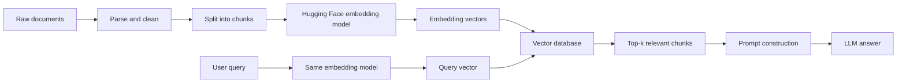
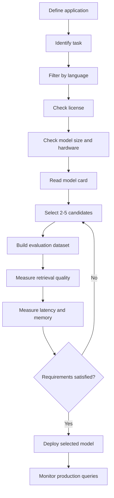
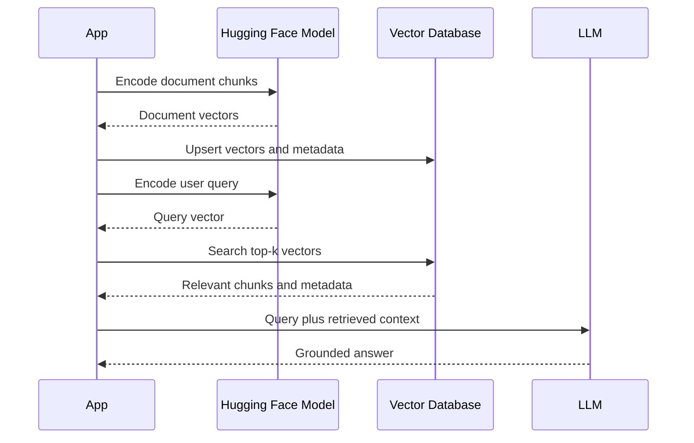

# 012 — Models on Hugging Face

**Course:** 03 — Knowledge Systems and RAG
**Module:** Module 08 — Embeddings and Vector Databases
**Content Group:** Embedding Models
**Roadmap Source:** Embeddings and Vector Databases / Embedding Models
**Lesson Type:** Embeddings and Vector Databases
**Order in Module:** 012
**Suggested Duration:** 24 minutes

---

## 1. Overview

This lesson explains how to discover, evaluate, and use **models hosted on Hugging Face**, especially embedding models used for:

* Semantic search
* Retrieval-Augmented Generation
* Recommendation systems
* Text clustering
* Duplicate detection
* Classification
* Reranking

Hugging Face is not a single AI model. It provides a model hub where organizations and individual developers can publish model repositories containing model weights, configuration files, tokenizers, documentation, evaluation results, and usage instructions.

Hugging Face models can be loaded through libraries such as:

* `transformers`
* `sentence-transformers`
* `diffusers`
* `timm`
* `huggingface_hub`

The Hub supports many machine-learning libraries and tasks rather than being limited to large language models.

For an AI Engineer, the main skill is not simply knowing how to download a model. The important skill is choosing a model that matches the application’s:

* Task
* Language
* Accuracy requirements
* Latency requirements
* Hardware limits
* License constraints
* Deployment environment

---

## 2. Learning Objectives

By the end of this lesson, you should be able to:

1. Explain what a Hugging Face model repository contains.
2. Find embedding models for semantic search and RAG.
3. Read and evaluate a model card.
4. Load a pretrained embedding model in Python.
5. Compare models using quality, latency, size, language, and license.
6. Connect a Hugging Face model to a vector database.
7. Identify common risks when selecting community models.
8. Build a small semantic-search demo for a portfolio project.

---

## 3. What Is a Model on Hugging Face?

A model on Hugging Face is usually stored inside a **model repository**.

A repository may contain:

```text
model-repository/
├── README.md
├── config.json
├── tokenizer.json
├── tokenizer_config.json
├── special_tokens_map.json
├── model.safetensors
└── additional model files
```

The exact files depend on the model architecture and library.

The repository name is called the **model ID**:

```text
organization-or-user/model-name
```

Example:

```text
sentence-transformers/all-MiniLM-L6-v2
```

This model ID can be passed directly to a supported library:

```python
from sentence_transformers import SentenceTransformer

model = SentenceTransformer(
    "sentence-transformers/all-MiniLM-L6-v2"
)
```

For Transformers models, the `from_pretrained()` method downloads and loads the model configuration and weights from the Hub. Hugging Face also prefers the `safetensors` format when it is available because it avoids some of the security risks associated with pickle-based weight files.

---

## 4. Hugging Face in an AI Application

A Hugging Face embedding model normally appears between text preprocessing and vector storage.



The document chunks and user query must normally be processed with the **same embedding model** and a compatible encoding strategy.

Changing the embedding model after indexing usually requires generating the document embeddings again.

---

## 5. Common Model Categories

The Hugging Face Hub contains models for many tasks. In a knowledge system, the most relevant categories include the following.

### 5.1 Dense Embedding Models

Dense embedding models convert text into fixed-length numerical vectors.

```text
"How does vector search work?"
          ↓
[0.018, -0.092, 0.143, ..., 0.027]
```

Documents with similar meanings should appear closer together in the vector space.

Typical applications include:

* Semantic search
* RAG retrieval
* Recommendation
* Clustering
* Intent matching
* Similarity detection

Sentence Transformers supports semantic similarity, semantic search, clustering, classification, and paraphrase mining.

---

### 5.2 Sparse Embedding Models

Sparse models produce vectors in which most dimensions are zero.

They are useful when exact keywords, names, product codes, or technical terms are important.

```text
Dense retrieval:
Finds conceptually related content.

Sparse retrieval:
Finds content with important lexical overlap.
```

A production search system may combine both methods:

```text
dense score + sparse score = hybrid retrieval score
```

---

### 5.3 Reranker Models

A reranker receives a query and a candidate document together and produces a relevance score.


Vector search is normally used for fast candidate generation. A reranker can then improve the ordering of those candidates.

---

### 5.4 Classification Models

Classification models assign labels to text.

Examples:

```text
Support message → billing
Support message → technical problem
Support message → account access
```

A classifier may be used before retrieval to:

* Select a knowledge base
* Detect the user’s domain
* Route a request to an agent
* Choose a prompt template
* Apply access-control policies

---

### 5.5 Generative Models

Generative models produce text rather than only vectors or labels.

In a RAG system, the embedding model retrieves information while the generative model writes the final answer.

```text
Embedding model:
Query → vector

Vector database:
Vector → relevant documents

Generative model:
Documents + query → final response
```

These components should not be treated as interchangeable.

---

## 6. Understanding the Model Card

Every serious model-selection process should begin with the model card.

A Hugging Face model card is generally stored as the repository’s `README.md`. It can document the intended use, limitations, training datasets, evaluation results, license, language, base model, supported library, and task metadata.

Before using a model, inspect the following fields.

### 6.1 Intended Task

Confirm that the model was trained for your task.

Do not assume that every Transformer checkpoint is a good embedding model.

A base language model may return hidden states, but that does not mean its sentence-level vectors will perform well for semantic search.

Look for tasks such as:

```text
sentence-similarity
feature-extraction
text-classification
text-generation
zero-shot-classification
```

---

### 6.2 Language Support

Check whether the model supports:

* English only
* Vietnamese
* Multiple languages
* Cross-lingual retrieval

For a Vietnamese application, test at least these query patterns:

```text
Vietnamese query → Vietnamese document
English query → English document
Vietnamese query → English document
English query → Vietnamese document
```

A multilingual model does not automatically guarantee equally strong performance for every supported language.

---

### 6.3 Model Size

Larger models often require more:

* Memory
* Storage
* Initialization time
* Inference time
* Compute capacity

However, model size alone does not determine retrieval quality.

A smaller model may be the better production choice when it provides acceptable relevance with much lower latency.

---

### 6.4 Embedding Dimension

An embedding model might produce vectors such as:

```text
384 dimensions
768 dimensions
1,024 dimensions
```

Higher dimensions increase vector-storage requirements.

Approximate raw storage for float32 vectors can be estimated as:

```text
storage = number_of_vectors × dimensions × 4 bytes
```

For example:

```text
1,000,000 vectors × 768 dimensions × 4 bytes
≈ 3.07 GB
```

This estimate excludes metadata, database indexes, replicas, and other operational overhead.

---

### 6.5 Maximum Input Length

Every model has an input-length limit.

When a text chunk exceeds that limit, it may be truncated.

This creates a dangerous failure mode:

```text
Original chunk:
2,000 tokens

Model limit:
512 tokens

Actual embedded content:
Only the accepted portion of the chunk
```

The retrieval system may appear operational while important information is silently excluded.

---

### 6.6 License

Check whether the license permits:

* Commercial use
* Redistribution
* Modification
* Hosted API deployment
* Internal enterprise use

A publicly downloadable model is not automatically unrestricted.

Record the license in the project documentation before shipping the model.

---

### 6.7 Evaluation Results

Check:

* Which benchmark was used?
* Which language was evaluated?
* Was the task symmetric or asymmetric?
* Was the model evaluated on a domain similar to yours?
* How does it compare with its memory and latency requirements?

Public benchmark performance should be treated as an initial signal, not proof that the model will work well on your own documents.

---

### 6.8 Limitations and Risks

A useful model card should explain:

* Unsupported use cases
* Known biases
* Weak languages or domains
* Training-data limitations
* Safety considerations
* Expected input format

Model cards are specifically designed to improve model discovery, reproducibility, documentation, and responsible use.

---

## 7. Model-Selection Workflow

Use the following process instead of choosing a model only because it is popular.



### Recommended Selection Criteria

| Criterion      | Question                                                    |
| -------------- | ----------------------------------------------------------- |
| Task           | Was the model trained for retrieval or sentence similarity? |
| Language       | Does it support the application’s languages?                |
| Retrieval type | Is the search symmetric or asymmetric?                      |
| Quality        | Does it retrieve the correct chunks on real queries?        |
| Latency        | Can it meet the response-time target?                       |
| Memory         | Can it run on the available CPU or GPU?                     |
| Dimension      | Is vector storage affordable?                               |
| Context length | Can it process the chosen chunk size?                       |
| License        | Is the intended deployment permitted?                       |
| Maintenance    | Is the repository documented and reproducible?              |
| Security       | Does loading require custom remote code?                    |

---

## 8. Symmetric and Asymmetric Search

Understanding the retrieval type helps you choose and use the correct model.

### 8.1 Symmetric Search

The query and documents have similar lengths and structures.

Examples:

```text
Question ↔ similar question
Sentence ↔ similar sentence
Product title ↔ similar product title
```

---

### 8.2 Asymmetric Search

The query is short while the document is longer.

Examples:

```text
Question → paragraph
Search phrase → documentation chunk
User request → knowledge-base article
```

RAG normally uses asymmetric search.

Sentence Transformers provides `encode_query()` and `encode_document()` methods for distinguishing queries from corpus documents. This is particularly useful for models trained with different query and document prompts. For models without such task-specific prompts, these methods may behave like the general `encode()` method.

---

## 9. Practical Demo: Semantic Search

### 9.1 Install Dependencies

```bash
pip install sentence-transformers numpy
```

---

### 9.2 Create a Small Corpus

```python
from __future__ import annotations

import numpy as np
from sentence_transformers import SentenceTransformer


documents = [
    {
        "id": "doc-1",
        "text": (
            "Vector databases store embeddings and support "
            "similarity-based retrieval."
        ),
    },
    {
        "id": "doc-2",
        "text": (
            "Chunking divides long documents into smaller units "
            "before embedding and indexing."
        ),
    },
    {
        "id": "doc-3",
        "text": (
            "A reranker evaluates query-document pairs and improves "
            "the ordering of retrieved candidates."
        ),
    },
    {
        "id": "doc-4",
        "text": (
            "Metadata can preserve the source file, page number, "
            "section title, and access permissions."
        ),
    },
]
```

---

### 9.3 Load an Embedding Model

```python
MODEL_ID = "sentence-transformers/all-MiniLM-L6-v2"

model = SentenceTransformer(MODEL_ID)
```

`SentenceTransformer` can load pretrained models using their Hugging Face model IDs. The Sentence Transformers documentation uses models such as `all-MiniLM-L6-v2` and `all-mpnet-base-v2` as examples of pretrained embedding models.

This model is suitable for learning and prototyping, but it should not automatically be considered the best model for every production application.

---

### 9.4 Generate Document Embeddings

```python
document_texts = [document["text"] for document in documents]

document_embeddings = model.encode_document(
    document_texts,
    normalize_embeddings=True,
    convert_to_numpy=True,
)

print(document_embeddings.shape)
```

Conceptually:

```text
document text
    ↓
tokenizer
    ↓
transformer
    ↓
pooling
    ↓
normalized embedding vector
```

---

### 9.5 Encode and Search a Query

```python
def search(
    query: str,
    top_k: int = 3,
) -> list[dict[str, object]]:
    if not query.strip():
        raise ValueError("The query must not be empty.")

    if top_k <= 0:
        raise ValueError("top_k must be greater than zero.")

    query_embedding = model.encode_query(
        [query],
        normalize_embeddings=True,
        convert_to_numpy=True,
    )[0]

    # Because the vectors are normalized, the dot product is
    # equivalent to cosine similarity.
    scores = document_embeddings @ query_embedding

    ranked_indexes = np.argsort(scores)[::-1][:top_k]

    return [
        {
            **documents[index],
            "score": float(scores[index]),
        }
        for index in ranked_indexes
    ]


results = search(
    "Why should I divide a PDF into smaller pieces?",
    top_k=2,
)

for result in results:
    print(
        f"{result['score']:.4f} | "
        f"{result['id']} | "
        f"{result['text']}"
    )
```

Expected ranking:

```text
1. Chunking divides long documents into smaller units...
2. Vector databases store embeddings...
```

The exact score may change depending on library and model versions.

---

## 10. Connecting the Model to a Vector Database

The in-memory NumPy example is useful for learning, but larger systems normally store embeddings in a vector index.



A vector record might look like this:

```json
{
  "id": "handbook-page-12-chunk-3",
  "vector": [0.018, -0.092, 0.143],
  "metadata": {
    "source": "employee-handbook.pdf",
    "page": 12,
    "section": "Annual Leave",
    "language": "en",
    "access_level": "employee"
  }
}
```

Metadata is essential for:

* Citations
* Filtering
* Access control
* Debugging
* Deduplication
* Reindexing
* Document deletion

---

## 11. Model Versioning and Reproducibility

Loading only by model ID may retrieve a newer repository revision in the future.

For reproducible systems, record:

```text
model ID
repository revision or commit
library version
embedding dimension
normalization setting
query encoding method
document encoding method
chunking configuration
distance metric
```

Example configuration:

```yaml
embedding:
  model_id: sentence-transformers/all-MiniLM-L6-v2
  revision: "<tested-revision>"
  normalize_embeddings: true
  query_method: encode_query
  document_method: encode_document

retrieval:
  metric: cosine
  top_k: 10

chunking:
  strategy: recursive
  target_tokens: 350
  overlap_tokens: 50
```

A change in model, revision, pooling, normalization, or encoding instructions can make new vectors incompatible with the existing index.

---

## 12. Evaluating an Embedding Model

Do not evaluate a retrieval system only by looking at one successful query.

Create a small evaluation dataset:

```json
[
  {
    "query": "How many annual leave days do employees receive?",
    "relevant_document_ids": ["policy-leave-01"]
  },
  {
    "query": "Can I work remotely from another country?",
    "relevant_document_ids": ["policy-remote-04"]
  }
]
```

### Useful Retrieval Metrics

#### Recall@k

Measures whether at least one relevant result appears in the top `k`.

```text
Relevant document appears in top 5
→ successful retrieval
```

#### Precision@k

Measures how many of the top `k` results are relevant.

#### Mean Reciprocal Rank

Rewards systems that place the first relevant result near the top.

```text
Relevant result at rank 1 → 1.0
Relevant result at rank 2 → 0.5
Relevant result at rank 5 → 0.2
```

#### NDCG

Measures ranking quality when documents have different relevance levels.

---

### Evaluation Table

| Model   | Recall@5 |  MRR | Avg. latency | Memory | Decision      |
| ------- | -------: | ---: | -----------: | -----: | ------------- |
| Model A |     0.86 | 0.74 |        18 ms |    Low | Good baseline |
| Model B |     0.91 | 0.81 |        52 ms | Medium | Best quality  |
| Model C |     0.88 | 0.77 |        24 ms |    Low | Best balance  |

The final model should be chosen according to the application’s requirements, not a single benchmark score.

---

## 13. Failure Cases to Test

A strong evaluation set should contain difficult cases.

### 13.1 Exact Identifiers

```text
KSOLM-226
ERR_AUTH_004
invoice number 87391
```

Dense embeddings may not handle exact identifiers as reliably as lexical search.

---

### 13.2 Negation

```text
Employees may work remotely.
Employees may not work remotely.
```

The sentences are lexically similar but have opposite meanings.

---

### 13.3 Dates and Numbers

```text
The deadline is July 12.
The deadline is July 21.
```

Embedding similarity may be high even though the factual difference is critical.

---

### 13.4 Multilingual Queries

```text
Query: "Chính sách nghỉ phép là gì?"
Document: "Annual Leave Policy"
```

Test cross-lingual retrieval directly rather than assuming it works.

---

### 13.5 Domain Vocabulary

```text
Placidus house system
JWT subject claim
vector quantization
Swiss Ephemeris
```

A general-purpose model may perform poorly on specialized terminology.

---

### 13.6 Similar but Incorrect Chunks

```text
Password reset policy
Password expiration policy
Password complexity policy
```

All chunks are related, but only one may answer the query.

---

## 14. Common Mistakes

### Mistake 1: Choosing the Most Downloaded Model

Popularity does not prove that a model fits your language, domain, hardware, or retrieval task.

**Better approach:** compare several candidates on your own evaluation set.

---

### Mistake 2: Ignoring the Model Card

A model may require special query prefixes, pooling logic, trust settings, or input formatting.

**Better approach:** read its intended-use and usage sections before implementation.

---

### Mistake 3: Using a Base Transformer as a Sentence Embedder

A raw Transformer checkpoint is not automatically optimized for semantic similarity.

**Better approach:** select a model explicitly trained and evaluated for embeddings or retrieval.

---

### Mistake 4: Mixing Embedding Models

```text
Documents embedded with Model A
Query embedded with Model B
```

The vectors do not share a meaningful coordinate space.

**Better approach:** use the same compatible model configuration for indexing and querying.

---

### Mistake 5: Ignoring Normalization

A system may normalize document vectors but not query vectors.

**Better approach:** use one documented normalization strategy and test it with the selected distance metric.

---

### Mistake 6: Ignoring Truncation

Chunks longer than the accepted input can lose content silently.

**Better approach:** measure chunk length after tokenization.

---

### Mistake 7: Storing Vectors Without Metadata

Without source metadata, the system cannot produce reliable citations or delete the vectors belonging to one document.

**Better approach:** store source, page, section, version, and permissions with each vector.

---

### Mistake 8: Trusting Public Benchmarks Alone

A high benchmark score may not transfer to your documents.

**Better approach:** create domain-specific queries and relevance labels.

---

### Mistake 9: Ignoring License Requirements

A model being available on the Hub does not automatically mean it can be used in every commercial product.

**Better approach:** review and record the repository’s license.

---

### Mistake 10: Loading Unreviewed Custom Code

Some repositories may require remote custom Python code.

**Better approach:** review the repository and avoid enabling remote code execution unless it is necessary and trusted.

---

## 15. Production Checklist

### Model Selection

* [ ] The model is designed for embeddings or retrieval.
* [ ] The required languages are supported.
* [ ] The license permits the intended use.
* [ ] The model fits the available hardware.
* [ ] The embedding dimension is acceptable.
* [ ] The maximum input length is understood.
* [ ] Query and document instructions are documented.

### Indexing

* [ ] Documents are cleaned before chunking.
* [ ] Chunk size has been tested.
* [ ] Chunk overlap has been tested.
* [ ] Embeddings are generated consistently.
* [ ] Metadata includes source and location.
* [ ] The model version is recorded.

### Retrieval

* [ ] Query and document vectors are compatible.
* [ ] The similarity metric matches the model setup.
* [ ] `top_k` is tuned using real queries.
* [ ] Metadata filters are tested.
* [ ] Hybrid retrieval has been considered.
* [ ] Reranking has been considered.

### Evaluation

* [ ] A labeled query set exists.
* [ ] Recall@k or MRR is measured.
* [ ] Multilingual queries are included.
* [ ] Exact identifiers are included.
* [ ] Negation and date cases are included.
* [ ] Latency and memory are measured.
* [ ] Failure cases are recorded.

### Operations

* [ ] Model initialization is monitored.
* [ ] Model files are cached appropriately.
* [ ] Reindexing procedures are documented.
* [ ] Index and model versions are connected.
* [ ] Sensitive metadata is protected.
* [ ] Production queries are sampled for evaluation.

---

## 16. Practical Exercise

Build a small semantic-search system using a Hugging Face embedding model.

### Requirements

1. Select between 5 and 10 Markdown or PDF documents.
2. Extract and clean the text.
3. Divide the documents into chunks.
4. Store these metadata fields:

```text
source
page or section
chunk index
language
```

5. Select at least two candidate embedding models.
6. Generate embeddings for every chunk.
7. Store the vectors in one of the following:

```text
FAISS
Chroma
Qdrant
```

8. Create at least 15 evaluation queries.
9. Record the top five results for each query.
10. Compare retrieval quality and latency.
11. Add citations to the generated answers.
12. Document at least five failure cases.

---

## 17. Suggested Portfolio Artifact

Create a repository with this structure:

```text
hugging-face-semantic-search/
├── README.md
├── data/
│   └── documents/
├── src/
│   ├── ingest.py
│   ├── chunk.py
│   ├── embed.py
│   ├── index.py
│   ├── search.py
│   └── evaluate.py
├── evaluation/
│   ├── queries.json
│   └── results.csv
├── config/
│   └── embedding.yaml
└── requirements.txt
```

The README should explain:

* Why the model was selected
* Which alternatives were tested
* How the text was chunked
* Which vector database was used
* How retrieval was evaluated
* Which failure cases remain
* How to reproduce the results

---

## 18. Completion Checklist

* [ ] I can explain Hugging Face models in one or two minutes.
* [ ] I understand the difference between a model repository and a model architecture.
* [ ] I can read a model card.
* [ ] I can load an embedding model using its model ID.
* [ ] I can explain symmetric and asymmetric retrieval.
* [ ] I can connect an embedding model to a vector database.
* [ ] I can compare models using quality, latency, memory, language, and license.
* [ ] I have tested retrieval with real queries.
* [ ] I have recorded at least one important limitation.
* [ ] I have created a small demo or portfolio artifact.

---

## 19. Related Outcome

Build semantic-search systems using:

* Embedding models
* Vector indexes
* Similarity search
* Metadata filtering
* Retrieval evaluation
* Citation-aware answer generation

---

## 20. Related Project

**Project 7: Semantic Search Engine**

Build a search engine for Markdown and PDF files using:

```text
document parsing
    ↓
chunking
    ↓
Hugging Face embedding model
    ↓
Chroma, Qdrant, or FAISS
    ↓
top-k retrieval
    ↓
optional reranking
    ↓
citation-aware answer
```

Possible extensions:

* Multilingual retrieval
* Hybrid dense and sparse search
* Cross-encoder reranking
* Query rewriting
* Retrieval evaluation dashboard
* Model-comparison benchmark
* Incremental document indexing
* Access-control filters

---

## 21. Summary

Models on Hugging Face provide reusable components for semantic search, RAG, classification, reranking, recommendation, and many other AI workflows.

For embedding applications, the correct workflow is:

```text
Define the task
    ↓
Find suitable model candidates
    ↓
Read their model cards
    ↓
Check language, license, size, and input limits
    ↓
Evaluate them on real queries
    ↓
Measure quality, latency, memory, and cost
    ↓
Select and version the model
    ↓
Index documents
    ↓
Monitor production failure cases
```

The most important lesson is:

> Do not select an embedding model only from its name, popularity, or public benchmark score. Select it by testing how well it retrieves the correct information for your actual users and documents.

Turn this lesson into a working semantic-search demo, an evaluation report, or a model-selection checklist so that the knowledge becomes part of a practical AI Engineering portfolio.

---

# Bài luyện tập

## Mục tiêu


## Đề bài


## Yêu cầu hoàn thành

- [ ] 
- [ ] 
- [ ] 

## Kết quả / lời giải


## Ghi chú
