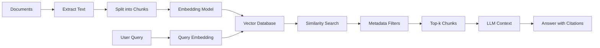
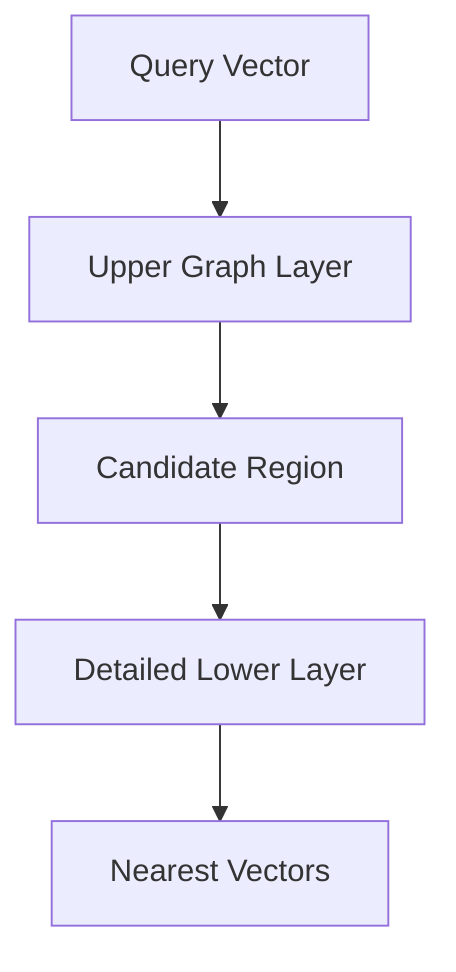
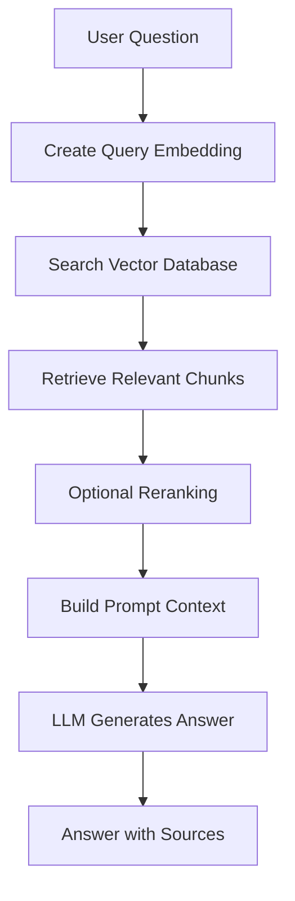
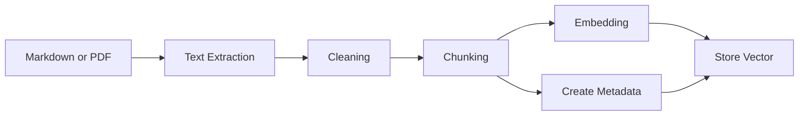
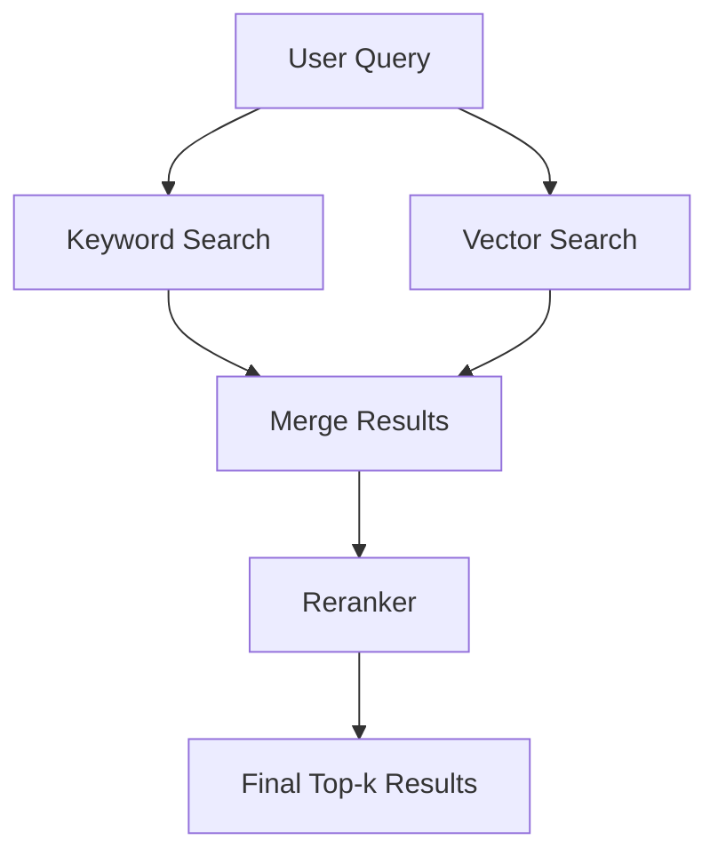
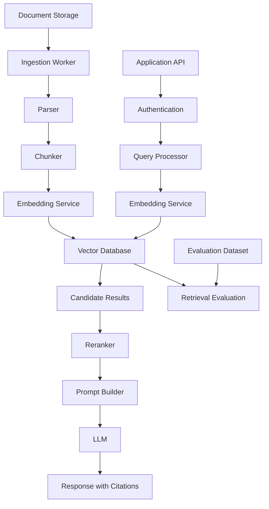

# 013 — Vector Databases

**Course:** 03 — Knowledge Systems and RAG
**Module:** Module 08 — Embeddings and Vector Databases
**Content Group:** Vector Databases
**Roadmap Source:** Embeddings and Vector Databases / Vector Databases
**Lesson Type:** Embeddings and Vector Databases
**Order in Module:** 013
**Suggested Duration:** 24 minutes

---

## 1. Overview

A **vector database** is a database designed to store, index, and search high-dimensional vectors.

In modern AI applications, text, images, audio, products, users, and documents can be converted into numerical vectors called **embeddings**. These embeddings capture semantic meaning.

A vector database allows an application to answer questions such as:

* Which documents are most similar to this question?
* Which products match this user's interests?
* Which support tickets describe the same problem?
* Which image is visually similar to this uploaded image?
* Which knowledge chunks should be sent to an LLM?

Vector databases are a core component of:

* Retrieval-Augmented Generation systems
* Semantic search engines
* Recommendation systems
* AI assistants
* Document question-answering applications
* Multimodal search
* Long-term memory systems for agents

---

## 2. Learning Objectives

By the end of this lesson, you should be able to:

* Explain what a vector database is in your own words.
* Describe how vectors are stored and retrieved.
* Understand similarity search and nearest-neighbor search.
* Explain where vector databases fit into a RAG pipeline.
* Distinguish vector search from keyword search.
* Use metadata filters with semantic retrieval.
* Understand important design choices such as `top-k`, index type, recall, latency, and update strategy.
* Build a small semantic search demo.
* Identify common vector retrieval failure cases.
* Evaluate retrieval quality using a test dataset.

---

## 3. What Is a Vector Database?

A vector database stores objects as numerical vectors and retrieves the vectors that are closest to a query vector.

For example, an embedding model may convert these sentences into vectors:

```text
"How do I reset my password?"
    -> [0.17, -0.42, 0.81, ...]

"I forgot my login password."
    -> [0.19, -0.39, 0.79, ...]

"What is the weather today?"
    -> [-0.55, 0.12, 0.08, ...]
```

The first two vectors will usually be closer to each other because their meanings are similar.

A vector database can therefore retrieve semantically related content even when the exact words are different.

---

## 4. Why Traditional Keyword Search Is Not Enough

Traditional keyword search looks for exact words or related lexical forms.

Consider this query:

```text
How can I recover access to my account?
```

A relevant document might say:

```text
Steps for resetting a forgotten password
```

The query and document do not share many exact words, but their meanings are closely related.

A semantic search system can understand this relationship because both pieces of text are represented as similar vectors.

### Keyword Search vs. Vector Search

| Feature                            | Keyword Search           | Vector Search                              |
| ---------------------------------- | ------------------------ | ------------------------------------------ |
| Main matching method               | Exact words and tokens   | Semantic similarity                        |
| Handles synonyms                   | Limited                  | Usually strong                             |
| Handles natural-language questions | Limited                  | Strong                                     |
| Supports exact IDs and names       | Strong                   | Sometimes weak                             |
| Best for                           | Exact matching           | Meaning-based retrieval                    |
| Example                            | Search for `"error 503"` | Search for similar infrastructure failures |

In production systems, keyword search and vector search are often combined using **hybrid search**.

---

## 5. How Vector Search Works

The general workflow is:

```text
Document
   ↓
Text extraction
   ↓
Chunking
   ↓
Embedding model
   ↓
Vector + metadata
   ↓
Vector database
```

When a user submits a query:

```text
User query
   ↓
Query embedding
   ↓
Similarity search
   ↓
Metadata filtering
   ↓
Top-k results
   ↓
LLM or application
```

### Complete Retrieval Flow



---

## 6. What Is Stored in a Vector Database?

A vector database usually stores more than the embedding itself.

A typical record may contain:

```json
{
  "id": "document_12_chunk_4",
  "vector": [0.123, -0.481, 0.772],
  "text": "Vector databases support semantic similarity search.",
  "metadata": {
    "document_id": "document_12",
    "source": "vector-databases.md",
    "page": 3,
    "section": "Similarity Search",
    "language": "en",
    "category": "rag",
    "created_at": "2026-07-24"
  }
}
```

The main fields are:

| Field      | Purpose                                                                    |
| ---------- | -------------------------------------------------------------------------- |
| `id`       | Uniquely identifies the vector record                                      |
| `vector`   | Stores the embedding                                                       |
| `text`     | Stores the original chunk or associated content                            |
| `metadata` | Stores searchable attributes such as source, page, user, date, or category |

Metadata is especially important for:

* Citations
* Access control
* Tenant isolation
* Language filtering
* Date filtering
* Document deletion
* Source tracking
* Debugging retrieval results

---

## 7. Similarity Metrics

A vector database needs a method for measuring how close two vectors are.

The most common metrics are:

### 7.1 Cosine Similarity

Cosine similarity measures the angle between two vectors.

[
\text{cosine similarity}(A,B)
=============================

\frac{A \cdot B}{|A||B|}
]

A higher value normally means greater similarity.

Cosine similarity is commonly used for text embeddings because it focuses on vector direction rather than magnitude.

---

### 7.2 Dot Product

The dot product is calculated as:

[
A \cdot B = \sum_{i=1}^{n} A_iB_i
]

It is efficient and is commonly used when the embedding model was trained for dot-product similarity.

---

### 7.3 Euclidean Distance

Euclidean distance measures the straight-line distance between two vectors:

[
d(A,B)
======

\sqrt{\sum_{i=1}^{n}(A_i-B_i)^2}
]

A smaller distance means the vectors are closer.

---

### Choosing a Metric

Use the metric recommended by the embedding model.

Do not assume that every embedding model should use the same distance metric.

```text
Embedding model documentation
            ↓
Recommended similarity metric
            ↓
Vector index configuration
```

---

## 8. Nearest-Neighbor Search

The goal of vector retrieval is to find the vectors nearest to the query vector.

This process is called **nearest-neighbor search**.

### Exact Nearest-Neighbor Search

Exact search compares the query against every stored vector.

Advantages:

* High accuracy
* Simple behavior
* Useful for small datasets

Disadvantages:

* Slow for large datasets
* Expensive when millions of vectors are stored

---

### Approximate Nearest-Neighbor Search

Approximate Nearest Neighbor, or **ANN**, algorithms search a smaller candidate space instead of comparing every vector.

Advantages:

* Fast retrieval
* Scales to large datasets
* Suitable for production search

Disadvantages:

* May miss some truly relevant vectors
* Requires index configuration
* Creates trade-offs between speed and recall

---

## 9. Common Vector Index Types

### 9.1 Flat Index

A flat index performs exhaustive comparison.

```text
Query vector
    ├── Compare with vector 1
    ├── Compare with vector 2
    ├── Compare with vector 3
    └── Compare with every vector
```

Best for:

* Small datasets
* Evaluation baselines
* High-accuracy requirements

---

### 9.2 HNSW

**Hierarchical Navigable Small World** creates a graph connecting nearby vectors.



HNSW generally provides:

* High recall
* Low query latency
* Good performance for online search
* Memory usage higher than some compressed indexes

Important parameters commonly include:

* Graph connectivity
* Construction search depth
* Query search depth

Increasing search depth often improves recall but also increases latency.

---

### 9.3 IVF

**Inverted File Index**, or IVF, groups vectors into clusters.

```text
All vectors
   ├── Cluster A
   ├── Cluster B
   ├── Cluster C
   └── Cluster D
```

During retrieval, the system searches only the most relevant clusters.

IVF can reduce search cost but requires decisions about:

* Number of clusters
* Number of clusters searched
* Training data
* Recall and latency balance

---

### 9.4 Product Quantization

Product Quantization compresses vectors to reduce memory usage.

It is useful when:

* The collection contains millions or billions of vectors.
* Memory usage is a major constraint.
* Some accuracy loss is acceptable.

---

## 10. Important Retrieval Concepts

### 10.1 Top-k

`top-k` controls how many results are returned.

```python
top_k = 5
```

A very small `top-k` may miss important context.

A very large `top-k` may:

* Add irrelevant content
* Increase token usage
* Confuse the LLM
* Increase latency
* Increase API cost

A practical starting point is often between 3 and 10 results, but the correct value must be measured for the application.

---

### 10.2 Similarity Threshold

A similarity threshold removes results that are not sufficiently relevant.

```python
if result.score >= 0.75:
    selected_results.append(result)
```

However, similarity scores are not always directly comparable across:

* Different embedding models
* Different datasets
* Different distance metrics
* Different vector database implementations

The threshold should therefore be calibrated using real test queries.

---

### 10.3 Recall

Recall measures how many relevant results were successfully retrieved.

[
\text{Recall}
=============

\frac{\text{Relevant items retrieved}}
{\text{Total relevant items}}
]

For example:

```text
Relevant chunks in dataset: 5
Relevant chunks retrieved: 4

Recall = 4 / 5 = 0.8
```

---

### 10.4 Latency

Latency is the amount of time required to execute retrieval.

Important contributors include:

* Query embedding time
* Network latency
* Vector index search time
* Metadata filtering
* Reranking
* Database load
* Number of requested results

---

### 10.5 Precision

Precision measures how many retrieved results are actually relevant.

[
\text{Precision}
================

\frac{\text{Relevant items retrieved}}
{\text{Total items retrieved}}
]

High recall with low precision means the system retrieves the correct information but also includes too much irrelevant content.

---

## 11. Metadata Filtering

Semantic similarity alone is not always enough.

Suppose a system stores documents for multiple users. A query should only retrieve documents belonging to the authenticated user.

```python
filters = {
    "user_id": authenticated_user.id,
    "language": "en",
    "document_type": "manual"
}
```

The retrieval operation may conceptually look like:

```python
results = vector_database.search(
    vector=query_vector,
    top_k=5,
    filters={
        "user_id": authenticated_user.id,
        "language": "en"
    }
)
```

### Examples of Useful Metadata Filters

```json
{
  "user_id": "user_123",
  "organization_id": "company_7",
  "language": "en",
  "document_type": "policy",
  "published_year": 2026,
  "access_level": "internal"
}
```

### Security Principle

Do not trust sensitive identity filters supplied directly by the client.

For example, the server should derive `user_id` or `organization_id` from the authenticated session or token.

```text
Authenticated token
       ↓
Server resolves user ID
       ↓
Server constructs metadata filter
       ↓
Vector search
```

---

## 12. Vector Databases in RAG

A vector database is commonly used as the retrieval layer in a RAG system.



The vector database does not usually generate the final answer.

Its job is to return relevant information that another component, such as an LLM, can use.

---

## 13. Basic Ingestion Pipeline

The ingestion pipeline prepares data for retrieval.



### Example Pseudocode

```python
documents = load_documents("knowledge/")

for document in documents:
    chunks = split_text(
        document.text,
        chunk_size=500,
        overlap=80,
    )

    for index, chunk in enumerate(chunks):
        vector = embedding_model.embed(chunk)

        vector_database.upsert(
            id=f"{document.id}:{index}",
            vector=vector,
            text=chunk,
            metadata={
                "document_id": document.id,
                "source": document.filename,
                "chunk_index": index,
            },
        )
```

---

## 14. Basic Retrieval Pipeline

```python
def retrieve(query: str, top_k: int = 5):
    query_vector = embedding_model.embed(query)

    results = vector_database.search(
        vector=query_vector,
        top_k=top_k,
        filters={
            "language": "en",
        },
    )

    return results
```

A result may look like:

```json
{
  "id": "guide.md:7",
  "score": 0.87,
  "text": "HNSW is a graph-based approximate nearest-neighbor index.",
  "metadata": {
    "source": "guide.md",
    "section": "Index Types",
    "chunk_index": 7
  }
}
```

---

## 15. Minimal Example with an In-Memory Index

The following example demonstrates the core idea without requiring a production vector database.

```python
from dataclasses import dataclass
from typing import Callable

import numpy as np


@dataclass
class VectorRecord:
    record_id: str
    text: str
    vector: np.ndarray
    metadata: dict[str, object]


def cosine_similarity(vector_a: np.ndarray, vector_b: np.ndarray) -> float:
    denominator = np.linalg.norm(vector_a) * np.linalg.norm(vector_b)

    if denominator == 0:
        return 0.0

    return float(np.dot(vector_a, vector_b) / denominator)


class SimpleVectorStore:
    def __init__(self) -> None:
        self.records: list[VectorRecord] = []

    def add(
        self,
        record_id: str,
        text: str,
        vector: list[float],
        metadata: dict[str, object] | None = None,
    ) -> None:
        self.records.append(
            VectorRecord(
                record_id=record_id,
                text=text,
                vector=np.asarray(vector, dtype=np.float32),
                metadata=metadata or {},
            )
        )

    def search(
        self,
        query_vector: list[float],
        top_k: int = 3,
        metadata_filter: Callable[[dict[str, object]], bool] | None = None,
    ) -> list[tuple[VectorRecord, float]]:
        query = np.asarray(query_vector, dtype=np.float32)
        scored_records: list[tuple[VectorRecord, float]] = []

        for record in self.records:
            if metadata_filter and not metadata_filter(record.metadata):
                continue

            score = cosine_similarity(query, record.vector)
            scored_records.append((record, score))

        scored_records.sort(key=lambda item: item[1], reverse=True)
        return scored_records[:top_k]


store = SimpleVectorStore()

store.add(
    record_id="chunk-1",
    text="Vector databases store and search embeddings.",
    vector=[0.90, 0.10, 0.20],
    metadata={"topic": "vector-database"},
)

store.add(
    record_id="chunk-2",
    text="Relational databases organize data into tables.",
    vector=[0.20, 0.85, 0.10],
    metadata={"topic": "relational-database"},
)

store.add(
    record_id="chunk-3",
    text="Semantic search retrieves documents by meaning.",
    vector=[0.88, 0.15, 0.24],
    metadata={"topic": "vector-database"},
)

results = store.search(
    query_vector=[0.92, 0.12, 0.18],
    top_k=2,
    metadata_filter=lambda metadata: (
        metadata.get("topic") == "vector-database"
    ),
)

for record, score in results:
    print(f"{score:.3f} — {record.text}")
```

Expected output:

```text
0.999 — Vector databases store and search embeddings.
0.998 — Semantic search retrieves documents by meaning.
```

In a real application, the vectors would be created by an embedding model rather than written manually.

---

## 16. Vector Database Operations

A production vector database normally supports several core operations.

### Insert

Add a new vector record.

```python
database.insert(
    id="chunk-101",
    vector=embedding,
    metadata={"source": "manual.pdf"},
)
```

### Upsert

Insert the record if it does not exist, or update it if it already exists.

```python
database.upsert(
    id="chunk-101",
    vector=new_embedding,
    metadata={"source": "manual-v2.pdf"},
)
```

### Search

Retrieve the nearest vectors.

```python
results = database.search(
    vector=query_embedding,
    top_k=5,
)
```

### Delete

Remove records associated with a deleted or replaced document.

```python
database.delete(
    filters={"document_id": "manual-12"}
)
```

### Update Metadata

Modify metadata without necessarily recomputing the embedding.

```python
database.update_metadata(
    id="chunk-101",
    metadata={"access_level": "public"},
)
```

---

## 17. Update and Deletion Strategy

A vector database must remain synchronized with the original data source.

When a document changes:

```text
Document updated
      ↓
Find vectors by document_id
      ↓
Delete or replace old chunks
      ↓
Chunk the new document
      ↓
Generate new embeddings
      ↓
Upsert new vector records
```

A good record ID should be deterministic.

For example:

```python
record_id = f"{document_id}:{document_version}:{chunk_index}"
```

A content hash can also help detect whether a chunk has changed.

```python
import hashlib


def create_content_hash(text: str) -> str:
    return hashlib.sha256(text.encode("utf-8")).hexdigest()
```

---

## 18. Chunking and Vector Databases

Retrieval quality strongly depends on chunking quality.

### Chunks That Are Too Large

Possible problems:

* Multiple topics appear in one vector.
* Retrieved context contains irrelevant information.
* More LLM tokens are consumed.
* Citations become less precise.

### Chunks That Are Too Small

Possible problems:

* Important context is separated.
* The retrieved text may be incomplete.
* Many results are needed to answer one question.
* Meaning may become ambiguous.

### Practical Starting Point

For general documents, an initial experiment might use:

```text
Chunk size: 300–700 tokens
Overlap: 10–20%
Top-k: 3–8
```

These values are starting points, not universal rules.

The final configuration should be chosen through evaluation.

---

## 19. Hybrid Search

Vector search is good at semantic similarity, while keyword search is good at exact matching.

Hybrid search combines both.



Hybrid search is especially useful for:

* Product codes
* Error messages
* Legal clause numbers
* Personal names
* API identifiers
* Technical acronyms
* Semantic natural-language questions

Example:

```text
Query: "KSOLM-226 cache expiration bug"

Keyword search:
- Finds the exact issue ID.

Vector search:
- Finds semantically similar cache expiration problems.

Hybrid search:
- Uses both signals.
```

---

## 20. Reranking

The first vector search is often optimized for speed rather than perfect relevance.

A reranker can examine the query and each candidate more carefully.

```text
Vector search returns top 30
            ↓
Reranker scores 30 candidates
            ↓
Return final top 5
```

This architecture can improve precision:

```python
candidates = vector_database.search(
    vector=query_vector,
    top_k=30,
)

reranked_results = reranker.rank(
    query=query,
    documents=[item.text for item in candidates],
)

final_results = reranked_results[:5]
```

The trade-off is additional latency and cost.

---

## 21. Common Vector Database Options

Different systems are appropriate for different environments.

| System Type                   | Examples of Use                                       |
| ----------------------------- | ----------------------------------------------------- |
| Local vector library          | Experiments, notebooks, local prototypes              |
| Embedded vector database      | Small applications and local RAG                      |
| Self-hosted vector service    | Infrastructure control and private deployments        |
| Managed vector service        | Production applications with reduced operational work |
| Relational database extension | Applications already using a relational database      |

Common technologies include:

* FAISS
* Chroma
* Qdrant
* Milvus
* Weaviate
* Pinecone
* pgvector
* Elasticsearch or OpenSearch vector search

The correct choice depends on:

* Dataset size
* Query volume
* Update frequency
* Deployment environment
* Metadata filtering requirements
* Backup requirements
* Operational experience
* Security and compliance
* Expected latency
* Budget

---

## 22. Vector Database Selection Checklist

Before choosing a vector database, answer these questions:

### Data

* How many vectors will be stored?
* What is the vector dimension?
* How quickly will the dataset grow?
* How frequently will records be updated or deleted?

### Search

* What query latency is acceptable?
* What recall level is required?
* Is hybrid search required?
* Is reranking required?
* Are metadata filters complex?

### Infrastructure

* Should the system run locally, in the cloud, or on-premises?
* Does the team want a managed service?
* Are backups and replication required?
* Is horizontal scaling required?

### Security

* Does the system contain private user data?
* Is tenant isolation required?
* Must data remain in a specific region?
* How will access permissions be enforced?

### Cost

* What is the storage cost?
* What is the query cost?
* What is the network cost?
* What engineering effort is required to operate the system?

---

## 23. Evaluation Dataset

Do not evaluate retrieval only by reading a few results and deciding that they “look good.”

Create a structured test dataset.

```json
[
  {
    "query": "What is an HNSW index?",
    "expected_sources": [
      "vector-indexes.md"
    ],
    "expected_sections": [
      "HNSW"
    ]
  },
  {
    "query": "How should deleted documents be removed?",
    "expected_sources": [
      "data-lifecycle.md"
    ],
    "expected_sections": [
      "Deletion Strategy"
    ]
  }
]
```

For each query, record:

* Retrieved result IDs
* Retrieval scores
* Source documents
* Chunk positions
* Whether the expected source appeared
* Whether the answer was supported
* Latency
* Failure reason

---

## 24. Retrieval Evaluation Metrics

### Hit Rate at k

A hit occurs when at least one relevant result appears in the top `k`.

[
\text{Hit Rate@k}
=================

\frac{\text{Queries with a relevant result in top-k}}
{\text{Total queries}}
]

---

### Recall at k

Recall at `k` measures how many expected relevant chunks appear in the first `k` results.

---

### Mean Reciprocal Rank

Mean Reciprocal Rank rewards systems that place the first relevant result near the top.

[
\text{Reciprocal Rank}
======================

\frac{1}{\text{Rank of first relevant result}}
]

For example:

```text
First relevant result appears at position 1 -> 1.0
First relevant result appears at position 2 -> 0.5
First relevant result appears at position 4 -> 0.25
```

---

### End-to-End Answer Quality

Retrieval metrics alone are not sufficient.

Also evaluate whether the final generated answer:

* Is correct
* Uses the retrieved evidence
* Includes accurate citations
* Avoids unsupported claims
* Clearly says when the information is unavailable

---

## 25. Common Failure Cases

### 25.1 Relevant Information Is Not Retrieved

Possible causes:

* Poor chunk boundaries
* Wrong embedding model
* Incorrect similarity metric
* `top-k` is too small
* Important metadata filter is incorrect
* ANN index recall is too low
* Query and documents use different languages

---

### 25.2 Results Are Semantically Similar but Not Useful

For example, the query asks about deleting vectors, but the system retrieves general database deletion documentation.

Possible solutions:

* Add metadata filters
* Use hybrid search
* Add a reranker
* Improve document titles and section metadata
* Rewrite the query before retrieval

---

### 25.3 Wrong User's Data Is Retrieved

Possible causes:

* Missing tenant filter
* Client-controlled `user_id`
* Incorrect namespace configuration
* Shared collection without access control

This is a serious security issue.

The authenticated server identity must control retrieval filters.

---

### 25.4 Citations Cannot Be Generated

Possible causes:

* Source metadata was not stored
* Page numbers were lost during extraction
* Chunks do not have document IDs
* The application only stores vectors, not source text

Always store enough metadata to trace a result back to its source.

---

### 25.5 Updated Documents Return Old Content

Possible causes:

* Old vectors were not deleted
* Record IDs are inconsistent
* Cache was not invalidated
* Document versions were not tracked

Use a clear indexing and synchronization strategy.

---

## 26. Production Architecture



---

## 27. Production Checklist

### Ingestion

* Use deterministic document and chunk IDs.
* Store source, page, section, and chunk metadata.
* Track document versions.
* Handle duplicate documents.
* Record the embedding model and model version.
* Delete stale vectors when documents change.

### Retrieval

* Use the same embedding model for indexing and querying.
* Use the similarity metric recommended by the model.
* Apply server-controlled access filters.
* Measure different `top-k` values.
* Consider hybrid search.
* Add reranking when precision is insufficient.

### Evaluation

* Build a test question dataset.
* Measure recall, precision, and latency.
* Record failed queries.
* Test synonyms and paraphrases.
* Test exact names, IDs, and technical terms.
* Evaluate final answers and citations.

### Operations

* Monitor query latency.
* Monitor indexing failures.
* Back up important data.
* Track database size.
* Log retrieval IDs and scores.
* Protect sensitive metadata.
* Plan migration when changing embedding models.

---

## 28. Practical Exercise

Build a small semantic search system using 5–10 documents.

### Step 1: Prepare Documents

Choose a small collection such as:

* Markdown notes
* API documentation
* Product manuals
* Course lessons
* PDF documents
* Internal project specifications

---

### Step 2: Create Test Questions

Write at least 10 questions before building the retrieval pipeline.

Example:

```json
[
  {
    "query": "What is cosine similarity?",
    "expected_source": "similarity-metrics.md"
  },
  {
    "query": "How does metadata filtering protect user data?",
    "expected_source": "security.md"
  }
]
```

---

### Step 3: Build the Ingestion Pipeline

```text
documents
   → text extraction
   → chunking
   → embeddings
   → vector database
```

Record:

* Chunk size
* Chunk overlap
* Embedding model
* Vector dimension
* Index type
* Metadata fields

---

### Step 4: Run Retrieval

For every test question, save:

```json
{
  "query": "What is cosine similarity?",
  "top_k": 5,
  "results": [
    {
      "rank": 1,
      "source": "similarity-metrics.md",
      "score": 0.89
    }
  ]
}
```

---

### Step 5: Compare Configurations

Run at least three experiments.

| Experiment | Chunk Size | Overlap | Top-k | Notes         |
| ---------- | ---------: | ------: | ----: | ------------- |
| A          |        300 |      50 |     3 | Baseline      |
| B          |        500 |      80 |     5 | More context  |
| C          |        800 |     100 |     8 | Larger chunks |

Evaluate which configuration gives the best balance of:

* Recall
* Precision
* Latency
* Context size
* Citation quality

---

### Step 6: Document Failure Cases

For each failure, record:

```text
Query:
Expected result:
Actual result:
Possible cause:
Proposed fix:
```

Example:

```text
Query:
How are old document vectors removed?

Expected result:
The deletion strategy section.

Actual result:
A general section about inserting vectors.

Possible cause:
Both sections repeatedly use the phrase "vector records."

Proposed fix:
Add section-title metadata and use hybrid retrieval.
```

---

## 29. Mini Portfolio Project

### Project: Semantic Search Engine for Markdown and PDF Files

Build an application that:

1. Accepts Markdown and PDF files.
2. Extracts and cleans text.
3. Splits text into chunks.
4. Generates embeddings.
5. Stores vectors and metadata.
6. Accepts natural-language queries.
7. Returns the most relevant chunks.
8. Displays source citations.
9. Records retrieval latency and scores.
10. Includes a small evaluation dataset.

### Suggested Stack

```text
Frontend:
Simple web interface or command-line interface

Backend:
Python + FastAPI

Document processing:
Markdown parser + PDF text extraction

Embedding:
Local or hosted embedding model

Vector storage:
Chroma, Qdrant, FAISS, or pgvector

Evaluation:
JSON test dataset + Python evaluation script
```

### Suggested API

```http
POST /documents
POST /documents/{document_id}/index
POST /search
DELETE /documents/{document_id}
GET /health
GET /metrics
```

### Example Search Request

```json
{
  "query": "How does HNSW improve search performance?",
  "top_k": 5,
  "filters": {
    "language": "en"
  }
}
```

### Example Search Response

```json
{
  "query": "How does HNSW improve search performance?",
  "latency_ms": 42,
  "results": [
    {
      "id": "vector-indexes.md:12",
      "score": 0.91,
      "text": "HNSW organizes vectors into a multilayer graph...",
      "citation": {
        "source": "vector-indexes.md",
        "section": "HNSW",
        "chunk_index": 12
      }
    }
  ]
}
```

---

## 30. Common Mistakes

### Mistake 1: Choosing Chunk Sizes Without Evaluation

Do not choose a chunk size only because it is commonly used in tutorials.

Measure retrieval quality on your own documents.

---

### Mistake 2: Storing Vectors Without Source Metadata

Without source information, the application cannot generate reliable citations or debug retrieval results.

---

### Mistake 3: Evaluating RAG by Feeling

A few good-looking answers do not prove that the system works.

Use a fixed test dataset and repeatable metrics.

---

### Mistake 4: Using Different Embedding Models

Documents and queries must be embedded into the same vector space.

```text
Documents: Model A
Queries: Model B
Result: Invalid similarity comparison
```

---

### Mistake 5: Returning Too Many Chunks

More retrieved context does not always produce a better answer.

Too much context can introduce irrelevant or conflicting information.

---

### Mistake 6: Ignoring Data Updates

A vector index can become stale when the original documents are edited or deleted.

---

### Mistake 7: Trusting Client-Supplied Access Filters

The server must enforce user and organization filters based on authenticated identity.

---

## 31. Completion Checklist

* [ ] I can explain vector databases in one or two minutes.
* [ ] I understand how embeddings are stored and searched.
* [ ] I can explain cosine similarity, dot product, and Euclidean distance.
* [ ] I understand exact and approximate nearest-neighbor search.
* [ ] I can explain `top-k`, recall, precision, and latency.
* [ ] I know why metadata is required for citations and access control.
* [ ] I understand where vector databases fit into a RAG pipeline.
* [ ] I have created a small semantic search demo.
* [ ] I have evaluated retrieval using a fixed test dataset.
* [ ] I have documented at least one retrieval failure case.
* [ ] I understand at least one limitation of vector search.
* [ ] I can explain when hybrid search or reranking may be useful.

---

## 32. Key Outcome

After completing this lesson, you should be able to build a basic semantic search system using:

```text
Documents
   → Chunking
   → Embeddings
   → Vector Index
   → Similarity Search
   → Top-k Results
   → Citations
```

You should also understand that a production-ready retrieval system requires more than storing vectors. It requires:

* Good chunking
* Reliable metadata
* Access control
* Evaluation
* Update handling
* Latency monitoring
* Failure analysis

---

## 33. Summary

A **vector database** stores embeddings and retrieves the vectors that are closest to a query.

It enables applications to search by meaning rather than only by exact words.

The core workflow is:

```text
text
  → chunks
  → embeddings
  → vector database
  → query embedding
  → similarity search
  → top-k results
```

Important design decisions include:

* Embedding model
* Similarity metric
* Chunking strategy
* Index type
* Metadata structure
* `top-k`
* Similarity threshold
* Recall and latency
* Update and deletion strategy
* Hybrid search
* Reranking
* Security filters

A vector database becomes valuable when it is integrated into a complete, measurable retrieval workflow rather than treated as an isolated storage component.

---

# Bài luyện tập

## Mục tiêu


## Đề bài


## Yêu cầu hoàn thành

- [ ] 
- [ ] 
- [ ] 

## Kết quả / lời giải


## Ghi chú
