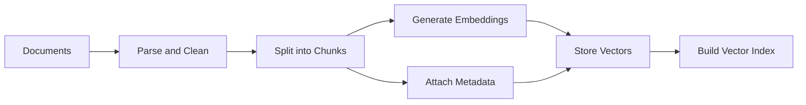
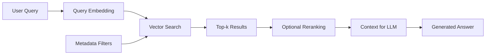
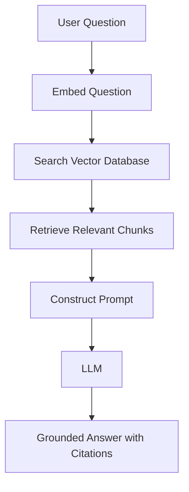
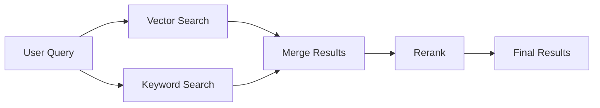
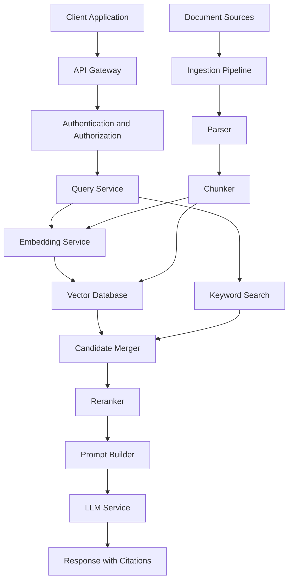

# 014 — Purpose and Functionality of Vector Databases

**Course:** 03 — Knowledge Systems and RAG
**Module:** Module 08 — Embeddings and Vector Databases
**Content Group:** Vector Databases
**Roadmap Source:** Embeddings and Vector Databases / Vector Databases
**Lesson Type:** Embeddings and Vector DB
**Lesson Order:** 014
**Suggested Duration:** 24 minutes

---

## 1. Overview

This lesson explains the **purpose and functionality of vector databases** in modern AI engineering.

Traditional databases are designed to retrieve data using exact conditions such as:

```sql
WHERE category = 'machine_learning'
```

A vector database solves a different problem. It retrieves information based on **semantic similarity**, even when the query and the stored content do not contain the same words.

For example:

* Stored text: `How to reset a forgotten password`
* User query: `I cannot access my account`

A keyword search may not detect a strong match. A vector search can recognize that the two texts express related meanings.

Vector databases are commonly used in:

* Semantic search
* Retrieval-Augmented Generation
* Recommendation systems
* Document discovery
* Image and audio search
* Duplicate detection
* AI agent memory
* Classification and clustering workflows

By the end of this lesson, you should understand why vector databases are needed, how they work, and where they belong in an AI application.

---

## 2. Learning Objectives

After completing this lesson, you should be able to:

* Explain the main purpose of a vector database.
* Describe how vector databases store and retrieve embeddings.
* Distinguish vector search from traditional keyword search.
* Identify the role of vector databases in a RAG pipeline.
* Explain the relationship between chunks, embeddings, metadata, indexes, and similarity metrics.
* Build a small semantic search workflow.
* Evaluate retrieval quality using realistic queries and failure cases.
* Identify important production considerations such as latency, filtering, cost, security, and observability.

---

## 3. What Is the Purpose of a Vector Database?

The primary purpose of a vector database is to:

> Store high-dimensional vectors and retrieve the vectors that are most similar to a query vector.

A vector is usually produced by an embedding model. The embedding represents the meaning or characteristics of an object such as:

* A sentence
* A document
* A product
* An image
* An audio segment
* A source-code function
* A user profile

Instead of comparing raw text, a vector database compares numerical representations.

### Example

Suppose an embedding model converts three sentences into vectors:

```text
"How do I reset my password?"       -> [0.12, 0.87, 0.43, ...]
"I forgot my account password."     -> [0.15, 0.84, 0.40, ...]
"What is the weather today?"        -> [0.91, 0.08, 0.22, ...]
```

The first two vectors will usually be closer to each other because their meanings are similar.

A vector database makes it possible to search millions or billions of these vectors efficiently.

---

## 4. Why Not Use a Traditional Database?

Traditional databases remain important. They are excellent for structured operations such as:

* Looking up a user by ID
* Filtering orders by date
* Calculating total revenue
* Joining relational tables
* Enforcing transactions and constraints

However, they are not naturally designed to answer questions such as:

* Which documents have a similar meaning to this question?
* Which products are most relevant to this user's preferences?
* Which support tickets describe the same problem?
* Which image looks most similar to this image?
* Which past memory is relevant to the current conversation?

These tasks require approximate similarity rather than exact matching.

### Comparison

| Capability                          | Traditional Database                         | Vector Database                     |
| ----------------------------------- | -------------------------------------------- | ----------------------------------- |
| Exact lookup                        | Excellent                                    | Possible but not the main purpose   |
| Structured filtering                | Excellent                                    | Usually supported through metadata  |
| Semantic similarity                 | Limited                                      | Core capability                     |
| Keyword search                      | Supported directly or through search engines | Usually combined with vector search |
| High-dimensional vectors            | Not always optimized                         | Optimized                           |
| Approximate nearest-neighbor search | Usually limited                              | Core functionality                  |
| RAG retrieval                       | Possible but inconvenient                    | Common use case                     |
| Transactions                        | Often strong                                 | Varies by product                   |

A production system often uses both:

```text
Relational database -> users, permissions, payments, transactions
Vector database     -> embeddings, semantic retrieval, recommendations
Object storage      -> original PDFs, images, audio, and large files
```

---

## 5. Core Functionality

A vector database typically provides several important capabilities.

### 5.1 Store Vectors

Each stored item usually contains:

* A unique ID
* An embedding vector
* Original content or a content reference
* Metadata

Example record:

```json
{
  "id": "chunk_001",
  "vector": [0.12, 0.87, 0.43],
  "text": "Vector databases support semantic similarity search.",
  "metadata": {
    "document_id": "vector-db-guide",
    "page": 4,
    "section": "Introduction",
    "language": "en"
  }
}
```

---

### 5.2 Build a Vector Index

Searching every vector one by one becomes expensive as the dataset grows.

Vector databases therefore build specialized indexes that make similarity search faster.

Common index families include:

* Flat or brute-force indexes
* HNSW
* IVF
* Product Quantization
* Disk-based approximate nearest-neighbor indexes

Most vector databases use **Approximate Nearest Neighbor**, or ANN, algorithms.

ANN search sacrifices a small amount of perfect accuracy to achieve much faster retrieval.

---

### 5.3 Perform Similarity Search

The database receives a query vector and searches for the closest stored vectors.

```text
Query text
   |
   v
Embedding model
   |
   v
Query vector
   |
   v
Vector index
   |
   v
Top-k similar records
```

The result normally includes:

* Record ID
* Similarity score or distance
* Stored content
* Metadata

Example:

```json
[
  {
    "id": "chunk_018",
    "score": 0.91,
    "text": "Use HNSW for fast approximate nearest-neighbor retrieval."
  },
  {
    "id": "chunk_042",
    "score": 0.86,
    "text": "Vector indexes reduce the cost of comparing every embedding."
  }
]
```

---

### 5.4 Filter by Metadata

Semantic similarity alone is often not enough.

A user may need results that satisfy additional conditions:

* Only English documents
* Only documents owned by the current organization
* Only content created after a specific date
* Only chunks from a selected product
* Only records the current user is authorized to access

Example filter:

```json
{
  "language": "en",
  "tenant_id": "company_42",
  "document_type": "technical_manual"
}
```

The final retrieval process may combine:

```text
Semantic similarity
        +
Metadata constraints
        =
Relevant and permitted results
```

Metadata filtering is essential for multi-tenant applications and access control.

---

### 5.5 Insert, Update, and Delete Records

Documents change over time. A vector database must support data lifecycle operations such as:

* Adding new vectors
* Updating vectors when content changes
* Deleting outdated records
* Rebuilding embeddings after changing the embedding model
* Removing all vectors associated with a deleted user or document

This is sometimes called **vector lifecycle management**.

---

### 5.6 Organize Data into Collections or Namespaces

Many vector databases group records into logical containers such as:

* Collections
* Indexes
* Namespaces
* Tenants

Example:

```text
Collection: product_documentation
Collection: customer_support
Collection: internal_policies
```

This organization helps control:

* Search scope
* Permissions
* Index settings
* Data retention
* Embedding dimensions
* Deployment and scaling

---

## 6. End-to-End Data Flow

The complete workflow has two main stages:

1. Indexing
2. Retrieval

### 6.1 Indexing Stage



During indexing:

1. Documents are loaded.
2. The text is cleaned and normalized.
3. Each document is divided into chunks.
4. Each chunk is converted into an embedding.
5. The vector, text, and metadata are stored.
6. A searchable vector index is created.

---

### 6.2 Retrieval Stage



During retrieval:

1. The user submits a query.
2. The same embedding model converts the query into a vector.
3. The database finds the nearest stored vectors.
4. Metadata filters remove invalid or unauthorized records.
5. The system returns the top-k results.
6. An optional reranker improves result ordering.
7. The selected chunks are passed to an LLM.
8. The LLM generates a grounded response.

---

## 7. Main Components

A reliable vector search system depends on several components working together.

### 7.1 Source Documents

Source documents may include:

* Markdown files
* PDFs
* Web pages
* Database records
* Support tickets
* Product descriptions
* Chat history
* Source-code files

The quality of retrieval cannot exceed the quality of the source data.

---

### 7.2 Document Parser

The parser extracts useful content from the source.

It should preserve meaningful structure such as:

* Titles
* Headings
* Paragraphs
* Tables
* Page numbers
* Code blocks
* Lists
* Document identifiers

Poor parsing can damage retrieval even when the embedding model is strong.

---

### 7.3 Chunking Strategy

Long documents must usually be divided into smaller units.

A chunk should be:

* Large enough to contain meaningful context
* Small enough to represent a focused topic
* Traceable to its source
* Suitable for the embedding model's input limit

Example:

```text
Document
├── Chunk 1: Introduction
├── Chunk 2: Vector indexing
├── Chunk 3: Similarity metrics
└── Chunk 4: Production considerations
```

Important chunking parameters include:

* Chunk size
* Chunk overlap
* Sentence boundaries
* Heading awareness
* Document type
* Token count

There is no universally correct chunk size. It must be evaluated with realistic queries.

---

### 7.4 Embedding Model

The embedding model determines how text or other data is represented.

Important considerations include:

* Semantic quality
* Supported languages
* Vector dimension
* Input length
* Latency
* API cost
* Deployment model
* Domain specialization

The same embedding model should normally be used for:

* Stored document chunks
* Incoming search queries

Using incompatible embedding models produces meaningless similarity comparisons.

---

### 7.5 Vector Index

The index determines how candidate vectors are located.

The index affects:

* Search latency
* Recall
* Memory usage
* Storage usage
* Ingestion speed
* Scalability

A flat index may provide exact results but become slow for large datasets. An approximate index is faster but may occasionally miss the true nearest neighbor.

---

### 7.6 Similarity Metric

The similarity metric determines how vector closeness is calculated.

Common metrics include:

#### Cosine Similarity

Measures the angle between two vectors.

[
\text{cosine similarity}(A,B)
=============================

\frac{A \cdot B}{|A||B|}
]

Common for text embeddings.

#### Dot Product

Calculates the sum of element-wise multiplication.

[
A \cdot B
=========

\sum_{i=1}^{n} A_iB_i
]

Often efficient and suitable for normalized or specially trained embeddings.

#### Euclidean Distance

Measures straight-line distance between vectors.

[
d(A,B)
======

\sqrt{\sum_{i=1}^{n}(A_i-B_i)^2}
]

Smaller distance means greater similarity.

The correct metric depends on the embedding model and how its vectors were trained or normalized.

---

### 7.7 Metadata

Metadata provides structured context around each vector.

Useful metadata fields include:

```json
{
  "source": "employee-handbook.pdf",
  "document_id": "doc_921",
  "page": 17,
  "section": "Annual Leave",
  "created_at": "2026-07-01",
  "language": "en",
  "tenant_id": "tenant_04",
  "access_level": "internal"
}
```

Metadata supports:

* Citations
* Filtering
* Permissions
* Debugging
* Data updates
* Analytics
* Deletion and re-indexing

Never store embeddings without enough metadata to trace them back to their source.

---

## 8. Vector Search in a RAG Pipeline

A vector database is often the retrieval layer of a RAG system.



The vector database does not normally generate the final answer.

Its job is to retrieve useful evidence.

The LLM's job is to interpret that evidence and produce a response.

### Responsibility Separation

| Component         | Main Responsibility                  |
| ----------------- | ------------------------------------ |
| Embedding model   | Convert meaning into vectors         |
| Vector database   | Store and retrieve similar vectors   |
| Reranker          | Improve candidate ordering           |
| Prompt builder    | Format retrieved evidence            |
| LLM               | Generate the final response          |
| Citation layer    | Connect claims to sources            |
| Evaluation system | Measure retrieval and answer quality |

---

## 9. Semantic Search Example

Assume that a knowledge base contains the following chunks:

```text
Chunk A:
Employees receive 15 days of annual leave each year.

Chunk B:
Password resets must be completed through the account security page.

Chunk C:
Expense reports must be submitted before the fifth day of each month.
```

The user asks:

```text
How much vacation time do workers receive?
```

A semantic search system may return:

```text
Top result: Chunk A
Similarity score: 0.89
```

Even though the query uses `vacation time` and the document uses `annual leave`, the embedding model recognizes that they are semantically related.

---

## 10. Minimal Pseudocode

### Indexing

```python
documents = load_documents("./knowledge_base")

chunks = split_documents(
    documents,
    chunk_size=500,
    chunk_overlap=80,
)

for chunk in chunks:
    vector = embedding_model.embed(chunk.text)

    vector_database.upsert(
        id=chunk.id,
        vector=vector,
        metadata={
            "text": chunk.text,
            "source": chunk.source,
            "page": chunk.page,
        },
    )
```

### Retrieval

```python
query = "How many vacation days do employees receive?"

query_vector = embedding_model.embed(query)

results = vector_database.search(
    vector=query_vector,
    top_k=5,
    filters={
        "language": "en",
    },
)

for result in results:
    print(result.score)
    print(result.metadata["text"])
    print(result.metadata["source"])
```

---

## 11. Example RAG Workflow

```python
def answer_question(question: str) -> str:
    query_vector = embedding_model.embed(question)

    candidates = vector_database.search(
        vector=query_vector,
        top_k=10,
    )

    reranked_results = reranker.rank(
        query=question,
        documents=[item.text for item in candidates],
    )

    selected_context = reranked_results[:4]

    prompt = build_prompt(
        question=question,
        context=selected_context,
        instructions=(
            "Answer only from the supplied context. "
            "Include citations. State when the evidence is insufficient."
        ),
    )

    return llm.generate(prompt)
```

This example separates retrieval into two stages:

```text
Vector retrieval -> Broad candidate selection
Reranking        -> Precise relevance ordering
```

---

## 12. Top-k Retrieval

The parameter `top_k` controls how many results are returned.

```python
results = vector_database.search(
    vector=query_vector,
    top_k=5,
)
```

A small `top_k` may miss relevant evidence.

A very large `top_k` may:

* Increase latency
* Increase token usage
* Add irrelevant context
* Confuse the LLM
* Reduce answer quality

The best value should be measured experimentally.

### Example Trade-Off

| `top_k` | Possible Result                               |
| ------: | --------------------------------------------- |
|       1 | Very focused but may miss supporting evidence |
|     3–5 | Reasonable starting point                     |
|   10–20 | Useful before reranking                       |
|     50+ | Expensive and often noisy without filtering   |

A common production pattern is:

```text
Retrieve top 20 vectors
        |
        v
Rerank candidates
        |
        v
Send best 3–5 chunks to the LLM
```

---

## 13. Hybrid Search

Vector search is powerful, but it is not always sufficient.

Exact keywords are important for:

* Product codes
* Error messages
* Personal names
* Legal clauses
* Version numbers
* Technical identifiers
* Acronyms

Hybrid search combines:

* Dense vector search
* Keyword or sparse search



Example query:

```text
How do I fix error AUTH-4012?
```

The semantic meaning is important, but the exact code `AUTH-4012` should also be matched.

Hybrid search often performs better than either method alone.

---

## 14. Approximate Nearest-Neighbor Search

A brute-force search compares the query against every vector.

Its approximate complexity is:

[
O(N \times D)
]

Where:

* (N) is the number of stored vectors.
* (D) is the vector dimension.

This becomes expensive for large datasets.

Approximate nearest-neighbor algorithms reduce the number of comparisons.

### Trade-Off

```text
Higher search speed
        ↕
Higher retrieval recall
```

Tuning an index often involves balancing:

* Recall
* Latency
* Memory
* Build time
* Storage
* Update performance

A fast system that misses important evidence is not useful. A perfectly accurate system that takes several seconds per query may also be unacceptable.

---

## 15. Common Use Cases

### 15.1 Semantic Search

Retrieve documents based on meaning rather than exact wording.

```text
Query: "Ways to reduce API response time"
Result: Documents about caching, batching, indexing, and asynchronous processing
```

---

### 15.2 Retrieval-Augmented Generation

Retrieve trusted information and place it inside an LLM prompt.

```text
Question -> Retrieval -> Context -> LLM -> Grounded answer
```

---

### 15.3 Recommendation Systems

Represent users and products as vectors.

```text
User preference vector
          |
          v
Find nearby product vectors
          |
          v
Recommended products
```

---

### 15.4 Similarity and Duplicate Detection

Find nearly identical content such as:

* Duplicate support tickets
* Similar bug reports
* Repeated documents
* Related news articles
* Plagiarized content

---

### 15.5 Classification

Store examples of known categories and classify new content using nearest neighbors.

```text
New message
    |
    v
Find similar labeled examples
    |
    v
Predict category
```

---

### 15.6 AI Agent Memory

Store previous events, conversations, actions, or observations as embeddings.

When an agent receives a new request, it retrieves memories that appear relevant.

However, vector similarity alone does not guarantee that a memory is:

* Correct
* Recent
* Authorized
* Still valid
* Important

Agent memory systems often combine similarity with recency, importance, and metadata filters.

---

### 15.7 Multimodal Search

Vector databases can store embeddings for:

* Images
* Audio
* Video
* Text
* Code

A compatible multimodal model may support workflows such as:

```text
Text query: "a red car near a mountain"
              |
              v
Search image embeddings
              |
              v
Return matching images
```

---

## 16. Retrieval Quality

A successful vector database demo should not only return results. It should return the **correct evidence for realistic queries**.

Important evaluation questions include:

* Is the correct document included in the top-k results?
* Is the best result ranked first?
* Are irrelevant chunks frequently returned?
* Are citations accurate?
* Does metadata filtering work correctly?
* Are private documents excluded?
* Does retrieval work for paraphrased questions?
* Does retrieval work across supported languages?
* What happens when the answer does not exist?

---

## 17. Retrieval Evaluation Metrics

### 17.1 Recall@k

Measures whether a relevant result appears within the first `k` results.

[
\text{Recall@k}
===============

\frac{\text{Relevant results found in top-k}}
{\text{Total relevant results}}
]

Example:

```text
Relevant chunks in dataset: 4
Relevant chunks retrieved in top 5: 3

Recall@5 = 3 / 4 = 0.75
```

---

### 17.2 Precision@k

Measures how many of the returned results are relevant.

[
\text{Precision@k}
==================

\frac{\text{Relevant results in top-k}}
{k}
]

Example:

```text
Retrieved results: 5
Relevant results: 3

Precision@5 = 3 / 5 = 0.60
```

---

### 17.3 Mean Reciprocal Rank

Rewards systems that place the first relevant result near the top.

[
\text{RR}
=========

\frac{1}{\text{Rank of first relevant result}}
]

If the first relevant result appears at rank 2:

[
\text{RR} = \frac{1}{2} = 0.5
]

---

### 17.4 Hit Rate

Measures the percentage of test queries where at least one correct result appears in the top-k results.

```text
Successful queries / Total test queries
```

This is a simple and useful metric for small portfolio projects.

---

## 18. Test Dataset Example

Create a small evaluation file:

```json
[
  {
    "query": "How many annual leave days are available?",
    "expected_document": "employee-handbook.pdf",
    "expected_section": "Annual Leave"
  },
  {
    "query": "Where can I reset my password?",
    "expected_document": "account-security.md",
    "expected_section": "Password Reset"
  },
  {
    "query": "When should expense reports be submitted?",
    "expected_document": "finance-policy.pdf",
    "expected_section": "Monthly Expenses"
  }
]
```

Run every query against the vector database and record:

| Query                | Expected Source   | Rank | Score | Correct? |
| -------------------- | ----------------- | ---: | ----: | -------- |
| Vacation allowance   | Employee handbook |    1 |  0.91 | Yes      |
| Reset account access | Security guide    |    2 |  0.86 | Yes      |
| Expense deadline     | Finance policy    |    7 |  0.61 | No       |

The third query reveals a failure case that should be investigated.

---

## 19. Common Failure Cases

### 19.1 Chunks Are Too Large

A large chunk may contain multiple unrelated topics.

Consequences:

* The embedding becomes less focused.
* Similarity scores become less meaningful.
* The LLM receives unnecessary content.
* Citation precision decreases.

---

### 19.2 Chunks Are Too Small

A small chunk may not contain enough context.

Consequences:

* Important definitions become separated.
* The result may be incomplete.
* Pronouns may lose their references.
* The LLM may need many chunks to answer one question.

---

### 19.3 Missing Metadata

Without source information, the system cannot reliably:

* Produce citations
* Delete a document
* Apply permissions
* Debug retrieval
* Filter by section or tenant
* Re-index selected records

---

### 19.4 Using Different Embedding Models

Documents embedded with one model should not be searched using vectors from an unrelated model.

```text
Document embeddings: Model A
Query embedding:     Model B
Result: Invalid similarity space
```

---

### 19.5 Incorrect Similarity Metric

An embedding model may expect cosine similarity, dot product, or normalized vectors.

Using the wrong configuration can reduce retrieval quality.

---

### 19.6 Evaluating by Intuition

A few successful demonstrations are not enough.

You need a repeatable test set containing:

* Easy queries
* Paraphrases
* Exact identifiers
* Ambiguous questions
* Multi-part questions
* Queries with no valid answer
* Permission-sensitive queries
* Adversarial or misleading queries

---

### 19.7 No Access-Control Filtering

A vector database may return semantically relevant content that the user is not authorized to view.

Incorrect:

```text
Search all vectors -> Return results -> Check permission later
```

Safer:

```text
Authenticated user
       |
       v
Determine permitted scope
       |
       v
Apply tenant and access filters
       |
       v
Perform retrieval
```

Authorization must not depend on instructions given to the LLM.

---

### 19.8 Stale Embeddings

When a source document changes, its stored vectors may no longer match the current content.

The system needs a synchronization strategy:

```text
Document created -> Index
Document updated -> Re-embed affected chunks
Document deleted -> Delete related vectors
```

---

### 19.9 Returning Similar but Incorrect Content

Semantic similarity does not prove factual relevance.

For example, a query about cancelling a subscription might retrieve a chunk about pausing a subscription.

These topics are similar but not equivalent.

A reranker or validation step may be needed.

---

## 20. Production Architecture



A production vector search system is not only a database. It is a complete pipeline involving:

* Authentication
* Data ingestion
* Parsing
* Chunking
* Embedding generation
* Indexing
* Filtering
* Retrieval
* Reranking
* Prompt construction
* Generation
* Evaluation
* Logging and monitoring

---

## 21. Production Considerations

### 21.1 Latency

Measure the time spent in:

```text
Embedding latency
+ vector search latency
+ metadata filtering
+ reranking
+ LLM generation
= total response latency
```

Retrieval should normally be much faster than LLM generation, but poor index configuration or network calls can make it a bottleneck.

---

### 21.2 Cost

Potential costs include:

* Embedding API requests
* Vector storage
* Index memory
* Database compute
* Data transfer
* Reranking
* LLM input tokens

Chunking directly affects cost.

More chunks mean:

* More embedding calls
* More vectors
* More storage
* A larger index
* More retrieval candidates

---

### 21.3 Scalability

Consider:

* Number of vectors
* Vector dimensions
* Query volume
* Ingestion volume
* Update frequency
* Number of tenants
* Geographic regions
* Replication requirements

A local index may be enough for a prototype. A managed distributed system may be more appropriate for a production application.

---

### 21.4 Security

Important controls include:

* Tenant isolation
* Authentication
* Authorization filters
* Encryption
* Audit logs
* Data retention
* Secure deletion
* Protection against prompt injection in retrieved documents
* Prevention of sensitive metadata leakage

The vector database must not become a path for cross-user data exposure.

---

### 21.5 Observability

Log enough information to debug retrieval:

```json
{
  "trace_id": "trace_8f91",
  "query": "How many leave days do I receive?",
  "top_k": 5,
  "filters": {
    "tenant_id": "tenant_04"
  },
  "retrieved_ids": [
    "chunk_102",
    "chunk_187"
  ],
  "retrieval_latency_ms": 31,
  "reranking_latency_ms": 44
}
```

Avoid logging sensitive content unless necessary and permitted.

---

### 21.6 Versioning

Track versions of:

* Embedding model
* Chunking algorithm
* Source document
* Index configuration
* Metadata schema
* Reranker
* Evaluation dataset

Example metadata:

```json
{
  "embedding_model": "embedding-model-v2",
  "chunking_version": "heading-aware-v3",
  "document_version": "2026-07-20"
}
```

Versioning makes retrieval regressions easier to investigate.

---

## 22. Choosing a Vector Database

Common options include:

* FAISS
* Chroma
* Qdrant
* Milvus
* Weaviate
* Pinecone
* Elasticsearch with vector search
* PostgreSQL with pgvector

Selection criteria should include:

| Criterion     | Questions                                     |
| ------------- | --------------------------------------------- |
| Scale         | How many vectors must be stored?              |
| Deployment    | Local, self-hosted, or managed?               |
| Filtering     | Are complex metadata filters required?        |
| Updates       | How frequently does data change?              |
| Latency       | What is the response-time target?             |
| Security      | Is tenant isolation required?                 |
| Operations    | Who will maintain the infrastructure?         |
| Cost          | What are storage and query costs?             |
| Hybrid search | Is keyword search also required?              |
| Ecosystem     | Does it integrate with the application stack? |

There is no single best vector database for every project.

---

## 23. Practical Exercise

### Goal

Build a semantic search engine for a small collection of Markdown or PDF files.

### Dataset

Select between 5 and 10 documents.

Possible examples:

* Product documentation
* Course notes
* Company policies
* Technical blog posts
* API references
* Research summaries

---

### Step 1: Prepare the Documents

For each document, record:

* Document ID
* Title
* Source path
* File type
* Language
* Page or section information

---

### Step 2: Create Chunks

Try at least two configurations.

Example:

```text
Configuration A:
Chunk size: 300 tokens
Overlap: 50 tokens

Configuration B:
Chunk size: 600 tokens
Overlap: 100 tokens
```

Keep heading and source metadata.

---

### Step 3: Generate Embeddings

Generate one embedding for each chunk.

Record:

* Embedding model
* Vector dimension
* Number of chunks
* Embedding time
* Estimated cost

---

### Step 4: Store the Vectors

Use one of the following:

* Chroma for a simple local prototype
* FAISS for direct index experimentation
* Qdrant for a more database-oriented workflow
* PostgreSQL with pgvector for relational integration

---

### Step 5: Create Test Queries

Write at least 10 test queries containing:

* Direct wording from the documents
* Paraphrased wording
* Broad conceptual questions
* Exact identifiers
* Questions with no answer
* Ambiguous questions

---

### Step 6: Record Retrieval Results

Use a table like this:

| Query                                  | Expected Source | Retrieved Source | Rank | Score | Pass? |
| -------------------------------------- | --------------- | ---------------- | ---: | ----: | ----- |
| How do I reset my account password?    | security.md     | security.md      |    1 |  0.92 | Yes   |
| What is the leave allowance?           | handbook.pdf    | handbook.pdf     |    2 |  0.84 | Yes   |
| Does the company provide free flights? | None            | travel.md        |    1 |  0.71 | No    |

---

### Step 7: Analyze Failures

For every failed query, investigate:

* Was the correct information present?
* Was the document parsed correctly?
* Was the relevant section split across chunks?
* Was metadata missing?
* Was `top_k` too small?
* Did semantic search need keyword search?
* Did the embedding model understand the domain?
* Would reranking help?

---

### Step 8: Add RAG Generation

Pass the best retrieved chunks to an LLM.

Require the model to:

* Answer only from retrieved evidence
* Include citations
* Avoid inventing unsupported facts
* State when the answer cannot be found

---

## 24. Suggested Project Structure

```text
semantic-search-project/
├── data/
│   ├── document-01.md
│   ├── document-02.pdf
│   └── document-03.md
├── src/
│   ├── loaders.py
│   ├── chunking.py
│   ├── embeddings.py
│   ├── vector_store.py
│   ├── retrieval.py
│   ├── reranking.py
│   ├── generation.py
│   └── evaluation.py
├── tests/
│   └── retrieval_cases.json
├── reports/
│   └── retrieval_results.md
├── app.py
├── requirements.txt
└── README.md
```

---

## 25. Completion Checklist

### Understanding

* [ ] I can explain the purpose of a vector database in one or two minutes.
* [ ] I can distinguish semantic search from keyword search.
* [ ] I understand why embeddings must be stored with metadata.
* [ ] I understand the difference between exact and approximate nearest-neighbor search.
* [ ] I can explain cosine similarity, dot product, and Euclidean distance.

### Implementation

* [ ] I have loaded at least five documents.
* [ ] I have created chunks and embeddings.
* [ ] I have stored vectors in a searchable index.
* [ ] I can send a query and retrieve top-k results.
* [ ] My results include source information and citations.
* [ ] I have tested at least two chunking configurations.

### Evaluation

* [ ] I have created a repeatable query test set.
* [ ] I have recorded retrieval ranks and scores.
* [ ] I have tested at least one no-answer query.
* [ ] I have documented at least one retrieval failure.
* [ ] I can explain how I would improve the failed case.

### Production Awareness

* [ ] I understand how metadata filters support access control.
* [ ] I have considered latency and embedding cost.
* [ ] I know how document updates affect stored vectors.
* [ ] I understand why model and index versions should be recorded.
* [ ] I know when hybrid search or reranking may be necessary.

---

## 26. Common Mistakes

* Choosing chunk sizes without measuring retrieval quality.
* Storing vectors without source, page, or section metadata.
* Using different embedding models for indexing and querying.
* Selecting a similarity metric that does not match the embedding model.
* Passing too many retrieved chunks to the LLM.
* Assuming a high similarity score guarantees factual relevance.
* Testing only easy queries copied from the documents.
* Ignoring no-answer and ambiguous queries.
* Applying access control only after retrieval.
* Forgetting to remove vectors when source documents are deleted.
* Re-embedding documents without tracking the model version.
* Evaluating the generated answer without evaluating retrieval separately.

---

## 27. Key Design Principle

A vector database should not be evaluated only by whether it can return similar text.

A reliable system should return content that is:

```text
Semantically relevant
        +
Factually useful
        +
Properly authorized
        +
Traceable to a source
        +
Fast enough for the application
```

The objective is not simply to retrieve vectors.

The objective is to retrieve the **right evidence** for the current user and task.

---

## 28. Related Outcome

After completing this lesson, you should be closer to the following outcome:

> Build semantic search systems using embeddings, vector indexes, metadata filtering, and similarity search.

---

## 29. Related Portfolio Project

### Project 7: Semantic Search Engine

Build a search engine for Markdown and PDF files using:

* Document parsing
* Heading-aware chunking
* Embeddings
* Chroma, Qdrant, FAISS, or pgvector
* Metadata filtering
* Top-k retrieval
* Optional hybrid search
* Optional reranking
* Citations
* Retrieval evaluation

### Suggested Demo Features

* Upload or index multiple documents
* Ask natural-language questions
* Display retrieved chunks
* Display similarity scores
* Show source and page citations
* Filter by document or language
* Compare chunking configurations
* Display retrieval latency
* Export an evaluation report

---

## 30. Summary

A vector database is a specialized storage and retrieval system for embeddings.

Its main functionality includes:

1. Storing vectors with content and metadata.
2. Building efficient similarity indexes.
3. Converting a query into an embedding.
4. Finding the nearest vectors.
5. Applying metadata and authorization filters.
6. Returning top-k results.
7. Supporting updates, deletion, and re-indexing.
8. Providing evidence for semantic search, recommendations, agents, and RAG.

The basic workflow is:

```text
Source content
      |
      v
Parse and chunk
      |
      v
Generate embeddings
      |
      v
Store vectors and metadata
      |
      v
Build vector index
      |
      v
Embed user query
      |
      v
Similarity search
      |
      v
Filter and rerank
      |
      v
Return relevant evidence
      |
      v
Generate a grounded answer
```

A good vector search system is not defined by an impressive top-k demonstration. It is defined by repeatable retrieval quality, accurate citations, secure filtering, manageable cost, and predictable behavior on both successful and failed queries.
