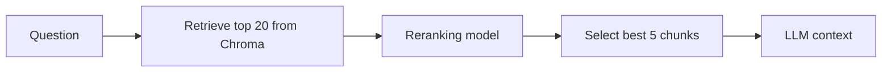
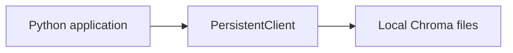
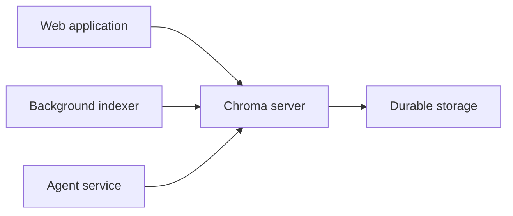
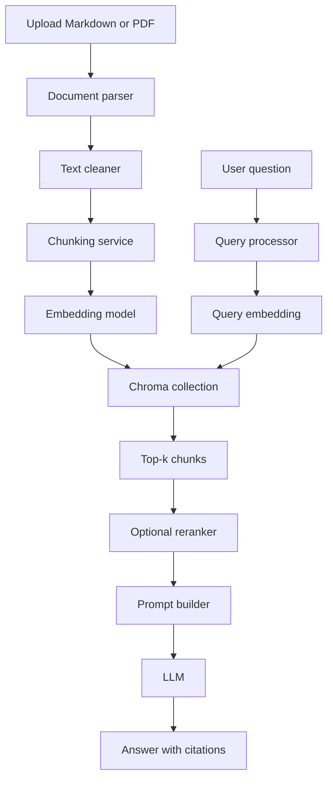

# 015 — Chroma

**Course:** 03 — Knowledge Systems and RAG
**Module:** Module 08 — Embeddings and Vector Databases
**Content Group:** Vector Databases
**Roadmap Source:** Embeddings and Vector Databases / Vector Databases
**Lesson Type:** Embeddings and Vector Database
**Order in Module:** 015
**Suggested Duration:** 24 minutes

---

## 1. Overview

**Chroma** is a developer-friendly database designed for storing, indexing, and retrieving embeddings.

It is commonly used when building:

* Retrieval-Augmented Generation applications
* Semantic search engines
* Document question-answering systems
* AI assistants with private knowledge
* Recommendation and similarity-search features
* Small agent memory systems

Chroma organizes documents, embeddings, metadata, and identifiers inside objects called **collections**. A collection can automatically embed text through an attached embedding function, or the application can generate embeddings separately and send them directly to Chroma.

By the end of this lesson, you should understand where Chroma fits inside an AI application and how to build a small persistent retrieval system with it.

---

## 2. Learning Objectives

After completing this lesson, you should be able to:

* Explain Chroma in your own words.
* Describe the role of Chroma in a RAG pipeline.
* Create and manage a Chroma collection.
* Store documents, embeddings, IDs, and metadata.
* Perform semantic similarity searches.
* Apply metadata filters during retrieval.
* Use retrieved chunks as context for an LLM.
* Identify when Chroma is appropriate for a prototype or production system.
* Evaluate retrieval quality using a test dataset.

---

## 3. What Is Chroma?

Chroma is a database built for AI applications that work with embeddings.

An embedding converts content such as text into a numerical vector:

```text
"How can I reset my password?"
                ↓
[0.021, -0.184, 0.735, ..., 0.093]
```

Texts with similar meanings usually produce vectors that are located close to one another in the embedding space.

Chroma stores these vectors and allows an application to search for the vectors that are closest to a query vector.

```text
User question
     ↓
Query embedding
     ↓
Similarity search
     ↓
Most relevant document chunks
```

Chroma's query API performs nearest-neighbor search over embeddings. It can embed query text automatically when a collection has an embedding function, or it can accept query embeddings generated by the application.

---

## 4. Why Chroma Is Useful

A normal relational database is good at exact conditions:

```sql
SELECT *
FROM documents
WHERE category = 'billing';
```

However, users often ask questions that do not contain the exact words stored in the database.

Stored document:

```text
Annual subscriptions may be refunded within 30 days.
```

User question:

```text
Can I get my money back after purchasing a yearly plan?
```

Keyword matching may miss the relationship because the wording is different.

Vector search compares meaning rather than relying only on exact words:

```text
"get my money back"
        ≈
"may be refunded"
```

This makes Chroma useful for semantic retrieval.

---

## 5. Core Chroma Concepts

### 5.1 Client

A Chroma client is the interface through which your application communicates with Chroma.

Common client modes include:

| Client mode          | Description                          | Typical use                            |
| -------------------- | ------------------------------------ | -------------------------------------- |
| In-memory client     | Stores data temporarily in memory    | Experiments and unit tests             |
| `PersistentClient`   | Stores data in a local directory     | Local apps and prototypes              |
| `HttpClient`         | Connects to a separate Chroma server | Shared services and multi-process apps |
| Managed cloud client | Connects to a hosted Chroma database | Managed production deployment          |

The basic in-memory client loses its ingested data when the program terminates. Chroma provides persistent and client-server alternatives when the data must survive application restarts.

---

### 5.2 Collection

A **collection** is the main unit used to organize and search records.

A collection may contain:

* Record IDs
* Documents
* Embeddings
* Metadata
* URIs or references to external content

```text
Collection: product_documentation

├── chunk-001
│   ├── document: "Reset your password from Settings..."
│   ├── embedding: [0.14, -0.09, ...]
│   └── metadata: {"page": 4, "category": "account"}
│
├── chunk-002
│   ├── document: "Refund requests must be submitted..."
│   ├── embedding: [0.35, 0.11, ...]
│   └── metadata: {"page": 12, "category": "billing"}
│
└── chunk-003
    ├── document: "API keys can be rotated..."
    ├── embedding: [-0.07, 0.27, ...]
    └── metadata: {"page": 19, "category": "security"}
```

Collections index documents and embeddings so they can be retrieved and filtered efficiently.

---

### 5.3 Record ID

Every stored record requires a unique string ID.

A useful ID should be:

* Stable across repeated indexing jobs
* Unique inside the collection
* Traceable to its original document
* Deterministically generated when possible

Example:

```text
employee-handbook-page-12-chunk-03
```

A deterministic ID prevents accidental duplication when the same document is indexed again.

---

### 5.4 Document

The document is the content associated with an embedding.

In a RAG system, a document usually represents a **chunk**, not necessarily an entire source file.

```python
documents = [
    "Employees receive 20 days of annual leave.",
    "Unused leave may be carried into the next year.",
]
```

---

### 5.5 Embedding

An embedding is the numerical representation used for similarity search.

There are two common approaches.

#### Chroma generates the embedding

```python
collection.add(
    ids=["chunk-001"],
    documents=["Employees receive 20 days of annual leave."],
)
```

#### Your application generates the embedding

```python
collection.add(
    ids=["chunk-001"],
    documents=["Employees receive 20 days of annual leave."],
    embeddings=[[0.14, -0.22, 0.51]],
)
```

When embeddings are provided directly, the application must use compatible embeddings for both ingestion and querying. The query vector dimensions must match the dimensions stored in the collection.

---

### 5.6 Metadata

Metadata contains structured information about each chunk.

Example:

```python
{
    "source": "employee-handbook.pdf",
    "page": 12,
    "section": "Annual Leave",
    "language": "en",
    "department": "all"
}
```

Metadata is important because it supports:

* Source citations
* Access control
* Language filtering
* Document-type filtering
* Date filtering
* Tenant isolation
* Debugging
* Data lifecycle management

Chroma supports metadata filtering through the `where` argument in retrieval operations.

---

## 6. Chroma in a RAG Pipeline

A typical RAG system has two main workflows.

### 6.1 Indexing Workflow


The indexing workflow usually runs:

* When a document is first uploaded
* When an existing document changes
* During a scheduled synchronization process
* When the embedding model changes

---

### 6.2 Query Workflow


The complete transformation is:

```text
Documents
   ↓
Chunks
   ↓
Embeddings
   ↓
Chroma collection
   ↓
Query embedding
   ↓
Top-k results
   ↓
LLM context
   ↓
Grounded answer with citations
```

Chroma is responsible for the **storage and retrieval layer**. It does not replace document processing, prompt construction, answer generation, or evaluation.

---

## 7. Basic Chroma Demo

### 7.1 Install Chroma

```bash
pip install chromadb
```

The official deployment examples use the `chromadb` Python package for embedded and client-server applications.

---

### 7.2 Create a Persistent Collection

Create a file named `chroma_demo.py`:

```python
from pathlib import Path

import chromadb


DATABASE_PATH = Path("./chroma_data")
COLLECTION_NAME = "ai_engineering_notes"


def create_collection():
    client = chromadb.PersistentClient(path=str(DATABASE_PATH))

    collection = client.get_or_create_collection(
        name=COLLECTION_NAME,
        metadata={
            "description": "Notes for an AI engineering course",
        },
    )

    return collection
```

`PersistentClient` stores the database under the specified path so that the records remain available after the Python process stops.

---

### 7.3 Add Documents

```python
def index_documents(collection) -> None:
    collection.upsert(
        ids=[
            "rag-introduction",
            "embedding-definition",
            "vector-database-purpose",
            "chunking-purpose",
            "metadata-purpose",
        ],
        documents=[
            (
                "Retrieval-Augmented Generation retrieves external knowledge "
                "before asking a language model to generate an answer."
            ),
            (
                "An embedding is a numerical vector that represents the "
                "semantic meaning of content."
            ),
            (
                "A vector database stores embeddings and supports similarity "
                "search over those embeddings."
            ),
            (
                "Chunking divides long documents into smaller passages that "
                "can be embedded and retrieved independently."
            ),
            (
                "Metadata records fields such as source, page, category, "
                "language, and document version."
            ),
        ],
        metadatas=[
            {
                "topic": "rag",
                "source": "lesson-01.md",
                "page": 1,
            },
            {
                "topic": "embeddings",
                "source": "lesson-02.md",
                "page": 2,
            },
            {
                "topic": "vector-databases",
                "source": "lesson-03.md",
                "page": 3,
            },
            {
                "topic": "chunking",
                "source": "lesson-04.md",
                "page": 4,
            },
            {
                "topic": "metadata",
                "source": "lesson-05.md",
                "page": 5,
            },
        ],
    )
```

Using `upsert` makes the indexing operation repeatable: existing IDs can be updated while new IDs can be inserted.

---

### 7.4 Query the Collection

```python
def search(collection, question: str, top_k: int = 3) -> dict:
    return collection.query(
        query_texts=[question],
        n_results=top_k,
        include=["documents", "metadatas", "distances"],
    )
```

Chroma uses the collection's embedding function to embed `query_texts` and perform vector similarity search. Applications can also pass `query_embeddings` directly.

---

### 7.5 Display the Results

```python
def print_results(results: dict) -> None:
    documents = results.get("documents", [[]])[0]
    metadatas = results.get("metadatas", [[]])[0]
    distances = results.get("distances", [[]])[0]

    if not documents:
        print("No relevant documents were found.")
        return

    for rank, (document, metadata, distance) in enumerate(
        zip(documents, metadatas, distances),
        start=1,
    ):
        print(f"\nResult #{rank}")
        print(f"Distance: {distance:.4f}")
        print(f"Source: {metadata.get('source')}")
        print(f"Page: {metadata.get('page')}")
        print(f"Text: {document}")
```

---

### 7.6 Run the Demo

```python
def main() -> None:
    collection = create_collection()
    index_documents(collection)

    question = "Why should a long PDF be divided into smaller sections?"

    results = search(
        collection=collection,
        question=question,
        top_k=3,
    )

    print(f"Question: {question}")
    print_results(results)


if __name__ == "__main__":
    main()
```

Run it:

```bash
python chroma_demo.py
```

The chunk explaining document chunking should appear near the top because it is semantically related to the question.

---

## 8. Understanding Query Results

A Chroma query may return a structure similar to:

```python
{
    "ids": [
        [
            "chunking-purpose",
            "rag-introduction",
            "vector-database-purpose",
        ]
    ],
    "documents": [
        [
            "Chunking divides long documents...",
            "Retrieval-Augmented Generation retrieves...",
            "A vector database stores embeddings...",
        ]
    ],
    "metadatas": [
        [
            {
                "source": "lesson-04.md",
                "page": 4,
                "topic": "chunking",
            },
            {
                "source": "lesson-01.md",
                "page": 1,
                "topic": "rag",
            },
            {
                "source": "lesson-03.md",
                "page": 3,
                "topic": "vector-databases",
            },
        ]
    ],
    "distances": [
        [
            0.31,
            0.58,
            0.72,
        ]
    ],
}
```

Important fields include:

| Field        | Meaning                                      |
| ------------ | -------------------------------------------- |
| `ids`        | IDs of the retrieved records                 |
| `documents`  | Retrieved chunk text                         |
| `metadatas`  | Source information and structured attributes |
| `distances`  | Distance between each result and the query   |
| `embeddings` | Returned vectors when explicitly requested   |

In many distance configurations, a smaller distance represents a closer result. However, raw distance values should be calibrated for the specific embedding model, distance metric, and dataset rather than treated as universal confidence scores.

---

## 9. Metadata Filtering

Semantic similarity alone may not be sufficient.

Suppose a knowledge base contains documents in multiple languages:

```python
{
    "source": "handbook-en.pdf",
    "language": "en",
}
```

```python
{
    "source": "handbook-vi.pdf",
    "language": "vi",
}
```

You can restrict the search:

```python
results = collection.query(
    query_texts=["How many annual leave days do employees receive?"],
    n_results=5,
    where={
        "language": "en",
    },
)
```

Chroma supports filtering records by metadata with `where`. It also supports document-content filtering through `where_document`.

---

### 9.1 Numeric Filter

```python
results = collection.query(
    query_texts=["What changed in the latest policy?"],
    n_results=5,
    where={
        "year": {
            "$gte": 2025,
        },
    },
)
```

---

### 9.2 Multiple Conditions

```python
results = collection.query(
    query_texts=["What is the refund policy?"],
    n_results=5,
    where={
        "$and": [
            {"language": "en"},
            {"category": "billing"},
        ],
    },
)
```

---

### 9.3 Array Metadata

A record may contain an array:

```python
{
    "roles": ["employee", "manager"],
    "topics": ["security", "authentication"],
}
```

It can then be filtered using an array condition:

```python
results = collection.query(
    query_texts=["How should API keys be protected?"],
    where={
        "roles": {
            "$contains": "employee",
        },
    },
    n_results=5,
)
```

Chroma supports arrays of consistent primitive types in metadata and provides operators such as `$contains` and `$not_contains` for array filtering.

---

## 10. Turning Retrieval Results into LLM Context

The vector database should not send its raw response directly to the user.

The application should transform retrieved records into structured context.

```python
def build_context(results: dict) -> str:
    documents = results.get("documents", [[]])[0]
    metadatas = results.get("metadatas", [[]])[0]

    context_parts: list[str] = []

    for index, (document, metadata) in enumerate(
        zip(documents, metadatas),
        start=1,
    ):
        source = metadata.get("source", "unknown")
        page = metadata.get("page", "unknown")

        context_parts.append(
            f"[Source {index}: {source}, page {page}]\n"
            f"{document}"
        )

    return "\n\n".join(context_parts)
```

Example output:

```text
[Source 1: lesson-04.md, page 4]
Chunking divides long documents into smaller passages that can be
embedded and retrieved independently.

[Source 2: lesson-01.md, page 1]
Retrieval-Augmented Generation retrieves external knowledge before
asking a language model to generate an answer.
```

The context can then be inserted into a prompt:

```text
You are a documentation assistant.

Answer the question using only the supplied context.

Rules:
1. Do not use unsupported information.
2. Cite the source for every important claim.
3. Say that the answer is unavailable when the context is insufficient.

Context:
{retrieved_context}

Question:
{user_question}
```

---

## 11. Minimal RAG Function

The following example separates retrieval from answer generation:

```python
from typing import Any


def retrieve_context(
    collection: Any,
    question: str,
    top_k: int = 4,
) -> tuple[str, list[dict]]:
    results = collection.query(
        query_texts=[question],
        n_results=top_k,
        include=["documents", "metadatas", "distances"],
    )

    documents = results.get("documents", [[]])[0]
    metadatas = results.get("metadatas", [[]])[0]
    distances = results.get("distances", [[]])[0]

    context_parts: list[str] = []
    citations: list[dict] = []

    for index, (document, metadata, distance) in enumerate(
        zip(documents, metadatas, distances),
        start=1,
    ):
        source = metadata.get("source", "unknown")
        page = metadata.get("page")

        label = f"S{index}"

        context_parts.append(
            f"[{label}] Source: {source}; Page: {page}\n"
            f"{document}"
        )

        citations.append(
            {
                "label": label,
                "source": source,
                "page": page,
                "distance": distance,
            }
        )

    return "\n\n".join(context_parts), citations
```

This design makes it easier to:

* Inspect the retrieved text
* Display citations
* Log retrieval results
* Evaluate ranking quality
* Replace the LLM provider
* Add a reranking stage later

---

## 12. Designing Good Metadata

A useful metadata schema might include:

```python
metadata = {
    "source_id": "employee-handbook-v3",
    "source_name": "employee-handbook.pdf",
    "page": 14,
    "section": "Annual Leave",
    "chunk_index": 5,
    "language": "en",
    "document_type": "policy",
    "version": "3.0",
    "tenant_id": "company-001",
    "access_level": "employee",
    "indexed_at": "2026-07-24T09:30:00Z",
}
```

Recommended metadata fields:

| Field          | Purpose                       |
| -------------- | ----------------------------- |
| `source_id`    | Stable source identification  |
| `source_name`  | Human-readable citation       |
| `page`         | Page-level citation           |
| `section`      | Better result display         |
| `chunk_index`  | Reconstructing document order |
| `language`     | Language filtering            |
| `version`      | Avoiding obsolete content     |
| `tenant_id`    | Tenant isolation              |
| `access_level` | Authorization filtering       |
| `indexed_at`   | Auditing and synchronization  |

Metadata should be designed before indexing large datasets. Adding critical metadata after ingestion may require rebuilding the collection.

---

## 13. Chunking Strategy

Chroma can only retrieve the records that your application stores.

Therefore, retrieval quality depends heavily on chunking.

### Chunk Too Large

```text
One chunk = an entire 50-page PDF
```

Problems:

* The embedding represents too many topics.
* Irrelevant text enters the LLM context.
* Citations become imprecise.
* Context-window usage increases.

### Chunk Too Small

```text
One chunk = one short sentence
```

Problems:

* Important context may be separated.
* Results may lack enough information to answer.
* More chunks must be retrieved.
* The LLM may receive fragmented evidence.

### Better Starting Point

A practical experiment might start with:

```text
Chunk size: 300–700 tokens
Overlap: 50–120 tokens
Top-k: 3–8
```

These values are not universal rules. They should be evaluated with questions from the target application.

---

## 14. Query-Time Retrieval Strategies

### 14.1 Basic Semantic Retrieval

```text
Question
   ↓
Embedding
   ↓
Top-5 vector matches
```

Use this for a simple prototype.

---

### 14.2 Metadata-Filtered Retrieval

```text
Question
   ↓
Detect language and user permissions
   ↓
Apply metadata filters
   ↓
Vector search
```

Use this when the database contains multiple:

* Languages
* Products
* Departments
* Tenants
* Access levels
* Document versions

---

### 14.3 Retrieval with Reranking



The vector database provides candidate documents. A reranker then performs a more expensive comparison between the query and each candidate.

This approach can improve precision when the knowledge base contains many similar passages.

---

### 14.4 Query Rewriting

```text
Original question:
"Can I cancel it?"

Conversation context:
The user is discussing an annual premium subscription.

Rewritten search query:
"What is the cancellation and refund policy for an annual premium subscription?"
```

Rewriting ambiguous questions before retrieval often produces more useful search results.

---

## 15. When Chroma Is a Good Choice

Chroma is a strong option when:

* You are learning vector search.
* You need a local RAG prototype.
* You are building a small document Q&A application.
* You want a simple Python integration.
* You need persistence without operating a large database cluster.
* You need documents, embeddings, metadata, and similarity search in one system.
* You want to move from embedded storage to a separate HTTP service later.

A local persistent deployment can run inside a Python service, while a standalone server allows multiple application instances to share one Chroma deployment.

---

## 16. When to Evaluate Alternatives

Evaluate Chroma against other systems when the project requires:

* Extremely large vector collections
* Strict high-availability requirements
* Complex multi-region deployment
* Advanced database administration
* Existing PostgreSQL integration
* Specialized GPU-based vector indexing
* Complex hybrid retrieval requirements
* Strong enterprise governance requirements
* Very high concurrent write volume

Possible alternatives include:

| Tool                     | Typical strength                                     |
| ------------------------ | ---------------------------------------------------- |
| FAISS                    | Local vector-index experiments                       |
| Qdrant                   | Dedicated vector database and filtering              |
| Weaviate                 | Managed or self-hosted semantic database             |
| Milvus                   | Large-scale distributed vector search                |
| Pinecone                 | Managed vector database                              |
| PostgreSQL with pgvector | Vector search inside an existing relational database |
| Elasticsearch            | Search systems combining text and vector retrieval   |

The correct database depends on scale, deployment constraints, existing infrastructure, security requirements, and operational experience.

---

## 17. Embedded vs Server Deployment

### Embedded Architecture



Advantages:

* Simple development experience
* Minimal infrastructure
* Suitable for local tools and prototypes

Limitations:

* Application and database lifecycles are closely connected.
* Sharing the same database between multiple services is more difficult.
* Local persistence requires careful file and process management.

---

### Client-Server Architecture



Advantages:

* Multiple applications can use one database.
* Application and database components can scale separately.
* Database access can be isolated behind a service boundary.

Chroma's deployment guidance recommends durable storage, health checks, controlled network access, and separate scaling for application and database components in a typical server deployment.

---

## 18. Production Considerations

Before using Chroma in production, evaluate the following areas.

### 18.1 Persistence

Confirm that:

* A persistent client or server deployment is used.
* The storage directory is mounted to durable storage.
* Data survives container and machine restarts.

---

### 18.2 Backup and Restore

Define:

* Backup frequency
* Backup location
* Retention period
* Restore procedure
* Restore testing schedule
* Disaster recovery ownership

Production guidance for Chroma includes backup and restore, disaster recovery, maintenance, observability, scalability, security, and high availability as core operational concerns.

---

### 18.3 Security

Protect:

* The Chroma server endpoint
* Authentication credentials
* Private document content
* Tenant metadata
* Network communication
* Backup files

Do not trust a `tenant_id`, `user_id`, or access level supplied directly by an untrusted client. Derive authorization filters from the authenticated server-side identity.

```python
# Do not trust:
tenant_id = request.json["tenant_id"]

# Prefer:
tenant_id = authenticated_user.tenant_id
```

Then apply the trusted value during retrieval:

```python
results = collection.query(
    query_texts=[question],
    where={
        "tenant_id": authenticated_user.tenant_id,
    },
    n_results=5,
)
```

---

### 18.4 Observability

Record:

* Query latency
* Embedding latency
* Number of retrieved chunks
* Collection name
* Applied filters
* Retrieved IDs
* Distance values
* Empty-result rate
* User feedback
* LLM answer latency

Avoid logging complete sensitive documents unless the logging policy explicitly permits it.

---

### 18.5 Versioning

Record which embedding model generated each collection.

```python
collection_metadata = {
    "embedding_provider": "provider-name",
    "embedding_model": "embedding-model-name",
    "embedding_dimension": 1536,
    "schema_version": "1",
}
```

Do not mix incompatible embedding models inside the same vector space.

When changing embedding models, a safe approach is usually:

```text
Create a new collection
        ↓
Re-embed all documents
        ↓
Evaluate the new collection
        ↓
Switch application traffic
        ↓
Retire the old collection
```

---

## 19. Common Mistakes

### 19.1 Using an In-Memory Client Accidentally

Problem:

```python
client = chromadb.Client()
```

The data disappears after the process ends.

Better for persistent local data:

```python
client = chromadb.PersistentClient(
    path="./chroma_data",
)
```

---

### 19.2 Missing Source Metadata

Problem:

```python
collection.add(
    ids=["chunk-1"],
    documents=["Employees receive 20 days of leave."],
)
```

The system retrieves the answer but cannot produce a reliable citation.

Better:

```python
collection.add(
    ids=["chunk-1"],
    documents=["Employees receive 20 days of leave."],
    metadatas=[
        {
            "source": "employee-handbook.pdf",
            "page": 14,
            "section": "Annual Leave",
        }
    ],
)
```

---

### 19.3 Inconsistent Embedding Models

Problem:

```text
Documents embedded with Model A
Queries embedded with Model B
```

The vectors may no longer represent meaning in the same vector space.

Use the same compatible embedding configuration for ingestion and querying.

---

### 19.4 Duplicate Documents

Problem:

```text
The indexing script runs every day
        ↓
New random IDs are generated
        ↓
The same chunks are inserted repeatedly
```

Use deterministic IDs and `upsert`.

```python
chunk_id = f"{source_id}-page-{page}-chunk-{chunk_index}"
```

---

### 19.5 Ignoring Metadata Filters

Problem:

A user asks an English question but receives Vietnamese documents, or receives documents belonging to another tenant.

Better:

```python
where_filter = {
    "$and": [
        {"language": "en"},
        {"tenant_id": authenticated_user.tenant_id},
    ]
}
```

---

### 19.6 Choosing Top-k by Guessing

A larger `top_k` is not always better.

Too small:

* Relevant evidence may be missed.

Too large:

* More irrelevant context is included.
* Token cost increases.
* The LLM may become distracted.

Evaluate multiple values:

```text
top_k ∈ {3, 5, 8, 12}
```

---

### 19.7 Evaluating Only the Final Answer

A poor answer can be caused by:

* Incorrect document parsing
* Bad chunk boundaries
* Weak embeddings
* Missing metadata
* Incorrect filtering
* Poor retrieval ranking
* Prompt problems
* LLM hallucination

Inspect retrieval separately before debugging the answer generator.

---

## 20. Retrieval Evaluation

Create a small evaluation dataset:

```json
[
  {
    "question": "How many annual leave days do employees receive?",
    "expected_source": "employee-handbook.pdf",
    "expected_page": 14,
    "expected_chunk_ids": ["handbook-p14-c02"]
  },
  {
    "question": "How can an administrator rotate an API key?",
    "expected_source": "platform-guide.md",
    "expected_chunk_ids": ["platform-security-c07"]
  }
]
```

Useful retrieval metrics include:

### Hit Rate at K

Did at least one relevant chunk appear in the top-k results?

```text
Hit@5 = successful questions / total questions
```

### Recall at K

How many expected relevant chunks appeared in the top-k results?

```text
Recall@K =
retrieved relevant chunks / all expected relevant chunks
```

### Mean Reciprocal Rank

How early did the first relevant result appear?

```text
Relevant result at rank 1 → reciprocal rank = 1
Relevant result at rank 2 → reciprocal rank = 1/2
Relevant result at rank 5 → reciprocal rank = 1/5
```

### Citation Accuracy

Does the answer cite the source that actually supports its claim?

### Answer Groundedness

Can every important statement in the answer be traced to retrieved evidence?

---

## 21. Practical Exercise

### Goal

Build a small semantic search engine over five to ten Markdown or PDF documents.

### Step 1: Select Documents

Choose documents from one topic, such as:

* AI engineering notes
* Product documentation
* University regulations
* Company policies
* API guides

---

### Step 2: Extract Text

For each document, record:

```python
{
    "source": "document-name.pdf",
    "page": 1,
    "text": "Extracted page content..."
}
```

---

### Step 3: Create Chunks

Each chunk should contain:

```python
{
    "id": "document-name-p1-c0",
    "text": "Chunk text...",
    "metadata": {
        "source": "document-name.pdf",
        "page": 1,
        "chunk_index": 0,
    },
}
```

---

### Step 4: Store the Chunks in Chroma

Use:

```python
collection.upsert(
    ids=chunk_ids,
    documents=chunk_texts,
    metadatas=chunk_metadatas,
)
```

---

### Step 5: Create Test Questions

Write at least ten questions:

```text
1. What is an embedding?
2. Why is chunk overlap useful?
3. What does top-k mean?
4. How does metadata filtering work?
5. What is the role of a vector database in RAG?
```

---

### Step 6: Record Retrieval Results

Create an evaluation table:

| Question              | Expected source | Top-1 | Top-3 | Top-5 | Notes                    |
| --------------------- | --------------- | ----: | ----: | ----: | ------------------------ |
| What is an embedding? | lesson-02.md    |  Pass |  Pass |  Pass | Correct result at rank 1 |
| Why use overlap?      | lesson-04.md    |  Fail |  Pass |  Pass | Correct result at rank 2 |
| What is metadata?     | lesson-05.md    |  Pass |  Pass |  Pass | Citation correct         |

---

### Step 7: Analyze Failure Cases

For every failed query, investigate:

```text
Was the correct document indexed?
        ↓
Was the relevant content inside one chunk?
        ↓
Was the chunk too large or too small?
        ↓
Was the embedding model appropriate?
        ↓
Was an incorrect metadata filter applied?
        ↓
Was top-k too small?
```

---

## 22. Portfolio Project

### Project 7: Semantic Search Engine

Build a semantic search application for Markdown and PDF files using:

* Document loading
* Text normalization
* Chunking
* Embedding generation
* Chroma
* Metadata filtering
* Top-k retrieval
* Source citations
* Retrieval evaluation

### Suggested Architecture



### Recommended Features

* Upload Markdown and PDF files
* Display indexing progress
* Search by natural-language question
* Filter by source or language
* Show retrieved chunks
* Display similarity distances
* Generate answers with citations
* Collect useful or not-useful feedback
* Provide a retrieval-debugging screen

---

## 23. Production Checklist

### Data

* [ ] Documents have stable source IDs.
* [ ] Chunks have deterministic IDs.
* [ ] Every chunk contains citation metadata.
* [ ] Obsolete documents can be deleted or replaced.
* [ ] The embedding model and schema versions are recorded.

### Retrieval

* [ ] Query and document embeddings are compatible.
* [ ] Metadata filters are generated server-side.
* [ ] Top-k has been evaluated.
* [ ] Empty retrieval results are handled.
* [ ] Retrieval logs can be inspected.
* [ ] Important queries have test cases.

### Security

* [ ] Chroma is not exposed publicly without protection.
* [ ] Tenant isolation is enforced.
* [ ] Access filters come from authenticated identity.
* [ ] Sensitive content is not written to unsafe logs.
* [ ] Backup access is restricted.

### Operations

* [ ] Persistent storage is configured.
* [ ] Backups are created.
* [ ] Restore procedures are tested.
* [ ] Health checks are configured.
* [ ] Latency and errors are monitored.
* [ ] Upgrade procedures are documented.

### Answer Quality

* [ ] The LLM receives only relevant context.
* [ ] Answers include citations.
* [ ] Unsupported answers are rejected.
* [ ] Retrieval and generation are evaluated separately.
* [ ] Failure cases are recorded and reviewed.

---

## 24. Completion Checklist

After this lesson:

* [ ] I can explain Chroma in one or two minutes.
* [ ] I understand clients, collections, records, embeddings, and metadata.
* [ ] I can create a persistent Chroma collection.
* [ ] I can add and update document chunks.
* [ ] I can perform a semantic query.
* [ ] I can filter results using metadata.
* [ ] I can convert retrieved chunks into LLM context.
* [ ] I can preserve source information for citations.
* [ ] I have created a small Chroma demo.
* [ ] I have evaluated retrieval using test questions.
* [ ] I understand at least one Chroma limitation or production concern.

---

## 25. Related Outcome

Build semantic search systems using:

* Embeddings
* Vector indexes
* Similarity search
* Metadata filtering
* Retrieval evaluation
* Grounded answer generation

---

## 26. Key Takeaways

1. Chroma stores documents, embeddings, IDs, and metadata inside collections.
2. It can generate embeddings automatically or accept externally generated vectors.
3. `PersistentClient` is useful for local persistent applications.
4. `HttpClient` is appropriate when Chroma runs as a separate service.
5. Metadata is essential for citations, filtering, access control, and debugging.
6. Chroma is only one component of a complete RAG pipeline.
7. Retrieval quality depends on chunking, embeddings, filters, and top-k configuration.
8. A working demo is not enough; retrieval must be evaluated with a test dataset.
9. Production use requires security, persistence, backups, monitoring, and recovery planning.
10. The best way to learn Chroma is to build a small semantic search or document Q&A system.

---

## 27. Summary

**Chroma** is a practical retrieval database for AI applications that use embeddings.

It fits between the embedding layer and the LLM generation layer:

```text
Source documents
      ↓
Chunks and metadata
      ↓
Embedding model
      ↓
Chroma
      ↓
Relevant evidence
      ↓
LLM answer with citations
```

For a portfolio project, use Chroma to build a semantic search engine over Markdown or PDF files. Store complete citation metadata, create a repeatable test dataset, inspect retrieval failures, and document the limitations of your design.

The goal is not simply to store vectors. The goal is to retrieve the right evidence, for the right user, at the right time, and transform that evidence into a reliable AI response.
