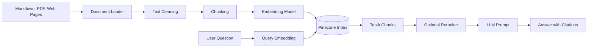
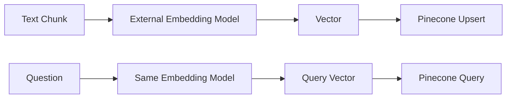
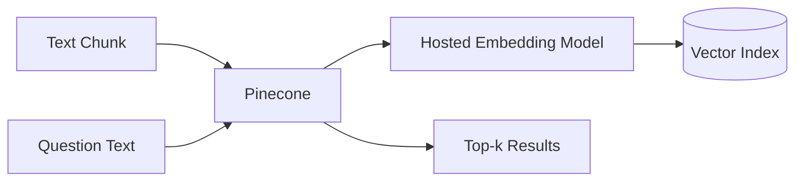
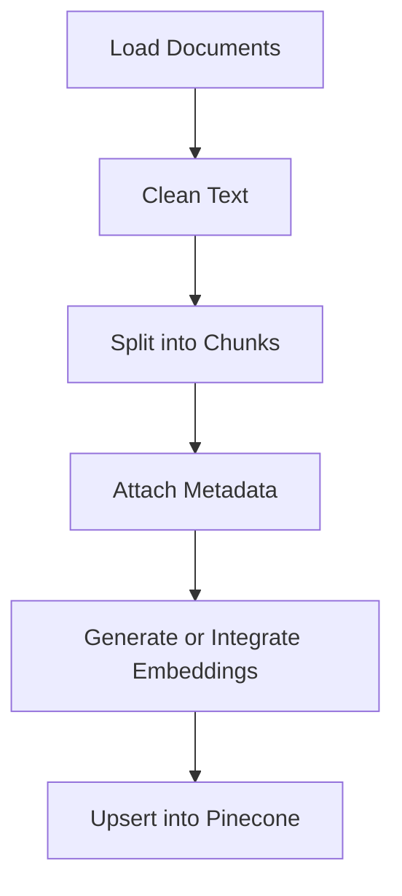
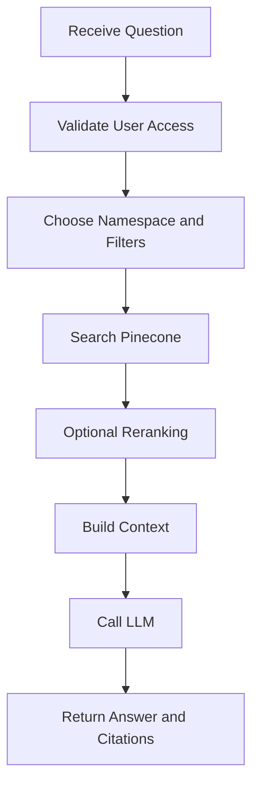
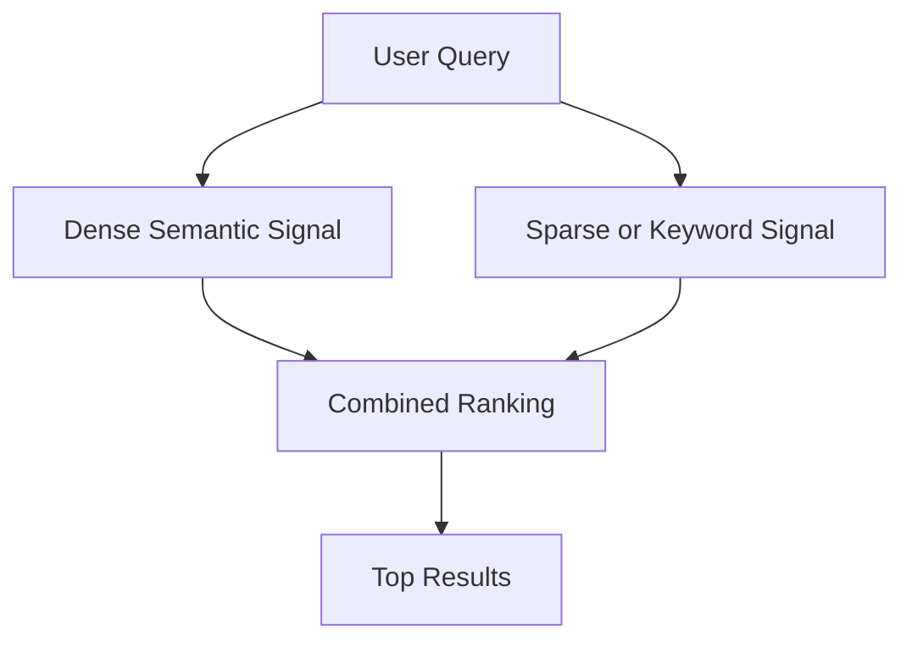
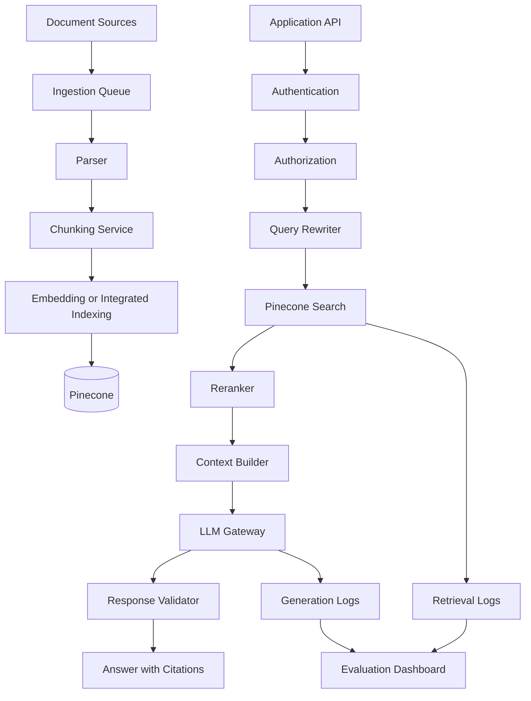

# 016 — Pinecone

**Course:** 03 — Knowledge Systems and RAG
**Module:** Module 08 — Embeddings and Vector Databases
**Content Group:** Vector Databases
**Roadmap Source:** Embeddings and Vector Databases / Vector Databases
**Lesson Type:** Embeddings and Vector Databases
**Order in Module:** 016
**Suggested Duration:** 24 minutes

---

## 1. Overview

**Pinecone** is a managed database designed for storing, indexing, and searching high-dimensional vector representations.

In a modern AI application, Pinecone commonly acts as the retrieval layer between an embedding model and a large language model. It can support:

* Semantic search
* Retrieval-Augmented Generation
* Recommendation systems
* Document discovery
* Similarity-based classification
* Agent memory
* Duplicate detection
* Hybrid semantic and keyword retrieval

Pinecone can store vectors generated by an external embedding model, or it can use an integrated embedding model that converts text into vectors during ingestion and search.

The central workflow is:

```text
Documents
    ↓
Chunking
    ↓
Embedding
    ↓
Pinecone index
    ↓
Query embedding
    ↓
Similarity search
    ↓
Top-k relevant chunks
    ↓
LLM answer with citations
```

---

## 2. Learning Objectives

By the end of this lesson, you should be able to:

1. Explain Pinecone in your own words.
2. Identify where Pinecone belongs in a semantic search or RAG workflow.
3. Explain indexes, records, vectors, metadata, namespaces, and similarity metrics.
4. Create a Pinecone index.
5. Insert document chunks into the index.
6. search for relevant chunks using natural-language queries.
7. Filter search results using metadata.
8. Connect Pinecone retrieval to an LLM.
9. Evaluate retrieval quality with a test dataset.
10. Identify limitations and common production mistakes.

---

## 3. What Is Pinecone?

Pinecone is the component that answers this question:

> Given this query, which stored pieces of information are most relevant?

A traditional database usually searches structured fields:

```sql
SELECT *
FROM documents
WHERE category = 'security';
```

A vector database searches by meaning:

```text
Query:
"How should API identity information be protected?"

Possible matching chunk:
"The backend must derive the user ID from the authenticated session
instead of trusting an ID supplied by the client."
```

The query and document do not need to contain exactly the same words. An embedding model converts them into vectors, and Pinecone finds vectors that are close to each other.

Pinecone describes dense-vector search as semantic or similarity search: vectors that are closer in the embedding space are considered more similar in meaning and context.

---

## 4. Where Pinecone Fits in an AI System

Pinecone is not normally responsible for:

* Parsing PDF files
* Splitting documents into chunks
* Writing the final answer
* Generating citations by itself
* Verifying whether an answer is factually correct

Its main responsibility is retrieval.



Pinecone is therefore usually placed between:

```text
Embedding model → Pinecone → LLM
```

---

## 5. Core Concepts

### 5.1 Index

An **index** is the main searchable collection in Pinecone.

It defines important properties such as:

* Vector type
* Vector dimension
* Similarity metric
* Cloud provider
* Deployment region
* Integrated embedding configuration, when used

When you bring your own vectors, the index dimension must match the output dimension of the embedding model. Pinecone currently supports dense-vector metrics such as cosine, Euclidean distance, and dot product.

Example:

```text
Index: company-knowledge
Vector type: dense
Dimension: determined by embedding model
Metric: cosine
Region: us-east-1
```

---

### 5.2 Record

A **record** is one searchable item inside an index.

A record normally contains:

```json
{
  "_id": "security-guide-page-3-chunk-2",
  "chunk_text": "Never trust a user ID supplied by the client.",
  "source": "security-guide.pdf",
  "page": 3,
  "category": "authentication"
}
```

The record ID must be unique inside its namespace.

When using external embeddings, the record also contains the vector:

```json
{
  "id": "chunk-001",
  "values": [0.012, -0.084, 0.117],
  "metadata": {
    "source": "security-guide.pdf",
    "page": 3
  }
}
```

---

### 5.3 Vector

A vector is a list of numbers representing the semantic characteristics of some content.

Conceptually:

```text
"Protect authenticated user identity"
        ↓ embedding model
[0.13, -0.42, 0.07, 0.81, ...]
```

Documents with similar meanings should produce vectors located near one another in the embedding space.

You normally do not interpret each individual number. The vector is useful because it makes mathematical similarity search possible.

---

### 5.4 Metadata

**Metadata** contains structured information associated with a vector.

Examples:

```json
{
  "source": "backend-security.md",
  "page": 12,
  "language": "en",
  "category": "authentication",
  "tenant_id": "company-a",
  "updated_at": "2026-07-20"
}
```

Metadata serves several purposes:

* Displaying citations
* Restricting results to a document
* Filtering by language
* Filtering by category
* Implementing access rules
* Tracking document versions
* Deleting outdated records

Pinecone supports metadata filters during search, allowing the application to restrict retrieval to records matching a filter expression.

Example:

```python
filter={
    "language": "en",
    "category": "authentication"
}
```

---

### 5.5 Namespace

A **namespace** partitions records inside an index.

All data operations, including upserts and searches, target a namespace. Namespaces can be useful for isolating data belonging to different customers, organizations, applications, or environments.

Example:

```text
Index: company-knowledge

Namespaces:
├── tenant-company-a
├── tenant-company-b
├── internal-testing
└── production
```

A multitenant architecture might use:

```python
namespace = f"tenant-{authenticated_company_id}"
```

Do not accept the namespace directly from an untrusted request when it controls access to another user's data. The server should derive the tenant or user scope from the authenticated session.

---

### 5.6 Similarity Metric

A similarity metric determines how Pinecone compares vectors.

Common choices include:

| Metric      | General interpretation           |
| ----------- | -------------------------------- |
| Cosine      | Compares vector direction        |
| Dot product | Measures alignment and magnitude |
| Euclidean   | Measures geometric distance      |

The correct metric should match the recommendation of the embedding model.

A common mistake is choosing a metric without checking the embedding model documentation.

---

### 5.7 Top-k

`top_k` controls how many initial results Pinecone returns.

```python
top_k = 5
```

A larger value provides more context but may introduce irrelevant chunks.

A smaller value reduces noise but may omit necessary information.

The best value must be measured using real queries.

```text
Very small top-k
→ missing evidence

Very large top-k
→ excessive context and irrelevant information
```

---

## 6. Pinecone Data Flow

Pinecone supports two main embedding approaches.

### Approach A: External Embeddings

Your application generates vectors before sending them to Pinecone.



This approach gives you more control over:

* Model provider
* Embedding model version
* Batch processing
* Vector normalization
* Migration strategy
* Local or private embedding models

However, your application must manage the embedding process.

---

### Approach B: Integrated Embeddings

Your application sends text records directly to Pinecone.



With an integrated embedding index:

1. You configure a hosted embedding model.
2. You upsert source text.
3. Pinecone converts the text into vectors.
4. You search using query text.
5. Pinecone embeds the query using the same integrated model.

This reduces the amount of embedding code in your application.

One limitation is that indexes with integrated embeddings do not support some text-based update or import operations. Review the current documentation before selecting this architecture for a large ingestion pipeline.

---

## 7. Minimal Pinecone Demo

The following example uses Pinecone's integrated embedding workflow.

### 7.1 Install the SDK

```bash
pip install pinecone
```

The current official Python quickstart installs the package using `pip install pinecone`.

Set the API key as an environment variable:

```bash
export PINECONE_API_KEY="your-api-key"
```

On Windows PowerShell:

```powershell
$env:PINECONE_API_KEY="your-api-key"
```

Never hard-code production API keys in source code.

---

### 7.2 Prepare Sample Chunks

```python
records = [
    {
        "_id": "auth-001",
        "chunk_text": (
            "The backend must derive the user ID from the authenticated "
            "session instead of trusting a user ID supplied by the client."
        ),
        "source": "security-guide.md",
        "section": "identity",
        "language": "en",
    },
    {
        "_id": "auth-002",
        "chunk_text": (
            "Authorization checks must confirm that the authenticated user "
            "is allowed to access the requested resource."
        ),
        "source": "security-guide.md",
        "section": "authorization",
        "language": "en",
    },
    {
        "_id": "rag-001",
        "chunk_text": (
            "A RAG pipeline retrieves relevant document chunks and provides "
            "them to a language model as grounded context."
        ),
        "source": "rag-overview.md",
        "section": "architecture",
        "language": "en",
    },
    {
        "_id": "rag-002",
        "chunk_text": (
            "Retrieval quality should be evaluated with a fixed collection "
            "of realistic questions and expected relevant documents."
        ),
        "source": "rag-evaluation.md",
        "section": "evaluation",
        "language": "en",
    },
]
```

Each record contains:

* A unique ID
* The searchable text
* Citation metadata
* Optional filter fields

---

### 7.3 Create an Integrated Embedding Index

```python
import os

from pinecone import Pinecone


api_key = os.environ.get("PINECONE_API_KEY")

if not api_key:
    raise RuntimeError(
        "PINECONE_API_KEY is not configured."
    )

pc = Pinecone(api_key=api_key)

index_name = "ai-engineer-lessons"

if not pc.has_index(index_name):
    pc.create_index_for_model(
        name=index_name,
        cloud="aws",
        region="us-east-1",
        embed={
            "model": "llama-text-embed-v2",
            "field_map": {
                "text": "chunk_text",
            },
        },
    )

index = pc.Index(index_name)
```

`field_map` tells Pinecone which field contains the text that should be embedded. This follows Pinecone's integrated-index creation pattern.

For a real application, choose the cloud and region according to:

* Application location
* Data residency requirements
* Latency requirements
* Infrastructure architecture

---

### 7.4 Upsert Records

```python
namespace = "course-module-08"

index.upsert_records(
    namespace=namespace,
    records=records,
)

print(f"Upserted {len(records)} records.")
```

When the namespace does not exist, Pinecone can create it as part of the upsert. Additional fields are stored as metadata and may be returned or used for filtering.

An **upsert** means:

```text
Record ID does not exist
→ insert record

Record ID already exists
→ replace the existing record
```

Be careful: upserting an existing ID replaces the complete record. Use an update operation when only part of an existing record should change.

---

### 7.5 Perform Semantic Search

```python
query = "Why should the API ignore a user ID sent by the client?"

results = index.search(
    namespace=namespace,
    query={
        "inputs": {
            "text": query,
        },
        "top_k": 3,
    },
    fields=[
        "chunk_text",
        "source",
        "section",
        "language",
    ],
)

print(results)
```

Expected semantic match:

```text
The backend must derive the user ID from the authenticated
session instead of trusting a user ID supplied by the client.
```

The query and stored chunk do not have to use exactly the same wording.

---

## 8. Metadata Filtering

Suppose your index contains both English and Vietnamese content.

You can restrict retrieval to English records:

```python
results = index.search(
    namespace=namespace,
    query={
        "inputs": {
            "text": "How should authenticated identity be handled?"
        },
        "top_k": 5,
        "filter": {
            "language": "en"
        },
    },
    fields=[
        "chunk_text",
        "source",
        "section",
        "language",
    ],
)
```

You can also combine conditions:

```python
results = index.search(
    namespace=namespace,
    query={
        "inputs": {
            "text": "How should user identity be protected?"
        },
        "top_k": 5,
        "filter": {
            "$and": [
                {"language": {"$eq": "en"}},
                {"section": {"$eq": "identity"}},
            ]
        },
    },
    fields=[
        "chunk_text",
        "source",
        "section",
    ],
)
```

Metadata filters are especially important when retrieval must respect:

* Tenant isolation
* User permissions
* Language settings
* Product versions
* Document status
* Geographic regions
* Date ranges

Filtering must not replace authorization. The backend must still verify that the authenticated user is permitted to search the selected namespace or metadata scope.

---

## 9. Reranking

Vector search is usually the first retrieval stage.

A reranker can then examine the query and the initial candidate chunks more carefully.


Pinecone supports two-stage retrieval using hosted reranking models. The first stage retrieves candidates, and the reranker assigns more precise relevance scores before returning the final results.

Example:

```python
results = index.search(
    namespace=namespace,
    query={
        "inputs": {
            "text": (
                "Why must the backend overwrite client-provided "
                "identity information?"
            )
        },
        "top_k": 10,
    },
    rerank={
        "model": "bge-reranker-v2-m3",
        "top_n": 3,
        "rank_fields": [
            "chunk_text"
        ],
    },
    fields=[
        "chunk_text",
        "source",
        "section",
    ],
)
```

The search retrieves ten candidates, while the reranker returns the three strongest results.

Reranking can improve precision, but it also adds:

* Additional latency
* Additional cost
* More pipeline complexity

Use an evaluation dataset to determine whether the improvement is worthwhile.

---

## 10. Connecting Pinecone to a RAG Pipeline

A basic RAG workflow contains two phases.

### 10.1 Offline Ingestion



### 10.2 Online Retrieval



---

### 10.3 Build a Retrieval Function

```python
from typing import Any


def search_knowledge(
    index: Any,
    namespace: str,
    question: str,
    language: str = "en",
    top_k: int = 5,
) -> list[dict[str, Any]]:
    if not question.strip():
        raise ValueError("Question must not be empty.")

    response = index.search(
        namespace=namespace,
        query={
            "inputs": {
                "text": question,
            },
            "top_k": top_k,
            "filter": {
                "language": language,
            },
        },
        fields=[
            "chunk_text",
            "source",
            "section",
            "language",
        ],
    )

    hits = response.get("result", {}).get("hits", [])

    normalized_results = []

    for hit in hits:
        fields = hit.get("fields", {})

        normalized_results.append(
            {
                "id": hit.get("_id"),
                "score": hit.get("_score"),
                "text": fields.get("chunk_text", ""),
                "source": fields.get("source", "unknown"),
                "section": fields.get("section", "unknown"),
            }
        )

    return normalized_results
```

Because SDK response shapes can change between API versions, inspect the actual response returned by your installed SDK and update the normalization layer when necessary.

---

### 10.4 Build Grounded Context

```python
def build_context(results: list[dict]) -> str:
    sections = []

    for position, item in enumerate(results, start=1):
        sections.append(
            "\n".join(
                [
                    f"[Source {position}]",
                    f"File: {item['source']}",
                    f"Section: {item['section']}",
                    f"Content: {item['text']}",
                ]
            )
        )

    return "\n\n".join(sections)
```

Example output:

```text
[Source 1]
File: security-guide.md
Section: identity
Content: The backend must derive the user ID from the authenticated session...

[Source 2]
File: security-guide.md
Section: authorization
Content: Authorization checks must confirm that the authenticated user...
```

---

### 10.5 Create the RAG Prompt

```python
def build_rag_prompt(question: str, context: str) -> str:
    return f"""
You are a knowledge assistant.

Answer the question using only the provided context.

Rules:
1. Do not invent information.
2. If the context is insufficient, say that the available documents
   do not contain enough information.
3. Cite supporting sources using [Source N].
4. Keep the answer direct and technically precise.

Question:
{question}

Context:
{context}
""".strip()
```

Complete retrieval flow:

```python
question = "Why should the server not trust a client-provided user ID?"

retrieved = search_knowledge(
    index=index,
    namespace="course-module-08",
    question=question,
    language="en",
    top_k=5,
)

context = build_context(retrieved)
prompt = build_rag_prompt(question, context)

print(prompt)
```

The prompt can then be sent to the selected language model.

---

## 11. Chunking Strategy

Pinecone can only retrieve the records you store. Poor chunking produces poor retrieval.

### Chunk Too Large

```text
One record = an entire 30-page document
```

Problems:

* Multiple unrelated topics share one vector.
* Search results may contain excessive text.
* The LLM receives unnecessary context.
* Citations become imprecise.

### Chunk Too Small

```text
One record = one short sentence
```

Problems:

* Important context may be lost.
* Search results may be incomplete.
* Many chunks may be required to answer one question.
* Relationships between ideas can disappear.

### Better Strategy

Split documents using meaningful boundaries:

* Headings
* Paragraphs
* Functions or classes
* FAQ entries
* Table sections
* Policy clauses
* Markdown sections

Example:

```text
Document
├── Authentication
│   ├── Token validation
│   ├── Server-derived user identity
│   └── Session expiration
├── Authorization
│   ├── Resource ownership
│   └── Role permissions
└── Audit logging
```

Each chunk should generally contain one coherent idea while preserving enough context to be understandable independently.

---

## 12. Metadata Design

A useful metadata schema might look like this:

```json
{
  "document_id": "security-guide-v3",
  "source": "security-guide.md",
  "title": "API Security Guide",
  "section": "Server-derived identity",
  "chunk_index": 12,
  "language": "en",
  "version": 3,
  "tenant_id": "company-a",
  "access_level": "internal",
  "updated_at": "2026-07-20"
}
```

Good metadata should answer:

1. Where did this chunk come from?
2. How can the application cite it?
3. Which users may access it?
4. Which language does it use?
5. Which document version does it belong to?
6. How can it be deleted or replaced?
7. Which filters will the application need?

Do not store sensitive information in metadata unless it is genuinely required.

---

## 13. Retrieval Evaluation

A successful API response does not prove that retrieval is good.

Create a test dataset:

```json
[
  {
    "question": "Why should the API ignore user_id from the request body?",
    "expected_ids": ["auth-001"]
  },
  {
    "question": "What is the purpose of authorization checks?",
    "expected_ids": ["auth-002"]
  },
  {
    "question": "How should a RAG system be evaluated?",
    "expected_ids": ["rag-002"]
  }
]
```

For every question, record:

* Retrieved IDs
* Retrieved scores
* Expected IDs
* Whether an expected result appears in the top-k
* Whether the final answer cites the correct source
* Whether irrelevant chunks were included

---

### 13.1 Hit Rate at k

Hit Rate@k asks:

> Did at least one expected document appear in the first k results?

```python
def hit_at_k(
    retrieved_ids: list[str],
    expected_ids: list[str],
    k: int,
) -> bool:
    top_ids = set(retrieved_ids[:k])
    expected = set(expected_ids)

    return bool(top_ids & expected)
```

Example:

```text
Expected: auth-001
Retrieved: auth-003, auth-001, rag-002

Hit@1 = false
Hit@3 = true
```

---

### 13.2 Recall at k

Recall@k measures how many expected relevant items were retrieved.

```python
def recall_at_k(
    retrieved_ids: list[str],
    expected_ids: list[str],
    k: int,
) -> float:
    if not expected_ids:
        return 1.0

    retrieved = set(retrieved_ids[:k])
    expected = set(expected_ids)

    return len(retrieved & expected) / len(expected)
```

---

### 13.3 Mean Reciprocal Rank

Mean Reciprocal Rank rewards systems that place the first relevant result near the top.

```text
Relevant result at position 1 → reciprocal rank = 1.0
Relevant result at position 2 → reciprocal rank = 0.5
Relevant result at position 4 → reciprocal rank = 0.25
```

---

### 13.4 RAG Evaluation Layers

Evaluate the system at separate levels:

| Layer                | Main question                                |
| -------------------- | -------------------------------------------- |
| Chunking             | Does each chunk preserve enough meaning?     |
| Retrieval            | Are relevant chunks returned?                |
| Ranking              | Are the best chunks near the top?            |
| Context construction | Is the context clean and readable?           |
| Generation           | Does the answer use only retrieved evidence? |
| Citation             | Does each claim point to the correct source? |
| Safety               | Can users retrieve unauthorized content?     |
| Performance          | Are latency and cost acceptable?             |

Do not evaluate only the final answer. A fluent answer can hide poor retrieval.

---

## 14. Failure Cases

### Failure Case 1: Wrong Chunk Retrieved

```text
Question:
"How should a server determine the user ID?"

Retrieved:
A general explanation of profile editing.
```

Possible causes:

* Chunk lacks necessary keywords.
* Embedding model does not represent the domain well.
* The correct chunk is too large.
* `top_k` is too low.
* Similar documents create ambiguity.

---

### Failure Case 2: Correct Chunk Ranked Too Low

```text
Position 1: General API security
Position 2: Password validation
Position 7: Server-derived user identity
```

Possible improvements:

* Add reranking.
* Improve chunk titles.
* Include headings in the embedded text.
* Test hybrid retrieval.
* Separate unrelated content.
* Improve metadata filtering.

---

### Failure Case 3: Missing Citation Metadata

Bad record:

```json
{
  "_id": "chunk-42",
  "chunk_text": "The server should derive the user ID..."
}
```

The system retrieves the answer but cannot show where it came from.

Better record:

```json
{
  "_id": "chunk-42",
  "chunk_text": "The server should derive the user ID...",
  "source": "security-guide.md",
  "section": "Authenticated identity",
  "line_start": 120,
  "line_end": 134
}
```

---

### Failure Case 4: Cross-Tenant Data Leak

```text
Authenticated tenant: company-a
Search namespace: company-b
```

This is not only a retrieval bug. It is an authorization vulnerability.

The backend should derive the namespace from authenticated identity:

```python
namespace = get_namespace_for_user(current_user)
```

Do not trust:

```python
namespace = request.json["namespace"]
```

unless it is validated against the authenticated user's permissions.

---

### Failure Case 5: Embedding Model Changed

Documents were indexed with one model, but queries are embedded with another.

```text
Document vectors: model A
Query vectors: model B
```

Even when both models have the same dimension, their vector spaces may not be compatible.

Use the same embedding configuration for:

* Ingestion
* Search
* Re-indexing
* Evaluation

When changing models, create a migration and re-indexing plan.

---

### Failure Case 6: Duplicate Chunks

Repeated ingestion creates several copies of the same text.

Results:

```text
1. Same chunk
2. Same chunk
3. Same chunk
4. One useful alternative chunk
```

Use stable record IDs:

```text
record_id = document_id + section_id + chunk_index
```

Upserting the same stable ID replaces the previous record rather than creating another duplicate.

---

## 15. Hybrid Search

Dense semantic search is good at matching meaning, but exact terms may still matter.

Examples:

* Product codes
* Error codes
* Function names
* Legal clause numbers
* User IDs
* Ticket IDs
* Technical abbreviations

Hybrid retrieval combines semantic and lexical signals.



Pinecone supports hybrid retrieval patterns that combine dense semantic signals with sparse or lexical signals. The exact architecture depends on whether the application uses vector records or a document schema.

Hybrid search is useful for a query such as:

```text
"Why does compatibility.py line 292 overwrite user_id?"
```

The semantic part identifies the security concept, while the lexical part preserves exact matches for:

```text
compatibility.py
292
user_id
```

---

## 16. Production Architecture



Production systems should record:

* Query text or a privacy-safe representation
* Namespace
* Metadata filters
* Retrieved record IDs
* Similarity scores
* Reranking scores
* Retrieval latency
* LLM latency
* Final citations
* User feedback
* Token usage
* Failure category

Avoid logging sensitive document content unless necessary and permitted.

---

## 17. Cost and Performance Considerations

Pinecone usage can be affected by:

* Number of records
* Vector size
* Metadata size
* Search volume
* Number of returned results
* Upsert volume
* Reranking usage
* Cloud and region configuration
* Data import strategy

For very large ingestion jobs, Pinecone recommends using its import workflow rather than individual upserts in some cases. The current ingestion guide specifically points large datasets toward import for better cost control.

Engineering questions to measure:

```text
How many chunks are stored?
How many searches occur per day?
How large is each record?
What top-k value is required?
Is reranking required for every request?
How frequently are documents updated?
Can old document versions be deleted?
```

Do not optimize only for the lowest cost. A cheaper retrieval configuration that consistently misses the correct evidence is not useful.

---

## 18. Local Development

Pinecone provides a Docker-based local emulator for development and testing.

However, Pinecone Local is an in-memory emulator rather than a production database. Its records do not persist after shutdown, and it does not support every managed Pinecone feature.

A sensible testing strategy is:

```text
Unit tests
→ mock the retrieval interface

Local integration tests
→ use Pinecone Local where supported

Staging tests
→ use a real managed test index

Production
→ use isolated production namespaces and credentials
```

Do not use a production index for uncontrolled development experiments.

---

## 19. Practical Exercise

### Goal

Build a semantic search system for five to ten Markdown or PDF documents.

### Step 1: Select Documents

Choose a small topic, for example:

* API security
* Python documentation
* AI engineering notes
* Product documentation
* University course material

### Step 2: Create Test Questions

Write at least ten realistic questions before building the index.

Example:

```json
[
  {
    "question": "Why should user identity come from the token?",
    "expected_source": "authentication.md"
  },
  {
    "question": "What does top-k control?",
    "expected_source": "retrieval.md"
  }
]
```

### Step 3: Parse and Chunk

Store:

* Chunk text
* Document ID
* Source filename
* Heading
* Page number, when available
* Chunk index
* Language

### Step 4: Index the Chunks

Use either:

```text
External embedding model → vector upsert
```

or:

```text
Pinecone integrated embedding → text upsert
```

### Step 5: Run Retrieval Tests

For each question, save:

```json
{
  "question": "Why should user identity come from the token?",
  "top_k": 5,
  "retrieved_ids": [
    "auth-003",
    "auth-001",
    "profile-002"
  ],
  "expected_ids": [
    "auth-001"
  ],
  "hit_at_5": true
}
```

### Step 6: Generate Answers

Require the model to:

* Use only retrieved context.
* Cite the source.
* Admit when evidence is insufficient.
* Avoid inventing details.

### Step 7: Analyze Failures

For every failed query, classify the cause:

```text
Chunking problem
Embedding problem
Metadata problem
Filter problem
Ranking problem
Insufficient source data
Generation problem
Citation problem
Authorization problem
```

---

## 20. Portfolio Project

### Project: Semantic Search Engine for Markdown and PDF Files

#### Core Features

* Upload Markdown or PDF files.
* Extract text.
* Split documents into chunks.
* Store embeddings in Pinecone.
* Search by natural-language query.
* Filter by document, language, or category.
* Display source citations.
* Show similarity scores.
* Record failed searches.
* Provide a small evaluation dashboard.

#### Suggested API

```http
POST /documents
POST /documents/{document_id}/index
POST /search
POST /rag/answer
GET  /documents
DELETE /documents/{document_id}
GET  /evaluation/results
```

#### Example Search Request

```json
{
  "query": "Why should the backend not trust client user IDs?",
  "top_k": 5,
  "filters": {
    "language": "en",
    "category": "security"
  }
}
```

#### Example Response

```json
{
  "results": [
    {
      "id": "auth-001",
      "score": 0.91,
      "text": "The backend must derive the user ID...",
      "source": "security-guide.md",
      "section": "Authenticated identity"
    }
  ]
}
```

---

## 21. Common Mistakes

### Mistake 1: Choosing Chunk Size Without Testing

Fix:

```text
Compare multiple chunking configurations using the same test questions.
```

### Mistake 2: Storing No Citation Metadata

Fix:

```text
Store source, section, page, and document ID with every chunk.
```

### Mistake 3: Evaluating Only a Demo Query

Fix:

```text
Create a fixed evaluation dataset with normal, difficult, ambiguous,
and unsupported questions.
```

### Mistake 4: Trusting Similarity Scores as Absolute Truth

Fix:

```text
Treat scores as ranking signals and validate them against retrieval outcomes.
```

### Mistake 5: Ignoring Authorization

Fix:

```text
Derive tenant scope from the authenticated session and enforce access
before retrieval.
```

### Mistake 6: Using Different Embedding Models

Fix:

```text
Use a consistent embedding model and version for document and query vectors.
```

### Mistake 7: Returning Too Much Context

Fix:

```text
Tune top-k, remove duplicates, use reranking, and enforce context limits.
```

### Mistake 8: Re-indexing Without Deleting Old Records

Fix:

```text
Use stable IDs or delete the previous document version before re-indexing.
```

---

## 22. Completion Checklist

* [ ] I can explain Pinecone in one or two minutes.
* [ ] I understand the difference between an index, record, vector, and namespace.
* [ ] I can explain external and integrated embeddings.
* [ ] I can create a Pinecone index.
* [ ] I can upsert document chunks.
* [ ] I can run semantic search.
* [ ] I can apply metadata filters.
* [ ] I can explain when reranking may help.
* [ ] I store enough metadata to generate citations.
* [ ] I derive tenant scope from authenticated identity.
* [ ] I have created at least ten retrieval test questions.
* [ ] I measure Hit Rate@k or Recall@k.
* [ ] I record retrieval failure cases.
* [ ] I understand at least one Pinecone limitation.
* [ ] I have built a small demo or portfolio artifact.

---

## 23. Key Takeaways

1. Pinecone is primarily a retrieval layer for vector search and RAG applications.
2. The complete system still requires document loading, chunking, metadata design, prompt construction, and evaluation.
3. Pinecone can store externally generated vectors or generate vectors through an integrated embedding model.
4. Namespaces partition data and are useful for tenant isolation.
5. Metadata enables filtering, version management, access scoping, and citations.
6. Retrieval quality depends heavily on chunking and embedding choices.
7. `top_k` must be evaluated rather than guessed.
8. Reranking can improve result ordering after initial vector retrieval.
9. A fluent LLM answer does not prove that retrieval is correct.
10. Production RAG requires authorization, observability, evaluation, and failure analysis.

---

## 24. Final Summary

**Pinecone** is a managed vector database that helps AI applications retrieve information according to semantic similarity.

Its position in a typical RAG workflow is:

```text
Documents
→ chunks
→ embeddings
→ Pinecone
→ top-k retrieval
→ optional reranking
→ LLM context
→ grounded answer with citations
```

Learning Pinecone is not only about calling an API. The real engineering work includes:

* Designing meaningful chunks
* Choosing an embedding strategy
* Creating useful metadata
* Isolating tenant data
* Measuring retrieval quality
* Handling document updates
* Preventing unauthorized retrieval
* Connecting evidence to final answers

A strong portfolio implementation should demonstrate not only that search works, but also how the system behaves when retrieval fails.

---

# Bài luyện tập

## Mục tiêu


## Đề bài


## Yêu cầu hoàn thành

- [ ] 
- [ ] 
- [ ] 

## Kết quả / lời giải


## Ghi chú
