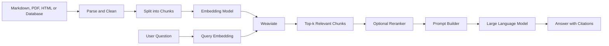
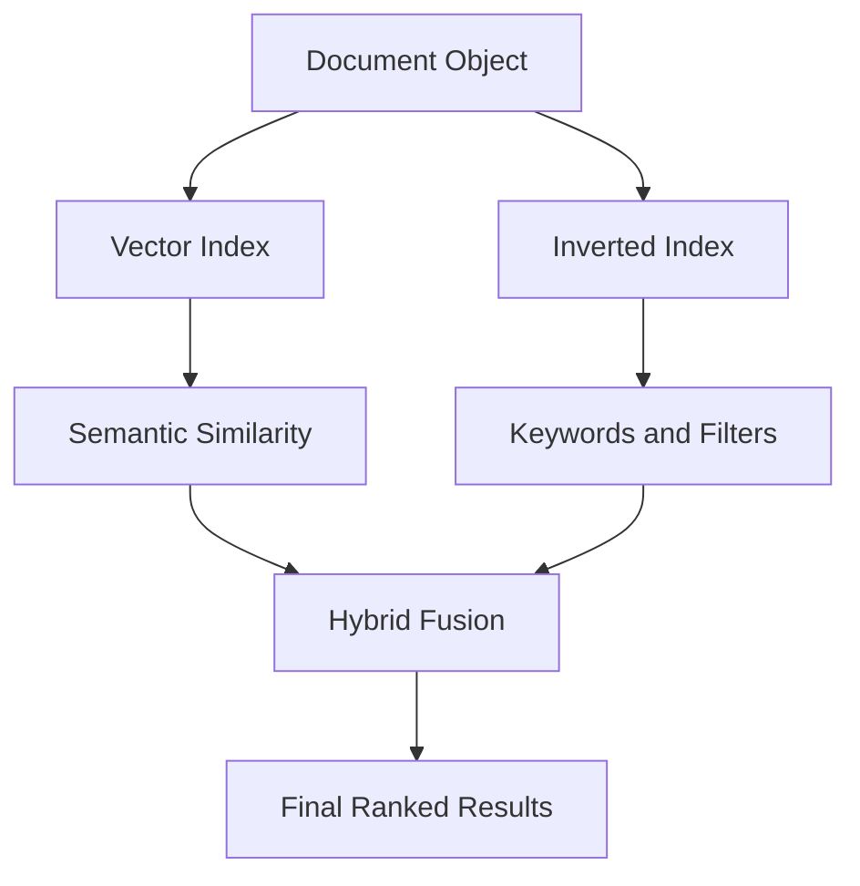
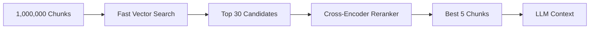
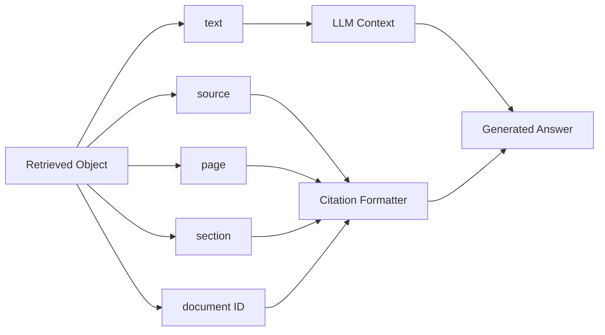
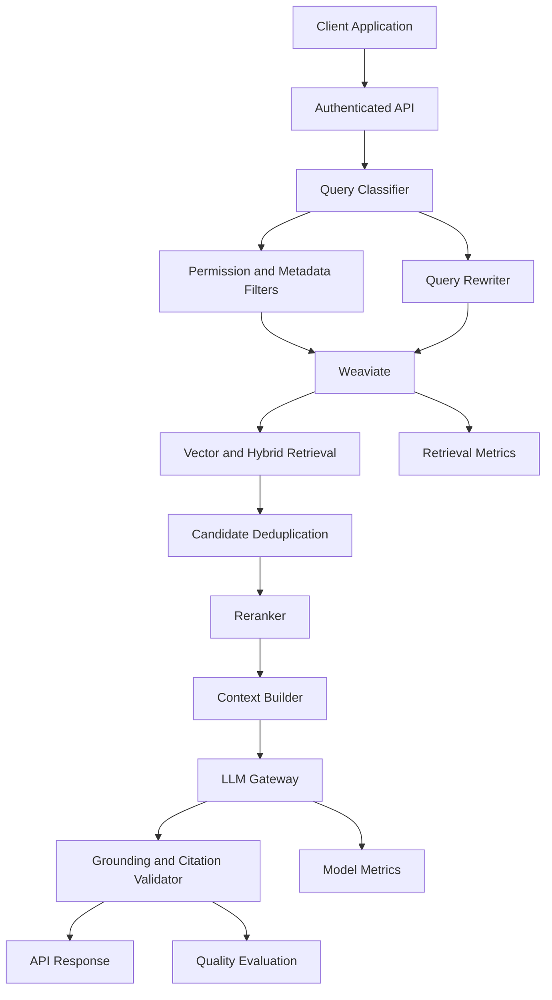

# 017 — Weaviate

**Course:** 03 — Knowledge Systems and RAG
**Module:** Module 08 — Embeddings and Vector Databases
**Content Group:** Vector Databases
**Roadmap Source:** Embeddings and Vector Databases / Vector Databases
**Lesson Type:** Embeddings and Vector Databases
**Order in Module:** 017
**Suggested Duration:** 24 minutes

---

## 1. Overview

**Weaviate** is an open-source vector database designed for AI applications such as:

* Semantic search
* Hybrid search
* Retrieval-Augmented Generation
* Recommendation systems
* Similarity-based classification
* Multimodal retrieval
* AI agents with knowledge tools

It stores data objects together with their vector embeddings and metadata. Applications can then retrieve objects based on semantic meaning rather than relying only on exact keyword matches.

Weaviate supports vector search, keyword search, metadata filtering, hybrid retrieval, reranking, and integrations with embedding and generative models. It can be deployed locally, through Docker or Kubernetes, or as a managed cloud service.

After completing this lesson, you should understand where Weaviate fits into an AI engineering workflow and how to use it as the retrieval layer of a small RAG application.

---

## 2. Learning Objectives

By the end of this lesson, you should be able to:

1. Explain Weaviate in your own words.
2. Describe the difference between objects, properties, metadata, and vectors.
3. Create a Weaviate collection.
4. Import document chunks into Weaviate.
5. Perform semantic, keyword, hybrid, and filtered searches.
6. Use retrieved chunks as context for an LLM.
7. Evaluate retrieval quality using a test dataset.
8. Identify common production risks and limitations.
9. Build a small portfolio project using Weaviate.

---

## 3. What Is Weaviate?

Weaviate is a database optimized for storing and searching:

```text
Structured properties + unstructured content + vector embeddings
```

A conventional database might answer:

> Find documents where `category = "security"`.

A vector database can answer:

> Find documents whose meaning is similar to “How should user identity be verified?”

The retrieved document does not need to contain exactly the same words as the query.

For example:

```text
Query:
"How do we prevent users from impersonating another account?"

Relevant document:
"The server must derive user_id from the authenticated session
instead of accepting an identity supplied by the client."
```

The two sentences use different words, but their meanings are closely related. An embedding model places them near each other in vector space.

Weaviate stores the resulting vectors and provides indexes for finding nearby vectors efficiently.

---

## 4. Core Data Model

Weaviate organizes data into **collections**.

A collection is similar to a table in a relational database, although it is designed to store both properties and vectors.

Each object normally contains:

```json
{
  "text": "The server must derive user_id from the verified token.",
  "source": "security-guide.md",
  "page": 4,
  "category": "authentication",
  "language": "en"
}
```

Behind the object, Weaviate stores one or more vectors:

```text
[0.018, -0.224, 0.091, ..., 0.037]
```

The data can therefore be viewed as:

```text
Object
├── Properties
│   ├── text
│   ├── source
│   ├── page
│   ├── category
│   └── language
│
└── Vector
    └── Numerical representation of semantic meaning
```

Every object belongs to a collection. Collections define properties, vectorizer configuration, vector-index settings, inverted-index settings, and optional generative or reranking integrations.

---

## 5. Where Weaviate Fits in a RAG System

Weaviate is usually the **retrieval layer** of a RAG application.



Weaviate does not replace the whole RAG pipeline.

It primarily handles:

* Vector storage
* Vector indexing
* Keyword indexing
* Similarity search
* Metadata filtering
* Hybrid retrieval
* Optional reranking and generative integrations

Your application still needs to handle:

* Document parsing
* Chunking
* Access control
* Prompt construction
* LLM calls
* Citation formatting
* Evaluation
* Monitoring

---

## 6. Weaviate Indexes

Weaviate uses two important index categories.

### 6.1 Vector Index

The vector index is used for similarity search.

Common vector-index options include:

| Index   | Description                            | Suitable for                           |
| ------- | -------------------------------------- | -------------------------------------- |
| HNSW    | Approximate nearest-neighbor graph     | Medium and large collections           |
| Flat    | Brute-force vector comparison          | Small collections                      |
| Dynamic | Starts flat and switches as data grows | Collections with uncertain future size |

HNSW is the default vector-index type. Weaviate also supports flat and dynamic indexes.

### 6.2 Inverted Index

The inverted index supports:

* Keyword search
* BM25 ranking
* Metadata filters
* Numeric filters
* Exact-match conditions
* Sorting and aggregation

A collection can therefore support both semantic retrieval and traditional search.



---

## 7. Main Search Methods

### 7.1 Vector Search

Vector search retrieves objects whose embeddings are closest to the query embedding.

With an integrated vectorizer, Weaviate can convert query text into a vector automatically:

```python
response = chunks.query.near_text(
    query="How should user identity be validated?",
    limit=3,
)
```

The `near_text` operator searches for objects whose vectors are most similar to the vector generated from the input text.

When your application generates vectors itself, use `near_vector`:

```python
response = chunks.query.near_vector(
    near_vector=query_embedding,
    limit=3,
)
```

Weaviate supports both automatically generated vectors and vectors supplied by the application.

---

### 7.2 Keyword Search

Keyword search is useful when exact terms matter.

Examples include:

* Product codes
* Error messages
* API endpoint names
* Legal clauses
* User IDs
* Function names
* Technical acronyms

A query such as:

```text
KSOLM-226
```

may perform better with keyword search than pure semantic search because the exact identifier carries most of the meaning.

Weaviate uses BM25-family keyword ranking for this type of retrieval.

---

### 7.3 Hybrid Search

Hybrid search combines:

```text
Semantic vector search + BM25 keyword search
```

Weaviate runs both search methods and fuses their results into one ranked list. The relative contribution of vector and keyword search can be controlled.

Example:

```python
response = chunks.query.hybrid(
    query="KSOLM-226 reading cache expiry bug",
    alpha=0.65,
    limit=5,
)
```

The `alpha` value controls the balance.

```text
alpha = 0.0  → keyword-focused
alpha = 1.0  → vector-focused
alpha = 0.5  → balanced combination
```

Hybrid search is often a strong default for technical documentation because users may include both natural-language intent and exact technical terms.

---

### 7.4 Metadata Filtering

Metadata filters narrow the search space.

```python
from weaviate.classes.query import Filter

response = chunks.query.near_text(
    query="How should authentication information be handled?",
    filters=(
        Filter.by_property("language").equal("en")
        & Filter.by_property("category").equal("security")
    ),
    limit=3,
)
```

Useful metadata includes:

```text
source
page
section
language
document_type
category
created_at
updated_at
tenant_id
user_id
access_level
version
```

Weaviate combines an inverted index with the vector index to support efficient filtered vector searches rather than simply removing invalid results after retrieval.

---

### 7.5 Reranking

Initial vector or hybrid search is usually fast but approximate.

A reranker can inspect the top candidates more carefully and reorder them.



Reranking is useful when:

* The document collection is large.
* Questions are complex.
* Several chunks appear semantically similar.
* Retrieval precision is more important than minimum latency.
* The first-stage embedding model is relatively small.

Weaviate supports reranker integrations that reorder an initial result set using another model or criterion.

---

## 8. Basic Weaviate Workflow

A typical ingestion workflow is:

```text
1. Load documents
2. Clean the text
3. Split documents into chunks
4. Attach metadata
5. Generate embeddings
6. Store chunks and vectors in Weaviate
7. Create a retrieval test set
```

The query workflow is:

```text
1. Receive a question
2. Detect filters or permissions
3. Generate the query vector
4. Run vector or hybrid search
5. Retrieve more candidates than required
6. Optionally rerank candidates
7. Select the final context
8. Send context to the LLM
9. Return an answer with citations
```

---

## 9. Practical Demo: Document Search with Weaviate

This example assumes that:

* Weaviate is running locally.
* Ollama is available to the Weaviate instance.
* The `nomic-embed-text` model has been downloaded.
* The Python Weaviate client is installed.

The official local quickstart uses Docker-based Weaviate and Ollama services and exposes Weaviate through HTTP port `8080` and gRPC port `50051`.

### 9.1 Install the Client

```bash
pip install -U weaviate-client
```

---

### 9.2 Create a Collection

```python
import weaviate
from weaviate.classes.config import Configure, Property, DataType

COLLECTION_NAME = "DocumentChunk"

with weaviate.connect_to_local() as client:
    # Recreate the collection for this learning demo.
    if client.collections.exists(COLLECTION_NAME):
        client.collections.delete(COLLECTION_NAME)

    chunks = client.collections.create(
        name=COLLECTION_NAME,
        vector_config=Configure.Vectors.text2vec_ollama(
            api_endpoint="http://ollama:11434",
            model="nomic-embed-text",
        ),
        properties=[
            Property(name="text", data_type=DataType.TEXT),
            Property(name="source", data_type=DataType.TEXT),
            Property(name="page", data_type=DataType.INT),
            Property(name="category", data_type=DataType.TEXT),
            Property(name="language", data_type=DataType.TEXT),
        ],
    )

    print(f"Created collection: {chunks.name}")
```

The collection uses an Ollama embedding integration, so Weaviate can vectorize imported objects and text queries automatically. This follows the current collections-based Python client workflow shown in the official local quickstart.

---

### 9.3 Import Document Chunks

```python
import weaviate

documents = [
    {
        "text": (
            "The server must derive user_id from the authenticated token. "
            "The backend must not trust a user_id supplied in the request body."
        ),
        "source": "security-guide.md",
        "page": 1,
        "category": "security",
        "language": "en",
    },
    {
        "text": (
            "Hybrid search combines semantic vector retrieval with keyword "
            "search to improve results containing both concepts and exact terms."
        ),
        "source": "retrieval-guide.md",
        "page": 3,
        "category": "retrieval",
        "language": "en",
    },
    {
        "text": (
            "Each document chunk should store its original source, page number, "
            "section heading, and access-control metadata."
        ),
        "source": "rag-checklist.md",
        "page": 2,
        "category": "rag",
        "language": "en",
    },
    {
        "text": (
            "Retrieval quality should be measured using a fixed question set "
            "instead of evaluating only a few successful demo queries."
        ),
        "source": "evaluation-guide.md",
        "page": 5,
        "category": "evaluation",
        "language": "en",
    },
]

with weaviate.connect_to_local() as client:
    chunks = client.collections.use("DocumentChunk")

    with chunks.batch.dynamic() as batch:
        for document in documents:
            batch.add_object(properties=document)

    failed = chunks.batch.failed_objects

    if failed:
        raise RuntimeError(f"Import failed for {len(failed)} objects")

    print(f"Imported {len(documents)} chunks")
```

Batch operations are preferable to individual insert requests when importing multiple objects.

---

### 9.4 Perform Semantic Search

```python
import weaviate
from weaviate.classes.query import MetadataQuery

question = "How can the API prevent one user from impersonating another?"

with weaviate.connect_to_local() as client:
    chunks = client.collections.use("DocumentChunk")

    response = chunks.query.near_text(
        query=question,
        limit=3,
        return_metadata=MetadataQuery(distance=True),
    )

    for position, obj in enumerate(response.objects, start=1):
        print(f"\nResult {position}")
        print(f"Source: {obj.properties['source']}")
        print(f"Page: {obj.properties['page']}")
        print(f"Distance: {obj.metadata.distance}")
        print(f"Text: {obj.properties['text']}")
```

Expected relevant result:

```text
The server must derive user_id from the authenticated token.
The backend must not trust a user_id supplied in the request body.
```

The query and result do not use identical wording, but they express the same security concept.

---

### 9.5 Perform Hybrid Search

```python
import weaviate
from weaviate.classes.query import Filter

question = "user_id request body authentication"

with weaviate.connect_to_local() as client:
    chunks = client.collections.use("DocumentChunk")

    response = chunks.query.hybrid(
        query=question,
        alpha=0.65,
        filters=Filter.by_property("language").equal("en"),
        limit=3,
    )

    for obj in response.objects:
        print(
            {
                "source": obj.properties["source"],
                "page": obj.properties["page"],
                "text": obj.properties["text"],
            }
        )
```

This query benefits from both:

* Semantic understanding of identity and authentication
* Exact matching for the term `user_id`

---

## 10. Turning Retrieval into RAG

After retrieving relevant chunks, combine them into a controlled prompt.

```python
def build_rag_prompt(question: str, objects: list) -> str:
    context_parts = []

    for index, obj in enumerate(objects, start=1):
        source = obj.properties["source"]
        page = obj.properties["page"]
        text = obj.properties["text"]

        context_parts.append(
            f"[{index}] Source: {source}, page {page}\n{text}"
        )

    context = "\n\n".join(context_parts)

    return f"""
You are a technical assistant.

Answer the question using only the supplied context.

Rules:
- Do not invent information.
- Cite supporting chunks using [1], [2], and so on.
- When the context is insufficient, clearly say so.
- Prefer a direct and technically precise answer.

Question:
{question}

Context:
{context}

Answer:
""".strip()
```

Usage:

```python
with weaviate.connect_to_local() as client:
    chunks = client.collections.use("DocumentChunk")

    retrieval = chunks.query.hybrid(
        query="How should user_id be validated?",
        alpha=0.65,
        limit=4,
    )

    prompt = build_rag_prompt(
        question="How should user_id be validated?",
        objects=retrieval.objects,
    )

    # Provider-neutral example:
    answer = llm.generate(prompt)

    print(answer)
```

In production, preserve source metadata through every stage:



---

## 11. Choosing a Retrieval Strategy

| Situation                              | Recommended starting point   |
| -------------------------------------- | ---------------------------- |
| Natural-language questions             | Vector search                |
| Exact IDs, error codes, or names       | Keyword search               |
| Technical documentation                | Hybrid search                |
| Search limited by language or category | Search with filters          |
| High precision required                | Hybrid search plus reranking |
| Application generates embeddings       | `near_vector`                |
| Weaviate generates embeddings          | `near_text`                  |
| Multiple embedding purposes            | Named vectors                |

Weaviate collections can contain multiple named vectors. Each vector space can use its own vectorizer, index settings, compression strategy, and distance metric.

For example, a product object could contain separate vectors for:

```text
title_vector
description_vector
image_vector
review_vector
```

The application can then select the correct target vector for each query.

---

## 12. Chunking Strategy

Weaviate can retrieve only what you store effectively.

A poor chunking strategy cannot be repaired completely by changing the vector database.

### Chunk Too Large

Possible problems:

* Multiple unrelated ideas share one vector.
* Retrieved context contains unnecessary information.
* LLM input becomes expensive.
* The exact answer may be buried inside a large block.

### Chunk Too Small

Possible problems:

* Important context is separated.
* References such as “it” or “this method” lose meaning.
* Search results contain incomplete sentences.
* Many chunks are needed to answer one question.

### Practical Starting Point

For general technical documentation:

```text
Chunk size:      300–700 tokens
Overlap:         50–120 tokens
Boundaries:      Prefer headings and paragraphs
Metadata:        source, page, section, language, access scope
```

These values are starting hypotheses, not universal rules. Measure retrieval quality on real questions before choosing the final configuration.

---

## 13. Retrieval Evaluation

Do not evaluate a vector database only by manually trying two or three queries.

Create a small retrieval dataset:

```json
[
  {
    "question": "How should user_id be populated?",
    "expected_sources": ["security-guide.md"],
    "expected_pages": [1]
  },
  {
    "question": "Why should metadata include page numbers?",
    "expected_sources": ["rag-checklist.md"],
    "expected_pages": [2]
  }
]
```

### Useful Metrics

#### Hit Rate at k

Did at least one relevant chunk appear in the top `k` results?

```text
Hit@5 = successful_queries / total_queries
```

#### Recall at k

What percentage of expected relevant chunks appeared in the top `k`?

```text
Recall@k =
retrieved_relevant_chunks / all_expected_relevant_chunks
```

#### Mean Reciprocal Rank

How early did the first correct result appear?

```text
Correct result at position 1 → 1.00
Correct result at position 2 → 0.50
Correct result at position 4 → 0.25
```

#### End-to-End Groundedness

Check whether the final answer:

* Uses retrieved evidence
* Includes valid citations
* Avoids unsupported claims
* Admits when context is missing

#### Operational Metrics

Also measure:

```text
Retrieval latency p50 and p95
Embedding latency
Reranking latency
LLM latency
Index size
Memory consumption
Failed import count
Empty-result rate
Cost per query
```

---

## 14. Failure Cases to Test

A serious evaluation set should include more than easy questions.

### 14.1 Synonym Query

```text
Document: account impersonation
Query: identity spoofing
```

Tests semantic understanding.

### 14.2 Exact Identifier

```text
Query: KSOLM-226
```

Tests keyword and hybrid retrieval.

### 14.3 Ambiguous Query

```text
Query: cache problem
```

Tests whether the system retrieves too many unrelated chunks.

### 14.4 Metadata Constraint

```text
Query: authentication rules
Filter: language = en
```

Tests filter correctness.

### 14.5 Unanswerable Question

```text
Query: What is the company's 2028 revenue target?
```

Tests whether the application recognizes missing evidence.

### 14.6 Conflicting Documents

```text
Document A: user_id may come from request body
Document B: user_id must come from verified token
```

Tests document versioning and conflict handling.

### 14.7 Access-Control Test

```text
User A asks for a document owned by User B.
```

Tests whether filtering prevents unauthorized retrieval.

---

## 15. Common Mistakes

### Mistake 1: Storing Text Without Source Metadata

Bad object:

```json
{
  "text": "The server must verify the user identity."
}
```

Better object:

```json
{
  "text": "The server must verify the user identity.",
  "source": "security-guide.md",
  "page": 4,
  "section": "Authentication",
  "version": "2.1"
}
```

Without source metadata, reliable citations become difficult.

---

### Mistake 2: Using Only Top-k

Setting:

```python
limit=5
```

does not guarantee that all five results are relevant.

Consider:

* Distance thresholds
* Hybrid scoring
* Metadata filters
* Reranking
* Result deduplication
* Context diversity

---

### Mistake 3: Using the Same Embedding Model Without Testing

Embedding models differ by:

* Language support
* Input length
* Domain knowledge
* Vector dimensions
* Retrieval quality
* Latency
* Hosting cost

Test models using your own queries rather than selecting one only from benchmark scores.

---

### Mistake 4: Changing Embedding Models Without Reindexing

Vectors from different embedding models generally do not share the same vector space.

Do not:

```text
Index documents with Model A
Query them using vectors from Model B
```

When changing the embedding model, create a migration plan and regenerate document embeddings.

---

### Mistake 5: Treating Weaviate as the Entire RAG System

Weaviate does not automatically guarantee:

* Correct chunking
* Correct answers
* Complete citations
* User authorization
* Prompt safety
* Hallucination prevention
* High-quality evaluation

It is one important component inside a larger system.

---

### Mistake 6: Trusting Client-Supplied Access Metadata

Do not trust a client to provide authoritative fields such as:

```text
user_id
tenant_id
organization_id
access_level
```

The server should derive identity and permission filters from the authenticated session.

A secure query should conceptually behave like:

```python
verified_user_id = authenticated_session.user_id

filters = Filter.by_property("owner_id").equal(
    verified_user_id
)
```

The client may provide the search question, but it should not be able to select another user's identity.

---

### Mistake 7: Evaluating Only Successful Examples

Always record:

* Queries with no correct result
* Incorrect top-1 results
* Duplicate chunks
* Outdated documents
* Permission-filter failures
* Queries requiring exact keyword matches
* Queries with insufficient evidence

Failure cases provide more useful engineering information than a polished demo.

---

## 16. Production Architecture



### Production Responsibilities

#### API Layer

* Authentication
* Rate limiting
* Request validation
* Tenant isolation
* Logging
* Trace IDs

#### Retrieval Layer

* Query embedding
* Vector or hybrid search
* Metadata filters
* Reranking
* Deduplication

#### Generation Layer

* Prompt templates
* LLM routing
* Token-budget management
* Structured output
* Safety rules

#### Evaluation Layer

* Retrieval test set
* Groundedness checks
* Citation verification
* Latency dashboards
* Failure analysis

---

## 17. When Weaviate Is a Good Fit

Consider Weaviate when your application needs several of these capabilities:

* Open-source deployment
* Managed cloud deployment
* Semantic vector search
* Keyword search
* Hybrid retrieval
* Structured metadata filters
* Integrated model providers
* Multiple named vectors
* Reranking
* Multimodal retrieval
* Multi-tenant data organization
* Local development followed by production deployment

Deployment options documented by Weaviate include embedded mode, Docker Compose, Weaviate Cloud, Kubernetes, and hybrid SaaS configurations. Embedded Weaviate is documented as experimental, so it should be evaluated carefully before production use.

---

## 18. Limitations and Trade-offs

### Operational Complexity

A self-hosted deployment requires responsibility for:

* Storage
* Backups
* Availability
* Scaling
* Monitoring
* Authentication
* Authorization
* Version upgrades

### Memory and Index Cost

Approximate nearest-neighbor indexes improve search speed but consume storage and memory.

### Model Dependency

Retrieval quality depends heavily on the selected embedding and reranking models.

### Migration Cost

Changing vector dimensions or embedding models may require rebuilding the collection.

### Approximate Search

Fast vector indexes may trade a small amount of recall for lower latency.

### Filtering Design

Poor metadata design can make authorization and targeted retrieval difficult.

### RAG Is Not Automatically Grounded

Relevant retrieval reduces hallucination risk, but it does not guarantee that an LLM will use the evidence correctly.

---

## 19. Hands-on Exercise

Build a small semantic search system for Markdown or PDF files.

### Requirements

1. Select 5–10 documents.
2. Parse their text.
3. Split them into chunks.
4. Store at least these properties:

```text
text
source
page
section
language
category
```

5. Import the chunks into Weaviate.
6. Implement:

   * Vector search
   * Hybrid search
   * Metadata filtering
7. Create at least 15 test questions.
8. Record the top five results for each question.
9. Compare at least two retrieval configurations.
10. Generate answers with citations.

### Suggested Experiment Table

| Experiment | Chunk size | Overlap | Search | Alpha | Reranker |
| ---------- | ---------: | ------: | ------ | ----: | -------- |
| A          |        300 |      50 | Vector |     — | No       |
| B          |        500 |      80 | Vector |     — | No       |
| C          |        500 |      80 | Hybrid |   0.5 | No       |
| D          |        500 |      80 | Hybrid |   0.7 | Yes      |

### Record the Results

| Question                       | Expected source   | Top-1 source       | Hit@5 | Notes                    |
| ------------------------------ | ----------------- | ------------------ | ----- | ------------------------ |
| How is user identity verified? | security-guide.md | security-guide.md  | Yes   | Correct                  |
| Why store page metadata?       | rag-checklist.md  | retrieval-guide.md | Yes   | Correct result at rank 3 |
| What is KSOLM-226?             | bug-report.md     | unrelated.md       | No    | Increase keyword weight  |

---

## 20. Portfolio Project

### Project Title

**Semantic Search and RAG API with Weaviate**

### Suggested Technology Stack

```text
Python
FastAPI
Weaviate
Sentence Transformers, Ollama, or hosted embeddings
An LLM provider
PyMuPDF or another document parser
Docker Compose
Pytest
```

### Suggested API Routes

```http
POST /documents/upload
POST /documents/index
POST /search
POST /rag/answer
GET  /documents/{document_id}
GET  /health
GET  /metrics
```

### Example Search Request

```json
{
  "query": "How should user identity be validated?",
  "search_type": "hybrid",
  "top_k": 5,
  "filters": {
    "language": "en",
    "category": "security"
  }
}
```

### Example Response

```json
{
  "query": "How should user identity be validated?",
  "results": [
    {
      "text": "The server must derive user_id from the verified token.",
      "source": "security-guide.md",
      "page": 1,
      "score": 0.91
    }
  ]
}
```

### Portfolio Deliverables

* Architecture diagram
* Docker setup
* Ingestion script
* Search API
* RAG endpoint
* Evaluation dataset
* Retrieval metrics
* Failure-case report
* README with setup instructions
* Screenshots or a short demonstration video

---

## 21. Production Checklist

### Data

* [ ] Documents are cleaned before indexing.
* [ ] Chunk sizes have been evaluated.
* [ ] Every chunk has source metadata.
* [ ] Document versions are recorded.
* [ ] Deleted documents are removed from the index.
* [ ] Duplicate chunks are detected.

### Embeddings

* [ ] The embedding model supports the required languages.
* [ ] Document and query embeddings use the same model.
* [ ] Vector dimensions are consistent.
* [ ] Model migration has a reindexing strategy.

### Retrieval

* [ ] Vector search has been tested.
* [ ] Keyword search has been tested.
* [ ] Hybrid-search weights have been evaluated.
* [ ] Metadata filters are applied correctly.
* [ ] Retrieval thresholds are calibrated.
* [ ] Reranking is evaluated where necessary.

### Security

* [ ] Authentication is enabled.
* [ ] Anonymous access is disabled in production unless explicitly required.
* [ ] Authorization filters come from the server.
* [ ] Tenant identifiers are not trusted from request bodies.
* [ ] Sensitive metadata is not exposed in responses.
* [ ] Logs do not leak private document content.

Weaviate supports authentication through API keys or OpenID Connect, along with configurable authorization levels. Anonymous access is also possible, but it should not be enabled casually in production systems.

### Reliability

* [ ] Persistent storage is configured.
* [ ] Backups are tested.
* [ ] Import failures are monitored.
* [ ] Query latency is measured.
* [ ] Collection size is monitored.
* [ ] Version upgrades are tested before deployment.

For Docker and Kubernetes deployments, data persistence requires storage outside the container lifecycle, such as a mounted volume.

### RAG Quality

* [ ] Answers contain citations.
* [ ] Citations point to retrieved documents.
* [ ] Unanswerable questions are tested.
* [ ] Conflicting documents are handled.
* [ ] Retrieval and generation are evaluated separately.
* [ ] A regression dataset runs before releases.

---

## 22. Completion Checklist

* [ ] I can explain Weaviate in one or two minutes.
* [ ] I understand collections, objects, properties, and vectors.
* [ ] I can create and populate a collection.
* [ ] I can perform vector search.
* [ ] I can perform hybrid search.
* [ ] I can apply metadata filters.
* [ ] I can preserve source and page metadata for citations.
* [ ] I have created a small retrieval test set.
* [ ] I have recorded at least one retrieval failure.
* [ ] I understand that vector search is only one part of RAG.
* [ ] I can identify security and production concerns.
* [ ] I have a demo or portfolio artifact for this lesson.

---

## 23. Related Outcome

Build semantic search systems using:

```text
Embeddings
Vector indexes
Keyword indexes
Metadata filters
Similarity search
Hybrid retrieval
Reranking
Retrieval evaluation
```

---

## 24. Related Project

**Project 7: Semantic Search Engine for Markdown and PDF Files**

Use:

```text
Document parsing
→ Chunking
→ Embedding generation
→ Weaviate indexing
→ Hybrid retrieval
→ Reranking
→ LLM generation
→ Citation rendering
→ Evaluation
```

Possible vector database implementations for the project include Weaviate, Chroma, Qdrant, or FAISS. In this lesson, Weaviate should be used as the primary storage and retrieval layer.

---

## 25. Summary

Weaviate is an open-source vector database for building semantic search, hybrid search, recommendation, multimodal retrieval, and RAG applications.

Its main role is to:

```text
Store data objects and vectors
        ↓
Index vectors and structured properties
        ↓
Retrieve relevant objects
        ↓
Provide grounded context to an AI application
```

The most important engineering lesson is that installing a vector database is not enough.

A reliable system requires:

```text
Good documents
+ sensible chunks
+ useful metadata
+ a suitable embedding model
+ tested retrieval
+ secure filtering
+ correct citations
+ measurable failure cases
```

Do not evaluate Weaviate only by checking whether a single top-k demo appears to work. Build a real test set, inspect incorrect results, measure retrieval quality, and verify that the final RAG answers are supported by the retrieved evidence.

---

# Bài luyện tập

## Mục tiêu


## Đề bài


## Yêu cầu hoàn thành

- [ ] 
- [ ] 
- [ ] 

## Kết quả / lời giải


## Ghi chú
