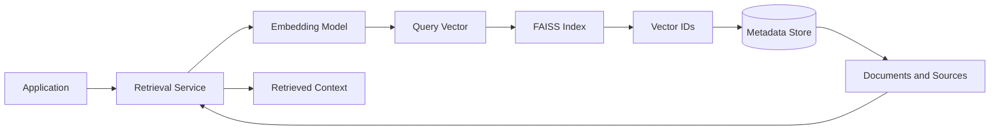
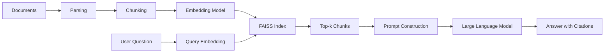
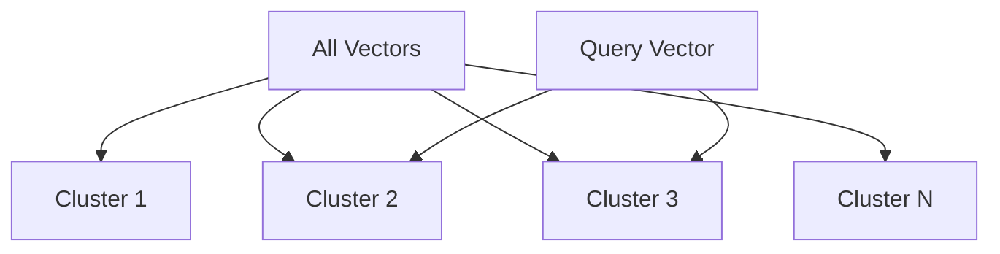
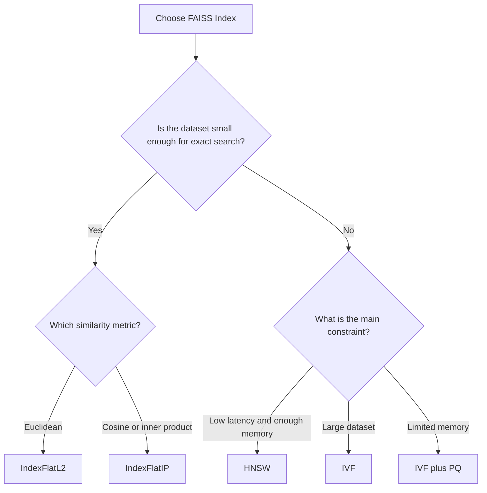
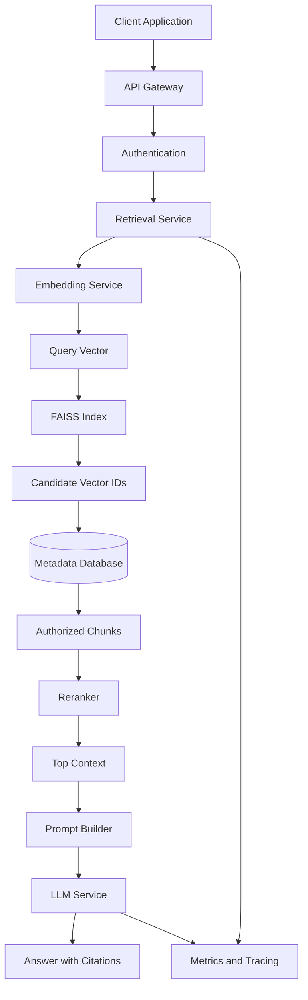

# 018 — FAISS

**Course:** 03 — Knowledge Systems and RAG
**Module:** Module 08 — Embeddings and Vector Databases
**Content Group:** Vector Databases
**Roadmap Source:** Embeddings and Vector Databases / Vector Databases
**Lesson Type:** Embeddings and Vector Databases
**Lesson Order:** 018
**Suggested Duration:** 24 minutes

---

## 1. Overview

This lesson explains **FAISS** in the context of modern AI engineering.

FAISS, which stands for **Facebook AI Similarity Search**, is a library designed for efficient similarity search and clustering of dense vectors. It is commonly used in semantic search, recommendation systems, duplicate detection, image retrieval, and Retrieval-Augmented Generation systems.

After completing this lesson, you should understand:

* What FAISS is and what problems it solves.
* Where FAISS fits in an AI application.
* How to create and search a local vector index.
* How FAISS differs from a full vector database.
* What additional infrastructure must be built around FAISS for production use.

---

## 2. Learning Objectives

By the end of this lesson, you should be able to:

* Explain FAISS in your own words.
* Describe how FAISS performs vector similarity search.
* Identify where FAISS fits in a RAG or semantic search pipeline.
* Create a basic FAISS index.
* Add embeddings to an index and retrieve the nearest vectors.
* Select an appropriate FAISS index type.
* Understand the responsibilities FAISS does not handle automatically.
* Build a small semantic search or RAG portfolio project using FAISS.

---

## 3. What Is FAISS?

**FAISS** is an open-source library for searching large collections of dense vectors efficiently.

An embedding model converts data such as text, images, audio, or products into numerical vectors. FAISS stores these vectors in an index and finds the vectors that are closest to a query vector.

```text
Input data
    ↓
Embedding model
    ↓
Dense vectors
    ↓
FAISS index
    ↓
Nearest-neighbor search
    ↓
Most similar items
```

For example, suppose a user searches for:

```text
How can I reset my account password?
```

The query is converted into an embedding. FAISS compares that query embedding with document embeddings and returns semantically similar content, such as:

```text
To change your password, open Account Settings and select Security.
```

The two sentences do not use exactly the same words, but their embeddings may be close in vector space.

---

## 4. FAISS Is a Library, Not a Complete Vector Database

A common mistake is to describe FAISS as a full vector database.

FAISS mainly provides:

* Vector indexing.
* Nearest-neighbor search.
* Approximate nearest-neighbor algorithms.
* Vector clustering.
* Vector compression.
* CPU and GPU acceleration.

FAISS does **not** automatically provide all features expected from a production database.

You normally need to manage the following yourself:

* Original document storage.
* Metadata storage.
* Mapping between vector IDs and documents.
* Filtering by metadata.
* Authentication and authorization.
* Network APIs.
* Replication and high availability.
* Backups.
* Monitoring.
* Multi-user isolation.
* Index versioning.
* Distributed deployment.

A practical architecture may therefore look like this:



In this architecture:

* FAISS stores and searches vectors.
* A relational database or document store contains metadata.
* Object storage or a file system contains the original documents.
* A retrieval service connects these components.

---

## 5. Where FAISS Fits in an AI Workflow

FAISS is usually part of the **retrieval layer**.



The pipeline has two main phases.

### 5.1 Indexing Phase

The indexing phase prepares documents for retrieval.

```text
Documents
→ Parse
→ Clean
→ Split into chunks
→ Generate embeddings
→ Add embeddings to FAISS
→ Save metadata
```

### 5.2 Query Phase

The query phase retrieves relevant context.

```text
User query
→ Generate query embedding
→ Search FAISS
→ Receive vector IDs
→ Load matching chunks and metadata
→ Build the LLM prompt
→ Generate the answer
```

FAISS is responsible mainly for this step:

```text
Query vector → nearest vectors
```

---

## 6. Core FAISS Concepts

### 6.1 Vector

A vector is an array of numbers representing the semantic features of an item.

```python
vector = [0.12, -0.31, 0.89, 0.44]
```

Modern embedding vectors may contain hundreds or thousands of dimensions.

All vectors stored in the same FAISS index must normally have the same dimensionality.

---

### 6.2 Index

A FAISS index is a data structure used to store vectors and search for their nearest neighbors.

```text
FAISS index
├── Vector 0
├── Vector 1
├── Vector 2
└── Vector n
```

Different index types provide different trade-offs between:

* Search accuracy.
* Search speed.
* Memory usage.
* Index-building time.
* Training requirements.

---

### 6.3 Similarity Metric

FAISS can compare vectors using metrics such as:

* Euclidean distance.
* Inner product.
* Cosine similarity through normalized vectors.

#### Euclidean Distance

Euclidean distance measures the straight-line distance between two vectors.

[
d(x,y)=\sqrt{\sum_{i=1}^{n}(x_i-y_i)^2}
]

Smaller distance means greater similarity.

#### Inner Product

The inner product is calculated as:

[
x \cdot y = \sum_{i=1}^{n}x_i y_i
]

A larger inner-product score generally means greater similarity.

#### Cosine Similarity

Cosine similarity measures the angle between two vectors.

[
\text{cosine}(x,y)=
\frac{x \cdot y}
{\lVert x\rVert \lVert y\rVert}
]

Cosine similarity can be implemented in FAISS by:

1. Normalizing all document vectors.
2. Normalizing the query vector.
3. Searching with an inner-product index.

```python
faiss.normalize_L2(document_vectors)
faiss.normalize_L2(query_vector)
```

---

### 6.4 Top-k Search

The value `k` specifies how many nearest vectors should be returned.

```python
distances, indices = index.search(query_vector, k=5)
```

The result contains:

* `indices`: IDs of the nearest vectors.
* `distances`: distance or similarity values.

Choosing `k` involves a trade-off.

* A very small `k` may miss useful context.
* A very large `k` may introduce irrelevant information.
* More retrieved chunks also increase the LLM token cost.

---

## 7. Common FAISS Index Types

FAISS provides several index structures for different dataset sizes and performance requirements.

### 7.1 `IndexFlatL2`

`IndexFlatL2` performs exact nearest-neighbor search using Euclidean distance.

```python
index = faiss.IndexFlatL2(dimension)
```

Advantages:

* Exact results.
* Simple to use.
* No training required.
* Useful as a quality baseline.

Limitations:

* Compares the query against every stored vector.
* Can become slow for very large datasets.
* Stores all vectors in memory.

Use it when:

* The dataset is small or medium-sized.
* Exact retrieval is important.
* You are building a prototype.
* You need a baseline for evaluating approximate indexes.

---

### 7.2 `IndexFlatIP`

`IndexFlatIP` uses inner-product similarity.

```python
index = faiss.IndexFlatIP(dimension)
```

It is commonly used for cosine similarity after normalizing the vectors.

```python
faiss.normalize_L2(vectors)
index.add(vectors)
```

Use it when:

* Your embedding model recommends cosine similarity.
* Your vectors are normalized.
* You need exact similarity search.

---

### 7.3 IVF Index

IVF stands for **Inverted File Index**.

Instead of comparing a query with every vector, IVF divides vectors into clusters. During a search, FAISS examines only the most relevant clusters.



An IVF index must be trained before vectors are added.

```python
quantizer = faiss.IndexFlatL2(dimension)

index = faiss.IndexIVFFlat(
    quantizer,
    dimension,
    number_of_clusters,
    faiss.METRIC_L2,
)

index.train(training_vectors)
index.add(document_vectors)
```

The `nprobe` setting controls how many clusters are searched.

```python
index.nprobe = 10
```

Higher `nprobe` values usually provide:

* Better recall.
* Slower search.

Lower `nprobe` values usually provide:

* Faster search.
* Lower recall.

---

### 7.4 HNSW Index

HNSW stands for **Hierarchical Navigable Small World**.

It uses a graph structure to perform approximate nearest-neighbor search.

```python
index = faiss.IndexHNSWFlat(dimension, 32)
```

Advantages:

* Fast search.
* Strong retrieval quality.
* No separate clustering-training phase.

Limitations:

* Can require significant memory.
* Graph parameters require tuning.
* Deleting or updating data may require additional design.

HNSW is useful when low-latency search is important and sufficient memory is available.

---

### 7.5 Product Quantization

Product Quantization, or PQ, compresses vectors into smaller representations.

```python
index = faiss.IndexPQ(
    dimension,
    number_of_subquantizers,
    bits_per_code,
)
```

Advantages:

* Reduces memory usage.
* Makes large indexes more practical.
* Can improve search performance for large collections.

Limitations:

* Introduces approximation error.
* Requires training.
* May reduce retrieval accuracy.

PQ is often combined with IVF:

```text
IVF + Product Quantization
```

This combination is useful when working with millions or billions of vectors.

---

## 8. Exact Search vs Approximate Search

### Exact Search

Exact search compares the query against every vector.

```text
Query
→ Compare with Vector 1
→ Compare with Vector 2
→ Compare with Vector 3
→ ...
→ Compare with Vector N
```

Advantages:

* Returns the true nearest vectors.
* Easy to evaluate.
* No index training is required.

Disadvantages:

* Search time grows with the dataset.
* Memory usage may become large.

### Approximate Search

Approximate Nearest Neighbor search examines only part of the vector space.

```text
Query
→ Identify promising regions
→ Search selected candidates
→ Return approximate nearest vectors
```

Advantages:

* Faster for large datasets.
* Can scale to much larger collections.
* May use compression to reduce memory.

Disadvantages:

* May miss some true nearest neighbors.
* Requires index and parameter tuning.
* Needs evaluation using recall metrics.

---

## 9. Minimal FAISS Example

Install the CPU version of FAISS:

```bash
pip install faiss-cpu numpy
```

Create an exact Euclidean-distance index:

```python
import faiss
import numpy as np

dimension = 4

document_vectors = np.array(
    [
        [0.10, 0.20, 0.30, 0.40],
        [0.90, 0.80, 0.70, 0.60],
        [0.11, 0.19, 0.31, 0.39],
        [0.45, 0.55, 0.65, 0.75],
    ],
    dtype="float32",
)

index = faiss.IndexFlatL2(dimension)
index.add(document_vectors)

print("Vectors in index:", index.ntotal)

query_vector = np.array(
    [[0.12, 0.18, 0.32, 0.38]],
    dtype="float32",
)

k = 2
distances, indices = index.search(query_vector, k)

print("Nearest vector IDs:", indices)
print("Distances:", distances)
```

Possible output:

```text
Vectors in index: 4
Nearest vector IDs: [[2 0]]
Distances: [[0.0014 0.0024]]
```

Because this example uses Euclidean distance, lower scores indicate closer vectors.

---

## 10. Semantic Search Example

The following structure demonstrates how FAISS can be connected to an embedding model.

```python
from typing import Any

import faiss
import numpy as np
from sentence_transformers import SentenceTransformer


documents = [
    {
        "id": "doc-1",
        "text": "FAISS is a library for efficient vector similarity search.",
        "source": "faiss-notes.md",
    },
    {
        "id": "doc-2",
        "text": "A vector database may manage metadata, filtering, and persistence.",
        "source": "vector-databases.md",
    },
    {
        "id": "doc-3",
        "text": "Chunking divides long documents into smaller retrievable units.",
        "source": "chunking.md",
    },
    {
        "id": "doc-4",
        "text": "RAG provides retrieved context to a language model.",
        "source": "rag-introduction.md",
    },
]

model = SentenceTransformer("all-MiniLM-L6-v2")

texts = [document["text"] for document in documents]

document_vectors = model.encode(
    texts,
    convert_to_numpy=True,
).astype("float32")

faiss.normalize_L2(document_vectors)

dimension = document_vectors.shape[1]
index = faiss.IndexFlatIP(dimension)
index.add(document_vectors)


def search(query: str, top_k: int = 3) -> list[dict[str, Any]]:
    query_vector = model.encode(
        [query],
        convert_to_numpy=True,
    ).astype("float32")

    faiss.normalize_L2(query_vector)

    scores, indices = index.search(query_vector, top_k)

    results: list[dict[str, Any]] = []

    for score, vector_id in zip(scores[0], indices[0]):
        if vector_id < 0:
            continue

        document = documents[int(vector_id)]

        results.append(
            {
                "score": float(score),
                "document": document,
            }
        )

    return results


results = search(
    "What tool can search embedding vectors?",
    top_k=2,
)

for result in results:
    print(f"Score: {result['score']:.4f}")
    print(f"Text: {result['document']['text']}")
    print(f"Source: {result['document']['source']}")
    print()
```

This example uses:

* Sentence Transformers to generate embeddings.
* L2 normalization.
* `IndexFlatIP` for cosine-style similarity.
* A Python list as a simple metadata store.
* The FAISS vector position as the metadata lookup key.

---

## 11. Managing Metadata

FAISS returns vector IDs, not complete documents.

You therefore need a mapping such as:

```python
metadata_by_vector_id = {
    0: {
        "document_id": "doc-1",
        "source": "handbook.pdf",
        "page": 12,
        "text": "The password can be changed in account settings.",
    },
    1: {
        "document_id": "doc-2",
        "source": "security-guide.md",
        "section": "Authentication",
        "text": "Enable multi-factor authentication for additional security.",
    },
}
```

After searching FAISS:

```python
distances, indices = index.search(query_vector, k=2)

for vector_id in indices[0]:
    metadata = metadata_by_vector_id[int(vector_id)]
    print(metadata)
```

For larger applications, metadata may be stored in:

* PostgreSQL.
* SQLite.
* MongoDB.
* Redis.
* A document database.
* A key-value store.
* Object storage.

The mapping between vector IDs and metadata must remain consistent.

---

## 12. Adding Explicit IDs

By default, a flat index assigns sequential vector positions.

You can use `IndexIDMap` to associate vectors with your own numeric IDs.

```python
dimension = document_vectors.shape[1]

base_index = faiss.IndexFlatIP(dimension)
index = faiss.IndexIDMap(base_index)

vector_ids = np.array(
    [101, 205, 309, 412],
    dtype="int64",
)

index.add_with_ids(document_vectors, vector_ids)
```

The search results will now return IDs such as:

```text
101
205
309
```

These IDs can be used to retrieve metadata from another data store.

---

## 13. Saving and Loading a FAISS Index

A FAISS index can be saved to disk.

```python
faiss.write_index(index, "documents.faiss")
```

Load it later:

```python
index = faiss.read_index("documents.faiss")
```

You should also persist the matching metadata.

```python
import json

with open("documents_metadata.json", "w", encoding="utf-8") as file:
    json.dump(
        documents,
        file,
        ensure_ascii=False,
        indent=2,
    )
```

A basic persistence structure might be:

```text
retrieval_data/
├── documents.faiss
├── documents_metadata.json
├── index_manifest.json
└── embedding_config.json
```

The manifest should record information such as:

```json
{
  "embedding_model": "all-MiniLM-L6-v2",
  "dimension": 384,
  "distance_metric": "cosine",
  "chunking_version": "v1",
  "document_count": 250,
  "vector_count": 1834
}
```

This information helps prevent incompatible vectors from being added to an existing index.

---

## 14. FAISS in a RAG Application

A FAISS-based RAG pipeline can be implemented as follows:

```python
def answer_question(question: str) -> str:
    query_vector = embedding_model.encode([question])
    query_vector = query_vector.astype("float32")

    faiss.normalize_L2(query_vector)

    scores, indices = index.search(query_vector, k=5)

    retrieved_chunks = []

    for vector_id in indices[0]:
        if vector_id < 0:
            continue

        retrieved_chunks.append(
            metadata_by_vector_id[int(vector_id)]
        )

    context = "\n\n".join(
        (
            f"Source: {chunk['source']}\n"
            f"Content: {chunk['text']}"
        )
        for chunk in retrieved_chunks
    )

    prompt = f"""
Answer the question using only the provided context.

Context:
{context}

Question:
{question}

Include citations using the source names.
"""

    return language_model.generate(prompt)
```

FAISS handles the vector search, while the application handles:

* Query embedding.
* Metadata lookup.
* Prompt construction.
* Citation formatting.
* LLM invocation.
* Safety checks.
* Response validation.

---

## 15. Metadata Filtering with FAISS

FAISS does not provide database-style metadata filtering by default.

Suppose the user requests:

```text
Find documents where:
- language = English
- department = Finance
- year >= 2025
```

A full vector database may combine these filters directly with vector search. With FAISS, you usually need to implement a strategy yourself.

### Strategy A: Search First, Filter Later

```text
FAISS retrieves top 100
→ Application filters metadata
→ Return top 10 valid results
```

This is simple but may fail when most retrieved candidates do not satisfy the filters.

### Strategy B: Separate Indexes

Create separate indexes by:

* Tenant.
* Language.
* Department.
* Document type.
* Security level.

```text
indexes/
├── finance_en.faiss
├── finance_vi.faiss
├── engineering_en.faiss
└── engineering_vi.faiss
```

This works for stable, low-cardinality categories but becomes difficult when many filter combinations exist.

### Strategy C: Pre-filter Candidate IDs

Use a database to select valid document IDs, then restrict vector search to those candidates.

This approach gives more control but requires additional application logic.

---

## 16. Choosing an Index

A simplified decision guide is:



A practical workflow is:

1. Start with `IndexFlatL2` or `IndexFlatIP`.
2. Build a retrieval evaluation dataset.
3. Measure exact-search quality.
4. Treat exact search as the baseline.
5. Introduce IVF, HNSW, or PQ only when needed.
6. Compare latency, recall, and memory usage.
7. Tune the approximate index using measured results.

---

## 17. Important Tuning Parameters

### `k`

Number of results returned.

```python
scores, indices = index.search(query_vector, k=10)
```

### `nlist`

Number of IVF clusters.

```python
number_of_clusters = 100
```

More clusters may improve search selectivity but require enough training data.

### `nprobe`

Number of IVF clusters examined during a query.

```python
index.nprobe = 10
```

Higher values generally improve recall while increasing latency.

### HNSW Connectivity

Controls the number of graph connections.

```python
index = faiss.IndexHNSWFlat(dimension, 32)
```

More connections may improve retrieval quality but require more memory.

### Product Quantization Configuration

Controls vector compression.

```python
index = faiss.IndexPQ(
    dimension,
    number_of_subquantizers,
    bits_per_code,
)
```

Higher compression reduces memory but may reduce accuracy.

---

## 18. Evaluating Retrieval Quality

A retrieval system should not be evaluated only by reading a few examples.

Create a test set:

```text
Question 1 → Expected document IDs
Question 2 → Expected document IDs
Question 3 → Expected document IDs
```

Example:

```json
[
  {
    "query": "How do I reset my password?",
    "relevant_document_ids": ["account-security-12"]
  },
  {
    "query": "What is the refund period?",
    "relevant_document_ids": ["billing-policy-03"]
  }
]
```

Useful retrieval metrics include:

### Recall@k

Measures whether relevant documents appear in the top `k` results.

[
\text{Recall@k}
===============

\frac{\text{Relevant documents retrieved in top k}}
{\text{Total relevant documents}}
]

### Precision@k

Measures how many retrieved documents are relevant.

[
\text{Precision@k}
==================

\frac{\text{Relevant documents retrieved in top k}}
{k}
]

### Mean Reciprocal Rank

Measures how early the first relevant result appears.

[
MRR =
\frac{1}{N}
\sum_{i=1}^{N}
\frac{1}{rank_i}
]

### Latency

Measure:

* Average search latency.
* P95 latency.
* P99 latency.

### Memory Usage

Track:

* Index file size.
* Runtime memory consumption.
* Memory per vector.

---

## 19. Common Failure Cases

### 19.1 Inconsistent Embedding Models

Documents are embedded with one model, while queries are embedded with another.

```text
Document model: Model A
Query model: Model B
```

Even when vector dimensions match, their vector spaces may be incompatible.

**Solution:** Use the same embedding model and configuration for both documents and queries.

---

### 19.2 Incorrect Similarity Metric

The embedding model expects cosine similarity, but the system uses raw Euclidean distance without validation.

**Solution:** Check the embedding model’s intended similarity metric and evaluate alternatives.

---

### 19.3 Missing Vector Normalization

`IndexFlatIP` is used as cosine similarity, but vectors are not normalized.

**Solution:**

```python
faiss.normalize_L2(document_vectors)
faiss.normalize_L2(query_vectors)
```

---

### 19.4 Incorrect Data Type

FAISS generally expects vectors in `float32` format.

```python
vectors = vectors.astype("float32")
```

Passing incompatible arrays can cause errors or unnecessary conversions.

---

### 19.5 Missing Metadata

The system stores embeddings but does not preserve:

* Source filename.
* Page number.
* Section title.
* Document ID.
* Chunk ID.
* Access-control information.

As a result, the application cannot provide citations or trace retrieved content.

---

### 19.6 Poor Chunking

Chunks may be:

* Too large.
* Too small.
* Missing context.
* Split in the middle of important sections.
* Repeated because of excessive overlap.

Chunking quality directly affects retrieval quality.

---

### 19.7 Evaluating by Intuition

The developer runs several queries, likes the results, and assumes the system works.

This does not reveal:

* Missed documents.
* Difficult queries.
* Incorrect ranking.
* Language-specific failures.
* Domain-specific failures.
* Performance regressions.

**Solution:** Create a versioned retrieval evaluation set.

---

### 19.8 Index and Metadata Misalignment

The FAISS vector at position `42` may no longer correspond to metadata record `42`.

This can happen when:

* Documents are deleted.
* Metadata is reordered.
* An old index is loaded with new metadata.
* Index and metadata files are deployed separately.

**Solution:** Version and deploy the index and metadata as one atomic artifact.

---

### 19.9 No Access-Control Filtering

A user may retrieve documents belonging to another user or organization.

FAISS does not automatically enforce permissions.

**Solution:** Apply tenant and authorization constraints before exposing retrieved content.

---

### 19.10 Using FAISS as an Entire Production Platform

FAISS is placed directly inside an API without:

* Backups.
* Concurrency planning.
* Monitoring.
* Index versioning.
* Failure recovery.
* Deployment controls.

**Solution:** Wrap FAISS in a properly designed retrieval service.

---

## 20. FAISS vs Vector Databases

| Capability                    |             FAISS | Managed Vector Database |
| ----------------------------- | ----------------: | ----------------------: |
| Vector similarity search      |               Yes |                     Yes |
| Exact search                  |               Yes |                 Usually |
| Approximate search            |               Yes |                     Yes |
| Local execution               |               Yes |               Sometimes |
| GPU support                   |               Yes |      Platform-dependent |
| Built-in metadata storage     |                No |                 Usually |
| Metadata filtering            | Manual or limited |        Usually built in |
| Persistence                   |            Manual |                Built in |
| Authentication                |                No |                 Usually |
| Network API                   |                No |                     Yes |
| Replication                   |            Manual |          Often built in |
| Horizontal scaling            |            Manual |       Usually supported |
| Multi-tenancy                 |            Manual |         Often supported |
| Operational control           |              High |      Platform-dependent |
| Infrastructure responsibility |         Developer |         Mostly provider |

FAISS is a strong choice when you need:

* Local vector search.
* Full control over indexing.
* Offline retrieval.
* A lightweight prototype.
* Custom retrieval infrastructure.
* Experimental index configurations.
* GPU-accelerated similarity search.
* No dependency on an external vector service.

A vector database may be a better choice when you need:

* Built-in persistence.
* Metadata filtering.
* Multi-user access.
* Horizontal scaling.
* Managed backups.
* Replication.
* Authentication.
* Production APIs.
* Simplified operations.

---

## 21. Example Production Architecture



The retrieval service may be responsible for:

* Loading the FAISS index.
* Generating query embeddings.
* Applying tenant filters.
* Retrieving metadata.
* Reranking results.
* Recording search latency.
* Logging retrieval failures.
* Returning traceable citations.

---

## 22. Practical Exercise

Build a small semantic search system using 5–10 documents.

### Step 1: Prepare Documents

Select several Markdown, text, or PDF files.

For each document, preserve:

* Document ID.
* Filename.
* Section heading.
* Page number when available.
* Original text.

### Step 2: Split Documents into Chunks

Experiment with:

* Fixed-length chunking.
* Paragraph-based chunking.
* Heading-aware chunking.
* Different overlap sizes.

### Step 3: Generate Embeddings

Use one embedding model for both:

* Document chunks.
* User queries.

Save the embedding model name and version.

### Step 4: Create a FAISS Index

Start with:

```python
faiss.IndexFlatIP(dimension)
```

Normalize vectors when using cosine-style similarity.

### Step 5: Save Metadata

Maintain a mapping:

```text
vector ID → document ID → source → page → chunk text
```

### Step 6: Search the Index

Run at least 10 test questions and record:

* Query.
* Top-k results.
* Similarity scores.
* Expected source.
* Actual source.
* Success or failure.

### Step 7: Evaluate Retrieval

Measure:

* Recall@1.
* Recall@3.
* Recall@5.
* Search latency.
* Failure patterns.

### Step 8: Add RAG Generation

Send retrieved chunks to an LLM and require source citations.

### Step 9: Analyze Failures

For each failure, determine whether the cause is:

* Poor chunking.
* Weak embeddings.
* Incorrect distance metric.
* Missing normalization.
* Insufficient `k`.
* Ambiguous query.
* Duplicate content.
* Missing metadata.
* Approximate-index configuration.

---

## 23. Suggested Project Structure

```text
faiss-semantic-search/
├── data/
│   ├── raw/
│   └── processed/
├── indexes/
│   ├── documents.faiss
│   ├── metadata.json
│   └── manifest.json
├── src/
│   ├── chunking.py
│   ├── embeddings.py
│   ├── indexing.py
│   ├── retrieval.py
│   ├── evaluation.py
│   └── api.py
├── tests/
│   ├── retrieval_cases.json
│   └── test_retrieval.py
├── requirements.txt
└── README.md
```

---

## 24. Production Checklist

### Data Preparation

* [ ] Documents are parsed correctly.
* [ ] Chunk boundaries preserve meaningful context.
* [ ] Duplicate chunks are removed.
* [ ] Every chunk has a stable ID.
* [ ] Source and page metadata are preserved.

### Embeddings

* [ ] Documents and queries use the same embedding model.
* [ ] Vector dimensions are validated.
* [ ] The similarity metric matches the embedding model.
* [ ] Normalization is applied consistently.
* [ ] Embedding model versions are recorded.

### FAISS Index

* [ ] The index type matches the dataset size.
* [ ] Exact search is used as an evaluation baseline.
* [ ] IVF indexes are trained with representative data.
* [ ] Approximate-search parameters are evaluated.
* [ ] The index can be saved and restored.
* [ ] Index and metadata versions remain synchronized.

### Retrieval Quality

* [ ] A retrieval test set exists.
* [ ] Recall@k is measured.
* [ ] Latency is measured.
* [ ] Failure cases are documented.
* [ ] Chunking strategies are compared.
* [ ] Retrieval quality is checked after every index change.

### Security

* [ ] Retrieved documents are filtered by user permissions.
* [ ] Tenant data is isolated.
* [ ] Sensitive metadata is not leaked.
* [ ] Retrieved context is treated as untrusted input.
* [ ] Logs do not expose sensitive document content.

### Operations

* [ ] Index files are backed up.
* [ ] Index loading failures are handled.
* [ ] Memory usage is monitored.
* [ ] Search latency is monitored.
* [ ] Index rebuilds are reproducible.
* [ ] Rollback to an earlier index version is possible.

---

## 25. Common Mistakes

* Using chunks that are too long or too short without measuring retrieval quality.
* Storing vectors without source metadata.
* Using different embedding models for indexing and querying.
* Using cosine similarity without normalizing vectors.
* Selecting an approximate index before establishing an exact-search baseline.
* Assuming a higher similarity score always means a correct result.
* Evaluating RAG only by reading generated answers.
* Deploying the FAISS index without synchronized metadata.
* Forgetting to save the index after adding new vectors.
* Ignoring access control during retrieval.
* Treating FAISS as a complete database or production service.
* Changing the embedding model without rebuilding the index.

---

## 26. Completion Checklist

* [ ] I can explain FAISS in one or two minutes.
* [ ] I understand that FAISS is a vector-search library rather than a complete database.
* [ ] I can create a FAISS index and add vectors.
* [ ] I can perform a top-k similarity search.
* [ ] I understand the difference between L2 distance, inner product, and cosine similarity.
* [ ] I can explain exact and approximate nearest-neighbor search.
* [ ] I know the basic differences between Flat, IVF, HNSW, and PQ indexes.
* [ ] I can map FAISS vector IDs to document metadata.
* [ ] I can save and reload a FAISS index.
* [ ] I have created a small semantic-search or RAG demo.
* [ ] I have evaluated retrieval with a test-question dataset.
* [ ] I have documented at least one limitation or unresolved design question.

---

## 27. Related Outcome

Build semantic search systems using:

* Embedding models.
* Vector indexes.
* Similarity metrics.
* Nearest-neighbor search.
* Metadata management.
* Retrieval evaluation.
* Citation-aware answer generation.

---

## 28. Related Project

### Project 7: Semantic Search Engine

Build a semantic search engine for Markdown and PDF files using:

* Document parsing.
* Chunking.
* Embedding generation.
* FAISS, Chroma, or Qdrant.
* Top-k retrieval.
* Metadata and citations.
* Retrieval evaluation.
* An optional RAG answer-generation layer.

Suggested deliverables:

```text
1. Document ingestion script
2. FAISS index builder
3. Metadata store
4. Search API
5. Retrieval evaluation dataset
6. RAG response endpoint
7. README with architecture and results
```

---

## 29. Key Takeaways

1. FAISS is a high-performance library for dense-vector similarity search.
2. It is commonly used as the retrieval engine in semantic search and RAG systems.
3. FAISS is not a complete vector database.
4. Metadata, persistence workflows, filtering, APIs, security, and scaling must usually be implemented separately.
5. Flat indexes provide exact results and are useful as evaluation baselines.
6. IVF, HNSW, and PQ provide different speed, memory, and accuracy trade-offs.
7. Similarity metrics and vector normalization must match the embedding model.
8. Retrieval quality should be measured using a test dataset rather than intuition.
9. Index files and metadata must be versioned and deployed together.
10. FAISS is especially useful for local applications, prototypes, custom retrieval systems, and high-control AI infrastructure.

---

## 30. Summary

**FAISS** is an important tool in the AI Engineer roadmap because it provides efficient and flexible vector similarity search.

A typical workflow is:

```text
Documents
→ Chunking
→ Embeddings
→ FAISS Index
→ Query Embedding
→ Top-k Retrieval
→ Metadata Lookup
→ Prompt Construction
→ LLM Answer
→ Citations
```

To turn this lesson into practical knowledge, build a small FAISS-based semantic search engine, evaluate it with real questions, record retrieval failures, and compare exact and approximate index configurations.

The main lesson is:

> FAISS solves the vector-search problem, but the surrounding retrieval system remains the responsibility of the AI engineer.

---

# Bài luyện tập

## Mục tiêu


## Đề bài


## Yêu cầu hoàn thành

- [ ] 
- [ ] 
- [ ] 

## Kết quả / lời giải


## Ghi chú
