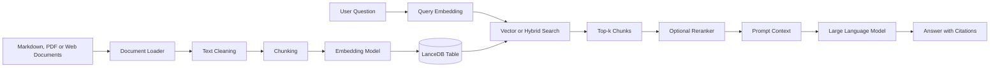
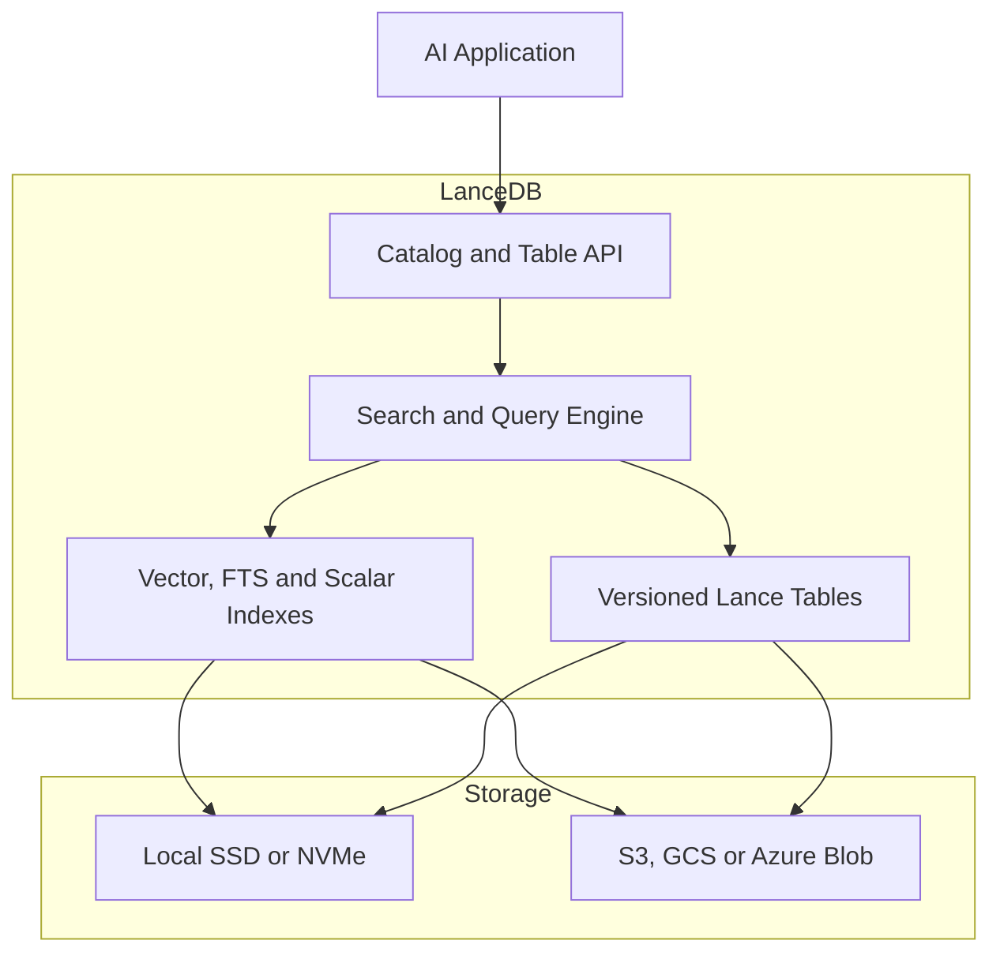
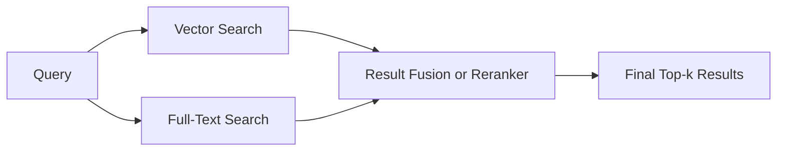

# 019 — LanceDB

**Course:** 03 — Knowledge Systems and RAG
**Module:** Module 08 — Embeddings and Vector Databases
**Content Group:** Vector Databases
**Roadmap Source:** Embeddings and Vector Databases / Vector Databases
**Lesson Type:** Embeddings and Vector Databases
**Order in Module:** 019
**Suggested Duration:** 24 minutes

---

## 1. Overview

**LanceDB** is an open-source data and retrieval system designed for AI applications. Although it is commonly introduced as a vector database, its current architecture is broader: LanceDB describes itself as a **multimodal lakehouse for AI**, built on the open-source Lance columnar format.

It can store:

* Text and document chunks
* Vector embeddings
* Images, audio, and video
* Structured metadata
* Model-generated features
* Search indexes
* Versioned datasets

LanceDB supports vector search, full-text search, hybrid search, metadata filtering, SQL-style querying, and reranking. These capabilities make it useful for RAG systems, semantic search, recommendation engines, agent memory, multimodal retrieval, and machine-learning dataset management.

After this lesson, you should understand where LanceDB fits into an AI engineering workflow and how to use it as the retrieval layer of a small RAG application.

---

## 2. Learning Objectives

By the end of this lesson, you should be able to:

* Explain LanceDB in your own words.
* Describe how LanceDB stores documents, metadata, and embeddings.
* Distinguish vector search, full-text search, and hybrid search.
* Create a local LanceDB table.
* Insert embedded document chunks.
* Perform semantic search with metadata filtering.
* Identify when an approximate nearest-neighbor index is needed.
* Evaluate retrieval quality using a small test dataset.
* Recognize important limitations and production considerations.

---

## 3. What Is LanceDB?

LanceDB provides tables in which each row can contain ordinary structured fields together with one or more vector embeddings.

A document table might contain the following fields:

| Field           | Example                                  | Purpose                            |
| --------------- | ---------------------------------------- | ---------------------------------- |
| `id`            | `doc-001-chunk-03`                       | Unique chunk identifier            |
| `text`          | `"Vector databases store embeddings..."` | Content used by the LLM            |
| `vector`        | `[0.12, -0.08, ...]`                     | Embedding used for semantic search |
| `source`        | `vector-databases.md`                    | Citation and traceability          |
| `page`          | `4`                                      | Original page or section           |
| `language`      | `en`                                     | Metadata filtering                 |
| `document_type` | `tutorial`                               | Search filtering                   |
| `created_at`    | Timestamp                                | Freshness filtering                |

A LanceDB table is a structured, versioned dataset with a schema, rows, and indexes. In the open-source version, applications commonly access a `LanceTable` directly through local or object-storage paths. LanceDB Enterprise exposes remote tables through a server or cluster.

### Simple Mental Model

> LanceDB is a searchable AI data table that can keep raw content, metadata, embeddings, and multimodal objects together.

---

## 4. Where LanceDB Fits in a RAG System



LanceDB normally handles the **storage and retrieval layer**. It does not automatically solve the complete RAG problem.

You still need to design:

* Document loading
* Text extraction
* Chunking
* Embedding generation
* Metadata
* Query processing
* Retrieval strategy
* Reranking
* Prompt construction
* Citation rendering
* Evaluation

LanceDB can automatically generate embeddings when its embedding-function registry and schema metadata are configured. It can also accept vectors generated manually by another service.

---

## 5. Core Architecture

LanceDB is built on **Lance**, an open-source columnar format optimized for AI and multimodal workloads.

The Lance format supports:

* Arrow-native columnar storage
* Dataset versioning
* Schema evolution
* Fast random access
* Structured and multimodal data
* Local files and cloud object storage

This foundation allows LanceDB to keep text, vectors, metadata, images, audio, and other fields in the same logical table instead of requiring a separate vector store and object store for every workflow.



The open-source edition can run as an embedded library inside an application, similar to how SQLite runs in-process. It can connect to a local directory or supported object-storage URI.

---

## 6. Main Search Modes

### 6.1 Vector Search

Vector search finds records whose embeddings are closest to the query embedding.

```text
User query
    ↓
Embedding model
    ↓
Query vector
    ↓
Similarity comparison
    ↓
Top-k nearest document chunks
```

LanceDB supports distance metrics including:

* `l2`
* `cosine`
* `dot`
* `hamming` for compatible binary vectors

The query vector must have the same dimensions as the stored vectors and should be generated with the same embedding model.

Vector search is useful when the query and the relevant passage use different words but share similar meanings.

**Query**

```text
How can retrieval results be made more accurate?
```

**Potential semantic match**

```text
A cross-encoder can reorder the initial candidates according to relevance.
```

The passage does not repeat the exact words in the query, but their meanings are related.

---

### 6.2 Full-Text Search

Full-text search retrieves documents using words, tokens, and phrases. LanceDB supports full-text indexing with BM25-based ranking.

This search mode is useful for:

* Product codes
* Error messages
* Function names
* Personal names
* Technical terminology
* Exact phrases

For example, semantic search may not reliably preserve an identifier such as:

```text
KSOLM-226
```

Full-text search is usually better when the exact identifier matters.

---

### 6.3 Hybrid Search

Hybrid search combines:

1. Semantic vector search
2. Keyword-based full-text search
3. A reranking or result-fusion step



This approach helps when a query requires both semantic understanding and exact keyword matching. LanceDB supports hybrid queries and uses reciprocal rank fusion as the default reranking approach when no alternative reranker is supplied.

---

### 6.4 Metadata Filtering

Metadata filtering limits the candidate records before or after similarity scoring.

Examples:

```sql
language = 'en'
```

```sql
source = 'rag-handbook.pdf'
```

```sql
page >= 10 AND page <= 20
```

```sql
document_type = 'policy'
```

Prefiltering usually reduces the search space before vector or full-text scoring. It is particularly important for:

* Multi-user applications
* Access control
* Language selection
* Date-sensitive knowledge
* Document-specific questions
* Tenant isolation

A user or tenant filter must come from authenticated server-side context rather than from an untrusted client-provided identifier.

---

## 7. LanceDB Editions and Deployment Models

### LanceDB OSS

The open-source edition is appropriate for:

* Local development
* Prototypes
* Desktop applications
* Small services
* Single-machine RAG
* Local-first AI applications
* Direct object-storage access

It runs as an embedded library and supports local filesystem and object-storage connection paths.

### LanceDB Enterprise

The enterprise edition provides remote, cluster-backed tables. Its architecture separates query serving, indexing, background work, and durable object storage so that these components can scale independently.

A useful progression is:

```text
Local prototype
    ↓
Embedded LanceDB OSS
    ↓
Object-storage-backed deployment
    ↓
Remote or distributed production deployment
```

The correct deployment depends on dataset size, concurrency, latency requirements, operational complexity, and durability requirements.

---

## 8. Practical Demo: Semantic Search with LanceDB

### 8.1 Install Dependencies

```bash
pip install lancedb sentence-transformers pandas
```

The example uses:

* LanceDB as the data and retrieval layer
* Sentence Transformers to generate embeddings
* Pandas to display results

---

### 8.2 Create and Search a Table

```python
from __future__ import annotations

from typing import Any

import lancedb
from sentence_transformers import SentenceTransformer


DATABASE_PATH = "./data/lancedb"
TABLE_NAME = "ai_engineering_notes"
MODEL_NAME = "sentence-transformers/all-MiniLM-L6-v2"


documents: list[dict[str, Any]] = [
    {
        "id": "doc-001",
        "text": (
            "Chunking divides a long document into smaller retrieval units. "
            "Chunk size and overlap should be evaluated using real queries."
        ),
        "source": "rag-basics.md",
        "page": 1,
        "language": "en",
        "topic": "chunking",
    },
    {
        "id": "doc-002",
        "text": (
            "Embeddings represent text as numerical vectors. Semantically "
            "similar passages should be located near one another."
        ),
        "source": "embeddings.md",
        "page": 2,
        "language": "en",
        "topic": "embeddings",
    },
    {
        "id": "doc-003",
        "text": (
            "A vector database retrieves the nearest stored embeddings for "
            "a query vector and returns the associated records."
        ),
        "source": "vector-databases.md",
        "page": 3,
        "language": "en",
        "topic": "vector-search",
    },
    {
        "id": "doc-004",
        "text": (
            "Reranking applies a stronger relevance model to an initial "
            "candidate set before sending context to the language model."
        ),
        "source": "reranking.md",
        "page": 4,
        "language": "en",
        "topic": "reranking",
    },
    {
        "id": "doc-005",
        "text": (
            "Retrieval evaluation should include realistic questions, "
            "expected documents, difficult negatives, and failure cases."
        ),
        "source": "rag-evaluation.md",
        "page": 5,
        "language": "en",
        "topic": "evaluation",
    },
]


def embed_documents(
    model: SentenceTransformer,
    records: list[dict[str, Any]],
) -> list[dict[str, Any]]:
    """Generate normalized embeddings and attach them to each record."""
    texts = [record["text"] for record in records]

    vectors = model.encode(
        texts,
        normalize_embeddings=True,
        show_progress_bar=False,
    )

    return [
        {
            **record,
            "vector": vector.tolist(),
        }
        for record, vector in zip(records, vectors, strict=True)
    ]


def semantic_search(
    table: Any,
    model: SentenceTransformer,
    query: str,
    limit: int = 3,
):
    """Search for semantically relevant English document chunks."""
    query_vector = model.encode(
        query,
        normalize_embeddings=True,
        show_progress_bar=False,
    ).tolist()

    return (
        table.search(query_vector)
        .metric("cosine")
        .where("language = 'en'", prefilter=True)
        .select(["id", "text", "source", "page", "topic"])
        .limit(limit)
        .to_pandas()
    )


def main() -> None:
    model = SentenceTransformer(MODEL_NAME)
    rows = embed_documents(model, documents)

    db = lancedb.connect(DATABASE_PATH)

    table = db.create_table(
        TABLE_NAME,
        data=rows,
        mode="overwrite",
    )

    query = "How can I improve the relevance of retrieved passages?"
    results = semantic_search(table, model, query)

    print(results.to_string(index=False))


if __name__ == "__main__":
    main()
```

The example follows the basic LanceDB workflow: connect to a storage location, create a table containing text, metadata, and vectors, and then search with a query vector. LanceDB supports returning Python query results as a Pandas DataFrame.

### Expected Relevant Results

The query should retrieve passages related to:

1. Reranking
2. Retrieval evaluation
3. Chunking or vector search

The exact order can vary with the embedding model.

---

## 9. From Retrieval to a RAG Prompt

After retrieving the top chunks, convert them into grounded context.

```python
def build_context(results) -> str:
    sections: list[str] = []

    for row in results.itertuples(index=False):
        citation = f"{row.source}, page {row.page}"
        sections.append(f"[Source: {citation}]\n{row.text}")

    return "\n\n".join(sections)


def build_prompt(question: str, context: str) -> str:
    return f"""
Answer the question using only the supplied context.

Requirements:
- Do not invent missing facts.
- Cite the source and page for each important claim.
- State that the information is unavailable when the context is insufficient.

Question:
{question}

Context:
{context}
""".strip()
```

The complete path becomes:

```text
question
→ query embedding
→ LanceDB search
→ metadata filtering
→ top-k chunks
→ optional reranking
→ context construction
→ LLM
→ cited answer
```

---

## 10. Indexing and Scale

For a very small table, LanceDB can calculate distances against all stored vectors using brute-force search.

As the dataset grows, an approximate nearest-neighbor index can reduce query latency. LanceDB currently supports vector indexing strategies based on IVF and IVF-HNSW, together with quantization options such as product quantization and scalar quantization.

### Indexing Trade-off

```text
Exact brute-force search
    High recall
    Simple
    Slower as data grows

Approximate indexed search
    Faster
    More scalable
    Requires configuration
    May lose some recall
```

Important tuning concepts include:

* Number of partitions
* Number of partitions searched
* Quantization method
* Distance metric
* Refinement factor
* Index freshness
* Number of unindexed rows
* Recall versus latency

The distance metric used during search should match the metric used when creating the vector index. New or updated records may also require optimization or reindexing so that the index catches up with table changes.

Do not create an index only because an index is available. First measure whether the unindexed search latency is actually a problem.

---

## 11. Designing a Good LanceDB Table

A production-ready table should support retrieval, debugging, citation, security, and future migrations.

### Recommended Fields

```text
id
document_id
chunk_id
text
vector
source
page
section
language
tenant_id
access_scope
document_type
content_hash
embedding_model
embedding_version
created_at
updated_at
```

### Why Store the Embedding Model?

Suppose the application changes from:

```text
all-MiniLM-L6-v2
```

to:

```text
BAAI/bge-small-en-v1.5
```

Vectors from different embedding spaces should not be mixed and searched as though they were directly compatible.

Record at least:

* Model provider
* Model name
* Vector dimensions
* Normalization setting
* Distance metric
* Embedding version
* Creation timestamp

A safer migration creates a new vector column or a new table, evaluates it, and switches production traffic only after its retrieval quality is acceptable.

---

## 12. When to Use LanceDB

LanceDB is a strong candidate when you need:

* Embedded vector search inside a Python, TypeScript, or Rust application
* A local-first RAG prototype
* Text, vectors, metadata, and multimodal data in the same system
* Direct integration with local disk or object storage
* Dataset versioning and schema evolution
* Vector, keyword, and hybrid retrieval
* AI data curation and feature engineering
* A path from local experimentation to larger deployments

Its current SDK quickstart supports Python, TypeScript, and Rust installation paths.

### Consider Another Architecture When

* Your organization already operates a mature search platform that meets all requirements.
* You require database features that are not central to LanceDB’s table and lakehouse model.
* The application depends on complex transactional relationships.
* Your team needs a fully managed service with no database operations.
* You require a search feature that must be verified against a different engine.
* Your infrastructure or compliance requirements are incompatible with the available deployment models.

The decision should be based on measured requirements rather than a generic “best vector database” ranking.

---

## 13. LanceDB Compared with Other Tools

| Tool     | Typical Strength                                          | Deployment Style                               | Good Starting Use Case           |
| -------- | --------------------------------------------------------- | ---------------------------------------------- | -------------------------------- |
| LanceDB  | Unified AI data, vectors, metadata, and multimodal tables | Embedded, object storage, or remote enterprise | Local-to-production AI retrieval |
| FAISS    | High-performance vector indexing library                  | In-process library                             | Custom vector search experiments |
| Chroma   | Developer-friendly RAG prototyping                        | Embedded or server                             | Small RAG applications           |
| Pinecone | Managed vector infrastructure                             | Cloud service                                  | Managed production retrieval     |
| Weaviate | Search platform with vector and hybrid capabilities       | Server or managed cloud                        | Search-focused applications      |
| Qdrant   | Filtering and vector search service                       | Server, embedded options, or cloud             | Metadata-heavy vector retrieval  |

This comparison is conceptual rather than a universal ranking. Performance and operational suitability depend on data size, query patterns, filters, index configuration, hardware, concurrency, and deployment requirements.

---

## 14. Common Mistakes

### 14.1 Using Poor Chunk Sizes

Chunks that are too small may lose context.

Chunks that are too large may contain unrelated information and reduce retrieval precision.

**Better approach:** Test multiple chunking strategies against the same evaluation questions.

---

### 14.2 Omitting Source Metadata

Storing only `text` and `vector` makes citation generation difficult.

**Better approach:** Save source, page, section, document ID, and chunk ID with every vector.

---

### 14.3 Mixing Embedding Models

Document vectors produced by one model should not be queried with vectors from an incompatible model.

**Better approach:** Store embedding configuration and version information.

---

### 14.4 Assuming Top-k Means Relevant

A database can correctly return the nearest vectors even when none of them adequately answers the question.

**Better approach:** Use relevance thresholds, reranking, negative examples, and an “insufficient context” path.

---

### 14.5 Creating an Index Too Early

An index adds configuration and maintenance requirements.

**Better approach:** Begin with exact search, measure latency, and introduce an index when the dataset or traffic requires it.

---

### 14.6 Ignoring Exact Keywords

Semantic retrieval can miss IDs, names, version numbers, and exact error messages.

**Better approach:** Compare vector search with hybrid search.

---

### 14.7 Trusting Client-Provided Access Metadata

A malicious client may modify fields such as `user_id`, `tenant_id`, or `access_scope`.

**Better approach:** Build security filters from the authenticated server-side identity.

---

### 14.8 Evaluating Only the Final LLM Answer

A fluent answer can hide poor retrieval.

**Better approach:** Evaluate retrieval and generation separately.

---

## 15. Retrieval Evaluation

Create a small evaluation dataset before optimizing the system.

```json
[
  {
    "question": "What does reranking do?",
    "expected_sources": ["reranking.md"],
    "expected_keywords": ["candidate", "relevance", "reorder"]
  },
  {
    "question": "Why should RAG use real test questions?",
    "expected_sources": ["rag-evaluation.md"],
    "expected_keywords": ["evaluation", "failure cases"]
  }
]
```

### Useful Metrics

| Metric            | Question Answered                                  |
| ----------------- | -------------------------------------------------- |
| Recall@k          | Was a relevant chunk present in the top-k results? |
| Precision@k       | How many returned chunks were relevant?            |
| MRR               | How highly ranked was the first relevant result?   |
| nDCG              | Were highly relevant results placed near the top?  |
| Citation coverage | Did the answer cite its important claims?          |
| Faithfulness      | Was the answer supported by retrieved context?     |
| p50/p95 latency   | How fast and stable was retrieval?                 |

### Failure Categories

Record failure cases such as:

* No relevant chunk retrieved
* Relevant chunk ranked too low
* Wrong language returned
* Wrong tenant or user data returned
* Exact keyword missed
* Chunk lacks surrounding context
* Duplicate chunks dominate the top-k
* Outdated document outranks a current document
* Correct retrieval but unsupported LLM answer

---

## 16. Practical Exercise

### Goal

Build a semantic search engine for five to ten Markdown or PDF documents using LanceDB.

### Tasks

1. Select five to ten small documents.
2. Extract their text.
3. Split the text into chunks.
4. Store source and page metadata.
5. Generate embeddings.
6. Create a LanceDB table.
7. Insert the chunks and vectors.
8. Write at least ten realistic test questions.
9. Retrieve the top three or top five chunks.
10. Record successful and failed queries.
11. Add metadata filtering.
12. Compare vector and hybrid retrieval.
13. Generate a cited answer from the retrieved context.

### Suggested Result Table

| Query                    | Expected Source | Top-1 | Top-3 | Failure Reason  |
| ------------------------ | --------------- | ----: | ----: | --------------- |
| What is chunk overlap?   | chunking.md     |   Yes |   Yes | —               |
| Find error KSOLM-226     | incidents.md    |    No |    No | Exact ID missed |
| How does reranking help? | reranking.md    |   Yes |   Yes | —               |

---

## 17. Portfolio Demo

Create a small application called:

> **Semantic Search Engine for Markdown and PDF Files**

### Minimum Features

* File upload
* Text extraction
* Configurable chunk size
* Embedding generation
* LanceDB storage
* Semantic search
* Metadata filters
* Source citations
* Retrieval debugging panel
* Evaluation question set

### Recommended API Routes

```text
POST /documents
POST /documents/{document_id}/index
POST /search
POST /ask
GET  /documents
GET  /evaluations
```

### Example Search Request

```json
{
  "query": "How should retrieval quality be evaluated?",
  "top_k": 5,
  "filters": {
    "language": "en",
    "document_type": "tutorial"
  }
}
```

### Example Search Response

```json
{
  "results": [
    {
      "text": "Retrieval evaluation should include realistic questions...",
      "source": "rag-evaluation.md",
      "page": 5,
      "score": 0.91
    }
  ]
}
```

The public API should return a normalized application-level score rather than exposing a raw database distance without explaining its meaning.

---

## 18. Production Checklist

### Data

* [ ] Documents are cleaned before chunking.
* [ ] Every chunk has a stable ID.
* [ ] Source and page metadata are stored.
* [ ] Duplicate content is detected.
* [ ] Deleted documents are removed from the index.
* [ ] Embedding versions are recorded.

### Retrieval

* [ ] The same embedding configuration is used for documents and queries.
* [ ] The distance metric is documented.
* [ ] Metadata filters are applied correctly.
* [ ] `top_k` is explicitly configured.
* [ ] Hybrid search is tested for exact terms.
* [ ] Reranking is evaluated using real queries.
* [ ] Index recall is compared with brute-force results.

### Security

* [ ] Tenant and user filters come from authenticated server state.
* [ ] Access-controlled documents cannot leak across users.
* [ ] Sensitive metadata is not exposed in responses.
* [ ] Uploaded files are validated.
* [ ] Logs do not contain unnecessary private document content.

### Reliability

* [ ] Ingestion is idempotent.
* [ ] Partial indexing failures can be retried.
* [ ] Table changes and index freshness are monitored.
* [ ] Backup and recovery procedures are defined.
* [ ] Storage growth is monitored.

### Evaluation

* [ ] There is a fixed retrieval test set.
* [ ] Recall@k is measured.
* [ ] Latency percentiles are measured.
* [ ] Failure cases are reviewed.
* [ ] Citation accuracy is tested.
* [ ] Retrieval and generation are evaluated separately.

---

## 19. Completion Checklist

* [ ] I can explain LanceDB in one or two minutes.
* [ ] I understand how a LanceDB table stores text, vectors, and metadata.
* [ ] I can create a local LanceDB database.
* [ ] I can insert document chunks and embeddings.
* [ ] I can perform vector search.
* [ ] I can apply a metadata filter.
* [ ] I understand the purpose of full-text and hybrid search.
* [ ] I know when an ANN index may be necessary.
* [ ] I have built a small retrieval demo.
* [ ] I have documented at least one retrieval failure.
* [ ] I can explain how LanceDB connects to a RAG pipeline.

---

## 20. Related Outcome

> Build semantic search systems using embeddings, vector indexes, metadata filtering, and similarity search.

LanceDB contributes the storage and retrieval layer, but successful semantic search also depends on chunking, embedding selection, search configuration, reranking, evaluation, security, and user experience.

---

## 21. Related Project

### Project 7: Semantic Search Engine

Build a semantic search application for Markdown and PDF files using:

* Document loaders
* Chunking
* Sentence Transformers or an embedding API
* LanceDB
* Vector or hybrid search
* Metadata filters
* A retrieval evaluation set
* Citation-aware answer generation

Possible extensions:

* Compare LanceDB with Chroma, Qdrant, or FAISS.
* Add image embeddings.
* Add multilingual retrieval.
* Add a cross-encoder reranker.
* Visualize retrieval scores.
* Track embedding versions.
* Implement document-level access control.

---

## 22. Summary

LanceDB is an AI-oriented data and retrieval system built on the Lance columnar format. It can store raw content, structured metadata, vectors, and multimodal objects in versioned tables. Its retrieval capabilities include vector search, full-text search, hybrid search, filtering, indexing, and reranking.

For an AI engineer, the most important lesson is not simply how to call `table.search()`.

The complete engineering workflow is:

```text
Collect documents
→ clean and chunk
→ generate embeddings
→ store content, vectors and metadata
→ retrieve candidates
→ filter and rerank
→ build grounded context
→ generate an answer with citations
→ evaluate real queries and failure cases
```

A successful LanceDB project should demonstrate not only that semantic search works, but also that retrieval quality, latency, citations, access control, index freshness, and failure behavior have been measured.
