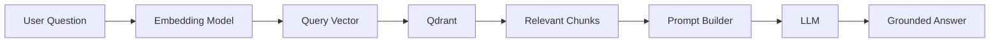
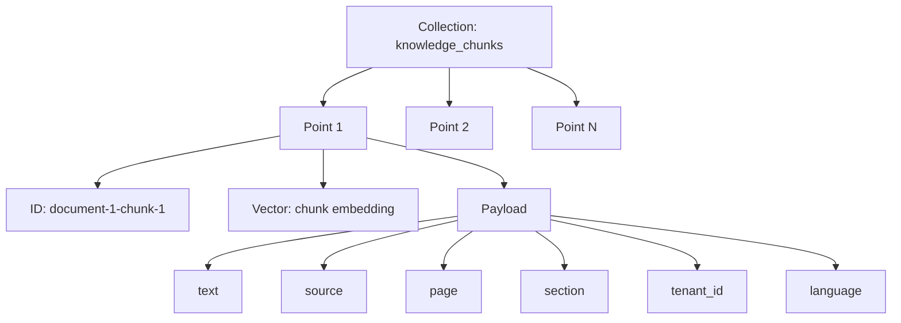
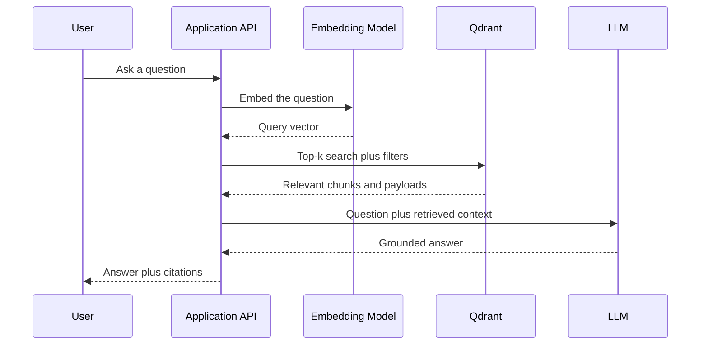
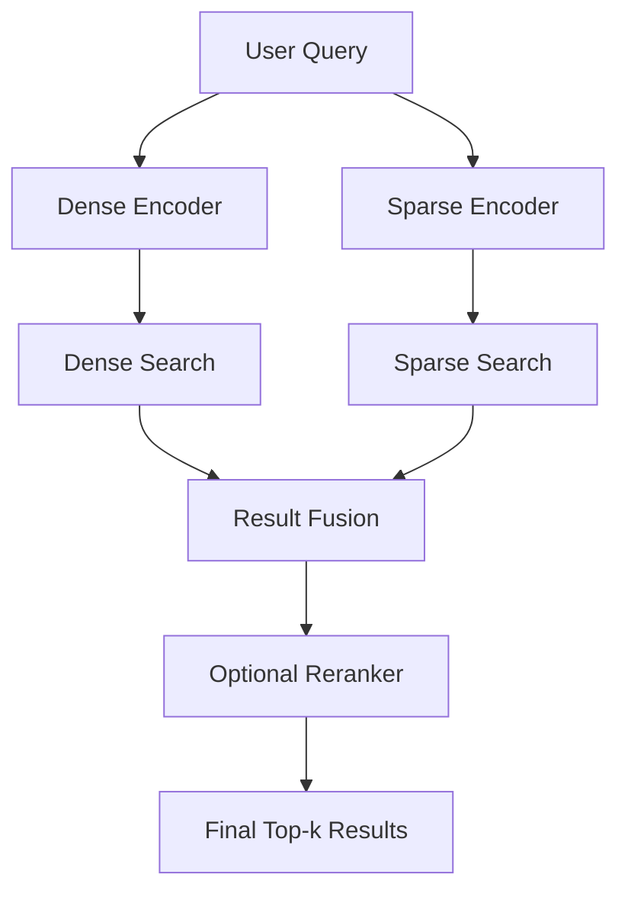
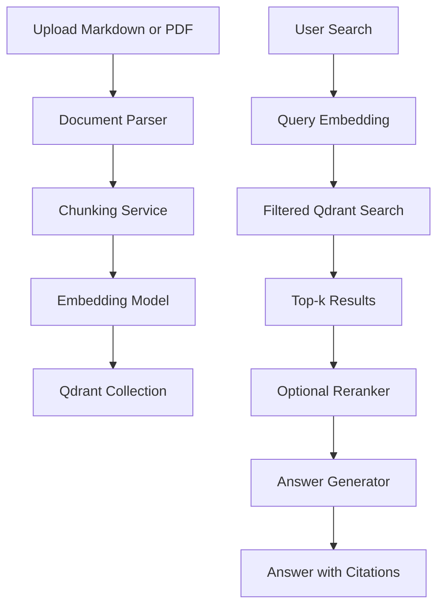

# 020 — Qdrant

**Course:** 03 — Knowledge Systems and RAG
**Module:** Module 08 — Embeddings and Vector Databases
**Content Group:** Vector Databases
**Roadmap Source:** Embeddings and Vector Databases / Vector Databases
**Lesson Type:** Embeddings and Vector Databases
**Order in Module:** 020
**Suggested Duration:** 24 minutes

---

## 1. Lesson Overview

**Qdrant** is an open-source vector database and vector search engine designed for similarity search, semantic retrieval, recommendation systems, Retrieval-Augmented Generation, and AI agent memory.

Qdrant stores embeddings together with structured metadata called **payloads**. During retrieval, an application can combine vector similarity with metadata filters such as:

* Language
* User ID
* Document type
* Access level
* Category
* Creation date
* Product availability

Qdrant supports dense vectors, sparse vectors, multiple named vectors, filtering, payload indexes, hybrid retrieval, REST APIs, gRPC APIs, local deployment, self-hosting, and managed cloud deployment.

By the end of this lesson, you should understand where Qdrant belongs in an AI system and how to use it to build a small semantic-search or RAG application.

---

## 2. Learning Objectives

After completing this lesson, you should be able to:

* Explain what Qdrant is in your own words.
* Describe the relationship between documents, chunks, embeddings, points, collections, and payloads.
* Create a Qdrant collection.
* Insert vectors and metadata into the collection.
* Perform semantic search using a query embedding.
* Apply metadata filters during vector search.
* Design a payload schema that supports citations and access control.
* Explain how Qdrant fits into a RAG pipeline.
* Identify common retrieval and production mistakes.
* Build a small portfolio project using Qdrant.

---

## 3. What Is Qdrant?

Qdrant is a database optimized for storing and searching high-dimensional vectors.

In a normal relational database, records are commonly retrieved through exact conditions:

```sql
SELECT *
FROM documents
WHERE category = 'database';
```

This query works when the application already knows the exact value it needs.

Vector search solves a different problem:

> Find documents whose meaning is similar to the meaning of this query.

For example, the query:

```text
How can I store meaning-based representations of documents?
```

may retrieve a document containing:

```text
Vector databases store embeddings and support semantic similarity search.
```

The two sentences do not use exactly the same words, but their embeddings may be close in vector space.

Qdrant calculates similarity between the query vector and stored vectors, then returns the closest results. A collection can use metrics such as cosine similarity, dot product, Euclidean distance, or Manhattan distance.

---

## 4. Why Use Qdrant?

A normal database can store embeddings as arrays, but it is usually not optimized for fast nearest-neighbor search over millions of vectors.

Qdrant provides features specifically designed for retrieval systems:

| Capability                 | Purpose                                                          |
| -------------------------- | ---------------------------------------------------------------- |
| Vector storage             | Stores document, image, audio, or entity embeddings              |
| Similarity search          | Finds vectors closest to a query vector                          |
| Payload metadata           | Stores source, page, category, permissions, and other attributes |
| Metadata filtering         | Restricts retrieval using structured conditions                  |
| Payload indexes            | Accelerates filtering on frequently queried fields               |
| Dense vectors              | Capture semantic meaning                                         |
| Sparse vectors             | Capture lexical or keyword-level matches                         |
| Named vectors              | Store multiple vector representations for one object             |
| Hybrid search              | Combines semantic and lexical retrieval                          |
| REST and gRPC              | Integrates with applications in different languages              |
| Local and cloud deployment | Supports development and production environments                 |

Qdrant allows filters to be applied to point IDs and payload fields. Its filtering clauses support logical operations such as `must`, `should`, and `must_not`, which behave similarly to `AND`, `OR`, and `NOT`. For fields used frequently in filters, Qdrant recommends creating payload indexes.

---

## 5. Where Qdrant Fits in an AI Application

Qdrant does not normally create the final natural-language answer.

Its primary responsibility is **retrieval**.



The typical responsibilities are:

1. An embedding model converts the question into a vector.
2. Qdrant searches for similar stored vectors.
3. Qdrant returns the most relevant chunks and their metadata.
4. The application adds those chunks to the LLM prompt.
5. The LLM generates an answer based on the retrieved context.

Qdrant therefore belongs between the **embedding layer** and the **generation layer**.

---

## 6. Core Qdrant Concepts

### 6.1 Collection

A **collection** is a named group of searchable points.

It is similar to a table in a relational database, although the data model is different.

Example collection names:

```text
company_knowledge
product_catalog
support_articles
user_memories
legal_documents
```

A collection defines important vector settings, including:

* Vector dimensions
* Similarity metric
* Named vector configurations
* Sparse-vector configurations
* HNSW settings
* Quantization settings
* Sharding settings
* On-disk storage settings

Vectors inside the same vector configuration must use the expected dimension and distance metric. Qdrant also supports multiple named vector configurations within one collection.

---

### 6.2 Point

A **point** is the basic record stored in Qdrant.

A point normally contains:

```text
Point
├── ID
├── Vector or named vectors
└── Payload
```

Example:

```json
{
  "id": 101,
  "vector": [0.12, -0.37, 0.91],
  "payload": {
    "text": "Qdrant supports metadata filtering.",
    "source": "qdrant-notes.md",
    "page": 4,
    "language": "en"
  }
}
```

A point can contain dense vectors, sparse vectors, or multiple named vectors representing different properties of the same object.

---

### 6.3 Vector

A vector is a numeric representation generated by an embedding model.

```text
"Qdrant is a vector database"
                ↓
Embedding model
                ↓
[0.18, -0.24, 0.71, ..., 0.09]
```

Vectors that represent semantically similar content should be located close to each other in vector space.

The vector dimension must match the embedding model. For example, an application must not create a collection for 384-dimensional vectors and then insert 768-dimensional vectors.

---

### 6.4 Payload

A **payload** is structured metadata associated with a point.

Example:

```json
{
  "text": "A vector database performs similarity search.",
  "document_id": "vector-db-guide",
  "source": "vector-databases.md",
  "page": 7,
  "section": "Similarity Search",
  "language": "en",
  "tenant_id": "company-a",
  "access_level": "internal"
}
```

Payloads are essential because vectors alone do not provide:

* Original text
* Document names
* Page numbers
* Citation information
* Ownership information
* Permission rules
* Business attributes

A well-designed RAG system stores enough payload information to reconstruct citations and enforce retrieval restrictions.

---

### 6.5 Payload Index

A payload index helps Qdrant filter points efficiently.

Suppose every request filters by:

```text
tenant_id
language
document_type
```

These fields are strong candidates for payload indexes.

Without suitable indexes, semantic similarity may still work, but metadata filtering can become unnecessarily expensive as the collection grows.

Qdrant recommends creating payload indexes for fields that will be used in filters, preferably before large-scale ingestion.

---

### 6.6 Distance Metric

The distance metric defines how Qdrant compares vectors.

| Metric      | Typical interpretation            |
| ----------- | --------------------------------- |
| Cosine      | Compares vector direction         |
| Dot product | Measures vector alignment         |
| Euclidean   | Measures straight-line distance   |
| Manhattan   | Measures coordinate-wise distance |

The correct metric depends on how the embedding model was trained and how its documentation recommends comparing outputs.

For many text-embedding systems, cosine similarity is a common default, but the model’s documentation should remain the source of truth.

---

### 6.7 Dense and Sparse Vectors

A **dense vector** normally contains many non-zero floating-point values:

```text
[0.18, -0.24, 0.71, 0.03, ...]
```

Dense vectors are useful for semantic understanding.

A **sparse vector** contains values only at selected positions:

```text
indices: [12, 81, 405]
values:  [0.7, 1.3, 0.4]
```

Sparse representations are useful for lexical matching, technical keywords, identifiers, and rare terms.

Qdrant stores and indexes sparse vectors separately from dense vectors. Its sparse index is designed for vectors containing a high proportion of zero values.

---

### 6.8 Named Vectors

One point may contain multiple named vectors.

For example:

```json
{
  "id": 42,
  "vector": {
    "title": [0.1, 0.2, 0.3],
    "content": [0.4, 0.5, 0.6],
    "image": [0.7, 0.8, 0.9]
  }
}
```

Named vectors are useful when the same object has multiple searchable representations:

* Title embedding
* Body embedding
* Image embedding
* Dense text embedding
* Sparse text embedding
* Different language embeddings

Each named vector can have its own dimensions, metric, and selected configuration.

---

## 7. Qdrant Data Model for RAG

A practical RAG collection may use the following structure:



Example point:

```json
{
  "id": "handbook-15-2",
  "vector": [0.014, -0.182, 0.437],
  "payload": {
    "text": "Employees must rotate production credentials every 90 days.",
    "document_id": "security-handbook",
    "source": "security-handbook.pdf",
    "page": 15,
    "chunk_index": 2,
    "section": "Credential Management",
    "language": "en",
    "tenant_id": "organization-123"
  }
}
```

This schema allows the application to:

* Return the chunk text to the LLM.
* Produce a citation using `source` and `page`.
* Group related chunks using `document_id`.
* Preserve original ordering using `chunk_index`.
* Filter documents using `tenant_id`.
* Retrieve only the required language.

---

## 8. Ingestion Workflow

Before Qdrant can answer retrieval queries, documents must be processed and indexed.


### Recommended ingestion steps

1. Load the source document.
2. Extract readable text.
3. Remove repeated headers, footers, and irrelevant formatting.
4. Split the text into meaningful chunks.
5. Preserve metadata for every chunk.
6. Generate embeddings using one consistent model.
7. Insert points into Qdrant.
8. Create payload indexes for frequently filtered fields.
9. Record the embedding model and document version.
10. Run retrieval tests before releasing the collection.

---

## 9. Retrieval Workflow

At query time, the application follows a second pipeline:



The vector database does not determine whether the final answer is completely correct. It only returns candidate evidence.

The system must still evaluate:

* Whether the correct document was retrieved.
* Whether the chunks contain enough context.
* Whether irrelevant chunks were included.
* Whether the LLM followed the evidence.
* Whether citations match the actual source.

---

## 10. Local Setup

### Option A: Run Qdrant with Docker

```bash
docker pull qdrant/qdrant

docker run \
  -p 6333:6333 \
  -p 6334:6334 \
  -v "$(pwd)/qdrant_storage:/qdrant/storage:z" \
  qdrant/qdrant
```

By default:

```text
REST API: http://localhost:6333
Web dashboard: http://localhost:6333/dashboard
gRPC API: localhost:6334
```

The official local quickstart uses port `6333` for REST and port `6334` for gRPC. It also warns that the default local configuration does not automatically enable authentication or encryption.

### Option B: Qdrant Client Local Mode

For small experiments and unit tests, the Python client can run Qdrant locally without a separate server:

```python
from qdrant_client import QdrantClient

client = QdrantClient(":memory:")
```

This is convenient for learning and automated tests, but a real server or managed deployment should be considered for production workloads.

---

## 11. Practical Python Demo

### 11.1 Install dependencies

```bash
pip install qdrant-client sentence-transformers
```

### 11.2 Create a semantic-search application

```python
from __future__ import annotations

from typing import Any

from qdrant_client import QdrantClient, models
from sentence_transformers import SentenceTransformer


COLLECTION_NAME = "ai_engineering_notes"


def build_demo_index() -> tuple[QdrantClient, SentenceTransformer]:
    """Create an in-memory Qdrant collection and insert demo documents."""

    client = QdrantClient(":memory:")
    embedding_model = SentenceTransformer(
        "sentence-transformers/all-MiniLM-L6-v2"
    )

    documents: list[dict[str, Any]] = [
        {
            "text": (
                "Embeddings represent text as numerical vectors that preserve "
                "semantic relationships."
            ),
            "source": "embeddings.md",
            "page": 1,
            "topic": "embeddings",
            "language": "en",
        },
        {
            "text": (
                "Qdrant stores vectors together with payload metadata and "
                "supports filtered similarity search."
            ),
            "source": "qdrant.md",
            "page": 2,
            "topic": "vector-database",
            "language": "en",
        },
        {
            "text": (
                "Retrieval-Augmented Generation supplies relevant external "
                "context to a language model before generation."
            ),
            "source": "rag.md",
            "page": 3,
            "topic": "rag",
            "language": "en",
        },
        {
            "text": (
                "Chunk overlap may preserve context across boundaries, but "
                "excessive overlap increases storage and duplicate retrieval."
            ),
            "source": "chunking.md",
            "page": 4,
            "topic": "chunking",
            "language": "en",
        },
        {
            "text": (
                "Payload fields such as source and page number allow a RAG "
                "application to generate citations."
            ),
            "source": "rag-citations.md",
            "page": 5,
            "topic": "rag",
            "language": "en",
        },
    ]

    texts = [document["text"] for document in documents]

    vectors = embedding_model.encode(
        texts,
        normalize_embeddings=True,
    ).tolist()

    vector_size = len(vectors[0])

    client.create_collection(
        collection_name=COLLECTION_NAME,
        vectors_config=models.VectorParams(
            size=vector_size,
            distance=models.Distance.COSINE,
        ),
    )

    points = [
        models.PointStruct(
            id=index,
            vector=vector,
            payload=document,
        )
        for index, (vector, document) in enumerate(
            zip(vectors, documents, strict=True)
        )
    ]

    client.upsert(
        collection_name=COLLECTION_NAME,
        points=points,
        wait=True,
    )

    return client, embedding_model
```

### 11.3 Search the collection

```python
def semantic_search(
    client: QdrantClient,
    embedding_model: SentenceTransformer,
    query: str,
    limit: int = 3,
) -> list[dict[str, Any]]:
    """Return the most relevant English RAG documents."""

    query_vector = embedding_model.encode(
        query,
        normalize_embeddings=True,
    ).tolist()

    response = client.query_points(
        collection_name=COLLECTION_NAME,
        query=query_vector,
        query_filter=models.Filter(
            must=[
                models.FieldCondition(
                    key="language",
                    match=models.MatchValue(value="en"),
                )
            ]
        ),
        limit=limit,
        with_payload=True,
    )

    results: list[dict[str, Any]] = []

    for point in response.points:
        payload = point.payload or {}

        results.append(
            {
                "score": point.score,
                "text": payload.get("text"),
                "source": payload.get("source"),
                "page": payload.get("page"),
            }
        )

    return results
```

### 11.4 Run the demo

```python
if __name__ == "__main__":
    qdrant, model = build_demo_index()

    matches = semantic_search(
        client=qdrant,
        embedding_model=model,
        query="How can a RAG system provide references?",
        limit=3,
    )

    for rank, match in enumerate(matches, start=1):
        print(f"\nResult {rank}")
        print(f"Score:  {match['score']:.4f}")
        print(f"Text:   {match['text']}")
        print(f"Source: {match['source']}, page {match['page']}")
```

Expected result structure:

```text
Result 1
Score:  0.7...
Text:   Payload fields such as source and page number allow...
Source: rag-citations.md, page 5
```

The exact scores can vary according to the embedding model and library version.

---

## 12. Filtered Vector Search

Semantic similarity alone is not enough for many production systems.

Consider a multi-user knowledge application. The database contains documents belonging to different organizations.

A query should not search all documents:

```text
Find the closest vectors in the entire database.
```

It should search only authorized documents:

```text
Find the closest vectors where tenant_id = current_tenant.
```

Example:

```python
query_filter = models.Filter(
    must=[
        models.FieldCondition(
            key="tenant_id",
            match=models.MatchValue(value="organization-123"),
        ),
        models.FieldCondition(
            key="language",
            match=models.MatchValue(value="en"),
        ),
    ],
    must_not=[
        models.FieldCondition(
            key="status",
            match=models.MatchValue(value="archived"),
        )
    ],
)
```

Then pass the filter to the query:

```python
response = client.query_points(
    collection_name="knowledge_chunks",
    query=query_vector,
    query_filter=query_filter,
    limit=5,
    with_payload=True,
)
```

### Security rule

Never trust a client-supplied `tenant_id` or `user_id` without verification.

The backend should derive authorization filters from the authenticated session:

```python
authenticated_tenant_id = current_user.tenant_id
```

The application should then enforce that value in the Qdrant filter.


---

## 13. Creating Payload Indexes

For a large collection, create indexes for fields that appear frequently in filters.

Example:

```python
client.create_payload_index(
    collection_name="knowledge_chunks",
    field_name="tenant_id",
    field_schema=models.PayloadSchemaType.KEYWORD,
)

client.create_payload_index(
    collection_name="knowledge_chunks",
    field_name="language",
    field_schema=models.PayloadSchemaType.KEYWORD,
)

client.create_payload_index(
    collection_name="knowledge_chunks",
    field_name="page",
    field_schema=models.PayloadSchemaType.INTEGER,
)
```

Possible index choices depend on the payload data type:

```text
Keyword
Integer
Float
Boolean
Datetime
Text
Geo
UUID
```

Do not create indexes for every field automatically. Index the fields required by actual query patterns.

---

## 14. Dense, Sparse, and Hybrid Search

Dense retrieval is good at understanding meaning:

```text
Query: How do I prevent unauthorized document access?
```

It may retrieve:

```text
Apply tenant-level filtering based on authenticated identity.
```

Sparse retrieval is useful for exact terms:

```text
KSOLM-226
ISBN-978-...
HTTP 503
QDRANT__SERVICE__API_KEY
```

A mature search system may combine both.



Qdrant hybrid queries can combine dense and sparse results through its Query API. Officially documented fusion strategies include Reciprocal Rank Fusion and Distribution-Based Score Fusion. Multi-stage queries can also retrieve candidates first and then apply a more expensive reranking representation.

### When hybrid search is useful

Use hybrid search when queries may contain:

* Product codes
* Error messages
* Acronyms
* Person or company names
* Legal references
* Technical identifiers
* Exact quotations
* Semantic natural-language descriptions

---

## 15. Integrating Qdrant into a RAG Route

A simplified API workflow may look like this:

```python
from fastapi import FastAPI, HTTPException
from pydantic import BaseModel, Field

app = FastAPI()


class SearchRequest(BaseModel):
    question: str = Field(min_length=3, max_length=2_000)
    top_k: int = Field(default=5, ge=1, le=20)


class Citation(BaseModel):
    source: str
    page: int | None = None


class SearchResponse(BaseModel):
    answer: str
    citations: list[Citation]


@app.post("/rag/query", response_model=SearchResponse)
def rag_query(request: SearchRequest) -> SearchResponse:
    try:
        query_vector = embedding_model.encode(
            request.question,
            normalize_embeddings=True,
        ).tolist()

        retrieved = qdrant_client.query_points(
            collection_name="knowledge_chunks",
            query=query_vector,
            query_filter=models.Filter(
                must=[
                    models.FieldCondition(
                        key="tenant_id",
                        match=models.MatchValue(
                            value=current_user.tenant_id
                        ),
                    )
                ]
            ),
            limit=request.top_k,
            with_payload=True,
        ).points

        contexts: list[str] = []
        citations: list[Citation] = []

        for point in retrieved:
            payload = point.payload or {}

            text = payload.get("text")
            source = payload.get("source")

            if text and source:
                contexts.append(text)
                citations.append(
                    Citation(
                        source=source,
                        page=payload.get("page"),
                    )
                )

        if not contexts:
            return SearchResponse(
                answer="I could not find sufficient supporting information.",
                citations=[],
            )

        prompt = build_grounded_prompt(
            question=request.question,
            contexts=contexts,
        )

        answer = llm.generate(prompt)

        return SearchResponse(
            answer=answer,
            citations=citations,
        )

    except Exception as exc:
        raise HTTPException(
            status_code=500,
            detail="The retrieval request failed.",
        ) from exc
```

The application should not simply attach every returned result as a citation. It should ensure that the final answer actually uses the cited evidence.

---

## 16. Designing a Collection Around Queries

A collection should be designed from expected retrieval patterns, not only from source-document structure.

Before creating the schema, ask:

1. What will users search for?
2. Which metadata fields will restrict the search?
3. Which fields are required for citations?
4. Is the application multi-user or multi-tenant?
5. Will content exist in multiple languages?
6. Must old document versions remain searchable?
7. Will results be grouped by document?
8. Is exact keyword search required?
9. Will text, images, or other modalities be searched?
10. What is the expected collection size?

### Example query requirements

```text
Search English policy documents
belonging to the authenticated organization,
excluding archived versions,
and return the top five chunks with page citations.
```

This requirement suggests the following payload:

```json
{
  "text": "...",
  "source": "...",
  "page": 12,
  "language": "en",
  "tenant_id": "organization-123",
  "status": "active",
  "document_id": "policy-2026",
  "version": 3
}
```

Likely indexed fields:

```text
tenant_id
language
status
document_id
version
```

---

## 17. Choosing `top_k`

The `top_k` value determines how many candidate points are returned.

A very small value may miss useful evidence:

```text
top_k = 1
```

A very large value may add noise and consume unnecessary context:

```text
top_k = 100
```

A practical starting range for a small RAG system is often:

```text
top_k = 3 to 10
```

However, the correct value must be selected through evaluation.

Consider:

* Chunk size
* Query complexity
* Document redundancy
* Reranking
* LLM context window
* Latency
* Precision requirements
* Recall requirements

Do not assume that a larger `top_k` automatically produces a better answer.

---

## 18. Retrieval Evaluation

A vector database should not be evaluated only by reading a few outputs.

Create a test set:

| Query                             | Expected source | Expected page | Important phrase     |
| --------------------------------- | --------------- | ------------: | -------------------- |
| What is Qdrant?                   | qdrant.md       |             1 | vector database      |
| Why store metadata?               | payload.md      |             4 | citation             |
| How is tenant isolation enforced? | security.md     |             8 | authenticated tenant |
| What is hybrid search?            | retrieval.md    |            12 | dense and sparse     |

### Useful retrieval metrics

#### Recall@k

Measures whether at least one relevant item appears among the first `k` results.

```text
Recall@5 = relevant queries retrieved in top 5 / total queries
```

#### Precision@k

Measures how many of the first `k` results are relevant.

```text
Precision@5 = relevant results in top 5 / 5
```

#### Mean Reciprocal Rank

Rewards systems that place the first relevant result near the top.

```text
MRR = average of 1 / rank of first relevant result
```

#### Citation accuracy

Checks whether:

* The cited file exists.
* The cited page is correct.
* The evidence supports the generated statement.

### Recommended evaluation record

```json
{
  "query": "How does Qdrant filtering work?",
  "expected_document": "qdrant-filtering.md",
  "retrieved_documents": [
    "qdrant-filtering.md",
    "payload-index.md",
    "vector-search.md"
  ],
  "hit_at_3": true,
  "first_relevant_rank": 1,
  "notes": "Correct result but second result was redundant."
}
```

---

## 19. Common Failure Cases

### 19.1 Chunks are too large

A large chunk may contain several unrelated topics.

Consequences:

* Embeddings represent mixed meaning.
* Search results become less precise.
* More tokens are sent to the LLM.
* Citations become less specific.

---

### 19.2 Chunks are too small

A tiny chunk may lose the information needed to interpret it.

Example:

```text
Not recommended:
"It must be rotated every 90 days."
```

The chunk does not explain what “it” means.

Better:

```text
"Production credentials must be rotated every 90 days."
```

---

### 19.3 Missing citation metadata

Bad payload:

```json
{
  "text": "Qdrant supports payload filtering."
}
```

Better payload:

```json
{
  "text": "Qdrant supports payload filtering.",
  "source": "qdrant-guide.pdf",
  "page": 14,
  "section": "Filtering"
}
```

---

### 19.4 Inconsistent embedding models

A collection is indexed using one embedding model, but queries are encoded using another.

This creates incompatible vector spaces and poor retrieval quality.

Store the embedding model identifier in deployment configuration or collection metadata.

---

### 19.5 Incorrect vector dimensions

The application attempts to insert a vector whose dimensions do not match the collection schema.

Validate the model dimension before collection creation and ingestion.

---

### 19.6 Filtering after retrieval

Bad workflow:

```text
Search every tenant
        ↓
Return top 100
        ↓
Remove unauthorized results in application code
```

This may reduce result quality and increases the risk of exposing data.

Better workflow:

```text
Build authorization filter
        ↓
Search only authorized points
        ↓
Return top-k permitted results
```

---

### 19.7 Trusting client identity fields

A client sends:

```json
{
  "tenant_id": "another-company"
}
```

The backend uses the value directly in the search filter.

This creates an authorization vulnerability.

The tenant or user identifier must come from a verified authentication context.

---

### 19.8 No payload indexes

The system uses complex filters over millions of points but never indexes the relevant fields.

Semantic search may work in development while production filtering becomes slow.

---

### 19.9 Evaluating through intuition

The developer asks three questions, sees plausible results, and concludes that retrieval is correct.

A reliable system requires a repeatable test set containing:

* Easy questions
* Ambiguous questions
* Exact keyword queries
* Questions with no answer
* Questions requiring multiple chunks
* Permission-boundary tests
* Outdated-document tests

---

### 19.10 Exposing an unsecured Qdrant server

A default local Qdrant instance may be reachable without credentials when authentication has not been configured.

A production self-hosted deployment should consider:

* TLS
* API-key authentication
* Network restrictions
* Read-only credentials
* Scoped access
* Backups
* Monitoring

Qdrant’s official security guidance describes TLS, administrator API keys, read-only keys, and granular access controls for self-hosted environments.

---

## 20. Production Checklist

### Data design

* [ ] Use stable point IDs.
* [ ] Store the original chunk text.
* [ ] Store source and page metadata.
* [ ] Store document and chunk identifiers.
* [ ] Track document versions.
* [ ] Record the embedding model.
* [ ] Define a deletion and re-indexing strategy.

### Retrieval

* [ ] Use the same embedding model for indexing and querying.
* [ ] Validate vector dimensions.
* [ ] Select the distance metric intentionally.
* [ ] Apply authorization filters during search.
* [ ] Create indexes for frequently filtered payload fields.
* [ ] Tune `top_k` using an evaluation set.
* [ ] Consider reranking for difficult queries.
* [ ] Consider hybrid search for identifiers and exact terms.

### Security

* [ ] Do not expose an unsecured database port publicly.
* [ ] Enable authentication.
* [ ] Encrypt network traffic.
* [ ] Keep API keys outside source code.
* [ ] Derive user and tenant filters from authenticated sessions.
* [ ] Test cross-user and cross-tenant access boundaries.
* [ ] Restrict administrative operations.

### Reliability

* [ ] Persist storage outside the container filesystem.
* [ ] Test backup and restoration.
* [ ] Monitor latency and error rates.
* [ ] Log collection, query type, filters, and result counts.
* [ ] Define timeouts and retries.
* [ ] Avoid logging confidential chunk content unnecessarily.
* [ ] Test behavior when Qdrant is unavailable.

### Quality

* [ ] Maintain a retrieval evaluation dataset.
* [ ] Measure Recall@k and Precision@k.
* [ ] Record failed queries.
* [ ] Evaluate citation correctness.
* [ ] Test “no relevant result” behavior.
* [ ] Compare dense and hybrid retrieval.
* [ ] Re-evaluate after changing the embedding model or chunking strategy.

---

## 21. Hands-On Exercise

### Goal

Build a semantic-search system for 5–10 Markdown or PDF documents.

### Step 1: Select documents

Choose a small set of documents such as:

```text
embeddings.md
vector-databases.md
rag.md
chunking.md
qdrant.md
```

### Step 2: Define the payload schema

Include at least:

```json
{
  "text": "...",
  "source": "...",
  "page": 1,
  "document_id": "...",
  "chunk_index": 0,
  "topic": "...",
  "language": "en"
}
```

### Step 3: Process the documents

```text
Load
  ↓
Clean
  ↓
Chunk
  ↓
Embed
  ↓
Upsert
```

### Step 4: Create 10 test questions

Examples:

```text
What is a vector database?
Why is chunk overlap useful?
How does metadata filtering improve RAG?
What information is needed for citations?
What is the difference between dense and sparse retrieval?
```

### Step 5: Record top-k results

| Query           | Rank | Retrieved source    | Relevant? | Notes               |
| --------------- | ---: | ------------------- | --------- | ------------------- |
| What is Qdrant? |    1 | qdrant.md           | Yes       | Exact topic         |
| What is Qdrant? |    2 | vector-databases.md | Yes       | General explanation |
| What is Qdrant? |    3 | chunking.md         | No        | Retrieval noise     |

### Step 6: Analyze failures

For every failed query, investigate:

* Was the expected information indexed?
* Was the chunk self-contained?
* Was the query ambiguous?
* Did metadata filtering remove the correct result?
* Was the embedding model appropriate?
* Was `top_k` too low?
* Were duplicate chunks returned?
* Would hybrid search help?

---

## 22. Portfolio Project

### Project 7: Semantic Search Engine for Markdown and PDF Files

Build an application with the following architecture:



### Minimum features

* Upload Markdown or PDF files.
* Extract and clean text.
* Split documents into chunks.
* Generate embeddings.
* Store vectors in Qdrant.
* Perform semantic search.
* Display similarity scores.
* Display file and page citations.
* Maintain a small evaluation dataset.
* Show “insufficient evidence” when retrieval is weak.

### Advanced features

* Dense and sparse hybrid retrieval.
* Cross-encoder reranking.
* Multi-tenant filtering.
* Language filtering.
* Document versioning.
* Duplicate detection.
* Retrieval analytics dashboard.
* Query-history evaluation.
* Streaming LLM responses.
* User feedback on retrieved results.
* Automated re-indexing when documents change.

---

## 23. Questions for Further Analysis

1. How should chunk size change for code, legal documents, and conversational data?
2. Which payload fields require indexes?
3. When should one collection be separated into multiple collections?
4. How should deleted document versions be removed safely?
5. How can retrieval quality be compared before and after reranking?
6. When is sparse retrieval more useful than dense retrieval?
7. How should a multi-tenant Qdrant schema enforce isolation?
8. What should the application do when all retrieval scores are weak?
9. How can duplicate chunks be prevented from dominating the results?
10. When should vectors be stored in memory versus on disk?

---

## 24. Completion Checklist

* [ ] I can explain Qdrant in one or two minutes.
* [ ] I understand collections, points, vectors, and payloads.
* [ ] I can create a Qdrant collection.
* [ ] I can insert vectors and metadata.
* [ ] I can perform a top-k semantic search.
* [ ] I can apply payload filters.
* [ ] I know why payload indexes are important.
* [ ] I can design metadata for citations.
* [ ] I understand how Qdrant fits into a RAG pipeline.
* [ ] I can identify at least three retrieval failure cases.
* [ ] I have created a small demo or portfolio artifact.
* [ ] I have recorded at least one limitation or open question.

---

## 25. Expected Outcome

After completing this lesson, you should be able to build a basic semantic-search system using:

```text
Documents
    ↓
Chunks
    ↓
Embeddings
    ↓
Qdrant points
    ↓
Filtered similarity search
    ↓
Top-k evidence
    ↓
Answer with citations
```

You should also understand that retrieval quality depends on more than the vector database itself.

A complete system must coordinate:

* Document parsing
* Chunking
* Embedding selection
* Collection design
* Metadata storage
* Filtering
* Ranking
* Evaluation
* Security
* LLM prompting
* Citation validation

---

## 26. Summary

**Qdrant** is a production-oriented vector database for storing embeddings and retrieving semantically related objects.

Its most important concepts are:

```text
Collection = searchable group of points

Point = ID + vector + payload

Vector = numeric representation of meaning

Payload = metadata and original content

Filter = structured restriction applied during retrieval

Payload index = acceleration for metadata queries
```

For RAG applications, Qdrant is commonly responsible for:

1. Storing document-chunk embeddings.
2. Preserving source metadata.
3. Finding relevant chunks.
4. Applying language, tenant, permission, and document filters.
5. Returning top-k evidence to the application.
6. Supporting dense, sparse, and hybrid retrieval strategies.

The key engineering lesson is:

> Do not treat Qdrant as only a place to store vectors. Design its collections, payload fields, indexes, filters, and evaluation process around the real retrieval queries your application must support.

---

# Bài luyện tập

## Mục tiêu


## Đề bài


## Yêu cầu hoàn thành

- [ ] 
- [ ] 
- [ ] 

## Kết quả / lời giải


## Ghi chú
