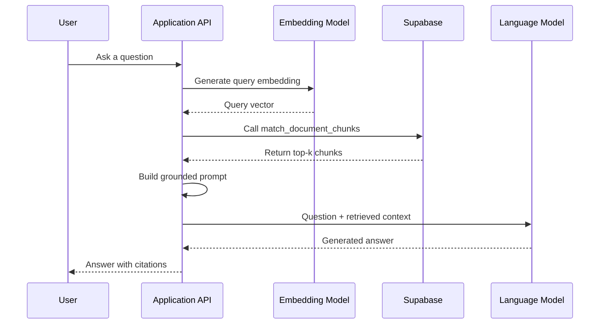
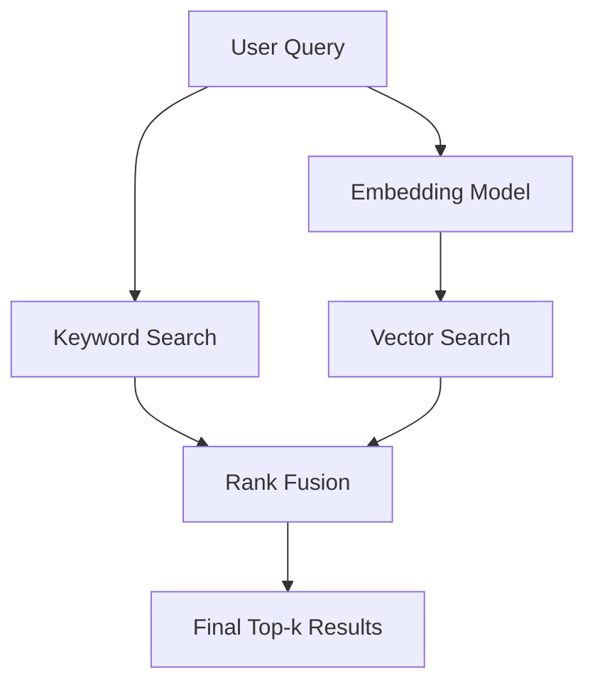

# 021 — Supabase for Embeddings and Vector Search

| Attribute              | Details                                                                               |
| ---------------------- | ------------------------------------------------------------------------------------- |
| **Course**             | 03 — Knowledge Systems and RAG                                                        |
| **Module**             | Module 08 — Embeddings and Vector Databases                                           |
| **Content Group**      | Vector Databases                                                                      |
| **Roadmap Source**     | Embeddings and Vector Databases / Vector Databases                                    |
| **Lesson Type**        | Embeddings and Vector Database                                                        |
| **Lesson Order**       | 021                                                                                   |
| **Suggested Duration** | 24 minutes                                                                            |
| **Related Outcome**    | Build semantic search systems using embeddings, vector indexes, and similarity search |
| **Related Project**    | Project 7 — Semantic Search Engine for Markdown and PDF Files                         |

---

## 1. Lesson Overview

This lesson introduces **Supabase** as a practical data platform for modern AI applications.

In the context of embeddings and Retrieval-Augmented Generation, Supabase allows you to store:

* Original documents
* Document chunks
* Embedding vectors
* Structured metadata
* User and access-control information
* Retrieval results
* Conversation or application data

Supabase uses PostgreSQL, while vector storage and similarity search are provided through the `pgvector` extension. This means an AI application can combine vector similarity with normal SQL features such as filtering, joins, transactions, full-text search, and row-level security.

Supabase is therefore not only a place to store vectors. It can act as the central backend for an AI application.

---

## 2. Learning Objectives

By the end of this lesson, you should be able to:

* Explain what Supabase is in the context of AI engineering.
* Describe how Supabase supports semantic search and RAG.
* Store text chunks, embeddings, and metadata in PostgreSQL.
* Perform vector similarity search using `pgvector`.
* Choose an appropriate similarity metric and vector index.
* Expose vector retrieval through a PostgreSQL function or API route.
* Apply metadata filters and access-control rules during retrieval.
* Evaluate retrieval quality using a repeatable test dataset.
* Identify common production limitations and failure cases.

---

## 3. What Is Supabase?

Supabase is a backend development platform built around PostgreSQL.

For a typical application, it can provide:

* A PostgreSQL database
* Authentication
* File storage
* Automatically generated APIs
* Realtime functionality
* Server-side Edge Functions
* Database extensions such as `pgvector`

For AI applications, the important component is PostgreSQL with the `pgvector` extension. `pgvector` adds vector data types, distance operators, and approximate nearest-neighbor indexes to PostgreSQL.

### A useful mental model

```text
Supabase
│
├── PostgreSQL
│   ├── Documents
│   ├── Chunks
│   ├── Metadata
│   ├── Embeddings
│   └── Application data
│
├── pgvector
│   ├── Vector columns
│   ├── Similarity operators
│   └── HNSW / IVFFlat indexes
│
├── Authentication
├── Row-Level Security
├── Storage
└── Edge Functions
```

Unlike a standalone vector database, Supabase lets you keep vectors and relational business data in the same database.

For example, a retrieved document chunk can be joined with:

* Its original document
* Its owner
* Its workspace
* Its category
* Its permissions
* Its publication status
* Its source URL
* Its version history

This is especially useful when a RAG system must enforce application permissions.

---

## 4. Where Supabase Fits in an AI Workflow

Supabase usually appears in the **storage and retrieval layer** of an AI system.


Supabase does not normally perform every stage of this workflow.

It mainly stores the data and executes retrieval queries. Parsing, chunking, embedding generation, reranking, and answer generation may run in:

* A Python backend
* A Node.js service
* A Supabase Edge Function
* A scheduled worker
* A serverless function
* An ingestion pipeline

Supabase Edge Functions are server-side TypeScript functions that can be used for HTTP endpoints, webhooks, lightweight AI inference, or orchestration of external model APIs.

---

## 5. Core Concepts

### 5.1 Document

A document is the original source of knowledge.

Examples include:

* A PDF file
* A Markdown file
* A support article
* A product page
* A company policy
* A source-code file
* A meeting transcript

A document is usually too long to embed and retrieve as one unit.

---

### 5.2 Chunk

A chunk is a smaller section extracted from a document.

Each chunk should contain enough context to be meaningful but should remain focused enough to support accurate retrieval.

Example:

```text
Document:
"Employee Information Security Policy.pdf"

Chunks:
1. Password requirements
2. Multi-factor authentication rules
3. Incident reporting process
4. Remote-work security requirements
5. Penalties for policy violations
```

---

### 5.3 Embedding

An embedding is a numerical representation of content.

Semantically related text should produce vectors located near one another in the embedding space. During semantic search, the application compares a query embedding with stored document embeddings.

Example:

```text
"How do I report a security incident?"
                ↓
[0.018, -0.291, 0.437, ..., 0.062]
```

The embedding dimension depends on the selected embedding model.

If the model produces 1,536-dimensional vectors, the database column must be declared as:

```sql
embedding vector(1536)
```

The query embedding and stored embeddings must use:

* The same model
* The same dimensions
* The same preprocessing approach

---

### 5.4 Metadata

Metadata provides structured information about a chunk.

Example:

```json
{
  "source": "security_policy.pdf",
  "page": 12,
  "section": "Incident Reporting",
  "language": "en",
  "department": "engineering",
  "document_version": "2026-07"
}
```

Metadata enables:

* Source citations
* Page-level references
* Language filtering
* Tenant isolation
* Date filtering
* Version filtering
* Category filtering
* Permission enforcement

Without metadata, the system may retrieve useful text but fail to explain where it came from.

---

### 5.5 Similarity Metric

`pgvector` supports multiple distance operators. The index operator class must correspond to the operator used in the query.

| Metric                 | Operator | Index Operator Class |
| ---------------------- | -------: | -------------------- |
| Euclidean distance     |    `<->` | `vector_l2_ops`      |
| Negative inner product |    `<#>` | `vector_ip_ops`      |
| Cosine distance        |    `<=>` | `vector_cosine_ops`  |

Cosine distance is commonly used for text embeddings.

A similarity score can be calculated as:

```text
cosine similarity = 1 - cosine distance
```

In SQL:

```sql
1 - (embedding <=> query_embedding)
```

A larger similarity value indicates a closer semantic match.

---

### 5.6 Vector Index

Without a vector index, PostgreSQL may compare the query against every stored vector.

This exact search can work for small datasets, but it becomes more expensive as the number of chunks grows.

`pgvector` provides two main approximate nearest-neighbor index types:

* HNSW
* IVFFlat

Supabase generally recommends HNSW because of its performance and robustness when data changes. IVFFlat may still be appropriate for certain specialized workloads.

#### HNSW

Advantages:

* Strong retrieval performance
* Can be created before the table contains data
* Handles changing datasets well
* Common default for production semantic search

Trade-offs:

* Higher memory usage
* Slower index creation
* More expensive writes than an unindexed table

#### IVFFlat

Advantages:

* Can use less memory in some situations
* Provides configuration controls such as the number of lists

Trade-offs:

* Should normally be created after sufficient data exists
* Requires more tuning
* Retrieval quality depends on index configuration
* Less robust for frequently changing datasets

---

## 6. Basic Supabase Vector Schema

First, enable the vector extension:

```sql
create extension if not exists vector
with schema extensions;
```

Next, create a table for document chunks:

```sql
create table public.document_chunks (
    id bigint generated always as identity primary key,

    document_id uuid not null,
    user_id uuid,
    content text not null,

    metadata jsonb not null default '{}'::jsonb,

    embedding extensions.vector(1536),

    created_at timestamptz not null default now()
);
```

### Column explanation

| Column        | Purpose                                         |
| ------------- | ----------------------------------------------- |
| `id`          | Unique chunk identifier                         |
| `document_id` | Connects the chunk to its original document     |
| `user_id`     | Identifies the owner when documents are private |
| `content`     | Stores the text used as LLM context             |
| `metadata`    | Stores source, page, section, language, or tags |
| `embedding`   | Stores the vector representation                |
| `created_at`  | Supports auditing and version management        |

The number `1536` is only an example. It must match the selected embedding model.

---

## 7. Creating an HNSW Index

For cosine distance:

```sql
create index document_chunks_embedding_hnsw_idx
on public.document_chunks
using hnsw (
    embedding extensions.vector_cosine_ops
);
```

The index operator class must match the query operator.

This combination is correct:

```text
Query operator:        <=>
Index operator class:  vector_cosine_ops
```

This combination is inconsistent:

```text
Query operator:        <=>
Index operator class:  vector_ip_ops
```

An inconsistent operator configuration can prevent PostgreSQL from using the intended index efficiently.

---

## 8. Creating a Retrieval Function

A PostgreSQL function provides a clean interface for semantic search.

```sql
create or replace function public.match_document_chunks(
    query_embedding extensions.vector(1536),
    match_threshold float,
    match_count int,
    metadata_filter jsonb default '{}'::jsonb
)
returns table (
    id bigint,
    document_id uuid,
    content text,
    metadata jsonb,
    similarity float
)
language sql
stable
as $$
    select
        dc.id,
        dc.document_id,
        dc.content,
        dc.metadata,
        1 - (dc.embedding <=> query_embedding) as similarity
    from public.document_chunks as dc
    where
        dc.embedding is not null
        and dc.metadata @> metadata_filter
        and 1 - (dc.embedding <=> query_embedding) >= match_threshold
    order by dc.embedding <=> query_embedding
    limit least(match_count, 100);
$$;
```

### Example call

```sql
select *
from public.match_document_chunks(
    '[0.12, -0.08, 0.31, ...]'::extensions.vector,
    0.70,
    5,
    '{"language": "en"}'::jsonb
);
```

The function:

1. Receives a query embedding.
2. Filters rows by metadata.
3. Removes results below the similarity threshold.
4. Sorts the remaining rows by vector distance.
5. Returns the best matching chunks.

Supabase commonly exposes this kind of PostgreSQL function through an RPC call.

---

## 9. Calling Vector Search from JavaScript

The following example assumes that the query embedding has already been generated.

```typescript
import { createClient } from "@supabase/supabase-js";

const supabase = createClient(
  process.env.SUPABASE_URL!,
  process.env.SUPABASE_ANON_KEY!
);

type SearchOptions = {
  threshold?: number;
  limit?: number;
  language?: string;
};

async function searchDocuments(
  queryEmbedding: number[],
  options: SearchOptions = {}
) {
  const {
    threshold = 0.7,
    limit = 5,
    language = "en"
  } = options;

  const { data, error } = await supabase.rpc(
    "match_document_chunks",
    {
      query_embedding: queryEmbedding,
      match_threshold: threshold,
      match_count: limit,
      metadata_filter: {
        language
      }
    }
  );

  if (error) {
    throw new Error(`Vector search failed: ${error.message}`);
  }

  return data;
}
```

Usage:

```typescript
const query = "How should an employee report a security incident?";

const queryEmbedding = await generateEmbedding(query);

const results = await searchDocuments(queryEmbedding, {
  threshold: 0.72,
  limit: 5,
  language: "en"
});

console.log(results);
```

---

## 10. Building a Simple RAG Pipeline

A basic RAG request can be divided into the following stages.



### Example prompt builder

```typescript
type RetrievedChunk = {
  content: string;
  metadata: {
    source?: string;
    page?: number;
    section?: string;
  };
  similarity: number;
};

function buildRagPrompt(
  question: string,
  chunks: RetrievedChunk[]
): string {
  const context = chunks
    .map((chunk, index) => {
      const source = chunk.metadata.source ?? "unknown";
      const page = chunk.metadata.page ?? "unknown";

      return [
        `[Source ${index + 1}]`,
        `File: ${source}`,
        `Page: ${page}`,
        chunk.content
      ].join("\n");
    })
    .join("\n\n");

  return `
You are a grounded question-answering assistant.

Answer the question using only the supplied context.

Rules:
- Do not invent unsupported information.
- State when the context is insufficient.
- Cite sources using [Source 1], [Source 2], and so on.

Question:
${question}

Context:
${context}
`.trim();
}
```

---

## 11. Ingestion Workflow

Retrieval quality depends heavily on the ingestion process.

```text
Original file
    ↓
Extract clean text
    ↓
Preserve structural information
    ↓
Split text into chunks
    ↓
Attach metadata
    ↓
Generate embeddings
    ↓
Insert rows into Supabase
    ↓
Run test queries
```

### Recommended ingestion record

```json
{
  "document_id": "103f2898-27f3-4639-a93f-f58791f122ef",
  "content": "Security incidents must be reported to the information security team within one hour...",
  "metadata": {
    "source": "information_security_policy.pdf",
    "page": 12,
    "section": "Incident Reporting",
    "chunk_index": 18,
    "language": "en"
  },
  "embedding": [0.018, -0.291, 0.437]
}
```

The vector shown here is abbreviated. A real embedding contains all dimensions produced by the selected model.

---

## 12. Chunking Strategy

There is no universally correct chunk size.

Chunking should be tested against real questions from the target application.

### Chunks that are too small

Possible problems:

* Missing surrounding context
* Incomplete definitions
* Broken lists or procedures
* Ambiguous pronouns
* More database rows
* More repeated context in the final prompt

### Chunks that are too large

Possible problems:

* Multiple unrelated topics in one vector
* Lower retrieval precision
* Higher token usage
* Relevant sentences hidden inside irrelevant content
* Fewer distinct sources available to the model

### Practical starting point

For a first experiment:

```text
Chunk size:     300–600 tokens
Chunk overlap:  50–100 tokens
Top-k:          3–8 results
```

These values are starting hypotheses, not universal rules.

They should be adjusted using evaluation results.

### Prefer structure-aware chunking

Whenever possible, split documents according to:

* Headings
* Paragraphs
* List boundaries
* Table boundaries
* Code blocks
* Page numbers
* Semantic sections

Avoid cutting content in the middle of:

* A numbered procedure
* A definition
* A code example
* A table row
* A warning
* A question-and-answer pair

---

## 13. Metadata Filtering

Vector similarity alone is not always enough.

Suppose the database contains:

* English and Vietnamese documents
* Public and private documents
* Multiple organizations
* Multiple product versions
* Archived policies
* Different departments

Retrieval should apply structured filters before returning context.

Example:

```json
{
  "language": "en",
  "department": "engineering",
  "document_version": "2026-07"
}
```

Metadata filters can improve:

* Relevance
* Security
* Citation quality
* Tenant isolation
* Version accuracy

However, approximate vector indexes combined with highly selective filters can sometimes return fewer rows than requested because candidates may be removed after the index scan. Current `pgvector` versions provide iterative scanning options that can continue scanning for additional qualifying results.

---

## 14. Authentication and Row-Level Security

A production RAG system should not retrieve documents that the current user is not allowed to read.

Enable row-level security:

```sql
alter table public.document_chunks
enable row level security;
```

Example policy:

```sql
create policy "Users can read their own document chunks"
on public.document_chunks
for select
to authenticated
using (
    user_id = auth.uid()
);
```

A retrieval function should normally preserve the caller's database permissions.

Be careful with functions declared as:

```sql
security definer
```

A `SECURITY DEFINER` function executes with the function owner's privileges. If it is implemented incorrectly, it may bypass the caller's normal access restrictions.

Supabase documents a permission-aware RAG pattern in which semantic retrieval continues to respect PostgreSQL row-level security policies.

---

## 15. Semantic Search vs Keyword Search

### Keyword search

Keyword search works well for:

* Product identifiers
* Error codes
* Exact names
* Acronyms
* File names
* Technical commands
* Exact quotations

### Semantic search

Semantic search works well for:

* Natural-language questions
* Synonyms
* Paraphrased content
* Conceptual similarity
* Questions that do not contain the exact document wording

### Example

Document text:

```text
Employees must contact the security response team immediately
after discovering unauthorized system access.
```

User query:

```text
What should I do if someone breaks into a company account?
```

A pure keyword system may struggle because the query does not contain the exact phrases:

* `unauthorized system access`
* `security response team`
* `employees must contact`

A semantic system may still identify the conceptual relationship.

---

## 16. Hybrid Search

Hybrid search combines:

* Full-text keyword search
* Vector semantic search

Supabase documents a hybrid-search approach using PostgreSQL full-text search, vector search, and reciprocal rank fusion to combine the two ranked result sets.



Hybrid search is useful when queries may contain both:

* Exact identifiers
* Natural-language intent

Example:

```text
How do I solve AUTH-401 when the session token expires?
```

Keyword search can prioritize `AUTH-401`, while semantic search can identify documents about expired authentication sessions.

---

## 17. Retrieval Evaluation

Do not evaluate retrieval quality only by manually trying one or two queries.

Create a small evaluation dataset.

### Example test case

```json
{
  "question": "How quickly must a security incident be reported?",
  "expected_sources": [
    "information_security_policy.pdf"
  ],
  "expected_pages": [12],
  "required_facts": [
    "within one hour"
  ]
}
```

### Suggested metrics

#### Hit Rate at k

Checks whether at least one relevant chunk appears in the top-k results.

```text
HitRate@5 =
queries with a relevant result in top 5
÷
total queries
```

#### Recall at k

Measures how many expected relevant chunks were retrieved.

```text
Recall@k =
relevant chunks retrieved in top k
÷
total relevant chunks
```

#### Mean Reciprocal Rank

Rewards systems that place the first relevant result near the top.

```text
MRR =
average of 1 / rank of first relevant result
```

#### Citation Accuracy

Checks whether the final answer cites a source that genuinely supports the claim.

#### Answer Faithfulness

Checks whether the generated answer is supported by the retrieved context.

#### No-Answer Accuracy

Checks whether the application correctly refuses to answer when the database does not contain enough information.

---

## 18. Example Evaluation Table

| Query                              | Expected Source       | Top Result            |       Relevant? | Rank | Citation Correct? |
| ---------------------------------- | --------------------- | --------------------- | --------------: | ---: | ----------------: |
| How do I report an incident?       | Security policy       | Incident reporting    |             Yes |    1 |               Yes |
| What is the password length?       | Password policy       | Password requirements |             Yes |    2 |               Yes |
| Can contractors access production? | Access policy         | Employee onboarding   |              No |    — |                No |
| How often are keys rotated?        | Key-management policy | Credential lifecycle  |             Yes |    3 |               Yes |
| What is the office dress code?     | No source             | No answer             | Correct refusal |    — |               N/A |

This table makes retrieval failures visible and repeatable.

---

## 19. Common Mistakes

### 19.1 Choosing chunk sizes without testing

A chunk size that works for one dataset may fail for another.

**Better approach:** compare several configurations using the same test questions.

---

### 19.2 Mixing embedding models

A query embedding created by one model should not be compared with document embeddings created by another model.

**Better approach:** store the embedding model name and version in the document metadata or ingestion record.

---

### 19.3 Using the wrong vector dimension

This causes insert or query failures.

```text
Database column: vector(1536)
Model output:    768 dimensions
Result:          incompatible dimensions
```

---

### 19.4 Losing source metadata

Without source and page information, citations become unreliable.

At minimum, store:

```json
{
  "source": "filename.pdf",
  "page": 10,
  "chunk_index": 7
}
```

---

### 19.5 Retrieving top-k without a threshold

Returning exactly five chunks does not guarantee that any of them are relevant.

**Better approach:** combine:

* A maximum result count
* A similarity threshold
* A no-answer policy

---

### 19.6 Trusting similarity scores without calibration

A score of `0.72` is not automatically good or bad.

Its meaning depends on:

* The embedding model
* The dataset
* Chunking
* Query style
* Normalization
* Distance metric

Thresholds should be selected using evaluation data.

---

### 19.7 Ignoring access control

A semantically relevant chunk may still be unauthorized.

**Better approach:** combine vector retrieval with:

* Row-level security
* Tenant identifiers
* Ownership fields
* Metadata filters
* Permission-aware SQL

---

### 19.8 Evaluating only the final answer

A poor answer may be caused by:

* Bad retrieval
* Missing documents
* Weak chunking
* Incorrect metadata
* A poor prompt
* LLM hallucination

Evaluate retrieval and generation separately.

---

### 19.9 Indexing too early

For a small dataset, an exact sequential scan may be easier to debug and may provide perfect recall.

Add approximate indexes when:

* Latency becomes unacceptable
* The number of rows becomes large
* Benchmarks demonstrate a real benefit

---

### 19.10 Returning chunks without deduplication

Overlapping chunks may cause the top results to contain nearly identical text.

**Better approach:** deduplicate by:

* Document
* Section
* Chunk neighborhood
* Semantic similarity

---

## 20. Practical Exercise

### Goal

Build a small semantic search system using Supabase.

### Dataset

Choose between 5 and 10 small documents.

Possible datasets:

* Course notes
* Product documentation
* Company policies
* Markdown files
* Technical blog posts
* A small set of PDF documents

### Step 1 — Prepare the documents

For each document, record:

* Title
* Source
* Language
* Document type
* Version
* Access level

### Step 2 — Extract the text

Clean the extracted content by removing:

* Repeated headers
* Repeated footers
* Broken whitespace
* Navigation text
* Empty sections
* Unnecessary page decorations

### Step 3 — Create chunks

Start with:

```text
Chunk size:     400 tokens
Chunk overlap:  75 tokens
```

Preserve headings and page information.

### Step 4 — Generate embeddings

Use one embedding model for both:

* Document chunks
* User queries

Record:

```json
{
  "model": "your-embedding-model",
  "dimensions": 1536,
  "chunk_size": 400,
  "chunk_overlap": 75
}
```

### Step 5 — Insert the chunks

Insert:

* Content
* Metadata
* Embedding
* Document identifier

### Step 6 — Create a retrieval function

The function should accept:

* Query embedding
* Similarity threshold
* Maximum result count
* Optional metadata filter

### Step 7 — Prepare test questions

Create at least 10 questions:

* Five direct questions
* Two paraphrased questions
* One exact-keyword question
* One ambiguous question
* One question with no answer in the dataset

### Step 8 — Record the top-k results

For every query, record:

* Rank
* Similarity
* Source
* Page
* Chunk content
* Whether the result is relevant

### Step 9 — Generate an answer

Construct a RAG prompt using the retrieved chunks.

Require the model to:

* Use only retrieved context
* Cite every important claim
* Refuse unsupported questions

### Step 10 — Analyze failure cases

For every failed query, identify the most likely cause:

```text
[ ] Missing source document
[ ] Poor text extraction
[ ] Incorrect chunk boundary
[ ] Chunk too large
[ ] Chunk too small
[ ] Embedding model limitation
[ ] Metadata filter error
[ ] Similarity threshold too high
[ ] Similarity threshold too low
[ ] Relevant result ranked below top-k
[ ] Prompt-generation problem
```

---

## 21. Suggested Experiment Matrix

Run the same test questions against multiple configurations.

| Experiment | Chunk Size | Overlap | Top-k | Threshold | Search Type |
| ---------- | ---------: | ------: | ----: | --------: | ----------- |
| A          |        250 |      50 |     5 |      0.70 | Semantic    |
| B          |        400 |      75 |     5 |      0.70 | Semantic    |
| C          |        600 |     100 |     5 |      0.70 | Semantic    |
| D          |        400 |      75 |     8 |      0.65 | Semantic    |
| E          |        400 |      75 |     5 |         — | Hybrid      |

Compare:

* Hit Rate at 5
* Recall at 5
* MRR
* Average latency
* Average context tokens
* Citation accuracy
* No-answer accuracy

---

## 22. Production Checklist

### Data

* [ ] Source documents are versioned.
* [ ] Text extraction has been inspected.
* [ ] Chunks preserve meaningful structure.
* [ ] Every chunk contains citation metadata.
* [ ] Duplicate content is removed.
* [ ] The embedding model is recorded.
* [ ] Embeddings can be regenerated when the model changes.

### Retrieval

* [ ] The query and documents use the same embedding model.
* [ ] The vector dimensions match.
* [ ] The metric matches the index operator class.
* [ ] Metadata filters are tested.
* [ ] Retrieval has a configurable threshold.
* [ ] The system supports a no-answer result.
* [ ] Relevant permission rules are enforced.
* [ ] Index performance is benchmarked.

### Generation

* [ ] The LLM receives only necessary context.
* [ ] Retrieved sources are clearly separated.
* [ ] The prompt requires grounded answers.
* [ ] Citations are mapped back to real metadata.
* [ ] Unsupported answers are rejected or marked uncertain.

### Evaluation

* [ ] A fixed test-question dataset exists.
* [ ] Retrieval metrics are recorded.
* [ ] Generation is evaluated separately.
* [ ] Failure cases are categorized.
* [ ] Changes are compared against a baseline.
* [ ] Latency and token usage are monitored.

### Security

* [ ] Row-level security is enabled where required.
* [ ] Service keys are never exposed to clients.
* [ ] Private document retrieval is tested.
* [ ] Tenant filters cannot be overridden by users.
* [ ] Logs do not expose sensitive document content.

---

## 23. Portfolio Demo Idea

Build a **Semantic Search Engine for Markdown and PDF Files**.

### Suggested stack

```text
Frontend:
Next.js or React

Backend:
FastAPI, Node.js or Supabase Edge Functions

Database:
Supabase PostgreSQL + pgvector

Ingestion:
Python document-processing pipeline

Embedding model:
A hosted or local embedding model

Generation model:
Any instruction-following LLM

Evaluation:
JSON test set + retrieval metrics
```

### Minimum features

* Upload a Markdown or PDF file.
* Extract and chunk its text.
* Generate and store embeddings.
* Search using natural-language questions.
* Display the top matching passages.
* Show source and page citations.
* Generate a grounded answer.
* Refuse questions unsupported by the uploaded files.

### Strong portfolio additions

* Hybrid search
* Reranking
* Authentication
* Multi-user document isolation
* Row-level security
* Search filters
* Evaluation dashboard
* Query history
* Configurable chunking
* Embedding-model migration
* Retrieval latency measurements

---

## 24. Knowledge Check

1. Is Supabase itself an embedding model?
2. What role does `pgvector` play?
3. Why must embedding dimensions match the vector column?
4. What is the difference between cosine distance and cosine similarity?
5. Why should metadata be stored with each chunk?
6. When would keyword search outperform semantic search?
7. Why might hybrid search be better than vector search alone?
8. What is the difference between HNSW and IVFFlat?
9. Why can a top-k result still contain irrelevant chunks?
10. How can row-level security protect a RAG system?
11. Why should retrieval and answer generation be evaluated separately?
12. What should the application do when no retrieved result exceeds the relevance threshold?

---

## 25. Completion Checklist

* [ ] I can explain Supabase in one or two minutes.
* [ ] I can explain how Supabase and `pgvector` support semantic search.
* [ ] I can create a table containing text, metadata, and embeddings.
* [ ] I understand cosine, inner-product, and Euclidean operators.
* [ ] I can create a vector index with the correct operator class.
* [ ] I can implement a PostgreSQL retrieval function.
* [ ] I can call the function through Supabase RPC.
* [ ] I can build a simple RAG prompt from retrieved chunks.
* [ ] I understand why metadata and citations are essential.
* [ ] I can test retrieval using a fixed question dataset.
* [ ] I have documented at least one limitation or failure case.
* [ ] I have produced a small demo or practical artifact.

---

## 26. Key Takeaways

Supabase can serve as the storage and retrieval foundation of a modern AI application.

Its main advantage is that vector search does not exist in isolation. Embeddings can be combined with relational data, SQL filters, full-text search, authentication, metadata, and row-level security.

A basic Supabase retrieval pipeline is:

```text
documents
    ↓
text extraction
    ↓
chunking
    ↓
embedding generation
    ↓
Supabase PostgreSQL + pgvector
    ↓
query embedding
    ↓
similarity or hybrid search
    ↓
top-k context
    ↓
LLM prompt
    ↓
grounded answer with citations
```

However, simply storing vectors is not enough.

A reliable system requires:

* Intentional chunking
* Consistent embedding models
* Correct dimensions
* Useful metadata
* Appropriate indexes
* Permission-aware retrieval
* Relevance thresholds
* Citation support
* Repeatable evaluation
* Analysis of failure cases

Treat Supabase as an engineering component rather than a complete RAG solution. The quality of the final system still depends on the ingestion pipeline, retrieval strategy, evaluation process, prompt design, and security architecture.
