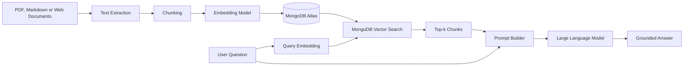
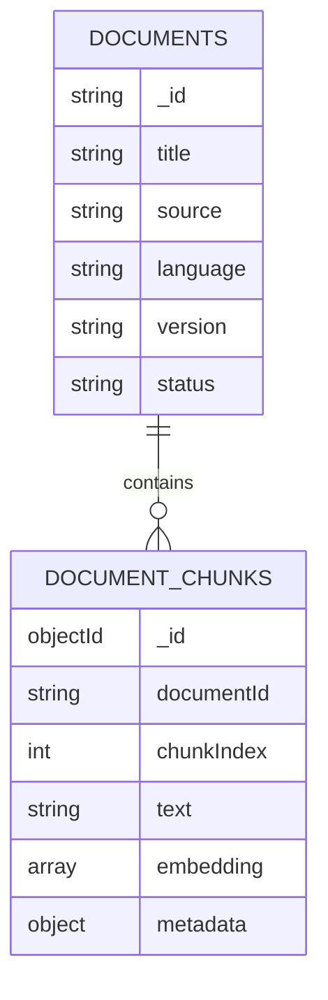
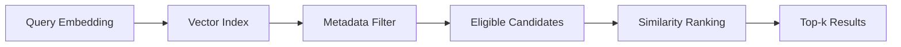
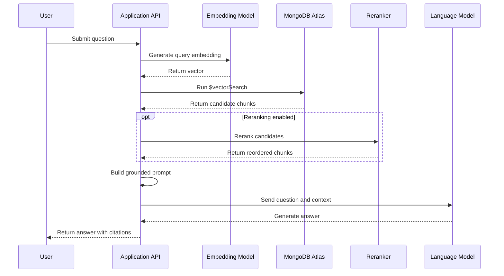
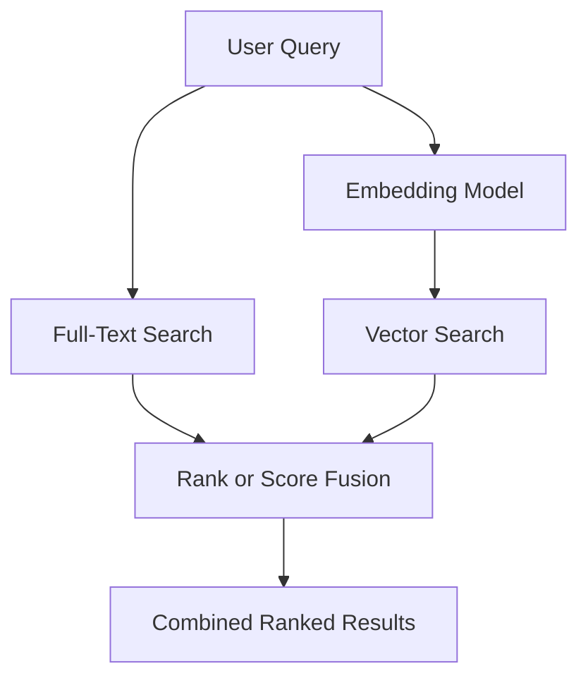

# 022 — MongoDB Atlas for Embeddings and Vector Search

| Attribute              | Details                                                                               |
| ---------------------- | ------------------------------------------------------------------------------------- |
| **Course**             | 03 — Knowledge Systems and RAG                                                        |
| **Module**             | Module 08 — Embeddings and Vector Databases                                           |
| **Content Group**      | Vector Databases                                                                      |
| **Roadmap Source**     | Embeddings and Vector Databases / Vector Databases                                    |
| **Lesson Type**        | Embeddings and Vector Database                                                        |
| **Lesson Order**       | 022                                                                                   |
| **Suggested Duration** | 24 minutes                                                                            |
| **Related Outcome**    | Build semantic search systems using embeddings, vector indexes, and similarity search |
| **Related Project**    | Project 7 — Semantic Search Engine for Markdown and PDF Files                         |

---

## 1. Lesson Overview

This lesson explains how **MongoDB Atlas** can be used as the data and retrieval layer of a modern AI application.

MongoDB is a document-oriented database that stores information in flexible, JSON-like documents. In addition to ordinary document queries and aggregation, MongoDB supports full-text search and vector search. This makes it possible to keep application data, document chunks, metadata, and embeddings in the same database.

In a Retrieval-Augmented Generation system, MongoDB Atlas can store:

* Original document records
* Extracted text chunks
* Embedding vectors
* Page and source metadata
* User or tenant identifiers
* Product, account, and application data
* Retrieval logs and evaluation results

The vector-search capability is called **MongoDB Vector Search**. It can retrieve documents according to semantic similarity rather than relying only on exact keyword matches.

---

## 2. Learning Objectives

By the end of this lesson, you should be able to:

* Explain MongoDB Atlas in the context of AI engineering.
* Distinguish MongoDB Atlas from MongoDB Vector Search.
* Design a MongoDB document for chunks, metadata, and embeddings.
* Create a vector-search index.
* Run a semantic search using `$vectorSearch`.
* Apply metadata pre-filters during retrieval.
* Compare approximate and exact nearest-neighbor search.
* Explain the purpose of `numCandidates`.
* Combine semantic and keyword retrieval through hybrid search.
* Evaluate retrieval quality with repeatable test queries.
* Identify common security, performance, and data-modeling mistakes.

---

## 3. What Is MongoDB Atlas?

**MongoDB Atlas** is MongoDB's managed cloud data platform.

MongoDB itself is a document database. Instead of organizing all information into relational rows and tables, it stores records as documents containing fields, nested objects, and arrays.

Example MongoDB document:

```json
{
  "_id": "chunk-001",
  "documentId": "security-policy-2026",
  "text": "Security incidents must be reported within one hour.",
  "metadata": {
    "source": "security-policy.pdf",
    "page": 12,
    "section": "Incident Reporting",
    "language": "en"
  },
  "embedding": [0.018, -0.291, 0.437]
}
```

The flexible document model is useful for AI applications because one record can contain:

* The chunk text
* The embedding
* Nested metadata
* Access-control fields
* Processing status
* Model information
* Application-specific attributes

MongoDB supports document queries, aggregation, full-text search, vector search, transactions, replication, and horizontal scaling.

---

## 4. MongoDB Atlas vs MongoDB Vector Search

These terms are related but not identical.

```text
MongoDB Atlas
│
├── Managed MongoDB database
├── Cluster deployment
├── Authentication and authorization
├── Replication and scaling
├── Monitoring and backups
├── MongoDB Search
└── MongoDB Vector Search
```

### MongoDB Atlas

The overall managed cloud platform.

### MongoDB Search

The full-text and relevance-search capability used for:

* Keyword matching
* Phrase search
* Fuzzy search
* Autocomplete
* Text scoring
* Faceting

### MongoDB Vector Search

The vector-similarity capability used for:

* Semantic search
* RAG retrieval
* Recommendation
* Similar-image retrieval
* Duplicate detection
* Classification support
* Multimodal retrieval

Vector search returns records whose vectors are close to the query vector in a multidimensional space.

---

## 5. Where MongoDB Atlas Fits in a RAG System

MongoDB Atlas usually belongs to the **storage and retrieval layer**.



MongoDB does not automatically solve every part of RAG.

A complete pipeline still needs:

1. Document parsing
2. Text cleaning
3. Chunking
4. Embedding generation
5. Vector storage
6. Retrieval
7. Optional reranking
8. Prompt construction
9. Answer generation
10. Citation validation
11. Evaluation and monitoring

---

## 6. Why Use MongoDB for AI Applications?

MongoDB Atlas is especially useful when the application already uses MongoDB for operational data.

For example, an e-commerce AI assistant may already store:

* Products
* Customers
* Orders
* Reviews
* Support articles
* Permissions

Embeddings can be added to the same data model:

```text
Product document
├── Name
├── Description
├── Category
├── Price
├── Inventory
├── Permissions
└── Description embedding
```

This reduces the need to maintain one database for operational data and a separate system for vectors.

### Typical use cases

* RAG assistants
* Product recommendation
* Support-ticket similarity
* Semantic document search
* Resume and job matching
* Image similarity
* Content discovery
* Duplicate-content detection
* Agent memory retrieval
* Multilingual search

---

## 7. Core Concepts

### 7.1 Collection

A collection is a group of MongoDB documents.

For a RAG application, a collection might be named:

```text
document_chunks
```

Each document in that collection represents one searchable chunk.

---

### 7.2 Chunk

A chunk is a smaller section extracted from a source document.

Example:

```text
Original document:
Information Security Policy

Chunks:
1. Password requirements
2. Authentication rules
3. Access-control procedures
4. Incident-reporting procedures
5. Remote-work requirements
```

The quality of chunking directly affects retrieval.

A chunk should be:

* Focused on one topic
* Large enough to preserve meaning
* Small enough to retrieve precisely
* Traceable to its original source

---

### 7.3 Embedding

An embedding is an array of numbers representing the semantic properties of content.

```text
"How do I report a security incident?"
                    ↓
[0.018, -0.291, 0.437, ..., 0.062]
```

The query and document chunks must normally use:

* The same embedding model
* The same number of dimensions
* Compatible preprocessing
* The same document or query instructions required by the model

---

### 7.4 Metadata

Metadata gives structured meaning to each chunk.

```json
{
  "source": "security-policy.pdf",
  "page": 12,
  "section": "Incident Reporting",
  "language": "en",
  "department": "engineering",
  "version": "2026-07",
  "tenantId": "tenant-001"
}
```

Metadata supports:

* Citations
* Security filters
* Language selection
* Tenant isolation
* Document versioning
* Date restrictions
* Category filtering
* Result debugging

---

### 7.5 Similarity Function

MongoDB Vector Search indexes support three similarity functions:

| Similarity   | Typical Use                           |
| ------------ | ------------------------------------- |
| `cosine`     | Measures the angle between vectors    |
| `dotProduct` | Often used with normalized embeddings |
| `euclidean`  | Measures geometric distance           |

The chosen function should match the embedding model's recommendations.

MongoDB vector-index definitions specify the vector path, vector dimensions, and one of these similarity methods.

---

## 8. Recommended Document Structure

A practical chunk document could look like this:

```json
{
  "_id": {
    "$oid": "67a12006cc0d39b63fd2ab01"
  },
  "documentId": "security-policy-2026",
  "chunkIndex": 18,
  "text": "Employees must report suspected security incidents to the information security team within one hour.",
  "embedding": [
    0.018,
    -0.291,
    0.437
  ],
  "metadata": {
    "title": "Information Security Policy",
    "source": "information-security-policy.pdf",
    "page": 12,
    "section": "Incident Reporting",
    "language": "en",
    "department": "all",
    "version": "2026-07",
    "tenantId": "tenant-001"
  },
  "embeddingModel": {
    "name": "example-embedding-model",
    "dimensions": 1536,
    "version": "1"
  },
  "createdAt": {
    "$date": "2026-07-26T10:00:00Z"
  }
}
```

The embedding array above is abbreviated.

A real embedding must contain every dimension produced by the embedding model.

---

## 9. Separate Documents and Chunks

For a larger system, use two collections.

### `documents`

Stores information about the original file.

```json
{
  "_id": "security-policy-2026",
  "title": "Information Security Policy",
  "source": "information-security-policy.pdf",
  "mimeType": "application/pdf",
  "language": "en",
  "version": "2026-07",
  "status": "indexed",
  "createdAt": "2026-07-26T10:00:00Z"
}
```

### `document_chunks`

Stores searchable sections.

```json
{
  "documentId": "security-policy-2026",
  "chunkIndex": 18,
  "text": "Employees must report suspected incidents...",
  "embedding": [0.018, -0.291, 0.437],
  "metadata": {
    "page": 12,
    "section": "Incident Reporting"
  }
}
```

### Relationship



This separation helps when:

* One document produces many chunks.
* Documents must be reprocessed.
* File-level permissions are required.
* Document metadata changes independently.
* Old chunk versions must be replaced.

---

## 10. Creating a Vector Search Index

A MongoDB Vector Search index defines:

* Which field contains the vector
* The number of dimensions
* The similarity function
* Which metadata fields can be used for pre-filtering

Example using `mongosh`:

```javascript
db.document_chunks.createSearchIndex(
  "document-vector-index",
  "vectorSearch",
  {
    fields: [
      {
        type: "vector",
        path: "embedding",
        numDimensions: 1536,
        similarity: "cosine"
      },
      {
        type: "filter",
        path: "metadata.language"
      },
      {
        type: "filter",
        path: "metadata.tenantId"
      },
      {
        type: "filter",
        path: "documentId"
      }
    ]
  }
);
```

MongoDB's vector-index definition supports `vector` and `filter` field types. Vector fields define `path`, `numDimensions`, and `similarity`; filter fields make structured pre-filtering available to vector queries.

### Important rule

The number of dimensions must match the embedding model output.

```text
Embedding model output: 1536 dimensions
Vector index:            1536 dimensions
Result:                  Compatible
```

```text
Embedding model output: 1024 dimensions
Vector index:            1536 dimensions
Result:                  Invalid configuration
```

---

## 11. Running a Vector Search Query

MongoDB performs vector retrieval through the `$vectorSearch` aggregation stage.

```javascript
const queryEmbedding = [
  0.021,
  -0.144,
  0.398
  // Remaining dimensions...
];

db.document_chunks.aggregate([
  {
    $vectorSearch: {
      index: "document-vector-index",
      path: "embedding",
      queryVector: queryEmbedding,
      numCandidates: 100,
      limit: 5,
      filter: {
        "metadata.language": "en",
        "metadata.tenantId": "tenant-001"
      }
    }
  },
  {
    $project: {
      _id: 1,
      documentId: 1,
      text: 1,
      metadata: 1,
      score: {
        $meta: "vectorSearchScore"
      }
    }
  }
]);
```

The query:

1. Reads the query vector.
2. Searches the indexed `embedding` field.
3. Considers up to `numCandidates` approximate candidates.
4. Applies the metadata filters.
5. Returns the top five documents.
6. Includes the vector-search score.

The `$vectorSearch` stage must appear first in a pipeline where it is used. MongoDB returns vector-search scores in a normalized range from `0` to `1`, where higher values represent stronger similarity.

---

## 12. Understanding `limit` and `numCandidates`

These fields serve different purposes.

### `limit`

The maximum number of results returned to the application.

```javascript
limit: 5
```

### `numCandidates`

The number of approximate neighbors considered before selecting the final results.

```javascript
numCandidates: 100
```

A larger `numCandidates` value may improve recall, but it can also increase latency.

MongoDB recommends using a value at least 20 times larger than `limit` as an initial tuning point. For example:

```text
limit:          5
numCandidates:  100
```

This is a starting point rather than a universal production setting. It should be evaluated against an exact-search baseline and real application queries.

---

## 13. Approximate vs Exact Nearest-Neighbor Search

### Approximate Nearest Neighbors

Approximate Nearest Neighbor search, or ANN, avoids comparing the query with every stored vector.

MongoDB's ANN search uses a Hierarchical Navigable Small Worlds structure to efficiently find close vectors. It trades a small amount of recall for lower latency.

```text
Query vector
    ↓
Search graph candidates
    ↓
Approximate nearest neighbors
    ↓
Top-k results
```

### Exact Nearest Neighbors

Exact Nearest Neighbor search, or ENN, exhaustively compares the query with the indexed vectors.

```text
Query vector
    ↓
Compare against every eligible vector
    ↓
Exact nearest neighbors
```

ENN is useful for:

* Small datasets
* Offline evaluation
* Recall measurement
* ANN configuration testing
* Creating a retrieval baseline

However, exhaustive search is more computationally expensive and may have higher latency.

### Evaluation strategy

```text
ENN results = reference result set
ANN results = production result set

ANN recall =
overlap between ANN and ENN results
÷
number of ENN results
```

---

## 14. Metadata Pre-Filtering

Vector similarity should often be combined with structured filters.

Example filters:

```javascript
filter: {
  "metadata.language": "en",
  "metadata.tenantId": "tenant-001",
  "metadata.department": {
    $in: ["engineering", "all"]
  }
}
```

Use pre-filtering for:

* User access
* Tenant isolation
* Language
* Document type
* Version
* Product category
* Region
* Date
* Publication state

The fields used in the filter must be included as `filter` fields in the vector-search index.

### Filtered retrieval flow



Filtered vector queries can be slower than equivalent unfiltered queries, so performance should be tested with realistic filters and tenant sizes.

---

## 15. Calling Vector Search from Node.js

```typescript
import { Collection, Document } from "mongodb";

type SearchOptions = {
  language: string;
  tenantId: string;
  limit?: number;
  numCandidates?: number;
};

type SearchResult = {
  documentId: string;
  text: string;
  metadata: {
    source?: string;
    page?: number;
    section?: string;
    language?: string;
    tenantId?: string;
  };
  score: number;
};

export async function searchDocumentChunks(
  collection: Collection<Document>,
  queryEmbedding: number[],
  options: SearchOptions
): Promise<SearchResult[]> {
  const limit = options.limit ?? 5;
  const numCandidates = options.numCandidates ?? limit * 20;

  if (!Array.isArray(queryEmbedding) || queryEmbedding.length === 0) {
    throw new Error("The query embedding must be a non-empty array.");
  }

  const pipeline = [
    {
      $vectorSearch: {
        index: "document-vector-index",
        path: "embedding",
        queryVector: queryEmbedding,
        numCandidates,
        limit,
        filter: {
          "metadata.language": options.language,
          "metadata.tenantId": options.tenantId
        }
      }
    },
    {
      $project: {
        _id: 0,
        documentId: 1,
        text: 1,
        metadata: 1,
        score: {
          $meta: "vectorSearchScore"
        }
      }
    }
  ];

  try {
    return await collection
      .aggregate<SearchResult>(pipeline)
      .toArray();
  } catch (error) {
    const message =
      error instanceof Error ? error.message : "Unknown MongoDB error";

    throw new Error(`MongoDB vector search failed: ${message}`);
  }
}
```

Example usage:

```typescript
const question =
  "How quickly should an employee report a security incident?";

const queryEmbedding = await generateEmbedding(question);

const results = await searchDocumentChunks(
  db.collection("document_chunks"),
  queryEmbedding,
  {
    language: "en",
    tenantId: "tenant-001",
    limit: 5
  }
);

console.log(results);
```

---

## 16. Building a RAG Prompt

The retrieved chunks must be converted into structured context.

```typescript
type RetrievedChunk = {
  text: string;
  score: number;
  metadata: {
    source?: string;
    page?: number;
    section?: string;
  };
};

export function buildRagPrompt(
  question: string,
  chunks: RetrievedChunk[]
): string {
  const context = chunks
    .map((chunk, index) => {
      const source = chunk.metadata.source ?? "unknown";
      const page = chunk.metadata.page ?? "unknown";
      const section = chunk.metadata.section ?? "unknown";

      return [
        `[Source ${index + 1}]`,
        `File: ${source}`,
        `Page: ${page}`,
        `Section: ${section}`,
        `Retrieval score: ${chunk.score.toFixed(4)}`,
        "",
        chunk.text
      ].join("\n");
    })
    .join("\n\n---\n\n");

  return `
You are a grounded question-answering assistant.

Instructions:
- Use only the supplied sources.
- Do not invent unsupported information.
- Cite claims using [Source 1], [Source 2], and so on.
- State clearly when the sources are insufficient.
- Prefer the most directly relevant source.

Question:
${question}

Sources:
${context}
`.trim();
}
```

---

## 17. Complete RAG Request Flow



---

## 18. Semantic Search vs Keyword Search

### Semantic search

Semantic search is useful when the user's wording differs from the source.

Document:

```text
Employees must contact the security response team immediately
after discovering unauthorized system access.
```

Query:

```text
What should I do if someone breaks into a company account?
```

The query and document use different words but express related meaning.

### Keyword search

Keyword search is better when exact tokens matter.

Examples:

* `AUTH-401`
* `KSOLM-226`
* Product codes
* File names
* API route names
* Error messages
* Legal clause numbers
* Employee identifiers

---

## 19. Hybrid Search

Hybrid search combines semantic vector retrieval with full-text retrieval.



MongoDB supports hybrid-search techniques that combine `$search` and `$vectorSearch` results.

Current fusion approaches include:

* Semantic boosting
* Reciprocal Rank Fusion
* Relative Score Fusion

Hybrid retrieval is helpful because full-text search captures exact terms, while semantic search captures synonyms and contextual similarity.

### Reciprocal Rank Fusion

Reciprocal Rank Fusion combines results according to their positions in separate ranked lists.

```text
reciprocal_rank = 1 / (rank + constant)
```

The weighted rank scores are added to produce one combined ranking.

### Relative Score Fusion

Relative Score Fusion:

1. Normalizes scores from each retrieval pipeline.
2. Applies configurable weights.
3. Combines the weighted scores.
4. Sorts documents according to the final score.

MongoDB exposes these approaches through `$rankFusion` and `$scoreFusion`.

### When hybrid search helps

Consider the query:

```text
How can I fix AUTH-401 after a session expires?
```

Full-text search can strongly match:

```text
AUTH-401
```

Vector search can identify passages about:

```text
expired sessions
invalid tokens
authentication renewal
login expiration
```

The fused result set can therefore perform better than either method alone.

---

## 20. Chunking Strategy

MongoDB cannot compensate for poorly designed chunks.

### Chunks that are too small

Possible problems:

* Missing context
* Incomplete procedures
* Ambiguous pronouns
* Broken definitions
* Repeated results
* Too many stored documents

### Chunks that are too large

Possible problems:

* Multiple unrelated topics
* Weak semantic focus
* Higher token usage
* Lower retrieval precision
* Relevant details buried in long passages

### Practical starting point

```text
Chunk size:     300–600 tokens
Chunk overlap:  50–100 tokens
Top-k:          3–8 chunks
```

These values are experiment settings, not universal rules.

### Prefer structure-aware chunking

Split around:

* Markdown headings
* PDF sections
* Paragraphs
* Lists
* Tables
* Code blocks
* Questions and answers
* Page boundaries

Avoid splitting in the middle of:

* A numbered procedure
* A definition
* A code example
* A warning
* A table row
* A policy rule

---

## 21. Ingestion Pipeline

```text
Document
    ↓
Extract text
    ↓
Clean repeated headers and footers
    ↓
Detect sections and page numbers
    ↓
Create chunks
    ↓
Attach metadata
    ↓
Generate embeddings
    ↓
Insert chunks into MongoDB
    ↓
Create or update vector index
    ↓
Run evaluation queries
```

### Example ingestion object

```typescript
const chunkDocument = {
  documentId: "security-policy-2026",
  chunkIndex: 18,
  text: "Employees must report suspected security incidents within one hour.",
  embedding,
  metadata: {
    source: "information-security-policy.pdf",
    page: 12,
    section: "Incident Reporting",
    language: "en",
    tenantId: "tenant-001",
    version: "2026-07"
  },
  embeddingModel: {
    name: "example-embedding-model",
    dimensions: embedding.length,
    version: "1"
  },
  createdAt: new Date()
};

await db
  .collection("document_chunks")
  .insertOne(chunkDocument);
```

---

## 22. Embedding Version Management

Embedding models change over time.

Do not overwrite embeddings without recording which model created them.

Recommended metadata:

```json
{
  "embeddingModel": {
    "provider": "example-provider",
    "name": "example-embedding-model",
    "version": "1",
    "dimensions": 1536
  }
}
```

### Model migration strategy

```text
Current field:
embedding_v1

New field:
embedding_v2
```

Migration workflow:

1. Add the new embedding field.
2. Generate new vectors in batches.
3. Create a new vector index.
4. Test retrieval against the old index.
5. Switch production traffic.
6. Retain the old index for rollback.
7. Remove old vectors after validation.

This avoids replacing the entire retrieval system in one irreversible operation.

---

## 23. Multi-Tenant Retrieval

A multi-tenant system serves several organizations from the same application.

Every chunk should include a tenant identifier:

```json
{
  "tenantId": "tenant-001"
}
```

The vector index should include that field:

```javascript
{
  type: "filter",
  path: "tenantId"
}
```

Every query must apply it:

```javascript
filter: {
  tenantId: authenticatedTenantId
}
```

MongoDB's current vector-search guidance recommends using a tenant identifier as a pre-filter when tenant data is colocated in one collection.

### Security rule

Never accept the effective tenant identifier directly from an untrusted request body.

Incorrect:

```typescript
const tenantId = request.body.tenantId;
```

Better:

```typescript
const tenantId = authenticatedUser.tenantId;
```

The authorization layer should derive the tenant from the verified user session.

---

## 24. Quantization

Large embedding collections consume substantial memory and storage.

Quantization stores or indexes lower-precision representations of vectors.

MongoDB supports configurations such as:

* Full-precision vectors
* Scalar quantization
* Binary quantization

Example index field:

```javascript
{
  type: "vector",
  path: "embedding",
  numDimensions: 1024,
  similarity: "cosine",
  quantization: "scalar"
}
```

### General trade-off

| Representation      | Memory Usage |            Latency |                   Fidelity |
| ------------------- | -----------: | -----------------: | -------------------------: |
| Full precision      |      Highest | Potentially higher |                    Highest |
| Scalar quantization |        Lower |              Lower |           Moderate to high |
| Binary quantization |       Lowest | Potentially lowest | Greater accuracy trade-off |

MongoDB describes scalar quantization as a practical balance for many workloads, while binary quantization provides stronger resource savings but may require rescoring to recover accuracy.

Quantization should be evaluated using:

* Recall against exact search
* Query latency
* Index memory
* Storage requirements
* Reranking quality
* Production concurrency

---

## 25. Retrieval Evaluation

Do not judge the system from one successful demonstration.

Create a fixed evaluation dataset.

### Example test case

```json
{
  "question": "How quickly must a security incident be reported?",
  "expectedDocumentIds": [
    "security-policy-2026"
  ],
  "expectedPages": [
    12
  ],
  "requiredFacts": [
    "within one hour"
  ]
}
```

### Recommended query categories

* Direct question
* Paraphrased question
* Exact keyword
* Acronym or identifier
* Broad conceptual question
* Multi-part question
* Ambiguous question
* Cross-document question
* Permission-restricted question
* Unanswerable question

---

## 26. Retrieval Metrics

### Hit Rate at k

Checks whether at least one relevant result appears in the top-k.

```text
HitRate@5 =
queries with a relevant result in the top 5
÷
total queries
```

### Recall at k

Measures how many relevant chunks were retrieved.

```text
Recall@k =
relevant chunks retrieved
÷
all known relevant chunks
```

### Mean Reciprocal Rank

Rewards systems that place the first relevant result near the top.

```text
MRR =
average of 1 / first relevant result rank
```

### ANN Recall

Compares approximate results with an exact nearest-neighbor baseline.

```text
ANN Recall@k =
ANN and ENN result overlap
÷
number of ENN results
```

### Citation Accuracy

Checks whether each answer citation truly supports the claim.

### No-Answer Accuracy

Checks whether the application correctly refuses questions that the collection cannot answer.

### Latency

Measure:

* Embedding latency
* MongoDB query latency
* Reranking latency
* LLM latency
* End-to-end latency

---

## 27. Example Evaluation Table

| Query                              | Expected Source | First Relevant Rank |       Top-5 Hit | Citation Correct | Result |
| ---------------------------------- | --------------- | ------------------: | --------------: | ---------------: | ------ |
| How do I report an incident?       | Security policy |                   1 |             Yes |              Yes | Pass   |
| What is the password length?       | Password policy |                   2 |             Yes |              Yes | Pass   |
| Can contractors access production? | Access policy   |                   — |              No |               No | Fail   |
| How often are keys rotated?        | Key policy      |                   3 |             Yes |              Yes | Pass   |
| What is the office dress code?     | No source       |                   — | Correct refusal |              N/A | Pass   |

---

## 28. Experiment Matrix

Run the same questions against several configurations.

| Experiment | Chunk Size | Overlap | Top-k | Candidates | Retrieval |
| ---------- | ---------: | ------: | ----: | ---------: | --------- |
| A          |        250 |      50 |     5 |        100 | Vector    |
| B          |        400 |      75 |     5 |        100 | Vector    |
| C          |        600 |     100 |     5 |        100 | Vector    |
| D          |        400 |      75 |     8 |        160 | Vector    |
| E          |        400 |      75 |     5 |        200 | Vector    |
| F          |        400 |      75 |     5 |        100 | Hybrid    |

Compare:

* Hit Rate at 5
* Recall at 5
* MRR
* ANN recall
* Average query latency
* Context token usage
* Citation accuracy
* No-answer accuracy

---

## 29. Common Mistakes

### 29.1 Using inconsistent embedding models

Document vectors and query vectors generated by different models may not share a meaningful vector space.

**Better approach:** record the embedding model and version.

---

### 29.2 Configuring the wrong dimensions

```text
Index dimensions: 1536
Embedding length:  1024
```

This configuration is incompatible.

---

### 29.3 Forgetting filter fields in the index

A metadata field cannot be used correctly as a vector-search pre-filter unless it is configured as a `filter` field.

---

### 29.4 Losing citation metadata

A retrieved chunk without source and page information cannot produce reliable citations.

Minimum recommended metadata:

```json
{
  "source": "document.pdf",
  "page": 10,
  "chunkIndex": 7
}
```

---

### 29.5 Treating the score as a universal probability

A vector-search score is useful for ranking, but a value such as `0.78` does not automatically mean that the result is correct with 78% probability.

Scores depend on:

* Embedding model
* Similarity function
* Dataset
* Query type
* Chunking
* Index configuration

Thresholds must be calibrated with real evaluation data.

---

### 29.6 Using only top-k without a relevance policy

Returning five documents does not guarantee that any are useful.

A production system should consider:

* Minimum score
* Score gap
* Reranker score
* Metadata constraints
* No-answer classification

---

### 29.7 Setting `numCandidates` too low

A very small candidate pool can reduce ANN recall.

**Better approach:** compare ANN results with ENN results while testing multiple values.

---

### 29.8 Setting `numCandidates` unnecessarily high

A very large candidate pool can increase latency without a meaningful quality gain.

**Better approach:** find the smallest value that reaches the required recall.

---

### 29.9 Evaluating only the final LLM answer

An incorrect answer may originate from:

* Missing source data
* Extraction errors
* Poor chunking
* Weak retrieval
* Incorrect filters
* Bad reranking
* Prompt failure
* LLM hallucination

Measure retrieval and generation separately.

---

### 29.10 Ignoring duplicate chunks

Chunk overlap may produce several nearly identical results.

Possible solutions:

* Deduplicate by document and section.
* Remove neighboring chunks.
* Use a maximum number of chunks per source.
* Merge adjacent retrieved chunks.
* Apply semantic deduplication.

---

### 29.11 Mixing private and public content

Semantic relevance does not imply authorization.

Every retrieval query must apply verified access rules before content is sent to the language model.

---

### 29.12 Indexing unclean text

Repeated headers, footers, menus, and navigation text can dominate the vector space.

Clean documents before generating embeddings.

---

## 30. Practical Exercise

### Goal

Build a small semantic-search application using MongoDB Atlas.

### Dataset

Choose between 5 and 10 small documents.

Possible choices:

* Course notes
* Product documentation
* Company policies
* Markdown files
* Technical articles
* PDF manuals
* Support knowledge-base articles

### Step 1 — Prepare the source records

Record:

* Title
* File name
* Language
* Version
* Access level
* Document type

### Step 2 — Extract and clean text

Remove:

* Repeated headers
* Repeated footers
* Navigation menus
* Broken whitespace
* Empty sections
* Page decorations
* Duplicate text

### Step 3 — Create chunks

Start with:

```text
Chunk size:     400 tokens
Chunk overlap:  75 tokens
```

### Step 4 — Attach metadata

Each chunk should include:

```json
{
  "source": "document.pdf",
  "page": 1,
  "section": "Section title",
  "language": "en",
  "tenantId": "demo-tenant"
}
```

### Step 5 — Generate embeddings

Use the same embedding model for:

* Source chunks
* User queries

### Step 6 — Insert records into MongoDB

Store:

* Chunk text
* Embedding
* Document identifier
* Chunk index
* Metadata
* Embedding-model information

### Step 7 — Create the vector index

Index:

* The embedding as `vector`
* Language as `filter`
* Tenant ID as `filter`
* Document ID as `filter`

### Step 8 — Create test questions

Prepare at least 10 questions:

* Five direct questions
* Two paraphrased questions
* One exact-keyword question
* One ambiguous question
* One unanswerable question

### Step 9 — Record top-k results

For each result, save:

* Rank
* Vector score
* Document ID
* Source
* Page
* Text
* Relevance label

### Step 10 — Build a grounded answer

Require the LLM to:

* Use only retrieved context.
* Include citations.
* Avoid unsupported claims.
* Refuse when evidence is insufficient.

### Step 11 — Analyze failures

Use this checklist:

```text
[ ] Source document is missing
[ ] Text extraction is incorrect
[ ] Chunk is too large
[ ] Chunk is too small
[ ] Chunk boundary is poor
[ ] Embedding model is unsuitable
[ ] Wrong embedding dimensions
[ ] Incorrect metadata filter
[ ] numCandidates is too low
[ ] Top-k is too small
[ ] Duplicate chunks dominate results
[ ] Relevant content ranks too low
[ ] Hybrid search is required
[ ] Reranking is required
[ ] Prompt construction is incorrect
```

---

## 31. Portfolio Project

Build a **Semantic Search Engine for Markdown and PDF Files**.

### Suggested stack

```text
Frontend:
Next.js or React

Backend:
FastAPI, Express or NestJS

Database:
MongoDB Atlas

Vector retrieval:
MongoDB Vector Search

Full-text retrieval:
MongoDB Search

Document processing:
Python

Embedding model:
Hosted or local embedding model

Generation:
Instruction-following language model

Evaluation:
JSON test set and retrieval metrics
```

### Minimum features

* Upload Markdown and PDF files.
* Extract and clean text.
* Split documents into chunks.
* Generate embeddings.
* Store chunks in MongoDB Atlas.
* Create a vector-search index.
* Search with natural-language questions.
* Display top matching passages.
* Show source and page citations.
* Generate a grounded response.
* Refuse unsupported questions.

### Strong portfolio additions

* Hybrid search
* Candidate reranking
* Authentication
* Multi-user isolation
* Tenant pre-filtering
* Query history
* Evaluation dashboard
* Configurable chunking
* Embedding-model migration
* Duplicate-result removal
* Latency measurements
* Token and API cost tracking
* Streaming answers
* Multilingual retrieval

---

## 32. Production Checklist

### Data ingestion

* [ ] Source files are versioned.
* [ ] Text extraction is manually inspected.
* [ ] Repeated headers and footers are removed.
* [ ] Chunk boundaries preserve semantic structure.
* [ ] Every chunk contains citation metadata.
* [ ] Duplicate chunks are removed.
* [ ] Failed ingestion jobs can be retried.
* [ ] Old document versions can be invalidated.

### Embeddings

* [ ] Query and document embeddings use the same model.
* [ ] Embedding dimensions match the index.
* [ ] Model name and version are stored.
* [ ] Embedding failures are logged.
* [ ] A model-migration strategy exists.
* [ ] Batch embedding respects API limits.

### Vector index

* [ ] The correct vector path is configured.
* [ ] The correct similarity function is selected.
* [ ] Required metadata fields are indexed as filters.
* [ ] Index creation status is monitored.
* [ ] ANN recall is measured against ENN.
* [ ] `numCandidates` is tuned.
* [ ] Quantization is evaluated before production use.

### Retrieval

* [ ] Real user queries are included in evaluation.
* [ ] Top-k is configurable.
* [ ] Metadata filters are enforced.
* [ ] Tenant filters come from authentication.
* [ ] Duplicate results are controlled.
* [ ] No-answer behavior is implemented.
* [ ] Hybrid search is tested for identifiers and exact terms.
* [ ] Reranking is evaluated separately.

### Generation

* [ ] Context contains clear source boundaries.
* [ ] The prompt requires grounded answers.
* [ ] Citations map back to real documents.
* [ ] Unsupported statements are rejected.
* [ ] Context token usage is monitored.
* [ ] Sensitive retrieved text is not logged unnecessarily.

### Evaluation

* [ ] A fixed test dataset exists.
* [ ] Hit Rate and Recall are recorded.
* [ ] MRR is calculated.
* [ ] ANN recall is measured.
* [ ] Citation accuracy is measured.
* [ ] No-answer accuracy is measured.
* [ ] Latency is measured by pipeline stage.
* [ ] Changes are compared against a baseline.

### Security

* [ ] Database credentials are stored securely.
* [ ] Network access is restricted.
* [ ] Private content is filtered before retrieval.
* [ ] Tenant IDs cannot be overridden by clients.
* [ ] Authorization tests include negative cases.
* [ ] Retrieved content is not exposed across users.
* [ ] Administrative credentials are not included in frontend code.

---

## 33. Knowledge Check

1. What is the difference between MongoDB Atlas and MongoDB Vector Search?
2. Why is MongoDB's document model useful for AI applications?
3. What information should be stored with every chunk?
4. Why must embedding dimensions match the index?
5. What similarity functions can a vector index use?
6. What is the role of `$vectorSearch`?
7. What is the difference between `limit` and `numCandidates`?
8. Why should ANN retrieval be compared with ENN?
9. When is semantic search better than keyword search?
10. When is keyword search better than semantic search?
11. What problem does hybrid search solve?
12. Why must filter fields be included in the vector index?
13. How should a tenant identifier be obtained securely?
14. Why should vector scores not be treated as probabilities?
15. What should the system do when no source supports the answer?

---

## 34. Completion Checklist

* [ ] I can explain MongoDB Atlas in one or two minutes.
* [ ] I can distinguish Atlas, MongoDB Search, and MongoDB Vector Search.
* [ ] I can design a MongoDB document containing text, metadata, and an embedding.
* [ ] I can create a vector-search index.
* [ ] I understand vector and filter index fields.
* [ ] I can run a `$vectorSearch` query.
* [ ] I understand `limit` and `numCandidates`.
* [ ] I can apply language and tenant filters.
* [ ] I understand ANN and ENN retrieval.
* [ ] I can build a RAG prompt from MongoDB results.
* [ ] I understand hybrid search.
* [ ] I can evaluate retrieval using fixed questions.
* [ ] I have documented at least one limitation or failure case.
* [ ] I have created a small demo or practical artifact.

---

## 35. Key Takeaways

MongoDB Atlas can act as both an operational application database and a vector-retrieval system.

A typical workflow is:

```text
documents
    ↓
text extraction
    ↓
chunking
    ↓
metadata
    ↓
embedding generation
    ↓
MongoDB Atlas
    ↓
MongoDB Vector Search
    ↓
metadata pre-filtering
    ↓
top-k chunks
    ↓
optional reranking
    ↓
grounded prompt
    ↓
LLM answer with citations
```

Its major advantage is that embeddings can remain close to the application data they describe.

For example:

```text
Product information + product embedding
Support ticket + ticket embedding
Article + article embedding
User memory + memory embedding
Image metadata + image embedding
```

However, storing vectors is only one part of the system.

A reliable MongoDB-based RAG application still requires:

* Clean source data
* Intentional chunking
* Consistent embedding models
* Correct vector dimensions
* Useful citation metadata
* Appropriate pre-filters
* Secure tenant isolation
* ANN configuration testing
* Hybrid-search evaluation
* Repeatable retrieval metrics
* Clear no-answer behavior

Treat MongoDB Atlas as an engineering component within a complete knowledge system, rather than as an automatic solution to every RAG problem.

---

# Bài luyện tập

## Mục tiêu


## Đề bài


## Yêu cầu hoàn thành

- [ ] 
- [ ] 
- [ ] 

## Kết quả / lời giải


## Ghi chú
