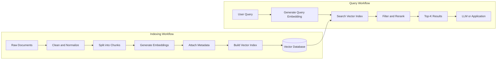
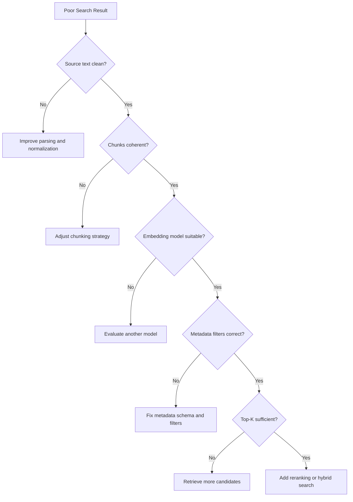
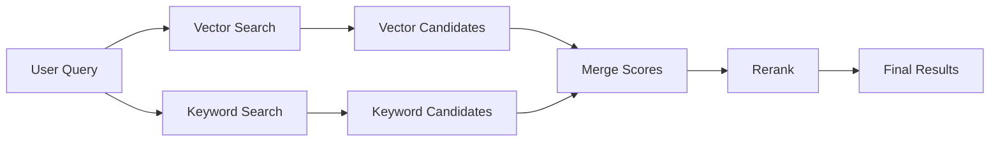
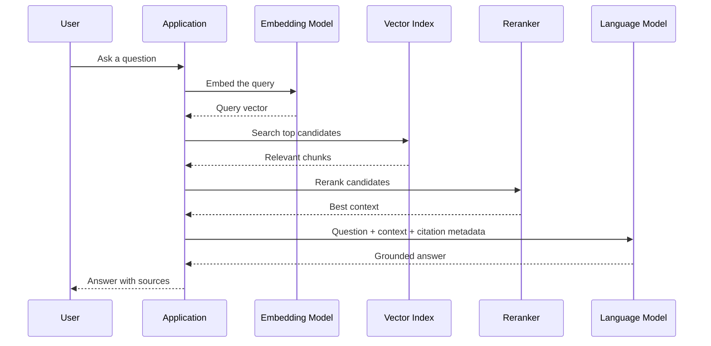

# 023 — Indexing Embeddings

| Attribute              | Details                                                  |
| ---------------------- | -------------------------------------------------------- |
| **Course**             | 03 — Knowledge Systems and RAG                           |
| **Module**             | Module 08 — Embeddings and Vector Databases              |
| **Content Group**      | Vector Search Workflow                                   |
| **Roadmap Source**     | Embeddings and Vector Databases / Vector Search Workflow |
| **Lesson Type**        | Embeddings and Vector Databases                          |
| **Lesson Order**       | 023                                                      |
| **Suggested Duration** | 24 minutes                                               |

---

## 1. Overview

**Indexing embeddings** is the process of organizing vector representations so that semantically similar items can be found efficiently.

After converting documents, images, products, or other data into embeddings, an AI system must store those vectors in a searchable index. Without an index, the system may need to compare a query vector with every stored vector, which becomes slow and expensive as the dataset grows.

Embedding indexes are commonly used in:

* Semantic search
* Retrieval-Augmented Generation, or RAG
* Recommendation systems
* Duplicate detection
* Document classification
* Image and multimodal search
* Agent memory systems
* Similarity-based content discovery

In a modern AI application, indexing sits between **embedding generation** and **retrieval**.

---

## 2. Learning Objectives

By the end of this lesson, you should be able to:

* Explain embedding indexing in your own words.
* Describe where indexing belongs in a vector search workflow.
* Distinguish exact search from approximate nearest-neighbor search.
* Select an appropriate similarity metric.
* Design chunks and metadata for retrieval.
* Build a small embedding index.
* Test retrieval quality using real queries and failure cases.
* Apply indexing to a semantic search or RAG application.

---

## 3. What Is an Embedding Index?

An embedding is a numerical vector representing the semantic meaning of an item.

For example:

```text
"How do I reset my password?"
        ↓
[0.021, -0.184, 0.772, ..., 0.093]
```

An **embedding index** is a data structure that organizes many vectors so that the system can quickly find the vectors closest to a query vector.

Suppose a database contains one million document embeddings. Comparing a query against all one million vectors is called a brute-force or exact search.

An index creates a more efficient search structure so that the system examines only the most promising candidates.

```text
Without an index:

Query vector
     ↓
Compare against every stored vector
     ↓
Return nearest results
```

```text
With an index:

Query vector
     ↓
Navigate the vector index
     ↓
Inspect likely neighbors
     ↓
Return nearest results
```

The indexed approach is usually much faster, although approximate indexes may sacrifice a small amount of retrieval accuracy.

---

## 4. Position in the Vector Search Workflow

A typical vector search system contains two major workflows:

1. The **indexing workflow**, which prepares and stores data.
2. The **query workflow**, which retrieves relevant data.



A simplified version is:

```text
document
   ↓
chunk
   ↓
embedding
   ↓
vector index
   ↓
query embedding
   ↓
similarity search
   ↓
top-k results
```

---

## 5. The Indexing Pipeline

### 5.1 Collect the Source Data

The source data may include:

* Markdown files
* PDF documents
* Web pages
* Product descriptions
* Support tickets
* Source code
* Images
* Audio transcripts
* Database records

Each source should have a stable identifier so that indexed records can be updated or deleted later.

Example:

```json
{
  "document_id": "employee-handbook-2026",
  "source": "employee_handbook.pdf",
  "version": "2026.1"
}
```

---

### 5.2 Clean and Normalize the Content

Before chunking, remove content that does not help retrieval.

Possible preprocessing steps include:

* Removing repeated headers and footers
* Fixing broken whitespace
* Converting HTML to clean text
* Preserving headings and lists
* Removing duplicate content
* Normalizing Unicode characters
* Detecting the document language
* Extracting tables separately when necessary

Poor source text produces poor chunks, even when the embedding model is strong.

---

### 5.3 Split Documents into Chunks

Embedding an entire document as one vector is often ineffective because the vector must represent too many unrelated ideas.

Instead, divide the document into smaller units called **chunks**.

Example:

```text
Document
├── Chunk 1: Introduction
├── Chunk 2: Authentication process
├── Chunk 3: Password reset instructions
└── Chunk 4: Account recovery limitations
```

A useful chunk should:

* Contain enough context to be understandable.
* Focus on one main topic.
* Avoid mixing unrelated sections.
* Preserve important headings.
* Fit within the embedding model's input limit.
* Be useful when returned independently.

Common chunking strategies include:

| Strategy        | Description                                                      | Suitable For                     |
| --------------- | ---------------------------------------------------------------- | -------------------------------- |
| Fixed-size      | Split by a fixed number of tokens or characters                  | Simple documents and prototypes  |
| Recursive       | Split by headings, paragraphs, sentences, and tokens             | General-purpose RAG              |
| Semantic        | Split when the meaning changes significantly                     | Long narrative or technical text |
| Structure-aware | Split using document elements such as headings or sections       | Markdown, HTML, manuals          |
| Code-aware      | Split by classes, functions, or modules                          | Source-code search               |
| Parent-child    | Store small searchable chunks connected to larger context blocks | Advanced RAG systems             |

A common starting configuration is:

```text
Chunk size: 300–800 tokens
Overlap: 10–20%
```

These values are only starting points. The correct configuration must be evaluated using real queries.

---

### 5.4 Generate Embeddings

Each chunk is sent to an embedding model.

```text
Chunk text
    ↓
Embedding model
    ↓
Dense numerical vector
```

Example record:

```json
{
  "chunk_id": "employee-handbook-2026-password-reset-01",
  "text": "Employees can reset their password from the account security page...",
  "embedding": [0.021, -0.184, 0.772, 0.093],
  "metadata": {
    "document_id": "employee-handbook-2026",
    "page": 18,
    "section": "Password Reset",
    "language": "en"
  }
}
```

Important model-related properties include:

* Vector dimension
* Maximum input length
* Supported languages
* Domain performance
* Cost per token or request
* Latency
* Normalization requirements
* Version stability

The same embedding model should normally be used for both documents and queries unless the model explicitly supports asymmetric retrieval.

---

### 5.5 Attach Metadata

Metadata provides information that cannot be represented reliably by semantic similarity alone.

Useful metadata fields include:

```json
{
  "document_id": "security-guide",
  "chunk_id": "security-guide-section-4-chunk-2",
  "title": "Incident Response",
  "section": "Reporting an Incident",
  "page": 27,
  "source_url": "/documents/security-guide.pdf",
  "language": "en",
  "department": "Security",
  "access_level": "internal",
  "created_at": "2026-06-10",
  "version": "3.2"
}
```

Metadata supports:

* Source citations
* Access control
* Language filtering
* Date filtering
* Department filtering
* Document updates
* Version management
* Debugging
* Result grouping

Without source and location metadata, a RAG application cannot reliably show citations.

---

### 5.6 Build the Vector Index

The index organizes vectors for efficient nearest-neighbor search.

Common index approaches include:

| Index Type           | Main Idea                                                 | Advantages                              | Limitations                  |
| -------------------- | --------------------------------------------------------- | --------------------------------------- | ---------------------------- |
| Flat or brute-force  | Compare the query with every vector                       | Exact results and simple implementation | Slow for large datasets      |
| HNSW                 | Build a navigable graph of nearby vectors                 | Fast search and strong recall           | Higher memory usage          |
| IVF                  | Divide vectors into clusters and search selected clusters | Efficient for large datasets            | Requires training and tuning |
| Product Quantization | Compress vectors into smaller representations             | Lower memory usage                      | May reduce accuracy          |
| Disk-based ANN       | Store much of the index on disk                           | Supports very large datasets            | Higher storage latency       |
| Managed vector index | Database manages indexing automatically                   | Easier operations and scaling           | Less low-level control       |

Popular tools may implement one or more of these techniques:

* FAISS
* Chroma
* Qdrant
* Weaviate
* Pinecone
* Milvus
* Elasticsearch
* OpenSearch
* PostgreSQL with pgvector
* MongoDB Atlas Vector Search

---

## 6. Exact Search vs. Approximate Search

### Exact Nearest-Neighbor Search

Exact search compares the query vector against every stored vector.

```text
Query → compare with vector 1
      → compare with vector 2
      → compare with vector 3
      → ...
      → compare with vector N
```

Advantages:

* Produces exact nearest neighbors.
* Requires little index tuning.
* Useful for small datasets.
* Useful as an evaluation baseline.

Disadvantages:

* Search time increases with the number of vectors.
* Can become expensive for large-scale systems.

### Approximate Nearest-Neighbor Search

Approximate nearest-neighbor, or ANN, search uses an index to search only part of the vector space.

Advantages:

* Much faster for large datasets.
* Supports low-latency production search.
* Can scale to millions or billions of vectors.

Disadvantages:

* May miss some true nearest neighbors.
* Requires parameter tuning.
* May consume additional memory.
* Index construction may take time.

The main trade-off is:

```text
Higher speed
    ↕
Higher recall
```

A production index should balance:

* Retrieval quality
* Query latency
* Memory usage
* Build time
* Update speed
* Infrastructure cost

---

## 7. Similarity Metrics

The index requires a method for measuring how close two vectors are.

### 7.1 Cosine Similarity

Cosine similarity measures the angle between two vectors.

[
\text{cosine}(A,B)=\frac{A\cdot B}{|A||B|}
]

Interpretation:

* Closer to `1`: highly similar
* Around `0`: weakly related
* Closer to `-1`: opposite directions

Cosine similarity is widely used for text embeddings.

---

### 7.2 Dot Product

The dot product is:

[
A\cdot B=\sum_{i=1}^{n}A_iB_i
]

It is often efficient and works well when the embedding model is designed or normalized for dot-product search.

---

### 7.3 Euclidean Distance

Euclidean distance measures the straight-line distance between two vectors.

[
d(A,B)=\sqrt{\sum_{i=1}^{n}(A_i-B_i)^2}
]

A smaller distance indicates greater similarity.

---

### 7.4 Choosing a Metric

Use the metric recommended by the embedding model provider.

Do not choose a metric only because it is available in the vector database. The embedding model and the search metric must be compatible.

```text
Embedding model documentation
            ↓
Recommended similarity metric
            ↓
Vector index configuration
```

---

## 8. Creating an Index: Conceptual Example

The following pseudocode demonstrates the indexing process:

```python
documents = load_documents("knowledge_base/")

chunks = []

for document in documents:
    document_chunks = split_document(
        document.text,
        chunk_size=500,
        overlap=75,
    )

    for position, chunk_text in enumerate(document_chunks):
        chunks.append(
            {
                "id": f"{document.id}-{position}",
                "text": chunk_text,
                "metadata": {
                    "source": document.filename,
                    "page": document.page,
                    "position": position,
                },
            }
        )

texts = [chunk["text"] for chunk in chunks]
vectors = embedding_model.embed(texts)

for chunk, vector in zip(chunks, vectors):
    vector_database.upsert(
        id=chunk["id"],
        vector=vector,
        document=chunk["text"],
        metadata=chunk["metadata"],
    )
```

The essential steps are:

```text
Load → Clean → Chunk → Embed → Add metadata → Upsert
```

---

## 9. Querying the Index

When a user submits a query:

1. Normalize the query.
2. Generate its embedding.
3. Search the vector index.
4. Apply metadata filters.
5. Retrieve the top results.
6. Optionally rerank the results.
7. Pass the selected context to the application or LLM.

Example pseudocode:

```python
query = "How can an employee reset a forgotten password?"

query_vector = embedding_model.embed_query(query)

results = vector_database.search(
    vector=query_vector,
    top_k=5,
    filters={
        "language": "en",
        "access_level": "internal",
    },
)

for result in results:
    print(result.score)
    print(result.document)
    print(result.metadata)
```

Example output:

```text
Score: 0.89
Source: employee_handbook.pdf
Page: 18
Text: Employees can reset a forgotten password from the account security page...
```

---

## 10. The Meaning of Top-K

`top-k` determines how many nearest results the index returns.

```text
top_k = 3
```

This means the search returns the three closest chunks.

Choosing `top-k` involves a trade-off:

| Small Top-K                     | Large Top-K                          |
| ------------------------------- | ------------------------------------ |
| Lower latency                   | Higher latency                       |
| Less context                    | More context                         |
| Lower token usage               | Higher token usage                   |
| May miss supporting information | May introduce irrelevant information |

A RAG system may retrieve many candidates and then rerank them:

```text
Retrieve top 20
       ↓
Rerank candidates
       ↓
Select best 5
       ↓
Send to the LLM
```

This is often more reliable than directly sending the first five vector results.

---

## 11. Metadata Filtering

Semantic similarity alone may return content that is relevant in meaning but invalid for the current request.

For example, the system may need to search only:

* English documents
* Documents published after a specific date
* Records belonging to the current user
* A selected product category
* Public documents
* The latest document version

Example:

```python
results = index.search(
    query_vector=query_vector,
    top_k=10,
    filters={
        "language": "en",
        "department": "engineering",
        "version": "latest",
    },
)
```

A common production workflow is:

```text
Metadata filtering
        +
Vector similarity
        +
Reranking
        =
Higher-quality retrieval
```

Metadata filtering must also enforce security rules. A user should never retrieve private content merely because it is semantically similar to their query.

---

## 12. Index Updates and Deletions

An embedding index is not always static.

Documents may be:

* Added
* Edited
* Replaced
* Deleted
* Reclassified
* Moved to a different access level

A robust indexing system should support:

```text
Create → Embed → Upsert
Update → Re-embed changed chunks → Upsert
Delete → Remove vectors by document ID
```

Store stable identifiers:

```json
{
  "document_id": "policy-2026",
  "chunk_id": "policy-2026-section-4-chunk-2",
  "content_hash": "8b451f...",
  "embedding_model": "embedding-model-v2"
}
```

A content hash can help identify whether a chunk changed and must be embedded again.

---

## 13. Reindexing When the Model Changes

Embeddings generated by different models usually do not share the same vector space.

Therefore, if the embedding model changes, the application normally needs to regenerate all stored vectors.

Incorrect workflow:

```text
Old document vectors from Model A
           +
Query vector from Model B
           ↓
Unreliable similarity results
```

Correct workflow:

```text
Choose Model B
      ↓
Re-embed every document chunk
      ↓
Build a new index
      ↓
Switch queries to Model B
```

Useful version fields include:

```json
{
  "embedding_model": "model-b",
  "embedding_version": "2026-07",
  "index_version": "knowledge-base-v4"
}
```

For production migrations, build the new index separately and switch traffic only after evaluation.

---

## 14. Evaluating the Index

A successful index is not one that merely returns results. It must return the correct results consistently.

### 14.1 Build a Test Dataset

Create a small evaluation dataset:

```json
[
  {
    "query": "How do I reset my password?",
    "expected_document": "employee_handbook.pdf",
    "expected_section": "Password Reset"
  },
  {
    "query": "Who should receive a security incident report?",
    "expected_document": "security_policy.pdf",
    "expected_section": "Incident Reporting"
  }
]
```

Include different query types:

* Exact terminology
* Paraphrased queries
* Short queries
* Long natural-language questions
* Queries with spelling mistakes
* Ambiguous questions
* Questions with no answer
* Queries requiring metadata filters

---

### 14.2 Retrieval Metrics

#### Recall@K

Recall@K checks whether a relevant result appears within the first `K` results.

[
\text{Recall@K}=
\frac{\text{queries with a relevant result in top K}}
{\text{total queries}}
]

Example:

```text
8 of 10 queries contain the expected chunk in the top 5.

Recall@5 = 8 / 10 = 0.80
```

---

#### Precision@K

Precision@K measures how many retrieved results are relevant.

[
\text{Precision@K}=
\frac{\text{relevant results in top K}}
{K}
]

---

#### Mean Reciprocal Rank

Mean Reciprocal Rank rewards systems that place the first relevant result near the top.

[
\text{RR}=\frac{1}{\text{rank of first relevant result}}
]

If the first relevant result appears at rank 2:

[
\text{RR}=0.5
]

---

#### Latency

Measure the total retrieval time:

```text
Query embedding latency
        +
Index search latency
        +
Filtering latency
        +
Reranking latency
```

Common measurements include:

* Average latency
* P50 latency
* P95 latency
* P99 latency

---

### 14.3 Compare Against Exact Search

For ANN indexes, exact search can act as a reference.

```text
Exact nearest neighbors
          ↓
Compare with ANN results
          ↓
Measure ANN recall
```

For example:

```text
Exact top 10: A, B, C, D, E, F, G, H, I, J
ANN top 10:   A, B, D, E, F, G, H, I, K, L
```

Eight exact neighbors were found:

```text
ANN Recall@10 = 8 / 10 = 0.80
```

---

## 15. Common Failure Cases

### 15.1 Chunks Are Too Large

Large chunks may contain multiple unrelated topics.

```text
One large chunk:
- Password reset
- Vacation policy
- Security reporting
- Payroll dates
```

The resulting embedding becomes semantically diluted.

**Possible solution:** split by heading, paragraph, or semantic topic.

---

### 15.2 Chunks Are Too Small

Very small chunks may lose important context.

```text
Chunk 1: "This must be completed within 24 hours."
```

The system does not know what must be completed.

**Possible solution:** include the heading, surrounding sentences, or a parent section.

---

### 15.3 Missing Metadata

Without metadata, the application may not know:

* The source document
* The page number
* The section title
* The document version
* The access level

**Possible solution:** define a metadata schema before indexing.

---

### 15.4 Mismatched Embedding Models

Documents embedded by one model and queries embedded by another may produce meaningless scores.

**Possible solution:** track the embedding model and index version explicitly.

---

### 15.5 Duplicate Content

Repeated content can dominate the top results.

Example:

```text
Rank 1: Same policy paragraph from page 1
Rank 2: Same policy paragraph from page 3
Rank 3: Same policy paragraph from page 8
```

**Possible solution:** remove duplicates, group results by source, or apply diversity reranking.

---

### 15.6 Indexing Headers and Footers

Repeated headers such as company names or confidentiality notices may appear in every PDF chunk.

**Possible solution:** remove repeated layout elements during document preprocessing.

---

### 15.7 Evaluating Only by Intuition

Trying two queries and observing plausible results does not demonstrate retrieval quality.

**Possible solution:** create a reusable test set and calculate retrieval metrics.

---

### 15.8 Returning Semantically Related but Incorrect Content

A chunk may be conceptually similar without answering the question.

Query:

```text
How do I report a lost company laptop?
```

Incorrect result:

```text
Instructions for purchasing a new company laptop
```

**Possible solution:** use reranking, better chunking, hybrid search, and stronger evaluation data.

---

### 15.9 Ignoring Access Control

A vector index may retrieve private documents unless authorization filters are applied before returning results.

**Possible solution:** store ownership and access metadata, then enforce filters during every search.

---

### 15.10 Indexing Without a No-Answer Policy

The nearest result is not necessarily relevant. A vector database will normally return something even when the knowledge base does not contain the answer.

**Possible solution:** use relevance thresholds, reranking scores, and an explicit no-answer response.

---

## 16. Improving Retrieval Quality

When retrieval quality is weak, evaluate each layer separately.



Potential improvements include:

* Better document parsing
* Structure-aware chunking
* Query rewriting
* Metadata filters
* Hybrid keyword and vector search
* Cross-encoder reranking
* Diversity-based result selection
* Parent-child retrieval
* Query expansion
* Domain-specific embeddings
* Better evaluation questions

---

## 17. Hybrid Search

Vector search is strong at semantic similarity, but lexical search is often better for:

* Product codes
* Error codes
* Names
* Acronyms
* Exact quotations
* Technical identifiers
* Rare keywords

Hybrid search combines semantic and keyword retrieval.



Example query:

```text
Error AUTH-4017 after refreshing a token
```

Keyword search can match `AUTH-4017`, while vector search can find documents about authentication-token expiration.

---

## 18. Indexing Embeddings in RAG

In a RAG application, the index supplies external context to the language model.



The index does not generate the final answer. It retrieves the evidence used by the language model.

A simplified RAG prompt may look like:

```text
Answer the question using only the supplied context.

Question:
How can an employee reset a forgotten password?

Context:
[1] employee_handbook.pdf, page 18
Employees can reset a forgotten password by opening the account
security page and selecting "Reset Password."

If the context does not contain the answer, say that the available
documents do not provide enough information.
```

---

## 19. Indexing for AI Agents

An AI agent can use vector search as a tool.

Example tool definition:

```json
{
  "name": "search_company_knowledge",
  "description": "Search internal company documents for relevant information.",
  "parameters": {
    "query": {
      "type": "string",
      "description": "The semantic search query."
    },
    "top_k": {
      "type": "integer",
      "default": 5
    }
  }
}
```

Agent workflow:

```text
User request
    ↓
Agent decides more information is required
    ↓
Agent calls vector search tool
    ↓
Index returns relevant chunks
    ↓
Agent generates a grounded response
```

Important safety controls include:

* Per-user metadata filters
* Document-level permissions
* Result logging
* Query auditing
* Sensitive-data filtering
* Maximum result limits
* Citation requirements

---

## 20. Multimodal Indexing

Embeddings can also represent images, audio, and video.

Example:

```text
Product image
      ↓
Image embedding
      ↓
Vector index
      ↓
Search using another image or text query
```

Possible applications include:

* Searching products with a photo
* Finding similar illustrations
* Matching screenshots with documentation
* Searching video scenes by description
* Retrieving audio clips by semantic meaning

A multimodal model may place text and images in a shared vector space:

```text
Text: "a red sports car at night"
                  ↓
             Query vector
                  ↓
            Multimodal index
                  ↓
        Visually matching images
```

Metadata remains important for file type, dimensions, timestamps, licenses, and access permissions.

---

## 21. Cost and Performance Considerations

Embedding indexing introduces several costs.

### Embedding Cost

The initial cost depends on:

```text
Number of documents
×
Average tokens per document
×
Embedding price per token
```

Re-embedding all documents after changing models may become expensive.

---

### Storage Cost

Vector storage depends on:

```text
Number of vectors
×
Vector dimensions
×
Bytes per dimension
```

For example, a 1,536-dimensional vector stored with 32-bit floating-point values requires approximately:

[
1536 \times 4 = 6144\text{ bytes}
]

That is approximately 6 KB for the raw vector, excluding metadata and index overhead.

---

### Search Cost

Search cost is influenced by:

* Number of vectors
* Index type
* Index parameters
* Vector dimensions
* Top-K value
* Metadata filters
* Reranking
* Request volume

---

### Operational Cost

Production systems also need:

* Index backups
* Monitoring
* Replication
* Version migrations
* Access-control management
* Failed-job retries
* Reindexing pipelines

---

## 22. Production Checklist

### Data Preparation

* [ ] Source documents have stable identifiers.
* [ ] Duplicate documents are removed.
* [ ] Headers and footers are cleaned.
* [ ] Document structure is preserved.
* [ ] Unsupported or corrupted files are logged.

### Chunking

* [ ] Chunk size is tested using real queries.
* [ ] Chunk overlap is justified.
* [ ] Headings are included when useful.
* [ ] Tables and code blocks are handled correctly.
* [ ] Chunks are understandable independently.

### Embeddings

* [ ] The embedding model matches the language and domain.
* [ ] Document and query vectors use compatible models.
* [ ] The recommended similarity metric is used.
* [ ] Model name and version are stored.
* [ ] Batch embedding and retry logic are implemented.

### Index

* [ ] The index type matches the dataset size.
* [ ] Index parameters are documented.
* [ ] Upsert and deletion workflows are supported.
* [ ] Index versions can be migrated safely.
* [ ] Search latency is monitored.

### Metadata

* [ ] Source identifiers are stored.
* [ ] Page or section locations are stored.
* [ ] Document versions are stored.
* [ ] Language and date fields are available.
* [ ] Access-control fields are enforced.

### Evaluation

* [ ] A test query set exists.
* [ ] Expected relevant documents are labeled.
* [ ] Recall@K is measured.
* [ ] Failure cases are recorded.
* [ ] ANN results are compared with an exact baseline.
* [ ] No-answer queries are included.

### RAG and UX

* [ ] Retrieved chunks include citation metadata.
* [ ] Low-relevance results are rejected.
* [ ] The LLM is instructed not to invent unsupported answers.
* [ ] Users can inspect the cited source.
* [ ] Retrieval and generation failures are shown clearly.

---

## 23. Practical Exercise

### Objective

Build a small semantic search index for Markdown or PDF files.

### Dataset

Choose between 5 and 10 short documents, such as:

* Course notes
* Product documentation
* Technical tutorials
* Company policies
* Research summaries
* Personal project documentation

### Step 1: Prepare the Documents

For each document, store:

```json
{
  "document_id": "doc-001",
  "title": "Introduction to Vector Search",
  "source": "vector-search.md"
}
```

---

### Step 2: Create Chunks

Start with:

```text
Chunk size: 500 tokens
Overlap: 75 tokens
```

Save each chunk with:

* Chunk ID
* Document ID
* Chunk text
* Section heading
* Page number, when available
* Source filename

---

### Step 3: Generate Embeddings

Embed all chunks using one embedding model.

Record:

```json
{
  "embedding_model": "selected-model",
  "vector_dimension": 1536,
  "index_version": "demo-v1"
}
```

---

### Step 4: Build the Index

Use one of the following:

* Chroma
* Qdrant
* FAISS
* pgvector
* Another vector database

Insert the vector, text, and metadata for every chunk.

---

### Step 5: Create Test Questions

Write at least 10 questions.

Example:

```json
[
  {
    "query": "Why is chunk overlap used?",
    "expected_source": "chunking-guide.md"
  },
  {
    "query": "What is the difference between cosine similarity and Euclidean distance?",
    "expected_source": "similarity-metrics.md"
  }
]
```

Include:

* Five direct questions
* Two paraphrased questions
* One ambiguous question
* One query with no answer
* One query containing an exact technical identifier

---

### Step 6: Record Top-K Results

Create a result table:

| Query                      | Rank | Retrieved Source    | Score | Relevant? |
| -------------------------- | ---: | ------------------- | ----: | --------- |
| Why is chunk overlap used? |    1 | chunking-guide.md   |  0.88 | Yes       |
| Why is chunk overlap used? |    2 | rag-overview.md     |  0.74 | Partially |
| Why is chunk overlap used? |    3 | vector-databases.md |  0.61 | No        |

---

### Step 7: Evaluate Retrieval

Calculate:

* Recall@1
* Recall@3
* Recall@5
* Mean Reciprocal Rank
* Average query latency

Example report:

```text
Recall@1: 0.60
Recall@3: 0.80
Recall@5: 0.90
MRR: 0.74
Average latency: 42 ms
```

---

### Step 8: Analyze Failure Cases

For each failed query, identify the likely cause:

```text
Failed query:
"How does the system stop unrelated context?"

Observed result:
The expected reranking section was not present in the top 5.

Possible causes:
- The relevant chunk was too short.
- The query used different terminology.
- The chunk heading was excluded.
- Top-K was too small.
- The embedding model did not understand the domain well.

Next experiment:
Include section headings and test top_k=10 with reranking.
```

---

### Step 9: Add Citations

Return source information with every search result.

Example:

```text
Chunk overlap preserves context that may otherwise be split across chunk
boundaries.

Source: chunking-guide.md
Section: Overlap Strategy
Page: 4
```

---

## 24. Portfolio Project

### Project 7 — Semantic Search Engine for Markdown and PDF Files

Build an application that lets users upload documents and search them using natural language.

### Core Features

* Upload Markdown or PDF files
* Extract and clean text
* Split documents into chunks
* Generate embeddings
* Store vectors in Chroma, Qdrant, or FAISS
* Search using natural-language queries
* Display the top matching chunks
* Show source citations
* Record similarity scores
* Support metadata filtering
* Display a no-answer state
* Evaluate retrieval using a test dataset

### Suggested API Routes

```http
POST /documents
POST /indexes/build
POST /search
DELETE /documents/{document_id}
GET /evaluation/results
```

Example search request:

```json
{
  "query": "How should embedding indexes be evaluated?",
  "top_k": 5,
  "filters": {
    "language": "en"
  }
}
```

Example response:

```json
{
  "query": "How should embedding indexes be evaluated?",
  "results": [
    {
      "chunk_id": "evaluation-guide-04",
      "score": 0.91,
      "text": "Create a labeled query set and measure Recall@K...",
      "citation": {
        "source": "evaluation-guide.md",
        "section": "Retrieval Metrics",
        "page": 6
      }
    }
  ]
}
```

### Optional Advanced Features

* Hybrid keyword and vector search
* Cross-encoder reranking
* Parent-child retrieval
* Query rewriting
* Multilingual search
* Document-level permissions
* Background indexing jobs
* Index version management
* Retrieval-quality dashboard
* Comparison between multiple embedding models

---

## 25. Completion Checklist

* [ ] I can explain indexing embeddings in one or two minutes.
* [ ] I understand the difference between exact and approximate search.
* [ ] I can describe at least two vector index types.
* [ ] I know how to choose a similarity metric.
* [ ] I can design chunks and metadata for citation-ready retrieval.
* [ ] I have built a small embedding index.
* [ ] I have tested the index using real queries.
* [ ] I have recorded top-K results and failure cases.
* [ ] I have measured at least one retrieval metric.
* [ ] I understand how indexing supports RAG, agents, or recommendations.
* [ ] I have documented at least one limitation or unresolved question.

---

## 26. Key Takeaways

1. Embeddings must be organized in an index before they can be searched efficiently at scale.
2. Indexing quality depends on more than the vector database; source cleaning, chunking, metadata, and the embedding model are equally important.
3. Exact search provides maximum accuracy but may be slow for large datasets.
4. Approximate nearest-neighbor indexes improve speed by accepting a possible reduction in recall.
5. The similarity metric must match the embedding model.
6. Metadata enables filtering, citations, updates, security, and debugging.
7. A vector database always returns nearby vectors, even when the answer is absent, so relevance thresholds and no-answer handling are necessary.
8. Retrieval quality must be evaluated with a labeled test set rather than intuition.
9. Hybrid search and reranking can improve difficult retrieval cases.
10. A production-ready index requires versioning, monitoring, access control, and update workflows.

---

## 27. Final Summary

**Indexing embeddings** is a core building block for semantic search, recommendation systems, RAG applications, multimodal retrieval, and AI-agent memory.

The complete workflow is:

```text
Collect data
    ↓
Clean and normalize
    ↓
Split into meaningful chunks
    ↓
Generate embeddings
    ↓
Attach metadata
    ↓
Build the vector index
    ↓
Embed the user query
    ↓
Retrieve top candidates
    ↓
Filter and rerank
    ↓
Return grounded results with citations
```

Do not treat indexing as a one-time database operation. Treat it as an engineering system that must be tested, measured, versioned, secured, and continuously improved.

The most valuable outcome of this lesson is a small working artifact: a semantic search engine that indexes real documents, returns citation-ready results, and records both successful queries and retrieval failures.

---

# Bài luyện tập

## Mục tiêu


## Đề bài


## Yêu cầu hoàn thành

- [ ] 
- [ ] 
- [ ] 

## Kết quả / lời giải


## Ghi chú
