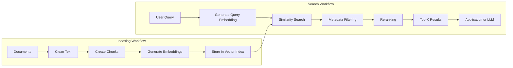
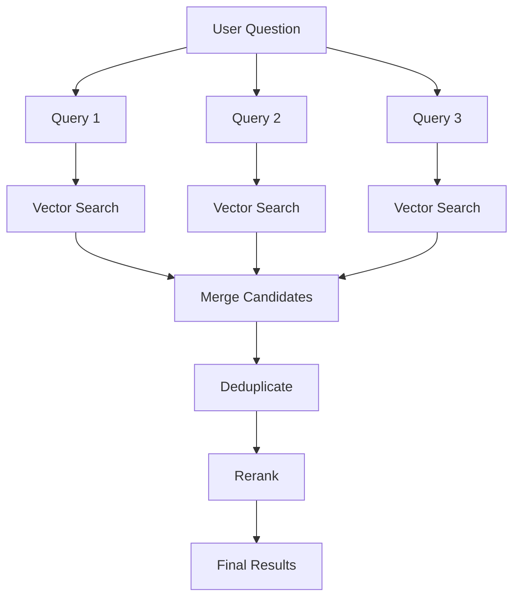
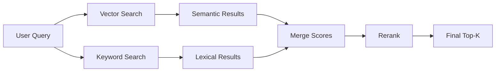
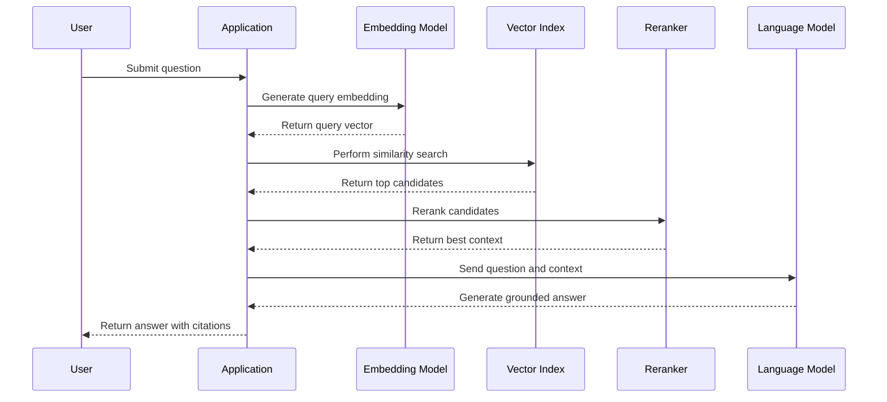
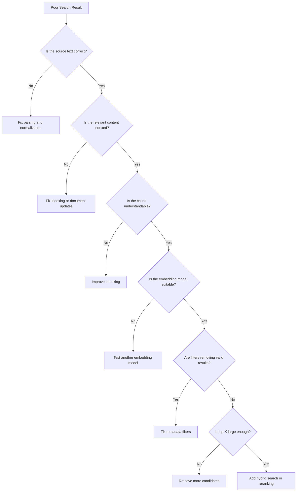

# 024 — Performing Similarity Search

| Attribute              | Details                                                  |
| ---------------------- | -------------------------------------------------------- |
| **Course**             | 03 — Knowledge Systems and RAG                           |
| **Module**             | Module 08 — Embeddings and Vector Databases              |
| **Content Group**      | Vector Search Workflow                                   |
| **Roadmap Source**     | Embeddings and Vector Databases / Vector Search Workflow |
| **Lesson Type**        | Embeddings and Vector Databases                          |
| **Lesson Order**       | 024                                                      |
| **Suggested Duration** | 24 minutes                                               |

---

## 1. Overview

**Similarity search** is the process of finding stored items whose embeddings are closest to a query embedding.

Unlike traditional keyword search, similarity search does not require the query and document to contain exactly the same words. Instead, it compares their positions in a vector space and retrieves items with similar meanings, topics, patterns, or visual characteristics.

For example, a user may search for:

```text
How can I recover access to my account?
```

A similarity search system may retrieve a document containing:

```text
Resetting a forgotten password
```

Although the two texts use different words, their meanings are closely related.

Similarity search is a core building block for:

* Semantic search
* Retrieval-Augmented Generation, or RAG
* Recommendation systems
* Duplicate detection
* Document classification
* Question-answering systems
* AI-agent memory
* Product discovery
* Image search
* Multimodal retrieval

---

## 2. Learning Objectives

By the end of this lesson, you should be able to:

* Explain similarity search in your own words.
* Describe where similarity search appears in an AI workflow.
* Convert a user query into an embedding.
* Compare vectors using cosine similarity, dot product, or Euclidean distance.
* Retrieve top-K results from a vector index.
* Apply metadata filters during search.
* Interpret similarity scores correctly.
* Identify low-quality and irrelevant results.
* Evaluate search quality using test queries and retrieval metrics.
* Integrate similarity search into a semantic search or RAG application.

---

## 3. What Is Similarity Search?

Similarity search finds items that are close to a query according to a similarity or distance function.

A typical workflow is:

```text
User query
    ↓
Generate query embedding
    ↓
Compare with stored embeddings
    ↓
Calculate similarity scores
    ↓
Sort candidates
    ↓
Return top-K results
```

For example:

```text
Query:
"How do I change my account password?"

Stored chunks:
A. "Password reset and account recovery instructions"
B. "Company vacation policy"
C. "Creating monthly financial reports"
```

The query embedding should be closer to chunk `A` than chunks `B` or `C`.

```text
Similarity scores:

A → 0.91
B → 0.24
C → 0.12
```

The system therefore returns chunk `A` first.

---

## 4. Position in the Vector Search Workflow

Similarity search belongs to the retrieval stage of a vector search system.



The indexing process usually happens before users search.

The query process happens whenever the application receives a search request.

---

## 5. Indexing Workflow vs. Search Workflow

### Indexing Workflow

The indexing workflow prepares searchable data.

```text
document
   ↓
chunk
   ↓
embedding
   ↓
metadata
   ↓
vector index
```

### Search Workflow

The search workflow retrieves relevant data.

```text
query
   ↓
query embedding
   ↓
vector comparison
   ↓
top-K candidates
   ↓
filter and rerank
   ↓
final results
```

The document embeddings and query embedding must normally be generated by the same embedding model.

```text
Documents → Embedding Model A
Queries   → Embedding Model A
```

Using unrelated embedding models may place documents and queries in incompatible vector spaces.

---

## 6. How Similarity Search Works

Assume the vector database contains the following embeddings:

```text
Document A → [0.12, 0.81, 0.31]
Document B → [0.91, 0.04, 0.15]
Document C → [0.18, 0.74, 0.40]
```

A user query is converted into:

```text
Query → [0.15, 0.79, 0.35]
```

The system compares the query vector with every candidate or uses a vector index to identify likely nearest neighbors.

Because the query vector is close to documents `A` and `C`, they should receive higher scores.

```text
Query
 ├── Document A: highly similar
 ├── Document C: highly similar
 └── Document B: weakly similar
```

The final result may be:

| Rank | Document   | Similarity Score |
| ---: | ---------- | ---------------: |
|    1 | Document A |             0.97 |
|    2 | Document C |             0.94 |
|    3 | Document B |             0.31 |

---

## 7. Similarity Metrics

A similarity metric determines how the system compares vectors.

The most common metrics are:

* Cosine similarity
* Dot product
* Euclidean distance

The correct metric should match the embedding model and vector database configuration.

---

## 8. Cosine Similarity

Cosine similarity measures the angle between two vectors.

[
\text{cosine similarity}(A,B)
=============================

\frac{A \cdot B}
{|A||B|}
]

A common interpretation is:

|         Score | General Interpretation |
| ------------: | ---------------------- |
|  Close to `1` | Strong similarity      |
|  Close to `0` | Weak relationship      |
| Close to `-1` | Opposite direction     |

For many text embedding models, semantically related texts receive higher cosine similarity scores.

Example:

```text
Text A: "How do I reset my password?"
Text B: "Instructions for recovering account access"
Text C: "How to prepare a pasta dish"
```

Possible scores:

```text
Similarity(A, B) = 0.88
Similarity(A, C) = 0.09
```

Cosine similarity focuses on vector direction rather than vector magnitude.

---

## 9. Dot Product

The dot product is calculated as:

[
A \cdot B
=========

\sum_{i=1}^{n} A_iB_i
]

Example:

```text
A = [1, 2, 3]
B = [2, 1, 2]
```

[
A \cdot B
=========

# (1 \times 2) + (2 \times 1) + (3 \times 2)

10
]

Dot product search can be efficient and works well when the embedding model is designed for it.

When vectors are normalized, dot product and cosine similarity may produce equivalent rankings.

---

## 10. Euclidean Distance

Euclidean distance measures the straight-line distance between two points.

[
d(A,B)
======

\sqrt{\sum_{i=1}^{n}(A_i-B_i)^2}
]

Unlike cosine similarity:

* A higher cosine score usually means greater similarity.
* A lower Euclidean distance means greater similarity.

Example:

```text
Distance(Query, Document A) = 0.12
Distance(Query, Document B) = 1.84
```

Document `A` is therefore more similar.

---

## 11. Similarity Score vs. Distance Score

Vector databases may return either similarity or distance values.

### Similarity Score

```text
Higher score = more similar
```

Example:

```text
0.92 → highly similar
0.73 → moderately similar
0.21 → weakly similar
```

### Distance Score

```text
Lower distance = more similar
```

Example:

```text
0.08 → highly similar
0.47 → moderately similar
1.91 → weakly similar
```

Always check the vector database documentation before interpreting scores.

Do not assume that every database uses the same range or direction.

---

## 12. Exact Similarity Search

Exact search compares the query vector with every stored vector.

```text
Query vector
    ↓
Compare with vector 1
Compare with vector 2
Compare with vector 3
...
Compare with vector N
    ↓
Sort all results
    ↓
Return top-K
```

Advantages:

* Returns the true nearest neighbors.
* Provides a reliable evaluation baseline.
* Requires little index tuning.
* Works well for small datasets.

Limitations:

* Search becomes slower as the dataset grows.
* Requires more computation per query.
* May not meet production latency requirements for millions of vectors.

The approximate time complexity is often described as:

[
O(N \times D)
]

Where:

* (N) is the number of stored vectors.
* (D) is the number of vector dimensions.

---

## 13. Approximate Nearest-Neighbor Search

Approximate nearest-neighbor search, or ANN, avoids comparing the query with every vector.

Instead, it searches the most promising regions of the vector space.

```text
Query vector
    ↓
Navigate index structure
    ↓
Inspect likely neighbors
    ↓
Return approximate top-K
```

Common ANN methods include:

* HNSW
* IVF
* Product Quantization
* Disk-based graph search

Advantages:

* Low query latency
* Scales to large datasets
* Suitable for production systems
* Can support millions or billions of vectors

Limitations:

* May miss some true nearest neighbors
* Requires index parameter tuning
* May consume more memory
* Index construction can take time

The main trade-off is:

```text
Search speed
     ↕
Retrieval recall
```

---

## 14. Top-K Retrieval

`top_k` specifies how many results should be returned.

Example:

```python
top_k = 5
```

The search engine returns the five nearest candidates.

```text
Query
  ↓
Vector search
  ↓
Result 1
Result 2
Result 3
Result 4
Result 5
```

### Small Top-K

Advantages:

* Lower latency
* Lower token usage
* Less irrelevant context

Risks:

* May miss useful evidence
* May not retrieve all required sections

### Large Top-K

Advantages:

* Higher chance of finding relevant information
* Better support for multi-part questions

Risks:

* More noise
* Higher reranking cost
* Higher LLM context usage
* Greater chance of contradictory chunks

A common production approach is:

```text
Retrieve top 20
      ↓
Rerank candidates
      ↓
Select best 5
      ↓
Send to the LLM
```

---

## 15. Performing a Basic Similarity Search

Conceptual Python example:

```python
query = "How can I reset a forgotten password?"

query_vector = embedding_model.embed_query(query)

results = vector_database.search(
    vector=query_vector,
    top_k=5,
)

for result in results:
    print("Score:", result.score)
    print("Text:", result.text)
    print("Source:", result.metadata["source"])
```

Example output:

```text
Score: 0.91
Text: Employees can reset a forgotten password from the security settings page.
Source: employee_handbook.pdf

Score: 0.82
Text: Account recovery requires access to the registered email address.
Source: account_security.md
```

---

## 16. Similarity Search with Chroma-Style APIs

A simplified example:

```python
results = collection.query(
    query_texts=[
        "How do I recover my account?"
    ],
    n_results=5,
    where={
        "language": "en"
    },
)
```

The result may contain:

```python
{
    "documents": [
        [
            "Password recovery instructions...",
            "Resetting account credentials..."
        ]
    ],
    "metadatas": [
        [
            {
                "source": "security-guide.md",
                "section": "Password Recovery"
            },
            {
                "source": "user-manual.pdf",
                "page": 14
            }
        ]
    ],
    "distances": [
        [0.11, 0.18]
    ]
}
```

In this example, lower distances indicate closer matches.

---

## 17. Similarity Search with Qdrant-Style APIs

Conceptual example:

```python
query_vector = embedding_model.embed_query(
    "How should security incidents be reported?"
)

results = qdrant_client.search(
    collection_name="company_knowledge",
    query_vector=query_vector,
    limit=5,
    query_filter={
        "must": [
            {
                "key": "department",
                "match": {
                    "value": "security"
                }
            }
        ]
    },
)
```

Each result may contain:

```json
{
  "id": "security-guide-incident-02",
  "score": 0.93,
  "payload": {
    "text": "Security incidents must be reported to the response team...",
    "source": "security-guide.pdf",
    "page": 27
  }
}
```

---

## 18. Similarity Search with FAISS-Style APIs

Conceptual example:

```python
import numpy as np

query_vector = embedding_model.embed_query(
    "How do I reset my password?"
)

query_array = np.array(
    [query_vector],
    dtype="float32",
)

distances, indices = index.search(
    query_array,
    k=5,
)

for distance, index_position in zip(
    distances[0],
    indices[0],
):
    document = documents[index_position]

    print(distance)
    print(document["text"])
    print(document["metadata"])
```

FAISS primarily manages vector search. Applications commonly maintain a separate mapping from vector positions to documents and metadata.

---

## 19. Metadata Filtering

Similarity alone may not be sufficient.

A result can be semantically relevant but invalid because it belongs to:

* The wrong user
* The wrong language
* An old document version
* A restricted department
* A different product
* An expired policy
* A private workspace

Example:

```python
results = vector_database.search(
    vector=query_vector,
    top_k=10,
    filters={
        "language": "en",
        "document_status": "active",
        "access_level": "public",
    },
)
```

A strong search workflow combines:

```text
Vector similarity
        +
Metadata filtering
        +
Authorization checks
        =
Valid retrieval results
```

Metadata filtering is not merely an optimization. It can be a security requirement.

---

## 20. Pre-Filtering vs. Post-Filtering

### Pre-Filtering

The filter is applied before or during vector search.

```text
Select allowed documents
        ↓
Run similarity search
        ↓
Return top-K
```

Advantages:

* Prevents unauthorized candidates from entering retrieval.
* Often produces a valid top-K set.
* Can reduce the search space.

### Post-Filtering

The system performs similarity search first and removes invalid results afterward.

```text
Retrieve top-K
        ↓
Remove invalid results
        ↓
Return remaining items
```

Risk:

If most top results are removed, the final result set may contain too few items.

Example:

```text
Retrieve top 5
Remove 4 restricted results
Return only 1 result
```

When possible, security-sensitive filters should be applied before or during search.

---

## 21. Score Thresholds

A vector database usually returns the nearest results even when none are truly relevant.

For example:

```text
Query:
"What is the policy for working on Mars?"

Knowledge base:
Contains no information about Mars.
```

The vector database may still return:

```text
Rank 1: Remote work policy
Rank 2: International travel policy
Rank 3: Office location guide
```

To avoid treating weak matches as valid evidence, use a relevance threshold.

```python
minimum_score = 0.72

filtered_results = [
    result
    for result in results
    if result.score >= minimum_score
]
```

Possible response:

```text
No sufficiently relevant information was found in the indexed documents.
```

Thresholds must be calibrated using real evaluation data. A score of `0.75` may be strong for one model and weak for another.

---

## 22. Query Normalization

Before creating an embedding, the application may normalize the query.

Possible steps include:

* Removing unnecessary whitespace
* Normalizing Unicode
* Detecting language
* Correcting obvious spelling errors
* Expanding abbreviations
* Extracting metadata filters
* Removing irrelevant interface text

Example:

```text
Original query:
"pls tell me how 2 reset pwd"

Normalized query:
"How can I reset my password?"
```

Query normalization can improve retrieval, but it should preserve the user's original meaning.

---

## 23. Query Rewriting

A language model or rule-based component may rewrite the query into a form better suited for retrieval.

Example:

```text
User query:
"It stopped working after the update."

Rewritten search query:
"Application failure after installing the latest software update"
```

Query rewriting is useful when:

* The user uses pronouns without context.
* The query is conversational.
* The user provides a long description.
* The query contains multiple questions.
* Domain terminology is missing.
* The query must be translated.

However, query rewriting can introduce incorrect assumptions. The original query should be retained for debugging and evaluation.

---

## 24. Multi-Query Retrieval

One user question can be converted into several search queries.

Example:

```text
Original question:
"How does the system store documents and find relevant sections?"
```

Generated queries:

```text
1. How are document embeddings stored?
2. How does vector similarity search retrieve chunks?
3. How are relevant document sections ranked?
```

The results can then be merged and deduplicated.



Multi-query retrieval can improve recall but increases embedding and search costs.

---

## 25. Hybrid Search

Vector search is strong at semantic matching, while keyword search is strong at exact matching.

Keyword search is especially useful for:

* Error codes
* Product identifiers
* Names
* Acronyms
* Version numbers
* Exact technical terms
* Quoted phrases

Example query:

```text
AUTH-4017 after token refresh
```

Vector search may retrieve authentication-related documents.

Keyword search may directly match `AUTH-4017`.

Hybrid search combines both result sets.



A simplified combined score may be:

[
\text{final score}
==================

\alpha \times \text{vector score}
+
(1-\alpha) \times \text{keyword score}
]

Where (\alpha) controls the importance of semantic similarity.

---

## 26. Reranking Results

The first-stage vector search is designed for speed. It may retrieve related but imperfect candidates.

A reranker evaluates the query and each candidate more carefully.

```text
Query
  ↓
Vector search: top 20
  ↓
Reranker
  ↓
Best 5 results
```

A reranker may consider:

* Exact query-document relevance
* Whether the chunk answers the question
* Keyword overlap
* Document freshness
* Source quality
* User permissions
* Result diversity

Example:

| Result                     | Vector Rank | Reranked Position |
| -------------------------- | ----------: | ----------------: |
| General password policy    |           1 |                 4 |
| Exact password reset steps |           3 |                 1 |
| Account security overview  |           2 |                 3 |
| Reset link troubleshooting |           5 |                 2 |

Reranking can improve precision, but it adds latency and computational cost.

---

## 27. Result Deduplication

Overlapping chunks may produce repeated results.

Example:

```text
Rank 1: Password reset instructions, chunk 4
Rank 2: Password reset instructions, chunk 5
Rank 3: Password reset instructions, chunk 6
```

Possible solutions include:

* Grouping results by document
* Limiting results per source
* Removing chunks with high textual overlap
* Using Maximal Marginal Relevance
* Merging neighboring chunks
* Deduplicating by content hash

A result set should provide useful coverage, not repeated copies of the same paragraph.

---

## 28. Maximal Marginal Relevance

Maximal Marginal Relevance, or MMR, balances relevance and diversity.

The objective is to select chunks that are:

* Relevant to the query
* Different from results already selected

Conceptually:

[
\text{MMR}
==========

## \lambda \times \text{query relevance}

(1-\lambda) \times \text{result similarity}
]

A high (\lambda) favors relevance.

A lower (\lambda) favors diversity.

Example:

```text
Without MMR:
1. Password reset step 1
2. Password reset step 1 repeated
3. Password reset step 1 paraphrased

With MMR:
1. Password reset steps
2. Email verification requirements
3. Troubleshooting expired reset links
```

---

## 29. Similarity Search in RAG

In a RAG system, similarity search retrieves evidence for the language model.



The quality of the final answer depends heavily on retrieval quality.

```text
Good generation + poor retrieval
              =
Confident but unsupported answer
```

Therefore, retrieval and generation should be evaluated separately.

---

## 30. Example RAG Search Function

```python
def retrieve_context(
    query: str,
    top_k: int = 5,
) -> list[dict]:
    query_vector = embedding_model.embed_query(query)

    candidates = vector_database.search(
        vector=query_vector,
        top_k=20,
        filters={
            "status": "active",
            "language": "en",
        },
    )

    relevant_candidates = [
        result
        for result in candidates
        if result.score >= 0.70
    ]

    reranked_results = reranker.rank(
        query=query,
        documents=[
            result.text
            for result in relevant_candidates
        ],
    )

    return reranked_results[:top_k]
```

The returned context should retain citation metadata.

```json
{
  "text": "Employees can reset their password...",
  "score": 0.91,
  "source": "employee-handbook.pdf",
  "page": 18,
  "section": "Password Reset"
}
```

---

## 31. Similarity Search as an Agent Tool

An AI agent can use similarity search when it needs external knowledge.

Example tool schema:

```json
{
  "name": "search_knowledge_base",
  "description": "Search indexed documents for information relevant to a question.",
  "parameters": {
    "type": "object",
    "properties": {
      "query": {
        "type": "string",
        "description": "The semantic search query."
      },
      "top_k": {
        "type": "integer",
        "description": "The maximum number of results."
      },
      "document_type": {
        "type": "string",
        "description": "An optional document category filter."
      }
    },
    "required": ["query"]
  }
}
```

Agent workflow:

```text
User request
    ↓
Agent identifies missing information
    ↓
Agent calls similarity search tool
    ↓
Tool returns relevant chunks
    ↓
Agent checks evidence
    ↓
Agent produces a grounded response
```

The agent should not treat every retrieved result as correct. It must inspect relevance, permissions, and citations.

---

## 32. Similarity Search for Recommendations

Similarity search can retrieve items similar to a selected item or user profile.

Example:

```text
Selected product
      ↓
Product embedding
      ↓
Similarity search
      ↓
Related products
```

Applications include:

* Similar articles
* Related products
* Recommended courses
* Similar support tickets
* Matching job descriptions
* Related source-code examples
* Similar images

Example:

```python
related_products = product_index.search(
    vector=current_product.embedding,
    top_k=10,
    filters={
        "in_stock": True,
        "category": current_product.category,
    },
)
```

Recommendation systems often combine vector similarity with business rules, popularity, freshness, and user preferences.

---

## 33. Multimodal Similarity Search

Embeddings can represent more than text.

Possible searchable objects include:

* Images
* Audio
* Video frames
* Screenshots
* Product photos
* Diagrams
* Source code

Example:

```text
Text query:
"blue running shoes with white soles"
             ↓
Text embedding
             ↓
Multimodal vector index
             ↓
Matching product images
```

Another example:

```text
Uploaded image
      ↓
Image embedding
      ↓
Similarity search
      ↓
Visually similar images
```

Multimodal systems require embedding models that place different media types in compatible vector spaces.

---

## 34. Evaluating Similarity Search

A search system should be evaluated using a labeled test dataset.

Example:

```json
[
  {
    "query": "How do employees reset a password?",
    "relevant_chunks": [
      "employee-handbook-password-01"
    ]
  },
  {
    "query": "Where should a security incident be reported?",
    "relevant_chunks": [
      "security-policy-incident-02"
    ]
  }
]
```

The test set should include:

* Direct questions
* Paraphrased questions
* Short keyword queries
* Long conversational queries
* Misspellings
* Exact identifiers
* Ambiguous questions
* Questions with no answer
* Queries requiring metadata filters
* Multi-part questions

---

## 35. Precision@K

Precision@K measures the proportion of retrieved results that are relevant.

[
\text{Precision@K}
==================

\frac{\text{number of relevant results in top K}}
{K}
]

Example:

```text
Top 5 results:
Relevant
Relevant
Not relevant
Not relevant
Relevant
```

[
\text{Precision@5}
==================

# \frac{3}{5}

0.60
]

High precision means the returned results contain little irrelevant information.

---

## 36. Recall@K

Recall@K measures whether relevant results were successfully retrieved.

[
\text{Recall@K}
===============

\frac{\text{relevant results found in top K}}
{\text{total relevant results}}
]

Suppose a query has four relevant chunks and the system retrieves three of them in the top five.

[
\text{Recall@5}
===============

# \frac{3}{4}

0.75
]

High recall means the system rarely misses useful information.

---

## 37. Hit Rate@K

Hit Rate@K checks whether at least one relevant result appears in the first `K` positions.

[
\text{Hit Rate@K}
=================

\frac{\text{queries with at least one relevant result in top K}}
{\text{total queries}}
]

Example:

```text
8 out of 10 queries contain a relevant result in the top 3.
```

[
\text{Hit Rate@3}
=================

0.80
]

This metric is useful when the application only needs one strong supporting result.

---

## 38. Mean Reciprocal Rank

Mean Reciprocal Rank, or MRR, rewards systems that place the first relevant result near the top.

For one query:

[
\text{Reciprocal Rank}
======================

\frac{1}{\text{rank of first relevant result}}
]

Examples:

| First Relevant Rank | Reciprocal Rank |
| ------------------: | --------------: |
|                   1 |            1.00 |
|                   2 |            0.50 |
|                   3 |            0.33 |
|                   5 |            0.20 |

MRR is the average reciprocal rank across all test queries.

---

## 39. Search Latency

Retrieval quality must be balanced with speed.

Total retrieval latency may include:

```text
Query preprocessing
        +
Embedding generation
        +
Vector search
        +
Metadata filtering
        +
Reranking
        =
Total search latency
```

Useful latency measurements include:

* Average latency
* P50 latency
* P95 latency
* P99 latency

For example:

```text
Average latency: 74 ms
P50 latency: 61 ms
P95 latency: 142 ms
P99 latency: 221 ms
```

Average latency alone may hide slow requests, so percentile measurements are important.

---

## 40. Common Failure Cases

### 40.1 The Query Uses Different Terminology

Query:

```text
How can I regain access to my profile?
```

Document:

```text
Password reset instructions
```

A weak embedding model may fail to connect the concepts.

**Possible improvements:**

* Use a stronger embedding model.
* Rewrite the query.
* Add hybrid search.
* Expand domain-specific synonyms.

---

### 40.2 Chunks Are Too Large

A large chunk may discuss several unrelated topics.

```text
Chunk:
- Password reset
- Vacation requests
- Security reporting
- Payroll dates
```

The embedding may not clearly represent any individual topic.

**Possible improvement:** use smaller, topic-focused chunks.

---

### 40.3 Chunks Are Too Small

A chunk may lose essential context.

```text
This must be completed within 24 hours.
```

The system does not know what must be completed.

**Possible improvement:** include the heading or surrounding paragraph.

---

### 40.4 Top-K Is Too Small

The correct result may appear at rank 6 while the system only retrieves five results.

**Possible improvement:** retrieve more candidates before reranking.

---

### 40.5 Top-K Is Too Large

Large result sets may contain irrelevant or contradictory chunks.

**Possible improvement:** use reranking, thresholds, and result diversity.

---

### 40.6 Missing Metadata Filters

A search may return:

* Outdated policies
* Documents in the wrong language
* Another user's private data
* Content from an unrelated department

**Possible improvement:** define and enforce a metadata schema.

---

### 40.7 Repeated Results

Overlapping chunks may fill the top results with nearly identical content.

**Possible improvement:** deduplicate or apply diversity-based retrieval.

---

### 40.8 Incorrect Score Interpretation

A system may incorrectly assume that higher distance means better similarity.

**Possible improvement:** verify whether the database returns similarity or distance.

---

### 40.9 No-Answer Queries Still Return Results

A vector database always tries to find the nearest vectors.

**Possible improvement:** use calibrated thresholds and a no-answer policy.

---

### 40.10 Model Mismatch

Documents may be embedded using one model while queries use another.

**Possible improvement:** track model and index versions explicitly.

---

### 40.11 Search Is Evaluated Only by Intuition

A few successful demo queries do not prove that the system works reliably.

**Possible improvement:** maintain a labeled evaluation dataset.

---

## 41. Debugging Poor Search Results

Use the following diagnostic workflow:



Record each failure case rather than changing several components at once.

---

## 42. Search Logging

Production systems should log retrieval behavior.

Example log:

```json
{
  "request_id": "req-84012",
  "query": "How do I reset my password?",
  "normalized_query": "Password reset instructions",
  "embedding_model": "embedding-model-v2",
  "index_version": "company-knowledge-v5",
  "top_k": 10,
  "filters": {
    "language": "en",
    "access_level": "internal"
  },
  "result_ids": [
    "handbook-password-01",
    "security-account-04"
  ],
  "scores": [
    0.92,
    0.85
  ],
  "search_latency_ms": 43
}
```

Logs help identify:

* Slow queries
* Low-scoring queries
* Frequently missing answers
* Weak chunks
* Incorrect filters
* Index version problems
* Search patterns worth adding to evaluation data

Sensitive queries and private document content must be handled carefully in logs.

---

## 43. Production Checklist

### Query Processing

* [ ] The query is normalized without changing its meaning.
* [ ] The correct embedding model is used.
* [ ] The query language is detected when necessary.
* [ ] Long or multi-part queries are handled appropriately.
* [ ] The original query is retained for debugging.

### Vector Search

* [ ] The similarity metric matches the embedding model.
* [ ] Top-K is tested using real queries.
* [ ] Search parameters are documented.
* [ ] Exact search is available as an evaluation baseline.
* [ ] ANN recall is measured.

### Metadata and Security

* [ ] User permissions are applied during search.
* [ ] Document status and version filters are enforced.
* [ ] Language filters are supported.
* [ ] Private content cannot leak through retrieval.
* [ ] Source metadata is returned with every result.

### Result Processing

* [ ] Low-quality matches are rejected.
* [ ] Duplicate chunks are removed.
* [ ] Results can be reranked.
* [ ] Result diversity is considered.
* [ ] Neighboring chunks can be merged when needed.

### Evaluation

* [ ] A labeled query set exists.
* [ ] Precision@K is measured.
* [ ] Recall@K is measured.
* [ ] MRR or Hit Rate is measured.
* [ ] No-answer queries are included.
* [ ] Search latency is monitored.
* [ ] Failure cases are documented.

### RAG Integration

* [ ] Retrieved context contains citations.
* [ ] The LLM receives only relevant evidence.
* [ ] Unsupported answers are rejected.
* [ ] Retrieval and generation are evaluated separately.
* [ ] Users can inspect the original source.

---

## 44. Practical Exercise

### Objective

Build and evaluate a similarity search system for Markdown or PDF files.

### Dataset

Choose between 5 and 10 small documents.

Possible document types:

* Course notes
* Technical documentation
* Product manuals
* Research summaries
* Company policies
* Personal project documentation

---

### Step 1: Prepare Documents

Store metadata for every document.

```json
{
  "document_id": "doc-001",
  "title": "Introduction to Embeddings",
  "source": "embeddings-introduction.md",
  "language": "en",
  "version": "1.0"
}
```

---

### Step 2: Create Chunks

Start with:

```text
Chunk size: 500 tokens
Chunk overlap: 75 tokens
```

Each chunk should contain:

* Chunk ID
* Document ID
* Text
* Section heading
* Source filename
* Page number when available

---

### Step 3: Generate Embeddings

Use the same embedding model for documents and queries.

Record:

```json
{
  "embedding_model": "selected-model",
  "vector_dimension": 1536,
  "similarity_metric": "cosine",
  "index_version": "search-demo-v1"
}
```

---

### Step 4: Create a Vector Index

Use one of the following:

* Chroma
* Qdrant
* FAISS
* pgvector
* Weaviate
* Another vector database

Insert:

```text
chunk text
+
embedding
+
metadata
```

---

### Step 5: Create Test Queries

Write at least 10 queries.

Include:

* Three direct questions
* Two paraphrased questions
* One short keyword query
* One exact identifier query
* One ambiguous query
* One multi-part query
* One query with no answer

Example:

```json
[
  {
    "query": "What is cosine similarity?",
    "expected_source": "similarity-metrics.md"
  },
  {
    "query": "How are semantically close texts identified?",
    "expected_source": "vector-search.md"
  },
  {
    "query": "ERROR-VDB-204",
    "expected_source": "troubleshooting.md"
  }
]
```

---

### Step 6: Perform Top-K Search

Run each query with:

```text
top_k = 5
```

Record the results:

| Query                      | Rank | Source                | Score | Relevant? |
| -------------------------- | ---: | --------------------- | ----: | --------- |
| What is cosine similarity? |    1 | similarity-metrics.md |  0.92 | Yes       |
| What is cosine similarity? |    2 | vector-search.md      |  0.79 | Partially |
| What is cosine similarity? |    3 | database-indexes.md   |  0.48 | No        |

---

### Step 7: Test Different Top-K Values

Compare:

```text
top_k = 1
top_k = 3
top_k = 5
top_k = 10
```

Record how top-K affects:

* Recall
* Precision
* Latency
* Duplicate results
* Context size

---

### Step 8: Add Metadata Filtering

Example filters:

```python
filters = {
    "language": "en",
    "document_status": "active",
}
```

Create at least one test where a relevant-looking result must be rejected because its metadata is invalid.

---

### Step 9: Add a Relevance Threshold

Test several thresholds:

```text
0.60
0.70
0.80
```

Observe:

* How many relevant results are removed
* How many irrelevant results remain
* Whether no-answer queries are handled correctly

---

### Step 10: Evaluate Search Quality

Calculate:

* Precision@3
* Recall@3
* Recall@5
* Hit Rate@5
* Mean Reciprocal Rank
* Average search latency

Example report:

```text
Precision@3: 0.73
Recall@3: 0.76
Recall@5: 0.91
Hit Rate@5: 0.90
MRR: 0.81
Average latency: 48 ms
```

---

### Step 11: Analyze Failure Cases

For each failed query, record:

```text
Query:
"How can the system reject unrelated context?"

Expected:
A section explaining relevance thresholds.

Observed:
A general vector database overview appeared at rank 1.

Possible causes:
- The expected chunk was too small.
- The section heading was not included.
- The query used different terminology.
- Top-K was too small.
- No reranker was used.

Next experiment:
Add the section heading to the chunk and compare top_k=10 with reranking.
```

---

## 45. Portfolio Project

### Project 7 — Semantic Search Engine for Markdown and PDF Files

Build an application that allows users to upload and semantically search documents.

### Core Features

* Upload Markdown and PDF files
* Extract and normalize text
* Split documents into chunks
* Generate embeddings
* Store embeddings in Chroma, Qdrant, or FAISS
* Perform similarity search
* Support top-K configuration
* Apply metadata filters
* Display similarity scores
* Show source citations
* Handle no-answer queries
* Record retrieval latency
* Evaluate search using a test dataset

### Suggested API Routes

```http
POST /documents
POST /indexes/build
POST /search
POST /search/evaluate
DELETE /documents/{document_id}
GET /evaluation/results
```

Example search request:

```json
{
  "query": "How does approximate nearest-neighbor search work?",
  "top_k": 5,
  "minimum_score": 0.70,
  "filters": {
    "language": "en"
  }
}
```

Example response:

```json
{
  "query": "How does approximate nearest-neighbor search work?",
  "results": [
    {
      "rank": 1,
      "chunk_id": "ann-search-03",
      "score": 0.94,
      "text": "Approximate nearest-neighbor search examines likely regions...",
      "citation": {
        "source": "vector-indexes.md",
        "section": "Approximate Search",
        "page": 6
      }
    }
  ],
  "search_latency_ms": 41
}
```

### Optional Advanced Features

* Hybrid vector and keyword search
* Cross-encoder reranking
* Query rewriting
* Multi-query retrieval
* Maximal Marginal Relevance
* Multilingual search
* Parent-child retrieval
* Search analytics dashboard
* Embedding-model comparison
* Index-version comparison
* Per-user access control
* Retrieval-quality regression tests

---

## 46. Completion Checklist

* [ ] I can explain similarity search in one or two minutes.
* [ ] I understand how a query becomes an embedding.
* [ ] I can distinguish similarity from distance.
* [ ] I understand cosine similarity, dot product, and Euclidean distance.
* [ ] I can perform a top-K search.
* [ ] I can apply metadata filters.
* [ ] I understand exact and approximate nearest-neighbor search.
* [ ] I know why score thresholds are necessary.
* [ ] I can identify duplicate or irrelevant results.
* [ ] I can explain hybrid search and reranking.
* [ ] I have created a small similarity search demo.
* [ ] I have tested the demo with real queries.
* [ ] I have measured at least one retrieval metric.
* [ ] I have documented at least one failure case.
* [ ] I understand how similarity search supports RAG, agents, recommendations, or multimodal applications.

---

## 47. Key Takeaways

1. Similarity search retrieves items whose embeddings are close to a query embedding.
2. Semantic similarity does not require exact keyword overlap.
3. The similarity metric must match the embedding model and index configuration.
4. Exact search provides accurate results but may become slow at scale.
5. Approximate nearest-neighbor search improves speed while accepting a possible loss in recall.
6. Top-K must be tuned using real evaluation queries.
7. Metadata filtering is essential for relevance, versioning, language selection, and access control.
8. A nearest result is not automatically a relevant result.
9. Score thresholds and no-answer policies prevent weak matches from becoming evidence.
10. Hybrid search improves queries containing exact identifiers or rare terms.
11. Reranking improves precision after fast first-stage retrieval.
12. Retrieval quality should be measured using Precision@K, Recall@K, Hit Rate, MRR, and latency.
13. Failure cases should become part of a permanent regression test set.
14. In RAG systems, weak retrieval can produce confident but unsupported answers.

---

## 48. Final Summary

**Performing similarity search** is the stage where a query embedding is compared with indexed vectors to retrieve semantically related information.

The complete workflow is:

```text
User query
    ↓
Normalize or rewrite query
    ↓
Generate query embedding
    ↓
Apply metadata and authorization filters
    ↓
Perform vector similarity search
    ↓
Retrieve top-K candidates
    ↓
Remove weak or duplicate results
    ↓
Rerank candidates
    ↓
Return relevant chunks with citations
    ↓
Use results in search, RAG, recommendations, or agent tools
```

A strong similarity search system is not defined only by whether it returns results. It must return the correct results, reject weak matches, enforce permissions, provide citations, meet latency requirements, and perform consistently across a realistic evaluation dataset.

The most valuable outcome of this lesson is a working semantic search demo that records query embeddings, top-K results, similarity scores, citations, latency, and retrieval failure cases.

---

# Bài luyện tập

## Mục tiêu


## Đề bài


## Yêu cầu hoàn thành

- [ ] 
- [ ] 
- [ ] 

## Kết quả / lời giải


## Ghi chú
