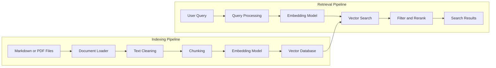
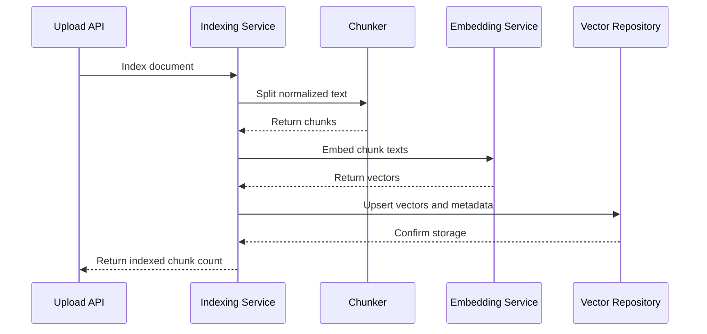
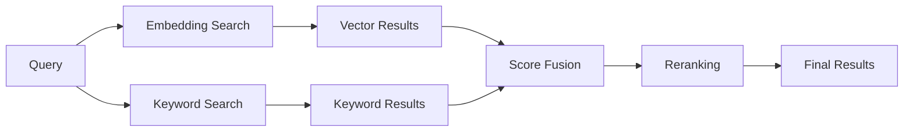
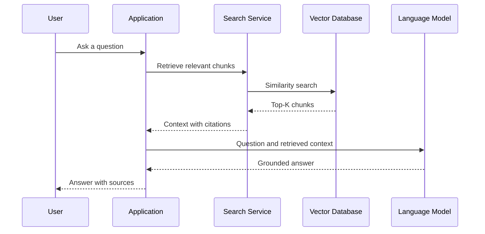
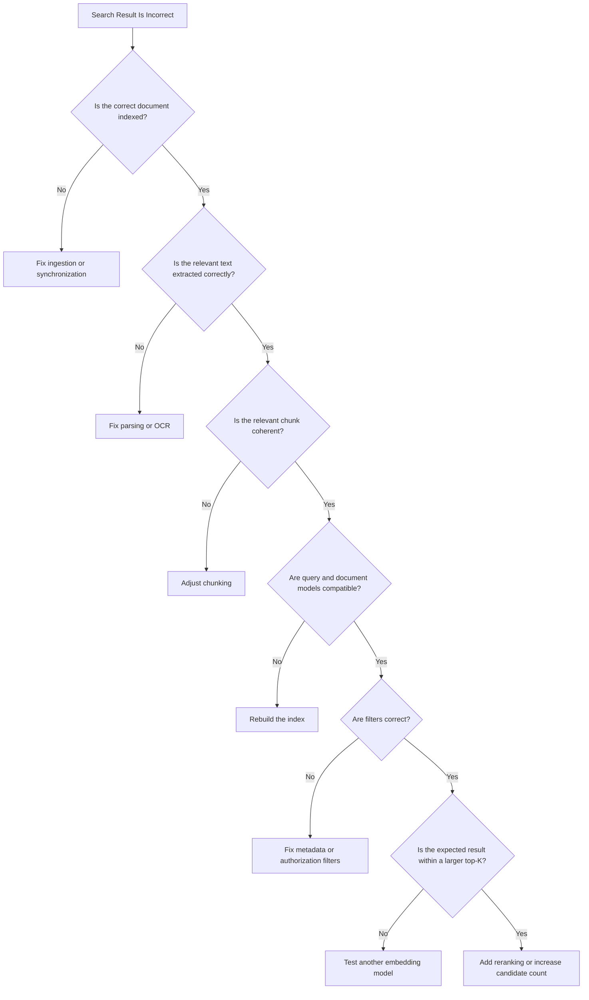

# 025 — Implementing Vector Search

| Attribute              | Details                                                  |
| ---------------------- | -------------------------------------------------------- |
| **Course**             | 03 — Knowledge Systems and RAG                           |
| **Module**             | Module 08 — Embeddings and Vector Databases              |
| **Content Group**      | Vector Search Workflow                                   |
| **Roadmap Source**     | Embeddings and Vector Databases / Vector Search Workflow |
| **Lesson Type**        | Embeddings and Vector Databases                          |
| **Lesson Order**       | 025                                                      |
| **Suggested Duration** | 24 minutes                                               |

---

## 1. Overview

**Implementing vector search** means building the complete pipeline that converts source documents into searchable vectors and retrieves relevant content from natural-language queries.

The implementation connects several components:

```text
Documents
   ↓
Text extraction
   ↓
Chunking
   ↓
Embedding generation
   ↓
Vector storage
   ↓
Query embedding
   ↓
Similarity search
   ↓
Top-K results
```

A production-ready vector search system must do more than call an embedding model and return the nearest vectors. It should also support:

* Stable document and chunk identifiers
* Metadata and citations
* Batch indexing
* Updates and deletions
* Metadata filtering
* Retrieval thresholds
* Error handling
* Evaluation datasets
* Latency monitoring
* Access control
* Index and embedding-model versioning

Vector search is commonly implemented for:

* Semantic document search
* Retrieval-Augmented Generation, or RAG
* AI-agent knowledge tools
* Product recommendations
* Duplicate-content detection
* Support-ticket matching
* Source-code search
* Multimodal retrieval
* Long-term AI memory

---

## 2. Learning Objectives

By the end of this lesson, you should be able to:

* Explain the components of a vector search implementation.
* Design an indexing and retrieval workflow.
* Extract and chunk document content.
* Generate embeddings in batches.
* Store vectors, documents, and metadata.
* Perform top-K similarity search.
* Apply metadata filters and relevance thresholds.
* Build a simple vector search API.
* Handle document updates and deletions.
* Test retrieval quality using expected results.
* Identify production concerns such as security, cost, and latency.

---

## 3. Vector Search Architecture

A vector search application normally contains two main pipelines:

1. An **indexing pipeline**
2. A **retrieval pipeline**



The indexing pipeline often runs:

* When a document is uploaded
* When an administrator rebuilds an index
* When source content changes
* On a scheduled synchronization job

The retrieval pipeline runs whenever a user submits a search query.

---

## 4. Core Components

A basic implementation contains the following components.

| Component          | Responsibility                                         |
| ------------------ | ------------------------------------------------------ |
| Document loader    | Reads Markdown, PDF, HTML, text, or database records   |
| Text cleaner       | Removes noise and normalizes source text               |
| Chunker            | Splits documents into searchable units                 |
| Embedding service  | Converts chunks and queries into vectors               |
| Vector database    | Stores and searches vectors                            |
| Metadata store     | Stores source, page, section, version, and permissions |
| Search service     | Executes similarity search and filtering               |
| Reranker           | Improves the ordering of retrieved candidates          |
| API layer          | Exposes indexing and search operations                 |
| Evaluation service | Measures retrieval quality and regressions             |

A clean architecture separates these responsibilities instead of placing the entire workflow inside one function.

---

## 5. Recommended Project Structure

A small Python application may use the following structure:

```text
vector-search-project/
├── app/
│   ├── api/
│   │   ├── documents.py
│   │   └── search.py
│   ├── loaders/
│   │   ├── markdown_loader.py
│   │   └── pdf_loader.py
│   ├── services/
│   │   ├── chunking_service.py
│   │   ├── embedding_service.py
│   │   ├── indexing_service.py
│   │   └── search_service.py
│   ├── repositories/
│   │   └── vector_repository.py
│   ├── schemas/
│   │   ├── document.py
│   │   └── search.py
│   └── config.py
├── data/
├── evaluation/
│   ├── queries.json
│   └── evaluate.py
├── tests/
├── requirements.txt
└── README.md
```

The exact structure may vary, but the implementation should keep:

```text
API logic
≠
Embedding logic
≠
Database logic
≠
Evaluation logic
```

---

## 6. Designing the Data Model

Each indexed chunk should have a stable schema.

```json
{
  "chunk_id": "employee-handbook-password-reset-0001",
  "document_id": "employee-handbook-2026",
  "text": "Employees can reset their passwords from the account security page.",
  "metadata": {
    "title": "Employee Handbook",
    "section": "Password Reset",
    "source": "employee-handbook.pdf",
    "page": 18,
    "language": "en",
    "version": "2026.1",
    "access_level": "internal"
  }
}
```

Recommended fields include:

| Field             | Purpose                              |
| ----------------- | ------------------------------------ |
| `chunk_id`        | Identifies one indexed chunk         |
| `document_id`     | Groups chunks from the same document |
| `text`            | Original searchable content          |
| `embedding`       | Vector representation                |
| `source`          | Original filename or location        |
| `page`            | Supports citations                   |
| `section`         | Preserves document structure         |
| `language`        | Supports language filtering          |
| `version`         | Prevents outdated retrieval          |
| `content_hash`    | Detects changed content              |
| `access_level`    | Supports authorization               |
| `embedding_model` | Tracks vector compatibility          |
| `index_version`   | Supports migrations                  |

Stable identifiers are necessary for updates, deletion, debugging, and citation generation.

---

## 7. Step 1 — Load Documents

The first implementation step is reading source files.

Example document class:

```python
from dataclasses import dataclass
from typing import Any


@dataclass
class Document:
    document_id: str
    text: str
    metadata: dict[str, Any]
```

A basic Markdown loader:

```python
from pathlib import Path


def load_markdown(path: Path) -> Document:
    if not path.exists():
        raise FileNotFoundError(f"Document not found: {path}")

    text = path.read_text(encoding="utf-8")

    return Document(
        document_id=path.stem,
        text=text,
        metadata={
            "source": path.name,
            "file_type": "markdown",
        },
    )
```

A real application should also handle:

* Invalid encoding
* Empty files
* Duplicate uploads
* Unsupported formats
* Corrupted PDFs
* Maximum file size
* Password-protected files

---

## 8. Step 2 — Clean and Normalize Text

Raw files may contain content that harms retrieval quality.

Typical problems include:

* Repeated page headers
* Repeated footers
* Page numbers inside sentences
* Broken line endings
* HTML navigation
* Invisible Unicode characters
* Duplicate paragraphs
* OCR mistakes

A simple normalizer:

```python
import re


def normalize_text(text: str) -> str:
    text = text.replace("\u00a0", " ")
    text = text.replace("\r\n", "\n")
    text = text.replace("\r", "\n")

    text = re.sub(r"[ \t]+", " ", text)
    text = re.sub(r"\n{3,}", "\n\n", text)

    return text.strip()
```

Text cleaning should preserve useful structure such as:

* Headings
* Paragraphs
* Lists
* Code blocks
* Table labels
* Section boundaries

Do not remove structure merely to produce visually clean plain text.

---

## 9. Step 3 — Split Documents into Chunks

A chunk should represent one coherent retrieval unit.

Example chunk model:

```python
from dataclasses import dataclass
from typing import Any


@dataclass
class Chunk:
    chunk_id: str
    document_id: str
    text: str
    metadata: dict[str, Any]
```

A simplified word-based chunker:

```python
def split_text(
    text: str,
    chunk_size: int = 300,
    overlap: int = 50,
) -> list[str]:
    if chunk_size <= 0:
        raise ValueError("chunk_size must be greater than zero")

    if overlap < 0 or overlap >= chunk_size:
        raise ValueError(
            "overlap must be non-negative and smaller than chunk_size"
        )

    words = text.split()
    chunks: list[str] = []

    step = chunk_size - overlap

    for start in range(0, len(words), step):
        chunk_words = words[start:start + chunk_size]

        if not chunk_words:
            break

        chunks.append(" ".join(chunk_words))

    return chunks
```

Creating chunk records:

```python
def create_chunks(
    document: Document,
    chunk_size: int = 300,
    overlap: int = 50,
) -> list[Chunk]:
    texts = split_text(
        document.text,
        chunk_size=chunk_size,
        overlap=overlap,
    )

    chunks: list[Chunk] = []

    for index, text in enumerate(texts):
        chunk_id = f"{document.document_id}-{index:04d}"

        chunks.append(
            Chunk(
                chunk_id=chunk_id,
                document_id=document.document_id,
                text=text,
                metadata={
                    **document.metadata,
                    "chunk_index": index,
                },
            )
        )

    return chunks
```

This implementation is suitable for learning, but production systems should usually use structure-aware or token-aware chunking.

---

## 10. Better Chunking Strategies

A stronger implementation may split content using:

```text
Document
   ↓
Headings
   ↓
Paragraphs
   ↓
Sentences
   ↓
Token limit
```

Common strategies include:

### Fixed-Size Chunking

```text
Every 500 tokens with 75-token overlap
```

Suitable for prototypes and uniform text.

### Recursive Chunking

Attempts to split by:

1. Heading
2. Paragraph
3. Sentence
4. Word
5. Character

Suitable for general-purpose document search.

### Structure-Aware Chunking

Preserves sections from:

* Markdown
* HTML
* PDFs
* Documentation sites
* Legal documents

### Parent-Child Chunking

Indexes small chunks but returns a larger parent section.

```text
Small child chunk → accurate retrieval
Large parent chunk → sufficient context
```

### Semantic Chunking

Creates a new chunk when the topic changes significantly.

This can improve coherence but adds embedding cost and implementation complexity.

---

## 11. Step 4 — Generate Embeddings

The embedding service should expose a stable interface independent of the model provider.

```python
from typing import Protocol


class EmbeddingProvider(Protocol):
    def embed_documents(
        self,
        texts: list[str],
    ) -> list[list[float]]:
        ...

    def embed_query(
        self,
        text: str,
    ) -> list[float]:
        ...
```

This allows the application to switch between providers without rewriting the entire indexing pipeline.

Conceptual implementation:

```python
class EmbeddingService:
    def __init__(
        self,
        provider: EmbeddingProvider,
        batch_size: int = 64,
    ) -> None:
        self.provider = provider
        self.batch_size = batch_size

    def embed_chunks(
        self,
        chunks: list[Chunk],
    ) -> list[list[float]]:
        vectors: list[list[float]] = []

        for start in range(
            0,
            len(chunks),
            self.batch_size,
        ):
            batch = chunks[start:start + self.batch_size]
            texts = [chunk.text for chunk in batch]

            batch_vectors = self.provider.embed_documents(texts)

            if len(batch_vectors) != len(batch):
                raise RuntimeError(
                    "Embedding provider returned an invalid vector count"
                )

            vectors.extend(batch_vectors)

        return vectors
```

Batching improves:

* Throughput
* API efficiency
* Network utilization
* Indexing speed

The implementation should also support retry logic for temporary provider failures.

---

## 12. Embedding Validation

Before inserting vectors, validate them.

```python
import math


def validate_embedding(
    vector: list[float],
    expected_dimension: int,
) -> None:
    if len(vector) != expected_dimension:
        raise ValueError(
            f"Expected dimension {expected_dimension}, "
            f"received {len(vector)}"
        )

    if not all(math.isfinite(value) for value in vector):
        raise ValueError(
            "Embedding contains invalid numeric values"
        )
```

Validation prevents corrupted vectors from entering the index.

Check:

* Vector dimension
* Empty vectors
* `NaN` values
* Infinite values
* Model-version consistency

---

## 13. Step 5 — Define a Vector Repository

The search service should not depend directly on one vector database.

```python
from typing import Protocol, Any


class VectorRepository(Protocol):
    def upsert(
        self,
        ids: list[str],
        vectors: list[list[float]],
        documents: list[str],
        metadata: list[dict[str, Any]],
    ) -> None:
        ...

    def search(
        self,
        vector: list[float],
        top_k: int,
        filters: dict[str, Any] | None = None,
    ) -> list[dict[str, Any]]:
        ...

    def delete_by_document_id(
        self,
        document_id: str,
    ) -> None:
        ...
```

This abstraction makes it easier to use:

* Chroma during local development
* Qdrant in a hosted environment
* FAISS for in-memory experiments
* pgvector with PostgreSQL
* Another managed vector database

---

## 14. Step 6 — Build the Indexing Service

The indexing service coordinates the complete ingestion workflow.

```python
class IndexingService:
    def __init__(
        self,
        embedding_service: EmbeddingService,
        vector_repository: VectorRepository,
    ) -> None:
        self.embedding_service = embedding_service
        self.vector_repository = vector_repository

    def index_document(
        self,
        document: Document,
    ) -> int:
        normalized_document = Document(
            document_id=document.document_id,
            text=normalize_text(document.text),
            metadata=document.metadata,
        )

        chunks = create_chunks(normalized_document)

        if not chunks:
            raise ValueError(
                "Document did not produce any searchable chunks"
            )

        vectors = self.embedding_service.embed_chunks(chunks)

        self.vector_repository.upsert(
            ids=[
                chunk.chunk_id
                for chunk in chunks
            ],
            vectors=vectors,
            documents=[
                chunk.text
                for chunk in chunks
            ],
            metadata=[
                {
                    **chunk.metadata,
                    "document_id": chunk.document_id,
                    "chunk_id": chunk.chunk_id,
                }
                for chunk in chunks
            ],
        )

        return len(chunks)
```

The workflow is:



---

## 15. Step 7 — Implement Query Embedding

The search query must be embedded with a compatible model.

```python
class SearchService:
    def __init__(
        self,
        embedding_provider: EmbeddingProvider,
        vector_repository: VectorRepository,
    ) -> None:
        self.embedding_provider = embedding_provider
        self.vector_repository = vector_repository

    def search(
        self,
        query: str,
        top_k: int = 5,
        filters: dict | None = None,
    ) -> list[dict]:
        normalized_query = query.strip()

        if not normalized_query:
            raise ValueError("Search query cannot be empty")

        if top_k < 1 or top_k > 100:
            raise ValueError(
                "top_k must be between 1 and 100"
            )

        query_vector = self.embedding_provider.embed_query(
            normalized_query
        )

        return self.vector_repository.search(
            vector=query_vector,
            top_k=top_k,
            filters=filters,
        )
```

The query embedding should use:

* The same model family as document embeddings
* The correct query-specific method, when supported
* The same normalization assumptions
* A compatible vector dimension

---

## 16. Step 8 — Perform Similarity Search

Conceptually, the vector repository performs:

```text
Query vector
    ↓
Search vector index
    ↓
Calculate nearest candidates
    ↓
Apply metadata filters
    ↓
Return ranked results
```

A result object should contain:

```json
{
  "chunk_id": "security-policy-incident-0003",
  "document_id": "security-policy",
  "score": 0.91,
  "text": "Security incidents must be reported to the response team.",
  "metadata": {
    "source": "security-policy.pdf",
    "page": 27,
    "section": "Incident Reporting"
  }
}
```

The search layer should preserve metadata so that the application can create citations.

---

## 17. Implementing Search with Chroma

A simplified Chroma-style repository:

```python
from typing import Any


class ChromaVectorRepository:
    def __init__(self, collection) -> None:
        self.collection = collection

    def upsert(
        self,
        ids: list[str],
        vectors: list[list[float]],
        documents: list[str],
        metadata: list[dict[str, Any]],
    ) -> None:
        self.collection.upsert(
            ids=ids,
            embeddings=vectors,
            documents=documents,
            metadatas=metadata,
        )

    def search(
        self,
        vector: list[float],
        top_k: int,
        filters: dict[str, Any] | None = None,
    ) -> list[dict[str, Any]]:
        response = self.collection.query(
            query_embeddings=[vector],
            n_results=top_k,
            where=filters,
        )

        documents = response["documents"][0]
        metadatas = response["metadatas"][0]
        distances = response["distances"][0]
        ids = response["ids"][0]

        results: list[dict[str, Any]] = []

        for chunk_id, text, metadata, distance in zip(
            ids,
            documents,
            metadatas,
            distances,
        ):
            results.append(
                {
                    "chunk_id": chunk_id,
                    "text": text,
                    "distance": distance,
                    "metadata": metadata,
                }
            )

        return results
```

Chroma may return distances instead of normalized similarity scores. The application must interpret the configured metric correctly.

---

## 18. Implementing Search with Qdrant

A simplified Qdrant-style repository:

```python
from typing import Any


class QdrantVectorRepository:
    def __init__(
        self,
        client,
        collection_name: str,
    ) -> None:
        self.client = client
        self.collection_name = collection_name

    def search(
        self,
        vector: list[float],
        top_k: int,
        filters: Any | None = None,
    ) -> list[dict[str, Any]]:
        points = self.client.search(
            collection_name=self.collection_name,
            query_vector=vector,
            query_filter=filters,
            limit=top_k,
            with_payload=True,
        )

        return [
            {
                "chunk_id": str(point.id),
                "score": point.score,
                "text": point.payload.get("text", ""),
                "metadata": point.payload,
            }
            for point in points
        ]
```

The payload should include the searchable text and citation metadata.

---

## 19. Implementing Search with FAISS

FAISS manages vectors and nearest-neighbor search, but metadata often needs to be stored separately.

```python
import numpy as np


class FaissVectorRepository:
    def __init__(
        self,
        index,
        records: list[dict],
    ) -> None:
        self.index = index
        self.records = records

    def search(
        self,
        vector: list[float],
        top_k: int,
        filters: dict | None = None,
    ) -> list[dict]:
        query = np.asarray(
            [vector],
            dtype="float32",
        )

        distances, indices = self.index.search(
            query,
            top_k,
        )

        results: list[dict] = []

        for distance, position in zip(
            distances[0],
            indices[0],
        ):
            if position < 0:
                continue

            record = self.records[position]

            if filters and not self._matches_filters(
                record["metadata"],
                filters,
            ):
                continue

            results.append(
                {
                    **record,
                    "distance": float(distance),
                }
            )

        return results

    @staticmethod
    def _matches_filters(
        metadata: dict,
        filters: dict,
    ) -> bool:
        return all(
            metadata.get(key) == value
            for key, value in filters.items()
        )
```

Post-filtering in this simple example may return fewer than `top_k` results. Production implementations may retrieve more candidates before filtering.

---

## 20. Similarity Metrics

The vector index must use a metric compatible with the embedding model.

### Cosine Similarity

[
\text{cosine}(A,B)
==================

\frac{A\cdot B}
{|A||B|}
]

Higher values generally represent stronger similarity.

### Dot Product

[
A\cdot B
========

\sum_{i=1}^{n}A_iB_i
]

Often used when vectors are normalized or the model is trained for inner-product retrieval.

### Euclidean Distance

[
d(A,B)
======

\sqrt{\sum_{i=1}^{n}(A_i-B_i)^2}
]

Lower values represent closer vectors.

Do not compare raw scores produced by:

* Different embedding models
* Different similarity metrics
* Different databases
* Different normalization strategies

---

## 21. Add Metadata Filtering

Metadata filters reduce the search space and enforce business rules.

```python
results = search_service.search(
    query="How should a security incident be reported?",
    top_k=5,
    filters={
        "department": "security",
        "language": "en",
        "status": "active",
    },
)
```

Useful filters include:

* User ID
* Organization ID
* Document type
* Language
* Department
* Product
* Date
* Version
* Access level
* Active or archived status

Security-sensitive filters should be applied before or during retrieval whenever possible.

```text
Authorization filter
        ↓
Similarity search
        ↓
Allowed results only
```

---

## 22. Add a Relevance Threshold

The nearest result may still be irrelevant.

```python
def apply_score_threshold(
    results: list[dict],
    minimum_score: float,
) -> list[dict]:
    return [
        result
        for result in results
        if result.get("score", 0.0) >= minimum_score
    ]
```

Example:

```python
results = apply_score_threshold(
    results,
    minimum_score=0.72,
)
```

No-answer behavior:

```python
if not results:
    return {
        "answerable": False,
        "results": [],
        "message": (
            "No sufficiently relevant information "
            "was found in the indexed documents."
        ),
    }
```

Thresholds should be selected through evaluation, not intuition.

---

## 23. Deduplicate Search Results

Overlapping chunks can create nearly identical results.

A simple deduplication approach:

```python
def deduplicate_results(
    results: list[dict],
) -> list[dict]:
    seen: set[str] = set()
    unique_results: list[dict] = []

    for result in results:
        normalized_text = " ".join(
            result["text"].lower().split()
        )

        if normalized_text in seen:
            continue

        seen.add(normalized_text)
        unique_results.append(result)

    return unique_results
```

More advanced approaches include:

* Content hashes
* Text-similarity checks
* Limiting results per document
* Maximal Marginal Relevance
* Merging neighboring chunks

---

## 24. Add Reranking

Vector search is optimized for fast candidate retrieval.

A reranker performs a more detailed relevance comparison.

```text
Query
   ↓
Vector search returns top 20
   ↓
Reranker scores each query-chunk pair
   ↓
Return best 5
```

Conceptual function:

```python
def rerank_results(
    query: str,
    results: list[dict],
    reranker,
    limit: int = 5,
) -> list[dict]:
    scores = reranker.score(
        query=query,
        documents=[
            result["text"]
            for result in results
        ],
    )

    ranked = sorted(
        zip(results, scores),
        key=lambda item: item[1],
        reverse=True,
    )

    return [
        {
            **result,
            "rerank_score": score,
        }
        for result, score in ranked[:limit]
    ]
```

Reranking improves precision but introduces:

* Additional latency
* Additional model cost
* More operational complexity

---

## 25. Search Response Schema

A consistent API response makes the search service easier to integrate.

```json
{
  "query": "How can an employee reset a password?",
  "top_k": 5,
  "results": [
    {
      "rank": 1,
      "chunk_id": "handbook-password-0001",
      "document_id": "employee-handbook",
      "score": 0.91,
      "text": "Employees can reset their password from the security page.",
      "citation": {
        "source": "employee-handbook.pdf",
        "page": 18,
        "section": "Password Reset"
      }
    }
  ],
  "search_latency_ms": 42
}
```

Recommended response fields:

* Original query
* Normalized query, when applicable
* Result rank
* Chunk ID
* Document ID
* Similarity score
* Reranker score
* Chunk text
* Citation metadata
* Search latency
* Index version
* Embedding-model version

---

## 26. Implementing a Search API

A conceptual FastAPI implementation:

```python
from typing import Any

from fastapi import FastAPI, HTTPException
from pydantic import BaseModel, Field


app = FastAPI()


class SearchRequest(BaseModel):
    query: str = Field(min_length=1, max_length=2000)
    top_k: int = Field(default=5, ge=1, le=50)
    minimum_score: float | None = None
    filters: dict[str, Any] | None = None


class SearchResult(BaseModel):
    chunk_id: str
    score: float | None = None
    distance: float | None = None
    text: str
    metadata: dict[str, Any]


@app.post("/search")
def search_documents(
    request: SearchRequest,
) -> dict[str, Any]:
    try:
        results = search_service.search(
            query=request.query,
            top_k=request.top_k,
            filters=request.filters,
        )

        if request.minimum_score is not None:
            results = [
                result
                for result in results
                if result.get("score", 0.0)
                >= request.minimum_score
            ]

        return {
            "query": request.query,
            "results": results,
            "count": len(results),
        }

    except ValueError as error:
        raise HTTPException(
            status_code=400,
            detail=str(error),
        ) from error

    except Exception as error:
        raise HTTPException(
            status_code=500,
            detail="Vector search failed",
        ) from error
```

Avoid exposing internal provider errors or secret configuration details in public API responses.

---

## 27. Implementing an Indexing API

Example request:

```http
POST /documents/index
```

Request body:

```json
{
  "document_id": "vector-search-guide",
  "text": "Vector search retrieves semantically similar content...",
  "metadata": {
    "source": "vector-search-guide.md",
    "language": "en"
  }
}
```

Conceptual route:

```python
class IndexDocumentRequest(BaseModel):
    document_id: str
    text: str
    metadata: dict[str, Any] = {}


@app.post("/documents/index")
def index_document(
    request: IndexDocumentRequest,
) -> dict[str, Any]:
    document = Document(
        document_id=request.document_id,
        text=request.text,
        metadata=request.metadata,
    )

    chunk_count = indexing_service.index_document(document)

    return {
        "document_id": request.document_id,
        "indexed_chunks": chunk_count,
        "status": "indexed",
    }
```

For large documents, indexing may be handled by a job queue rather than inside the request lifecycle.

---

## 28. Updating Indexed Documents

When a document changes, avoid leaving outdated chunks in the index.

A safe update workflow is:

```text
Receive updated document
       ↓
Calculate content hash
       ↓
Compare with stored hash
       ↓
Delete old document chunks
       ↓
Create new chunks
       ↓
Generate new embeddings
       ↓
Insert updated records
```

Conceptual implementation:

```python
def reindex_document(
    document: Document,
) -> int:
    vector_repository.delete_by_document_id(
        document.document_id
    )

    return indexing_service.index_document(document)
```

A production implementation should avoid a long period where no version is available. One strategy is to index a new version first and switch versions after successful completion.

---

## 29. Deleting Documents

Deleting a source document should remove all associated vectors.

```python
def delete_document(
    document_id: str,
) -> None:
    vector_repository.delete_by_document_id(
        document_id
    )
```

The deletion workflow should also remove or update:

* Document metadata
* Search caches
* Parent-child mappings
* Evaluation references
* Access-control records
* Generated summaries

For privacy-sensitive applications, verify that deletion applies to backups and replicas according to system policy.

---

## 30. Reindexing After an Embedding-Model Change

Embeddings from different models generally cannot be mixed safely.

```text
Old chunks → Model A → Index A
New query  → Model B → incompatible vector space
```

A model migration should use a separate index version.

```text
Existing Index V1
       ↓
Build Index V2 using the new model
       ↓
Evaluate V2
       ↓
Switch search traffic
       ↓
Retire V1
```

Store explicit version information:

```json
{
  "embedding_model": "embedding-model-v2",
  "embedding_dimension": 1536,
  "similarity_metric": "cosine",
  "index_version": "knowledge-base-v4"
}
```

---

## 31. Error Handling

The implementation should handle failures at every stage.

| Stage      | Possible Failure          |
| ---------- | ------------------------- |
| Loading    | Missing or corrupted file |
| Parsing    | Unsupported format        |
| Chunking   | Empty document            |
| Embedding  | Timeout or rate limit     |
| Validation | Wrong vector dimension    |
| Storage    | Database unavailable      |
| Search     | Invalid filter            |
| Reranking  | Model timeout             |
| API        | Invalid user input        |

Example retry wrapper:

```python
import time
from collections.abc import Callable
from typing import TypeVar


T = TypeVar("T")


def retry(
    operation: Callable[[], T],
    attempts: int = 3,
    initial_delay: float = 1.0,
) -> T:
    delay = initial_delay

    for attempt in range(attempts):
        try:
            return operation()
        except Exception:
            if attempt == attempts - 1:
                raise

            time.sleep(delay)
            delay *= 2

    raise RuntimeError("Retry loop exited unexpectedly")
```

Retries should be used only for temporary failures, not permanent validation errors.

---

## 32. Idempotency

Indexing the same document multiple times should not create uncontrolled duplicates.

Use deterministic IDs:

```text
chunk_id =
document_id
+
document_version
+
chunk_position
```

Example:

```text
security-policy-v3-0004
```

Using `upsert` instead of unconditional insert makes indexing more reliable.

```text
Same chunk ID
    ↓
Existing vector replaced
    ↓
No duplicate record
```

---

## 33. Batch Indexing

Batch operations reduce network and database overhead.

```python
def batch_items(
    items: list,
    batch_size: int,
):
    for start in range(0, len(items), batch_size):
        yield items[start:start + batch_size]
```

Example:

```python
for chunk_batch in batch_items(chunks, 64):
    vectors = embedding_service.embed_chunks(
        chunk_batch
    )

    vector_repository.upsert(
        ids=[
            chunk.chunk_id
            for chunk in chunk_batch
        ],
        vectors=vectors,
        documents=[
            chunk.text
            for chunk in chunk_batch
        ],
        metadata=[
            chunk.metadata
            for chunk in chunk_batch
        ],
    )
```

Batch size should be tuned based on:

* Provider limits
* Token count
* Request latency
* Available memory
* Database payload limits

---

## 34. Caching Query Embeddings

Repeated queries may reuse the same embedding.

```text
Normalized query
      ↓
Cache lookup
      ├── Hit → reuse embedding
      └── Miss → call embedding model
```

Cache key example:

```text
embedding-model-v2:
sha256(normalized-query)
```

The key must include the model version. A cached vector from another model may be incompatible.

Caching is most useful when:

* Queries repeat frequently
* Embedding latency is significant
* The query model is stable
* Cache invalidation is well defined

---

## 35. Hybrid Search Implementation

Vector search may struggle with exact identifiers such as:

* Error codes
* Product codes
* Version numbers
* Names
* Abbreviations

A hybrid implementation combines vector and keyword retrieval.



A simple score fusion formula:

[
\text{combined score}
=====================

\alpha \times \text{vector score}
+
(1-\alpha)\times\text{keyword score}
]

Before combining scores, normalize them into comparable ranges.

Reciprocal Rank Fusion is another common method because it combines rankings rather than incompatible raw scores.

---

## 36. Integrating Vector Search into RAG

Vector search becomes a RAG retriever when its results are passed to a language model.



A simple context builder:

```python
def build_context(
    results: list[dict],
) -> str:
    sections: list[str] = []

    for index, result in enumerate(
        results,
        start=1,
    ):
        metadata = result["metadata"]

        source = metadata.get(
            "source",
            "Unknown source",
        )
        page = metadata.get("page")
        section = metadata.get("section")

        citation_parts = [source]

        if page is not None:
            citation_parts.append(f"page {page}")

        if section:
            citation_parts.append(section)

        citation = ", ".join(citation_parts)

        sections.append(
            f"[{index}] {citation}\n"
            f"{result['text']}"
        )

    return "\n\n".join(sections)
```

The LLM prompt should instruct the model to:

* Use only retrieved evidence
* Cite the source identifiers
* State when the context is insufficient
* Avoid inventing unsupported details

---

## 37. Vector Search as an Agent Tool

An AI agent can call vector search when it requires external knowledge.

Tool definition:

```json
{
  "name": "search_documents",
  "description": "Search indexed documents for information relevant to a query.",
  "parameters": {
    "type": "object",
    "properties": {
      "query": {
        "type": "string"
      },
      "top_k": {
        "type": "integer",
        "default": 5
      },
      "filters": {
        "type": "object"
      }
    },
    "required": ["query"]
  }
}
```

Agent workflow:

```text
User task
   ↓
Agent detects missing knowledge
   ↓
Agent calls vector search
   ↓
Search returns chunks and citations
   ↓
Agent evaluates evidence
   ↓
Agent completes the task
```

The tool must enforce user permissions independently of the agent's instructions.

---

## 38. Testing the Implementation

Tests should cover more than successful searches.

### Unit Tests

Test:

* Text normalization
* Chunk size and overlap
* Stable chunk IDs
* Empty-query validation
* Score filtering
* Metadata filtering
* Result deduplication
* Citation formatting

Example:

```python
def test_split_text_creates_overlap() -> None:
    text = " ".join(
        f"word-{index}"
        for index in range(20)
    )

    chunks = split_text(
        text,
        chunk_size=10,
        overlap=2,
    )

    first_words = chunks[0].split()
    second_words = chunks[1].split()

    assert first_words[-2:] == second_words[:2]
```

### Integration Tests

Test:

* Embedding generation
* Vector insertion
* Search retrieval
* Document deletion
* Reindexing
* Metadata filters

### Retrieval Evaluation Tests

Test whether known queries retrieve expected chunks.

```python
def test_password_query_retrieves_handbook(
    search_service,
) -> None:
    results = search_service.search(
        "How can I reset my password?",
        top_k=3,
    )

    document_ids = {
        result["metadata"]["document_id"]
        for result in results
    }

    assert "employee-handbook" in document_ids
```

---

## 39. Build an Evaluation Dataset

Create a labeled dataset:

```json
[
  {
    "query": "How can an employee reset a password?",
    "relevant_chunk_ids": [
      "employee-handbook-password-0001"
    ]
  },
  {
    "query": "Where should security incidents be reported?",
    "relevant_chunk_ids": [
      "security-policy-incident-0003"
    ]
  },
  {
    "query": "What is the office policy on lunar travel?",
    "relevant_chunk_ids": []
  }
]
```

Include:

* Direct questions
* Paraphrases
* Exact keywords
* Acronyms
* Misspellings
* Ambiguous questions
* Multi-part questions
* No-answer queries
* Queries requiring filters
* Queries that previously failed

---

## 40. Retrieval Metrics

### Hit Rate@K

Measures whether at least one relevant item appears in the top K.

[
\text{Hit Rate@K}
=================

\frac{\text{successful queries}}
{\text{total queries}}
]

### Precision@K

Measures the fraction of retrieved results that are relevant.

[
\text{Precision@K}
==================

\frac{\text{relevant retrieved results}}
{K}
]

### Recall@K

Measures the fraction of all relevant results found in the top K.

[
\text{Recall@K}
===============

\frac{\text{relevant results retrieved}}
{\text{total relevant results}}
]

### Mean Reciprocal Rank

Rewards placing the first relevant result near the top.

[
\text{RR}
=========

\frac{1}
{\text{rank of first relevant result}}
]

### Latency

Measure:

```text
Embedding latency
+
Vector search latency
+
Filtering latency
+
Reranking latency
=
Total retrieval latency
```

---

## 41. Simple Evaluation Function

```python
def hit_rate_at_k(
    test_cases: list[dict],
    search_service: SearchService,
    k: int,
) -> float:
    hits = 0

    for test_case in test_cases:
        results = search_service.search(
            query=test_case["query"],
            top_k=k,
        )

        retrieved_ids = {
            result["chunk_id"]
            for result in results
        }

        relevant_ids = set(
            test_case["relevant_chunk_ids"]
        )

        if retrieved_ids & relevant_ids:
            hits += 1

    if not test_cases:
        return 0.0

    return hits / len(test_cases)
```

Evaluation should run whenever you change:

* Chunk size
* Chunk overlap
* Embedding model
* Similarity metric
* Index type
* Query rewriting
* Metadata filters
* Top-K
* Reranking model

---

## 42. Observability and Logging

A production system should record useful retrieval information.

```json
{
  "request_id": "req-90231",
  "query_hash": "b8e61...",
  "embedding_model": "embedding-model-v2",
  "index_version": "knowledge-v4",
  "top_k": 10,
  "filters": {
    "language": "en",
    "access_level": "internal"
  },
  "result_ids": [
    "policy-0012",
    "handbook-0041"
  ],
  "search_latency_ms": 47,
  "result_count": 2
}
```

Monitor:

* Query volume
* Search latency
* Embedding latency
* Empty-result rate
* Low-score result rate
* Database errors
* Indexing failures
* Provider rate limits
* Average top result score
* Retrieval evaluation metrics

Avoid logging sensitive queries or document text without appropriate controls.

---

## 43. Security Considerations

Vector search must not bypass application permissions.

Potential risks include:

* Retrieving another user's documents
* Exposing confidential chunks
* Returning deleted content
* Indexing secrets or credentials
* Logging sensitive queries
* Prompt injection inside retrieved documents
* Using outdated access metadata

A secure flow is:

```text
Authenticated user
       ↓
Resolve organization and permissions
       ↓
Build mandatory metadata filters
       ↓
Perform vector search
       ↓
Validate returned document permissions
       ↓
Return allowed results
```

Authorization filters must be created by trusted application code, not accepted directly from the language model.

---

## 44. Cost Considerations

Vector search costs may include:

* Document parsing
* Embedding generation
* Vector storage
* Index memory
* Query embeddings
* Database queries
* Reranking
* Reindexing
* Backups and replicas

A simple embedding cost estimate is:

```text
Total embedding cost
=
Total input tokens
×
Embedding price per token
```

A vector storage estimate is:

```text
Raw vector storage
=
Number of vectors
×
Vector dimensions
×
Bytes per value
```

For example, one 1,536-dimensional vector stored as 32-bit floating-point values uses approximately:

[
1536 \times 4
=============

6144\text{ bytes}
]

This is approximately 6 KB before metadata and index overhead.

Cost can be reduced through:

* Deduplication
* Incremental indexing
* Content hashes
* Efficient chunking
* Embedding batches
* Vector compression
* Query caching
* Selective reranking

---

## 45. Common Implementation Mistakes

### 45.1 Mixing Embedding Models

Documents and queries created by incompatible models produce unreliable search results.

**Solution:** store and verify the embedding-model version.

---

### 45.2 Losing Source Metadata

Search results cannot be cited when source, page, or section metadata is missing.

**Solution:** design the metadata schema before indexing.

---

### 45.3 Using Random Chunk IDs

Random identifiers make updates and deduplication difficult.

**Solution:** use deterministic IDs based on document, version, and position.

---

### 45.4 Indexing Duplicate Documents

Duplicate source content may dominate the search results.

**Solution:** calculate content hashes and reject or replace duplicates.

---

### 45.5 Using One Large Function

Combining loading, chunking, embeddings, storage, retrieval, and API handling creates tightly coupled code.

**Solution:** separate services and define interfaces.

---

### 45.6 No Relevance Threshold

The application treats the nearest result as correct even when the knowledge base does not contain the answer.

**Solution:** calibrate score thresholds and implement a no-answer state.

---

### 45.7 Filtering After Retrieving Too Few Results

The application retrieves five candidates, removes four through filters, and returns only one.

**Solution:** apply pre-filters or retrieve a larger candidate set.

---

### 45.8 No Update or Deletion Strategy

Old chunks remain searchable after a document changes.

**Solution:** support document-level deletion and versioned reindexing.

---

### 45.9 No Evaluation Dataset

Search quality is judged by a few manually selected demo queries.

**Solution:** maintain labeled queries and regression metrics.

---

### 45.10 Ignoring Access Control

Semantically relevant private content may be exposed to unauthorized users.

**Solution:** enforce permissions inside the search service.

---

## 46. Debugging Workflow



Change one variable at a time and record the result.

---

## 47. Production Checklist

### Document Ingestion

* [ ] Supported file types are validated.
* [ ] File sizes are limited.
* [ ] Text extraction failures are logged.
* [ ] Duplicate documents are detected.
* [ ] Stable document IDs are assigned.
* [ ] Content hashes are stored.

### Chunking

* [ ] Chunk size is token-aware.
* [ ] Overlap is justified.
* [ ] Headings are preserved.
* [ ] Tables and code blocks are handled deliberately.
* [ ] Empty chunks are rejected.
* [ ] Chunk IDs are deterministic.

### Embeddings

* [ ] Documents and queries use compatible models.
* [ ] Vector dimensions are validated.
* [ ] Embedding requests are batched.
* [ ] Temporary failures are retried.
* [ ] Model versions are recorded.
* [ ] Provider limits are respected.

### Vector Database

* [ ] The similarity metric is configured correctly.
* [ ] Upserts are idempotent.
* [ ] Document deletion is supported.
* [ ] Metadata filters are indexed appropriately.
* [ ] Backups and recovery procedures exist.
* [ ] Index versions are documented.

### Search

* [ ] Query validation is implemented.
* [ ] Top-K is configurable within safe limits.
* [ ] Metadata and authorization filters are enforced.
* [ ] Score thresholds are calibrated.
* [ ] Duplicate results are removed.
* [ ] Reranking is available when needed.
* [ ] No-answer responses are supported.

### Evaluation

* [ ] A labeled test set exists.
* [ ] Precision@K and Recall@K are measured.
* [ ] Hit Rate or MRR is measured.
* [ ] Latency percentiles are monitored.
* [ ] No-answer queries are tested.
* [ ] Retrieval regressions block unsafe releases.

### Security

* [ ] User and organization boundaries are enforced.
* [ ] Sensitive content is excluded or protected.
* [ ] Retrieval logs avoid unnecessary private data.
* [ ] Retrieved prompt injection is treated as untrusted content.
* [ ] Deleted content is removed from active indexes.

---

## 48. Practical Exercise

### Objective

Implement a semantic search application for a small collection of Markdown or PDF documents.

### Dataset

Select between 5 and 10 documents, such as:

* Course notes
* Technical tutorials
* API documentation
* Research summaries
* Product manuals
* Personal project documentation

---

### Step 1 — Create the Project

Suggested stack:

```text
Python
FastAPI
Chroma, Qdrant, or FAISS
An embedding model
Pytest
```

Create separate modules for:

* Loading
* Cleaning
* Chunking
* Embedding
* Vector storage
* Search
* Evaluation

---

### Step 2 — Define the Chunk Schema

```json
{
  "chunk_id": "document-001-0001",
  "document_id": "document-001",
  "text": "The searchable content...",
  "metadata": {
    "source": "document.md",
    "section": "Introduction",
    "page": null,
    "language": "en"
  }
}
```

---

### Step 3 — Implement Document Loading

Support at least:

* Markdown
* Plain text

Optional:

* PDF

Reject:

* Empty files
* Unsupported extensions
* Oversized files

---

### Step 4 — Implement Chunking

Start with:

```text
Chunk size: 500 tokens
Overlap: 75 tokens
```

Then compare against:

```text
Chunk size: 250 tokens
Overlap: 40 tokens
```

Record the effect on retrieval quality.

---

### Step 5 — Generate Embeddings

Embed all document chunks in batches.

Record:

```json
{
  "embedding_model": "selected-model",
  "embedding_dimension": 1536,
  "similarity_metric": "cosine",
  "index_version": "demo-v1"
}
```

---

### Step 6 — Store the Index

Insert:

```text
chunk ID
+
embedding
+
text
+
metadata
```

Verify that running the indexing process twice does not create duplicates.

---

### Step 7 — Implement Search

Create:

```http
POST /search
```

Request:

```json
{
  "query": "How does similarity search work?",
  "top_k": 5,
  "filters": {
    "language": "en"
  }
}
```

Response:

```json
{
  "query": "How does similarity search work?",
  "results": [
    {
      "rank": 1,
      "score": 0.92,
      "text": "Similarity search compares a query vector...",
      "citation": {
        "source": "vector-search.md",
        "section": "Similarity Search"
      }
    }
  ]
}
```

---

### Step 8 — Add Threshold Handling

Test at least three threshold values:

```text
0.60
0.70
0.80
```

Include one query that has no answer in the indexed documents.

The application should return:

```json
{
  "answerable": false,
  "results": [],
  "message": "No sufficiently relevant information was found."
}
```

---

### Step 9 — Add Document Deletion

Create:

```http
DELETE /documents/{document_id}
```

After deletion, verify that none of the document's chunks appear in search results.

---

### Step 10 — Create an Evaluation Set

Write at least 10 test queries:

* Three direct questions
* Two paraphrased questions
* One exact identifier
* One misspelled query
* One ambiguous query
* One multi-part query
* One no-answer query

Example:

```json
[
  {
    "query": "Why is chunk overlap useful?",
    "relevant_chunk_ids": [
      "chunking-guide-0003"
    ]
  }
]
```

---

### Step 11 — Record Results

| Query                        | Rank | Retrieved Source  | Score | Relevant? |
| ---------------------------- | ---: | ----------------- | ----: | --------- |
| Why is chunk overlap useful? |    1 | chunking-guide.md |  0.91 | Yes       |
| Why is chunk overlap useful? |    2 | embeddings.md     |  0.66 | No        |
| Why is chunk overlap useful? |    3 | rag-overview.md   |  0.59 | Partially |

Calculate:

* Hit Rate@3
* Precision@3
* Recall@5
* Mean Reciprocal Rank
* Average latency

---

### Step 12 — Analyze Failure Cases

For each failure, record:

```text
Query:
"How does the system reject weak matches?"

Expected:
The relevance-threshold section.

Observed:
A general explanation of cosine similarity appeared first.

Possible causes:
- The threshold chunk lacked its heading.
- The query used different terminology.
- The chunk was too short.
- Top-K was too small.

Next experiment:
Include the heading in the chunk and retrieve 10 candidates before reranking.
```

---

## 49. Portfolio Project

### Project 7 — Semantic Search Engine for Markdown and PDF Files

Build a complete semantic search application that indexes user documents and retrieves citation-ready results.

### Core Features

* Upload Markdown and PDF documents
* Extract and normalize content
* Split documents into chunks
* Generate embeddings
* Store vectors in Chroma, Qdrant, or FAISS
* Perform top-K vector search
* Apply metadata filters
* Display scores and citations
* Delete and reindex documents
* Handle no-answer queries
* Run a retrieval evaluation suite
* Measure latency

### Suggested API Routes

```http
POST   /documents
POST   /documents/{document_id}/index
DELETE /documents/{document_id}
POST   /search
POST   /evaluation/run
GET    /evaluation/results
GET    /health
```

### Suggested Search Request

```json
{
  "query": "How should vector search failures be evaluated?",
  "top_k": 5,
  "minimum_score": 0.70,
  "filters": {
    "language": "en",
    "status": "active"
  }
}
```

### Suggested Search Response

```json
{
  "query": "How should vector search failures be evaluated?",
  "index_version": "knowledge-v1",
  "results": [
    {
      "rank": 1,
      "chunk_id": "evaluation-guide-0004",
      "score": 0.93,
      "text": "Create a labeled query dataset and record failure cases...",
      "citation": {
        "source": "evaluation-guide.md",
        "section": "Failure Analysis",
        "page": 5
      }
    }
  ],
  "search_latency_ms": 46
}
```

### Optional Advanced Features

* Hybrid keyword and vector search
* Query rewriting
* Multi-query retrieval
* Cross-encoder reranking
* Maximal Marginal Relevance
* Parent-child retrieval
* Multilingual embeddings
* Per-user document permissions
* Index migration tools
* Search analytics dashboard
* Asynchronous indexing jobs
* Model and chunking comparison reports

---

## 50. Completion Checklist

* [ ] I can explain the vector search implementation workflow in one or two minutes.
* [ ] I can load and normalize source documents.
* [ ] I can split documents into coherent chunks.
* [ ] I can generate embeddings in batches.
* [ ] I can validate vector dimensions.
* [ ] I can store vectors, text, and metadata.
* [ ] I can perform top-K similarity search.
* [ ] I can apply metadata and authorization filters.
* [ ] I can add a relevance threshold.
* [ ] I can return citation-ready results.
* [ ] I can update and delete indexed documents.
* [ ] I understand why model changes require reindexing.
* [ ] I have implemented a small search API.
* [ ] I have created a labeled evaluation dataset.
* [ ] I have measured retrieval quality and latency.
* [ ] I have documented at least one retrieval failure.
* [ ] I understand the production concerns around cost, security, monitoring, and versioning.

---

## 51. Key Takeaways

1. Implementing vector search requires both an indexing pipeline and a query pipeline.
2. Source loading, text cleaning, and chunking directly affect retrieval quality.
3. Embedding providers should be hidden behind a stable application interface.
4. Document and query embeddings must use compatible models.
5. Every vector should retain its original text and citation metadata.
6. Stable identifiers make updates, deletion, and debugging possible.
7. Vector database logic should be separated from application logic.
8. Metadata filters are necessary for relevance and authorization.
9. The nearest result is not always relevant, so thresholds and no-answer handling are required.
10. Reranking and hybrid search can improve difficult queries.
11. Indexing operations should be batched, idempotent, and observable.
12. Embedding-model migrations should use versioned indexes.
13. Retrieval quality should be evaluated using labeled queries and measurable metrics.
14. A production implementation must include security, monitoring, retries, deletion, and failure handling.

---

## 52. Final Summary

**Implementing vector search** means connecting document ingestion, chunking, embeddings, vector storage, similarity search, filtering, and evaluation into one reliable system.

The complete workflow is:

```text
Load documents
      ↓
Clean and normalize text
      ↓
Split content into chunks
      ↓
Assign stable IDs and metadata
      ↓
Generate embeddings in batches
      ↓
Validate and store vectors
      ↓
Receive a user query
      ↓
Generate the query embedding
      ↓
Apply authorization and metadata filters
      ↓
Perform top-K similarity search
      ↓
Remove weak or duplicate results
      ↓
Rerank when necessary
      ↓
Return text, scores, and citations
      ↓
Evaluate quality, latency, and failures
```

A successful implementation is not only one that returns semantically similar text. It must also support reliable updates, source citations, secure filtering, measurable retrieval quality, low latency, and clear no-answer behavior.

The practical outcome of this lesson should be a working semantic search API that indexes real Markdown or PDF files, retrieves relevant chunks, returns citations, supports document deletion, and records retrieval evaluation metrics.
