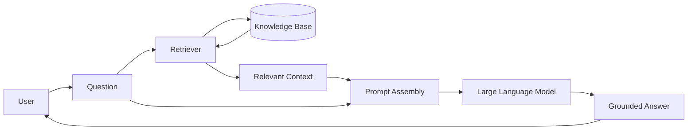
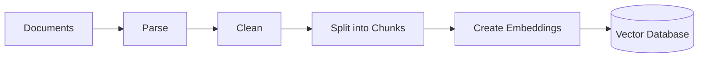
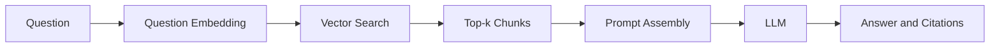
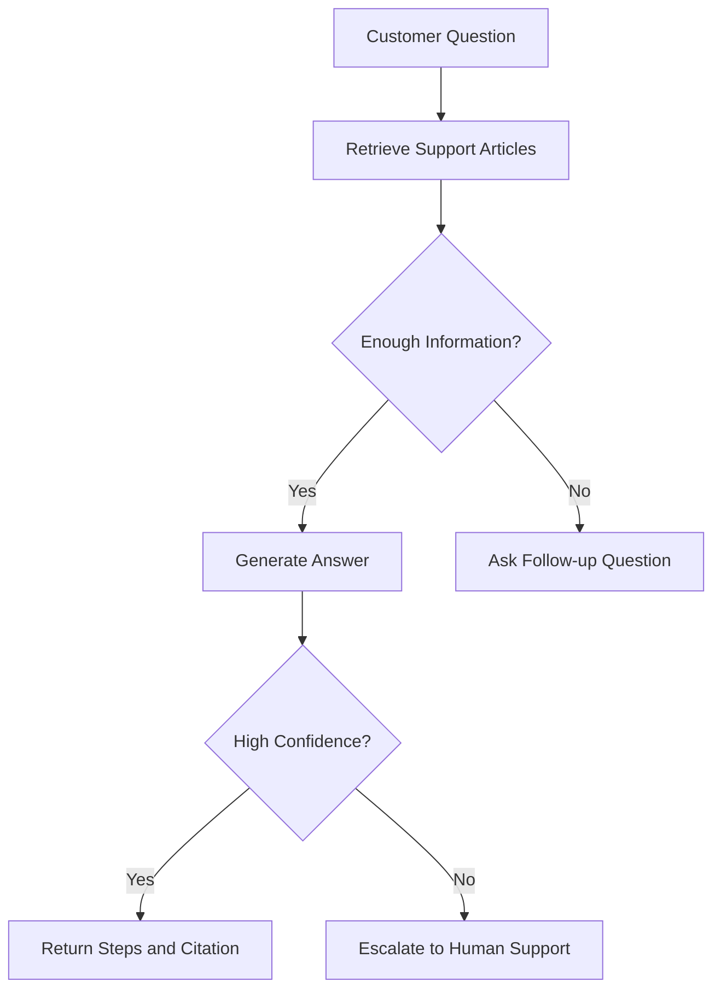
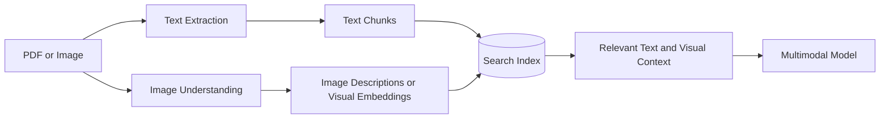
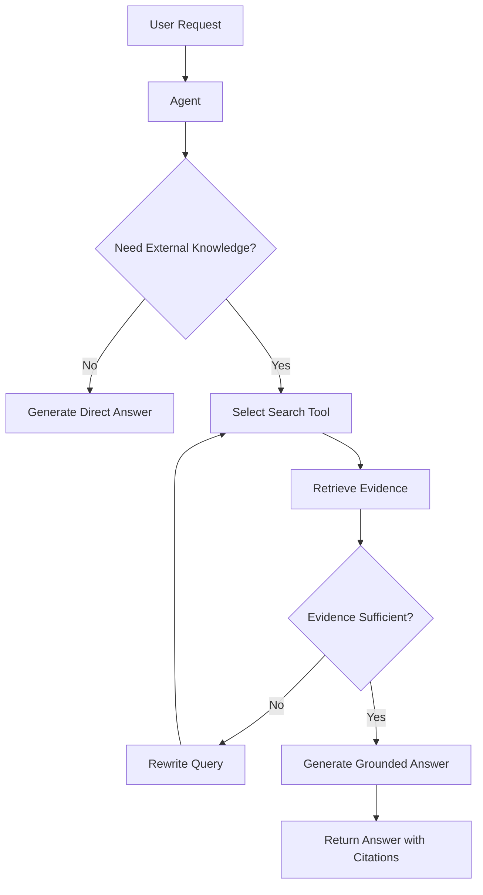
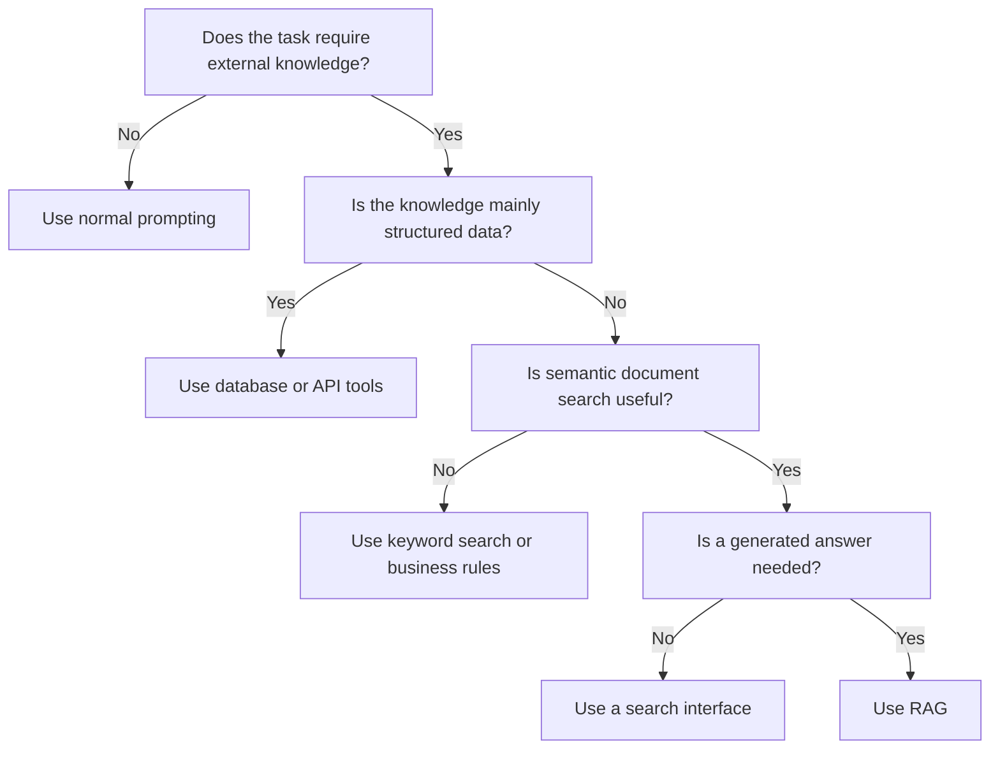
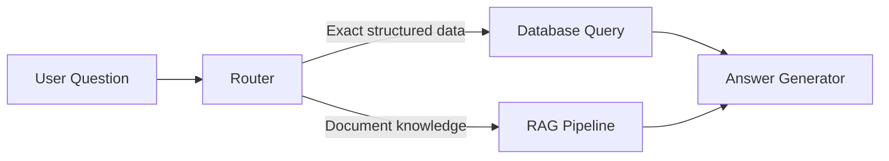
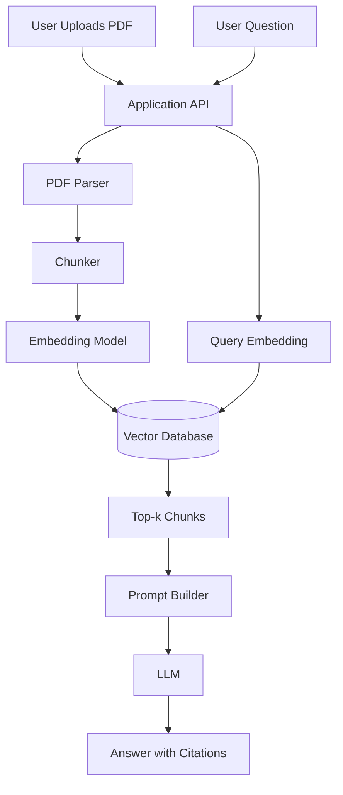

# 001 — RAG Use Cases

| Attribute              | Details                                                                                    |
| ---------------------- | ------------------------------------------------------------------------------------------ |
| **Course**             | 03 — Knowledge Systems and RAG                                                             |
| **Module**             | Module 09 — RAG and Implementation                                                         |
| **Content Group**      | RAG Concepts                                                                               |
| **Roadmap Source**     | RAG and Implementation / RAG Concepts                                                      |
| **Lesson Type**        | Retrieval-Augmented Generation                                                             |
| **Lesson Order**       | 001                                                                                        |
| **Suggested Duration** | 26 minutes                                                                                 |
| **Related Project**    | Project 8 — PDF Q&A RAG App                                                                |
| **Expected Outcome**   | Build RAG applications that answer questions using private documents and provide citations |

---

## 1. Lesson Overview

This lesson introduces the most common **Retrieval-Augmented Generation use cases** in modern AI engineering.

Retrieval-Augmented Generation, commonly called **RAG**, allows a Large Language Model to answer questions using information retrieved from external knowledge sources.

Instead of relying only on the information stored in the model's parameters, a RAG system can retrieve relevant content from:

* Internal company documents
* PDF files
* Product documentation
* Knowledge bases
* Databases
* Customer support articles
* Policies and procedures
* Research papers
* Source code repositories
* Frequently updated information

The retrieved information is inserted into the model prompt so that the model can generate an answer grounded in the supplied context.

By the end of this lesson, you should understand:

* Which applications are suitable for RAG
* When RAG is better than a standard chatbot
* Where RAG fits into an AI application
* What components are required in a basic RAG system
* How to identify cases where RAG may not be the best solution
* How to evaluate a RAG use case with test questions and citations

---

## 2. Learning Objectives

After completing this lesson, you should be able to:

1. Explain RAG use cases in your own words.
2. Identify problems that can benefit from external knowledge retrieval.
3. Distinguish RAG from prompting, fine-tuning, database queries, and web search.
4. Describe the main stages of a RAG pipeline.
5. Select an appropriate knowledge source for a RAG application.
6. Design a small RAG demo using private documents.
7. Create a test set for evaluating retrieval and answer quality.
8. Identify common RAG limitations and failure cases.

---

## 3. What Is Retrieval-Augmented Generation?

Retrieval-Augmented Generation is an AI architecture that combines two main operations:

1. **Retrieval** — Find information relevant to the user's question.
2. **Generation** — Use an LLM to produce an answer based on the retrieved information.

A simplified RAG workflow looks like this:

```text
User question
     |
     v
Search the knowledge base
     |
     v
Retrieve relevant passages
     |
     v
Add passages to the prompt
     |
     v
Generate a grounded answer
     |
     v
Return answer with citations
```

The model is not expected to remember every fact. Instead, it receives the required facts at request time.

---

## 4. Why RAG Is Useful

A standard LLM has several limitations:

* It may not know private company information.
* Its training data may be outdated.
* It may generate incorrect or unsupported claims.
* It cannot automatically access local documents.
* It may not be able to explain where an answer came from.
* Updating its internal knowledge can be expensive.

RAG addresses these limitations by retrieving relevant information before generating an answer.

### Without RAG

```text
User: What is our company's remote-work policy?

LLM:
I do not have access to your company's internal policy.
```

The model may also guess based on common policies, which would be unsafe.

### With RAG

```text
User: What is our company's remote-work policy?

Retrieved context:
Employees may work remotely for up to three days per week.
Manager approval is required for fully remote arrangements.
Source: Employee Handbook, page 18.

LLM:
Employees may work remotely for up to three days per week.
A fully remote arrangement requires manager approval.

Source: Employee Handbook, page 18.
```

The answer is based on an authoritative internal source rather than the model's general knowledge.

---

## 5. Where RAG Fits in an AI System

RAG connects the user's request, the knowledge system, and the language model.



The major components are:

| Component             | Responsibility                                |
| --------------------- | --------------------------------------------- |
| **Knowledge source**  | Stores the original documents or data         |
| **Parser**            | Extracts text and structure from source files |
| **Cleaner**           | Removes noise and normalizes content          |
| **Chunker**           | Splits documents into retrievable units       |
| **Embedding model**   | Converts text into numerical vectors          |
| **Vector database**   | Stores and searches embeddings                |
| **Retriever**         | Selects relevant chunks                       |
| **Reranker**          | Reorders retrieved chunks by relevance        |
| **Prompt assembler**  | Combines the question and retrieved context   |
| **LLM**               | Generates the final answer                    |
| **Citation layer**    | Connects statements to their original sources |
| **Evaluation system** | Measures retrieval and answer quality         |

---

## 6. High-Level RAG Pipeline

A complete RAG system normally has two workflows:

1. The **indexing workflow**
2. The **question-answering workflow**

### 6.1 Indexing workflow

The indexing workflow prepares documents for retrieval.



Example:

```text
PDF files
    -> extract text
    -> remove repeated headers
    -> divide into sections
    -> generate embeddings
    -> store vectors and metadata
```

This workflow usually runs when documents are uploaded, modified, or reindexed.

### 6.2 Question-answering workflow

The question-answering workflow runs when a user submits a question.



Example:

```text
question
    -> create query embedding
    -> retrieve top-k chunks
    -> optionally rerank them
    -> construct prompt
    -> generate answer
    -> attach citations
```

---

## 7. Common RAG Use Cases

## 7.1 Document Question Answering

A document Q&A system allows users to ask natural-language questions about one or more files.

### Example sources

* PDF reports
* Contracts
* Technical manuals
* Lecture notes
* Research papers
* Product specifications
* Employee handbooks

### Example questions

```text
What are the cancellation conditions?

What methodology was used in this research?

Which safety steps must be completed before installation?

Summarize the risks described on pages 20–25.
```

### Why RAG is suitable

The answers depend on specific documents that may not exist in the model's training data.

### Important requirements

* Page-level metadata
* Chunk-level citations
* Reliable PDF parsing
* Table extraction
* Clear handling of missing answers

---

## 7.2 Enterprise Knowledge Assistant

An enterprise knowledge assistant helps employees access information distributed across internal systems.

### Possible knowledge sources

* Company policies
* Onboarding documents
* Internal wikis
* Project documentation
* Standard operating procedures
* Meeting notes
* Architecture documents
* Team guidelines

### Example questions

```text
How do I request production access?

What is the incident escalation procedure?

Which team owns the payment service?

What steps are required before deploying to production?
```

### Benefits

* Reduces time spent searching through documents
* Improves access to organizational knowledge
* Supports employee onboarding
* Provides links to authoritative sources
* Reduces repeated questions to senior employees

### Risks

* Access-control leaks
* Outdated documents
* Conflicting policies
* Missing document ownership
* Answers based on low-authority sources

---

## 7.3 Customer Support Assistant

RAG can power a support chatbot that answers product and service questions.

### Knowledge sources

* Help-center articles
* Troubleshooting guides
* Product manuals
* Return policies
* Known issue databases
* Service status documentation

### Example questions

```text
How do I reset my device?

Why is the application showing error code 403?

Can I return an opened product?

How do I change my billing method?
```

### Recommended behavior

The assistant should:

1. Retrieve relevant support documents.
2. Provide clear troubleshooting steps.
3. Cite the source article.
4. Ask for missing information when necessary.
5. Escalate to a human when confidence is low.

### Example flow



---

## 7.4 Developer Documentation Assistant

A developer assistant can retrieve information from technical documentation and code-related knowledge sources.

### Knowledge sources

* API documentation
* SDK documentation
* Architecture decisions
* README files
* Source code comments
* Code examples
* Migration guides
* Release notes

### Example questions

```text
How do I authenticate with this API?

Which endpoint creates a new user?

What changed in version 3.2?

Where is the payment retry logic implemented?
```

### Useful metadata

```json
{
  "repository": "payment-service",
  "file_path": "src/services/retry.py",
  "language": "python",
  "commit": "abc123",
  "section": "RetryService",
  "last_updated": "2026-07-20"
}
```

Metadata allows the system to filter by repository, version, programming language, or branch.

---

## 7.5 Legal and Compliance Research

RAG can help users search policies, contracts, regulations, and compliance materials.

### Example questions

```text
What are the termination conditions in this contract?

Which clause describes data retention?

What approval is required before sharing customer data?

Which documents mention audit logging?
```

### Important limitations

A legal RAG system should not simply retrieve semantically similar passages. It should also consider:

* Document jurisdiction
* Effective date
* Document version
* Amendment history
* Authority level
* Exact legal terminology
* Conflicting clauses

The application should clearly communicate that the output is an information-retrieval aid rather than a substitute for qualified legal advice.

---

## 7.6 Healthcare Knowledge Retrieval

RAG can help professionals search clinical guidelines, medical literature, and internal procedures.

### Possible applications

* Searching hospital procedures
* Retrieving treatment guidelines
* Finding information in medical research
* Summarizing patient education materials
* Locating relevant clinical documentation

### Additional requirements

Healthcare applications may require:

* Strong privacy controls
* Access logging
* Source verification
* Version tracking
* Human review
* High-quality medical evaluation
* Clear uncertainty communication

In high-stakes applications, retrieval quality alone is not sufficient. The final generated answer must also be clinically safe and supported by authoritative sources.

---

## 7.7 Education and Learning Assistants

A RAG learning assistant can answer questions based on course materials.

### Knowledge sources

* Lecture transcripts
* Textbook chapters
* Slides
* Assignment instructions
* Study guides
* Instructor notes

### Example questions

```text
What is the difference between precision and recall?

Which topics are included in the midterm exam?

Explain this concept using the lecture's example.

Create five practice questions from Chapter 3.
```

### Possible features

* Source citations
* Difficulty-based explanations
* Flashcard generation
* Quiz generation
* Course-specific tutoring
* Links to relevant chapters
* Misconception detection

---

## 7.8 Research Assistant

A research assistant retrieves evidence from papers, reports, and datasets.

### Example tasks

* Find papers related to a research question
* Compare methods across studies
* Extract experimental results
* Summarize evidence
* Identify disagreements between sources
* Generate a literature review outline

### A research-oriented RAG system should preserve

* Paper title
* Authors
* Publication year
* Section name
* Page number
* Figure or table reference
* Digital Object Identifier when available

A good research assistant should distinguish between what a paper explicitly states and what the model infers from it.

---

## 7.9 Product Recommendation Using Private Data

RAG can support recommendations when the relevant information comes from a controlled product catalog.

### Knowledge sources

* Product descriptions
* Technical specifications
* Compatibility tables
* Inventory metadata
* Internal comparison documents
* Customer requirements

### Example question

```text
Which laptop in our catalog is suitable for machine-learning development,
has at least 32 GB of RAM, and weighs under 2 kg?
```

A hybrid system may combine:

* Structured database filtering
* Semantic retrieval
* Business rules
* LLM-generated explanations

RAG should not replace exact structured filtering when precise constraints are required.

---

## 7.10 Sales Enablement Assistant

A sales assistant can retrieve relevant information for proposals and customer conversations.

### Knowledge sources

* Product sheets
* Customer case studies
* Pricing rules
* Competitive analysis
* Sales playbooks
* Industry reports
* Approved marketing claims

### Example questions

```text
Which case studies are relevant to a banking customer?

What security features should I mention?

How does our product compare with Competitor X?

Which claims are approved for customer presentations?
```

The assistant should retrieve only approved and current materials.

---

## 7.11 Financial Research Assistant

A financial RAG application can retrieve information from:

* Annual reports
* Earnings transcripts
* Regulatory filings
* Investment research
* Internal financial models
* Risk reports

### Example questions

```text
What risks did the company mention in its latest annual report?

How did management explain the change in operating margin?

Which business segment generated the most revenue?

What assumptions are used in the forecast model?
```

Time and version metadata are critical because financial information changes frequently.

---

## 7.12 Multimodal RAG

Not all knowledge exists as plain text. Important information may appear in:

* Charts
* Images
* Diagrams
* Scanned documents
* Tables
* Audio
* Video
* Screenshots

A multimodal RAG system may process multiple content types.



### Example use cases

* Ask questions about diagrams in a technical manual
* Retrieve information from scanned invoices
* Explain charts in a financial report
* Search a collection of product images
* Answer questions about lecture videos

---

## 7.13 Agentic RAG

In standard RAG, retrieval is usually performed once before generation.

In **agentic RAG**, an AI agent can decide:

* Whether retrieval is necessary
* Which knowledge source to search
* Which query to use
* Whether to reformulate the query
* Whether more evidence is needed
* Which tool should be called next



Agentic RAG can handle complex research tasks, but it introduces additional concerns:

* Higher latency
* More model calls
* Increased cost
* Tool-selection errors
* Retrieval loops
* Harder evaluation
* More complex observability

---

## 8. RAG Use-Case Selection Framework

Not every application needs RAG.

A problem is a strong RAG candidate when several of the following conditions are true:

| Question                                             | RAG Signal |
| ---------------------------------------------------- | ---------- |
| Does the answer depend on private information?       | Strong     |
| Does the information change regularly?               | Strong     |
| Must the answer include citations?                   | Strong     |
| Is the knowledge distributed across many documents?  | Strong     |
| Is natural-language search important?                | Strong     |
| Is retraining the model impractical?                 | Strong     |
| Must users see the supporting evidence?              | Strong     |
| Can the answer be generated from retrieved passages? | Strong     |

### Simple decision diagram



---

## 9. RAG Compared with Other Approaches

## 9.1 RAG vs. Prompting

Prompting gives instructions to the model but does not automatically provide external knowledge.

```text
Prompting:
"Explain our leave policy clearly."

RAG:
Retrieve the current leave policy and ask the model to explain it.
```

Use prompting when the model already has all necessary information.

Use RAG when the answer depends on specific documents or data.

---

## 9.2 RAG vs. Fine-Tuning

Fine-tuning modifies model behavior or patterns through additional training.

RAG provides information dynamically at request time.

| Requirement                         |       RAG | Fine-Tuning |
| ----------------------------------- | --------: | ----------: |
| Add frequently changing facts       | Excellent |        Poor |
| Provide citations                   | Excellent |     Limited |
| Teach response style                |  Moderate |   Excellent |
| Add private documents quickly       | Excellent |     Limited |
| Update knowledge without retraining | Excellent |        Poor |
| Improve specialized output format   |  Moderate |   Excellent |

RAG and fine-tuning can also be combined:

```text
Fine-tuned model behavior
        +
Retrieved private knowledge
        =
Specialized grounded assistant
```

---

## 9.3 RAG vs. Database Queries

A database query is often better when the question requires:

* Exact numbers
* Aggregations
* Sorting
* Filtering
* Transactions
* Real-time inventory
* Strict consistency

Example:

```text
How many orders were completed yesterday?
```

This should normally be answered with a database query rather than vector retrieval.

RAG is more useful for questions such as:

```text
What reasons do customers commonly give for canceling orders?
```

A production application may use both approaches.



---

## 9.4 RAG vs. Web Search

Web search retrieves public internet information.

RAG usually searches a controlled knowledge collection.

| Dimension           | RAG                 | Web Search          |
| ------------------- | ------------------- | ------------------- |
| Knowledge scope     | Selected sources    | Public web          |
| Private documents   | Supported           | Usually unsupported |
| Source control      | High                | Lower               |
| Freshness           | Depends on indexing | Often current       |
| Access control      | Can be enforced     | Limited             |
| Quality consistency | Manageable          | Variable            |

Some applications combine internal RAG with web search.

---

## 10. Minimal RAG Example

Suppose we have three short documents:

```text
Document A:
Employees receive 15 days of annual leave.

Document B:
Leave requests must be submitted at least three working days in advance.

Document C:
Unused annual leave cannot be carried into the next calendar year.
```

The user asks:

```text
How early should I request annual leave?
```

The retriever should return Document B.

The prompt may look like this:

```text
You are an employee policy assistant.

Answer the user's question using only the supplied context.
If the answer is not present, say that the available documents do not contain it.
Include the source in your answer.

Context:
[Document B]
Leave requests must be submitted at least three working days in advance.

Question:
How early should I request annual leave?
```

Expected answer:

```text
You should submit your annual-leave request at least three working days
in advance.

Source: Document B.
```

---

## 11. Example RAG API Flow

A simplified API endpoint might follow this structure:

```python
from typing import Any


def answer_question(question: str) -> dict[str, Any]:
    if not question.strip():
        raise ValueError("Question must not be empty.")

    query_embedding = embedding_model.embed(question)

    retrieved_chunks = vector_store.search(
        vector=query_embedding,
        top_k=5,
    )

    context = "\n\n".join(
        f"[Source: {chunk.metadata['source']}]\n{chunk.text}"
        for chunk in retrieved_chunks
    )

    prompt = f"""
You are a knowledge assistant.

Answer the question using only the supplied context.
If the context does not contain the answer, say so.
Include citations for important claims.

Context:
{context}

Question:
{question}
""".strip()

    answer = language_model.generate(prompt)

    return {
        "question": question,
        "answer": answer,
        "sources": [
            {
                "source": chunk.metadata.get("source"),
                "page": chunk.metadata.get("page"),
                "chunk_id": chunk.metadata.get("chunk_id"),
            }
            for chunk in retrieved_chunks
        ],
    }
```

This example contains four major steps:

1. Embed the user question.
2. Retrieve the most relevant chunks.
3. Assemble the prompt.
4. Generate an answer and return source metadata.

---

## 12. Metadata and Citation Design

Each chunk should preserve enough metadata to locate its original content.

Example:

```json
{
  "chunk_id": "handbook-page-18-chunk-02",
  "document_id": "employee-handbook-2026",
  "document_title": "Employee Handbook",
  "page": 18,
  "section": "Remote Work",
  "source_url": "/documents/employee-handbook-2026.pdf",
  "version": "2026.1",
  "effective_date": "2026-01-01",
  "access_level": "employee",
  "text": "Employees may work remotely for up to three days per week."
}
```

Without metadata, the system may generate an answer but fail to show where it came from.

Useful citation formats include:

```text
[Employee Handbook, page 18]
```

```text
Remote-work policy, Section 4.2
```

```text
Source 2 — Employee Handbook
```

```text
employee-handbook-2026.pdf, page 18
```

---

## 13. Retrieval Strategies for Different Use Cases

Different use cases may require different retrieval methods.

| Retrieval Method           | Best Suited For                                     |
| -------------------------- | --------------------------------------------------- |
| **Keyword search**         | Exact terms, names, codes and identifiers           |
| **Vector search**          | Semantic similarity and natural-language questions  |
| **Hybrid search**          | Combining exact terms with semantic similarity      |
| **Metadata filtering**     | Restricting by date, team, document type or version |
| **Reranking**              | Improving the order of retrieved chunks             |
| **Knowledge graph search** | Entity relationships and connected facts            |
| **SQL query**              | Exact structured data                               |
| **Multimodal retrieval**   | Images, diagrams and charts                         |

### Example hybrid query

```text
User question:
What does policy SEC-104 require for production access?

Retrieval plan:
1. Keyword search for "SEC-104"
2. Semantic search for "production access requirements"
3. Filter to active security policies
4. Rerank the combined results
```

---

## 14. Evaluating a RAG Use Case

A RAG system should not be evaluated only by reading a few successful answers.

Create a **golden test set** containing representative questions and expected evidence.

Example:

| Question                          | Expected Source      | Expected Answer                         |
| --------------------------------- | -------------------- | --------------------------------------- |
| How many remote days are allowed? | Handbook, page 18    | Up to three days per week               |
| Who approves fully remote work?   | Handbook, page 18    | The employee's manager                  |
| Can unused leave be carried over? | Leave Policy, page 7 | No                                      |
| What is the office dress code?    | No matching source   | The documents do not contain the answer |

The test set should include:

* Simple factual questions
* Paraphrased questions
* Multi-document questions
* Questions requiring metadata filters
* Questions with no answer
* Ambiguous questions
* Conflicting-source questions
* Outdated-document questions
* Permission-sensitive questions

---

## 15. Core RAG Evaluation Dimensions

## 15.1 Retrieval quality

Does the retriever find the correct evidence?

Possible metrics:

* Recall@k
* Precision@k
* Mean Reciprocal Rank
* Normalized Discounted Cumulative Gain
* Hit rate

For example:

```text
Expected chunk: employee-handbook-page-18
Retrieved top 5:
1. employee-handbook-page-22
2. employee-handbook-page-18
3. remote-work-faq-page-3
4. leave-policy-page-7
5. security-policy-page-4

Result:
The correct chunk appears at rank 2.
```

---

## 15.2 Context relevance

Are the retrieved chunks actually relevant to the question?

A retriever may return the correct chunk together with many unrelated chunks. Excessive irrelevant context can distract the LLM.

---

## 15.3 Answer correctness

Does the final answer match the authoritative information?

The system should not distort:

* Numbers
* Dates
* Conditions
* Exceptions
* Negations
* Responsibilities
* Version information

---

## 15.4 Groundedness

Is the answer supported by the retrieved context?

An answer may sound correct while including unsupported details.

Example:

```text
Retrieved context:
Employees may work remotely for three days per week.

Unsupported answer:
Employees may work remotely for three days per week and must work in the
office every Monday.
```

The Monday requirement was not present in the context.

---

## 15.5 Citation correctness

A citation should support the claim attached to it.

Incorrect citation behavior includes:

* Citing an unrelated page
* Citing a document that does not contain the claim
* Citing only one source for a multi-source answer
* Displaying a document title without a page or section
* Producing source references that do not exist

---

## 15.6 Answer completeness

Does the answer include all relevant parts?

Suppose the source says:

```text
Employees may work remotely for three days per week.
Fully remote arrangements require manager and HR approval.
```

An answer that mentions only the three-day limit may be correct but incomplete.

---

## 15.7 Abstention quality

Can the model refuse to answer when the evidence is insufficient?

Expected response:

```text
The available documents do not specify the office dress code.
```

Unsafe response:

```text
The company probably uses a business-casual dress code.
```

---

## 16. Common RAG Failure Cases

## 16.1 Chunks are too large

Large chunks may contain several unrelated topics.

Consequences:

* Lower retrieval precision
* More token usage
* More irrelevant context
* Harder citation mapping

---

## 16.2 Chunks are too small

Small chunks may lose important surrounding context.

Consequences:

* Incomplete meaning
* Missing definitions
* Broken tables
* Missing exceptions
* Ambiguous references such as “it,” “they,” or “this policy”

---

## 16.3 Source metadata is missing

Without metadata, the application cannot reliably provide:

* Page citations
* Document links
* Section references
* Version filters
* Access-control checks

---

## 16.4 Retrieval quality is not measured

A beautiful chatbot interface cannot compensate for incorrect retrieval.

The team should inspect:

```text
Question
-> retrieved chunks
-> relevance scores
-> reranked order
-> final context
-> model answer
-> citations
```

---

## 16.5 The system retrieves outdated documents

If old and current policies are indexed together, the model may use the wrong version.

Possible solution:

```text
Filter:
status = "active"
effective_date <= current_date
superseded = false
```

---

## 16.6 The model answers beyond the context

The model may combine retrieved evidence with unsupported prior knowledge.

Prompt instructions can reduce this problem, but they cannot guarantee correctness.

Evaluation and post-generation verification may still be necessary.

---

## 16.7 Top-k is chosen without testing

A larger top-k value is not always better.

```text
Small top-k:
May miss important evidence.

Large top-k:
May introduce noise, cost and conflicting information.
```

The correct value depends on:

* Chunk size
* Question complexity
* Document structure
* Embedding quality
* Reranking
* Model context limits

---

## 16.8 Access control is applied after retrieval

Permission checks must happen before restricted content is exposed to the model or user.

Unsafe flow:

```text
Retrieve every document
-> send restricted chunks to model
-> hide citations afterward
```

Safer flow:

```text
Identify user permissions
-> filter allowed documents
-> retrieve permitted chunks
-> generate answer
```

---

## 16.9 Evaluation is based only on personal impressions

Statements such as “the chatbot feels accurate” are not sufficient.

Use repeatable test questions, expected sources, measurable retrieval results, and documented failure cases.

---

## 17. When RAG Is Not the Best Choice

RAG may be unnecessary when:

* The model already knows enough to answer.
* The task is purely creative.
* The answer comes from one short prompt.
* Exact SQL calculations are required.
* Deterministic business rules are sufficient.
* A standard search interface is more appropriate.
* The knowledge base is extremely small.
* The data cannot legally be sent to the selected model.
* Retrieval latency is unacceptable.
* The source documents are too poor or inconsistent to support reliable answers.

Example:

```text
Generate ten names for a fantasy kingdom.
```

This does not require RAG.

Another example:

```text
What is the total revenue from completed orders this month?
```

This should normally use a database query rather than document retrieval.

---

## 18. Production Considerations

A production RAG application should consider more than embeddings and prompts.

### 18.1 Security

* Document-level access control
* Chunk-level permissions
* Encryption
* Authentication
* Audit logs
* Secret management
* Protection against prompt injection in retrieved documents

### 18.2 Reliability

* Parser error handling
* Indexing retries
* Duplicate detection
* Version management
* Empty-retrieval handling
* Model fallback strategies
* Vector database availability

### 18.3 Cost

Major cost sources include:

* Document parsing
* Embedding generation
* Vector storage
* Retrieval
* Reranking
* LLM input tokens
* LLM output tokens
* Evaluation runs

### 18.4 Latency

A RAG request may involve several operations:

```text
Query embedding
+ vector search
+ metadata filtering
+ reranking
+ prompt assembly
+ LLM generation
= total response latency
```

### 18.5 Observability

Useful logs include:

```json
{
  "request_id": "req_123",
  "question": "What is the remote-work policy?",
  "retrieved_chunk_ids": [
    "handbook-p18-c2",
    "remote-faq-p3-c1"
  ],
  "retrieval_scores": [
    0.89,
    0.82
  ],
  "reranker_scores": [
    0.94,
    0.77
  ],
  "input_tokens": 1850,
  "output_tokens": 210,
  "latency_ms": 1260,
  "citations_returned": 2
}
```

---

## 19. Practical Exercise

Build a small RAG prototype using between five and ten documents.

### Suggested document collections

* Course notes
* Product manuals
* Company policies
* Research-paper abstracts
* Technical documentation
* Personal project documentation

### Step 1 — Select the documents

Choose documents with enough information to support at least ten questions.

Avoid starting with hundreds of large files.

### Step 2 — Create a golden question set

Write questions before optimizing the RAG pipeline.

Example:

```json
[
  {
    "question": "What authentication method does the API use?",
    "expected_source": "api-guide.pdf",
    "expected_page": 4
  },
  {
    "question": "How many requests are allowed per minute?",
    "expected_source": "api-guide.pdf",
    "expected_page": 9
  },
  {
    "question": "Does the API support XML?",
    "expected_source": null,
    "expected_behavior": "abstain"
  }
]
```

### Step 3 — Parse and clean the documents

Record:

* Extracted text
* Parsing errors
* Repeated headers
* Missing tables
* Broken character encoding

### Step 4 — Experiment with chunking

Try at least two chunking configurations.

Example:

```text
Configuration A:
Chunk size: 300 tokens
Overlap: 50 tokens

Configuration B:
Chunk size: 700 tokens
Overlap: 100 tokens
```

### Step 5 — Create embeddings

Embed every chunk and store:

* Chunk text
* Embedding
* Document ID
* Page number
* Section name
* Version
* Access metadata

### Step 6 — Test retrieval

For each golden question, record the top-k results.

Example:

```text
Question:
How many requests are allowed per minute?

Top 3:
1. api-guide-page-9-chunk-1 — score 0.91
2. api-guide-page-8-chunk-3 — score 0.79
3. setup-guide-page-2-chunk-1 — score 0.62
```

### Step 7 — Generate answers

Create a prompt that:

* Uses only the retrieved context
* Includes citations
* States when the answer is unavailable
* Avoids unsupported assumptions

### Step 8 — Analyze failures

Classify each failure.

```text
Parsing failure
Chunking failure
Retrieval failure
Ranking failure
Prompt failure
Generation failure
Citation failure
Access-control failure
```

---

## 20. Mini Portfolio Project

## PDF Q&A RAG App with Page and Chunk Citations

Build a small application that allows users to:

1. Upload one or more PDF files.
2. Extract text from each PDF.
3. Divide the text into chunks.
4. Create embeddings.
5. Store chunks in a vector database.
6. Ask questions about the uploaded files.
7. Display retrieved passages.
8. Generate answers grounded in those passages.
9. Show page-level citations.
10. Report when the documents do not contain the answer.

### Suggested architecture



### Suggested API routes

```text
POST   /documents
GET    /documents
DELETE /documents/{document_id}
POST   /documents/{document_id}/index
POST   /questions
GET    /questions/{question_id}
GET    /health
```

### Example response

```json
{
  "answer": "Employees may work remotely for up to three days per week.",
  "citations": [
    {
      "document": "Employee Handbook",
      "page": 18,
      "chunk_id": "employee-handbook-p18-c2",
      "text": "Employees may work remotely for up to three days per week."
    }
  ],
  "retrieval": {
    "top_k": 5,
    "chunks_used": 2
  }
}
```

---

## 21. Production Checklist

### Knowledge source

* [ ] The authoritative documents have been identified.
* [ ] Every document has an owner.
* [ ] Document versions are tracked.
* [ ] Outdated documents can be excluded.
* [ ] Access permissions are defined.

### Parsing and chunking

* [ ] Text extraction has been manually inspected.
* [ ] Tables and headings are handled correctly.
* [ ] Repeated headers and footers are removed.
* [ ] Chunk size has been tested.
* [ ] Chunk overlap has been tested.
* [ ] Document structure is preserved where possible.

### Retrieval

* [ ] Retrieval quality is measured with a test set.
* [ ] Top-k has been tested rather than guessed.
* [ ] Metadata filters are applied.
* [ ] Keyword search is considered for exact terms.
* [ ] Reranking is considered for difficult queries.
* [ ] Empty and low-confidence retrieval are handled.

### Generation

* [ ] The prompt requires evidence-based answers.
* [ ] The model can abstain.
* [ ] Unsupported claims are evaluated.
* [ ] Long contexts are controlled.
* [ ] Conflicting sources are handled.
* [ ] The response format is consistent.

### Citations

* [ ] Every chunk preserves source metadata.
* [ ] Page or section references are available.
* [ ] Citations are clickable where possible.
* [ ] Citation correctness is tested.
* [ ] Users can inspect the supporting passages.

### Security and operations

* [ ] Authorization is applied before retrieval.
* [ ] Sensitive content is protected.
* [ ] Prompt injection risks are considered.
* [ ] Requests and retrieval traces are logged.
* [ ] Latency and token usage are monitored.
* [ ] Indexing failures trigger alerts.
* [ ] A document deletion strategy exists.

---

## 22. Completion Checklist

After completing this lesson, confirm that:

* [ ] I can explain RAG use cases in one or two minutes.
* [ ] I can identify whether a problem is suitable for RAG.
* [ ] I understand the difference between RAG and fine-tuning.
* [ ] I understand when a database query is better than RAG.
* [ ] I can describe the indexing and question-answering workflows.
* [ ] I can identify the metadata needed for citations.
* [ ] I have created a small golden question set.
* [ ] I have inspected top-k retrieval results.
* [ ] I have documented at least one RAG failure case.
* [ ] I have built or designed a small RAG demo.
* [ ] I understand the effects of model choice, retrieval, prompts, cost, safety and UX.
* [ ] I can describe at least one limitation that requires further investigation.

---

## 23. Key Takeaways

1. RAG gives language models access to external, private or frequently changing knowledge.
2. A RAG system combines retrieval with language generation.
3. Strong RAG use cases require document-specific knowledge, citations or controlled information sources.
4. Common applications include document Q&A, enterprise assistants, customer support, research and technical documentation.
5. RAG is not a replacement for SQL, APIs, business rules or conventional search.
6. Parsing, cleaning, chunking and metadata quality strongly affect retrieval.
7. Retrieval quality should be tested before judging answer quality.
8. Citations require source, page, section and chunk metadata.
9. A model must be able to abstain when the evidence is insufficient.
10. Production RAG requires security, access control, evaluation, observability and document-version management.

---

## 24. Final Summary

**RAG Use Cases** are an important foundation in the AI Engineer roadmap.

RAG is most valuable when an AI application must answer questions using private, specialized, controlled or frequently updated information. It allows a language model to retrieve relevant evidence and generate a natural-language answer with traceable sources.

However, a useful RAG product requires more than connecting an embedding model to a vector database. It requires reliable parsing, appropriate chunking, effective retrieval, complete metadata, grounded generation, citation validation and systematic evaluation.

Turn this lesson into a practical artifact such as:

* A PDF question-answering application
* An internal documentation assistant
* A customer-support bot
* A research-paper search tool
* A developer documentation assistant
* A RAG evaluation dashboard
* An agent tool for retrieving private knowledge

The most important goal is to create a working system that can answer:

```text
What evidence was retrieved?

Why was this answer generated?

Which source supports each important claim?

What happens when the answer is not available?
```

---

# Bài luyện tập

## Mục tiêu


## Đề bài


## Yêu cầu hoàn thành

- [ ] 
- [ ] 
- [ ] 

## Kết quả / lời giải


## Ghi chú
