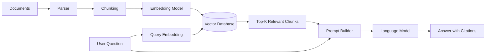
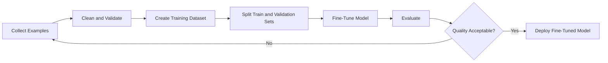
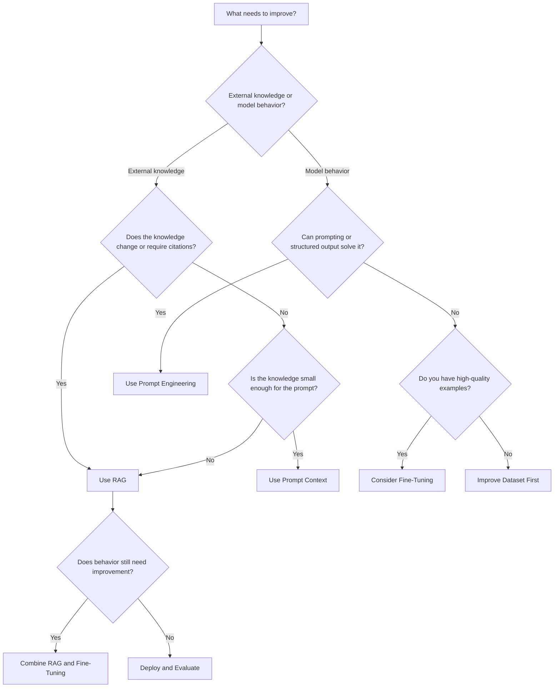
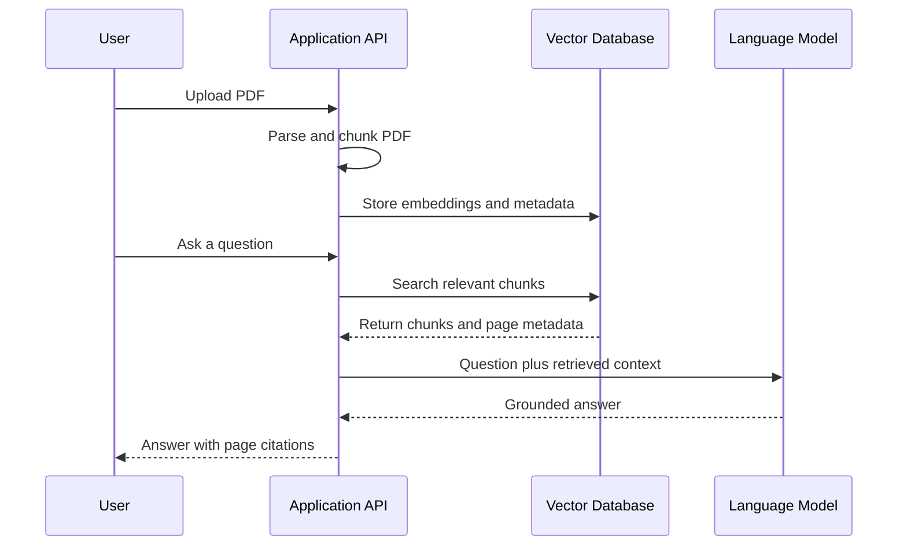
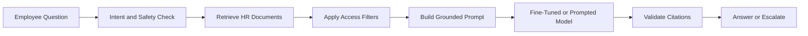
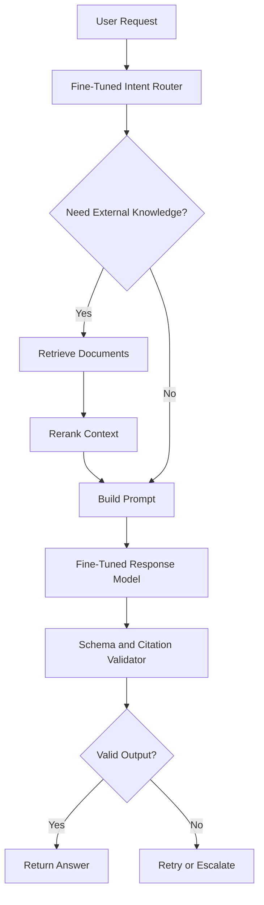
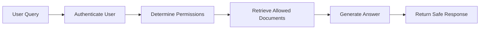
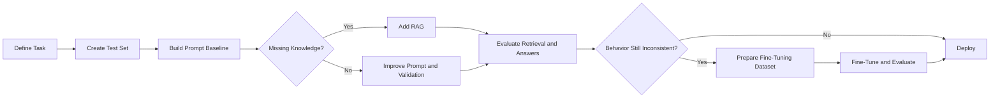

# 002 — RAG vs Fine-Tuning

**Course:** 03 — Knowledge Systems and RAG
**Module:** Module 09 — RAG and Implementation
**Content Group:** RAG Concepts
**Roadmap Source:** RAG and Implementation / RAG Concepts
**Lesson Type:** RAG
**Order in Module:** 002
**Suggested Duration:** 26 minutes

---

## 1. Lesson Summary

This lesson explains the differences between **Retrieval-Augmented Generation (RAG)** and **fine-tuning** in the context of modern AI engineering.

Both techniques improve the usefulness of a large language model, but they solve different problems:

* **RAG** gives a model access to external, current, private, or source-grounded knowledge.
* **Fine-tuning** changes how a model behaves, responds, formats output, or performs a repeated task.
* Many production AI applications begin with RAG because documents can be updated without retraining the model.
* Some advanced systems combine RAG and fine-tuning to improve both knowledge access and response behavior.

After completing this lesson, you should be able to decide whether an AI application needs:

* RAG,
* fine-tuning,
* prompt engineering,
* tool calling,
* or a combination of these techniques.

---

## 2. Learning Objectives

By the end of this lesson, you should be able to:

* Explain RAG and fine-tuning in your own words.
* Describe the main differences between RAG and fine-tuning.
* Identify when an application needs external knowledge.
* Identify when an application needs specialized behavior.
* Choose an appropriate solution based on freshness, cost, latency, privacy, and maintainability.
* Design a small RAG or fine-tuning experiment.
* Evaluate the output using a structured test dataset.
* Recognize when RAG and fine-tuning should be combined.

---

## 3. The Core Problem

A pretrained language model has two important limitations:

1. Its internal knowledge is limited to what it learned during training.
2. Its default behavior may not match the requirements of a specific application.

For example, imagine building an internal company assistant.

The assistant must:

* answer questions about private company policies,
* use the latest policy documents,
* provide citations,
* respond in a predefined support format,
* and avoid unsupported claims.

These requirements involve two different problems.

### Knowledge problem

The model does not know the latest private company documents.

Possible solution:

> Use RAG to retrieve relevant company documents at runtime.

### Behavior problem

The model may not consistently follow the required response style or classification format.

Possible solution:

> Use prompting or fine-tuning to teach the model the expected behavior.

This distinction is the foundation of the RAG versus fine-tuning decision.

---

## 4. What Is RAG?

**Retrieval-Augmented Generation**, or **RAG**, is an architecture in which an AI system retrieves relevant information from an external knowledge source before generating an answer.

Instead of relying only on the knowledge stored inside the model, the application provides additional context at request time.

A basic RAG pipeline looks like this:

```text
Documents
    ↓
Parse and clean
    ↓
Split into chunks
    ↓
Create embeddings
    ↓
Store in a vector database
    ↓
Receive user question
    ↓
Retrieve relevant chunks
    ↓
Add chunks to the prompt
    ↓
Generate an answer
    ↓
Return citations
```

### RAG architecture



### Main idea

RAG does not directly rewrite the model's internal parameters.

It gives the model temporary access to external information during inference.

A useful mental model is:

> RAG is similar to giving the model an open book before asking it a question.

---

## 5. What Is Fine-Tuning?

**Fine-tuning** is the process of continuing the training of a pretrained model using a specialized dataset.

The training examples teach the model to produce desired outputs for particular inputs.

A simplified fine-tuning dataset may look like this:

```json
{
  "messages": [
    {
      "role": "user",
      "content": "Classify this support ticket: I was charged twice."
    },
    {
      "role": "assistant",
      "content": {
        "category": "billing",
        "priority": "high",
        "action": "refund_review"
      }
    }
  ]
}
```

After seeing many high-quality examples, the model may become more consistent at:

* following a response format,
* using a particular tone,
* classifying domain-specific inputs,
* applying repeated reasoning patterns,
* calling tools correctly,
* or completing a specialized task.

### Fine-tuning workflow



### Main idea

Fine-tuning modifies the model's behavior by adjusting its parameters.

A useful mental model is:

> Fine-tuning is similar to training the model to develop a new habit.

---

## 6. RAG and Fine-Tuning Solve Different Problems

The most important distinction is:

> RAG mainly changes what information the model can access.
> Fine-tuning mainly changes how the model behaves.

| Requirement                             |       RAG | Fine-Tuning |
| --------------------------------------- | --------: | ----------: |
| Access private documents                | Excellent |        Poor |
| Use frequently updated information      | Excellent |        Poor |
| Provide citations                       | Excellent |     Limited |
| Change tone or writing style            |   Limited |   Excellent |
| Produce a stable output format          |  Moderate |   Excellent |
| Learn repeated task patterns            |   Limited |   Excellent |
| Remove the need for retrieval           |        No |   Sometimes |
| Update knowledge quickly                | Excellent |        Slow |
| Inspect information sources             | Excellent |   Difficult |
| Reduce long prompt instructions         |   Limited |   Excellent |
| Handle factual questions from documents | Excellent |  Poor alone |
| Improve classification consistency      |  Moderate |   Excellent |

RAG and fine-tuning are therefore not direct replacements for each other.

---

## 7. When RAG Is the Better Choice

RAG is usually the better choice when the application depends on external knowledge.

### 7.1 The information changes frequently

Examples include:

* product catalogs,
* company policies,
* technical documentation,
* prices,
* schedules,
* news,
* legal documents,
* project status,
* customer records.

Retraining a model whenever a document changes would be expensive and difficult.

With RAG, the application only needs to update the knowledge index.

```text
Updated document
      ↓
Reprocess affected chunks
      ↓
Update vector database
      ↓
New information becomes retrievable
```

### 7.2 The information is private

RAG can retrieve content from:

* internal documentation,
* private databases,
* customer accounts,
* enterprise knowledge bases,
* uploaded PDFs,
* authenticated APIs.

The information does not need to be permanently learned by the model.

### 7.3 Answers require citations

RAG can preserve metadata such as:

```json
{
  "document_id": "employee-handbook-2026",
  "title": "Employee Handbook",
  "page": 17,
  "section": "Remote Work Policy",
  "chunk_id": "employee-handbook-2026-page-17-chunk-02"
}
```

The system can use this metadata to display:

* document names,
* page numbers,
* section names,
* URLs,
* chunk references.

### 7.4 The knowledge must be inspectable

Developers can examine:

* which chunks were retrieved,
* their similarity scores,
* metadata filters,
* reranking results,
* and the final context passed to the model.

This makes RAG easier to debug than knowledge stored implicitly in model parameters.

### 7.5 The dataset is mostly documents, not examples

Suppose you have:

* 500 PDF files,
* 10,000 documentation pages,
* 20,000 product descriptions,
* or an internal wiki.

These are knowledge sources rather than input-output training examples.

RAG is usually the natural solution.

---

## 8. When Fine-Tuning Is the Better Choice

Fine-tuning is usually the better choice when the system needs specialized and repeatable behavior.

### 8.1 Consistent style or tone

Examples include:

* a formal legal writing style,
* a concise customer-support tone,
* a brand-specific voice,
* a structured educational explanation style,
* a specialized medical documentation format.

Prompting may work initially, but fine-tuning can improve consistency across a large number of requests.

### 8.2 Stable structured output

Suppose an application must always return:

```json
{
  "category": "billing",
  "urgency": 4,
  "summary": "Duplicate payment reported",
  "recommended_action": "Open refund investigation"
}
```

Fine-tuning may help the model produce this structure more reliably, especially when the task has many domain-specific rules.

However, structured-output APIs and schema validation should normally be tested before fine-tuning.

### 8.3 Repeated task patterns

Fine-tuning can be effective for tasks such as:

* ticket classification,
* entity extraction,
* intent detection,
* domain-specific summarization,
* transforming text into a fixed schema,
* generating specialized code patterns,
* selecting tools from repeated examples.

### 8.4 Long prompts contain the same instructions

Imagine every request includes several thousand tokens of behavior instructions.

```text
You are a support assistant.
Always classify the issue.
Use the following tone.
Follow these 25 formatting rules.
Apply these escalation conditions.
...
```

A fine-tuned model may internalize some of these repeated instructions, reducing prompt length and sometimes lowering inference cost.

### 8.5 You have high-quality training examples

Fine-tuning requires examples that demonstrate exactly what the system should do.

A useful dataset contains:

* realistic inputs,
* correct outputs,
* difficult edge cases,
* balanced categories,
* consistent formatting,
* and examples representing production traffic.

Fine-tuning a model on weak or inconsistent data often produces weak or inconsistent behavior.

---

## 9. RAG vs Fine-Tuning Decision Framework

Use the following decision flow before choosing a solution.



### Quick questions

Ask the following questions:

1. Does the answer depend on private or external information?
2. Does that information change frequently?
3. Must the system show where the information came from?
4. Is the problem mainly about knowledge or behavior?
5. Can prompt engineering solve the behavior problem?
6. Do we have enough high-quality training examples?
7. How often will the source information change?
8. How important are debugging and traceability?
9. What are the latency and cost requirements?
10. Can RAG and fine-tuning be tested separately?

---

## 10. Comparison by Engineering Dimension

### 10.1 Knowledge freshness

#### RAG

Knowledge can be updated by changing the external data source.

```text
New policy document
    ↓
Re-index document
    ↓
Assistant can retrieve new policy
```

#### Fine-tuning

Knowledge updates generally require:

* preparing new examples,
* retraining,
* evaluating,
* versioning,
* and redeploying the model.

**Winner for freshness:** RAG

---

### 10.2 Citations and source attribution

#### RAG

Retrieved chunks can include explicit source metadata.

#### Fine-tuning

A model may reproduce learned information, but it cannot reliably identify the exact training example that influenced a response.

**Winner for citations:** RAG

---

### 10.3 Behavioral consistency

#### RAG

Retrieved context gives the model facts, but the model may still respond inconsistently.

#### Fine-tuning

The model can learn repeated output patterns from examples.

**Winner for behavior consistency:** Fine-tuning

---

### 10.4 Initial implementation effort

A simple RAG prototype requires:

* document parsing,
* chunking,
* embeddings,
* vector storage,
* retrieval,
* prompt construction.

A fine-tuning experiment requires:

* dataset collection,
* example normalization,
* train and validation splits,
* training configuration,
* model evaluation,
* deployment management.

The easier option depends on the existing infrastructure, but RAG is often safer for document-based applications.

---

### 10.5 Debugging

#### RAG debugging

You can inspect:

```text
User question
Retrieved chunks
Retrieval scores
Reranked results
Final prompt
Generated answer
Citations
```

#### Fine-tuning debugging

Fine-tuning failures may come from:

* poor examples,
* inconsistent labels,
* overfitting,
* missing edge cases,
* class imbalance,
* training configuration,
* unexpected model behavior.

The relationship between a specific example and a model response is less direct.

**Winner for observability:** RAG

---

### 10.6 Latency

RAG adds retrieval steps:

```text
Query embedding
    +
Vector search
    +
Optional reranking
    +
Model generation
```

Fine-tuning may avoid retrieval when the task only requires learned behavior.

However, fine-tuning should not be used as a substitute for a large, frequently changing knowledge base.

---

### 10.7 Cost

#### RAG costs

Potential costs include:

* document parsing,
* embedding generation,
* vector database storage,
* retrieval queries,
* reranking,
* additional context tokens.

#### Fine-tuning costs

Potential costs include:

* dataset creation,
* annotation,
* training,
* evaluation,
* model hosting,
* repeated retraining.

The correct cost comparison must include engineering and maintenance costs, not only API prices.

---

## 11. Example 1: PDF Question-Answering Application

### Requirements

The application must:

* accept uploaded PDF files,
* answer questions using those PDFs,
* provide page-level citations,
* support document updates,
* avoid unsupported answers.

### Recommended solution

Use RAG.



### Why not fine-tuning?

The PDF content may:

* change,
* contain private information,
* differ for every user,
* require exact citations.

Fine-tuning would not be an appropriate way to continuously insert arbitrary uploaded documents into a model.

---

## 12. Example 2: Support Ticket Classification

### Requirements

The application must classify every ticket into:

* category,
* urgency,
* department,
* recommended action.

The company has 50,000 verified historical examples.

### Possible solution

Fine-tuning may be appropriate.

Example input:

```text
My account was locked after I changed my phone number.
```

Expected output:

```json
{
  "category": "account_access",
  "urgency": "medium",
  "department": "identity_support",
  "recommended_action": "start_identity_verification"
}
```

### Why not RAG alone?

Retrieving similar tickets may help, but the main requirement is consistent classification behavior rather than access to changing facts.

A strong implementation might still use:

* structured outputs,
* validation rules,
* fine-tuning,
* and a fallback classifier.

---

## 13. Example 3: Internal HR Assistant

### Requirements

The assistant must:

* answer questions from HR policies,
* use the latest employee handbook,
* cite policy sections,
* respond politely,
* use a consistent company tone,
* escalate sensitive cases.

### Recommended solution

Use a combination of RAG and behavioral controls.



RAG provides:

* current HR information,
* private knowledge,
* citations.

Prompting or fine-tuning provides:

* consistent tone,
* escalation behavior,
* predictable formatting.

---

## 14. RAG and Fine-Tuning Can Be Combined

RAG and fine-tuning are complementary.

A combined system may use:

* RAG for facts,
* fine-tuning for behavior,
* tools for actions,
* prompts for task-specific instructions,
* validators for safety and correctness.

### Combined architecture



### Example

A customer-support assistant may use:

1. A fine-tuned model to classify the customer request.
2. RAG to retrieve the latest refund policy.
3. A tool to check the customer's order.
4. A response model to produce the final message.
5. A validator to ensure the answer follows company rules.

---

## 15. Prompt Engineering Before Fine-Tuning

Fine-tuning should not always be the first solution.

A practical improvement order is:

```text
1. Establish a baseline
2. Improve the system prompt
3. Add examples to the prompt
4. Use structured outputs
5. Add validation
6. Add RAG when knowledge is missing
7. Consider fine-tuning when behavior remains inconsistent
```

### Why test prompting first?

Prompting is:

* faster to change,
* easier to debug,
* cheaper to experiment with,
* easier to compare,
* and does not require a training pipeline.

Fine-tuning becomes more attractive when:

* the task is stable,
* examples are abundant,
* prompt instructions are repetitive,
* production volume is large,
* and measurable errors remain after prompt optimization.

---

## 16. Minimal RAG Demo

The following pseudocode demonstrates the basic RAG flow.

```python
from typing import List


def retrieve_chunks(question: str, top_k: int = 5) -> List[dict]:
    """
    Search the vector database and return relevant chunks.
    Each result should include text and source metadata.
    """
    query_embedding = embedding_model.embed(question)

    return vector_database.search(
        vector=query_embedding,
        top_k=top_k,
        filters={"status": "published"},
    )


def build_context(chunks: List[dict]) -> str:
    context_parts = []

    for index, chunk in enumerate(chunks, start=1):
        context_parts.append(
            f"""
            [Source {index}]
            Document: {chunk["title"]}
            Page: {chunk["page"]}
            Content: {chunk["text"]}
            """
        )

    return "\n".join(context_parts)


def answer_question(question: str) -> str:
    chunks = retrieve_chunks(question)
    context = build_context(chunks)

    prompt = f"""
    Answer the question using only the supplied sources.

    Requirements:
    - Do not use unsupported information.
    - Cite sources using [Source N].
    - State that the information is unavailable when the sources are insufficient.

    Sources:
    {context}

    Question:
    {question}
    """

    return language_model.generate(prompt)
```

### RAG result

```text
Question:
How many remote-work days are employees allowed each week?

Answer:
Employees may work remotely for up to two days per week, subject to
manager approval [Source 1].
```

---

## 17. Minimal Fine-Tuning Dataset

A fine-tuning dataset should contain clear examples of the desired behavior.

```json
{"messages":[
  {"role":"system","content":"Classify customer support tickets."},
  {"role":"user","content":"I was charged twice for the same order."},
  {"role":"assistant","content":"{\"category\":\"billing\",\"priority\":\"high\",\"action\":\"refund_review\"}"}
]}
{"messages":[
  {"role":"system","content":"Classify customer support tickets."},
  {"role":"user","content":"I forgot my password and cannot sign in."},
  {"role":"assistant","content":"{\"category\":\"account_access\",\"priority\":\"medium\",\"action\":\"password_reset\"}"}
]}
{"messages":[
  {"role":"system","content":"Classify customer support tickets."},
  {"role":"user","content":"Where can I download my invoice?"},
  {"role":"assistant","content":"{\"category\":\"billing_document\",\"priority\":\"low\",\"action\":\"provide_invoice_link\"}"}
]}
```

### Dataset quality requirements

The examples should be:

* accurate,
* consistent,
* representative,
* diverse,
* correctly formatted,
* free from sensitive information,
* and separated into training and evaluation sets.

---

## 18. Practical Exercise

### Exercise goal

Compare a simple RAG approach with a behavior-focused approach.

### Part A: Build a small RAG dataset

Choose 5–10 short documents such as:

* product documentation,
* course notes,
* company policies,
* technical articles,
* or project README files.

For every document, preserve metadata:

```json
{
  "source": "user-guide.pdf",
  "page": 12,
  "section": "Authentication",
  "document_version": "2026-01",
  "access_level": "public"
}
```

### Part B: Create test questions

Create at least 15 questions across three categories.

#### Direct answer questions

The answer appears explicitly in one chunk.

```text
What file formats are supported?
```

#### Multi-chunk questions

The answer requires information from several chunks.

```text
Compare the authentication flow for administrators and normal users.
```

#### Unanswerable questions

The documents do not contain enough information.

```text
What features are planned for next year?
```

The correct behavior may be:

```text
The provided documents do not contain information about next year's features.
```

### Part C: Run retrieval

For each question, record:

* top-k chunks,
* similarity scores,
* source metadata,
* whether the correct chunk appeared,
* answer quality,
* citation correctness.

Example evaluation table:

| Question                      | Correct chunk in Top-3? | Answer correct? | Citation correct? | Notes           |
| ----------------------------- | ----------------------: | --------------: | ----------------: | --------------- |
| What formats are supported?   |                     Yes |             Yes |               Yes | Strong result   |
| How is admin login different? |                      No |              No |                No | Chunking issue  |
| What is planned next year?    |                     N/A |             Yes |               N/A | Correct refusal |

### Part D: Test behavioral consistency

Create 20 examples for a repeated task such as:

* ticket classification,
* sentiment labeling,
* metadata extraction,
* response formatting.

Test three approaches:

1. Zero-shot prompting.
2. Few-shot prompting.
3. Fine-tuning or simulated fine-tuning dataset design.

Compare:

* accuracy,
* format validity,
* consistency,
* token usage,
* latency,
* maintenance effort.

---

## 19. Evaluation Metrics

RAG and fine-tuning require different evaluation metrics.

### 19.1 RAG metrics

#### Retrieval recall

Did the retriever return the chunk containing the answer?

```text
Retrieval Recall@K =
Questions with relevant chunk in Top-K
÷
Total answerable questions
```

#### Context precision

How many retrieved chunks were actually relevant?

```text
Context Precision =
Relevant retrieved chunks
÷
Total retrieved chunks
```

#### Answer faithfulness

Is the answer supported by the retrieved context?

#### Citation correctness

Do the citations point to sources that support the claim?

#### Answer completeness

Does the answer include all important information found in the sources?

#### Refusal accuracy

Does the application refuse to answer when the context is insufficient?

---

### 19.2 Fine-tuning metrics

Fine-tuning evaluation may include:

* classification accuracy,
* precision,
* recall,
* F1 score,
* schema-valid output rate,
* exact-match rate,
* task completion rate,
* style consistency,
* tool-selection accuracy,
* human preference score.

### Evaluation principle

Never evaluate only by reading a few impressive examples.

Create a stable test set before making architectural changes.

---

## 20. Common Mistakes

### 20.1 Using fine-tuning to store changing facts

A model should not be retrained every time:

* a policy changes,
* a product is added,
* a price changes,
* or a document is updated.

Use an external knowledge source when freshness matters.

---

### 20.2 Expecting RAG to fix all model behavior

RAG may retrieve the correct document while the model still:

* ignores instructions,
* returns invalid JSON,
* uses the wrong tone,
* combines unsupported claims,
* or fails to call the correct tool.

Retrieval quality and generation quality must be evaluated separately.

---

### 20.3 Fine-tuning without a baseline

Before fine-tuning, measure:

* zero-shot performance,
* few-shot performance,
* structured-output performance,
* and RAG-enhanced performance.

Without a baseline, it is difficult to determine whether fine-tuning actually improved the system.

---

### 20.4 Training on low-quality examples

A model learns both the strengths and weaknesses of the training dataset.

Common dataset problems include:

* inconsistent labels,
* contradictory examples,
* invalid output formats,
* missing edge cases,
* duplicated examples,
* unrealistic inputs,
* biased category distribution.

---

### 20.5 Using chunks that are too large or too small

Chunks that are too small may lose context.

Chunks that are too large may:

* include irrelevant information,
* reduce retrieval precision,
* increase token usage,
* and make citations less specific.

Measure retrieval quality rather than choosing chunk size by intuition.

---

### 20.6 Losing source metadata

Without metadata, the application may retrieve useful text but cannot provide meaningful citations.

At minimum, store:

```text
Document ID
Document title
Page number or section
Chunk ID
Source URL or file path
Version
Access permissions
```

---

### 20.7 Evaluating only the final answer

A RAG system has multiple stages:

```text
Query understanding
    ↓
Retrieval
    ↓
Filtering
    ↓
Reranking
    ↓
Prompt construction
    ↓
Generation
    ↓
Citation rendering
```

A bad answer may come from any of these stages.

Inspect each stage separately.

---

### 20.8 Ignoring access control

A private-document RAG application must apply authorization before returning context.



Do not retrieve all documents first and attempt to hide unauthorized information only after generation.

---

## 21. Production Checklist

### Problem definition

* [ ] Is the main problem related to knowledge, behavior, or both?
* [ ] Is the expected output clearly defined?
* [ ] Is there a stable evaluation dataset?
* [ ] Are success metrics measurable?

### RAG checklist

* [ ] Documents are parsed correctly.
* [ ] Chunk size and overlap have been evaluated.
* [ ] Metadata is preserved.
* [ ] Embeddings match the document domain.
* [ ] Retrieval Top-K has been tested.
* [ ] Metadata filters are applied.
* [ ] Access permissions are enforced before generation.
* [ ] Citations are validated.
* [ ] Unanswerable questions are included in tests.
* [ ] Retrieval logs are available for debugging.

### Fine-tuning checklist

* [ ] Prompt engineering has been tested first.
* [ ] Structured outputs have been tested.
* [ ] Training examples are high quality.
* [ ] Labels and formats are consistent.
* [ ] Edge cases are represented.
* [ ] Training and evaluation data are separated.
* [ ] The baseline model has been measured.
* [ ] The fine-tuned model has been compared against the baseline.
* [ ] Model versions and datasets are tracked.
* [ ] Rollback is possible.

### Combined-system checklist

* [ ] RAG and fine-tuning have separate evaluation metrics.
* [ ] Retrieved context is not treated as automatically correct.
* [ ] The model follows source-grounding instructions.
* [ ] Tool calls are validated.
* [ ] Output schemas are validated.
* [ ] Failures trigger retries, fallbacks, or escalation.
* [ ] Cost and latency are monitored.

---

## 22. Recommended Implementation Strategy

For many AI products, the following order works well:



### Step 1: Define the failure

Avoid vague goals such as:

```text
Make the assistant smarter.
```

Use measurable goals:

```text
Increase valid ticket classification output from 86% to 97%.
```

Or:

```text
Answer employee policy questions with correct page citations in at least
90% of the evaluation set.
```

### Step 2: Build a baseline

Start with the simplest working system.

### Step 3: Add RAG for missing knowledge

Do this when responses require documents, databases, or current information.

### Step 4: Add fine-tuning for repeated behavioral failures

Do this only when prompting and validation are insufficient and suitable training data exists.

### Step 5: Evaluate continuously

Every architecture change should be measured against the same evaluation set.

---

## 23. Portfolio Demo

### Project

**PDF Q&A RAG Application with Page and Chunk Citations**

### Suggested features

* Upload one or more PDF files.
* Parse and clean PDF text.
* Split documents into chunks.
* Generate embeddings.
* Store chunks in a vector database.
* Retrieve the most relevant chunks.
* Generate grounded answers.
* Display document and page citations.
* Show retrieved chunks in a debugging panel.
* Return a clear refusal when the answer is unavailable.
* Log retrieval latency and generation latency.

### Optional comparison experiment

Add a small classification feature:

```text
Classify each question as:
- factual lookup,
- comparison,
- summary,
- unsupported,
- or action request.
```

Compare:

* prompt-only classification,
* few-shot classification,
* fine-tuned classification.

This demonstrates that:

* RAG handles document knowledge,
* while fine-tuning can improve repeated behavioral tasks.

---

## 24. Suggested Project Structure

```text
rag-vs-finetuning-demo/
├── app/
│   ├── api/
│   │   ├── ingest.py
│   │   ├── query.py
│   │   └── evaluate.py
│   ├── rag/
│   │   ├── parser.py
│   │   ├── chunker.py
│   │   ├── embeddings.py
│   │   ├── retriever.py
│   │   ├── reranker.py
│   │   └── citations.py
│   ├── prompts/
│   │   ├── answer_prompt.md
│   │   └── classification_prompt.md
│   ├── evaluation/
│   │   ├── retrieval_metrics.py
│   │   ├── answer_metrics.py
│   │   └── test_cases.json
│   └── models/
│       └── schemas.py
├── data/
│   ├── documents/
│   ├── chunks/
│   └── fine_tuning_examples/
├── tests/
│   ├── test_chunking.py
│   ├── test_retrieval.py
│   ├── test_citations.py
│   └── test_structured_output.py
├── README.md
└── requirements.txt
```

---

## 25. Knowledge Check

### Question 1

A company updates its product documentation every week. The assistant must answer using the newest documents and provide links to the sources.

Which approach is more appropriate?

**Answer:** RAG, because the knowledge changes frequently and requires source attribution.

---

### Question 2

A support model must classify thousands of tickets into a fixed JSON schema. The company has many verified examples, but prompt-based output remains inconsistent.

Which approach should be considered?

**Answer:** Fine-tuning, after structured output, validation, and prompt improvements have been evaluated.

---

### Question 3

Can fine-tuning replace a vector database for frequently updated private documents?

**Answer:** Usually no. Fine-tuning is not an efficient or inspectable mechanism for continuously updating document knowledge.

---

### Question 4

Can RAG guarantee that a model always follows a specific response style?

**Answer:** No. RAG supplies information, but response behavior may still require prompting, validation, or fine-tuning.

---

### Question 5

When should RAG and fine-tuning be combined?

**Answer:** When an application needs both external knowledge and specialized, consistent behavior.

---

## 26. Completion Checklist

* [ ] I can explain RAG versus fine-tuning in one or two minutes.
* [ ] I understand that RAG mainly improves knowledge access.
* [ ] I understand that fine-tuning mainly improves model behavior.
* [ ] I can identify when knowledge freshness is important.
* [ ] I can identify when source citations are required.
* [ ] I can explain why fine-tuning should not be used as a document database.
* [ ] I can create a small RAG test dataset.
* [ ] I can record and inspect Top-K retrieval results.
* [ ] I can evaluate answers using citations and failure cases.
* [ ] I know when prompt engineering should be tested before fine-tuning.
* [ ] I have recorded at least one limitation or open question.
* [ ] I have created a small demo, experiment, or portfolio artifact.

---

## 27. Key Takeaways

1. **RAG connects a model to external knowledge.**
2. **Fine-tuning changes the model's learned behavior.**
3. **Use RAG for current, private, traceable, or document-based information.**
4. **Use fine-tuning for stable styles, formats, classifications, and repeated task patterns.**
5. **Test prompt engineering and structured outputs before fine-tuning.**
6. **Do not treat fine-tuning as a replacement for a frequently updated knowledge base.**
7. **Evaluate retrieval and generation separately.**
8. **Many production applications combine RAG, prompting, fine-tuning, tools, and validation.**

---

## 28. Related Outcome

Build retrieval-augmented generation applications that answer questions using private documents and provide reliable citations.

---

## 29. Related Project

**Project 8: PDF Q&A RAG Application with Page and Chunk Citations**

Recommended portfolio evidence:

* architecture diagram,
* document ingestion pipeline,
* retrieval debugging interface,
* evaluation dataset,
* citation accuracy report,
* prompt-only versus RAG comparison,
* and a short technical write-up explaining why RAG was selected instead of fine-tuning.

---

## 30. Final Summary

**RAG versus fine-tuning** is not simply a choice between two competing AI techniques.

They address different layers of an AI system:

```text
Prompting      → Immediate instructions
RAG            → External knowledge
Fine-tuning    → Learned behavior
Tools          → External actions
Validation     → Reliability and safety
```

Use RAG when the model needs access to information that is current, private, large, inspectable, or citation-based.

Use fine-tuning when the model must consistently follow specialized patterns that are difficult to achieve with prompts alone.

In many modern AI applications, the strongest solution is a carefully evaluated combination:

```text
User request
    ↓
Prompt and intent routing
    ↓
Retrieve trusted knowledge
    ↓
Apply specialized model behavior
    ↓
Call tools when necessary
    ↓
Validate facts, citations, and format
    ↓
Return the final response
```

The most important engineering principle is to identify the actual failure before selecting the technique.

Do not ask:

> Should we use RAG or fine-tuning?

Ask:

> Is the system missing knowledge, failing to follow the required behavior, or experiencing both problems?

---

# Bài luyện tập

## Mục tiêu


## Đề bài


## Yêu cầu hoàn thành

- [ ] 
- [ ] 
- [ ] 

## Kết quả / lời giải


## Ghi chú
