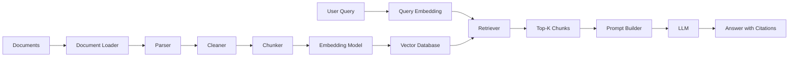
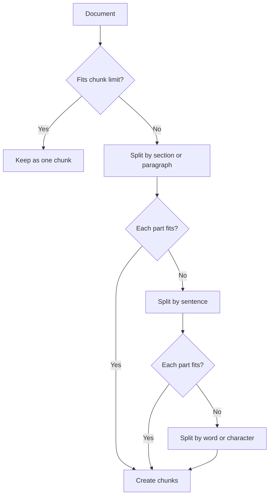
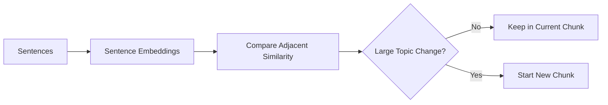
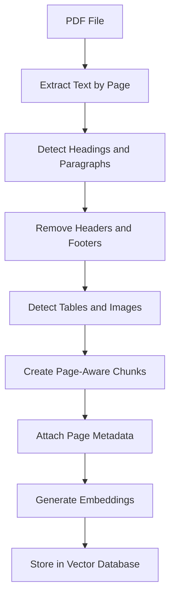
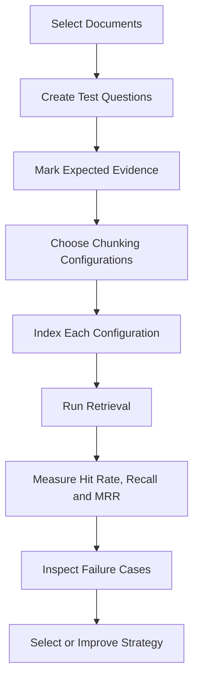

# 003 — Chunking

**Course:** 03 — Knowledge Systems and RAG
**Module:** Module 09 — RAG and Implementation
**Content Group:** RAG Concepts
**Roadmap Source:** RAG and Implementation / RAG Concepts
**Lesson Type:** RAG
**Order in Module:** 003
**Suggested Duration:** 26 minutes

---

## 1. Overview

**Chunking** is the process of splitting a document into smaller units before generating embeddings and storing them in a vector database.

In a Retrieval-Augmented Generation system, an entire document is usually too large and too broad to retrieve as a single unit. Instead, the system divides the document into chunks such as:

* Paragraphs
* Sections
* Pages
* Sentences
* Code functions
* Table rows
* Transcript segments

Each chunk is embedded independently and stored with metadata. When a user asks a question, the retrieval system searches for the chunks that are most relevant to the query.

```text
Large document
      ↓
Smaller meaningful chunks
      ↓
Embeddings
      ↓
Vector database
      ↓
Relevant context for the LLM
```

Chunking strongly affects:

* Retrieval accuracy
* Answer completeness
* Citation quality
* Context-window usage
* Embedding cost
* Generation latency
* Hallucination risk

A strong embedding model cannot fully compensate for poorly constructed chunks.

---

## 2. Learning Objectives

By the end of this lesson, you should be able to:

* Explain chunking in your own words.
* Describe where chunking belongs in a RAG pipeline.
* Compare common chunking strategies.
* Explain the relationship between chunk size, overlap, and retrieval quality.
* Preserve document meaning and metadata during chunk creation.
* Implement a basic chunking function.
* Evaluate chunking using a test question set.
* Identify common chunking failure cases.
* Apply chunking to a small PDF question-answering project.

---

## 3. Where Chunking Fits in a RAG Pipeline

Chunking happens during the **indexing pipeline**, before embeddings are generated.



The complete workflow contains two main stages.

### Indexing stage

```text
documents
    → load
    → parse
    → clean
    → chunk
    → embed
    → store
```

### Query stage

```text
user question
    → embed query
    → retrieve chunks
    → optionally rerank
    → build prompt
    → generate answer
    → return citations
```

Chunking is mainly an indexing operation, but its effects appear later during retrieval and generation.

---

## 4. Core Concepts

## 4.1 What Is a Chunk?

A chunk is a unit of information that can be:

1. Embedded
2. Indexed
3. Retrieved
4. Added to an LLM prompt
5. Connected to its original source

A chunk usually contains:

```json
{
  "chunk_id": "employee_handbook_p12_c03",
  "text": "Employees may request up to 20 days of annual leave...",
  "source": "employee_handbook.pdf",
  "page": 12,
  "heading": "Annual Leave Policy",
  "chunk_index": 3
}
```

The text is used for embedding and generation. The metadata supports filtering, traceability, debugging, and citations.

---

## 4.2 Why Not Embed the Entire Document?

Embedding an entire document as one vector creates several problems.

### Mixed meaning

A single document may discuss many unrelated topics. One embedding must represent all of them, which produces a weak semantic signal.

### Poor retrieval precision

A document may be selected because one small section is relevant, but the system must send a large amount of irrelevant content to the model.

### Context-window waste

The retrieved document may consume thousands of tokens even though the answer appears in only one paragraph.

### Weak citations

The system may cite a whole document instead of the exact page or section containing the evidence.

### Update complexity

Changing one paragraph may require re-embedding the entire document.

Chunking produces smaller and more focused retrieval units.

---

## 4.3 Chunk Size

Chunk size describes how much content is included in each chunk. It may be measured in:

* Characters
* Words
* Tokens
* Sentences
* Paragraphs
* Semantic units
* Pages

For LLM applications, token-based measurement is often more reliable because embedding models and generation models operate on tokens.

### Small chunks

Examples:

* 100–200 tokens
* One short paragraph
* One FAQ entry

Advantages:

* High retrieval precision
* Lower context usage
* Easier citation targeting
* Less irrelevant information

Disadvantages:

* May lose surrounding context
* May split definitions from explanations
* May retrieve incomplete evidence
* More chunks must be embedded and stored

### Large chunks

Examples:

* 800–1,500 tokens
* Several paragraphs
* A complete section

Advantages:

* Preserve more context
* Better for questions requiring explanation
* Fewer vectors to store
* Less likely to separate related facts

Disadvantages:

* Lower retrieval precision
* More irrelevant text in prompts
* Higher generation cost
* May exceed context limits when several chunks are retrieved

### General trade-off

```text
Smaller chunks
    → higher precision
    → lower context completeness

Larger chunks
    → higher context completeness
    → lower retrieval precision
```

There is no universally correct chunk size. The best size depends on the document type, user questions, embedding model, retrieval strategy, and context budget.

---

## 4.4 Chunk Overlap

Chunk overlap repeats part of one chunk at the beginning of the next chunk.

Suppose a document is divided into chunks of 200 tokens with an overlap of 40 tokens:

```text
Chunk 1: tokens 1–200
Chunk 2: tokens 161–360
Chunk 3: tokens 321–520
```

The repeated content helps preserve information that crosses a chunk boundary.

### Without overlap

```text
Chunk 1:
The authentication server creates a refresh token after...

Chunk 2:
...the access token expires. The client sends the refresh token...
```

Neither chunk contains the complete explanation.

### With overlap

```text
Chunk 1:
The authentication server creates a refresh token after login.
The access token expires after 15 minutes.

Chunk 2:
The access token expires after 15 minutes.
The client sends the refresh token to request a new access token.
```

The second chunk now contains enough context to answer a question about token renewal.

### Benefits of overlap

* Preserves context across boundaries
* Reduces incomplete retrieval
* Helps with long sentences and multi-paragraph explanations
* Improves recall for boundary-related questions

### Costs of overlap

* Creates duplicate content
* Increases embedding cost
* Increases vector database size
* May return near-duplicate search results
* Can waste prompt tokens

A useful starting point is an overlap of approximately **10–20% of the chunk size**, but it must be evaluated rather than treated as a fixed rule.

---

## 4.5 Chunk Boundaries

A chunk boundary is the point where one chunk ends and another begins.

Poor boundaries can destroy meaning.

### Bad boundary

```text
Chunk 1:
A vector database stores embeddings and supports nearest-

Chunk 2:
-neighbor search using similarity metrics such as cosine similarity.
```

### Better boundary

```text
Chunk 1:
A vector database stores embeddings and supports nearest-neighbor
search using similarity metrics such as cosine similarity.
```

Meaningful boundaries may include:

* Section headings
* Paragraph breaks
* Sentence endings
* List boundaries
* Function or class boundaries
* Table rows
* Speaker changes
* Timestamp ranges
* Markdown headings
* HTML elements

Whenever possible, split on natural document structure instead of arbitrary character positions.

---

## 5. Common Chunking Strategies

## 5.1 Fixed-Size Chunking

Fixed-size chunking splits content after a specified number of characters, words, or tokens.

```text
Document:
[500 tokens][500 tokens][500 tokens][500 tokens]
```

Example configuration:

```python
chunk_size = 500
chunk_overlap = 75
```

### Advantages

* Simple to implement
* Predictable chunk sizes
* Fast
* Works as a general baseline
* Easy to benchmark

### Limitations

* Can split sentences or paragraphs
* Ignores document structure
* May separate a heading from its content
* May produce chunks with incomplete meaning

Fixed-size chunking is useful as an initial baseline, but it is rarely the best final strategy for complex documents.

---

## 5.2 Recursive Character Chunking

Recursive chunking attempts to split text using a hierarchy of separators.

For example:

```python
separators = [
    "\n\n",  # paragraphs
    "\n",    # lines
    ". ",    # sentences
    " ",     # words
    ""       # characters
]
```

The system first tries to split by paragraph. If a paragraph is still too large, it splits by line, then sentence, then word.



### Advantages

* Preserves natural boundaries better than fixed-size splitting
* Works with many text formats
* Easy to configure
* Good default for general-purpose RAG systems

### Limitations

* Still based mainly on text length
* Does not understand document meaning
* Requires careful separator configuration
* Structure may be lost during PDF parsing

---

## 5.3 Sentence-Based Chunking

Sentence-based chunking groups complete sentences until the chunk reaches a target size.

```text
Sentence 1 + Sentence 2 + Sentence 3 → Chunk 1
Sentence 4 + Sentence 5             → Chunk 2
```

### Advantages

* Avoids cutting sentences in half
* Produces readable chunks
* Works well for articles, policies, and reports

### Limitations

* Sentence lengths vary significantly
* Sentence detection may fail for abbreviations or code
* A single sentence can still be too long
* Tables and bullet lists may not contain standard sentences

---

## 5.4 Paragraph-Based Chunking

Each paragraph becomes a chunk, or several short paragraphs are combined.

### Advantages

* Paragraphs usually represent coherent ideas
* Easy to explain and debug
* Citations can map naturally to document sections

### Limitations

* Some paragraphs are too short
* Some paragraphs are extremely long
* PDF parsers may incorrectly detect paragraph breaks
* A heading may be separated from the paragraph it describes

Paragraph-based chunking works best when the source content has clean structure.

---

## 5.5 Structure-Aware Chunking

Structure-aware chunking uses the document’s logical organization.

Examples:

* Markdown headings
* HTML sections
* PDF headings
* Word document styles
* JSON objects
* XML elements
* Code functions and classes
* Database records

A Markdown document may be split like this:

```markdown
# Authentication
## Access Tokens
## Refresh Tokens

# Authorization
## Roles
## Permissions
```

Each subsection can become a chunk while preserving its heading hierarchy.

```json
{
  "text": "Refresh tokens are used to obtain new access tokens...",
  "heading_path": [
    "Authentication",
    "Refresh Tokens"
  ]
}
```

### Advantages

* Preserves document meaning
* Produces better metadata
* Improves citations
* Works well for manuals and technical documentation

### Limitations

* Requires format-specific parsers
* Source structure may be inconsistent
* PDF structure is often difficult to recover
* Some sections remain too large and need secondary splitting

---

## 5.6 Semantic Chunking

Semantic chunking detects changes in meaning and creates a boundary when the topic changes.

A common approach is:

1. Split the document into sentences.
2. Generate an embedding for each sentence or sentence group.
3. Compare adjacent embeddings.
4. Create a new chunk when semantic similarity drops below a threshold.



### Advantages

* Better topic coherence
* Avoids arbitrary boundaries
* Useful for long narrative or analytical documents

### Limitations

* More expensive during indexing
* Requires threshold tuning
* Can create irregular chunk sizes
* Results depend on the embedding model
* Harder to debug than deterministic splitting

Semantic chunking can improve retrieval, but it should be compared against simpler baselines.

---

## 5.7 Parent–Child Chunking

Parent–child chunking stores small chunks for retrieval but returns a larger parent section to the LLM.

```text
Parent section: 1,200 tokens
├── Child chunk 1: 200 tokens
├── Child chunk 2: 200 tokens
├── Child chunk 3: 200 tokens
└── Child chunk 4: 200 tokens
```

The retrieval system searches over the small child chunks. When a child chunk matches, the system loads its larger parent section.

### Why use it?

Small chunks improve retrieval precision, while large parent chunks preserve context.


### Advantages

* Combines precise retrieval with complete context
* Useful for complex documents
* Reduces boundary-related failures

### Limitations

* More complicated storage model
* Parent sections may add irrelevant text
* Requires parent-child identifiers
* Deduplication may be necessary

---

## 5.8 Sliding-Window Chunking

Sliding-window chunking creates chunks using a fixed window that moves through the document.

```text
Window size: 400 tokens
Step size:   300 tokens

Chunk 1: tokens 1–400
Chunk 2: tokens 301–700
Chunk 3: tokens 601–1000
```

This strategy is similar to fixed-size chunking with overlap.

It is useful when:

* The source has weak structure
* Information frequently crosses boundaries
* Recall is more important than storage efficiency

---

## 5.9 Document-Specific Chunking

Different content types require different chunking strategies.

| Content type            | Recommended boundary               |
| ----------------------- | ---------------------------------- |
| FAQ                     | One question-answer pair           |
| Technical documentation | Heading or subsection              |
| Legal document          | Clause, article, or section        |
| Academic paper          | Section, paragraph, or proposition |
| Source code             | Function, class, or module         |
| Chat transcript         | Conversation turn or topic segment |
| Video transcript        | Timestamped topic segment          |
| Product catalog         | One product record                 |
| Table                   | Row group with headers             |
| API documentation       | One endpoint or operation          |
| Email archive           | One message or thread segment      |

A production system may use multiple chunkers based on document type.

---

## 6. Metadata Preservation

Chunks should not be stored as plain text alone.

Useful metadata may include:

```json
{
  "chunk_id": "rag_guide_p07_c02",
  "document_id": "rag_guide",
  "source": "rag_guide.pdf",
  "title": "Building Production RAG Systems",
  "page": 7,
  "heading": "Chunking Strategies",
  "heading_path": [
    "Indexing Pipeline",
    "Chunking Strategies"
  ],
  "chunk_index": 2,
  "start_character": 3410,
  "end_character": 4285,
  "language": "en",
  "document_type": "technical_guide",
  "created_at": "2026-07-26"
}
```

Metadata supports:

* Page-level citations
* Source filtering
* Language filtering
* Access control
* Document updates
* Debugging
* Deduplication
* Reranking
* Hybrid search
* User-interface links

### Citation example

```text
Employees may carry over up to five unused leave days
into the next calendar year.

Source: Employee Handbook, page 18, “Annual Leave”
```

Without source and page metadata, the system cannot reliably generate this citation.

---

## 7. Adding Context to Chunks

A chunk may be difficult to understand without its heading or surrounding section.

### Original section

```markdown
## Refund Eligibility

Customers may request a refund within 30 days of purchase.
Digital products are not eligible after download.
```

### Weak chunk

```text
Digital products are not eligible after download.
```

The sentence lacks context. A better chunk includes the heading.

### Contextualized chunk

```text
Section: Refund Eligibility

Digital products are not eligible for a refund after download.
```

Context can be added through:

* Section titles
* Heading paths
* Document titles
* Table headers
* Speaker names
* Product names
* Parent summaries
* Automatically generated chunk descriptions

However, contextual information should remain accurate and should not overwhelm the original content.

---

## 8. Basic Implementation

The following example implements simple word-based chunking with overlap.

```python
from dataclasses import dataclass
from typing import Any


@dataclass
class Chunk:
    chunk_id: str
    text: str
    metadata: dict[str, Any]


def chunk_words(
    text: str,
    document_id: str,
    source: str,
    chunk_size: int = 200,
    chunk_overlap: int = 40,
) -> list[Chunk]:
    """Split text into overlapping word-based chunks."""

    if chunk_size <= 0:
        raise ValueError("chunk_size must be greater than zero")

    if chunk_overlap < 0:
        raise ValueError("chunk_overlap cannot be negative")

    if chunk_overlap >= chunk_size:
        raise ValueError("chunk_overlap must be smaller than chunk_size")

    words = text.split()

    if not words:
        return []

    step = chunk_size - chunk_overlap
    chunks: list[Chunk] = []

    for chunk_index, start in enumerate(range(0, len(words), step)):
        end = min(start + chunk_size, len(words))
        chunk_text = " ".join(words[start:end])

        chunk = Chunk(
            chunk_id=f"{document_id}_chunk_{chunk_index:04d}",
            text=chunk_text,
            metadata={
                "document_id": document_id,
                "source": source,
                "chunk_index": chunk_index,
                "start_word": start,
                "end_word": end,
            },
        )

        chunks.append(chunk)

        if end == len(words):
            break

    return chunks
```

### Example usage

```python
document_text = """
Chunking divides a document into smaller retrieval units.
Each unit can be embedded and stored in a vector database.
Chunk size and overlap affect retrieval quality.
Metadata enables citations and source filtering.
"""

chunks = chunk_words(
    text=document_text,
    document_id="chunking_lesson",
    source="chunking.md",
    chunk_size=20,
    chunk_overlap=5,
)

for chunk in chunks:
    print(chunk.chunk_id)
    print(chunk.text)
    print(chunk.metadata)
    print("-" * 40)
```

This implementation is useful for learning, but a production system should usually use token-aware and structure-aware splitting.

---

## 9. Recursive Chunking Example

The following simplified function preserves paragraphs whenever possible.

```python
def recursive_chunk_text(
    text: str,
    max_characters: int = 1_000,
) -> list[str]:
    separators = ["\n\n", "\n", ". ", " "]

    def split_part(part: str, separator_index: int) -> list[str]:
        if len(part) <= max_characters:
            return [part.strip()]

        if separator_index >= len(separators):
            return [
                part[index:index + max_characters].strip()
                for index in range(0, len(part), max_characters)
            ]

        separator = separators[separator_index]
        pieces = part.split(separator)

        chunks: list[str] = []
        current = ""

        for piece in pieces:
            candidate = (
                f"{current}{separator}{piece}"
                if current
                else piece
            )

            if len(candidate) <= max_characters:
                current = candidate
                continue

            if current:
                chunks.append(current.strip())

            if len(piece) > max_characters:
                chunks.extend(split_part(piece, separator_index + 1))
                current = ""
            else:
                current = piece

        if current:
            chunks.append(current.strip())

        return chunks

    return [
        chunk
        for chunk in split_part(text, 0)
        if chunk
    ]
```

A mature implementation should also:

* Count tokens instead of characters
* Add overlap
* Preserve headings
* Track character offsets
* Handle tables
* Remove repeated headers and footers
* Attach page metadata
* Support multiple languages

---

## 10. Chunking a PDF

PDF files are difficult because their visual layout does not always match their extracted text order.

A practical PDF indexing pipeline may look like this:



### Important PDF issues

* Repeated headers and footers
* Multi-column text
* Broken line wrapping
* Hyphenated words
* Scanned pages
* Tables converted into unstructured text
* Figures without descriptions
* Incorrect reading order
* Page boundaries splitting a section

### Page-aware metadata

```json
{
  "source": "company_policy.pdf",
  "page_start": 14,
  "page_end": 15,
  "heading": "Remote Work Policy"
}
```

A chunk may cross two pages. In that case, preserve both the start and end pages.

---

## 11. Chunking Tables

Tables should not always be flattened into ordinary paragraphs.

Consider this table:

| Plan       | Monthly price |   Storage |
| ---------- | ------------: | --------: |
| Basic      |           $10 |     50 GB |
| Pro        |           $25 |    500 GB |
| Enterprise |        Custom | Unlimited |

A weak extraction may produce:

```text
Basic 10 50 Pro 25 500 Enterprise Custom Unlimited
```

This loses column relationships.

A better chunk representation is:

```text
Pricing Plans

Plan: Basic
Monthly price: $10
Storage: 50 GB

Plan: Pro
Monthly price: $25
Storage: 500 GB

Plan: Enterprise
Monthly price: Custom
Storage: Unlimited
```

The table title and column headers should be included in every relevant chunk.

---

## 12. Chunking Source Code

Source code should usually be split by logical programming units.

Recommended boundaries include:

* Function
* Method
* Class
* Module
* Interface
* Configuration section

### Weak code chunking

```text
First 500 characters
Next 500 characters
Next 500 characters
```

This may split a function in the middle.

### Better code chunk

```python
def calculate_invoice_total(items, tax_rate):
    subtotal = sum(item.price * item.quantity for item in items)
    tax = subtotal * tax_rate
    return subtotal + tax
```

Useful code metadata:

```json
{
  "repository": "billing-service",
  "file_path": "src/invoices/calculator.py",
  "language": "python",
  "symbol": "calculate_invoice_total",
  "symbol_type": "function",
  "start_line": 42,
  "end_line": 46
}
```

For code RAG, structure-aware parsing with an abstract syntax tree is often better than plain text splitting.

---

## 13. Choosing Chunk Size

Start by asking what type of questions the system must answer.

### Fact lookup

Example:

> How many annual leave days are employees allowed?

Smaller chunks often work well because the answer appears in a short policy statement.

### Explanation

Example:

> Explain how the company’s leave approval process works.

Larger chunks may be necessary because the answer requires several related steps.

### Comparison

Example:

> Compare the Basic and Pro subscription plans.

The chunk must include both plans or retrieval must return multiple compatible chunks.

### Multi-hop reasoning

Example:

> Which employees qualify for remote work and what equipment can they request?

The answer may require retrieving evidence from multiple sections.

A reasonable experimental starting point for general text is:

```yaml
chunk_size: 400-800 tokens
chunk_overlap: 50-150 tokens
top_k: 4-8
```

These values are starting hypotheses, not universal recommendations.

---

## 14. Retrieval Quality and Chunking

Chunking should be evaluated through retrieval behavior, not visual appearance alone.

Suppose the expected answer is found in chunk `policy_p18_c02`.

The retrieval result is:

```text
Rank 1: policy_p04_c01
Rank 2: policy_p18_c02
Rank 3: policy_p11_c03
```

The correct chunk appears in the top three results, so the retrieval is successful for `top_k = 3`.

Useful retrieval metrics include:

### Hit Rate at K

Measures whether at least one relevant chunk appears in the top `K` results.

```text
Hit Rate@K =
questions with a relevant chunk in top K
────────────────────────────────────────
total questions
```

### Recall at K

Measures how many relevant chunks were retrieved.

```text
Recall@K =
number of relevant chunks retrieved
────────────────────────────────────
total number of relevant chunks
```

### Mean Reciprocal Rank

Rewards systems that rank the first relevant chunk highly.

```text
MRR = average of 1 / rank_of_first_relevant_result
```

Examples:

* Relevant chunk ranked first: score `1.0`
* Relevant chunk ranked second: score `0.5`
* Relevant chunk ranked fifth: score `0.2`

### Context precision

Measures how much of the retrieved context is actually relevant.

Large chunks may improve recall while reducing context precision.

---

## 15. Evaluation Workflow

Use a controlled experiment rather than selecting chunk settings by intuition.



### Example configurations

| Experiment |               Chunk size | Overlap | Strategy     |
| ---------- | -----------------------: | ------: | ------------ |
| A          |               250 tokens |      40 | Recursive    |
| B          |               500 tokens |      75 | Recursive    |
| C          |               800 tokens |     120 | Recursive    |
| D          |                 Variable |    None | Semantic     |
| E          | 200 child / 1,000 parent |      30 | Parent–child |

Keep the following components fixed during the experiment:

* Embedding model
* Test questions
* Similarity metric
* Retrieval `top_k`
* Document set

This isolates the effect of chunking.

---

## 16. Demo Workflow

```text
documents
    → parse
    → clean
    → chunk
    → embed
    → store
    → retrieve
    → rerank
    → prompt with context
    → answer with citations
```

### Example input document

```text
Annual Leave Policy

Full-time employees receive 20 days of paid annual leave each year.
A maximum of five unused days may be carried into the following year.
Leave requests longer than five consecutive days require manager approval.
```

### Possible chunks

#### Chunk 1

```text
Section: Annual Leave Policy

Full-time employees receive 20 days of paid annual leave each year.
A maximum of five unused days may be carried into the following year.
```

#### Chunk 2

```text
Section: Annual Leave Policy

A maximum of five unused days may be carried into the following year.
Leave requests longer than five consecutive days require manager approval.
```

### User query

```text
How many unused leave days can be carried over?
```

### Expected retrieval

```text
Chunk 1 or Chunk 2
```

### Expected answer

```text
Employees may carry over a maximum of five unused annual leave days
into the following year.

Source: Annual Leave Policy
```

---

## 17. Failure Cases

## 17.1 Chunk Too Small

### Document

```text
Employees may carry over up to five unused annual leave days.
The carryover days must be used before March 31.
```

### Poor chunks

```text
Chunk 1: Employees may carry over.
Chunk 2: Up to five unused annual leave days.
Chunk 3: The carryover days must be used.
Chunk 4: Before March 31.
```

A query about the complete carryover policy may retrieve only part of the answer.

### Improvement

Use sentence or paragraph boundaries and increase the chunk size.

---

## 17.2 Chunk Too Large

A 3,000-token chunk contains:

* Annual leave
* Sick leave
* Parental leave
* Remote work
* Travel reimbursement

A question about sick leave retrieves the entire section, which wastes prompt space and may confuse the model.

### Improvement

Split by policy heading and subsection.

---

## 17.3 Missing Heading Context

### Chunk

```text
The maximum duration is 30 days.
```

The chunk does not explain whether 30 days refers to leave, account retention, refunds, or another policy.

### Improvement

```text
Section: Refund Request Window

The maximum duration for submitting a refund request is 30 days.
```

---

## 17.4 Missing Metadata

The system retrieves the correct text but stores only:

```json
{
  "text": "The maximum refund period is 30 days."
}
```

The application cannot show the source file, page, or section.

### Improvement

Store source and location metadata during ingestion.

---

## 17.5 Excessive Overlap

Using an 800-token chunk with 700 tokens of overlap creates nearly identical chunks.

Possible result:

```text
Rank 1: Chunk 10
Rank 2: Chunk 11
Rank 3: Chunk 12
Rank 4: Chunk 13
```

All results contain almost the same information, reducing retrieval diversity.

### Improvement

Reduce overlap or apply deduplication and maximal marginal relevance.

---

## 17.6 Ignoring Document Type

Using paragraph chunking for a CSV product catalog may combine multiple products into one chunk.

### Improvement

Use one product record per chunk and preserve field names.

---

## 17.7 Evaluating Only the Final Answer

A correct final answer does not prove that chunking works well. The LLM may answer from prior knowledge rather than retrieved evidence.

### Improvement

Inspect:

* Retrieved chunk IDs
* Similarity scores
* Expected evidence
* Citation correctness
* Unsupported claims
* Retrieval failures

---

## 18. Practical Exercise

## Objective

Build and evaluate a small chunking pipeline using 5–10 documents.

### Suggested documents

Choose one small collection:

* Product manuals
* University regulations
* Company policies
* Technical documentation
* Research article summaries
* Course notes
* Public reports

### Step 1: Prepare the documents

For each document:

* Extract the text
* Remove repeated headers and footers
* Preserve page numbers
* Preserve section headings
* Assign a stable document ID

### Step 2: Create test questions

Write 10–20 questions covering:

* Direct fact lookup
* Definitions
* Comparisons
* Multi-section questions
* Boundary-related information
* Questions with no answer in the documents

Example:

```json
{
  "question": "How many leave days may be carried over?",
  "expected_source": "employee_handbook.pdf",
  "expected_page": 18,
  "expected_text": "A maximum of five unused days..."
}
```

### Step 3: Compare chunking configurations

Test at least three configurations.

```yaml
configuration_a:
  strategy: recursive
  chunk_size: 250
  chunk_overlap: 40

configuration_b:
  strategy: recursive
  chunk_size: 500
  chunk_overlap: 75

configuration_c:
  strategy: recursive
  chunk_size: 800
  chunk_overlap: 120
```

### Step 4: Generate embeddings

For every chunk:

* Generate an embedding
* Store its text
* Store its metadata
* Store its embedding vector

### Step 5: Run retrieval

For each test question:

1. Generate the query embedding.
2. Retrieve the top five chunks.
3. Record the chunk IDs.
4. Record similarity scores.
5. Check whether the expected evidence appears.

### Step 6: Record the results

| Question | Expected chunk | Top-1   | Top-3 hit | Top-5 hit | Notes                          |
| -------- | -------------- | ------- | --------- | --------- | ------------------------------ |
| Q1       | p18_c02        | p18_c02 | Yes       | Yes       | Correct                        |
| Q2       | p21_c01        | p09_c03 | Yes       | Yes       | Relevant chunk ranked third    |
| Q3       | p07_c04        | p13_c02 | No        | No        | Heading separated from content |

### Step 7: Analyze failures

For every failed question, classify the cause:

* Chunk too small
* Chunk too large
* Boundary problem
* Missing metadata
* Parsing problem
* Embedding weakness
* Query ambiguity
* Wrong retrieval configuration
* Information spread across multiple chunks
* Answer not present in the documents

### Step 8: Generate cited answers

Pass only retrieved chunks to the LLM and require citations.

Example prompt:

```text
Answer the question using only the provided context.

Requirements:
1. Do not use outside knowledge.
2. Cite the source and page for each factual claim.
3. If the answer is not supported by the context, say:
   "The provided documents do not contain enough information."

Question:
{question}

Context:
{retrieved_chunks}
```

---

## 19. Suggested Project Structure

```text
chunking-demo/
├── data/
│   ├── raw/
│   └── processed/
├── src/
│   ├── loaders.py
│   ├── cleaners.py
│   ├── chunkers.py
│   ├── embeddings.py
│   ├── vector_store.py
│   ├── retrieval.py
│   └── evaluation.py
├── tests/
│   └── questions.json
├── results/
│   ├── retrieval_results.json
│   └── chunking_report.md
├── app.py
├── requirements.txt
└── README.md
```

---

## 20. Production Checklist

### Parsing

* [ ] Text order is correct.
* [ ] Repeated headers and footers are removed.
* [ ] Tables remain understandable.
* [ ] Page numbers are preserved.
* [ ] Scanned documents use OCR when necessary.
* [ ] Language and encoding are detected correctly.

### Chunking

* [ ] Chunk size is measured in tokens.
* [ ] Natural boundaries are preferred.
* [ ] Headings are attached to their content.
* [ ] Overlap is controlled.
* [ ] Very small chunks are merged when appropriate.
* [ ] Very large sections are recursively split.
* [ ] Different document types use suitable chunkers.

### Metadata

* [ ] Every chunk has a stable ID.
* [ ] Every chunk stores its source.
* [ ] Page or line location is preserved.
* [ ] Heading hierarchy is preserved.
* [ ] Access-control metadata is attached.
* [ ] Parent-child relationships are stored when used.

### Retrieval evaluation

* [ ] A representative test question set exists.
* [ ] Expected evidence is labeled.
* [ ] Hit Rate@K is measured.
* [ ] Recall@K is measured.
* [ ] MRR or ranking quality is measured.
* [ ] Failure cases are reviewed manually.
* [ ] Chunking configurations are compared under the same conditions.

### Generation

* [ ] The prompt requires evidence-based answers.
* [ ] Citations refer to retrieved metadata.
* [ ] Unsupported answers are rejected.
* [ ] Duplicate context is removed.
* [ ] Context stays within the token budget.
* [ ] The system clearly handles “not found” cases.

---

## 21. Common Mistakes

### Selecting chunk sizes without testing

A chunk size that sounds reasonable may perform poorly for the real question set.

### Using one chunking strategy for every source

PDFs, code, tables, transcripts, and product records have different structures.

### Losing document structure during parsing

Chunking cannot preserve headings if the parser has already removed them.

### Adding too much overlap

More overlap does not automatically mean better retrieval.

### Storing chunks without metadata

Correct retrieval is not enough if the application cannot produce citations.

### Measuring only answer fluency

A fluent answer may still be unsupported or based on the wrong chunk.

### Ignoring negative questions

The evaluation set should include questions whose answers do not exist in the documents.

### Changing multiple variables at once

If the chunk size, embedding model, reranker, and top-k value all change together, it becomes difficult to identify what improved the system.

---

## 22. Key Design Trade-Offs

| Decision                 | Benefit                        | Cost                             |
| ------------------------ | ------------------------------ | -------------------------------- |
| Smaller chunks           | More precise retrieval         | Less surrounding context         |
| Larger chunks            | Better context preservation    | More irrelevant text             |
| More overlap             | Better boundary coverage       | More duplication and cost        |
| Semantic chunking        | Better topic coherence         | More indexing complexity         |
| Structure-aware chunking | Better meaning and citations   | Format-specific implementation   |
| Parent–child retrieval   | Precision plus broader context | More storage and retrieval logic |
| More metadata            | Better filtering and citations | Larger indexing pipeline         |
| Higher top-k             | Better recall                  | More prompt noise and cost       |

The goal is not to maximize one variable. The goal is to create the best balance for the target application.

---

## 23. Questions to Ask Before Production

Before finalizing a chunking strategy, ask:

1. What kinds of documents will be indexed?
2. What questions will users ask?
3. Are answers usually short facts or long explanations?
4. Does information frequently cross paragraph or page boundaries?
5. Are page-level citations required?
6. Do users need source links?
7. Are tables, images, or code important?
8. Does the system support multiple languages?
9. How much context can the generation model accept?
10. How frequently are documents updated?
11. Are access-control filters required?
12. How will retrieval quality be measured?

These questions are more useful than searching for a universal “best chunk size.”

---

## 24. Completion Checklist

* [ ] I can explain chunking in one or two minutes.
* [ ] I understand where chunking belongs in a RAG pipeline.
* [ ] I can explain chunk size and chunk overlap.
* [ ] I can compare fixed-size, recursive, semantic, and structure-aware chunking.
* [ ] I know why chunk boundaries affect meaning.
* [ ] I can preserve source, page, and heading metadata.
* [ ] I have implemented a small chunking demo.
* [ ] I have created a retrieval test question set.
* [ ] I have recorded top-k retrieval results.
* [ ] I have evaluated citations and failure cases.
* [ ] I have documented at least one limitation or open question.

---

## 25. Related Outcome

Build Retrieval-Augmented Generation applications that answer questions using private documents and verifiable citations.

After completing this lesson, you should be able to design the document segmentation stage of a RAG indexing pipeline and evaluate whether its chunks support accurate retrieval.

---

## 26. Related Project

### Project 8 — PDF Q&A RAG Application with Page and Chunk Citations

Build an application that:

1. Accepts one or more PDF files.
2. Extracts and cleans page-level text.
3. Splits the documents into meaningful chunks.
4. Preserves source, page, and heading metadata.
5. Generates embeddings.
6. Stores chunks in a vector database.
7. Retrieves relevant chunks for a question.
8. Generates an answer using only retrieved evidence.
9. Displays page-level and chunk-level citations.
10. Records retrieval failures for evaluation.

### Suggested API

```http
POST /documents/upload
POST /documents/index
POST /query
GET  /documents/{document_id}/chunks
GET  /evaluations/retrieval
```

### Example response

```json
{
  "answer": "Employees may carry over up to five unused annual leave days.",
  "citations": [
    {
      "source": "employee_handbook.pdf",
      "page": 18,
      "heading": "Annual Leave Policy",
      "chunk_id": "employee_handbook_p18_c02"
    }
  ],
  "retrieval": {
    "top_k": 5,
    "returned_chunks": 5
  }
}
```

---

## 27. Summary

Chunking divides documents into smaller units that can be embedded, retrieved, and added to an LLM prompt.

The most important principles are:

* Preserve meaningful boundaries.
* Choose chunk size based on real user questions.
* Use overlap carefully.
* Keep headings and surrounding context.
* Store source, page, and section metadata.
* Use document-specific chunking when necessary.
* Evaluate retrieval with a labeled question set.
* Inspect failure cases instead of relying on intuition.

```text
Good chunking
    → better retrieval
    → cleaner context
    → stronger citations
    → fewer unsupported answers
```

Chunking is not only a preprocessing detail. It is one of the most important design decisions in a production RAG system.
