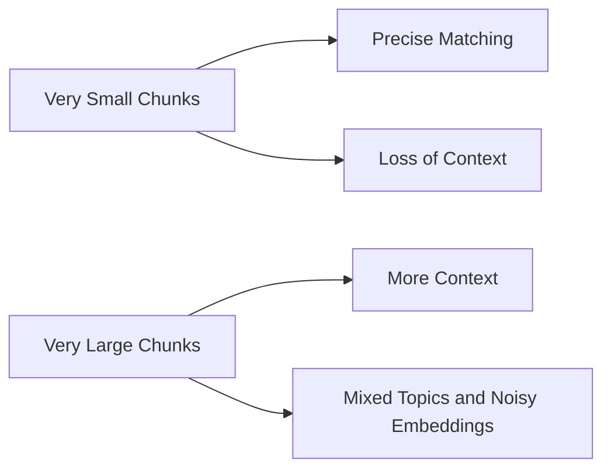
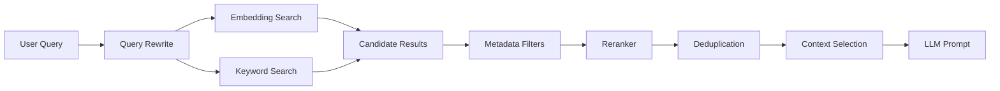
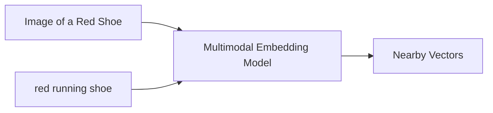
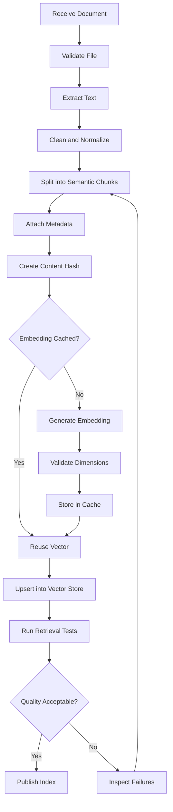

# 004 — Embeddings

**Course:** 03 — Knowledge Systems and RAG
**Module:** Module 09 — RAG and Implementation
**Content Group:** RAG Concepts
**Roadmap Source:** RAG and Implementation / RAG Concepts
**Lesson Type:** RAG
**Order in Module:** 004
**Suggested Duration:** 26 minutes

---

## 1. Summary

This lesson explains **embeddings** in the context of modern AI engineering.

An embedding converts data such as text, images, audio, users, or products into a numerical vector. Items with similar meanings are represented by vectors that are close together in the embedding space.

Embeddings are a core component of:

* Retrieval-Augmented Generation systems
* Semantic search
* Recommendation systems
* Document clustering
* Duplicate detection
* Classification
* Anomaly detection
* Multimodal search
* Agent memory systems

In a RAG application, embeddings allow the system to retrieve document chunks based on **meaning**, not only exact keyword matches.

---

## 2. Learning Objectives

By the end of this lesson, you should be able to:

* Explain embeddings in your own words.
* Describe how text becomes a numerical vector.
* Understand how semantic similarity is calculated.
* Identify where embeddings appear in a RAG workflow.
* Distinguish embedding models from generative language models.
* Store and search embeddings in a vector database.
* Evaluate embedding and retrieval quality using a test dataset.
* Build a small semantic-search or RAG demonstration.

---

## 3. What Is an Embedding?

An **embedding** is a numerical representation of an item.

For example, a text embedding model may convert the sentence:

```text
How can I reset my password?
```

into a vector similar to:

```text
[0.021, -0.184, 0.537, 0.091, ..., -0.242]
```

The vector may contain hundreds or thousands of dimensions.

Each number does not usually have an obvious human-readable meaning. However, the complete vector captures useful semantic information about the input.

Conceptually:

```text
Input data
   ↓
Embedding model
   ↓
Numerical vector
```

For text:

```text
"How can I reset my password?"
                ↓
        Embedding model
                ↓
[0.021, -0.184, 0.537, ..., -0.242]
```

The important property is that semantically related inputs usually produce nearby vectors.

---

## 4. Intuition: A Map of Meaning

Imagine an embedding space as a map.

On a geographic map, nearby coordinates represent nearby physical locations. In an embedding space, nearby vectors represent related meanings.

For example:

```text
                        Transportation

              bicycle
                 ●
                       ● motorcycle

        ● bus
                         ● car
                               ● truck


     ● apple
              ● banana

                        Fruit
```

The actual embedding space has many more dimensions than a two-dimensional diagram, but the basic idea is the same.

Sentences such as:

```text
I need to change my password.
```

and:

```text
How do I update my login credentials?
```

may be placed close together even though they share few exact words.

By contrast:

```text
What is the weather tomorrow?
```

would likely be farther away.

---

## 5. Embeddings vs Tokens

Tokens and embeddings are related but different concepts.

### Tokens

A tokenizer divides text into smaller units:

```text
"Embedding models are useful"
```

may become:

```text
["Embedding", " models", " are", " useful"]
```

Tokens are discrete identifiers used by a model.

### Embeddings

An embedding converts an entire input or token into a dense numerical vector:

```text
"Embedding models are useful"
              ↓
[0.14, -0.08, 0.63, ..., 0.21]
```

A simple distinction is:

| Concept         | Purpose                                                       |
| --------------- | ------------------------------------------------------------- |
| Token           | Represents a discrete piece of text                           |
| Token ID        | Integer assigned to a token                                   |
| Token embedding | Vector representation inside a model                          |
| Text embedding  | Vector representing a sentence, paragraph, chunk, or document |

In RAG systems, the term **embedding** usually refers to a vector representing a complete query or document chunk.

---

## 6. Embedding Models vs Generative Models

An embedding model and a generative language model perform different jobs.

| Embedding model                    | Generative model                       |
| ---------------------------------- | -------------------------------------- |
| Converts input into a vector       | Generates text or other content        |
| Used for retrieval and similarity  | Used for reasoning and answering       |
| Returns numbers                    | Returns natural-language output        |
| Usually cheaper per request        | Usually more computationally expensive |
| Does not directly answer questions | Can produce complete answers           |

A typical RAG system uses both:

```text
Embedding model
    → Find relevant information

Generative model
    → Use that information to answer
```

### Important distinction

An embedding model does not normally explain why two texts are related. It only produces vector representations that make similarity comparison possible.

---

## 7. Embeddings in a RAG Pipeline

Embeddings connect document processing with retrieval.


The pipeline has two major phases.

### 7.1 Indexing Phase

The system prepares documents before users submit questions.

```text
documents
    → parsing
    → cleaning
    → chunking
    → embedding
    → vector storage
```

Each stored record normally contains:

```json
{
  "chunk_id": "handbook-page-12-chunk-03",
  "text": "Employees may request remote work...",
  "embedding": [0.021, -0.184, 0.537],
  "metadata": {
    "source": "employee_handbook.pdf",
    "page": 12,
    "section": "Remote Work Policy"
  }
}
```

### 7.2 Query Phase

When a user asks a question:

```text
question
    → query embedding
    → vector search
    → top matching chunks
    → prompt with context
    → generated answer
```

The query and document chunks must be represented in a compatible vector space.

---

## 8. Semantic Search

Traditional keyword search looks for shared words.

Suppose a document contains:

```text
Staff members may work away from the office for two days each week.
```

The user asks:

```text
What is the company's remote-work policy?
```

A keyword-only search may struggle because the document does not contain the phrase `remote work`.

Semantic search can still recognize that:

```text
work away from the office
```

and:

```text
remote-work policy
```

express related ideas.

### Keyword Search

```text
Query words
    ↓
Find documents containing the same words
```

### Semantic Search

```text
Query meaning
    ↓
Convert to vector
    ↓
Find nearby document vectors
```

The two methods can also be combined in **hybrid search**.

---

## 9. Measuring Vector Similarity

After generating embeddings, the system needs a way to compare them.

Common similarity measures include:

* Cosine similarity
* Dot product
* Euclidean distance

---

## 9.1 Cosine Similarity

Cosine similarity measures the angle between two vectors.

[
\text{cosine similarity}(A,B)
=============================

\frac{A \cdot B}
{|A||B|}
]

Interpretation:

| Cosine similarity | General interpretation       |
| ----------------: | ---------------------------- |
|      Close to `1` | Very similar direction       |
|      Close to `0` | Weakly related or orthogonal |
|     Close to `-1` | Opposite direction           |

The exact score distribution depends on the embedding model, so a universal similarity threshold should not be assumed.

### Simplified Python Example

```python
from typing import Sequence
import math


def cosine_similarity(
    vector_a: Sequence[float],
    vector_b: Sequence[float],
) -> float:
    if len(vector_a) != len(vector_b):
        raise ValueError("Vectors must have the same dimensions.")

    dot_product = sum(a * b for a, b in zip(vector_a, vector_b))

    magnitude_a = math.sqrt(sum(a * a for a in vector_a))
    magnitude_b = math.sqrt(sum(b * b for b in vector_b))

    if magnitude_a == 0 or magnitude_b == 0:
        raise ValueError("Cosine similarity is undefined for zero vectors.")

    return dot_product / (magnitude_a * magnitude_b)


query_vector = [0.2, 0.8, 0.1]
document_vector = [0.3, 0.7, 0.2]

score = cosine_similarity(query_vector, document_vector)
print(f"Similarity: {score:.4f}")
```

---

## 9.2 Dot Product

The dot product is calculated as:

[
A \cdot B = \sum_{i=1}^{n} A_iB_i
]

It is often efficient for vector search.

When vectors are normalized to length `1`, the dot product and cosine similarity produce equivalent rankings.

---

## 9.3 Euclidean Distance

Euclidean distance measures the straight-line distance between vectors:

[
d(A,B)
======

\sqrt{\sum_{i=1}^{n}(A_i-B_i)^2}
]

With Euclidean distance:

```text
smaller distance = greater similarity
```

With cosine similarity or dot product:

```text
larger score = greater similarity
```

Always confirm which metric an embedding model and vector database expect.

---

## 10. A Minimal Retrieval Example

Assume that a system contains four chunks:

```python
documents = [
    {
        "id": "doc-1",
        "text": "Employees receive 15 days of annual leave.",
    },
    {
        "id": "doc-2",
        "text": "Passwords must contain at least 12 characters.",
    },
    {
        "id": "doc-3",
        "text": "Remote work is available two days per week.",
    },
    {
        "id": "doc-4",
        "text": "Expense reports must be submitted before Friday.",
    },
]
```

The indexing process is:

```python
for document in documents:
    document["embedding"] = embedding_model.embed(document["text"])
    vector_database.insert(document)
```

The query process is:

```python
question = "How often can employees work from home?"

query_vector = embedding_model.embed(question)

results = vector_database.search(
    vector=query_vector,
    top_k=3,
)
```

A possible result is:

```text
1. Remote work is available two days per week.
2. Employees receive 15 days of annual leave.
3. Expense reports must be submitted before Friday.
```

The first result should have the highest similarity score.

---

## 11. Provider-Agnostic Embedding Interface

A production application should avoid tightly coupling business logic to one embedding provider.

```python
from typing import Protocol, Sequence


class EmbeddingProvider(Protocol):
    def embed_text(self, text: str) -> Sequence[float]:
        """Convert one text input into an embedding vector."""
        ...

    def embed_batch(
        self,
        texts: Sequence[str],
    ) -> Sequence[Sequence[float]]:
        """Convert multiple text inputs into embedding vectors."""
        ...
```

The indexing service can depend on the interface:

```python
class DocumentIndexer:
    def __init__(
        self,
        embedding_provider: EmbeddingProvider,
        vector_store,
    ) -> None:
        self.embedding_provider = embedding_provider
        self.vector_store = vector_store

    def index_chunks(self, chunks: list[dict]) -> None:
        texts = [chunk["text"] for chunk in chunks]
        vectors = self.embedding_provider.embed_batch(texts)

        for chunk, vector in zip(chunks, vectors):
            self.vector_store.upsert(
                record_id=chunk["id"],
                vector=vector,
                text=chunk["text"],
                metadata=chunk["metadata"],
            )
```

This design makes it easier to:

* Change embedding providers.
* Test the indexing pipeline.
* Add retries and caching.
* Compare embedding models.
* Support local and hosted models.
* Control cost and latency.

---

## 12. Choosing an Embedding Model

An embedding model should be selected based on the application rather than only benchmark scores.

Important dimensions include:

### 12.1 Domain

A general model may work well for common language but perform poorly on:

* Legal documents
* Medical terminology
* Source code
* Scientific papers
* Financial records
* Product catalogs

A domain-specific model may produce better retrieval results.

### 12.2 Language Support

Check whether the model supports:

* English
* Vietnamese
* Multiple languages
* Cross-language retrieval

Cross-language retrieval means that a query in one language can retrieve a document written in another language.

Example:

```text
Vietnamese query:
"Chính sách nghỉ phép là gì?"

English document:
"Employees receive 15 days of annual leave."
```

### 12.3 Input Length

Every embedding model has a maximum input length.

If a chunk is too long, it may be:

* Rejected
* Truncated
* Poorly represented
* Dominated by unrelated information

### 12.4 Vector Dimensions

Embedding size affects:

* Storage
* Network transfer
* Search speed
* Memory usage
* Index construction
* Retrieval quality

For `N` vectors with `D` dimensions stored as 32-bit floating-point numbers, the approximate raw vector storage is:

[
\text{Storage}
==============

N \times D \times 4\text{ bytes}
]

For example:

```text
1,000,000 vectors
× 1,024 dimensions
× 4 bytes
≈ 4.1 GB of raw vector data
```

This estimate excludes metadata and index overhead.

### 12.5 Latency and Throughput

Consider:

* Single-query latency
* Batch embedding throughput
* Rate limits
* Concurrent requests
* Local hardware requirements
* Cold-start time

### 12.6 Cost

Embedding cost depends on factors such as:

* Number of tokens
* Number of documents
* Re-indexing frequency
* Query volume
* Batch size
* Provider pricing

Store embeddings whenever possible instead of regenerating unchanged document vectors.

---

## 13. Embeddings and Chunking

Embedding quality cannot be separated from chunk quality.

A model generates one vector for each chunk. If a chunk contains many unrelated topics, the vector becomes an approximate representation of all of them.

Consider this chunk:

```text
The company allows two remote-work days per week.
The cafeteria opens at 7:00 AM.
Passwords must be changed every 90 days.
Travel expenses require manager approval.
```

A single embedding must represent four unrelated subjects.

A better approach is to create separate chunks:

```text
Chunk 1:
The company allows two remote-work days per week.

Chunk 2:
The cafeteria opens at 7:00 AM.

Chunk 3:
Passwords must be changed every 90 days.

Chunk 4:
Travel expenses require manager approval.
```

### Chunking Trade-Off



Good chunks should usually be:

* Semantically coherent
* Large enough to answer a question
* Small enough to represent one main topic
* Connected to useful metadata
* Compatible with the embedding model's input limit

---

## 14. Document Embeddings and Query Embeddings

Some models use the same embedding operation for documents and queries:

```python
query_vector = model.embed(question)
document_vector = model.embed(chunk)
```

Other models distinguish between retrieval roles:

```python
query_vector = model.embed_query(question)
document_vector = model.embed_document(chunk)
```

The distinction can help the model understand that:

* A query expresses an information need.
* A document contains a possible answer.

Follow the model's intended usage. Using the wrong mode may reduce retrieval quality.

---

## 15. Metadata Is Not an Embedding

The vector captures semantic information, but metadata provides structure and traceability.

A vector record should normally include fields such as:

```json
{
  "id": "policy-remote-work-page-12-chunk-2",
  "text": "Employees may work remotely...",
  "metadata": {
    "document_id": "employee-handbook-2026",
    "filename": "employee_handbook.pdf",
    "page": 12,
    "section": "Remote Work",
    "language": "en",
    "version": "2026-01",
    "access_level": "employee"
  }
}
```

Metadata is necessary for:

* Page-level citations
* Source links
* Permission filtering
* Version control
* Language filtering
* Tenant isolation
* Date filtering
* Debugging
* Deleting outdated records

### Retrieval with Metadata Filtering

```text
User query
   ↓
Query embedding
   ↓
Metadata filter:
- tenant_id = "company-a"
- language = "en"
- access_level in user permissions
   ↓
Vector similarity search
```

Never rely on vector similarity as an authorization mechanism.

---

## 16. Vector Databases

A vector database stores embeddings and supports similarity search.

Its responsibilities may include:

* Vector storage
* Nearest-neighbor search
* Metadata filtering
* Index management
* Upsert and deletion
* Namespace or tenant separation
* Replication and persistence

Conceptually:

```text
Vector database record
├── ID
├── Embedding vector
├── Original text
└── Metadata
```

A search request may look like:

```python
results = vector_store.search(
    vector=query_vector,
    top_k=5,
    filters={
        "language": "en",
        "document_version": "2026",
    },
)
```

A result may contain:

```json
{
  "id": "chunk-42",
  "score": 0.84,
  "text": "Employees may work remotely two days each week.",
  "metadata": {
    "source": "employee_handbook.pdf",
    "page": 12
  }
}
```

---

## 17. Exact vs Approximate Nearest-Neighbor Search

### Exact Search

Exact search compares the query against every stored vector.

Advantages:

* Produces exact nearest neighbors.
* Simple to understand.
* Useful for small datasets.

Disadvantages:

* Becomes expensive as the collection grows.
* May be too slow for production-scale retrieval.

### Approximate Nearest-Neighbor Search

Approximate nearest-neighbor search uses a specialized index to find likely close vectors without comparing every item.

Advantages:

* Faster for large datasets.
* Supports low-latency retrieval.
* Scales to large vector collections.

Disadvantages:

* May miss some true nearest neighbors.
* Requires index tuning.
* Uses additional memory or build time.

The trade-off is typically:

```text
Search speed ↔ Recall ↔ Memory usage
```

---

## 18. Top-K Retrieval

`top_k` determines how many chunks are returned.

```python
results = vector_store.search(
    vector=query_vector,
    top_k=5,
)
```

### Small `top_k`

Advantages:

* Less noise
* Smaller prompt
* Lower generation cost
* Faster downstream processing

Risks:

* Missing relevant evidence
* Insufficient context for multi-part questions

### Large `top_k`

Advantages:

* Higher chance of including relevant evidence
* More context for broad questions

Risks:

* Irrelevant chunks
* Larger prompts
* Higher cost
* More conflicting information
* Greater risk of distracting the language model

Do not select `top_k` only by intuition. Evaluate it with a retrieval test set.

---

## 19. Retrieval Is More Than Embedding Similarity

A production retrieval system often includes several stages:



Possible improvements include:

* Query rewriting
* Hybrid search
* Reranking
* Metadata filtering
* Parent-document retrieval
* Contextual chunking
* Deduplication
* Diversity selection
* Time-aware ranking
* Access-control filters

Embeddings are essential, but they are only one part of retrieval quality.

---

## 20. Dense, Sparse, and Hybrid Retrieval

### Dense Embeddings

Dense embeddings contain many floating-point values:

```text
[0.12, -0.51, 0.08, ..., 0.29]
```

They are effective for semantic similarity.

### Sparse Representations

Sparse representations contain many zero values and often preserve keyword-level signals.

They are useful for:

* Exact names
* Product codes
* Error messages
* Acronyms
* Rare terminology
* Identifiers

### Hybrid Retrieval

Hybrid retrieval combines dense semantic search with sparse keyword search.

```text
Semantic score
      +
Keyword score
      ↓
Combined ranking
```

This is useful when a query includes both meaning and exact terms.

Example:

```text
"How do I fix error AUTH-4012?"
```

The semantic meaning matters, but the exact code `AUTH-4012` may be critical.

---

## 21. Multimodal Embeddings

Embeddings are not limited to text.

A multimodal embedding model may place text and images in a shared vector space.



This enables applications such as:

* Text-to-image search
* Image-to-image similarity
* Product search
* Visual duplicate detection
* Video retrieval
* Audio search
* Multimodal RAG

Example:

```text
User query:
"Show diagrams containing a transformer architecture."

System:
Text embedding → search image embeddings → return matching diagrams
```

---

## 22. Embedding Versioning

Changing the embedding model is a data migration, not a simple configuration change.

Vectors generated by different embedding models are usually not directly comparable.

Do not mix them in the same search index unless the system explicitly supports that design.

Store version information:

```json
{
  "embedding_model": "embedding-model-v2",
  "embedding_dimensions": 1024,
  "embedding_version": "2026-07"
}
```

A migration may require:

```text
New model selected
    ↓
Create new index
    ↓
Re-embed all chunks
    ↓
Run evaluation
    ↓
Switch production traffic
    ↓
Retire old index
```

A safe rollout may use separate indexes:

```text
documents_embeddings_v1
documents_embeddings_v2
```

---

## 23. Embedding Caching

Document embeddings should normally be reused.

A useful cache key may include:

```text
hash(
    normalized_text
    + embedding_model
    + model_version
    + preprocessing_version
)
```

Example:

```python
import hashlib


def create_embedding_cache_key(
    text: str,
    model_name: str,
    preprocessing_version: str,
) -> str:
    normalized_text = " ".join(text.split())

    payload = (
        f"{model_name}:"
        f"{preprocessing_version}:"
        f"{normalized_text}"
    )

    return hashlib.sha256(payload.encode("utf-8")).hexdigest()
```

Caching reduces:

* Cost
* API calls
* Indexing time
* Repeated computation
* Provider rate-limit pressure

The cache must be invalidated when preprocessing or the embedding model changes.

---

## 24. Batch Embedding

Embedding documents one at a time can be inefficient.

Instead of:

```python
for chunk in chunks:
    vector = model.embed(chunk["text"])
```

use batches:

```python
batch_size = 64

for start in range(0, len(chunks), batch_size):
    batch = chunks[start : start + batch_size]
    texts = [chunk["text"] for chunk in batch]

    vectors = model.embed_batch(texts)

    for chunk, vector in zip(batch, vectors):
        vector_store.upsert(
            record_id=chunk["id"],
            vector=vector,
            text=chunk["text"],
            metadata=chunk["metadata"],
        )
```

Batching can improve throughput, but the ideal batch size depends on:

* Provider limits
* Input lengths
* Available memory
* Network latency
* GPU capacity
* Retry behavior

---

## 25. Evaluating Embedding Quality

Do not evaluate embeddings only by inspecting a few examples.

Create a **golden question set** containing:

* Test question
* Expected document
* Expected page or section
* Relevant chunk IDs
* Difficult negative examples
* Language
* Query category

Example:

```json
{
  "question": "How many remote-work days are allowed?",
  "expected_source": "employee_handbook.pdf",
  "expected_page": 12,
  "relevant_chunk_ids": [
    "handbook-page-12-chunk-02"
  ]
}
```

### Retrieval Metrics

Useful retrieval metrics include:

#### Hit Rate at K

Did at least one relevant chunk appear in the first `K` results?

[
\text{HitRate@K}
================

\frac{\text{Queries with a relevant result in top K}}
{\text{Total queries}}
]

#### Recall at K

What fraction of all relevant chunks appeared in the first `K` results?

[
\text{Recall@K}
===============

\frac{\text{Relevant chunks retrieved in top K}}
{\text{Total relevant chunks}}
]

#### Precision at K

What fraction of retrieved chunks were relevant?

[
\text{Precision@K}
==================

\frac{\text{Relevant chunks retrieved in top K}}
{K}
]

#### Mean Reciprocal Rank

How early did the first relevant result appear?

[
\text{MRR}
==========

\frac{1}{N}
\sum_{i=1}^{N}
\frac{1}{\text{rank of first relevant result}}
]

### Example Evaluation Table

| Question           | Expected chunk | Rank | Hit@3 | Hit@5 |
| ------------------ | -------------- | ---: | ----: | ----: |
| Remote-work policy | `chunk-12`     |    1 |   Yes |   Yes |
| Password length    | `chunk-31`     |    2 |   Yes |   Yes |
| Expense deadline   | `chunk-48`     |    6 |    No |    No |
| Annual leave       | `chunk-07`     |    3 |   Yes |   Yes |

---

## 26. Retrieval Evaluation vs Answer Evaluation

A RAG system has at least two separate quality layers.

### Layer 1: Retrieval Quality

Did the system retrieve the correct evidence?

```text
Question
   ↓
Retrieved chunks
   ↓
Are the correct chunks present?
```

### Layer 2: Generation Quality

Did the language model correctly use the evidence?

```text
Relevant chunks
   ↓
Generated answer
   ↓
Is the answer accurate and cited?
```

Possible failure combinations:

| Retrieval | Generation | Result                              |
| --------- | ---------- | ----------------------------------- |
| Good      | Good       | Correct grounded answer             |
| Good      | Poor       | Evidence found, but answer is wrong |
| Poor      | Good       | Model cannot answer reliably        |
| Poor      | Poor       | Complete RAG failure                |

Evaluate these layers separately. Otherwise, it is difficult to determine whether the embedding model, chunking strategy, reranker, prompt, or LLM caused the problem.

---

## 27. Common Failure Cases

### 27.1 Chunks Are Too Large

Symptoms:

* Many unrelated topics in one result
* Vague similarity scores
* Large prompts
* Poor citation precision

Solution:

* Split by headings or semantic boundaries.
* Reduce chunk size.
* Preserve parent-document relationships.

---

### 27.2 Chunks Are Too Small

Symptoms:

* Retrieved text lacks enough context.
* Answers require several neighboring chunks.
* Pronouns or references become unclear.

Solution:

* Add controlled overlap.
* Use sentence-aware chunking.
* Retrieve neighboring chunks.
* Use parent-child retrieval.

---

### 27.3 Missing Metadata

Symptoms:

* Cannot create citations.
* Cannot identify source pages.
* Cannot remove outdated content.
* Cannot enforce access control.

Solution:

Store source, page, section, version, language, tenant, and permissions during indexing.

---

### 27.4 Mixing Embedding Models

Symptoms:

* Unexpected similarity results
* Retrieval quality suddenly drops
* Some records are never retrieved

Solution:

* Store the embedding model version.
* Use separate indexes.
* Re-embed the complete collection during migration.

---

### 27.5 Query and Documents Use Different Preprocessing

Example:

```text
Documents:
lowercased, translated, and stripped of punctuation

Queries:
raw text with no normalization
```

Solution:

Use a documented and consistent preprocessing pipeline, while avoiding destructive transformations that remove meaningful information.

---

### 27.6 Exact Identifiers Are Missed

Examples:

* Invoice numbers
* Product SKUs
* Error codes
* Legal section numbers
* Employee IDs

Solution:

Use hybrid retrieval, metadata filters, or exact-match search in addition to dense embeddings.

---

### 27.7 Similarity Scores Are Treated as Probabilities

A similarity score of `0.80` does not automatically mean an 80% probability that the result is correct.

Solution:

* Calibrate thresholds using real evaluation data.
* Compare score distributions.
* Measure retrieval performance at different thresholds.

---

### 27.8 Evaluation Is Based on Intuition

Symptoms:

* The system appears correct during demonstrations.
* Small changes cause unnoticed regressions.
* Retrieval quality cannot be compared across versions.

Solution:

Create a fixed golden dataset and run it after changes to:

* Chunking
* Embedding models
* Metadata
* Vector indexes
* Query rewriting
* Reranking
* `top_k`

---

## 28. Security and Privacy Considerations

Embeddings are numerical representations, but they should not automatically be treated as anonymous or harmless.

A secure implementation should consider:

* Sensitive source documents
* Tenant isolation
* Access-control filters
* Data retention
* Encryption
* Provider data policies
* Deletion workflows
* Audit logging
* Prompt injection in retrieved content

### Authorization Must Happen During Retrieval

Incorrect:

```text
Search all company documents
    ↓
Retrieve confidential content
    ↓
Hide it later in the UI
```

Correct:

```text
Identify user permissions
    ↓
Apply metadata authorization filters
    ↓
Search only allowed vectors
    ↓
Generate answer from authorized content
```

The LLM should never receive unauthorized chunks.

---

## 29. Production Embedding Workflow



---

## 30. Observability

A production embedding pipeline should record:

### Indexing Metrics

* Number of documents processed
* Number of chunks created
* Average chunk length
* Embedding latency
* Batch size
* Error count
* Retry count
* Cache hit rate
* Indexing cost
* Vector dimensions

### Retrieval Metrics

* Query latency
* Vector search latency
* Filter latency
* Top similarity scores
* Number of retrieved chunks
* Empty-result rate
* Reranking latency
* Citation coverage
* Hit rate on evaluation queries

### Useful Trace

```text
request_id: req-8291
query: "How many remote days are allowed?"
embedding_model: embedding-v2
embedding_latency_ms: 42
top_k: 5
retrieved_chunk_ids:
  - handbook-p12-c2
  - handbook-p11-c4
  - policy-p03-c1
reranker_enabled: true
final_context_chunks:
  - handbook-p12-c2
citation_pages:
  - 12
```

Do not log sensitive content unnecessarily.

---

## 31. Practical Demo: Mini Semantic Search

### Goal

Create a small search engine over five to ten documents.

### Dataset Example

```python
documents = [
    "Employees receive 15 days of annual leave.",
    "Remote work is permitted two days per week.",
    "Passwords must have at least 12 characters.",
    "Expense reports are due every Friday.",
    "New employees complete security training.",
]
```

### Step 1: Embed the Documents

```python
document_vectors = embedding_model.embed_batch(documents)
```

### Step 2: Store the Vectors

```python
records = []

for index, (text, vector) in enumerate(
    zip(documents, document_vectors)
):
    records.append(
        {
            "id": f"document-{index}",
            "text": text,
            "vector": vector,
        }
    )
```

### Step 3: Embed the Query

```python
query = "Can employees work from home?"
query_vector = embedding_model.embed_text(query)
```

### Step 4: Calculate Similarity

```python
scored_records = []

for record in records:
    score = cosine_similarity(
        query_vector,
        record["vector"],
    )

    scored_records.append(
        {
            "id": record["id"],
            "text": record["text"],
            "score": score,
        }
    )
```

### Step 5: Sort the Results

```python
top_results = sorted(
    scored_records,
    key=lambda item: item["score"],
    reverse=True,
)[:3]

for result in top_results:
    print(
        f"{result['score']:.4f} — "
        f"{result['text']}"
    )
```

Expected top result:

```text
Remote work is permitted two days per week.
```

---

## 32. Practical Exercise

Build a small embedding retrieval demo.

### Requirements

1. Select five to ten short documents.
2. Add source and page metadata.
3. Split the documents into chunks.
4. Generate an embedding for every chunk.
5. Store the vectors.
6. Create at least ten test questions.
7. Retrieve the top five chunks for each question.
8. Record the rank of the expected chunk.
9. Generate answers using retrieved context.
10. Include source and page citations.

### Suggested Test Table

| Question                           | Expected source | Expected page | Top-1 | Top-3 | Top-5 | Notes                     |
| ---------------------------------- | --------------- | ------------: | ----: | ----: | ----: | ------------------------- |
| How many leave days are available? | Handbook        |             8 |   Yes |   Yes |   Yes | Correct                   |
| Can employees work remotely?       | Handbook        |            12 |    No |   Yes |   Yes | Ranking needs improvement |
| When are expenses due?             | Finance policy  |             4 |   Yes |   Yes |   Yes | Correct                   |

### Record Failure Cases

Examples:

```text
Failure:
The query "work from home" did not retrieve the chunk containing
"off-site working arrangements."

Possible causes:
- Embedding model weakness
- Chunk contains several unrelated policies
- Important heading was removed
- Query needs rewriting
- Hybrid retrieval is required
```

---

## 33. Portfolio Project

### Project 8: PDF Q&A RAG Application

Build an application that answers questions using uploaded PDF files.

### Core Workflow

```text
PDF upload
    → parse pages
    → clean text
    → create chunks
    → generate embeddings
    → store vectors
    → embed user query
    → retrieve top chunks
    → generate answer
    → display page and chunk citations
```

### Minimum Features

* PDF upload
* Page-aware parsing
* Configurable chunk size
* Embedding generation
* Vector search
* Top-K retrieval
* Answer generation
* Page citations
* Source preview
* Retrieval debug panel

### Recommended Debug Panel

```text
Question:
"What is the refund policy?"

Retrieved results:

1. Score: 0.87
   Source: terms.pdf
   Page: 14
   Chunk: 14-03

2. Score: 0.79
   Source: faq.pdf
   Page: 6
   Chunk: 06-01

3. Score: 0.68
   Source: terms.pdf
   Page: 19
   Chunk: 19-02
```

### Advanced Features

* Hybrid search
* Reranking
* Multilingual queries
* Streaming answers
* Citation validation
* Document versioning
* User-level permissions
* Retrieval evaluation dashboard
* Embedding-model comparison

---

## 34. Production Checklist

### Data Preparation

* [ ] Documents are parsed correctly.
* [ ] Repeated headers and footers are removed.
* [ ] Tables and headings are preserved where useful.
* [ ] Chunks are semantically coherent.
* [ ] Chunk overlap is intentional.
* [ ] Source and page metadata are stored.

### Embedding

* [ ] The model supports the required languages.
* [ ] Document and query embedding modes are correct.
* [ ] Input limits are respected.
* [ ] Embedding dimensions are validated.
* [ ] Batch processing is implemented.
* [ ] Unchanged embeddings are cached.
* [ ] Model and preprocessing versions are stored.

### Vector Storage

* [ ] The similarity metric matches the model.
* [ ] Metadata filtering is supported.
* [ ] Tenant data is isolated.
* [ ] Deletion and re-indexing are supported.
* [ ] Index configuration is tested under realistic load.

### Retrieval

* [ ] `top_k` is selected through evaluation.
* [ ] Exact identifiers can be retrieved.
* [ ] Duplicate chunks are handled.
* [ ] Low-confidence retrieval has a fallback.
* [ ] Reranking is evaluated where appropriate.
* [ ] Access control is applied before retrieval.

### Evaluation

* [ ] A golden question set exists.
* [ ] Hit Rate at K is measured.
* [ ] Recall at K is measured.
* [ ] Retrieval and generation are evaluated separately.
* [ ] Citation correctness is tested.
* [ ] Failure cases are documented.
* [ ] Changes are compared against a baseline.

---

## 35. Common Mistakes

* Choosing an embedding model only from a public benchmark.
* Treating embedding similarity as guaranteed relevance.
* Using chunks that are too long or too short.
* Removing headings that provide essential context.
* Failing to store source and page metadata.
* Mixing vectors from different embedding models.
* Regenerating unchanged vectors unnecessarily.
* Ignoring multilingual retrieval requirements.
* Using vector search for exact identifiers without keyword search.
* Applying authorization after retrieval.
* Evaluating the complete RAG system only by intuition.
* Changing the embedding model without re-indexing documents.

---

## 36. Completion Checklist

* [ ] I can explain embeddings in one or two minutes.
* [ ] I understand how text is converted into a vector.
* [ ] I can explain semantic similarity.
* [ ] I understand cosine similarity, dot product, and Euclidean distance.
* [ ] I know where embeddings appear in a RAG pipeline.
* [ ] I can store embeddings with source metadata.
* [ ] I can retrieve the top-K chunks for a query.
* [ ] I can distinguish retrieval quality from answer quality.
* [ ] I have created a small semantic-search demonstration.
* [ ] I have documented at least one limitation or open question.

---

## 37. Related Outcome

Build Retrieval-Augmented Generation applications that answer questions using private documents and provide reliable citations.

---

## 38. Related Project

**Project 8: PDF Q&A RAG Application with page-level and chunk-level citations**

The project demonstrates:

* Document ingestion
* PDF parsing
* Chunking
* Embedding generation
* Vector storage
* Semantic retrieval
* Prompt construction
* Answer generation
* Citation rendering
* Retrieval evaluation

---

## 39. Key Takeaways

1. An embedding converts data into a numerical vector.

2. Similar meanings are normally represented by nearby vectors.

3. In RAG, both document chunks and user queries are embedded.

4. Vector search retrieves chunks based on semantic similarity.

5. Embedding quality depends heavily on chunking, metadata, language, and domain.

6. Embeddings are not replacements for metadata, permissions, keyword search, reranking, or evaluation.

7. Vectors from different embedding models should not normally be mixed.

8. Retrieval quality should be measured using a golden question set.

9. Retrieval and answer generation must be evaluated separately.

10. A successful embedding system should be accurate, observable, secure, versioned, and reproducible.

---

## 40. Final Summary

**Embeddings** provide the semantic search layer that allows an AI application to locate relevant information by meaning.

A complete workflow is:

```text
Documents
    → Parse
    → Clean
    → Chunk
    → Embed
    → Store vectors

User question
    → Embed
    → Retrieve similar chunks
    → Rerank and filter
    → Assemble context
    → Generate answer
    → Validate citations
```

Embeddings are not the final answer generator. Their role is to transform information into a searchable vector space so that the system can identify the best evidence for a user question.

To turn this knowledge into a practical AI engineering skill, build a small semantic-search application, inspect its top-K results, evaluate it with a fixed question set, and document its retrieval failures.
