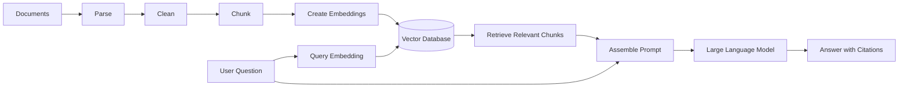
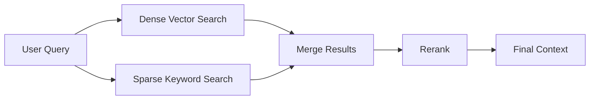
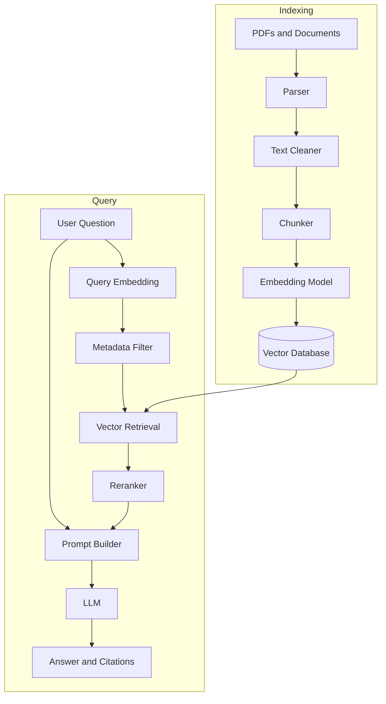

# 005 — Vector Database

**Course:** 03 — Knowledge Systems and RAG
**Module:** Module 09 — RAG and Implementation
**Content Group:** RAG Concepts
**Roadmap Source:** RAG and Implementation / RAG Concepts
**Lesson Type:** RAG
**Lesson Order:** 005
**Suggested Duration:** 26 minutes

---

## 1. Overview

A **vector database** is a specialized storage and retrieval system designed to work with numerical representations called **vectors** or **embeddings**.

In modern AI applications, embeddings represent the semantic meaning of text, images, audio, source code, products, users, or other data. A vector database stores these embeddings and retrieves the items that are most semantically similar to a query.

Vector databases are especially important in **Retrieval-Augmented Generation**, or **RAG**, because they allow a Large Language Model to answer questions using private, domain-specific, or frequently updated information.

After completing this lesson, you should understand:

* What a vector database is.
* How vector search differs from keyword search.
* Where a vector database appears in a RAG pipeline.
* How documents, embeddings, metadata, and similarity search work together.
* How to build and evaluate a small vector-search application.
* What limitations and production concerns must be considered.

---

## 2. Learning Objectives

By the end of this lesson, you should be able to:

* Explain a vector database in your own words.
* Describe the role of embeddings in semantic search.
* Distinguish vector search from traditional keyword search.
* Explain how vector databases support RAG applications.
* Store chunks, vectors, and metadata correctly.
* Perform top-k similarity retrieval.
* Build a small document-search or PDF question-answering demo.
* Evaluate retrieval quality using test questions and citations.
* Identify common vector database failure cases.

---

## 3. What Is a Vector Database?

A vector database stores data as high-dimensional numerical vectors and provides efficient algorithms for finding similar vectors.

For example, an embedding model may convert a sentence into a vector:

```text
"How do I reset my password?"
        |
        v
[0.021, -0.184, 0.773, ..., 0.092]
```

Another sentence with similar meaning should produce a vector located nearby in the embedding space:

```text
"I forgot my login password."
        |
        v
[0.018, -0.176, 0.759, ..., 0.087]
```

Even though the sentences use different words, their vectors may be close because they express similar meaning.

A vector database can search millions or billions of vectors and return the closest matches.

### Simple Definition

> A vector database is a system that stores embeddings and retrieves semantically similar items using vector similarity search.

---

## 4. Why Traditional Databases Are Not Enough

Traditional relational and document databases are excellent for exact filtering and structured queries.

For example:

```sql
SELECT *
FROM products
WHERE category = 'laptop'
AND price < 1000;
```

This query works because the conditions are explicit and structured.

However, traditional search becomes more difficult when the user asks:

```text
Find a lightweight computer suitable for a student who travels frequently.
```

The words in the query may not exactly match the product descriptions.

A vector database can compare the semantic meaning of the query with the semantic meaning of each product description.

### Keyword Search

Keyword search focuses mainly on exact words or lexical matches.

```text
Query: "reset password"

Possible match:
"Click here to reset your password."
```

### Vector Search

Vector search focuses on meaning.

```text
Query: "I cannot access my account because I forgot my credentials."

Possible match:
"Follow these steps to reset your password."
```

The two texts may have few words in common, but their meanings are closely related.

---

## 5. Vector Database in a RAG Pipeline

A vector database is one component of a complete RAG system.



The complete workflow can be divided into two stages:

1. **Indexing**
2. **Retrieval and generation**

---

## 6. Indexing Stage

During indexing, source documents are prepared and stored in the vector database.

```text
documents
    -> parse
    -> clean
    -> chunk
    -> embed
    -> store vectors and metadata
```

### 6.1 Parse

The system extracts content from sources such as:

* PDF files
* Word documents
* HTML pages
* Markdown files
* Database records
* Support tickets
* Product descriptions
* Source code
* Images or audio transcripts

### 6.2 Clean

Cleaning may include:

* Removing repeated headers and footers.
* Removing navigation menus.
* Fixing malformed whitespace.
* Normalizing Unicode characters.
* Removing irrelevant boilerplate.
* Preserving headings and document structure.

### 6.3 Chunk

Long documents are divided into smaller units called **chunks**.

Example:

```text
Document
├── Chunk 1: Introduction
├── Chunk 2: Installation
├── Chunk 3: Configuration
└── Chunk 4: Troubleshooting
```

Each chunk should contain enough context to be useful but should not be so large that retrieval becomes imprecise.

### 6.4 Embed

Each chunk is passed to an embedding model.

```text
Chunk text -> Embedding model -> Vector
```

Example conceptual record:

```json
{
  "id": "chunk_0042",
  "text": "To reset your password, open the account settings page...",
  "embedding": [0.021, -0.184, 0.773, 0.092],
  "metadata": {
    "source": "user-guide.pdf",
    "page": 17,
    "section": "Account Security"
  }
}
```

### 6.5 Store

The vector database stores:

* A unique identifier.
* The embedding vector.
* The original chunk text or a reference to it.
* Metadata.
* Optional filtering fields.

---

## 7. Retrieval Stage

When the user asks a question, the system performs the following steps:

```text
question
    -> query embedding
    -> similarity search
    -> top-k chunks
    -> optional reranking
    -> prompt assembly
    -> LLM answer
```

### Example

User question:

```text
How can I change my account password?
```

The system:

1. Converts the question into an embedding.
2. Searches for nearby chunk embeddings.
3. Returns the most similar chunks.
4. Inserts those chunks into the LLM prompt.
5. Requests an answer based only on the provided context.
6. Adds source and page citations.

---

## 8. Core Components of a Vector Record

A vector database record usually contains four important parts.

### 8.1 Identifier

A unique value for locating or updating the record.

```json
{
  "id": "handbook-page-12-chunk-03"
}
```

### 8.2 Vector

The numerical representation created by an embedding model.

```json
{
  "vector": [0.18, -0.42, 0.09, 0.71]
}
```

Real embedding vectors may contain hundreds or thousands of dimensions.

### 8.3 Content

The text or data represented by the vector.

```json
{
  "text": "Employees must submit leave requests at least three days in advance."
}
```

Some systems store the text directly in the vector database. Others store only a reference to content located in another database or object-storage system.

### 8.4 Metadata

Metadata describes where the chunk came from and how it should be filtered or cited.

```json
{
  "metadata": {
    "document_id": "employee-handbook-2026",
    "source": "employee-handbook.pdf",
    "page": 12,
    "section": "Leave Policy",
    "language": "en",
    "department": "human-resources",
    "access_level": "internal"
  }
}
```

Good metadata is essential for:

* Citations.
* Access control.
* Filtering.
* Debugging.
* Deleting or updating documents.
* Tracking document versions.
* Evaluating retrieval results.

---

## 9. Similarity Metrics

A vector database must calculate how close two vectors are.

Common similarity metrics include:

* Cosine similarity.
* Dot product.
* Euclidean distance.

### 9.1 Cosine Similarity

Cosine similarity compares the direction of two vectors.

[
\text{cosine similarity}(A,B)
=============================

\frac{A \cdot B}{|A||B|}
]

A larger cosine similarity usually means the vectors are more semantically similar.

Conceptual example:

```text
Query: "How can I recover my account?"

Chunk A: "Password recovery instructions"
Similarity: 0.91

Chunk B: "How to update your profile photo"
Similarity: 0.39

Chunk C: "Pricing and subscription plans"
Similarity: 0.18
```

Chunk A is the most relevant result.

### 9.2 Dot Product

Dot product is often used with normalized embeddings and can be efficient for search.

### 9.3 Euclidean Distance

Euclidean distance measures the physical distance between vectors.

Smaller distance means greater similarity.

### Important Rule

Use the similarity metric recommended by the embedding model or vector database. Changing the metric without validation can reduce retrieval quality.

---

## 10. Exact Search and Approximate Search

A vector database can perform either exact or approximate nearest-neighbor search.

### Exact Nearest Neighbor

Exact search compares the query against every stored vector.

Advantages:

* Produces exact nearest neighbors.
* Simple to understand.
* Useful for small datasets.

Disadvantages:

* Becomes slow and expensive for very large collections.

### Approximate Nearest Neighbor

Approximate Nearest Neighbor, or **ANN**, search uses an index to quickly find highly similar vectors without comparing every possible vector.

Advantages:

* Fast at large scale.
* Suitable for production systems.
* Supports millions or billions of vectors.

Disadvantages:

* May occasionally miss the mathematically closest result.
* Requires index configuration and tuning.

Common ANN approaches include:

* HNSW
* IVF
* Product Quantization
* Disk-based graph indexes

---

## 11. Top-k Retrieval

The parameter **top-k** controls how many matching chunks are returned.

```text
top_k = 3
```

This means the system retrieves the three most similar chunks.

### Small Top-k

Advantages:

* Lower prompt cost.
* Less irrelevant context.
* Faster generation.

Risks:

* Important evidence may be omitted.
* Complex questions may not receive enough context.

### Large Top-k

Advantages:

* More supporting information.
* Better coverage for broad questions.

Risks:

* More irrelevant content.
* Higher token usage.
* Increased latency.
* Greater risk of confusing the LLM.

Top-k should be evaluated using a test dataset rather than selected only by intuition.

---

## 12. Metadata Filtering

Vector similarity is often combined with structured filtering.

For example, the system may search only:

* A specific user’s documents.
* English documents.
* The latest document version.
* A selected product category.
* Documents the current user is authorized to access.

Conceptual query:

```python
results = vector_store.search(
    query_vector=query_embedding,
    top_k=5,
    filters={
        "language": "en",
        "department": "engineering",
        "access_level": "internal"
    }
)
```

This is sometimes called **filtered vector search**.

### Why Filtering Matters

Without metadata filtering, the system may retrieve:

* Documents belonging to another customer.
* Expired policies.
* Results in the wrong language.
* Internal content that the user cannot access.
* Chunks from an unrelated product or region.

Metadata filtering is therefore both a relevance feature and a security requirement.

---

## 13. Dense, Sparse, and Hybrid Search

### 13.1 Dense Search

Dense search uses embedding vectors.

It is effective for:

* Semantic similarity.
* Paraphrases.
* Natural-language questions.
* Conceptual matches.

### 13.2 Sparse Search

Sparse search uses lexical features such as term frequency.

It is effective for:

* Exact product codes.
* Error messages.
* Names.
* Acronyms.
* Rare technical terms.
* Legal or medical terminology.

### 13.3 Hybrid Search

Hybrid search combines dense semantic retrieval with sparse keyword retrieval.



Hybrid search is useful because semantic search and keyword search solve different problems.

For example:

```text
Query: ERR_AUTH_004
```

A dense embedding search may not handle the exact error code reliably. Keyword search may find it immediately.

For a conceptual query such as:

```text
Why does the application reject my login?
```

Dense search may perform better.

A hybrid system can support both cases.

---

## 14. Reranking

Initial vector retrieval is usually fast but not always perfectly precise.

A **reranker** examines the retrieved candidates and assigns a more accurate relevance score.

```text
Vector search: Retrieve 20 candidates
        |
        v
Reranker: Select the best 5
        |
        v
LLM prompt: Use the final 5 chunks
```

Reranking can improve precision, especially when:

* Documents contain similar wording.
* Questions require exact relationships.
* The dataset contains many overlapping chunks.
* The first-stage embedding model is optimized for speed.

The trade-off is additional latency and cost.

---

## 15. Vector Database Versus Vector Index

The terms are related but not identical.

### Vector Index

A vector index is the data structure used to perform efficient similarity search.

Examples include:

* HNSW index.
* IVF index.
* Flat index.

### Vector Database

A vector database typically provides more complete functionality:

* Vector storage.
* Similarity indexes.
* Metadata storage.
* Filtering.
* Insert and update operations.
* Deletion.
* Persistence.
* Replication.
* Scaling.
* Authentication.
* Monitoring.
* Backup and recovery.

A production RAG system usually needs more than a standalone similarity index.

---

## 16. Common Vector Database Options

Vector storage can be implemented in several ways.

### Dedicated Vector Databases

Examples include systems designed primarily for vector search.

They often provide:

* Managed scaling.
* Fast ANN search.
* Metadata filtering.
* Namespaces or collections.
* Replication.
* Production monitoring.

### Traditional Databases with Vector Extensions

Relational or document databases can add vector support.

This approach may be useful when:

* The application already uses the database.
* Structured data and vectors must be joined.
* Operational simplicity is more important than extreme scale.
* The vector collection is moderate in size.

### Local Vector Libraries

Local indexes are useful for:

* Experiments.
* Offline applications.
* Prototypes.
* Small datasets.
* Learning vector search fundamentals.

However, production features such as authentication, backups, replication, and concurrent updates may need to be implemented separately.

---

## 17. Minimal Data Model

A simple vector collection may use the following logical structure:

```text
VectorRecord
├── id
├── document_id
├── chunk_id
├── text
├── embedding
├── source
├── page
├── section
├── language
├── version
├── created_at
└── access_scope
```

Example:

```json
{
  "id": "doc-101-page-8-chunk-2",
  "document_id": "doc-101",
  "chunk_id": 2,
  "text": "The refund request must be submitted within 30 days.",
  "embedding": [0.14, -0.29, 0.63, 0.11],
  "source": "refund-policy.pdf",
  "page": 8,
  "section": "Eligibility",
  "language": "en",
  "version": "2026-04",
  "access_scope": "public"
}
```

---

## 18. Minimal Python Example

The following example demonstrates the general workflow without depending on a specific vector database.

```python
from dataclasses import dataclass
from typing import Any


@dataclass
class SearchResult:
    text: str
    score: float
    metadata: dict[str, Any]


def embed_text(text: str) -> list[float]:
    """
    Replace this function with a real embedding API call.
    """
    raise NotImplementedError("Connect an embedding model here.")


def index_documents(
    documents: list[dict[str, Any]],
    vector_store: Any,
) -> None:
    for document in documents:
        chunks = chunk_document(document["text"])

        for index, chunk in enumerate(chunks):
            embedding = embed_text(chunk)

            vector_store.upsert(
                id=f'{document["id"]}-chunk-{index}',
                vector=embedding,
                text=chunk,
                metadata={
                    "document_id": document["id"],
                    "source": document["source"],
                    "page": document.get("page"),
                    "chunk_index": index,
                },
            )


def search_documents(
    question: str,
    vector_store: Any,
    top_k: int = 5,
) -> list[SearchResult]:
    query_embedding = embed_text(question)

    return vector_store.search(
        vector=query_embedding,
        top_k=top_k,
    )
```

The exact API varies between vector database providers, but the core workflow remains similar:

1. Chunk the data.
2. Create embeddings.
3. Insert vectors and metadata.
4. Embed the query.
5. Search for similar vectors.
6. Return content and citations.

---

## 19. RAG Prompt Assembly Example

After retrieval, the selected chunks are inserted into a prompt.

```text
System:
Answer the user's question using only the supplied context.
If the context does not contain enough information, say that the answer
cannot be determined.
Cite each factual claim using the supplied source and page.

Context:
[1] Source: employee-handbook.pdf, page 12
Employees must submit planned leave requests at least three working days
before the first day of leave.

[2] Source: employee-handbook.pdf, page 13
Emergency leave may be submitted after the employee contacts their manager.

User:
When should I submit a planned leave request?
```

Possible answer:

```text
You should submit a planned leave request at least three working days before
the first day of leave. [employee-handbook.pdf, p. 12]
```

The vector database retrieves evidence. The LLM transforms that evidence into a useful response.

---

## 20. End-to-End Architecture



---

## 21. Example Use Cases

### 21.1 PDF Question Answering

Users upload PDF documents and ask questions about them.

The vector database retrieves relevant pages or chunks and returns citations.

### 21.2 Customer Support Assistant

Support manuals, frequently asked questions, and historical tickets are indexed.

The assistant retrieves relevant troubleshooting instructions before answering.

### 21.3 Internal Knowledge Assistant

Company policies, project documentation, meeting notes, and engineering guides are indexed.

Employees can ask natural-language questions without manually locating documents.

### 21.4 Product Search

Product descriptions are embedded so users can search using intent rather than exact keywords.

Example:

```text
A quiet keyboard suitable for working in a shared office
```

### 21.5 Code Search

Functions, classes, comments, and documentation are embedded.

Developers can search:

```text
Where is user permission validation implemented?
```

### 21.6 Recommendation Systems

Users and items can be represented as vectors.

Nearby vectors may indicate similar interests, behavior, or content.

### 21.7 Multimodal Search

Text and images may be embedded into a shared vector space.

Example:

```text
Find images containing a red sports car at night.
```

---

## 22. Retrieval Quality Evaluation

A vector database should not be evaluated only by whether one demonstration appears to work.

Create a **golden question set** containing:

* User question.
* Expected source document.
* Expected page or section.
* Expected relevant chunk.
* Important keywords or facts.
* Cases where no answer should be returned.

Example:

| Question                                            | Expected Source       | Expected Page | Answerable |
| --------------------------------------------------- | --------------------- | ------------: | ---------- |
| How many days in advance is planned leave required? | employee-handbook.pdf |            12 | Yes        |
| What is the office Wi-Fi password?                  | None                  |          None | No         |
| Who approves emergency leave?                       | employee-handbook.pdf |            13 | Yes        |

### Retrieval Metrics

Useful metrics include:

* **Hit Rate:** Was at least one relevant chunk retrieved?
* **Recall@k:** How many expected relevant chunks appeared in the top-k?
* **Precision@k:** How many retrieved chunks were actually relevant?
* **Mean Reciprocal Rank:** How high was the first relevant result?
* **Citation Accuracy:** Does the citation support the answer?
* **Answer Faithfulness:** Is the answer grounded in the retrieved context?
* **No-answer Accuracy:** Does the system refuse when evidence is missing?

---

## 23. Important Failure Cases

### 23.1 Chunks Are Too Large

Large chunks may contain many unrelated topics.

Consequences:

* Similarity becomes less precise.
* More tokens are inserted into the prompt.
* Citations become less specific.

### 23.2 Chunks Are Too Small

Small chunks may lose necessary context.

Consequences:

* Pronouns may have no reference.
* Tables may be separated from explanations.
* Definitions may be separated from conditions.
* Retrieved evidence may be incomplete.

### 23.3 Missing Metadata

Without source, page, or section metadata:

* Citations cannot be produced reliably.
* Debugging becomes difficult.
* Document updates are harder.
* Access filtering may become unsafe.

### 23.4 Embedding Model Mismatch

Using different embedding models for documents and queries may produce incompatible vector spaces.

```text
Documents -> Embedding Model A
Queries   -> Embedding Model B
```

Unless the models are explicitly designed to work together, retrieval quality may collapse.

### 23.5 Incorrect Distance Metric

Using the wrong similarity metric may change ranking quality.

### 23.6 No Reindexing Strategy

Documents change over time.

Without a versioning and reindexing strategy, the database may return outdated information.

### 23.7 Duplicate Chunks

Overlapping documents or repeated headers may produce duplicate results.

This wastes top-k capacity and prompt tokens.

### 23.8 Sensitive Data Leakage

A vector search without authorization filters may retrieve private information belonging to another user or team.

### 23.9 Evaluation by Intuition

A few successful examples do not prove that the system is reliable.

The system must be tested using repeatable questions, expected sources, and failure cases.

---

## 24. Production Considerations

### 24.1 Data Updates

Decide how to handle:

* New documents.
* Modified documents.
* Deleted documents.
* Expired versions.
* Duplicate uploads.

A common approach is:

```text
document_id + document_version + chunk_index
```

### 24.2 Access Control

Apply permission filters before returning search results.

```text
User authentication
        |
        v
Determine allowed document scopes
        |
        v
Apply metadata filters
        |
        v
Perform vector search
```

Never rely only on the LLM to ignore unauthorized content.

### 24.3 Observability

Log information such as:

* Query text or a privacy-safe representation.
* Search latency.
* Retrieved document IDs.
* Similarity scores.
* Applied filters.
* Top-k.
* Reranker scores.
* Prompt token count.
* Final citations.
* User feedback.

### 24.4 Cost

Main cost areas include:

* Embedding document chunks.
* Re-embedding updated documents.
* Vector storage.
* Query embeddings.
* Managed database usage.
* Reranking.
* LLM input tokens.

### 24.5 Latency

A RAG request may include several network calls:

```text
Query embedding
    + vector search
    + reranking
    + LLM generation
```

Latency can be reduced through:

* Query embedding caching.
* Efficient indexes.
* Smaller candidate sets.
* Parallel processing.
* Regional deployment.
* Avoiding unnecessary reranking.

### 24.6 Backup and Recovery

Production systems should plan for:

* Vector index backups.
* Metadata backups.
* Rebuilding indexes.
* Disaster recovery.
* Consistency between document storage and vector storage.

---

## 25. Practical Demo

Build a small semantic search system using five to ten short documents.

### Suggested Dataset

Use files such as:

```text
documents/
├── leave-policy.md
├── remote-work-policy.md
├── security-guide.md
├── expense-policy.md
└── onboarding-guide.md
```

### Step 1: Prepare Documents

For each document, record:

* File name.
* Title.
* Section.
* Page or line range.
* Version.
* Access level.

### Step 2: Chunk the Content

Start with a simple strategy:

```text
Chunk size: 300-500 tokens
Overlap: 50-100 tokens
```

These values are starting points, not universal rules.

### Step 3: Create Embeddings

Use the same embedding model for documents and user queries.

### Step 4: Insert Records

Store each chunk with:

```json
{
  "id": "security-guide-chunk-04",
  "text": "...",
  "vector": ["embedding values"],
  "metadata": {
    "source": "security-guide.md",
    "section": "Password Requirements",
    "chunk_index": 4
  }
}
```

### Step 5: Search

Run at least ten test questions.

For every question, record:

* Top-k chunks.
* Similarity scores.
* Expected document.
* Whether the correct chunk appeared.
* Whether irrelevant chunks appeared.

### Step 6: Add the LLM

Pass retrieved chunks to an LLM and require source citations.

### Step 7: Test Failure Cases

Include questions that:

* Have no answer in the documents.
* Contain ambiguous wording.
* Use exact identifiers.
* Require information from two chunks.
* Use terminology not found in the source.
* Ask for restricted content.

---

## 26. Example Evaluation Table

| Test Question                   | Top Result            | Correct Source Retrieved? | Citation Correct? | Failure Notes                       |
| ------------------------------- | --------------------- | ------------------------: | ----------------: | ----------------------------------- |
| How long must passwords be?     | security-guide.md     |                       Yes |               Yes | None                                |
| Can I work remotely abroad?     | remote-work-policy.md |                       Yes |               Yes | Region condition missing            |
| What is the CEO's home address? | onboarding-guide.md   |                        No |               N/A | System should refuse                |
| How do I claim a meal expense?  | expense-policy.md     |                       Yes |               Yes | Second relevant chunk ranked fourth |

This table makes retrieval problems visible and repeatable.

---

## 27. Hands-On Exercises

### Exercise 1: Explain the Concept

Explain a vector database in one or two minutes without using notes.

Your explanation should include:

* Embeddings.
* Semantic similarity.
* Top-k retrieval.
* Metadata.
* RAG.

### Exercise 2: Build a Small Index

Select five to ten small documents.

For each document:

1. Parse the content.
2. Divide it into chunks.
3. Create embeddings.
4. Store vectors and metadata.
5. Run similarity searches.

### Exercise 3: Inspect Retrieval Results

For each test question, print:

```text
Rank
Similarity score
Source
Page or section
Chunk text
```

Do not inspect only the final LLM answer. Retrieval must be evaluated independently.

### Exercise 4: Compare Top-k Values

Run the same test set with:

```text
top_k = 1
top_k = 3
top_k = 5
top_k = 10
```

Compare:

* Recall.
* Irrelevant context.
* Prompt size.
* Answer quality.
* Latency.

### Exercise 5: Test Chunk Sizes

Compare at least three chunking configurations.

Example:

| Configuration | Chunk Size |    Overlap |
| ------------- | ---------: | ---------: |
| A             | 200 tokens |  30 tokens |
| B             | 400 tokens |  60 tokens |
| C             | 800 tokens | 100 tokens |

Record which configuration performs best on the golden question set.

### Exercise 6: Add Metadata Filters

Add fields such as:

```text
language
department
document_version
user_id
access_scope
```

Verify that restricted documents cannot be retrieved by unauthorized users.

### Exercise 7: Add Citations

Return answers using the format:

```text
Answer text. [source, page]
```

Verify that every citation supports the associated claim.

---

## 28. Portfolio Project

### Project 8 — PDF Q&A RAG Application

Build an application that allows a user to:

1. Upload one or more PDF documents.
2. Extract and clean the text.
3. Divide the documents into chunks.
4. Create embeddings.
5. Store chunks in a vector database.
6. Ask natural-language questions.
7. Retrieve relevant chunks.
8. Generate answers using an LLM.
9. Display page-level or chunk-level citations.
10. Inspect retrieved evidence.

### Suggested Features

* PDF upload.
* Document list.
* Indexing progress.
* Semantic search.
* Answer generation.
* Page citations.
* Source preview.
* Retrieval score display.
* No-answer detection.
* Document deletion and reindexing.
* Evaluation dashboard.

### Suggested API Routes

```http
POST   /documents
POST   /documents/{document_id}/index
GET    /documents
DELETE /documents/{document_id}
POST   /search
POST   /questions
GET    /questions/{question_id}/evidence
```

### Example Search Request

```json
{
  "query": "What is the refund deadline?",
  "document_ids": ["refund-policy-2026"],
  "top_k": 5
}
```

### Example Search Response

```json
{
  "results": [
    {
      "text": "Refund requests must be submitted within 30 calendar days.",
      "score": 0.91,
      "metadata": {
        "source": "refund-policy.pdf",
        "page": 8,
        "section": "Submission Deadline"
      }
    }
  ]
}
```

---

## 29. Completion Checklist

* [ ] I can explain a vector database in one or two minutes.
* [ ] I understand how embeddings represent semantic meaning.
* [ ] I can distinguish keyword search from vector search.
* [ ] I understand where vector storage appears in a RAG pipeline.
* [ ] I can store vectors, text, identifiers, and metadata.
* [ ] I can perform top-k similarity search.
* [ ] I understand cosine similarity, dot product, and Euclidean distance.
* [ ] I understand the difference between exact and approximate search.
* [ ] I can apply metadata filters.
* [ ] I understand dense, sparse, and hybrid retrieval.
* [ ] I can explain the purpose of reranking.
* [ ] I have built a small vector search or RAG demo.
* [ ] I have created a golden question set.
* [ ] I have evaluated retrieval before evaluating generation.
* [ ] I have tested citations and no-answer cases.
* [ ] I have documented at least one limitation or unresolved question.

---

## 30. Key Limitations

Vector databases are powerful, but they do not automatically solve every RAG problem.

Important limitations include:

* Semantic similarity does not always mean factual relevance.
* Embeddings may perform poorly on exact identifiers or rare terminology.
* Retrieval quality depends heavily on parsing and chunking.
* Large top-k values can introduce distracting context.
* Similarity scores are not universal confidence scores.
* Metadata filters must be designed carefully.
* Updating documents requires reindexing and version control.
* A vector database does not verify whether an LLM answer is faithful.
* Citations must be validated independently.
* Sensitive information can leak if access control is implemented incorrectly.

---

## 31. Further Analysis Questions

Consider the following questions after completing the lesson:

1. Should your application use dense, sparse, or hybrid retrieval?
2. What chunking strategy works best for your document structure?
3. Which metadata fields are required for citations and access control?
4. How will old document versions be removed?
5. How will you evaluate retrieval separately from generation?
6. What should happen when similarity scores are low?
7. Should results be reranked before prompt assembly?
8. How many chunks should be sent to the LLM?
9. How will the system handle tables, images, and scanned PDFs?
10. Can the vector index be rebuilt from the original source documents?

---

## 32. Related Outcome

Build Retrieval-Augmented Generation applications that answer questions using private documents and provide verifiable citations.

---

## 33. Related Project

**Project 8: PDF Q&A RAG Application with page-level and chunk-level citations**

Recommended portfolio evidence:

* Architecture diagram.
* Chunking configuration.
* Vector database schema.
* Search API.
* Retrieval result inspector.
* Golden question dataset.
* Evaluation report.
* Citation examples.
* Document update strategy.
* Security and access-control notes.

---

## 34. Summary

A **vector database** stores embeddings and retrieves semantically similar information.

In a RAG application, it connects private knowledge with a Large Language Model:

```text
documents
    -> parse
    -> clean
    -> chunk
    -> embed
    -> vector database

user question
    -> embed
    -> retrieve
    -> rerank
    -> assemble context
    -> generate answer
    -> cite sources
```

A reliable RAG system requires more than inserting text into a vector database. It also requires:

* High-quality parsing.
* Appropriate chunking.
* Compatible embeddings.
* Useful metadata.
* Secure filtering.
* Accurate retrieval.
* Prompt grounding.
* Citation validation.
* Repeatable evaluation.

Turn this lesson into a working artifact such as a semantic search API, PDF question-answering application, retrieval evaluation notebook, architecture diagram, or portfolio case study. The goal is not only to understand vector databases, but to use them as a measurable and reliable part of an AI engineering system.
