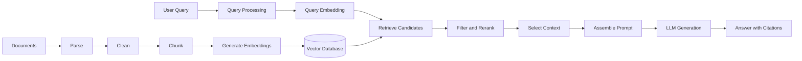
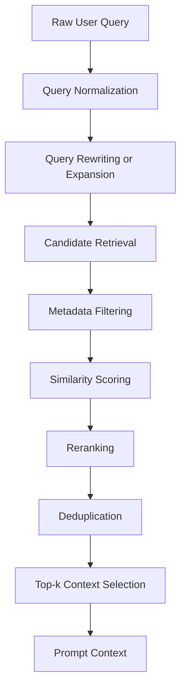
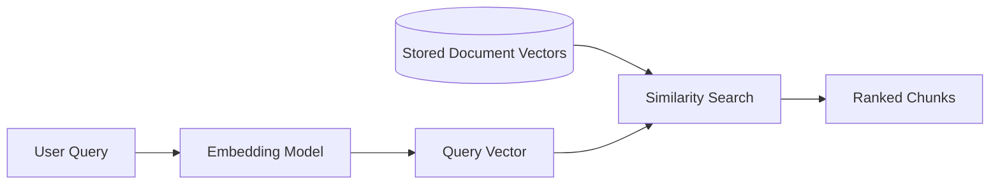
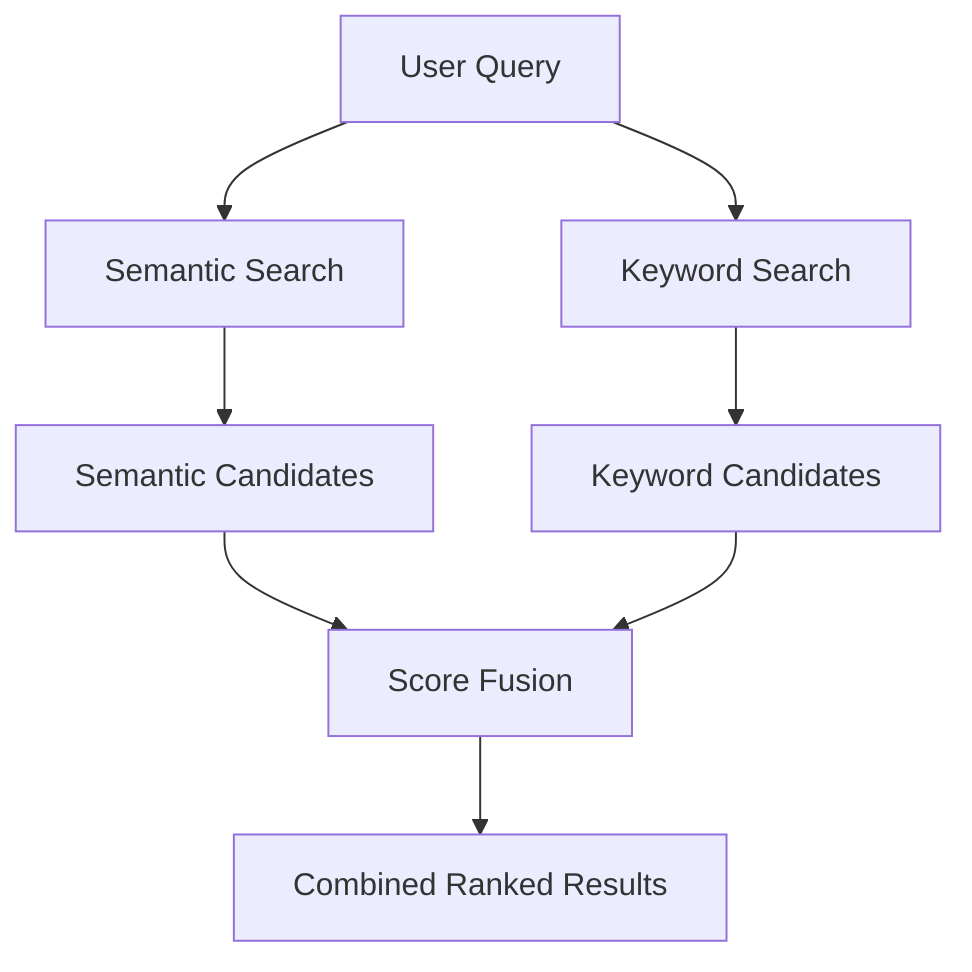
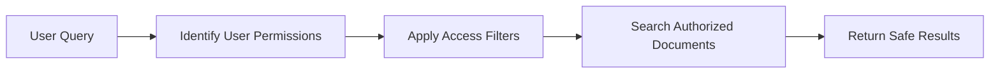
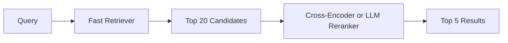
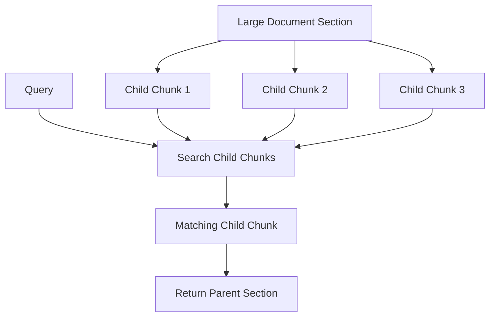
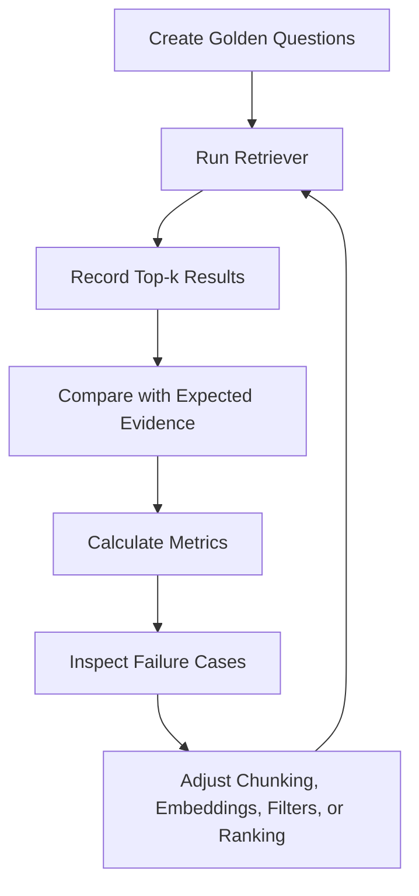
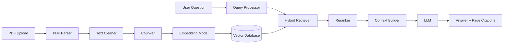

# 006 — Retrieval Process

**Course:** 03 — Knowledge Systems and RAG
**Module:** Module 09 — RAG and Implementation
**Content Group:** RAG Concepts
**Roadmap Source:** RAG and Implementation / RAG Concepts
**Lesson Type:** RAG
**Lesson Order:** 006
**Suggested Duration:** 26 minutes

---

## 1. Overview

This lesson explains the **Retrieval Process** in the context of modern AI engineering.

Retrieval is the stage of a Retrieval-Augmented Generation system that searches a knowledge source and selects the information most relevant to a user’s query.

Instead of asking a Large Language Model to answer only from its training data, a retrieval system supplies the model with external context from sources such as:

* PDF documents
* Product manuals
* Internal company knowledge
* Database records
* Support articles
* Research papers
* Source code
* Web pages
* Images and multimodal documents

After completing this lesson, you should understand:

* What retrieval does in a RAG pipeline
* How a query is converted into search results
* How similarity scoring and top-k selection work
* The difference between semantic, keyword, and hybrid retrieval
* Why metadata filtering and reranking are important
* How retrieval quality affects the final LLM answer
* How to evaluate retrieval using a test dataset

---

## 2. Learning Objectives

By the end of this lesson, you should be able to:

* Explain the Retrieval Process in your own words.
* Identify where retrieval appears in a RAG workflow.
* Describe the major stages of a retrieval pipeline.
* Compare keyword, semantic, and hybrid search.
* Understand top-k retrieval, similarity scores, filtering, and reranking.
* Inspect retrieved chunks before sending them to an LLM.
* Evaluate retrieval quality using a golden question set.
* Build a small retrieval demo for a portfolio project.

---

## 3. What Is the Retrieval Process?

The **Retrieval Process** is the process of finding the most relevant pieces of information from a knowledge base for a given user query.

A simple retrieval operation can be represented as:

```text
User query
    ↓
Search the knowledge base
    ↓
Score candidate documents or chunks
    ↓
Select the most relevant results
    ↓
Send the selected context to the LLM
```

In a RAG application, retrieval connects the user’s question to the private or external knowledge required to answer it.

For example, suppose a user asks:

```text
What is the refund period for annual subscriptions?
```

The retriever may search hundreds of internal policy documents and return a chunk such as:

```text
Annual subscriptions may be refunded within 14 days of the original
purchase date, provided that no premium services have been used.
```

This chunk is then inserted into the prompt sent to the LLM.

---

## 4. Retrieval in the Complete RAG Pipeline

Retrieval is only one part of a complete RAG system.



The pipeline has two main phases.

### 4.1 Indexing Phase

The indexing phase prepares documents before users begin asking questions.

```text
documents
    → parsing
    → cleaning
    → chunking
    → embedding
    → storage
```

The result is a searchable knowledge index.

### 4.2 Query Phase

The query phase runs whenever a user asks a question.

```text
user query
    → query processing
    → candidate retrieval
    → filtering
    → reranking
    → context selection
    → answer generation
```

The Retrieval Process primarily belongs to the query phase.

---

## 5. Main Stages of the Retrieval Process

A production retrieval pipeline usually contains several stages.



---

## 6. Stage 1: Query Processing

Before searching, the system may preprocess the user’s query.

### 6.1 Query Normalization

Query normalization may include:

* Removing unnecessary whitespace
* Correcting common spelling mistakes
* Standardizing capitalization
* Detecting the query language
* Resolving date expressions
* Expanding abbreviations
* Removing unsupported control characters

Example:

```text
Raw query:
refund yearly plan???

Normalized query:
refund policy for annual subscription
```

Normalization should preserve the user’s original meaning.

---

### 6.2 Query Rewriting

Users often write queries that are incomplete, conversational, or ambiguous.

A query rewriting model can transform the original query into a more searchable form.

```text
Original:
Can I get my money back?

Rewritten:
What is the refund policy for subscription purchases?
```

Query rewriting can improve retrieval when the knowledge base uses formal terminology.

However, rewriting can also introduce errors. The rewritten query should not change the user’s intent.

---

### 6.3 Query Expansion

Query expansion adds related terms or synonyms.

```text
Original query:
employee vacation policy

Expanded concepts:
employee leave policy
annual leave
paid time off
PTO
vacation days
```

This can improve recall when different documents use different terminology.

---

### 6.4 Conversation-Aware Queries

In a chatbot, the current question may depend on earlier messages.

```text
User: What is the enterprise plan?

Assistant: The enterprise plan includes advanced security and support.

User: How much does it cost?
```

The second question should be converted into a standalone query:

```text
How much does the enterprise plan cost?
```

This process is often called **question contextualization** or **standalone query generation**.

---

## 7. Stage 2: Candidate Retrieval

Candidate retrieval searches the index and returns an initial set of potentially relevant chunks.

There are three common approaches:

1. Keyword retrieval
2. Semantic retrieval
3. Hybrid retrieval

---

## 8. Keyword Retrieval

Keyword retrieval finds documents containing the same or similar terms as the query.

Common keyword retrieval methods include:

* Inverted indexes
* TF-IDF
* BM25
* Full-text database search

Example query:

```text
password reset policy
```

A keyword retriever may prioritize chunks containing:

```text
password
reset
policy
```

### Advantages

* Fast and mature
* Easy to understand
* Strong for exact names, IDs, codes, and terminology
* Useful for product numbers and error messages

### Limitations

* May fail when the query and document use different words
* Does not deeply understand semantic meaning
* Can overvalue repeated keywords

Example failure:

```text
Query:
How can I recover access to my account?

Document:
Password reset instructions
```

The document is relevant, but the exact query terms may not appear.

---

## 9. Semantic Retrieval

Semantic retrieval searches by meaning rather than exact keyword overlap.

Both the query and document chunks are converted into vectors called **embeddings**.

```text
Query text
    → embedding model
    → query vector

Document chunk
    → embedding model
    → document vector
```

The system compares the query vector with stored document vectors.

Chunks with nearby vectors are considered semantically similar.



### Advantages

* Finds conceptually related content
* Handles synonyms and paraphrases
* Works well with natural-language questions
* Useful for unstructured documents

### Limitations

* Can miss exact identifiers
* Depends on embedding quality
* Similarity does not always mean factual relevance
* May retrieve broadly related but unhelpful content

---

## 10. Hybrid Retrieval

Hybrid retrieval combines keyword and semantic search.

```text
Final retrieval score
    = semantic score
    + keyword score
```

A hybrid retriever may run:

* Vector similarity search
* BM25 keyword search

It then combines the results.



Hybrid search is often more reliable than either method alone.

It works especially well when queries contain:

* Product names
* Legal terms
* Error codes
* Technical identifiers
* Natural-language descriptions

Example:

```text
How do I fix error AUTH-401 after changing my password?
```

Keyword search can identify `AUTH-401`, while semantic search can find content related to authentication failures.

---

## 11. Similarity Scoring

Semantic retrieval requires a way to measure the similarity between vectors.

Common similarity metrics include:

* Cosine similarity
* Dot product
* Euclidean distance

### 11.1 Cosine Similarity

Cosine similarity measures the angle between two vectors.

Conceptually:

```text
cosine_similarity(query_vector, document_vector)
```

A higher cosine similarity usually indicates that the query and document are more semantically related.

Typical scores may look like:

```text
Chunk A: 0.91
Chunk B: 0.84
Chunk C: 0.79
Chunk D: 0.43
```

The exact score range and meaning depend on the embedding model and vector database.

Do not assume that one universal similarity threshold works for every system.

---

## 12. Top-k Retrieval

The parameter **k** determines how many results are returned.

```text
top_k = 3
```

This means that the retriever returns the three highest-ranked chunks.

Example:

| Rank | Chunk                        | Similarity score |
| ---: | ---------------------------- | ---------------: |
|    1 | Refund policy overview       |             0.91 |
|    2 | Annual subscription terms    |             0.87 |
|    3 | Payment cancellation process |             0.81 |

### Small `k`

A small value such as `k = 2` may:

* Reduce prompt length
* Reduce cost
* Increase precision
* Miss necessary supporting information

### Large `k`

A large value such as `k = 20` may:

* Improve recall
* Include more evidence
* Increase latency and token usage
* Add irrelevant or contradictory context

The correct value should be selected through evaluation rather than intuition.

---

## 13. Precision and Recall

Retrieval quality often involves a trade-off between **precision** and **recall**.

### Precision

Precision measures how many retrieved chunks are actually relevant.

```text
Precision = relevant retrieved chunks / all retrieved chunks
```

Suppose the retriever returns five chunks, but only three are relevant:

```text
Precision = 3 / 5 = 0.60
```

### Recall

Recall measures how much of the relevant information was successfully retrieved.

```text
Recall = relevant retrieved chunks / all relevant chunks in the knowledge base
```

A system with high precision returns mostly relevant chunks.

A system with high recall finds most of the available relevant information.

In many RAG systems:

* Initial retrieval focuses on recall.
* Reranking and context selection improve precision.

---

## 14. Metadata Filtering

Document chunks should include metadata describing their source.

Example metadata:

```json
{
  "document_id": "employee_handbook_2026",
  "title": "Employee Handbook",
  "page": 42,
  "section": "Annual Leave",
  "department": "Human Resources",
  "language": "en",
  "access_level": "internal",
  "updated_at": "2026-05-10"
}
```

Metadata filtering limits retrieval to chunks that satisfy specific conditions.

Example filters:

```text
department = "Human Resources"
language = "en"
updated_at >= "2026-01-01"
access_level IN user_permissions
```

### Why Metadata Filtering Matters

Metadata filtering helps:

* Improve result relevance
* Enforce user permissions
* Select the correct language
* Avoid outdated documents
* Restrict results to specific products or departments
* Support accurate citations

Example:

```text
Query:
What is the annual leave policy?

Filter:
country = "Vietnam"
employee_type = "full_time"
document_status = "active"
```

Without filters, the system might retrieve leave policies for the wrong country or employee type.

---

## 15. Access-Control Filtering

Private RAG systems must never retrieve documents that the user is not allowed to access.

Authorization filtering should happen during or before retrieval.



A dangerous implementation retrieves everything first and removes unauthorized content later.

A safer design ensures that unauthorized chunks never enter the candidate set.

---

## 16. Reranking

Initial retrieval is optimized for speed. It may return some weakly related chunks.

A **reranker** takes the initial candidates and scores them more carefully.

```text
Initial retrieval:
Retrieve top 20 candidates

Reranking:
Score all 20 candidates with a stronger model

Final selection:
Keep the best 5 candidates
```



### Common Reranking Approaches

* Cross-encoder reranking models
* LLM-based relevance scoring
* Rule-based score adjustment
* Recency weighting
* Authority weighting
* Diversity-aware reranking

### Why Reranking Helps

Embedding search evaluates query and document vectors separately.

A cross-encoder can examine the query and document together, allowing a more detailed relevance judgment.

Reranking usually improves precision, but adds:

* Latency
* Compute cost
* Implementation complexity

---

## 17. Score Fusion

When multiple retrievers are used, their results must be combined.

A simple weighted formula is:

```text
final_score =
    0.6 × semantic_score
    + 0.4 × keyword_score
```

However, raw scores from different retrieval systems may not be directly comparable.

A common alternative is **Reciprocal Rank Fusion**, which combines results according to their rank positions rather than their raw scores.

Conceptually:

```text
RRF score =
    1 / (constant + semantic_rank)
    + 1 / (constant + keyword_rank)
```

This approach is useful when combining search systems with different scoring scales.

---

## 18. Deduplication

Documents often contain repeated content, such as:

* Headers
* Footers
* Legal notices
* Navigation menus
* Repeated definitions
* Overlapping chunks

Without deduplication, the retriever may return several nearly identical chunks.

Example:

```text
Result 1: Refunds are available within 14 days...
Result 2: Customers may request refunds within 14 days...
Result 3: A 14-day refund window applies...
```

These results may all come from the same paragraph.

Deduplication can use:

* Document and chunk IDs
* Text overlap
* Vector similarity
* Parent-document grouping
* Maximal Marginal Relevance

---

## 19. Diversity and Maximal Marginal Relevance

Sometimes the highest-scoring chunks are too similar to one another.

**Maximal Marginal Relevance**, or MMR, balances relevance and diversity.

It attempts to select chunks that are:

* Relevant to the query
* Different from chunks already selected

Example:

Instead of returning five chunks explaining the refund deadline, MMR may return:

1. Refund deadline
2. Eligibility conditions
3. Refund request procedure
4. Exceptions
5. Payment processing time

This gives the LLM broader and more useful context.

---

## 20. Parent-Child Retrieval

Small chunks are often better for search, while larger sections are better for answering.

Parent-child retrieval uses two chunk levels:

* **Child chunks:** Small units used for similarity search
* **Parent chunks:** Larger sections returned to the LLM



This approach combines:

* Precise retrieval
* Sufficient context for generation

---

## 21. Multi-Query Retrieval

A single user query can be rewritten into multiple search queries.

Example:

```text
Original:
What security controls protect customer information?
```

Generated retrieval queries:

```text
customer data security controls
personal information protection measures
encryption and access control policy
data privacy safeguards
```

The system retrieves candidates for each query and merges the results.

Multi-query retrieval may improve recall, but it also increases:

* Search requests
* Latency
* Cost
* Duplicate results

---

## 22. Query Decomposition

Complex questions may contain multiple subquestions.

Example:

```text
Compare the refund policies for monthly and annual subscriptions,
including deadlines and exceptions.
```

This can be decomposed into:

```text
1. What is the refund deadline for monthly subscriptions?
2. What is the refund deadline for annual subscriptions?
3. What exceptions apply to monthly subscriptions?
4. What exceptions apply to annual subscriptions?
```

Each subquery is retrieved separately, and the results are combined.

Query decomposition is useful for:

* Comparisons
* Multi-hop questions
* Questions requiring several documents
* Analytical reports
* Agent workflows

---

## 23. Retrieval Thresholds

A similarity threshold can prevent weak results from being sent to the LLM.

Example:

```python
if similarity_score < 0.65:
    reject_chunk()
```

However, fixed thresholds should be calibrated with real test data.

A threshold that is too high may produce no results.

A threshold that is too low may include irrelevant context.

A safe RAG system should support an insufficient-evidence response:

```text
I could not find enough information in the available documents
to answer this question reliably.
```

The model should not be encouraged to guess when retrieval fails.

---

## 24. Context Selection

Retrieval results cannot always be inserted directly into the prompt.

The context-selection stage determines:

* Which chunks to include
* In what order
* How many tokens to use
* Whether to merge adjacent chunks
* Whether repeated content should be removed
* Whether sources contradict one another

A context budget may look like:

```text
Maximum context budget: 6,000 tokens

Selected chunks:
- Chunk 1: 850 tokens
- Chunk 2: 720 tokens
- Chunk 3: 1,100 tokens
- Chunk 4: 630 tokens

Total: 3,300 tokens
```

The remaining context window must still support:

* System instructions
* User messages
* Citation formatting
* Model output

---

## 25. Lost in the Middle

LLMs may pay less attention to information placed in the middle of a long prompt.

A useful context-ordering strategy is:

```text
Most important evidence
Supporting evidence
Background information
Second-most important evidence
```

Another strategy is to place the highest-ranked chunks at the beginning.

The best ordering should be evaluated with the target model.

---

## 26. Prompt Assembly

Retrieved chunks are assembled into a structured prompt.

Example:

```text
SYSTEM:
Answer only from the supplied context.
If the context does not contain enough information, say so.
Cite each factual claim using the provided source identifiers.

CONTEXT:

[SOURCE: employee_handbook.pdf, PAGE: 42]
Full-time employees receive 12 days of annual leave per calendar year.

[SOURCE: leave_policy.pdf, PAGE: 8]
Unused annual leave may be carried forward for up to six months.

USER QUESTION:
How much annual leave do full-time employees receive, and can it be carried forward?
```

The prompt should clearly separate:

* Instructions
* Retrieved evidence
* Source metadata
* User question

---

## 27. Citation Support

Each chunk should preserve enough metadata to produce citations.

Recommended fields include:

```json
{
  "chunk_id": "employee_handbook_p42_c03",
  "document_id": "employee_handbook",
  "document_name": "Employee Handbook",
  "page": 42,
  "section": "Annual Leave",
  "source_url": null,
  "text": "Full-time employees receive 12 days..."
}
```

A generated answer may then include:

```text
Full-time employees receive 12 days of annual leave per calendar year
[Employee Handbook, p. 42]. Unused leave may be carried forward for up
to six months [Leave Policy, p. 8].
```

Citation quality depends on retrieval quality.

If the correct source is not retrieved, the model cannot produce a reliable citation.

---

## 28. Retrieval Is Not the Same as Answer Quality

A weak final answer does not always mean the retriever failed.

Possible failure locations include:

```text
1. Parsing failure
2. Chunking failure
3. Embedding failure
4. Retrieval failure
5. Reranking failure
6. Context assembly failure
7. Generation failure
8. Citation formatting failure
```

For example:

* The correct chunk was retrieved, but the LLM ignored it.
* The correct document was indexed, but the relevant table was parsed incorrectly.
* The answer was correct, but the citation pointed to the wrong page.
* Retrieval returned an outdated policy instead of the current policy.

Each pipeline stage should be evaluated separately.

---

## 29. Retrieval Quality Metrics

Retrieval should be tested independently from generation.

### 29.1 Hit Rate at k

Hit Rate@k checks whether at least one relevant chunk appears in the top-k results.

```text
Hit Rate@5 =
number of questions with a relevant result in top 5
/
total number of questions
```

---

### 29.2 Recall at k

Recall@k measures how many known relevant chunks appear in the top-k results.

```text
Recall@k =
relevant chunks retrieved in top k
/
total known relevant chunks
```

---

### 29.3 Precision at k

Precision@k measures the proportion of top-k results that are relevant.

```text
Precision@k =
relevant chunks in top k
/
k
```

---

### 29.4 Mean Reciprocal Rank

Mean Reciprocal Rank rewards systems that place the first relevant result near the top.

```text
Question 1:
First relevant result at rank 1 → reciprocal rank = 1

Question 2:
First relevant result at rank 2 → reciprocal rank = 1/2

Question 3:
First relevant result at rank 5 → reciprocal rank = 1/5
```

MRR is the average reciprocal rank across all test questions.

---

### 29.5 Normalized Discounted Cumulative Gain

NDCG evaluates the quality of the ranking when results have different relevance levels.

For example:

```text
Highly relevant
Partially relevant
Weakly relevant
Irrelevant
```

It gives more value to highly relevant chunks appearing near the top.

---

## 30. Creating a Golden Question Set

A **golden question set** is a collection of test questions with expected evidence.

Example:

```json
{
  "question": "How many annual leave days do full-time employees receive?",
  "expected_document": "employee_handbook.pdf",
  "expected_page": 42,
  "expected_chunk_ids": [
    "employee_handbook_p42_c03"
  ],
  "expected_answer": "12 days per calendar year"
}
```

A useful evaluation dataset should include:

* Direct factual questions
* Paraphrased questions
* Questions using synonyms
* Multi-document questions
* Questions requiring metadata filters
* Questions with no valid answer
* Questions involving outdated documents
* Ambiguous questions
* Permission-sensitive questions

---

## 31. Retrieval Evaluation Workflow



Retrieval development should be iterative.

Do not change multiple components at the same time unless you can isolate their effects.

---

## 32. Example Retrieval Output

For each test query, record the retrieved results.

```json
{
  "query": "What is the annual subscription refund period?",
  "top_k": 3,
  "results": [
    {
      "rank": 1,
      "chunk_id": "refund_policy_p3_c02",
      "score": 0.91,
      "source": "refund_policy.pdf",
      "page": 3,
      "text": "Annual subscriptions may be refunded within 14 days..."
    },
    {
      "rank": 2,
      "chunk_id": "billing_faq_p6_c01",
      "score": 0.83,
      "source": "billing_faq.pdf",
      "page": 6,
      "text": "Subscription cancellation stops future billing..."
    },
    {
      "rank": 3,
      "chunk_id": "monthly_plan_p4_c05",
      "score": 0.76,
      "source": "plans.pdf",
      "page": 4,
      "text": "Monthly subscriptions may be cancelled at any time..."
    }
  ]
}
```

This output makes it easier to debug the system before involving the LLM.

---

## 33. Minimal Retrieval Pseudocode

```python
def retrieve_context(
    query: str,
    vector_store,
    embedding_model,
    top_k: int = 5,
    filters: dict | None = None,
) -> list[dict]:
    """
    Retrieve the most relevant document chunks for a user query.
    """

    normalized_query = query.strip()

    if not normalized_query:
        raise ValueError("Query must not be empty.")

    query_embedding = embedding_model.embed_query(normalized_query)

    results = vector_store.similarity_search(
        vector=query_embedding,
        top_k=top_k,
        filters=filters or {},
    )

    return [
        {
            "chunk_id": result.metadata["chunk_id"],
            "text": result.text,
            "score": result.score,
            "source": result.metadata.get("source"),
            "page": result.metadata.get("page"),
        }
        for result in results
    ]
```

---

## 34. Example Retrieval and Reranking Pipeline

```python
from dataclasses import dataclass
from typing import Protocol


@dataclass
class RetrievedChunk:
    chunk_id: str
    text: str
    score: float
    source: str | None = None
    page: int | None = None


class Retriever(Protocol):
    def search(
        self,
        query: str,
        top_k: int,
        filters: dict,
    ) -> list[RetrievedChunk]:
        ...


class Reranker(Protocol):
    def rerank(
        self,
        query: str,
        chunks: list[RetrievedChunk],
        top_k: int,
    ) -> list[RetrievedChunk]:
        ...


def retrieve_and_rerank(
    query: str,
    retriever: Retriever,
    reranker: Reranker,
    filters: dict | None = None,
    candidate_k: int = 20,
    final_k: int = 5,
) -> list[RetrievedChunk]:
    normalized_query = query.strip()

    if not normalized_query:
        raise ValueError("Query must not be empty.")

    candidates = retriever.search(
        query=normalized_query,
        top_k=candidate_k,
        filters=filters or {},
    )

    if not candidates:
        return []

    ranked_chunks = reranker.rerank(
        query=normalized_query,
        chunks=candidates,
        top_k=final_k,
    )

    return ranked_chunks
```

The initial retriever finds a broad candidate set.

The reranker then selects the most relevant chunks for the final prompt.

---

## 35. Example Context Builder

```python
def build_context(chunks: list[RetrievedChunk]) -> str:
    context_sections: list[str] = []

    for index, chunk in enumerate(chunks, start=1):
        source = chunk.source or "unknown"
        page = chunk.page if chunk.page is not None else "unknown"

        section = (
            f"[SOURCE {index}]\n"
            f"Document: {source}\n"
            f"Page: {page}\n"
            f"Chunk ID: {chunk.chunk_id}\n"
            f"Content:\n{chunk.text}"
        )

        context_sections.append(section)

    return "\n\n".join(context_sections)
```

Example output:

```text
[SOURCE 1]
Document: refund_policy.pdf
Page: 3
Chunk ID: refund_policy_p3_c02
Content:
Annual subscriptions may be refunded within 14 days of purchase.

[SOURCE 2]
Document: billing_faq.pdf
Page: 6
Chunk ID: billing_faq_p6_c01
Content:
Approved refunds are returned to the original payment method.
```

---

## 36. Complete Retrieval Flow Example

Suppose the user asks:

```text
Can annual subscriptions be refunded?
```

### Step 1: Normalize the Query

```text
annual subscription refund eligibility
```

### Step 2: Apply Metadata Filters

```json
{
  "language": "en",
  "document_status": "active",
  "product": "subscriptions"
}
```

### Step 3: Retrieve Candidates

```text
Candidate 1: Refund policy — score 0.91
Candidate 2: Cancellation policy — score 0.85
Candidate 3: Payment methods — score 0.73
Candidate 4: Monthly subscriptions — score 0.70
```

### Step 4: Rerank

```text
1. Refund policy
2. Cancellation policy
3. Monthly subscriptions
```

### Step 5: Select Context

```text
Annual subscriptions may be refunded within 14 days of purchase,
provided that premium services have not been used.
```

### Step 6: Generate the Answer

```text
Yes. Annual subscriptions may be refunded within 14 days of purchase,
provided that premium services have not been used
[Refund Policy, p. 3].
```

---

## 37. Retrieval Failure Cases

### 37.1 The Correct Document Was Never Indexed

```text
Cause:
The ingestion pipeline skipped the document.

Result:
Retrieval cannot find information that does not exist in the index.
```

### 37.2 The Correct Information Was Parsed Incorrectly

```text
Cause:
A PDF table was converted into broken text.

Result:
The embedding does not accurately represent the original content.
```

### 37.3 Chunks Are Too Large

```text
Cause:
Several unrelated sections are stored in one chunk.

Result:
The chunk embedding becomes too general.
```

### 37.4 Chunks Are Too Small

```text
Cause:
Important sentences are separated from their definitions or headings.

Result:
Retrieved chunks lack enough context to answer the question.
```

### 37.5 Missing Metadata

```text
Cause:
The system stores only chunk text.

Result:
It cannot reliably display the source, document, section, or page.
```

### 37.6 Wrong Language

```text
Cause:
The retriever does not filter or detect language.

Result:
An English query may retrieve Vietnamese chunks or the reverse.
```

### 37.7 Outdated Documents Rank Higher

```text
Cause:
The system ignores document version and publication date.

Result:
The LLM answers using an old policy.
```

### 37.8 Similar but Incorrect Content

```text
Cause:
Semantic search finds a conceptually related chunk.

Result:
The result sounds relevant but does not answer the exact question.
```

### 37.9 Duplicate Results

```text
Cause:
Overlapping chunks contain nearly identical content.

Result:
The context window is wasted on repeated information.
```

### 37.10 Unauthorized Retrieval

```text
Cause:
Access-control metadata is missing or applied too late.

Result:
Private information may be exposed to the wrong user.
```

---

## 38. Common Mistakes

### Mistake 1: Choosing Chunk Size Without Evaluation

Do not assume that a specific chunk size works for every document type.

A legal contract, product manual, source-code repository, and FAQ page may require different chunking strategies.

---

### Mistake 2: Using Only Vector Search

Vector search is powerful, but exact keyword matching may be better for:

* Error codes
* Product IDs
* Names
* Version numbers
* Legal clauses
* API method names

Consider hybrid retrieval when exact terms matter.

---

### Mistake 3: Sending Every Retrieved Chunk to the LLM

More context is not always better.

Irrelevant context can:

* Confuse the model
* Increase cost
* Increase latency
* Reduce citation accuracy
* Introduce contradictions

---

### Mistake 4: Evaluating Only the Final Answer

A correct answer does not prove that retrieval works consistently.

The LLM may answer from its internal knowledge instead of the supplied documents.

Evaluate retrieval results independently.

---

### Mistake 5: Using Similarity Scores as Absolute Truth

A similarity score is a ranking signal, not proof that a chunk contains the answer.

Always inspect real retrieval results and evaluate them against expected evidence.

---

### Mistake 6: Ignoring No-Answer Queries

Your evaluation set should contain questions that cannot be answered from the knowledge base.

The correct behavior may be:

```text
The available documents do not contain enough information to answer this.
```

---

### Mistake 7: Ignoring Security Filters

Metadata filtering is not only a relevance feature.

In enterprise RAG, it is also part of the authorization system.

---

## 39. Production Checklist

### Data Preparation

* [ ] Documents are parsed correctly.
* [ ] Headers, footers, and repeated navigation are removed.
* [ ] Chunk boundaries preserve semantic meaning.
* [ ] Each chunk has a unique ID.
* [ ] Source, page, section, language, and version metadata are stored.
* [ ] Outdated and inactive documents are marked clearly.

### Query Processing

* [ ] Empty and invalid queries are handled safely.
* [ ] Conversational questions can be converted into standalone queries.
* [ ] Query rewriting preserves user intent.
* [ ] Query language is detected.
* [ ] Date and product references are normalized when necessary.

### Retrieval

* [ ] Keyword search has been considered.
* [ ] Semantic search uses the same embedding model as indexing.
* [ ] Hybrid retrieval is evaluated where appropriate.
* [ ] Top-k values are selected through testing.
* [ ] Similarity thresholds are calibrated.
* [ ] Metadata filters are applied correctly.
* [ ] Access controls are enforced before results are returned.

### Ranking and Context

* [ ] Reranking is evaluated.
* [ ] Duplicate chunks are removed.
* [ ] Adjacent chunks can be merged when useful.
* [ ] Context respects the model’s token limit.
* [ ] Important evidence is ordered intentionally.
* [ ] Conflicting sources are detected or surfaced.

### Citations

* [ ] Every chunk preserves its source.
* [ ] Page or section information is available.
* [ ] Citation identifiers are stable.
* [ ] Generated claims can be mapped to retrieved evidence.
* [ ] Missing evidence produces an uncertainty response.

### Evaluation

* [ ] A golden question set exists.
* [ ] Retrieval is tested separately from generation.
* [ ] Precision@k or Recall@k is measured.
* [ ] No-answer cases are included.
* [ ] Permission-sensitive queries are tested.
* [ ] Failure cases are recorded and analyzed.

---

## 40. Practical Exercise

Build a small retrieval experiment using 5–10 documents.

Possible document sets include:

* Product documentation
* University regulations
* Company policies
* Technical tutorials
* Research-paper abstracts
* Personal study notes

### Step 1: Prepare the Documents

For every chunk, store:

```json
{
  "chunk_id": "document_01_chunk_03",
  "document_name": "example.pdf",
  "page": 4,
  "section": "Refund Policy",
  "text": "..."
}
```

### Step 2: Create 10–20 Test Questions

Include:

* Direct questions
* Paraphrased questions
* Exact-keyword questions
* Multi-section questions
* No-answer questions

### Step 3: Run Retrieval

For each query, record:

```text
- Top-k results
- Similarity scores
- Source document
- Page number
- Retrieved text
- Whether the correct chunk was found
```

### Step 4: Compare Configurations

Test several configurations:

```text
Experiment A:
Semantic search, top_k = 3

Experiment B:
Semantic search, top_k = 8

Experiment C:
Hybrid search, top_k = 5

Experiment D:
Hybrid search + reranking
```

### Step 5: Analyze Failures

For every failed query, classify the reason:

```text
- Missing document
- Parsing problem
- Chunking problem
- Embedding problem
- Metadata problem
- Ranking problem
- Context problem
```

### Step 6: Generate Answers with Citations

Send only the final selected chunks to the LLM.

Require the answer to:

* Use only the supplied context
* Include source citations
* State when evidence is insufficient

---

## 41. Suggested Experiment Table

| Experiment | Retrieval method | Candidate k | Final k | Reranker | Hit Rate@k | Notes                |
| ---------- | ---------------- | ----------: | ------: | -------- | ---------: | -------------------- |
| A          | Semantic         |           3 |       3 | No       |            | Baseline             |
| B          | Semantic         |          10 |       5 | Yes      |            | Tests reranking      |
| C          | Keyword          |           5 |       5 | No       |            | Exact-term baseline  |
| D          | Hybrid           |          10 |       5 | Yes      |            | Production candidate |
| E          | Hybrid + filters |          10 |       5 | Yes      |            | Metadata-aware       |

---

## 42. Portfolio Project Connection

### Project 8: PDF Q&A RAG Application

Build an application that allows users to upload PDF files and ask questions about their content.

The system should return:

* A grounded answer
* Source document name
* Page number
* Chunk identifier
* Relevant source excerpt
* A clear no-answer response when evidence is missing

### Suggested Architecture



### Suggested API Routes

```text
POST /documents/upload
POST /documents/{document_id}/index
POST /retrieval/search
POST /questions/answer
GET  /documents/{document_id}/chunks
GET  /evaluations/retrieval
```

Example request:

```json
{
  "question": "What are the eligibility requirements?",
  "document_ids": [
    "employee_handbook"
  ],
  "top_k": 5,
  "use_reranker": true
}
```

Example response:

```json
{
  "answer": "Employees become eligible after completing three months of service.",
  "citations": [
    {
      "document": "employee_handbook.pdf",
      "page": 12,
      "chunk_id": "employee_handbook_p12_c04"
    }
  ],
  "retrieval": {
    "candidate_count": 20,
    "selected_count": 4
  }
}
```

---

## 43. Key Takeaways

* Retrieval finds the external evidence required to answer a user’s question.
* Retrieval is the bridge between private knowledge and an LLM.
* Keyword search is strong for exact terms.
* Semantic search is strong for meaning and paraphrases.
* Hybrid search combines the strengths of both approaches.
* Top-k controls how many chunks are returned.
* Metadata filters improve relevance, freshness, language handling, and security.
* Reranking improves the ordering of initial search results.
* Deduplication and diversity prevent repetitive context.
* Retrieval quality should be evaluated separately from answer quality.
* A golden question set is essential for systematic RAG evaluation.
* Reliable citations require stable source and page metadata.
* When evidence is insufficient, the system should not guess.

---

## 44. Completion Checklist

* [ ] I can explain the Retrieval Process in one or two minutes.
* [ ] I can describe the difference between keyword, semantic, and hybrid retrieval.
* [ ] I understand query processing, candidate retrieval, filtering, and reranking.
* [ ] I understand top-k, similarity scores, precision, and recall.
* [ ] I can inspect retrieved chunks before sending them to an LLM.
* [ ] I can preserve document and page metadata for citations.
* [ ] I can create a small golden question set.
* [ ] I can measure at least one retrieval metric.
* [ ] I have built or designed a small retrieval demo.
* [ ] I have documented at least one limitation or failure case.

---

## 45. Related Outcome

Build Retrieval-Augmented Generation applications that answer questions using private documents and provide traceable citations.

---

## 46. Summary

The **Retrieval Process** is one of the most important components of a RAG system.

A reliable retriever does more than perform vector similarity search. It processes the query, searches multiple indexes, applies metadata and permission filters, ranks candidates, removes duplicates, selects useful context, and preserves evidence for citations.

A strong RAG system should be designed around the following principle:

```text
Good answers require good evidence.
Good evidence requires measurable retrieval.
```

Do not evaluate retrieval only by reading a few generated answers.

Build a golden question set, inspect top-k results, measure retrieval performance, analyze failure cases, and improve the pipeline systematically.

The final goal is not simply to retrieve text. The goal is to retrieve the **right evidence**, from the **right source**, for the **right user**, at the **right time**.

---

# Bài luyện tập

## Mục tiêu


## Đề bài


## Yêu cầu hoàn thành

- [ ] 
- [ ] 
- [ ] 

## Kết quả / lời giải


## Ghi chú
