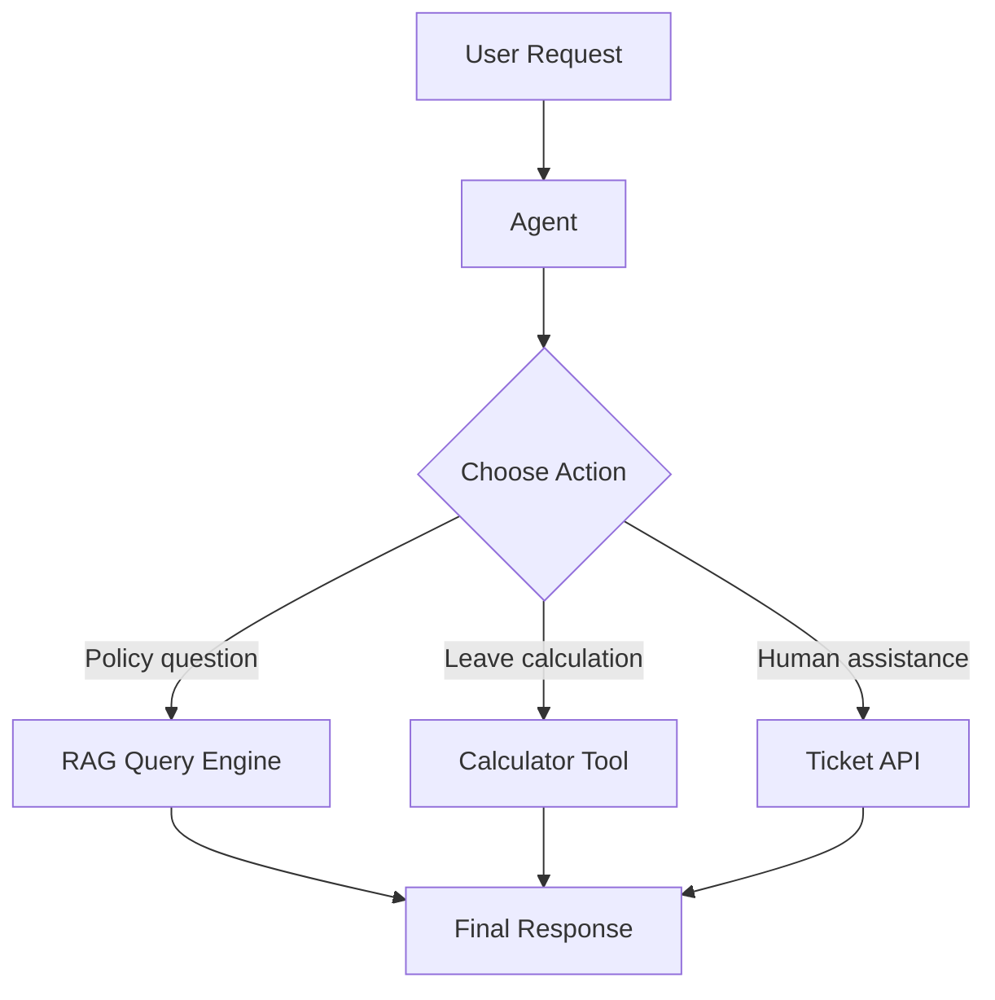
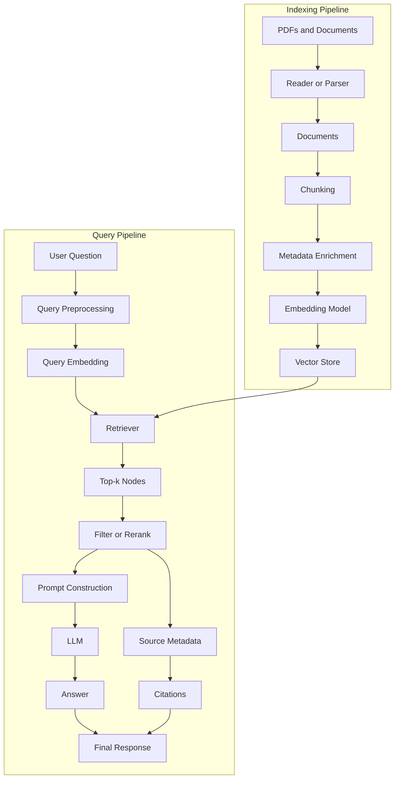
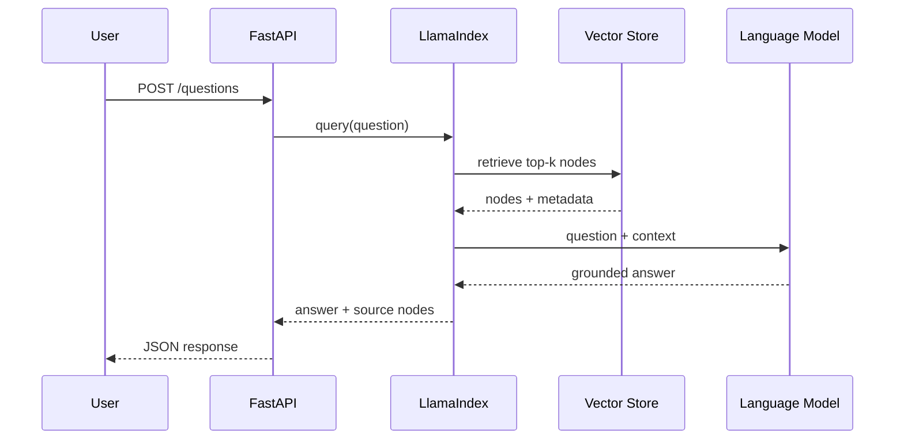

# 012 — LlamaIndex

| Field                  | Details                                                                             |
| ---------------------- | ----------------------------------------------------------------------------------- |
| **Course**             | 03 — Knowledge Systems and RAG                                                      |
| **Module**             | Module 09 — RAG and Implementation                                                  |
| **Content Group**      | Implementation Options                                                              |
| **Roadmap Source**     | RAG and Implementation / Implementation Options                                     |
| **Lesson Type**        | RAG                                                                                 |
| **Order in Module**    | 012                                                                                 |
| **Suggested Duration** | 26 minutes                                                                          |
| **Related Outcome**    | Build RAG applications that answer questions using private documents with citations |
| **Related Project**    | Project 8 — PDF Q&A RAG App with page and chunk citations                           |

---

## 1. Lesson Summary

**LlamaIndex** is a framework for building LLM applications over private, domain-specific, or dynamically retrieved data.

Its main strength is helping developers build the data and retrieval layers of an AI application:

* Loading data from files, APIs, databases, and external services
* Parsing documents into smaller units
* Creating embeddings
* Building indexes
* Retrieving relevant context
* Synthesizing answers
* Returning source information and citations
* Connecting retrieval pipelines to agents and workflows
* Evaluating retrieval and response quality

The official documentation describes LlamaIndex as a framework for building LLM-powered agents over user data. It supports RAG pipelines as well as agents, tools, workflows, structured extraction, storage, evaluation, and observability.

A useful mental model is:

> **LlamaIndex is the data and knowledge orchestration layer between your application, your data sources, retrieval systems, and language models.**

---

## 2. Learning Objectives

After completing this lesson, you should be able to:

1. Explain LlamaIndex in your own words.
2. Identify where LlamaIndex fits in an AI Engineer workflow.
3. Describe its major components.
4. Build a small document-based RAG pipeline.
5. Inspect retrieved chunks before generating an answer.
6. preserve metadata for citations.
7. Evaluate retrieval using a small test dataset.
8. Identify common LlamaIndex and RAG failure modes.
9. Convert a query engine into an agent tool or API endpoint.

---

## 3. What Is LlamaIndex?

LlamaIndex is not an LLM.

It is also not necessarily a vector database.

Instead, it provides abstractions and integrations for connecting:

```text
Application
    ↕
LlamaIndex
    ↕
Documents, APIs, databases, vector stores, embeddings and LLMs
```

A typical LlamaIndex application may use:

* An LLM from OpenAI, Anthropic, Gemini, Groq, Ollama, or another provider
* An embedding model
* A document reader or parser
* A vector store such as Qdrant, Pinecone, Chroma, Weaviate, Milvus, or PostgreSQL
* A retriever
* A response synthesizer
* A query engine, chat engine, agent, or workflow

LlamaIndex provides both high-level APIs for quickly building a RAG prototype and lower-level components for customizing ingestion, indexing, retrieval, reranking, and answer generation.

---

## 4. Where LlamaIndex Fits in the AI Engineer Workflow

LlamaIndex usually sits between your data infrastructure and the user-facing AI application.


In a production system, the framework may appear in two separate workflows.

### Offline or asynchronous indexing workflow

```text
documents
    → parse
    → clean
    → split
    → enrich metadata
    → embed
    → store
```

### Online query workflow

```text
question
    → transform or rewrite query
    → retrieve
    → filter or rerank
    → build context
    → generate answer
    → attach citations
```

Separating these workflows is important because document indexing may be expensive, while retrieval must normally respond quickly.

---

## 5. Core LlamaIndex Concepts

### 5.1 Reader or Data Connector

A reader loads information from a source and converts it into LlamaIndex `Document` objects.

Examples include:

* Local text files
* PDFs
* Microsoft Word documents
* Web pages
* Google Drive
* Notion
* SQL databases
* Cloud storage
* External APIs

`SimpleDirectoryReader` can load supported files from a directory. It can also read subdirectories, restrict the input files, use custom metadata functions, and work with remote filesystems through compatible filesystem implementations.

```python
from llama_index.core import SimpleDirectoryReader

documents = SimpleDirectoryReader(
    input_dir="./data",
    recursive=True,
).load_data()
```

---

### 5.2 Document

A `Document` represents a source item loaded into the pipeline.

A document commonly contains:

* Text
* Metadata
* A document identifier
* Relationships or references to its source

Example metadata:

```python
{
    "file_name": "employee_handbook.pdf",
    "page_label": "12",
    "department": "Human Resources",
    "language": "en",
    "access_level": "internal"
}
```

A document is usually too large to retrieve directly, so it is divided into smaller units.

---

### 5.3 Node

A `Node` is a smaller retrievable unit created from a document.

In a simple text RAG system:

```text
Document ≈ complete source file
Node ≈ searchable chunk from that file
```

When `VectorStoreIndex.from_documents()` is used, LlamaIndex splits documents into chunks and converts them into nodes. Nodes retain metadata and relationships that can later support filtering and source attribution.

A node may contain:

```text
Text:
Employees receive 18 days of annual leave...

Metadata:
file_name = employee_handbook.pdf
page_label = 12
section = Leave Policy
```

---

### 5.4 Transformation

A transformation changes a document or node during ingestion.

Common transformations include:

* Text splitting
* Sentence or token chunking
* Metadata extraction
* Title extraction
* Question generation
* Embedding generation
* Custom cleaning
* Language detection

---

### 5.5 Ingestion Pipeline

An `IngestionPipeline` applies a sequence of transformations to input documents.

It can:

1. Receive documents.
2. Split them into nodes.
3. Add metadata.
4. Generate embeddings.
5. Return the processed nodes.
6. Insert the nodes into a vector store.

LlamaIndex can cache node-transformation results so unchanged content does not always need to be processed again.


Example:

```python
from llama_index.core.ingestion import IngestionPipeline
from llama_index.core.node_parser import SentenceSplitter
from llama_index.embeddings.openai import OpenAIEmbedding

pipeline = IngestionPipeline(
    transformations=[
        SentenceSplitter(
            chunk_size=512,
            chunk_overlap=64,
        ),
        OpenAIEmbedding(
            model="text-embedding-3-small",
        ),
    ]
)

nodes = pipeline.run(documents=documents)
```

Use an ingestion pipeline when you need explicit control over:

* Chunk size
* Chunk overlap
* Metadata
* Embedding model
* Data cleaning
* Indexing behavior
* Re-indexing and caching

---

### 5.6 Embedding Model

An embedding model converts text into a vector.

```text
"Employees receive annual leave"
                 ↓
[0.071, -0.214, 0.803, ...]
```

The vector attempts to represent semantic meaning. At query time, the user's question is also embedded, and the retrieval system searches for nearby vectors.

The embedding model affects:

* Retrieval quality
* Supported languages
* Vector dimensions
* Index size
* Latency
* Cost
* Compatibility with the existing vector store

Changing the embedding model usually requires re-embedding the stored nodes.

---

### 5.7 Index

An index organizes nodes so they can be retrieved efficiently.

The most common index for a basic RAG application is:

```python
VectorStoreIndex
```

Basic construction:

```python
from llama_index.core import VectorStoreIndex

index = VectorStoreIndex(nodes)
```

A shorter prototype can build the index directly from documents:

```python
index = VectorStoreIndex.from_documents(documents)
```

By default, a simple `VectorStoreIndex` can operate in memory. For production systems, it can be connected to persistent vector storage.

---

### 5.8 Retriever

A retriever receives a question and returns the most relevant nodes.

The official definition describes retrievers as components responsible for fetching relevant context for a user query or chat message. Retrievers are also central building blocks for query engines and chat engines.

```python
retriever = index.as_retriever(
    similarity_top_k=4,
)

nodes = retriever.retrieve(
    "How many annual leave days do employees receive?"
)
```

A retriever does not necessarily generate the final answer.

Its responsibility is:

```text
Question → Relevant evidence
```

This distinction is critical when debugging RAG.

---

### 5.9 Node Postprocessor and Reranker

After retrieval, nodes can be filtered, reordered, or reranked.

```text
Initial retrieval
    → metadata filter
    → similarity cutoff
    → reranker
    → final context
```

Possible operations include:

* Removing low-score nodes
* Filtering by tenant or user
* Filtering by document type
* Filtering by date
* Removing duplicates
* Reranking using another model
* Selecting a more diverse set of chunks

Example:

```text
Vector search returns 20 candidates
    → reranker scores all 20
    → best 5 nodes enter the prompt
```

This often improves quality more effectively than simply increasing `top_k`.

---

### 5.10 Response Synthesizer

A response synthesizer combines:

* The user query
* Retrieved context
* Prompt instructions
* LLM output

Its job is approximately:

```text
Question + Retrieved Nodes → Grounded Answer
```

Different response strategies may:

* Use all chunks in one prompt
* Refine an answer across multiple chunks
* Summarize intermediate answers
* Stream output
* Return structured data

---

### 5.11 Query Engine

A query engine provides a high-level interface for asking questions over indexed data.

It usually combines:

```text
Retriever
    + optional postprocessors
    + response synthesizer
    + LLM
```

The official documentation defines a query engine as an interface that receives a natural-language query and returns a rich response. It is commonly constructed from one or more indexes through retrievers.

```python
query_engine = index.as_query_engine(
    similarity_top_k=4,
)

response = query_engine.query(
    "What is the annual leave policy?"
)

print(response)
```

Use a query engine for single-turn question answering.

---

### 5.12 Chat Engine

A chat engine is useful when the application must support multiple conversational turns.

```text
User: What is the annual leave policy?
Assistant: Employees receive 18 days.

User: Can unused days be carried forward?
Assistant: ...
```

A chat engine must consider both retrieval and conversation history.

This introduces additional risks:

* Old messages may consume too much context.
* Follow-up questions may be ambiguous.
* Chat memory may contain information not supported by the current documents.
* Retrieval may need a rewritten standalone question.

---

### 5.13 Agent and Workflow

A RAG pipeline can become a tool used by an agent.

For example, an HR assistant may have these tools:

```text
search_policy_documents()
calculate_leave_balance()
create_support_ticket()
get_employee_profile()
```

LlamaIndex supports agents that combine LLM reasoning with tools and memory. It also provides workflows for orchestrating multi-step, event-driven applications.



---

## 6. End-to-End RAG Architecture



---

## 7. Minimal PDF Q&A Demo

### 7.1 Project Structure

```text
llamaindex-pdf-rag/
├── data/
│   ├── employee_handbook.pdf
│   └── leave_policy.pdf
├── storage/
├── app.py
└── requirements.txt
```

### 7.2 Installation

```bash
pip install llama-index
```

Set the API key using an environment variable:

```bash
# macOS or Linux
export OPENAI_API_KEY="your-api-key"

# Windows PowerShell
$env:OPENAI_API_KEY="your-api-key"
```

Do not hard-code production API keys inside source files.

---

### 7.3 Complete Example

```python
from pathlib import Path

from llama_index.core import (
    Settings,
    SimpleDirectoryReader,
    VectorStoreIndex,
)
from llama_index.core.ingestion import IngestionPipeline
from llama_index.core.node_parser import SentenceSplitter
from llama_index.core.query_engine import CitationQueryEngine
from llama_index.embeddings.openai import OpenAIEmbedding
from llama_index.llms.openai import OpenAI


DATA_DIRECTORY = Path("./data")


def build_index() -> VectorStoreIndex:
    """Load local documents, split them, embed them, and build an index."""

    if not DATA_DIRECTORY.exists():
        raise FileNotFoundError(
            f"Data directory does not exist: {DATA_DIRECTORY.resolve()}"
        )

    Settings.llm = OpenAI(
        model="gpt-4o-mini",
        temperature=0,
    )

    Settings.embed_model = OpenAIEmbedding(
        model="text-embedding-3-small",
    )

    documents = SimpleDirectoryReader(
        input_dir=str(DATA_DIRECTORY),
        recursive=True,
    ).load_data()

    if not documents:
        raise ValueError("No supported documents were found.")

    pipeline = IngestionPipeline(
        transformations=[
            SentenceSplitter(
                chunk_size=512,
                chunk_overlap=64,
            ),
            Settings.embed_model,
        ]
    )

    nodes = pipeline.run(documents=documents)

    if not nodes:
        raise ValueError("The ingestion pipeline produced no nodes.")

    return VectorStoreIndex(nodes)


def create_query_engine(index: VectorStoreIndex) -> CitationQueryEngine:
    """Create a query engine that produces numbered citations."""

    return CitationQueryEngine.from_args(
        index,
        similarity_top_k=4,
        citation_chunk_size=256,
    )


def print_sources(response: object) -> None:
    """Print source metadata and retrieved text for debugging."""

    source_nodes = getattr(response, "source_nodes", [])

    for position, source in enumerate(source_nodes, start=1):
        metadata = source.node.metadata or {}

        file_name = metadata.get("file_name", "unknown")
        page = (
            metadata.get("page_label")
            or metadata.get("page_number")
            or "unknown"
        )

        print(f"\n--- Source {position} ---")
        print(f"File: {file_name}")
        print(f"Page: {page}")
        print(f"Score: {source.score}")
        print(source.node.get_text()[:500])


def main() -> None:
    index = build_index()
    query_engine = create_query_engine(index)

    question = (
        "How many annual leave days do employees receive, "
        "and can unused leave be carried forward?"
    )

    response = query_engine.query(question)

    print("\nANSWER\n")
    print(str(response))

    print("\nRETRIEVED SOURCES")
    print_sources(response)


if __name__ == "__main__":
    main()
```

LlamaIndex's official citation query engine supports configurable retrieval depth and citation chunk size. Its response also exposes source nodes that can be inspected programmatically.

---

## 8. Understanding the Demo

### Step 1: Load documents

```python
documents = SimpleDirectoryReader("./data").load_data()
```

Output:

```text
List[Document]
```

### Step 2: Split documents

```python
SentenceSplitter(
    chunk_size=512,
    chunk_overlap=64,
)
```

Possible output:

```text
Document A
├── Node A1
├── Node A2
├── Node A3
└── Node A4
```

### Step 3: Generate embeddings

```python
Settings.embed_model
```

Each node receives a vector representation.

### Step 4: Build the index

```python
index = VectorStoreIndex(nodes)
```

### Step 5: Retrieve candidates

```python
similarity_top_k=4
```

The system selects four candidate nodes.

### Step 6: Generate the answer

The query engine sends a prompt containing:

```text
System instructions
+ user question
+ retrieved evidence
```

### Step 7: Return citations

The final response contains citation markers and accessible source nodes.

---

## 9. Retrieval Debugging

When a RAG answer is incorrect, do not immediately blame the LLM.

First inspect retrieval:

```python
retriever = index.as_retriever(
    similarity_top_k=5,
)

results = retriever.retrieve(
    "Can unused annual leave be carried forward?"
)

for result in results:
    print(result.score)
    print(result.node.metadata)
    print(result.node.get_text())
    print("-" * 80)
```

Ask the following questions:

1. Was the correct chunk retrieved?
2. Was it ranked near the top?
3. Did the chunk contain enough surrounding context?
4. Was important table structure lost?
5. Did metadata identify the correct source and page?
6. Were irrelevant chunks retrieved because they used similar words?
7. Did the answer generator ignore useful evidence?
8. Did the model add unsupported information?

### Diagnostic Matrix

| Retrieval         | Answer              | Likely Problem                                 |
| ----------------- | ------------------- | ---------------------------------------------- |
| Incorrect         | Incorrect           | Chunking, embedding, metadata or retrieval     |
| Correct           | Incorrect           | Prompt, synthesis or LLM behavior              |
| Partially correct | Incomplete          | `top_k`, chunk boundaries or missing documents |
| Correct           | Correct but uncited | Metadata or citation rendering                 |
| Correct           | Slow                | Reranking, model latency or excessive context  |
| Duplicate chunks  | Repetitive          | Overlap, deduplication or indexing strategy    |

---

## 10. Chunking Strategy

There is no universally correct chunk size.

The correct size depends on:

* Document structure
* Question type
* Embedding model
* Retrieval method
* LLM context window
* Required citation granularity
* Whether the source contains tables, code, or lists

### Chunks That Are Too Small

Possible problems:

* Missing surrounding context
* Split definitions
* Broken tables
* Unclear pronoun references
* Too many nearly identical results

Example:

```text
Chunk 1: Employees receive 18 days.
Chunk 2: These days may be carried forward.
```

The second chunk does not clearly identify what “these days” refers to.

### Chunks That Are Too Large

Possible problems:

* More irrelevant text enters the prompt
* Similarity becomes less precise
* Citations point to broad passages
* Token usage increases
* Important facts become diluted

### Starting Experiment

Try several configurations:

| Experiment | Chunk Size | Overlap | Top-k |
| ---------- | ---------: | ------: | ----: |
| A          |        256 |      32 |     5 |
| B          |        512 |      64 |     4 |
| C          |        768 |      96 |     3 |
| D          |      1,024 |     128 |     3 |

Evaluate them using the same question set.

Do not select a configuration based only on one impressive demo question.

---

## 11. Metadata and Citation Design

Useful metadata may include:

```python
{
    "document_id": "hr-handbook-2026",
    "file_name": "employee_handbook.pdf",
    "page_label": "12",
    "section": "Annual Leave",
    "department": "HR",
    "version": "2026.1",
    "effective_date": "2026-01-01",
    "tenant_id": "company-a",
    "access_level": "internal"
}
```

Metadata supports:

* Citations
* Page links
* Access control
* Tenant isolation
* Date filtering
* Version filtering
* Debugging
* Document replacement
* Audit logs

LlamaIndex allows custom file metadata functions when loading documents, while nodes preserve metadata during indexing.

### Citation Response Example

```markdown
Employees receive 18 days of annual leave per year. Unused leave may
be carried forward up to a maximum of five days [1][2].

Sources:

1. `employee_handbook.pdf`, page 12
2. `leave_policy.pdf`, page 3
```

A citation is useful only when the user can verify it.

Weak citation:

```text
Source 1
```

Better citation:

```text
Employee Handbook 2026 — Page 12 — Annual Leave
```

---

## 12. Persisting the Index

Without persistence, an application may rebuild embeddings every time it starts.

```python
index.storage_context.persist(
    persist_dir="./storage"
)
```

Load it later:

```python
from llama_index.core import (
    StorageContext,
    load_index_from_storage,
)

storage_context = StorageContext.from_defaults(
    persist_dir="./storage"
)

index = load_index_from_storage(
    storage_context
)
```

LlamaIndex stores simple indexes in memory by default but supports explicit persistence and alternative storage backends.

### Important Production Rule

An existing index should only be reused when its configuration is compatible.

Track at least:

```text
embedding model
chunking strategy
metadata schema
parser version
document version
index version
```

When one of these changes, determine whether the affected documents need to be reprocessed.

---

## 13. Evaluation

A RAG system has at least two separate quality problems:

```text
Retrieval quality
        +
Generation quality
```

### 13.1 Retrieval Evaluation

Retrieval evaluation asks:

> Did the system retrieve the evidence required to answer the question?

Common metrics include:

* Hit Rate
* Mean Reciprocal Rank
* Precision at k
* Recall at k
* Normalized Discounted Cumulative Gain

LlamaIndex provides retrieval evaluation components that compare retrieved node IDs with expected node IDs. Its documentation demonstrates evaluation using `mrr` and `hit_rate`.

Example test case:

```python
{
    "question": "How many annual leave days are provided?",
    "expected_node_ids": ["leave-policy-page-12-chunk-2"]
}
```

Conceptual evaluation:

```python
from llama_index.core.evaluation import RetrieverEvaluator

retriever = index.as_retriever(
    similarity_top_k=4
)

evaluator = RetrieverEvaluator.from_metric_names(
    ["mrr", "hit_rate"],
    retriever=retriever,
)

result = evaluator.evaluate(
    query="How many annual leave days are provided?",
    expected_ids=["leave-policy-page-12-chunk-2"],
)

print(result)
```

---

### 13.2 Response Evaluation

Response evaluation asks:

* Is the answer supported by the retrieved context?
* Does it answer the question?
* Is it complete?
* Is it relevant?
* Does it contain unsupported claims?
* Are its citations correct?

Possible evaluation dimensions:

| Dimension             | Main Question                                |
| --------------------- | -------------------------------------------- |
| Faithfulness          | Is every factual claim supported by context? |
| Relevance             | Does the response answer the user question?  |
| Correctness           | Does it match a reference answer?            |
| Completeness          | Does it cover all required parts?            |
| Citation accuracy     | Do citations support the attached claims?    |
| Citation completeness | Are important claims cited?                  |

LlamaIndex includes evaluators for both generated responses and retrieval results.

---

### 13.3 Small Test Dataset

Create at least 10 questions:

```json
[
  {
    "question": "How many annual leave days do employees receive?",
    "expected_answer": "18 days",
    "expected_source": "employee_handbook.pdf",
    "expected_page": 12
  },
  {
    "question": "How many unused days can be carried forward?",
    "expected_answer": "Up to 5 days",
    "expected_source": "leave_policy.pdf",
    "expected_page": 3
  },
  {
    "question": "Can leave be transferred to another employee?",
    "expected_answer": "The documents do not state that it can.",
    "expected_source": null,
    "expected_page": null
  }
]
```

Include multiple question types:

* Direct lookup
* Multi-document question
* Paraphrased question
* Ambiguous question
* Unsupported question
* Date-sensitive question
* Access-controlled question
* Table-based question

---

## 14. Handling Unsupported Questions

A production RAG app must know when not to answer.

Recommended prompt behavior:

```text
Answer only from the provided context.

If the context does not contain enough information, say that the
documents do not provide a reliable answer.

Do not use unsupported assumptions.

Attach citations to factual claims.
```

Possible confidence gate:

```python
if not retrieved_nodes:
    return {
        "answer": "I could not find this information in the available documents.",
        "citations": [],
        "status": "insufficient_context",
    }
```

You may also check:

* Highest retrieval score
* Number of independent supporting sources
* Whether the sources agree
* Whether required metadata exists
* Whether the answer contains uncited factual claims

A similarity score is not automatically a calibrated probability, so avoid treating it as absolute confidence without validation.

---

## 15. LlamaIndex as an API Service

A query engine can be exposed through a web API.



Suggested response schema:

```json
{
  "answer": "Employees receive 18 days of annual leave.",
  "citations": [
    {
      "document_id": "hr-handbook-2026",
      "file_name": "employee_handbook.pdf",
      "page": 12,
      "chunk_id": "leave-policy-page-12-chunk-2",
      "excerpt": "Full-time employees receive 18 days..."
    }
  ],
  "retrieval": {
    "top_k": 4,
    "returned_sources": 2
  },
  "status": "answered"
}
```

Do not expose internal model prompts, secrets, storage credentials, or private metadata through the public response.

---

## 16. Common Mistakes

### Mistake 1: Treating LlamaIndex as a magic accuracy layer

A framework can organize the pipeline, but it cannot guarantee good data, correct retrieval, or faithful generation.

**Fix:** Build an evaluation set.

---

### Mistake 2: Selecting chunk size by intuition

```text
"It looks reasonable."
```

is not an evaluation method.

**Fix:** Compare multiple chunking configurations using the same questions.

---

### Mistake 3: Losing source metadata

Without file and page metadata, the app cannot produce useful citations.

**Fix:** Add and validate metadata during ingestion.

---

### Mistake 4: Testing only the final answer

A good-looking answer may hide poor retrieval.

**Fix:** Log and inspect the top-k nodes.

---

### Mistake 5: Increasing top-k indefinitely

More context does not always produce a better answer.

A larger `top_k` may:

* Increase latency
* Increase token usage
* Add conflicting information
* Reduce answer precision

**Fix:** Retrieve candidates, then rerank or filter them.

---

### Mistake 6: Rebuilding the index on every request

This creates unnecessary embedding calls and latency.

**Fix:** Separate indexing from online querying and persist the index.

---

### Mistake 7: Ignoring document versions

An outdated policy may be retrieved instead of the current policy.

**Fix:** Store version and effective-date metadata and apply filters.

---

### Mistake 8: Ignoring authorization

A semantically relevant chunk may belong to another user or tenant.

**Fix:** Apply authorization and tenant filters before any retrieved content enters the model context.

---

### Mistake 9: Answering without sufficient evidence

The model may use general knowledge when retrieval fails.

**Fix:** Add an insufficient-context response and a confidence gate.

---

### Mistake 10: Changing the embedding model without rebuilding vectors

Vectors generated by different embedding models may not be compatible.

**Fix:** Version the embedding configuration and rebuild affected indexes.

---

## 17. Practical Exercise

### Goal

Build a small question-answering application over 5–10 documents.

### Requirements

Your application must:

1. Load documents from a directory.
2. Preserve file metadata.
3. Split documents into nodes.
4. Generate embeddings.
5. Build a vector index.
6. Retrieve the top-k nodes.
7. Print retrieval scores and metadata.
8. Generate answers with citations.
9. Refuse unsupported questions.
10. Evaluate at least 10 test questions.

### Suggested Documents

Choose one small domain:

* University regulations
* Product manuals
* Employee policies
* API documentation
* Course notes
* Project requirements
* Public reports

### Experiments

Run at least three configurations:

```text
Experiment A:
chunk_size = 256
chunk_overlap = 32
top_k = 5

Experiment B:
chunk_size = 512
chunk_overlap = 64
top_k = 4

Experiment C:
chunk_size = 1,024
chunk_overlap = 128
top_k = 3
```

Record:

| Question | Expected Source | Retrieved Top-k | Correct Answer    | Citation Correct |
| -------- | --------------- | --------------- | ----------------- | ---------------- |
| Q1       | Handbook p.12   | A2, A5, B1      | Yes               | Yes              |
| Q2       | Policy p.3      | B4, A7, B2      | Partial           | No               |
| Q3       | No source       | A1, C2, B5      | Incorrect refusal | N/A              |

---

## 18. Portfolio Mini-Project

### Project Name

**PDF Knowledge Assistant with Verifiable Citations**

### Core Features

* Upload or register PDF documents
* Parse text by page
* Store page and document metadata
* Build or update an index
* Ask natural-language questions
* Display retrieved evidence
* Generate answers with page citations
* Reject unsupported questions
* Evaluate against a test dataset
* Log latency and retrieval results

### Optional Advanced Features

* Hybrid keyword and vector search
* Reranking
* Streaming responses
* Multi-tenant access control
* Document versioning
* Incremental indexing
* Query rewriting
* Conversation memory
* Agent tool integration
* Multimodal parsing for tables and images
* Feedback collection
* Evaluation dashboard

### Suggested Portfolio Evidence

Include:

```text
README.md
architecture diagram
sample documents
test questions
retrieval evaluation results
failure case analysis
API contract
screenshots or demo video
```

A strong portfolio project does not only show successful answers. It also explains:

* What failed
* Why it failed
* What was changed
* Which metric improved

---

## 19. Production Checklist

### Data

* [ ] Documents have stable identifiers.
* [ ] Duplicate documents are detected.
* [ ] Document versions are tracked.
* [ ] Deleted documents are removed from the index.
* [ ] Unsupported file types fail clearly.
* [ ] Parsing quality is checked.

### Chunking

* [ ] Chunk size was tested.
* [ ] Chunk overlap was tested.
* [ ] Headings and sections are preserved.
* [ ] Tables are not silently destroyed.
* [ ] Chunk IDs are stable or versioned.

### Metadata

* [ ] File name is stored.
* [ ] Page number or page label is stored.
* [ ] Document version is stored.
* [ ] Tenant or access metadata is stored.
* [ ] Metadata filters are tested.

### Retrieval

* [ ] `top_k` was evaluated.
* [ ] Retrieval results are logged.
* [ ] Irrelevant results are analyzed.
* [ ] Duplicate results are controlled.
* [ ] Hybrid search or reranking was considered.

### Generation

* [ ] The model is instructed to use only retrieved evidence.
* [ ] Unsupported questions are refused.
* [ ] Citations are attached to factual claims.
* [ ] Conflicting sources are reported.
* [ ] Prompt injection from documents is considered.

### Operations

* [ ] Indexes are persisted.
* [ ] Index versions are tracked.
* [ ] API keys are stored securely.
* [ ] Latency is monitored.
* [ ] Token usage is monitored.
* [ ] Failures have structured logs.
* [ ] Evaluation runs before major releases.

### Security

* [ ] Retrieval enforces user permissions.
* [ ] Tenant filters cannot be bypassed.
* [ ] Sensitive metadata is not exposed.
* [ ] Uploaded files are validated.
* [ ] Retrieved document text is treated as untrusted input.
* [ ] Logs do not contain unnecessary private data.

---

## 20. Suggested 26-Minute Study Plan

|          Time | Activity                                        |
| ------------: | ----------------------------------------------- |
|   0–4 minutes | Understand what LlamaIndex is                   |
|   4–8 minutes | Review the indexing and query workflows         |
|  8–13 minutes | Learn Documents, Nodes, Indexes and Retrievers  |
| 13–19 minutes | Run the minimal RAG demo                        |
| 19–23 minutes | Inspect retrieval and citations                 |
| 23–26 minutes | Record failure cases and complete the checklist |

---

## 21. One-Minute Explanation

> LlamaIndex is a framework for connecting LLM applications to private or domain-specific data. It provides components for loading documents, splitting them into nodes, generating embeddings, building indexes, retrieving relevant context, synthesizing answers, and returning sources. In a RAG application, LlamaIndex usually manages the data and retrieval workflow between documents, a vector store, and the language model. However, using the framework does not guarantee a good system. Retrieval quality, metadata, citations, security, and evaluation still need to be designed and tested.

---

## 22. Completion Checklist

* [ ] I can explain LlamaIndex in one or two minutes.
* [ ] I understand the difference between a Document and a Node.
* [ ] I can explain ingestion, indexing, retrieval, and synthesis.
* [ ] I can build a `VectorStoreIndex`.
* [ ] I can inspect retrieved nodes.
* [ ] I can preserve source and page metadata.
* [ ] I can generate an answer with citations.
* [ ] I have created at least 10 test questions.
* [ ] I have compared at least two chunking configurations.
* [ ] I have recorded at least one retrieval failure.
* [ ] I understand that RAG evaluation must cover retrieval and generation separately.
* [ ] I know how a query engine can become an API route or agent tool.

---

## 23. Key Takeaways

1. **LlamaIndex connects data to LLM applications.**
2. **Documents are transformed into smaller retrievable nodes.**
3. **Indexes organize nodes for retrieval.**
4. **Retrievers find evidence; they do not necessarily generate answers.**
5. **Query engines combine retrieval and response generation.**
6. **Metadata is essential for citations, filtering, and security.**
7. **Chunk size and top-k must be tested rather than guessed.**
8. **A polished answer does not prove that retrieval worked correctly.**
9. **Evaluation should measure both retrieval and generation.**
10. **A production RAG system must support persistence, authorization, observability, and failure handling.**

---

## 24. Final Outcome

After completing this lesson, you should have a small but inspectable RAG artifact:

```text
5–10 documents
    +
document loader
    +
chunking configuration
    +
embedding model
    +
vector index
    +
retriever
    +
citation query engine
    +
10-question test set
    +
failure analysis
```

This artifact can later be extended into:

* A PDF Q&A application
* A private knowledge chatbot
* A customer support assistant
* A documentation search tool
* A research assistant
* A RAG API
* An agent knowledge tool
* A multimodal document workflow
