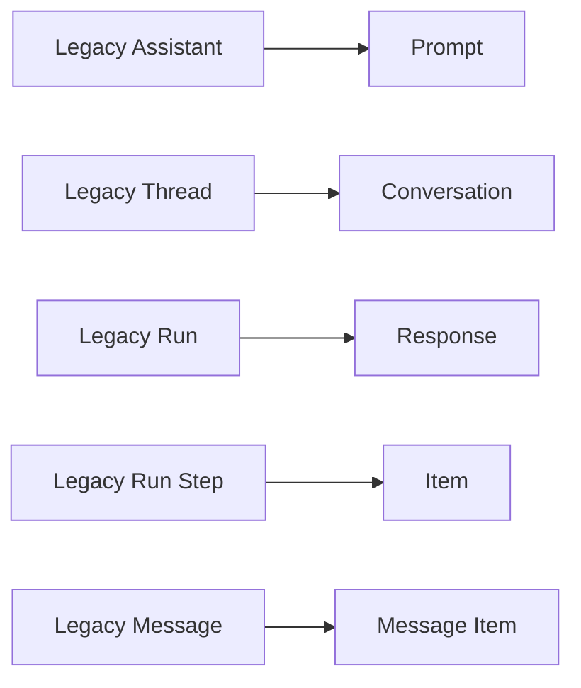
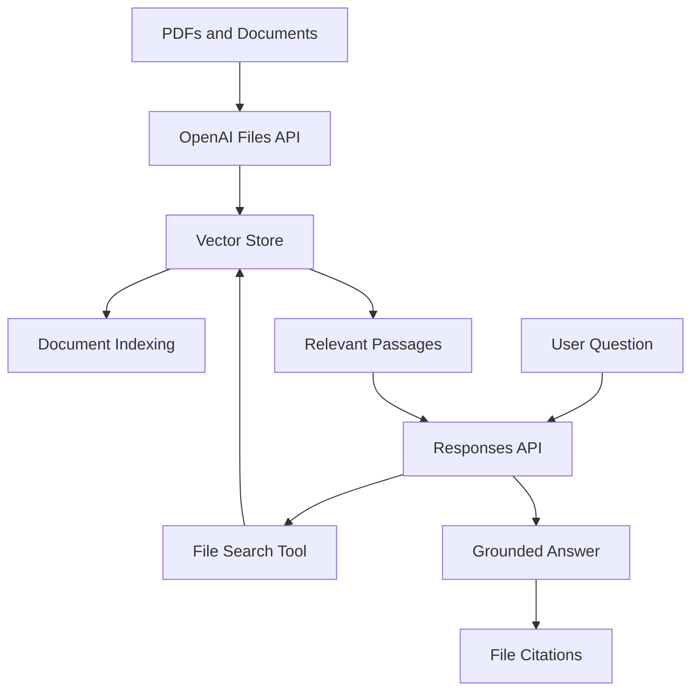
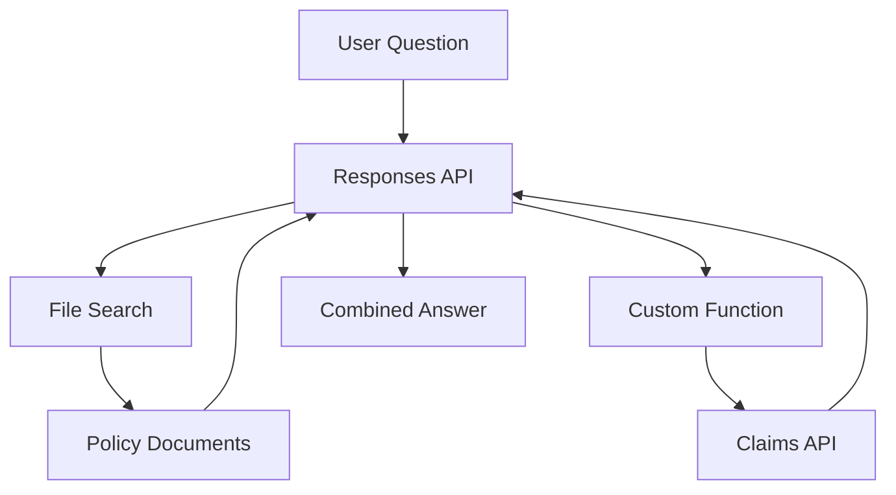

# 013 — OpenAI Assistants API and the Responses API

**Course:** 03 — Knowledge Systems and RAG
**Module:** Module 09 — RAG and Implementation
**Content Group:** Implementation Options
**Roadmap Source:** RAG and Implementation / Implementation Options
**Lesson Type:** RAG
**Order in Module:** 013
**Suggested Duration:** 26 minutes

---

## Important Platform Update

The **OpenAI Assistants API is now a legacy API**.

OpenAI deprecated the Assistants API on **August 26, 2025**, and it is scheduled to shut down on **August 26, 2026**. New applications should use the **Responses API**, together with tools such as File Search, function calling, Code Interpreter, web search, and MCP.

This lesson therefore covers:

1. How the Assistants API worked.
2. Why it was useful for RAG and agent applications.
3. How its concepts map to the modern Responses API.
4. How to build a private-document Q&A application using Responses and File Search.

---

## 1. Overview

The OpenAI Assistants API was designed to help developers create persistent AI assistants that could:

* Follow reusable instructions.
* Maintain conversation history.
* Search uploaded documents.
* Call application functions.
* Run code.
* Perform multi-step tasks.

Instead of manually sending the entire conversation and tool configuration with every model request, developers could create persistent objects such as assistants, threads, messages, and runs.

Today, the **Responses API** provides the modern replacement. It offers a unified interface for model generation, tool use, multimodal input, stateful conversations, and agent-like workflows. OpenAI recommends Responses for new projects.

For RAG applications, the most relevant built-in capability is **File Search**. File Search lets a model retrieve relevant information from files stored in an OpenAI vector store before generating an answer. It combines semantic and keyword search and is executed as a hosted OpenAI tool.

---

## 2. Learning Objectives

After completing this lesson, you should be able to:

* Explain the purpose of the legacy Assistants API.
* Describe assistants, threads, messages, runs, and tools.
* Explain why the Responses API replaces the Assistants API.
* Map legacy Assistants API objects to modern Responses API concepts.
* Create a vector store and upload private documents.
* Connect File Search to a Responses API request.
* Build a small PDF question-answering application.
* Extract and display file citations.
* Evaluate retrieval and answer quality using a test dataset.
* Identify when hosted File Search is preferable to a custom RAG pipeline.
* Recognize limitations related to retrieval control, citations, cost, privacy, and vendor dependency.

---

## 3. Why This Topic Matters

A basic LLM request usually looks like this:

```text
user prompt -> language model -> generated answer
```

This works when the model already knows enough to answer the question.

However, many real applications need information that is:

* Private.
* Frequently updated.
* Organization-specific.
* Too large to place entirely in a prompt.
* Outside the model's training data.
* Required to be traceable to a source.

Examples include:

* An employee handbook assistant.
* A university policy chatbot.
* A legal-document search tool.
* A product support assistant.
* A medical research knowledge assistant.
* A PDF study application.
* An internal engineering documentation bot.

These applications need a retrieval layer:

```text
private documents
        ↓
document processing
        ↓
searchable knowledge base
        ↓
relevant context retrieval
        ↓
LLM answer with citations
```

The Assistants API originally provided a managed way to build this workflow. The Responses API and File Search now provide the recommended implementation.

---

## 4. Legacy Assistants API Architecture

The legacy Assistants API introduced several persistent objects.

### 4.1 Assistant

An **Assistant** represented the reusable configuration of an AI assistant.

It could contain:

* Model selection.
* System instructions.
* Tool definitions.
* File Search configuration.
* Code Interpreter configuration.
* Function definitions.

Conceptually:

```json
{
  "name": "Company Policy Assistant",
  "instructions": "Answer questions using company documents.",
  "model": "model-name",
  "tools": [
    {
      "type": "file_search"
    }
  ]
}
```

The assistant described **how the AI should behave**, but it did not represent a particular user conversation.

---

### 4.2 Thread

A **Thread** represented a conversation.

Each user, chat session, or support ticket could have its own thread.

```text
Assistant
   ├── Thread for User A
   ├── Thread for User B
   └── Thread for User C
```

A thread stored the messages exchanged during one conversation.

---

### 4.3 Message

A **Message** was an individual conversation item inside a thread.

Messages could come from:

* The user.
* The assistant.
* Tool outputs.

Example:

```text
User:
What is the company's annual leave policy?

Assistant:
Employees receive 15 days of annual leave...
```

---

### 4.4 Run

A **Run** instructed the platform to process a thread using an assistant.

The run could:

1. Read the thread messages.
2. Decide whether a tool was necessary.
3. Search files or call a function.
4. Generate an answer.
5. Add the answer to the thread.

```text
Thread + Assistant configuration
             ↓
            Run
             ↓
     tool calls and reasoning
             ↓
       assistant message
```

---

### 4.5 Run Steps

A run could contain several internal steps, such as:

```text
1. Read user question
2. Search uploaded files
3. Retrieve relevant passages
4. Generate grounded answer
5. Attach citations
```

These actions were represented as **Run Steps**.

---

### 4.6 Tools

Assistants could use tools such as:

* File Search.
* Code Interpreter.
* Custom functions.

Tools allowed the model to do more than generate text.

For example:

```text
User asks a policy question
        ↓
Assistant calls File Search
        ↓
Relevant handbook content is retrieved
        ↓
Assistant generates a cited answer
```

---

## 5. From Assistants to Responses

The Responses API uses a simpler object model.

OpenAI maps the legacy concepts approximately as follows:

| Legacy Assistants API | Modern Platform Concept | Purpose                                         |
| --------------------- | ----------------------- | ----------------------------------------------- |
| Assistant             | Prompt                  | Reusable instructions, model settings and tools |
| Thread                | Conversation            | Persistent sequence of conversation items       |
| Run                   | Response                | One execution of the model and its tools        |
| Run Step              | Item                    | Message, tool call, tool result or other output |
| Message               | Message item            | User or assistant content                       |

### Migration diagram



The modern mental model is:

```text
input items
    +
instructions
    +
available tools
    +
optional conversation state
        ↓
Responses API
        ↓
output items
```

A response may contain several types of output items:

* Assistant messages.
* File Search calls.
* Function calls.
* Function-call results.
* Code execution outputs.
* Reasoning-related items.

The Responses API is designed as a unified interface for agent-like applications and supports built-in tools, multimodal input, tool loops, and conversation state.

---

## 6. Responses API Architecture for RAG

A modern OpenAI-hosted RAG workflow looks like this:



File Search requires a knowledge base stored in a vector store. Once files have been uploaded and indexed, the vector store ID can be attached to a Responses API request.

---

## 7. What OpenAI File Search Manages

In a custom RAG system, your application normally needs to implement:

```text
file parsing
    ↓
text cleaning
    ↓
chunking
    ↓
embedding generation
    ↓
vector storage
    ↓
query embedding
    ↓
similarity search
    ↓
context assembly
    ↓
answer generation
```

With hosted File Search, OpenAI manages much of the retrieval execution for you.

The high-level workflow becomes:

```text
upload file
    ↓
add file to vector store
    ↓
wait for indexing
    ↓
send user question
    ↓
model calls File Search
    ↓
model answers using retrieved content
```

File Search searches previously uploaded files using semantic and keyword retrieval. The model can decide when to call the tool, and the platform manages the tool execution.

---

## 8. Minimal Responses API Request

A basic text request uses `client.responses.create`:

```python
from openai import OpenAI

client = OpenAI()

response = client.responses.create(
    model="gpt-5.6",
    input="Explain retrieval-augmented generation in two paragraphs.",
)

print(response.output_text)
```

The Responses API returns typed output items rather than the `choices` structure used by Chat Completions. The SDK provides the `output_text` helper for extracting generated text.

---

## 9. Building a Private-Document Knowledge Base

### 9.1 Install the SDK

```bash
pip install --upgrade openai
```

Set the API key as an environment variable:

```bash
export OPENAI_API_KEY="your-api-key"
```

On Windows PowerShell:

```powershell
$env:OPENAI_API_KEY="your-api-key"
```

Never expose the API key in frontend code or commit it to Git.

---

### 9.2 Upload a file

```python
from pathlib import Path

from openai import OpenAI

client = OpenAI()

document_path = Path("documents/employee_handbook.pdf")

if not document_path.exists():
    raise FileNotFoundError(f"Document not found: {document_path}")

with document_path.open("rb") as document:
    uploaded_file = client.files.create(
        file=document,
        purpose="assistants",
    )

print("File ID:", uploaded_file.id)
```

The current OpenAI File Search documentation still uses the `assistants` file purpose when uploading files for this workflow.

---

### 9.3 Create a vector store

```python
vector_store = client.vector_stores.create(
    name="employee-handbook-knowledge-base"
)

print("Vector store ID:", vector_store.id)
```

A vector store acts as the searchable knowledge base used by File Search.

---

### 9.4 Add the file to the vector store

```python
vector_store_file = client.vector_stores.files.create(
    vector_store_id=vector_store.id,
    file_id=uploaded_file.id,
)

print("Indexing status:", vector_store_file.status)
```

---

### 9.5 Wait for indexing

The document must finish processing before it can be searched. OpenAI's documentation recommends checking until the file status becomes `completed`.

```python
import time


def wait_until_indexed(
    client: OpenAI,
    vector_store_id: str,
    timeout_seconds: int = 300,
) -> None:
    started_at = time.time()

    while True:
        result = client.vector_stores.files.list(
            vector_store_id=vector_store_id
        )

        statuses = [item.status for item in result.data]
        print("Current statuses:", statuses)

        if statuses and all(status == "completed" for status in statuses):
            return

        failed_statuses = {"failed", "cancelled"}

        if any(status in failed_statuses for status in statuses):
            raise RuntimeError(
                f"Vector-store indexing failed: {statuses}"
            )

        if time.time() - started_at > timeout_seconds:
            raise TimeoutError(
                "The document was not indexed before the timeout."
            )

        time.sleep(2)


wait_until_indexed(
    client=client,
    vector_store_id=vector_store.id,
)
```

In production, document ingestion should normally be performed separately from user question answering. Do not upload and re-index the same document on every request.

---

## 10. Asking Questions with File Search

Once the vector store is ready, include the `file_search` tool in the request.

```python
question = "How many days of annual leave do employees receive?"

response = client.responses.create(
    model="gpt-5.6",
    instructions=(
        "Answer only from the provided company documents. "
        "If the documents do not contain enough information, say that "
        "the answer could not be found. Do not invent policy details."
    ),
    input=question,
    tools=[
        {
            "type": "file_search",
            "vector_store_ids": [vector_store.id],
            "max_num_results": 5,
        }
    ],
    include=["file_search_call.results"],
)

print(response.output_text)
```

The vector store IDs tell the model which knowledge bases it may search. The optional `max_num_results` field limits how many retrieval results the tool should return.

The `include` option is important during development because File Search results are not included in the response by default. You can request them with:

```python
include=["file_search_call.results"]
```

---

## 11. Complete Demo

The following script combines document ingestion, indexing, retrieval, and answer generation.

```python
import os
import time
from pathlib import Path

from openai import OpenAI


MODEL = os.getenv("OPENAI_MODEL", "gpt-5.6")
DOCUMENT_PATH = Path("documents/employee_handbook.pdf")
QUESTION = "What is the remote-work approval process?"


def wait_for_indexing(
    client: OpenAI,
    vector_store_id: str,
    timeout_seconds: int = 300,
) -> None:
    started_at = time.time()

    while True:
        result = client.vector_stores.files.list(
            vector_store_id=vector_store_id
        )

        statuses = [item.status for item in result.data]

        if statuses and all(status == "completed" for status in statuses):
            return

        if any(status in {"failed", "cancelled"} for status in statuses):
            raise RuntimeError(
                f"Document indexing failed: {statuses}"
            )

        if time.time() - started_at > timeout_seconds:
            raise TimeoutError("Document indexing timed out.")

        time.sleep(2)


def create_knowledge_base(
    client: OpenAI,
    document_path: Path,
) -> str:
    if not document_path.exists():
        raise FileNotFoundError(
            f"Document not found: {document_path}"
        )

    with document_path.open("rb") as document:
        uploaded_file = client.files.create(
            file=document,
            purpose="assistants",
        )

    vector_store = client.vector_stores.create(
        name="employee-handbook-rag"
    )

    client.vector_stores.files.create(
        vector_store_id=vector_store.id,
        file_id=uploaded_file.id,
    )

    wait_for_indexing(
        client=client,
        vector_store_id=vector_store.id,
    )

    return vector_store.id


def ask_document_question(
    client: OpenAI,
    vector_store_id: str,
    question: str,
) -> str:
    response = client.responses.create(
        model=MODEL,
        instructions=(
            "You are a document question-answering assistant. "
            "Use only information retrieved from the supplied files. "
            "Clearly distinguish documented facts from uncertainty. "
            "If the answer is unavailable, respond with: "
            "'The supplied documents do not contain enough information.'"
        ),
        input=question,
        tools=[
            {
                "type": "file_search",
                "vector_store_ids": [vector_store_id],
                "max_num_results": 5,
            }
        ],
        include=["file_search_call.results"],
    )

    return response.output_text


def main() -> None:
    client = OpenAI()

    vector_store_id = create_knowledge_base(
        client=client,
        document_path=DOCUMENT_PATH,
    )

    answer = ask_document_question(
        client=client,
        vector_store_id=vector_store_id,
        question=QUESTION,
    )

    print("\nQuestion:")
    print(QUESTION)

    print("\nAnswer:")
    print(answer)


if __name__ == "__main__":
    main()
```

---

## 12. Understanding the Response

When the model uses File Search, the response can contain multiple output items:

```text
Response
├── file_search_call
│   ├── search query
│   ├── status
│   └── optional retrieved results
│
└── message
    ├── generated answer
    └── file citation annotations
```

OpenAI documents that a File Search response includes:

1. A `file_search_call` output item.
2. A message output containing the answer and file citations.

A simplified response may look like this:

```json
{
  "output": [
    {
      "type": "file_search_call",
      "status": "completed"
    },
    {
      "type": "message",
      "role": "assistant",
      "content": [
        {
          "type": "output_text",
          "text": "Employees receive 15 days of annual leave.",
          "annotations": [
            {
              "type": "file_citation",
              "file_id": "file_123",
              "filename": "employee_handbook.pdf"
            }
          ]
        }
      ]
    }
  ]
}
```

---

## 13. Extracting Citation Metadata

You can inspect message annotations to collect citation information.

```python
def extract_file_citations(response) -> list[dict[str, str]]:
    citations: list[dict[str, str]] = []

    for output_item in response.output:
        if getattr(output_item, "type", None) != "message":
            continue

        for content_item in getattr(output_item, "content", []):
            if getattr(content_item, "type", None) != "output_text":
                continue

            for annotation in getattr(content_item, "annotations", []):
                if getattr(annotation, "type", None) != "file_citation":
                    continue

                citations.append(
                    {
                        "file_id": getattr(annotation, "file_id", ""),
                        "filename": getattr(annotation, "filename", ""),
                    }
                )

    return citations
```

Usage:

```python
response = client.responses.create(
    model=MODEL,
    input="What is the annual leave policy?",
    tools=[
        {
            "type": "file_search",
            "vector_store_ids": [vector_store_id],
        }
    ],
)

print(response.output_text)

for citation in extract_file_citations(response):
    print(
        f"Source: {citation['filename']} "
        f"({citation['file_id']})"
    )
```

### Important citation limitation

File Search annotations can identify the source file. The documented response example exposes fields such as `file_id` and `filename`.

For a portfolio project that requires exact citations such as:

```text
Employee Handbook, page 17, chunk 42
```

you may need a more controlled ingestion and retrieval strategy that preserves:

* Page number.
* Section heading.
* Chunk ID.
* Document version.
* Source URL.
* Publication date.

This is an important distinction:

```text
Hosted File Search
    → easier implementation
    → less retrieval infrastructure
    → file-level citation support

Custom RAG
    → more engineering work
    → greater chunking and ranking control
    → exact page/chunk citation metadata
```

---

## 14. Multi-Turn Conversations

There are three common ways to manage conversation context with the Responses API.

### Option 1: Pass previous messages manually

```python
context = [
    {
        "role": "user",
        "content": "What is the annual leave policy?"
    }
]

first_response = client.responses.create(
    model=MODEL,
    input=context,
)

context.extend(first_response.output)

context.append(
    {
        "role": "user",
        "content": "Does it change after five years?"
    }
)

second_response = client.responses.create(
    model=MODEL,
    input=context,
)
```

This gives your application direct control over:

* History trimming.
* Summarization.
* Context limits.
* Data storage.

---

### Option 2: Use `previous_response_id`

```python
first_response = client.responses.create(
    model=MODEL,
    input="What is the annual leave policy?",
    store=True,
)

second_response = client.responses.create(
    model=MODEL,
    input="Does it change after five years?",
    previous_response_id=first_response.id,
    store=True,
)

print(second_response.output_text)
```

`previous_response_id` creates a response chain. However, top-level instructions should be sent again because previous instructions are not automatically carried into the next request. Previous input tokens are also still billed when used as context.

---

### Option 3: Use a persistent Conversation

Use a Conversation when your application requires a persistent server-managed conversation object.

Conceptually:

```text
User session
    ↓
Conversation ID
    ↓
multiple Responses API calls
    ↓
persistent item history
```

This is the closest modern equivalent to an Assistants API thread.

---

## 15. Adding Custom Tools

RAG answers often need to combine document retrieval with application data.

For example:

```text
User:
What is the reimbursement policy, and what is the status of my claim?

Required data:
1. Policy document from File Search.
2. Claim status from an internal API.
```

The model may need two tools:



A simplified function definition could look like this:

```python
tools = [
    {
        "type": "file_search",
        "vector_store_ids": [vector_store_id],
    },
    {
        "type": "function",
        "name": "get_claim_status",
        "description": "Return the current status of an expense claim.",
        "parameters": {
            "type": "object",
            "properties": {
                "claim_id": {
                    "type": "string",
                    "description": "The expense claim identifier."
                }
            },
            "required": ["claim_id"],
            "additionalProperties": False,
        },
        "strict": True,
    },
]
```

Your backend must execute custom functions and return their outputs to the model. Unlike hosted File Search, your application is responsible for the function implementation, authentication, validation, error handling, and authorization.

---

## 16. Example Backend API Route

The following FastAPI route demonstrates how a frontend could call a document Q&A service.

```python
import os

from fastapi import FastAPI, HTTPException
from pydantic import BaseModel, Field
from openai import OpenAI


app = FastAPI(title="PDF Q&A RAG API")

client = OpenAI()

MODEL = os.getenv("OPENAI_MODEL", "gpt-5.6")
VECTOR_STORE_ID = os.environ["OPENAI_VECTOR_STORE_ID"]


class QuestionRequest(BaseModel):
    question: str = Field(
        min_length=3,
        max_length=2_000,
    )


class QuestionResponse(BaseModel):
    answer: str


@app.post("/api/v1/documents/ask", response_model=QuestionResponse)
def ask_document(request: QuestionRequest) -> QuestionResponse:
    try:
        response = client.responses.create(
            model=MODEL,
            instructions=(
                "Answer using only the supplied document knowledge base. "
                "Do not invent missing facts. Mention uncertainty clearly."
            ),
            input=request.question,
            tools=[
                {
                    "type": "file_search",
                    "vector_store_ids": [VECTOR_STORE_ID],
                    "max_num_results": 5,
                }
            ],
        )

        return QuestionResponse(
            answer=response.output_text
        )

    except Exception as error:
        raise HTTPException(
            status_code=502,
            detail="The document-answering service failed.",
        ) from error
```

Request:

```http
POST /api/v1/documents/ask
Content-Type: application/json
```

```json
{
  "question": "What documents are required for remote-work approval?"
}
```

Possible response:

```json
{
  "answer": "Employees must submit a remote-work request form and receive approval from their direct manager."
}
```

A production response should also include structured citation data, request IDs, latency measurements, and retrieval diagnostics.

---

## 17. Hosted File Search vs. Custom RAG

### Hosted File Search

Use hosted File Search when:

* You need a working prototype quickly.
* You do not want to operate a vector database.
* Standard document retrieval is sufficient.
* File-level citations are acceptable.
* Your team is already using OpenAI infrastructure.
* You prefer a managed tool loop.

### Custom RAG

Use a custom pipeline when:

* You need exact control over chunking.
* You require page-level or paragraph-level citations.
* You need hybrid retrieval with custom scoring.
* You want to combine several vector databases.
* You require a custom embedding model.
* You need advanced reranking.
* You must inspect every retrieved chunk.
* You have strict data-location requirements.
* You want provider independence.
* You need domain-specific parsing.

### Comparison

| Dimension            | Hosted File Search                       | Custom RAG                       |
| -------------------- | ---------------------------------------- | -------------------------------- |
| Setup speed          | Fast                                     | Slower                           |
| Infrastructure       | Managed                                  | Self-managed                     |
| Chunking control     | Limited                                  | Full                             |
| Search control       | Moderate                                 | Full                             |
| Reranking control    | Limited                                  | Customizable                     |
| Citation metadata    | Primarily file-based                     | Fully customizable               |
| Vendor dependency    | Higher                                   | Potentially lower                |
| Operational effort   | Lower                                    | Higher                           |
| Debugging visibility | Moderate                                 | High                             |
| Best use case        | Prototype or standard document assistant | Specialized production retrieval |

---

## 18. Prompt Design for Document Q&A

A weak instruction might be:

```text
Answer the user's question using the documents.
```

A stronger instruction is:

```text
You are a document question-answering assistant.

Rules:

1. Answer only from retrieved document content.
2. Do not use unsupported background knowledge.
3. If the retrieved content is insufficient, say so clearly.
4. Do not invent names, dates, policies or numerical values.
5. Distinguish direct facts from interpretations.
6. Prefer concise answers unless the user requests detail.
7. Preserve important qualifications and exceptions.
8. Cite the source documents used in the answer.
```

Prompting does not repair poor retrieval.

The quality chain remains:

```text
document quality
    ↓
parsing quality
    ↓
chunk quality
    ↓
retrieval quality
    ↓
context quality
    ↓
answer quality
```

A perfect prompt cannot recover information that was never retrieved.

---

## 19. Evaluating the RAG System

Do not evaluate a document assistant only by asking a few random questions.

Create a **golden test dataset**.

Example:

```json
[
  {
    "question": "How many annual leave days are provided?",
    "expected_answer": "15 days",
    "expected_source": "employee_handbook.pdf",
    "expected_page": 24,
    "answerable": true
  },
  {
    "question": "Who approves international remote work?",
    "expected_answer": "The department director and HR",
    "expected_source": "remote_work_policy.pdf",
    "expected_page": 7,
    "answerable": true
  },
  {
    "question": "Does the company provide free gym membership?",
    "expected_answer": null,
    "expected_source": null,
    "expected_page": null,
    "answerable": false
  }
]
```

Your dataset should include:

* Direct factual questions.
* Questions requiring information from multiple sections.
* Questions with similar terminology.
* Questions containing abbreviations.
* Questions whose answers do not exist.
* Conflicting-document cases.
* Outdated-policy cases.
* Questions requiring exact numbers or dates.

---

### 19.1 Retrieval evaluation

Evaluate whether the correct evidence was retrieved.

Useful metrics include:

#### Hit Rate at K

Did the correct chunk appear in the top `k` results?

```text
Hit@5 = questions with correct evidence in top 5
        ----------------------------------------
                  total questions
```

#### Recall at K

How much of the required evidence was found in the top `k` results?

#### Mean Reciprocal Rank

How highly was the first correct result ranked?

```text
Correct result at rank 1 → score 1.0
Correct result at rank 2 → score 0.5
Correct result at rank 4 → score 0.25
```

---

### 19.2 Answer evaluation

Evaluate more than fluency.

| Metric                | Question                                         |
| --------------------- | ------------------------------------------------ |
| Correctness           | Does the answer match the source?                |
| Faithfulness          | Is every claim supported by retrieved evidence?  |
| Completeness          | Does it include all important facts?             |
| Citation accuracy     | Does each citation support the associated claim? |
| Citation completeness | Are all important claims cited?                  |
| Abstention quality    | Does the model refuse when evidence is missing?  |
| Relevance             | Does it answer the user's actual question?       |
| Clarity               | Is the answer understandable?                    |

---

### 19.3 Failure categories

Record failures in a structured form:

```json
{
  "question": "Can contractors work remotely abroad?",
  "failure_type": "retrieval_failure",
  "retrieved_correct_source": false,
  "answer_supported": false,
  "notes": "The search retrieved the employee policy instead of the contractor policy."
}
```

Common categories:

```text
ingestion failure
parsing failure
chunking failure
retrieval failure
ranking failure
context assembly failure
generation failure
citation failure
abstention failure
authorization failure
```

This classification helps you fix the correct layer.

---

## 20. Common Mistakes

### Mistake 1: Building a new project with the Assistants API

Because the Assistants API is scheduled for shutdown on August 26, 2026, new projects should use the Responses API.

---

### Mistake 2: Uploading documents on every question

Document ingestion should normally happen once.

Bad flow:

```text
user question
    ↓
upload the same PDF
    ↓
create a new vector store
    ↓
wait for indexing
    ↓
answer
```

Better flow:

```text
admin uploads document once
    ↓
persistent vector store
    ↓
many user questions reuse the knowledge base
```

---

### Mistake 3: Not waiting for indexing

A newly added file may not be searchable immediately.

Check that its vector-store status is `completed` before accepting questions.

---

### Mistake 4: Trusting fluent answers

A fluent answer can still be unsupported.

Always compare:

```text
generated claim
    ↕
retrieved evidence
```

---

### Mistake 5: Not testing unanswerable questions

Your assistant must be able to say:

```text
The supplied documents do not contain enough information.
```

An assistant that always answers is unsafe for knowledge-sensitive applications.

---

### Mistake 6: Assuming file citations equal page citations

File-level citations identify the source document, but applications requiring exact page and chunk references may need additional metadata or a custom retrieval layer.

---

### Mistake 7: Ignoring document versions

Suppose the knowledge base contains:

```text
employee_policy_2024.pdf
employee_policy_2025.pdf
employee_policy_final.pdf
employee_policy_final_v2.pdf
```

The model may retrieve an outdated policy.

Store metadata such as:

```json
{
  "document_type": "employee_policy",
  "effective_date": "2026-01-01",
  "version": "3.0",
  "status": "active"
}
```

File Search supports filtering based on file metadata, which can help restrict retrieval to appropriate document categories or versions.

---

### Mistake 8: Exposing all documents to all users

Retrieval is also an authorization problem.

Do not rely only on prompts such as:

```text
Do not show confidential documents.
```

Instead, enforce access before retrieval:

```text
authenticated user
        ↓
authorization check
        ↓
allowed vector stores or filters
        ↓
File Search
```

---

### Mistake 9: Ignoring cost and context growth

Multi-turn chains still process previous context. Using `previous_response_id` does not make previous input tokens free.

Production applications should consider:

* Conversation length.
* Retrieval result count.
* Document size.
* Model selection.
* Output length.
* Repeated questions.
* Caching.
* History summarization.

---

## 21. Production Architecture

A stronger production design separates document ingestion from question answering.


Recommended production components:

* Authentication.
* Per-user or per-organization authorization.
* File type and file size validation.
* Document version management.
* Separate ingestion jobs.
* Retrieval logging.
* Citation rendering.
* Rate limiting.
* Request IDs.
* Timeouts and retries.
* Content safety checks.
* Cost monitoring.
* Evaluation dashboards.
* Feedback collection.
* Audit logs.

---

## 22. Practical Exercise

### Objective

Build a small PDF Q&A assistant using the Responses API and File Search.

### Step 1: Select documents

Choose five to ten small documents, such as:

* Course notes.
* Product manuals.
* Company policies.
* Research papers.
* Technical documentation.

---

### Step 2: Prepare test questions

Create at least 15 questions:

* Ten answerable questions.
* Three questions requiring information from multiple passages.
* Two questions that cannot be answered from the documents.

Example:

```json
{
  "question": "What happens when a leave request is submitted late?",
  "answerable": true,
  "expected_source": "leave_policy.pdf"
}
```

---

### Step 3: Create the knowledge base

Implement:

```text
upload files
    ↓
create vector store
    ↓
attach files
    ↓
wait for indexing
```

Record:

* File IDs.
* Vector store ID.
* Indexing status.
* Ingestion time.
* Any failed documents.

---

### Step 4: Implement question answering

The request should use:

```python
tools=[
    {
        "type": "file_search",
        "vector_store_ids": [vector_store_id]
    }
]
```

Add instructions requiring:

* Grounded answers.
* Explicit uncertainty.
* No invented facts.
* Source citations.

---

### Step 5: Inspect retrieval

Use:

```python
include=["file_search_call.results"]
```

Record the top retrieved results for every test question.

---

### Step 6: Evaluate answers

For each question, mark:

```text
retrieval correct: yes/no
answer correct: yes/no
answer supported: yes/no
citation correct: yes/no
abstained correctly: yes/no
```

---

### Step 7: Document failure cases

Select at least three failures and explain:

1. What the user asked.
2. What the system retrieved.
3. What the system answered.
4. Which pipeline layer failed.
5. How you would improve it.

---

## 23. Portfolio Project

### Project 8: PDF Q&A RAG Application

Build an application where users can:

* Upload PDF documents.
* View document processing status.
* Ask questions.
* Receive streamed answers.
* View source citations.
* Open the relevant source document.
* Review previous conversations.
* Rate answer quality.

### Suggested screens

```text
1. Document library
2. Upload progress
3. Processing status
4. Chat interface
5. Citation drawer
6. Evaluation dashboard
```

### Suggested backend routes

```http
POST   /api/v1/documents
GET    /api/v1/documents
GET    /api/v1/documents/{document_id}
DELETE /api/v1/documents/{document_id}

POST   /api/v1/conversations
GET    /api/v1/conversations/{conversation_id}

POST   /api/v1/questions
POST   /api/v1/questions/stream

POST   /api/v1/feedback
GET    /api/v1/evaluations
```

### Suggested answer schema

```json
{
  "answer": "Employees receive 15 days of annual leave.",
  "citations": [
    {
      "document_id": "doc_123",
      "filename": "employee_handbook.pdf",
      "page": 24,
      "chunk_id": "chunk_482",
      "quoted_text": "All full-time employees receive..."
    }
  ],
  "retrieval": {
    "top_k": 5,
    "results_returned": 5
  },
  "usage": {
    "input_tokens": 1420,
    "output_tokens": 118
  },
  "request_id": "req_abc123"
}
```

Exact page and chunk fields may need to come from your own document-processing layer rather than relying only on hosted file annotations.

---

## 24. Completion Checklist

### Conceptual understanding

* [ ] I can explain the purpose of the legacy Assistants API.
* [ ] I understand assistants, threads, messages, runs, and tools.
* [ ] I know that new projects should use the Responses API.
* [ ] I can map legacy Assistants concepts to modern Responses concepts.
* [ ] I understand how File Search supports hosted RAG.

### Implementation

* [ ] I can upload a document through the Files API.
* [ ] I can create a vector store.
* [ ] I can add files to a vector store.
* [ ] I check that indexing has completed.
* [ ] I can send a Responses API request with File Search.
* [ ] I can inspect retrieval results.
* [ ] I can extract file citation annotations.
* [ ] I handle missing evidence without hallucinating.

### Evaluation

* [ ] I created a golden question dataset.
* [ ] I included unanswerable questions.
* [ ] I recorded top-k retrieval results.
* [ ] I measured answer correctness.
* [ ] I checked citation accuracy.
* [ ] I categorized failure cases.
* [ ] I documented at least one limitation.

### Production readiness

* [ ] API keys remain on the backend.
* [ ] Users can access only authorized documents.
* [ ] Documents are versioned.
* [ ] Upload and query workflows are separated.
* [ ] Errors, latency, usage and request IDs are logged.
* [ ] The system has rate limits and timeouts.
* [ ] The application has a migration-safe architecture.

---

## 25. Key Limitations

The modern hosted approach is convenient, but it introduces trade-offs.

### Retrieval control

You have less control than in a fully custom pipeline over:

* Parsing.
* Chunk boundaries.
* Embedding selection.
* Index structure.
* Ranking.
* Reranking.
* Query rewriting.

### Citation precision

File citations may not provide the exact page-level experience required by specialized PDF applications.

### Observability

A custom pipeline can expose every chunk, score, filter, and reranking decision. A hosted tool may expose less internal detail.

### Vendor dependency

Your document ingestion, retrieval, tool calling, and generation workflow may become closely tied to one platform.

### Data governance

You must review:

* Data retention.
* Storage behavior.
* Access controls.
* Regional requirements.
* Deletion workflows.
* Organization policies.

### API lifecycle

The Assistants API deprecation demonstrates why applications should isolate provider-specific code behind internal interfaces.

For example:

```python
class KnowledgeAssistant:
    def ask(
        self,
        question: str,
        conversation_id: str | None = None,
    ) -> dict:
        raise NotImplementedError
```

Your business logic can depend on `KnowledgeAssistant` rather than directly depending on one external API throughout the codebase.

---

## 26. Interview Questions

### Question 1

**What was the purpose of the Assistants API?**

It provided persistent assistant configuration, conversation threads, tool usage, document retrieval, and multi-step run management.

---

### Question 2

**Should a new project use the Assistants API?**

No. The Assistants API is deprecated and scheduled to shut down on August 26, 2026. New projects should use the Responses API.

---

### Question 3

**What replaces an Assistant?**

Reusable configuration moves toward prompts, while application execution happens through Responses API calls.

---

### Question 4

**What replaces a Thread?**

A persistent Conversation or application-managed response history.

---

### Question 5

**What is File Search?**

File Search is a hosted Responses API tool that retrieves information from files stored in vector stores using semantic and keyword search.

---

### Question 6

**When should you use custom RAG instead of File Search?**

Use custom RAG when you require exact chunking, advanced ranking, custom embeddings, detailed observability, precise page citations, or provider independence.

---

### Question 7

**Why is a golden test dataset important?**

It makes retrieval and answer quality measurable and repeatable rather than subjective.

---

### Question 8

**What should happen when the documents do not contain the answer?**

The model should clearly abstain instead of inventing an answer.

---

## 27. Related Outcome

Build retrieval-augmented generation applications that answer questions using private documents and provide traceable citations.

---

## 28. Related Project

**Project 8: PDF Q&A RAG App with Page and Chunk Citations**

Recommended implementation options:

```text
Option A:
Responses API + hosted File Search
Best for rapid prototyping

Option B:
Custom parser + vector database + Responses API
Best for exact page and chunk citations

Option C:
Hybrid architecture
Hosted generation and tools + custom retrieval service
Best for production control
```

---

## 29. Summary

The OpenAI Assistants API was an important step in the evolution from simple LLM calls to persistent, tool-using AI applications.

Its main concepts were:

```text
Assistant
Thread
Message
Run
Run Step
Tool
```

The modern OpenAI architecture uses:

```text
Prompt
Conversation
Input Item
Response
Output Item
Tool
```

For document-based RAG, the current implementation flow is:

```text
documents
    ↓
upload
    ↓
vector store
    ↓
File Search
    ↓
Responses API
    ↓
grounded answer
    ↓
file citations
```

The most important engineering lesson is not merely learning one API.

It is understanding the complete knowledge-system pipeline:

```text
document ingestion
    ↓
retrieval
    ↓
tool orchestration
    ↓
grounded generation
    ↓
citation
    ↓
evaluation
    ↓
production monitoring
```

Use the hosted approach when simplicity and implementation speed matter. Use a custom RAG pipeline when retrieval precision, citation metadata, observability, and infrastructure control are essential.

---

# Bài luyện tập

## Mục tiêu


## Đề bài


## Yêu cầu hoàn thành

- [ ] 
- [ ] 
- [ ] 

## Kết quả / lời giải


## Ghi chú
