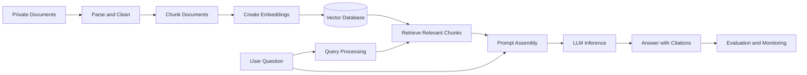
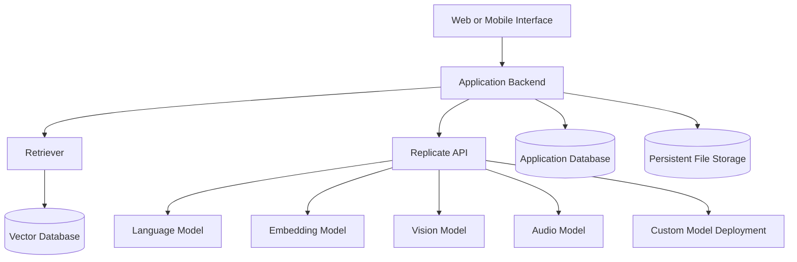
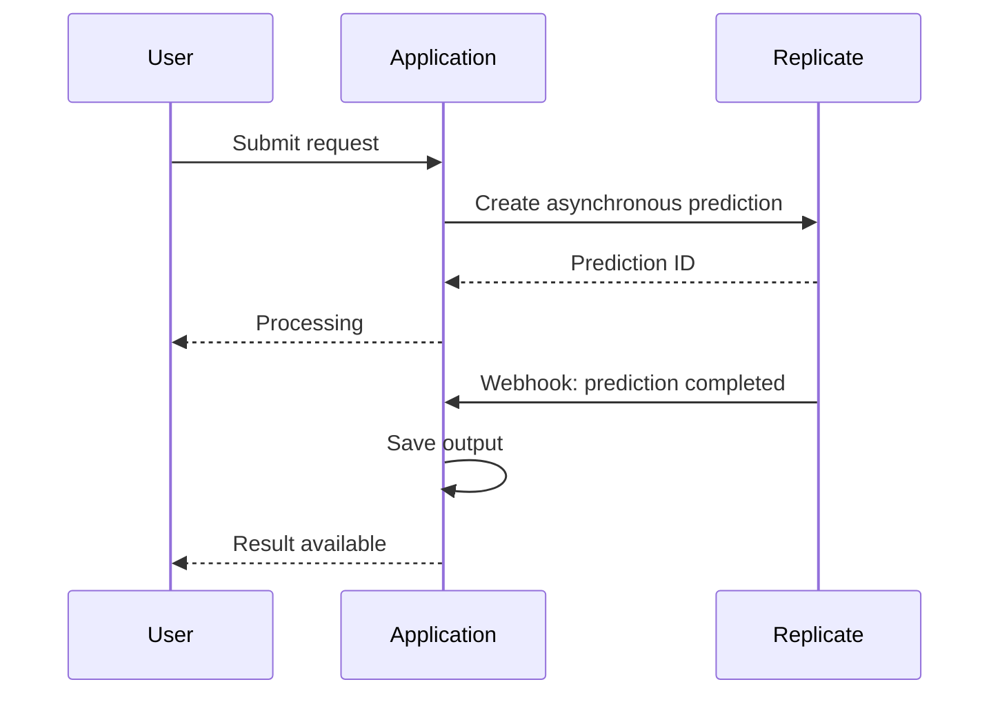
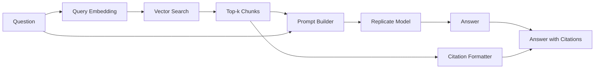
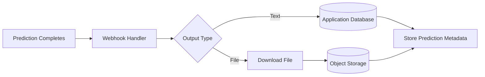

# 014 — Replicate

**Course:** 03 — Knowledge Systems and RAG
**Module:** Module 09 — RAG and Implementation
**Content Group:** Implementation Options
**Roadmap Source:** RAG and Implementation / Implementation Options
**Lesson Type:** RAG
**Order in Module:** 014
**Suggested Duration:** 26 minutes

---

## 1. Lesson Summary

**Replicate** is a cloud platform for running, fine-tuning, and deploying machine learning models through an API. It allows AI engineers to use public models or deploy custom models without directly managing GPU servers, container orchestration, autoscaling, or most inference infrastructure.

In a Retrieval-Augmented Generation application, Replicate can serve as the **model inference layer**. For example, it may run:

* The language model that produces the final answer
* An embedding model
* A reranking model
* An OCR or document-understanding model
* A speech-to-text model
* An image-generation or vision model
* A custom model packaged and deployed by your team

However, Replicate is **not a complete RAG framework**. It does not automatically manage document parsing, chunking, vector storage, retrieval, citation generation, or RAG evaluation. Those parts must be implemented in your application or through tools such as LlamaIndex, LangChain, a vector database, or custom code.

---

## 2. Learning Objectives

By the end of this lesson, you should be able to:

* Explain Replicate in your own words.
* Describe where Replicate belongs in an AI application architecture.
* Distinguish Replicate from RAG frameworks and vector databases.
* Run a model using the Replicate Python client.
* Use a Replicate-hosted model as the generation component of a RAG pipeline.
* Understand predictions, model versions, deployments, streaming, and webhooks.
* Identify important production concerns such as latency, cost, security, data retention, and model stability.
* Build a small portfolio demo that combines retrieval with Replicate inference.

---

## 3. What Is Replicate?

Replicate provides a cloud API for running machine learning models. Developers can use models published by other creators, fine-tune supported models with their own data, or deploy custom model code.

A simple mental model is:

> **Replicate is an API-based execution environment for AI models.**

Instead of configuring a GPU machine manually, you send an API request containing model inputs. Replicate runs the selected model and returns its outputs.

```text
Application
    |
    | API request
    v
Replicate
    |
    | Starts or selects model infrastructure
    v
Machine Learning Model
    |
    | Generated result
    v
Application
```

Replicate maintains official client libraries for Python, JavaScript, Swift, and Go, in addition to its HTTP API.

---

## 4. Important Correction: Replicate Is Not RAG

The statement below is inaccurate:

> “Replicate is a pipeline for bringing private knowledge into an LLM.”

Replicate may be **one component inside that pipeline**, but it is not the whole pipeline.

A complete RAG system usually contains:



Replicate may provide the model behind step **D**, **I**, or another model-based step, but your application still needs to control the overall workflow.

### Responsibility Comparison

| Component       | Main Responsibility                                                        |
| --------------- | -------------------------------------------------------------------------- |
| Replicate       | Run and deploy machine learning models                                     |
| LangChain       | Connect prompts, models, retrievers, tools, and agents                     |
| LlamaIndex      | Ingest, index, retrieve, and query private data                            |
| Vector database | Store embeddings and perform similarity search                             |
| Object storage  | Store original documents, images, audio, and outputs                       |
| Your backend    | Authentication, business logic, citations, caching, safety, and monitoring |

---

## 5. Where Replicate Fits in the AI Engineer Workflow

Replicate is most useful when an application needs access to a model that would otherwise require specialized infrastructure.



Common use cases include:

1. **Multimodal RAG**

   Use document retrieval together with vision, speech, OCR, or image-processing models.

2. **Rapid model experimentation**

   Compare several open or hosted models without building a separate deployment stack for each one.

3. **Custom model APIs**

   Package your own model and expose it as an API.

4. **Long-running AI jobs**

   Run image, video, audio, training, or batch-processing workloads asynchronously.

5. **Model-powered agent tools**

   Give an agent access to specialized models such as image generation, object detection, transcription, or background removal.

---

## 6. Core Replicate Concepts

### 6.1 Model

A model is a packaged program that accepts defined inputs and returns outputs. On Replicate, models may be public, private, official, community-maintained, fine-tuned, or custom-deployed. Custom models can be packaged using Cog, which creates a standardized container and API interface.

Each model has its own input schema. One model may expect:

```json
{
  "prompt": "Explain vector search"
}
```

Another may require:

```json
{
  "image": "https://example.com/document-page.png",
  "question": "What is the invoice total?"
}
```

Always inspect the selected model’s API documentation instead of assuming that every model uses the same parameter names.

---

### 6.2 Model Version

A version identifies a particular build of a model.

Pinning a model version helps make the application more reproducible:

```text
owner/model:version_hash
```

Community models may require or benefit from an explicit version identifier. Official models can be called using only their owner and model name, and Replicate describes their APIs as stable and predictably priced.

For production systems, record:

* Model owner
* Model name
* Model version
* Input configuration
* Prompt version
* Retrieval configuration
* Evaluation results

---

### 6.3 Prediction

Every model execution creates a **prediction**. A prediction records the model input, output, status, timing information, errors, model version, and other metadata.

Typical prediction states include:

```text
starting -> processing -> succeeded
                       -> failed
                       -> canceled
```

For observability, log at least:

```json
{
  "prediction_id": "...",
  "model": "owner/model",
  "status": "succeeded",
  "latency_ms": 4200,
  "retrieved_chunk_ids": ["chunk-12", "chunk-18"],
  "prompt_version": "rag-v2"
}
```

---

### 6.4 Synchronous and Asynchronous Execution

Replicate supports both synchronous and asynchronous prediction workflows.

**Synchronous mode**

* Keeps the HTTP request open.
* Works well for short model runs.
* Can return the completed result directly.

**Asynchronous mode**

* Returns a prediction identifier immediately.
* Allows the application to check the result later.
* Is more suitable for long-running image, video, audio, or training tasks.
* Is the default prediction mode in the HTTP API.



---

### 6.5 Streaming

Models that support streaming can send progressive output using Server-Sent Events. This is useful for chat interfaces because the user can see tokens or partial results before the complete answer is ready.

```text
Question submitted
      |
      v
Prediction created with streaming
      |
      v
SSE connection opened
      |
      +--> Partial output 1
      +--> Partial output 2
      +--> Partial output 3
      |
      v
Prediction completed
```

Streaming improves perceived responsiveness, but your application must also handle:

* Interrupted connections
* Duplicate events
* Partial output
* Timeouts
* Cancellation
* Final status confirmation

---

### 6.6 Webhooks

A webhook allows Replicate to send an HTTP request to your backend when a prediction is created, updated, or completed. Webhooks are useful for long-running jobs, pipeline chaining, notifications, and persistent storage.

A webhook endpoint might look like:

```text
POST /api/webhooks/replicate
```

The handler should:

1. Verify that the webhook is authentic.
2. Read the prediction ID and status.
3. Process only expected event types.
4. Be idempotent.
5. Save required outputs.
6. Update the application database.
7. Return a successful HTTP response.

Do not assume that webhook events arrive exactly once or in the order your application expects.

---

### 6.7 Deployments

A deployment gives an application more control over how a model runs, including hardware and scaling configuration.

Deployments are useful when you need:

* A stable production endpoint
* More predictable latency
* Dedicated instances
* Controlled minimum and maximum instance counts
* Custom hardware
* Safer model-version rollouts
* Reduced dependence on shared queues

Replicate can deploy custom models, scale their infrastructure, and perform rolling updates without requiring the application team to manage the underlying GPU orchestration directly.

---

## 7. Installing and Authenticating

Install the Python client:

```bash
pip install replicate
```

Store the token in an environment variable:

```bash
export REPLICATE_API_TOKEN="your-token"
```

Replicate API tokens are secrets and should be treated like passwords. The official documentation recommends using environment variables, separate tokens for different environments, and a secret-management service for production applications.

Never write this in committed source code:

```python
# Do not do this.
REPLICATE_API_TOKEN = "r8_real_secret_token"
```

Use environment configuration instead:

```python
import os

token = os.environ["REPLICATE_API_TOKEN"]
```

---

## 8. Basic Python Example

The Python client exposes `replicate.run()` for running a model. Replicate’s documentation demonstrates this pattern for public models.

```python
import os
import replicate

MODEL_NAME = os.environ["REPLICATE_MODEL"]

output = replicate.run(
    MODEL_NAME,
    input={
        "prompt": "Explain retrieval-augmented generation in simple terms."
    },
)

print(output)
```

Set the model separately:

```bash
export REPLICATE_MODEL="owner/model"
```

The exact input fields and output type depend on the selected model. Some models return text, some return an iterator, and others return files or lists of files.

A small output-normalization helper may be useful:

```python
from collections.abc import Iterable
from typing import Any


def collect_text(output: Any) -> str:
    """Convert common model output forms into a string."""

    if output is None:
        return ""

    if isinstance(output, str):
        return output

    if isinstance(output, Iterable):
        return "".join(str(part) for part in output)

    return str(output)
```

---

## 9. Using Replicate in a RAG Pipeline

Assume the application has already:

1. Parsed the documents.
2. Split them into chunks.
3. Created embeddings.
4. Stored the chunks in a vector database.
5. Retrieved the most relevant chunks.

Replicate can then run the language model that creates the final answer.



### Example RAG Prompt Builder

```python
from dataclasses import dataclass


@dataclass
class RetrievedChunk:
    chunk_id: str
    source: str
    page: int
    text: str


def build_rag_prompt(
    question: str,
    chunks: list[RetrievedChunk],
) -> str:
    context_parts: list[str] = []

    for index, chunk in enumerate(chunks, start=1):
        context_parts.append(
            f"[{index}] Source: {chunk.source}, page {chunk.page}\n"
            f"{chunk.text}"
        )

    context = "\n\n".join(context_parts)

    return f"""
You are a document question-answering assistant.

Answer the question using only the supplied context.

Rules:
- Do not use unsupported outside knowledge.
- If the context does not contain the answer, say that the available
  documents do not provide enough information.
- Cite supporting passages using [1], [2], and similar markers.
- Do not invent citations.

Context:
{context}

Question:
{question}

Answer:
""".strip()
```

### Calling the Model

```python
import os
import replicate


def generate_answer(
    question: str,
    chunks: list[RetrievedChunk],
) -> str:
    prompt = build_rag_prompt(question, chunks)

    output = replicate.run(
        os.environ["REPLICATE_MODEL"],
        input={
            "prompt": prompt,
        },
    )

    return collect_text(output)
```

> The model-specific API may use fields such as `prompt`, `messages`, `system_prompt`, `max_tokens`, or different names. Always adapt the request to the selected model’s schema.

---

## 10. Citation Architecture

The language model should not be responsible for inventing complete citation metadata.

Instead, the application should preserve metadata throughout ingestion and retrieval:

```json
{
  "chunk_id": "employee-handbook-0042",
  "document_id": "employee-handbook",
  "source_name": "Employee Handbook.pdf",
  "page": 18,
  "section": "Annual Leave",
  "text": "Employees receive..."
}
```

The prompt can expose short citation labels:

```text
[1] Employee Handbook.pdf, page 18
[2] Leave Policy 2026.pdf, page 4
```

The backend can then convert the model’s `[1]` marker into a verified citation object:

```json
{
  "label": "[1]",
  "document_id": "employee-handbook",
  "page": 18,
  "chunk_id": "employee-handbook-0042"
}
```

This design is safer than asking the model to generate filenames and page numbers from memory.

---

## 11. Model Selection Strategy

Do not select a model only because it appears near the top of a model catalog.

Evaluate models using the requirements of your application:

| Requirement           | Question                                         |
| --------------------- | ------------------------------------------------ |
| Answer quality        | Does it answer correctly from retrieved context? |
| Instruction following | Does it follow citation and refusal rules?       |
| Context size          | Can it process the required retrieved chunks?    |
| Latency               | Is the response fast enough for the interface?   |
| Streaming             | Does the model support progressive output?       |
| Cost                  | What is the cost per successful request?         |
| Stability             | Is the API or model version stable?              |
| Privacy               | Is the data handling suitable for the documents? |
| Multilingual quality  | Does it perform well in required languages?      |
| Structured output     | Can it reliably produce the expected schema?     |

Official Replicate models provide stable input/output APIs and predictable pricing metrics, while community models may offer more experimental choices but require additional version and reliability management.

---

## 12. Cost and Latency

Replicate uses pay-as-you-go billing. Public models are generally billed for active processing time, while private models and deployments may also incur costs while instances are setting up or idle, depending on their configuration.

For a RAG application, total cost may include:

```text
Total request cost
    =
query embedding
    +
vector database search
    +
optional reranking
    +
LLM generation
    +
storage
    +
network transfer
    +
monitoring
```

Measure:

* Average cost per request
* Cost per successful answer
* P50, P95, and P99 latency
* Cold-start frequency
* Input and output size
* Failure and retry rate
* Number of retrieved chunks
* Number of generated tokens
* Cost by model version

### Cost-Reduction Techniques

* Retrieve fewer but more relevant chunks.
* Avoid sending duplicate context.
* Cache repeated answers or model outputs where appropriate.
* Use smaller models for classification and routing.
* Reserve larger models for difficult questions.
* Set output limits.
* Cancel abandoned predictions.
* Batch offline jobs where supported.
* Use deployments only when their predictability justifies the additional cost.

---

## 13. Data Retention and Persistent Storage

For predictions created through the API, Replicate states that input parameters, outputs, output files, and logs are automatically removed after one hour by default. Applications that need permanent access must save their own copies.

Therefore, do not use a temporary model-output URL as your permanent database record.

A safer flow is:



For sensitive documents:

* Send only the context required for the current request.
* Remove unnecessary personal information.
* Avoid logging full private document contents.
* Define data-retention rules in your own application.
* Check organizational, legal, and contractual requirements.
* Review the selected model and provider before sending confidential data.

---

## 14. Reliability and Error Handling

Production code must assume that model calls can fail.

Possible problems include:

* Invalid input schema
* Authentication failure
* Rate limiting
* Timeout
* Cold start
* Prediction failure
* Output format changes
* Empty output
* Network interruption
* Webhook duplication
* Temporary service unavailability
* Model-version changes
* Unsafe or unusable model output

A simplified retry strategy:

```python
import time
from collections.abc import Callable
from typing import TypeVar

T = TypeVar("T")


def retry(
    operation: Callable[[], T],
    attempts: int = 3,
    base_delay_seconds: float = 1.0,
) -> T:
    last_error: Exception | None = None

    for attempt in range(attempts):
        try:
            return operation()
        except Exception as exc:
            last_error = exc

            if attempt == attempts - 1:
                break

            time.sleep(base_delay_seconds * (2**attempt))

    raise RuntimeError("Operation failed after retries") from last_error
```

Retries should be limited to transient failures. Do not repeatedly retry:

* Invalid API tokens
* Unsupported model inputs
* Content rejected by policy
* Permanently missing files
* Requests that have already succeeded

Use an idempotency strategy so a retry does not create duplicate user-visible results.

---

## 15. Evaluation

A successful API response does not prove that the RAG answer is correct.

Create a small **golden evaluation dataset**:

```json
{
  "question": "How many annual leave days are available?",
  "expected_answer": "Twenty days per year.",
  "expected_sources": [
    {
      "document": "Employee Handbook.pdf",
      "page": 18
    }
  ]
}
```

Evaluate the system at multiple layers.

### Retrieval Metrics

* Hit rate
* Recall at `k`
* Mean Reciprocal Rank
* Relevant chunk position
* Metadata correctness

### Generation Metrics

* Answer correctness
* Groundedness
* Citation correctness
* Citation completeness
* Refusal quality
* Conciseness
* Instruction following

### System Metrics

* End-to-end latency
* Prediction failure rate
* Cost per question
* Timeout rate
* Empty response rate
* User satisfaction

Test retrieval and generation separately.

A wrong answer can come from:

```text
Bad parsing
   -> bad chunks
   -> bad embeddings
   -> bad retrieval
   -> missing evidence
   -> unsupported answer
```

Changing the generation model will not fix every retrieval problem.

---

## 16. Practical Exercise

### Goal

Build a small document Q&A application that retrieves evidence locally and uses a Replicate-hosted model to generate the final answer.

### Dataset

Choose five to ten short documents, such as:

* Product documentation
* University regulations
* Company policies
* Technical tutorials
* Public reports

### Required Steps

1. Parse the documents.
2. Preserve source and page metadata.
3. Split documents into chunks.
4. Create embeddings.
5. Store the chunks in a vector index.
6. Prepare at least ten test questions.
7. Retrieve the top `k` chunks for each question.
8. Send the question and retrieved context to a model through Replicate.
9. Produce an answer with citation markers.
10. Record latency, retrieved chunks, model version, and output.
11. Identify at least three failure cases.
12. Compare two retrieval or model configurations.

### Suggested Experiment Table

| Test | Chunk Size | Top-k | Model   | Correct | Citation Correct | Latency |
| ---- | ---------: | ----: | ------- | ------- | ---------------- | ------: |
| A    | 300 tokens |     3 | Model A | Yes     | Yes              |   2.8 s |
| B    | 600 tokens |     5 | Model A | No      | Partial          |   4.3 s |
| C    | 300 tokens |     3 | Model B | Yes     | Yes              |   5.1 s |

### Portfolio Deliverables

Your project repository should include:

```text
replicate-rag-demo/
├── app/
│   ├── ingestion.py
│   ├── retrieval.py
│   ├── generation.py
│   ├── citations.py
│   └── api.py
├── data/
├── evaluation/
│   ├── questions.json
│   └── results.json
├── tests/
├── .env.example
├── requirements.txt
└── README.md
```

The README should explain:

* Why Replicate was selected
* Which model and version were used
* How retrieval works
* How citations are verified
* How cost and latency were measured
* Known limitations
* Example failure cases

---

## 17. Common Mistakes

### Mistake 1: Treating Replicate as a Complete RAG System

Replicate runs models, but the surrounding document and retrieval workflow remains your responsibility.

### Mistake 2: Selecting a Model Without Checking Its Schema

Different models accept different inputs and produce different output types.

### Mistake 3: Not Pinning or Recording Model Versions

A demo may produce different results after a model update.

### Mistake 4: Putting the API Token in Frontend Code

The token must remain in a trusted backend or secret-management system.

### Mistake 5: Assuming Outputs Remain Available Permanently

API prediction data is removed after a limited period by default. Save required outputs yourself.

### Mistake 6: Using Synchronous Requests for Long Jobs

Long video, image, training, or audio jobs should generally use asynchronous predictions and webhooks.

### Mistake 7: Ignoring Cold Starts and Queues

A model that feels fast during one test may have different production latency.

### Mistake 8: Retrying Every Failure

Some errors are permanent and should be returned immediately instead of retried.

### Mistake 9: Evaluating Only the Final Answer

Inspect retrieved chunks, ranking, citations, latency, and model output separately.

### Mistake 10: Allowing the Model to Invent Citations

Citation metadata should come from retrieved document records, not model memory.

---

## 18. Production Checklist

### Model

* [ ] The selected model matches the task.
* [ ] Its input and output schema is documented.
* [ ] The model name and version are recorded.
* [ ] A fallback model or error response exists.
* [ ] Model changes are evaluated before release.

### Security

* [ ] The API token is stored in an environment variable or secret manager.
* [ ] Separate tokens are used for development and production.
* [ ] Tokens never appear in frontend code or logs.
* [ ] Webhook signatures are verified.
* [ ] Sensitive document content is minimized.

### RAG Quality

* [ ] Source and page metadata survive ingestion.
* [ ] Retrieval is tested with a golden question set.
* [ ] Citation markers map to real retrieved chunks.
* [ ] Unsupported questions produce a clear refusal.
* [ ] Retrieval and generation are evaluated separately.

### Reliability

* [ ] Timeouts are configured.
* [ ] Retries use exponential backoff.
* [ ] Duplicate webhook events are handled safely.
* [ ] Long-running jobs use asynchronous processing.
* [ ] Prediction IDs and statuses are logged.
* [ ] Temporary output files are copied to persistent storage.

### Cost and Performance

* [ ] Cost per request is measured.
* [ ] P50 and P95 latency are tracked.
* [ ] Output length is limited.
* [ ] Unnecessary context is removed.
* [ ] Cold-start behavior has been tested.
* [ ] Deployment configuration matches expected traffic.

---

## 19. Completion Checklist

* [ ] I can explain Replicate in one or two minutes.
* [ ] I understand that Replicate is a model platform, not a complete RAG framework.
* [ ] I can run a model using the Python client or HTTP API.
* [ ] I understand predictions, versions, streaming, webhooks, and deployments.
* [ ] I can place Replicate correctly inside a RAG architecture.
* [ ] I have built a small demo or practical artifact.
* [ ] I can measure retrieval quality, answer quality, latency, and cost.
* [ ] I have documented at least one limitation or unresolved question.
* [ ] I know how the system stores outputs and protects API tokens.
* [ ] I can explain when another inference provider or self-hosted deployment may be more appropriate.

---

## 20. Related Outcome

Build retrieval-augmented generation applications that answer questions using private documents and provide verifiable page or chunk citations.

---

## 21. Related Project

### Project 8: PDF Q&A RAG Application

Build an application that:

* Accepts one or more PDF files.
* Extracts text and page metadata.
* Creates searchable chunks.
* Retrieves relevant passages.
* Uses a Replicate-hosted model for answer generation.
* Returns page and chunk citations.
* Supports streaming when available.
* Records latency, model version, cost, and retrieved evidence.
* Includes a golden test dataset and failure analysis.

---

## 22. Final Summary

Replicate is a practical model-inference and deployment option for AI engineers. It provides APIs for running public models, using official models, processing multimodal inputs, and deploying custom models without manually managing the underlying GPU infrastructure.

Inside a RAG application, Replicate usually belongs at the **model execution layer**. Parsing, chunking, indexing, retrieval, prompt construction, citation verification, evaluation, application security, and user experience still need to be designed separately.

The most useful way to learn Replicate is to turn it into a working artifact:

```text
private documents
    -> parse and chunk
    -> embed and index
    -> retrieve evidence
    -> assemble grounded prompt
    -> run model through Replicate
    -> verify citations
    -> evaluate quality, cost, and latency
```

The central engineering lesson is:

> A convenient model API simplifies inference infrastructure, but a reliable RAG product still depends on retrieval quality, metadata discipline, evaluation, security, observability, and production error handling.

---

# Bài luyện tập

## Mục tiêu


## Đề bài


## Yêu cầu hoàn thành

- [ ] 
- [ ] 
- [ ] 

## Kết quả / lời giải


## Ghi chú
