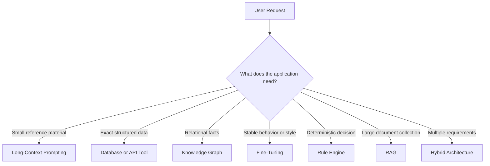
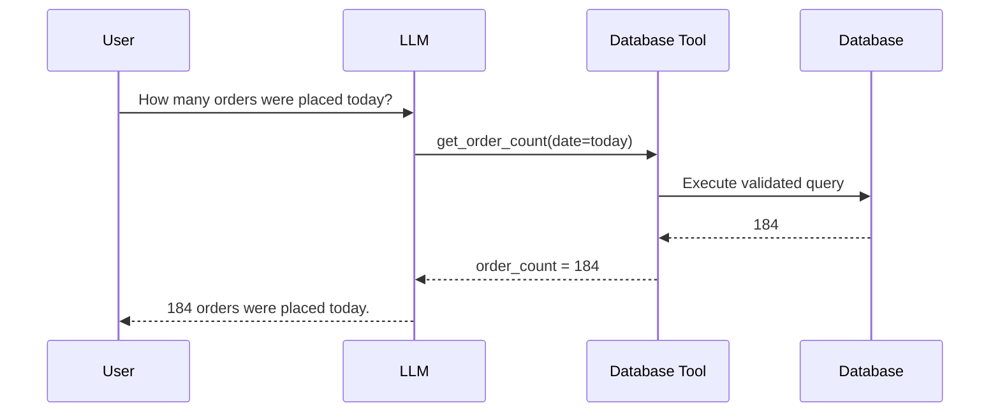
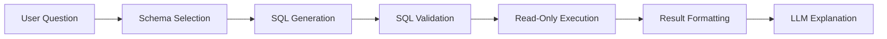
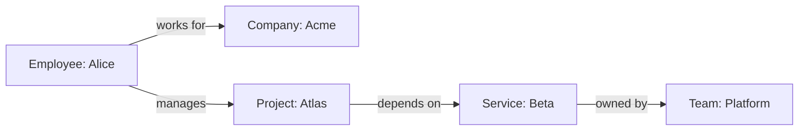
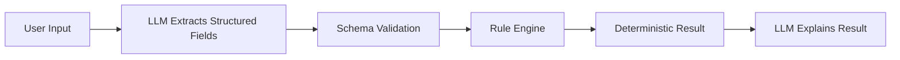
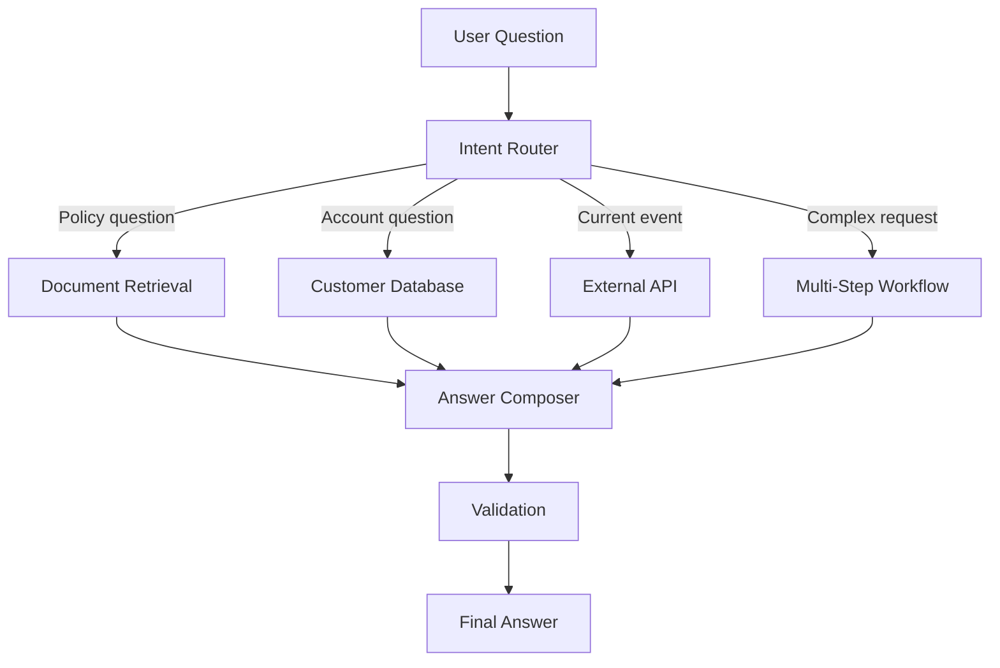
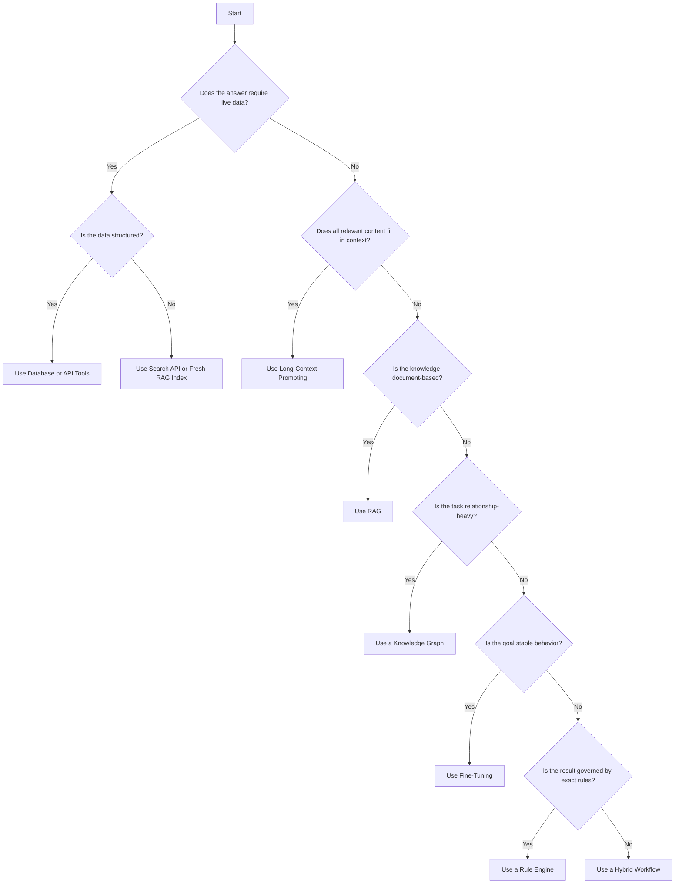
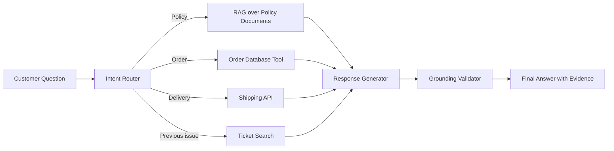

# 015 — RAG Alternatives

**Course:** 03 — Knowledge Systems and RAG
**Module:** Module 09 — RAG and Implementation
**Content Group:** Implementation Options
**Roadmap Source:** RAG and Implementation / Implementation Options
**Lesson Type:** RAG
**Lesson Order:** 015
**Suggested Duration:** 26 minutes

---

## 1. Overview

Retrieval-Augmented Generation, or **RAG**, is a common technique for connecting a Large Language Model to private or external knowledge. However, RAG is not always the simplest, cheapest, or most reliable solution.

Depending on the application, an AI engineer may instead use:

* Long-context prompting
* Direct database or API tools
* Text-to-SQL
* Knowledge graphs
* Fine-tuning
* Continued pretraining
* Prompt caching
* Structured rule engines
* Search without generation
* A hybrid architecture combining multiple approaches

The goal of this lesson is not to replace RAG in every project. It is to understand **when RAG is appropriate, when another method is better, and how several methods can work together**.

---

## 2. Learning Objectives

By the end of this lesson, you should be able to:

* Explain why RAG is only one method for connecting an LLM to knowledge.
* Identify the main alternatives to a traditional vector-search RAG pipeline.
* Compare RAG, long-context prompting, fine-tuning, database tools, and knowledge graphs.
* Select an implementation approach based on freshness, scale, accuracy, latency, cost, and complexity.
* Design a small AI application using RAG, an alternative architecture, or a hybrid approach.
* Evaluate the selected architecture using a test dataset instead of intuition alone.

---

## 3. The Core Problem

An LLM has several knowledge limitations:

1. Its training knowledge may be outdated.
2. It does not automatically know private company data.
3. It may generate plausible but unsupported information.
4. Its context window is limited.
5. It cannot reliably perform exact database operations without tools.
6. It may not follow business rules consistently.

RAG solves part of this problem by retrieving relevant documents and adding them to the model prompt.

```text
documents
   ↓
parse and clean
   ↓
chunk
   ↓
embed
   ↓
store in vector database
   ↓
retrieve relevant chunks
   ↓
assemble prompt
   ↓
generate answer with citations
```

However, not every knowledge problem is a document-retrieval problem.

For example:

* A customer balance should come from a database query.
* Today’s weather should come from a weather API.
* A tax calculation should use deterministic rules.
* A small policy document may fit directly into the context window.
* A stable writing style may be learned through fine-tuning.
* Complex relationships may be easier to query through a knowledge graph.

The key question is therefore:

> What is the most reliable way to provide the model with the information or behavior required for this task?

---

## 4. What Is a RAG Alternative?

A **RAG alternative** is any architecture that gives an AI application the required knowledge or capabilities without relying primarily on semantic retrieval from chunked documents.

Some alternatives replace retrieval completely. Others replace only one part of the RAG pipeline.



---

# 5. Major Alternatives to Traditional RAG

## 5.1 Long-Context Prompting

Long-context prompting means placing the source material directly into the model’s context rather than indexing and retrieving chunks.

### Architecture

```text
user question
      +
complete document or document set
      ↓
long-context LLM
      ↓
answer
```

### Example

```python
from pathlib import Path

policy = Path("employee_policy.md").read_text(encoding="utf-8")

prompt = f"""
Answer the user's question using only the policy below.

Policy:
{policy}

Question:
How many days of annual leave does a new employee receive?

Return:
1. A direct answer
2. The relevant policy section
3. A warning if the answer is not stated
"""
```

### Best suited for

* A small number of documents
* Documents that fit inside the model context window
* One-time document analysis
* Contract review
* Report summarization
* Comparing several short documents
* Prototypes where building a retrieval system would be unnecessary

### Advantages

* Simple architecture
* No embedding model required
* No vector database required
* No chunking strategy required
* The model can inspect the complete document
* Easier to prototype

### Limitations

* High token cost for repeated requests
* Increased latency
* Important information may be ignored in very long contexts
* Difficult to scale to thousands of documents
* Context ordering can affect answer quality
* Large inputs may exceed the model’s context limit

### Use long-context prompting when

```text
number of documents is small
AND
documents fit safely in context
AND
queries are not extremely frequent
```

---

## 5.2 Direct Database Queries

When users ask questions about structured data, semantic document retrieval may be the wrong abstraction.

Examples include:

* Account balances
* Orders
* Inventory
* Employee records
* Subscription status
* Product prices
* Analytics metrics
* Application state

In these cases, the LLM should call a database service or an application API.

### Architecture



### Example tool definition

```python
from datetime import date
from typing import Any

def get_order_count(order_date: date) -> dict[str, Any]:
    """
    Return the number of completed orders for a given date.
    The function uses a parameterized database query.
    """
    query = """
        SELECT COUNT(*) AS order_count
        FROM orders
        WHERE DATE(created_at) = %s
          AND status = 'completed'
    """

    result = database.fetch_one(query, [order_date])

    return {
        "date": order_date.isoformat(),
        "order_count": result["order_count"],
    }
```

### Advantages

* Exact and current data
* Lower hallucination risk
* No embedding or chunking
* Easy to validate
* Better for calculations and aggregation
* Supports access control at the application layer

### Limitations

* Requires a defined schema
* Tool permissions must be controlled
* Generated queries may be unsafe if not validated
* The LLM may select the wrong tool or parameters
* Database results may still require explanation

### Important safety rule

Do not allow an LLM to execute arbitrary SQL directly against a production database.

Prefer:

```text
LLM
 ↓
approved tool with typed parameters
 ↓
validated query
 ↓
read-only database role
```

Avoid:

```text
LLM-generated SQL
 ↓
production database with broad permissions
```

---

## 5.3 Text-to-SQL

Text-to-SQL converts a natural-language question into a structured SQL query.

### Example

```text
User:
Which five products generated the most revenue last month?

Generated SQL:
SELECT
    product_name,
    SUM(quantity * unit_price) AS revenue
FROM order_items
WHERE order_date >= DATE_TRUNC('month', CURRENT_DATE) - INTERVAL '1 month'
  AND order_date < DATE_TRUNC('month', CURRENT_DATE)
GROUP BY product_name
ORDER BY revenue DESC
LIMIT 5;
```

### Text-to-SQL pipeline



### Best suited for

* Business intelligence assistants
* Analytics dashboards
* Internal reporting
* Structured operational data
* Questions requiring grouping, filtering, or aggregation

### Advantages over document RAG

* Retrieves exact rows rather than semantically similar text
* Supports mathematical aggregation
* Uses current database state
* Produces structured, auditable queries

### Main risks

* Incorrect joins
* Incorrect date filters
* Expensive queries
* Unauthorized data access
* SQL injection
* Schema misunderstanding
* Misleading explanations of correct results

### Recommended controls

* Use a read-only database user.
* Allow only approved tables and columns.
* Parse SQL into an abstract syntax tree before execution.
* Block destructive statements.
* Apply row-level permissions.
* Add query timeouts and result-size limits.
* Log generated SQL.
* Test with a golden question set.

---

## 5.4 API and Tool Calling

Some questions should be answered by external services rather than internal documents.

Examples:

* Current weather
* Currency exchange rates
* Shipping status
* Calendar availability
* Email search
* Flight schedules
* Payment status
* Code execution
* Product inventory

### Architecture

```text
user request
     ↓
LLM selects a tool
     ↓
application validates arguments
     ↓
external API returns structured data
     ↓
LLM explains the result
```

### Example

```python
from pydantic import BaseModel, Field


class WeatherRequest(BaseModel):
    city: str = Field(min_length=1)
    country_code: str = Field(min_length=2, max_length=2)


def get_weather(request: WeatherRequest) -> dict:
    response = weather_client.get_current_weather(
        city=request.city,
        country_code=request.country_code,
    )

    return {
        "location": response.location,
        "temperature_c": response.temperature_c,
        "condition": response.condition,
        "observed_at": response.observed_at.isoformat(),
    }
```

### Why this may be better than RAG

A document index cannot guarantee that dynamic information is current. An API is usually a better source for rapidly changing data.

```text
Static company handbook → RAG may be appropriate

Live package location → shipping API is appropriate

Current account balance → banking service is appropriate

Latest inventory count → inventory database is appropriate
```

---

## 5.5 Knowledge Graphs

A knowledge graph represents information as entities and relationships.

### Example

```text
Alice ──works_for──> Acme
Alice ──manages────> Project Atlas
Project Atlas ──depends_on──> Service Beta
Service Beta ──owned_by─────> Platform Team
```

Knowledge graphs are useful when the application must reason about connections rather than retrieve isolated text passages.

### Architecture



### Suitable questions

* Who owns the services that Project Atlas depends on?
* Which employees report to a manager in the Platform division?
* Which products are affected by a failed supplier?
* How are these medical conditions, genes, and treatments related?
* Which regulations apply to a specific business entity?

### Advantages

* Explicit relationships
* Multi-hop traversal
* Better entity consistency
* Structured explanations
* Easier to enforce logical constraints
* Useful for dependency analysis

### Limitations

* Expensive data modeling
* Entity extraction can be difficult
* Graph maintenance requires effort
* Natural-language documents must be transformed into entities and edges
* Graph queries may fail when relationships are missing

### Graph RAG

Knowledge graphs and RAG are not mutually exclusive.

A Graph RAG system may:

1. Extract entities from the user question.
2. Traverse related graph nodes.
3. Retrieve documents attached to those nodes.
4. Generate an answer using both structured relationships and source passages.

```text
question
   ↓
entity detection
   ↓
graph traversal
   ↓
related documents
   ↓
answer with relationship evidence and citations
```

---

## 5.6 Fine-Tuning

Fine-tuning updates model parameters using training examples.

It is useful when the goal is to change the model’s **behavior**, not to provide frequently changing facts.

### Good fine-tuning use cases

* Consistent output formatting
* Domain-specific classification
* Brand voice
* Repeated reasoning patterns
* Tool-selection behavior
* Intent detection
* Structured extraction
* Specialized response style

### Poor fine-tuning use cases

* Frequently updated product catalogs
* Current policies
* Live prices
* Account-specific data
* Large private document collections
* Information that requires citations

### Comparison

```text
RAG:
“Here is the relevant information for this request.”

Fine-tuning:
“This is how you should behave when handling this type of request.”
```

### Example training pair

```json
{
  "messages": [
    {
      "role": "user",
      "content": "Classify this support request: I was charged twice."
    },
    {
      "role": "assistant",
      "content": "{\"category\":\"billing\",\"subcategory\":\"duplicate_charge\",\"priority\":\"high\"}"
    }
  ]
}
```

### Advantages

* Shorter prompts
* More consistent behavior
* Lower per-request input length
* Better adaptation to repeated domain patterns
* Can improve structured output reliability

### Limitations

* Requires a high-quality dataset
* Adds training and version-management complexity
* Knowledge becomes difficult to update
* The model may still hallucinate
* Does not naturally provide source citations
* Evaluation must cover regressions and edge cases

### RAG and fine-tuning together

A common production architecture uses both:

```text
Fine-tuned model
    → follows domain behavior and output format

RAG pipeline
    → supplies current private knowledge
```

---

## 5.7 Continued Pretraining

Continued pretraining exposes a model to a large domain-specific corpus using the original language-modeling objective.

It may help the model learn:

* Specialized terminology
* Domain writing patterns
* Common relationships
* Industry-specific language
* Rare technical concepts

### Suitable domains

* Legal
* Medicine
* Scientific research
* Finance
* Engineering
* Languages with limited representation in the base model

### Difference from fine-tuning

| Technique              | Primary Goal                                   |
| ---------------------- | ---------------------------------------------- |
| Continued pretraining  | Improve general domain understanding           |
| Supervised fine-tuning | Teach specific task behavior                   |
| RAG                    | Provide external information at inference time |

### Limitations

* Computationally expensive
* Requires a large clean corpus
* May damage general capabilities if poorly configured
* Does not guarantee factual recall
* Information is difficult to update
* Still does not provide reliable citations

Continued pretraining is usually not the first solution for a small application.

---

## 5.8 Prompt Caching

Prompt caching stores or reuses computation for repeated prompt prefixes.

It does not replace knowledge integration, but it can make long-context architectures more affordable.

### Example scenario

An application sends the same 100-page handbook with every request:

```text
system instructions
+
complete handbook
+
user question
```

Without caching, the model may repeatedly process the full handbook.

With prompt caching:

```text
cached handbook prefix
+
new user question
```

### Best suited for

* Repeated queries over the same document
* Large stable system prompts
* Long reference manuals
* Agent instructions reused across requests
* Applications with many users sharing the same knowledge base

### Limitations

* Cached content must remain stable
* Cache behavior depends on the provider
* Cache expiration must be handled
* It does not improve answer correctness by itself
* Sensitive prompts require appropriate security controls

---

## 5.9 Deterministic Rule Engines

Some decisions should not be generated by an LLM.

Examples:

* Tax calculations
* Eligibility checks
* Credit limits
* Access control
* Compliance requirements
* Pricing rules
* Medical dosage formulas
* Safety shutdown conditions

### Architecture



### Example

```python
from dataclasses import dataclass


@dataclass
class LoanApplication:
    age: int
    annual_income: float
    existing_debt: float


def evaluate_application(application: LoanApplication) -> dict:
    if application.age < 18:
        return {
            "eligible": False,
            "reason_code": "UNDER_MINIMUM_AGE",
        }

    debt_ratio = application.existing_debt / max(application.annual_income, 1)

    if debt_ratio > 0.50:
        return {
            "eligible": False,
            "reason_code": "HIGH_DEBT_RATIO",
        }

    return {
        "eligible": True,
        "reason_code": "BASIC_RULES_PASSED",
    }
```

The LLM may explain the decision, but it should not invent the rule result.

### Advantages

* Predictable
* Testable
* Auditable
* Fast
* Suitable for regulated workflows

### Limitation

Rule engines handle explicit logic well, but they are less flexible for ambiguous natural-language tasks.

---

## 5.10 Search Without Generation

Not every search interface needs a generated answer.

Sometimes the safest user experience is to return:

* Matching documents
* Relevant passages
* Filters
* Highlighted keywords
* Ranked results
* Links to primary sources

### Architecture

```text
query
  ↓
keyword or semantic search
  ↓
ranked documents
  ↓
user reads original sources
```

### Best suited for

* Legal discovery
* Academic research
* Compliance search
* High-risk information retrieval
* Cases where exact source wording matters
* Applications where hallucination is unacceptable

### Advantages

* Lower hallucination risk
* Clear source provenance
* Easier auditing
* Lower generation cost

### Limitation

The user must interpret the results instead of receiving a synthesized answer.

---

## 5.11 Workflow and Agent-Based Retrieval

Traditional RAG often performs one retrieval step:

```text
question → retrieve → answer
```

A workflow or agent can perform several controlled actions:

```text
question
   ↓
classify intent
   ↓
select data source
   ↓
retrieve documents
   ↓
query database
   ↓
call external API
   ↓
compare results
   ↓
generate cited answer
```

### Example workflow



This architecture is often more reliable than forcing every question through the same vector database.

---

# 6. Comparison of RAG and Its Alternatives

| Approach               | Best For                            |               Freshness |              Citation Support |  Complexity | Main Limitation                  |
| ---------------------- | ----------------------------------- | ----------------------: | ----------------------------: | ----------: | -------------------------------- |
| Traditional RAG        | Large document collections          |   High after reindexing |                        Strong |      Medium | Retrieval quality                |
| Long-context prompting | Small document sets                 |                    High |                        Strong |         Low | Token cost and context limits    |
| Database tools         | Exact structured data               |               Very high |          Query-level evidence |      Medium | Schema and permission management |
| Text-to-SQL            | Analytical questions                |               Very high |          Query-level evidence | Medium–High | Incorrect or unsafe SQL          |
| API tools              | Live external information           |               Very high |                Depends on API |      Medium | External dependency              |
| Knowledge graph        | Relationships and multi-hop queries |                    High | Strong when linked to sources |        High | Modeling and maintenance cost    |
| Fine-tuning            | Stable behavior and formatting      | Low for factual updates |                          Weak |        High | Difficult knowledge updates      |
| Continued pretraining  | Broad domain adaptation             | Low for factual updates |                          Weak |   Very high | Training cost                    |
| Rule engine            | Deterministic decisions             |                    High |        Rule-level explanation |      Medium | Limited flexibility              |
| Search only            | Source discovery                    |                    High |                     Excellent |  Low–Medium | No synthesized answer            |
| Hybrid system          | Production applications             |      Depends on sources |                        Strong |        High | More components to maintain      |

---

# 7. How to Choose an Architecture

Evaluate the problem across six dimensions.

## 7.1 Freshness

How often does the information change?

```text
Changes every second:
Use an API or database.

Changes every day:
Use an API, database, or frequently refreshed retrieval index.

Changes every few months:
RAG may be sufficient.

Rarely changes:
Long-context prompting or fine-tuning may be considered.
```

---

## 7.2 Data Structure

What form does the knowledge take?

| Data Type                  | Recommended Starting Point    |
| -------------------------- | ----------------------------- |
| PDFs and documents         | RAG or long-context prompting |
| Relational tables          | Database tools or text-to-SQL |
| Entities and relationships | Knowledge graph               |
| Live service data          | API calls                     |
| Business rules             | Rule engine                   |
| Repeated behavior examples | Fine-tuning                   |
| Small fixed reference text | Prompt or cached context      |

---

## 7.3 Required Accuracy

Ask what happens when the answer is wrong.

For a low-risk brainstorming assistant, approximate retrieval may be acceptable.

For financial, medical, legal, security, or compliance workflows, prefer:

* Authoritative tools
* Deterministic calculations
* Access controls
* Citations
* Validation
* Human review
* Refusal when evidence is insufficient

---

## 7.4 Scale

Consider:

* Number of documents
* Document size
* Number of users
* Queries per second
* Update frequency
* Number of data sources

A 20-page handbook does not need the same architecture as a repository containing ten million documents.

---

## 7.5 Latency and Cost

Every additional component adds time and cost:

```text
query rewriting
+ hybrid search
+ reranking
+ graph traversal
+ several tool calls
+ long-context generation
= higher latency and cost
```

The most advanced architecture is not automatically the best architecture.

Choose the simplest design that passes the quality requirements.

---

## 7.6 Explainability

The system may need to explain:

* Which source was used
* Which database query was executed
* Which business rule was applied
* Which graph relationships were traversed
* Why a tool was selected
* Why the system refused to answer

Architecture should support the level of traceability required by the product.

---

# 8. Architecture Decision Guide



---

# 9. Hybrid Architectures

In production, the best design is often a combination of approaches.

## Example: Customer Support Assistant

The assistant must answer questions about policies, orders, and current delivery status.

### Data sources

* Policy documents
* Customer database
* Shipping API
* Support ticket history

### Hybrid pipeline



### Example request

```text
User:
My order has not arrived. Can I request a refund?
```

The application may need to:

1. Query the order database.
2. Call the shipping API.
3. Retrieve the refund policy.
4. Apply eligibility rules.
5. Generate an explanation with policy citations.

No single retrieval method is sufficient.

---

# 10. Demo: Building a Knowledge Router

A knowledge router selects the correct source for each question.

## Step 1: Define request categories

```python
from enum import Enum


class RequestType(str, Enum):
    POLICY = "policy"
    ACCOUNT = "account"
    LIVE_DATA = "live_data"
    ANALYTICS = "analytics"
    GENERAL = "general"
```

## Step 2: Define a structured routing result

```python
from pydantic import BaseModel, Field


class RoutingDecision(BaseModel):
    request_type: RequestType
    confidence: float = Field(ge=0.0, le=1.0)
    reason: str
```

## Step 3: Route to an appropriate source

```python
def handle_request(question: str, decision: RoutingDecision) -> dict:
    if decision.request_type == RequestType.POLICY:
        return retrieve_policy_documents(question)

    if decision.request_type == RequestType.ACCOUNT:
        return query_customer_account(question)

    if decision.request_type == RequestType.LIVE_DATA:
        return call_external_service(question)

    if decision.request_type == RequestType.ANALYTICS:
        return run_validated_analytics_query(question)

    return {
        "source_type": "model",
        "content": "No external data source was required.",
    }
```

## Step 4: Generate an evidence-aware answer

```python
def build_answer_prompt(question: str, evidence: dict) -> str:
    return f"""
You are an evidence-aware assistant.

User question:
{question}

Evidence:
{evidence}

Instructions:
- Use only the supplied evidence for factual claims.
- State when the evidence is incomplete.
- Do not invent account, policy, or live-service information.
- Include the evidence source in the answer.
"""
```

---

# 11. Evaluation

RAG alternatives must be evaluated with the same discipline as a RAG pipeline.

Do not choose an architecture based only on a few impressive demonstrations.

## 11.1 Build a Golden Test Set

Create questions representing:

* Common requests
* Difficult requests
* Ambiguous questions
* Missing-information cases
* Unauthorized requests
* Multi-source questions
* Questions with no correct answer
* Time-sensitive questions

Example:

```json
{
  "question": "Can a new employee carry unused leave into the next year?",
  "expected_source": "employee_policy",
  "expected_answer_contains": [
    "maximum of five days"
  ],
  "must_cite": true,
  "should_refuse": false
}
```

---

## 11.2 Measure Routing Quality

For a knowledge router, measure:

```text
routing accuracy =
correctly selected data source
÷
total test questions
```

Create a confusion matrix:

| Expected | RAG | Database | API | Rules |
| -------- | --: | -------: | --: | ----: |
| RAG      |  42 |        2 |   1 |     0 |
| Database |   3 |       36 |   1 |     2 |
| API      |   0 |        2 |  28 |     0 |
| Rules    |   1 |        1 |   0 |    31 |

Routing errors can be more damaging than generation errors because the model may receive completely irrelevant evidence.

---

## 11.3 Evaluate Source Accuracy

Check whether the system:

* Used the correct document
* Called the correct API
* Queried the correct database table
* Applied the correct rule
* Used information belonging to the correct user
* Avoided outdated sources
* Returned citations that support the answer

---

## 11.4 Evaluate Answer Quality

Useful metrics include:

* Factual correctness
* Groundedness
* Citation correctness
* Citation completeness
* Answer relevance
* Refusal correctness
* Tool-selection accuracy
* SQL execution accuracy
* Rule execution accuracy
* Latency
* Token usage
* API cost
* Failure rate

---

## 11.5 Test Failure Cases

Important failure cases include:

```text
The correct document does not exist.

The API is unavailable.

The database returns no rows.

The user requests unauthorized information.

Two sources disagree.

The source is outdated.

The generated SQL is invalid.

The model chooses the wrong tool.

The model cites a source that does not support its claim.

The user asks one question requiring several data sources.
```

The application should have explicit behavior for each case.

---

# 12. Common Mistakes

## Mistake 1: Using RAG for every knowledge problem

RAG is useful for unstructured documents, but it is often inferior to direct tools for structured and live data.

### Better approach

Match the architecture to the data source.

---

## Mistake 2: Using fine-tuning to memorize changing facts

Fine-tuned information becomes difficult to update and cannot be cited reliably.

### Better approach

Use fine-tuning for behavior and RAG or tools for knowledge.

---

## Mistake 3: Sending all documents in every prompt

This can create unnecessary cost, latency, and context overload.

### Better approach

Use long context only when the corpus is small enough and the trade-off is acceptable.

---

## Mistake 4: Allowing unrestricted text-to-SQL

Generated SQL may leak data, damage systems, or consume excessive resources.

### Better approach

Use schema restrictions, read-only accounts, query validation, timeouts, and result limits.

---

## Mistake 5: Letting the LLM perform deterministic calculations

Language models may make arithmetic or rule-application errors.

### Better approach

Use code or a rule engine for the result, then let the model explain it.

---

## Mistake 6: Building a complex hybrid system too early

A graph database, reranker, agent, vector store, SQL tool, and several APIs may be unnecessary for the first version.

### Better approach

Start with the simplest architecture that can pass the evaluation dataset.

---

## Mistake 7: Evaluating only the final answer

A correct-looking answer may have used the wrong source or unsupported reasoning.

### Better approach

Evaluate the complete trace:

```text
request
→ route
→ query
→ retrieved evidence
→ tool result
→ final answer
→ citations
```

---

## Mistake 8: Ignoring failure and fallback behavior

APIs fail, databases time out, indexes become stale, and documents may be missing.

### Better approach

Define explicit fallbacks and never silently replace missing evidence with model guesses.

---

# 13. Practical Exercise

## Objective

Build a small question-answering application that compares traditional RAG with at least one alternative.

## Suggested Dataset

Choose one of the following:

* Five company policy documents
* A small product catalog
* A university course handbook
* Several technical documentation pages
* A collection of project reports
* A simple SQLite sales database

---

## Option A: RAG vs. Long Context

1. Select five to ten small documents.
2. Create ten test questions.
3. Build a simple RAG pipeline.
4. Build a long-context version using the same documents.
5. Compare:

   * Answer correctness
   * Citation quality
   * Token usage
   * Latency
   * Failure cases

### Expected observation

Long context may work well for a small corpus, while RAG may become more efficient as the corpus grows.

---

## Option B: RAG vs. Database Tool

1. Create a SQLite database containing:

   * Products
   * Orders
   * Customers
2. Create text descriptions for the same data.
3. Index the descriptions in a vector store.
4. Ask questions such as:

   * Which product has the highest sales?
   * How many orders were completed yesterday?
   * Which customers spent more than $500?
5. Compare vector retrieval with validated SQL queries.

### Expected observation

Database queries should be more reliable for exact filtering and aggregation.

---

## Option C: RAG vs. Rule Engine

Create a small eligibility assistant.

Example rules:

```text
The applicant must be at least 18 years old.

The applicant must have at least 12 months of employment history.

The debt-to-income ratio must not exceed 50%.
```

Implement:

1. A prompt-only version.
2. A RAG version retrieving the rules.
3. A deterministic rule-engine version.
4. A hybrid version where:

   * The LLM extracts input fields.
   * Code validates the fields.
   * The rule engine returns the decision.
   * The LLM explains the result.

Evaluate whether all versions produce the same decision.

---

# 14. Suggested Project Structure

```text
rag-alternatives-demo/
├── data/
│   ├── documents/
│   ├── database.sqlite
│   └── golden_questions.json
├── app/
│   ├── router.py
│   ├── rag_service.py
│   ├── long_context_service.py
│   ├── database_tools.py
│   ├── rule_engine.py
│   ├── answer_generator.py
│   └── validators.py
├── evaluation/
│   ├── evaluate_routing.py
│   ├── evaluate_answers.py
│   └── report.py
├── tests/
│   ├── test_router.py
│   ├── test_database_tools.py
│   └── test_rule_engine.py
├── README.md
└── requirements.txt
```

---

# 15. Production Checklist

## Architecture

* [ ] The selected approach matches the structure of the data.
* [ ] Live data comes from a current authoritative source.
* [ ] Structured data is accessed through validated tools.
* [ ] Document questions use long context or RAG appropriately.
* [ ] Deterministic rules are executed in code.
* [ ] Fine-tuning is used for behavior rather than frequently changing facts.

## Security

* [ ] Database access is read-only where possible.
* [ ] Tool arguments are validated.
* [ ] Users cannot access unauthorized records.
* [ ] Secrets are not included in prompts.
* [ ] Retrieved documents respect access permissions.
* [ ] SQL queries have timeouts and result limits.
* [ ] Tool calls are logged.

## Reliability

* [ ] The application handles missing evidence.
* [ ] API failures have explicit fallback behavior.
* [ ] Conflicting sources are surfaced rather than hidden.
* [ ] The model does not invent tool results.
* [ ] Citations support the associated claims.
* [ ] The system can refuse when evidence is insufficient.

## Evaluation

* [ ] A golden test set exists.
* [ ] Routing accuracy is measured.
* [ ] Tool-call accuracy is measured.
* [ ] Citation accuracy is measured.
* [ ] Cost and latency are tracked.
* [ ] Failure cases are included.
* [ ] Changes are tested for regressions.

---

# 16. Completion Checklist

* [ ] I can explain RAG alternatives in one to two minutes.
* [ ] I understand that RAG is best suited for certain unstructured-document problems.
* [ ] I can compare RAG with long-context prompting.
* [ ] I can explain when a database or API tool is more appropriate.
* [ ] I understand the difference between RAG and fine-tuning.
* [ ] I can describe when to use a rule engine or knowledge graph.
* [ ] I have created a small demo or implementation artifact.
* [ ] I have evaluated the system using a golden question set.
* [ ] I have documented at least one architectural limitation.
* [ ] I can justify my selected architecture using accuracy, freshness, cost, latency, and complexity.

---

# 17. Related Outcome

Build AI applications that answer questions using the most appropriate source of knowledge, including private documents, structured databases, external APIs, deterministic rules, and hybrid retrieval workflows.

The application should provide citations or equivalent evidence whenever factual verification is required.

---

# 18. Related Project

## Project 8: PDF Q&A Application with Page and Chunk Citations

Extend the project by implementing two or more knowledge strategies:

1. Traditional vector-search RAG
2. Long-context document prompting
3. Keyword or full-text search
4. Knowledge-graph retrieval
5. Direct metadata filtering

Create an evaluation report comparing:

* Answer accuracy
* Retrieval quality
* Citation correctness
* Latency
* Token usage
* Cost
* Implementation complexity
* Failure behavior

### Optional advanced extension

Build a router that automatically chooses between:

```text
long context
vector retrieval
keyword search
database query
external API
rule engine
```

The router should also return an explanation of why a particular source was selected.

---

# 19. Key Takeaways

1. RAG is one knowledge-integration pattern, not a universal solution.
2. Long-context prompting is often simpler for small document collections.
3. Databases and APIs are more reliable for exact, structured, or live information.
4. Knowledge graphs are useful for entities, relationships, and multi-hop reasoning.
5. Fine-tuning changes model behavior but is not an efficient knowledge-update mechanism.
6. Deterministic business rules should be executed in code rather than generated by an LLM.
7. Production applications often combine RAG, tools, rules, and model generation.
8. Architecture should be selected through evaluation, not by following trends.
9. The simplest architecture that satisfies the quality requirements is usually the best starting point.
10. Every knowledge system should be tested for source correctness, access control, failure behavior, cost, and latency.

---

## Final Mental Model

```text
Use RAG for relevant passages from large unstructured collections.

Use long context for small document collections.

Use databases for exact structured records.

Use APIs for current external information.

Use knowledge graphs for relationships.

Use rule engines for deterministic decisions.

Use fine-tuning for stable model behavior.

Use hybrid workflows when one request requires several knowledge sources.
```

**RAG alternatives help an AI engineer choose the right mechanism for each kind of knowledge instead of forcing every problem into a vector-search pipeline.**
