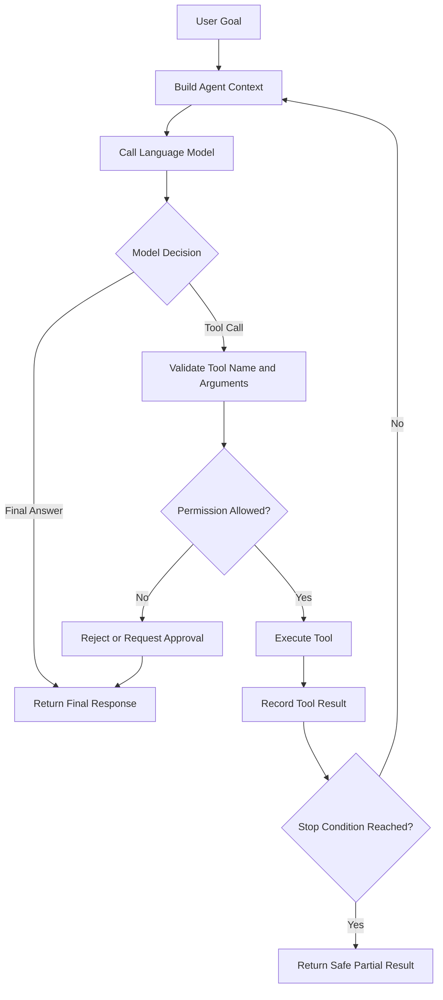
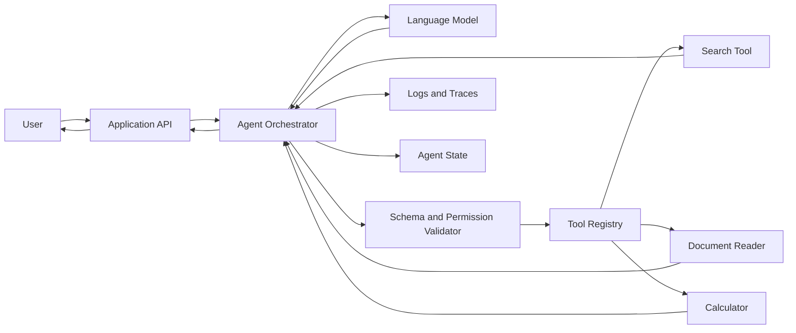
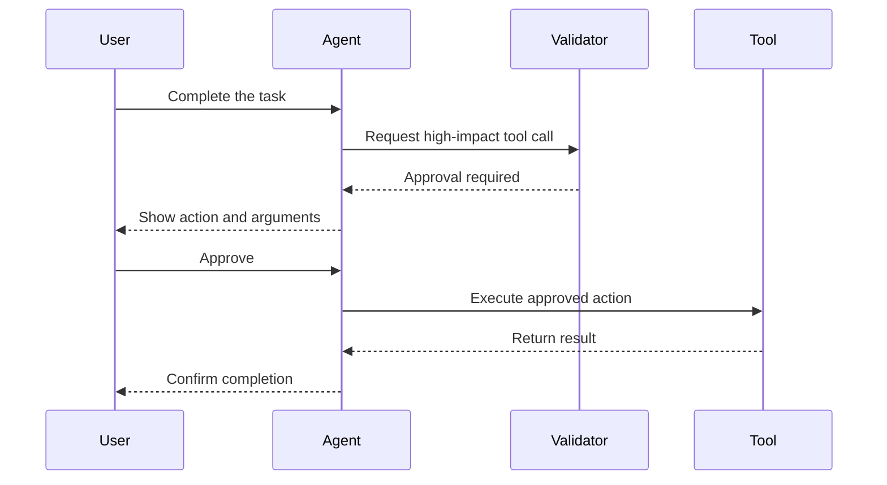
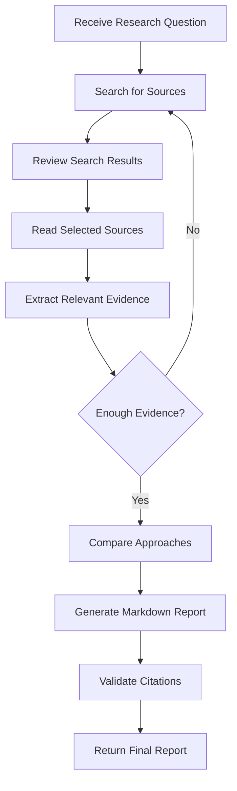

# 005 — Manual Implementation

**Course:** 04 — Agents, Multimodal, and Tools
**Module:** Module 10 — AI Agents
**Content Group:** Agent Basics
**Roadmap Source:** AI Agents / Agent Basics
**Lesson Type:** AI Agent
**Order in Module:** 005
**Suggested Duration:** 26 minutes

---

## 1. Overview

**Manual Implementation** means building an AI agent workflow directly in application code instead of relying on an agent framework to manage planning, tool selection, state, retries, and termination.

In a manually implemented agent, the developer controls the complete execution loop:

1. Receive a user goal.
2. Send the goal and available tools to a language model.
3. Inspect the model's decision.
4. Execute the selected tool.
5. return the tool result to the model.
6. Repeat until the task is completed or a stop condition is reached.

Manual implementation is useful because it makes the agent's behavior explicit and easier to understand. It also gives the developer direct control over permissions, logging, budgets, error handling, and safety boundaries.

However, as the workflow becomes more complex, manually maintaining every part of the loop can become difficult.

---

## 2. Learning Objectives

After completing this lesson, you should be able to:

* Explain manual agent implementation in your own words.
* Describe the main components of a manually implemented agent.
* Build a small agent that can select and call tools.
* Maintain state across multiple agent steps.
* Add tool permissions, execution limits, and stop conditions.
* Log intermediate decisions and tool results.
* Recognize when manual implementation is preferable to an agent framework.
* Identify the limitations and risks of manually implemented agents.

---

## 3. What Is Manual Agent Implementation?

A manually implemented agent is an application-controlled loop in which the developer explicitly manages the interaction between:

* The user
* The language model
* Tool definitions
* Tool execution
* Conversation state
* Safety rules
* The final response

The language model does not directly execute tools. It only produces a structured request describing which tool should be called and with which arguments.

The application validates the request, executes the tool, captures the result, and sends that result back to the model.

```text
User goal
   ↓
Application sends context and tool schemas
   ↓
Model selects a tool or returns an answer
   ↓
Application validates the request
   ↓
Application executes the tool
   ↓
Tool result is added to the agent state
   ↓
Model evaluates the result
   ↓
Continue or return the final answer
```

Manual implementation is therefore not simply “calling an LLM.” It is building an execution system around the LLM.

---

## 4. The Core Agent Loop

A basic agent usually follows this pattern:

```text
goal → reason → choose tool → execute → observe → decide → final answer
```

A more complete version includes validation and safety controls:



The application, not the model, should control the loop.

---

## 5. Main Components

### 5.1 User Goal

The user goal describes the outcome the agent should achieve.

Examples:

* “Find three reliable sources about vector databases and summarize them.”
* “Check my calendar and suggest an available meeting time.”
* “Read these documents and create a comparison report.”
* “Inspect the error logs and identify the likely cause.”

A useful goal should be clear enough to guide the agent but does not always need to describe every individual step.

---

### 5.2 System Instructions

System instructions define the agent's responsibilities, behavior, and limits.

Example:

```text
You are a research assistant.

You may use the search and read_page tools.

Rules:
- Use no more than five tool calls.
- Only use sources returned by the search tool.
- Do not invent citations.
- Stop when enough evidence has been collected.
- Return a concise Markdown report.
```

Good system instructions normally include:

* The agent's role
* Available actions
* Required output format
* Permission boundaries
* Safety constraints
* Tool-call limits
* Conditions for stopping

---

### 5.3 Tool Schema

Each tool should have a clear name, description, and input schema.

Example:

```json
{
  "name": "search_documents",
  "description": "Search approved internal documents for relevant passages.",
  "parameters": {
    "type": "object",
    "properties": {
      "query": {
        "type": "string",
        "description": "The search query."
      },
      "limit": {
        "type": "integer",
        "minimum": 1,
        "maximum": 10,
        "description": "Maximum number of results."
      }
    },
    "required": ["query"]
  }
}
```

A good tool schema should be:

* Narrow in scope
* Explicit about its purpose
* Strictly typed
* Easy to validate
* Limited to necessary permissions
* Clear about required and optional fields

Avoid exposing a generic tool such as:

```text
execute_any_command(command)
```

Prefer restricted tools such as:

```text
search_documents(query)
read_document(document_id)
create_report(title, content)
```

---

### 5.4 Tool Registry

A tool registry maps model-visible tool names to application functions.

```python
TOOL_REGISTRY = {
    "search_documents": search_documents,
    "read_document": read_document,
    "calculate": calculate,
}
```

The registry prevents the model from calling arbitrary functions.

Before execution, the application should verify that:

* The tool exists.
* The agent is allowed to use it.
* The arguments match the schema.
* The call does not exceed a budget.
* Human approval is not required.

---

### 5.5 Agent State

Agent state stores information collected during the workflow.

A simple state object might contain:

```python
state = {
    "goal": "Research vector database options",
    "messages": [],
    "tool_calls": [],
    "step_count": 0,
    "total_cost": 0.0,
    "status": "running",
}
```

The state may include:

* User goal
* Conversation messages
* Model decisions
* Tool requests
* Tool results
* Errors
* Token usage
* Cost
* Execution time
* Approval status
* Final output

State allows the agent to inspect previous results and decide what to do next.

---

### 5.6 Decision Output

The model should return a structured decision rather than uncontrolled natural language.

Example tool decision:

```json
{
  "action": "tool",
  "tool_name": "search_documents",
  "arguments": {
    "query": "vector database scalability comparison",
    "limit": 5
  },
  "reason": "I need evidence before writing the comparison."
}
```

Example final decision:

```json
{
  "action": "final",
  "answer": "The main trade-offs are operational complexity, filtering support, and scalability."
}
```

The application can parse this structure more reliably than free-form text.

---

## 6. Minimal Manual Agent Architecture



The **agent orchestrator** is responsible for controlling the loop. It should never allow the model to bypass validation or execute tools directly.

---

## 7. Basic Python Implementation

The following example demonstrates a framework-independent agent loop.

```python
from __future__ import annotations

import json
import time
from dataclasses import dataclass, field
from typing import Any, Callable


class AgentError(Exception):
    """Base exception for agent execution errors."""


class ToolValidationError(AgentError):
    """Raised when a requested tool call is invalid."""


@dataclass
class AgentState:
    goal: str
    messages: list[dict[str, Any]] = field(default_factory=list)
    tool_calls: list[dict[str, Any]] = field(default_factory=list)
    step_count: int = 0
    started_at: float = field(default_factory=time.time)


def search_knowledge_base(query: str, limit: int = 3) -> dict[str, Any]:
    """Example restricted search tool."""

    documents = [
        {
            "title": "Agent Architecture",
            "content": "Agents combine models, tools, state, and control logic.",
        },
        {
            "title": "Tool Safety",
            "content": "Tools should use narrow permissions and validated inputs.",
        },
        {
            "title": "Agent Evaluation",
            "content": "Evaluate task success, tool accuracy, cost, and latency.",
        },
    ]

    query_terms = query.lower().split()

    matching_documents = [
        document
        for document in documents
        if any(
            term in document["content"].lower()
            or term in document["title"].lower()
            for term in query_terms
        )
    ]

    return {
        "query": query,
        "results": matching_documents[:limit],
    }


TOOL_REGISTRY: dict[str, Callable[..., Any]] = {
    "search_knowledge_base": search_knowledge_base,
}


TOOL_PERMISSIONS = {
    "search_knowledge_base": True,
}


def validate_tool_call(
    tool_name: str,
    arguments: dict[str, Any],
) -> None:
    if tool_name not in TOOL_REGISTRY:
        raise ToolValidationError(f"Unknown tool: {tool_name}")

    if not TOOL_PERMISSIONS.get(tool_name, False):
        raise ToolValidationError(f"Tool is not permitted: {tool_name}")

    if tool_name == "search_knowledge_base":
        query = arguments.get("query")
        limit = arguments.get("limit", 3)

        if not isinstance(query, str) or not query.strip():
            raise ToolValidationError(
                "search_knowledge_base requires a non-empty query."
            )

        if not isinstance(limit, int) or not 1 <= limit <= 5:
            raise ToolValidationError(
                "limit must be an integer between 1 and 5."
            )


def execute_tool(
    tool_name: str,
    arguments: dict[str, Any],
) -> Any:
    validate_tool_call(tool_name, arguments)
    tool_function = TOOL_REGISTRY[tool_name]
    return tool_function(**arguments)


def call_model(
    messages: list[dict[str, Any]],
) -> dict[str, Any]:
    """
    Replace this mock function with an actual language-model API call.

    The model should return one of the following:

    {
        "action": "tool",
        "tool_name": "...",
        "arguments": {...}
    }

    or:

    {
        "action": "final",
        "answer": "..."
    }
    """

    has_tool_result = any(
        message.get("role") == "tool"
        for message in messages
    )

    if not has_tool_result:
        return {
            "action": "tool",
            "tool_name": "search_knowledge_base",
            "arguments": {
                "query": "agent tools state safety",
                "limit": 3,
            },
        }

    return {
        "action": "final",
        "answer": (
            "A manually implemented agent combines a language model, "
            "restricted tools, explicit state management, validation, "
            "logging, and application-controlled stop conditions."
        ),
    }


def run_agent(
    goal: str,
    max_steps: int = 5,
    timeout_seconds: float = 30.0,
) -> str:
    state = AgentState(goal=goal)

    state.messages.append(
        {
            "role": "system",
            "content": (
                "You are a careful AI assistant. "
                "Use only approved tools. "
                "Return structured tool calls or a final answer."
            ),
        }
    )

    state.messages.append(
        {
            "role": "user",
            "content": goal,
        }
    )

    while state.step_count < max_steps:
        elapsed_time = time.time() - state.started_at

        if elapsed_time > timeout_seconds:
            raise AgentError("Agent execution timed out.")

        state.step_count += 1

        decision = call_model(state.messages)
        action = decision.get("action")

        print(
            json.dumps(
                {
                    "event": "model_decision",
                    "step": state.step_count,
                    "decision": decision,
                },
                indent=2,
            )
        )

        if action == "final":
            answer = decision.get("answer")

            if not isinstance(answer, str):
                raise AgentError("The final answer is invalid.")

            return answer

        if action != "tool":
            raise AgentError(f"Unsupported action: {action}")

        tool_name = decision.get("tool_name")
        arguments = decision.get("arguments", {})

        if not isinstance(tool_name, str):
            raise ToolValidationError("Missing tool name.")

        if not isinstance(arguments, dict):
            raise ToolValidationError(
                "Tool arguments must be an object."
            )

        try:
            result = execute_tool(tool_name, arguments)
        except Exception as error:
            result = {
                "error": type(error).__name__,
                "message": str(error),
            }

        tool_call_record = {
            "step": state.step_count,
            "tool_name": tool_name,
            "arguments": arguments,
            "result": result,
        }

        state.tool_calls.append(tool_call_record)

        print(
            json.dumps(
                {
                    "event": "tool_result",
                    **tool_call_record,
                },
                indent=2,
            )
        )

        state.messages.append(
            {
                "role": "assistant",
                "content": json.dumps(decision),
            }
        )

        state.messages.append(
            {
                "role": "tool",
                "name": tool_name,
                "content": json.dumps(result),
            }
        )

    raise AgentError(
        f"Agent stopped after reaching the limit of {max_steps} steps."
    )


if __name__ == "__main__":
    final_answer = run_agent(
        goal="Explain the essential components of a safe AI agent."
    )

    print("\nFinal answer:")
    print(final_answer)
```

---

## 8. How the Implementation Works

### Step 1: Initialize the State

```python
state = AgentState(goal=goal)
```

The state stores the task, message history, tool calls, step count, and execution start time.

### Step 2: Call the Model

```python
decision = call_model(state.messages)
```

The model receives the current context and returns either:

* A tool request
* A final answer

### Step 3: Validate the Tool Request

```python
validate_tool_call(tool_name, arguments)
```

The application verifies the tool name, permissions, and arguments before executing anything.

### Step 4: Execute the Tool

```python
result = execute_tool(tool_name, arguments)
```

Only functions registered in `TOOL_REGISTRY` can be executed.

### Step 5: Record the Observation

The tool result is stored in the state and added to the next model request.

```python
state.messages.append(
    {
        "role": "tool",
        "name": tool_name,
        "content": json.dumps(result),
    }
)
```

### Step 6: Continue or Stop

The loop continues until:

* The model returns a final answer.
* The maximum step count is reached.
* The timeout is reached.
* A safety rule blocks execution.
* The user or application cancels the task.

---

## 9. Tool Permission Boundaries

An agent should receive the minimum permissions required for its task.

This principle is known as **least privilege**.

For example, a research agent may need permission to:

* Search approved sources
* Read web pages
* Save a Markdown report

It probably does not need permission to:

* Delete files
* Send emails
* Execute operating-system commands
* Modify production databases
* Purchase products
* Publish content publicly

A permission matrix can make these boundaries explicit:

| Tool               | Read Data | Write Data | External Effect | Approval Required |
| ------------------ | --------: | ---------: | --------------: | ----------------: |
| `search_documents` |       Yes |         No |              No |                No |
| `read_document`    |       Yes |         No |              No |                No |
| `save_report`      |        No |        Yes |         Limited |         Sometimes |
| `send_email`       |        No |        Yes |             Yes |               Yes |
| `delete_record`    |        No |        Yes |             Yes |            Always |

High-impact tools should normally require explicit human approval.

---

## 10. Human Approval

Some tool calls should pause before execution.

Examples include:

* Sending an email
* Deleting a document
* Publishing a post
* Transferring money
* Modifying production data
* Booking an appointment
* Running a destructive command

A simple approval flow might look like this:



The approval request should clearly show:

* The tool being called
* The exact arguments
* The expected effect
* Whether the action can be reversed
* Any important risk

---

## 11. Stop Conditions

Without stop conditions, an agent may continue calling tools indefinitely.

Common stop conditions include:

### Maximum Steps

```python
MAX_STEPS = 8
```

The agent cannot execute more than a fixed number of reasoning cycles.

### Timeout

```python
TIMEOUT_SECONDS = 45
```

The workflow ends if execution exceeds a time limit.

### Tool-Call Budget

```python
MAX_TOOL_CALLS = 5
```

This prevents unnecessary or repeated external operations.

### Token Budget

```python
MAX_TOTAL_TOKENS = 20_000
```

This limits model usage and cost.

### Financial Budget

```python
MAX_COST_USD = 0.50
```

The workflow ends before exceeding an allowed cost.

### Repeated-Action Detection

Stop when the agent repeatedly calls the same tool with nearly identical arguments.

```python
if current_call == previous_call:
    repeated_call_count += 1
```

### Goal Completion

Stop when the required artifact or answer has been produced.

### Human Cancellation

Allow the user or application to cancel a long-running workflow.

---

## 12. Logging and Observability

Logging is essential because an agent can fail at several different stages:

* The model may select the wrong tool.
* The model may generate invalid arguments.
* The tool may fail.
* The result may be misunderstood.
* The agent may repeat an action.
* The stop condition may not trigger.
* The final answer may not reflect the evidence.

A useful tool-call log should include:

```json
{
  "request_id": "req_123",
  "agent_id": "research_agent",
  "step": 2,
  "tool_name": "search_documents",
  "arguments": {
    "query": "agent evaluation methods",
    "limit": 5
  },
  "status": "success",
  "duration_ms": 183,
  "result_count": 5,
  "timestamp": "2026-07-28T13:00:00Z"
}
```

Useful observability metrics include:

| Metric                  | Purpose                                            |
| ----------------------- | -------------------------------------------------- |
| Task success rate       | Measures whether the agent completes its goal      |
| Tool selection accuracy | Measures whether the correct tool was chosen       |
| Tool error rate         | Identifies unstable integrations                   |
| Average step count      | Detects inefficient reasoning loops                |
| Token usage             | Tracks model consumption                           |
| Cost per task           | Controls operating expenses                        |
| End-to-end latency      | Measures user waiting time                         |
| Approval rate           | Measures how often sensitive actions are requested |
| Repeated-call rate      | Detects loops                                      |
| Invalid argument rate   | Reveals schema or prompting problems               |

Do not expose hidden reasoning traces to users. Log structured decisions, actions, observations, and errors instead.

---

## 13. Error Handling

Tools can fail because of:

* Invalid arguments
* Network errors
* Authentication failures
* Rate limits
* Missing data
* Permission errors
* Timeouts
* Service outages

The application should convert raw exceptions into structured observations.

```python
try:
    result = execute_tool(tool_name, arguments)
except TimeoutError:
    result = {
        "status": "error",
        "error_type": "timeout",
        "retryable": True,
    }
except PermissionError:
    result = {
        "status": "error",
        "error_type": "permission_denied",
        "retryable": False,
    }
```

The model can then decide whether to:

* Retry with corrected arguments
* Select another tool
* Ask the user for missing information
* Return a partial result
* Stop safely

Retries should be limited.

```python
MAX_RETRIES_PER_TOOL = 2
```

---

## 14. Manual Implementation Versus Frameworks

| Dimension                | Manual Implementation     | Agent Framework                |
| ------------------------ | ------------------------- | ------------------------------ |
| Control                  | Very high                 | Depends on framework           |
| Transparency             | High                      | Can be abstracted              |
| Setup for small agents   | Simple                    | May add unnecessary complexity |
| Complex state management | Requires custom code      | Often built in                 |
| Debugging                | Direct but manual         | Framework-specific tooling     |
| Vendor lock-in           | Low                       | Potentially higher             |
| Custom safety logic      | Easy to tailor            | Must fit framework model       |
| Multi-agent workflows    | Difficult to maintain     | Often better supported         |
| Learning value           | Excellent                 | May hide important concepts    |
| Production scaling       | Requires engineering work | Provides useful primitives     |

Manual implementation is often the best starting point when:

* Learning how agents work
* Building a small agent
* Using only one or two tools
* Requiring strict control
* Avoiding framework dependencies
* Creating a custom execution policy
* Debugging tool-selection behavior

A framework becomes more useful when the application needs:

* Complex workflow graphs
* Persistent checkpoints
* Multiple cooperating agents
* Built-in tracing
* Advanced memory
* Durable execution
* Many tools and integrations
* Human-in-the-loop workflow management

---

## 15. Example: Manual Research Agent

Consider the following task:

```text
Research three approaches to implementing RAG and produce a sourced
Markdown comparison.
```

The agent may perform these steps:



Possible tools:

```json
[
  {
    "name": "search_web",
    "description": "Search approved public sources.",
    "parameters": {
      "type": "object",
      "properties": {
        "query": {
          "type": "string"
        }
      },
      "required": ["query"]
    }
  },
  {
    "name": "read_page",
    "description": "Read a page returned by search_web.",
    "parameters": {
      "type": "object",
      "properties": {
        "page_id": {
          "type": "string"
        }
      },
      "required": ["page_id"]
    }
  },
  {
    "name": "save_markdown",
    "description": "Save the final report as a Markdown file.",
    "parameters": {
      "type": "object",
      "properties": {
        "filename": {
          "type": "string"
        },
        "content": {
          "type": "string"
        }
      },
      "required": ["filename", "content"]
    }
  }
]
```

Recommended constraints:

```text
- Maximum search calls: 3
- Maximum page reads: 5
- Maximum total agent steps: 10
- Only read URLs returned by the search tool
- Do not invent citations
- Do not save the report until citation validation succeeds
- Require user approval before overwriting an existing file
```

---

## 16. Practical Exercise

### Goal

Build a small agent that solves a two-to-three-step task and logs every tool call.

### Suggested Task

Create an agent that:

1. Searches a small local knowledge base.
2. Selects relevant information.
3. Produces a concise Markdown answer.

### Required Tools

Implement at least one tool with a strict schema:

```json
{
  "name": "search_notes",
  "description": "Search local course notes.",
  "parameters": {
    "type": "object",
    "properties": {
      "query": {
        "type": "string"
      },
      "limit": {
        "type": "integer",
        "minimum": 1,
        "maximum": 5
      }
    },
    "required": ["query"]
  }
}
```

### Requirements

Your implementation should include:

* A tool registry
* Input validation
* An agent-state object
* A maximum step count
* A timeout
* Structured logs
* Error handling
* A final-answer action
* At least one permission boundary

### Example Input

```text
Explain why AI agents require both tool schemas and stop conditions.
```

### Example Execution Log

```text
Step 1:
Action: search_notes
Arguments: {"query": "agent tool schemas stop conditions", "limit": 3}

Step 1 result:
Three relevant passages found.

Step 2:
Action: final

Final answer:
Tool schemas define what an agent may execute and how arguments must be
structured. Stop conditions prevent infinite loops, excessive cost, and
uncontrolled tool usage.
```

---

## 17. Extension Exercise

Add a second tool:

```text
save_report(filename, content)
```

Then implement these rules:

* The filename must end in `.md`.
* The file must be saved only inside an approved directory.
* Existing files cannot be overwritten without approval.
* The report must contain at least one source reference.
* The agent may call `save_report` only once.

This exercise demonstrates that tool safety is implemented in application code, not merely described in the prompt.

---

## 18. Common Mistakes

### 18.1 Giving the Agent Excessive Permissions

A general-purpose command executor creates unnecessary risk.

**Better approach:** expose small, task-specific tools with limited permissions.

---

### 18.2 Trusting Model-Generated Arguments

Model outputs may be malformed, incomplete, or unsafe.

**Better approach:** validate every argument before execution.

---

### 18.3 Missing Stop Conditions

The agent may continue calling tools, increasing latency and cost.

**Better approach:** enforce limits for steps, time, retries, tokens, and cost.

---

### 18.4 No Intermediate Logging

Without logs, it is difficult to determine whether the model, tool, or orchestration logic caused a failure.

**Better approach:** record structured events for each decision and execution.

---

### 18.5 Returning Raw Tool Errors

Raw exceptions may contain sensitive implementation details.

**Better approach:** convert errors into safe, structured observations.

---

### 18.6 Allowing Arbitrary Tool Names

Executing a function based directly on model-generated text can create security vulnerabilities.

**Better approach:** resolve tools through a fixed registry.

---

### 18.7 Treating the Prompt as a Security Boundary

A prompt such as “never delete data” is not sufficient protection.

**Better approach:** enforce restrictions in code and permissions.

---

### 18.8 Unlimited Retries

The model may repeatedly call a failing tool.

**Better approach:** use bounded retries and repeated-action detection.

---

### 18.9 Storing Unlimited Context

Long tool outputs can increase token usage and reduce model performance.

**Better approach:** summarize, filter, or truncate observations before adding them to the model context.

---

### 18.10 Using an Agent for a Deterministic Workflow

Not every multi-step process requires an agent.

**Better approach:** use ordinary application logic when the steps and conditions are already known.

```python
data = fetch_data()
validated_data = validate_data(data)
report = generate_report(validated_data)
```

Use an agent when decisions genuinely depend on interpretation, uncertain information, or dynamic tool selection.

---

## 19. Production Checklist

### Agent Design

* [ ] The agent has a clearly defined responsibility.
* [ ] The expected output format is explicit.
* [ ] The workflow requires model-based decisions.
* [ ] Deterministic steps remain in normal application code.

### Tool Design

* [ ] Every tool has a narrow purpose.
* [ ] Tool names and descriptions are unambiguous.
* [ ] Input schemas are strict.
* [ ] Tool outputs are structured.
* [ ] Tools follow least-privilege access.
* [ ] High-impact actions require approval.

### Execution Control

* [ ] The application controls the agent loop.
* [ ] Maximum step count is enforced.
* [ ] Timeout is enforced.
* [ ] Retry limits are enforced.
* [ ] Token and cost budgets are tracked.
* [ ] Repeated actions are detected.
* [ ] Cancellation is supported.

### Validation and Safety

* [ ] Tool names are resolved through a fixed registry.
* [ ] Arguments are validated before execution.
* [ ] External content is treated as untrusted.
* [ ] Sensitive data is protected.
* [ ] Raw system errors are not exposed.
* [ ] Destructive operations require confirmation.

### Observability

* [ ] Model decisions are logged.
* [ ] Tool calls and results are logged.
* [ ] Latency and cost are measured.
* [ ] Errors are classified.
* [ ] Logs include request and trace identifiers.
* [ ] Sensitive arguments are redacted.

### Evaluation

* [ ] Successful task completion is measured.
* [ ] Tool-selection accuracy is tested.
* [ ] Invalid arguments are tested.
* [ ] Tool failures are simulated.
* [ ] Infinite-loop scenarios are tested.
* [ ] Approval flows are tested.
* [ ] Final answers are checked against tool evidence.

---

## 20. Completion Checklist

* [ ] I can explain manual agent implementation in one to two minutes.
* [ ] I can describe the model–tool–observation loop.
* [ ] I can define a tool with a clear schema.
* [ ] I can implement a fixed tool registry.
* [ ] I can validate model-generated tool arguments.
* [ ] I can maintain agent state across multiple steps.
* [ ] I can log intermediate decisions and tool calls.
* [ ] I can enforce a timeout and maximum step count.
* [ ] I understand when human approval is necessary.
* [ ] I have created a small working agent demo.
* [ ] I have documented at least one limitation or open question.

---

## 21. Related Outcome

Build agentic workflows that can:

* Interpret user goals
* Select appropriate tools
* Inspect intermediate results
* Adapt their next action
* Stop safely
* Complete multi-step tasks
* Produce traceable final outputs

---

## 22. Related Portfolio Project

### Project 9: Research Agent

Build a research agent that:

1. Accepts a research question.
2. Generates focused search queries.
3. Searches approved information sources.
4. Selects relevant results.
5. Reads and extracts evidence.
6. Detects whether enough evidence has been collected.
7. Produces a Markdown report.
8. Includes valid source references.
9. Logs every model decision and tool call.
10. Exports the final report.

Recommended project structure:

```text
research-agent/
├── app.py
├── agent/
│   ├── loop.py
│   ├── state.py
│   ├── prompts.py
│   └── policies.py
├── tools/
│   ├── search.py
│   ├── reader.py
│   └── markdown_export.py
├── schemas/
│   ├── decisions.py
│   └── tools.py
├── evaluation/
│   ├── test_cases.json
│   └── evaluator.py
├── logs/
├── reports/
├── tests/
└── README.md
```

Useful evaluation scenarios:

* A normal research question
* A question with few available sources
* Conflicting sources
* A tool timeout
* Invalid tool arguments
* Repeated search calls
* An unsupported request
* A request that exceeds the tool-call budget
* An attempted unsafe file operation

---

## 23. Key Takeaways

1. Manual implementation gives developers direct control over the agent loop.

2. The model should propose actions, while the application validates and executes them.

3. Tools should have narrow permissions and strict schemas.

4. Agent state connects decisions and observations across multiple steps.

5. Stop conditions are necessary to prevent loops, excessive cost, and uncontrolled behavior.

6. Prompts are behavioral guidance, not security boundaries.

7. Logging and evaluation are essential for debugging agentic systems.

8. Human approval should protect high-impact or irreversible actions.

9. Manual implementation is ideal for learning, small agents, and highly controlled workflows.

10. Agent frameworks become useful when state, orchestration, persistence, and workflow complexity grow.

---

## 24. Summary

**Manual Implementation** is the process of building an AI agent's execution loop directly in application code.

A manually implemented agent typically performs the following cycle:

```text
goal
→ model decision
→ tool validation
→ permission check
→ tool execution
→ observation
→ updated state
→ next decision
→ final answer
```

The most important principle is that the language model should not control the system directly. The application must remain responsible for permissions, validation, execution, budgets, logging, approval, and termination.

Turn this lesson into a small portfolio artifact: implement one or two restricted tools, let an agent solve a short multi-step task, record every action, enforce strict stop conditions, and document the design trade-offs.
