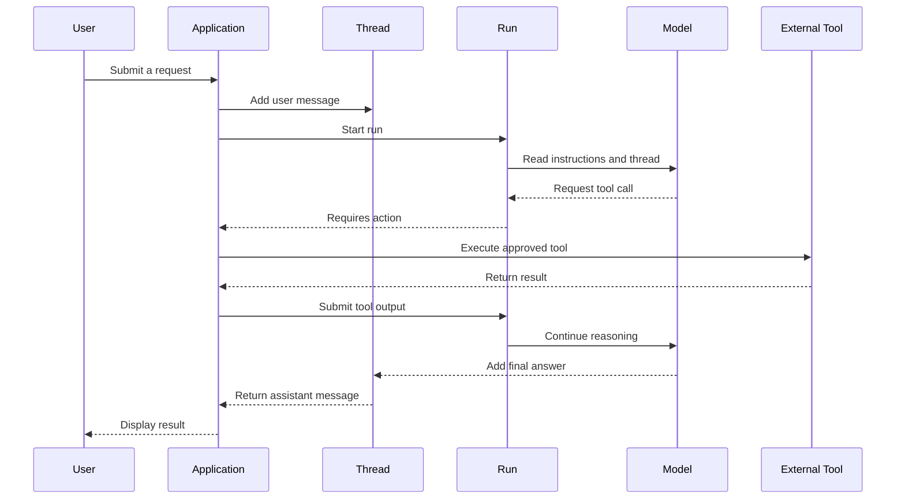
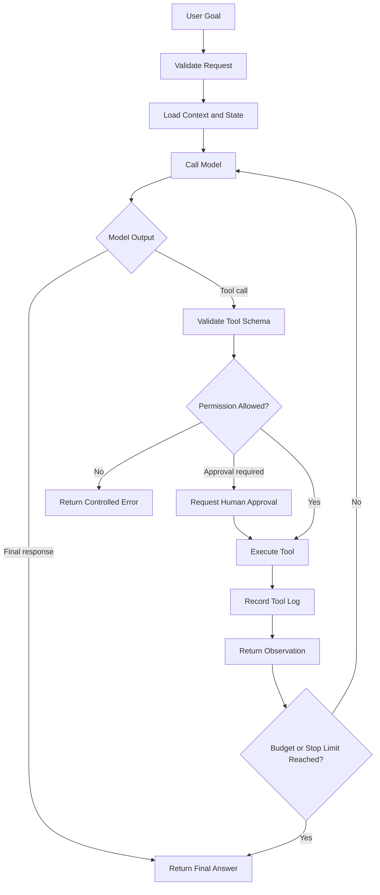
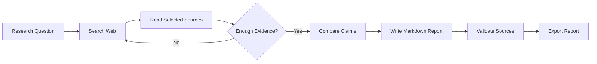

# 007 — OpenAI Assistants API

**Course:** 04 — Agents, Multimodal and Tools
**Module:** Module 10 — AI Agents
**Content Group:** Tools and Execution
**Roadmap Source:** AI Agents / Tools and Execution
**Lesson Type:** AI Agent
**Order in Module:** 007
**Suggested Duration:** 26 minutes

---

## 1. Lesson Summary

This lesson explains the **OpenAI Assistants API** and its role in the development of modern AI agents.

The Assistants API introduced a higher-level architecture for building AI applications that could:

* Maintain conversation state
* Access uploaded files
* Retrieve information
* Execute code
* Call application-defined functions
* Complete multi-step tasks

However, the Assistants API is now a **legacy API**. OpenAI has deprecated it and scheduled its shutdown for **August 26, 2026**. New projects should use the **Responses API**, Conversations API, and optionally the Agents SDK instead.

Therefore, this lesson covers two perspectives:

1. The Assistants API as an important historical agent architecture.
2. The Responses API as its modern replacement.

---

## 2. Learning Objectives

By the end of this lesson, you should be able to:

* Explain the purpose of the OpenAI Assistants API in your own words.
* Describe the relationship between assistants, threads, messages, runs, and tools.
* Map Assistants API concepts to the modern Responses API.
* Define a function tool with a strict JSON Schema.
* Implement a basic multi-step tool-calling loop.
* Add permissions, budgets, logs, approval gates, and stop conditions.
* Identify when a workflow needs an agent rather than a single model call.
* Build a small portfolio demo using tools and intermediate execution steps.

---

## 3. Current Status

> [!IMPORTANT]
> The official product name is **OpenAI Assistants API**, using the plural form “Assistants.”

The Assistants API has been deprecated after the Responses API reached feature parity. It will shut down on **August 26, 2026**. OpenAI recommends the Responses API for new applications because it provides a simpler and more flexible architecture.

The modern stack is:

```text
Responses API
    +
Conversation state
    +
Built-in or custom tools
    +
Application-side permissions
    +
Tracing and evaluation
```

OpenAI describes the Responses API as the recommended foundation for new projects. It supports built-in tools, custom functions, multimodal input, multi-turn state, and agentic tool execution.

---

## 4. What Was the Assistants API?

The Assistants API was a managed API for creating persistent, tool-using AI assistants.

Instead of manually sending the entire message history to a model for every request, developers could create:

* An **Assistant** containing instructions, a model, and tools
* A **Thread** containing the conversation history
* **Messages** inside the thread
* A **Run** that processed the thread using the assistant
* **Run Steps** describing intermediate execution
* **Tool Outputs** returned by the application

Conceptually:

```text
Assistant configuration
        +
Conversation thread
        +
User message
        ↓
       Run
        ↓
Model reasoning and tool calls
        ↓
Tool outputs
        ↓
Assistant message
```

The API helped developers avoid implementing every part of the agent lifecycle manually.

---

## 5. Core Assistants API Concepts

| Concept          | Purpose                                                       |
| ---------------- | ------------------------------------------------------------- |
| Assistant        | Stored instructions, model configuration, and available tools |
| Thread           | Stored the conversation history                               |
| Message          | Represented user or assistant content                         |
| Run              | Executed an assistant against a thread                        |
| Run Step         | Represented an intermediate model or tool action              |
| Tool Call        | Requested an external function or built-in capability         |
| Tool Output      | Returned the result of an external function                   |
| Vector Store     | Stored searchable document chunks                             |
| File Search      | Retrieved relevant information from uploaded files            |
| Code Interpreter | Executed code in a managed environment                        |

### Simplified lifecycle



---

## 6. The Agent Execution Loop

An AI agent is more than a model that generates text. It is a system that repeatedly decides what action should happen next.

A general agent loop looks like this:

```text
goal
  ↓
understand current state
  ↓
choose an action
  ↓
request a tool
  ↓
validate permission
  ↓
execute the tool
  ↓
observe the result
  ↓
continue or stop
  ↓
produce the final answer
```

A more complete production version is:



The model proposes actions, but the **application remains responsible for executing them**.

This distinction is critical:

```text
The model requests an action.
The application authorizes and executes the action.
```

The model should never receive unrestricted access to databases, operating systems, payment services, email accounts, or production infrastructure.

---

## 7. Assistants API to Responses API Mapping

The modern Responses API uses a simpler object model.

| Assistants API         | Modern Equivalent                                                      |
| ---------------------- | ---------------------------------------------------------------------- |
| Assistant              | Instructions, tools, model configuration, or application configuration |
| Thread                 | Conversation                                                           |
| Message                | Input or output item                                                   |
| Run                    | Response                                                               |
| Run Step               | Response output item or trace event                                    |
| Submit Tool Outputs    | `function_call_output` input item                                      |
| Assistant instructions | `instructions` parameter                                               |
| Thread history         | Conversation items or chained responses                                |
| Assistant response     | Response output text and output items                                  |

Threads stored messages. Conversations can store a broader set of items, including messages, tool calls, and tool outputs.

Runs were asynchronous processes executed against threads. Responses instead receive input items and return output items, reducing the number of separate API objects required for a workflow.

### Legacy mental model

```text
Assistant
   └── Thread
         ├── Message
         ├── Message
         └── Run
               ├── Run Step
               ├── Tool Call
               └── Assistant Message
```

### Modern mental model

```text
Application configuration
        +
Conversation or previous response
        +
Current input
        ↓
Response
        ├── Message output
        ├── Function call
        ├── Built-in tool call
        └── Other output items
```

---

## 8. Tools Available to Modern OpenAI Agents

A Responses API agent may use:

### Built-in tools

* Web search
* File search
* Code interpreter
* Computer use
* Image generation
* Shell or local shell, where supported
* Remote MCP servers

### Custom tools

Custom functions can connect the model to:

* Internal databases
* Search services
* CRMs
* Ticket systems
* Email services
* Calendars
* Inventory systems
* Analytics services
* Company APIs
* Backend application logic

The Responses API supports built-in tools, custom functions, tool search, programmatic tool calling, and remote MCP integrations.

---

## 9. Tool Schema Design

A tool schema is a contract between:

1. The language model
2. The application
3. The external system being called

A good tool should have:

* A narrow purpose
* A clear name
* A precise description
* Explicit arguments
* Limited permissions
* Predictable output
* Defined failure states
* A timeout
* Audit logs
* Idempotency where possible

### Poor tool design

```json
{
  "name": "manage_company",
  "description": "Do anything required in the company system."
}
```

Problems:

* The permission scope is too broad.
* The expected arguments are unclear.
* The operation could cause uncontrolled side effects.
* It is difficult to test or audit.

### Better tool design

```json
{
  "type": "function",
  "name": "search_internal_articles",
  "description": "Search approved internal knowledge-base articles.",
  "strict": true,
  "parameters": {
    "type": "object",
    "properties": {
      "query": {
        "type": "string",
        "description": "The search query."
      },
      "limit": {
        "type": "integer",
        "description": "Maximum number of results from 1 to 5.",
        "minimum": 1,
        "maximum": 5
      }
    },
    "required": [
      "query",
      "limit"
    ],
    "additionalProperties": false
  }
}
```

OpenAI recommends enabling strict mode so function arguments reliably follow the declared schema. Strict schemas must mark all properties as required and set `additionalProperties` to `false`. Optional properties can include `null` in their allowed types.

---

## 10. Minimal Responses API Request

Install the Python SDK:

```bash
pip install openai
```

Set the API key:

```bash
export OPENAI_API_KEY="your-api-key"
```

Make a basic request:

```python
from openai import OpenAI

client = OpenAI()

response = client.responses.create(
    model="gpt-5.6",
    instructions=(
        "You are a concise AI engineering tutor. "
        "Explain technical concepts with practical examples."
    ),
    input="What is an AI agent?",
)

print(response.output_text)
```

This is still only a model request. It becomes an agentic workflow when the model can use tools, observe results, and decide what to do next.

---

## 11. Practical Demo: A Tool-Calling Research Assistant

The following demo creates a small agent that searches a local knowledge base.

### Step 1: Define the local tool

```python
from __future__ import annotations

import json
import logging
from typing import Any

from openai import OpenAI


logging.basicConfig(
    level=logging.INFO,
    format="%(asctime)s %(levelname)s %(message)s",
)

client = OpenAI()

ARTICLES = [
    {
        "id": "rag-001",
        "title": "RAG Fundamentals",
        "text": (
            "Retrieval-augmented generation retrieves relevant information "
            "before generating an answer."
        ),
    },
    {
        "id": "agents-001",
        "title": "Agent Tool Safety",
        "text": (
            "Production agents need narrow permissions, approval gates, "
            "timeouts, budgets, logs, and stop conditions."
        ),
    },
    {
        "id": "evals-001",
        "title": "Agent Evaluation",
        "text": (
            "Agent evaluation should measure task success, tool selection, "
            "argument accuracy, safety, latency, and cost."
        ),
    },
]


def search_articles(query: str, limit: int) -> dict[str, Any]:
    """Search the small in-memory article collection."""
    normalized_query = query.casefold()

    matches = [
        article
        for article in ARTICLES
        if normalized_query in article["title"].casefold()
        or normalized_query in article["text"].casefold()
    ]

    return {
        "query": query,
        "count": min(len(matches), limit),
        "results": matches[:limit],
    }
```

### Step 2: Define the tool schema

```python
TOOLS = [
    {
        "type": "function",
        "name": "search_articles",
        "description": (
            "Search the approved AI engineering article collection. "
            "Use this tool when the answer requires information from "
            "the internal collection."
        ),
        "strict": True,
        "parameters": {
            "type": "object",
            "properties": {
                "query": {
                    "type": "string",
                    "description": "A short search query.",
                },
                "limit": {
                    "type": "integer",
                    "description": "Maximum number of results from 1 to 5.",
                    "minimum": 1,
                    "maximum": 5,
                },
            },
            "required": ["query", "limit"],
            "additionalProperties": False,
        },
    }
]
```

### Step 3: Create a safe tool dispatcher

```python
def execute_tool(name: str, arguments: dict[str, Any]) -> dict[str, Any]:
    """Execute only explicitly allow-listed tools."""
    if name == "search_articles":
        return search_articles(**arguments)

    raise ValueError(f"Tool is not allowed: {name}")
```

The dispatcher is an important permission boundary. Never dynamically execute an arbitrary function based only on a model-generated string.

Avoid patterns such as:

```python
# Dangerous: never execute arbitrary model-selected functions this way.
result = globals()[tool_name](**arguments)
```

Use an explicit allow-list instead.

---

## 12. Implementing the Multi-Step Agent Loop

```python
MAX_AGENT_STEPS = 5

SYSTEM_INSTRUCTIONS = """
You are a research assistant for AI engineering students.

Rules:
1. Use search_articles when internal evidence is needed.
2. Do not invent article content.
3. Mention which article titles support the answer.
4. Do not request tools unrelated to the user's question.
5. Stop after collecting enough evidence.
6. Return a concise Markdown answer.
"""


def run_agent(user_request: str) -> str:
    input_items: list[Any] = [
        {
            "role": "user",
            "content": user_request,
        }
    ]

    for step_number in range(1, MAX_AGENT_STEPS + 1):
        logging.info(
            "agent_step_started step=%s",
            step_number,
        )

        response = client.responses.create(
            model="gpt-5.6",
            instructions=SYSTEM_INSTRUCTIONS,
            input=input_items,
            tools=TOOLS,
        )

        # Preserve model output items for the next iteration.
        input_items.extend(response.output)

        function_calls = [
            item
            for item in response.output
            if item.type == "function_call"
        ]

        # No tool call means the model has produced its final answer.
        if not function_calls:
            logging.info(
                "agent_completed step=%s",
                step_number,
            )
            return response.output_text

        for tool_call in function_calls:
            logging.info(
                "tool_call_requested step=%s tool=%s call_id=%s",
                step_number,
                tool_call.name,
                tool_call.call_id,
            )

            try:
                arguments = json.loads(tool_call.arguments)

                result = execute_tool(
                    name=tool_call.name,
                    arguments=arguments,
                )

                tool_output = {
                    "ok": True,
                    "data": result,
                }

            except (json.JSONDecodeError, TypeError, ValueError) as exc:
                logging.exception(
                    "tool_call_failed tool=%s",
                    tool_call.name,
                )

                tool_output = {
                    "ok": False,
                    "error": str(exc),
                }

            input_items.append(
                {
                    "type": "function_call_output",
                    "call_id": tool_call.call_id,
                    "output": json.dumps(
                        tool_output,
                        ensure_ascii=False,
                    ),
                }
            )

    raise RuntimeError(
        f"Agent stopped after reaching {MAX_AGENT_STEPS} steps."
    )


if __name__ == "__main__":
    answer = run_agent(
        "Explain three safety requirements for production AI agents."
    )
    print(answer)
```

When the Responses API returns a function call, the application executes the function and submits a `function_call_output` item using the matching `call_id`. A response may contain zero, one, or multiple function calls, so implementations should handle multiple calls safely.

### Expected execution log

```text
agent_step_started step=1
tool_call_requested step=1 tool=search_articles
agent_step_started step=2
agent_completed step=2
```

### Expected logical flow

```text
User:
Explain three safety requirements for production AI agents.

Model:
I need internal evidence.

Tool call:
search_articles(
    query="agent tool safety",
    limit=3
)

Tool output:
Article about narrow permissions, approval gates,
timeouts, budgets, logs, and stop conditions.

Model:
Produces the final answer using the retrieved evidence.
```

---

## 13. Conversation State

Agents frequently need state across several turns.

The Responses API supports multiple approaches.

### Option A: Chain responses

```python
first_response = client.responses.create(
    model="gpt-5.6",
    input="Explain function calling.",
)

second_response = client.responses.create(
    model="gpt-5.6",
    previous_response_id=first_response.id,
    input="Now give me a Python example.",
)

print(second_response.output_text)
```

The `previous_response_id` parameter links a new request to a previous response and allows the model to use the earlier context.

### Option B: Use a durable conversation

```python
conversation = client.conversations.create()

response = client.responses.create(
    model="gpt-5.6",
    conversation=conversation.id,
    input=[
        {
            "role": "user",
            "content": "Explain agent guardrails.",
        }
    ],
)

print(response.output_text)
```

Conversation objects can persist messages, tool calls, tool outputs, and other items across sessions, devices, or jobs.

### Option C: Manage history manually

```python
history = [
    {
        "role": "user",
        "content": "Explain agent memory.",
    }
]

response = client.responses.create(
    model="gpt-5.6",
    input=history,
    store=False,
)

history.extend(response.output)
history.append(
    {
        "role": "user",
        "content": "Compare it with RAG.",
    }
)

second_response = client.responses.create(
    model="gpt-5.6",
    input=history,
    store=False,
)
```

Manual state management provides greater control over:

* Data storage
* Context filtering
* Summarization
* Privacy
* Token usage
* Vendor portability

However, it also requires more application code.

---

## 14. Permission Boundaries

An agent should receive the smallest permission set necessary to complete its task.

### Permission levels

| Level                     | Example                     | Recommended Handling         |
| ------------------------- | --------------------------- | ---------------------------- |
| Read-only                 | Search documentation        | May run automatically        |
| Low-risk write            | Create a draft              | Log and allow                |
| Reversible action         | Add a label                 | Allow with clear feedback    |
| External communication    | Send an email               | Require confirmation         |
| Financial action          | Purchase a product          | Require explicit approval    |
| Destructive action        | Delete production data      | Strong approval or prohibit  |
| Privileged infrastructure | Execute production commands | Sandbox and tightly restrict |

### Separate read tools from write tools

Prefer:

```text
get_customer
search_orders
create_refund_request
approve_refund
```

Avoid:

```text
manage_customer_account
```

Separating tools makes permission rules easier to enforce.

### Example approval policy

```python
TOOLS_REQUIRING_APPROVAL = {
    "send_email",
    "delete_file",
    "approve_refund",
    "publish_report",
}


def requires_approval(tool_name: str) -> bool:
    return tool_name in TOOLS_REQUIRING_APPROVAL
```

A model-generated tool call should not be treated as user approval.

---

## 15. Stop Conditions and Budgets

Without clear limits, an agent may:

* Repeat the same tool call
* Search indefinitely
* Consume excessive tokens
* Produce unnecessary costs
* Wait forever for an external service
* Continue after the task is already complete

Useful limits include:

```python
MAX_AGENT_STEPS = 5
MAX_TOOL_CALLS = 8
MAX_SEARCH_CALLS = 3
MAX_RESULTS_PER_SEARCH = 5
TOOL_TIMEOUT_SECONDS = 10
MAX_TOTAL_RUNTIME_SECONDS = 30
MAX_RETRIES_PER_TOOL = 2
```

### Example stop rules

Stop when:

* The model produces a final response.
* The maximum number of steps is reached.
* The time budget is exceeded.
* The token or cost budget is exceeded.
* The same tool request repeats.
* A required human approval is rejected.
* A critical tool fails repeatedly.
* The requested evidence has been collected.
* The task cannot be completed safely.

### Repeated-call detection

```python
import hashlib
import json


def tool_call_fingerprint(
    name: str,
    arguments: dict,
) -> str:
    payload = json.dumps(
        {
            "name": name,
            "arguments": arguments,
        },
        sort_keys=True,
    )

    return hashlib.sha256(payload.encode()).hexdigest()
```

Store each fingerprint and stop or warn when the same call is repeated too many times.

---

## 16. Logging and Observability

A production agent should log enough information to reconstruct what happened.

### Recommended fields

```text
request_id
user_id
session_id
conversation_id
response_id
agent_step
model
tool_name
tool_call_id
tool_arguments_redacted
tool_status
tool_duration_ms
input_tokens
output_tokens
total_tokens
error_type
approval_status
final_status
```

### Example structured log

```json
{
  "request_id": "req_01",
  "agent_step": 2,
  "tool_name": "search_articles",
  "tool_call_id": "call_abc123",
  "tool_status": "success",
  "tool_duration_ms": 42,
  "result_count": 3
}
```

Do not log:

* API keys
* Passwords
* Authentication tokens
* Full credit-card information
* Sensitive personal information
* Unredacted confidential documents

### Metrics to monitor

| Category    | Example Metric                |
| ----------- | ----------------------------- |
| Quality     | Task completion rate          |
| Tool use    | Correct tool selection rate   |
| Arguments   | Valid argument rate           |
| Reliability | Tool failure rate             |
| Safety      | Unauthorized action attempts  |
| Performance | End-to-end latency            |
| Efficiency  | Average number of steps       |
| Cost        | Input and output tokens       |
| UX          | Human approval rate           |
| Retrieval   | Citation or evidence coverage |

Tool definitions are included in model context and therefore contribute to input-token usage. Applications with many tools should keep schemas concise or load only relevant tools.

---

## 17. Agent, Workflow, or Single Model Call?

Not every application needs an agent.

### Use a single model call when:

* The task is deterministic.
* All required context is already available.
* No external action is required.
* The output format is predictable.
* The task has one clear generation step.

Examples:

* Summarizing provided text
* Rewriting an email
* Classifying feedback
* Extracting fields from a document

### Use a fixed workflow when:

* The steps are known in advance.
* Reliability is more important than flexibility.
* Every input should follow the same process.

Example:

```text
validate input
    ↓
retrieve documents
    ↓
rerank documents
    ↓
generate answer
    ↓
verify citations
```

### Use an agent when:

* The required steps depend on intermediate results.
* Multiple tools may be needed.
* The model must decide what information to collect.
* The task has branching paths.
* The model must inspect observations before continuing.

Example:

```text
Research a company
    ↓
decide which sources are needed
    ↓
search the web
    ↓
inspect results
    ↓
search company filings if necessary
    ↓
compare claims
    ↓
write a sourced report
```

A useful engineering principle is:

> Prefer the least autonomous architecture that can reliably solve the task.

---

## 18. Common Mistakes

### 18.1 Starting a new project with the deprecated API

The Assistants API is shutting down on August 26, 2026. New applications should use the Responses API rather than creating new dependencies on assistants, threads, and runs.

### 18.2 Giving the agent too many tools

A large tool list can:

* Increase token usage
* Confuse tool selection
* Increase security risk
* Make evaluation harder

Load only the tools required for the current workflow.

### 18.3 Using vague tool descriptions

Bad:

```text
Search for things.
```

Better:

```text
Search approved product documentation for technical facts.
Use this tool only when the user asks about product behavior.
```

### 18.4 Trusting arguments without validation

Even with strict schemas, validate:

* Identifier ownership
* Value ranges
* User permissions
* Business rules
* Resource existence
* Rate limits

### 18.5 Mixing read and destructive actions

A general database tool with read, update, and delete permissions is difficult to secure.

Create separate narrow tools.

### 18.6 Executing side effects automatically

Sending emails, spending money, publishing content, or deleting data should normally require explicit approval.

### 18.7 Hiding intermediate status from users

For long tasks, show useful status such as:

```text
Searching approved sources...
Comparing three documents...
Preparing the final report...
```

Do not expose private model reasoning. Show actions and progress instead.

### 18.8 Missing timeouts and stop conditions

Every external tool call should have:

* A timeout
* A retry policy
* A maximum call count
* A controlled failure response

### 18.9 Treating tool output as trusted instructions

Tool output may contain malicious or irrelevant text.

Treat retrieved content as data, not as system instructions.

### 18.10 Failing to evaluate the entire workflow

A good final answer does not prove that the workflow is reliable.

Evaluate:

* Tool selection
* Tool arguments
* Permissions
* Intermediate decisions
* Evidence use
* Final answer quality
* Latency
* Cost

---

## 19. Practical Exercise

Build a small research agent that answers:

```text
What are the main production risks of AI agents?
```

### Requirements

The agent must:

1. Use at least one search or retrieval tool.
2. Complete the task in two to three model steps.
3. Log every tool call.
4. Use a strict JSON Schema.
5. Allow only approved tools.
6. Stop after a maximum number of steps.
7. Return a Markdown report.
8. Mention the evidence used.
9. Handle a failed tool call.
10. Avoid executing any write operation.

### Suggested tool

```json
{
  "type": "function",
  "name": "search_agent_notes",
  "description": "Search approved notes about AI agent engineering.",
  "strict": true,
  "parameters": {
    "type": "object",
    "properties": {
      "query": {
        "type": "string"
      },
      "limit": {
        "type": "integer",
        "minimum": 1,
        "maximum": 5
      }
    },
    "required": [
      "query",
      "limit"
    ],
    "additionalProperties": false
  }
}
```

### Suggested output

```markdown
# Production Risks of AI Agents

## 1. Excessive Permissions

Agents may perform unauthorized or destructive operations when tools
have broad permissions.

## 2. Unbounded Execution

Missing step, token, time, and cost limits may cause loops or excessive
resource consumption.

## 3. Weak Observability

Without tool-call logs and traces, failures are difficult to reproduce
and debug.

## Sources Used

- Agent Tool Safety
- Agent Evaluation
```

---

## 20. Optional Extension

Extend the project with three tools:

```text
search_web
read_source
export_markdown_report
```

Add the following rules:

* `search_web` may run automatically.
* `read_source` may only open results returned by `search_web`.
* `export_markdown_report` requires an approved output path.
* The report must contain sources.
* The agent may perform no more than three searches.
* The agent must stop when enough independent evidence is available.

### Extended workflow



---

## 21. Completion Checklist

* [ ] I can explain the OpenAI Assistants API in one or two minutes.
* [ ] I understand why the API was useful for early agent applications.
* [ ] I know that it is deprecated and scheduled to shut down.
* [ ] I can map assistants, threads, and runs to modern API concepts.
* [ ] I can define a narrow function tool.
* [ ] I can use strict JSON Schema.
* [ ] I can execute a tool call and return its output to the model.
* [ ] I can handle multiple function calls.
* [ ] I can add an explicit tool allow-list.
* [ ] I can add a maximum step count.
* [ ] I can identify actions that require human approval.
* [ ] I can log intermediate tool activity.
* [ ] I can distinguish an agent from a fixed workflow.
* [ ] I have recorded at least one limitation or open question.

---

## 22. Review Questions

1. What problem did the Assistants API solve?
2. What was the difference between an Assistant and a Thread?
3. What happened during a Run?
4. Why must the application execute custom tools?
5. What replaces Threads in the modern API architecture?
6. What replaces Runs?
7. Why should strict tool schemas be enabled?
8. Why should read and write tools be separated?
9. Which actions should require human approval?
10. What conditions should stop an agent loop?
11. Why are intermediate logs important?
12. When is a fixed workflow better than an agent?

---

## 23. Related Outcome

Build agentic workflows that can:

* Interpret a user goal
* Select appropriate tools
* Execute controlled actions
* Inspect intermediate results
* Maintain state
* Respect permissions and budgets
* Stop reliably
* Produce a useful final result

---

## 24. Related Portfolio Project

### Project 9: Research Agent

Build an agent that:

1. Receives a research question.
2. Searches for relevant sources.
3. Selects useful results.
4. Reads the selected sources.
5. Compares information across sources.
6. Produces a structured summary.
7. Exports a Markdown report.
8. Includes citations or source references.
9. Logs each search, read, and export action.
10. Stops after reaching an evidence or execution limit.

### Suggested architecture

```text
Client
  ↓
Research API route
  ↓
Agent controller
  ├── Model / Responses API
  ├── Search tool
  ├── Source reader
  ├── Report formatter
  ├── Permission policy
  ├── Execution budget
  └── Trace logger
  ↓
Markdown report
```

### Suggested evaluation dataset

Create 20 research questions covering:

* Questions requiring one source
* Questions requiring several sources
* Conflicting sources
* Missing information
* Irrelevant search results
* Tool timeouts
* Repeated tool calls
* Unsupported requests
* Prompt-injection content
* Requests requiring approval

Measure:

```text
task_success
source_quality
citation_accuracy
tool_selection_accuracy
argument_validity
average_steps
latency
token_usage
unsafe_action_rate
```

---

## 25. Key Takeaways

The OpenAI Assistants API was an important abstraction for building persistent, tool-using AI applications. It introduced developers to concepts such as assistants, threads, runs, run steps, retrieval, code execution, and function calling.

The modern replacement is the Responses API, which uses a simpler architecture based on:

```text
input items
    +
conversation state
    +
model instructions
    +
tools
    ↓
response output items
```

The API alone does not make an application safe or reliable. A production agent still needs:

* Narrow tool permissions
* Strict schemas
* Input validation
* Explicit approval gates
* Timeouts
* Retry limits
* Step and cost budgets
* Structured logs
* Evaluations
* Clear stop conditions

The most important principle is:

> Let the model decide which approved action to request, but let the application decide whether and how that action is executed.

Turn this lesson into a working API route, research agent, tool-calling demo, trace dashboard, or portfolio report so that the concepts are connected to a real engineering artifact.
