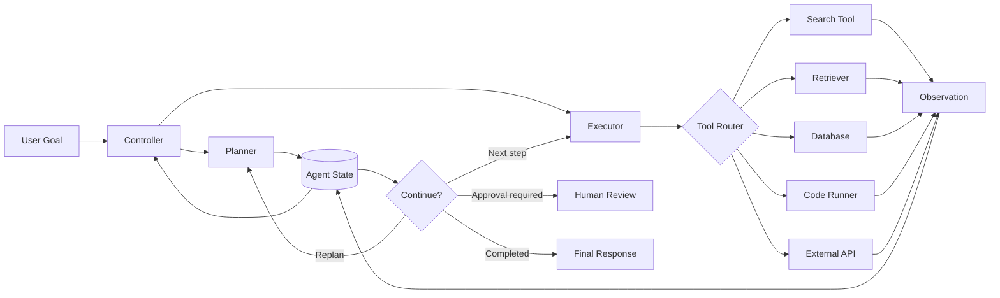
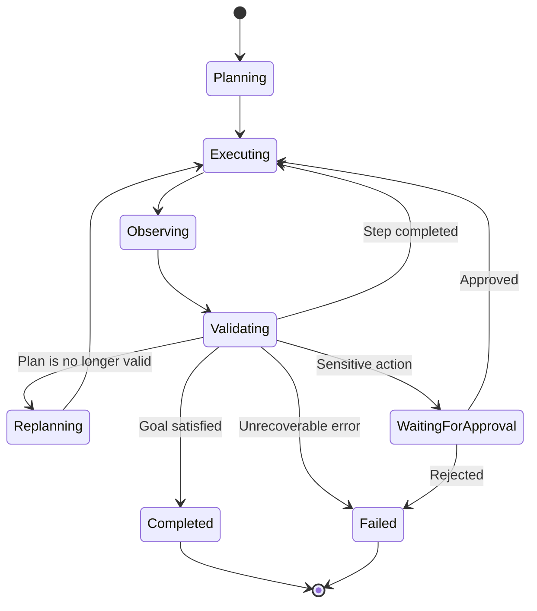
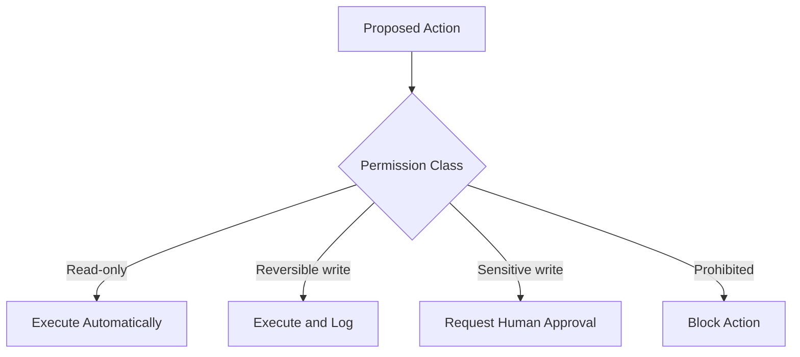
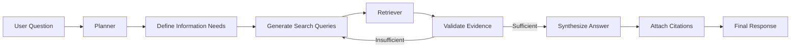
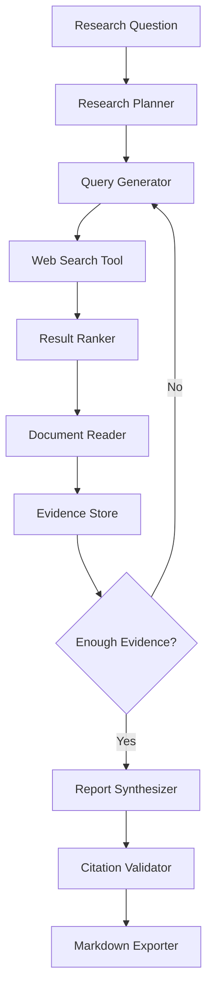

# 010 — Plan-and-Execute

**Course:** 04 — Agents, Multimodal, and Tools
**Module:** Module 10 — AI Agents
**Content Group:** Tools and Execution
**Roadmap Source:** AI Agents / Tools and Execution
**Lesson Type:** AI Agent
**Order in Module:** 010
**Suggested Duration:** 26 minutes

---

## 1. Overview

**Plan-and-Execute** is an agent architecture in which an AI system first creates a structured plan and then executes that plan step by step.

Instead of immediately calling tools after receiving a request, the agent separates reasoning into two main phases:

1. **Planning:** Break the goal into smaller, ordered tasks.
2. **Execution:** Complete each task using models, APIs, retrieval systems, databases, or external tools.

During execution, the agent observes intermediate results and may revise the plan when:

* a tool fails,
* information is missing,
* an assumption is incorrect,
* a result changes the next step,
* or the original plan is no longer suitable.

This pattern is useful for tasks such as:

* multi-source research,
* report generation,
* travel planning,
* data analysis,
* software debugging,
* document processing,
* workflow automation,
* customer-support operations,
* and agentic RAG systems.

By the end of this lesson, you should understand where Plan-and-Execute fits in an AI engineering workflow and how to turn it into a prompt, API route, agent graph, RAG pipeline, or portfolio project.

---

## 2. Learning Objectives

After completing this lesson, you should be able to:

* Explain Plan-and-Execute in your own words.
* Distinguish planning from execution.
* Describe the roles of the planner, executor, tools, state, and controller.
* Define tools with clear input and output schemas.
* Build a small agent that completes a two- or three-step task.
* Log plans, tool calls, observations, and failures.
* Add permission boundaries, budgets, timeouts, and stop conditions.
* Decide when Plan-and-Execute is more appropriate than a simple prompt or tool call.
* Identify common failure modes such as invalid plans, infinite loops, and excessive tool permissions.
* Evaluate an agent based on correctness, cost, latency, safety, and trace quality.

---

## 3. Core Concept

A Plan-and-Execute agent transforms a high-level goal into an explicit sequence of actions.

```text
goal
  ↓
create plan
  ↓
select next step
  ↓
choose tool
  ↓
execute action
  ↓
observe result
  ↓
update state
  ↓
continue, replan, or stop
  ↓
final answer
```

A simple example:

```text
Goal:
Compare three vector databases for a startup RAG application.

Plan:
1. Identify the application's requirements.
2. Collect current information about three databases.
3. Compare their deployment, filtering, scaling, and cost characteristics.
4. Produce a recommendation.
5. Export the result as Markdown.
```

The executor then processes one step at a time rather than attempting to solve the entire task in a single model response.

---

## 4. Why Separate Planning and Execution?

A single model call may work well for short tasks, but it becomes less reliable when a task contains:

* multiple dependencies,
* several external tools,
* changing information,
* branching decisions,
* long-running operations,
* strict output requirements,
* or high-risk actions.

Separating planning and execution provides several benefits.

### 4.1 Better Task Decomposition

The planner can convert a vague request into smaller and more testable steps.

Instead of:

```text
Research this company and write a report.
```

The planner may produce:

```text
1. Clarify the report objective.
2. Find the company's official product information.
3. Collect recent financial or market information.
4. Identify major competitors.
5. Compare strengths and risks.
6. Write a sourced report.
```

### 4.2 Improved Observability

Each step can be logged and inspected independently.

Engineers can see:

* which plan was created,
* which tool was selected,
* what arguments were passed,
* what the tool returned,
* where the workflow failed,
* and why the agent stopped.

### 4.3 Easier Recovery

When a step fails, the agent does not always need to restart the entire task.

It can:

* retry the current tool,
* choose another tool,
* modify the tool arguments,
* skip a noncritical step,
* request human approval,
* or create a revised plan.

### 4.4 Better Safety Control

Permissions can be assigned at the step or tool level.

For example:

```text
Search the web: allowed automatically
Read internal documents: allowed automatically
Create a draft email: allowed automatically
Send an email: requires approval
Delete a file: prohibited
Transfer money: prohibited
```

### 4.5 Better Cost Management

A controller can enforce limits such as:

* maximum number of model calls,
* maximum number of tool calls,
* token budget,
* execution timeout,
* search-result limit,
* or maximum retry count.

---

## 5. Main Components

A production Plan-and-Execute system usually contains more than one model prompt.



### 5.1 Planner

The planner converts the user's goal into a structured sequence of steps.

A planner should usually produce machine-readable output.

Example:

```json
{
  "goal": "Create a comparison report for three vector databases",
  "steps": [
    {
      "id": "step_1",
      "description": "Extract the application requirements",
      "status": "pending",
      "depends_on": []
    },
    {
      "id": "step_2",
      "description": "Collect information about the selected databases",
      "status": "pending",
      "depends_on": ["step_1"]
    },
    {
      "id": "step_3",
      "description": "Compare the databases against the requirements",
      "status": "pending",
      "depends_on": ["step_1", "step_2"]
    },
    {
      "id": "step_4",
      "description": "Write the final Markdown report",
      "status": "pending",
      "depends_on": ["step_3"]
    }
  ]
}
```

A strong planner should create steps that are:

* specific,
* ordered,
* executable,
* limited in scope,
* easy to validate,
* and connected to the user's final objective.

### 5.2 Executor

The executor receives one plan step and decides how to complete it.

It may:

* answer directly with the model,
* call a search tool,
* query a vector database,
* execute code,
* access a business API,
* transform a file,
* or ask for approval.

The executor should not automatically receive every available permission.

### 5.3 Tool Router

The tool router maps an action to an approved tool.

```text
"Find public information"       → web_search
"Retrieve internal documents"   → vector_search
"Calculate statistics"          → python_runner
"Read customer data"            → customer_database
"Create an email draft"         → email_draft
```

The router should validate:

* whether the tool is permitted,
* whether the arguments match the schema,
* whether approval is required,
* and whether the call fits the current plan step.

### 5.4 Agent State

The state stores information needed across steps.

Typical fields include:

```json
{
  "goal": "User's original objective",
  "plan": [],
  "current_step_id": "step_2",
  "completed_steps": [],
  "observations": [],
  "artifacts": [],
  "tool_call_count": 3,
  "model_call_count": 4,
  "remaining_budget": 0.72,
  "status": "running",
  "error": null
}
```

Without explicit state, the agent may:

* repeat completed work,
* lose important observations,
* call the same tool multiple times,
* or forget the original objective.

### 5.5 Controller

The controller manages the execution loop.

It determines whether the agent should:

* execute the next step,
* retry,
* replan,
* ask for human approval,
* stop because of a limit,
* or generate the final answer.

### 5.6 Finalizer

The finalizer converts completed steps and collected evidence into the final user-facing output.

It should not invent facts that were not present in the execution trace.

---

## 6. Basic Execution Lifecycle

A Plan-and-Execute workflow can be represented as a controlled loop.



A simplified algorithm:

```text
1. Receive the user's goal.
2. Validate the request.
3. Create a plan.
4. Store the plan in agent state.
5. Select the next pending step.
6. Choose an approved tool or model action.
7. Execute the action.
8. Record the observation.
9. Validate whether the step succeeded.
10. Update the plan and state.
11. Continue, replan, request approval, or stop.
12. Generate the final answer from verified results.
```

---

## 7. Plan-and-Execute Versus ReAct

Plan-and-Execute is often compared with the **ReAct** pattern.

ReAct typically alternates between reasoning and action:

```text
reason → act → observe → reason → act → observe
```

Plan-and-Execute creates a broader plan before performing individual actions:

```text
create plan → execute step 1 → execute step 2 → replan if needed → finish
```

| Dimension             | ReAct                       | Plan-and-Execute                      |
| --------------------- | --------------------------- | ------------------------------------- |
| Planning style        | Local, one action at a time | Global plan before execution          |
| Best for              | Short interactive tasks     | Longer multi-step workflows           |
| Adaptability          | Highly reactive             | Structured but may require replanning |
| Trace structure       | Sequence of actions         | Plan plus execution history           |
| Initial latency       | Usually lower               | Usually higher                        |
| Long-task consistency | May lose direction          | Better goal tracking                  |
| Risk                  | Repeated tool calls         | Incorrect or overly rigid plans       |

A hybrid system is often effective:

```text
High-level Plan-and-Execute
        +
ReAct-style reasoning inside each step
```

The planner maintains global direction while the executor handles local uncertainty.

---

## 8. Designing a Good Plan

A plan should be useful to the executor rather than merely sounding intelligent.

### Weak Plan

```text
1. Understand the problem.
2. Research the topic.
3. Think carefully.
4. Give a good answer.
```

The steps are vague and difficult to validate.

### Better Plan

```text
1. Extract the required comparison criteria from the user's request.
2. Retrieve official documentation for each selected framework.
3. Record information about deployment, retrieval, integrations, and pricing.
4. Compare each framework against the extracted criteria.
5. Produce a Markdown report with a recommendation and source references.
```

### Planning Principles

A strong plan should:

* use concrete verbs,
* describe observable outputs,
* avoid unnecessary steps,
* define dependencies,
* identify approval requirements,
* and include a clear completion condition.

Each step should answer:

```text
What must be done?
Why is it necessary?
Which tool can perform it?
What output proves completion?
What can fail?
```

---

## 9. Tool Schema Design

Tools are safer and more reliable when their contracts are explicit.

Example search-tool schema:

```json
{
  "name": "search_documents",
  "description": "Search approved documents for information relevant to a query.",
  "input_schema": {
    "type": "object",
    "properties": {
      "query": {
        "type": "string",
        "description": "A focused natural-language search query."
      },
      "top_k": {
        "type": "integer",
        "minimum": 1,
        "maximum": 10,
        "default": 5
      }
    },
    "required": ["query"],
    "additionalProperties": false
  }
}
```

Example result:

```json
{
  "success": true,
  "results": [
    {
      "document_id": "doc_104",
      "title": "Vector Database Evaluation",
      "content": "Filtered retrieval is required for tenant isolation.",
      "score": 0.91
    }
  ],
  "error": null
}
```

### Good Tool Design Rules

A tool should have:

* one clear responsibility,
* a precise name,
* a narrow permission scope,
* validated input fields,
* structured output,
* predictable error handling,
* timeout limits,
* and idempotent behavior when possible.

Avoid tools such as:

```text
execute_any_command(command: string)
```

Prefer narrower tools:

```text
search_documents(query, top_k)
calculate_statistics(dataset_id, columns)
create_report_file(title, markdown_content)
create_email_draft(recipient, subject, body)
```

---

## 10. Minimal Planner Prompt

A planner prompt should define both the task and the output contract.

```text
You are a planning component in a tool-using AI agent.

Create a minimal, executable plan for the user's goal.

Rules:
- Produce between 2 and 6 steps.
- Each step must have one observable outcome.
- Do not execute tools.
- Do not include unnecessary explanation.
- Mark dependencies explicitly.
- Mark steps that require human approval.
- The final step must verify that the user's goal has been satisfied.
- Return valid JSON matching the required schema.
```

Example planner output schema:

```json
{
  "goal": "string",
  "steps": [
    {
      "id": "string",
      "description": "string",
      "expected_output": "string",
      "depends_on": ["string"],
      "requires_approval": false
    }
  ],
  "completion_condition": "string"
}
```

---

## 11. Minimal Executor Prompt

```text
You are the execution component of a tool-using AI agent.

Complete only the current plan step.

You receive:
- the original user goal,
- the current plan,
- the current step,
- previous observations,
- available tools,
- permission rules,
- and remaining budgets.

Rules:
- Do not work on future steps.
- Select only tools that are necessary for the current step.
- Never invent a tool result.
- Respect tool schemas and permission boundaries.
- Request approval before a protected action.
- Return a concise execution decision in structured JSON.
```

Example executor decision:

```json
{
  "step_id": "step_2",
  "action": "call_tool",
  "tool_name": "search_documents",
  "arguments": {
    "query": "vector database requirements for tenant filtering",
    "top_k": 5
  },
  "reason": "The current step requires evidence from approved documents."
}
```

The `reason` field is a concise operational justification, not unrestricted private reasoning.

---

## 12. Framework-Agnostic Python Demo

The following example implements a small deterministic Plan-and-Execute loop.

```python
from __future__ import annotations

from dataclasses import dataclass, field
from typing import Any, Callable, Literal


StepStatus = Literal["pending", "running", "completed", "failed", "skipped"]


@dataclass
class PlanStep:
    id: str
    description: str
    tool_name: str
    tool_arguments: dict[str, Any]
    status: StepStatus = "pending"
    observation: Any | None = None
    error: str | None = None


@dataclass
class AgentState:
    goal: str
    steps: list[PlanStep]
    current_step_index: int = 0
    tool_calls: int = 0
    max_tool_calls: int = 5
    status: Literal["running", "completed", "failed"] = "running"
    logs: list[dict[str, Any]] = field(default_factory=list)


Tool = Callable[..., dict[str, Any]]


def search_notes(query: str) -> dict[str, Any]:
    """Example read-only tool."""
    notes = {
        "rag": "RAG retrieves external context before generation.",
        "agent": "An agent selects actions and tools to complete a goal.",
        "plan-and-execute": (
            "Plan-and-Execute separates high-level planning "
            "from step-by-step execution."
        ),
    }

    matches = [
        {"topic": topic, "content": content}
        for topic, content in notes.items()
        if query.lower() in topic.lower() or query.lower() in content.lower()
    ]

    return {
        "success": True,
        "results": matches,
        "error": None,
    }


def write_markdown(title: str, sections: list[str]) -> dict[str, Any]:
    """Example artifact-generation tool."""
    content = f"# {title}\n\n" + "\n\n".join(sections)

    return {
        "success": True,
        "artifact": {
            "type": "markdown",
            "content": content,
        },
        "error": None,
    }


TOOLS: dict[str, Tool] = {
    "search_notes": search_notes,
    "write_markdown": write_markdown,
}


def validate_tool_call(step: PlanStep) -> None:
    if step.tool_name not in TOOLS:
        raise ValueError(f"Unknown tool: {step.tool_name}")

    if step.tool_name == "search_notes":
        query = step.tool_arguments.get("query")

        if not isinstance(query, str) or not query.strip():
            raise ValueError("search_notes requires a non-empty query.")

    if step.tool_name == "write_markdown":
        title = step.tool_arguments.get("title")
        sections = step.tool_arguments.get("sections")

        if not isinstance(title, str) or not title.strip():
            raise ValueError("write_markdown requires a title.")

        if not isinstance(sections, list):
            raise ValueError("write_markdown requires a list of sections.")


def execute_next_step(state: AgentState) -> None:
    if state.status != "running":
        return

    if state.tool_calls >= state.max_tool_calls:
        state.status = "failed"
        state.logs.append({
            "event": "stopped",
            "reason": "Tool-call budget exceeded",
        })
        return

    if state.current_step_index >= len(state.steps):
        state.status = "completed"
        return

    step = state.steps[state.current_step_index]
    step.status = "running"

    state.logs.append({
        "event": "step_started",
        "step_id": step.id,
        "description": step.description,
    })

    try:
        validate_tool_call(step)

        tool = TOOLS[step.tool_name]
        state.tool_calls += 1

        result = tool(**step.tool_arguments)

        if not result.get("success"):
            raise RuntimeError(
                result.get("error") or "Tool returned an unknown error."
            )

        step.observation = result
        step.status = "completed"

        state.logs.append({
            "event": "tool_completed",
            "step_id": step.id,
            "tool_name": step.tool_name,
            "result": result,
        })

        state.current_step_index += 1

        if state.current_step_index >= len(state.steps):
            state.status = "completed"

    except Exception as exc:
        step.status = "failed"
        step.error = str(exc)
        state.status = "failed"

        state.logs.append({
            "event": "step_failed",
            "step_id": step.id,
            "error": str(exc),
        })


def run_agent(state: AgentState) -> AgentState:
    while state.status == "running":
        execute_next_step(state)

    return state


def build_demo_plan() -> AgentState:
    return AgentState(
        goal="Create a short Markdown explanation of Plan-and-Execute.",
        max_tool_calls=3,
        steps=[
            PlanStep(
                id="step_1",
                description="Retrieve a definition of Plan-and-Execute.",
                tool_name="search_notes",
                tool_arguments={"query": "plan-and-execute"},
            ),
            PlanStep(
                id="step_2",
                description="Create a Markdown learning note.",
                tool_name="write_markdown",
                tool_arguments={
                    "title": "Plan-and-Execute",
                    "sections": [
                        "Plan-and-Execute separates planning from execution.",
                        "The planner creates steps, while the executor uses tools.",
                        "Production agents need logs, budgets, permissions, and stop conditions.",
                    ],
                },
            ),
        ],
    )


if __name__ == "__main__":
    final_state = run_agent(build_demo_plan())

    print("Status:", final_state.status)
    print("Tool calls:", final_state.tool_calls)

    for log in final_state.logs:
        print(log)
```

This example is intentionally simple. A production system would replace `build_demo_plan()` with an LLM planner and add stronger validation, persistence, retries, tracing, and approval workflows.

---

## 13. Adding Replanning

An initial plan may become invalid after new information appears.

For example:

```text
Original plan:
1. Read a CSV file.
2. Calculate customer churn.
3. Create a chart.

Observation:
The file is an XLSX workbook with three sheets, not a CSV file.
```

The agent should not repeatedly retry the CSV reader. It should revise the plan.

```text
Revised plan:
1. Inspect the workbook and identify the relevant sheet.
2. Extract customer activity data.
3. Validate missing values.
4. Calculate churn.
5. Create a chart.
```

### Replanning Conditions

Replanning may be appropriate when:

* a required resource does not exist,
* the tool output contradicts an assumption,
* a dependency changes,
* the current tool cannot complete the step,
* the user changes the goal,
* or several consecutive retries fail.

### Replanning Guardrail

Do not replan after every minor issue. Otherwise, the agent may consume excessive tokens and repeatedly rewrite nearly identical plans.

A reasonable policy:

```text
Replan only when:
- the current step cannot be completed,
- a future step becomes invalid,
- or the completion condition can no longer be reached.
```

---

## 14. Permission Boundaries

An agent should operate under the principle of least privilege.



### Example Permission Policy

| Action                           | Permission        |
| -------------------------------- | ----------------- |
| Search public documentation      | Automatic         |
| Read approved internal files     | Automatic         |
| Run calculations in a sandbox    | Automatic         |
| Create a report draft            | Automatic         |
| Create an email draft            | Automatic         |
| Send an email                    | Approval required |
| Modify production data           | Approval required |
| Delete customer records          | Prohibited        |
| Execute arbitrary shell commands | Prohibited        |
| Access credentials directly      | Prohibited        |

### Human Approval Request

An approval request should state:

* the exact action,
* the target resource,
* the expected effect,
* whether it can be reversed,
* and why the action is needed.

Example:

```json
{
  "status": "approval_required",
  "action": "send_email",
  "target": "project-team@example.com",
  "effect": "Send the completed project summary to the team.",
  "reversible": false,
  "reason": "The user requested delivery after report generation."
}
```

---

## 15. Stop Conditions

Every agent loop must have explicit stop conditions.

Possible stop conditions include:

* the goal has been satisfied,
* all required plan steps are complete,
* the next action requires unavailable information,
* the user rejects an approval request,
* the tool-call budget is exhausted,
* the token budget is exhausted,
* the maximum execution time is reached,
* the same error occurs repeatedly,
* no meaningful progress is being made,
* or a safety rule blocks the next action.

Example configuration:

```python
AGENT_LIMITS = {
    "max_plan_steps": 8,
    "max_tool_calls": 12,
    "max_model_calls": 15,
    "max_replans": 2,
    "max_retries_per_step": 2,
    "timeout_seconds": 120,
}
```

A stop condition should produce a useful status rather than silently ending execution.

```json
{
  "status": "stopped",
  "reason": "tool_budget_exceeded",
  "completed_steps": 3,
  "pending_steps": 2,
  "partial_result_available": true
}
```

---

## 16. Logging and Tracing

Intermediate logs are necessary for debugging and evaluation.

A useful trace may include:

```json
{
  "timestamp": "2026-07-28T13:20:00Z",
  "run_id": "run_8f32",
  "event": "tool_call",
  "step_id": "step_2",
  "tool_name": "search_documents",
  "arguments": {
    "query": "Plan-and-Execute agent architecture",
    "top_k": 5
  },
  "duration_ms": 842,
  "success": true,
  "result_count": 5
}
```

Recommended events:

* `run_started`
* `plan_created`
* `step_started`
* `tool_selected`
* `tool_started`
* `tool_completed`
* `tool_failed`
* `step_completed`
* `step_failed`
* `replan_started`
* `approval_requested`
* `approval_received`
* `budget_warning`
* `run_completed`
* `run_stopped`

### Avoid Logging Secrets

Logs should not contain:

* API keys,
* access tokens,
* passwords,
* private encryption keys,
* full payment details,
* or unnecessary personal information.

Use redaction before saving tool arguments or outputs.

---

## 17. Plan-and-Execute with RAG

Plan-and-Execute is especially useful when retrieval is only one part of a larger workflow.



A basic RAG application may perform:

```text
query → retrieve → generate
```

An agentic RAG system may perform:

```text
analyze question
→ decompose information needs
→ search multiple collections
→ inspect evidence
→ refine queries
→ compare conflicting sources
→ generate a cited answer
```

### Example RAG Plan

```json
{
  "steps": [
    {
      "id": "step_1",
      "description": "Identify the factual claims required to answer the question."
    },
    {
      "id": "step_2",
      "description": "Search the approved knowledge base for each claim."
    },
    {
      "id": "step_3",
      "description": "Evaluate whether the retrieved passages support the claims."
    },
    {
      "id": "step_4",
      "description": "Run a second retrieval query for unsupported claims."
    },
    {
      "id": "step_5",
      "description": "Generate an answer using only validated evidence."
    }
  ]
}
```

---

## 18. Plan-and-Execute API Design

A simple backend API may expose an endpoint for starting an agent run.

### Request

```http
POST /api/v1/agents/runs
Content-Type: application/json
```

```json
{
  "agent_id": "research_agent",
  "goal": "Compare LangChain and LlamaIndex for a document QA application.",
  "options": {
    "max_steps": 6,
    "max_tool_calls": 10,
    "require_approval_for_writes": true,
    "output_format": "markdown"
  }
}
```

### Initial Response

```json
{
  "run_id": "run_8f32",
  "status": "planning",
  "created_at": "2026-07-28T13:20:00Z"
}
```

### Execution Event

```json
{
  "event": "step_completed",
  "run_id": "run_8f32",
  "step": {
    "id": "step_2",
    "description": "Retrieve official framework documentation",
    "status": "completed"
  },
  "usage": {
    "model_calls": 3,
    "tool_calls": 2,
    "input_tokens": 4820,
    "output_tokens": 911
  }
}
```

### Final Response

```json
{
  "run_id": "run_8f32",
  "status": "completed",
  "result": {
    "format": "markdown",
    "content": "# Framework Comparison\n\n..."
  },
  "usage": {
    "model_calls": 7,
    "tool_calls": 5,
    "duration_ms": 18422
  }
}
```

For long-running workflows, progress events can be streamed using Server-Sent Events or WebSockets.

---

## 19. Example: Research Agent

The related portfolio project is a research agent that:

1. receives a research question,
2. creates a search plan,
3. searches for relevant sources,
4. reads selected results,
5. evaluates source quality,
6. synthesizes findings,
7. and exports a Markdown report.

### Architecture



### Example Plan

```json
{
  "goal": "Explain the main alternatives to basic RAG.",
  "steps": [
    {
      "id": "step_1",
      "description": "Define the scope of basic RAG and its limitations."
    },
    {
      "id": "step_2",
      "description": "Identify major alternative architectures."
    },
    {
      "id": "step_3",
      "description": "Collect authoritative sources for each architecture."
    },
    {
      "id": "step_4",
      "description": "Compare use cases, advantages, and limitations."
    },
    {
      "id": "step_5",
      "description": "Write a sourced Markdown report."
    }
  ]
}
```

### Suggested Report Structure

```markdown
# Research Report

## Question

## Executive Summary

## Scope and Definitions

## Key Findings

## Comparison Table

## Recommendations

## Limitations

## Sources
```

---

## 20. Failure Handling

Tools can fail for many reasons:

* timeout,
* unavailable service,
* invalid arguments,
* authentication failure,
* rate limiting,
* malformed response,
* empty retrieval result,
* or permission denial.

A tool failure should be represented explicitly.

```json
{
  "success": false,
  "error": {
    "code": "RATE_LIMITED",
    "message": "The search provider rejected the request.",
    "retryable": true,
    "retry_after_seconds": 30
  }
}
```

### Retry Policy

A safe retry policy may use:

* a maximum retry count,
* exponential backoff,
* jitter,
* retryable-error classification,
* and idempotency keys for write operations.

```text
Attempt 1 → wait 1 second
Attempt 2 → wait 2 seconds
Attempt 3 → wait 4 seconds
Stop after the configured limit
```

Do not automatically retry:

* invalid credentials,
* prohibited actions,
* schema-validation failures,
* or destructive actions without idempotency protection.

---

## 21. Common Failure Modes

### 21.1 Overplanning

The agent creates a long plan for a simple task.

```text
User:
Convert 10 kilometers to miles.

Bad plan:
1. Research distance units.
2. Verify the metric system.
3. Find a conversion formula.
4. Calculate the result.
5. Review the answer.
```

A direct calculator call is enough.

### 21.2 Vague Plan Steps

```text
1. Think about the request.
2. Find useful information.
3. Make the answer better.
```

These steps do not define executable actions or measurable outcomes.

### 21.3 Planning Without Tool Awareness

The planner creates steps that available tools cannot perform.

For example:

```text
Step:
Interview five customers.
```

But the agent only has access to a document-search tool.

The planner must understand the available capabilities.

### 21.4 Excessive Permissions

The executor receives access to:

* unrestricted databases,
* arbitrary shell commands,
* production credentials,
* or destructive APIs.

Tool access should be narrow and task-specific.

### 21.5 No Intermediate Logging

Without logs, developers cannot determine:

* why a tool was selected,
* which step failed,
* whether the plan changed,
* or where cost increased.

### 21.6 Infinite Execution Loops

```text
search → no result → search again → no result → search again
```

Prevent this with retry limits, similarity checks, budgets, and no-progress detection.

### 21.7 Stale Plans

The executor continues following an invalid plan even after observations change the task.

The system needs a replanning condition.

### 21.8 Replanning Too Frequently

The agent rewrites the plan after every observation, increasing latency and cost without improving results.

### 21.9 Tool-Result Hallucination

The model claims that a tool succeeded without receiving a real tool result.

Only the runtime should create trusted tool observations.

### 21.10 Missing Completion Validation

The agent completes all planned actions but does not verify whether the user's actual goal was achieved.

A completed plan is not always the same as a completed goal.

---

## 22. When to Use Plan-and-Execute

Use Plan-and-Execute when the task:

* contains several dependent steps,
* requires multiple tools,
* benefits from an explicit execution trace,
* may need replanning,
* creates intermediate artifacts,
* involves approval checkpoints,
* or must operate under strict budgets and permissions.

Examples:

* research and report generation,
* multi-document analysis,
* data cleaning and visualization,
* debugging a software project,
* generating and validating marketing assets,
* processing invoices,
* or coordinating several APIs.

---

## 23. When Not to Use It

A Plan-and-Execute agent may be unnecessary when:

* one model response is sufficient,
* one deterministic function can solve the task,
* the workflow never changes,
* latency is highly sensitive,
* or a normal program is more reliable.

Examples:

```text
Summarize one short paragraph.
Convert a temperature.
Validate an email address.
Retrieve one known database record.
Classify a support message.
```

Use the simplest architecture that reliably completes the task.

```text
Direct function
    ↓
Single model call
    ↓
Model with one tool
    ↓
ReAct agent
    ↓
Plan-and-Execute agent
    ↓
Multi-agent workflow
```

Complexity should increase only when the task requires it.

---

## 24. Evaluation Metrics

A Plan-and-Execute agent should be evaluated as a complete system.

### 24.1 Task Success

Did the final output satisfy the user's goal?

```text
task_success_rate =
successful runs / total runs
```

### 24.2 Plan Quality

Evaluate whether the plan was:

* complete,
* minimal,
* correctly ordered,
* executable,
* and aligned with the available tools.

### 24.3 Step Success Rate

```text
step_success_rate =
completed steps / attempted steps
```

### 24.4 Tool Selection Accuracy

Did the executor select the correct tool for each step?

### 24.5 Argument Accuracy

Were tool arguments complete and schema-valid?

### 24.6 Replanning Quality

Did replanning occur only when necessary, and did it improve the workflow?

### 24.7 Cost

Track:

* input tokens,
* output tokens,
* model calls,
* tool calls,
* retrieval operations,
* and external API charges.

### 24.8 Latency

Measure:

* planning latency,
* per-step latency,
* tool latency,
* finalization latency,
* and total run duration.

### 24.9 Safety

Measure:

* blocked prohibited actions,
* approval-policy compliance,
* secret leakage,
* unauthorized tool attempts,
* and unsafe tool arguments.

### 24.10 Trace Completeness

Can an engineer reconstruct what happened during the run from logs and stored state?

---

## 25. Practical Exercise

Build a small agent that researches a technical topic and produces a Markdown note.

### Requirements

Your agent must:

1. Accept a user goal.
2. Produce a plan containing two to four steps.
3. Use at least one read-only tool.
4. Log every tool call.
5. Store observations in agent state.
6. Define a maximum number of tool calls.
7. Stop when the goal is satisfied or the budget is exhausted.
8. Produce a final Markdown response.

### Suggested Tool

```json
{
  "name": "search_knowledge_base",
  "description": "Search approved technical notes.",
  "parameters": {
    "query": "string",
    "top_k": "integer"
  }
}
```

### Example Input

```text
Explain the difference between basic RAG and agentic RAG.
```

### Expected Plan

```text
1. Retrieve a definition of basic RAG.
2. Retrieve a definition of agentic RAG.
3. Compare their workflows, benefits, and limitations.
4. Produce a concise Markdown explanation.
```

### Required Log Fields

```json
{
  "run_id": "string",
  "step_id": "string",
  "event": "string",
  "tool_name": "string or null",
  "arguments": {},
  "success": true,
  "duration_ms": 0,
  "error": null
}
```

---

## 26. Extended Exercise: Add Approval

Extend the agent with a tool that creates an email draft.

```json
{
  "name": "create_email_draft",
  "description": "Create but do not send an email draft.",
  "parameters": {
    "recipient": "string",
    "subject": "string",
    "body": "string"
  }
}
```

Then define a second tool:

```json
{
  "name": "send_email",
  "description": "Send a previously created email draft.",
  "parameters": {
    "draft_id": "string"
  }
}
```

Permission policy:

```text
create_email_draft → automatic
send_email         → human approval required
```

Verify that the agent cannot send the email without an explicit approval event.

---

## 27. Production Checklist

### Planning

* [ ] The planner returns structured output.
* [ ] The maximum number of plan steps is limited.
* [ ] Each step has an observable outcome.
* [ ] Dependencies are explicitly represented.
* [ ] The plan uses only available tools.
* [ ] The completion condition is defined.

### Tools

* [ ] Every tool has a narrow responsibility.
* [ ] Inputs are validated against a schema.
* [ ] Outputs are structured.
* [ ] Tool timeouts are configured.
* [ ] Errors identify whether retrying is safe.
* [ ] Sensitive tools require approval.
* [ ] Destructive tools use idempotency protection where possible.

### State

* [ ] The original goal is preserved.
* [ ] Current and completed steps are stored.
* [ ] Tool observations are saved.
* [ ] Budgets and retry counts are tracked.
* [ ] State can be recovered after a failure.

### Execution

* [ ] The executor processes one step at a time.
* [ ] Tool calls are logged.
* [ ] Failed steps have retry limits.
* [ ] Replanning conditions are defined.
* [ ] No-progress loops are detected.

### Safety

* [ ] The agent follows least-privilege access.
* [ ] Sensitive writes require human approval.
* [ ] Prohibited actions are blocked by code.
* [ ] Secrets are removed from logs.
* [ ] User-provided tool instructions are treated as untrusted input.
* [ ] Retrieved content cannot silently override system permissions.

### Cost and Reliability

* [ ] Model-call limits are configured.
* [ ] Tool-call limits are configured.
* [ ] Token budgets are tracked.
* [ ] Total execution timeout is configured.
* [ ] Model and tool failures have fallback behavior.
* [ ] Partial results can be returned when appropriate.

### User Experience

* [ ] The user can see meaningful progress.
* [ ] Approval requests explain the action and impact.
* [ ] Failures provide actionable information.
* [ ] The final response distinguishes verified results from limitations.
* [ ] The user can cancel a long-running workflow.

---

## 28. Completion Checklist

You have completed this lesson when:

* [ ] You can explain Plan-and-Execute in one or two minutes.
* [ ] You can distinguish the planner from the executor.
* [ ] You can describe how tools, state, and observations interact.
* [ ] You have built a small two- or three-step demo.
* [ ] Your demo logs every tool call.
* [ ] Your agent has a permission boundary.
* [ ] Your agent has a timeout or execution budget.
* [ ] Your agent has an explicit stop condition.
* [ ] You understand at least one limitation of this architecture.
* [ ] You can explain when a simpler non-agent workflow would be better.

---

## 29. Related Outcome

Build agentic workflows that:

* create structured plans,
* select appropriate tools,
* execute multi-step tasks,
* inspect intermediate results,
* recover from failures,
* request approval for sensitive actions,
* and stop safely after completing the user's goal.

---

## 30. Related Project

### Project 9 — Research Agent

Build an agent that:

1. receives a research question,
2. creates an explicit research plan,
3. searches approved sources,
4. reads and ranks the results,
5. stores evidence,
6. identifies missing information,
7. revises its queries when needed,
8. produces a cited summary,
9. and exports a Markdown report.

Recommended portfolio artifacts:

```text
research-agent/
├── README.md
├── planner.py
├── executor.py
├── tools/
│   ├── search.py
│   ├── document_reader.py
│   └── markdown_exporter.py
├── schemas/
│   ├── plan.py
│   ├── tool_result.py
│   └── agent_state.py
├── policies/
│   └── permissions.yaml
├── tests/
│   ├── test_planner.py
│   ├── test_tool_validation.py
│   ├── test_stop_conditions.py
│   └── test_replanning.py
└── examples/
    ├── successful_run.json
    └── failed_run.json
```

---

## 31. Key Takeaways

**Plan-and-Execute** separates high-level planning from step-by-step execution.

Its core workflow is:

```text
goal
→ plan
→ select step
→ choose tool
→ execute
→ observe
→ update state
→ continue, replan, or stop
→ final answer
```

A reliable implementation requires more than a planner prompt. It also needs:

* structured plans,
* narrow tool schemas,
* persistent state,
* validated tool calls,
* detailed logs,
* retry policies,
* cost and time budgets,
* permission boundaries,
* human approval,
* and explicit completion conditions.

Plan-and-Execute is valuable for complex workflows, but it should not replace simpler solutions when a direct function, one model call, or deterministic pipeline is sufficient.

The goal is not to create an agent that performs the largest number of actions. The goal is to create a controlled system that completes useful multi-step tasks correctly, efficiently, observably, and safely.
