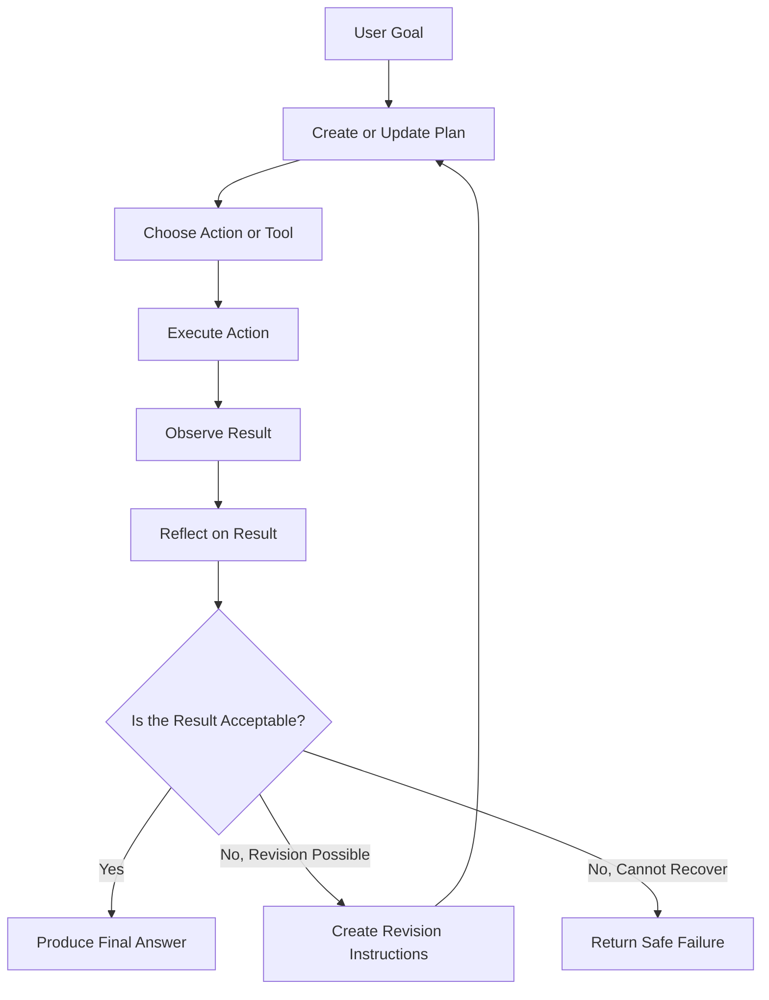
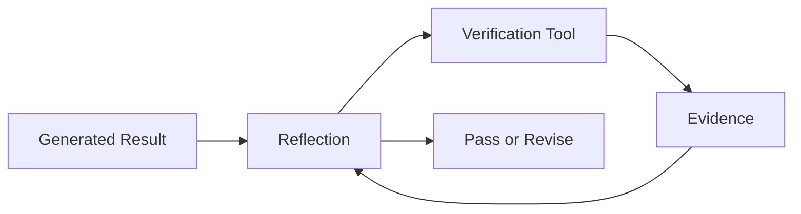
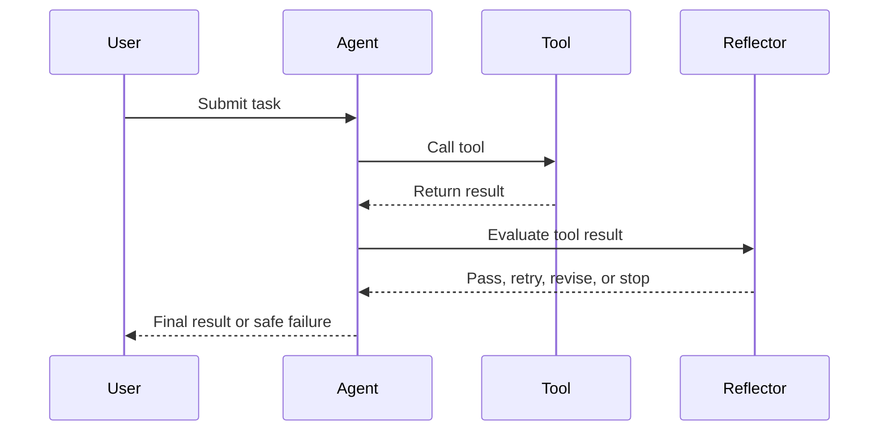
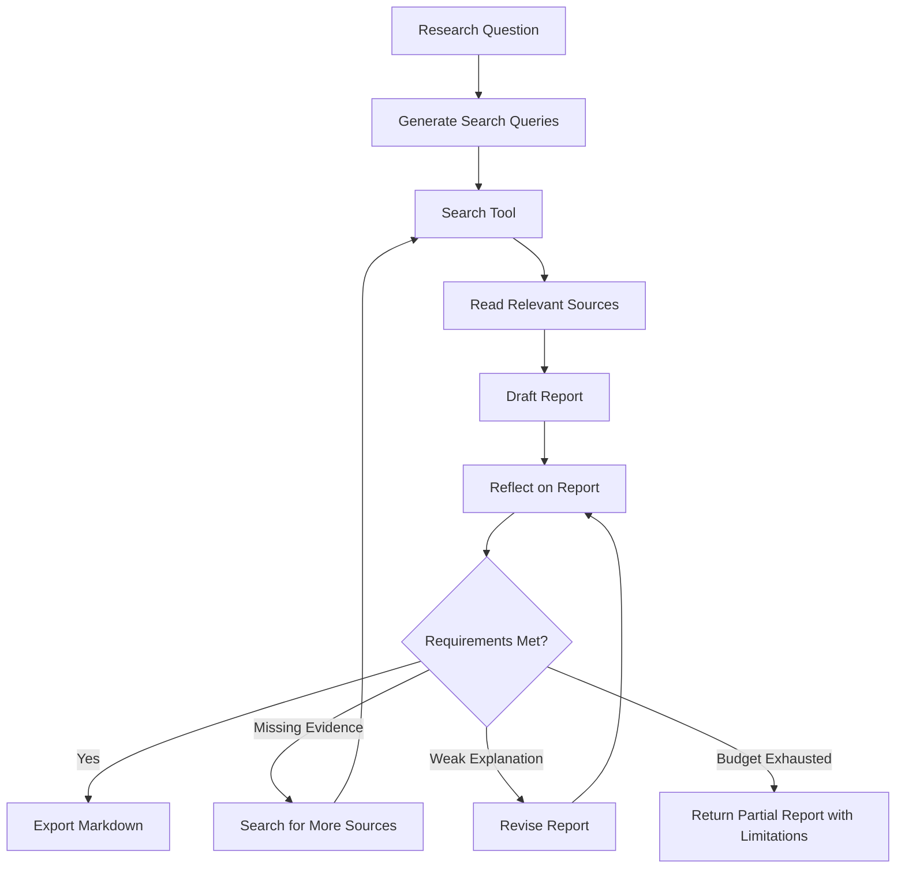
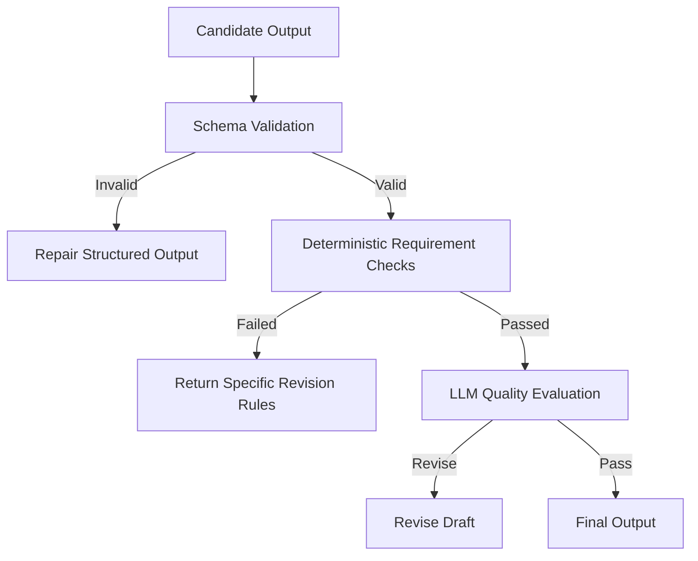
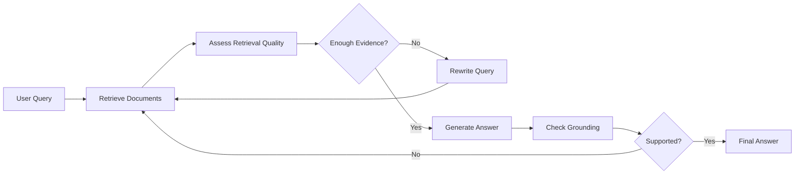
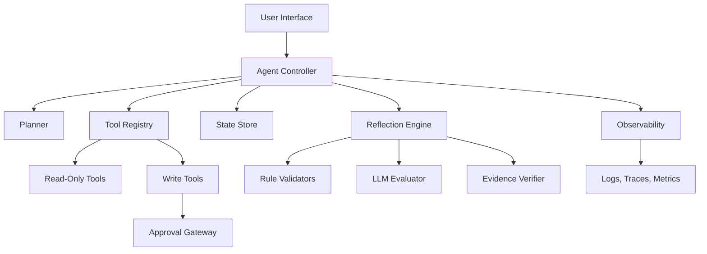

# 011 — Reflection

**Course:** 04 — Agents, Multimodal, and Tools
**Module:** Module 10 — AI Agents
**Content Group:** Tools and Execution
**Roadmap Source:** AI Agents / Tools and Execution
**Lesson Type:** AI Agent
**Order in Module:** 011
**Suggested Duration:** 26 minutes

---

## 1. Lesson Summary

**Reflection** is an agent design pattern in which an AI system reviews its own intermediate result, identifies mistakes or missing information, and attempts to improve the result before producing the final answer.

A basic language model usually generates an answer in one pass:

```text
input -> generate answer -> return answer
```

A reflective agent adds an evaluation and revision loop:

```text
input
  -> generate draft
  -> inspect draft
  -> identify problems
  -> revise
  -> return improved answer
```

Reflection is useful when an agent must:

* Complete a multi-step task.
* Call tools and inspect their outputs.
* Detect incomplete or inconsistent results.
* Validate an answer against requirements.
* Recover from failed tool calls.
* Improve a draft before returning it.
* Decide whether more evidence is required.

Reflection does not make an agent automatically correct. It is an additional control mechanism that can improve reliability when it is combined with validation rules, tool permissions, budgets, logs, and clear stop conditions.

---

## 2. Learning Objectives

By the end of this lesson, you should be able to:

* Explain reflection in your own words.
* Distinguish reflection from planning and ordinary generation.
* Identify where reflection belongs in an agent workflow.
* Design a simple generate–evaluate–revise loop.
* Use tool results as evidence during reflection.
* Define stopping rules, retry limits, and execution budgets.
* Recognize when reflection adds value and when it only increases latency.
* Build a small reflective agent for a portfolio project.

---

## 3. Core Concept

### 3.1 What Is Reflection?

Reflection is the process of asking an AI system to inspect its own work and determine whether the work satisfies a goal.

A reflection step typically asks questions such as:

* Did the result answer the original request?
* Is any required information missing?
* Is the result supported by evidence?
* Did a tool call fail?
* Are there contradictions?
* Does the output match the required schema?
* Should the agent revise the answer or stop?

A reflection loop usually contains three main roles:

1. **Generator** — creates a draft or performs an action.
2. **Critic or evaluator** — checks the result.
3. **Reviser** — improves the result based on the evaluation.

These roles may be performed by:

* The same model with different prompts.
* Different models.
* Deterministic validation code.
* External tools.
* A human reviewer.
* A combination of model-based and rule-based checks.

---

### 3.2 Reflection vs. Planning

Planning and reflection solve different problems.

| Concept    | Main Question                            | Typical Timing                |
| ---------- | ---------------------------------------- | ----------------------------- |
| Planning   | What should I do next?                   | Before or during execution    |
| Reflection | Was the previous result good enough?     | After an action or draft      |
| Tool use   | Which external capability should I call? | During execution              |
| Validation | Does the output satisfy a formal rule?   | After generation or execution |
| Memory     | What information should be retained?     | Across steps or sessions      |

Planning looks forward. Reflection looks backward.

```text
Planning:
goal -> create steps -> execute steps

Reflection:
execute step -> inspect result -> revise or continue
```

A production agent often uses both:

```text
goal
  -> plan
  -> execute
  -> reflect
  -> update plan
  -> execute again
  -> final answer
```

---

### 3.3 Reflection vs. Chain-of-Thought

Reflection should not be understood as exposing private internal reasoning.

In production systems, reflection is better represented as a structured evaluation such as:

```json
{
  "status": "needs_revision",
  "problems": [
    "The answer does not cite the source.",
    "The date range is incomplete."
  ],
  "next_action": "retrieve_more_evidence"
}
```

This is more useful than storing unrestricted reasoning because structured reflection is:

* Easier to validate.
* Easier to log.
* Safer to expose in an interface.
* More predictable.
* Easier to convert into workflow decisions.
* Less expensive to process.

The goal is not to make the model “think forever.” The goal is to obtain an actionable evaluation.

---

## 4. Why Reflection Matters

Language models can produce answers that appear complete even when they contain:

* Missing requirements.
* Unsupported claims.
* Incorrect tool usage.
* Invalid JSON.
* Contradictory statements.
* Outdated information.
* Partial task completion.
* Hallucinated sources.
* Failed calculations.
* Repeated actions.

Reflection gives the agent a chance to detect some of these problems before returning the final result.

For example, consider a research agent that must produce a report with three sources.

Without reflection:

```text
search -> summarize first result -> return report
```

With reflection:

```text
search
  -> read sources
  -> draft report
  -> check source count
  -> detect only two valid sources
  -> search again
  -> revise report
  -> return final report
```

The second workflow is more likely to satisfy the original requirement.

---

## 5. Reflection in an Agent Workflow

A complete reflective agent loop may look like this:



The reflection step converts an observation into a decision.

For example:

```text
Observation:
The search tool returned no relevant results.

Reflection:
The query may be too narrow.

Decision:
Rewrite the search query and retry once.
```

---

## 6. A Minimal Reflection Loop

A minimal implementation follows this pattern:

```text
goal
  -> create draft
  -> evaluate draft
  -> revise draft
  -> return final result
```

### Pseudocode

```python
draft = generate_answer(user_request)

evaluation = evaluate_answer(
    request=user_request,
    answer=draft,
)

if evaluation["status"] == "needs_revision":
    final_answer = revise_answer(
        request=user_request,
        draft=draft,
        feedback=evaluation["feedback"],
    )
else:
    final_answer = draft

return final_answer
```

This design performs only one reflection cycle. It is often a good starting point because unlimited loops can become slow, expensive, and unpredictable.

---

## 7. Structured Reflection Schema

Reflection works best when the evaluator must return a strict schema.

```json
{
  "status": "pass",
  "score": 0.91,
  "problems": [],
  "next_action": "finish",
  "revision_instructions": null
}
```

A possible schema could be:

```python
from typing import Literal
from pydantic import BaseModel, Field


class ReflectionResult(BaseModel):
    status: Literal["pass", "revise", "retry_tool", "stop"]
    score: float = Field(ge=0.0, le=1.0)
    problems: list[str]
    next_action: str
    revision_instructions: list[str]
```

The agent controller can then make deterministic decisions:

```python
if reflection.status == "pass":
    return draft

if reflection.status == "revise":
    return revise(draft, reflection.revision_instructions)

if reflection.status == "retry_tool":
    return retry_tool_call()

if reflection.status == "stop":
    return safe_failure_response()
```

This separates model judgment from execution control.

---

## 8. Reflection Prompt Design

A reflection prompt should define:

* The original goal.
* The candidate result.
* The evaluation criteria.
* The allowed decisions.
* The required output schema.
* The maximum scope of revision.

### Example Reflection Prompt

```text
You are evaluating an AI agent's draft.

Original request:
{user_request}

Candidate answer:
{draft}

Evaluate the answer using these criteria:

1. It directly answers the original request.
2. It includes all required sections.
3. Every factual claim is supported by the available evidence.
4. It does not invent tool results or sources.
5. It follows the required output format.
6. It does not include unnecessary content.

Return JSON with:

- status: pass, revise, retry_tool, or stop
- problems: a list of concrete issues
- next_action: one clear next step
- revision_instructions: specific changes

Do not rewrite the answer in this step.
```

The instruction “Do not rewrite the answer” keeps evaluation separate from revision.

---

## 9. Reflection Strategies

### 9.1 Self-Reflection

The same model generates and evaluates its own output.

```text
Model A -> draft
Model A -> critique
Model A -> revision
```

**Advantages**

* Simple architecture.
* Low implementation complexity.
* Easy to prototype.

**Limitations**

* The model may repeat the same mistake.
* The critic may be overly confident.
* The evaluation may not be independent.

---

### 9.2 Cross-Model Reflection

One model generates the answer, while another evaluates it.

```text
Generator model -> draft
Evaluator model -> critique
Generator model -> revision
```

**Advantages**

* Greater diversity of judgment.
* The evaluator may detect errors missed by the generator.
* Different models can be selected for different responsibilities.

**Limitations**

* Higher cost.
* More latency.
* More provider and prompt complexity.

---

### 9.3 Rule-Based Reflection

Deterministic code checks the result.

Examples include:

* JSON schema validation.
* Required-section checks.
* Citation-count checks.
* URL validation.
* Unit tests.
* Type checking.
* Range validation.
* Security policy checks.

```python
def validate_report(report: dict) -> list[str]:
    problems = []

    if len(report.get("sources", [])) < 3:
        problems.append("At least three sources are required.")

    if not report.get("summary"):
        problems.append("The summary is missing.")

    return problems
```

Rule-based validation is usually more reliable than model reflection for formal requirements.

---

### 9.4 Tool-Grounded Reflection

The agent uses tools to verify a result.

Examples:

* A calculator verifies arithmetic.
* A database checks whether a record exists.
* A search tool verifies a factual claim.
* A code executor runs generated code.
* A test runner validates a patch.
* A schema validator checks structured output.



Tool-grounded reflection is stronger than asking the model to judge everything from memory.

---

### 9.5 Human Reflection

A human reviews an action before it is executed.

This is important for:

* Sending emails.
* Publishing content.
* Deleting files.
* Moving money.
* Modifying production data.
* Changing access permissions.
* Executing legal or medical workflows.
* Making high-impact business decisions.

```text
agent prepares action
  -> reflection detects high-risk action
  -> request human approval
  -> execute only after approval
```

Human approval should be treated as a permission boundary, not merely another suggestion.

---

## 10. Reflection Granularity

Reflection can occur at different levels.

### Step-Level Reflection

The agent checks every action.

```text
tool call -> inspect result -> decide next action
```

This is useful for fragile or high-risk workflows but can be expensive.

### Phase-Level Reflection

The agent reflects after completing a group of steps.

```text
research phase -> reflection
writing phase -> reflection
export phase -> reflection
```

This provides a balance between reliability and cost.

### Final-Answer Reflection

The agent performs a single review before returning the answer.

```text
complete workflow -> review final answer -> revise once
```

This is the simplest approach and is often sufficient for low-risk applications.

---

## 11. Reflection for Tool-Using Agents

Reflection becomes especially important when an agent calls external tools.

A tool call can fail because of:

* Invalid arguments.
* Missing permissions.
* Network errors.
* Empty results.
* Rate limits.
* Partial results.
* Schema changes.
* Incorrect tool selection.
* Unsafe requested actions.

A reflective tool loop may look like this:



The reflection result should not directly execute arbitrary actions. It should produce a controlled decision that the agent runtime interprets.

---

## 12. Permission Boundaries

A reflective agent still needs limited permissions.

Reflection does not make broad permissions safe.

A tool should have:

* A clear name.
* A narrow purpose.
* A strict input schema.
* Validated parameters.
* Defined permission scope.
* Timeout limits.
* Rate limits.
* Audit logs.
* A known failure format.
* Human approval for high-risk operations.

### Unsafe Tool

```python
def run_shell(command: str):
    ...
```

This tool allows unrestricted command execution.

### Safer Tool

```python
def generate_project_test_report(
    project_id: str,
    test_suite: str,
) -> dict:
    ...
```

The safer tool exposes one controlled business capability instead of general system access.

---

## 13. Stop Conditions

Every reflection loop needs a stop condition.

Without one, an agent may:

* Repeat the same action.
* Consume excessive tokens.
* Repeatedly call tools.
* Generate increasingly inconsistent revisions.
* Never return a final result.

Useful stop conditions include:

* Maximum number of reflection cycles.
* Maximum number of tool calls.
* Maximum token budget.
* Maximum monetary budget.
* Maximum execution duration.
* Minimum evaluation score.
* Repeated-error detection.
* Human approval requirement.
* No-progress detection.

### Example

```python
MAX_ITERATIONS = 3
MAX_TOOL_CALLS = 8

for iteration in range(MAX_ITERATIONS):
    result = execute_next_step()

    reflection = reflect(result)

    if reflection.status == "pass":
        break

    if reflection.status == "stop":
        return create_failure_response()

    if tool_call_count >= MAX_TOOL_CALLS:
        return create_budget_exceeded_response()
```

A production agent should stop safely rather than attempting unlimited retries.

---

## 14. Detecting No Progress

An agent may technically produce different outputs while making no meaningful progress.

No-progress detection can compare:

* Repeated tool names.
* Repeated arguments.
* Repeated error codes.
* Similarity between consecutive drafts.
* Identical reflection feedback.
* Unchanged validation scores.

```python
if current_action == previous_action:
    repeated_action_count += 1

if repeated_action_count >= 2:
    return {
        "status": "stop",
        "reason": "The agent repeated the same unsuccessful action."
    }
```

This prevents infinite retry loops.

---

## 15. Reflection and State

A reflective agent requires state so that it knows:

* The original goal.
* The current plan.
* Previous actions.
* Tool outputs.
* Reflection results.
* Remaining budget.
* Approval status.
* Current draft.
* Completed requirements.
* Unresolved problems.

### Example Agent State

```python
from typing import Any, TypedDict


class AgentState(TypedDict):
    goal: str
    plan: list[str]
    current_step: int
    observations: list[dict[str, Any]]
    reflections: list[dict[str, Any]]
    draft: str | None
    tool_call_count: int
    iteration_count: int
    status: str
```

State should be explicit rather than hidden entirely inside a long prompt.

---

## 16. Logging and Observability

Reflection is useful only when developers can inspect what happened.

A reflection log should record:

* Request ID.
* Agent run ID.
* Current step.
* Selected tool.
* Validated tool arguments.
* Tool response status.
* Reflection decision.
* Revision reason.
* Token usage.
* Execution time.
* Retry count.
* Final stop reason.

### Example Log

```json
{
  "run_id": "run_4821",
  "step": 3,
  "action": "search_web",
  "tool_status": "success",
  "result_count": 1,
  "reflection": {
    "status": "retry_tool",
    "problems": [
      "Only one relevant source was found."
    ],
    "next_action": "broaden_search_query"
  },
  "tool_calls_used": 4,
  "tool_call_limit": 8
}
```

Logs should avoid storing secrets, raw credentials, or unnecessary personal data.

---

## 17. Practical Example: Research Agent

Consider an agent that must:

1. Search for information.
2. Read relevant results.
3. Produce a summary.
4. Include at least three sources.
5. Export a Markdown report.

### Workflow



### Reflection Criteria

The evaluator can check:

```text
- Does the report answer the research question?
- Are at least three sources included?
- Does each major claim have supporting evidence?
- Are conflicting findings represented?
- Are unsupported claims removed?
- Is the report valid Markdown?
- Does the report include a limitations section?
```

---

## 18. Example Implementation

The following Python example demonstrates a simplified reflective research agent.

```python
from dataclasses import dataclass, field
from typing import Literal


ReflectionStatus = Literal[
    "pass",
    "revise",
    "retrieve_more",
    "stop",
]


@dataclass
class Reflection:
    status: ReflectionStatus
    problems: list[str]
    instructions: list[str]


@dataclass
class AgentState:
    question: str
    sources: list[str] = field(default_factory=list)
    draft: str = ""
    iteration: int = 0
    tool_calls: int = 0


MAX_ITERATIONS = 3
MAX_TOOL_CALLS = 6


def search_sources(query: str) -> list[str]:
    """Replace with a real search API."""
    return [
        f"Source about {query} — result 1",
        f"Source about {query} — result 2",
    ]


def create_draft(question: str, sources: list[str]) -> str:
    source_lines = "\n".join(f"- {source}" for source in sources)

    return f"""# Research Report

## Question

{question}

## Findings

A draft answer based on the available sources.

## Sources

{source_lines}
"""


def evaluate_draft(state: AgentState) -> Reflection:
    problems: list[str] = []

    if len(state.sources) < 3:
        problems.append("The report requires at least three sources.")

    if "## Findings" not in state.draft:
        problems.append("The findings section is missing.")

    if not problems:
        return Reflection(
            status="pass",
            problems=[],
            instructions=[],
        )

    if len(state.sources) < 3:
        return Reflection(
            status="retrieve_more",
            problems=problems,
            instructions=[
                "Use a broader search query.",
                "Retrieve at least one additional relevant source.",
            ],
        )

    return Reflection(
        status="revise",
        problems=problems,
        instructions=[
            "Add all missing report sections.",
        ],
    )


def run_research_agent(question: str) -> str:
    state = AgentState(question=question)

    while state.iteration < MAX_ITERATIONS:
        state.iteration += 1

        if not state.sources:
            state.sources.extend(search_sources(question))
            state.tool_calls += 1

        state.draft = create_draft(
            question=state.question,
            sources=state.sources,
        )

        reflection = evaluate_draft(state)

        if reflection.status == "pass":
            return state.draft

        if reflection.status == "retrieve_more":
            if state.tool_calls >= MAX_TOOL_CALLS:
                break

            broader_query = f"{question} overview examples limitations"
            state.sources.extend(search_sources(broader_query))
            state.tool_calls += 1
            continue

        if reflection.status == "revise":
            continue

        if reflection.status == "stop":
            break

    return state.draft + """

## Limitations

The agent stopped before satisfying every requirement because its execution
budget was exhausted.
"""
```

This example uses deterministic evaluation. A real system could combine these checks with an LLM evaluator.

---

## 19. Reflection with an LLM Evaluator

A model-based evaluator can assess qualities that are difficult to express as code, such as clarity, completeness, and relevance.

```python
import json
from typing import Any


def reflect_with_llm(
    llm_client: Any,
    user_request: str,
    draft: str,
) -> dict:
    prompt = f"""
Evaluate the following draft.

Original request:
{user_request}

Draft:
{draft}

Check:
1. Completeness
2. Relevance
3. Internal consistency
4. Evidence support
5. Format compliance

Return valid JSON:

{{
  "status": "pass" | "revise",
  "problems": ["..."],
  "revision_instructions": ["..."]
}}
"""

    response = llm_client.generate(prompt)
    return json.loads(response)
```

The returned result should still be validated before the controller acts on it.

```python
def validate_reflection(result: dict) -> None:
    allowed_statuses = {"pass", "revise"}

    if result.get("status") not in allowed_statuses:
        raise ValueError("Invalid reflection status.")

    if not isinstance(result.get("problems"), list):
        raise ValueError("Problems must be a list.")
```

Never assume that an evaluator model will always return valid structured data.

---

## 20. Combining Rules and Model Evaluation

A strong production design uses layered validation.



Recommended order:

1. Validate syntax and schema.
2. Check deterministic requirements.
3. Verify tool evidence.
4. Apply model-based quality review.
5. Request human approval when necessary.

Do not use an expensive model evaluator for checks that ordinary code can perform reliably.

---

## 21. Reflection for Code-Generating Agents

A coding agent can reflect by running:

* A formatter.
* A linter.
* A type checker.
* Unit tests.
* Integration tests.
* Security scans.
* Build commands.

```text
generate patch
  -> run tests
  -> inspect failures
  -> revise patch
  -> rerun tests
  -> stop after retry limit
```

### Example

```python
test_result = run_tests()

if test_result.exit_code == 0:
    return patch

reflection = analyze_test_failure(test_result.output)

if reflection.can_fix:
    patch = revise_patch(
        patch=patch,
        feedback=reflection.instructions,
    )
else:
    return explain_failure(test_result)
```

Test output is stronger evidence than a model simply claiming that the code is correct.

---

## 22. Reflection for RAG Systems

Reflection can improve retrieval-augmented generation by asking whether the retrieved context is sufficient.



Possible reflection questions include:

* Are the retrieved documents relevant?
* Do the documents cover every part of the question?
* Are the sources authoritative?
* Are sources contradictory?
* Does the answer include claims not present in the context?
* Should the query be rewritten?

This pattern is sometimes called corrective RAG or self-correcting retrieval.

---

## 23. Reflection for Multimodal Agents

A multimodal agent can reflect on:

* Whether the image is readable.
* Whether the document page contains the required section.
* Whether OCR output is incomplete.
* Whether a chart was interpreted correctly.
* Whether visual and textual evidence agree.
* Whether another image crop or page is required.

Example:

```text
inspect image
  -> extract visible information
  -> check confidence
  -> confidence too low
  -> request higher-resolution crop
  -> inspect again
```

The system should explicitly represent uncertainty rather than inventing visual details.

---

## 24. When Reflection Is Useful

Reflection is especially useful for:

* Research reports.
* Long-form writing.
* Multi-step tool workflows.
* Code generation.
* Data analysis.
* RAG answer validation.
* Structured output generation.
* Complex planning.
* High-value business workflows.
* Tasks with measurable success criteria.

Reflection adds the most value when the system can compare its output against clear evidence or rules.

---

## 25. When Reflection Is Not Necessary

Reflection may be unnecessary for:

* Simple greetings.
* Basic formatting.
* Straightforward extraction.
* Low-risk classification.
* Deterministic database lookups.
* Very short answers.
* Tasks where latency is more important than minor quality improvements.

For example:

```text
User: Convert the title to uppercase.
```

A full reflection loop would be wasteful.

A useful decision rule is:

```text
Use reflection when the cost of an incorrect result
is greater than the cost of another evaluation step.
```

---

## 26. Common Failure Modes

### 26.1 Endless Reflection

The agent repeatedly critiques and revises without finishing.

**Solution:** Add maximum iterations, budgets, and no-progress detection.

---

### 26.2 Vague Criticism

The evaluator returns feedback such as:

```text
Make the answer better.
```

This feedback is not actionable.

Better feedback:

```text
Add one paragraph explaining the retry limit.
Remove the unsupported claim in the second section.
Include three source citations.
```

---

### 26.3 Evaluator Hallucination

The evaluator claims that a requirement is missing even when it is present, or approves unsupported content.

**Solution:** Combine model evaluation with deterministic checks and evidence verification.

---

### 26.4 Same-Model Bias

The generator and evaluator repeat the same assumptions.

**Solution:** Use rule-based validation, a different evaluator model, external tools, or human review.

---

### 26.5 Excessive Tool Permissions

The agent is allowed to modify systems while it is still exploring.

**Solution:** Separate read-only tools from write tools and require approval for high-impact actions.

---

### 26.6 Missing Logs

The final answer is wrong, but developers cannot determine which step failed.

**Solution:** Log actions, observations, reflection decisions, budgets, and stop reasons.

---

### 26.7 Reflection Without Evidence

The model evaluates factual accuracy using only its own memory.

**Solution:** Give the evaluator access to retrieved sources, test results, database responses, or verification tools.

---

### 26.8 Over-Reflection

The agent performs multiple expensive evaluation passes for a simple task.

**Solution:** Use risk-based reflection. Increase reflection depth only for complex or high-impact workflows.

---

## 27. Security and Safety Considerations

Reflection does not replace security controls.

A safe reflective agent should follow these principles:

### Least Privilege

Each tool should expose only the minimum required capability.

### Input Validation

Validate every tool argument before execution.

### Output Validation

Treat tool output as untrusted data.

### Prompt-Injection Resistance

Do not allow retrieved content to redefine tool permissions or system instructions.

### Human Approval

Require approval before irreversible or high-impact actions.

### Budget Enforcement

Apply limits outside the model so the model cannot override them.

### Auditability

Record what the agent did and why the controller allowed it.

### Safe Failure

When the agent cannot continue safely, it should stop and explain the limitation.

---

## 28. Reflection Architecture

A production-ready architecture can separate responsibilities into components.



The **agent controller**, not the language model, should enforce:

* Tool permissions.
* Execution budgets.
* Retry limits.
* Approval requirements.
* Stop conditions.
* State transitions.

---

## 29. Evaluation Metrics

A reflective agent should be evaluated against a non-reflective baseline.

Useful metrics include:

| Metric                   | Description                                            |
| ------------------------ | ------------------------------------------------------ |
| Task completion rate     | Percentage of tasks completed successfully             |
| Requirement satisfaction | Percentage of explicit requirements met                |
| Groundedness             | Percentage of claims supported by evidence             |
| Tool success rate        | Percentage of valid tool calls                         |
| Recovery rate            | Percentage of failures successfully corrected          |
| Average iterations       | Mean number of reflection cycles                       |
| Latency                  | Total execution time                                   |
| Token usage              | Total model tokens consumed                            |
| Cost per task            | Estimated execution cost                               |
| Human escalation rate    | Percentage of tasks requiring approval or intervention |
| Loop failure rate        | Percentage of runs stopped because of repeated actions |

Reflection is valuable only when its quality improvement justifies its additional cost and latency.

---

## 30. Practical Exercise

Build a small reflective agent that creates a technical summary.

### Requirements

The agent must:

1. Accept a technical topic.
2. Produce a short explanation.
3. Include one practical example.
4. Include one limitation.
5. Evaluate its own draft.
6. Revise the draft once if requirements are missing.
7. Log the reflection result.
8. Stop after two total generation attempts.

### Suggested Input

```text
Explain vector embeddings for a junior AI engineer.
```

### Expected Workflow

```text
receive topic
  -> generate draft
  -> evaluate required sections
  -> detect missing limitation
  -> revise once
  -> validate final structure
  -> return answer
```

### Suggested Reflection Output

```json
{
  "status": "revise",
  "problems": [
    "The draft does not include a limitation."
  ],
  "next_action": "revise_draft",
  "revision_instructions": [
    "Add a short section explaining that embedding similarity does not guarantee factual relevance."
  ]
}
```

---

## 31. Extended Exercise: Tool Reflection

Create a tool with a narrow schema.

```python
from pydantic import BaseModel, Field


class SearchKnowledgeBaseInput(BaseModel):
    query: str = Field(min_length=3, max_length=300)
    top_k: int = Field(default=5, ge=1, le=10)
```

Then build an agent that:

1. Receives a question.
2. Calls `search_knowledge_base`.
3. Inspects the returned documents.
4. Determines whether the results are sufficient.
5. Rewrites the query once if necessary.
6. Produces a final answer.
7. Stops after two searches.
8. Logs every tool call and reflection decision.

---

## 32. Portfolio Project Connection

### Project 9: Research Agent

Build a research agent that:

* Receives a research question.
* Generates search queries.
* Searches external or internal sources.
* Reads relevant results.
* Tracks source metadata.
* Produces a structured Markdown report.
* Reflects on evidence quality.
* Searches again when evidence is insufficient.
* Adds citations.
* Exports the final report.
* Records limitations and unresolved questions.

### Suggested Project Structure

```text
research-agent/
├── app.py
├── agent/
│   ├── controller.py
│   ├── planner.py
│   ├── reflector.py
│   ├── state.py
│   └── prompts.py
├── tools/
│   ├── search.py
│   ├── reader.py
│   └── markdown_exporter.py
├── validators/
│   ├── citation_validator.py
│   ├── schema_validator.py
│   └── report_validator.py
├── tests/
│   ├── test_reflection.py
│   ├── test_stop_conditions.py
│   └── test_tool_permissions.py
└── README.md
```

### Minimum Demo Features

* At least two tools.
* Structured tool schemas.
* Explicit agent state.
* One reflection step.
* Maximum iteration limit.
* Source tracking.
* Markdown export.
* Execution logs.
* A documented failure case.

---

## 33. Production Checklist

### Agent Design

* [ ] The agent has a clearly defined goal.
* [ ] Reflection occurs at a deliberate point in the workflow.
* [ ] Evaluation criteria are explicit.
* [ ] Reflection returns a structured result.
* [ ] Planning and reflection are separate responsibilities.

### Tool Safety

* [ ] Each tool has a narrow schema.
* [ ] Tool arguments are validated.
* [ ] Permissions follow the least-privilege principle.
* [ ] Write actions require stronger controls than read actions.
* [ ] High-impact actions support human approval.

### Execution Control

* [ ] Maximum iterations are enforced.
* [ ] Tool-call limits are enforced.
* [ ] Timeouts are configured.
* [ ] Token or monetary budgets are configured.
* [ ] Repeated-action detection is implemented.
* [ ] A safe stop state exists.

### Validation

* [ ] Structured outputs are schema-validated.
* [ ] Deterministic requirements are checked in code.
* [ ] Factual claims are verified against evidence.
* [ ] Tool failures are represented explicitly.
* [ ] Model-based evaluation is not the only safety layer.

### Observability

* [ ] Intermediate actions are logged.
* [ ] Reflection decisions are logged.
* [ ] Stop reasons are recorded.
* [ ] Token usage and latency are measured.
* [ ] Sensitive information is removed from logs.

---

## 34. Completion Checklist

After completing this lesson:

* [ ] I can explain reflection in one or two minutes.
* [ ] I can distinguish reflection from planning.
* [ ] I understand the generate–evaluate–revise pattern.
* [ ] I can define a structured reflection schema.
* [ ] I can add a retry limit and stop condition.
* [ ] I can design a narrow tool permission boundary.
* [ ] I can log intermediate actions and decisions.
* [ ] I have built a small reflection demo.
* [ ] I understand at least one limitation of self-reflection.
* [ ] I can explain how reflection affects cost, latency, safety, and user experience.

---

## 35. Key Limitations

Reflection has several important limitations:

1. A model may fail to recognize its own mistakes.
2. Repeated reflection can reinforce an incorrect assumption.
3. Evaluation prompts can produce inconsistent judgments.
4. Additional model calls increase latency and cost.
5. Reflection without evidence cannot guarantee factual accuracy.
6. Unlimited revision loops can prevent task completion.
7. A reflective agent can still misuse tools if permissions are too broad.
8. Human review may still be required for high-impact decisions.

Reflection should therefore be treated as one layer in a broader reliability system.

---

## 36. Key Takeaways

* Reflection allows an agent to inspect and improve intermediate results.
* A reflective workflow usually follows the pattern **generate → evaluate → revise**.
* Planning determines what to do next; reflection evaluates what has already happened.
* Structured reflection is more useful than vague self-criticism.
* Deterministic validation should be used for requirements that code can check.
* Tool-grounded evaluation is stronger than unsupported model judgment.
* Every reflection loop needs budgets, retry limits, logs, and stop conditions.
* Reflection does not replace permission controls or human approval.
* The best reflection strategy depends on task complexity, risk, cost, and latency.
* In production, the runtime controller should enforce safety boundaries rather than relying entirely on the model.

---

## 37. Final Outcome

After this lesson, you should be able to build an agentic workflow that:

```text
plans actions
  -> calls tools
  -> observes results
  -> reflects on progress
  -> corrects recoverable problems
  -> stops safely
  -> returns a validated final answer
```

Reflection becomes valuable when it is transformed from a general prompting idea into an explicit engineering component with:

* A schema.
* Evaluation criteria.
* State.
* Evidence.
* Execution limits.
* Permission boundaries.
* Logs.
* Tests.
* A clear stop condition.

---

# Bài luyện tập

## Mục tiêu


## Đề bài


## Yêu cầu hoàn thành

- [ ] 
- [ ] 
- [ ] 

## Kết quả / lời giải


## Ghi chú
