# 005 — Image Generation

**Course:** 04 — Agents, Multimodal and Tools
**Module:** Module 11 — Multimodal AI
**Content Group:** Modalities
**Roadmap Source:** Multimodal AI / Modalities
**Lesson Type:** Multimodal AI
**Order in Module:** 005
**Suggested Duration:** 22 minutes

---

## 1. Lesson Summary

**Image Generation** is the process of using an AI model to create or modify images from instructions, reference images, sketches, masks, or other structured inputs.

In modern AI applications, image generation extends the system beyond text-only interaction. It allows users to create:

* Illustrations
* Product mockups
* Marketing assets
* Game concepts
* Educational diagrams
* User interface concepts
* Storyboards
* Synthetic training data
* Personalized visual content

An image-generation feature is not simply an API call. A production system usually requires a complete pipeline for:

* Prompt construction
* Input validation
* Reference-image processing
* Model selection
* Safety moderation
* Generation
* Quality evaluation
* File storage
* Metadata management
* Cost and latency monitoring

By the end of this lesson, you should understand where image generation fits into an AI workflow and how to turn it into a small API, agent tool, multimodal feature, or portfolio project.

---

## 2. Learning Objectives

After completing this lesson, you should be able to:

1. Explain image generation in your own words.
2. Describe the main types of image-generation tasks.
3. Understand the basic generation pipeline.
4. Write a structured image-generation prompt.
5. Design an API route for generating images.
6. Identify common quality, safety, cost, and latency problems.
7. Evaluate generated images using automated and human methods.
8. Build a small image-generation feature for a multimodal application.

---

## 3. What Is Image Generation?

Image generation is a multimodal AI capability that produces visual output from one or more inputs.

The simplest case is:

```text
Text prompt → Image-generation model → Generated image
```

However, real systems may accept multiple input types:

```text
Text instruction
Reference image
Sketch
Mask
Pose
Depth map
Layout
Style reference
Metadata
```

The output may be:

```text
New image
Edited image
Image variation
Transparent asset
High-resolution image
Multiple candidate images
```

A more complete definition is:

> Image generation is the controlled production or transformation of visual content using a generative model conditioned on text, images, or structured signals.

---

## 4. Image Generation in the Multimodal AI Stack

Image generation is one part of a larger multimodal system.

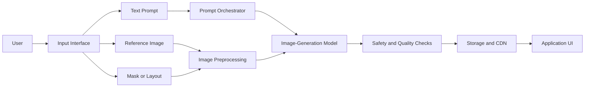

Image generation can be used as:

* A standalone feature
* A tool used by an AI agent
* A step in a content-production pipeline
* A component of a multimodal assistant
* A synthetic-data generator
* A visual response format for an LLM application

---

## 5. Common Image-Generation Tasks

### 5.1 Text-to-Image

The model creates an image from a natural-language instruction.

```text
Prompt:
A small robot studying machine learning in a modern library,
soft natural lighting, editorial illustration, square composition.
```

Typical use cases:

* Concept art
* Social-media images
* Educational illustrations
* Advertising ideas
* Game assets
* Story visualization

---

### 5.2 Image-to-Image

The model creates a new image based on an existing image.

The reference image may control:

* Composition
* Subject identity
* Pose
* Color palette
* Structure
* Lighting
* General visual direction

Example:

```text
Input image:
A rough pencil sketch of a mobile application screen

Instruction:
Transform this sketch into a clean modern mobile UI mockup
while preserving the original layout.
```

---

### 5.3 Image Editing

The model modifies part or all of an existing image.

Common operations include:

* Removing an object
* Adding an object
* Changing the background
* Replacing clothing
* Adjusting lighting
* Changing the season
* Restyling the image
* Correcting visual defects

```text
Original image + Editing instruction → Edited image
```

---

### 5.4 Inpainting

Inpainting modifies only a selected region of an image.

The system normally receives:

* The original image
* A binary or alpha mask
* An editing instruction

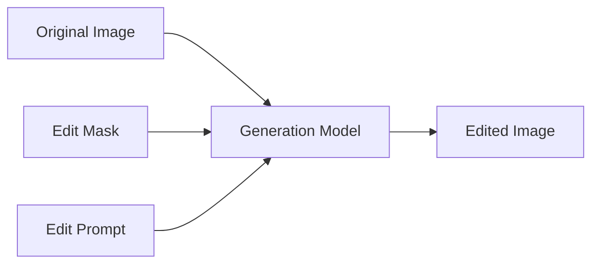

Example instruction:

```text
Replace the masked table with a wooden desk.
Preserve the room, lighting, camera angle, and all other objects.
```

---

### 5.5 Outpainting

Outpainting expands an image beyond its original boundaries.

Typical uses:

* Converting a square image into a landscape banner
* Extending a background
* Creating additional scene context
* Adapting content to different screen ratios

---

### 5.6 Image Variation

The system creates alternative versions of an image while retaining its main concept.

Variations may change:

* Color
* Camera angle
* composition
* Texture
* Background
* Character pose
* Level of detail

This is useful when users want multiple creative options rather than one exact result.

---

### 5.7 Style Transformation

The system preserves the core content while changing the visual appearance.

Examples:

```text
Photo → Watercolor illustration
Sketch → 3D render
Realistic room → Isometric game environment
Flat icon → Clay-style asset
```

Style transformations should be handled carefully when users request imitation of living artists or protected brand identities.

---

### 5.8 Image Upscaling and Restoration

Generation models can also support:

* Increasing apparent resolution
* Removing noise
* Restoring damaged images
* Reconstructing missing regions
* Improving texture and sharpness
* Colorizing old photographs

The system must avoid inventing important details when factual accuracy matters.

---

## 6. How Image-Generation Models Work

Several model families have been used for image generation.

### 6.1 Generative Adversarial Networks

A Generative Adversarial Network, or GAN, contains two main components:

* **Generator:** Creates synthetic images.
* **Discriminator:** Determines whether an image appears real or generated.

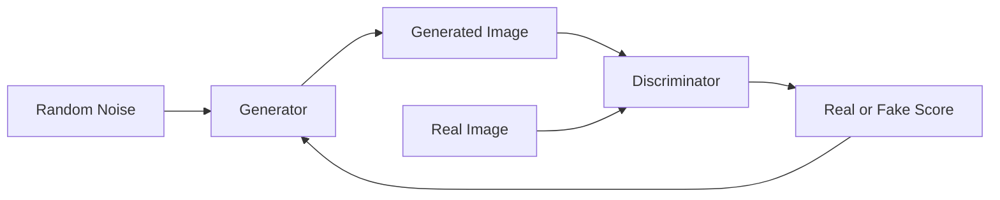

GANs can generate sharp images, but they may be difficult to train and can suffer from limited output diversity.

---

### 6.2 Diffusion Models

Diffusion models learn to reverse a gradual noising process.

During training:

```text
Clean image → Add noise repeatedly → Noisy image
```

During generation:

```text
Random noise → Remove noise step by step → Generated image
```

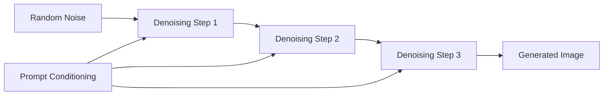

The prompt conditions the denoising process so that the final image matches the requested concept.

Diffusion systems became widely adopted because they support:

* Strong image quality
* Prompt conditioning
* Image editing
* Inpainting
* Style control
* Layout control
* Reference-image guidance

---

### 6.3 Latent Diffusion

Generating every pixel directly can be computationally expensive.

Latent diffusion compresses an image into a smaller representation before performing the denoising process.

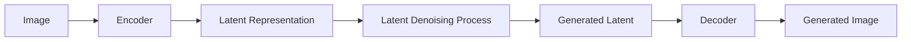

The latent representation reduces computational requirements while preserving important visual information.

---

### 6.4 Autoregressive Image Models

Autoregressive models generate image representations sequentially.

They may generate:

* Pixels
* Image tokens
* Compressed visual tokens
* Patches

The process is conceptually similar to text generation:

```text
Token 1 → Token 2 → Token 3 → ... → Complete image representation
```

Modern multimodal systems may combine transformer architectures, visual tokenization, diffusion, or other decoding methods.

---

## 7. Understanding Model Conditioning

A generation model does not create an image from the prompt in a purely literal way. It uses several conditioning signals.

### Common conditioning inputs

| Signal               | Purpose                                    |
| -------------------- | ------------------------------------------ |
| Text prompt          | Describes the desired output               |
| Negative constraints | Describes unwanted properties              |
| Reference image      | Controls appearance or structure           |
| Mask                 | Selects an editable region                 |
| Seed                 | Supports partial reproducibility           |
| Aspect ratio         | Controls output dimensions                 |
| Pose map             | Controls human or character position       |
| Depth map            | Controls spatial structure                 |
| Edge map             | Preserves boundaries                       |
| Style reference      | Guides color, texture, or rendering        |
| Strength value       | Controls how much the source image changes |

A production application should expose only the controls that users can understand.

Too many technical controls often create a confusing user experience.

---

## 8. Anatomy of an Effective Image Prompt

A strong prompt usually contains several information layers.

```text
Subject
+ Action
+ Environment
+ Composition
+ Lighting
+ Visual medium
+ Color direction
+ Technical constraints
+ Exclusions
```

### Example

```text
A young scientist examining a glowing plant inside a compact
space laboratory, medium-wide composition, subject positioned
slightly left of center, cinematic side lighting, detailed digital
illustration, deep blue and green palette, clean background,
16:9 aspect ratio, no text, no logo, no watermark.
```

### Prompt breakdown

| Prompt component | Example                       |
| ---------------- | ----------------------------- |
| Subject          | A young scientist             |
| Action           | Examining a glowing plant     |
| Environment      | Compact space laboratory      |
| Composition      | Medium-wide, left of center   |
| Lighting         | Cinematic side lighting       |
| Medium           | Detailed digital illustration |
| Color            | Deep blue and green           |
| Constraints      | No text, logo, or watermark   |
| Format           | 16:9                          |

---

## 9. Prompt Template

A reusable image prompt can use the following structure:

```text
Create [OUTPUT TYPE] showing [MAIN SUBJECT].

The subject is [ACTION OR POSE] in [ENVIRONMENT].

Composition:
- Camera angle: [ANGLE]
- Framing: [CLOSE-UP / MEDIUM / WIDE]
- Subject position: [POSITION]
- Aspect ratio: [RATIO]

Visual direction:
- Medium: [PHOTO / VECTOR / 3D / WATERCOLOR / ETC.]
- Lighting: [LIGHTING]
- Color palette: [COLORS]
- Mood: [MOOD]
- Detail level: [DETAIL]

Constraints:
- Preserve [IMPORTANT ELEMENTS]
- Do not include [UNWANTED ELEMENTS]
- No text, logos, signatures, or watermarks
```

---

## 10. Prompt Precision Versus Creative Freedom

Image-generation prompts can be placed on a spectrum.

### Open creative prompt

```text
Create a magical city floating above the ocean.
```

Advantages:

* High creativity
* Diverse results
* Good for brainstorming

Disadvantages:

* Low predictability
* Composition may vary greatly

### Controlled prompt

```text
Create an isometric floating city above a calm ocean.

Place one central circular city platform in the middle of the image.
Add three smaller islands around it.
Use white stone buildings with blue roofs.
Use a bright daytime sky.
Keep the background simple.
Square image.
No text, people, logos, or additional islands.
```

Advantages:

* Better layout control
* Easier evaluation
* More consistent results

Disadvantages:

* Less creative variation
* Longer prompt
* Constraints may conflict

The correct level of detail depends on the product.

---

## 11. End-to-End Generation Pipeline

A production image-generation workflow may look like this:

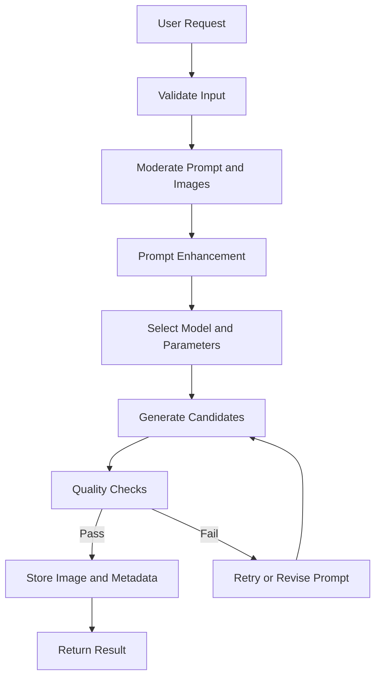

### Pipeline responsibilities

1. **Input validation**

   * Check prompt length.
   * Validate image dimensions.
   * Reject corrupted files.
   * Limit file size.

2. **Safety moderation**

   * Inspect text instructions.
   * Inspect uploaded images.
   * Check generated outputs.

3. **Prompt enhancement**

   * Convert vague requests into structured prompts.
   * Preserve user intent.
   * Add technical constraints.

4. **Model selection**

   * Select a fast model for previews.
   * Select a higher-quality model for final generation.
   * Select an editing-capable model for image modification.

5. **Generation**

   * Submit prompt and parameters.
   * Track request state.
   * Handle timeouts.

6. **Quality checks**

   * Check dimensions and format.
   * Detect blank or corrupted images.
   * Evaluate prompt alignment.
   * Detect unwanted text or artifacts.

7. **Storage**

   * Save generated files.
   * Store prompt and model metadata.
   * Create thumbnails.
   * Apply retention rules.

8. **Response**

   * Return image URL or binary data.
   * Include status and metadata.
   * Allow retry or refinement.

---

## 12. Basic API Design

A generation endpoint might accept the following request:

```json
{
  "prompt": "A friendly robot teaching mathematics in a classroom",
  "aspect_ratio": "1:1",
  "quality": "standard",
  "number_of_images": 1,
  "transparent_background": false
}
```

Example response:

```json
{
  "request_id": "img_req_7f93d2",
  "status": "completed",
  "images": [
    {
      "url": "https://cdn.example.com/generated/img_7f93d2.webp",
      "width": 1024,
      "height": 1024,
      "format": "webp"
    }
  ],
  "metadata": {
    "generation_time_ms": 8400,
    "prompt_version": "image_prompt_v3"
  }
}
```

---

## 13. Example Backend Route

The following example uses a provider-independent interface.

```python
from dataclasses import dataclass
from typing import Literal, Protocol
from uuid import uuid4

from fastapi import FastAPI, HTTPException
from pydantic import BaseModel, Field


app = FastAPI()


class GenerateImageRequest(BaseModel):
    prompt: str = Field(min_length=3, max_length=2_000)
    aspect_ratio: Literal["1:1", "16:9", "9:16", "4:3"] = "1:1"
    quality: Literal["preview", "standard", "high"] = "standard"
    number_of_images: int = Field(default=1, ge=1, le=4)


@dataclass
class GeneratedImage:
    data: bytes
    mime_type: str
    width: int
    height: int


class ImageProvider(Protocol):
    async def generate(
        self,
        *,
        prompt: str,
        aspect_ratio: str,
        quality: str,
        number_of_images: int,
    ) -> list[GeneratedImage]:
        ...


class SafetyService(Protocol):
    async def validate_prompt(self, prompt: str) -> None:
        ...


class StorageService(Protocol):
    async def save(
        self,
        *,
        image_data: bytes,
        mime_type: str,
        request_id: str,
        image_index: int,
    ) -> str:
        ...


image_provider: ImageProvider
safety_service: SafetyService
storage_service: StorageService


@app.post("/api/v1/images/generate")
async def generate_image(payload: GenerateImageRequest) -> dict:
    request_id = f"img_{uuid4().hex[:12]}"

    try:
        await safety_service.validate_prompt(payload.prompt)

        images = await image_provider.generate(
            prompt=payload.prompt,
            aspect_ratio=payload.aspect_ratio,
            quality=payload.quality,
            number_of_images=payload.number_of_images,
        )

        results = []

        for index, image in enumerate(images):
            image_url = await storage_service.save(
                image_data=image.data,
                mime_type=image.mime_type,
                request_id=request_id,
                image_index=index,
            )

            results.append(
                {
                    "url": image_url,
                    "width": image.width,
                    "height": image.height,
                    "mime_type": image.mime_type,
                }
            )

        return {
            "request_id": request_id,
            "status": "completed",
            "images": results,
        }

    except ValueError as exc:
        raise HTTPException(status_code=400, detail=str(exc)) from exc

    except TimeoutError as exc:
        raise HTTPException(
            status_code=504,
            detail="The image-generation provider timed out.",
        ) from exc

    except Exception as exc:
        raise HTTPException(
            status_code=500,
            detail="Image generation failed.",
        ) from exc
```

This design separates the application from a specific model provider.

---

## 14. Provider Abstraction

A provider interface makes it easier to switch models.

```python
from typing import Protocol


class ImageGenerationProvider(Protocol):
    async def generate(
        self,
        *,
        prompt: str,
        width: int,
        height: int,
        image_count: int,
    ) -> list[bytes]:
        ...

    async def edit(
        self,
        *,
        source_image: bytes,
        instruction: str,
        mask: bytes | None = None,
    ) -> bytes:
        ...
```

Possible provider-selection logic:

```python
def choose_provider(task: str, quality: str) -> str:
    if task == "edit":
        return "editing_provider"

    if quality == "preview":
        return "fast_provider"

    return "high_quality_provider"
```

Benefits:

* Vendor independence
* Easier testing
* Model fallback
* Cost optimization
* Task-specific routing
* Controlled migration between models

---

## 15. Prompt Enhancement with an LLM

Users often provide short or ambiguous instructions.

Example user prompt:

```text
Make a picture about AI learning.
```

An LLM can transform it into a structured generation prompt:

```text
Create a clean editorial illustration of a university student
learning artificial intelligence at a desk. Show a laptop with
abstract neural-network visualizations, notebooks, and a small
robot assistant. Use a modern classroom environment, soft daylight,
balanced composition, blue and warm orange accents, and a friendly
educational mood. Square composition. No readable text, logos,
watermarks, or brand marks.
```

### Prompt-enhancement flow

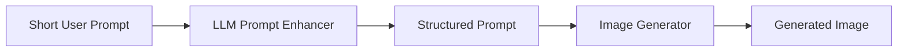

The enhancer must not silently change the user's core intent.

A good system may preserve both values:

```json
{
  "original_prompt": "Make a picture about AI learning.",
  "enhanced_prompt": "Create a clean editorial illustration..."
}
```

---

## 16. Image Generation as an Agent Tool

An AI agent can decide when visual output would help the user.

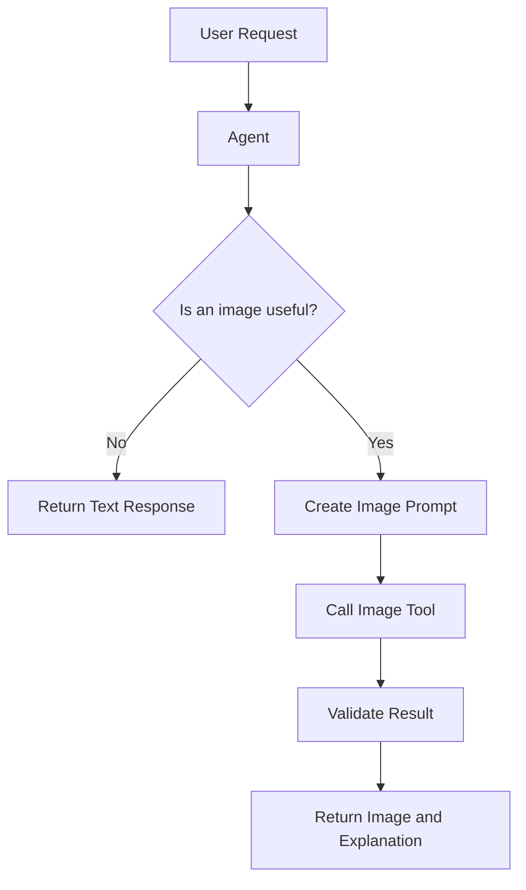

Example agent tool schema:

```json
{
  "name": "generate_image",
  "description": "Generate an image from a structured visual prompt.",
  "parameters": {
    "type": "object",
    "properties": {
      "prompt": {
        "type": "string"
      },
      "aspect_ratio": {
        "type": "string",
        "enum": ["1:1", "16:9", "9:16", "4:3"]
      },
      "transparent_background": {
        "type": "boolean"
      }
    },
    "required": [
      "prompt",
      "aspect_ratio",
      "transparent_background"
    ]
  }
}
```

The agent should call the tool only when:

* The user explicitly requests an image.
* Visual explanation is more useful than text.
* The application workflow requires a visual artifact.
* An image is necessary for the next task.

---

## 17. Generation Versus Retrieval

Not every image request should use generation.

Sometimes retrieving an existing image is more appropriate.

| Requirement                            | Better approach                   |
| -------------------------------------- | --------------------------------- |
| Accurate photograph of a real landmark | Image retrieval                   |
| Current product photograph             | Image retrieval                   |
| Historical document or painting        | Image retrieval                   |
| Original fantasy character             | Image generation                  |
| Custom educational illustration        | Image generation                  |
| Existing company logo                  | Asset retrieval                   |
| New logo concept                       | Image generation                  |
| Medical reference image                | Verified retrieval                |
| Stylized anatomy explanation           | Controlled generation with review |

A useful router may follow this logic:

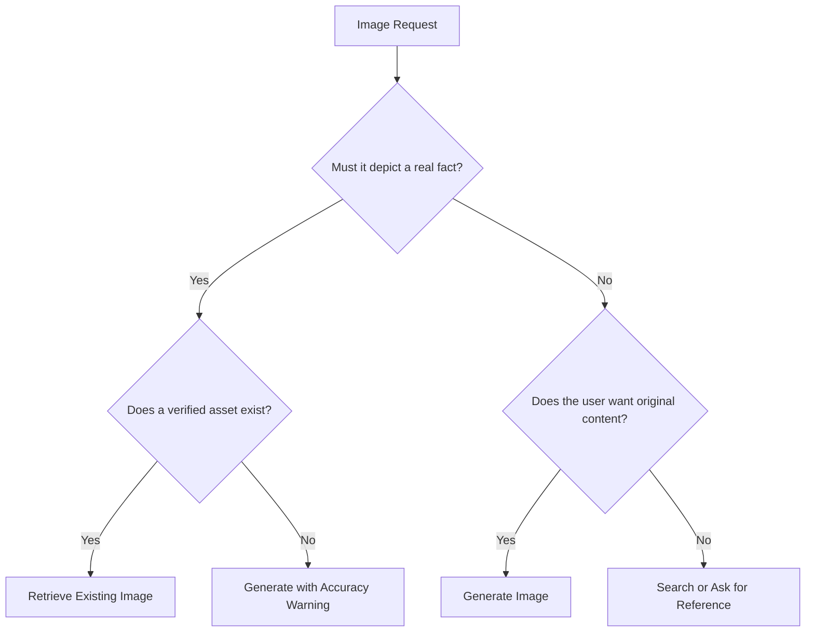

Generation should not replace factual image retrieval when accuracy is essential.

---

## 18. Multimodal Study Assistant Example

For a multimodal study assistant, image generation can support:

* Lesson illustrations
* Vocabulary cards
* Visual analogies
* Concept diagrams
* Historical scene reconstructions
* Quiz images
* Flashcard artwork
* Simplified process illustrations

### Example workflow

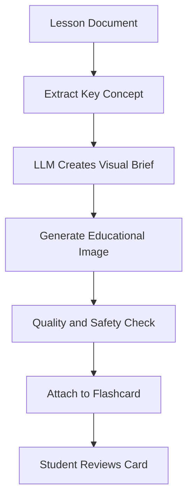

Example visual brief:

```json
{
  "concept": "The water cycle",
  "learning_goal": "Show the relationship between evaporation, condensation and precipitation",
  "visual_type": "educational diagram",
  "audience": "secondary school students",
  "constraints": [
    "simple visual hierarchy",
    "three main stages",
    "no decorative distractions",
    "leave space for application-generated labels"
  ]
}
```

It may be better to add exact labels with application code instead of asking the image model to render text.

---

## 19. Text Inside Generated Images

Generated text is a common source of errors.

Possible problems:

* Misspelled words
* Random letters
* Incorrect labels
* Inconsistent fonts
* Repeated characters
* Broken alignment
* Unreadable symbols

For diagrams, posters, flashcards, and interfaces, a stronger workflow is:

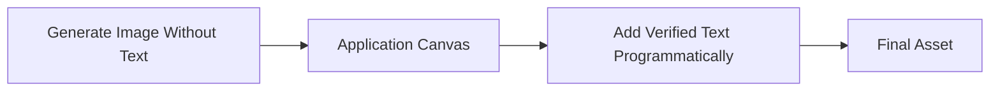

For example:

1. Generate a clean background illustration.
2. Add titles with HTML Canvas, SVG, or a design tool.
3. Validate the final text.
4. Export the composite asset.

This provides much more control over spelling, typography, localization, and accessibility.

---

## 20. Metadata and Reproducibility

Each generation should store useful metadata.

```json
{
  "request_id": "img_43fa91d8",
  "user_prompt": "Create an educational illustration of a neural network.",
  "enhanced_prompt": "Create a clean educational illustration...",
  "model": "selected-image-model",
  "provider": "provider-a",
  "prompt_version": "v4",
  "seed": 842193,
  "aspect_ratio": "16:9",
  "quality": "standard",
  "created_at": "2026-07-28T15:30:00Z",
  "latency_ms": 9200,
  "retry_count": 1,
  "moderation_status": "passed"
}
```

Useful metadata supports:

* Debugging
* Cost analysis
* Prompt comparison
* User history
* Reproducibility
* Abuse investigation
* Model migration
* Quality evaluation

A seed may improve reproducibility, but identical outputs are not guaranteed across model or provider versions.

---

## 21. Image Storage Architecture

Generated images are often stored outside the main application database.

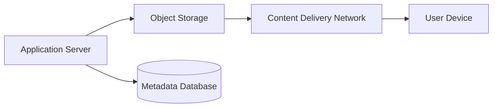

The database stores metadata:

```text
image ID
owner ID
prompt
storage key
dimensions
format
model
status
created time
expiration time
```

The image file is stored in:

* Object storage
* A media platform
* A dedicated file service
* A content delivery network

Avoid storing large image binary data directly in normal relational rows unless there is a strong reason.

---

## 22. Output Formats

Common output formats include:

| Format | Strength                        | Typical use                  |
| ------ | ------------------------------- | ---------------------------- |
| PNG    | Lossless, supports transparency | Icons, diagrams, editing     |
| JPEG   | Small size for photographs      | Photo-like content           |
| WebP   | Good quality-to-size ratio      | Web and mobile applications  |
| AVIF   | Efficient compression           | Modern web delivery          |
| SVG    | Scalable vectors                | Programmatic vector graphics |
| TIFF   | High-quality archival workflows | Professional editing         |

Generated raster images are not automatically true vector assets.

A model may generate an image that looks like vector artwork while the output is still PNG, JPEG, or WebP.

---

## 23. Image Quality Evaluation

Image quality is multidimensional.

A visually attractive image may still fail the task.

### Key evaluation dimensions

1. **Prompt alignment**

   * Does the image contain the requested subject?
   * Does it follow the required layout?

2. **Visual quality**

   * Is the image sharp and coherent?
   * Are there obvious rendering artifacts?

3. **Structural correctness**

   * Are objects positioned correctly?
   * Are body parts and geometry plausible?

4. **Text correctness**

   * Is any required text accurate and readable?

5. **Identity consistency**

   * Does the same character remain recognizable?

6. **Style consistency**

   * Does the output match the intended design system?

7. **Safety**

   * Does the image contain prohibited or unexpected content?

8. **Usefulness**

   * Can the asset actually be used in the target product?

---

## 24. Automated Evaluation

Automated methods can check limited aspects of generated images.

### Possible checks

* File can be decoded.
* Correct image dimensions.
* Valid MIME type.
* Minimum sharpness.
* No blank image.
* No transparent-only output.
* Prompt-image similarity score.
* Object detection.
* Face count.
* Text detection.
* Duplicate detection.
* Safety classification.

Example quality function:

```python
from dataclasses import dataclass


@dataclass
class QualityResult:
    passed: bool
    reasons: list[str]


def validate_image_metadata(
    *,
    width: int,
    height: int,
    file_size_bytes: int,
    expected_width: int,
    expected_height: int,
) -> QualityResult:
    reasons: list[str] = []

    if width != expected_width or height != expected_height:
        reasons.append("Unexpected image dimensions.")

    if file_size_bytes < 10_000:
        reasons.append("Image file is unusually small.")

    return QualityResult(
        passed=len(reasons) == 0,
        reasons=reasons,
    )
```

Automated evaluation is useful but cannot fully replace human review.

---

## 25. Human Evaluation Rubric

A simple human evaluation form can use a five-point scale.

| Dimension        | Question                                     |
| ---------------- | -------------------------------------------- |
| Prompt alignment | Does the output match the instruction?       |
| Composition      | Is the layout balanced and usable?           |
| Visual quality   | Are there noticeable artifacts?              |
| Style            | Does the visual treatment match the request? |
| Usability        | Can the image be used without major edits?   |
| Safety           | Is the result appropriate and compliant?     |

Example result:

```json
{
  "prompt_alignment": 4,
  "composition": 5,
  "visual_quality": 3,
  "style_match": 4,
  "usability": 4,
  "safety": 5,
  "review_notes": "Good composition, but the left hand is malformed."
}
```

---

## 26. A/B Testing Image Prompts

Prompt versions should be evaluated systematically.

### Prompt A

```text
A robot in a classroom.
```

### Prompt B

```text
Create a friendly educational illustration of a small robot
teaching mathematics in a bright modern classroom. Show the
robot beside a large blank whiteboard. Use a balanced medium-wide
composition, soft daylight, clean shapes, and a blue and yellow
palette. No readable text, logos, or watermarks.
```

Track:

* User selection rate
* Regeneration rate
* Editing rate
* Time to acceptable result
* Human quality score
* Safety rejection rate
* Average cost per accepted image

The best prompt is not necessarily the longest prompt. It is the one that produces the most useful output consistently.

---

## 27. Cost Management

Image generation may be significantly more expensive than a normal text response.

Cost may depend on:

* Model
* Resolution
* Quality mode
* Number of candidates
* Number of retries
* Editing operations
* Upscaling
* Storage
* Bandwidth
* Safety analysis

### Cost-control strategies

* Generate previews before high-resolution assets.
* Limit the number of candidates.
* Cache reusable outputs.
* Require explicit confirmation for expensive modes.
* Use smaller dimensions for thumbnails.
* Apply user quotas.
* Track retry rates.
* Route simple tasks to faster models.
* Delete temporary files after expiration.

Example generation policy:

```python
def resolve_generation_policy(
    *,
    user_plan: str,
    requested_quality: str,
    requested_count: int,
) -> dict:
    max_images = {
        "free": 1,
        "standard": 2,
        "premium": 4,
    }.get(user_plan, 1)

    image_count = min(requested_count, max_images)

    if user_plan == "free" and requested_quality == "high":
        quality = "standard"
    else:
        quality = requested_quality

    return {
        "quality": quality,
        "image_count": image_count,
    }
```

---

## 28. Latency and User Experience

Image generation usually takes longer than simple text generation.

The interface should communicate progress clearly.

Possible states:

```text
Queued
Validating request
Preparing prompt
Generating image
Checking result
Saving asset
Completed
Failed
```

Example state machine:

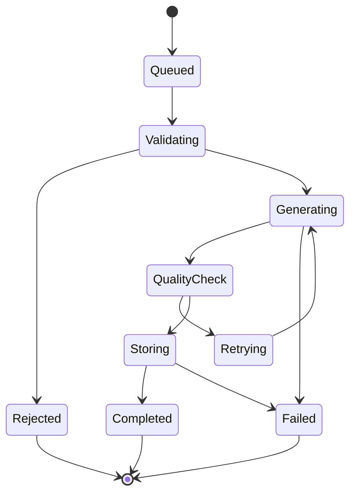

Useful interface features include:

* Progress status
* Cancel button
* Retry button
* Prompt editing
* Version history
* Candidate comparison
* Download or export controls
* Clear error explanations

Do not display a fake percentage unless the backend can estimate actual progress.

---

## 29. Retry Strategy

Blind retries can waste money.

Retry only when there is a specific reason.

### Retryable failures

* Temporary provider error
* Timeout
* Corrupted output
* Empty output
* Storage failure
* Rate-limit response

### Non-retryable failures

* Unsafe request
* Invalid image format
* Unsupported task
* Missing input image
* Prompt exceeds limits
* User quota exceeded

Example retry logic:

```python
import asyncio
from collections.abc import Awaitable, Callable
from typing import TypeVar


T = TypeVar("T")


async def retry_with_backoff(
    operation: Callable[[], Awaitable[T]],
    *,
    max_attempts: int = 3,
) -> T:
    last_error: Exception | None = None

    for attempt in range(max_attempts):
        try:
            return await operation()

        except TimeoutError as exc:
            last_error = exc

            if attempt == max_attempts - 1:
                break

            await asyncio.sleep(2**attempt)

    if last_error is not None:
        raise last_error

    raise RuntimeError("Operation failed without an exception.")
```

---

## 30. Safety and Responsible Use

Image generation creates important safety risks.

A production system should consider:

* Sexual content
* Child-safety concerns
* Graphic violence
* Extremist content
* Harassment
* Fraud
* Impersonation
* Non-consensual imagery
* Privacy violations
* Misleading political content
* Copyright and trademark concerns
* Identity misuse
* Medical misinformation

A safe pipeline may inspect:

```text
User prompt
Uploaded reference image
Generated output
Output metadata
User behavior patterns
```

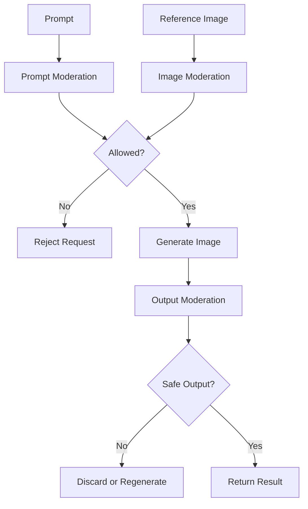

Safety checks should occur both before and after generation.

---

## 31. Privacy Considerations

Users may upload personal photographs.

The application should define:

* How long uploads are stored
* Whether images are used for model training
* Who can access the files
* Whether metadata is removed
* How deletion works
* Whether face data is processed
* Whether public links are generated
* Whether files are encrypted
* Whether logs contain image URLs

Avoid writing sensitive image URLs or raw image data into normal application logs.

A privacy-conscious system may:

1. Upload the file using a signed URL.
2. Store it in a private bucket.
3. Generate a temporary processing URL.
4. Remove metadata.
5. Delete temporary inputs after processing.
6. Store only the final asset when necessary.

---

## 32. Common Failure Modes

### 32.1 Incorrect Object Count

Prompt:

```text
Create exactly three candles.
```

Output:

```text
The image contains four candles.
```

Possible fixes:

* Emphasize the count.
* Use a simpler composition.
* Generate multiple candidates.
* Add object-detection validation.
* Use layout conditioning.

---

### 32.2 Anatomical Errors

Typical errors:

* Extra fingers
* Merged limbs
* Unnatural joints
* Inconsistent faces
* Incorrect eye direction

Possible fixes:

* Avoid unnecessarily complex poses.
* Use stronger pose references.
* Generate a wider composition.
* Inpaint the defective region.
* Use a specialized model.

---

### 32.3 Unreadable Text

Possible fixes:

* Generate without text.
* Add text programmatically.
* Use a separate typography layer.
* Validate text with OCR only when necessary.

---

### 32.4 Ignored Constraints

Prompt:

```text
No background objects.
```

Output:

```text
The model adds plants and furniture.
```

Possible fixes:

* Use positive instructions such as “plain empty background.”
* Repeat critical constraints once.
* Reduce conflicting style instructions.
* Use reference composition.
* Apply post-generation segmentation.

---

### 32.5 Style Drift

Multiple generated assets may not look like the same product.

Possible fixes:

* Use a shared visual prompt template.
* Maintain a fixed design vocabulary.
* Reuse reference images.
* Lock aspect ratio and framing.
* Store approved examples.
* Apply post-processing consistently.

---

### 32.6 Identity Drift

The same character may appear different across images.

Possible fixes:

* Use reference images.
* Define stable character attributes.
* Generate a character sheet first.
* Keep clothing and color constraints explicit.
* Use identity-preserving workflows where permitted.
* Review each output manually.

---

### 32.7 Overloaded Prompt

Too many requirements can conflict.

Example:

```text
Minimalist, extremely detailed, photorealistic, flat vector,
dark cinematic lighting, bright daylight, empty scene,
crowded marketplace.
```

The model receives incompatible instructions.

Fix:

1. Identify the primary visual goal.
2. Remove contradictions.
3. Separate required and optional attributes.
4. Generate in multiple stages.

---

### 32.8 Unexpected Cropping

Important parts of the subject may be outside the frame.

Possible fixes:

* Specify framing.
* Add margin requirements.
* Mention that the full subject must be visible.
* Use a wider aspect ratio.
* Generate first, then crop deliberately.

---

### 32.9 Transparent Background Failure

An output may appear to have a transparent background but actually contain:

* White pixels
* Checkerboard pixels
* Colored halos
* Semi-transparent artifacts

Validation should inspect the alpha channel rather than relying only on visual appearance.

---

## 33. Debugging Workflow

When an image-generation feature fails, debug one layer at a time.

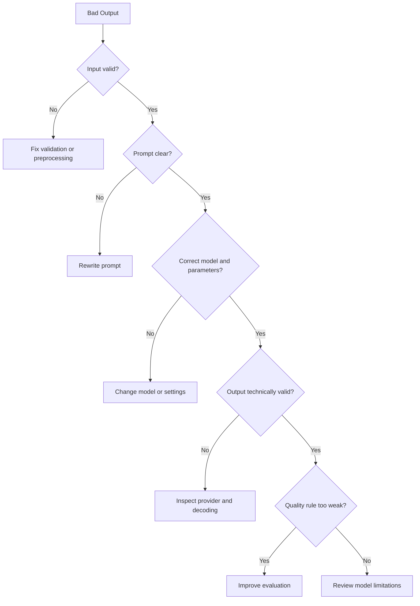

### Debugging checklist

Record:

* Original prompt
* Enhanced prompt
* Reference image hash
* Model and provider
* Model parameters
* Seed
* Output dimensions
* Latency
* Safety decision
* Retry count
* Quality scores
* Error details
* Final image identifier

Without metadata, visual failures are difficult to reproduce.

---

## 34. Production Observability

Track technical and product metrics.

### Technical metrics

* Generation latency
* Provider latency
* Timeout rate
* Failure rate
* Moderation rejection rate
* Retry rate
* Storage failure rate
* Average file size
* Queue depth

### Product metrics

* Images generated per user
* Images accepted without retry
* Regeneration rate
* Edit-after-generation rate
* User rating
* Export rate
* Cost per accepted output
* Time to acceptable result

A high generation-success rate does not guarantee product success.

For example:

```text
Provider success rate: 99%
User regeneration rate: 62%
```

The infrastructure is working, but the visual quality or prompt alignment is poor.

---

## 35. Caching and Reuse

Caching exact image-generation requests can reduce cost, but it must be applied carefully.

A cache key may include:

```text
Normalized prompt
Model version
Aspect ratio
Quality
Seed
Reference-image hash
Editing parameters
Safety-policy version
```

Example:

```python
import hashlib
import json


def create_image_cache_key(payload: dict) -> str:
    normalized = json.dumps(
        payload,
        sort_keys=True,
        separators=(",", ":"),
    )

    digest = hashlib.sha256(normalized.encode("utf-8")).hexdigest()

    return f"image_generation:{digest}"
```

Do not reuse private user images across users.

---

## 36. Batch Generation

Some workflows generate many related images.

Examples:

* Vocabulary flashcards
* Product variations
* Storyboard frames
* Character poses
* Lesson illustrations
* Game-item icons

A batch request should define shared and item-specific constraints.

```json
{
  "shared_style": {
    "medium": "clean modern educational illustration",
    "palette": "blue, teal and warm yellow",
    "background": "simple light background",
    "aspect_ratio": "1:1",
    "constraints": [
      "no text",
      "no logos",
      "consistent line weight"
    ]
  },
  "items": [
    {
      "id": "evaporation",
      "subject": "water rising as vapor under sunlight"
    },
    {
      "id": "condensation",
      "subject": "water vapor forming clouds"
    },
    {
      "id": "precipitation",
      "subject": "rain falling from clouds"
    }
  ]
}
```

Batch systems need:

* Concurrency limits
* Partial-failure handling
* Per-item status
* Cost limits
* Consistency review
* Deterministic naming
* Resume support

---

## 37. Image-Generation Job Model

Long-running generation tasks may use an asynchronous job architecture.

```json
{
  "job_id": "job_img_92af",
  "status": "processing",
  "total_items": 20,
  "completed_items": 7,
  "failed_items": 1
}
```

Possible job states:

```text
pending
processing
partially_completed
completed
failed
cancelled
```

Example database structure:

```text
image_jobs
- id
- user_id
- status
- total_items
- completed_items
- failed_items
- created_at
- completed_at

image_job_items
- id
- job_id
- prompt
- status
- output_url
- error_code
- retry_count
```

---

## 38. Designing a Good User Interface

A useful image-generation interface should let users express intent without requiring expert knowledge.

### Basic controls

* Prompt
* Aspect ratio
* Number of outputs
* Visual style
* Background type
* Quality mode

### Advanced controls

* Reference image
* Mask editor
* Strength
* Seed
* Composition guide
* Negative constraints
* Transparent background

A good interface progressively reveals complexity.

```text
Basic mode:
Prompt + aspect ratio + generate

Advanced mode:
References + editing + seed + structure controls
```

---

## 39. Accessibility

Generated images should support accessible applications.

Consider:

* Alternative text
* Captions
* High-contrast options
* Color-blind-safe diagrams
* Keyboard-accessible controls
* Screen-reader-compatible generation status
* Warnings for flashing or disturbing content
* Text alternatives for visual-only information

An LLM can draft alternative text, but the description should be reviewed when accuracy matters.

Example output structure:

```json
{
  "image_url": "https://cdn.example.com/image.webp",
  "alt_text": "A student uses a laptop while a small robot points to a neural-network diagram.",
  "caption": "An illustration of human-AI collaborative learning."
}
```

---

## 40. When Not to Use Image Generation

Avoid image generation when:

* A verified factual photograph is required.
* Exact scientific visualization is necessary.
* Medical decisions depend on the visual.
* Legal evidence must remain authentic.
* A real person's identity may be misrepresented.
* A deterministic chart can be produced with code.
* Existing approved brand assets must be used.
* The task only requires text.
* The generated visual would add no practical value.

For charts and data visualizations, programmatic rendering is usually more reliable.

```text
Numerical data → Chart library → Accurate visualization
```

is normally better than:

```text
Numerical data → Image-generation prompt → Approximate chart
```

---

## 41. Practical Demo: Educational Image Generator

### Goal

Build a small endpoint that creates an illustration for a learning concept.

### Input

```json
{
  "topic": "How a neural network learns",
  "audience": "beginner programming students",
  "visual_type": "educational illustration"
}
```

### Step 1: Generate a visual brief

```python
def create_visual_brief(
    topic: str,
    audience: str,
    visual_type: str,
) -> dict:
    return {
        "topic": topic,
        "audience": audience,
        "visual_type": visual_type,
        "requirements": [
            "one clear central concept",
            "simple composition",
            "minimal background detail",
            "no text inside the generated image",
            "space for application-generated labels",
        ],
    }
```

### Step 2: Build the prompt

```python
def build_image_prompt(brief: dict) -> str:
    requirements = "\n".join(
        f"- {item}" for item in brief["requirements"]
    )

    return f"""
Create a {brief["visual_type"]} about:
{brief["topic"]}

Target audience:
{brief["audience"]}

Requirements:
{requirements}

Use a clear educational visual hierarchy, friendly modern shapes,
balanced composition, and soft professional lighting.
Do not include text, logos, signatures, or watermarks.
""".strip()
```

### Step 3: Generate the image

```python
async def generate_lesson_image(
    *,
    topic: str,
    audience: str,
    visual_type: str,
    provider: ImageGenerationProvider,
) -> bytes:
    brief = create_visual_brief(
        topic=topic,
        audience=audience,
        visual_type=visual_type,
    )

    prompt = build_image_prompt(brief)

    images = await provider.generate(
        prompt=prompt,
        width=1024,
        height=1024,
        image_count=1,
    )

    if not images:
        raise RuntimeError("The provider returned no images.")

    return images[0]
```

### Step 4: Add labels programmatically

After generation:

```text
Generated illustration
        ↓
Add verified labels using SVG or Canvas
        ↓
Export final educational asset
```

This prevents spelling and typography errors.

---

## 42. Portfolio Project

### Project: Multimodal Study Assistant

Build a study assistant that can:

1. Accept text, images, PDFs, or audio.
2. Extract the main concepts.
3. Generate summaries and flashcards.
4. Create optional educational illustrations.
5. Generate quizzes.
6. Save learning progress.
7. Display source references.
8. Allow users to regenerate or edit visual assets.

### Image-generation component

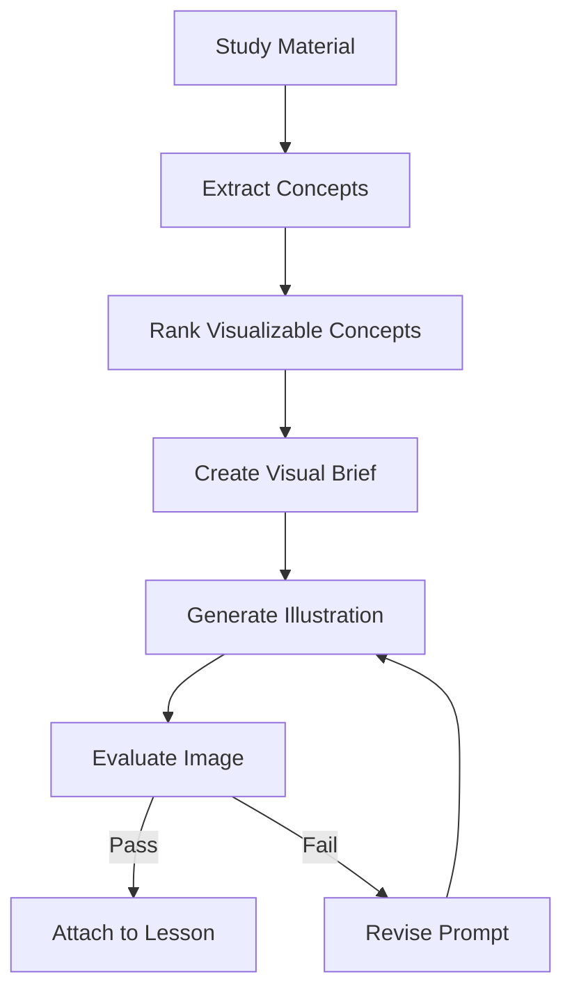

### Suggested API routes

```text
POST /api/v1/study-materials
POST /api/v1/study-materials/{id}/summarize
POST /api/v1/study-materials/{id}/flashcards
POST /api/v1/study-materials/{id}/quiz
POST /api/v1/study-materials/{id}/images
POST /api/v1/images/{id}/regenerate
POST /api/v1/images/{id}/edit
GET  /api/v1/jobs/{job_id}
```

### Portfolio evidence

Include:

* Architecture diagram
* Prompt templates
* API documentation
* Model-provider abstraction
* Safety pipeline
* Quality rubric
* Cost dashboard
* Example failures
* Before-and-after prompt improvements
* Generated lesson demo

---

## 43. Production Checklist

### Input

* [ ] Prompt length is limited.
* [ ] Uploaded images are validated.
* [ ] File size and dimensions are restricted.
* [ ] Unsupported formats are rejected.
* [ ] Image orientation is normalized.
* [ ] Metadata handling is defined.

### Prompting

* [ ] Original and enhanced prompts are stored.
* [ ] Critical constraints are explicit.
* [ ] Conflicting instructions are minimized.
* [ ] Prompt templates are versioned.
* [ ] User intent is preserved.

### Safety

* [ ] Prompts are moderated.
* [ ] Uploaded images are moderated.
* [ ] Generated outputs are moderated.
* [ ] Private images are protected.
* [ ] Abuse limits are implemented.

### Generation

* [ ] Provider timeouts are configured.
* [ ] Retry rules distinguish temporary and permanent errors.
* [ ] Model routing is configurable.
* [ ] User quotas are enforced.
* [ ] Expensive modes require appropriate permission.

### Quality

* [ ] Image decoding is validated.
* [ ] Dimensions are checked.
* [ ] Empty or corrupted outputs are rejected.
* [ ] Prompt alignment is evaluated.
* [ ] Human review exists for important assets.

### Storage

* [ ] Files use unique identifiers.
* [ ] Metadata is stored separately.
* [ ] Public and private access are clearly separated.
* [ ] Expiration and deletion policies exist.
* [ ] Thumbnails are generated when needed.

### Observability

* [ ] Request IDs are included.
* [ ] Latency is measured.
* [ ] Cost is estimated.
* [ ] Retry counts are tracked.
* [ ] Provider failures are categorized.
* [ ] Regeneration rate is monitored.

### User Experience

* [ ] Progress states are visible.
* [ ] Errors are understandable.
* [ ] Users can revise their prompts.
* [ ] Users can compare candidates.
* [ ] Accessibility metadata is supported.

---

## 44. Common Mistakes

### Mistake 1: Treating image generation as one API call

A production system also needs safety, storage, evaluation, retry logic, observability, and a usable interface.

---

### Mistake 2: Assuming attractive means correct

An image may look professional while ignoring the requested number of objects, layout, identity, or educational concept.

---

### Mistake 3: Asking the model to render important text

For exact text, generate the visual separately and add typography programmatically.

---

### Mistake 4: Ignoring model nondeterminism

The same prompt may produce different outputs. Store metadata and design the user experience around variation.

---

### Mistake 5: Retrying without understanding the failure

Blind retries increase cost. Classify failures before repeating generation.

---

### Mistake 6: Using generation for factual evidence

Generated images are synthetic. They should not be presented as authentic evidence.

---

### Mistake 7: Ignoring privacy

Uploaded photos may contain faces, addresses, documents, screens, or location metadata.

---

### Mistake 8: Testing only the happy path

Test:

* Empty prompts
* Very long prompts
* Invalid images
* Large files
* Provider timeout
* Unsafe inputs
* Corrupted output
* Storage failure
* Duplicate requests
* Partial batch failure

---

## 45. Practical Exercises

### Exercise 1: Five-line summary

Without reading the lesson again, write five lines explaining:

1. What image generation is.
2. What inputs it can accept.
3. Where it belongs in an AI application.
4. One important production risk.
5. One application you could build with it.

---

### Exercise 2: Prompt improvement

Improve this prompt:

```text
Make a picture of machine learning.
```

Your improved prompt should specify:

* Subject
* Environment
* Composition
* Medium
* Lighting
* Color palette
* Aspect ratio
* Exclusions

---

### Exercise 3: API route

Design:

```text
POST /api/v1/images/generate
```

Define:

* Request schema
* Response schema
* Validation rules
* Error codes
* Timeout behavior
* Safety checks

---

### Exercise 4: Failure analysis

Suppose the request is:

```text
Create exactly five red books on an empty wooden table.
```

The model creates seven books and adds a plant.

Write:

1. The likely cause.
2. An improved prompt.
3. An automated validation approach.
4. A retry or editing strategy.

---

### Exercise 5: Build a mini demo

Build one of the following:

* Text-to-image notebook
* Image-editing API
* Flashcard illustration generator
* Game-icon generator
* Product-background editor
* Image-generation agent tool
* Batch vocabulary-image pipeline

Store:

```text
prompt
model
parameters
output path
latency
quality score
failure notes
```

---

## 46. Knowledge Check

### Question 1

What is the difference between text-to-image and image-to-image generation?

### Question 2

Why are generated images difficult to evaluate with one metric?

### Question 3

Why should safety moderation happen after generation as well as before it?

### Question 4

Why is programmatic text rendering often better than generating text inside an image?

### Question 5

What metadata would you store for debugging a failed generation?

### Question 6

When should an application retrieve an existing image instead of generating one?

### Question 7

What is the purpose of a provider abstraction?

### Question 8

Why can a successful provider response still represent a product failure?

---

## 47. Completion Checklist

* [ ] I can explain **Image Generation** in one or two minutes.
* [ ] I can distinguish text-to-image, image-to-image, editing, inpainting, and outpainting.
* [ ] I understand the basic diffusion-generation process.
* [ ] I can write a structured visual prompt.
* [ ] I can design a simple image-generation API.
* [ ] I understand how image generation can be exposed as an agent tool.
* [ ] I know when retrieval is better than generation.
* [ ] I can identify safety, privacy, cost, latency, and quality risks.
* [ ] I have created a small demo or portfolio artifact.
* [ ] I have documented at least one limitation or open question.

---

## 48. Related Outcome

Build applications that work with:

* Text
* Images
* Documents
* Audio
* Speech
* Video

Image generation contributes the visual-output layer of a multimodal application.

---

## 49. Related Project

### Project 10: Multimodal Study Assistant

Create a study assistant that accepts images, PDFs, text, and audio, then produces:

* Summaries
* Flashcards
* Quizzes
* Structured notes
* Educational illustrations
* Visual explanations

The image-generation component should include:

* Prompt enhancement
* Safety moderation
* Provider abstraction
* Quality checks
* File storage
* Cost tracking
* Regeneration support

---

## 50. Key Takeaways

1. Image generation creates or transforms visual content from text, images, masks, and structured controls.
2. A production feature requires much more than a model API call.
3. Prompt structure strongly affects composition, consistency, and usability.
4. Generated images must be checked for alignment, visual quality, safety, and factual appropriateness.
5. Important text should usually be added programmatically after image generation.
6. Retrieval is better when the user needs an authentic or verified real-world image.
7. Provider abstraction makes model routing, testing, fallback, and migration easier.
8. Metadata and observability are essential because generation is nondeterministic.
9. Cost and latency should be part of the product design.
10. The best learning outcome is a working demo with documented failures and limitations.

---

## 51. Final Summary

**Image Generation** is an important milestone in the modern AI Engineer roadmap because it enables applications to produce original visual outputs rather than only analyzing or returning text.

A reliable implementation combines:

```text
User intent
→ Prompt engineering
→ Input processing
→ Model generation
→ Safety checks
→ Quality evaluation
→ Storage
→ User feedback
```

To make the knowledge practical, turn this lesson into at least one concrete artifact:

* An image-generation prompt template
* An API route
* A provider abstraction
* An agent tool
* A batch-generation pipeline
* A quality-evaluation notebook
* A multimodal application feature
* A portfolio case study

The goal is not only to generate an attractive image. The goal is to build a system that produces useful, safe, controllable, measurable, and maintainable visual outputs.
