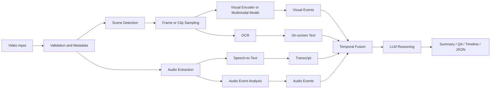
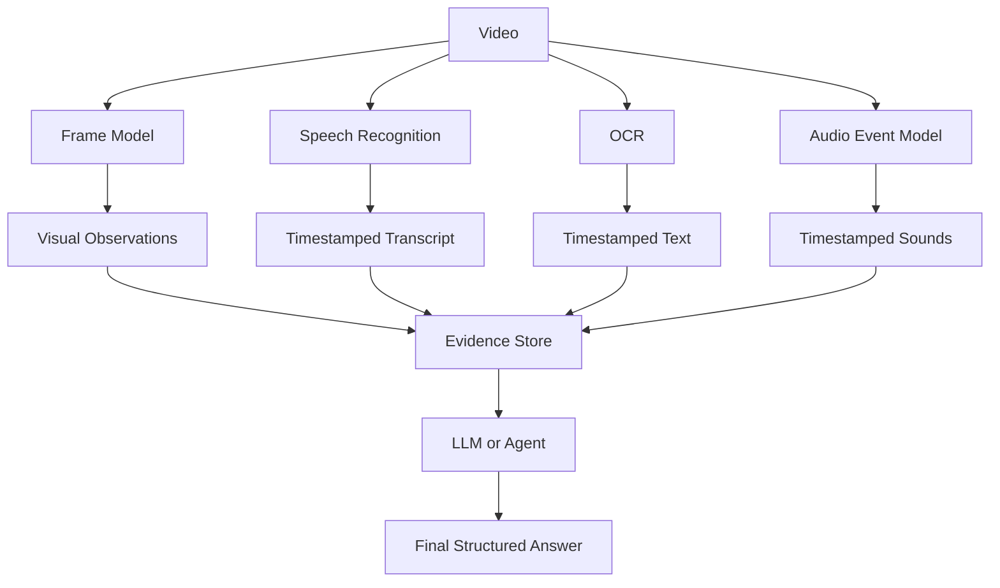
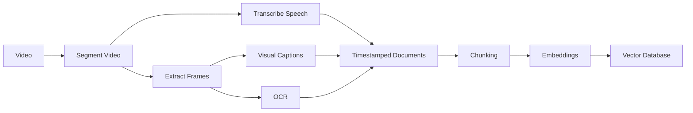

# 006 — Video Understanding

**Course:** 04 — Agents, Multimodal and Tools
**Module:** Module 11 — Multimodal AI
**Content Group:** Modalities
**Roadmap Source:** Multimodal AI / Modalities
**Lesson Type:** Multimodal AI
**Order in Module:** 006
**Suggested Duration:** 22 minutes

---

## 1. Overview

**Video Understanding** is the ability of an AI system to analyze a sequence of visual frames, often combined with audio, speech, text, and metadata, to determine what happens over time.

An image model answers questions such as:

* What objects are visible?
* What text appears in the image?
* What is the scene about?

A video-understanding system must answer additional temporal questions:

* What happened first?
* How did the scene change?
* Which person performed an action?
* When did an event begin and end?
* Did an object disappear, move, or change state?
* What was said while the event occurred?
* What is the overall story of the video?

Video understanding is therefore not simply image understanding repeated many times. The system must model **time, motion, continuity, causality, and synchronization between modalities**.

After this lesson, you should understand where video understanding fits in a modern AI workflow and how to turn it into a prompt, API route, RAG pipeline, agent tool, multimodal feature, or portfolio project.

---

## 2. Learning Objectives

By the end of this lesson, you should be able to:

* Explain video understanding in your own words.
* Distinguish video understanding from image understanding.
* Identify the main tasks involved in video analysis.
* Design a basic video-processing pipeline.
* Select an appropriate frame-sampling strategy.
* Combine video frames, speech, OCR, audio, and metadata.
* Produce structured outputs from a video-understanding model.
* Identify common production failures and debugging strategies.
* Build a small video-understanding demo.

---

## 3. What Is Video Understanding?

A digital video can be represented as:

[
V = {F_1, F_2, F_3, \ldots, F_T}
]

where:

* (V) is the video.
* (F_t) is the frame at time (t).
* (T) is the total number of frames.

However, sending every frame to a model is usually inefficient. A one-minute video recorded at 30 frames per second contains:

[
60 \times 30 = 1{,}800 \text{ frames}
]

Many neighboring frames are nearly identical. A practical system therefore selects representative frames, short clips, detected scenes, or important events.

Video understanding commonly combines several data streams:

[
\text{Video} =
\text{Frames}
+
\text{Motion}
+
\text{Speech}
+
\text{Audio}
+
\text{On-screen text}
+
\text{Metadata}
]

Each stream contributes different information.

| Data stream | Example information                          |
| ----------- | -------------------------------------------- |
| Frames      | Objects, people, environment, visual state   |
| Motion      | Walking, falling, turning, opening, entering |
| Speech      | Spoken explanation, dialogue, instructions   |
| Audio       | Music, alarms, impacts, applause, machinery  |
| OCR text    | Slides, signs, captions, interface labels    |
| Metadata    | Timestamp, duration, resolution, location    |

---

## 4. Why Video Is More Difficult Than Images

### 4.1 Temporal reasoning

A single frame may not reveal an action.

For example, one frame showing a person near a chair cannot determine whether the person is:

* Sitting down
* Standing up
* Moving the chair
* Walking past it

The model needs multiple frames in the correct order.

---

### 4.2 Long-context processing

A video can contain thousands of frames and a long transcript. Processing everything at once may exceed:

* Context-window limits
* Upload limits
* Memory limits
* Latency targets
* Cost budgets

Long videos usually require hierarchical processing.

---

### 4.3 Cross-modal synchronization

The system may need to connect speech with visual events.

Example:

> “Click the settings icon in the upper-right corner.”

The AI must identify:

1. When the sentence was spoken
2. Which interface was visible
3. Which icon was referenced
4. What action occurred afterward

---

### 4.4 State tracking

Video understanding often requires tracking state changes.

```text
Door closed
   ↓
Person approaches
   ↓
Person turns handle
   ↓
Door opens
   ↓
Person enters room
```

A frame-only analysis may detect a person and a door but miss the complete event.

---

### 4.5 Ambiguous or missing evidence

Important events may be:

* Off-screen
* Occluded
* Blurry
* Too fast
* Partially recorded
* Mentioned only in speech
* Visible only as text
* Spread across distant timestamps

A reliable system must report uncertainty rather than inventing details.

---

## 5. Common Video-Understanding Tasks

### 5.1 Video classification

Assign one or more labels to an entire video.

Examples:

* Cooking tutorial
* Football match
* Product review
* Security footage
* Lecture
* Music performance

Example output:

```json
{
  "primary_category": "cooking_tutorial",
  "secondary_categories": [
    "food_preparation",
    "instructional_video"
  ],
  "confidence": 0.94
}
```

---

### 5.2 Action recognition

Identify actions performed in the video.

Examples:

* Running
* Pouring water
* Opening a package
* Playing a guitar
* Typing on a keyboard

Action recognition requires temporal information because actions are defined by movement and change.

---

### 5.3 Object detection and tracking

Detect objects and follow them across frames.

```text
Frame 1: Car detected at x=120
Frame 2: Car detected at x=145
Frame 3: Car detected at x=180
```

Tracking can answer questions such as:

* Where did the object move?
* When did it enter the scene?
* How long was it visible?
* Did two objects interact?

---

### 5.4 Temporal event localization

Determine when an event occurs.

Example:

```json
{
  "event": "speaker demonstrates the login process",
  "start_seconds": 42.5,
  "end_seconds": 68.2
}
```

This task is important for:

* Video search
* Automatic chapter generation
* Highlight extraction
* Safety monitoring
* Lecture navigation

---

### 5.5 Video captioning

Generate a natural-language description of a clip or video.

Example:

> A person places a laptop on a desk, connects the charger, opens the screen, and begins typing.

A good caption should preserve:

* Important actors
* Actions
* Objects
* Order of events
* Relevant context

---

### 5.6 Video summarization

Create a shorter representation of a long video.

Possible outputs include:

* One-paragraph summary
* Bullet-point summary
* Chapters
* Timeline
* Key moments
* Extracted highlights
* Study notes
* Meeting minutes

---

### 5.7 Video question answering

Answer a question using evidence from a video.

Examples:

* What ingredient was added after the onions?
* At what time did the error appear?
* Why did the player receive a penalty?
* Which menu did the instructor open?
* Did the customer pick up the package?

---

### 5.8 Anomaly detection

Identify unusual events.

Examples:

* A person entering a restricted zone
* A machine suddenly stopping
* An object being left behind
* A vehicle moving in the wrong direction
* Unexpected behavior in a production line

Anomaly detection is highly domain-specific. A rare event is not automatically a dangerous event.

---

## 6. Core Video-Understanding Pipeline

A practical pipeline may include visual, audio, and text processing.



A simplified version is:

```text
video
  → validate
  → sample frames or clips
  → extract transcript and OCR
  → analyze each modality
  → align evidence by timestamp
  → perform LLM reasoning
  → return a structured result
```

---

## 7. Video Preprocessing

Preprocessing strongly affects video-understanding quality.

### 7.1 File validation

Before processing, inspect:

* File format
* Codec
* Duration
* Frame rate
* Resolution
* File size
* Audio availability
* Corrupted frames
* Orientation metadata

Example metadata:

```json
{
  "duration_seconds": 183.4,
  "fps": 29.97,
  "width": 1920,
  "height": 1080,
  "has_audio": true,
  "codec": "h264"
}
```

---

### 7.2 Frame sampling

Frame sampling reduces the amount of visual data sent to the model.

#### Uniform sampling

Select one frame every fixed interval.

```text
00:00 → frame
00:05 → frame
00:10 → frame
00:15 → frame
```

Advantages:

* Simple
* Predictable
* Low implementation cost

Limitations:

* Can miss short events
* Wastes frames on static scenes
* Does not adapt to video content

---

#### Scene-based sampling

Detect scene boundaries and select representative frames from each scene.

```text
Scene 1: 00:00–00:18
Scene 2: 00:18–00:41
Scene 3: 00:41–01:05
```

Advantages:

* Better coverage of content changes
* Fewer redundant frames
* Useful for edited videos and presentations

Limitations:

* Camera movement may create false scene boundaries
* Long continuous shots still require additional sampling

---

#### Motion-based sampling

Sample more frequently when motion or visual change is high.

Useful for:

* Sports
* Demonstrations
* Security footage
* Physical actions

---

#### Query-aware sampling

Select frames based on the user’s question.

Question:

> When does the red car enter the parking area?

The system may first identify candidate timestamps containing:

* Cars
* Red objects
* Parking areas

It then performs detailed analysis only around those timestamps.

This approach can reduce cost for long videos.

---

### 7.3 Clip extraction

Some actions cannot be understood from isolated frames. The pipeline may extract short clips such as:

```text
Clip 1: 00:10–00:14
Clip 2: 00:38–00:44
Clip 3: 01:21–01:28
```

Each clip preserves local motion information.

---

### 7.4 Audio extraction

The audio track can be separated and processed using:

* Speech recognition
* Speaker diarization
* Audio classification
* Noise detection
* Music detection
* Sound-event recognition

Example transcript segment:

```json
{
  "start": 52.4,
  "end": 57.8,
  "speaker": "speaker_1",
  "text": "Next, open the deployment settings."
}
```

---

### 7.5 OCR extraction

OCR is useful when videos contain:

* Presentation slides
* Subtitles
* Error messages
* Street signs
* Product labels
* Application interfaces
* Source code
* Charts

OCR results should include timestamps:

```json
{
  "timestamp": 74.2,
  "text": "Deployment failed: missing API key"
}
```

Without timestamps, the system cannot reliably connect text to events.

---

## 8. Main Architecture Patterns

### 8.1 Frame-based multimodal LLM

The system samples frames and sends them with a prompt to a multimodal model.

```text
Video
  → sampled frames
  → multimodal LLM
  → summary or answer
```

Best for:

* Short videos
* Coarse summaries
* Simple question answering
* Rapid prototypes

Limitations:

* Weak motion understanding
* May miss events between frames
* Expensive when many frames are required

---

### 8.2 Dedicated video encoder

A video model processes multiple frames or clips jointly.

```text
Video clips
  → temporal video encoder
  → video embeddings
  → classifier or decoder
```

Best for:

* Action recognition
* Tracking
* Temporal localization
* Domain-specific classification

Limitations:

* Requires more infrastructure
* May need fine-tuning
* Often produces features rather than complete natural-language answers

---

### 8.3 Modular multimodal pipeline

Different models process different modalities.



Advantages:

* Easier to debug
* Each modality can use a specialized model
* Components can be replaced independently
* Better evidence tracking

Limitations:

* More engineering complexity
* Timestamp alignment is difficult
* Errors can accumulate across stages

---

### 8.4 Hierarchical long-video processing

Long videos are divided into smaller segments.

```text
Video
  → chapters
  → clips
  → clip summaries
  → chapter summaries
  → global summary
```

This is similar to map-reduce processing.

#### Map stage

Analyze each segment independently.

```json
{
  "segment": 4,
  "start": 180,
  "end": 240,
  "summary": "The instructor explains vector database indexing."
}
```

#### Reduce stage

Combine segment summaries into a global result.

This pattern is useful for:

* Lectures
* Meetings
* Podcasts with visuals
* Tutorials
* Recorded courses

---

## 9. Evidence Representation

A robust system should not immediately convert everything into one paragraph. It should first build structured, timestamped evidence.

Example:

```json
{
  "video_id": "lesson_006",
  "segments": [
    {
      "start_seconds": 0,
      "end_seconds": 15,
      "visual_events": [
        "A title slide introduces video understanding."
      ],
      "speech": [
        "Video understanding combines visual and temporal reasoning."
      ],
      "ocr": [
        "Module 11 — Multimodal AI"
      ],
      "audio_events": [],
      "confidence": 0.96
    },
    {
      "start_seconds": 15,
      "end_seconds": 34,
      "visual_events": [
        "A pipeline diagram is displayed."
      ],
      "speech": [
        "Frames, speech, OCR, and audio can be processed separately."
      ],
      "ocr": [
        "Video → Sampling → Models → Structured Result"
      ],
      "audio_events": [],
      "confidence": 0.93
    }
  ]
}
```

This representation supports:

* Traceable answers
* Timeline generation
* Search
* RAG
* Debugging
* Evaluation
* Citation-like timestamp references

---

## 10. Prompting for Video Understanding

A vague prompt often produces a vague result.

### Weak prompt

```text
Summarize this video.
```

Problems:

* No required level of detail
* No output format
* No evidence requirements
* No uncertainty policy
* No target audience

---

### Better prompt

```text
Analyze the supplied video frames and transcript.

Tasks:
1. Identify the main topic.
2. Divide the video into logical chapters.
3. List the key event in each chapter.
4. Preserve the correct order of events.
5. Include timestamps when evidence is available.
6. Do not infer actions that are not visible or mentioned.
7. Mark uncertain claims as "uncertain".

Return valid JSON using the requested schema.
```

---

### Example structured output schema

```json
{
  "title": "string",
  "summary": "string",
  "chapters": [
    {
      "start_seconds": 0,
      "end_seconds": 0,
      "title": "string",
      "summary": "string",
      "key_events": [
        "string"
      ]
    }
  ],
  "open_questions": [
    "string"
  ],
  "uncertain_claims": [
    {
      "claim": "string",
      "reason": "string"
    }
  ]
}
```

---

### Prompt for video question answering

```text
Answer the user's question using only evidence from the video.

Requirements:
- Identify the relevant timestamp range.
- Use visual evidence, transcript evidence, and OCR where available.
- Distinguish direct evidence from inference.
- If the answer cannot be determined, return "insufficient_evidence".
- Do not rely on outside knowledge.

User question:
"What error caused the deployment to fail?"
```

---

## 11. Minimal Frame-Extraction Demo

The following example samples one frame every five seconds.

```python
from pathlib import Path

import cv2


def sample_video_frames(
    video_path: str,
    output_directory: str,
    interval_seconds: float = 5.0,
) -> list[dict]:
    """
    Extract one frame from a video at a fixed time interval.

    Returns metadata for each extracted frame.
    """
    if interval_seconds <= 0:
        raise ValueError("interval_seconds must be greater than zero")

    source = Path(video_path)
    if not source.exists():
        raise FileNotFoundError(f"Video not found: {source}")

    output_dir = Path(output_directory)
    output_dir.mkdir(parents=True, exist_ok=True)

    capture = cv2.VideoCapture(str(source))

    if not capture.isOpened():
        raise RuntimeError(f"Could not open video: {source}")

    fps = capture.get(cv2.CAP_PROP_FPS)
    total_frames = int(capture.get(cv2.CAP_PROP_FRAME_COUNT))

    if fps <= 0:
        capture.release()
        raise RuntimeError("The video contains an invalid frame rate")

    duration_seconds = total_frames / fps
    timestamp = 0.0
    extracted_frames: list[dict] = []

    try:
        while timestamp < duration_seconds:
            capture.set(cv2.CAP_PROP_POS_MSEC, timestamp * 1000)

            success, frame = capture.read()
            if not success:
                timestamp += interval_seconds
                continue

            filename = f"frame_{timestamp:010.2f}.jpg"
            output_path = output_dir / filename

            saved = cv2.imwrite(str(output_path), frame)
            if not saved:
                raise RuntimeError(f"Could not save frame: {output_path}")

            extracted_frames.append(
                {
                    "timestamp_seconds": round(timestamp, 2),
                    "path": str(output_path),
                }
            )

            timestamp += interval_seconds
    finally:
        capture.release()

    return extracted_frames


if __name__ == "__main__":
    frames = sample_video_frames(
        video_path="sample.mp4",
        output_directory="sampled_frames",
        interval_seconds=5,
    )

    for frame in frames:
        print(frame)
```

Example result:

```text
{'timestamp_seconds': 0.0, 'path': 'sampled_frames/frame_0000000.00.jpg'}
{'timestamp_seconds': 5.0, 'path': 'sampled_frames/frame_0000005.00.jpg'}
{'timestamp_seconds': 10.0, 'path': 'sampled_frames/frame_0000010.00.jpg'}
```

The extracted frames can then be sent to:

* An image-captioning model
* A multimodal LLM
* An OCR system
* An object detector
* A video indexing pipeline

---

## 12. Example API Design

A video-understanding API should usually use asynchronous processing for large files in a real application. For a small prototype, the interface may look like this:

```http
POST /api/v1/videos/analyze
Content-Type: multipart/form-data
```

Request fields:

```text
file: tutorial.mp4
task: summarize
sampling_interval: 5
language: en
```

Initial response:

```json
{
  "job_id": "vid_job_81f2",
  "status": "queued"
}
```

Result endpoint:

```http
GET /api/v1/videos/jobs/vid_job_81f2
```

Completed result:

```json
{
  "job_id": "vid_job_81f2",
  "status": "completed",
  "result": {
    "summary": "The video demonstrates how to deploy an application.",
    "chapters": [
      {
        "start_seconds": 0,
        "end_seconds": 48,
        "title": "Project setup"
      },
      {
        "start_seconds": 48,
        "end_seconds": 126,
        "title": "Deployment configuration"
      }
    ]
  }
}
```

---

## 13. Video RAG

Video content can be converted into searchable, timestamped knowledge.

### Ingestion pipeline



Each indexed chunk may contain:

```json
{
  "video_id": "course_01",
  "start_seconds": 312,
  "end_seconds": 347,
  "transcript": "A vector database stores embeddings for similarity search.",
  "visual_description": "A diagram shows documents being converted into vectors.",
  "ocr": "Documents → Embeddings → Vector DB",
  "embedding_text": "A vector database stores embeddings..."
}
```

---

### Query pipeline


Example question:

> Where does the instructor explain vector databases?

Example answer:

> The explanation begins around **05:12** and continues until approximately **05:47**. The instructor defines vector databases and shows a document-to-embedding pipeline.

---

## 14. Multimodal Study Assistant Example

Video understanding can extend the course project:

> **Project 10: Multimodal Study Assistant**

### Input

* Lecture video
* PDF slides
* Audio recording
* Screenshots
* User questions

### Processing

```text
Lecture video
  → transcript
  → visual frame descriptions
  → slide OCR
  → chapter detection
  → timestamp alignment
  → knowledge chunks
  → vector database
```

### Output

* Lecture summary
* Chapter timeline
* Flashcards
* Quiz questions
* Important definitions
* Searchable timestamps
* Explanations grounded in the lecture
* “Jump to relevant moment” links

Example flashcard:

```json
{
  "question": "Why is uniform frame sampling insufficient for some videos?",
  "answer": "It may miss short events and waste samples on static scenes.",
  "source_start_seconds": 284,
  "source_end_seconds": 301
}
```

---

## 15. Evaluation

Video-understanding quality should be evaluated at multiple levels.

### 15.1 Visual correctness

Check whether the system correctly identifies:

* Objects
* People
* Actions
* Scenes
* Spatial relationships
* Visual state changes

---

### 15.2 Temporal correctness

Check whether the system preserves:

* Event order
* Start and end times
* Duration
* Cause-and-effect relationships
* Object continuity

A model may detect all events but arrange them in the wrong order.

---

### 15.3 Transcript correctness

Speech recognition can be evaluated using word-level error measurements, but semantic correctness is also important.

Common errors include:

* Proper names
* Technical terminology
* Accents
* Overlapping speakers
* Background noise
* Code and command-line expressions

---

### 15.4 Groundedness

Every important answer should be supported by video evidence.

Evaluation questions:

* Is the claim directly visible?
* Is it stated in the transcript?
* Is it extracted through OCR?
* Is it only an inference?
* Is the confidence appropriate?

---

### 15.5 Summary quality

A useful video summary should be:

* Correct
* Complete enough for the task
* Concise
* Temporally ordered
* Free from unsupported claims
* Appropriate for the target audience

---

### 15.6 Task-specific metrics

Depending on the task, evaluation may use:

| Task                  | Possible metrics                          |
| --------------------- | ----------------------------------------- |
| Classification        | Accuracy, precision, recall, F1           |
| Object detection      | Precision, recall, mean average precision |
| Tracking              | Identity consistency, track precision     |
| Temporal localization | Temporal intersection over union          |
| Speech recognition    | Word error rate                           |
| Retrieval             | Recall at K, mean reciprocal rank         |
| Question answering    | Exact match, semantic correctness         |
| Summarization         | Human ratings, factuality, coverage       |

Automatic metrics should be combined with human evaluation for complex video summaries and open-ended answers.

---

## 16. Production Challenges

### 16.1 Cost explosion

Processing every frame can be extremely expensive.

Possible controls:

* Maximum duration
* Maximum number of frames
* Adaptive sampling
* Lower preview resolution
* Query-aware retrieval
* Caching
* Hierarchical summarization

---

### 16.2 Latency

Video processing may involve:

* Uploading
* Transcoding
* Frame extraction
* Speech recognition
* OCR
* Model inference
* Aggregation

A production system should expose progress states:

```text
uploaded
→ validating
→ extracting_audio
→ sampling_frames
→ transcribing
→ analyzing
→ generating_result
→ completed
```

---

### 16.3 Privacy

Videos may contain:

* Faces
* Voices
* Homes
* Screens
* Personal messages
* License plates
* Financial information
* Location data
* Children
* Confidential meetings

Privacy controls may include:

* Encryption
* Access control
* Data-retention limits
* Face blurring
* PII detection
* Audit logs
* Explicit user consent
* Deletion workflows

---

### 16.4 Hallucination

A model may describe an action that appears plausible but never occurred.

Example:

* The frame shows a person holding a cup.
* The model claims that the person drank from it.
* No frame or clip shows the drinking action.

The system should distinguish:

```json
{
  "direct_observation": "The person is holding a cup.",
  "unsupported_inference": "The person drank from the cup."
}
```

---

### 16.5 Missing short events

A five-second sampling interval may completely miss a one-second event.

Debugging strategy:

1. Identify the expected timestamp.
2. Resample the surrounding interval at a higher rate.
3. Analyze a short clip rather than isolated frames.
4. Compare the transcript and audio events.
5. Check whether scene detection removed relevant frames.

---

### 16.6 Timestamp misalignment

Speech, video frames, and OCR may use different timestamp conventions.

Potential causes:

* Variable frame rate
* Audio delay
* Transcoding
* Trimmed videos
* Incorrect time-base conversion
* Rounding errors

Use one normalized timeline, preferably measured in seconds from the start of the original video.

---

## 17. Common Mistakes

### Mistake 1: Treating video as independent images

Why it fails:

* Loses motion
* Loses event order
* Loses state transitions
* Produces contradictory captions

Better approach:

* Preserve timestamps
* Analyze clips
* Track entities over time
* Aggregate observations chronologically

---

### Mistake 2: Sending too many frames

Why it fails:

* Higher cost
* Greater latency
* Context overflow
* Redundant information
* More opportunities for contradictory observations

Better approach:

* Use adaptive sampling
* Detect scenes
* Remove near-duplicate frames
* Perform detailed analysis only on relevant segments

---

### Mistake 3: Ignoring audio

Why it fails:

* Important context may exist only in speech
* Visual demonstrations may be ambiguous
* Off-screen events may be described verbally

Better approach:

* Extract the transcript
* Detect important sounds
* Align audio evidence with frames

---

### Mistake 4: Returning only free-form text

Why it fails:

* Difficult to index
* Difficult to evaluate
* Difficult to display in a UI
* Difficult to connect to timestamps

Better approach:

Return structured results with:

* Start time
* End time
* Event type
* Description
* Evidence source
* Confidence

---

### Mistake 5: Hiding uncertainty

Why it fails:

* Users cannot distinguish evidence from speculation
* Errors appear more confident than they are
* Safety-sensitive applications become unreliable

Better approach:

Include fields such as:

```json
{
  "confidence": 0.61,
  "evidence_type": "visual_inference",
  "uncertainty_reason": "The object is partially occluded."
}
```

---

## 18. Debugging Checklist

When a video-understanding result is wrong, inspect the pipeline stage by stage.

### Input

* Is the video corrupted?
* Is the orientation correct?
* Is audio present?
* Is the frame rate valid?
* Was the video truncated?

### Sampling

* Were important timestamps sampled?
* Were frames too far apart?
* Were duplicate frames removed correctly?
* Did scene detection split the video incorrectly?

### Visual processing

* Are sampled frames clear?
* Is the resolution sufficient?
* Are important objects occluded?
* Does the model receive timestamps in the correct order?

### Audio and transcript

* Is the transcript accurate?
* Are speakers separated correctly?
* Were technical terms transcribed incorrectly?
* Is the transcript aligned with the video?

### OCR

* Was on-screen text large enough?
* Was OCR performed on the correct frames?
* Were subtitles confused with interface text?

### Reasoning

* Did the final model receive all relevant evidence?
* Did the prompt require evidence-based answers?
* Did the model confuse observation with inference?
* Was the output schema validated?

---

## 19. Practical Exercise

Build a small application that accepts a short video and returns:

1. Video metadata
2. Sampled frames
3. A timestamped transcript
4. A short summary
5. Three key events
6. One possible uncertainty
7. A structured JSON result

Suggested pipeline:

```text
video upload
  → validate file
  → extract one frame every five seconds
  → extract and transcribe audio
  → create timestamped evidence
  → generate summary
  → validate JSON
```

Suggested output:

```json
{
  "metadata": {
    "duration_seconds": 92,
    "fps": 30,
    "resolution": "1280x720"
  },
  "summary": "The video demonstrates how to create and test an API endpoint.",
  "key_events": [
    {
      "timestamp_seconds": 8,
      "event": "The developer opens the project."
    },
    {
      "timestamp_seconds": 31,
      "event": "A new API route is created."
    },
    {
      "timestamp_seconds": 71,
      "event": "The endpoint is tested successfully."
    }
  ],
  "uncertainties": [
    {
      "timestamp_seconds": 48,
      "description": "The command is partially hidden by the cursor."
    }
  ]
}
```

---

## 20. Portfolio Demo Ideas

### Beginner: Video summarizer

Input:

* A video under three minutes

Output:

* Summary
* Key moments
* Sampled frames

---

### Intermediate: Lecture chapter generator

Input:

* A recorded lecture

Output:

* Chapter titles
* Timestamps
* Topic summaries
* Key definitions
* Quiz questions

---

### Advanced: Searchable video RAG

Input:

* A collection of tutorial videos

Features:

* Ask questions across all videos
* Retrieve relevant clips
* Answer with timestamps
* Display supporting frames
* Generate flashcards from retrieved segments

---

### Production-oriented: Video analysis service

Include:

* Upload validation
* Background job processing
* Retry handling
* Progress reporting
* Cost tracking
* Structured logging
* Privacy controls
* Evaluation dataset
* Human review workflow

---

## 21. Five-Line Summary

1. Video understanding analyzes visual information and how it changes over time.
2. A complete system may combine frames, motion, speech, audio, OCR, and metadata.
3. Frame sampling and scene segmentation are necessary to control cost and latency.
4. Timestamped, structured evidence improves retrieval, debugging, and grounded reasoning.
5. Production systems must manage uncertainty, privacy, evaluation, and multimodal alignment.

---

## 22. Completion Checklist

* [ ] I can explain **Video Understanding** in one or two minutes.
* [ ] I can explain why video is not simply a collection of unrelated images.
* [ ] I understand uniform, scene-based, motion-based, and query-aware sampling.
* [ ] I can design a basic video-processing pipeline.
* [ ] I know how transcripts, OCR, audio, and visual frames can be aligned.
* [ ] I can produce a timestamped structured result.
* [ ] I have created a small demo or practical artifact.
* [ ] I have documented at least one production limitation.
* [ ] I understand how video understanding can be connected to RAG or an AI agent.
* [ ] I can describe how I would evaluate the system.

---

## 23. Related Outcome

Build applications that work with:

* Text
* Images
* Documents
* Audio
* Speech
* Video

Video understanding connects these modalities through temporal reasoning and evidence alignment.

---

## 24. Related Project

### Project 10: Multimodal Study Assistant

Extend the project so that students can upload a lecture video and receive:

* A searchable transcript
* Chapter summaries
* Timestamped notes
* Flashcards
* Quizzes
* Important screenshots
* Answers grounded in specific moments from the lecture

---

## 25. Final Takeaway

**Video Understanding** enables AI applications to interpret events rather than isolated snapshots.

A practical system must decide:

* Which frames or clips to process
* How to preserve temporal order
* How to combine speech, sound, OCR, and visuals
* How to represent evidence
* How to control cost and latency
* How to measure correctness
* How to communicate uncertainty

Do not stop at the definition. Turn the concept into a small artifact such as:

* A video summarization prompt
* A frame-extraction notebook
* A chapter-generation API
* A timestamped video RAG pipeline
* A video-search agent tool
* A multimodal evaluation dashboard

The goal is not merely to make a model “watch” a video. The goal is to create a reliable system that can identify **what happened, when it happened, and what evidence supports the answer**.

---

# Bài luyện tập

## Mục tiêu


## Đề bài


## Yêu cầu hoàn thành

- [ ] 
- [ ] 
- [ ] 

## Kết quả / lời giải


## Ghi chú
