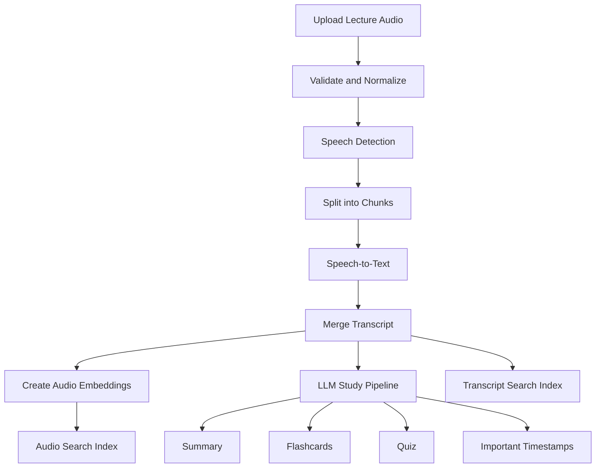
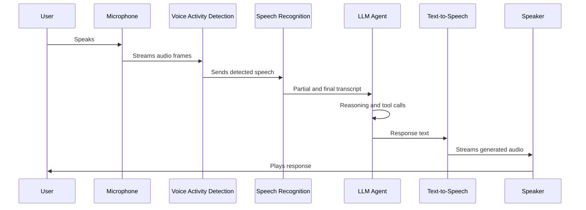
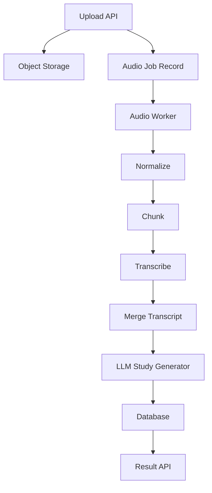

# 007 — Audio Processing

**Course:** 04 — Agents, Multimodal and Tools
**Module:** Module 11 — Multimodal AI
**Content Group:** Modalities
**Roadmap Source:** Multimodal AI / Modalities
**Lesson Type:** Multimodal AI
**Order in Module:** 007
**Suggested Duration:** 22 minutes

---

## 1. Overview

**Audio Processing** enables AI applications to receive, understand, transform, generate, and respond to audio.

Unlike text, raw audio is a continuous signal. Before an AI system can reason about it, the audio usually needs to be:

1. Captured or uploaded.
2. Validated and normalized.
3. Converted into samples, frames, or features.
4. Processed by a specialized audio model.
5. Transformed into text, embeddings, labels, or generated audio.
6. Passed to an LLM or another application component.

Audio processing powers applications such as:

* Speech-to-text transcription
* Voice assistants
* Meeting summarization
* Speaker identification
* Emotion and sentiment detection
* Sound-event recognition
* Audio search
* Podcast summarization
* Pronunciation assessment
* Text-to-speech generation
* Voice-enabled AI agents

For an AI Engineer, audio processing is not only about calling a speech API. A production system must also handle file formats, noise, latency, language, privacy, speaker overlap, hallucinations, model cost, and evaluation.

---

## 2. Learning Objectives

After completing this lesson, you should be able to:

* Explain audio processing in your own words.
* Describe how digital audio is represented.
* Distinguish speech recognition from general audio understanding.
* Design an end-to-end audio AI pipeline.
* Select suitable outputs such as transcripts, embeddings, labels, or synthesized speech.
* Build a small audio-processing API or notebook.
* Identify common production problems and debugging strategies.
* Connect audio processing to LLMs, RAG, agents, safety, cost, and user experience.

---

## 3. What Is Audio Processing?

Audio processing is the collection of techniques used to analyze, transform, understand, or generate sound.

In a multimodal AI application, audio can serve as either an **input modality** or an **output modality**.

### Audio as Input

The system may receive:

* A voice command
* A recorded lecture
* A meeting
* A customer-support call
* A podcast
* Environmental sound
* Music
* A pronunciation exercise

The system can convert that audio into:

* Text
* Speaker segments
* Timestamps
* Acoustic features
* Audio embeddings
* Emotion labels
* Sound-event labels
* Structured metadata

### Audio as Output

The system may generate:

* Spoken answers
* Audiobooks
* Accessibility narration
* Voice notifications
* Language-learning examples
* Conversational agent responses
* Synthetic sound effects

---

## 4. Digital Audio Fundamentals

### 4.1 Waveform

A waveform represents changes in air pressure over time.

After recording, the analog sound wave becomes a sequence of numerical samples.

```text
Sound wave
    ↓
Microphone
    ↓
Analog-to-digital conversion
    ↓
Sequence of numerical samples
```

A simplified audio signal can be represented as:

```python
audio_samples = [
    0.02,
    0.10,
    0.31,
    0.18,
    -0.04,
    -0.21,
]
```

Each number represents the signal amplitude at a specific point in time.

---

### 4.2 Sample Rate

The **sample rate** is the number of audio samples recorded per second.

Common sample rates include:

| Sample rate | Typical use                    |
| ----------: | ------------------------------ |
|    8,000 Hz | Telephone audio                |
|   16,000 Hz | Speech recognition             |
|   22,050 Hz | Lightweight audio applications |
|   44,100 Hz | Music and consumer audio       |
|   48,000 Hz | Professional audio and video   |

A sample rate of 16,000 Hz means that the system stores 16,000 measurements per second.

Higher sample rates preserve more frequency information but increase:

* File size
* Memory usage
* Upload time
* Processing cost

Speech-recognition systems often work well with mono audio at 16 kHz.

---

### 4.3 Bit Depth

Bit depth determines how precisely each sample amplitude is represented.

Examples include:

* 8-bit
* 16-bit
* 24-bit
* 32-bit floating point

Higher bit depth provides greater dynamic range but uses more storage.

For many speech applications, 16-bit audio is sufficient.

---

### 4.4 Channels

Audio may contain one or more channels.

* **Mono:** one channel
* **Stereo:** two channels
* **Multichannel:** more than two channels

Speech AI pipelines often convert stereo recordings into mono unless channel separation is useful.

For example, a call-center recording may place:

* Customer audio in the left channel
* Agent audio in the right channel

In that situation, preserving separate channels can simplify speaker analysis.

---

### 4.5 Audio Formats

Common audio formats include:

| Format | Characteristics                                   |
| ------ | ------------------------------------------------- |
| WAV    | Usually uncompressed, large, easy to process      |
| MP3    | Lossy compression, small file size                |
| FLAC   | Lossless compression                              |
| AAC    | Common in mobile and video systems                |
| OGG    | Open container commonly used for compressed audio |
| M4A    | Common container for AAC or other codecs          |
| WebM   | Common for browser-recorded media                 |

The extension alone does not always identify the codec correctly. Production systems should inspect the actual file metadata.

---

## 5. Major Audio AI Tasks

### 5.1 Automatic Speech Recognition

Automatic Speech Recognition, or **ASR**, converts spoken language into text.

```text
"Schedule a meeting tomorrow morning."
                    ↓
Schedule a meeting tomorrow morning.
```

ASR systems may return more than plain text:

```json
{
  "text": "Schedule a meeting tomorrow morning.",
  "language": "en",
  "confidence": 0.94,
  "segments": [
    {
      "start": 0.0,
      "end": 2.8,
      "text": "Schedule a meeting tomorrow morning."
    }
  ]
}
```

ASR is used in:

* Meeting assistants
* Voice search
* Subtitle generation
* Voice-controlled applications
* Call-center analytics
* Lecture transcription

---

### 5.2 Speech Translation

Speech translation converts speech from one language into text or speech in another language.

```text
Vietnamese speech
        ↓
Speech recognition
        ↓
Vietnamese transcript
        ↓
Translation
        ↓
English text or English speech
```

Some models perform this process directly, while others use separate recognition and translation stages.

---

### 5.3 Speaker Diarization

Speaker diarization answers:

> Who spoke when?

Example:

```text
[00:00–00:05] Speaker A: Welcome to the meeting.
[00:05–00:11] Speaker B: Thank you. Let us review the project.
[00:11–00:15] Speaker A: The first issue is latency.
```

Diarization is important for:

* Meeting summaries
* Interviews
* Podcasts
* Customer-service calls
* Legal recordings

Diarization is different from speaker identification.

* **Diarization:** separates anonymous speakers.
* **Identification:** maps a voice to a known identity.
* **Verification:** checks whether a voice belongs to a claimed person.

---

### 5.4 Voice Activity Detection

Voice Activity Detection, or **VAD**, identifies which audio sections contain speech.

```text
Audio timeline:

Silence | Speech | Silence | Speech | Background noise
```

VAD helps:

* Remove long silent segments
* Reduce transcription cost
* Detect when a user starts or stops speaking
* Build real-time conversational interfaces
* Divide continuous streams into meaningful chunks

---

### 5.5 Sound-Event Classification

Not all audio contains speech.

A model may classify sounds such as:

* Dog barking
* Glass breaking
* Alarm ringing
* Keyboard typing
* Vehicle horn
* Rain
* Footsteps
* Music
* Machinery failure

Example output:

```json
{
  "events": [
    {
      "label": "alarm",
      "start": 4.2,
      "end": 6.9,
      "confidence": 0.91
    }
  ]
}
```

This is useful for:

* Security systems
* Smart homes
* Industrial monitoring
* Accessibility tools
* Wildlife monitoring
* Media indexing

---

### 5.6 Audio Embeddings

An audio embedding is a numerical vector representing the semantic or acoustic properties of an audio segment.

```text
Audio clip
    ↓
Audio encoder
    ↓
[0.12, -0.48, 0.73, ..., 0.06]
```

Embeddings can support:

* Similarity search
* Audio clustering
* Duplicate detection
* Music recommendation
* Sound retrieval
* Multimodal RAG

For example, a user could search an audio archive using:

```text
"Find clips containing applause followed by speech."
```

---

### 5.7 Emotion and Paralinguistic Analysis

Audio contains information beyond words, including:

* Speaking speed
* Pitch
* Volume
* Pauses
* Stress
* Hesitation
* Intonation

Models may attempt to detect states such as:

* Calm
* Angry
* Excited
* Sad
* Frustrated
* Uncertain

However, emotion inference is highly context-dependent and may be unreliable across:

* Languages
* Cultures
* Accents
* Individuals
* Recording environments

Emotion labels should not be treated as objective psychological facts.

---

### 5.8 Text-to-Speech

Text-to-Speech, or **TTS**, converts written text into spoken audio.

```text
"The analysis is complete."
            ↓
Text-to-speech model
            ↓
Generated waveform
```

TTS systems may provide controls for:

* Voice
* Language
* Speaking rate
* Pitch
* Style
* Emotion
* Pronunciation

Applications include:

* Voice assistants
* Screen readers
* Audiobooks
* Language-learning tools
* Navigation systems
* Spoken notifications

---

## 6. Audio Representations for Machine Learning

Raw waveforms may be processed directly, but many systems first transform them into compact representations.

### 6.1 Audio Frames

Long recordings are divided into short overlapping windows called frames.

For example:

```text
Frame length: 25 milliseconds
Frame step:   10 milliseconds
```

This works because speech characteristics change over time, but remain relatively stable within very short windows.

---

### 6.2 Spectrogram

A spectrogram shows how audio frequency content changes over time.

Its axes are usually:

* Horizontal axis: time
* Vertical axis: frequency
* Intensity: signal energy

```text
Waveform
   ↓
Short-time Fourier transform
   ↓
Spectrogram
```

A spectrogram can reveal:

* Speech patterns
* Musical notes
* Noise
* Repeated sounds
* Frequency bands

---

### 6.3 Mel Spectrogram

Human hearing does not perceive frequency linearly.

A Mel spectrogram maps frequencies onto a scale that better approximates human auditory perception.

Many speech and audio models use Mel spectrograms as input.

---

### 6.4 MFCC Features

Mel-Frequency Cepstral Coefficients, or **MFCCs**, are compact features traditionally used in:

* Speech recognition
* Speaker recognition
* Audio classification

Modern deep-learning systems increasingly learn representations directly, but MFCCs remain useful for education and lightweight models.

---

## 7. End-to-End Audio Processing Pipeline

A production audio pipeline may contain the following stages:

```mermaid
flowchart LR
    A[Microphone or Audio File] --> B[Validation]
    B --> C[Decode Audio]
    C --> D[Resample and Normalize]
    D --> E[Noise Reduction or VAD]
    E --> F[Chunking]
    F --> G[Audio Model]
    G --> H[Transcript, Labels or Embeddings]
    H --> I[LLM or Application Logic]
    I --> J[Structured Result]
    J --> K[Text UI, Database or TTS]
```



A simpler conceptual pipeline is:

```text
audio
  → preprocessing
  → specialized audio model
  → transcript or features
  → LLM reasoning
  → structured result
  → optional speech response
```

---

## 8. Pipeline Stage Details

### 8.1 Audio Ingestion

Audio may arrive from:

* File upload
* Browser microphone
* Mobile microphone
* Live phone call
* Video file
* Streaming platform
* Cloud storage
* Messaging application

The ingestion layer should collect metadata such as:

```json
{
  "filename": "lecture_07.m4a",
  "mime_type": "audio/mp4",
  "size_bytes": 14500231,
  "duration_seconds": 1260,
  "sample_rate": 48000,
  "channels": 2
}
```

---

### 8.2 Validation

Before processing, validate:

* File size
* Duration
* Actual codec
* MIME type
* Channel count
* Sample rate
* Whether the file can be decoded
* Whether the file contains audio
* Whether the user is authorized to process it

Example validation rules:

```text
Maximum file size: 100 MB
Maximum duration: 60 minutes
Allowed formats: WAV, MP3, M4A, FLAC, OGG
Minimum duration: 0.5 seconds
```

Never trust only the filename extension.

---

### 8.3 Decoding and Normalization

A normalization stage may:

* Decode compressed audio
* Convert stereo to mono
* Resample to 16 kHz
* Convert samples to 16-bit PCM
* Normalize loudness
* Remove DC offset
* Trim silence

Conceptual command:

```bash
ffmpeg -i input.m4a \
  -ac 1 \
  -ar 16000 \
  -sample_fmt s16 \
  output.wav
```

This converts the input to:

* One channel
* 16 kHz
* 16-bit samples
* WAV output

---

### 8.4 Noise Handling

Recordings may contain:

* Traffic
* Wind
* Music
* Echo
* Keyboard noise
* Other speakers
* Low microphone volume
* Clipping

Noise reduction can improve results, but aggressive processing may remove useful speech information.

Always compare transcription quality before and after denoising.

---

### 8.5 Chunking

Long recordings may exceed model limits or create high latency.

They can be split into chunks such as:

```text
Chunk 1: 00:00–05:00
Chunk 2: 04:50–09:50
Chunk 3: 09:40–14:40
```

The chunks overlap to reduce the risk of cutting words or sentences at boundaries.

A chunking strategy should consider:

* Maximum model input duration
* Silence boundaries
* Speaker turns
* Sentence boundaries
* Overlap duration
* Parallel processing limits

---

### 8.6 Model Inference

The selected audio model may produce:

* Transcript
* Translation
* Language
* Timestamps
* Speaker segments
* Sound labels
* Embeddings
* Confidence scores

A system should retain raw model output for debugging when privacy policies allow it.

---

### 8.7 Post-Processing

ASR output often needs additional processing:

* Punctuation restoration
* Capitalization
* Number formatting
* Filler-word removal
* Timestamp alignment
* Duplicate removal between chunks
* Profanity handling
* Domain-term correction
* Speaker-label merging

Example:

```text
Raw:
we launched version two point one on july fifth um and errors fell twelve percent

Processed:
We launched version 2.1 on July 5, and errors fell by 12%.
```

The system should distinguish between:

* Correcting obvious formatting
* Rewriting the speaker's meaning

For legal, medical, or compliance use cases, aggressive rewriting can be dangerous.

---

### 8.8 LLM Reasoning

After transcription, an LLM can perform tasks such as:

* Summarization
* Question answering
* Topic extraction
* Action-item extraction
* Flashcard generation
* Quiz generation
* Sentiment analysis
* Structured information extraction

Example prompt:

```text
You are processing a lecture transcript.

Tasks:
1. Produce a concise summary.
2. Extract five key concepts.
3. Create five flashcards.
4. Create three multiple-choice questions.
5. Preserve uncertainty where the transcript is unclear.

Return valid JSON.
```

---

## 9. Multimodal Study Assistant Example

The related project is a study assistant that accepts:

* Images
* PDFs
* Audio recordings

For an audio lecture, the application could perform:



The final result might look like:

```json
{
  "title": "Introduction to Neural Networks",
  "language": "en",
  "duration_seconds": 1842,
  "summary": "The lecture introduces neurons, layers, activation functions, and gradient descent.",
  "key_topics": [
    "Artificial neurons",
    "Network layers",
    "Activation functions",
    "Loss functions",
    "Backpropagation"
  ],
  "important_segments": [
    {
      "start": 312.4,
      "end": 370.8,
      "topic": "Backpropagation explanation"
    }
  ],
  "flashcards": [
    {
      "front": "What is an activation function?",
      "back": "A function that introduces non-linearity into a neural network."
    }
  ]
}
```

---

## 10. Basic API Design

A simple API might provide the following endpoint:

```http
POST /api/v1/audio/process
```

Request:

```text
multipart/form-data

file: lecture.mp3
task: study_notes
language: auto
speaker_diarization: true
```

Response:

```json
{
  "job_id": "audio_job_8f23",
  "status": "completed",
  "audio": {
    "duration_seconds": 605.2,
    "detected_language": "en"
  },
  "transcript": {
    "text": "Today we will discuss retrieval-augmented generation...",
    "segments": []
  },
  "result": {
    "summary": "The lecture explains the main components of RAG.",
    "flashcards": [],
    "quiz": []
  }
}
```

---

## 11. Simplified Python Example

The following example shows the structure of an audio-processing service without depending on a specific AI provider.

```python
from dataclasses import dataclass
from pathlib import Path
from typing import Any


@dataclass
class AudioMetadata:
    duration_seconds: float
    sample_rate: int
    channels: int
    format: str


class AudioValidationError(ValueError):
    """Raised when an uploaded audio file is invalid."""


def validate_audio(
    file_path: Path,
    metadata: AudioMetadata,
    max_size_mb: int = 100,
    max_duration_seconds: int = 3600,
) -> None:
    if not file_path.exists():
        raise AudioValidationError("Audio file does not exist.")

    size_mb = file_path.stat().st_size / (1024 * 1024)

    if size_mb > max_size_mb:
        raise AudioValidationError(
            f"File size exceeds the {max_size_mb} MB limit."
        )

    if metadata.duration_seconds <= 0:
        raise AudioValidationError("Audio duration must be greater than zero.")

    if metadata.duration_seconds > max_duration_seconds:
        raise AudioValidationError(
            f"Audio duration exceeds {max_duration_seconds} seconds."
        )

    if metadata.channels not in {1, 2}:
        raise AudioValidationError("Only mono or stereo audio is supported.")


def normalize_audio(input_path: Path, output_path: Path) -> Path:
    """
    Convert audio to a normalized format.

    A production implementation could use FFmpeg to convert the file
    to mono, 16 kHz, 16-bit PCM WAV.
    """
    if input_path == output_path:
        raise ValueError("Input and output paths must be different.")

    # Placeholder for an audio conversion command.
    output_path.write_bytes(input_path.read_bytes())

    return output_path


def split_audio(
    duration_seconds: float,
    chunk_size_seconds: float = 300,
    overlap_seconds: float = 10,
) -> list[tuple[float, float]]:
    if chunk_size_seconds <= overlap_seconds:
        raise ValueError("Chunk size must be larger than overlap.")

    chunks: list[tuple[float, float]] = []
    start = 0.0

    while start < duration_seconds:
        end = min(start + chunk_size_seconds, duration_seconds)
        chunks.append((start, end))

        if end >= duration_seconds:
            break

        start = end - overlap_seconds

    return chunks


def transcribe_chunk(
    audio_path: Path,
    start: float,
    end: float,
) -> dict[str, Any]:
    """
    Send one audio chunk to an ASR model.

    This placeholder represents a provider SDK call or a local model.
    """
    return {
        "start": start,
        "end": end,
        "text": f"Transcript for {start:.1f}-{end:.1f} seconds.",
        "confidence": 0.93,
    }


def process_audio(
    file_path: Path,
    metadata: AudioMetadata,
) -> dict[str, Any]:
    validate_audio(file_path, metadata)

    normalized_path = file_path.with_name(
        f"{file_path.stem}_normalized.wav"
    )
    normalize_audio(file_path, normalized_path)

    chunk_ranges = split_audio(metadata.duration_seconds)

    segments = [
        transcribe_chunk(normalized_path, start, end)
        for start, end in chunk_ranges
    ]

    transcript = " ".join(segment["text"] for segment in segments)

    return {
        "metadata": metadata.__dict__,
        "segments": segments,
        "transcript": transcript,
    }
```

Example usage:

```python
from pathlib import Path


metadata = AudioMetadata(
    duration_seconds=620.0,
    sample_rate=48000,
    channels=2,
    format="m4a",
)

result = process_audio(
    Path("lecture.m4a"),
    metadata,
)

print(result["transcript"])
```

---

## 12. Real-Time Voice Agent Architecture

A real-time voice agent introduces additional requirements.



Real-time systems must handle:

* Partial transcripts
* Streaming audio
* Turn detection
* Interruptions
* Network delay
* Audio buffering
* Echo cancellation
* User barge-in
* Incremental text-to-speech
* Tool-call latency

### Barge-In

Barge-in occurs when the user starts speaking while the AI is still talking.

A well-designed agent should:

1. Detect new speech.
2. Stop or reduce audio playback.
3. Cancel the current generated response when appropriate.
4. Process the new user request.
5. Preserve relevant conversational context.

---

## 13. Audio and RAG

Audio can be integrated into a Retrieval-Augmented Generation system.

### Transcript-Based RAG

The most common method is:

```text
Audio
  → transcription
  → transcript chunks
  → text embeddings
  → vector database
  → retrieval
  → LLM answer
```

Example query:

```text
What did the lecturer say about vector-database filtering?
```

The system retrieves transcript sections related to that topic.

---

### Timestamp-Aware Retrieval

Each chunk should retain timestamps:

```json
{
  "text": "Metadata filtering reduces the candidate search space.",
  "start_seconds": 523.8,
  "end_seconds": 548.2,
  "source_id": "lecture_03"
}
```

The user can then jump directly to the relevant audio section.

---

### Audio-Embedding RAG

Some applications store both:

* Text embeddings from transcripts
* Audio embeddings from original sound

This supports queries involving acoustic information, such as:

```text
Find the part where the speaker sounded uncertain.
```

or:

```text
Find a clip with applause followed by an announcement.
```

---

## 14. Audio Processing as an Agent Tool

An AI agent can expose audio processing as a tool.

Example tool definition:

```json
{
  "name": "analyze_audio",
  "description": "Transcribe and analyze an audio file.",
  "parameters": {
    "type": "object",
    "properties": {
      "audio_file_id": {
        "type": "string"
      },
      "task": {
        "type": "string",
        "enum": [
          "transcribe",
          "summarize",
          "extract_actions",
          "create_flashcards",
          "identify_sounds"
        ]
      },
      "language": {
        "type": "string"
      }
    },
    "required": [
      "audio_file_id",
      "task"
    ]
  }
}
```

The agent workflow may be:

```text
User request
    ↓
Agent decides audio analysis is required
    ↓
Agent calls analyze_audio
    ↓
Tool returns transcript and metadata
    ↓
Agent performs reasoning
    ↓
Agent returns answer with timestamps
```

The agent should not claim to have listened to the audio unless the tool call completed successfully.

---

## 15. Evaluation

Audio systems require evaluation at several levels.

### 15.1 Speech Recognition Metrics

#### Word Error Rate

Word Error Rate, or **WER**, measures transcription errors.

[
WER = \frac{S + D + I}{N}
]

Where:

* (S): substitutions
* (D): deletions
* (I): insertions
* (N): number of words in the reference transcript

Example:

```text
Reference:  the model processes audio signals
Prediction: the model process audio signal
```

The prediction contains word-form errors that increase WER.

Lower WER is generally better.

However, WER does not fully measure:

* Meaning preservation
* Punctuation quality
* Timestamp accuracy
* Speaker attribution
* Domain-term accuracy

---

### 15.2 Character Error Rate

Character Error Rate is useful for languages where word boundaries are less reliable or when spelling accuracy is important.

[
CER = \frac{S_c + D_c + I_c}{N_c}
]

---

### 15.3 Diarization Error Rate

Diarization Error Rate measures errors such as:

* Missed speech
* False speech detection
* Speaker confusion

A transcript may contain correct words but assign them to the wrong speaker.

---

### 15.4 Event Classification Metrics

For sound-event detection, use:

* Precision
* Recall
* F1 score
* Accuracy
* Mean average precision
* False-positive rate

Evaluation should be performed on realistic recordings rather than clean benchmark audio only.

---

### 15.5 End-to-End Task Evaluation

For a study assistant, transcription quality is only one part of the system.

You should also evaluate:

* Summary faithfulness
* Flashcard correctness
* Quiz quality
* Timestamp relevance
* Citation accuracy
* Processing latency
* Cost per audio minute
* User satisfaction

---

## 16. Production Challenges

### 16.1 Background Noise

**Symptom:** The transcript contains incorrect or missing words.

**Possible causes:**

* Traffic
* Music
* Echo
* Low microphone quality
* Multiple simultaneous speakers

**Debugging steps:**

1. Listen to the problematic segment.
2. Inspect the waveform and loudness.
3. Compare raw and denoised audio.
4. Test another ASR configuration.
5. Add VAD or channel separation.
6. Record the model output with timestamps.

---

### 16.2 Hallucinated Speech

Some speech-recognition systems may produce text during:

* Silence
* Music
* Static noise
* Repeated background sounds

Example failure:

```text
Audio: ten seconds of silence
Output: "Thank you for watching."
```

Mitigations include:

* Voice Activity Detection
* Minimum speech-duration rules
* Confidence thresholds
* Silence filtering
* Repetition detection
* Cross-checking output against acoustic activity

---

### 16.3 Chunk Boundary Errors

**Symptom:** Words disappear or repeat between chunks.

Example:

```text
Chunk 1: "The next topic is retrieval..."
Chunk 2: "...retrieval augmented generation."
```

Possible solutions:

* Add overlap
* Split at silence
* Preserve timestamps
* Deduplicate repeated phrases
* Merge chunks using alignment logic

---

### 16.4 Domain Vocabulary Errors

General speech models may struggle with:

* Medical terms
* Product names
* Personal names
* Technical abbreviations
* Source-code identifiers

Possible solutions:

* Supply domain vocabulary
* Add a glossary
* Perform constrained post-processing
* Use context from documents
* Ask an LLM to suggest corrections without silently replacing uncertain terms

Example:

```json
{
  "raw_text": "We use cuber net ease.",
  "corrected_text": "We use Kubernetes.",
  "correction_confidence": 0.86
}
```

---

### 16.5 Speaker Overlap

When several people speak simultaneously:

* Words may be lost
* Speaker labels may be incorrect
* Sentences may be merged

Possible solutions include:

* Separate microphone channels
* Source separation
* Better diarization
* Meeting-recording guidelines
* Marking overlapping segments as uncertain

---

### 16.6 Incorrect Language Detection

Short audio clips or multilingual conversations may confuse automatic language detection.

Mitigations:

* Let the user select a language
* Detect language per segment
* Require more speech before detection
* Preserve multilingual text
* Avoid translating unless requested

---

### 16.7 Excessive Latency

Latency can come from:

* Large uploads
* Audio conversion
* Long model inference
* Sequential chunk processing
* Diarization
* LLM summarization
* Text-to-speech generation

Track each stage separately:

```json
{
  "upload_ms": 840,
  "decode_ms": 420,
  "transcription_ms": 6200,
  "diarization_ms": 2800,
  "llm_ms": 1900,
  "total_ms": 12160
}
```

Without stage-level metrics, optimization becomes guesswork.

---

## 17. Privacy and Safety

Audio can contain highly sensitive information, including:

* Names
* Voice identity
* Addresses
* Financial information
* Health information
* Private conversations
* Workplace discussions
* Background conversations from people who did not consent

A production system should define:

* Whether recordings are stored
* How long recordings are retained
* Who can access them
* Whether transcripts are encrypted
* Whether audio is sent to external providers
* Whether users can delete their data
* Whether model training uses uploaded content
* How consent is collected

### Voice Biometrics

Voice identity can function as biometric information.

Systems using speaker verification or voice cloning require stronger controls than ordinary transcription.

### Voice Cloning Risks

Generated voices may be used for:

* Impersonation
* Fraud
* False evidence
* Misleading media
* Unauthorized replication of a person's voice

Responsible applications should include:

* Consent verification
* Access controls
* Usage logging
* Abuse detection
* Clear disclosure of synthetic audio
* Restrictions on protected or unauthorized voices

---

## 18. Cost Considerations

Audio cost is often related to:

* Duration
* Model size
* Number of processing stages
* Real-time versus batch inference
* Diarization
* Translation
* Text-to-speech generation
* Storage and bandwidth

Approximate cost model:

[
TotalCost =
TranscriptionCost +
DiarizationCost +
LLMCost +
TTSCost +
StorageCost
]

For a study assistant:

```text
60-minute lecture
    ↓
Transcription
    ↓
Transcript chunk embeddings
    ↓
Summary generation
    ↓
Flashcard generation
    ↓
Quiz generation
```

The application should avoid repeating expensive stages.

For example:

* Cache transcripts.
* Cache embeddings.
* Regenerate only changed outputs.
* Reuse transcript chunks for multiple study tasks.
* Skip silence before transcription.
* Use smaller models for simple classification tasks.

---

## 19. User Experience Considerations

Audio processing often takes longer than text processing.

A good interface should show meaningful progress:

```text
Uploading audio...
Preparing recording...
Transcribing 3 of 8 sections...
Identifying speakers...
Creating study notes...
Completed.
```

Useful UX features include:

* Upload progress
* Processing-stage indicators
* Cancel button
* Transcript preview
* Timestamp navigation
* Editable speaker names
* Transcript correction
* Retry for failed sections
* Original-audio playback
* Confidence or uncertainty indicators

Avoid presenting an uncertain transcript as perfectly accurate.

---

## 20. Observability and Logging

Recommended metadata to log:

```json
{
  "request_id": "req_92f2",
  "audio_duration_seconds": 1204,
  "input_format": "m4a",
  "input_sample_rate": 48000,
  "normalized_sample_rate": 16000,
  "chunk_count": 5,
  "detected_language": "en",
  "speaker_count": 3,
  "transcription_latency_ms": 17420,
  "llm_latency_ms": 2420,
  "status": "completed"
}
```

Do not log full transcripts or raw audio by default when they may contain private information.

Useful metrics include:

* Processing time per audio minute
* Failure rate
* Average WER on test data
* Empty transcript rate
* Language-detection error rate
* Speaker-confusion rate
* Average cost per request
* Chunk retry rate
* Real-time response latency

---

## 21. Common Mistakes

### Mistake 1: Treating Audio Like Text

Audio requires preprocessing, decoding, timing, and acoustic-quality checks.

A text-only error-handling strategy is not sufficient.

---

### Mistake 2: Trusting the File Extension

A file named `recording.mp3` may not contain valid MP3 audio.

Inspect the actual container and codec.

---

### Mistake 3: Processing Long Audio as One Block

This may cause:

* Memory errors
* Timeout failures
* High latency
* Lost progress
* Model input-limit errors

Use chunking and resumable processing.

---

### Mistake 4: Ignoring Timestamps

A transcript without timestamps is less useful for:

* Search
* Citation
* Debugging
* Audio playback
* Speaker analysis

Preserve time metadata throughout the pipeline.

---

### Mistake 5: Silently Rewriting the Transcript

An LLM may produce a cleaner transcript while changing the meaning.

Store separate fields:

```json
{
  "raw_transcript": "...",
  "clean_transcript": "...",
  "summary": "..."
}
```

---

### Mistake 6: Assuming Speaker Labels Are Correct

Diarization labels such as `Speaker 1` and `Speaker 2` are predictions.

Allow users to rename or correct speakers.

---

### Mistake 7: Evaluating Only Clean Audio

Test with:

* Background noise
* Different microphones
* Weak internet
* Accents
* Fast speech
* Quiet speech
* Multiple speakers
* Music
* Short recordings
* Very long recordings

---

### Mistake 8: Ignoring Privacy

Audio may capture people who did not intend to interact with the application.

Use consent, deletion, retention, and access-control policies.

---

## 22. Practical Exercise

Build a small **Lecture Audio Processor**.

### Requirements

The application should:

1. Accept an audio file.
2. Validate the format and duration.
3. Normalize it to mono 16 kHz audio.
4. Split it into overlapping chunks.
5. Generate a transcript with timestamps.
6. Produce:

   * A summary
   * Five key concepts
   * Five flashcards
   * Three quiz questions
7. Save the transcript and structured output.
8. Return useful errors when processing fails.

### Suggested Architecture



### Suggested Database Record

```json
{
  "id": "audio_001",
  "status": "completed",
  "source_file": "lecture.mp3",
  "duration_seconds": 1420,
  "language": "en",
  "transcript_uri": "transcripts/audio_001.json",
  "result_uri": "results/audio_001.json",
  "created_at": "2026-07-28T12:00:00Z"
}
```

---

## 23. Production Failure Exercise

Consider this failure:

> A 45-minute lecture is successfully uploaded, but the final transcript repeats several sentences and the summary mentions a concept that was never discussed.

### Possible Causes

* Overlapping chunks were merged incorrectly.
* The ASR model hallucinated text during silence.
* The LLM summarized duplicated transcript sections.
* Chunk order was incorrect.
* A previous transcript was returned from an incorrect cache key.
* The prompt did not require evidence from the transcript.

### Debugging Plan

1. Check chunk timestamps and ordering.
2. Compare raw chunk transcripts with merged output.
3. Identify duplicated overlap text.
4. Inspect silence regions for hallucinated speech.
5. Verify that the cache key includes the audio file identity.
6. Ask the summarizer to cite transcript segment IDs.
7. Reject unsupported claims during post-processing.

### Safer Summary Format

```json
{
  "claim": "The lecture introduces contrastive learning.",
  "evidence_segments": [
    {
      "start": 742.2,
      "end": 810.4
    }
  ]
}
```

If no supporting segment exists, the claim should not appear in the final summary.

---

## 24. Completion Checklist

* [ ] I can explain Audio Processing in one or two minutes.
* [ ] I understand sample rate, bit depth, channels, and audio formats.
* [ ] I can distinguish ASR, diarization, VAD, audio classification, and TTS.
* [ ] I can design an audio ingestion and preprocessing pipeline.
* [ ] I know why long audio should be chunked.
* [ ] I preserve timestamps and speaker information.
* [ ] I can connect audio processing to an LLM or RAG pipeline.
* [ ] I can define at least one useful evaluation metric.
* [ ] I understand common errors involving noise, silence, overlap, and hallucinations.
* [ ] I have considered privacy, consent, retention, and voice-cloning risks.
* [ ] I have built or designed a small practical demo.
* [ ] I have documented at least one limitation or open question.

---

## 25. Key Takeaways

1. Audio processing converts sound into transcripts, features, embeddings, labels, or generated speech.

2. Audio requires its own preprocessing pipeline involving decoding, resampling, normalization, voice detection, and chunking.

3. Speech recognition is only one audio task. Other important tasks include diarization, sound classification, embeddings, translation, and text-to-speech.

4. LLMs usually operate after specialized audio models have converted audio into text or structured features.

5. Long recordings should be processed incrementally while preserving timestamps and chunk relationships.

6. Audio output must be evaluated for transcription accuracy, speaker assignment, latency, cost, and end-task quality.

7. Production systems must handle noise, silence, speaker overlap, multilingual speech, file corruption, privacy, and model hallucinations.

8. A reliable multimodal application preserves uncertainty instead of presenting every transcript or inferred label as certain.

---

## 26. Summary

**Audio Processing** extends AI applications beyond text by allowing them to understand and generate sound.

A complete audio AI workflow may include:

```text
Audio input
    → validation
    → decoding and normalization
    → voice detection
    → chunking
    → speech or audio model
    → transcript, labels, or embeddings
    → LLM reasoning
    → structured output
    → optional text-to-speech response
```

For an AI Engineer, the goal is not merely to transcribe an audio file. The goal is to build a reliable system that manages audio quality, timing, privacy, model limitations, latency, cost, evaluation, and user experience.

Turn this lesson into a portfolio artifact such as:

* An audio-transcription API
* A meeting-summary agent
* A lecture-to-flashcards application
* A voice-enabled assistant
* An audio RAG search system
* A pronunciation-evaluation tool
* A real-time conversational agent

---

# Bài luyện tập

## Mục tiêu


## Đề bài


## Yêu cầu hoàn thành

- [ ] 
- [ ] 
- [ ] 

## Kết quả / lời giải


## Ghi chú
