# 008 — Text-to-Speech

**Course:** 04 — Agents, Multimodal, and Tools
**Module:** Module 11 — Multimodal AI
**Content Group:** Modalities
**Roadmap Source:** Multimodal AI / Modalities
**Lesson Type:** Multimodal AI
**Lesson Order:** 008
**Suggested Duration:** 22 minutes

---

## 1. Lesson Summary

**Text-to-Speech**, usually abbreviated as **TTS**, is the process of converting written text into spoken audio.

In a modern AI application, an LLM may generate a textual response, while a TTS model transforms that response into natural-sounding speech. This allows an AI system to communicate through voice instead of displaying text only.

Text-to-Speech is commonly used in:

* Voice assistants
* Accessibility tools
* Language-learning applications
* Audiobook generation
* Customer-support systems
* Navigation applications
* Game characters and virtual avatars
* Multimodal AI agents
* Real-time conversational interfaces

A production-ready TTS system requires more than a good voice model. Engineers must also consider latency, pronunciation, streaming, user consent, content safety, cost, language support, and audio storage.

---

## 2. Learning Objectives

After completing this lesson, you should be able to:

* Explain Text-to-Speech in your own words.
* Describe where TTS appears in a multimodal AI workflow.
* Identify the main components of a TTS system.
* Compare batch and streaming speech generation.
* Build a small application that converts text into audio.
* Integrate TTS into an LLM or AI-agent workflow.
* Recognize common production risks and debugging strategies.
* Evaluate voice quality, latency, cost, and safety.

---

## 3. What Is Text-to-Speech?

Text-to-Speech is a technology that receives text as input and produces an audio waveform containing spoken language.

```text
Input text:
"Your meeting begins in fifteen minutes."

Output:
An audio file or audio stream containing the spoken sentence.
```

A simplified TTS function can be represented as:

[
audio = TTS(text, voice, language, speaking_style)
]

The output may be:

* A WAV file
* An MP3 file
* An AAC or Opus stream
* Raw PCM audio
* Audio chunks streamed to a browser or mobile device

---

## 4. Text-to-Speech in a Multimodal System

TTS is usually the final output stage of a voice-based AI application.

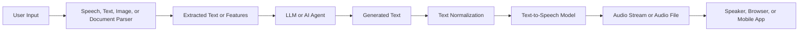

For example, a multimodal study assistant may:

1. Receive a PDF.
2. Extract the document text.
3. Generate a summary with an LLM.
4. Convert the summary into spoken audio.
5. Play the audio to the learner.

```text
PDF
  ↓
Document parser
  ↓
Extracted content
  ↓
LLM summary
  ↓
TTS generation
  ↓
Spoken lesson
```

---

## 5. Core TTS Pipeline

A complete TTS system normally contains several processing stages.

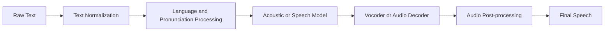

### 5.1 Text Normalization

Text normalization converts written text into a form that can be spoken correctly.

Examples:

```text
Original: The price is $49.99.
Normalized: The price is forty-nine dollars and ninety-nine cents.

Original: The meeting starts at 8:30 a.m.
Normalized: The meeting starts at eight thirty A M.

Original: Dr. Smith lives at 25 King St.
Normalized: Doctor Smith lives at twenty-five King Street.
```

Normalization must handle:

* Numbers
* Dates
* Times
* Currency
* Abbreviations
* Units of measurement
* Phone numbers
* Email addresses
* URLs
* Mathematical notation
* Product codes
* Domain-specific terminology

Poor text normalization can make a high-quality voice model sound incorrect.

---

### 5.2 Language and Pronunciation Processing

The system determines how words should be pronounced.

This stage may include:

* Language detection
* Tokenization
* Grapheme-to-phoneme conversion
* Pronunciation dictionary lookup
* Stress prediction
* Syllable detection
* Pausing and phrasing
* Code-switching detection

A **phoneme** is a small sound unit used in spoken language.

For example:

```text
Written word: AI
Spoken form: A I

Written word: SQL
Possible forms:
- S Q L
- sequel
```

The correct pronunciation depends on the application and user preference.

---

### 5.3 Speech Generation Model

The main speech model predicts how the text should sound.

It may control:

* Voice identity
* Rhythm
* Intonation
* Emotion
* Speaking speed
* Pitch
* Pauses
* Emphasis
* Accent
* Speaking style

Modern systems may generate speech directly or produce an intermediate acoustic representation before decoding it into audio.

---

### 5.4 Vocoder or Audio Decoder

A vocoder or audio decoder converts the model's internal representation into an audio waveform.

The final waveform contains the sound samples that can be:

* Played through a speaker
* Saved as an audio file
* Streamed over a network
* Processed by another audio tool

---

### 5.5 Audio Post-processing

After speech generation, the application may apply:

* Loudness normalization
* Silence trimming
* Noise reduction
* Sample-rate conversion
* Audio compression
* Fade-in and fade-out
* Chunk concatenation
* Metadata insertion

Post-processing improves consistency across devices and voices.

---

## 6. Important TTS Concepts

### 6.1 Voice

A voice defines the general vocal identity of the generated speech.

A voice may differ by:

* Perceived age
* Pitch
* Accent
* Speaking style
* Language
* Expressiveness
* Formality
* Energy level

Applications should not assume that every voice supports every language equally well.

---

### 6.2 Prosody

**Prosody** describes how speech sounds beyond individual words.

It includes:

* Rhythm
* Stress
* Intonation
* Pitch movement
* Pauses
* Speaking rate
* Emotional expression

Compare:

```text
"You finished the project."
```

The same sentence can sound like:

* A neutral statement
* A surprised question
* An angry accusation
* An excited compliment

The words remain the same, but the prosody changes the meaning.

---

### 6.3 Speaking Rate

Speaking rate controls how quickly the text is spoken.

Typical use cases:

* Slower speech for language learners
* Normal speed for assistants
* Faster speech for long summaries
* Carefully paced speech for accessibility applications

Extremely high or low speeds may reduce naturalness and intelligibility.

---

### 6.4 Pitch

Pitch refers to how high or low a voice sounds.

Pitch adjustments can communicate:

* Emotion
* Question patterns
* Emphasis
* Character identity
* Speaking style

Large artificial pitch changes may create distorted or unnatural audio.

---

### 6.5 Voice Cloning

Voice cloning attempts to reproduce the vocal characteristics of a particular speaker from reference audio.

Possible applications include:

* Personalized accessibility tools
* Authorized character voices
* Dubbing
* Localization
* Voice restoration
* Creative media

However, voice cloning introduces serious risks:

* Impersonation
* Fraud
* Unauthorized use
* Misleading recordings
* Identity abuse
* Consent violations

A production system should require explicit permission and maintain records proving that the voice owner authorized its use.

---

## 7. Batch TTS vs. Streaming TTS

### 7.1 Batch TTS

Batch TTS generates the entire audio result before returning it to the user.

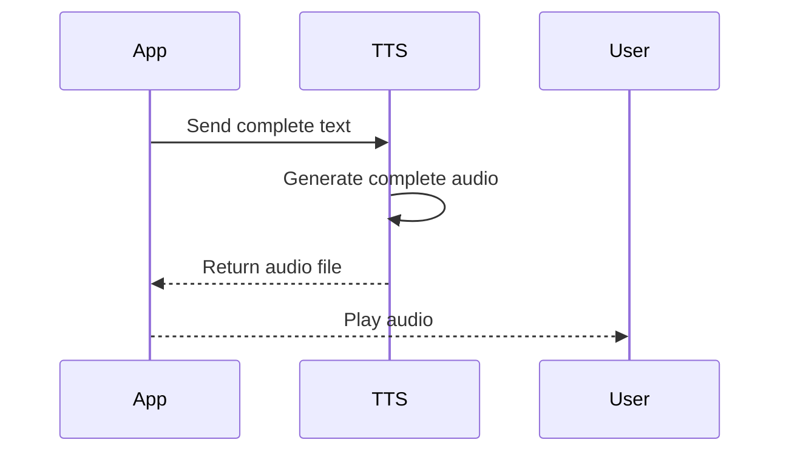

Batch TTS is suitable for:

* Audiobooks
* Podcasts
* Pre-generated lessons
* Voice notifications
* Downloadable audio
* Offline playback

Advantages:

* Simple implementation
* Easy audio caching
* Consistent output
* Easy file storage

Disadvantages:

* Longer waiting time
* High memory use for long content
* Poor experience for real-time conversations

---

### 7.2 Streaming TTS

Streaming TTS returns audio chunks while the model is still generating the remaining speech.

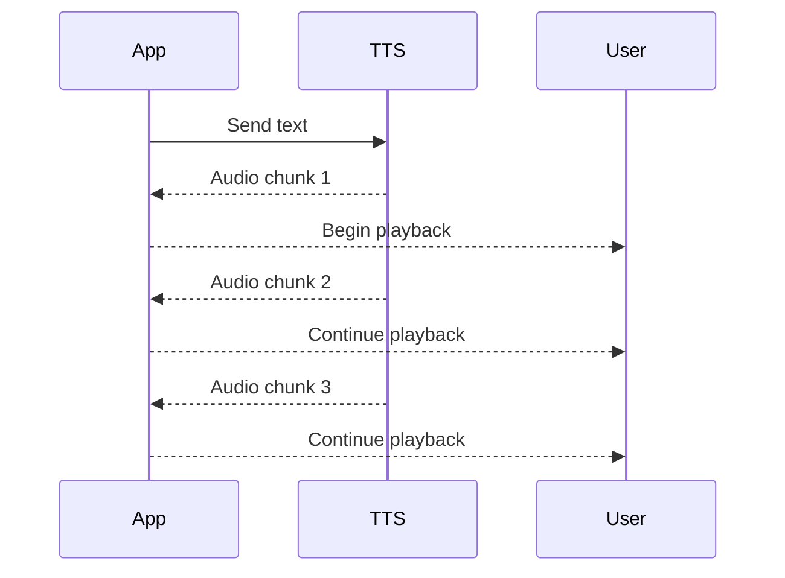

Streaming TTS is suitable for:

* Voice assistants
* Real-time AI agents
* Customer-support bots
* Interactive tutoring
* Game characters
* Live translation

Advantages:

* Lower time to first audio
* More natural conversational experience
* Users hear the response before full generation completes

Disadvantages:

* More complex networking
* Audio chunks must be played smoothly
* Errors may occur after playback has already started
* Text changes are difficult after audio generation begins

---

## 8. Latency in Voice Applications

Latency is one of the most important TTS metrics.

The total response time may include:

[
T_{total} =
T_{input}

* T_{LLM}
* T_{TTS-first-chunk}
* T_{network}
* T_{playback-buffer}
  ]

Where:

* (T_{input}): time required to process the user's input
* (T_{LLM}): time required to generate the response
* (T_{TTS-first-chunk}): time required to produce the first audio chunk
* (T_{network}): network transmission time
* (T_{playback-buffer}): buffering time before audio playback

For a real-time assistant, engineers should optimize **time to first audio**, not only total generation time.

---

## 9. Chunking Long Text

Long documents should not always be sent to a TTS model as one large request.

A better workflow is:

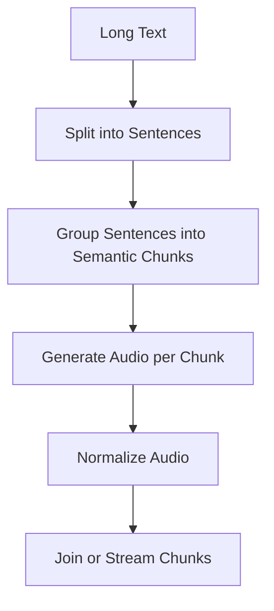

Good chunk boundaries include:

* Sentence endings
* Paragraph boundaries
* Section headings
* Natural pauses
* Dialogue turns

Avoid splitting:

* In the middle of a word
* Between a number and its unit
* Inside an abbreviation
* Between a person's title and name
* Inside a quoted sentence

Example:

```python
def split_for_tts(text: str, max_characters: int = 500) -> list[str]:
    sentences = text.replace("!", ".").replace("?", ".").split(".")
    chunks: list[str] = []
    current = ""

    for sentence in sentences:
        sentence = sentence.strip()

        if not sentence:
            continue

        candidate = f"{current} {sentence}.".strip()

        if len(candidate) <= max_characters:
            current = candidate
        else:
            if current:
                chunks.append(current)

            current = f"{sentence}."

    if current:
        chunks.append(current)

    return chunks
```

A production implementation should use a language-aware sentence tokenizer instead of punctuation replacement alone.

---

## 10. Basic TTS API Design

A simple API route may receive text and return an audio file.

### Example request

```http
POST /api/v1/speech
Content-Type: application/json
```

```json
{
  "text": "Welcome to the multimodal AI course.",
  "voice": "neutral_teacher",
  "language": "en-US",
  "format": "mp3",
  "speed": 1.0
}
```

### Example response

```http
HTTP/1.1 200 OK
Content-Type: audio/mpeg
Content-Disposition: inline; filename="speech.mp3"
```

---

## 11. Provider-Neutral Python Example

The following example uses a provider-neutral interface so that the application is not tightly coupled to one TTS service.

```python
from dataclasses import dataclass
from typing import Literal, Protocol


AudioFormat = Literal["mp3", "wav", "opus"]


@dataclass(frozen=True)
class SpeechRequest:
    text: str
    voice: str
    language: str = "en-US"
    audio_format: AudioFormat = "mp3"
    speed: float = 1.0


@dataclass(frozen=True)
class SpeechResult:
    audio_bytes: bytes
    content_type: str
    duration_seconds: float | None = None


class TTSProvider(Protocol):
    def synthesize(self, request: SpeechRequest) -> SpeechResult:
        """Convert text into speech."""
        ...


class SpeechService:
    def __init__(self, provider: TTSProvider) -> None:
        self.provider = provider

    def generate(self, request: SpeechRequest) -> SpeechResult:
        text = request.text.strip()

        if not text:
            raise ValueError("Text must not be empty.")

        if len(text) > 5_000:
            raise ValueError("Text exceeds the maximum request size.")

        if not 0.5 <= request.speed <= 2.0:
            raise ValueError("Speed must be between 0.5 and 2.0.")

        normalized_request = SpeechRequest(
            text=text,
            voice=request.voice,
            language=request.language,
            audio_format=request.audio_format,
            speed=request.speed,
        )

        return self.provider.synthesize(normalized_request)
```

This design makes it easier to:

* Replace the TTS provider
* Add fallback providers
* Mock speech generation during tests
* Compare model quality
* Implement retries and circuit breakers
* Track cost and latency consistently

---

## 12. FastAPI Route Example

```python
from typing import Literal

from fastapi import FastAPI, HTTPException, Response
from pydantic import BaseModel, Field


app = FastAPI()


class TTSRequestBody(BaseModel):
    text: str = Field(min_length=1, max_length=5_000)
    voice: str = Field(default="neutral_teacher")
    language: str = Field(default="en-US")
    audio_format: Literal["mp3", "wav", "opus"] = "mp3"
    speed: float = Field(default=1.0, ge=0.5, le=2.0)


CONTENT_TYPES = {
    "mp3": "audio/mpeg",
    "wav": "audio/wav",
    "opus": "audio/ogg",
}


@app.post("/api/v1/speech")
def create_speech(body: TTSRequestBody) -> Response:
    try:
        # Replace this placeholder with a real provider implementation.
        audio_bytes = synthesize_with_provider(
            text=body.text,
            voice=body.voice,
            language=body.language,
            audio_format=body.audio_format,
            speed=body.speed,
        )

        return Response(
            content=audio_bytes,
            media_type=CONTENT_TYPES[body.audio_format],
            headers={
                "Content-Disposition": (
                    f'inline; filename="speech.{body.audio_format}"'
                )
            },
        )

    except ProviderTimeoutError as exc:
        raise HTTPException(
            status_code=504,
            detail="The speech provider timed out.",
        ) from exc

    except UnsupportedVoiceError as exc:
        raise HTTPException(
            status_code=400,
            detail="The selected voice is not supported.",
        ) from exc

    except Exception as exc:
        raise HTTPException(
            status_code=500,
            detail="Speech generation failed.",
        ) from exc
```

The placeholder functions and exceptions must be implemented for the selected provider.

---

## 13. Integrating TTS with an LLM

An LLM response should usually be prepared before being passed to the TTS model.

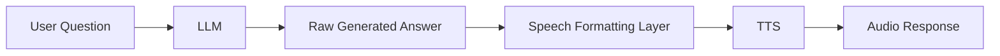

The speech formatting layer may:

* Remove Markdown symbols
* Replace URLs with readable descriptions
* Expand abbreviations
* Convert tables into spoken summaries
* Remove citations that should not be read aloud
* Insert pauses
* Shorten overly long responses
* Convert symbols into natural language

Example:

```text
Raw LLM response:
## Result
The answer is **42**. See https://example.com/docs.

Speech-ready response:
The answer is forty-two. You can find more information in the documentation.
```

---

## 14. Preparing Markdown for Speech

Passing raw Markdown directly to a TTS service may produce poor results.

### Input

```markdown
## Key Findings

- Accuracy increased by 12%.
- Latency decreased from 800 ms to 420 ms.
- Read more at https://example.com/report.
```

### Speech-ready version

```text
Here are the key findings.

First, accuracy increased by twelve percent.

Second, latency decreased from eight hundred milliseconds to four hundred
and twenty milliseconds.

A detailed report is also available.
```

Example preprocessing function:

````python
import re


def prepare_text_for_speech(markdown_text: str) -> str:
    text = markdown_text

    # Remove fenced-code blocks.
    text = re.sub(r"```.*?```", " Code example omitted. ", text, flags=re.DOTALL)

    # Remove Markdown headings.
    text = re.sub(r"^#{1,6}\s*", "", text, flags=re.MULTILINE)

    # Remove emphasis markers.
    text = text.replace("**", "").replace("__", "")
    text = text.replace("*", "").replace("_", "")

    # Replace URLs.
    text = re.sub(
        r"https?://\S+",
        "a link provided in the application",
        text,
    )

    # Convert repeated whitespace into single spaces.
    text = re.sub(r"\s+", " ", text)

    return text.strip()
````

A real application should preserve important code, names, and domain-specific notation instead of removing everything blindly.

---

## 15. TTS as an AI-Agent Tool

An AI agent may use TTS as one of its available tools.

### Example tool definition

```json
{
  "name": "generate_speech",
  "description": "Convert a finalized user-facing message into spoken audio.",
  "parameters": {
    "type": "object",
    "properties": {
      "text": {
        "type": "string",
        "description": "The exact text that should be spoken."
      },
      "voice": {
        "type": "string",
        "description": "The approved voice identifier."
      },
      "language": {
        "type": "string",
        "description": "The language and locale of the text."
      }
    },
    "required": [
      "text",
      "voice",
      "language"
    ]
  }
}
```

### Agent workflow

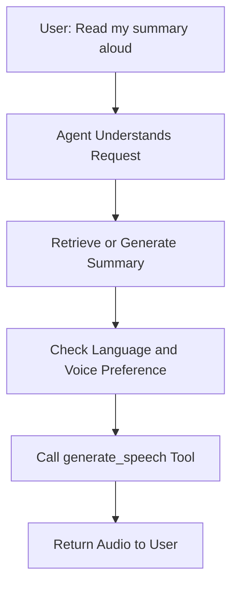

The agent should not call TTS until the spoken text has been finalized.

Otherwise, the application may waste time and money generating audio for text that later changes.

---

## 16. TTS and Retrieval-Augmented Generation

TTS can be added to a RAG pipeline to create spoken, source-grounded answers.


Example use cases:

* A student asks a question about a textbook.
* The system retrieves the relevant pages.
* The LLM generates a grounded explanation.
* TTS reads the explanation aloud.

Important rule:

> TTS does not improve factual correctness. It only changes the output modality.

The accuracy of the spoken response still depends on retrieval quality, prompt design, model behavior, and source validation.

---

## 17. Text-to-Speech for a Study Assistant

A multimodal study assistant can use TTS in several ways.

### Possible features

* Read document summaries aloud
* Generate pronunciation examples
* Speak quiz questions
* Provide audio flashcards
* Create short podcast-style lessons
* Explain images through audio descriptions
* Read feedback after a quiz
* Generate accessible versions of course materials

### Example workflow

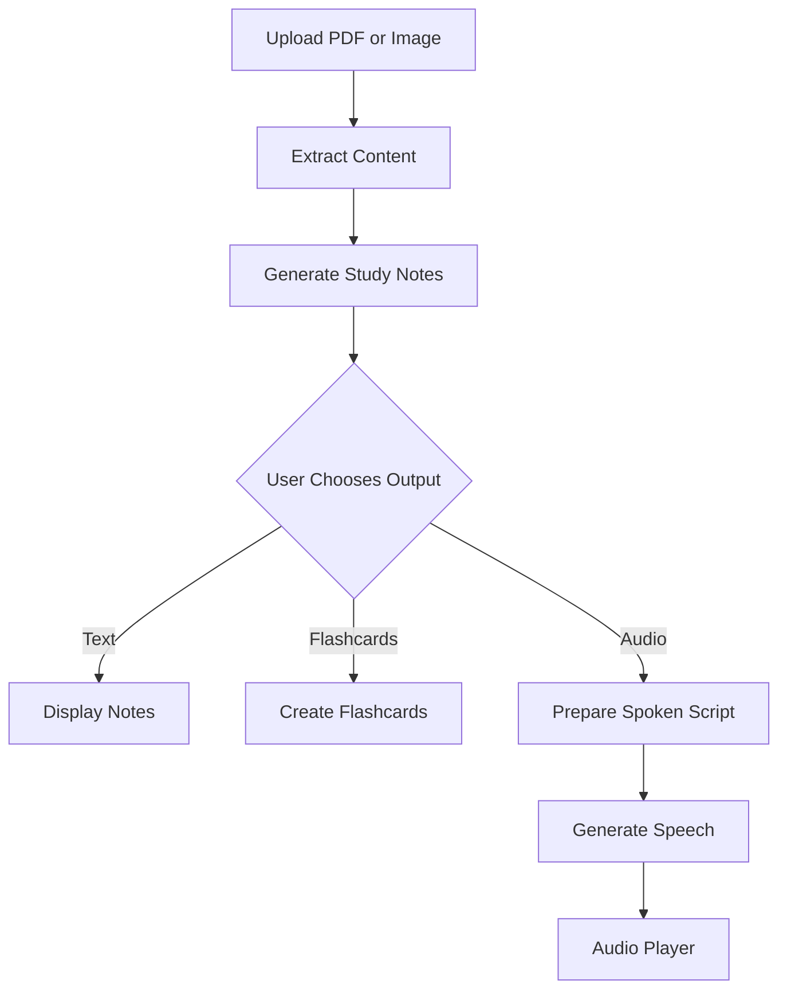

---

## 18. Audio Caching

Speech generation can be expensive and slow. Identical requests should often reuse cached audio.

A cache key may include:

```text
hash(
    normalized_text
    + voice
    + language
    + speed
    + audio_format
    + model_version
)
```

Example:

```python
import hashlib
import json


def create_tts_cache_key(
    *,
    text: str,
    voice: str,
    language: str,
    speed: float,
    audio_format: str,
    model_version: str,
) -> str:
    payload = {
        "text": text.strip(),
        "voice": voice,
        "language": language,
        "speed": speed,
        "audio_format": audio_format,
        "model_version": model_version,
    }

    serialized = json.dumps(
        payload,
        sort_keys=True,
        ensure_ascii=False,
    )

    return hashlib.sha256(serialized.encode("utf-8")).hexdigest()
```

Do not omit the language, voice, speed, or model version from the cache key. Two requests with the same text can still require different audio.

---

## 19. Production Architecture

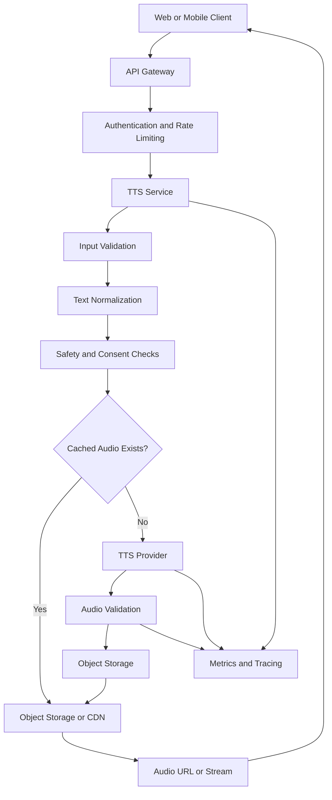

Important components include:

* Authentication
* Rate limits
* Text-length limits
* Content moderation
* Consent validation
* Provider abstraction
* Retry policy
* Circuit breaker
* Cache
* Object storage
* CDN
* Structured logging
* Cost tracking
* Quality monitoring

---

## 20. Production Safety

### 20.1 Consent

Applications should obtain explicit authorization before:

* Cloning a real person's voice
* Publishing synthetic audio under another person's identity
* Using private reference recordings
* Generating audio that could be interpreted as authentic speech

Consent records should include:

* Who granted permission
* Which voice may be used
* Which purposes are allowed
* When permission was granted
* When permission expires
* How permission can be revoked

---

### 20.2 Impersonation Risk

Synthetic speech can be used to impersonate:

* Family members
* Company executives
* Public figures
* Customer-support agents
* Government officials
* Financial-service representatives

Applications should consider:

* Clear synthetic-audio disclosure
* Watermarking or provenance metadata
* Restricted voice enrollment
* Identity verification
* Abuse monitoring
* Suspicious-volume detection
* Human review for sensitive use cases

---

### 20.3 Sensitive Content

A TTS model may faithfully speak harmful content produced by another system.

The application should evaluate:

* The input text
* The context
* The requested voice
* The intended audience
* The distribution channel

TTS should not be treated as a harmless output renderer.

---

### 20.4 Privacy

Text sent to a TTS provider may contain:

* Personal information
* Medical information
* Financial information
* Internal company documents
* Private messages
* Student records

Engineers should define:

* What data is transmitted
* How long it is retained
* Whether audio is stored
* Who can access generated files
* When cached audio expires
* Whether users can delete their data

---

## 21. Quality Metrics

TTS quality should be evaluated with both technical and human-centered metrics.

### 21.1 Naturalness

Does the speech sound human and smooth?

A common evaluation approach is a human rating scale such as:

```text
1 — Very unnatural
2 — Mostly unnatural
3 — Acceptable
4 — Natural
5 — Very natural
```

---

### 21.2 Intelligibility

Can listeners understand every word?

Test difficult content such as:

* Names
* Acronyms
* Addresses
* Numbers
* Technical terms
* Mixed-language sentences
* Long compound words

---

### 21.3 Pronunciation Accuracy

Does the model pronounce domain-specific terms correctly?

Example test set:

```text
PostgreSQL
NumPy
Kubernetes
OAuth
Nguyễn
Yên Bái
GPT
RAG
JSON
```

---

### 21.4 Latency

Useful measurements include:

* Request-processing time
* Time to first audio byte
* Time to first playable audio
* Total generation time
* Real-time factor

The **real-time factor** can be calculated as:

[
RTF = \frac{generation\ time}{audio\ duration}
]

Example:

```text
Generation time: 2 seconds
Generated audio duration: 10 seconds

RTF = 2 / 10 = 0.2
```

An RTF below 1 means the system generates audio faster than real-time playback.

---

### 21.5 Stability

The system should be tested for:

* Missing words
* Repeated words
* Sudden volume changes
* Voice identity changes
* Long unexpected pauses
* Audio corruption
* Truncated endings
* Incorrect chunk order

---

## 22. Cost Considerations

TTS services may charge based on:

* Input characters
* Input tokens
* Audio duration
* Model type
* Voice quality
* Real-time streaming usage
* Custom voice hosting
* Storage and bandwidth

Approximate application cost:

[
Cost_{total} =
Cost_{generation}

* Cost_{storage}
* Cost_{bandwidth}
* Cost_{processing}
  ]

Cost can be reduced through:

* Caching repeated audio
* Limiting input length
* Using lower-cost voices for non-critical content
* Deleting expired audio
* Compressing audio
* Generating only requested sections
* Reusing common phrases and notifications

---

## 23. Common Failure Cases

### Failure 1: Incorrect Number Pronunciation

```text
Input:
Order 1048 costs $2,499.

Incorrect speech:
Order one zero four eight costs dollar two four nine nine.
```

Possible cause:

* Missing text normalization

Debugging steps:

1. Log the normalized text.
2. Test number-expansion rules.
3. Add locale-aware formatting.
4. Create regression tests for currency and identifiers.

---

### Failure 2: The First Audio Chunk Arrives Too Slowly

Possible causes:

* The application waits for the complete LLM response.
* The TTS request contains too much text.
* The selected model is slow.
* Network buffering is too large.
* Audio conversion runs before streaming begins.

Possible fixes:

* Stream LLM sentences into TTS.
* Use sentence-level buffering.
* Select a lower-latency model.
* Reduce playback buffer size.
* Avoid unnecessary transcoding.

---

### Failure 3: Audio Is Cut Off

Possible causes:

* Request timeout
* Client disconnect
* Incorrect content length
* Incomplete chunk upload
* Object-storage failure
* Cancellation propagated too early

Debugging steps:

1. Compare expected and actual byte counts.
2. Validate audio duration.
3. Inspect request and provider timeouts.
4. Confirm the last audio chunk was received.
5. Add completion markers to streaming protocols.

---

### Failure 4: Wrong Language or Accent

Possible causes:

* Language was not provided.
* Automatic language detection failed.
* The selected voice does not support the requested language.
* The text contains multiple languages.
* The cache key omitted the language.

Possible fixes:

* Require an explicit locale.
* Validate voice-language compatibility.
* Split multilingual text into separate segments.
* Include language in the cache key.

---

### Failure 5: Raw Markdown Is Spoken

Example:

```text
Hash hash introduction. Star star important star star.
```

Cause:

* The raw LLM response was passed directly into TTS.

Fix:

* Add a speech-formatting layer before synthesis.

---

### Failure 6: Repeated Audio Has Different Voices

Possible causes:

* Voice identifier is not fixed.
* Provider model version changed.
* Randomness is not controlled.
* A fallback provider uses another voice.
* Chunk requests use inconsistent parameters.

Fix:

* Pin the voice and model version.
* Pass identical parameters to every chunk.
* Record which provider generated each segment.
* Normalize fallback voices where possible.

---

## 24. Observability and Logging

A TTS request should generate structured metrics.

Example log:

```json
{
  "request_id": "req_8bd31",
  "operation": "tts.generate",
  "provider": "provider_a",
  "model": "speech-model-v2",
  "voice": "neutral_teacher",
  "language": "en-US",
  "input_characters": 842,
  "audio_format": "mp3",
  "cache_hit": false,
  "time_to_first_byte_ms": 390,
  "total_duration_ms": 1840,
  "audio_duration_seconds": 27.4,
  "status": "success"
}
```

Avoid logging the complete text when it may contain private information.

Safer alternatives include:

* Character count
* Text hash
* Request category
* Language
* Redacted preview
* Data-sensitivity label

---

## 25. Testing Strategy

### Unit tests

Test:

* Empty input
* Maximum text length
* Unsupported formats
* Invalid speed values
* Cache-key generation
* Text normalization
* Markdown removal
* Voice-language validation

### Integration tests

Test:

* Provider authentication
* Audio response type
* Valid file headers
* Retry behavior
* Timeout handling
* Storage upload
* Cache retrieval

### End-to-end tests

Test:

```text
User request
  → LLM response
  → speech preprocessing
  → TTS generation
  → audio playback
```

### Quality regression tests

Maintain a fixed pronunciation dataset containing:

* Numbers
* Dates
* Names
* Acronyms
* Technical terminology
* Multiple languages
* Long sentences
* Emotional punctuation

---

## 26. Example Production Checklist

### Input

* [ ] Validate text length.
* [ ] Detect or require a language.
* [ ] Normalize numbers, dates, and abbreviations.
* [ ] Remove unsupported markup.
* [ ] Check voice-language compatibility.
* [ ] Reject unsupported audio formats.

### Safety

* [ ] Confirm authorization for cloned voices.
* [ ] Evaluate impersonation risks.
* [ ] Apply content-safety policies.
* [ ] Protect private text and generated audio.
* [ ] Record consent and voice ownership.
* [ ] Provide synthetic-audio disclosure where appropriate.

### Performance

* [ ] Measure time to first audio.
* [ ] Support streaming for interactive applications.
* [ ] Cache repeated output.
* [ ] Set provider timeouts.
* [ ] Use retries only for retryable failures.
* [ ] Add a provider fallback strategy.

### Audio Quality

* [ ] Test names and technical terminology.
* [ ] Normalize loudness.
* [ ] Validate audio duration.
* [ ] Check for clipping and truncation.
* [ ] Keep chunk settings consistent.
* [ ] Test on mobile speakers and headphones.

### Operations

* [ ] Add request IDs and tracing.
* [ ] Track usage and cost.
* [ ] Monitor provider failures.
* [ ] Define audio-retention rules.
* [ ] Add deletion and expiration workflows.
* [ ] Maintain quality regression tests.

---

## 27. Practical Demo: Spoken Study Summary

### Goal

Build a small endpoint that:

1. Receives study notes.
2. Generates a concise spoken script.
3. Converts the script into audio.
4. Returns an audio file or stream.

### Request

```json
{
  "notes": "Text-to-Speech converts written language into spoken audio...",
  "language": "en-US",
  "voice": "neutral_teacher"
}
```

### Processing pipeline

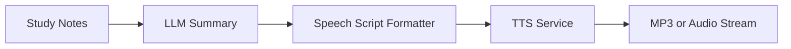

### Spoken-script prompt

```text
You are preparing a script for a study-assistant voice.

Rewrite the supplied notes as a clear spoken explanation.

Requirements:
- Use short sentences.
- Avoid Markdown.
- Expand abbreviations when first introduced.
- Do not read URLs aloud.
- Explain technical terms briefly.
- Use natural transitions.
- Keep the result below 250 words.
- Return only the final spoken script.
```

### Example output script

```text
Text-to-Speech, also called TTS, converts written text into spoken audio.

A typical system first normalizes numbers, dates, abbreviations, and symbols.
It then predicts pronunciation, rhythm, pauses, and intonation. Finally, an
audio decoder produces the speech waveform.

TTS is useful for assistants, accessibility tools, language-learning
applications, and spoken document summaries.

In production, engineers must monitor latency, pronunciation quality, cost,
privacy, user consent, and impersonation risks.
```

---

## 28. Hands-on Exercises

### Exercise 1 — Explain the Concept

Without reviewing the lesson, write five lines explaining:

* What TTS does
* Where it appears in an AI workflow
* Why text normalization matters
* Why streaming is useful
* Which safety risk is most important

---

### Exercise 2 — Build a Small Demo

Create one of the following:

* A Python script that saves text as an audio file
* A FastAPI TTS endpoint
* A browser audio player
* A streaming speech demo
* An audio summary generator
* A spoken flashcard application

---

### Exercise 3 — Add TTS to an LLM Application

Create this pipeline:

```text
User question
  → LLM response
  → Markdown cleanup
  → TTS request
  → Audio playback
```

Record:

* Total latency
* Time to first audio
* Input size
* Generated audio duration
* Voice used
* Estimated cost
* Any pronunciation errors

---

### Exercise 4 — Test Pronunciation

Create a test file containing:

```text
The API returned HTTP status 503.
The PostgreSQL database uses a JSONB column.
The meeting is scheduled for July 28, 2026, at 2:30 p.m.
The total price is $1,249.50.
Nguyễn lives in Yên Bái, Việt Nam.
```

Listen to the output and document every incorrect pronunciation.

---

### Exercise 5 — Debug a Production Failure

Scenario:

> The first sentence plays correctly, but the second sentence begins with a
> different voice and is noticeably louder.

Investigate:

* Whether the voice parameter changed
* Whether the fallback provider was activated
* Whether audio chunks use different sample rates
* Whether loudness normalization was applied
* Whether cache entries came from different model versions

Write the root cause and proposed fix.

---

## 29. Portfolio Project Idea

### Project: Multimodal Study Assistant with Spoken Lessons

Build an application that accepts:

* Text
* Images
* PDF documents
* Audio recordings

The application should generate:

* Summaries
* Flashcards
* Quizzes
* Spoken explanations

### Suggested architecture

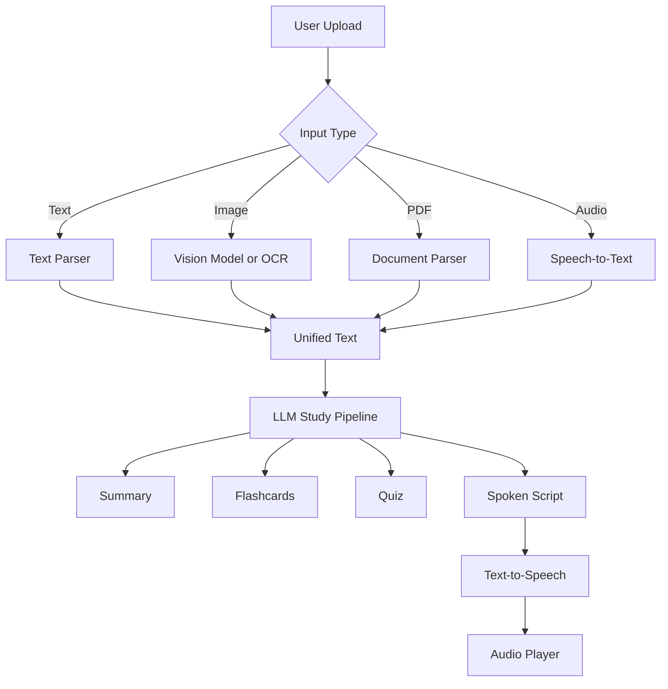

### Minimum features

* Upload or paste study material
* Generate a summary
* Convert the summary into speech
* Select a voice and speaking speed
* Display audio-generation status
* Cache repeated audio
* Handle provider failures
* Record latency metrics
* Allow generated audio to be deleted

### Optional advanced features

* Streaming playback
* Sentence highlighting during speech
* Multilingual voices
* Pronunciation dictionaries
* Audio chapter generation
* Voice-based quiz mode
* Offline audio download
* Automatic fallback providers

---

## 30. Common Learning Mistakes

### Memorizing the Definition Without Building Anything

Knowing that TTS converts text into speech is not enough.

Build at least one working flow:

```text
text → TTS API → audio file → playback
```

---

### Ignoring Text Preparation

A strong speech model cannot always repair:

* Raw Markdown
* Unexpanded abbreviations
* Ambiguous numbers
* Malformed punctuation
* Technical notation
* Incorrect language tags

Inspect the exact text sent to the model.

---

### Evaluating Only Voice Naturalness

A natural voice can still have:

* High latency
* Incorrect pronunciation
* Missing words
* Privacy risks
* Excessive cost
* Poor multilingual support

Evaluate the entire application, not only the audio sample.

---

### Ignoring Streaming Edge Cases

A happy-path streaming demo may fail when:

* The user interrupts playback
* The network disconnects
* The model returns an error mid-stream
* The next chunk arrives late
* The selected voice changes
* The client reconnects
* The LLM revises an unfinished sentence

Design explicit cancellation and recovery behavior.

---

### Forgetting Consent and Abuse Prevention

Do not treat voice cloning as a normal style-selection feature.

Consent, identity, disclosure, storage, and misuse prevention must be part of the system design.

---

## 31. Completion Checklist

* [ ] I can explain Text-to-Speech in one or two minutes.
* [ ] I understand the main stages of a TTS pipeline.
* [ ] I can explain text normalization and prosody.
* [ ] I understand the difference between batch and streaming TTS.
* [ ] I have built a small TTS demo or API route.
* [ ] I can prepare LLM output for spoken delivery.
* [ ] I can identify latency and pronunciation problems.
* [ ] I understand voice-cloning consent requirements.
* [ ] I know how caching affects cost and performance.
* [ ] I have documented at least one limitation or open question.

---

## 32. Related Outcome

Build applications that work with:

* Text
* Images
* Documents
* Audio
* Speech
* Video

Text-to-Speech allows an AI system to transform generated language into a spoken user experience.

---

## 33. Related Project

**Project 10: Multimodal Study Assistant**

The application accepts images, PDFs, text, and audio, then produces:

* Summaries
* Flashcards
* Quizzes
* Spoken lessons

TTS provides the final audio-output modality for learners who prefer listening or require accessible content.

---

## 34. Key Takeaways

1. Text-to-Speech converts written text into spoken audio.
2. A complete TTS pipeline includes normalization, pronunciation processing, speech generation, decoding, and post-processing.
3. Streaming TTS is important for real-time conversational applications.
4. LLM output should be reformatted before being spoken.
5. Voice quality is only one evaluation dimension; latency, pronunciation, cost, stability, privacy, and safety also matter.
6. Repeated speech should be cached using text, voice, language, model, speed, and format.
7. Voice cloning requires explicit consent and strong abuse-prevention controls.
8. TTS changes the output modality, but it does not improve the factual accuracy of the generated content.

---

## 35. Final Summary

**Text-to-Speech** is a foundational component of modern multimodal AI systems. It allows assistants, learning tools, agents, games, and accessibility applications to communicate through natural spoken audio.

For an AI Engineer, the goal is not only to call a speech API. A reliable implementation must prepare text correctly, choose an appropriate voice, support the required latency, handle long content, protect user data, track cost, monitor audio quality, and prevent unauthorized voice use.

Turn this lesson into a concrete artifact such as:

* A TTS API route
* A streaming voice assistant
* A spoken RAG application
* An audio flashcard tool
* A multimodal study assistant
* A latency and quality dashboard
* A production safety checklist

A working demo gives the concept a practical place in your AI Engineering portfolio.
