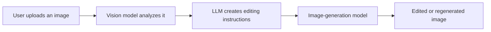
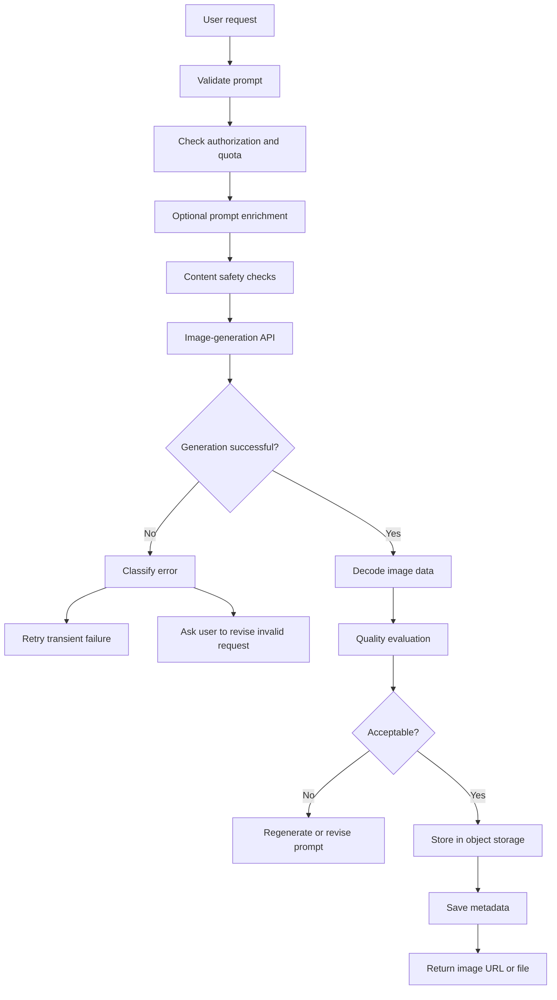
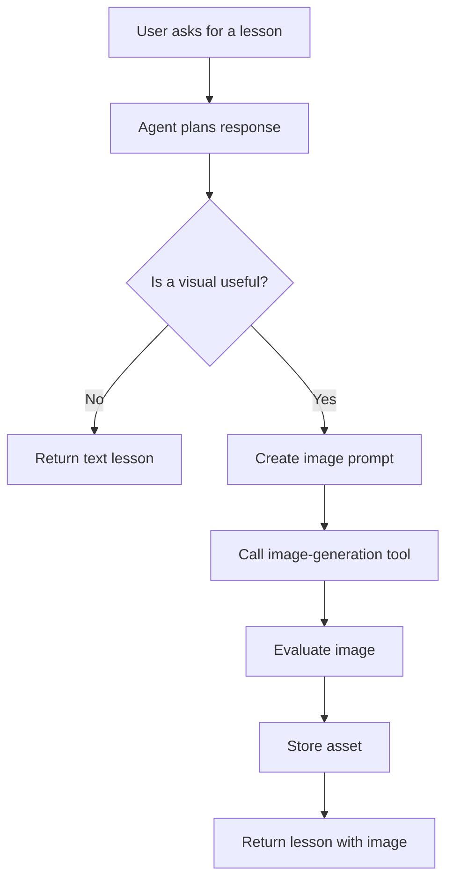
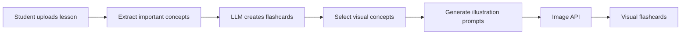
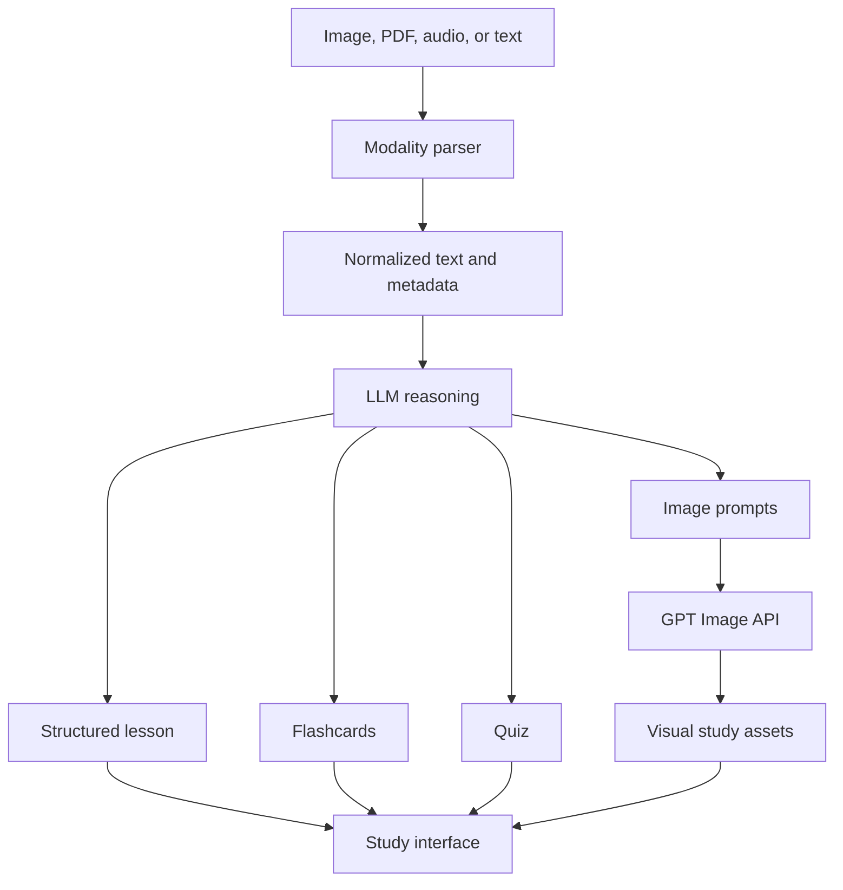

# 011 — DALL·E API

**Course:** 04 — Agents, Multimodal, and Tools
**Module:** Module 11 — Multimodal AI
**Content Group:** APIs and Frameworks
**Roadmap Source:** Multimodal AI / APIs and Frameworks
**Lesson Type:** Multimodal AI
**Order in Module:** 011
**Suggested Duration:** 22 minutes

---

> [!IMPORTANT]
> **Current API status — July 2026**
>
> DALL·E 3 is now classified as a **deprecated, previous-generation image model**. It remains useful for understanding text-to-image APIs, but new applications should normally use the current GPT Image models, especially `gpt-image-2`.
>
> This lesson therefore uses **DALL·E API** as the historical topic while teaching the modern OpenAI image-generation workflow.

---

## 1. Summary

The DALL·E API allows an application to transform a natural-language description into an image.

It extends an AI application beyond text by adding visual generation capabilities. Instead of returning only paragraphs or structured JSON, the system can create:

* Illustrations
* Product concepts
* Educational diagrams
* Marketing assets
* Game art drafts
* Social-media graphics
* Storybook images
* UI background assets
* Visual flashcards

In a modern OpenAI application, image generation can be accessed through two main approaches:

1. **Image API** — best for generating or editing an image from a direct request.
2. **Responses API with the image-generation tool** — best for conversational, agentic, or multi-step image workflows.

The current Image API supports image generation and image editing, while the Responses API supports image generation inside a conversation and multi-turn refinement.

---

## 2. Learning Objectives

After completing this lesson, you should be able to:

* Explain what the DALL·E API does in your own words.
* Describe the difference between image understanding and image generation.
* Send a text-to-image request from Python.
* Decode and save a base64 image response.
* Design a reliable image prompt.
* Choose between the Image API and the Responses API.
* Integrate image generation into a backend API route.
* Identify production risks involving cost, latency, moderation, storage, quality, and privacy.
* Evaluate generated images using explicit criteria instead of personal preference alone.
* Explain why new projects should migrate from DALL·E 3 to GPT Image models.

---

## 3. Core Concepts

### 3.1 What Is the DALL·E API?

The DALL·E API is a programmatic interface for generating images from natural-language instructions.

A user might write:

```text
Create a hand-drawn educational illustration of the solar system,
with eight planets orbiting the Sun, on a dark blue background.
```

The application sends this prompt to an image-generation model. The model produces image data, which the application can save, display, edit, or pass into another workflow.

```text
Text prompt
    ↓
Image-generation API
    ↓
Generated image data
    ↓
Decode or store
    ↓
Display to user
```

DALL·E 3 accepts text as input and produces an image as output. It is now considered a previous-generation model and is marked as deprecated.

---

### 3.2 DALL·E 3 vs. GPT Image

| Area                  | DALL·E 3                 | Current GPT Image models             |
| --------------------- | ------------------------ | ------------------------------------ |
| Status                | Deprecated               | Recommended for new applications     |
| Primary workflow      | Text-to-image generation | Generation and detailed editing      |
| Image input           | Limited legacy workflow  | Supported for editing and references |
| Multi-turn editing    | Not the main design      | Supported through the Responses API  |
| Instruction following | Good                     | Improved                             |
| Text rendering        | Limited                  | Improved, but not perfect            |
| Application type      | Legacy integrations      | New production applications          |

The current OpenAI image-generation guide identifies `gpt-image-2` as the latest GPT Image model. It supports direct generation through the Image API and conversational image workflows through the Responses API.

A production application should keep the model name in configuration rather than hard-coding it throughout the codebase:

```python
IMAGE_MODEL = os.getenv("OPENAI_IMAGE_MODEL", "gpt-image-2")
```

This makes future migration easier.

---

### 3.3 Image Generation Is Not Image Understanding

These two tasks are related but different.

#### Image understanding

```text
Existing image → vision model → text or structured information
```

Examples:

* Describe a chart.
* Read a screenshot.
* Extract information from a receipt.
* Identify objects in a photograph.
* Answer questions about a diagram.

#### Image generation

```text
Prompt or reference image → generative image model → new image
```

Examples:

* Generate an illustration.
* Replace an image background.
* Create a product concept.
* Change the visual style.
* Produce flashcard artwork.

A multimodal application may combine both:



---

### 3.4 Image API vs. Responses API

#### Use the Image API when:

* One request should produce one or more images.
* You need a simple text-to-image endpoint.
* You want to edit an existing image.
* Image generation is a single step in your backend.
* You want direct control over the selected image model.

#### Use the Responses API when:

* The user is having a conversation with an AI assistant.
* The model should decide when an image is required.
* The user will refine an image over several turns.
* Image generation is one tool inside an agent.
* The workflow combines reasoning, text, tools, and image output.

OpenAI recommends the Image API for a single direct generation or edit operation, and the Responses API for conversational and multi-turn image experiences.

---

## 4. Image-Generation Workflow

A basic production workflow contains more than one model call.



### Important pipeline stages

#### 1. Input validation

Check:

* Prompt length
* Empty prompts
* Unsupported dimensions
* Unsupported output formats
* User permissions
* Request frequency

#### 2. Prompt preparation

The application may convert a short request into a more complete production prompt.

```text
User input:
"A robot teacher"

Expanded prompt:
"A friendly compact robot teacher standing in a modern classroom,
explaining mathematics on a digital board, warm natural lighting,
clean educational illustration, front three-quarter view,
balanced composition, no logos, no watermark."
```

#### 3. Generation

The backend sends the prompt and generation settings to the model.

#### 4. Output handling

The modern Image API returns base64-encoded image data. The default format is PNG, while JPEG and WebP are also available.

#### 5. Storage

Generated files should normally be moved to persistent object storage rather than kept only on the application server.

#### 6. Evaluation

The system should check whether the result satisfies the user’s requirements before treating it as a final asset.

---

## 5. Prompt Design for Image Generation

An image prompt should describe the visual result rather than merely naming a topic.

### 5.1 A practical prompt formula

```text
Subject
+ action
+ environment
+ composition
+ visual style
+ lighting
+ color direction
+ camera or viewpoint
+ constraints
+ intended use
```

### Example

```text
A small orange robot studying machine learning at a wooden desk,
inside a modern university library, medium-wide composition,
hand-drawn editorial illustration, soft afternoon light,
warm orange and blue palette, eye-level viewpoint,
clear subject separation, no logo, no watermark,
designed as a course thumbnail.
```

---

### 5.2 Prompt components

#### Subject

What should appear?

```text
A young engineer and a small service robot
```

#### Action

What is happening?

```text
debugging an AI application together
```

#### Environment

Where does the scene happen?

```text
inside a modern software laboratory
```

#### Composition

How should elements be arranged?

```text
the engineer on the left, the robot on the right,
a large monitor in the center
```

#### Style

What visual language should be used?

```text
clean hand-drawn technical illustration
```

#### Lighting

How should the scene be illuminated?

```text
soft natural window light
```

#### Constraints

What must be avoided or preserved?

```text
no text, no logos, no watermark, no extra characters
```

---

### 5.3 Weak vs. strong prompts

#### Weak prompt

```text
Generate a picture about artificial intelligence.
```

Problems:

* No clear subject
* No composition
* No visual style
* No intended use
* No constraints
* Difficult to evaluate

#### Strong prompt

```text
Create a square educational illustration showing a software engineer
connecting an AI model to three tools: a database, a web search service,
and a calculator.

Use a clean hand-drawn infographic style with simple geometric shapes,
soft blue and orange accents, strong visual hierarchy, and generous
spacing. Place the AI model in the center and the tools around it.

Do not include readable text, logos, watermarks, or decorative objects.
The image will be used as a course lesson thumbnail.
```

---

### 5.4 Avoid overloaded prompts

A prompt containing too many unrelated instructions may produce unstable composition.

Instead of:

```text
Create a classroom, spaceship, forest, city, robot, dragon,
ten students, a diagram, a book cover, and a mobile UI.
```

Split the request into separate assets or establish a clear priority:

```text
Primary subject: a robot teacher.

Secondary background: a futuristic classroom.

Only include three students in the distance.
Do not include other major subjects.
```

---

## 6. Basic Python Demo

### 6.1 Installation

```bash
pip install openai
```

Set the API key as an environment variable:

```bash
export OPENAI_API_KEY="your-api-key"
```

On Windows PowerShell:

```powershell
$env:OPENAI_API_KEY="your-api-key"
```

Never place a secret API key directly in frontend JavaScript, a mobile application, or a public repository.

---

### 6.2 Generate and save an image

```python
from __future__ import annotations

import base64
import os
from pathlib import Path

from openai import OpenAI


MODEL_NAME = os.getenv("OPENAI_IMAGE_MODEL", "gpt-image-2")
OUTPUT_PATH = Path("ai_engineer_workspace.png")


def generate_image(prompt: str, output_path: Path) -> Path:
    """Generate an image and save it as a PNG file."""

    cleaned_prompt = prompt.strip()

    if len(cleaned_prompt) < 10:
        raise ValueError("The prompt must contain at least 10 characters.")

    client = OpenAI()

    result = client.images.generate(
        model=MODEL_NAME,
        prompt=cleaned_prompt,
        size="1024x1024",
        quality="medium",
        output_format="png",
    )

    if not result.data:
        raise RuntimeError("The API returned no image results.")

    image_base64 = result.data[0].b64_json

    if not image_base64:
        raise RuntimeError("The API response did not contain image data.")

    try:
        image_bytes = base64.b64decode(image_base64, validate=True)
    except ValueError as exc:
        raise RuntimeError("The returned image data was not valid base64.") from exc

    output_path.write_bytes(image_bytes)
    return output_path


if __name__ == "__main__":
    prompt = """
    A friendly AI engineer working with a small robot assistant
    in a modern software laboratory, clean hand-drawn editorial
    illustration, soft natural lighting, balanced square composition,
    detailed but uncluttered, no text, no logo, no watermark.
    """

    saved_file = generate_image(prompt, OUTPUT_PATH)
    print(f"Image saved to: {saved_file.resolve()}")
```

The Image API returns base64 image content, which must be decoded before it is written to a file.

---

### 6.3 What the code does

```text
1. Read the API key from the environment.
2. Validate the prompt.
3. Call the image-generation endpoint.
4. Extract the base64 image.
5. Decode it into binary data.
6. Save the binary data as a PNG.
```

---

## 7. Building a FastAPI Route

A real application should call OpenAI from its backend.

### Installation

```bash
pip install fastapi uvicorn openai pydantic
```

### API implementation

```python
from __future__ import annotations

import base64
import os
from typing import Literal

from fastapi import FastAPI, HTTPException, Response
from openai import APIError, OpenAI, RateLimitError
from pydantic import BaseModel, Field


app = FastAPI(title="Image Generation Service")
client = OpenAI()

IMAGE_MODEL = os.getenv("OPENAI_IMAGE_MODEL", "gpt-image-2")


class GenerateImageRequest(BaseModel):
    prompt: str = Field(min_length=10, max_length=3_000)
    size: Literal[
        "1024x1024",
        "1536x1024",
        "1024x1536",
    ] = "1024x1024"
    quality: Literal["low", "medium", "high"] = "medium"


@app.post(
    "/api/v1/images/generate",
    responses={
        200: {"content": {"image/png": {}}},
        400: {"description": "Invalid request"},
        429: {"description": "Rate limit exceeded"},
        502: {"description": "Image provider failure"},
    },
)
def generate_image(request: GenerateImageRequest) -> Response:
    prompt = request.prompt.strip()

    if not prompt:
        raise HTTPException(status_code=400, detail="Prompt cannot be empty.")

    try:
        result = client.images.generate(
            model=IMAGE_MODEL,
            prompt=prompt,
            size=request.size,
            quality=request.quality,
            output_format="png",
        )
    except RateLimitError as exc:
        raise HTTPException(
            status_code=429,
            detail="Image generation is temporarily rate-limited.",
        ) from exc
    except APIError as exc:
        raise HTTPException(
            status_code=502,
            detail="The image provider could not complete the request.",
        ) from exc

    if not result.data or not result.data[0].b64_json:
        raise HTTPException(
            status_code=502,
            detail="The image provider returned no image data.",
        )

    try:
        image_bytes = base64.b64decode(
            result.data[0].b64_json,
            validate=True,
        )
    except ValueError as exc:
        raise HTTPException(
            status_code=502,
            detail="The provider returned invalid image data.",
        ) from exc

    return Response(
        content=image_bytes,
        media_type="image/png",
        headers={
            "Cache-Control": "no-store",
            "X-Image-Model": IMAGE_MODEL,
        },
    )
```

Run the application:

```bash
uvicorn main:app --reload
```

Example request:

```bash
curl \
  -X POST \
  "http://localhost:8000/api/v1/images/generate" \
  -H "Content-Type: application/json" \
  -d '{
    "prompt": "A hand-drawn illustration of an AI study assistant organizing books and flashcards, no text",
    "size": "1024x1024",
    "quality": "medium"
  }' \
  --output generated.png
```

---

## 8. Conversational Image Generation

The Responses API can expose image generation as a tool inside a conversation.

```python
from __future__ import annotations

import base64
from pathlib import Path

from openai import OpenAI


client = OpenAI()

response = client.responses.create(
    model="gpt-5.6",
    input=(
        "Generate a clean educational illustration of a student "
        "using an AI assistant to summarize a textbook."
    ),
    tools=[
        {
            "type": "image_generation",
            "action": "generate",
        }
    ],
)

image_results = [
    output.result
    for output in response.output
    if output.type == "image_generation_call"
]

if not image_results:
    raise RuntimeError("The response did not contain a generated image.")

Path("study_assistant.png").write_bytes(
    base64.b64decode(image_results[0])
)
```

The Responses API can preserve image-generation context across turns. A later request can reference the previous response and ask for changes such as:

```text
Make the illustration more minimal.
```

or:

```text
Keep the characters, but change the background to a university library.
```

This multi-turn behavior is one of the main advantages of using the Responses API for image-based assistants.

---

## 9. Using Image Generation as an Agent Tool

An AI agent can decide whether an image would help complete a task.



### Example tool definition

```python
from typing import TypedDict


class GenerateLessonImageInput(TypedDict):
    topic: str
    visual_style: str
    aspect_ratio: str


def generate_lesson_image(
    tool_input: GenerateLessonImageInput,
) -> str:
    """
    Generate an image and return its persistent storage URL.

    Production implementation should include:
    - input validation
    - user authorization
    - quota checks
    - image generation
    - object storage upload
    - metadata persistence
    """
    raise NotImplementedError
```

The agent should not call image generation for every request. It should use the tool only when a visual meaningfully improves the result.

---

## 10. Output Configuration

Current GPT Image models allow applications to control several output properties, including:

* Image dimensions
* Quality level
* Output format
* Compression
* Background behavior, depending on model support

The modern Image API supports PNG, JPEG, and WebP output. JPEG may be preferable when lower latency and smaller files are more important than transparency or lossless quality.

### Quality strategy

| Stage              | Recommended quality | Purpose                   |
| ------------------ | ------------------- | ------------------------- |
| Prompt exploration | Low                 | Fast drafts               |
| User preview       | Low or medium       | Interactive iteration     |
| Selected candidate | Medium              | General application asset |
| Final export       | High                | Final approved visual     |

Avoid using the highest quality for every intermediate generation. Generate inexpensive drafts first, then create a high-quality final version after the user approves the direction.

---

## 11. Evaluation

Image outputs require explicit evaluation because some errors are less obvious than text errors.

### 11.1 Evaluation dimensions

| Dimension             | Evaluation question                                        |
| --------------------- | ---------------------------------------------------------- |
| Prompt adherence      | Does the image contain the requested subjects and actions? |
| Composition           | Are the elements placed correctly?                         |
| Visual quality        | Are there distortions, artifacts, or malformed objects?    |
| Text accuracy         | Is required text spelled and positioned correctly?         |
| Style consistency     | Does the output match the required visual style?           |
| Character consistency | Do recurring characters remain recognizable?               |
| Brand consistency     | Are approved colors and visual rules preserved?            |
| Safety                | Does the output violate policy or product rules?           |
| Usability             | Can the image be used for its intended purpose?            |
| Technical quality     | Are size, format, and file integrity correct?              |

---

### 11.2 Simple scoring rubric

Score each category from 0 to 2.

```text
0 = failed
1 = partially correct
2 = correct
```

Example:

| Category             |     Score |
| -------------------- | --------: |
| Main subject         |         2 |
| Composition          |         1 |
| Style                |         2 |
| Required constraints |         2 |
| Visual artifacts     |         1 |
| Intended use         |         2 |
| **Total**            | **10/12** |

An application might automatically accept an image only when:

```text
total_score >= 10
AND required_constraints_score == 2
AND safety_passed == true
```

---

### 11.3 Automated and human evaluation

#### Automated checks

* File can be decoded.
* Image dimensions are correct.
* File size is within limits.
* Safety checks pass.
* OCR detects prohibited or incorrect text.
* Perceptual hashing detects duplicates.
* Vision model checks prompt adherence.

#### Human checks

* Composition quality
* Emotional tone
* Brand fit
* Cultural appropriateness
* Character appeal
* Final publication approval

The best production pipeline often combines automated checks with human review for high-value assets.

---

## 12. Production Concerns

### 12.1 Latency

Image generation is usually slower than normal text generation. Complex prompts may require significant processing time. OpenAI notes that complex GPT Image requests may take up to approximately two minutes.

Your UI should therefore provide:

* A visible generation state
* A cancel option where possible
* Clear timeout handling
* Protection against duplicate submissions
* Idempotency for retried requests

---

### 12.2 Cost control

Track:

```text
total generation requests
successful requests
failed requests
images accepted by users
images regenerated
average cost per request
average cost per accepted asset
```

A useful metric is:

```text
cost per accepted image =
total image-generation cost / accepted images
```

A cheap image that requires six regenerations may be more expensive than a higher-quality result accepted on the first attempt.

---

### 12.3 Rate limits

Rate limits depend on the model and the account’s usage tier. Applications should treat HTTP `429` responses as transient failures and retry them using exponential backoff.

Example strategy:

```text
Attempt 1 → wait 1 second
Attempt 2 → wait 2 seconds
Attempt 3 → wait 4 seconds
Attempt 4 → stop and return a temporary error
```

Add random jitter so multiple workers do not retry simultaneously.

---

### 12.4 Error classification

Do not retry every failure.

#### Retryable failures

* Rate-limit errors
* Network timeouts
* Temporary server failures
* HTTP 500-series responses

#### Usually not retryable without changing input

* Invalid prompt
* Unsupported image size
* Invalid image file
* Authentication failure
* Moderation rejection
* Missing required parameters

OpenAI recommends checking status codes or SDK exception types, logging request IDs, retrying transient `429` and `5xx` errors, and avoiding automatic retries for user-correctable image-generation errors.

---

### 12.5 Content moderation

Prompts and generated images are filtered according to OpenAI’s content policies. An application should handle blocked requests as expected product behavior rather than as an unknown server crash.

A user-facing error should be simple:

```text
This image could not be generated.
Please revise the request and try again.
```

Developer logs can contain more technical details:

```json
{
  "event": "image_generation_failed",
  "error_code": "moderation_blocked",
  "moderation_stage": "input",
  "request_id": "provider-request-id",
  "user_id": "internal-user-id"
}
```

Do not expose internal safety scores or unnecessary diagnostic details to users.

---

### 12.6 Storage

Do not permanently store large base64 strings inside normal database rows.

A better architecture is:

```text
Image bytes
    ↓
Object storage
    ↓
Persistent asset URL
    ↓
Database metadata record
```

Example metadata:

```json
{
  "asset_id": "img_01K...",
  "user_id": "usr_01K...",
  "model": "gpt-image-2",
  "prompt_version": "lesson-image-v3",
  "size": "1024x1024",
  "quality": "medium",
  "format": "png",
  "storage_key": "users/usr_01K/images/img_01K.png",
  "status": "approved",
  "created_at": "2026-07-28T15:00:00Z"
}
```

---

### 12.7 Privacy

Before sending user data to an image API, consider whether the prompt or reference image contains:

* Faces
* Identity documents
* Medical information
* Private screenshots
* Home addresses
* Company secrets
* Student records
* Customer information
* Copyrighted internal assets

Use data minimization:

```text
Send only the information required to produce the result.
```

---

### 12.8 Provenance

Images produced through OpenAI tools include provenance signals such as C2PA metadata and SynthID watermarking. These signals can help identify whether an image originated from OpenAI tools, although they do not prove that the image is accurate, unedited, legally owned, or presented in the correct context.

Applications should still store their own audit metadata:

* Prompt
* Model
* Generation timestamp
* User
* Request ID
* Editing history
* Approval status

---

### 12.9 Observability

Log enough information to debug failures without logging unnecessary sensitive content.

Recommended fields:

```json
{
  "event": "image_generation_completed",
  "request_id": "application-request-id",
  "provider_request_id": "provider-request-id",
  "user_id": "internal-user-id",
  "model": "gpt-image-2",
  "prompt_version": "course-thumbnail-v2",
  "size": "1024x1024",
  "quality": "medium",
  "latency_ms": 18250,
  "output_bytes": 1482903,
  "status": "success"
}
```

Avoid logging full private prompts by default. Store a prompt hash or redacted version when possible.

---

## 13. Common Mistakes

### Mistake 1: Building new systems directly on DALL·E 3

DALL·E 3 is deprecated. New systems should use a current GPT Image model unless maintaining a legacy integration.

---

### Mistake 2: Calling the API directly from the frontend

This exposes the API key and removes backend control over:

* Authentication
* Quotas
* Cost
* Logging
* Moderation behavior
* Rate limiting

Call the image provider from a trusted backend.

---

### Mistake 3: Using vague prompts

```text
Make a cool image.
```

The output may be visually attractive but impossible to evaluate.

Define:

* Subject
* Composition
* Style
* Constraints
* Intended use

---

### Mistake 4: Expecting exact text rendering

Image models have improved at rendering text, but precise spelling, placement, and typography can still fail.

For critical text:

1. Generate the background or illustration.
2. Add final typography using HTML, Canvas, SVG, Figma, or an image-processing library.

---

### Mistake 5: Assuming visual consistency across generations

Recurring characters, products, or brand elements may drift between generations.

Possible solutions:

* Use reference images.
* Reuse the same detailed character description.
* Store approved visual attributes.
* Use editing instead of generating from scratch.
* Add a human approval stage.

---

### Mistake 6: Storing base64 directly in the database

Base64 increases payload size and makes normal database operations inefficient.

Decode the image and upload it to object storage.

---

### Mistake 7: Retrying moderation failures unchanged

A moderation-blocked prompt usually requires a revised request. Repeating the same request wastes time and budget.

---

### Mistake 8: Evaluating only the happy path

Test:

* Empty prompts
* Very long prompts
* Conflicting instructions
* Rate-limit errors
* Timeouts
* Moderation blocks
* Invalid base64
* Storage failures
* Duplicate requests
* User cancellation

---

## 14. Debugging Guide

| Symptom                     | Likely cause                     | Debugging action                     |
| --------------------------- | -------------------------------- | ------------------------------------ |
| HTTP 401                    | Missing or invalid API key       | Check server environment variables   |
| HTTP 429                    | Rate limit or quota              | Inspect limits and apply backoff     |
| Empty result                | Provider or parsing issue        | Log response metadata and request ID |
| Invalid image file          | Base64 decoding failed           | Validate response before saving      |
| Wrong composition           | Prompt is ambiguous              | Add positions and hierarchy          |
| Incorrect text              | Model rendering limitation       | Add text after generation            |
| Inconsistent character      | Generation drift                 | Use references or editing            |
| Slow response               | High quality or complex prompt   | Use low-quality drafts first         |
| Moderation block            | Prompt or output violates policy | Ask the user to revise the request   |
| Duplicate charges           | Client resubmitted request       | Add idempotency and UI locking       |
| Missing image after restart | Stored only on local disk        | Use persistent object storage        |

---

## 15. Practical Exercise

### Exercise A — Basic generation

Create a Python script that generates:

```text
A friendly AI tutor helping a student understand a difficult diagram,
modern hand-drawn educational illustration, no text.
```

Requirements:

* Use an environment variable for the API key.
* Use `gpt-image-2`.
* Save the result as PNG.
* Validate that image data exists.
* Print the final file path.

---

### Exercise B — Prompt comparison

Generate three versions of the same concept.

#### Prompt 1

```text
An AI classroom.
```

#### Prompt 2

```text
A robot teaching students in a classroom,
digital illustration, blue color palette.
```

#### Prompt 3

```text
A friendly white service robot teaching three university students
inside a modern AI laboratory, the robot positioned beside a large
interactive display, medium-wide composition, clean hand-drawn
editorial illustration, soft natural lighting, blue and orange
accent colors, no readable text, no logos, no watermark.
```

Compare:

* Prompt adherence
* Composition
* Visual style
* Number of unwanted objects
* Overall usefulness

---

### Exercise C — Production failure

Imagine that a user clicks **Generate** three times because the request takes 30 seconds.

Explain:

1. What production problem could occur?
2. How could duplicate charges happen?
3. How should the frontend prevent repeated submission?
4. How could an idempotency key help?
5. What should be stored in the request log?

---

### Exercise D — Multimodal Study Assistant

Add an image-generation feature to the Multimodal Study Assistant.

Example workflow:



Possible use cases:

* Generate vocabulary illustrations.
* Create diagrams for scientific concepts.
* Produce visual memory cues.
* Create cover images for generated lessons.
* Illustrate story-based exercises.

---

## 16. Five-Line Recall Exercise

Without looking at the lesson, complete these statements:

1. The DALL·E API converts __________ into __________.
2. DALL·E 3 is currently classified as __________.
3. The recommended current image model is __________.
4. The Image API is best for __________.
5. The Responses API is best for __________.

Suggested answers:

```text
1. text prompts into images
2. deprecated
3. gpt-image-2
4. direct image generation or editing
5. conversational and multi-turn image workflows
```

---

## 17. Completion Checklist

* [ ] I can explain the DALL·E API in one or two minutes.
* [ ] I understand that DALL·E 3 is a deprecated model.
* [ ] I can explain why GPT Image models are preferred for new projects.
* [ ] I can distinguish image generation from image understanding.
* [ ] I can choose between the Image API and Responses API.
* [ ] I can generate and save an image using Python.
* [ ] I know how to decode a base64 image response.
* [ ] I can write a structured image prompt.
* [ ] I can expose image generation through a backend API route.
* [ ] I know how to handle timeouts, rate limits, and moderation failures.
* [ ] I understand cost, storage, privacy, safety, and evaluation concerns.
* [ ] I have documented at least one limitation or open question.

---

## 18. Related Outcome

**Build applications that work with text, images, documents, audio, speech, and video.**

This lesson contributes to that outcome by teaching how an application can generate visual content through an API and integrate it into a larger multimodal workflow.

---

## 19. Related Project

### Project 10 — Multimodal Study Assistant

Build a study assistant that processes:

* Images
* PDFs
* Audio
* Text documents

The application produces:

* Summaries
* Flashcards
* Quizzes
* Visual explanations
* Generated lesson covers
* Concept illustrations

Example architecture:



---

## 20. Final Summary

The DALL·E API introduced developers to programmatic text-to-image generation and helped expand AI applications beyond text.

However, DALL·E 3 is now a deprecated, previous-generation model. Modern applications should generally use GPT Image models through either:

```text
Image API
→ direct generation and editing
```

or:

```text
Responses API
→ conversational, agentic, and multi-turn image workflows
```

The API call itself is only one part of a complete system. A production implementation must also handle:

* Prompt design
* Input validation
* Safety
* Latency
* Rate limits
* Error classification
* Cost control
* Image evaluation
* Persistent storage
* Privacy
* Observability
* Model migration

Turn this lesson into a portfolio artifact by building a small image-generation API, an agent image tool, a visual flashcard generator, or an image feature for the Multimodal Study Assistant.

---

# Bài luyện tập

## Mục tiêu


## Đề bài


## Yêu cầu hoàn thành

- [ ] 
- [ ] 
- [ ] 

## Kết quả / lời giải


## Ghi chú
