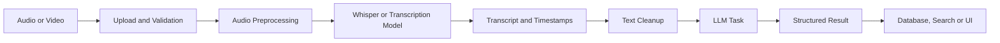
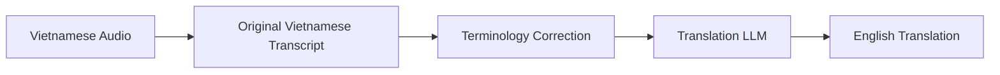
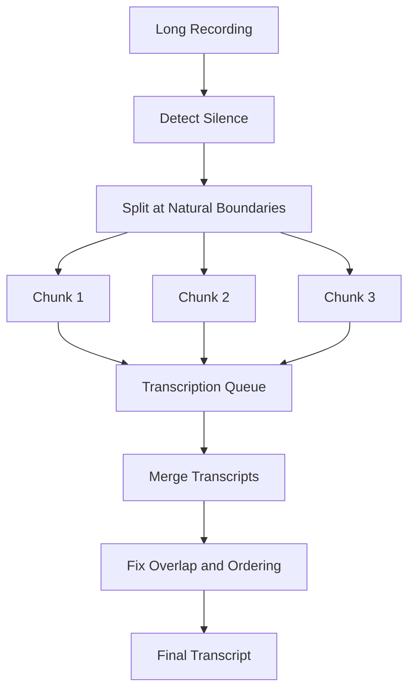
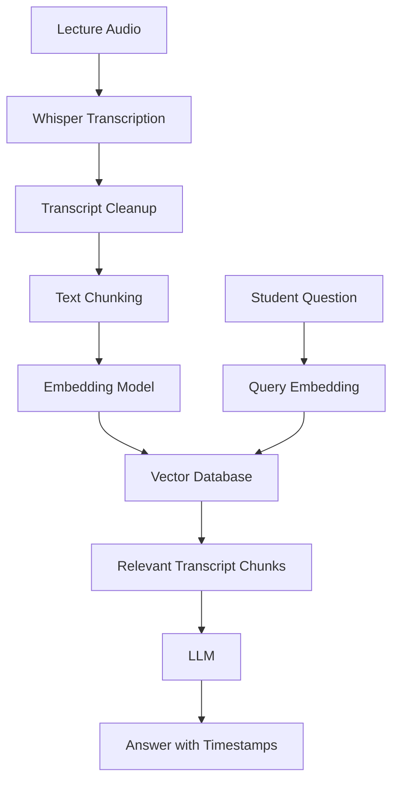
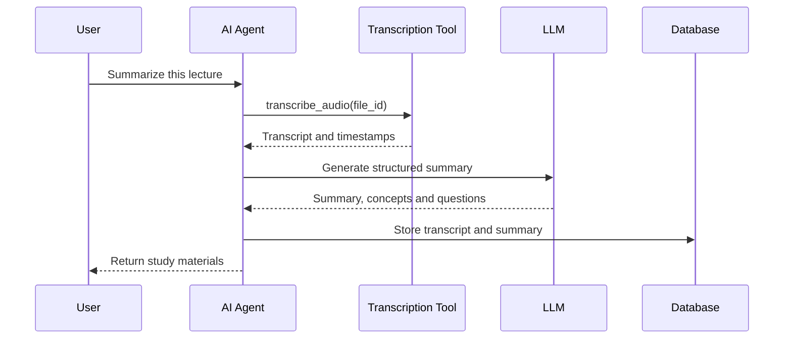
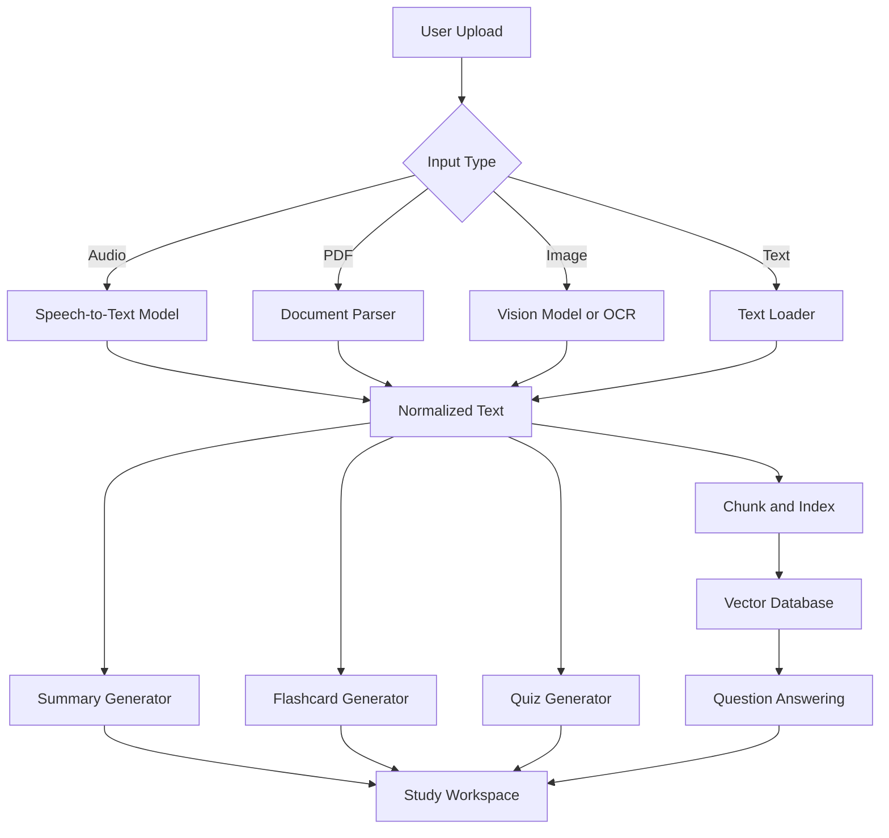

# 012 — Whisper API

**Course:** 04 — Agents, Multimodal and Tools
**Module:** Module 11 — Multimodal AI
**Content Group:** APIs and Frameworks
**Roadmap Source:** Multimodal AI / APIs and Frameworks
**Lesson Type:** Multimodal AI
**Order in Module:** 012
**Suggested Duration:** 22 minutes

---

## 1. Lesson Summary

The **Whisper API** converts spoken audio into written text. It allows an AI application to process lectures, meetings, interviews, podcasts, voice notes, customer-support calls, and video soundtracks.

Whisper is a general-purpose speech-recognition model that supports multilingual transcription, speech translation, and language identification. In the OpenAI API, it is available as the `whisper-1` model.

The OpenAI Audio API currently provides two main speech-to-text operations:

* **Transcription:** Convert speech into text in the original language.
* **Translation:** Convert speech from a supported language into English text.

Although these endpoints were historically powered by Whisper, the transcription endpoint now also supports newer models such as `gpt-4o-transcribe`, `gpt-4o-mini-transcribe`, and `gpt-4o-transcribe-diarize`.

After completing this lesson, you should understand:

* What the Whisper API does.
* Where speech recognition fits into a multimodal pipeline.
* How to call the transcription API.
* How to connect transcripts to LLM, RAG, and agent workflows.
* How to evaluate and debug speech-to-text systems in production.

---

## 2. Learning Objectives

By the end of this lesson, you should be able to:

1. Explain the Whisper API in your own words.
2. Distinguish transcription from speech translation.
3. Send an audio file to the OpenAI Audio API.
4. Generate transcripts, subtitles, and timestamped segments.
5. Connect speech recognition to an LLM or RAG pipeline.
6. Identify production risks involving audio quality, privacy, file size, latency, and hallucinated text.
7. Build a small audio-based portfolio project.

---

## 3. What Is the Whisper API?

The Whisper API is a hosted speech-to-text service.

Its basic responsibility is:

```text
Audio waveform → Speech recognition model → Written transcript
```

For example:

```text
Input audio:
"Today we will learn about retrieval-augmented generation."

Output text:
Today we will learn about retrieval-augmented generation.
```

Whisper does not normally answer questions about the audio directly. Its primary job is to transform audio into text. Another LLM can then summarize, classify, translate, search, or reason over that transcript.

### Simple mental model

```text
Whisper hears.
An LLM understands and responds.
A vector database remembers and retrieves.
An agent decides what action to take.
```

---

## 4. Transcription vs. Translation

### 4.1 Transcription

Transcription preserves the language spoken in the audio.

```text
Vietnamese audio
        ↓
Vietnamese transcript
```

Example:

```text
Audio:
"Hôm nay chúng ta sẽ học về trí tuệ nhân tạo đa phương thức."

Transcript:
"Hôm nay chúng ta sẽ học về trí tuệ nhân tạo đa phương thức."
```

The transcription endpoint is:

```text
POST /v1/audio/transcriptions
```

### 4.2 Speech Translation

Speech translation converts supported input audio into **English text**.

```text
Vietnamese audio
        ↓
English transcript
```

Example:

```text
Audio:
"Hôm nay chúng ta sẽ học về trí tuệ nhân tạo đa phương thức."

English output:
"Today we will learn about multimodal artificial intelligence."
```

The translation endpoint is:

```text
POST /v1/audio/translations
```

The translation endpoint currently supports only `whisper-1`, and its output language is English.

### Important distinction

Speech translation is not the same as:

```text
Audio → Vietnamese transcript → Translate with another LLM
```

The second workflow gives you more control because you can:

* Preserve the original transcript.
* Translate into languages other than English.
* Apply a glossary.
* Correct names before translating.
* Compare the original and translated versions.

---

## 5. Where Whisper Fits in a Multimodal System

A production application normally includes much more than one API call.



### Pipeline stages

#### Stage 1: Audio input

The audio may come from:

* Microphone recording
* Uploaded voice note
* Lecture recording
* Video file
* Meeting recording
* Customer-support call
* Podcast episode

#### Stage 2: Validation

The application should check:

* File type
* File size
* Duration
* MIME type
* Empty or corrupted files
* User permission and recording consent

The current file-upload transcription API accepts files up to 25 MB and supports formats including `mp3`, `mp4`, `mpeg`, `mpga`, `m4a`, `wav`, and `webm`.

#### Stage 3: Preprocessing

Possible preprocessing operations include:

* Extracting audio from a video
* Converting stereo to mono
* Reducing background noise
* Normalizing volume
* Removing long silent sections
* Compressing the file
* Splitting long recordings into chunks

#### Stage 4: Speech recognition

The transcription model generates text from the audio.

#### Stage 5: Post-processing

The raw transcript may require:

* Punctuation correction
* Speaker labels
* Paragraph separation
* Terminology correction
* Profanity filtering
* Personal-information redaction
* Duplicate removal

#### Stage 6: Downstream AI task

The transcript can be passed to another model for:

* Summarization
* Sentiment analysis
* Topic extraction
* Flashcard generation
* Quiz generation
* Question answering
* Action-item extraction
* RAG indexing
* Agent tool execution

---

## 6. Model Selection

“Whisper API” is often used informally to describe OpenAI speech-to-text functionality. However, the modern transcription API supports several model choices.

| Model                       | Typical use                                                                        |
| --------------------------- | ---------------------------------------------------------------------------------- |
| `whisper-1`                 | Traditional Whisper transcription, translation, subtitles, and detailed timestamps |
| `gpt-4o-mini-transcribe`    | Cost-sensitive general transcription                                               |
| `gpt-4o-transcribe`         | Higher-quality transcription                                                       |
| `gpt-4o-transcribe-diarize` | Transcription with speaker-separated segments                                      |

The supported output formats differ by model:

* `whisper-1`: `json`, `text`, `srt`, `verbose_json`, and `vtt`
* GPT-4o transcription models: primarily `json` or plain text
* The diarization model can return `diarized_json` with speaker segments

### Practical selection rule

Use `whisper-1` when you need:

* SRT subtitles
* VTT subtitles
* Word or segment timestamps
* Direct speech-to-English translation
* Compatibility with an existing Whisper workflow

Use a newer transcription model when you prioritize:

* Transcription quality
* Recognition of difficult accents
* Better recognition of domain terminology
* Speaker diarization

---

## 7. Basic Python Transcription Demo

### 7.1 Install the SDK

```bash
pip install openai
```

Set the API key as an environment variable:

```bash
export OPENAI_API_KEY="your-api-key"
```

On Windows PowerShell:

```powershell
$env:OPENAI_API_KEY="your-api-key"
```

Do not place a production API key directly inside source code.

### 7.2 Transcribe an audio file

```python
from pathlib import Path

from openai import OpenAI


client = OpenAI()
audio_path = Path("lecture.mp3")

if not audio_path.exists():
    raise FileNotFoundError(f"Audio file not found: {audio_path}")

with audio_path.open("rb") as audio_file:
    transcription = client.audio.transcriptions.create(
        model="whisper-1",
        file=audio_file,
    )

print(transcription.text)
```

### Execution flow

```text
lecture.mp3
    ↓
Read binary audio
    ↓
Send multipart request
    ↓
Whisper transcription
    ↓
Receive transcript
    ↓
Print or store text
```

---

## 8. Vietnamese Transcription with Context

You can provide a language hint and a prompt containing domain-specific context.

```python
from pathlib import Path

from openai import OpenAI


client = OpenAI()
audio_path = Path("vietnamese_ai_lecture.mp3")

with audio_path.open("rb") as audio_file:
    transcription = client.audio.transcriptions.create(
        model="whisper-1",
        file=audio_file,
        language="vi",
        prompt=(
            "This is a Vietnamese university lecture about AI agents, "
            "multimodal AI, retrieval-augmented generation, vector databases, "
            "OpenAI APIs, LangChain, and LlamaIndex."
        ),
    )

print(transcription.text)
```

The prompt can help the model recognize:

* Product names
* Personal names
* Technical terms
* Abbreviations
* Unusual spelling
* Expected punctuation style

For `whisper-1`, prompting is more limited than prompting a general-purpose LLM. The model may imitate the capitalization and punctuation style of the prompt, but the prompt does not provide complete control over the transcript.

### Good prompt

```text
This is a software engineering lecture about FastAPI, PostgreSQL,
Redis, Kafka, RAG, embeddings, and vector databases.
```

### Weak prompt

```text
Transcribe accurately.
```

The weak prompt provides almost no useful domain context.

---

## 9. Timestamped Transcription

Timestamps are useful for:

* Subtitle generation
* Audio navigation
* Video editing
* Search-result playback
* Transcript citations
* Linking a summary to its source audio

With `whisper-1`, request `verbose_json` and specify timestamp granularity.

```python
from pathlib import Path

from openai import OpenAI


client = OpenAI()

with Path("lecture.mp3").open("rb") as audio_file:
    transcription = client.audio.transcriptions.create(
        model="whisper-1",
        file=audio_file,
        response_format="verbose_json",
        timestamp_granularities=["segment"],
    )

print("Full transcript:")
print(transcription.text)

print("\nSegments:")

for segment in transcription.segments:
    print(
        f"[{segment.start:.2f}s → {segment.end:.2f}s] "
        f"{segment.text}"
    )
```

The API can provide timestamps at the segment level, word level, or both.

Example output:

```text
[0.00s → 4.82s] Today we will discuss multimodal artificial intelligence.
[4.82s → 9.40s] A multimodal system can process text, images, and audio.
[9.40s → 14.75s] Whisper converts spoken audio into written text.
```

### Timestamp-based citation

A study assistant could produce:

```text
Whisper is used as the speech-recognition stage of the system.
Source: Lecture audio, 09:40–14:75
```

This is more trustworthy than returning a summary without showing where the information came from.

---

## 10. Subtitle Generation

The `whisper-1` model can produce subtitle formats such as SRT and VTT.

### SRT example

```python
from pathlib import Path

from openai import OpenAI


client = OpenAI()

with Path("lesson.mp4").open("rb") as audio_file:
    subtitles = client.audio.transcriptions.create(
        model="whisper-1",
        file=audio_file,
        response_format="srt",
    )

Path("lesson.srt").write_text(
    subtitles,
    encoding="utf-8",
)
```

Example SRT output:

```text
1
00:00:00,000 --> 00:00:04,500
Welcome to the lesson about multimodal AI.

2
00:00:04,500 --> 00:00:09,200
Today we will build an audio transcription pipeline.
```

SRT files can be imported into:

* Video players
* YouTube
* Video-editing software
* Learning-management systems
* Accessibility tools

---

## 11. Speech Translation Demo

The translation API converts supported non-English speech into English text.

```python
from pathlib import Path

from openai import OpenAI


client = OpenAI()

with Path("vietnamese_audio.mp3").open("rb") as audio_file:
    translation = client.audio.translations.create(
        model="whisper-1",
        file=audio_file,
    )

print(translation.text)
```

Example:

```text
Input speech:
"Hệ thống sử dụng cơ sở dữ liệu vector để truy xuất tài liệu."

Output:
"The system uses a vector database to retrieve documents."
```

A more controllable multilingual workflow is:



This approach preserves both the original and translated text.

---

## 12. Long Audio Files

The standard file-upload API currently limits individual files to 25 MB. Large recordings must therefore be compressed or divided into smaller chunks. OpenAI recommends avoiding cuts in the middle of sentences because doing so may remove useful context.

### Long-audio pipeline



### Recommended strategy

1. Convert the recording to a compressed format.
2. Detect silence or sentence boundaries.
3. Create chunks below the file-size limit.
4. Add a small overlap between chunks.
5. Transcribe each chunk.
6. preserve the chunk start time.
7. Merge transcripts in chronological order.
8. Remove duplicate text from overlapping sections.

### Incorrect strategy

```text
Split every 10 minutes without checking speech boundaries.
```

Possible result:

```text
Chunk 1:
"The vector database stores high-dimensional—"

Chunk 2:
"—embeddings used for semantic retrieval."
```

The model may lose the connection between the two fragments.

---

## 13. Streaming and Realtime Transcription

There are two different streaming scenarios.

### Completed-file streaming

A completed recording can be submitted with streaming enabled so that transcript events arrive progressively as sections become available.

### Live microphone transcription

For continuous microphone, phone-call, or media-stream input, use a realtime transcription workflow rather than repeatedly uploading complete files. The official guide separates completed-audio streaming from ongoing realtime transcription with turn detection.

```text
Completed file:
Audio file → Transcription API → Stream transcript events

Live audio:
Microphone → Realtime connection → Audio chunks → Transcript deltas
```

### When realtime is useful

* Voice assistants
* Live captions
* Call-center assistance
* Interview transcription
* Classroom captioning
* Multiplayer voice moderation
* Voice-controlled agents

### When batch transcription is better

* Uploaded lectures
* Podcasts
* Recorded meetings
* Video-processing pipelines
* Offline content indexing

---

## 14. Whisper in a RAG Pipeline

Whisper is especially useful when the source knowledge exists in audio rather than documents.



### Example question

```text
What did the lecturer say about prompt injection?
```

### Retrieved context

```text
[18:32–19:15]
Prompt injection occurs when untrusted content attempts to override
the instructions controlling an AI system.
```

### Generated answer

```text
The lecturer described prompt injection as an attempt by untrusted
content to override the system's intended instructions.

Source: Lecture recording, 18:32–19:15.
```

### Important design rule

Store metadata with every transcript chunk:

```json
{
  "source_id": "lecture_012",
  "chunk_id": "lecture_012_004",
  "start_seconds": 1112.4,
  "end_seconds": 1155.2,
  "language": "en",
  "speaker": "lecturer",
  "text": "Prompt injection occurs when..."
}
```

Without timestamps and source metadata, the system cannot reliably connect an answer back to the original audio.

---

## 15. Whisper as an Agent Tool

An AI agent can use transcription as a tool.

### Tool definition

```json
{
  "name": "transcribe_audio",
  "description": "Convert an uploaded audio recording into text.",
  "parameters": {
    "type": "object",
    "properties": {
      "file_id": {
        "type": "string"
      },
      "language": {
        "type": "string"
      },
      "include_timestamps": {
        "type": "boolean"
      }
    },
    "required": ["file_id"]
  }
}
```

### Agent workflow



### Tool result

```json
{
  "status": "success",
  "language": "vi",
  "duration_seconds": 1240,
  "text": "...",
  "segments": [
    {
      "start": 0.0,
      "end": 5.2,
      "text": "..."
    }
  ]
}
```

The tool should return structured data rather than an unstructured message such as:

```text
The audio was processed successfully.
```

The agent needs the actual transcript, timestamps, language, duration, and error status.

---

## 16. Complete Multimodal Study Assistant Workflow

The related portfolio project can combine audio, PDFs, images, and text.



### Possible output schema

```json
{
  "title": "Introduction to Multimodal AI",
  "language": "en",
  "summary": "The lecture introduces systems that process multiple modalities.",
  "key_concepts": [
    {
      "name": "Modality",
      "definition": "A type of information such as text, image or audio.",
      "timestamp": "00:02:14"
    }
  ],
  "flashcards": [
    {
      "front": "What is speech recognition?",
      "back": "The process of converting spoken audio into text."
    }
  ],
  "quiz": [
    {
      "question": "Which component converts speech to text?",
      "options": [
        "Embedding model",
        "Whisper",
        "Vector database",
        "Reranker"
      ],
      "answer": "Whisper"
    }
  ]
}
```

---

## 17. Audio Quality and Preprocessing

Speech-recognition accuracy depends heavily on input quality.

### Common quality problems

| Problem               | Possible effect                     |
| --------------------- | ----------------------------------- |
| Background music      | Words may be omitted or replaced    |
| Multiple speakers     | Sentences may be combined           |
| Echo                  | Repeated or distorted phrases       |
| Low microphone volume | Missing words                       |
| Clipping              | Incorrect phoneme recognition       |
| Strong accents        | Higher word error rate              |
| Technical vocabulary  | Incorrect names and abbreviations   |
| Code-switching        | Wrong language detection            |
| Long silence          | Higher latency and unnecessary cost |

### Useful preprocessing checklist

```text
[ ] Validate the input file
[ ] Extract the audio track if input is video
[ ] Normalize volume
[ ] Reduce extreme background noise
[ ] Preserve natural speech boundaries
[ ] Compress oversized files
[ ] Record the original duration
[ ] Store chunk offsets
[ ] Keep the original file for debugging
```

Do not aggressively remove noise without testing. Excessive filtering can also remove speech frequencies and reduce transcription quality.

---

## 18. Evaluation

A transcript that looks reasonable may still contain serious errors.

### 18.1 Word Error Rate

A common speech-recognition metric is Word Error Rate:

```text
WER = (Substitutions + Deletions + Insertions) / Reference Words
```

Example:

```text
Reference:
The agent retrieves documents from the vector database.

Prediction:
The agent retrieves document from a vector data base.
```

Possible errors:

* Deletion: missing “s” or missing word
* Substitution: one word replaced by another
* Insertion: additional incorrect word

Lower WER is better.

### 18.2 Domain-term accuracy

General WER may hide important mistakes.

Example:

```text
Correct term: PostgreSQL
Transcript: post grey sequel
```

For an AI Engineer application, evaluate a separate glossary containing:

* Model names
* Framework names
* Database names
* Personal names
* Product names
* Technical abbreviations

### 18.3 Useful production metrics

```text
transcription_success_rate
average_processing_latency
p95_processing_latency
word_error_rate
domain_term_accuracy
empty_transcript_rate
language_detection_accuracy
timestamp_error
cost_per_audio_minute
retry_rate
```

### 18.4 Human evaluation

Ask reviewers to score:

* Correctness
* Completeness
* Punctuation
* Speaker separation
* Technical-term accuracy
* Timestamp accuracy
* Readability

---

## 19. Privacy and Safety

Audio can contain highly sensitive information.

Examples include:

* Names and addresses
* Medical conversations
* Financial information
* Private meetings
* Passwords spoken aloud
* Biometric voice characteristics
* Information about people who did not consent to recording

### Production checklist

```text
[ ] Obtain appropriate recording consent
[ ] Authenticate upload requests
[ ] Limit file size and duration
[ ] Encrypt files in transit and at rest
[ ] Restrict transcript access
[ ] Define a deletion and retention policy
[ ] Redact sensitive information when necessary
[ ] Avoid logging complete private transcripts
[ ] Record administrative access
[ ] Review the provider's current data policies
```

Do not store a full transcript inside application logs merely because logging is convenient.

Bad:

```python
logger.info("Transcript: %s", transcription.text)
```

Better:

```python
logger.info(
    "Transcription completed",
    extra={
        "request_id": request_id,
        "audio_duration_seconds": duration,
        "transcript_length": len(transcription.text),
    },
)
```

---

## 20. Cost and Latency

The `whisper-1` model page currently lists transcription pricing at **$0.006 per audio minute**. Pricing can change, so production systems should read pricing from current documentation rather than hardcoding long-term assumptions.

Example estimate:

```text
100 hours of audio
= 6,000 audio minutes

Estimated Whisper transcription cost
= 6,000 × $0.006
= $36
```

Application cost may also include:

* Object storage
* Audio preprocessing
* LLM summarization
* Embedding generation
* Vector database storage
* Translation
* Retry requests
* Monitoring infrastructure

### Latency optimization

Possible strategies:

* Compress large audio files.
* Process independent chunks concurrently.
* Use a job queue for long recordings.
* Return a job ID instead of blocking an HTTP request.
* Stream partial transcript events.
* Cache transcripts by file hash.
* Skip retranscription when the same file already exists.

---

## 21. Common Production Failure

### Scenario

A user uploads a 90-minute Vietnamese lecture.

The application:

1. Splits it into fixed 10-minute chunks.
2. Transcribes every chunk separately.
3. Joins the results.
4. Generates a summary.

The final transcript contains duplicated sentences, missing words, and incorrectly recognized technical names.

### Possible causes

* Chunks were cut in the middle of sentences.
* Chunk overlaps were merged without deduplication.
* No domain-specific prompt was provided.
* Audio offsets were not preserved.
* Several chunks completed out of order.
* Background music reduced speech clarity.
* The summarizer received chunks in the wrong sequence.

### Debugging process

#### Step 1: Preserve intermediate artifacts

Store:

```text
original_audio
normalized_audio
chunk_files
chunk_metadata
raw_transcription_responses
merged_transcript
final_summary
```

#### Step 2: Inspect chunk boundaries

Check whether chunks begin or end in the middle of speech.

#### Step 3: Verify ordering

```python
chunks = sorted(chunks, key=lambda chunk: chunk.start_seconds)
```

#### Step 4: Compare raw and merged transcripts

Determine whether duplication came from transcription or merging.

#### Step 5: Test a terminology prompt

```text
This lecture discusses Kafka, Spark, MongoDB, FastAPI,
LangChain, LlamaIndex, RAG, embeddings, and vector databases.
```

#### Step 6: Build a regression dataset

Keep several representative audio samples:

```text
clear Vietnamese speech
Vietnamese with English technical terms
two speakers
background noise
quiet microphone
long lecture
short voice note
```

Run the same dataset after every pipeline change.

---

## 22. Common Mistakes

### Mistake 1: Treating transcription as perfect ground truth

Speech-recognition models can omit, replace, or invent words.

**Better approach:** Preserve the source audio and provide timestamps for verification.

### Mistake 2: Sending every file directly to the API

Large, corrupted, or unsupported files may fail.

**Better approach:** Validate file size, type, duration, and content before processing.

### Mistake 3: Ignoring technical vocabulary

Names such as “Qdrant,” “LlamaIndex,” and “PostgreSQL” may be incorrectly transcribed.

**Better approach:** Supply domain context and evaluate terminology separately.

### Mistake 4: Splitting audio at arbitrary byte positions

This destroys sentence boundaries and audio context.

**Better approach:** Split by silence, duration, or natural turn boundaries.

### Mistake 5: Losing timestamps during text cleanup

A cleaned transcript becomes difficult to trace to the source.

**Better approach:** Preserve stable segment identifiers and time ranges.

### Mistake 6: Logging private transcripts

This increases the risk of exposing sensitive information.

**Better approach:** Log metadata, request IDs, error codes, and aggregate measurements.

### Mistake 7: Using batch transcription for a live assistant

Repeated uploads create unnecessary delay.

**Better approach:** Use realtime transcription for microphone or call streams.

### Mistake 8: Evaluating only one clear audio sample

A happy-path demo does not represent production traffic.

**Better approach:** Test noise, accents, silence, multiple speakers, long recordings, and mixed languages.

---

## 23. Hands-On Exercise

Build a small command-line **Audio Study Assistant**.

### Requirements

1. Accept an MP3, M4A, WAV, or WebM file.
2. Validate that the file exists.
3. Transcribe it with `whisper-1`.
4. Request timestamped segments.
5. Save the full transcript as Markdown.
6. Send the transcript to an LLM.
7. Generate:

   * A short summary
   * Five key concepts
   * Five flashcards
   * Five quiz questions
8. Include source timestamps in the generated study materials.
9. Record processing duration and errors.

### Suggested output

```text
output/
├── transcript.json
├── transcript.md
├── summary.md
├── flashcards.json
├── quiz.json
└── metadata.json
```

### Metadata example

```json
{
  "source_file": "lecture.mp3",
  "language": "vi",
  "duration_seconds": 1435,
  "model": "whisper-1",
  "transcription_status": "completed",
  "segment_count": 284,
  "processing_seconds": 42.7
}
```

### Optional extension

Create a FastAPI endpoint:

```text
POST /api/v1/study/audio
```

Response:

```json
{
  "job_id": "audio_job_123",
  "status": "processing"
}
```

Status endpoint:

```text
GET /api/v1/study/audio/audio_job_123
```

Completed response:

```json
{
  "job_id": "audio_job_123",
  "status": "completed",
  "transcript_url": "/files/transcript.md",
  "summary_url": "/files/summary.md",
  "flashcards_url": "/files/flashcards.json",
  "quiz_url": "/files/quiz.json"
}
```

---

## 24. Five-Line Review

After finishing the lesson, try to reproduce these ideas without reading:

```text
1. Whisper converts spoken audio into written text.
2. Transcription preserves the original language, while translation produces English.
3. Audio normally requires validation, preprocessing, transcription and post-processing.
4. Timestamps make transcripts searchable, verifiable and useful for subtitles.
5. Production systems must evaluate quality, privacy, latency, cost and failure cases.
```

---

## 25. Completion Checklist

### Understanding

* [ ] I can explain the Whisper API in one or two minutes.
* [ ] I understand transcription and speech translation.
* [ ] I understand the difference between uploaded-file and realtime transcription.
* [ ] I know where speech recognition belongs in a multimodal pipeline.

### Implementation

* [ ] I can send an audio file to the transcription endpoint.
* [ ] I can select an appropriate transcription model.
* [ ] I can request text, subtitle, or timestamped output.
* [ ] I can process long recordings safely.
* [ ] I can connect transcripts to an LLM or RAG pipeline.

### Production

* [ ] I validate input format and file size.
* [ ] I preserve source timestamps.
* [ ] I evaluate technical vocabulary.
* [ ] I avoid logging private transcript content.
* [ ] I track latency, error rate and cost.
* [ ] I have tested noisy and multilingual audio.
* [ ] I have documented at least one limitation or open question.

---

## 26. Related Outcome

**Build applications that work with text, images, documents, audio, speech, and video.**

Whisper provides the speech-to-text bridge that lets text-oriented AI systems understand information stored in spoken recordings.

---

## 27. Related Project

### Project 10: Multimodal Study Assistant

Build a study application that accepts:

* Audio lectures
* PDFs
* Images
* Notes

The system should produce:

* Searchable transcripts
* Structured summaries
* Flashcards
* Quizzes
* Question answering
* Source citations
* Audio timestamps

A strong portfolio version should demonstrate the complete pipeline:

```text
Upload
→ Parse modality
→ Normalize content
→ Transcribe or extract text
→ Create embeddings
→ Retrieve evidence
→ Generate study materials
→ Evaluate output
→ Display source references
```

---

## 28. Final Summary

The Whisper API gives an AI application the ability to process spoken information.

However, a production speech application is not simply:

```text
audio → API → text
```

A reliable system is:

```text
audio
→ validation
→ preprocessing
→ transcription
→ timestamp preservation
→ text cleanup
→ evaluation
→ LLM or RAG processing
→ structured and traceable result
```

The most important lesson is to treat transcription as an imperfect model output rather than unquestionable ground truth.

Turn this topic into a working artifact: a transcription API route, subtitle generator, meeting summarizer, searchable podcast system, voice-note agent tool, or multimodal study assistant.

---

# Bài luyện tập

## Mục tiêu


## Đề bài


## Yêu cầu hoàn thành

- [ ] 
- [ ] 
- [ ] 

## Kết quả / lời giải


## Ghi chú
