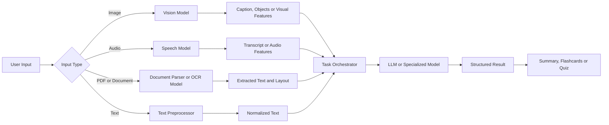
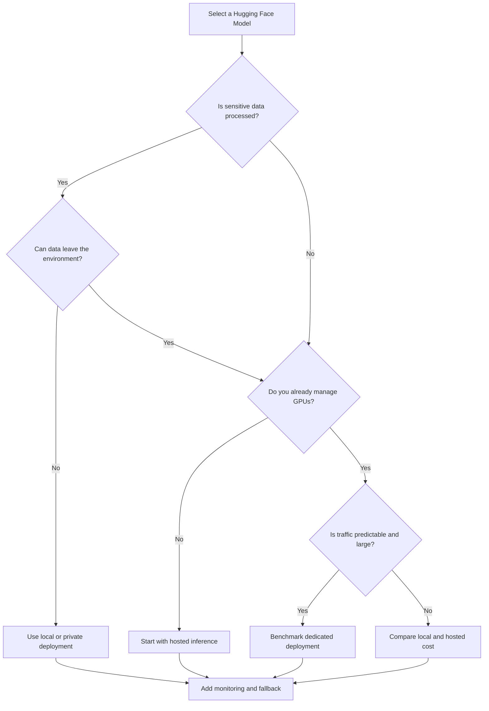
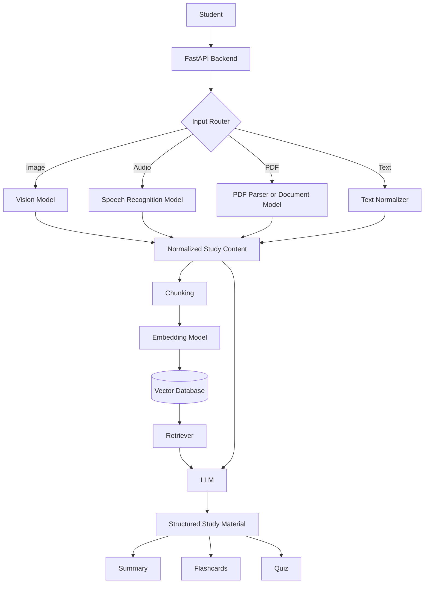

# 013 — Hugging Face Models

**Course:** 04 — Agents, Multimodal and Tools
**Module:** Module 11 — Multimodal AI
**Content Group:** APIs and Frameworks
**Roadmap Source:** Multimodal AI / APIs and Frameworks
**Lesson Type:** Multimodal AI
**Order in Module:** 013
**Suggested Duration:** 22 minutes

---

## 1. Lesson Summary

This lesson explains **Hugging Face Models** in the context of modern AI engineering.

Hugging Face is an ecosystem for discovering, evaluating, downloading, fine-tuning, deploying, and sharing machine learning models. Its Model Hub contains models for many tasks and modalities, including:

* Text generation
* Text classification
* Embeddings
* Image classification
* Object detection
* Image captioning
* Text-to-image generation
* Speech recognition
* Text-to-speech
* Document understanding
* Video processing
* Multimodal question answering

For AI engineers, Hugging Face is especially useful when building applications that require more control than a closed hosted API provides.

By the end of this lesson, you should understand:

* What a Hugging Face model repository contains
* How to evaluate a model before using it
* How to run models locally or through hosted inference
* How Hugging Face fits into a multimodal AI workflow
* What production problems can occur when using open models

---

## 2. Learning Objectives

After completing this lesson, you should be able to:

1. Explain Hugging Face Models in your own words.
2. Identify where Hugging Face fits into an AI engineering workflow.
3. Read and evaluate a model card.
4. Load a pretrained model with the `transformers` library.
5. Choose between local inference and hosted inference.
6. Integrate an open model into a multimodal application.
7. Identify infrastructure, licensing, safety, and performance limitations.
8. Build a small portfolio demo using at least one Hugging Face model.

---

## 3. What Is Hugging Face?

Hugging Face is an open machine learning platform and ecosystem.

Its main components include:

* **Models:** Pretrained machine learning models
* **Datasets:** Public and private datasets
* **Spaces:** Interactive machine learning applications and demos
* **Model cards:** Documentation for individual models
* **Libraries:** Tools such as Transformers, Diffusers, Datasets, Tokenizers, and Accelerate
* **Inference services:** Hosted options for running models through APIs
* **Community:** Researchers, companies, and developers sharing AI resources

The Hugging Face Hub can be understood as a version-controlled repository system for machine learning artifacts.

A typical model repository may contain:

```text
model-repository/
├── README.md
├── config.json
├── tokenizer.json
├── tokenizer_config.json
├── preprocessor_config.json
├── generation_config.json
├── model.safetensors
└── example files
```

The exact files depend on the model architecture and task.

---

## 4. Why Hugging Face Matters to AI Engineers

Closed model APIs are convenient, but they do not always provide enough control.

Hugging Face models can offer:

* Greater control over model selection
* Local or private deployment
* Fine-tuning on domain-specific data
* Custom inference pipelines
* Offline execution
* Lower marginal cost at high volume
* Access to research models
* Transparent model documentation
* Model quantization and optimization
* More control over data privacy

However, open models often require additional engineering work.

You may need to manage:

* GPU infrastructure
* Model memory requirements
* Tokenizers and preprocessors
* Model versioning
* Quantization
* Batching
* Autoscaling
* Monitoring
* Security
* Model licenses
* Safety filtering

A useful rule is:

> Hosted APIs optimize for convenience, while open models optimize for control.

---

## 5. Core Hugging Face Libraries

### 5.1 Transformers

The `transformers` library provides standardized interfaces for working with pretrained models.

It supports tasks such as:

* Text generation
* Classification
* Question answering
* Translation
* Summarization
* Image classification
* Image captioning
* Speech recognition
* Document question answering

Example installation:

```bash
pip install transformers torch
```

---

### 5.2 Diffusers

The `diffusers` library focuses on diffusion models.

Common tasks include:

* Text-to-image generation
* Image-to-image transformation
* Inpainting
* Image editing
* Video generation
* Audio generation

Example installation:

```bash
pip install diffusers transformers accelerate torch
```

---

### 5.3 Datasets

The `datasets` library helps engineers load, transform, stream, and process datasets.

Example:

```python
from datasets import load_dataset

dataset = load_dataset("ag_news")

print(dataset)
print(dataset["train"][0])
```

---

### 5.4 Accelerate

The `accelerate` library simplifies model execution across:

* CPUs
* Single GPUs
* Multiple GPUs
* Distributed environments
* Mixed-precision configurations

It is especially useful when training or deploying larger models.

---

### 5.5 Tokenizers

The `tokenizers` library provides fast tokenization implemented with optimized native components.

A tokenizer converts raw input into model-compatible units.

```text
"Multimodal AI is useful"
          ↓
["Multi", "modal", "AI", "is", "useful"]
          ↓
[4217, 9932, 319, 374, 4465]
```

Different models may use different tokenization strategies, vocabularies, and special tokens.

---

## 6. Hugging Face Model Cards

A **model card** is the primary documentation page for a model.

Before using a model, examine its model card carefully.

### 6.1 Important Model Card Information

Check the following fields:

| Area            | Questions to Ask                                                  |
| --------------- | ----------------------------------------------------------------- |
| Task            | What problem does the model solve?                                |
| Modality        | Does it accept text, image, audio, video, or multiple modalities? |
| License         | Can it be used commercially?                                      |
| Intended use    | What applications was it designed for?                            |
| Limitations     | Where does the model perform poorly?                              |
| Languages       | Which languages are supported?                                    |
| Input format    | What preprocessing is required?                                   |
| Output format   | What does the model return?                                       |
| Model size      | Can your infrastructure run it?                                   |
| Evaluation      | Which datasets and metrics were used?                             |
| Bias and safety | What harmful or biased behavior is documented?                    |
| Training data   | Is information about the training data available?                 |
| Version         | Is the application pinned to a specific revision?                 |

---

### 6.2 License Evaluation

A model being publicly downloadable does not automatically mean it can be used for every purpose.

Possible license restrictions may affect:

* Commercial use
* Redistribution
* Model modification
* Hosting
* Derivative models
* Acceptable use
* Attribution requirements

A production team should record:

```text
Model ID:
Model revision:
License:
Commercial use permitted:
Attribution required:
Known restrictions:
Review owner:
Review date:
```

Do not rely only on the model name or repository tags. Read the complete license and model card.

---

### 6.3 Model Card Risk Example

Suppose an engineer selects a vision-language model because its demo produces impressive captions.

However, the model card reveals that:

* It was evaluated mainly on English data.
* It may hallucinate objects.
* It performs poorly on small text.
* It should not be used for medical interpretation.
* Commercial use is restricted.

The demo may work technically, but the model may still be unsuitable for the product.

---

## 7. The Hugging Face Multimodal Workflow

A multimodal application may use several specialized models before calling a language model.



A simplified version is:

```text
image/audio/document
        ↓
modality-specific parser or model
        ↓
text, labels, embeddings or features
        ↓
LLM or application task
        ↓
structured result
```

The model does not have to perform the entire workflow.

A strong production system often combines specialized components.

For example:

```text
Lecture audio
    ↓
Speech recognition model
    ↓
Timestamped transcript
    ↓
Text chunking
    ↓
Embedding model
    ↓
Vector database
    ↓
LLM
    ↓
Summary, quiz and flashcards
```

---

## 8. The Pipeline API

The Hugging Face `pipeline` API provides a high-level interface for running models.

Instead of manually loading every model component, you specify a task and model.

### 8.1 Text Classification Example

```python
from transformers import pipeline

classifier = pipeline(
    task="text-classification",
    model="distilbert-base-uncased-finetuned-sst-2-english",
)

result = classifier("The lesson was clear and practical.")

print(result)
```

Possible output:

```python
[
    {
        "label": "POSITIVE",
        "score": 0.9998
    }
]
```

---

### 8.2 Image Captioning Example

Install the required packages:

```bash
pip install transformers torch pillow
```

Python example:

```python
from pathlib import Path

from PIL import Image
from transformers import pipeline


def generate_caption(image_path: str) -> str:
    path = Path(image_path)

    if not path.exists():
        raise FileNotFoundError(f"Image not found: {path}")

    captioner = pipeline(
        task="image-to-text",
        model="Salesforce/blip-image-captioning-base",
    )

    image = Image.open(path).convert("RGB")
    results = captioner(image, max_new_tokens=50)

    if not results:
        raise RuntimeError("The model returned no captions.")

    return results[0]["generated_text"]


if __name__ == "__main__":
    caption = generate_caption("study_diagram.jpg")
    print(caption)
```

Possible output:

```text
a student looking at a scientific diagram on a laptop
```

The generated caption can then be passed to another model.

```text
Image
  ↓
Image captioning model
  ↓
"A diagram showing the parts of a plant cell"
  ↓
LLM
  ↓
Explanation and quiz questions
```

---

### 8.3 Speech Recognition Example

```bash
pip install transformers torch librosa soundfile
```

```python
from pathlib import Path

from transformers import pipeline


def transcribe_audio(audio_path: str) -> str:
    path = Path(audio_path)

    if not path.exists():
        raise FileNotFoundError(f"Audio file not found: {path}")

    transcriber = pipeline(
        task="automatic-speech-recognition",
        model="openai/whisper-small",
    )

    result = transcriber(str(path))

    transcript = result.get("text", "").strip()

    if not transcript:
        raise RuntimeError("The transcription was empty.")

    return transcript


if __name__ == "__main__":
    transcript = transcribe_audio("lecture.wav")
    print(transcript)
```

For long audio, production systems normally need:

* Audio chunking
* Voice activity detection
* Timestamp handling
* Language detection
* Noise management
* File size validation
* Asynchronous job processing
* Retry logic

---

## 9. Manual Model Loading

The `pipeline` API is convenient, but manual loading gives more control.

```python
import torch
from transformers import AutoModelForSequenceClassification, AutoTokenizer


MODEL_ID = "distilbert-base-uncased-finetuned-sst-2-english"


def load_model():
    tokenizer = AutoTokenizer.from_pretrained(MODEL_ID)

    model = AutoModelForSequenceClassification.from_pretrained(MODEL_ID)
    model.eval()

    return tokenizer, model


def classify_text(text: str) -> dict:
    tokenizer, model = load_model()

    inputs = tokenizer(
        text,
        return_tensors="pt",
        truncation=True,
        max_length=512,
    )

    with torch.inference_mode():
        outputs = model(**inputs)

    probabilities = torch.softmax(outputs.logits, dim=-1)[0]
    predicted_id = int(torch.argmax(probabilities).item())

    return {
        "label": model.config.id2label[predicted_id],
        "score": float(probabilities[predicted_id].item()),
    }


print(classify_text("This framework is easy to integrate."))
```

Manual loading is useful when you need:

* Custom batching
* Custom preprocessing
* Access to hidden states
* Embedding extraction
* Special decoding logic
* Device management
* Quantization
* Performance profiling
* Multiple model heads

---

## 10. Local Inference vs Hosted Inference

Hugging Face models can be used through different deployment strategies.

### 10.1 Local Inference

The model runs on your machine or server.

```text
Application
    ↓
Local model server
    ↓
CPU or GPU
    ↓
Prediction
```

Advantages:

* Greater privacy
* Full configuration control
* Offline operation
* No external request dependency
* Easier custom optimization
* Predictable behavior after version pinning

Disadvantages:

* Infrastructure complexity
* GPU cost
* Scaling responsibility
* Deployment complexity
* Model loading time
* Monitoring requirements

---

### 10.2 Hosted Inference

The application calls a remote model service.

```text
Application
    ↓
HTTPS request
    ↓
Hosted model endpoint
    ↓
Prediction response
```

Advantages:

* Faster initial development
* No local GPU management
* Easier prototypes
* Simplified scaling for early applications
* Easier access to large models

Disadvantages:

* Network latency
* External service dependency
* Usage-based cost
* Data privacy considerations
* Rate limits
* Less infrastructure control

---

### 10.3 Deployment Decision Table

| Requirement                    | Preferred Direction           |
| ------------------------------ | ----------------------------- |
| Fast prototype                 | Hosted inference              |
| Sensitive private data         | Local or private endpoint     |
| Offline application            | Local inference               |
| Highly customized model        | Local or dedicated endpoint   |
| Low traffic                    | Hosted inference              |
| High stable traffic            | Benchmark both options        |
| Large model with no GPU team   | Hosted inference              |
| Strict latency control         | Dedicated or local deployment |
| Frequent model experimentation | Hosted or managed deployment  |
| Edge device                    | Small optimized local model   |

---

### 10.4 Decision Diagram



---

## 11. Selecting the Right Model

Do not choose a model only because it is popular.

A good selection process includes four stages.

### Stage 1: Define the Task

Specify exactly what the model must do.

Weak requirement:

```text
We need an image model.
```

Better requirement:

```text
We need to classify textbook diagrams into biology, chemistry,
physics, mathematics and computer science categories.
```

---

### Stage 2: Define Constraints

Record:

* Supported languages
* Maximum latency
* Maximum memory usage
* Accuracy target
* Input size
* Output format
* Privacy requirements
* Commercial requirements
* Hardware availability
* Expected request volume

---

### Stage 3: Create a Candidate List

Compare several models using:

* Model cards
* Evaluation scores
* Model size
* Community feedback
* Recent maintenance
* Example applications
* License compatibility
* Hardware requirements

---

### Stage 4: Benchmark on Your Own Data

Public benchmark scores are not enough.

Create an internal evaluation dataset containing:

* Common cases
* Difficult cases
* Noisy cases
* Invalid inputs
* Multilingual inputs
* Long inputs
* Domain-specific examples
* Safety-sensitive examples

Measure:

* Accuracy
* Precision and recall
* Hallucination rate
* Latency
* Memory usage
* Throughput
* Cost per request
* Failure rate

---

## 12. Hugging Face in a Multimodal Study Assistant

Consider the project:

> Build a Multimodal Study Assistant that accepts images, PDFs, and audio, then generates summaries, flashcards, and quizzes.

Hugging Face models can support different pipeline stages.

| Input               | Model Task                    | Intermediate Result |
| ------------------- | ----------------------------- | ------------------- |
| Lecture audio       | Automatic speech recognition  | Transcript          |
| Diagram image       | Image captioning              | Visual description  |
| Scanned page        | Document understanding or OCR | Extracted text      |
| Textbook section    | Embeddings                    | Searchable vectors  |
| Student question    | Text generation               | Explanation         |
| Generated questions | Classification                | Difficulty label    |

### Example Architecture



---

## 13. Example API Route

The following example creates a basic FastAPI endpoint for image captioning.

```bash
pip install fastapi uvicorn python-multipart transformers torch pillow
```

```python
from contextlib import asynccontextmanager
from io import BytesIO
from typing import Any

from fastapi import FastAPI, File, HTTPException, UploadFile
from PIL import Image, UnidentifiedImageError
from transformers import pipeline


captioner: Any = None


@asynccontextmanager
async def lifespan(app: FastAPI):
    global captioner

    captioner = pipeline(
        task="image-to-text",
        model="Salesforce/blip-image-captioning-base",
    )

    yield

    captioner = None


app = FastAPI(
    title="Multimodal Study Assistant",
    lifespan=lifespan,
)


@app.post("/api/v1/images/caption")
async def caption_image(
    file: UploadFile = File(...),
) -> dict[str, str]:
    if file.content_type not in {
        "image/jpeg",
        "image/png",
        "image/webp",
    }:
        raise HTTPException(
            status_code=415,
            detail="Unsupported image format.",
        )

    raw_data = await file.read()

    if len(raw_data) > 10 * 1024 * 1024:
        raise HTTPException(
            status_code=413,
            detail="Image exceeds the 10 MB limit.",
        )

    try:
        image = Image.open(BytesIO(raw_data)).convert("RGB")
    except UnidentifiedImageError as exc:
        raise HTTPException(
            status_code=400,
            detail="The uploaded file is not a valid image.",
        ) from exc

    try:
        results = captioner(
            image,
            max_new_tokens=50,
        )
    except Exception as exc:
        raise HTTPException(
            status_code=500,
            detail="Image captioning failed.",
        ) from exc

    if not results:
        raise HTTPException(
            status_code=500,
            detail="The model returned no result.",
        )

    return {
        "filename": file.filename or "unknown",
        "caption": results[0]["generated_text"],
    }
```

Run the API:

```bash
uvicorn main:app --reload
```

The endpoint can become one tool inside a larger agent system.

```text
Agent
  ↓
caption_image tool
  ↓
Image captioning API
  ↓
Visual description
  ↓
Agent reasoning
  ↓
Study explanation
```

---

## 14. Models as Agent Tools

A Hugging Face model can be wrapped as a callable tool.

For example, an agent may have access to:

```text
Tools:
- transcribe_audio
- caption_image
- classify_document
- generate_embedding
- detect_objects
- summarize_text
```

The agent does not need to know the internal neural network details. It needs:

* A clear tool name
* A precise description
* A validated input schema
* A predictable output schema
* Failure information
* Timeout behavior

Example tool contract:

```json
{
  "name": "caption_image",
  "description": "Generate a short factual description of an uploaded study image.",
  "input": {
    "image_id": "string"
  },
  "output": {
    "caption": "string",
    "model": "string",
    "confidence": "number"
  }
}
```

A structured contract makes the model easier to integrate with agents, workflows, and monitoring systems.

---

## 15. Model Versioning

Using only a model ID may cause reproducibility problems.

For example:

```python
model = AutoModel.from_pretrained("organization/model-name")
```

The repository may change later.

A safer production approach is to pin a revision:

```python
model = AutoModel.from_pretrained(
    "organization/model-name",
    revision="specific-commit-hash",
)
```

Record at least:

```text
model_id
revision
library_version
runtime_version
hardware
quantization configuration
preprocessing configuration
deployment date
```

This helps answer:

* Which model produced this output?
* Did performance change after deployment?
* Can the result be reproduced?
* Which version should be rolled back?

---

## 16. Model Formats and Security

Model files are executable-adjacent artifacts and should be treated carefully.

Safer practices include:

* Prefer trusted repositories.
* Review repository ownership.
* Inspect model documentation.
* Pin model revisions.
* Avoid unnecessary remote custom code.
* Review dependencies.
* Scan downloaded artifacts.
* Restrict model loading permissions.
* Use isolated deployment environments.
* Prefer safer serialization formats when available.

Some repositories require custom Python code.

A model may be loaded with an option similar to:

```python
trust_remote_code=True
```

This option should not be enabled casually because it may execute repository-provided code.

Production teams should review the repository before allowing remote code execution.

---

## 17. Quantization

Large models may require more memory than the available hardware provides.

Quantization reduces numerical precision to lower memory usage and sometimes improve inference speed.

Common precision levels include:

* FP32
* FP16
* BF16
* INT8
* INT4

Conceptually:

```text
Higher precision
    ↓
More memory and computation
    ↓
Potentially higher numerical fidelity

Lower precision
    ↓
Less memory and faster inference
    ↓
Possible quality degradation
```

Quantization is not automatically beneficial for every model or device.

Always benchmark:

* Output quality
* Latency
* Memory usage
* Throughput
* Hardware compatibility
* Numerical stability

---

## 18. Performance Optimization

### 18.1 Load the Model Once

Do not reload the model for every request.

Bad pattern:

```python
@app.post("/predict")
def predict(data: Input):
    model = load_model()
    return model(data.text)
```

Better pattern:

```python
model = load_model()


@app.post("/predict")
def predict(data: Input):
    return model(data.text)
```

For production applications, model initialization should normally occur during application startup.

---

### 18.2 Use Batching

Processing several inputs together can improve GPU utilization.

```text
Request 1 ─┐
Request 2 ─┼──> Batch Queue ──> Model ──> Results
Request 3 ─┤
Request 4 ─┘
```

However, batching introduces a trade-off:

* Larger batches may increase throughput.
* Waiting to build a batch may increase latency.

---

### 18.3 Use Inference Mode

With PyTorch, disable gradient tracking during inference.

```python
with torch.inference_mode():
    outputs = model(**inputs)
```

This reduces unnecessary memory and computation.

---

### 18.4 Control Input Size

Large images, long audio files, and long text inputs can create resource problems.

Validate:

* Maximum image dimensions
* Maximum file size
* Maximum audio duration
* Maximum token count
* Supported file formats
* Maximum batch size

---

### 18.5 Add Timeouts and Queues

Large multimodal models may not respond quickly.

Use:

* Request timeouts
* Background job queues
* Job status endpoints
* Retry policies
* Circuit breakers
* Concurrency limits

---

## 19. Common Production Failure

### Failure: GPU Out-of-Memory Error

Example error:

```text
CUDA out of memory
```

Possible causes:

* The model is too large.
* The input image is too large.
* The batch size is too high.
* Multiple workers loaded separate model copies.
* Memory from previous operations was not released.
* The wrong numerical precision was used.
* Several models were placed on the same GPU.

### Debugging Procedure

1. Record the GPU type and available memory.
2. Record the model size and precision.
3. Reduce the batch size.
4. Reduce input dimensions or sequence length.
5. Test with one worker.
6. Use inference mode.
7. Consider FP16, BF16, INT8, or INT4.
8. Check for hidden model copies.
9. Monitor memory before and after each request.
10. Reproduce the failure with a fixed input.

Example diagnostic information:

```text
model_id=organization/model-name
revision=abc123
device=cuda:0
precision=float16
batch_size=8
input_resolution=2048x2048
allocated_memory_mb=12144
reserved_memory_mb=14320
```

A generic `"prediction failed"` log is not enough.

---

## 20. Other Common Mistakes

### 20.1 Selecting a Model from Demo Quality Alone

A demonstration may use carefully selected inputs.

Test the model with real product data.

---

### 20.2 Ignoring the License

An open model may still have commercial or redistribution restrictions.

---

### 20.3 Ignoring Preprocessing

Models may expect:

* Specific image dimensions
* Specific normalization values
* A fixed sampling rate
* Special prompt templates
* Special tokens
* A particular channel order

Incorrect preprocessing can significantly reduce output quality.

---

### 20.4 Assuming All Model Outputs Are Factual

Image captioning and vision-language models may hallucinate objects, relationships, or text.

Do not treat their outputs as verified facts.

---

### 20.5 Loading the Model on Every Request

This produces extreme latency and unnecessary memory usage.

---

### 20.6 Ignoring Cold Starts

The first request may be much slower because the system must:

* Download model files
* Load weights
* Initialize GPU kernels
* Build caches
* Compile operations

Warm up the model before accepting production traffic.

---

### 20.7 Using Floating Model Versions

A model update may change output quality or behavior.

Pin a revision.

---

### 20.8 Exposing Raw Model Errors

Internal stack traces may reveal:

* File paths
* Library versions
* Infrastructure details
* Model configuration
* Security-sensitive information

Return a safe client error while storing detailed internal logs.

---

### 20.9 Missing Fallback Behavior

Define what happens when:

* The model times out.
* The GPU is unavailable.
* The input is unsupported.
* The result is empty.
* Confidence is too low.
* The hosted service reaches its rate limit.

Possible fallback strategies include:

```text
Primary model fails
        ↓
Retry once
        ↓
Smaller fallback model
        ↓
Hosted fallback service
        ↓
Return a partial result with an explanation
```

---

## 21. Safety and Responsible Use

Open models may require application-level safety controls.

Depending on the task, consider:

* Input moderation
* Output moderation
* Personally identifiable information detection
* Prompt injection protection
* File malware scanning
* Image metadata removal
* Content policy enforcement
* Abuse monitoring
* Human review
* Confidence thresholds
* Domain restrictions

For educational applications, special risks include:

* Incorrect explanations
* Fabricated citations
* Misreading diagrams
* Inaccurate transcriptions
* Biased quiz generation
* Inappropriate content generation
* Overconfident medical or legal interpretation

The user interface should distinguish between:

* Extracted source content
* Model-generated interpretation
* Verified facts
* Uncertain predictions

---

## 22. Observability

A production model service should record operational metrics.

Useful metrics include:

```text
request_count
success_rate
failure_rate
timeout_rate
input_size
audio_duration
token_count
batch_size
queue_time
model_latency
total_latency
GPU utilization
GPU memory usage
fallback_rate
empty_output_rate
```

Example structured log:

```json
{
  "request_id": "req_7f82c1",
  "model_id": "Salesforce/blip-image-captioning-base",
  "revision": "pinned-revision",
  "task": "image-to-text",
  "input_width": 1024,
  "input_height": 768,
  "queue_ms": 12,
  "inference_ms": 284,
  "total_ms": 321,
  "status": "success"
}
```

Avoid logging raw sensitive user content unless it is necessary and explicitly permitted.

---

## 23. Testing Strategy

A reliable test suite should contain several levels.

### 23.1 Unit Tests

Test:

* File validation
* Input preprocessing
* Output parsing
* Error mapping
* Configuration loading

---

### 23.2 Integration Tests

Test:

* Model initialization
* CPU and GPU execution
* End-to-end prediction
* API response schema
* Model fallback behavior

---

### 23.3 Golden Dataset Tests

Create a fixed dataset with expected behavior.

Example:

```json
[
  {
    "input": "cell_diagram.png",
    "required_terms": ["cell", "nucleus"],
    "forbidden_terms": ["car", "building"]
  }
]
```

Exact text matching is often too strict for generative models.

Instead, test:

* Required concepts
* Forbidden claims
* Semantic similarity
* Output structure
* Safety rules

---

### 23.4 Load Tests

Measure performance under realistic concurrency.

Questions to answer:

* How many requests per second can the system process?
* What is the p95 latency?
* When does the GPU run out of memory?
* How long is the queue during peak traffic?
* Does autoscaling work correctly?

---

## 24. Practical Exercise

### Exercise A: Five-Line Summary

Without looking at the lesson, write five lines explaining:

1. What Hugging Face provides
2. What a model card is
3. Why licensing matters
4. The difference between local and hosted inference
5. One production risk

---

### Exercise B: Build a Small Demo

Choose one task:

* Image captioning
* Speech transcription
* Sentiment classification
* Image classification
* Embedding generation
* Document question answering

Your demo should include:

```text
Input
  ↓
Preprocessing
  ↓
Hugging Face model
  ↓
Structured output
  ↓
Displayed result
```

Minimum requirements:

* Validate the input.
* Handle at least one error.
* Record the model ID.
* Print or return structured JSON.
* Document one limitation.

---

### Exercise C: Compare Two Models

Select two models for the same task and compare:

| Criterion            | Model A | Model B |
| -------------------- | ------- | ------- |
| Model ID             |         |         |
| License              |         |         |
| Size                 |         |         |
| Languages            |         |         |
| Hardware requirement |         |         |
| Average latency      |         |         |
| Output quality       |         |         |
| Known limitations    |         |         |
| Final decision       |         |         |

Do not select the winner based only on public benchmark scores.

---

### Exercise D: Production Failure Note

Document one possible failure using this template:

```markdown
## Failure

### Symptom

### Input That Triggered It

### Environment

### Suspected Cause

### Debugging Steps

### Root Cause

### Fix

### Prevention
```

Example failures:

* GPU out-of-memory error
* Empty transcription
* Incorrect image orientation
* Unsupported audio sampling rate
* Model loading timeout
* License incompatibility
* Slow cold start
* Hallucinated image caption

---

## 25. Mini Portfolio Project

### Project: Multimodal Study Content Extractor

Build an API that accepts either an image or an audio file.

The system should:

1. Detect the input modality.
2. Validate the file.
3. Route the input to the correct Hugging Face model.
4. Produce text.
5. Send the text to an LLM or summarization model.
6. Return structured study content.

Example response:

```json
{
  "source_type": "image",
  "extracted_content": "A diagram of a plant cell...",
  "summary": [
    "The cell contains a nucleus.",
    "Chloroplasts are responsible for photosynthesis."
  ],
  "flashcards": [
    {
      "front": "What is the role of chloroplasts?",
      "back": "They perform photosynthesis."
    }
  ],
  "quiz": [
    {
      "question": "Which organelle contains genetic material?",
      "options": [
        "Nucleus",
        "Cell wall",
        "Vacuole",
        "Chloroplast"
      ],
      "answer": "Nucleus"
    }
  ],
  "models": {
    "vision_model": "selected-model-id",
    "language_model": "selected-model-id"
  },
  "warnings": [
    "Generated content should be checked against the original source."
  ]
}
```

### Recommended Portfolio Evidence

Include:

* Architecture diagram
* Model selection table
* Model card review
* API documentation
* Example inputs and outputs
* Latency measurements
* Failure analysis
* Safety considerations
* Deployment notes
* Short demonstration video

---

## 26. Production Checklist

### Model Selection

* [ ] The task is clearly defined.
* [ ] The model card has been reviewed.
* [ ] The license is compatible with the product.
* [ ] The model supports the required languages.
* [ ] The model has been tested on domain-specific data.
* [ ] Known limitations are documented.

### Reproducibility

* [ ] The model revision is pinned.
* [ ] Library versions are pinned.
* [ ] Preprocessing settings are recorded.
* [ ] Hardware and precision are documented.
* [ ] Rollback instructions exist.

### Performance

* [ ] Model loading occurs during startup.
* [ ] Cold-start latency has been measured.
* [ ] Batch size has been benchmarked.
* [ ] GPU memory has been measured.
* [ ] Request timeout limits are configured.
* [ ] Maximum input sizes are enforced.

### Reliability

* [ ] Invalid inputs are handled.
* [ ] Empty outputs are handled.
* [ ] Retry behavior is defined.
* [ ] A fallback strategy exists.
* [ ] Health checks are available.
* [ ] Structured logs are recorded.

### Security and Safety

* [ ] Uploaded files are validated.
* [ ] Remote custom code has been reviewed or disabled.
* [ ] Sensitive content is not unnecessarily logged.
* [ ] Input and output safety policies are implemented.
* [ ] Generated results are marked as model-generated.
* [ ] High-risk outputs receive human review.

---

## 27. Completion Checklist

You have completed this lesson when:

* [ ] I can explain **Hugging Face Models** in one or two minutes.
* [ ] I understand the roles of Transformers, Diffusers, Datasets, and Accelerate.
* [ ] I can read and evaluate a model card.
* [ ] I can identify important model license restrictions.
* [ ] I can load a model using the `pipeline` API.
* [ ] I understand local and hosted inference trade-offs.
* [ ] I have built a small model demo or API route.
* [ ] I have documented at least one production failure.
* [ ] I can explain how a Hugging Face model fits into a multimodal workflow.
* [ ] I know at least one limitation that requires further investigation.

---

## 28. Related Outcome

Build applications that work with:

* Text
* Images
* Documents
* Audio
* Speech
* Video
* Multimodal inputs

---

## 29. Related Project

**Project 10: Multimodal Study Assistant**

Create an application that accepts images, PDFs, and audio, then produces:

* Source extraction
* Summaries
* Flashcards
* Quizzes
* Searchable embeddings
* Structured learning material

Hugging Face models may serve as:

* Image captioning components
* Speech recognition components
* Document understanding components
* Embedding models
* Classification tools
* Local language models
* Image generation components

---

## 30. Key Takeaways

1. Hugging Face provides an ecosystem for discovering, evaluating, running, fine-tuning, and sharing machine learning models.
2. A model card should be reviewed before a model is added to an application.
3. Publicly downloadable does not automatically mean unrestricted commercial use.
4. Hugging Face models can run locally, on private infrastructure, or through hosted inference.
5. Open models provide control and customization but require more infrastructure work.
6. Multimodal systems often combine several specialized models rather than relying on one model for every task.
7. Production systems must manage versioning, preprocessing, latency, memory, safety, monitoring, and fallbacks.
8. A model should be evaluated on real application data, not selected only from public benchmarks or demos.

---

## 31. Final Summary

**Hugging Face Models** are an important part of the modern AI engineer's toolkit.

They make it possible to build applications with text, images, speech, documents, audio, and video while maintaining greater control over model selection, deployment, privacy, customization, and optimization.

The most important practical lesson is not simply learning how to download a model. It is learning how to evaluate whether that model is appropriate for a real application.

Turn this topic into a concrete artifact:

* A notebook
* A model comparison
* An API route
* An agent tool
* A multimodal pipeline
* A benchmark report
* A production checklist
* A portfolio demonstration

A small working system with documented limitations is more valuable than memorizing a list of model names.

---

# Bài luyện tập

## Mục tiêu


## Đề bài


## Yêu cầu hoàn thành

- [ ] 
- [ ] 
- [ ] 

## Kết quả / lời giải


## Ghi chú
